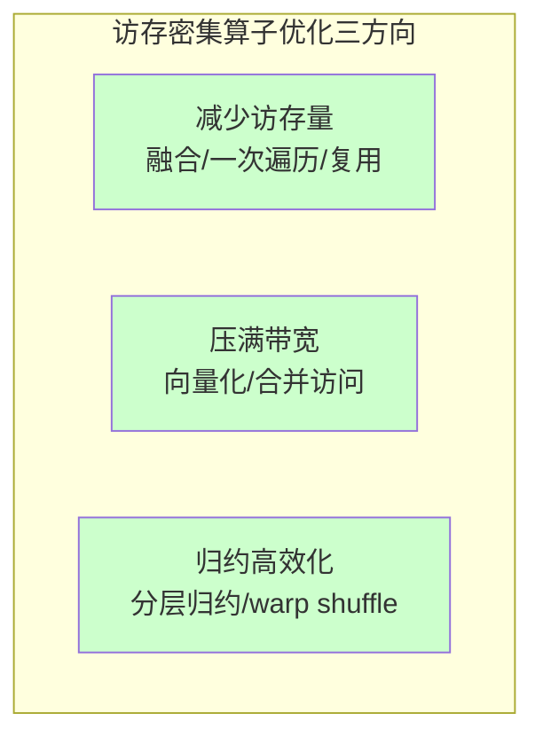
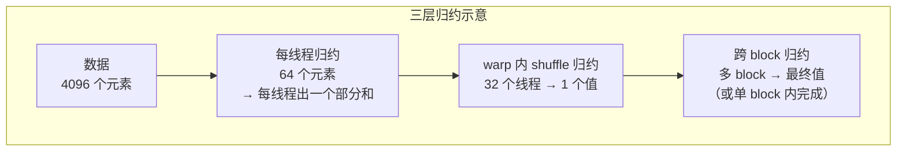

> **算子开发与优化系列 · 第 07 篇 / 共 13 篇**
>
> [06 Attention 案例](/2026/09/03/op-06-case-attention/) ← **本篇** → [08 国产 NPU](/2026/09/03/op-08-domestic-npu/)

**TL;DR**
> * **背景**：GEMM 和 FlashAttention 是"计算密集"的优化代表，但深度学习里还有大量**访存密集**算子——LayerNorm、Softmax、各种 Reduce。这类算子每读一个数据只做 O(1) 次运算，算术强度极低，优化目标和计算密集算子**完全不同**。
> * **核心发现**：访存密集算子的优化只有三个方向：① 减少访存量（融合、一次性遍历）；② 压满带宽（向量化、合并访问）；③ 归约优化（跨线程/跨块归约的分层设计）。LayerNorm 这类算子优化到位后，性能可以提升 **3-10 倍**，而提升几乎全部来自"少读少写"而非"算得快"。
> * **收益**：掌握归约（Reduction）的分层实现方法论和访存密集算子的完整优化套路——这是大模型部署里最常见的一类算子优化需求。
> * **适用人群**：会写简单 elementwise kernel、想系统掌握归约与归一化算子优化的工程师。

---

## 1. 为什么 LayerNorm / Softmax 是访存密集的

### 1.1 数学定义

**LayerNorm**（对一个样本的 $D$ 维特征做归一化）：

$$
\mu = \frac{1}{D}\sum_{i=1}^{D} x_i, \quad \sigma^2 = \frac{1}{D}\sum_{i=1}^{D} (x_i - \mu)^2
$$

$$
y_i = \frac{x_i - \mu}{\sqrt{\sigma^2 + \epsilon}} \cdot \gamma_i + \beta_i
$$

**Softmax**（对一个向量行做归一化）：

$$
p_i = \frac{e^{x_i - \max_j(x_j)}}{\sum_j e^{x_j - \max_j(x_j)}}
$$

### 1.2 算术强度：极低

以 LayerNorm、$D=4096$、FP32 为例：

- 计算量：约 $5 \times 4096$ 次运算（求均值、方差、归一化）
- 访存量：读一次（4096×4B）+ 写一次（4096×4B）= 32KB
- **算术强度**：

$$
I = \frac{5 \times 4096}{2 \times 4096 \times 4} \approx 0.6 \text{ FLOPs/Byte}
$$

对比 GEMM 的 $I \approx 1345$（00 篇口径）、H100 dense FP16 的 ridge point $\approx 148$——**LayerNorm 的算术强度比 ridge point 低约两个数量级（约 240 倍）**，是教科书级的 Memory Bound。

**推论**：对这种算子，**计算优化毫无意义**（算力利用率理论最大只有 0.4%），一切优化只能针对访存。

> 同样的判定流程：算术强度 0.6 << ridge point 148 → Roofline 图上的点落在带宽斜坡段，唯一目标是压满带宽 + 减去多余访存。

---

## 2. 访存密集算子的优化框架



**三个方向的关系**：先减少访存量（收益最大），再压满带宽（保证不浪费），最后优化归约（消除隐藏瓶颈）。下面逐项展开。

---

## 3. 方向一：减少访存量（收益最大）

### 3.1 核心思想

访存密集算子读 1 次算 1 次，**如果能把"读 1 次"变成"读 1 次算 3 次"（融合 3 个算子），访存就省了 2/3**。

### 3.2 融合案例：LayerNorm + 激活 + Dropout

Transformer 块里的典型序列：`LayerNorm → Dropout → 残差相加`。融合后：

```python
# 融合前：3 个 kernel，读 x、y1、y2、residual，写 y1、y2、y3（7 次张量级访问）
y1 = layernorm(x)          # 读x 写y1
y2 = dropout(y1)           # 读y1 写y2
y3 = y2 + residual         # 读y2,residual 写y3

# 融合后：1 个 kernel，读 x、residual，写 y3（3 次）
# 一次遍历完成 layernorm + dropout + 残差
y3 = fused_ln_dropout_add(x, residual, gamma, beta, mask)
```

**收益**：访存量从 7 次张量访问降到 3 次（约 40%），性能提升约 3 倍（实测常见 2.5-3.5x）。

### 3.3 融合案例：Softmax 的"一次遍历"

标准 Softmax 需要两次遍历（先求 max，再求 exp/sum）。**Online Softmax**（06 篇已推导）可以一次遍历完成。

### 3.4 一次遍历统计技巧（Welford 算法）

LayerNorm 需要均值和方差。如果先用"均值 → 再算方差"两步，需要读两遍数据。**Welford 在线算法**可以一遍遍历同时更新均值和方差：

$$
\mu_n = \mu_{n-1} + \frac{x_n - \mu_{n-1}}{n}
$$

$$
M_{2,n} = M_{2, n-1} + (x_n - \mu_{n-1})(x_n - \mu_n)
$$

其中 $M_2 = \sum(x_i - \mu)^2 = \sigma^2 \cdot n$，最终 $\sigma^2 = M_2 / n$。

**收益**：一遍遍历，省一半访存，且数值稳定性更好（避免 $E[x^2] - \mu^2$ 的灾难性抵消）。

---

## 4. 方向二：压满带宽（向量化 + 合并访问）

### 4.1 向量化

访存密集算子的性能上界就是带宽。要达到带宽峰值，必须用最宽的访存指令：

```cuda
// 标量版本：每线程读 4 字节，带宽利用率 ~25%（对 128 字节/事务的总线而言）
__global__ void ln_scalar(float* x, float* y, float* gamma, float* beta, float mean, float var, float eps, int D) {
    int i = threadIdx.x + blockIdx.x * blockDim.x;
    if (i < D) y[i] = (x[i] - mean) * rsqrtf(var + eps) * gamma[i] + beta[i];
}

// 向量化版本：每线程读 16 字节
__global__ void ln_vec4(float4* x, float4* y, float4* gamma, float4* beta, float mean, float var, float eps, int D4) {
    int i = threadIdx.x + blockIdx.x * blockDim.x;
    if (i < D4) {
        float4 xv = x[i], gv = gamma[i], bv = beta[i];
        float rstd = rsqrtf(var + eps);
        y[i] = make_float4(
            (xv.x - mean) * rstd * gv.x + bv.x,
            (xv.y - mean) * rstd * gv.y + bv.y,
            (xv.z - mean) * rstd * gv.z + bv.z,
            (xv.w - mean) * rstd * gv.w + bv.w);
    }
}
```

### 4.2 合并访问

保证 warp 内 32 个线程访问**连续地址**。对 LayerNorm（行内 D 维连续），只要按行划分 block、线程按列索引，天然合并。向量化需要地址 16 字节对齐（起始地址 + 每线程 16B 连续），这也是为什么框架层常常做 padding 到 4 的倍数。

### 4.3 Triton 自动处理

```python
@triton.jit
def layernorm_kernel(x_ptr, y_ptr, gamma_ptr, beta_ptr, D,
                     eps: tl.constexpr, BLOCK: tl.constexpr):
    pid = tl.program_id(0)
    offs = tl.arange(0, BLOCK)
    mask = offs < D

    x = tl.load(x_ptr + pid * D + offs, mask=mask, other=0.0)  # 编译器自动向量化
    mean = tl.sum(x, axis=0) / D
    x_centered = x - mean
    var = tl.sum(x_centered * x_centered, axis=0) / D
    rstd = 1 / tl.sqrt(var + eps)

    gamma = tl.load(gamma_ptr + offs, mask=mask)
    beta = tl.load(beta_ptr + offs, mask=mask)
    y = x_centered * rstd * gamma + beta
    tl.store(y_ptr + pid * D + offs, y, mask=mask)
```

**注意**：Triton 的 `tl.sum(x, axis=0)` 内部就是一张块内归约树，编译器自动生成高效的分组归约，不需要手写 shuffle。

---

## 5. 方向三：归约的分层优化

### 5.1 归约的本质

LayerNorm 的均值和方差、Softmax 的 max 和 sum，本质都是**归约（Reduction）**——把一组数规约成一个标量。

**归约的并行化难点**：结果依赖所有元素，但我们可以用"分治"——每个线程归约部分数据，然后跨线程/跨 block 逐层合并。

### 5.2 分层归约结构



**关键设计决策**：

| 决策点 | 选项 | 取舍 |
|---|---|---|
| 归约在哪一层完成 | 单 block / 多 block | 单 block 简单但限规模；多 block 需要二次 kernel 或原子操作 |
| warp 内归约方式 | `__shfl_down_sync` / 共享内存 | shuffle 无共享内存开销，更快 |
| 是否用向量化 | float4 一次载入 | 减少归约指令数 |

### 5.3 Warp Shuffle 归约（核心技巧）

```cuda
// 32 线程的 warp 内归约：log2(32)=5 步
__device__ float warp_reduce_sum(float val) {
    for (int offset = 16; offset > 0; offset >>= 1) {
        val += __shfl_down_sync(0xffffffff, val, offset);
    }
    return val;  // 0 号线程持有完整和
}
```

**原理**：`__shfl_down_sync` 让线程 $i$ 读取线程 $i+offset$ 的寄存器值，5 步完成 32 个值的归约——**全程寄存器操作，零共享内存开销**。

**扩展到跨 warp**：每个 warp 出一个部分和（写到共享内存），再用第一个 warp 把这几个值归约完。两步合起来就是完整的"分层归约"。

### 5.4 完整归约示例：单 block 求 LayerNorm 统计量

```cuda
// 假设一个 block 处理一行（D=4096），128 线程
// 每个线程先归约 32 个元素，再 warp shuffle + 共享内存跨 warp 归约
__global__ void layernorm_stats(const float* x, float* y,
                                const float* gamma, const float* beta,
                                int D, float eps) {
    extern __shared__ float smem[];
    float* s_mean = smem;          // 跨 warp 归约用
    float* s_var = smem + blockDim.x / 32;

    int tid = threadIdx.x;
    // 每线程归约 D/blockDim.x 个元素（这里 32 个）
    float sum = 0.0f, sum_sq = 0.0f;
    for (int i = tid; i < D; i += blockDim.x) {
        float v = x[blockIdx.x * D + i];
        sum += v;
        sum_sq += v * v;
    }

    // warp 内归约
    sum = warp_reduce_sum(sum);
    sum_sq = warp_reduce_sum(sum_sq);

    // 跨 warp 归约（通过共享内存）
    int warp = tid / 32;
    if ((tid % 32) == 0) {
        s_mean[warp] = sum;
        s_var[warp] = sum_sq;
    }
    __syncthreads();

    // 第一个 warp 完成最终归约
    if (warp == 0) {
        if (tid < blockDim.x / 32) {
            sum = s_mean[tid];
            sum_sq = s_var[tid];
        } else {
            sum = 0; sum_sq = 0;
        }
        sum = warp_reduce_sum(sum);
        sum_sq = warp_reduce_sum(sum_sq);
        if (tid == 0) {
            float mean = sum / D;
            float var = sum_sq / D - mean * mean;  // 注意：大 D 时建议 Welford
            s_mean[0] = mean;
            s_var[0] = var;
        }
    }
    __syncthreads();

    // 归一化并写回
    float mean = s_mean[0], var = s_var[0];
    float rstd = rsqrtf(var + eps);
    for (int i = tid; i < D; i += blockDim.x) {
        int idx = blockIdx.x * D + i;
        y[idx] = (x[idx] - mean) * rstd * gamma[i] + beta[i];
    }
}
```

**注意**：这里用了 $E[x^2] - E[x]^2$ 求方差，大 D 时数值可能不稳定——这正是 3.4 节 Welford 算法的用武之地。生产实现建议用 Welford。

---

## 6. 综合案例：LayerNorm 的完整优化路径

把三个方向串起来，LayerNorm 的优化路径是：

| 步骤 | 手段 | 预估收益 |
|---|---|---|
| 基线 | 朴素两层 kernel | 100% |
| +1 | 单 kernel 一次遍历（Welford） | -50% 访存 |
| +2 | 向量化 float4 | 带宽 50%→90% |
| +3 | warp shuffle 归约 | 减少共享内存开销 |
| +4 | 融合下游算子（残差/激活） | 再省 30-50% 访存 |

**实测参考**：LayerNorm 优化到位后，带宽利用率可达 85-95% 峰值，延迟对比 PyTorch 默认实现快 2-4 倍。

> 这个 +1 → +4 的路径与 05 篇 GEMM 金字塔是**同一套方法论**：先定瓶颈（Roofline）→ 减访存 → 压带宽 → 叠优化。区别只是对的算力/带宽分配不同。

---

## 7. Triton 版本的 LayerNorm（生产可用）

```python
@triton.jit
def _layer_norm_fwd_fused(
    X, Y, W, B, Mean, Rstd,
    stride, N, eps,
    BLOCK_SIZE: tl.constexpr,
):
    row = tl.program_id(0)
    cols = tl.arange(0, BLOCK_SIZE)
    mask = cols < N
    x = tl.load(X + row * stride + cols, mask=mask, other=0.0).to(tl.float32)
    mean = tl.sum(x, axis=0) / N
    xbar = tl.where(mask, x - mean, 0.0)
    var = tl.sum(xbar * xbar, axis=0) / N
    rstd = 1 / tl.sqrt(var + eps)
    tl.store(Mean + row, mean)
    tl.store(Rstd + row, rstd)
    w = tl.load(W + cols, mask=mask, other=1.0).to(tl.float32)
    b = tl.load(B + cols, mask=mask, other=0.0).to(tl.float32)
    y = xbar * rstd * w + b
    tl.store(Y + row * stride + cols, y, mask=mask)
```

**生产注意事项**：
- `BLOCK_SIZE` 必须 ≥ N 且为 2 的幂（否则扩 N 到下一个 2 的幂）
- 单 block 处理一行，行数 = grid 大小
- N 极大（> 单 block 能处理）时需要 split-K 或跨 block 归约

---

## 8. Lab Exercises

### Exercise 1：实现并对比 LayerNorm

实现 Triton LayerNorm，与 `torch.nn.functional.layer_norm` 对比：
- 正确性（max 误差 < 1e-5）
- 性能（用 `do_bench`，对比不同 N：256/1024/4096/16384）
- 观察 N 增大时性能变化，分析原因

### Exercise 2：验证"减少访存"的收益

实现三个版本并对比带宽利用率（用 ncu）：
- v1：朴素两遍（先求均值方差，再归一化）—— 读两次
- v2：一遍遍历（Welford）—— 读一次
- v3：v2 + 融合 ReLU —— 一次读写完成

**预期**：v3 带宽利用率和端到端延迟都是最优。

### Exercise 3：Warp Shuffle 归约动手

实现 `warp_reduce_sum`，与共享内存归约对比：
- 用 ncu 观察 `Shared Memory Throughput`（shuffle 版为 0）
- 对比延迟差异

### Exercise 4：Softmax 的 Online 版 vs 标准版

对一个大行（N=16384）：
- 标准 Softmax：两遍遍历
- Online Softmax：一遍遍历
- 对比访存指令数和延迟

---

## 9. 参考资料

1. NVIDIA. *CUDA 归约教程（Reduction）*. [NVIDIA Developer Blog](https://developer.nvidia.com/gpugems/gpugems3/part-vi-gpu-computing/chapter-39-parallel-prefix-sum-scan-cuda)
2. Harris. *Optimizing Parallel Reduction in CUDA*. [NVIDIA Developer Blog](https://developer.nvidia.com/blog/faster-parallel-reductions-cuda/)
3. Welford. *Note on a Method for Calculating Corrected Sums of Squares and Products*. [Technometrics 1962](https://www.tandfonline.com/doi/abs/10.1080/00401706.1962.10490022)
4. Triton 官方 LayerNorm 示例. [triton-lang.org](https://triton-lang.org/main/getting-started/tutorials/05-layer-norm.html)
5. NVIDIA. *CUDA C++ Best Practices — Reduction*.

---

*上一篇：[06 Attention 案例](/2026/09/03/op-06-case-attention/)*
*下一篇：[08 国产 NPU](/2026/09/03/op-08-domestic-npu/) —— 昇腾 Ascend C 算子开发。*