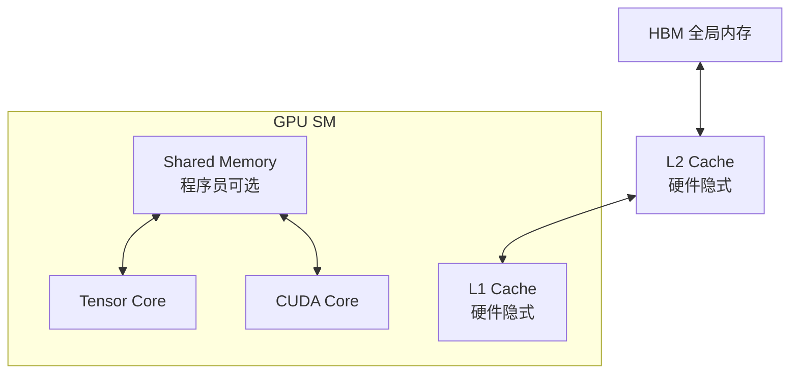
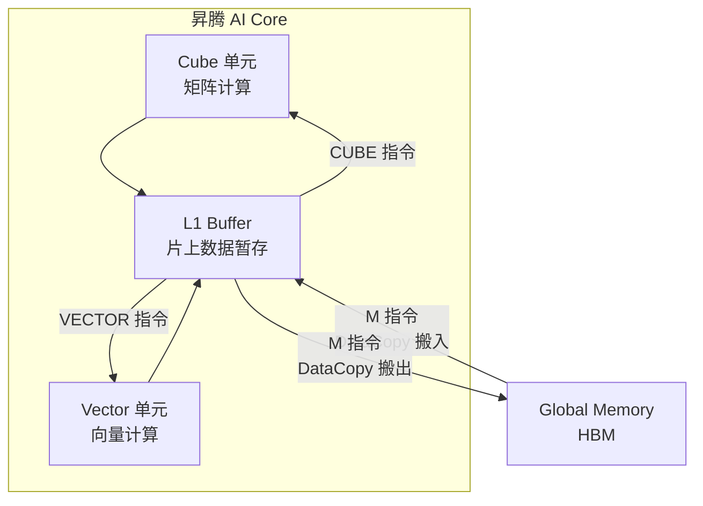
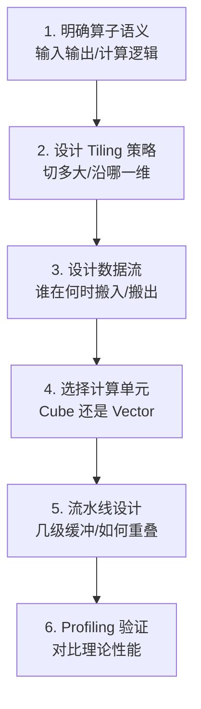

> **算子开发与优化系列 · 第 08 篇 / 共 13 篇**
>
> [07 归约案例](/2026/09/03/op-07-case-normalization/) ← **本篇** → [09 编译器集成](/2026/09/03/op-09-compiler-integration/)

**TL;DR**
> * **背景**：国产化替代是当前 AI Infra 的主旋律，昇腾（华为）是国产 AI 芯片中生态最完整的选择之一。对算子工程师而言，从 CUDA 迁移到昇腾的**核心挑战不是语法，而是思维模型**——昇腾的"显式数据搬运 + Cube/Vector 分离"与 CUDA 的"SIMT + 隐式缓存"是两种完全不同的心智模型。
> * **核心发现**：Ascend C 的编程范式可以概括为"数据流编程"——Global Memory 与片上 Buffer 之间的数据搬运（M 指令）完全显式，计算单元（Cube/Vector）只吃片上数据。理解这条流水线，就理解了 80% 的昇腾算子开发。同时，之前学到的优化方法论（Roofline、Tiling、双缓冲、流水线）**全部通用**，只是换了一套表达。
> * **收益**：掌握昇腾算子开发的完整心智模型与实操步骤，能把已有的 CUDA/Triton 优化经验快速迁移到国产平台。
> * **适用人群**：有 CUDA 经验、面临国产化迁移需求、或想了解国产 NPU 算子开发全貌的工程师。

---

## 1. 为什么说昇腾的挑战是"思维模型"而非语法

### 1.1 架构差异一览

先看两张架构图，感受差异：

**NVIDIA GPU**（SIMT + 分层缓存，程序员面向线程编程）：



**昇腾 AI Core**（Cube/Vector 分离 + 显式数据流，程序员面向数据流编程）：



### 1.2 核心差异总结

| 维度 | NVIDIA CUDA | 昇腾 Ascend C |
|---|---|---|
| 编程视角 | 线程（每个线程做什么） | 数据流（数据怎么流动） |
| 缓存 | 硬件隐式管理（L1/L2） | **程序员显式管理**（M 指令搬运） |
| 计算单元 | 统一 SIMT（TC/CC 均可调度） | **Cube/Vector 分离**，指令分工 |
| 并行层级 | Grid-Block-Warp-Thread | **流水线并行**（搬入-计算-搬出） |
| 同步 | `__syncthreads()` | **队列机制**（EnQue/DeQue） |
| 优化核心 | 占用率 + 访存合并 | **流水线深度 + 搬运调度** |

**最反直觉的一点**：昇腾没有"隐式缓存"概念。你想用的数据必须**显式搬进**片上 Buffer，用完再搬出去。这让编程变繁琐，但也给了程序员对数据流**完全的控制权**——这也是为什么昇腾的流水线优化如此重要。

---

## 2. Ascend C 编程模型深入

### 2.1 核心抽象

| 抽象 | 含义 | 对应 CUDA 概念 |
|---|---|---|
| `GlobalTensor` | 全局内存张量视图 | 全局内存指针 |
| `LocalTensor` | 片上 Buffer（L1/UB）张量视图 | 共享内存 + 寄存器 |
| `TPipe` | 流水线管理器 | block 生命周期 |
| `TQue<POS, NUM>` | 数据队列（生产者-消费者） | 无直接对应 |
| `DataCopy` | 显式数据搬运（GM↔片上） | `__ldg` + 手动管理 |
| `EnQue/DeQue` | 队列同步原语 | `__syncthreads` + 手动同步 |

### 2.2 完整的 GEMM 实例（昇腾）

昇腾上 GEMM 必须走 Cube 单元。一个基础版：

```cpp
#include "kernel_operator.h"
using namespace AscendC;

constexpr int32_t BM = 64;   // 输出 tile 行
constexpr int32_t BN = 64;   // 输出 tile 列
constexpr int32_t BK = 64;   // K 维分块
constexpr int32_t BUFFER_NUM = 2;  // 双缓冲

class KernelGemm {
public:
    __aicore__ inline KernelGemm(GM_ADDR a, GM_ADDR b, GM_ADDR c,
                                 int32_t M, int32_t N, int32_t K)
        : aGmAddr(a), bGmAddr(b), cGmAddr(c), M(M), N(N), K(K) {}

    __aicore__ inline void Init() {
        aGm.SetGlobalBuffer((__gm__ half*)aGmAddr, M * K);
        bGm.SetGlobalBuffer((__gm__ half*)bGmAddr, K * N);
        cGm.SetGlobalBuffer((__gm__ float*)cGmAddr, M * N);

        pipe.InitBuffer(inQueueA, BUFFER_NUM, BM * BK * sizeof(half));
        pipe.InitBuffer(inQueueB, BUFFER_NUM, BK * BN * sizeof(half));
        pipe.InitBuffer(outQueue, BUFFER_NUM, BM * BN * sizeof(float));
    }

    __aicore__ inline void Process() {
        // 简化版：每个 AI Core 处理一个 [BM x BN] 输出 tile，
        // tile 坐标由 blockIdx（AI Core 编号）映射而来；生产代码通常由 tiling 数据下发
        int32_t tileN = GetBlockIdx() % (N / BN);
        int32_t tileM = GetBlockIdx() / (N / BN);
        // 外层循环：遍历 K 维，每次处理 BK（省略了末尾余数处理）
        for (int32_t k = 0; k < K; k += BK) {
            CopyIn(tileM, tileN, k);
            Compute();
            CopyOut(tileM, tileN);
        }
    }

private:
    __aicore__ inline void CopyIn(int32_t tileM, int32_t tileN, int32_t k) {
        LocalTensor<half> aLocal = inQueueA.AllocTensor<half>();
        LocalTensor<half> bLocal = inQueueB.AllocTensor<half>();
        // 搬运 A 的 [BM x BK] 块 和 B 的 [BK x BN] 块 到片上
        // 注：GM 中的二维 tile 跨行不连续，真实实现需用 DataCopyParams 指定行跨步，
        // 此处为便于理解简化为按首地址搬运
        DataCopy(aLocal, aGm[tileM * BM * K + k], BM * BK);
        DataCopy(bLocal, bGm[k * N + tileN * BN], BK * BN);
        inQueueA.EnQue(aLocal);
        inQueueB.EnQue(bLocal);
    }

    __aicore__ inline void Compute() {
        LocalTensor<half> aLocal = inQueueA.DeQue<half>();
        LocalTensor<half> bLocal = inQueueB.DeQue<half>();
        LocalTensor<float> cLocal = outQueue.AllocTensor<float>();
        // Cube 单元：C[BM x BN] = A[BM x BK] * B[BK x BN]
        Mmad(cLocal, aLocal, bLocal, BM, BN, BK);  // 矩阵乘指令
        inQueueA.FreeTensor(aLocal);
        inQueueB.FreeTensor(bLocal);
        outQueue.EnQue(cLocal);
    }

    __aicore__ inline void CopyOut(int32_t tileM, int32_t tileN) {
        LocalTensor<float> cLocal = outQueue.DeQue<float>();
        DataCopy(cGm[tileM * BM * N + tileN * BN], cLocal, BM * BN);
        outQueue.FreeTensor(cLocal);
    }

private:
    GM_ADDR aGmAddr, bGmAddr, cGmAddr;
    GlobalTensor<half> aGm, bGm;
    GlobalTensor<float> cGm;
    TPipe pipe;
    TQue<QuePosition::A, BUFFER_NUM> inQueueA;   // A 矩阵输入队列
    TQue<QuePosition::B, BUFFER_NUM> inQueueB;   // B 矩阵输入队列
    TQue<QuePosition::COUT, BUFFER_NUM> outQueue; // C 输出队列
    int32_t M, N, K;
};

extern "C" __global__ __aicore__ void gemm_kernel(GM_ADDR a, GM_ADDR b,
                                                  GM_ADDR c, GM_ADDR workspace) {
    GET_TILING_DATA(tilingData, workspace);
    KernelGemm op(a, b, c, tilingData.M, tilingData.N, tilingData.K);
    op.Init();
    op.Process();
}
```

**关键观察**：
- `Mmad` 是 Cube 单元的矩阵乘指令，一次算 `BM×BN×BK` 的乘加
- 数据流完全显式：`DataCopy 搬入 → Mmad 计算 → DataCopy 搬出`
- `EnQue/DeQue` 让 `CopyIn` 和 `Compute` 自动流水（双缓冲）

### 2.3 与 Triton 版 GEMM 的对比

| 关注点 | Triton 版 | Ascend C 版 |
|---|---|---|
| 数据搬运 | 编译器隐式 | **程序员显式 DataCopy** |
| 流水线 | 编译器自动 pipelining | **程序员用 BUFFER_NUM 控制** |
| 同步 | 编译器处理 | **程序员用队列管理** |
| 代码量 | ~30 行 | ~80 行 |
| 控制粒度 | 低（编译器决定） | **高（完全掌控）** |

---

## 3. 从 CUDA 迁移到昇腾的思维转换

### 3.1 六步迁移心法



### 3.2 各步骤的核心决策

| 步骤 | 关键问题 | 建议 |
|---|---|---|
| Tiling | tile 多大能填满 Cube 单元 | 与 Cube 的 MMA 尺寸对齐（如 16 的倍数） |
| 数据流 | 搬运是否与计算重叠 | 用双缓冲/多缓冲队列 |
| 计算单元 | 该用 Cube 还是 Vector | 矩阵运算→Cube；逐元素→Vector；Reduce→Vector |
| 流水线 | 搬运时间能否被计算掩盖 | 增大 BUFFER_NUM，但注意片上容量 |
| 验证 | 是否逼近 Roofline | 用昇腾 profiler（如 msprof）看 Cube/Vector/搬运利用率 |

### 3.3 常见迁移陷阱

| 陷阱 | 说明 | 规避 |
|---|---|---|
| **照搬 CUDA 线程映射** | CUDA 的线程索引思维在昇腾不适用 | 以数据块为单位思考，而非线程 |
| **忽略数据对齐** | DataCopy 有对齐要求 | 保证 tile 尺寸和地址对齐（通常 32B） |
| **同步位置错误** | 队列 DeQue 前数据未就绪 | 严格遵循 EnQue/DeQue 配对 |
| **单缓冲当双缓冲用** | BUFFER_NUM=1 无流水 | 用 BUFFER_NUM≥2 实现搬运/计算重叠 |
| **Cube/Vector 混用无规划** | 需要 Cube 输出喂 Vector 输入 | 通过队列衔接，注意同步 |

---

## 4. 昇腾性能优化：从方法论到实践

### 4.1 优化目标重述

Roofline 模型在昇腾依然适用，只是把"峰值算力"换成 Cube 单元的峰值、"带宽"换成 GM↔片上 的搬运带宽。

**昇腾优化三板斧**：

1. **最大化 Cube/Vector 利用率**：让计算单元永远在忙（流水线要深、搬运要快）
2. **最小化搬运时间**：数据一次搬入多用，避免重复搬运
3. **保持流水线满载**：BUFFER_NUM 合理、tile 大小匹配片上容量

### 4.2 双缓冲的收益量化

```
单缓冲：搬运(T_mem) 和 计算(T_calc) 串行 → 总时间 = N × (T_mem + T_calc)
双缓冲：搬运和计算重叠 → 总时间 ≈ N × max(T_mem, T_calc)（理想情况）
```

如果 $T_{mem} \approx T_{calc}$，双缓冲能让总时间几乎减半——这就是为什么 BUFFER_NUM=2 是标配。

### 4.3 昇腾 profiling 要点

昇腾的 profiler（`msprof` / CANN 自带工具）关键指标：

| 指标 | 含义 | 优化方向 |
|---|---|---|
| Cube 利用率 | Cube 单元忙占比 | 低则 Tiling/流水线不足 |
| Vector 利用率 | Vector 单元忙占比 | 低则搬运瓶颈 |
| MTE（搬运引擎）利用率 | 数据搬运忙占比 | 高则计算可能饿死 |
| 流水线气泡 | 计算等待数据的时间 | 加深缓冲/提前预取 |

---

## 5. 其他国产 NPU 的横向比较

| 芯片 | 厂商 | 编程模型 | 与 CUDA 相似度 | 生态 |
|---|---|---|---|---|
| 昇腾 910B/910C | 华为 | Ascend C（显式数据流） | 中 | CANN，最完整 |
| 寒武纪 思元 | 寒武纪 | Cambricon BANG C | 中 | NeuWare |
| 海光 DCU | 海光 | ROCm 兼容（类 CUDA） | **高** | ROCm，迁移成本最低 |
| 沐曦 MXC | 沐曦 | CUDA 兼容层 | 高 | 兼容 CUDA 生态 |

**选型启示**：
- 海光/沐曦因为兼容 CUDA/ROCm，**迁移成本最低**（代码改动小）
- 昇腾因为架构最特殊，**学习成本最高但国产化最彻底**
- 无论选哪个，**底层优化方法论（Roofline/Tiling/流水线）全部通用**

---

## 6. Lab Exercises

### Exercise 1：纸面推演一个 LayerNorm 的昇腾实现

不写代码，用纸面完成：
1. 画出 LayerNorm 在昇腾的数据流（GM → 片上 → Vector → GM）
2. 标注归约（均值/方差）在哪一步、用什么单元
3. 设计双缓冲的排布（搬运什么、计算什么、何时重叠）

**这是训练"数据流思维"最好的练习——昇腾开发的核心能力。**

### Exercise 2：对比数据流图

把 05 篇的 Triton GEMM 与本文的 Ascend C GEMM 画成数据流图，对比：
- 哪些环节是编译器自动处理的（Triton）
- 哪些环节必须程序员显式处理（Ascend C）
- 各自的"自由度"在哪里

### Exercise 3：CUDA 与 Ascend C 的逐行对照

把 02 篇的 CUDA 向量加法与 Ascend C 版逐行对照，标注：
- 每一行 CUDA 对应 Ascend C 的什么
- 哪些 CUDA 概念在昇腾没有对应（如 `__syncthreads`）
- 写出你自己的"CUDA→Ascend C"概念对照表

### Exercise 4（如有昇腾环境）：跑通 vector add 样例

按照 [昇腾官方 Kernel 开发指南](https://www.hiascend.com/) 的样例，跑通向量加法算子，用 profiler 观察：
- Cube/Vector/MTE 利用率
- 流水线是否满载
- 双缓冲 vs 单缓冲的差异

---

## 7. 参考资料

1. 华为昇腾. *Ascend C 编程语言*. [昇腾社区](https://www.hiascend.com/document)
2. 华为昇腾. *CANN 算子开发指南*. [昇腾社区](https://www.hiascend.com/)
3. 华为. *昇腾 910 处理器技术白皮书*.
4. 知乎. *昇腾算子开发入门与避坑*. [知乎专栏](https://zhuanlan.zhihu.com/p/663186882)
5. NVIDIA. *CUDA C++ Programming Guide*（对照迁移参考）.

---

*上一篇：[07 归约案例](/2026/09/03/op-07-case-normalization/)*
*下一篇：[09 编译器集成](/2026/09/03/op-09-compiler-integration/) —— 手写 Kernel 与 torch.compile / MLIR 协同。*