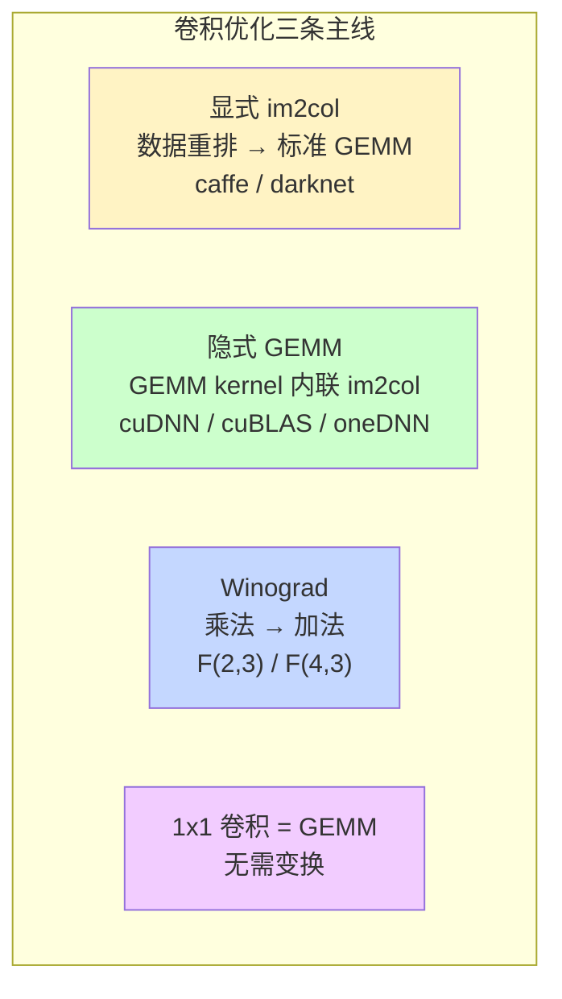
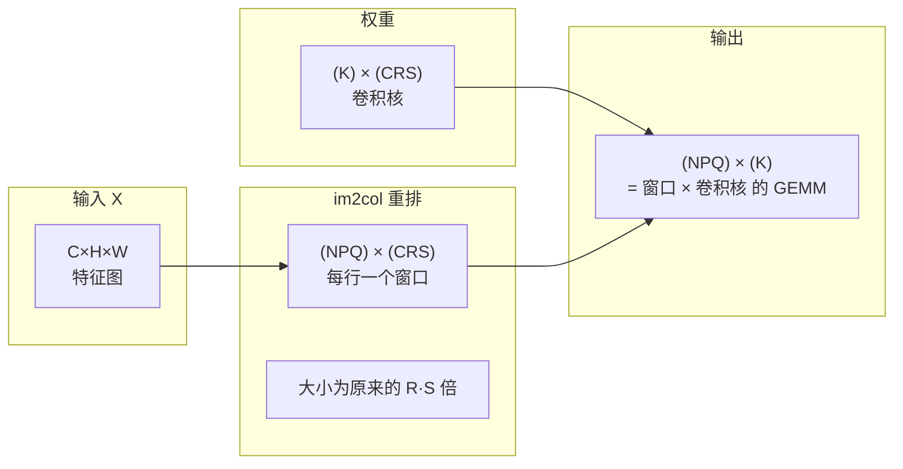

> **算子开发与优化系列 · 第 09 篇 / 共 14 篇**
>
> [08 归约案例](/2026/09/03/op-08-case-normalization/) ← **本篇** → [10 超越函数](/2026/09/03/op-10-transcendental-math/)
>
> **模块定位**：卷积是"案例实战"模块（06-10）的第四站——GEMM（06）、FlashAttention（07）、归约/归一化（08）、卷积（09）、超越函数（10）。方法与同模块的案例篇完全同源——Roofline 定瓶颈、逐级优化逼近上界。

**TL;DR**
> * **背景**：GEMM、FlashAttention 是 LLM 的主战场，但**卷积仍然是 CV 时代的绝对主角**——ResNet、ViT 的 patch embedding、以及一切下游 CV 算子都绕不开它。卷积优化流派众多，是算子工程师面试和实战的"必修课"。
> * **核心发现**：卷积优化的**三条主线**：① 显式变换（im2col，把卷积变成 GEMM，简单但费显存）；② 隐式 GEMM（不落地的 im2col，cuDNN/cuBLAS 背后的主流）；③ Winograd（把乘法换成加法，降低乘法复杂度，但数值稳定性差）。再加上 1x1 卷积 = GEMM 这个特例，几乎覆盖所有生产路径。
> * **收益**：掌握"把一个算子重写成 GEMM"的通用方法论，理解 cuDNN 启发式选择算法背后的物理直觉，能针对具体 shape 判断该走哪条路线。
> * **适用人群**：会写 GEMM kernel（06 篇基础）、想理解卷积为什么有这么多算法、以及想系统掌握 CV 算子优化的工程师。

---

## 1. 卷积的定义、计算量与算术强度

### 1.1 数学定义

对输入特征图 $X \in \mathbb{R}^{N \times C \times H \times W}$、卷积核 $W \in \mathbb{R}^{K \times C \times R \times S}$，输出 $Y \in \mathbb{R}^{N \times K \times P \times Q}$：

$$
Y_{n,k,p,q} = \sum_{c=1}^{C} \sum_{r=1}^{R} \sum_{s=1}^{S} X_{n,c,\, p\cdot s_h + r \cdot s_w',\, q \cdot s_w + s} \cdot W_{k,c,r,s} + b_k
$$

其中 $s_h, s_w$ 为 stride（步长），$s_h', s_w'$ 为考虑 padding 后的输入映射。为简洁，以下默认 stride=1、padding 合适使输出尺寸不变（same），并忽略 bias。

### 1.2 计算量与算术强度

- **计算量**：$W_{conv} = 2 \times N \times K \times P \times Q \times C \times R \times S$ FLOPs
- **访存量**：读一次输入 $N \times C \times H \times W$ + 读一次卷积核 $K \times C \times R \times S$ + 写一次输出 $N \times K \times P \times Q$（FP16 每元素 2 字节）

以 ResNet-50 第一个卷积层为例：$N=1, C=3, H=W=224, K=64, R=S=7, stride=2, P=Q=112$：

$$
I = \frac{2 \times 1 \times 64 \times 112^2 \times 3 \times 7^2}{2 \times (1 \times 3 \times 224^2 + 64 \times 3 \times 7^2 + 1 \times 64 \times 112^2)} \approx \frac{5.28 \times 10^8}{2 \times 1.95 \times 10^6} \approx 135 \text{ FLOPs/Byte}
$$

对比 H100 dense FP16 的 ridge point（$\sim148$）——**这个卷积层刚好卡在 ridge point 附近**：既不算严格计算密集也不算纯访存密集。这就是卷积优化的第一个难点：**同一算子在不同 shape 下，瓶颈属性完全不同**。

> **关键洞察**：卷积的算术强度随下采样（stride）和通道数变化剧烈。深层卷积（C、K 都大）通常计算密集；浅层卷积（如 ResNet stem，C=3）往往访存密集。**优化前必须先做 Roofline 定位**——这正是 04 篇方法论在卷积上的第一次应用。

---

## 2. 卷积优化三路线的全景对比



**三路线的关系**：

| 路线 | 核心思想 | 优点 | 缺点 | 代表实现 |
|---|---|---|---|---|
| 显式 im2col | 把输入重排成列矩阵，直接调用 GEMM | 实现简单、复 用成熟 GEMM | 重排开销大、显存爆炸（放大 $R\times S$ 倍） | Caffe、Darknet |
| **隐式 GEMM** | GEMM kernel 的访存阶段在线完成 im2col 变换 | 无重排开销、显存 O(1) | kernel 复杂、需专门的 tile 设计 | **cuDNN (implicit_gemm)、cuBLAS** |
| Winograd | 用变换域把乘法换加法 | 乘法数减少 2.25/4 倍 | 数值误差大、变换开销随核增大 | cuDNN (winograd)、oneDNN |
| 1x1 卷积 | 退化为标准 GEMM | 零变换开销 | 仅适用于 $R=S=1$ | 任何 GEMM |

下面逐条展开。

---

## 3. 路线一：显式 im2col（把卷积变成 GEMM）

### 3.1 原理

卷积对每个输出位置进行的操作，本质是"输入上的一个 $C \times R \times S$ 窗口"与卷积核做**内积**——和 GEMM 中"逐元素乘加"结构一致。

**im2col 的变换**：把每个窗口（共 $N \times P \times Q$ 个）拉平成一行 $C \cdot R \cdot S$，拼成一个大矩阵 $X_{col} \in \mathbb{R}^{(N \cdot P \cdot Q) \times (C \cdot R \cdot S)}$：



然后 $Y = X_{col} \cdot W_{2D}^\top$（把卷积核也拉平成 $K \times (CRS)$ 矩阵）——**一个标准 GEMM**。

### 3.2 示例代码

```python
# 显式 im2col + GEMM（验证用，非高性能实现）
def conv2d_im2col(x, w, stride=1, padding=0):
    N, C, H, W = x.shape
    K, C, R, S = w.shape
    Ho = (H + 2 * padding - R) // stride + 1
    Wo = (W + 2 * padding - S) // stride + 1

    x_pad = torch.nn.functional.pad(x, (padding,) * 4)
    # 收集所有窗口 → (N, Ho, Wo, C*R*S)
    cols = torch.empty(N, Ho, Wo, C * R * S, dtype=x.dtype)
    for i in range(R):
        for j in range(S):
            cols[..., i * S + j] = x_pad[:, :, i:i + Ho * stride:stride,
                                         j:j + Wo * stride:stride].reshape(N, Ho, Wo, -1)
    # 展开成 (N*Ho*Wo, C*R*S)，做 GEMM
    cols = cols.reshape(N * Ho * Wo, -1)
    w_2d = w.reshape(K, -1).t()                 # (C*R*S, K)
    out = cols @ w_2d                           # (N*Ho*Wo, K)
    return out.reshape(N, Ho, Wo, K).permute(0, 3, 1, 2)
```

### 3.3 致命缺点

- **显存爆炸**：$X_{col}$ 的尺寸是输入的 $R \times S$ 倍。7x7 卷积 → **49 倍放大**。ResNet stem（$224^2 \times 3$）的 im2col 矩阵就有 $22400 \times 147$ 个元素 ≈ 3.3M × 4B ≈ 13MB——单样本，而组内还有 3 通道的原图。
- **重排开销**：数据先写出来再读进 GEMM，多一轮显存往返。
- **结论**：**只能用于小核（1x1、3x3）或教学/验证**，生产几乎不用显式 im2col。

> 这也是"为什么不能真的把卷积变成 GEMM"的原因——变换本身可能比计算还贵。正确做法是把变换**内联进 GEMM kernel**（下一节），这就是"隐式"的含义。

---

## 4. 路线二：隐式 GEMM（生产主流）

### 4.1 核心思想

**不显式生成 $X_{col}$，而是在 GEMM kernel 的每个 tile 需要某一列的窗口数据时，直接从原图按 im2col 的索引规则在线取出**。

标准 GEMM 的 kernel（06 篇的 tiling 结构）：

```
每个 CTA 计算 C_tile[M_tile × N_tile]：
  for k in range(0, K, K_tile):
    加载 A_tile[M_tile × K_tile]（共享内存）
    加载 B_tile[K_tile × N_tile]（共享内存）
    做矩阵乘并累加
```

隐式 GEMM 只改一处：**加载阶段**。A/B 不再是连续内存，而是"按 im2col 索引从原图取窗口"：

```cuda
// 伪代码：隐式 GEMM 的 A 矩阵加载（简化）
// A 的"行"= 输出位置 (n, p, q)，A 的"列"= (c, r, s)
// A[row][col] = X[n][c][p*sh + r][q*sw + s]
__device__ float load_implicit_A(const float* X,
                                 int n, int p, int q,
                                 int c, int r, int s,
                                 int C, int H, int W, int R, int S) {
    int oh = p * sh + r;   // 输入高度索引
    int ow = q * sw + s;   // 输入宽度索引
    return X[((n * C + c) * H + oh) * W + ow];
}
```

**B 矩阵**（卷积核）本身连续，正常加载。于是 GEMM 的整个 tiling/流水线/向量化全部复用，只把"A 的加载"换成一个带索引计算的访存函数。

### 4.2 为什么隐式 GEMM 能赢

| 维度 | 显式 im2col | 隐式 GEMM |
|---|---|---|
| 额外显存 | $\times R \cdot S$ | $O(1)$（只需 tile 大小） |
| 访存次数 | 输入读多遍（重排写 + GEMM 读） | 每元素基本只读一次（L2 命中） |
| 实现复杂度 | 简单 | 中（索引计算 & 边界处理） |
| 复用 GEMM 优化 | 完全复用 | 复用 + 需调整 tile 形状 |

**关键点**：隐式 GEMM 的访存虽然索引复杂，但**同一输入元素会被多个输出位置复用**（感受野重叠），配合共享内存 tile + L2 cache，实际访存接近"每个输入元素只读一次"——比显式 im2col 少了一大轮重排写读。

### 4.3 显存对比（1x1 vs 3x3 vs 7x7）

| 核尺寸 | 输入（GB）| 显式 im2col（GB）| 隐式 GEMM 额外显存 |
|---|---|---|---|
| 1x1 | 1 | 1（无放大） | 0 |
| 3x3 | 1 | **9** | ~0 |
| 7x7 | 1 | **49** | ~0 |

这解释了为什么 cuDNN 默认路径是 implicit_precomp_gemm，而不是把 im2col 落地的旧实现。

### 4.4 一个数学等价性细节

隐式 GEMM 的 $A_{row}$（窗口展开）是**共享行**：相邻输出位置 $(p,q)$ 与 $(p,q+1)$ 的窗口有 $S-1$ 列重叠。这个重叠在 GEMM 里体现为 A 矩阵的相邻行高度相关——**不是缺点**，反而让共享内存加载有天然复用。

---

## 5. 路线三：Winograd（乘法换加法）

### 5.1 1D 直觉：F(2, 3)

Winograd 的出发点是：**做两个点、用三阶核的 1D 卷积，能否少做乘法？**

朴素做法：输出 2 点 × 核长 3，需要 $2 \times 3 = 6$ 次乘法。

Winograd F(2,3) 用 4 次乘法完成（对 $d_0, d_1, d_2, d_3$ 与 $g_0, g_1, g_2$）：

$$
m_1 = (d_0 - d_2) g_0, \quad
m_2 = (d_1 + d_2) \frac{g_0 + g_1 + g_2}{2}, \quad
m_3 = (d_2 - d_1) \frac{g_0 - g_1 + g_2}{2}, \quad
m_4 = (d_1 - d_3) g_2
$$

$$
y_0 = m_1 + m_2 + m_3, \quad y_1 = m_2 - m_3 - m_4
$$

乘法数：$6 \rightarrow 4$，**乘法降低 1.5 倍**。代价：输入输出要经过**变换矩阵**（加法和常数乘法），且 $g$ 的系数里有 $\div 2$（数值精度损失的开端）。

### 5.2 2D：F(2×2, 3×3) 降低 2.25 倍

2D Winograd 通过**可分离性**把 1D 变换张量积起来：$F(2\times2, 3\times3)$ 的乘法数从 $4 \times 9 = 36$ 降到 $4 \times 4 = 16$，**降低 2.25 倍**。

$$
Y = A^\top \left[ (G\,g\,G^\top) \odot (B^\top d\,B) \right] A
$$

其中 $G, B, A$ 分别是卷积核、输入、输出的变换矩阵（都是小常数矩阵），$\odot$ 是逐元素乘（这是唯一做乘法的部分）。

### 5.3 计算量对比（3x3, same padding）

| 算法 | 每输出点乘法数 | 相对乘法 | 需要额外变换 |
|---|---|---|---|
| 直接卷积 | $C \cdot 9$ | 1x | 无 |
| F(2,3) Winograd | $C \cdot 4$ | **0.44x** | 是 |
| F(4,3) Winograd | $C \cdot 2.56$ | **0.28x** | 是（变换更复杂） |
| 直接 GEMM（im2col） | $C \cdot 9$ | 1x | 是（重排） |

**Winograd 是唯一在"每点计算量"层面就能省乘法的路线**——对计算密集的 3x3 卷积，这是把乘法换成加法，可以直接压低 arithmetics。

### 5.4 Winograd 的代价（为什么不是万能的）

1. **数值稳定性差**：变换矩阵里出现 $\frac{1}{2}, \frac{1}{4}$ 等分数系数，误差放大显著。F(6,3) 在大网络深层的误差已不可忽略。
2. **变换本身有开销**：输入变换 $B^\top d B$ 和核变换 $G g G^\top$ 都要额外算。核小核大都不划算——**3x3 是甜点**，5x5/7x7 变换开销太大。
3. **stride > 1 或扩张卷积**：Winograd 无法直接处理，要先反卷积成 stride=1。
4. **训练/推理差异**：训练要求高精度，通常只在推理（FP16 也谨慎）用；cuDNN 只在满足条件时才选 winograd 路径。

> **cuDNN 的启发式选择**（理解算法取舍的生产视角）：核为 3x3、stride=1、通道数适中 → winograd；大核/小通道 → implicit_gemm；1x1 → 直接 GEMM；FP32 训练默认避开 winograd。

---

## 6. 特例：1x1 卷积 = GEMM

1x1 卷积（$R=S=1$）没有窗口概念，每个输出位置只依赖输入的单个点：

$$
Y_{n,k,c} = \sum_c X_{n,c} \cdot W_{k,c}
$$

这**就是标准 GEMM**：$Y_{ho,wo} = X_{ho,wo} \cdot W^\top$（把空间位置当 batch、通道当特征维）。任何 GEMM 优化（06 篇的金字塔）直接生效——这也是为什么 1x1 卷积（含 bottleneck 结构）在工程上被当作 GEMM 处理。

---

## 7. 综合决策：给定 shape 该走哪条路线

把三条路线串成一张决策表（核心是把 1.2 的算术强度判断和 5.3 的每点计算量结合）：

| 输入特征 | 该走哪条 | 原因 |
|---|---|---|
| R=S=1 | 直接 GEMM | 本来就是 GEMM |
| 3x3、stride=1、C/K 大（计算密集） | Winograd | 每点乘法少 2.25 倍，收益最大 |
| 3x3、stride=1、C/K 小（访存密集） | 隐式 GEMM | 计算量少但访存是瓶颈，Winograd 的变换开销不值 |
| 5x5/7x7 | 隐式 GEMM | Winograd 变换开销随核增大失控 |
| 任意 shape（通用保底） | 隐式 GEMM | 无显存放大 + 复用 GEMM 优化 |

**验证路径（对齐 04 篇方法论）**：
1. 先用 Roofline 判断该层是计算密集还是访存密集（§1.2）
2. 计算密集 → 压乘法数（Winograd）或压流水线（隐式 GEMM + 高算力利用率）
3. 访存密集 → 隐式 GEMM 减少访存，配合向量化/合并访问
4. 用 ncu 验证是 memory 还是 compute 受限，对比 cuDNN 基线

---

## 8. Lab Exercises

### Exercise 1：im2col 正确性验证

用 PyTorch 写显式 im2col + GEMM（3.2 的代码），与 `torch.nn.functional.conv2d` 对比：
- 正确性（max 误差 < 1e-4，FP32）
- 测量显存开销：对比输入和 $X_{col}$ 的大小，验证放大 $R \times S$ 倍

### Exercise 2：隐式 GEMM 手写

写一个 3x3、stride=1 的隐式 GEMM Triton kernel：
- 用 `tl.load` 按 im2col 索引取输入窗口
- 复用 06 篇的 GEMM tiling 结构
- 与 cuDNN（`torch.conv2d`）对比性能，用 ncu 看瓶颈在 compute 还是 memory

### Exercise 3：1x1 卷积的 GEMM 等价

把 `conv2d(..., kernel=1)` 与 `torch.matmul` 等价实现对比：
- 验证数学等价（误差 < 1e-4）
- 对比性能（预期几乎一致，因为底层都走 GEMm）

### Exercise 4：决定路线

给定以下 shape，用 §7 决策表判断路线并给出理由：
- (a) ResNet-50 stem：7x7, C=3 → K=64, stride=2
- (b) ResNet 中段：3x3, C=256 → K=256, stride=1
- (c) MobileNet 深度可分离 3x3（逐通道卷积）

---

## 9. 参考资料

1. Caffe. *im2col 实现*. [BVLC/caffe](https://github.com/BVLC/caffe)
2. Chetlur et al. *cuDNN: Efficient Primitives for Deep Learning*. [arXiv:1410.0759](https://arxiv.org/abs/1410.0759)
3. Lavin \& Gray. *Fast Algorithms for Convolutional Neural Networks*（Winograd F(2,3)/F(4,3)）. [arXiv:1509.09308](https://arxiv.org/abs/1509.09308)
4. NVIDIA. *cuDNN Convolutional Layers — algorithm selection*. [docs](https://docs.nvidia.com/deeplearning/cudnn/latest/reference/convolution.html)
5. 知乎. *卷积神经网络中的 Winograd 快速卷积算法*. [zhihu.com](https://zhuanlan.zhihu.com/p/80868671)

---

*上一篇：[08 归约案例](/2026/09/03/op-08-case-normalization/) —— LayerNorm 与访存密集算子优化。*
*下一篇：[10 超越函数](/2026/09/03/op-10-transcendental-math/) —— exp / log / sin 的硬件实现原理。*