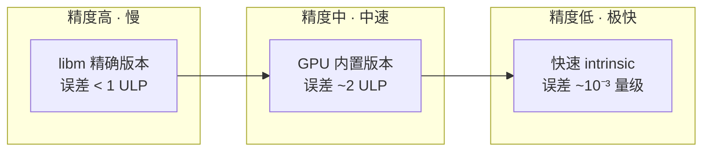
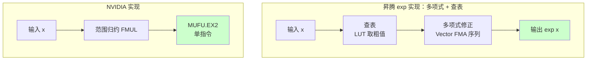

> **算子开发与优化系列 · 第 11 篇 / 共 13 篇**
>
> [10 专家之路](/2026/09/03/op-10-expert-level/) ← **本篇** → [12 Profiling 工具链](/2026/09/03/op-12-profiling-tools/)

**TL;DR**
> * **背景**：Transformer 里的 Softmax、LayerNorm、GELU、FlashAttention 全都绕不开 `exp`、`log`、`rsqrt` 这些超越函数（transcendental functions）。它们的硬件实现方式，直接决定了算子的性能天花板。
> * **核心发现**：没有任何硬件用"通用浮点单元直接算超越函数"——所有芯片都遵循同一套**三步算法**：范围归约（range reduction）→ 多项式逼近（polynomial approximation）→ 重构（reconstruction）。区别只在于"用专用单元做，还是用通用单元+查表做"。
> * **关键数字**：NVIDIA 的 MUFU/SFU 吞吐只有 FP32 核的 **1/4**；AMD 的 TALU 同理；Intel 的 EM 单元每 EU 一个；而昇腾 NPU **没有**专用超越函数指令，靠多项式逼近 + 查表在 Vector 单元里算。
> * **收益**：知道 `expf` vs `__expf` 差在哪、为什么 `rsqrt` 之后要补 Newton 迭代、Softmax 在融合后为什么会被 `exp` 拖累——这是调 FlashAttention 和 LayerNorm 性能绕不过去的一课。
> * **适用人群**：已经会写 elementwise kernel、想弄懂"数学函数在硅片上到底怎么执行"、以及要优化包含 exp/log 算子的工程师。

---

## 1. 为什么算子优化绕不开超越函数

### 1.1 深度学习里的超越函数无处不在

打开任意一个 Transformer 的算子清单：

| 算子 | 用到的超越函数 | 每元素次数 |
|---|---|---|
| Softmax | `exp` | 1 |
| LayerNorm | `rsqrt`（或 `sqrt` + 除法） | 1 |
| GELU | `erf`（实现为 exp/多项式） | 1-2 |
| Attention Score | `exp`（Online Softmax 内） | 1 |
| RMSNorm | `rsqrt` | 1 |
| 交叉熵损失 | `log` | 1 |
| 位置编码（RoPE） | `sin`、`cos` | 2 |

**重要认知**：这些函数在数学上叫"超越函数"——因为它们**不是**有限次加减乘除能精确表示的，只能通过多项式/级数无限逼近。

### 1.2 一个反直觉的事实

浮点单元（FMA）在硬件里是"一次指令一个结果"，一个 SM 每周期能做 128 次 FP32 FMA。但如果你让 FMA 去"算一个 exp"，可能需要 **20-40 条指令**（多项式求值）。这意味着：

$$
\text{exp 的软件成本} \approx 20 \sim 40 \times \text{FMA 成本}
$$

所以硬件厂商做了一个关键决定：**给超越函数单独盖一条"专用快速通道"**，用面积换吞吐。这条通道就是本文的主角。

---

## 2. 通用三步算法：所有芯片的共同祖先

在进入各家硬件细节之前，先掌握软件层面怎么做。所有硬件的超越函数单元，本质都是在硅片上实现下面这套流程。

### 2.1 三步：归约 → 逼近 → 重构

以 `exp(x)` 为例：


**第一步：范围归约**

多项式只在小区间内精度好。把任意 $x$ 缩到一个"标准区间"里：

$$
x = k \cdot \ln 2 + r, \quad r \in \left[-\frac{\ln 2}{2}, \frac{\ln 2}{2}\right]
$$

于是：

$$
e^{x} = e^{k \ln 2} \cdot e^{r} = 2^{k} \cdot e^{r}
$$

这里的技巧：**$2^k$ 不需要"算"，直接改浮点数的指数位即可**（浮点本身就是 $1.f \times 2^{e}$）。重构阶段就是把这个指数操作和多项式结果拼起来。

**第二步：多项式逼近**

在小区间 $r \in [-0.35, 0.35]$ 上，用多项式逼近 $e^r$。FP32 精度下 4-5 阶就够：

$$
e^r \approx 1 + r + \frac{r^2}{2!} + \frac{r^3}{3!} + \frac{r^4}{4!}
$$

用 Horner 法则（嵌套乘法）求值，比直接求和少一半乘法。

**第三步：重构**

$$
e^x = 2^k \cdot P(r)
$$

乘 $2^k$ 就是浮点指数位加 $k$——一条指令。

### 2.2 完整的三步在 CPU 上的样子

CPU 的 libm 就是这么做的，只是多项式阶数更高、精度目标更高（IEEE 精确舍入）：

```c
// 伪代码：exp 的三步实现（示意）
float my_exp(float x) {
    // ① 范围归约：x = k·ln2 + r
    float k = roundf(x * 1.442695f);        // 1/ln2
    float r = x - k * 0.69314718056f;        // ln2
    // ② 多项式逼近 e^r（Horner 嵌套）
    float p = c0 + r * (c1 + r * (c2 + r * (c3 + r * c4)));
    // ③ 重构：乘 2^k（指数位操作）
    return ldexpf(p, (int)k);                // p × 2^k
}
```

### 2.3 精度/速度的权衡轴



**关键洞察**：深度学习对超越函数的精度要求**极低**。Softmax 输出误差 1e-3 完全不影响精度指标（最终只比大小/做归一化）。这给了硬件"牺牲精度换吞吐"的空间——这是所有专用单元的设计哲学。

---

## 3. NVIDIA：MUFU 与 SFU

### 3.1 硬件结构

NVIDIA 每个 SM 里有：

| 单元 | 数量（Ampere/Hopper） | 用途 |
|---|---|---|
| FP32 Core | 128 | 通用 FMA |
| **SFU（Special Function Unit）** | **32** | 超越函数 |
| Tensor Core | 4 | 矩阵乘 |

SFU 的吞吐：**每 SM 每周期 16 次**，正好是 FP32（128/周期）的 **1/4**。

### 3.2 MUFU 指令集

SFU 执行的指令叫 **MUFU**（MUlti-Function Unit）。NVIDIA 公开的 MUFU 指令非常少，只覆盖"能用一个简单多项式快速算出"的函数：

| MUFU 指令 | 函数 | 精度 |
|---|---|---|
| `MUFU.EX2` | $2^x$ | ~22 bit |
| `MUFU.LG2` | $\log_2 x$ | ~22 bit |
| `MUFU.RCP` | $1/x$ | 约 1 ULP |
| `MUFU.RSQ` | $1/\sqrt{x}$ | ~22 bit |
| `MUFU.SIN` | $\sin$ | 硬件级近似 |
| `MUFU.COS` | $\cos$ | 硬件级近似 |

**注意**：没有直接的 `MUFU.EXP` 或 `MUFU.LOG`——因为底数 2 的版本（EX2/LG2）配合一条 FMA 就能换算出任意底数。

### 3.3 `expf` vs `__expf`：20 条指令 vs 2 条

这是 CUDA 里最有名的快慢之分：

```cuda
// 精确版：软件三步 + 多轮修正，~20+ 条指令，误差 < 2 ULP
float y1 = expf(x);

// 快速版：2 条指令！MUFU.EX2 + 一次乘 1/ln2
// __expf(x) = exp2f(x * log2(e)) = MUFU.EX2(x * 1.44269504f)
float y2 = __expf(x);
```

反汇编对比（SASS）：

```
// __expf(x)
FMUL    R0, R0, 1.442695    ; x * log2(e)
MUFU.EX2 R0, R0             ; 2^(x·log2e) = e^x

// expf(x) —— 展开后约 20+ 条，含分支、多次 FMA、循环修正
```

**精度代价**：`__expf` 相对误差约 $10^{-5} \sim 10^{-6}$ 量级（对输入范围有限制，$x$ 很大时精度骤降），而 `expf` 保证 < 2 ULP。对 Softmax 而言 `__expf` 完全够用——这也是 cuDNN / FlashAttention 内部敢用快速版的原因。

### 3.4 除法与 rsqrt：MUFU + Newton 迭代

除法在 GPU 上没有"硬件除法器"，走的是 `MUFU.RCP` + Newton 迭代精修：

$$
y_0 = \text{RCP}(b), \quad y_{n+1} = y_n (2 - b \cdot y_n)
$$

一次迭代把精度从 ~22 bit 提到接近 FP32 满精度。`rsqrt` 同理，`MUFU.RSQ` 后补一次 Newton：

$$
y_{n+1} = \frac{1}{2} y_n (3 - a \cdot y_n^2)
$$

**为什么 LayerNorm 用 `rsqrt` 而不是 `1/sqrt`**：`rsqrt` 是 MUFU 单指令（~22bit），`sqrt` 之后再做除法是两条指令还各带迭代——硬件上省一半。

---

## 4. AMD：TALU / v_exp_f32

### 4.1 结构与命名

AMD 在 RDNA/CDNA 的每个 Compute Unit（CU）里，Vector ALU 分多条 pipe，其中一条就是 **Transcendental ALU（TALU）**：

| 单元 | 吞吐特性 |
|---|---|
| FP32/INT32 Vector ALU | 全速 |
| FP64 ALU | 半速或更慢 |
| **TALU（Transcendental ALU）** | 约 FP32 的 1/4 |

### 4.2 ISA 指令

AMD 的 VALU 指令集直接暴露了超越函数指令（ISA 助记符 `v_exp_f32`、`v_log_f32`、`v_sin_f32`、`v_cos_f32`、`v_rcp_f32`、`v_rsq_f32`）。在 CDNA3（MI300）上，这些指令是 **pipelined** 的——即连续发射不阻塞，吞吐相比 CDNA2 有明显提升。

```cpp
// HIP 侧对应：__expf 也能用，但原生的 AMD 路径是编译器直接把
// expf 映射到 v_exp_f32（精度类似 NVIDIA 的快速版）
__device__ float amd_fast_exp(float x) {
    return __expf(x);   // 编译器优化为 v_exp_f32
}
```

**与 NVIDIA 的差异**：
- NVIDIA 的 SFU 只有 6 个固定函数（EX2/LG2/RCP/RSQ/SIN/COS），其他靠组合；
- AMD 的 TALU 指令面更宽（exp/log/sin/cos/rcp/rsq 都是原生指令），但原理一样：**底数变换 + 多项式 + 重构**。

---

## 5. Intel：EM（Extended Math）单元

### 5.1 结构

Intel Xe 架构（含 Arc、Data Center GPU Max）的每个 Execution Unit（EU）里有一个 **Extended Math（EM）单元**，对应文档中常称的 **transcendental pipe**。

| 单元 | 吞吐 |
|---|---|
| FP32 FMA | 每 EU 每周期 8-16 次（取决于代际） |
| **EM（Extended Math）** | 每 EU 1 个，多周期 |

### 5.2 指令与特点

Intel 的 EM 单元覆盖 `exp`、`log`、`sin`、`cos`、`rcp`、`rsqrt`、`pow`。SYCL/oneAPI 侧通过 `sycl::native::exp` 等 intrinsic 访问快速版；编译器也会在可证明精度足够时把 `expf` 收缩到 EM 指令。

```cpp
// oneAPI：native 版本走 EM 单元
#include <sycl/sycl.hpp>
float y = sycl::native::exp(x);   // EM 硬件指令
float z = sycl::exp(x);           // 精确 libm 版本（多指令）
```

**Intel 的独特之处**：在 GPU 上做超越函数时，Intel 编译器对"精确/快速"的自动选择非常激进（基于区间分析），这有时会让性能不可预测——这也是 Intel 侧 profiling 时要特别看指令混和（instruction mix）的原因。

---

## 6. 昇腾 NPU：没有专用指令，靠多项式 + 查表

### 6.1 关键差异

昇腾（Ascend）AI Core 的 Vector 单元**没有** NVIDIA SFU / AMD TALU 那样的专用超越函数硬件。exp/log/rsqrt 的实现方式回到软件层面：**多项式逼近 + 查表（LUT）**，在 Vector 单元的通用向量指令上跑。



### 6.2 为什么这样设计

- **硬件面积换灵活性**：昇腾把面积花在矩阵（Cube）和向量（Vector）单元上，超越函数用量少但实现重，放通用单元用软件做更划算；
- **查表 + 多项式**：LUT 提供粗精度起点（省多项式阶数），Vector FMA 序列做精修。精度足够深度学习使用（误差约 $10^{-5}$ 量级），代价是**指令数多、吞吐低于 FMA**。

### 6.3 对算子开发的启示

在昇腾上写含 exp 的算子（如 Softmax），优化重点完全不同：

1. **减少 exp 调用次数**：能共用的不要重复算（如 Attention 的 max 归一化技巧）
2. **让 Vector 单元吃饱**：exp 的多项式序列是 Vector FMA，要和 Cube 矩阵运算并行调度
3. **考虑查表友好性**：把输入先 clamp 到查表区间，避免边界分支

这也是 08 篇里提到的：昇腾算子的 `Exp` 属于 Vector 计算密集路径，和 GPU 的"一条 SFU 指令"在性能模型上**不可直接类比**。

---

## 7. TPU：软件实现为主

### 7.1 可确认的事实

- TPU 没有公开的专用超越函数指令文档；
- XLA/HLO 里 `exp`/`log`/`rsqrt` 在 TPU 上主要落在 **Vector 单元**，以软件多项式逼近实现；
- bf16 精度下多项式阶数需求低，软实现成本可接受。

### 7.2 设计取舍

TPU 的哲学是"**把矩阵做到极致，把其他做简单**"。超越函数用量占矩阵运算的零头，不值得像 NVIDIA 那样专门盖 SFU。这跟昇腾的设计逻辑类似——**非矩阵算子统一走 Vector/软件路径**。

---

## 8. 各硬件实现汇总对比

| 维度 | NVIDIA | AMD | Intel | 昇腾 | TPU |
|---|---|---|---|---|---|
| 专用单元 | SFU (MUFU) | TALU (v_exp_f32) | EM (transcendental pipe) | 无 | 无 |
| 吞吐 vs FP32 | 1/4 | ~1/4 | 每 EU 1 个 | 软件序列（更慢） | 软件实现 |
| 快速 intrinsic | `__expf` | `__expf`→`v_exp_f32` | `sycl::native::exp` | 无硬件级 | 无 |
| 精度策略 | 硬件 ~22bit + 软件精修 | 硬件级近似 | 编译器自动选择 | 多项式+LUT | bf16 宽松 |
| 对算子优化影响 | exp 是低吞吐指令，需隐藏 | 同左 | 看编译结果 | 减少 exp 次数优先 | 尽量用矩阵形式 |

**通用结论**：无论哪家，超越函数的吞吐都远低于 FMA——**它们是"贵"的指令，优化时要：①减少次数 ②用快速版 ③用并行隐藏延迟**。

---

## 9. 对算子优化的实战影响

### 9.1 FlashAttention 为什么"省"了 exp

FlashAttention（06 篇）的 Online Softmax 技巧，从**访存**角度省了中间矩阵的读写。但它的 exp 调用次数**没变**（每个元素还是 1 次）。那为什么 FA 快？因为：

1. 省下的是带宽（原版 Softmax 是带宽瓶颈，exp 的慢被带宽掩盖）
2. 融合后 FA 变成计算/带宽混合，exp 开始暴露——这时**用 `__expf` 而不是 `expf` 就成了关键优化**（实测 2 条 vs 20 条指令）

### 9.2 LayerNorm 的 rsqrt 选择

07 篇的 LayerNorm 优化里，用 `rsqrt` 而非 `sqrt + div` 能省一半超越函数开销。对带宽瓶颈的 LayerNorm 影响不大，但一旦融合进计算密集场景，这 1 条指令的差异就会显现。

### 9.3 快速版精度到底行不行

| 函数 | 相对误差 | 典型应用场景 |
|---|---|---|
| `expf` | < 2 ULP | 需要精确的数值场景 |
| `__expf` | ~1e-5 | Softmax/Attention/GELU |
| `rsqrt` + Newton | ~1e-7 | LayerNorm/RMSNorm 归一化 |
| `1.0f/sqrtf(x)` | 精确 | 数值敏感场景 |

**实操准则**：归一化类（分母/标准差）可以接受 1e-6 误差用 `rsqrt`；softmax 指数用 `__expf`；损失函数、梯度里的 log 保持精确版。

### 9.4 延迟隐藏：为什么不能"少用专用单元"

SFU 是独立于 FP32 Core 的物理单元，**它可以和 FMA 并行**。所以一个好的 kernel 设计是：让 exp 指令和 FMA 指令交错发射，SFU 在算 exp 的同时 FP32 Core 在算别的——这是"隐藏延迟"在指令级的具体形态。

---

## 10. Lab Exercises

### Exercise 1：对比 `expf` 与 `__expf`

写一个 elementwise kernel，对 1e6 个元素分别用 `expf` 和 `__expf`，对比：
- 最大相对误差（对输入范围 [-10, 10]）
- 吞吐（用 do_bench 或 ncu 看指令数和时间）
- **预期**：`__expf` 快 5-10 倍，误差在 1e-5 量级

### Exercise 2：验证 MUFU 吞吐 1/4

用 ncu 采集一个纯 `__expf` kernel 的 SM 吞吐，对比纯 FMA kernel：
- 观察 SM 利用率上限（纯 FMA 可到 ~90%+，纯 MUFU 应看到吞吐约为 FP32 的 1/4）
- **预期**：验证"SFU 是独立低吞吐单元"这个硬件事实

### Exercise 3：rsqrt vs sqrt+div

对 LayerNorm 归一化步骤：
- 版本 A：`1.0f / sqrtf(var)`
- 版本 B：`rsqrtf(var)`（或用 `__frsqrt_rn`）
- 对比精度与延迟，观察 Newton 迭代是否真的被编译器生成了

### Exercise 4：Softmax 快速版实践

实现 Softmax 两个版本：
- 标准版：`expf`
- 快速版：`__expf`
- 对比端到端精度（输出差多远）与性能
- 再叠加 Online Softmax（06 篇），观察组合效果

### Exercise 5（昇腾）：软实现 exp 的开销

如有昇腾环境，用 msprof 分别采集含 exp 与不含 exp 的 Vector 算子：
- 观察 PipeUtilization 中 Vector 单元占比
- **预期**：exp 版本 Vector 指令数显著上升，体会"软件多项式实现"的成本

---

## 11. 参考资料

1. NVIDIA. *CUDA C++ Programming Guide — Mathematical Functions*. [docs.nvidia.com](https://docs.nvidia.com/cuda/cuda-c-programming-guide/)
2. NVIDIA. *CUDA Math API — Intrinsic Functions*（`__expf` 等）. [docs.nvidia.com](https://docs.nvidia.com/cuda/cuda-math-api/)
3. AMD. *ROCm HIP Programming Guide — Hardware Implementation*. [rocmdocs.amd.com](https://rocmdocs.amd.com/projects/HIP/en/latest/understand/hardware_implementation.html)
4. AMD. *Instruction Set Architecture (ISA) Reference Guide*（`v_exp_f32` 等指令）. [GPUOpen](https://gpuopen.com/learn/amd-isa-documentation/)
5. Intel. *Intel Xe GPU Architecture — oneAPI Optimization Guide*（EM/transcendental pipe）. [intel.com](https://www.intel.com/content/www/us/en/docs/oneapi/optimization-guide-gpu/2025-0/intel-xe-gpu-architecture.html)
6. Intel. *Intel oneAPI DPC++ Library — sycl::native math intrinsics*. [oneapi-src](https://github.com/oneapi-src)
7. 华为昇腾. *CANN Ascend C 算子开发 — ops-math 实现说明*（多项式 + 查表）. [hiascend.com](https://www.hiascend.com/)
8. *A Unified Approach to Transcendental Function Evaluation on GPUs*（GPU 超越函数实现综述）. [arXiv](https://arxiv.org/html/2601.07172)
9. NVIDIA Developer Blog. *Faster Parallel Reductions*（rsqrt/牛顿迭代相关）.

---

*上一篇：[10 专家之路](/2026/09/03/op-10-expert-level/)*
*下一篇：[12 Profiling 工具链](/2026/09/03/op-12-profiling-tools/) —— 跨硬件 Profiling 工具链选型。*