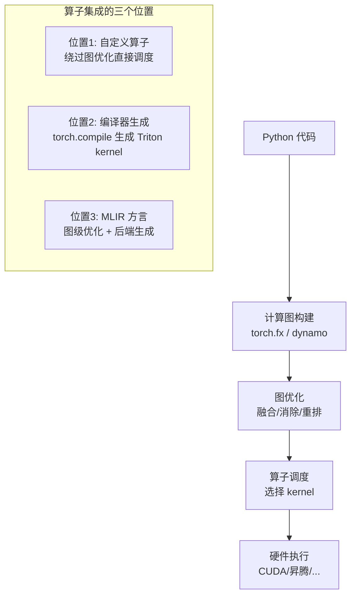
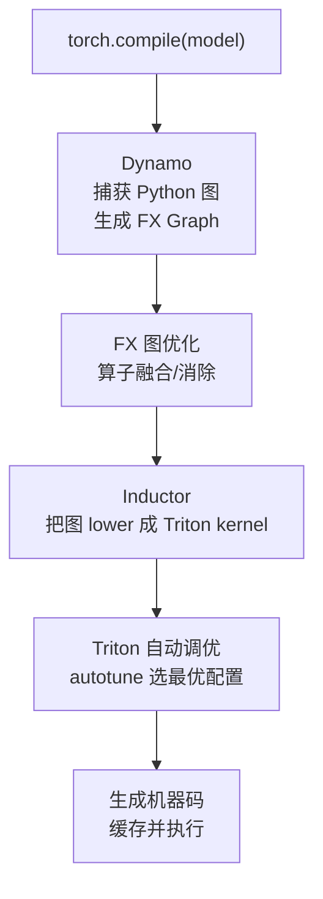
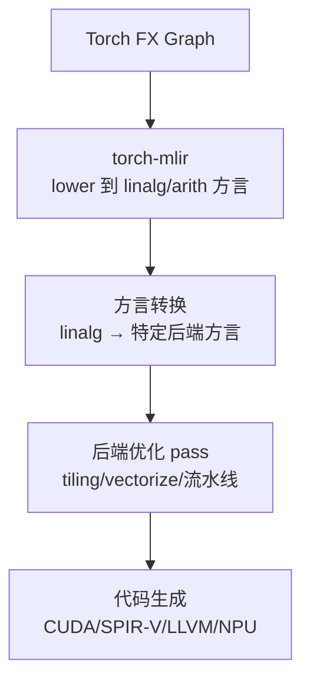
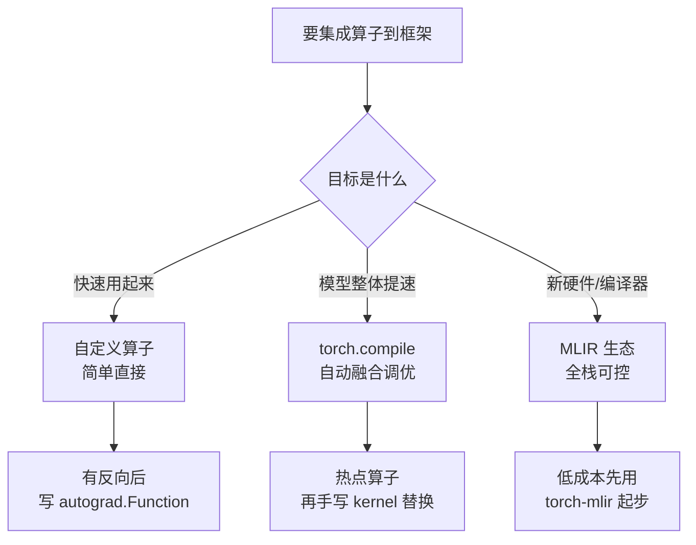

> **算子开发与优化系列 · 第 12 篇 / 共 14 篇**
>
> [11 国产 NPU](/2026/09/03/op-11-domestic-npu/) ← **本篇** → [13 专家之路](/2026/09/03/op-13-expert-level/)

**TL;DR**
> * **背景**：有了好用的手写 kernel（前几篇），最后一个工程问题来了：**如何让它真正跑进深度学习框架**。是注册成自定义算子？还是让 torch.compile 自动生成？还是写进 MLIR 方言做图级优化？这三条路线的取舍决定了算子开发的"落地形态"。
> * **核心发现**：算子与编译器的集成有三条主流路线——① **注册自定义算子**（custom op，最直接，但绕过图优化）；② **对接 torch.compile 的 Triton 后端**（自动融合 + 自动调优，兼顾效率与优化）；③ **进入 MLIR 生态**（自研编译器/新硬件的必由之路，可控性最强但成本最高）。三者不是互斥的，生产系统往往分层使用。
> * **收益**：理解算子如何被框架/编译器"看到"和"优化"，能根据场景选择正确的集成方式，并看懂 torch.compile 的编译流程。
> * **适用人群**：会写 Triton/CUDA kernel、想把 kernel 用到真实模型训练/推理流程中的工程师。

---

## 1. 问题的本质：算子如何进入计算图

深度学习框架（PyTorch）的执行模型：



**你的 kernel 在哪一层被"看到"，决定了它能享受多少优化**：
- 自定义算子：框架只把它当黑盒调用，**不优化也不融合**
- torch.compile 生成：编译器自动做融合和调优，**但内核由编译器决定**
- MLIR 方言：图级优化完全可控，**但开发成本最高**

---

## 2. 路线一：注册自定义算子（Custom Op）

### 2.1 做法

把 CUDA/Triton kernel 包装成 PyTorch 可调用的算子：

```python
import torch
from torch.utils.cpp_extension import load_inline

# 方式 A：加载 CUDA 扩展
my_ops = load_inline(
    name="my_ops",
    cpp_sources=["torch::Tensor my_add(torch::Tensor a, torch::Tensor b);"],
    cuda_sources=['''
        __global__ void add_kernel(const float* a, const float* b, float* c, int n) {
            int i = blockIdx.x * blockDim.x + threadIdx.x;
            if (i < n) c[i] = a[i] + b[i];
        }
        torch::Tensor my_add(torch::Tensor a, torch::Tensor b) {
            auto c = torch::empty_like(a);
            add_kernel<<<(a.numel()+255)/256, 256>>>(a.data_ptr<float>(),
                b.data_ptr<float>(), c.data_ptr<float>(), a.numel());
            return c;
        }
    ''',
    functions=["my_add"],
)

# 方式 B：加载 Triton kernel（更现代）
import triton
import triton.language as tl

@triton.jit
def add_kernel(x, y, out, n, BLOCK: tl.constexpr):
    pid = tl.program_id(0)
    offs = pid * BLOCK + tl.arange(0, BLOCK)
    mask = offs < n
    tl.store(out + offs, tl.load(x + offs, mask=mask) + tl.load(y + offs, mask=mask), mask=mask)

def my_add_triton(a, b):
    out = torch.empty_like(a)
    n = a.numel()
    grid = (triton.cdiv(n, 1024),)
    add_kernel[grid](a, b, out, n, BLOCK=1024)
    return out
```

### 2.2 优劣势

| 优点 | 缺点 |
|---|---|
| 实现简单，立即可用 | **框架把它当黑盒，不做融合** |
| 不依赖编译器 | 手工管理 grid/block（Triton 除外） |
| 行为可预测 | 多个算子各自为战，中间结果落盘 |
| 兼容任意语言写的 kernel | 需要自己处理 autograd 反向 |

### 2.3 什么时候用自定义算子

- 算子本身已经是优化极限（融合在 kernel 内部完成，如 FlashAttention 本身就是一个自定义算子）
- 需要精确控制 kernel 行为（编译器生成不可控的场景）
- 性能关键路径上的热点算子

> **关键洞察**：像 FlashAttention 这类"内部已经融合了多个逻辑"的算子，天然适合自定义算子——因为它把融合做在了 kernel 内部，外部不需要再融合。

---

## 3. 路线二：torch.compile + Triton 后端（编译器生成）

### 3.1 torch.compile 的编译流程



### 3.2 关键：Inductor 如何生成 kernel

`torch.compile` 的 Inductor 后端会把图节点**自动融合**成 Triton kernel：

```python
import torch

@torch.compile
def fused(x, w, b):
    y = x @ w + b          # GEMM + bias（融合成一个 kernel）
    y = torch.relu(y)      # 再融合
    return y

# 生成的 Triton kernel 大概长这样（简化）：
# 一个 kernel 完成: y = relu(x @ w + b)
# 而不是三个 kernel 分别执行
```

**收益**：
- 图级融合自动完成（省去手写融合 kernel）
- Triton 编译器自动做 tiling/pipelining/向量化
- autotune 自动搜最优 block 配置

### 3.3 如何把自己的 Triton kernel 接入 torch.compile

两种方式：

**方式 A：用 `torch.library` 注册 Triton kernel 并标记可编译**

```python
from torch.library import Library, impl

m = Library("my_ops", "DEF")

@impl(m, "my_add", "CUDA")
def my_add(a, b):
    return my_add_triton(a, b)
```

**方式 B：写一个 Triton 模板让 Inductor 使用**

```python
# 用 triton 写一个 kernel 模板，Inductor 会为不同 shape 实例化并 autotune
```

### 3.4 优劣势

| 优点 | 缺点 |
|---|---|
| 自动融合 + 自动调优 | 生成的 kernel 不一定是你想要的 |
| 开发成本低（写图就行） | 对不规则算子支持有限 |
| 享受 Inductor 生态优化 | 调试困难（黑盒） |
| 自动处理动态 shape | 有编译开销（可缓存缓解） |

### 3.5 什么时候用 torch.compile

- 常规模型优化（无脑开启，白嫖融合）
- 图里有大量可融合的访存密集算子序列
- 想快速验证"融合能带来多少收益"再决定是否手写

---

## 4. 路线三：MLIR 生态（编译器底层集成）

### 4.1 为什么需要 MLIR

当目标是**新硬件**或**自研编译器**时，torch.compile 的固定后端不够用。MLIR 提供：

- 可扩展的多层 IR（Dialect 方言体系）
- 图级优化 pass 的可编程性
- 多后端支持（LLVM、CUDA、NPU 自定义后端）

### 4.2 算子进入 MLIR 的典型流程



**关键概念**：
- **Dialect（方言）**：MLIR 的"语言"，如 `linalg`（线性代数）、`triton`（Triton 内核）、`tosa`（移动端算子集）
- **Pass**：图优化器，如 tiling pass、fusion pass
- **Lowering（降级）**：从高层方言逐步转换到底层方言直至机器码

### 4.3 手写算子如何融入 MLIR

| 层级 | 做法 |
|---|---|
| 图优化层 | 用 `linalg` 方言表达算子，享受通用融合/tiling pass |
| 后端层 | 针对特定硬件写后端 pass 和代码生成 |
| 算子库层 | 提供 `llvm.call` 或自定义 op 调用已编译的 kernel |

**示例**：`linalg.matmul` 经过 tiling + vectorization pass 后，会生成类似 CUDA kernel 的循环结构，最终 lower 到 PTX/LLVM IR。

---

## 5. 三路线的综合决策框架



### 5.1 决策因素表

| 因素 | 自定义算子 | torch.compile | MLIR |
|---|---|---|---|
| 开发成本 | 低 | 低 | 高 |
| 性能上限 | 高（手写） | 中高（编译器生成） | 高（全可控） |
| 融合能力 | 无（外部） | 强（自动） | 强（可编程） |
| 可控性 | 中 | 低 | 高 |
| 生态支持 | 好 | 好 | 中 |
| 适用场景 | 单算子极致 | 常规模型 | 新硬件/编译器 |

### 5.2 生产系统的分层实践

一个真实的大模型推理系统往往是**三层并用**：

```
层 1：模型级 —— torch.compile 自动融合常规算子
层 2：热点级 —— 手写 FlashAttention/GEMV 等关键 kernel（自定义算子）
层 3：编译器级 —— 对特殊图结构写 MLIR pass 做图级定制
```

**核心原则**：让编译器做它擅长的（通用融合），让手写 kernel 做它擅长的（关键热点），各司其职。

---

## 6. Lab Exercises

### Exercise 1：对比三种集成的性能

用同一个"GEMM + Bias + ReLU"计算，分别实现：
1. 三个独立算子（基线）
2. 自定义融合算子（手写）
3. torch.compile 自动融合
4. （可选）MLIR 编译

对比端到端延迟，理解：
- 融合为什么快（省中间访存）
- 手写 vs 编译器生成的差距
- 各自的开销（编译时间等）

### Exercise 2：理解 torch.compile 生成什么

```python
import torch

@torch.compile
def f(x, w):
    return torch.relu(x @ w)

f(torch.randn(1024, 1024, device="cuda"), torch.randn(1024, 1024, device="cuda"))

# 用 TORCH_COMPILE_DEBUG=1 运行
# 查看生成的 Triton kernel 源码（kernel 缓存目录）
# 观察：一个 kernel 还是多个？循环结构长什么样？
```

### Exercise 3：写一个 autograd.Function

把自定义算子包成可反向传播的算子：

```python
class MyAddFunction(torch.autograd.Function):
    @staticmethod
    def forward(ctx, a, b):
        return my_add_triton(a, b)

    @staticmethod
    def backward(ctx, grad_output):
        return grad_output, grad_output  # add 的梯度
```

验证 `torch.autograd.gradcheck` 通过。

### Exercise 4：探索 torch-mlir

（可选）安装 torch-mlir，把一个简单模型 lower 到 linalg 方言，观察：
- 算子在 `linalg` 里长什么样
- 融合 pass 如何作用
- 最终如何 lower 到 LLVM

---

## 7. 参考资料

1. PyTorch. *torch.compile 与 Inductor 文档*. [pytorch.org](https://pytorch.org/docs/stable/torch.compiler.html)
2. PyTorch. *Custom Operators 与 torch.library*. [pytorch.org](https://pytorch.org/docs/stable/library.html)
3. torch-mlir. *Torch to MLIR Compiler*. [github.com/llvm/torch-mlir](https://github.com/llvm/torch-mlir)
4. MLIR. *Dialects 与 Pass 文档*. [mlir.llvm.org](https://mlir.llvm.org/docs/)
5. 知乎. *torch.compile 工作原理与 Inductor 后端*. [知乎专栏](https://zhuanlan.zhihu.com/p/672759987)

---

## 附录：行业案例——地平线编译器实践

前面三条路线讲的是"如何把手写 kernel 集成进框架"。这一节是一个真实的行业侧视角：**地平线编译器研发部负责人李建军在「你好，开发者」工具链技术专场**（2023 年 12 月，题为《地平线编译及编程实践》）的实录要点。它把"为什么选 MLIR、编译器怎么做融合与调度、为什么要用强化学习优化编译器"这些工程问题讲得极其具体，是对第 4 节（MLIR 路线）最好的实战注脚。

### A.1 背景：算法演进对芯片与编译器的牵引

**深度学习算法的演进**：从 ResNet（2015，2016 年几乎所有初创芯片公司都拿它做优化标的——它对 AI 芯片复杂度要求低、计算访问比高、计算非常规整，几乎全是 Conv + ReLU 模式）→ MobileNet（Depthwise Conv 把普通 Conv 拆成 Depthwise + Pointwise，在 CPU 上效果好，但在 GPU 上加速比不高，在专用的端侧芯片上反而会卡住）→ EfficientNet（每个 block 内部的计算复杂度和算子类型发生很大变化，出现了大量 Vector 计算）→ 现在的 Transformer。

**对芯片设计的两个核心结论**：

1. **AI 模型越来越复杂**。从"Conv 包打天下"到现在的 Conv、矩阵乘、Reshape、LayerNorm、Softmax 等复杂算子混合；GPT 类模型 Weight 都是 GB 级别。模型对通用性的要求非常高，那些为特定网络（如 ResNet）设计的、通用性考虑不足的芯片，在 Transformer 类网络上效果会差很多——这也是为什么 Transformer 出来之后 GPU 的竞争力又回来了。
2. **需要异构计算能力非常强的智能芯片**。每个部件之间都要有高速的数据共享通路，灵活的控制与调度并行。**如果 Tensor Core 和 Vector Core 中间隔得比较远，数据传输的时间可能会比计算时间长**——现在有很多芯片都卡在数据传输上。

**Transformer 的独特挑战**：
- 不止是 Tensor 计算，还有大量 Vector 计算（Softmax、LayerNorm、Elementwise）和 Reshape/Transpose 操作
- **计算访存比问题**：GPT 类模型在端侧几乎卡在 Weight 的访存上——端侧跑大模型时 batch 通常不大，GPU 靠 batch 摊薄访存的策略在端侧不适用
- **Reshape/Transpose 多了会大幅提高图优化需求**，且有些特殊 case 通过自动化编译手段很难完全消除

**应对思路**（与前面所有优化方法论一致）：GPGPU 上的解法是把大量连续计算融合成一个大 kernel（如 FlashAttention），在 kernel 内做 Tiling 以减少片外访存；NPU 上则利用较大的片上 SRAM 做数据复用，但仍然要面对"Weight 就是那么大，再大的 SRAM 也访存不住"的硬约束。

### A.2 智能芯片架构演进：征程 3 → 征程 5 → BPU Nash

- **征程 3**：架构简单——中间是最大的 Tensor Core（MAC 阵列），绿色部分是 SRAM，下面是 Load Store 模块和一些专用模块（Pooling、ROI Align、后处理），AXI 总线连接 DDR 与 SRAM。简单的设计配合编译器联合优化，在 ResNet/MobileNet/EfficientNet 上达到很好的能效。
- **征程 5（J5）**：重大变化——加入 **Vector (Elementwise) 部件**、**Reshape 部件**（对 Data Layout & Reshape 的硬件高效支持）、Pooling/PreProcessing 专用模块（DSU）。
- **BPU Nash（征程 6 系列）**：延续 TAE、VAE（Vector 核）、AAE，中间是带宽更大的二维组织 SRAM；新增浮点处理部件 **VPU** 和标量核 **SPU**（细粒度控制片内数据交互与计算调度）；三级存储，片上 L2 SRAM；专门的数据变换引擎 **DTE** 灵活支持 Transformer 里各种细小的 Reshape/Transpose；SoC 层面还有一个大 L2 SRAM 与 BPU 核/ARM 核/DSP 高速交互。

**关键判断**：Tensor Core 负责 Conv/矩阵乘，Vector Core 负责 Elementwise/Attention，Scalar Core 负责控制逻辑与细粒度调度，还有特定高频激活函数的硬件加速。**计算架构复杂度提升一个数量级，直接导致编译器优化的复杂度也提升一个数量级**——这就是地平线要做全新编译器架构的直接原因。

### A.3 为什么选 MLIR 而不是 TVM

**MLIR 是什么**：不是编译器，而是**用来构建编译器的框架**——提供高效的框架设计理念和构建编译器的基础设施。优点是架构设计非常容易扩展（可以把 AI 芯片的很多特性通过扩展加入 MLIR 表达中）、基础设施完善、兼容能力和表示能力强。

**为什么不选 TVM**：
- TVM 是**支持 AI 模型编译部署的端到端工具**（浮点网络进去，量化、编译、上板、运行时全包），MLIR 是编译器框架，两者本质不是同一类框架，但关注的领域相同
- 面向非 CPU/GPU 的硬件时，TVM 能复用的是整个框架、前段和少量编译 pass；**如果芯片架构与 GPU 差距大，后端部分基本无法复用——而编译器开发中工作量最大的恰恰是后端优化部分**
- MLIR 的设计理念非常适合专用处理器，扩展性足够灵活，且处于快速成长期

**关键洞察**：这是第 4 节"要不要进 MLIR 生态"决策的一个真实注脚——**当你的硬件与主流越不同，编译器后端的自研比例越高**。

### A.4 编译优化实践：融合 → 拆分 → 并行与调度

地平线编译器优化可以概括为三步：**先做融合，再去拆分，最后做并行和调度**。目标是把计算、访存完全 Pipeline 掩盖起来，达到非常高的计算阵列利用率。

**核心概念：Layer Group（层组）**——由一组模型 Layer（Operator）组成。优化以 Layer Group 为单位进行：

- **默认只有进入和退出组时才与外部的 DDR 做 Load/Store 交互**；组内所有编译、Tiling、调度都以 Layer Group 为单位（对应本系列反复强调的"减少访存量"原则）
- 一个 12 层模型可以有非常多的划法（1~12 一组、1~5 + 6~12、1~7 + 8~12、1~4 + 5~8 + 9~12……）。最极端：1~12 一组；或每层一组（GPU 上的做法）。对 n 层模型做 Layer Group 划分需要尝试 $2^{n-1}$ 次，可做剪枝
- 划分后做 **Tiling / Schedule / SRAM 分配**，如果能正常走完流程才证明"可编译"（划组后可能因为中间需要缓存的 Weight 太大而编译不出来）
- 搜索最优划分：**动态规划（DP）算法** + 限制最大层数（如 50 层一组是承受极限）。100 层模型完全搜索是 $2^{99} \approx 6.3 \times 10^{29}$ 次，DP 降到约 5000 次量级
- 每个 Layer Group 的 CodeGen 还要尝试不同策略（Tiling 方向/次数、中间结果要不要留在 SRAM），用 Cost Model 预估指令序列性能

**Tiling 的关键决策**：在哪个维度 Tiling（横/竖/块状/Weight 的 Channel 方向）、Tiling 多少块最优。Conv 类算子天然存在 halo 交叠（Input 和 Output 是倒金字塔，中间 input 有交叠才能算相邻 output），跨 tile 有依赖，但依赖释放并行度的时机是调度空间所在。AutoTVM 以来的很多论文都在解决"选最优 Tiling"。

**Schedule（调度）**：对指令序列重排，充分利用硬件资源；同时必须考虑 SRAM 资源占用——Input/Output 需求超出 SRAM 时只能推迟执行。**SRAM 分配**在模型复杂后非常难：等分 Tiling 的时代已过去，各种大小的 tile 混在一起，"分得不好会导致有时候能放下、有时候放不下"。模型与芯片的复杂度直接拉长编译时间，**这就是"编译性能 vs 编译速度"的跷跷板**。

### A.5 用机器学习解决编译时间问题

**观察**：编译过程就是不断决策的过程——在哪一维 Tiling、Tiling 多少份、数据放 SRAM 哪里，都是离散决策，且不同的决策序列影响最终优化效果。模型大了之后编译时间可能接近 1 小时（对量产前要耗尽最后性能的场景，哪怕损失 5% 也不能接受）。

**两个已落地/探索中的方向**：

1. **图神经网络预测 Tiling 策略**（已发布于 FP3 工具链，`-om` 选项）：用 GCN 网络预测子图的 Layer Group Tiling 维度和数量，**平均编译时间降到原来的 1/20，而模型性能影响仅在 ±1-2%**。
2. **强化学习学习完整指令序列**（探索中）：受 AlphaZero 启发，把"每一步决策"建模成强化学习（每一步是在"算一部分输入 / 把输出 store 出去 / 把新输入 load 进来"等 Action Space 里做选择）。编译器操作空间比围棋大很多，目前基于 ResNet 的实验已经取得与 DP 方法非常接近甚至超出规则序列的效果。

**对算子工程师的启示**：优化搜索的亲历者视角——本系列 14 篇讲的 autotune 搜索空间裁剪（06/14 篇），在大厂编译器里就是用一个 GCN/RL 网络做的。**"性能模型 + 搜索"是无论手写还是编译器都必须面对的核心工具**。

### A.6 编程模型：LEAP（DSL）与 FLAP（Python）

地平线为开发者提供两层编程接口（覆盖第 1 节"算子集成的三个位置"的思想）：

- **LEAP（DSL）**：把 TensorCore/VPU/DSP 的指令或 kernel 封装成 API，支持模型串联、前后处理、Vector 操作；提供 C++ 自定义算子在框架层的统一注册接口，模型可直接使用。
- **FLAP（Python 编程接口）**：兼容 Triton、Numba 等 Pythonic 语言，用户可写灵活的自定义算子。复杂的前处理（图像格式变换等）可以直接用 `import torch` 的 aten 算子 + LEAP API 拼出来；标准算子覆盖不到的可以用 C++ 写并通过 `custom_op` 接口注册；后处理可用 Triton 写。

**推荐优先级**：Torch Ops（最熟悉）→ LEAP（DSL）→ Triton 自定义算子 → C++。这与第 5 节"生产系统分层实践"的决策次序一致：**能复用生态就复用，逐级用编程能力换取灵活性**。

### A.7 前沿探索：数据驱动的软硬件协同设计

地平线的硬件、编译器和算法迭代是一个**闭环**：

> **算法模型结构搜索、BPU 架构搜索、RL 编译优化，三者互相依赖。通过算法、编译器、架构设计三者结合，在软硬结合极致优化的同时，经数据驱动实现自动化验证，持续寻找 BPU 架构最优解。**

在这个闭环里，可以"锁定任意两个求另一个的最优解"——比如做算法结构搜索（NAS）时需要快速编译结果评估性能，其对编译速度和优化效果都提出了很高要求；而 BPU 架构本身（SRAM 大小、Vector 算力、Tensor 配比、中间带宽）也是可搜索的决策空间。为此地平线搭建了计算架构的仿真平台做预研。

**把第 4 节与附录串起来**：自定义算子（手工）→ torch.compile（自动融合）→ MLIR（自研编译器）是一条"控制粒度递增"的谱系；地平线的实践证明了这条谱系在真实 NPU 上的必要性（后端无法复用 → 必须自研编译器），而其 RL/GCN 优化则印证了 13 篇将详述的"AI 驱动的算子/编译器开发"趋势。

---

### 附录参考资料

1. 李建军（地平线编译器研发部负责人）. *地平线编译及编程实践*（「你好，开发者」工具链技术专场实录，2023-12-27 直播）. [原文链接](https://zhuanlan.zhihu.com/p/676840316)

---

*上一篇：[11 国产 NPU](/2026/09/03/op-11-domestic-npu/)*
*下一篇：[13 专家之路](/2026/09/03/op-13-expert-level/) —— 算子库设计、性能模型与 AI 驱动开发。*