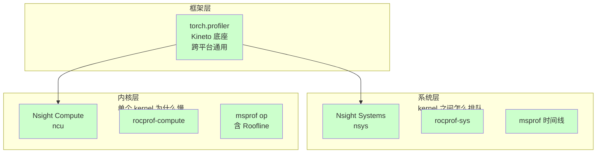

> **算子开发与优化系列 · 第 12 篇 / 共 13 篇**（完结篇）
>
> [11 超越函数](/2026/09/03/op-11-transcendental-math/) ← **本篇**

**TL;DR**
> * **背景**：NVIDIA 的 Nsight Systems（nsys）只是"系统层时间线"这一个工具，但很多工程师误以为 profiling 就只有它。换到 AMD/Intel/昇腾/寒武纪后，工具名全部变化，方法论却完全一致——关键是先建立**分层心智模型**。
> * **核心发现**：所有 profiling 工具按功能只分三层——**框架层**（哪个算子慢，torch.profiler 跨平台通用）、**系统层**（kernel 之间怎么排队，对应 nsys）、**内核层**（单个 kernel 为什么慢，对应 ncu）。每家硬件各有一个工具对应 ncu 的位置：AMD 是 `rocprof-compute`、Intel 是 VTune GPU Hotspots、昇腾是 `msprof op`（含 Roofline 分析）。
> * **关键数字**：AMD 的工具链在 2026 年已全面换代——`rocprof`/`rocprofv2`/`Omniperf`/`Omnitrace` 全部废弃，新名字是 `rocprofv3`/`rocprof-compute`/`rocprof-sys`。看老博客用错工具会直接踩坑。
> * **收益**：掌握"三层三问"的 profiling 流程，知道换硬件时哪些工具能复用（torch.profiler、Perfetto）、哪些必须换（内核层分析器），以及昇腾特有的 AOE 自动调优。
> * **适用人群**：会跑 nsys/ncu 但没系统整理过工具矩阵、或者正在做国产化迁移（CUDA→昇腾/寒武纪/海光）的工程师。

---

## 1. 为什么 profiling 不是"一个工具"的事

### 1.1 nsys 的"正确位置"

`nsys`（Nsight Systems）解决的是这个问题：**"我的程序时间都花在哪了？"**——它给出全局时间线，展示 kernel 的启动顺序、CPU 与 GPU 的同步间隙、空闲气泡。

但它**不回答**："这个 kernel 内部为什么只用了 30% 的 SM？"。那是 `ncu`（Nsight Compute）的活。

**nsys 只是 NVIDIA 全栈里的一环**。把它当成 profiling 的全部，等于拿着整体地图却不知道放大镜在哪。

### 1.2 三层心智模型



**三层回答的问题不同，必须搭配使用**：

| 层级 | 核心问题 | 典型产出 | 耗时成本 |
|---|---|---|---|
| 框架层 | 哪个算子/API 慢？ | 算子耗时排序、调用栈 | 低（可全量开） |
| 系统层 | kernel 间隙/同步开销在哪？ | 时间线瀑布图 | 中 |
| 内核层 | 单 kernel 为什么没跑满？ | SM 占用、内存吞吐、stall 原因 | 高（只能开少量） |

### 1.3 三层三问：标准 profiling 流程

03 篇的"三查法"在这里延伸为跨硬件通用流程：

1. **框架层**：`torch.profiler` 跑一遍，拿到算子耗时排序 → 找到 Top-N 热点算子
2. **系统层**：对热点区间开系统 profiler，看 kernel 是否连续执行、有没有同步气泡
3. **内核层**：对单个热点 kernel 开内核级分析器 → 判断是计算 bound、访存 bound、还是延迟 bound

**这套流程与硬件无关**，变的只是第三步的工具名。

---

## 2. NVIDIA：nsys 之外还有什么

| 工具 | 层级 | 状态 | 用途 |
|---|---|---|---|
| **Nsight Systems（nsys）** | 系统层 | 现行 | 全局 timeline、kernel 间隙、CPU 侧开销 |
| **Nsight Compute（ncu）** | 内核层 | 现行 | **主力**。warp stall、SM 占用、内存/计算吞吐、Roofline |
| **torch.profiler / Kineto** | 框架层 | 现行 | PyTorch 算子级耗时，跨平台 |
| **CUPTI** | 底层 API | 现行 | ncu/nsys 的底座，可自研分析工具 |
| nvprof / nvvp | — | **已废弃** | CUDA 10 前的老工具，别再用 |

**现实分工**：日常是 `torch.profiler` 看算子排序 → `ncu` 深挖热点 kernel。`nsys` 主要用于排查"GPU 没吃满但程序慢"的同步/间隙问题。

```bash
# 三条命令的定位差异
torch.profiler   # 谁慢 → 算子排序表
nsys profile     # 时间去哪 → 时间线
ncu --set full ./kernel  # 为什么慢 → 微架构指标
```

---

## 3. AMD（ROCm）：2026 年已全面换代

### 3.1 工具改名史（重要）

AMD 在 2026-04 官方博客明确整理了新命名体系。**老博客/旧文档里的工具名大部分已废弃**：

| 旧工具 | 状态 | 新工具 |
|---|---|---|
| `rocprof` / `rocprofv2` | 废弃 | **`rocprofv3`**（rocprofiler-sdk） |
| `roctracer` / `rocprofiler` 库 | 废弃 | **rocprofiler-sdk 库** |
| `Omniperf` | 废弃 | **`rocprof-compute`** |
| `Omnitrace` | 废弃 | **`rocprof-sys`** |

### 3.2 新工具矩阵

| 新工具 | 对标 NVIDIA | 层级 | 说明 |
|---|---|---|---|
| **rocprofv3**（rocprofiler-sdk） | ncu 采集后端 | 内核层 | 硬件计数器采集，开源在 ROCm/rocm-systems |
| **rocprof-compute** | **ncu** | 内核层 | MI100/MI200/MI300 系列，含 **Roofline 分析**、System Speed-of-Light、内存图分析、基准对比 |
| **rocprof-sys** | **nsys** | 系统层 | CPU+GPU 时间线 profiler |
| AMD uProf | — | CPU | Zen 处理器分析 |
| Radeon GPU Profiler | — | 图形 | 仅 RDNA + Windows |

```bash
# AMD 侧对应 NVIDIA 的命令
rocprof-sys profile ./app     # ~ nsys profile（时间线）
rocprof-compute --kernel-name "softmax*" ./app  # ~ ncu（内核级，多 pass 采集）
```

**注意**：`rocprof-compute` 默认**多 pass 采集**（每 pass 重跑一次应用采集不同指标集），所以 profiling 会比 NVIDIA 慢——这是设计使然，不是 bug。即将支持单 pass 迭代复用。

---

## 4. Intel：VTune 一站到底

| 工具 | 层级 | 说明 |
|---|---|---|
| **VTune Profiler** | 系统+内核 | 一站式。GPU Compute/Media Hotspots、GPU Offload、XPU 分析 |
| **Intel Advisor** | 内核层（Roofline） | **Roofline 分析是 Intel 的强项**，GPU Roofline 已支持 XMX 矩阵单元 |
| **ITT API** | 插桩 | 代码标注 API（对标 NVTX），开源 |
| GPA | 图形 | Graphics Performance Analyzers |

```bash
# VTune GPU 热点分析
vtune -collect gpu-hotspots -r ./result -- ./app
vtune -report summary -r ./result
```

**Intel 特点**：`VTune` 的 XPU 分析能同时看 CPU+GPU+NPU 的 offload 瓶颈（2026.2 起支持 NPU power trace），对 AI PC / 客户端推理场景有价值。GPU 内核级分析 + Advisor 的 Roofline 组合 ≈ ncu 的替代。

---

## 5. 昇腾（华为）：工具链最完整

### 5.1 全家桶

| 工具 | 层级 | 说明 |
|---|---|---|
| **msprof**（CANN CLI） | 系统+内核 | 主力。算子耗时、AI Core 硬件指标、HBM/PCIe 带宽 |
| **msprof op** | 内核层 | 单算子调优：`--aic-metrics` 支持 **Roofline、Occupancy（核间负载）、PipeUtilization（流水利用率）、ResourceConflictRatio** |
| **MindStudio Insight** | 可视化 | 计算内存热力图、指令流水图、算子代码热点图 |
| **Ascend PyTorch Profiler** | 框架层 | torch_npu 集成，接口与 torch.profiler 对齐 |
| **MindInsight** | 框架层 | MindSpore 专属：迭代轨迹、算子统计、数据管道 |
| **AOE** | 自动调优 | 自动搜索算子最优配置 |

```bash
# msprof 采集（训练场景）
msprof --output=./prof_data --application="python train.py"

# msprof op 单算子内核级分析（含 Roofline）
msprof op --aic-metrics=Default,Roofline --kernel-name="add|softmax" --launch-count=10 ./my_kernel
```

### 5.2 关键认知

- **`msprof op` 直接对标 ncu**：它提供 Roofline 瓶颈分析图、Occupancy 负载均衡图、PipeUtilization 指令流水图——和 ncu/rocprof-compute 是同一套方法论。**Roofline 是跨硬件通用的第一性原理**（呼应 00 篇）。
- **AOE 是昇腾独有的加分项**：对标"分析出瓶颈后怎么改"的环节，能自动搜索算子最佳配置，NVIDIA 生态没有直接等价物。

---

## 6. 其他国产芯片

| 芯片 | 工具 | 说明 |
|---|---|---|
| **寒武纪（Cambricon MLU）** | **CNPerf**（内核级，硬件计数器）、**CNMon**（监控）、**CNAdvisor**（2025 新增：运行时插桩+计数器，自动给调优建议） | CNPerf 对标 ncu，CNAdvisor 带自动建议 |
| **海光（Hygon DCU）** | 直接复用 **ROCm 全家桶**（rocprofv3/rocprof-compute/rocprof-sys） | DCU 是 HIP 兼容生态，工具直接平移 |
| **Google TPU** | TensorBoard Profiler / Perfetto | 云上分析，内核细节不开放 |

---

## 7. 跨硬件通用层：一套代码跑通所有芯片

### 7.1 torch.profiler：迁移第一步永远用它

```python
from torch.profiler import profile, ProfilerActivity, record_function

with profile(activities=[ProfilerActivity.CPU, ProfilerActivity.CUDA]) as prof:
    model(inputs)

print(prof.key_averages().table(sort_by="cuda_time_total", row_limit=20))
```

**关键点**：`torch.profiler` / Kineto 在 CUDA、ROCm、昇腾（torch_npu）、寒武纪上**接口完全一致**。迁移到新 NPU 时，第一份数据永远是 torch.profiler 出的算子排序——因为框架层最通用、最不易踩坑。

### 7.2 Perfetto / chrome://tracing：统一时间线格式

各家系统层工具（nsys、msprof、rocprof-sys）的时间线数据**都能导出** Chrome Tracing 格式，用 Perfetto 统一查看。当你在不同硬件间切换时，保持相同的可视化习惯能降低认知负担。

### 7.3 Triton 自带基准

```python
from triton.testing import do_bench
ms = do_bench(fn, warmup=25, rep=100)
```

Triton 的 `do_bench` 在各硬件上可用，适合做跨硬件 kernel 对比的第一轮粗筛。

---

## 8. 选型决策表

| 阶段 | NVIDIA | AMD (ROCm) | Intel | 昇腾 | 寒武纪 | 海光 |
|---|---|---|---|---|---|---|
| 框架层（算子排序） | torch.profiler | torch.profiler | torch.profiler | torch.profiler / Ascend PT Profiler | torch.profiler | torch.profiler |
| 系统层（timeline） | Nsight Systems | rocprof-sys | VTune | msprof | CNMon | rocprof-sys |
| 内核层（单 kernel） | Nsight Compute | rocprof-compute | VTune GPU Hotspots + Advisor | msprof op（含 Roofline） | CNPerf | rocprof-compute |
| 自动调优 | — | — | — | AOE | CNAdvisor | — |

**三层通用结论**：
1. **框架层永远用 torch.profiler**——跨平台零学习成本
2. **系统层**各家都有 nsys 对应物（rocprof-sys / VTune / msprof）
3. **内核层**必须换工具，但方法论一致：Roofline + 占用率 + 流水利用率，迁移时只需记住"我的 ncu 换成 XXX"

---

## 9. 昇腾 vs NVIDIA：一次实操对照

以"分析一个 Softmax 算子为什么慢"为例，两套工具的执行路径完全平行：

```bash
# NVIDIA
torch.profiler           # → softmax 排第 3，占 12%
nsys profile             # → 该 kernel 与前后 kernel 间隙大，有同步气泡
ncu --set full           # → 发现 Memory Bound，带宽利用 45%，SM 占用不足

# 昇腾
torch.profiler           # → softmax 排第 2，占 15%
msprof                   # → 查看 AI Core 时间线、Cube/Vector 占用
msprof op --aic-metrics=Default,Roofline
                         # → 发现 Vector 单元饱和、Cube 空闲、带宽利用 50%
```

**方法论完全一致，只是指标名变了**（SM↔AI Core、SM 占用↔核间负载 Occupancy、warp stall↔PipeUtilization）。

---

## 10. 系列总结：从想清楚到 Tools 的最后一课

至此 13 篇全部走完。回顾这条路线，可以浓缩成三个递进的闭环：

```
闭环一（00-04）：想清楚 —— Roofline 定上界，硬件决定写法，语言选对工具，
                  tracing 定位层级，优化技术库对着瓶颈开枪。
闭环二（05-08）：做出来 —— GEMM 金字塔、FlashAttention、归约/归一化三大案例，
                  昇腾上把同一套方法论换一种表达。
闭环三（09-12）：规模化 —— 融入框架（自定义算子/torch.compile/MLIR）、
                  建算子库与性能模型、用 AI 加速开发、换硬件时工具和方法论平移。
```

**贯穿始终的那一句话**：优化 = 减少访存 + 提升复用 + 压满带宽 + 隐藏延迟，先用 Roofline 定性，再用三层 profiling 定位，最后用技术库对症下药。这三条，跨芯片、跨工具、跨代际都成立。

---

## 11. Lab Exercises

### Exercise 1：三层 profiling 实操（任意硬件）

对一个小模型（如 ResNet-18 或一个 Attention 块）依次执行：
- 框架层：torch.profiler 输出算子 Top-10
- 系统层：nsys（或 rocprof-sys / msprof）看时间线
- 内核层：ncu（或对应工具）看 Top-1 算子的瓶颈类型
- 记录三层各发现了什么、有什么信息是上一层看不到的

### Exercise 2：验证工具改名坑

搜索"Omniperf"和"rocprof-compute"，对比两份文档：
- 确认 Omniperf 已被 rocprof-compute 取代
- 用 `rocprof-compute --version` 或 `rocprofv3 --version` 验证本地 ROCm 版本
- **预期**：老教程的命令在新工具下直接报错——建立"查工具版本再跑命令"的习惯

### Exercise 3：昇腾 Roofline 分析（如有环境）

用 `msprof op --aic-metrics=Default,Roofline` 分析一个自定义算子：
- 看 Roofline 图上算子落在哪个区（计算密集/访存密集）
- 对照 00 篇的 Roofline 理论，验证"跨硬件方法论一致"
- 再跑 `--aic-metrics=Occupancy` 看核间负载均衡

### Exercise 4：统一时间线格式

用 nsys（或 msprof）导出 profiling 数据，在 `chrome://tracing` 或 Perfetto 中打开：
- 确认跨工具的时间线格式统一
- 对比不同硬件上的时间线，找出格式一致的地方

### Exercise 5（收尾）：重温 00 篇的 Roofline

回到 00 篇，把其中"什么时候 More Work Better、什么时候 Less Work Better"的判断流程重读一遍，用你现在掌握的 GEMM/Attention/LayerNorm 三个案例各自验证一次——**这套判断现在应该变成肌肉记忆了**。

---

## 12. 参考资料

1. AMD. *Introduction to Profiling Tools for AMD Hardware*. [rocm.blogs.amd.com](https://rocm.blogs.amd.com/software-tools-optimization/profilers/README.html)（2026-04，工具换代官方说明）
2. AMD. *ROCm Compute Profiler Documentation*（rocprof-compute）. [rocm.docs.amd.com](https://rocm.docs.amd.com/projects/rocprofiler-compute/en/latest/)
3. AMD. *Introducing ROCprofiler SDK*（rocprofv3）. [rocm.blogs.amd.com](https://rocm.blogs.amd.com/software-tools-optimization/rocprofiler-sdk/README.html)
4. Intel. *VTune Profiler Documentation*. [intel.com](https://www.intel.com/content/www/us/en/docs/vtune-profiler/user-guide/2025-1/overview.html)
5. Intel. *oneAPI Base Toolkit Release Notes*（VTune/Advisor）. [intel.com](https://www.intel.cn/content/www/cn/zh/developer/articles/release-notes/oneapi-base-toolkit/2025.html)
6. 华为昇腾. *msprof 工具说明*（CANN Profiling）. [hiascend.com](https://www.hiascend.com/document/detail/zh/canncommercial/5046/devtools/auxiliarydevtool/atlasprofilingtrain_16_0013.html)
7. 华为昇腾. *算子调优 msProf 工具*（MindStudio，含 Roofline/Occupancy）. [hiascend.com](https://www.hiascend.com/document/detail/zh/mindstudio/700/ODtools/Operatordevelopmenttools/atlasopdev_16_0082.html)
8. MindSpore. *MindInsight 性能调试（Ascend）*. [mindspore.cn](https://www.mindspore.cn/mindinsight/docs/zh-CN/r2.3/performance_profiling_ascend.html)
9. NVIDIA. *Nsight Compute / Nsight Systems Documentation*. [developer.nvidia.com](https://developer.nvidia.com/nsight-compute)
10. 寒武纪. *CNPerf / CNAdvisor 工具说明*. [developer.cambricon.com](https://developer.cambricon.com/)

---

*上一篇：[11 超越函数](/2026/09/03/op-11-transcendental-math/)*

---

**系列索引**：[00 算子本质与 Roofline](/2026/09/03/op-00-fundamentals/) · [01 硬件架构](/2026/09/03/op-01-hardware/) · [02 Kernel 语言](/2026/09/03/op-02-kernel-languages/) · [03 性能分析](/2026/09/03/op-03-performance-analysis/) · [04 优化技术](/2026/09/03/op-04-optimization-techniques/) · [05 GEMM 案例](/2026/09/03/op-05-case-gemm/) · [06 Attention 案例](/2026/09/03/op-06-case-attention/) · [07 归约案例](/2026/09/03/op-07-case-normalization/) · [08 国产 NPU](/2026/09/03/op-08-domestic-npu/) · [09 编译器集成](/2026/09/03/op-09-compiler-integration/) · [10 专家之路](/2026/09/03/op-10-expert-level/) · [11 超越函数](/2026/09/03/op-11-transcendental-math/) · [12 Profiling 工具链](/2026/09/03/op-12-profiling-tools/)