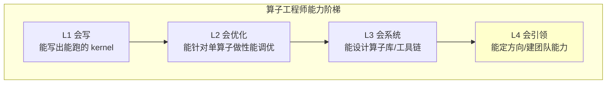
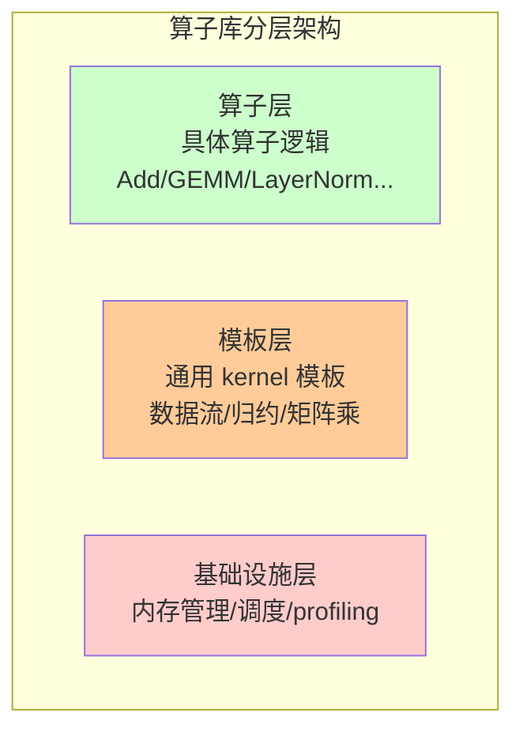
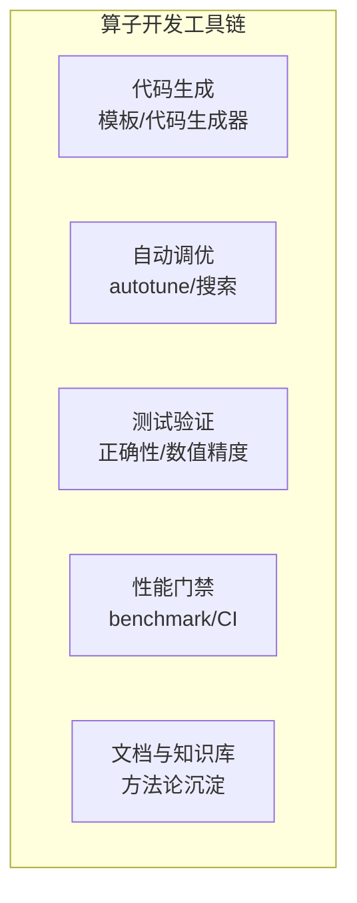
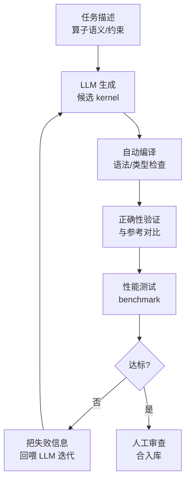
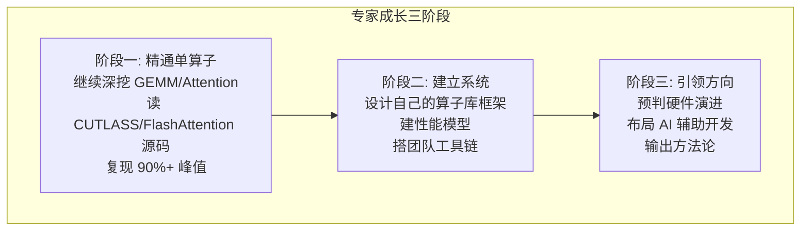

> **算子开发与优化系列 · 第 13 篇 / 共 14 篇**
>
> [12 编译器集成](/2026/09/03/op-12-compiler-integration/) ← **本篇** → 系列完结

**TL;DR**
> * **背景**：到这里，你已经掌握了算子优化的完整方法论（Roofline、硬件理解、语言、profiling、优化技术、五大案例、国产 NPU、编译器集成）。但"会用这些技术优化单个算子"和"能设计算子系统、引领团队优化方向"之间还有一道鸿沟——这就是本篇要跨越的：**从"会优化算子"到"能设计算子库、建性能模型、用 AI 加速算子开发"**。
> * **核心发现**：专家级算子工程师有四个特征能力——① **算子库设计**（如何组织大规模算子集合，而非单点优化）；② **性能建模**（用可计算的模型预测性能，而非全部实测）；③ **工具链建设**（让团队每个成员都能高效开发）；④ **AI 辅助开发**（LLM 生成 kernel、自动搜索、自动调优正在改变这个领域的工作方式）。
> * **收益**：理解算子工程的全貌，明确自己的成长路径，并预判这个领域未来 3-5 年的技术趋势。
> * **适用人群**：已完成本系列前 12 篇学习、希望把算子开发作为长期职业方向的工程师。

---

## 1. 从"会优化算子"到"算子专家"的跃迁

### 1.1 能力阶梯



**本系列定位**：00-11 篇帮你到达 L2 中后期，12 篇开始接触 L3。本篇聚焦 L3/L4 的核心能力。

### 1.2 专家 vs 高级工程师的分水岭

| 维度 | 高级工程师 | 专家 |
|---|---|---|
| 优化对象 | 单个算子的性能 | **算子集合的系统性能** |
| 决策依据 | 实测数据 | **性能模型 + 实测验证** |
| 交付物 | 优化的 kernel | **算子库 + 工具链 + 方法论** |
| 影响范围 | 自己的模块 | **整个团队/平台的效率** |
| 技术视野 | 当前硬件 | **硬件演进 + 新技术的预判** |

---

## 2. 核心能力一：算子库设计

### 2.1 为什么要做算子库而非散装 kernel

当算子数量从 1 个增长到 100+ 个（覆盖一个平台的全部推理需求），散装 kernel 会面临：

- 每个 kernel 重复实现模板代码（tiling、内存管理、错误处理）
- 性能优化经验无法复用（每个 kernel 各自为战）
- 新硬件适配成本爆炸（100 个 kernel × N 个硬件）

**算子库的目标**：把**通用的性能逻辑**抽出来，让新增算子像"填空"一样简单。

### 2.2 算子库的经典架构



| 层级 | 职责 | 示例 |
|---|---|---|
| 算子层 | 具体算子的数学逻辑 | CUTLASS 的 GEMM、cuDNN 的卷积 |
| 模板层 | 可复用的优化骨架 | CUTLASS 的 tiling 模板、共享内存分配器 |
| 基础设施层 | 通用服务 | 内存池、kernel 调度、profiling 接口 |

### 2.3 CUTLASS 作为设计范本

NVIDIA CUTLASS 是算子库设计的教科书：

```
CUTLASS 的层次：
- 模板元编程（template metaprogramming）：
  通过模板参数组合出不同配置的 GEMM
  （Tile 大小、流水线深度、数据类型、epilogue 行为）
- 分层抽象：
  GemmKernel → GemmMainloop → GemmEpilogue
  每一层都可以替换
```

**关键设计思想**：
1. **组合优于复制**：性能变体通过模板参数组合而非复制代码
2. **可预测的性能**：配置与性能有对应关系（可通过模型预测）
3. **可移植性**：新增硬件只需替换底层实现

---

## 3. 核心能力二：性能建模

### 3.1 为什么要建性能模型

实测（benchmark）永远是最准确的，但有两个问题：
- **成本高**：每个配置都要跑，搜索空间大时不可行
- **不可预测**：无法回答"如果改硬件会怎样"、"如果改 shape 会怎样"

**性能模型**用公式预测性能，可以：
- 在写代码前评估方案优劣
- 指导自动调优（缩小搜索空间）
- 理解硬件特性（模型与实测的差距揭示未知瓶颈）

### 3.2 一个可用的 GEMM 性能模型

回顾 06 篇的 GEMM 流水线：总时间 ≈ 搬运时间与计算时间中较大者（理想流水）：

$$
T \approx \max\left( \frac{\text{计算量}}{\text{峰值算力} \times \eta_{\text{calc}}}, \frac{\text{访存量}}{\text{峰值带宽} \times \eta_{\text{mem}}} \right)
$$

其中 $\eta$ 是效率因子（通常 0.7-0.9），反映实际达不到理论峰值。**这个公式本质上就是 Roofline 模型的解析形式**——00 篇的图形直觉，到这里变成了可计算的工程工具。

**更精细的模型**考虑以下因素：

| 因素 | 对性能的影响 | 建模方式 |
|---|---|---|
| Tiling 大小 | 决定访存复用率 | $I_{tile} = \frac{BM\cdot BN}{BM+BN}$ |
| 流水线深度 | 决定延迟隐藏程度 | 检查 $T_{mem} \le T_{calc}$ |
| 共享内存容量 | 限制 tile 大小 | $BM\cdot BK + BK\cdot BN \le S$ |
| 占用率 | 决定并发度 | 资源消耗 × block 数 ≤ SM 资源 |

### 3.3 模型的用法：autotune 搜索空间裁剪

Triton autotune 会在所有配置里搜索。**性能模型可以提前砍掉 80% 不可能最优的配置**：

```python
# 伪代码：模型引导的搜索
configs = []
for bm in [32, 64, 128]:
    for bn in [32, 64, 128]:
        for bk in [16, 32, 64]:
            if bm * bk + bk * bn <= SMEM_CAPACITY:  # 模型约束
                if est_time(bm, bn, bk) < best_est:  # 模型预测
                    configs.append(...)
```

---

## 4. 核心能力三：工具链建设

专家不只是写 kernel，而是**让团队高效地写 kernel**。

### 4.1 算子开发工具链全景



### 4.2 各工具的关键设计

| 工具 | 核心问题 | 最佳实践 |
|---|---|---|
| 代码生成 | 减少重复劳动 | 模板 + 配置驱动，如 CUTLASS |
| 自动调优 | 找最优配置 | 模型引导 + 实测验证 |
| 测试 | 保证正确性 | 与参考实现对比 + 边界/随机测试 |
| 性能门禁 | 防止回退 | CI 集成 benchmark，阈值报警 |
| 知识库 | 沉淀经验 | 性能模式库、避坑文档（本系列就是这个） |

### 4.3 性能回归门禁的实践

```
每次代码变更自动跑：
1. 正确性测试（与参考实现对比，误差阈值）
2. 性能基准（固定 shape，与基线对比）
3. 门禁：性能回退 > 5% 则阻止合并

关键技术：
- 固定测试环境（同一 GPU/驱动/库版本）
- 多次采样取中位数（消除噪声）
- 与基线 diff 而非绝对值（消除硬件差异）
```

---

## 5. 核心能力四：AI 驱动的算子开发

### 5.1 现状：LLM 正在改变算子开发

| 环节 | 传统方式 | AI 辅助方式 |
|---|---|---|
| 写 kernel | 手写 CUDA/Triton | LLM 生成 + 人工审查 |
| 调优 | 手动试参数 | 自动搜索 + LLM 分析 profiler 输出 |
| 代码生成 | 模板 + 规则 | **LLM 生成 / 编译搜索** |
| 文档 | 手写 | LLM 生成 + 人工校准 |

### 5.2 LLM 生成 kernel 的实践路径



**当前真实水平**（截至 2026 年）：
- LLM 生成简单 kernel（elementwise、reduce、基础 GEMM）：**可用且效率高**
- LLM 生成复杂 kernel（FlashAttention 级）：**需要人工深度介入**
- LLM 分析 profiler 输出、提出优化建议：**已成为有效助手**

### 5.3 更深层的趋势：编译搜索与程序合成

- **Triton 的自动调优**已把"搜索"引入 kernel 优化
- **MLIR 的 pass 组合搜索**（如 Polly、MLGO）在编译层面自动找最优变换
- **MLGO（ML Guided Optimization）**：用机器学习指导编译优化决策

> 这个趋势的产业侧证据：12 篇附录的地平线实践——用 GCN 预测 Tiling 策略（编译时间降至 1/20）和强化学习生成完整调度指令序列。**AI 驱动优化不是概念，头部厂商已经量产。**

### 5.4 这对工程师意味着什么

**警示**：纯"会写 kernel"的价值在被 AI 稀释——LLM 已经能写中等难度的 kernel。

**机会**：以下能力反而更加稀缺：
1. **会定义问题**：把业务需求转成 kernel 需求（LLM 做不到）
2. **会验证**：判断 LLM 生成物的正确性和性能（需要硬核知识）
3. **会设计系统**：算子库架构、性能模型（LLM 无法替代）
4. **会调教**：知道如何引导 LLM 生成更好的 kernel（新技能）

> **核心判断**：AI 不会取代算子工程师，但会淘汰"只会写 kernel 的算子工程师"。**专家的价值在于系统设计、验证判断和方向把握。**

---

## 6. 专家成长路线图

### 6.1 从本篇开始的三阶段路径



### 6.2 推荐的学习资源

| 类型 | 资源 | 说明 |
|---|---|---|
| 源码 | [CUTLASS](https://github.com/NVIDIA/cutlass) | 算子库范本 |
| 源码 | [FlashAttention](https://github.com/Dao-AILab/flash-attention) | 融合算子范本 |
| 源码 | [Triton 源码](https://github.com/triton-lang/triton) | 编译器生成逻辑 |
| 论文 | FlashAttention 系列 | 算法创新范式 |
| 论文 | cuDNN Autotuning | 自动调优系统 |
| 社区 | NVIDIA Developer Blog | 一手技术文章 |

### 6.3 一个可执行的 90 天提升计划

| 阶段 | 目标 | 行动 |
|---|---|---|
| 第 1-30 天 | 精通 GEMM | 手写实现到 90% 峰值；读 CUTLASS 3.x 的 Hopper GEMM |
| 第 31-60 天 | 精通 Attention | 复现 FlashAttention-2/3；理解 PagedAttention |
| 第 61-90 天 | 建立系统 | 设计一个 10 个算子的迷你算子库；建性能模型；搭 CI 门禁 |

---

## 7. Lab Exercises

### Exercise 1：设计迷你算子库

为 3 个算子（elementwise 通用、reduction 通用、GEMM）设计一个统一框架：
- 抽出公共逻辑（tiling 参数、内存分配、profiling 接口）
- 让新增一个 elementwise 算子只需要 5 行代码
- 用模板/配置驱动，避免复制粘贴

### Exercise 2：建立 GEMM 性能模型

基于 06 篇的 GEMM，实现一个性能预测函数：

```python
def predict_gemm_time(M, N, K, bm, bn, bk, peak_flops, peak_bw, eta_calc=0.8, eta_mem=0.85):
    flops = 2 * M * N * K
    mem = (M * K + K * N + M * N) * 2  # FP16 字节数
    t_calc = flops / (peak_flops * eta_calc)
    t_mem = mem / (peak_bw * eta_mem)
    return max(t_calc, t_mem)
```

用真实 benchmark 数据校准 $\eta$，评估模型的预测误差。然后用于裁剪 autotune 搜索空间。

### Exercise 3：让 LLM 帮你写 kernel

用你熟悉的 LLM（Claude/GPT 等）生成一个 Triton LayerNorm：
1. 给出清晰的算子和约束描述
2. 让 LLM 生成候选代码
3. **自己验证**：编译、跑正确性测试、性能测试
4. 把失败/慢的原因回喂，迭代 2-3 轮

**重点体验**：验证和迭代能力才是你的核心价值。

### Exercise 4：建立个人性能知识库

把本系列 14 篇（00-12 + 本篇）的核心图表/公式/避坑整理成一份自己的速查手册：
- 各硬件参数表（Ridge point、带宽、算力）
- 优化手法速查（什么时候用什么）
- 关键公式（Roofline、复用率、流水时间）

以后写 kernel 时随时查阅——**这就是你从"会"到"精通"的最快路径**。

---

## 8. 参考资料

1. NVIDIA. *CUTLASS 文档与源码*. [github.com/NVIDIA/cutlass](https://github.com/NVIDIA/cutlass)
2. Dao-AI Lab. *FlashAttention 源码*. [github.com/Dao-AILab/flash-attention](https://github.com/Dao-AILab/flash-attention)
3. NVIDIA. *cuDNN 自动调优（Autotuning）*. [NVIDIA Developer Blog](https://developer.nvidia.com/blog/cudnn-v8-performance-activation-functions/)
4. MLGO. *Machine Learning Guided Compiler Optimization*. [github.com/google/ml-compiler-opt](https://github.com/google/ml-compiler-opt)
5. Triton. *Autotune 文档*. [triton-lang.org](https://triton-lang.org/main/optimization.html)

---

*上一篇：[12 编译器集成](/2026/09/03/op-12-compiler-integration/)*
*下一篇：系列完结。这是《算子开发与优化》的收官篇；往回走，[00 Roofline](/2026/09/03/op-00-fundamentals/) 是全景入口。*

---

**系列索引**：[00 算子本质与 Roofline](/2026/09/03/op-00-fundamentals/) · [01 硬件架构](/2026/09/03/op-01-hardware/) · [02 Kernel 语言](/2026/09/03/op-02-kernel-languages/) · [03 Profiling 工具链](/2026/09/03/op-03-profiling-tools/) · [04 性能分析](/2026/09/03/op-04-performance-analysis/) · [05 优化技术](/2026/09/03/op-05-optimization-techniques/) · [06 GEMM 案例](/2026/09/03/op-06-case-gemm/) · [07 Attention 案例](/2026/09/03/op-07-case-attention/) · [08 归约案例](/2026/09/03/op-08-case-normalization/) · [09 卷积实战](/2026/09/03/op-09-convolution/) · [10 超越函数](/2026/09/03/op-10-transcendental-math/) · [11 国产 NPU](/2026/09/03/op-11-domestic-npu/) · [12 编译器集成](/2026/09/03/op-12-compiler-integration/) · [13 专家之路](/2026/09/03/op-13-expert-level/)
