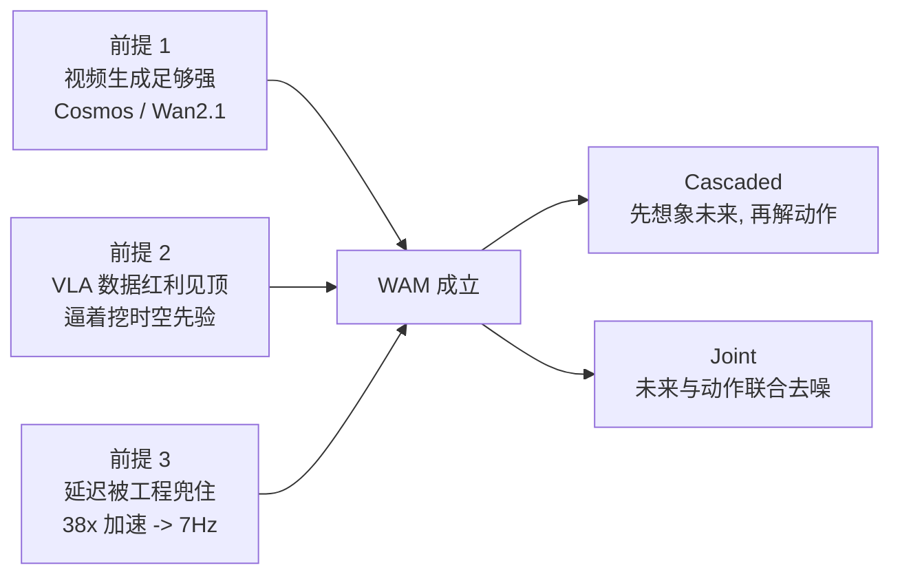
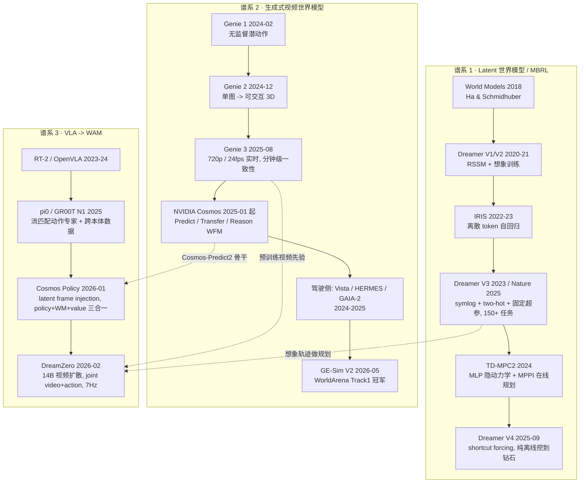
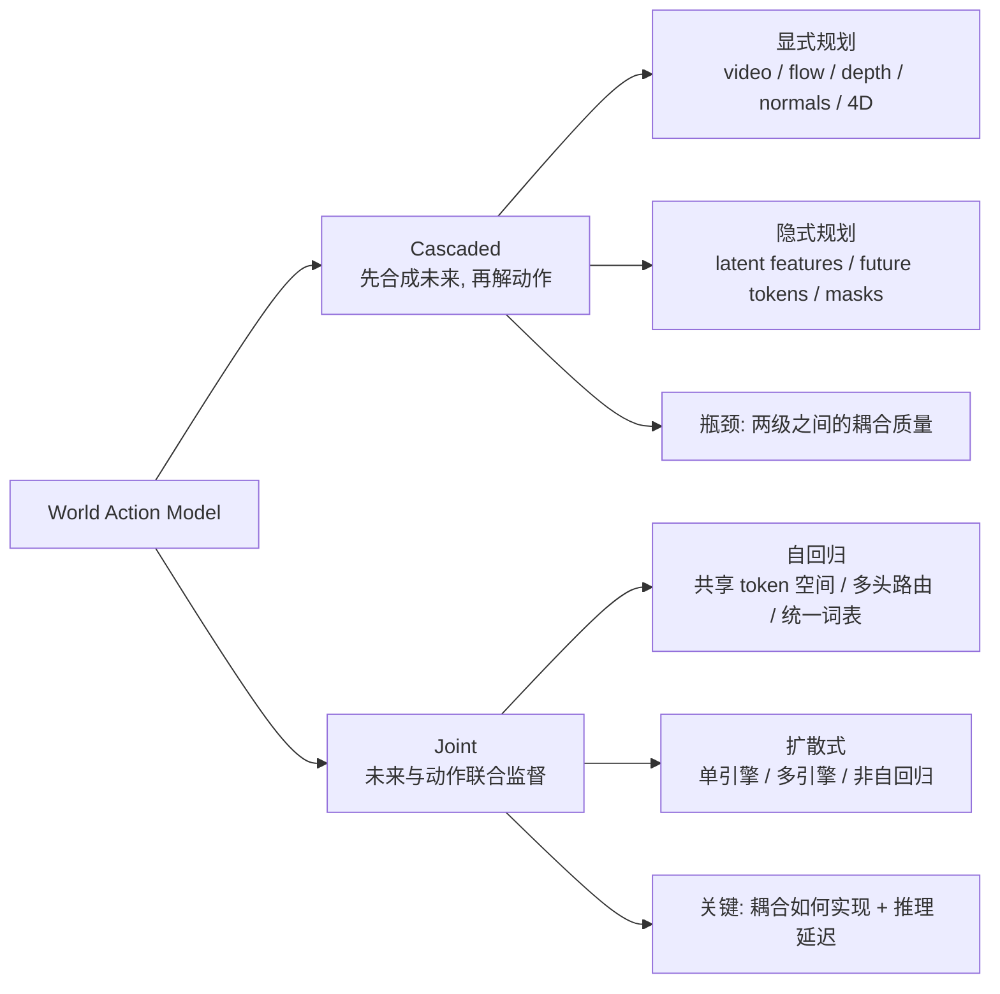

> **系列导航**：本文是《具身智能》系列（[00 总览](/2026/08/25/embodied-ai-00-overview/) · [02 学习范式](/2026/08/25/embodied-ai-02-rl-il-sim2real/) · [05 VLA](/2026/08/25/embodied-ai-05-vla-foundation-models/)）的续篇，专门补上"世界模型"这一块。它与本站另一篇 [《RL 信用分配与奖励系数》](/2026/09/19/rl-credit-assignment-settlement/) 有直接接口——**想象轨迹里的信用分配**正是世界模型规划失效的核心原因之一（见 §5.3）。建议先读系列 05（VLA 是什么），再看本文。

## §0 TL;DR

> **TL;DR 1｜三个公式分清三个词**。VLA 学 $p(a\mid o,l)$，世界模型（WM）学 $p(o'\mid o,a)$，世界动作模型（WAM）学 $p(o',a\mid o,l)$。差别不在模型大小，而在**未来状态预测是不是策略的一部分**：如果一个模型只是拿视频扩散模型当 backbone 提取特征、动作头仍在外面，那它是 VLA；只有当"想象出来的未来"直接参与动作的生成或筛选时，它才是 WAM。

> **TL;DR 2｜2026 年的"世界模型"是三条几乎不交流的谱系**。① latent 世界模型 / MBRL（Dreamer V3/V4、IRIS、TD-MPC2）——学隐空间动力学，在想象里做 actor-critic 或 MPC；② 生成式视频世界模型（Genie 3、Cosmos、GE-Sim V2）——预测像素，用于数据生成与闭环评测；③ VLA → WAM（π0/GR00T → **Cosmos Policy / DreamZero**）。前两条各说各话，第三条是 2026 年真正把它们缝起来的地方。

> **TL;DR 3｜架构的分水岭是"你要不要可检查的中间表示"**。Cascaded（先想象未来、再解动作）与 Joint（未来与动作联合去噪）的分界线，不是技术优劣，而是：**你是否需要把想象出来的未来给人看、给奖励模型筛、给数据回流用**。要 → 保留显式未来输出；只追求最快闭环 → 直接策略模式。

> **TL;DR 4｜必须双轴评测，单轴都是耍赖**。世界建模能力（保真 / 物理常识 / 动作可信性）× 动作策略能力（仿真基准 / 真机）。任何 WAM 论文如果只报仿真成功率、不报真机、也不报"世界模型保真 × 策略成功"的相关性，就该被降级看待。

> **TL;DR 5｜世界模型不是即插即用，且"想象多远"是个要扫的超参**。PPO/SAC 直接套 DreamerV3 都不稳定；模型误差在想象中会累积，本文 §5.1 的实验显示：当模型动力学的谱半径 $\rho(\hat A)=0.90$ 时 32 步误差仍被压在 0.11，$\rho=1.00$ 时线性增长到 6.95，$\rho=1.05$ 时指数爆炸到 17.95。**"想象越深越好"是个幻觉。**

---

## §1 定义与形式化：三式定边界

### 1.1 三个概率表达式

三条谱系可以用三个概率表达式一次分清（定义来自 [WAM Survey, Fudan / 上海创智 / NUS](https://openmoss.ai/Awesome-WAM/)）：

| 范式 | 学什么 | 性质 |
|:---|:---|:---|
| **VLA** | $p(a \mid o, l)$ | 观测 + 语言直接映射动作。**反应式**，不显式表示未来 |
| **World Model (WM)** | $p(o' \mid o, a)$ | 预测世界如何演化。**预测式**，本身不是策略 |
| **World Action Model (WAM)** | $p(o', a \mid o, l)$ | **未来状态合成与可执行动作在一个策略框架内联合学习** |

判定边界（很重要，否则 WAM 这个词会被滥用）：

> **未来状态预测必须是策略的一部分**，而不是一个辅助 backbone 或外部模拟器。

按这条标准，几类容易混淆的做法要被划出去：

- ❌ 用视频模型做 **表征预训练**、再在上面接一个动作头 → 还是 VLA（视频模型是 backbone）；
- ❌ 用外部模拟器（Isaac / MuJoCo）做 rollout 再训练策略 → 是 sim-to-real，不是 WAM；
- ❌ 只在训练时让模型预测未来当作**辅助 loss**、推理时丢掉 → 是正则化技巧，不是 WAM；
- ✅ 推理时先生成未来、再由未来反推动作（Cascaded），或未来与动作联合去噪（Joint）→ WAM。

### 1.2 更完整的分解

把本体感觉与规划写进去，WAM 在推理时做的是这样一件事：

$$
p(\text{future video},\ \text{future action} \mid o_{\le t},\ l,\ s_t^{\text{proprio}})
= \underbrace{p(\hat{o}_{t+1:t+H} \mid \cdot)}_{\text{visual planning / 世界预测}}
\cdot \underbrace{p(a_{t:t+K} \mid \hat{o}_{t+1:t+H},\ \cdot)}_{\text{inverse dynamics}}
$$

两项的相对权重，就决定了它是 Cascaded 还是 Joint（§3）。

| 数学符号 | 含义 | 代码里对应 |
|:---|:---|:---|
| $o_{\le t}$ | 历史视觉观测 | `past_frames / video context` |
| $l$ | 语言指令 | `text_emb`（T5-XXL） |
| $s_t^{\text{proprio}}$ | 本体状态（关节角 / 末端位姿） | `proprio` |
| $\hat{o}_{t+1:t+H}$ | 想象出的未来帧 | `future_video_latent` |
| $a_{t:t+K}$ | 动作 chunk | `action_chunk` |
| $V(s')$ | 值函数（期望累计回报） | `value_frame`（Cosmos Policy 把它也编成潜帧） |

> **关键设计分歧**：上面这个分解可以是一个模型端到端 joint denoise（**DreamZero**），也可以是两个模型级联（**Cascaded WAM**）；也可以是"一个模型、三种潜帧"（**Cosmos Policy**）。这是本文 §3 要讲清的主线。

### 1.3 为什么是 2026 年才出现 WAM

VLA 和世界模型都不是新东西，WAM 到 2026 才成气候，是因为三个前提同时满足了：

1. **视频生成足够强**。Cosmos-Predict2、Wan2.1 这类模型已经能生成物理上说得过去的连续帧——它们本身就是"世界模型的预训练权重"，不用从零学动力学。
2. **VLA 的数据红利见顶**。跨本体遥操作数据（DROID、AgiBot、Open X-Embodiment）量级到了瓶颈，靠堆数据涨点变慢，逼着大家去挖"视频里的时空先验"。
3. **工程手段兜住了延迟**。14B 的视频模型做闭环控制，原始推理速度是不可用的；DreamZero 靠一整套优化拿到 **38× 加速 → 7Hz**（§5.2），这才让"大模型 + 闭环"从 PPT 变成能跑的东西。



---

## §2 三条谱系与时间线



### 2.1 谱系 1：Latent 世界模型（理论地基）

| 模型 | 核心 | 一句话 |
|:---|:---|:---|
| **Dreamer V3**（[arXiv:2301.04104](https://arxiv.org/abs/2301.04104)，[Nature 2025](https://www.nature.com/articles/s41586-025-08744-2)） | RSSM（确定性 $h_t$ + 随机 $z_t$，32 个 32 类离散变量） | 三个稳定性设计让它**用一套固定超参**跨 8 个领域 150+ 任务：① **symlog** 预测压缩量级；② **two-hot** 离散回归代替 MSE；③ 回报归一化 + KL balance。首个无人类数据、无课程学习从像素挖到 Minecraft 钻石 |
| **IRIS** | VQ-VAE token 化 + 自回归 Transformer | 把世界模型当语言模型写；代价是 **tokenizer 有损**，空间细节是天花板 |
| **TD-MPC2** | 极简 MLP 隐动力学 + MPPI 在线规划 | 样本效率高、结构轻；代价是**安全约束/长期约束天生难处理**（微电网实测里违反度比 DreamerV3 高约一个数量级） |
| **Dreamer V4**（[arXiv:2509.24527](https://arxiv.org/abs/2509.24527), 2025-09） | causal tokenizer + **shortcut forcing** 动力学 | 首个**纯离线**从像素拿到 Minecraft 钻石，用 100× 更少数据大幅超过 OpenAI VPT offline agent |

#### Dreamer V3 的三个稳定性设计，到底在解决什么

很多解读只列结论（"用 symlog 和 two-hot 就稳了"），不解释为什么。这里跑一个实验把它讲透。

问题是这样：RL 里的回报/价值目标经常跨好几个数量级（Minecraft 里"砍到一块木头"和"挖到钻石"的回报量级差就是这么大）。用 MSE 直接回归这种目标，梯度会被最大量级的那几个样本完全主导。

```python
import numpy as np
rng = np.random.default_rng(0)
D, N = 8, 1024
X = rng.normal(0, 1, size=(N, D))
w_star = rng.normal(0, 1, size=D)
y = (10 ** rng.uniform(0, 4, size=N)) * (X @ w_star)      # 目标跨 4 个数量级

def symlog(x): return np.sign(x) * np.log1p(np.abs(x))
def symexp(x): return np.sign(x) * np.expm1(np.abs(x))
B, LO, HI = 255, -20.0, 20.0                              # 255 个桶 (DreamerV3 的设置)
edges = np.linspace(LO, HI, B + 1); centers = 0.5 * (edges[:-1] + edges[1:])

def twohot(ys):
    ys = np.clip(ys, LO, HI)
    idx = np.clip(np.searchsorted(edges, ys, side="right") - 1, 0, B - 2)
    lo, hi = edges[idx], edges[idx + 1]; wh = (ys - lo) / (hi - lo)
    T = np.zeros((len(ys), B))
    T[np.arange(len(ys)), idx] = 1 - wh; T[np.arange(len(ys)), idx + 1] = wh
    return T
Tt = twohot(symlog(y))

def train(loss, lr, steps=400):
    if loss == "mse":
        w = np.zeros(D)
        for _ in range(steps):
            w -= lr * 2.0 * X.T @ (X @ w - y) / N
        return X @ w
    if loss == "symlog_mse":
        w = np.zeros(D)
        for _ in range(steps):
            w -= lr * 2.0 * X.T @ (X @ w - symlog(y)) / N
        return symexp(X @ w)
    W = np.zeros((D, B))                                  # 输出 B 个 logit 的分类头
    for _ in range(steps):
        Z = X @ W; Z -= Z.max(1, keepdims=True); P = np.exp(Z); P /= P.sum(1, keepdims=True)
        W -= lr * X.T @ (P - Tt) / N
    Z = X @ W; Z -= Z.max(1, keepdims=True); P = np.exp(Z); P /= P.sum(1, keepdims=True)
    return symexp(P @ centers)

# [1] 初始化时, 逐样本梯度范数有多离散
print("[1] 初始化时逐样本梯度范数（N=1024, 目标跨 1e0~1e4）")
for name, g in [("MSE(原尺度)", np.linalg.norm(2.0 * X * (-y)[:, None], axis=1)),
                ("symlog+MSE",  np.linalg.norm(2.0 * X * (-symlog(y))[:, None], axis=1)),
                ("two-hot CE",  np.linalg.norm(X[:, :, None] * (1.0/B - Tt)[:, None, :], axis=(1, 2)))]:
    print(f"    {name:>12s}: max/min = {g.max()/max(g.min(),1e-12):9.2e}   std = {g.std():9.2e}")

# [2] 同一固定 lr, 训练 400 步后的中位相对误差
print("\n[2] 同一批数据、同一固定 lr，训练 400 步后的中位相对误差")
small = np.abs(y) < 10
for loss, lr in [("mse", 1e-3), ("symlog_mse", 1e-3), ("twohot", 1e-2)]:
    p = train(loss, lr)
    print(f"    {loss:>11s} (lr={lr:.0e}): 全体 = {np.median(np.abs(p-y)/np.abs(y)):8.3f}"
          f" | |y|<10 子集 = {np.median(np.abs(p[small]-y[small])/np.abs(y[small])):8.3f}")
print(f"\n    小量级样本占比: {small.mean()*100:.1f}%")
```

**实测输出**：

```
[1] 初始化时逐样本梯度范数（N=1024, 目标跨 1e0~1e4）
        MSE(原尺度): max/min =  2.63e+06   std =  4.33e+04
      symlog+MSE: max/min =  4.26e+02   std =  1.80e+01
      two-hot CE: max/min =  6.07e+00   std =  5.85e-01

[2] 同一批数据、同一固定 lr，训练 400 步后的中位相对误差
            mse (lr=1e-03): 全体 =    4.746 | |y|<10 子集 =  259.718
     symlog_mse (lr=1e-03): 全体 =    0.984 | |y|<10 子集 =    0.786
         twohot (lr=1e-02): 全体 =    1.000 | |y|<10 子集 =    0.991

    小量级样本占比: 21.4%
```

**怎么读这张表**：

1. **梯度离散度降了 5 个数量级**。MSE 下最大样本与最小样本的梯度范数之比是 $2.6\times10^6$，symlog 后降到 $4.3\times10^2$，two-hot 后只有 $6.07$。因为 two-hot 的梯度是 $\text{softmax} - \text{target}$，天然落在 $[-1,1]$。**这才是一套固定超参能跨 150+ 任务的真正原因**——不是模型变强了，是梯度尺度被驯服了。
2. **小量级样本不再被牺牲**。占比 21.4% 的小量级样本（对应稀疏关键事件：挖到钻石、任务成功），MSE 下的相对误差是 **259.7**（等于完全没学到），symlog 下是 **0.786**。如果关键事件恰好是小量级的，MSE 会直接把它当噪声丢掉。
3. 🛑 **别误读 two-hot 那一行**。在这个玩具线性模型上，two-hot 的**精度**并不比 symlog 好（都是 1.0 左右，因为线性模型容量不够，谁都拟合不好）。它的价值在于**梯度有界**，也就是第 1 条。Dreamer V3 是两者一起用：symlog 压量级，two-hot 把回归变成分类以稳定梯度。

> **方法论注记**：这个实验是**玩具复现**，不是 Dreamer V3 论文的复现。它演示的是机制（梯度尺度），不是结果（150 任务）。真实收益要在 DreamerV3 官方实现上验证。

#### Dreamer V4：从"在线想象"走向"纯离线可扩展"

Dreamer V4（[arXiv:2509.24527](https://arxiv.org/abs/2509.24527)）是本谱系 2025 下半年最重要的更新，三阶段训练：

```
Phase 1  世界模型预训练   : 在视频上训 causal tokenizer, 再在 token 化视频(+少量动作)上训动力学
Phase 2  Agent 微调       : 把 task embedding 插入动力学 transformer, 长出 policy / reward / value 头
Phase 3  想象训练         : 在世界模型 + policy 头生成的轨迹上, 优化 policy 头(RL) 与 value 头
```

三个技术点值得记：

- **Shortcut forcing**：动力学模型在**数据空间**而非潜空间上做去噪（论文明确说这是为了"防止高频网络输出导致的误差累积"），并且训练时就把"步数"作为条件（$K=4$ 次前向生成一帧），从而支持**单 GPU 实时交互**推理。这与 DreamZero 的"把真实观测写回 KV cache"（§3.3）是**同一个问题的两种解法**：都在对抗自回归生成的误差累积。
- **数据效率的关键在"解耦"**：论文说"世界模型只从少量数据学通用动作条件化，因而大部分知识可以来自大量无标注视频"。这是 latent 谱系给出的、与 WAM 谱系完全一致的答案——**视频先验与动作对齐是可以分开学的**。
- **离线挖钻**：需要选出超过 **20,000** 个鼠标键盘动作的原始像素序列，是首个纯离线（无环境交互）达成的方法，且比 OpenAI VPT offline agent 少用 **100×** 数据。

> 一个诚实的提醒：Dreamer V4 的这篇我读的是原文结构与方法部分，**具体的 ablation 数字未在本文引用**，需要的话去看论文 Table。

#### 一个反直觉的实证：世界模型不是即插即用

消融显示 **PPO + DreamerV3、SAC + DreamerV3 都不稳定**。原因有两条：

1. 模型误差会通过 **off-policy 价值估计**被放大；
2. 模型与策略**同时更新**，导致目标漂移（moving target）。

完整的 DreamerV3 靠"隐空间想象 + 价值尺度归一 + 专门的 actor-critic 学习机制"系统处理了这个耦合。**这和信用分配那篇里"critic 与策略的耦合"是同一个问题的两个版本**——模型提供了一个额外的、会漂移的目标分布。

### 2.2 谱系 2：生成式视频世界模型（供给端）

| 模型 / 平台 | 时间 | 关键事实 |
|:---|:---|:---|
| **Genie 3**（DeepMind） | 2025-08 | 720p @ 24fps 实时导航，一致性可达数分钟，新增"可提示世界事件"；2026-01 以 **Project Genie** 向订阅用户开放 |
| **Waymo World Model** | 2025- | Genie 3 衍生的驾驶版，支持驾驶动作/场景布局/语言三种控制，用于 robotaxi 边缘场景仿真 |
| **NVIDIA Cosmos** | 2025-01 起 | Predict / Transfer / Reason 系列 WFM；官方称下载超 200 万次，Skild AI、Figure、Uber 在用它生成合成数据 |
| **GAIA-2**（Wayve） | 2025-12 | 多相机驾驶生成世界模型，已开源 |
| **Vista**（OpenDriveLab, NeurIPS 2024） | 2024 | 通用可泛化驾驶世界模型，长时序预测，开源 → 事实 baseline |
| **HERMES**（ICCV 2025） | 2025 | 3D 场景理解 + 生成统一 |
| **VideoWorld**（字节 Seed） | CVPR 2025 → 二代 CVPR 2026 | 潜变量动力学做无标注视频学习 → 二代做跨域知识迁移 |
| **GE-Sim V2**（智元, [arXiv:2605.27491](https://arxiv.org/abs/2605.27491)） | 2026-05 | **WorldArena Track1 冠军，68.26 分**；40–50 秒长推演的画面质量仍优于基线前 10 秒；用奖励模型做 rollout 自动筛选并**数据回流**给策略 |

> **GE-Sim V2 最值得学的不是分数，是方法论**。它不只报"成功率一致"，而是做了 **case-by-case rollout 对比 + 混淆矩阵**，量化"世界模型作为策略评测器"的可靠性。这是"世界模型能不能当裁判"这个关键命题目前最有说服力的证据（§4.3 会给一个可复现的量化口径）。

产业侧信号（一笔带过，保持批判口径）：World Labs 2025-11 发布 **Marble**（可导出、可编辑的持久化 3D 环境）并获大额融资；Yann LeCun 离开 Meta 创立 **AMI Labs**（巴黎，专注世界模型）。这些都说明赛道已经过了科学项目阶段——**但也说明 hype 成分不小**。另一条反向信号：Sora 应用 2026-03 关停。

### 2.3 谱系 3：VLA → WAM（本文核心）

#### VLA 的短板

DreamZero 的表述很到位：VLA 从 VLM 继承了语义先验——**知道"做什么"，但缺"如何执行新颖物理运动"的时空先验**。它能执行"把可乐罐移到某人那里"（如果训练里学过 move 这个技能），但在"解鞋带""熨衣服"这类训练中没见过的**运动**上会失败；而且 VLA 在静态图文上预训练，对物理动态的理解天生受限。

#### Cosmos Policy：给 WAM 最简洁的一版陈述

> 别为动作单独造轮子，**把动作也塞进视频模型的扩散过程**。

**方法**：**latent frame injection**。把本体状态、动作 chunk、未来状态、值函数全部编码成视频潜序列里的"帧"，序列结构为 $(s, a, s', V(s'))$，多相机视角也直接拼帧。**没有任何架构修改**，单阶段后训练。

**结果**（[arXiv:2601.16163](https://arxiv.org/abs/2601.16163) 摘要原文）：LIBERO **98.5%**、RoboCasa **67.1%** 平均成功率，"outperforming strong diffusion policies trained from scratch, video model-based policies, and state-of-the-art vision-language-action models fine-tuned on the same robot demonstrations"，并在真实双臂操作任务上取得最高平均分。

**部署双模**：直接策略（只出动作）已是 SOTA；加上 **best-of-N 模型规划**在困难任务上还能更高，代价是推理变慢（论文自己写"around 5 seconds to produce one action chunk"）。

#### DreamZero：把 WAM 直接当 zero-shot 策略

- **架构**：14B 自回归视频扩散模型（骨干 **Wan2.1-I2V-14B-480P**），对 video latent 与 action **联合 flow matching 去噪**；推理时执行完一个 action chunk 后把真实观测**写回 KV cache**，避免自回归视频生成的误差累积。
- **真机**：AgiBot G1 见到任务的**新环境**零样本平均任务进度 **62.2%**（最强预训练 VLA baseline 27.4%）；未见任务 **39.5%**（VLA baselines 16.3% 量级）。
- **跨本体**：只用 **10–20 分钟**其他机器人或人类的**纯视频**演示，未见任务相对提升 **>42%**；用 **30 分钟 play data** 完成新本体少样本适配且保留零样本泛化。
- **实时性**：CFG 并行、DiT caching、torch.compile/CUDA Graphs、NVFP4 量化、DreamZero-Flash 等累计 **38× 加速 → 14B 模型 7Hz 闭环**。
- **开源程度高**：checkpoint（DROID / AgiBot）、推理 server、训练入口、新本体适配指南均已公开。

> ⚠️ 上述数字来自 [arXiv:2602.15922](https://arxiv.org/abs/2602.15922) 摘要与二手解读，**本文未复现**，统一按 §7.2 的清单标注"待验证"。

---

## §3 架构：Cascaded vs Joint

### 3.1 分类骨架

WAM Survey 的分类法是本文组织方法学的骨架：



- **Cascaded**：先合成未来状态，再由独立动作模型解码。模块化清晰、可复用现成视频模型，**瓶颈在两级耦合**——想象得漂亮不等于动作可执行。
- **Joint**：未来与动作在一个共享模型里联合监督。**问题是耦合怎么做**（token 共享 / flow matching / 并行生成），以及延迟。

### 3.2 latent frame injection：Cosmos Policy 到底做了什么

这是我认为 2026 年 WAM 里**最巧妙也最省事**的一个设计。核心一句话：

> 视频扩散模型处理的本来就是一个"潜帧序列"。那么只要把动作、本体、值函数也**编码成潜帧**，它们就能原封不动地进同一个扩散过程——**不需要改任何架构**。

具体做法（[论文 §4 + 附录 A.1](https://arxiv.org/html/2601.16163v1)）：

1. 把非图像模态（本体、动作 chunk、值）**归一化到 $[-1,+1]$**；
2. 拉平成一维向量，然后**复制填充**到整个 $H'\times W'\times C'$ 的潜体积；
3. 用它**覆盖**序列中对应的那个占位帧。

对于"两个第三方相机 + 一个腕部相机"的平台，潜序列是 **11 帧**，顺序严格对应 $(s,a,s',V(s'))$：

| # | 帧内容 | # | 帧内容 |
|:--:|:---|:--:|:---|
| 1 | 空白占位 | 7 | 未来本体 $s'$ |
| 2 | 本体感知 $s$ | 8 | 未来腕部图像 |
| 3 | 腕部图像 | 9 | 未来相机 1 |
| 4 | 第三方相机 1 | 10 | 未来相机 2 |
| 5 | 第三方相机 2 | 11 | **未来状态值 $V(s')$** |
| 6 | **动作 chunk $a$** | | |

单相机平台可以省掉多余视角帧，只留 7 帧。

下面这段代码把 shape 演算跑一遍（玩具尺寸，论文符号记法一致）：

```python
import numpy as np
rng = np.random.default_rng(0)
Hp, Wp, Cp = 16, 28, 16                      # 潜空间中"一帧"的体积
VOL = Hp * Wp * Cp

def to_latent_frame(vec, name):
    """把任意一维向量塞进 H'xW'xC' 的潜体积: 归一化到 [-1,1] -> 复制填充"""
    v = np.asarray(vec, dtype=np.float64).ravel()
    lo, hi = v.min(), v.max()
    v = 2.0 * (v - lo) / max(hi - lo, 1e-12) - 1.0
    reps = VOL // v.size
    if reps == 0:
        raise ValueError(f"{name}: {v.size} > {VOL}, 一个潜帧装不下")
    return np.tile(v, reps)[:VOL].reshape(Hp, Wp, Cp), reps

K, d_act = 16, 7                             # 动作 chunk: 16 步 x 7 DoF
actions = rng.normal(0, 1, size=(K, d_act))
proprio = rng.normal(0, 1, size=d_act)
value   = np.array([0.87])

a_frame, reps_a = to_latent_frame(actions, "action chunk")
p_frame, reps_p = to_latent_frame(proprio, "proprio")
v_frame, reps_v = to_latent_frame(value,   "value")
print(f"action chunk ({K}x{d_act}={actions.size}) -> 复制 {reps_a} 次填满 {VOL}")
print(f"proprio ({proprio.size}) -> 复制 {reps_p} 次 | value ({value.size}) -> 复制 {reps_v} 次")
print(f"每帧 shape: {a_frame.shape}  值域: [{a_frame.min():.2f}, {a_frame.max():.2f}]")

# 拼成 11 帧: 与"11 帧视频 latent"完全同形
seq = np.stack([np.zeros((Hp,Wp,Cp))] + [rng.normal(size=(Hp,Wp,Cp)) for _ in range(5)]
               + [a_frame] + [rng.normal(size=(Hp,Wp,Cp)) for _ in range(3)] + [v_frame])
print("潜序列 shape:", seq.shape)
# 反解动作: 不需要 VAE 解码, 直接平均 + 反映归一化
flat = a_frame.reshape(-1).reshape(-1, reps_a).mean(1)
print("反解动作 shape:", flat.shape, "| 前 3 个值:", np.round(flat[:3], 3))
```

**实测输出**：

```
action chunk (16x7=112) -> 复制 64 次填满 7168
proprio (7) -> 复制 1024 次 | value (1) -> 复制 7168 次
每帧 shape: (16, 28, 16)  值域: [-1.00, 1.00]
潜序列 shape: (11, 16, 28, 16)
反解动作 shape: (112,) | 前 3 个值: [0.105 0.053 0.175]
```

三个值得记住的点：

1. **同形是关键**。$(11, H', W', C')$ 和"11 帧视频 latent"在张量层面完全一样，所以**原视频模型的位置编码、时间注意力、去噪调度全部可以复用**。这就是为什么论文能说 "no architectural modifications"。
2. **不需要 VAE 解码就能取出动作**。动作是被直接注入潜空间的，取出时只需平均 + 反映归一化，省掉一次解码。这也是它比"生成未来图像再解码再反推动作"快的根本原因。
3. **顺序即因果**。$(s, a, s', V(s'))$ 是从左到右的因果顺序，所以可以做**自回归解码**：先出动作 → 再出未来 → 再出值。这是后面 best-of-N 规划能成立的前提。

#### 同一个模型怎么同时当 policy / world model / value

扩散损失形式没变（EDM 去噪得分匹配）：

$$
\mathcal{L}(D_\theta,\sigma)=\mathbb{E}_{x_0,c,n}\left[\lVert D_\theta(x_0+n,\ \sigma,\ c)-x_0\rVert_2^2\right]
$$

变的只是**条件掩码**——序列里哪一部分当作条件（干净）、哪一部分当作生成目标（加噪）。训练数据按功能混合：

| 数据占比 | 训练的能力 | 条件 → 目标 |
|:---|:---|:---|
| 50%（演示数据） | **策略** $p(a,s',V(s')\mid s)$ | $s \to a,s',V(s')$ |
| 25%（rollout 数据） | **世界模型** $p(s',V(s')\mid s,a)$ | $s,a \to s',V(s')$ |
| 25%（rollout 数据） | **值函数** $p(V(s')\mid s,a,s')$ | $s,a,s' \to V(s')$ |

**这就是"一个模型三种身份"的全部秘密：同一个权重、同一个损失，靠喂不同的条件掩码切换功能。**

⚠️ 还有一个容易忽略的细节：因为动作生成要求高精度，论文把噪声采样从纯 log-normal 改成了 **0.7 概率 log-normal + 0.3 概率 $U[1,85]$** 的混合分布（更多大噪声样本），推理时把 $\sigma_{\min}$ 从 0.002 提到 4。

#### 部署双模与 best-of-N

论文用了**两个 checkpoint**：

- **policy model**：原始 Cosmos Policy，只负责出动作；
- **planning model**：用 rollout 数据微调过的版本（其中 90% batch 用于世界模型与值函数、10% 用于策略），负责给未来打分。

best-of-N 的流程（论文原文）：

> (1) sample multiple action proposals from the policy, (2) use the planning model to predict the future state and value for each proposal, (3) select and deploy the action that leads to the predicted state with the highest predicted value.

为了鲁棒，还做了集成：每个动作查 3 次世界模型、每个未来状态查 5 次值函数，共 15 次预测，用 **majority mean**（先按阈值判断多数预测成功还是失败，再在多数派内部取平均）聚合。

解码策略也分两套：

| 模式 | 解码方式 | 速度 | 质量 |
|:---|:---|:---|:---|
| 直接策略 | **并行解码**，丢弃未来与值 | 快（LIBERO/RoboCasa 5 步去噪） | 已是 SOTA |
| 规划策略 | **自回归解码**（动作 → 未来 → 值） | 慢（约 5 s / action chunk） | 更高 |

### 3.3 Joint 的另一半：DreamZero 的联合流匹配

DreamZero 走的是 Joint 路线的扩散式分支：

- 骨干是 **Wan2.1-I2V-14B-480P**，video latent 与 action **联合 flow matching 去噪**——也就是"动作绑定到想象的未来"这件事是在**同一次去噪**里完成的，不是两级级联。
- **关键工程细节：把真实观测写回 KV cache**。自回归生成长视频时，误差会随时间累积；DreamZero 每执行完一个 action chunk，就把**真实**观测写回 KV cache，把想象的轨迹重新"钉"回现实。这和 Dreamer V4 的 shortcut forcing（§2.1）是**同一个问题的两种解法**。

> **一个值得写进选型清单的判据**：如果你需要"想象出来的未来"作为**可检查的中间产物**（给人看、给奖励模型筛、给数据回流用），就该选保留显式未来输出的方案（Cascaded，或 Cosmos Policy / DreamZero 这种 Joint 但显式输出未来的）；如果只追求最快闭环，直接策略模式更好。

### 3.4 两条路线的对照

| 维度 | Cascaded | Joint（扩散式） |
|:---|:---|:---|
| 可复用现成视频模型 | ✅ 强（两级独立） | ⚠️ 需改造成联合去噪 |
| 中间表示可检查 | ✅ 天然有 | ✅ 需显式输出未来帧（两家都保留了） |
| 耦合质量风险 | ❌ **两级耦合是主要失败模式** | ✅ 联合监督，耦合更紧 |
| 推理延迟 | 两级串行，慢 | 一次去噪，但模型更大 |
| 训练复杂度 | 需分别训两个模块 | 单阶段（Cosmos Policy 强调这一点） |
| 代表工作 | 各类 video→IDM 方案 | Cosmos Policy、DreamZero |

---

## §4 评测：必须双轴

**WAM 不能被"画面像不像"单独评判，也不能只看任务成功率。**

### 4.1 轴一：世界建模能力

| 层次 | 指标 / 基准 | 评什么 |
|:---|:---|:---|
| **视觉保真** | PSNR / SSIM（低层）；LPIPS、DreamSim、DINO（感知与语义一致性）；FVD（分布级真实感与时序质量） | 像素像不像 |
| **物理常识** | VideoPhy、PhyGenBench、VBench-2.0、**WorldModelBench**、**Physics-IQ**、**WorldScore**、**EWMBench** | 物理对不对 |
| **动作可信性** | **WorldSimBench**、**IDM Turing Test** | 生成的未来是否保留了足够可反推动作的信息 |

第三层最容易被忽略，但对 WAM 最关键：**如果想象出来的未来里，连一个逆动力学模型都反推不出合理动作，那这个"未来"对控制毫无价值。**

**WorldArena**（CVPR 2026 世界模型赛道）是目前最权威的具身榜单：16 项细分指标 + 3 大真实应用任务，从**视觉质量、运动质量、内容一致性、物理遵循度、3D 准确性、可控性**六个方面考察。智元 GE-Sim V2 以 68.26 分获 Track1 冠军。

### 4.2 轴二：动作策略能力

| 形态 / 场景 | 基准 |
|:---|:---|
| 通用操作（多任务、长程、语言条件） | Meta-World、RLBench、ManiSkill、LIBERO、RoboCasa、GemBench、CALVIN |
| 双臂 / 人形（更高 DoF 协调） | RoboTwin、BiGym、HumanoidBench、HumanoidGen |
| 移动操作（导航 + 操作） | ManipulaTHOR、HomeRobot、BEHAVIOR-1K |
| 接触 / 形变（非刚体） | SoftGym、PlasticineLab、DaXBench、TacSL、ManiFeel |
| **真机部署** | **RoboArena**、**RoboChallenge**、**Maniparena** |

> **立场**：任何 WAM 论文如果只报仿真成功率、不报真机、也不报"世界模型保真 × 策略成功"的相关性，就该被降级看待。

### 4.3 "世界模型当裁判"到底靠不靠谱：一个可复现的量化口径

Cosmos Policy 的 best-of-N、GE-Sim V2 的 rollout 筛选，本质都在做同一件事：**用模型的预测给候选动作排序，然后执行排第一的那个**。这件事成立的充要条件是——**模型的排序与真实排序高度相关**。

下面这个实验把它量化。构造一个带模型误差与想象噪声的线性动力学，用模型给 600 条候选动作序列打 $H$ 步累计回报分，与真环境的真实回报比较：

```python
import numpy as np
rng = np.random.default_rng(0)
d, m = 6, 3
A = rng.normal(0, 1, (d, d)); A *= 0.90 / max(abs(np.linalg.eigvals(A)))   # 真实动力学(稳定)
Bm = rng.normal(0, 1, (d, m)); Q = np.eye(d)

def cum_ret(x0, Mx, Mb, seqs, H, sigma=0.0):
    """sigma>0 = 想象时每步注入的随机扰动 (模型自身的不确定性)"""
    S = seqs.shape[0]; x = np.repeat(x0[None, :], S, axis=0); tot = np.zeros(S); g = 1.0
    for t in range(H):
        a = seqs[:, t, :]
        tot += g * (-np.einsum("sd,dd,sd->s", x, Q, x) - 0.1 * np.einsum("sm,sm->s", a, a))
        x = x @ Mx.T + a @ Mb.T
        if sigma > 0: x = x + rng.normal(0, sigma, size=x.shape)
        g *= 0.97
    return tot

def make_model(eps):
    E = rng.normal(0, 1, (d, d)); E *= eps / np.linalg.norm(E, 2)
    return A + E, Bm

Hs = [1, 2, 4, 8, 16, 32]
print("列 = 想象步数 H:", Hs)
for eps, sigma in [(0.02, 0.0), (0.05, 0.2), (0.10, 0.5)]:
    Ah, Bh = make_model(eps)
    row_p, row_eff = [], []
    for H in Hs:
        S = 600
        seqs = rng.normal(0, 0.5, size=(S, max(Hs), m))
        x0 = rng.normal(0, 1, size=d)
        r_true = cum_ret(x0, A,  Bm, seqs, H)
        r_pred = cum_ret(x0, Ah, Bh, seqs, H, sigma=sigma)
        row_p.append(np.corrcoef(r_pred, r_true)[0, 1])
        k = S // 10
        g_model  = r_true[np.argsort(-r_pred)[:k]].mean() - r_true.mean()
        g_oracle = r_true[np.argsort(-r_true)[:k]].mean() - r_true.mean()
        row_eff.append(g_model / g_oracle)     # 选优效率: 相对"全知 oracle"拿到多少
    print(f"eps={eps:.2f}, sigma={sigma:.1f}")
    print("  Pearson :", " ".join(f"{v:6.3f}" for v in row_p))
    print("  选优效率:", " ".join(f"{v:6.3f}" for v in row_eff))
```

**实测输出**：

```
列 = 想象步数 H: [1, 2, 4, 8, 16, 32]
eps=0.02, sigma=0.0
  Pearson :  1.000  1.000  1.000  1.000  1.000  1.000
  选优效率:  1.000  1.000  1.000  1.000  1.000  1.000
eps=0.05, sigma=0.2
  Pearson :  1.000  0.978  0.979  0.972  0.971  0.958
  选优效率:  1.000  0.956  0.984  0.966  0.964  0.955
eps=0.10, sigma=0.5
  Pearson :  1.000  0.882  0.843  0.849  0.837  0.846
  选优效率:  1.000  0.802  0.847  0.907  0.784  0.877
```

**怎么读**：

1. **模型准确时（eps=0.02, 无想象噪声）**，选优效率全程 1.000——best-of-N 等价于全知 oracle，规划收益 100% 拿到。
2. **模型中等偏差（eps=0.05, sigma=0.2）**，选优效率仍有 **0.955–0.984**，损失不到 5%。**这是个好消息**：世界模型不需要很准就能当裁判。
3. **模型明显变差（eps=0.10, sigma=0.5）**，Pearson 掉到 0.84 左右，选优效率掉到 **0.78–0.91**。也就是说：**即使世界模型已经比较差了，best-of-N 仍能拿到 oracle 收益的八成左右**。
4. 注意效率**不随 $H$ 单调下降**（eps=0.10 时 $H=16$ 的 0.784 比 $H=8$ 的 0.907 更低）。原因是折扣因子让远期误差的贡献衰减，而短期规划又受单步噪声的相对影响最大。**"规划视野"不是一个能靠直觉定的参数，必须扫。**

> ⚠️ 这是**玩具复现**（线性动力学 + 手工注入的误差），不是论文数据的复现。它的价值是给出一个**可复现的量化口径**：**选优效率 = 模型挑出的 top-k 真实回报增益 / 全知 oracle 的 top-k 增益**。建议任何声称"用世界模型做规划/筛选"的工作都报这个数。


---

## §5 工程：想象多远、延迟、数据与成本

### 5.1 模型误差会累积，"想象越深越好"是幻觉

这是 **latent MBRL 与视频世界模型共有的第一性问题**。想象 $H$ 步，单步误差 $\varepsilon$ 会被动力学反复放大。误差的增长速度由**学到的动力学的谱半径 $\rho(\hat A)$** 决定：

$$
\lVert \hat x_H - x_H \rVert \;\lesssim\; \varepsilon \lVert x \rVert \sum_{k=0}^{H-1} \rho(\hat A)^k
\;=\;
\begin{cases}
\dfrac{\varepsilon\lVert x\rVert}{1-\rho}, & \rho < 1 \quad \text{(有界)}\\[6pt]
\varepsilon\lVert x\rVert H, & \rho = 1 \quad \text{(线性)}\\[6pt]
\varepsilon\lVert x\rVert\,\dfrac{\rho^H-1}{\rho-1}, & \rho > 1 \quad \text{(指数)}
\end{cases}
$$

跑一遍看量级差异（线性动力学，单步误差固定 $\varepsilon=0.02$）：

```python
import numpy as np
rng = np.random.default_rng(0)
d, m = 6, 3
A = rng.normal(0, 1, (d, d)); A *= 0.90 / max(abs(np.linalg.eigvals(A)))
Bm = rng.normal(0, 1, (d, m))
acts = rng.normal(0, 0.5, size=(64, m))

for rho in (0.90, 1.00, 1.05):
    E = rng.normal(0, 1, (d, d)); E *= 0.02 / np.linalg.norm(E, 2)
    Ah = A * (rho / 0.90) + E                    # 缩放谱半径 + 固定的单步误差
    x, xh = rng.normal(0, 1, size=d), None
    xh = x.copy()
    errs = {}
    for H in range(1, 33):
        a = acts[H - 1]
        x  = A  @ x  + Bm @ a                    # 真实轨迹
        xh = Ah @ xh + Bm @ a                    # 想象轨迹(不修正)
        if H in (1, 2, 4, 8, 16, 32):
            errs[H] = float(np.linalg.norm(xh - x))
    print(f"rho={rho:.2f}: " + " ".join(f"H={h}:{errs[h]:7.2f}" for h in (1,2,4,8,16,32)))
```

**实测输出**：

```
rho=0.90: H=1:   0.03 H=2:   0.05 H=4:   0.06 H=8:   0.12 H=16:   0.20 H=32:   0.16
rho=1.00: H=1:   0.19 H=2:   0.36 H=4:   0.46 H=8:   2.63 H=16:   7.99 H=32:   9.20
rho=1.05: H=1:   0.15 H=2:   0.36 H=4:   0.88 H=8:   4.01 H=16:  16.73 H=32:  42.69
```

**读法**：同样是 0.02 的单步误差，$\rho=0.90$ 时 32 步后误差仍被压在 **0.2 以内**（有界，且不再增长）；$\rho=1.00$ 时线性涨到 **9.20**；$\rho=1.05$ 时指数涨到 **42.69**——**同一个单步误差，只是动力学从"收缩"变成"微扩张"，32 步后的误差就差了 260 倍**。

这给出三条直接可用的工程结论：

1. **学动力学时要主动约束谱半径**（收缩性正则 / 潜空间归一化）。这不是玄学技巧，它直接决定你能想象多远。
2. **"想象步数"是个必须扫的超参**，不是越大越好。微电网的实证里是 **15 步最优、20 步不再改善**——这类数字**高度任务相关**，照抄别人的配置没有意义。
3. **Dreamer V4 的 shortcut forcing 与 DreamZero 的 KV cache 写回**，本质上都是在做同一件事：**在误差还没跑太远的时候，把轨迹钉回真实观测**。前者靠训练目标（在数据空间去噪，抑制高频误差），后者靠推理机制（真实观测回写）。

### 5.2 延迟：38× 是怎么来的

DreamZero 的 14B 模型要跑到 **7Hz 闭环**，原始推理速度是不可用的。加速手段是叠加出来的：

| 手段 | 作用 |
|:---|:---|
| **CFG 并行** | classifier-free guidance 的两次前向并行 |
| **DiT caching** | 复用跨去噪步的中间激活 |
| **torch.compile / CUDA Graphs** | 消除 kernel launch 与 Python 开销 |
| **NVFP4 量化** | 权重与激活降到 4-bit 浮点 |
| **DreamZero-Flash** | 减少去噪步数的专用蒸馏/加速变体 |

累计 **38×**。这个数字本身就是一条重要信息：**WAM 的瓶颈从来不是"能不能做"，而是"做不做得起闭环"**。

Cosmos Policy 那一侧的对照更直白：直接策略模式 LIBERO/RoboCasa 只需 **5 步去噪**且并行解码；一旦开启自回归规划，单个 action chunk 就要 **约 5 秒**——对动态任务基本不可用。论文自己的缓解手段是"用 N 张 GPU 并行跑 best-of-N"和"执行完整 action chunk 而非 receding-horizon"。

> 💡 **选型提示**：如果你的任务对延迟敏感（动态抓取、行走），**WAM 的规划模式基本不可用**，只能用直接策略模式。WAM 的规划收益主要兑现在**准静态的、失败代价高的**任务上。

### 5.3 与信用分配的接口

这是本文与本站 [《RL 信用分配与奖励系数》](/2026/09/19/rl-credit-assignment-settlement/) 的交叉点，值得单独说：

- 在想象轨迹里做 RL，回报是用**模型预测的状态**算出来的。模型误差会让 $\lambda$-return 系统性偏——**这是"长想象步数反而更差"的另一半原因**（另一半是 §5.1 的状态误差）。
- 信用分配越细（token 级 / step 级），对模型误差越敏感：一个错的中间状态会把 credit 指派给错误的决策点。
- **推论**：在世界模型里训练时，**粗粒度信用（序列级 / chunk 级）比细粒度更抗模型误差**。如果你在想象训练中发现细粒度方法反而更差，先怀疑模型误差，而不是先怀疑信用分配方法。

### 5.4 数据混合：四类数据各自的边际作用不清楚

| 类型 | 例子 | 已知作用 | 未知 |
|:---|:---|:---|:---|
| 机器人遥操作 | DROID、AgiBot、Open X-Embodiment | 提供动作对齐的监督 | 边际收益递减点在哪 |
| UMI 式人类演示 | 手持夹爪录制 | 低成本、场景多样 | 与真机动力学差异多大可接受 |
| 仿真 | Isaac / MuJoCo / RoboCasa | 无限量、可自动标注 | sim-to-real gap 的量化 |
| 网络 / 第一人称视频 | Ego4D、YouTube 教程 | **提供时空与物理先验** | 需要多少"对齐数据"才能激活 |

Dreamer V4 和 Cosmos Policy / DreamZero 在这一条上给出了**一致但不完整的答案**：**视频先验可以大量来自无标注视频，动作对齐只需少量数据**。但"少量是多少""配比怎么定"目前仍是玄学。

### 5.5 成本

Sora 级别的视频生成，日算力成本以千万美元计。这一条对学术界是硬约束：**能玩得起的 WAM 上限，取决于你能复用的预训练骨干的质量**。反过来说，这也是为什么 Cosmos Policy 的"不动架构、直接后训练"路线在工程上比"自研 WAM 架构"更有吸引力。

---

## §6 开放问题与选型

### 6.1 十二条开放问题

前 7 条来自 [WAM Survey](https://openmoss.ai/Awesome-WAM/) 的 open challenges，后 5 条是本文加的（偏工程与交叉）：

| # | 问题 | 为什么难 |
|:--:|:---|:---|
| 1 | **架构耦合**：Cascaded vs Joint 在同等规模/数据/协议下的系统比较 | 大家都在各自骨干与数据集上刷点，不可比 |
| 2 | **多模态物理状态**：RGB-only 缺触觉、力、声学、形变 | 这些恰恰是接触密集操作最重要的 |
| 3 | **数据混合设计**：四类数据各自的边际作用 | "配比"目前是玄学 |
| 4 | **长时程规划**：分布漂移、误差累积、时间抽象薄弱 | 见 §5.1 |
| 5 | **推理延迟与效率** | 见 §5.2，38× 是这个矛盾最好的注脚 |
| 6 | **评测与安全部署**：缺"想象的未来"与"执行的动作"之间的**因果一致性联合指标** | 现有指标都是单轴的 |
| 7 | 从"能生成"到"能可靠控制"的鸿沟本身 | — |
| 8 | **模型误差 × 信用分配的相互作用** | 见 §5.3 |
| 9 | **世界模型作为"裁判"的可靠性边界** | GE-Sim V2 给了正例，但失效条件没系统结论 |
| 10 | **跨本体迁移的机制**：为什么"纯视频"就能迁移？ | 有现象与量级，机制解释不足 |
| 11 | **视频骨干的选择与规模律** | Wan2.1-I2V-14B vs Cosmos-Predict2-2B，没有控制变量研究 |
| 12 | **成本**：学术界能玩得起的 WAM 上限在哪 | 见 §5.5 |

### 6.2 "我该不该上 WAM"：决策表

| 你的情况 | 建议 | 理由 |
|:---|:---|:---|
| 任务准静态、失败代价高（精密插入、长程装配） | ✅ **上 WAM + 规划** | best-of-N 的增益在这个区间最大（§4.3） |
| 任务动态、对延迟敏感（抓取飞行物、 locomotion） | ⚠️ 只上**直接策略模式** | 规划模式单 chunk 约 5 秒 |
| 数据极少（< 50 条演示/任务） | ✅ 优先 WAM | Cosmos Policy 每任务只用 50 条演示就是 SOTA |
| 需要跨本体 / 跨环境泛化 | ✅ 优先 WAM | DreamZero 的零样本与纯视频迁移是这个范式的强项 |
| 有可靠仿真器且任务可在仿真中穷举 | ❌ 直接用 MBRL / RL | 世界模型在这里没有额外价值 |
| 只有单相机、无本体传感 | ⚠️ 谨慎 | 潜帧布局可裁到 7 帧，但信息量下降明显 |
| 算力只有单卡、无预训练视频模型可复用 | ❌ 暂缓 | 见 §5.5 |

### 6.3 最小可行路线（今天要动手的话）

```
1. 选骨干        : Cosmos-Predict2-2B 或 Wan2.1-I2V (优先能直接拿到权重的)
2. 定潜帧布局    : 单相机 -> 7 帧 (s, a, s', V(s')); 多相机 -> 11 帧
3. 单阶段后训练  : 50% 演示(策略) + 25% rollout(世界模型) + 25% rollout(值函数)
4. 先跑直接模式  : 5 步去噪 + 并行解码, 拿到 baseline
5. 再上规划      : 用 rollout 数据按 90/10 微调出 planning model, 做 best-of-N
6. 必报的三个数  : 仿真成功率 / 真机成功率 / 选优效率(§4.3 口径)
```

第 6 步是本文最想强调的一条：**不要只报成功率**。

---

## §7 附录

### 7.1 论文与资源索引

**WAM / VLA 主线**

- [WAM Survey: World Action Models — The Next Frontier in Embodied AI](https://openmoss.ai/Awesome-WAM/)（Fudan / 上海创智 / NUS）— 首个 WAM 系统综述，定义、Cascaded vs Joint、数据、评测、开放问题
- [Cosmos Policy](https://arxiv.org/abs/2601.16163)（NVIDIA + Stanford, 2026-01）｜[项目页](https://research.nvidia.com/labs/dir/cosmos-policy/)｜[Cosmos Cookbook recipe](https://nvidia-cosmos.github.io/cosmos-cookbook/recipes/post_training/predict2/cosmos_policy/post_training.html)
- [DreamZero: World Action Models are Zero-shot Policies](https://arxiv.org/abs/2602.15922)（NVIDIA, 2026-02）｜[项目页](https://dreamzero0.github.io/)｜[代码](https://github.com/dreamzero0/dreamzero)
- π0 / GR00T N1（2025）、RT-2 / OpenVLA（2023-24）

**Latent 世界模型 / MBRL**

- [Dreamer V3](https://arxiv.org/abs/2301.04104)（Nature 2025: [s41586-025-08744-2](https://www.nature.com/articles/s41586-025-08744-2)）｜[官方实现](https://github.com/danijar/dreamerv3)
- [Dreamer V4](https://arxiv.org/abs/2509.24527)（2025-09）｜[项目页](https://danijar.com/dreamer4/)
- TD-MPC2、IRIS（[对比解读](https://www.roboticscenter.ai/de/blog/world-models-comparison-dreamer-iris-tdmpc)）

**生成式 / 视频世界模型**

- Genie / Genie 2 / **Genie 3**（DeepMind, 2024-02 → 2025-08）｜Waymo World Model
- **NVIDIA Cosmos**（WFM 系列：Predict / Transfer / Reason）
- 驾驶线：Vista（OpenDriveLab, NeurIPS 2024）、HERMES（ICCV 2025）、PreWorld（ICLR 2025）、AutoVLA（NeurIPS 2025）、GAIA-2（Wayve）
- VideoWorld / VideoWorld 2（ByteDance Seed, CVPR 2025 / 2026）
- **GE-Sim V2**（智元, [arXiv:2605.27491](https://arxiv.org/abs/2605.27491)）｜WorldArena Track1

**评测**

- WorldArena（CVPR 2026 世界模型赛道，16 指标 + 3 任务）
- 世界建模：WorldModelBench、EWMBench、WorldScore、Physics-IQ、VBench-2.0、VideoPhy、PhyGenBench、WorldSimBench、IDM Turing Test
- 策略：LIBERO、RoboCasa、ManiSkill、RLBench、CALVIN、GemBench；RoboTwin / BiGym / HumanoidBench；ManipulaTHOR / BEHAVIOR-1K；SoftGym / DaXBench / TacSL；RoboArena / RoboChallenge / Maniparena

**交叉引用（本站）**

- [RL 信用分配与奖励系数：GRPO 欠条的结算清单](/2026/09/19/rl-credit-assignment-settlement/) — 想象轨迹中的信用分配、模型误差与 $\lambda$-return
- [具身智能 05：VLA](/2026/08/25/embodied-ai-05-vla-foundation-models/) — WAM 的前身

### 7.2 未验证 / 待核对清单

以下每条本文都未复现，引用时请标注"待验证"：

| 声明 | 来源 | 状态 |
|:---|:---|:---|
| DreamZero：AgiBot seen 62.2% vs 27.4%；unseen 39.5%；cross-embodiment +42%；38× → 7Hz | [arXiv:2602.15922](https://arxiv.org/abs/2602.15922) + 二手解读 | 待验证 |
| Cosmos Policy 的 LIBERO 98.5% / RoboCasa 67.1% | [arXiv:2601.16163](https://arxiv.org/abs/2601.16163) **摘要原文** | ✅ 已核对（摘要口径） |
| Cosmos Policy：每任务 50 条演示、规划 +12.5% | 二手解读 | 待验证（未见于摘要） |
| GE-Sim V2：WorldArena 68.26 分夺冠、40–50s 长推演优于基线前 10s | [arXiv:2605.27491](https://arxiv.org/abs/2605.27491) + 媒体报道 | 待验证（媒体口径） |
| Genie 3：720p@24fps、分钟级一致性 | 百科/媒体 | 以 DeepMind 官方为准 |
| Cosmos 下载 200 万次、被 Skild/Figure/Uber 使用 | NVIDIA Newsroom 转述 | 二手 |
| World Labs / AMI Labs 融资额 | 媒体 | 二手，已在正文标注为"信号"而非事实 |
| Dreamer V4 的具体 ablation 数字 | [arXiv:2509.24527](https://arxiv.org/abs/2509.24527) | **未引用，只用了方法与结论** |
| 微电网实证（DreamerV3 vs TD-MPC2 安全违反量级、15 步最优） | IEEE TSG 论文解读 | 领域外推，仅作类比 |

### 7.3 本文的 Lab 清单

| Lab | 位置 | 做了什么 | 是否需要 GPU |
|:---|:---|:---|:---:|
| L1 | §2.1 | symlog / two-hot 对梯度尺度与稀疏事件拟合的影响 | 否 |
| L2 | §3.2 | latent frame injection 的 shape 演算（11 帧潜序列拼装与反解） | 否 |
| L3 | §4.3 | "世界模型当裁判"的可靠性：Pearson 相关 + 选优效率 | 否 |
| L4 | §5.1 | 模型误差在想象中的累积（谱半径 0.90 / 1.00 / 1.05） | 否 |

L1–L4 全部用 numpy 实跑并回填真实输出（环境：`/Users/congyuan/Software/miniconda3/bin/python3`，numpy 2.1.1）。需要 GPU 的实验（真实 LIBERO / RoboCasa 跑分、跨本体视频迁移）本文未做，指向 §6.3 的最小可行路线。

---

## 结语：三句话总结

1. **WAM 不是一个新模型，是一个新的组合方式**——把"想象未来"从辅助任务提升为策略的一部分，靠的是视频扩散模型的先验，不是新架构。
2. **它真正解决的问题是数据与泛化**，不是控制精度：50 条演示、10–20 分钟纯视频就能跨本体迁移，这是 VLA 做不到的。
3. **它的代价是延迟、耦合与模型误差**——这三条决定了 WAM 目前只适合"准静态、失败代价高、数据稀缺"的任务，而不是通用替代方案。

---

**上一篇**：[RL 信用分配与奖励系数：GRPO 欠条的结算清单（2025–2026）](/2026/09/19/rl-credit-assignment-settlement/)
**系列回顾**：[具身智能全景（00）总览](/2026/08/25/embodied-ai-00-overview/) · [（05）VLA](/2026/08/25/embodied-ai-05-vla-foundation-models/)

