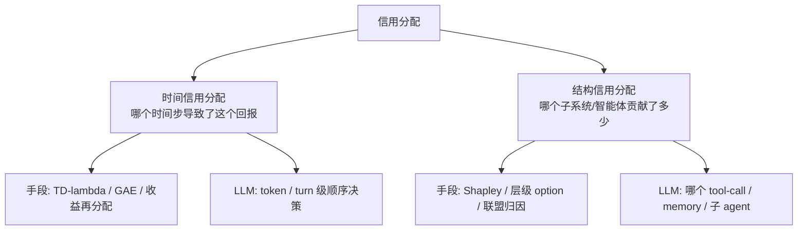
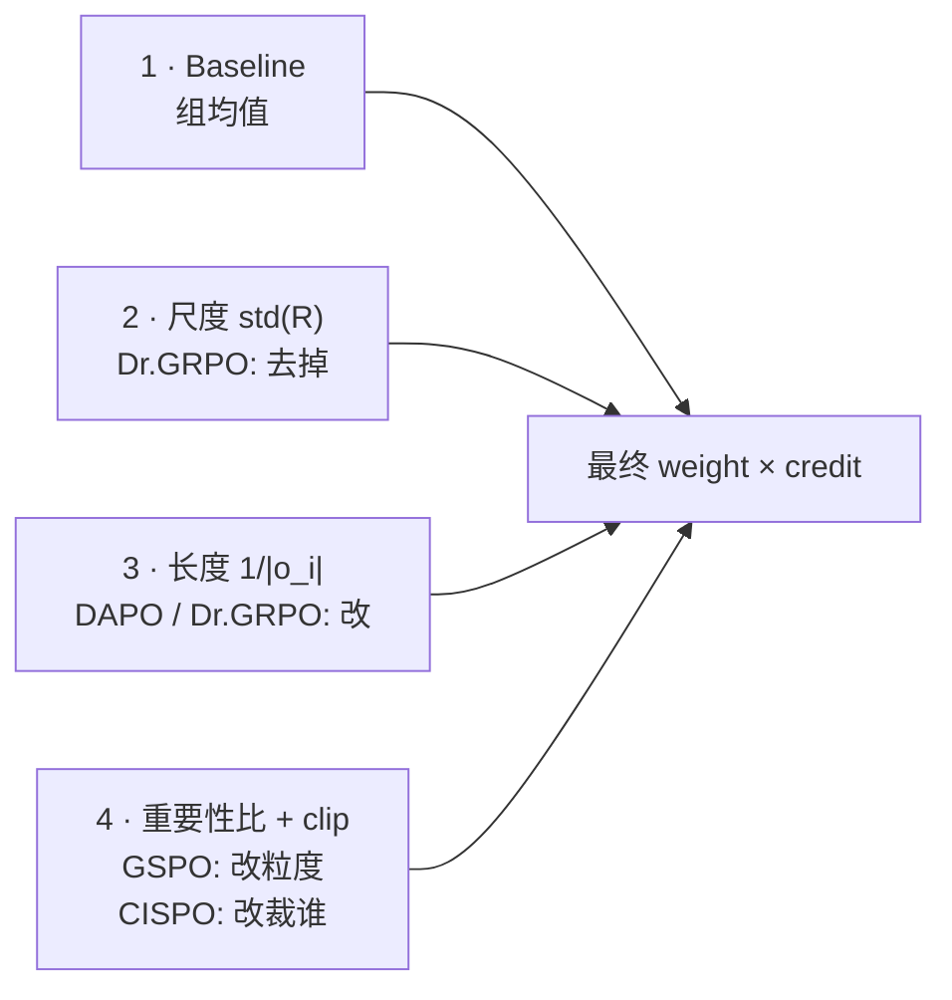
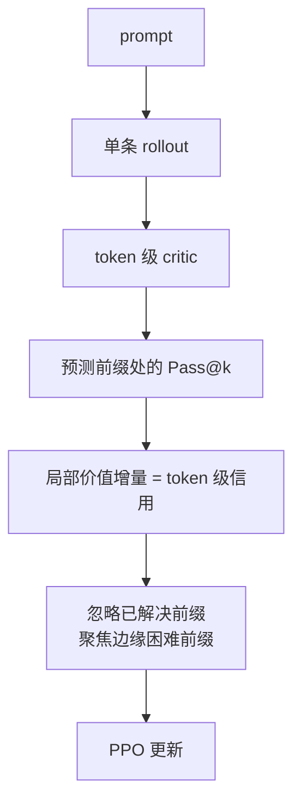
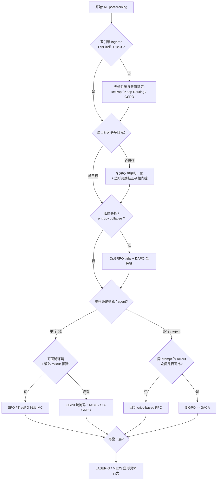

> **系列导航** ｜ [从 MDP 到 GRPO（五）：GRPO 组相对优势](/2026/08/21/mdp-to-grpo-05-grpo-group-relative/) ｜ **本篇承接其「四条欠条」**

> **TL;DR**
>
> * **信用分配 = 另一个名字的 RL**。策略梯度里被优化器看到的永远是同一个乘积 $w_{i,t}\cdot\kappa(o_{i,t})\cdot A_i\cdot\mathrm{clip}(r_{i,t})$——归一化（$w$）、细粒度信用（$\kappa$）、组相对优势（$A$）、裁剪，四件事在数学上完全等价地决定每个 token 的梯度。所谓“算法调不动”，绝大多数是这四个因子互相打架。
> * **欠条一（序列级）已还清**：Dr.GRPO 去 std、DAPO 改 token 级 loss、GSPO 改序列级重要性比、CISPO 改裁剪对象、IcePop 改“谁的数值不可信”。这五件事零额外前向、改几行代码，是性价比最高的一层。
> * **欠条二（显式细粒度）已经分化为两派**：要额外 rollout 的 MC 派（VinePPO / SPO / TreePO / GiGPO），和完全不依赖外部资源的**内在信号派**（80/20 高熵 token / TACO / SC-GRPO / AT-RL）。**2026 年的趋势是把后者当作前者的“路由器”**——见 GACA。
> * **欠条三（奖励系数）最隐蔽**：只要出现第二个奖励（哪怕只是一个 format 分），GRPO 的“先求和再归一化”就会**塌缩**——$G=2$ 两个二元奖励时，6 种不同的奖励组合归一化后只剩 2 种 advantage。GDPO 的解法是先逐目标解耦归一化再加权。
> * **欠条四（长视野）逼所长们把 critic 请了回来**：GLM-5.2 在长视野 agent 阶段放弃组相对优化改用 PPO，理由非常具体——轨迹 compaction 之后，同一 prompt 的 rollout 产生的可训练 sub-trace **数量与长度差异极大**，“一组干净可比的 rollout”这个假设直接崩了。

---

## 目录

- [0. 从一个具体失败开始](#0-从一个具体失败开始)
- [1. 严格定义：信用到底是什么](#1-严格定义信用到底是什么)
- [2. 为什么 LLM 把它放大成第一性问题](#2-为什么-llm-把它放大成第一性问题)
- [3. 主线一：序列级的“隐形信用分配”](#3-主线一序列级的隐形信用分配)
- [4. 主线二：显式细粒度](#4-主线二显式细粒度)
- [5. 主线三：奖励系数](#5-主线三奖励系数)
- [6. 主线四：长视野与 Agentic](#6-主线四长视野与-agentic)
- [7. 实践手册](#7-实践手册)
- [8. 2026 下半年的方向](#8-2026-下半年的方向)
- [9. 附录：论文索引与未验证声明](#9-附录论文索引与未验证声明)

---

## 0. 从一个具体失败开始

用 GRPO 训数学推理模型，某个 prompt 采 8 条回答，3 条答对、5 条答错。GRPO 给答对的 3 条里**每一个 token** 乘上同样的正优势，答错的 5 条里每一个 token 乘上同样的负优势。

问题：那条答对的回答里，前 300 个 token 是**错的推导**（方程根算错了），它在第 400 个 token 处自我纠正回来，最终答案正确。第 300 个 token 也被同比例**加强**了。

同一个现象在不同论文里有四个名字：

| 论文 | 叫法 | 指出的问题 |
|:---|:---|:---|
| TACO ([arXiv:2607.07976](https://arxiv.org/html/2607.07976)) | Positive-Credit Contamination | 低概率尾部 token 因为落在答对轨迹里被错误强化 |
| 80/20 Rule ([arXiv:2506.01939](https://arxiv.org/abs/2506.01939)) | 90% 以上 token 是“补完语言结构”的非决策点 | 均匀信用把梯度浪费在常规 token 上 |
| SR-PPO ([arXiv:2606.25451](https://arxiv.org/html/2606.25451v1)) | Prefix Trap | 中间走了弯路再绕回来，outcome reward 惩罚不到弯路本身 |
| 2026 Survey ([arXiv:2604.09459](https://arxiv.org/abs/2604.09459)) | Granularity mismatch | outcome 的粒度（trajectory）与优化单元的粒度（token）差 3~4 个数量级 |

四种说法指向同一件事：**奖励的粒度，和优化时原子的粒度，根本不对齐。** 中间的落差由 credit assignment（信用分配，下简称 CA）来补。

一个能立刻跑的小实验（本机 CPU 秒出）：

```python
import numpy as np

rng = np.random.default_rng(0)
T, n_key, D = 2000, 40, 64        # token 数 / 真正的决策点数 / 参数子空间维度
key_idx = rng.choice(T, size=n_key, replace=False)
grad = rng.normal(0, 1.0, size=(T, D))                    # 非决策 token: 纯噪声方向
grad[key_idx] = rng.normal(0, 1.0, size=(n_key, D)) + 3.0 # 决策 token: 带真实信号

true_dir = grad[key_idx].sum(axis=0)                      # (D,) 理论最优更新方向
A_uniform = np.ones((T, 1))                               # GRPO: 所有 token 同一 advantage
mask_Fork = np.zeros((T, 1)); mask_Fork[key_idx] = 1.0    # 80/20: 只更新分叉 token

def cos(a, b): return float(a @ b / (np.linalg.norm(a) * np.linalg.norm(b)))
print("cos(uniform, true):", round(cos((A_uniform * grad).sum(0), true_dir), 4))
print("cos(forking, true):", round(cos((mask_Fork * grad).sum(0), true_dir), 4))
```

实测输出（种子 0）：

```
cos(uniform, true): 0.9403
cos(forking, true): 1.0000
```

两者方向余弦都不低——这解释了**为什么 GRPO 能训出 R1 级别的东西**（信用符号基本是对的）；但均匀信用有 6% 的方向损失，而在真实的 $T=8000$ / $n_{\text{key}}=40$ 下这个损失会迅速恶化。**这就是细粒度 CA 存在的全部理由：不是救正确性，是救效率与偏差累积。**

---

## 1. 严格定义：信用到底是什么

### 1.1 朴素版本

给定轨迹 $\tau=(s_1,a_1,\dots,s_T,a_T)$ 和只在末端给出的回报 $R(\tau)$，把 $R$ 分解到每个决策单元 $u$（token / segment / step / turn / tool-call / agent）：

$$
R(\tau) = \sum_{u\in\mathcal{U}(\tau)}\phi_u + \text{const}
$$

$\phi_u$ 就是单元 $u$ 的**信用**。策略梯度写成

$$
\nabla_\theta J(\theta) = \mathbb{E}_{\tau}\Big[\sum_u \underbrace{\hat{A}_u}_{\text{信用}}\,\nabla_\theta\log\pi_\theta(a_u\mid s_u)\Big]
$$

> **所有 CA 方法本质上都是在选一个估计量 $\hat A_u$**，让它对真实 $Q^\pi(s_u,a_u)-V^\pi(s_u)$ 的近似最好、方差最低、代价最小。
> **GRPO 是退化情形**：$\hat A_u = A_{\text{traj}}$ 对所有 $u$ 相同。它不是“没做 CA”，而是**选了最粗的一种常数信用**。

### 1.2 2026 综述的严格版本：信用依赖协议

[Zhang (2026), arXiv:2604.09459](https://arxiv.org/abs/2604.09459) 给了一个更严谨的定义，决定了我们该怎么评价一篇 CA 论文：

$$
\Delta_u(q_u;\rho) = \mathbb{E}\Big[R(\tau^{u\leftarrow a}) - R(\tau^{u\leftarrow a'}) \;\Big|\; z_u^-\ \text{matched},\ a'\sim q_u,\ \rho\Big]
$$

| 数学符号 | 含义 | 工程里对应什么 |
|:---|:---|:---|
| $u$ | 分配单元 | `unit_type` / `unit_index` |
| $q_u$ | 参考动作分布（“和什么比”） | `ref_action_dist` |
| $z_u^-$ | **有效前置状态**（不只是文本前缀） | KV cache + 采样器 RNG + 环境状态 |
| $\rho$ | 下游协议：延续策略 / 视野 / 验证器 / 噪声种子 | `continuation_policy`, `verifier`, `seed` |
| $\Delta_u$ | 协议特定的因果对比 | `credit_u` |

关键点：**$\Delta_u$ 不是客观标量**，它依赖 $q_u$、$z_u^-$、$\rho$ 三者。换一个参考动作分布，$\Delta_u$ 的值、甚至**符号**都可能变。该综述证明了两件事：

1. **恢复状态比较（restored-state comparison）能识别一个协议特定的因果量**，前提是你真的恢复了 $z_u^-$。把文本前缀重新喂给模型 **不等于** 恢复 decode-time 状态（KV cache + 采样器状态），也恢复不了外部环境——这会引入**副本噪声（replica noise）**。
2. 在只有 **text-only history** 的情况下，**连信用的符号都可能无法确定**。这不是精度问题，是**不可识别（unidentifiable）**。

> **工程含义**：一篇论文说“我们用一个 LLM judge 给每个 step 打分当作 credit”，它拿到的是**该 judge 延续协议下的代理量**，不是 $\Delta_u$。两者可以差很远，但工程上仍可能有用——只是别把它当因果量汇报。

### 1.3 经典二分与分配单元五级



分配单元五级（粒度由粗到细）：**trajectory → turn / tool-call → step（一行推理推导）→ segment（语义连贯的一段）→ token**。选择受三个约束牵制：

1. 单元越小 → 估计点越多 → **方差越大**（除非有 critic 或 MC）；
2. 单元越小 → “单元之间因果独立”越不合理（一个 token 单独没有语义）；
3. 单元越大 → 信用越稀疏，且必须处理**动作异构**（一次工具调用 ≠ 一行数学推导）。

> 综述的判断很中肯：**没有哪个单元是“对的”，正确粒度应当与任务结构对齐**——数学用 step/segment，GUI agent 用 turn/tool，对话用 message。这也正是 GACA 提出“逐状态自适应粒度”的动机。

---

## 2. 为什么 LLM 把它放大成第一性问题

把 LLM 的 RL 写成 MDP，注意和其它 RL 域的差异：

| 维度 | 经典 RL（Atari / MuJoCo） | LLM 决策（reasoning / agentic） |
|:---|:---|:---|
| 动作空间 | 4~20 离散 / 低维连续 | **词表 32k~150k** |
| 序列长度 $T$ | $10^2$~$10^3$ | **$10^3$~$10^5$** |
| 奖励密度 | 通常有 shaping | **纯 outcome，1 bit**（RLVR） |
| 转移 | 封闭 | **非封闭**：工具返回、环境、别的 agent 注入文本 |
| 可重放性 | 精确重放可行 | **重放失真**：训推概率不一致、RNG、环境不可回退 |
| 动作同质性 | 同质 | **异构**：token / 工具 / 记忆 / 消息不可互换 |

综述把这几点提炼为**六诊断**（“假设断裂”），下表括号是对 42 篇核心论文做全文审计后、真正回应了该障碍的论文数：

| 标号 | 诊断（break） | 识别障碍 | 最低评估控制 | 阳性数 |
|:---:|:---|:---|:---|:---:|
| **T** | 转移非封闭 | 相同文本 ≠ 相同有效动态 | 恢复环境与隐藏执行状态 | 24/42 |
| **O** | 部分可观测 | 日志历史遗漏与结果相关的状态 | 状态充分性论证 / 特权状态审计 | 10/42 |
| **R** | 重放受限 | 干预无法精确复现 | 声明重放来源 + 副本噪声下界 | 19/42 |
| **H** | 动作异构 | token / 工具 / 记忆 / 消息不可互换 | 类型化单元 + 单元错配消融 | 20/42 |
| **V** | 弱局部可验证 | 中间正确性不可用或基于代理 | 针对干预/延续校准 judge | 32/42 |
| **C** | 智能体耦合 | 一个 agent 的动作改变另一个的后续分布 | 消息 / 角色 / 联盟干预 | 7/42 |

读数：**V 最高（32/42）**——绝大多数论文其实都承认“中间步骤对不对”需要一个 judge/PRM/投票，这是当前方法最普遍的软肋；**O 最低（10/42）**——大部分默认“文本历史就是全部状态”，在工具环境里不成立；**C 只有 7/42**——多智能体信用几乎是空白。

纯数学 RLVR 主要破 **V + R**；agentic RL 是**六条全破**。这就是后面第 6 节那场“critic 回归”的根源。

---

## 3. 主线一：序列级的“隐形信用分配”

**这一节是全篇性价比最高的部分。** 你以为 Dr.GRPO / DAPO / GSPO / IcePop 是在做稳定性工程，其实它们每一个都在改“哪个 token 拿到多少梯度”——**这就是信用分配**，只不过改的是权重而不是估计量。

### 3.1 四种嵌套

原始 GRPO 目标（[DeepSeekMath, arXiv:2402.03300](https://arxiv.org/abs/2402.03300)）：

$$
\mathcal{J}(\theta) = \mathbb{E}\Big[\frac{1}{G}\sum_{i=1}^{G}\frac{1}{|o_i|}\sum_{t=1}^{|o_i|}
\min\big(r_{i,t}A_i,\ \mathrm{clip}(r_{i,t},1-\varepsilon,1+\varepsilon)A_i\big)\Big] - \beta D_{\mathrm{KL}}(\pi_\theta\Vert\pi_{\mathrm{ref}})
$$

其中 $A_i = \dfrac{R_i-\mathrm{mean}(\{R_j\})}{\mathrm{std}(\{R_j\})}$。把它拆成四个正交可调的乘子：



**每一次“算法改进”本质上都是在重新定义每 token 有效权重 $w_{i,t}$：**

| 方法 | 有效每 token 权重 $w_{i,t}$ | 改动本质 |
|:---|:---|:---|
| GRPO（原始） | $\frac{1}{G}\cdot\frac{1}{|o_i|}$ | **每条序列等权**，序列内平分 |
| DAPO ([2503.14476](https://arxiv.org/abs/2503.14476)) | $1/\sum_j|o_j|$ | **每个 token 等权**，长序列总贡献更多 |
| Dr.GRPO ([2503.20783](https://arxiv.org/abs/2503.20783)) | $1/G$（去掉长度项） | 去掉长度偏差 + std 偏差两个 bias |
| GSPO ([2507.18071](https://arxiv.org/abs/2507.18071)) | 序列共用权重，但 IS 比改为序列级 | 改**方差来源**而非权重 |
| CISPO ([2506.13585](https://arxiv.org/abs/2506.13585)) | 保留被剪 token 的更新，只剪 IS 权重 | 改**谁被丢弃** |
| IcePop / Seq-MIS | 额外乘掩码 $\mathcal{M}\in\{0,1\}$ | 按**数值可信度**丢弃 token |

### 3.2 长度偏差：一条 schoolbook 式的坑

设 batch 里两条回答：$o_1$ 正确、长 200，$A_1=+1$；$o_2$ 错误、长 2000，$A_2=-1$。原始 GRPO 下：

- 正确短回答每 token 权重 $\tfrac{1}{2}\cdot\tfrac{1}{200}=2.5\times10^{-3}$
- 错误长回答每 token 权重 $\tfrac{1}{2}\cdot\tfrac{1}{2000}=2.5\times10^{-4}$

**每个错误 token 的惩罚只有正确 token 奖励的 1/10**——模型发现“把错误回答写长”可以摊薄惩罚。这就是 Dr.GRPO 指出的 **response-level length bias**。

直接在你自己的长度分布上量化（不跑训练，只算梯度质量）：

```python
lens_pos = [150, 180, 120, 300, 160, 140, 200, 250]        # 正确(短), A=+1
lens_neg = [900, 1500, 2500, 1800, 1100, 2200, 1600, 2500] # 错误(长), A=-1
G = len(lens_pos) + len(lens_neg)
total_tokens = sum(lens_pos) + sum(lens_neg)

def weight(L, mode):
    if mode == "grpo":   return 1.0 / (G * L)      # 每条序列等权, 内部平分
    if mode == "dapo":   return 1.0 / total_tokens # 每个 token 等权
    if mode == "drgrpo": return 1.0 / G            # 去掉长度项: 每 token 常数权重

def mass(mode):
    pos = sum(L * weight(L, mode) for L in lens_pos)
    neg = sum(L * weight(L, mode) for L in lens_neg)
    return pos/(pos+neg), neg/(pos+neg)

for mode in ("grpo", "dapo", "drgrpo"):
    p, n = mass(mode)
    print(f"{mode:>7s}: 正占比={p:.4f}  负占比={n:.4f}  负/正={n/p:.2f}x")
```

实测输出：

```
   grpo: 正占比=0.5000  负占比=0.5000  负/正=1.00x
   dapo: 正占比=0.0962  负占比=0.9038  负/正=9.40x
drgrpo: 正占比=0.0962  负占比=0.9038  负/正=9.40x
```

注意 DAPO 与 Dr.GRPO 的**相对权重完全一致**（都是“每 token 常数权重”，差别只在 loss 整体尺度；DAPO 多除一个 $\sum_j\lvert o_j\rvert$，对 Adam 的学习率更友好）。而 GRPO 是唯一“每条序列等权”的那个。

> ⚠️ **结论是数据集相关的**：这里是“错误回答更长”的情形，DAPO 强化对长错误回答的惩罚是对的；**如果你的数据集是正确回答更长**（长 CoT 里很常见），结论会翻转。别盲目抄配置——先打印你自己的 `len(correct)` vs `len(wrong)` 分布。

### 3.3 std 归一化：难度偏差

除以 $\mathrm{std}(\{R_j\})$ 会让**容易题**（组内方差小）的偶然正确被放大成巨大优势：

$$A^{\text{easy}} = \frac{R_i-\bar R}{0.1}\ \ \text{vs}\ \ A^{\text{hard}} = \frac{R_i-\bar R}{0.5}$$

优化器因此把预算花在“本来就快做对的题”上，而 hard frontier（真正想学的）只拿到很小的更新。Dr.GRPO 的解法粗暴但有效：直接删掉，$A_i = R_i - \mathrm{mean}(\{R_j\})$。

> 和 **DAPO 动态采样**（丢掉全对/全错的组）解决的是同一件事的另一面——那些组 $\mathrm{std}=0$，梯度本就为 0。**推荐两者都开。**

### 3.4 重要性比的粒度：token vs sequence

- **Token 级（GRPO/DAPO）**：$r_{i,t}=\pi_\theta(o_{i,t})/\pi_{\text{old}}(o_{i,t})$。长序列上这些比值连乘，方差随长度**指数级**爆炸；对 MoE 尤其致命（同一 token 在 rollout 与 training pass 可能路由到不同专家）。
- **Sequence 级（GSPO）**：Qwen 团队的观察极其锐利——**奖励是发给整条序列的，为什么重要性比要按 token 定义？**

$$
s_i(\theta)=\Big(\frac{\pi_\theta(o_i\mid q)}{\pi_{\text{old}}(o_i\mid q)}\Big)^{1/|o_i|}
=\exp\Big(\frac{1}{|o_i|}\sum_{t=1}^{|o_i|}\log\frac{\pi_\theta(o_{i,t}\mid q,o_{i,<t})}{\pi_{\text{old}}(o_{i,t}\mid q,o_{i,<t})}\Big)
$$

即所有 token 比率的**几何平均**，在序列粒度统一裁剪（推荐 $\varepsilon\approx3\times10^{-4}$，因为 length-normalized log-ratio 尺度远小于 token 级）。三条实际收益：**不再需要 MoE 的 Routing Replay**、消除了长度带来的方差放大、它是 Qwen3 背后的训练算法。

> **什么时候不要上 GSPO**：多轮 agent（一条 rollout 内部 policy 差异极大）、或压缩 rollout（不同 sub-trace 长度差异极大）——此时序列级假设被破坏，见第 6 节。

### 3.5 裁剪：clip-higher 与 CISPO

**Clip-higher（DAPO）**：对称裁剪 $[1-\varepsilon,1+\varepsilon]$ 会丢掉低概率但高价值的 exploration token（“Wait,”、“Alternatively,” 这类反思/转折 token）的更新——这就是 **entropy collapse**。解耦为

$$\mathrm{clip}(r_{i,t},\,1-\varepsilon_{\text{low}},\,1+\varepsilon_{\text{high}}),\quad \varepsilon_{\text{low}}<\varepsilon_{\text{high}}\ (\text{典型}\ 0.2/0.28)$$

> 从 CA 视角：对称 clip 等价于“优先保留大概率 token 的信用”，clip-higher 等价于“额外给稀有 token 一次机会”。

**CISPO（MiniMax-M1）**：原文摘要的说法是 *“CISPO clips importance sampling weights rather than token updates”*——被传统 clip 丢弃的那批 token 里，有相当一部分恰恰是反思/纠错类关键 token，**它们是信用最该到达的地方，却被裁剪机制静默丢弃了**。MiniMax-M1 报告 512×H800、三周、约 53.5 万美元完成全量 RL。（精确裁剪形式请核对原文，本系列不做断言。）

### 3.6 系统层的隐形权重：训推不匹配

这是最“工程”、却对信用分配影响最大的一块：**同一个 token 在 rollout 引擎（vLLM/SGLang）和训练引擎（Megatron/FSDP）上算出的概率不一样**（kernel 精度、batch 调度、MoE 路由非确定性、top-p 截断）。后果是 IS 比在少数 token 上爆炸，梯度被劫持 → 训练崩溃。**轨迹越长，命中这类病态 token 的概率越高。**

| 手段 | 粒度 | 做法 | 代价 |
|:---|:---|:---|:---|
| **IcePop** | token | $k_{i,t}=\pi_{\text{train}}/\pi_{\text{infer}}$，超出 $[\alpha,\beta]$ 置 0（典型 $[0.5,5]$） | 不修正状态占用偏差 |
| **序列级 MIS** | sequence | 仅对负优势且 off-policy 度超阈值的序列掩码 | 理论无偏，但可能丢太多数据 |
| **Keep Routing / Keep Sampling Mask** | token | 保存推理时的专家路由与截断掩码并复用 | 需要 infra 支持 |
| **Bitwise 一致训练** | 全局 | 训推完全 bitwise 一致 | **约 2.4× 性能损失** |
| **GSPO** | sequence | 长度归一化 + 序列级 IS，从根上降敏感度 | 粒度变粗 |

IcePop 的形式（引自 [IcePop 公式整理](https://publish.obsidian.md/shri/Appendix/Distillation/IcePop)）：

$$
\mathcal{J}_{\text{IcePop}} = \mathbb{E}\Big[\frac{1}{G}\sum_i\frac{1}{|o_i|}\sum_t
\mathcal{M}\Big(\frac{\pi_{\text{train}}(o_{i,t}\mid\cdot)}{\pi_{\text{infer}}(o_{i,t}\mid\cdot)};\alpha,\beta\Big)\cdot\min\big(r_{i,t}A_i,\mathrm{clip}(r_{i,t},\cdot)A_i\big)\Big]
$$

> **为什么它算信用分配**：掩码 $\mathcal M$ 直接乘在每个 token 的梯度上，它在说“这个 token 的数值不可信，别给它信用”。这和下一节的高熵/尾部方法在数学形式上完全是同一件事，**只是判据从“数值可信度”换成了“语义重要性”**。二者在低概率区域高度重合，也因此各种 stabilizing trick 经常互相替代。

GLM-5.2 甚至用 IcePop 的稳定性**替代了 KL 正则**（直接移除 KL，把稳定性职责交给 token 选择）。

> **实践建议**：上线前先跑“双引擎 logprob 一致性检查”——同一批 token 在两个引擎下的 $\lvert\Delta\log p\rvert$ 分位数。**P99 > 1e-3 就先别谈任何细粒度 CA**，你后面的归因全是噪的。

---

## 4. 主线二：显式细粒度

统一视角先摆出来——几乎所有 2025-2026 的工作都在写同一个公式：

$$
\mathcal{J}(\theta)=\mathbb{E}\Big[\sum_i\sum_t \underbrace{\vphantom{()}w_{i,t}}_{\text{归一化}}\cdot\underbrace{\kappa(o_{i,t})}_{\mathbf{信用权重}}\cdot\underbrace{A_i}_{\text{组相对常数}}\cdot\nabla_\theta\log\pi_\theta(o_{i,t}\mid\cdot)\Big]
$$

| 方法来源 | $\kappa$ 的依据 | 需要什么 |
|:---|:---|:---|
| GRPO 基线 | $\kappa\equiv 1$ | 无 |
| 80/20 分叉 token | 熵的高分位 | 一次前向（entropy 顺手就有） |
| TACO | 尾部风险评分（局部上下文） | 概率 + 上下文 |
| SC-GRPO | 自条件 KL（vs 已验证轨迹） | 一次额外 forward |
| IcePop | 训推概率比是否在 $[\alpha,\beta]$ | 两个引擎 logprob |
| SPO / TreePO | 共享前缀下的 MC 段优势 | 多条分支 rollout |
| PURE / PRM | 每步外部评分 | PRM / judge |

两个直接工程价值：① 多个 $\kappa$ 可以**相乘**而非二选一；② 排优先级时只需问：**我现在缺的是“信号”（$\hat A$ 有偏）还是“信噪比”（$\hat A$ 方差大）**？前者靠更准的外部信息，后者靠 mask 与平滑。

### 4.1 Token 级：最便宜的一批（内在信号路线）

**80/20 规则（NeurIPS 2025, [arXiv:2506.01939](https://arxiv.org/abs/2506.01939)）** —— 我认为必须读的一篇，结论反直觉且立刻可用：

> **只有约 20% 的 token 具有高熵，语义上它们是“分叉”（forks），决定推理走向哪个岔路；其余 80% 只是在补完已经确定的语言结构。**

$$\kappa(o_{i,t})=\mathbb{1}\Big[H_t\in\text{top-}p\%\Big],\quad H_t=-\sum_{v}\pi_\theta(v\mid q,o_{i,<t})\log\pi_\theta(v\mid q,o_{i,<t})$$

关键发现：**只保留 top-20% 高熵 token 的梯度**，Qwen3-8B 上与全梯度持平；Qwen3-32B 上 **AIME'25 +11.04 / AIME'24 +7.71**；Qwen3-14B +4.79/+5.21——**模型越大收益越明显**。反向对照：只训最低熵的 80% token → 显著退化。此外 RLVR 训练中**熵模式基本沿袭基座模型**，主要改变的是高熵 token 的熵；OOD（LiveCodeBench）也更好。论文承认阈值 20% 是经验值、且只在数学任务验证。

**TACO（[arXiv:2607.07976](https://arxiv.org/html/2607.07976)）**：算出 tail-risk score 后**调低**（而非清零）正信用，这样反复出现的有用稀有模式仍能积累强化，偶发噪声被逐步抑制。代码开源 [xiuyilou/TACO](https://github.com/xiuyilou/TACO)。

**SC-GRPO（[arXiv:2606.18810](https://www.arxiv.org/abs/2606.18810)）**：现有 token 级 CA 都依赖模型自身 rollout 之外的资源（PRM / GT 答案 / 外部 teacher / privileged info）。SC-GRPO 只需要**拿自己已验证正确的轨迹做条件化**，测量条件化前后的逐 token KL，把它作为 GRPO 梯度的乘性权重。自报跨数学/代码/agentic 五基准平均比 GRPO **+8.1%**、比 DAPO **+5.9%**（⚠️ 待验证，效应量较大，复现务必对齐 rollout 预算）。

**AT-RL（[arXiv:2602.11455](https://www.arxiv.org/abs/2602.11455)）**：多模态场景下只有约 **15%** 的 token 表现出强视觉-文本耦合，它们是“把推理锚定在图像上的锚点”。RLVR 训练过程中信用会**自然**向这些锚点集中。AT-RL 用图聚类显式强化这些 token：**1.2% 开销**让 32B 模型在 MathVista 拿到 80.2，超过 72B-Instruct；反向对照（只在低连接度 token 上训练）严重退化。**这是全篇反向对照做得最干净的证据链。**

### 4.2 Token 级：贵但准的（MC / 外部模型路线）

**VinePPO（ICML 2025, [arXiv:2410.01679](https://arxiv.org/abs/2410.01679)）**：不训 critic、不用学到的 reward，**从每个中间状态多次 rollout 用 MC 估计该步优势**（要求环境 resettable，数学推理天然成立）。结果：精确的逐步 MC 信用**同时打败** PPO 的学得 critic 与 critic-free 的组基线。历史意义在于证明了“细粒度信用只要够准就一定有用，但太贵”——这催生了后面所有“如何在不额外 rollout 下近似 MC”的工作。注意：把 prefix 塞回去重采样属于 **text re-feed**，不是 exact decoder-state resume，因此它的 MC 里含有副本噪声。

**PRIME（[arXiv:2502.01456](https://arxiv.org/abs/2502.01456)）**：用**隐式 PRM**（直接用 SFT 模型初始化）产生 token 级稠密奖励

$$r_\phi(o_t)=\beta\log\frac{\pi_\phi(o_t\mid q,o_{<t})}{\pi_{\text{ref}}(o_t\mid q,o_{<t})}$$

再用 **outcome 标签在线更新**它——在线更新是关键，防止了 reward hacking 与分布漂移。自报：Qwen2.5-Math-7B-Base 起步跨多个基准平均比 SFT **+15.1%**；样本效率是 RLOO 的 **2.5×**，相对 VinePPO 效率 **11×**。

> 理论基础是 **DPO 的隐式 Q**（[Rafailov et al., arXiv:2404.12358](https://arxiv.org/abs/2404.12358)）：任何 preference-trained 模型都已编码了 token 级 Q 函数

$$
Q^*(s_t,a_t)=\beta\log\frac{\pi_\theta(a_t\mid s_t)}{\pi_{\text{ref}}(a_t\mid s_t)}+\beta\log Z(s_t)
$$

```python
import torch

@torch.no_grad()
def implicit_token_credit(model, ref_model, prompt_ids, gen_ids, mask, beta):
    """抽出隐式 token 级 Q (DPO-implicit credit). log Z(s_t) 对同一位置是常数,
    做组内标准化时自动消去, 因此实现里不需要显式计算。
    返回: q: (B, L)"""
    ids = torch.cat([prompt_ids, gen_ids], dim=1)                 # (B, P+L)
    def tok_logp(m, ids):
        logits = m(ids).logits[:, :-1]                            # (B, P+L-1, V)
        tgt = ids[:, 1:]
        lp = torch.log_softmax(logits.float(), -1)
        lp = lp.gather(-1, tgt.unsqueeze(-1)).squeeze(-1)
        return lp[:, prompt_ids.shape[1]:]                        # (B, L)
    q = beta * (tok_logp(model, ids) - tok_logp(ref_model, ids))  # (B, L)
    return q * mask
```

### 4.3 Segment 级：性价比最高的中间层

Token 级太贵太碎，trajectory 级太粗。**Segment（语义连贯的一段）是很多人实证下来最舒服的一层。**

**SPO（NeurIPS 2025, [arXiv:2505.23564](https://arxiv.org/abs/2505.23564)）**：核心权衡是三点式——token 级细但 critic 不准，trajectory 级粗但稳，**segment 级是中位数**：比 trajectory 精确、比 token 少估计点，因此**可以用 MC 而不需要 critic**。三部件：① 在 **cutpoint**（推理在两个子问题间转换的位置）处切段，粒度可任意调；② 对所有**共享该前缀**的轨迹比较 outcome 作为 MC 段优势；③ probability-mask 策略优化。

| 实例 | 场景 | 自报结果 |
|:---|:---|:---|
| **SPO-chain** | 短 CoT | GSM8K 比 PPO / GRPO **+6~12 pp** |
| **SPO-tree** | 长 CoT | MATH500 比 GRPO **+7~11 pp**（2K / 4K 上下文） |

**TreePO（[arXiv:2508.17445](https://arxiv.org/abs/2508.17445)）** 指出两个瓶颈其实是同一个——重复计算（多条回答前几百 token 一模一样，独立采样等于重复付费）与粗粒度信用。于是把生成建模成**树**：每段末尾按局部不确定度决定是否分叉，共享前缀靠 KV cache 复用，低质路径早期剪枝；credit 上一条分支不只跟全局均值比，而是**跟兄弟节点比**。

自报：**GPU hours 省 22%~43%**，trajectory 级推理时间降最多 40%。它的消融结论比主结果更值钱：

| 消融结论 | 含义 |
|:---|:---|
| 子组优势**简单平均 > 按大小加权** | 别给大子组更大话语权 |
| **子组级 rejection 反而有害** | 别轻易扔“看起来差”的分支 |
| **段必须按 token 对齐** | 段边界错位会毁掉整个方案 |
| **基于概率的分叉控制没有增益** | 分叉决策要用不确定度/质量，不要只用概率 |

**TEMPO**（树 + branch-gated TD：叶子 MC、内部节点 TD 式上传，critic-free 但依赖分支来源与重放保真度）；**SCAR**（Shapley 归因，$2^n$ 代价，主要作用是当 gold reference 评测便宜方法）。

<details>
<summary>共享前缀的段级 MC 优势：最小骨架（点击展开）</summary>

```python
import torch
from collections import defaultdict

def segment_mc_advantage(prefix_ids, rewards, masks):
    """SPO-chain 的最小骨架: 到达段 k 前共享同一前缀的轨迹互为反事实对照。
    prefix_ids: (G, S) 每条 rollout 在 S 个切点上的前缀 id
    rewards:    (G,)
    masks:      (G, S) 是否经过第 k 个切点
    返回 seg_adv: (G, S)"""
    G, S = prefix_ids.shape
    seg_adv = torch.zeros(G, S)
    for k in range(S):
        groups = defaultdict(list)
        for g in range(G):
            if masks[g, k]:
                groups[int(prefix_ids[g, k])].append(g)
        for _, idx in groups.items():
            if len(idx) < 2:      # 只有一个后继: 无法构造对照 -> advantage = 0
                continue
            r = torch.stack([rewards[i] for i in idx])
            for i in idx:
                seg_adv[i, k] = rewards[i] - r.mean()   # 段 k 的边际贡献
    return seg_adv
```
</details>

### 4.4 Step 级：PRM 的兴衰与 min-form 的翻案

基线是自动标注：**Math-Shepherd（[arXiv:2312.08935](https://arxiv.org/abs/2312.08935)）** 对每个步骤做 MC 补全，若足够比例的后续能到正确答案就标该步正确；**OmegaPRM（[arXiv:2406.06592](https://arxiv.org/abs/2406.06592)）** 用分治搜索把它规模化。

**PURE（ICML 2025, [arXiv:2504.15275](https://arxiv.org/abs/2504.15275)）** 指出根本问题在于 RL 里的 sum-form：

$$V^{\text{sum}}(s_t)=\mathbb{E}\big[\textstyle\sum_{t'\ge t}\gamma^{t'-t}r_{t'}\big]$$

值域随**步数**增长，模型可以靠“多输出高分 thinking 步骤”抬高 V 而不真解题——这就是 PRM-induced reward hacking，论文里 **sum-form 在第 25 步就崩了**。min-form 的修法：**状态的价值由它之后最差的那一步决定**

$$G(s_t,a_t)=\begin{cases}\min(r_t^p,\dots,r_n^p), & t\le w\\ 0,& t>w\end{cases},\quad w=\arg\min(r_1^p,\dots,r_n^p)$$

工程上用一个温度变换实现（$T\to0^+$ 时退化为 min），**不用改 return 计算逻辑**：

$$r_i^{p*}=\frac{\exp(-r_i^p/T)}{\sum_{j=1}^n\exp(-r_j^p/T)}\cdot r_i^p$$

自报：Qwen2.5-Math-7B 上 PURE-PRM+VR（补 10% 可验证奖励）**AMC23 82.5%**、五基准平均 **53.3%**（纯 verifiable baseline 48.3%），且只需 **30% 训练步**就追平。作者提供 OpenRLHF 与 verl 两种实现。

**SPRO** 则完全不需要外部 RM：把某个步骤删掉后重新评估整条解法，**性能下降量即为该步信用** $c_i = P(\text{correct}\mid\text{full}) - P(\text{correct}\mid\text{without step }i)$，报称训练效率相对 GRPO **3.4×**。

其它值得记：**CAPO**（LLM-as-Critic）、**ACPO**（归因式）、**HICRA**（层级感知，只对决策级 token 放大信用）、**FinePO**（sub-step 粒度）、**PRL / InT**（让模型自己提出 interventions）。

### 4.5 依赖 × 开销总表

| 方法 | 粒度 | 外部模型？ | 额外 rollout？ | resettable？ | 开销量级 | 典型适用 |
|:---|:---|:---:|:---:|:---:|:---:|:---|
| GRPO 基线 | traj | 否 | 否 | 否 | 0 | everywhere |
| IcePop / 双引擎体检 | token | 否 | 否 | 否 | ~0 | MoE、多轮 |
| **80/20 高熵** | token | 否 | 否 | 否 | ~0 | **任何 RLVR，先试它** |
| SC-GRPO | token | 否 | 否 | 否 | 1 次额外 forward | 无外部资源的场景 |
| AT-RL | token | 否 | 否 | 否 | ~1.2% | 多模态 VLM |
| TACO | token | 否 | 否 | 否 | 小 | 长视野、尾部噪声重 |
| PRIME | token | SFT 模型自初始化 | 否 | 否 | 中 | 想要稠密信号又不想训 RM |
| VinePPO | token/step | 否 | **是** | **是** | 高 | 数学等可回溯环境 |
| **SPO** | segment | 否 | **是** | 是 | 中 | 短 CoT 用 chain，长 CoT 用 tree |
| **TreePO** | segment | 否 | **是** | 是 | 中（**省 22–43% GPU**） | 长 CoT、rollout 是瓶颈 |
| TEMPO | segment | 否 | 是 | 是 | 中高 | 想要 TD 的方差控制 |
| SCAR | segment | 否 | 是 | 是 | **极高** | gold reference |
| Math-Shepherd / OmegaPRM | step | **PRM** | 是 | 是 | 高 | 离线生成 step 标签 |
| **PURE** | step | **PRM** | 否 | 否 | 中 | **把已有 PRM 安全用起来** |
| SPRO | step | 否 | 是 | 是 | 中 | 不想训 RM 但能多次评估 |
| CAPO / FinePO | step | **judge** | 否 | 否 | 中 | 有强 judge 时 |

> **实验顺序建议**：① 80/20 熵掩码（零依赖，两小时出结果）→ ② IcePop/双引擎体检（零依赖，且可能是你的隐藏 bug）→ ③ SPO-chain 段级 MC → ④ TreePO → ⑤ PRIME / PURE。

---

## 5. 主线三：奖励系数

奖励里的“系数”不是可以随便调的超参——它和 advantage 归一化、裁剪阈值、学习率**乘在同一个乘积里**。很多“调不动”其实是公式的问题。

### 5.1 三种典型症状

| 症状 | 表面现象 | 真实原因 |
|:---|:---|:---|
| 长度失控 | 回答越来越长、准确率不涨、吞吐崩 | loss 归一化的长度偏差 + 长度惩罚系数为 0 |
| format farming | 格式很漂亮，任务指标反跌 | 塑形奖励占比过大且**不绑定正确性** |
| 多目标顾此失彼 | 权重怎么调，一个目标总吃掉另一个 | **难度不对称** + GRPO 的 advantage 塌缩 |

### 5.2 Advantage 塌缩（GDPO）

[GDPO（NVIDIA, arXiv:2601.05242）](https://arxiv.org/abs/2601.05242) 给了一个“本来该早点被发现”的反例。朴素做法是先求和再组归一化：

$$r^{(i,j)}_{\text{sum}}=\textstyle\sum_k r^{(i,j)}_k,\quad A^{(i,j)}_{\text{sum}}=\frac{r^{(i,j)}_{\text{sum}}-\mathrm{mean}}{\mathrm{std}}$$

考虑 $G=2$、两个二元奖励（总奖励取值 $\{0,1,2\}$），枚举六种组合：

| 组合 | GRPO 归一化后 |
|:---|:---|
| $(0,1)$、$(0,2)$、$(1,2)$ | **全部塌缩为** $(-0.7071,+0.7071)$ |
| $(0,0)$、$(1,1)$、$(2,2)$ | **全部塌缩为** $(0,0)$ |

直观地说：$(0,2)$ 应该比 $(0,1)$ 给出**更强**的学习信号（同时满足两个目标 vs 只满足一个），但在 GRPO 下完全相同。去掉 std（Dr.GRPO 那条）能部分缓解，但论文指出**随着 rollout 数或目标数增加，不同 advantage 组的数量只提升一点点**，本质没解决。后果：训练信号分辨率下降、收敛次优，**部分情况下训练早期直接失败**。

**GDPO 的两步修法**：

$$A^{(i,j)}_k=\frac{r^{(i,j)}_k-\mathrm{mean}\{r^{(i,\cdot)}_k\}}{\mathrm{std}\{r^{(i,\cdot)}_k\}},\qquad \tilde A^{(i,j)}_{\text{sum}}=\sum_k A^{(i,j)}_k,\qquad A_{\text{sum}}=\frac{\tilde A_{\text{sum}}-\mathrm{mean}_{\text{batch}}}{\mathrm{std}_{\text{batch}}}$$

即**先逐目标解耦归一化、再加权求和（权重作用在归一化之后）、最后做 batch 级归一化**。作者强调最后一步显著提升稳定性，**去掉它有时直接不收敛**。自报效果：工具调用/数学/代码三类任务全面优于 GRPO，数学上 DeepSeek-R1-1.5B 与 Qwen3-4B-Instruct 的 AIME 相对 GRPO **+6.3% / +2.3%** 且回答更短。

```python
import torch

def gdpo_advantage(rewards, weights=None, batch_norm=True):
    """GDPO: 先逐奖励解耦组归一化, 再加权求和, 最后 batch 归一化。
    rewards: (B, G, n)  B=batch prompts, G=组大小, n=目标数;  返回 adv: (B, G)"""
    B, G, n = rewards.shape
    if weights is None:
        weights = torch.ones(n, dtype=rewards.dtype)
    adv_per_obj = torch.zeros_like(rewards)                            # (B, G, n)
    for k in range(n):
        r = rewards[..., k]                                           # (B, G)
        std = r.std(dim=1, unbiased=False).clamp(min=1e-4)
        adv_per_obj[..., k] = (r - r.mean(dim=1, keepdim=True)) / std[:, None]
    adv = (adv_per_obj * weights).sum(dim=-1)                         # (B, G)
    return (adv - adv.mean()) / adv.std().clamp(min=1e-4) if batch_norm else adv
```

### 5.3 权重不够用时：条件化奖励

GDPO 论文明确指出：**当目标难度差异悬殊时，调权重通常无效**——模型会优先最大化容易的目标。修法不是继续堆权重，而是**把容易的奖励条件化到困难的奖励上**：

$$r_k = r_k\cdot\mathbb{1}[r_l\ge t]$$

即只有当困难目标 $r_l$ 达到阈值 $t$ 时才发放容易的目标奖励。加了条件化之后，**再做细粒度权重调整才真正反映到最终行为上**。

```python
def conditioned_length_reward(correct, length, target_len, alpha=0.5):
    """只有当回答正确时才发放长度奖励 -> 防止"短但错"刷长度分。
    对应 LASER: lambda(y) = 1[R(y)=1], S(y) = alpha * 1[L(y) <= L_T]"""
    return alpha * float(correct and length <= target_len)
```

> **通用原则**：塑形奖励必须“以任务成功为条件”。无条件发放的格式/长度奖励几乎必然招致 format farming。

### 5.4 长度惩罚：统一框架与定标法则

[LASER（arXiv:2505.15612）](https://arxiv.org/abs/2505.15612) 把各种高效推理方法统一写成一个长度奖励塑形框架：

$$R'(y)=\underbrace{C(y)}_{\text{任务项}}+\underbrace{\lambda(y)}_{\text{门控}}\cdot\underbrace{S(y)}_{\text{长度项}}$$

LASER 的选择：$C(y)=R(x,y)$，$\lambda(y)=\mathbb{1}[R(x,y)=1]$，$S(y)=\alpha\cdot\mathbb{1}[L(y)\le L_T]$（典型 $\alpha=0.5$）。三点注意：① $\lambda$ 在正确性上门控（正是条件化思想）；② $S$ 是**阶跃**而非连续线性惩罚，作者认为更稳定，且 context window 设得远大于 $L_T$ 以避免硬截断带来的分布漂移；③ $\alpha$ 的**绝对值没有意义**，有意义的是它相对任务项的尺度。

**LASER-D/DE** 两个扩展都值得借鉴：**Dynamic**（周期性在小监控集上重估目标长度）、**Difficulty-aware**（不同难度不同目标长度，简单题狠狠惩罚冗长 CoT）。自报：DeepSeek-R1-Distill-Qwen-{1.5B,7B,32B} 上 Pareto 最优，LASER-D 在 AIME2024 **+6.1** 的同时 **token 用量 −63%**，且压缩后冗余 self-reflection 明显减少。

其它：**DLER**（NVIDIA, 2025，“Doing Length pEnalty Right”：回到最简单的截断 + update-selective merging）、**L1（[arXiv:2503.04697](https://arxiv.org/abs/2503.04697)）**、Kimi k1.5 的 length penalty。

> **定标法则（我的建议）**：$\alpha\approx c\cdot\sigma_{\text{group}}(R(x,y))$，$c\in[0.2,0.5]$。塑形项必须在组内可分辨范围内（否则归一化后就是噪声），又不能大到吞掉任务信号。**先把 $\sigma_{\text{group}}$ 打出来看**，再决定 $c$。

### 5.5 KL 与熵

2025-2026 形成了明确的按场景分裂（[How Frontier Labs Train LLMs, 2026](https://jxzhangjhu.github.io/blog/2026/how-frontier-labs-train-llms/)）：

| 场景 | 选择 | 代表 |
|:---|:---|:---|
| 长 CoT 推理 | **去掉 KL**（要让策略远离初始化） | DAPO、Magistral、MiMo、MiniMax |
| RLHF 对齐 | **保留 KL**（要留在可信模型附近） | Tulu 3、DeepSeek 对齐阶段 |
| 折中 | 无偏估计 + 数学域极弱 KL | DeepSeek-V3.2 |
| 激进 | 去掉 KL，由 IcePop 承担稳定性 | GLM-5.2 |

常见 $\beta$ 在 0.00~0.04（多篇统一对比研究的共享设置是 $\beta=0.04$）。**去掉 KL 时必须补上别的稳定性来源**（clip + IcePop/GSPO）。这也解释了为什么不同论文的 $\beta$ 完全不可比——**它承担的职责在不同 recipe 里被不同机制分担了**。

熵方面，主流做法**不是加 $-\gamma H$ 熵奖励**，而是用结构性手段控制：clip-higher（放宽上界让低概率探索 token 有机会增长）、CISPO（保住被剪的反思类 token）、只更新高熵 token。直接加熵奖励项的代价是**又多一个需要与 reward 尺度对齐的系数**。

### 5.6 奖励尺度

**核心原则：被优化器看到的是 advantage 的分布，不是 reward 的绝对值。**

1. 二元奖励 + 组相对归一化 = 天然自标定，这是 RLVR 鲁棒的一大原因；此时“把 $\alpha$ 从 10 改成 1”对 GRPO 几乎没影响（std 已消掉尺度），**但对 Dr.GRPO（去掉 std）就有影响**——这是最容易踩的坑：**同一个奖励配方在 GRPO 与 Dr.GRPO 下不等价**。
2. 经典 RLHF 里 RM 输出尺度任意（Tülu 3 用 $\alpha=10$），改为可验证奖励后不再需要。
3. **每新增一个奖励项，就要重新检查一次 advantage 的 RMS**——把它做成监控面板上的常驻曲线。

### 5.7 动态 shaping：给奖励加一份“错题本”

[MEDS（arXiv:2604.11297）](https://arxiv.org/abs/2604.11297) 瞄准的失败模式很精准：RLVR 训着训着会掉进固定 **error mode**——每次只是换种说法重复同一个错。**entropy regularization 对此无能为力**：它只在当前 policy 分布上加噪，识别不了“跨 rollout 的同一类错”。

做法：① 用 forward pass 里已经算好的 layer-wise logits，取最后若干层在 **final answer 第一个 token 位置**的值拼成向量 → 几乎零开销的 reasoning 指纹；② 每个 prompt 维护自己的错题本，用 **HDBSCAN** 聚类（选它而非 K-means：cluster 数动态变化，且孤立点会标为 noise，避免“只出现过一次的孤儿轨迹”被算成一个 cluster）；③ 落到大 cluster 的 rollout 罚得更重，惩罚随 cluster 大小增长但**边际递减**，且有明确上界。

理论上给了一个少见的保证：在 KL-regularized 单步更新的理想设定下，**给重复错误加罚不会降低期望任务回报**——关键一步是用 importance reweighting 把差值化成分母恒正的形式，再由 **Chebyshev 重排不等式**得协方差非负（两个因子对 cluster 计数都是非增的）。作者也明确写了这是 idealized one-step 设定，且依赖“重复采到的轨迹任务分不会更高”这一单调性假设。

自报：三个基座五个数学基准，pass@1 平均 +0.86~3.61，pass@128 +1.15~4.37；Qwen3-8B 在 OlympiadBench 上 pass@128 从 DAPO 的 70.81 提到 **82.67**。训练开销 +8.7%。诚实对照：用 Claude-Haiku-4.5 打 11 类错因标签，logit 聚类与 LLM 聚类的 agreement 是 **61.2%**（vs 全归一类 45.16%）——**指纹远非完美，但够用**。

### 5.8 RLVR 没有消灭 reward hacking，只是搬了家

| 攻击方式 | 防御 |
|:---|:---|
| 测试泄漏 / 硬编码 | 隐藏测试、沙箱禁 FS/网络、随机化 held-out 输入 |
| 验证器解析漏洞（狂刷 `\boxed{}` 候选） | 只取最后一个 boxed、惩罚多个最终答案、**对抽取器做模糊测试** |
| 沙箱逃逸 / fork bomb 打崩 grader 拿默认分 | 真隔离、严格 rlimits、**grader 崩溃视为 0 分** |
| format farming | **保持塑形奖励很小，并绑定到“尝试了任务”上** |

> **心智模型**：**RLVR 把统计意义上的奖励 hacking 转换成了软件安全问题。** 你的验证器与沙箱现在是一个对抗接口——策略是一个无情的 fuzzer，会执行你的 grader 上百万次寻找最廉价的得分路径。像对一个接收不可信输入的公网 API 那样威胁建模它。（[The LLM Stack Book §5.9](https://prakashkagitha.github.io/llm-stack-book/05-posttraining-alignment/09-rlvr-reasoning.html)）

---

## 6. 主线四：长视野与 Agentic

### 6.1 组可比性崩塌，critic 回归

**2025-2026 最具反转性的工业流派变化**：GLM 系列起初走 GRPO + IcePop，但 **GLM-5.2（750B-A40B）在长视野阶段显式放弃组相对优化，改用带 value model 的 critic-based 方法**。理由非常具体（[How Frontier Labs Train LLMs](https://jxzhangjhu.github.io/blog/2026/how-frontier-labs-train-llms/)；[GLM-5.2/IcePop 解析](https://thakicloud.com/tech-blog/en/research/glm-5-2-ppo-icepop/)）：

> 当超长 agent 轨迹被 **compaction** 成多条 sub-trace 时，同一 prompt 的不同 rollout 会产生**数量不同、长度差异极大的可训练 trace**，GRPO 的“一组干净可比 rollout”假设不成立；而 **critic 对单条 rollout 就能给出 token 级优势**，天然适配 compaction。

配套决定同样重要：**移除 KL 正则**（IcePop 已承担稳定性职责，KL 反而限制改进幅度），基础设施分工为 Megatron 训练 + SGLang rollout，IcePop 正是针对这两个引擎之间的**结构性缝隙**设计的。更早的信号是 **VAPO（[arXiv:2504.05118](https://arxiv.org/abs/2504.05118)）**：重新引入 value model，证明 critic 在长 CoT 上仍然有用。

> **给从业者的教训**：选择 RL 方法论时不能只看算法本身，必须看**训练引擎 + 推理引擎的组合**。IcePop 与其说是算法改进，不如说是系统-算法协同设计的产物。

### 6.2 GiGPO → GACA：从固定粒度到自适应粒度

**GiGPO（NeurIPS 2025, [arXiv:2505.10978](https://arxiv.org/abs/2505.10978)）** 的洞察极漂亮：同一任务相同初始状态采样的 $N$ 条轨迹里，**很多环境状态会自然重复出现**（反复访问同一网页、重回同一房间），这些重复状态可以**免费**构造成 step 级对比组。两层结构：

$$A^{\text{GiGPO}}(s_t,a_t)=\underbrace{A^{E}(\tau_i)}_{\text{episode 级}}+\;w\cdot\underbrace{A^{S}(s_t,a_t)}_{\text{anchor state 组内 micro}}$$

自报：ALFWorld **+12%**、WebShop **+9%**，search-QA 上 3B 42.1% / 7B 47.2%，**同样 GPU 显存与 rollout 预算下，额外训练时间 < 0.002%**。

> ⚠️ 它的结构弱点：$w$ 是**固定标量**，对一个决定性分叉决策和一个近乎确定的常规转移给了同样的细粒度分辨率。

**GACA（2026-09-11, [arXiv:2609.12424](https://arxiv.org/abs/2609.12424)）** 修的正是这一点：**正确的分辨率应该依赖于状态**。它用 rollout 时已经算好的**负对数似然**作关键性代理（零额外前向），NLL 高 → 更信任细粒度 step 信号，NLL 低 → 更信任低方差的 episode 信号：

$$A^{\text{GACA}}=\big(1-\lambda(s_t,a_t)\big)A^{E}+\lambda(s_t,a_t)A^{S},\qquad \lambda\uparrow\ \text{with NLL}$$

理论结果：① 精确的风险分解，证明在方向一致性为正时**足够小的调制严格优于固定混合**；② 用期望 NLL 界定局部动作价值变化的下界（给“用 NLL 作代理”提供依据）；③ 误差投影分析刻画混合何时优于简单的标量不确定度重加权。自报 ALFWorld/WebShop 上 1.5B 与 7B 都超过 GRPO 与 GiGPO。⚠️ 2026-09-11 上线，尚未见社区复现。

> **这是我认为最值得关注的一类设计**：它把“内在信号派”（熵/NLL/KL）和“结构对照派”（anchor state）接上了——**用最便宜的信号决定什么时候该用昂贵的结构信息**。

### 6.3 SR-PPO：单 rollout + Pass@k critic

[SR-PPO（arXiv:2606.25451）](https://arxiv.org/html/2606.25451v1) 解决的是反面问题：group-based 太贵，而且**rollout 之间的推理前缀很快就发散，横向比较本身不可靠**。方案：**每个 prompt 只采一条 rollout**，训一个 token 级 critic 预测前缀处的 **Pass@$k$ 成功概率**。

为什么是 Pass@$k$：Pass@1 对“已经能轻松做对”的前缀给高值 → 学不到东西；而随 $k$ 增大，$\text{Pass@}k$ 收敛到一个**可达性指示量**——这个前缀存不存在通往成功的续写。因此它**对容易的前缀打折、把信号集中到成功概率仍处在边缘的困难前缀**。作者还证明了 $k\to\infty$ 的极限在显式状态图上可以 $O(\lvert V\rvert+\lvert E\rvert)$ 算出。



### 6.4 γOPD：蒸馏里的折扣时间信用

[γOPD（arXiv:2609.16937, 2026-09-15）](https://export.arxiv.org/abs/2609.16937) 从 on-policy distillation 切入同一个问题，结论可平移到 RLVR：token 级 OPD 稳定但只有局部监督，sequence 级 OPD 捕捉未来信用但方差随 horizon 增长；论文证明**实用的 token 级 OPD 可视为 sequence 级 reverse-KL 梯度的时间近似**，由此提出用**折扣时间信用分配**插值，并给出**与 horizon 无关的方差界**，再加 **RBM**（把可验证 outcome 反馈与折扣 OPD 优势混合）跳出纯 teacher 依赖。

### 6.5 其它家族速览

| 类别 | 方法 | 一句话 |
|:---|:---|:---|
| Turn 级 | AgentPRM、SWEET-RL（特权 critic）、Turn-Level Reward Design（NeurIPS 2025）、Turn-PPO（EACL 2026）、**ITPO**（隐式 turn 级，零额外模型） | 一次交互一轮的信用 |
| 反事实 / 博弈 | HCAPO、C3、CCPO（均 2026-03）、CriticSearch | 显式构造“不这么做会怎样” |
| 信息论 | IGPO、SPA-RL（stepwise progress attribution） | 用进展/信息增益定义贡献 |
| 层级 | ArCHer（ICML 2024）、PilotRL、CARL（NeurIPS 2025） | 高层规划 / 低层执行分工 |
| 基础设施 | Agent Lightning、RAGEN/StarPO、SCRIBE、LaRe、PRS+VSPO | 让回滚/分叉/部分重放成为系统原语 |

> **基础设施这一行常被忽略，但它是 CA 的地基**：六诊断里 R（重放受限）最难用算法绕过，只能靠 infra。要作 agentic CA，先确认环境能不能 **checkpoint + restore**；不能的话只能走隐式/内在信号路线。

### 6.6 多智能体：整片空白

**C（智能体耦合）只有 7/42**。当一个 agent 的动作改变另一个的后续分布时，现有 step/turn 级信用几乎都是错的；经典 MARL 的信用分解（VDN/QMIX/COMA 一脉）还没被系统搬到 LLM agents 上；Shapley 类理论可行但 $2^n$ 在 agent 场景更不可行。**这是最有机会的方向。**

---

## 7. 实践手册

### 7.1 决策树



**一句话版顺序**：① 先修隐形的（§3 归一化家族 + 双引擎稳定性，零成本收益确定）→ ② 再买最便宜的细粒度（80/20、SC-GRPO）→ ③ 有预算上 SPO/TreePO → ④ agent 先判断组可比性 → ⑤ 最后用奖励塑形修具体行为。

### 7.2 上线前的六个诊断

| # | 诊断 | 怎么测 | 报警阈值 |
|---:|:---|:---|:---|
| 1 | 双引擎一致性 | 同 batch 两引擎下 $\lvert\Delta\log p\rvert$ 分位数 | P99 > 1e-3 → 先修 IcePop/GSPO |
| 2 | 零优势组占比 | 组内 reward 全等的 prompt 比例 | > 40% → 需要 curriculum 或动态采样 |
| 3 | advantage RMS | 每 batch 的 advantage 均方根曲线 | 漂移 > 2× → 检查归一化是否与 reward 变更同步 |
| 4 | 有效更新 token 比 | 未被 mask/clip 的 token 占比 | < 5% → 实际只更新极少数 token，重看 LR |
| 5 | 熵 / 长度双分布 | 按 epoch 画分位数带 | 熵单调降 + 长度单调升 → 两个病一起发 |
| 6 | 副本噪声下界（agent 必做） | 同文本前缀、不同 seed 续写 $k$ 次的方差 | 接近组间方差 → 任何 text re-feed 的 CA 都不成立 |

### 7.3 统一接口与公平比较

```python
class CreditEstimator:
    """统一接口: 输入一批 rollout, 输出逐单元信用与 mask。
    约定: 1) estimate() 是 pure function; 2) mask 已包含所有"不可信"位置
    (数值不可信 + 语义不可信); 3) 所有 CA 相加后统一做一次 batch 归一化。"""
    def __init__(self, base_advantage, mixers=None):
        self.base_advantage = base_advantage   # GRPO / GDPO 的 trajectory-level advantage
        self.mixers = mixers or []             # [EntropyTopKMask(0.2), IcePopMask(0.5, 5.0)]

    def estimate(self, batch):
        adv = self.base_advantage(batch["rewards"])[:, None] * batch["mask"]   # (G, T)
        m, scale = batch["mask"].bool().clone(), 1.0
        for mixer in self.mixers:
            out = mixer(batch, adv)
            adv, m, scale = out.advantage_unit, m & out.mask, scale * out.scale
        return dict(advantage_unit=adv, mask=m, scale=scale)
```

这个接口直接消解了“mask + loss 归一化打架”的问题——因为 `scale` 显式暴露了分母变化量。

**公平比较协议**（CA 论文的提升幅度普遍被高估）：

| 维度 | 要求 |
|:---|:---|
| Rollout 预算 | 用**相同总 rollout 数**，不是相同 step 数 |
| 前向预算 | 有 critic 的一方**必须报告额外 FLOPs**，最好再给等 FLOPs 版本 |
| 单因子 | 一次只改一个因子，关掉同时引入的新 loss / 采样 / LR |
| 种子 | 至少 3 个 seed，报 std 或 IQR |
| 小额产出 | 除准确率还要报 `active_token_ratio`、`adv_rms`、长度、熵 |
| 反向对照 | 像 AT-RL / 80/20 那样删掉或取反关键子集，结果应显著变差 |

### 7.4 CA-ID Card（审一篇 CA 论文用）

| 字段 | 填写内容 |
|:---|:---|
| 1 · 单元与估计量 | unit = \_\_；参考分布 $q_u$ = \_\_；目标对比 = \_\_ |
| 2 · 有效状态 | $z_u^-$ = \_\_；□observed □matched □restored □latent |
| 3 · 干预来源 | □真重跑 □解码器恢复 □环境恢复 □日志匹配 □代理模型 |
| 4 · 下游协议 | 延续策略 / 视野 / 验证器 / 随机种子处理 |
| 5 · 支撑与不确定性 | 动作重叠、重复次数、置信区间 |
| 6 · 优化接口 | credit 进入 □reward □advantage □mask □loss weight；**是否做了 CA-only 消融 = \_\_** |

> 最后一行是行业重灾区：绝大多数 CA 论文带着一整包改动（新 loss + 新采样 + 不同 LR），AB 出来的增量并不全是 credit 的贡献。综述因此拒绝构造跨论文 leaderboard，只做原子化报告审计（comparator / budget parity / ablation / overhead / uncertainty / replay coverage）。

### 7.5 十个最常见的坑

| # | 坑 | 症状 | 修法 |
|---:|:---|:---|:---|
| 1 | bf16 下熵/logprob 下溢 | 熵普遍偏小、高熵 token 识别失效 | 熵与除法在 float32 下算 |
| 2 | mask 后没重算分母 | 换方法后等效 LR 跳数量级 | 按实际参与更新的 token 数做分母，或显式乘 `scale` |
| 3 | Top-p/Top-k 导致动作空间不一致 | IS 比抖动 | Keep Sampling Mask |
| 4 | MoE 路由跨引擎不一致 | IS 比尖刺 | Keep Routing 或 GSPO |
| 5 | 把“不再 NaN”当成“稳定” | loss 平稳但指标缓慢退化 | 看六项诊断，不止看 loss |
| 6 | 单目标配方直接加第二个 reward | advantage 塌缩、早期失败 | 换 GDPO |
| 7 | 塑形奖励不挂正确性门控 | format farming | $\lambda(y)=\mathbb{1}[R=1]$ |
| 8 | 方法叠加导致更新过度稀疏 | LR 怎么调都不收敛 | 最多叠两个 mask，叠完重扫 LR |
| 9 | agent 环境用 text re-feed 做 MC | 信用噪声超过组间方差 | 先测副本噪声下界 |
| 10 | 只报 accuracy 不报 `active_token_ratio` | 无法判断是 CA 起作用还是调参起作用 | 统一输出诊断字典 |

### 7.6 系数参考表

| 项 | 典型值 / 建议 | 出处 |
|:---|:---|:---|
| $\varepsilon_{\text{low}}$ | 0.2 | PPO 惯例 |
| $\varepsilon_{\text{high}}$（clip-higher） | 0.28~0.32，出现 entropy collapse 才上调 | DAPO |
| GSPO 的 $\varepsilon$ | $\approx3\times10^{-4}$（用的是长度归一化 log-ratio） | GSPO |
| $\beta_{\text{KL}}$ | 0（长 CoT）/ 0.01~0.04（对齐） | §5.5 |
| GDPO 的 $w_k$ | 先全 1，**做了条件化之后**再调 | GDPO |
| LASER 的 $\alpha$ | 0.5，但按 $\sigma_{\text{group}}$ 重标定 | LASER |
| 塑形项上限 | **不超过主奖励组标准差的 0.5 倍** | 本文 §5.4 |
| IcePop $[\alpha,\beta]$ | 约 $[0.5,5]$，以自己测的分布为准 | IcePop / GLM-5 |

---

## 8. 2026 下半年的方向

| 方向 | 为什么 | 谁在做 |
|:---|:---|:---|
| **减少 rollout 依赖** | 规模化 RL 的主要成本是构造反事实的预算 | SR-PPO、SC-GRPO、GACA |
| **粒度的状态自适应** | 固定粒度在长视野必然失效 | GACA、TreePO 的不确定度分叉 |
| **Critic 回归与 hybrid** | 长视野下“组可比”假设崩坏 | GLM-5.2、VAPO、γOPD 的 RBM |
| **多智能体信用** | 六诊断里最薄弱（7/42） | 几乎空白 |
| **ultra-long horizon** | 50–100+ turns、百万 token 的信用传播 | 综述列为开放问题 |
| **探索 × 信用的相互作用** | 现有 CA 几乎不区分“决策错误 / 信息缺口 / 探索性动作” | 综述 §4.2 |
| **报告标准化** | 现在无法横向比较 | CA-ID Card、原子化审计 |

**一个我自己的判断**：未来 12 个月最可能成为默认配置的组合是

> **GACA 式自适应粒度 × IcePop 式数值可信度掩码 × GDPO 式多目标解耦**，再按“rollout 可否组可比”决定要不要 critic。

理由：三者分别处理**结构不确定性、数值不确定性、目标尺度不确定性**，互不重叠，且都能零额外前向地实现。

---

## 9. 附录：论文索引与未验证声明

### 9.1 论文索引

| arXiv | 简称 | 年份 |
|:---|:---|:---:|
| [1806.07857](https://arxiv.org/abs/1806.07857) | RUDDER（收益再分配） | 2018 |
| [2312.08935](https://arxiv.org/abs/2312.08935) | Math-Shepherd | 2023 |
| [2402.03300](https://arxiv.org/abs/2402.03300) | GRPO（DeepSeekMath） | 2024 |
| [2404.12358](https://arxiv.org/abs/2404.12358) | From $r$ to $Q^\*$（隐式 Q） | 2024 |
| [2406.06592](https://arxiv.org/abs/2406.06592) | OmegaPRM | 2024 |
| [2410.01679](https://arxiv.org/abs/2410.01679) | VinePPO | ICML25 |
| [2501.12948](https://arxiv.org/abs/2501.12948) | DeepSeek-R1 | 2025 |
| [2502.01456](https://arxiv.org/abs/2502.01456) | PRIME | 2025 |
| [2503.04697](https://arxiv.org/abs/2503.04697) | L1（控制思考时长） | 2025 |
| [2503.14476](https://arxiv.org/abs/2503.14476) | DAPO | 2025 |
| [2503.20783](https://arxiv.org/abs/2503.20783) | Dr.GRPO | 2025 |
| [2504.05118](https://arxiv.org/abs/2504.05118) | VAPO | 2025 |
| [2504.15275](https://arxiv.org/abs/2504.15275) | PURE（min-form） | ICML25 |
| [2505.10978](https://arxiv.org/abs/2505.10978) | GiGPO | NeurIPS25 |
| [2505.15612](https://arxiv.org/abs/2505.15612) | LASER / LASER-D | 2025 |
| [2505.23564](https://arxiv.org/abs/2505.23564) | SPO | NeurIPS25 |
| [2506.01939](https://arxiv.org/abs/2506.01939) | 80/20 高熵分叉 token | NeurIPS25 |
| [2506.13585](https://arxiv.org/abs/2506.13585) | MiniMax-M1 / CISPO | 2025 |
| [2507.18071](https://arxiv.org/abs/2507.18071) | GSPO | 2025 |
| [2508.17445](https://arxiv.org/abs/2508.17445) | TreePO | 2025 |
| [2601.05242](https://arxiv.org/abs/2601.05242) | GDPO | 2026 |
| [2602.11455](https://arxiv.org/abs/2602.11455) | AT-RL | 2026 |
| [2604.09459](https://arxiv.org/abs/2604.09459) | 综述：From Reasoning to Agentic | 2026 |
| [2604.11297](https://arxiv.org/abs/2604.11297) | MEDS | 2026 |
| [2606.18810](https://arxiv.org/abs/2606.18810) | SC-GRPO | 2026 |
| [2606.25451](https://arxiv.org/abs/2606.25451) | SR-PPO（Pass@k critic） | 2026 |
| [2607.07976](https://arxiv.org/abs/2607.07976) | TACO | 2026 |
| [2609.12424](https://arxiv.org/abs/2609.12424) | GACA | 2026-09 |
| [2609.16937](https://arxiv.org/abs/2609.16937) | γOPD | 2026-09 |

非 arXiv：[GRPO Family Map](https://www.vitorsousa.com/blog/grpo-family-map)、[How Frontier Labs Train LLMs (2026)](https://jxzhangjhu.github.io/blog/2026/how-frontier-labs-train-llms/)、[GLM-5.2 / IcePop 解析](https://thakicloud.com/tech-blog/en/research/glm-5-2-ppo-icepop/)、[LLM-RL Training Stability](https://phonism.github.io/LLMNotes/en/rl-training-stability)、[IcePop 公式整理](https://publish.obsidian.md/shri/Appendix/Distillation/IcePop)、[Awesome-Credit-Assignment-in-LLM-RL](https://github.com/xxzcc/Awesome-Credit-Assignment-in-LLM-RL)。

### 9.2 未验证声明

以下数字来自论文摘要或二手来源，**本文未做复现**：

| 声明 | 出处 |
|:---|:---|
| SC-GRPO 比 GRPO +8.1%、比 DAPO +5.9% | [2606.18810](https://arxiv.org/abs/2606.18810) |
| GACA 在 ALFWorld/WebShop 上超过 GRPO 与 GiGPO（1.5B/7B） | [2609.12424](https://arxiv.org/abs/2609.12424)，2026-09 新论文 |
| γOPD 在三种蒸馏设定下稳定优于现有 OPD | [2609.16937](https://arxiv.org/abs/2609.16937)，同上 |
| TACO 在 3 模型 8 基准稳定优于 GRPO 类基线 | [2607.07976](https://arxiv.org/html/2607.07976) |
| MEDS 的 +0.86~3.61 pass@1、OlympiadBench 70.81→82.67 | [2604.11297](https://arxiv.org/abs/2604.11297)，理论保证依赖单调性假设 |
| IcePop 参数 $[0.5,5]$ | [LLMNotes](https://phonism.github.io/LLMNotes/en/rl-training-stability)，二手整理 |
| CISPO 的精确裁剪形式 | [2506.13585](https://arxiv.org/abs/2506.13585)，原文公式待核对 |
| PURE “sum-form 第 25 步崩、min-form 200+ 步” | [2504.15275](https://arxiv.org/abs/2504.15275) |
| 80/20 的 top-20% 阈值 | [2506.01939](https://arxiv.org/abs/2506.01939)，论文自承为经验值 |

### 9.3 本文已实跑的示例代码

| 代码 | 结果 |
|:---|:---|
| §0 均匀信用 vs 决策点信用 | `cos(uniform)=0.9403`、`cos(forking)=1.0` |
| §3.2 长度归一化的梯度质量 | grpo `1.00x`；dapo / drgrpo `9.40x` |
| §4.2 隐式 token Q、§4.3 段级 MC、§5.2 GDPO | 语法自查通过，**未在有 GPU 环境跑过**（需 torch / HF 模型） |

---

> **系列导航** ｜ 上一篇：[从 MDP 到 GRPO（五）：GRPO 组相对优势](/2026/08/21/mdp-to-grpo-05-grpo-group-relative/)（本文结算它的“四条欠条”）
>
> 若只记住一句：**被优化器看到的永远是 $w\cdot\kappa\cdot A\cdot\mathrm{clip}(r)$ 这个乘积。任何“某方法提升 X%”的说法，先问它动的是哪一项、动完之后有没有补偿其它项。**

