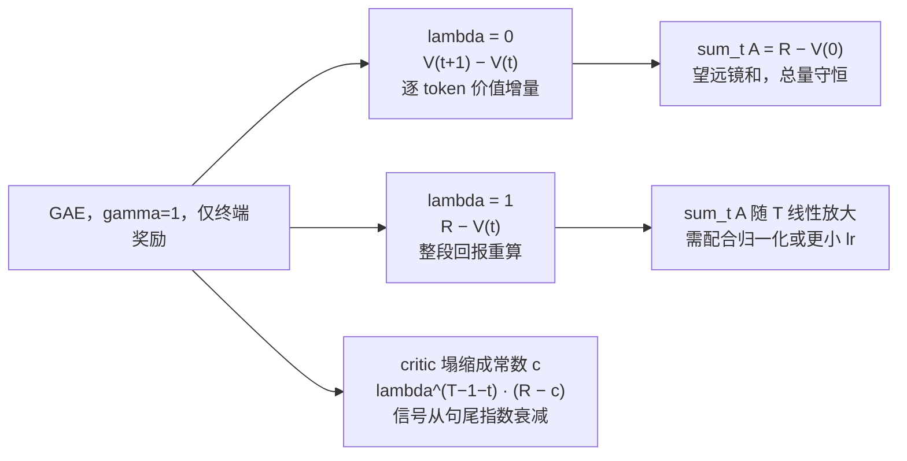

> **系列导航** ｜ [从 MDP 到 GRPO（四）：PPO 与裁剪代理目标](/2026/08/21/mdp-to-grpo-04-ppo-clipped-surrogate/) ｜ [（五）：GRPO 组相对优势](/2026/08/21/mdp-to-grpo-05-grpo-group-relative/) ｜ [RL 信用分配与奖励系数](/2026/09/19/rl-credit-assignment-settlement/) ｜ **本篇：符号约定与数值实算** ｜ 源码侧见 [RL 框架里的那些变量到底怎么算](/2026/09/30/rl-variables-in-frameworks/)

> **TL;DR**
>
> * **同一个 $$A$$ 在不同论文里是三种不同的量（§0）**。PPO 里是 GAE 估计（量纲 = 奖励），GRPO 里是组内 $$z$$ 分数（量纲 = 标准差），Dr.GRPO 里是不除 std 的差值。这不是书写风格问题，是数值问题——它们的典型量级能差两个数量级。
> * **$$\lambda$$ 主要买的是方差，不是偏差（§5.2）**。四种 critic 误差形态下，$$\lambda$$ 从 0 到 1 让方差涨 22–45 倍（0.22→10.0），而 $$\mathrm{bias}^2$$ 的变化都在 2.2 倍以内，而且**非单调**：四种形态的谷底都在 $$\lambda\approx0.3$$–$$0.6$$，$$\lambda\to1$$ 时又回升。用端点叙事概括“$$\lambda\uparrow$$ 降偏差 / 升偏差”都会说错。
> * **$$\hat A_t+V(s_t)$$ 只有在 $$\lambda=1$$ 且末步 bootstrap 取 0 时才等于 return-to-go（§5.3）**。$$\lambda=0.95$$ 时它与真 $$G_t$$ 的相关系数是 0.960，$$\lambda=0$$ 时只有 0.097。若末步用 critic 的 $$V(s_T)$$ 做 bootstrap，$$\lambda=1$$ 也会多出一个 $$\gamma^T V(s_T)$$ 项——$$\gamma=0.95,T=30$$ 时 $$\gamma^T=0.215$$，实测带来 $$-0.078$$ 的系统偏置。
> * **$$\gamma=1$$、确定性转移、仅终端奖励时（RLVR 的标准设定），GAE 有闭式解（§5.4）**：$$\hat A_t=-V_t+(1-\lambda)\sum_{j\ge1}\lambda^{j-1}V_{t+j}+\lambda^{T-1-t}R$$。$$\lambda=0$$ 退化为逐 token 价值增量 $$V_{t+1}-V_t$$（$$\sum_t\hat A_t=R-V_0$$，望远镜和守恒），$$\lambda=1$$ 退化为 $$R-V_t$$（$$\sum_t\hat A_t$$ 是前者的 8 倍，梯度尺度随 $$T$$ 线性放大）。
> * **critic 塌缩成常数 $$c$$ 时，$$\hat A_t=\lambda^{T-1-t}(R-c)$$（§5.6）**：信号从句尾向句首指数衰减，$$\lambda=0$$ 时只有最后一个 token 有梯度。加入逐 token 的 KL shaping 后每个位置都有非零即时奖励，但总量仍随 $$\lambda$$ 放大。
> * **KL 的 $$k_3$$ 估计器有个梯度符号陷阱（§7.2）**：作为估计量它无偏且非负，是 [Schulman 2020](http://joschu.net/blog/kl-approx.html) 推荐的选择；但如果把它当 loss 且**不反向传播穿过它**，策略梯度的系数会从正确的 $$-\log r^{\rm ref}$$（即 $$k_1$$）变成 $$k_3$$ 自己，而 $$k_3$$ 在 $$r^{\rm ref}\approx1$$ 附近退化成二阶小量 $$\approx\frac12(\log r^{\rm ref})^2$$——当 $$r^{\rm ref}>1$$ 时**符号直接相反**，惩罚变成奖励。
> * **token 级重要性比在长序列上是病态的（§8.2）**：即使策略平均而言完全没变，4096 token 的序列级 ratio 的 p99 也有 1719；每 token 的 $$\log$$ ratio 只要有个 $$+0.01$$ 的系统漂移，$$T=4096$$ 时中位数就到 $$6.1\times10^{17}$$。这是 GSPO 改用序列级几何平均的动机。
>
> 全文每张数值表都由 `tools/rl_notation_lab.py` 生成（纯 numpy，CPU 上约 1 分钟），复现方式见 [§11](#11-附录复现脚本)。

---

## 目录

- [0. 三个最容易踩的符号坑](#0-三个最容易踩的符号坑)
- [1. 符号与形状：一张表](#1-符号与形状一张表)
- [2. 记号约定：什么时候加 hat](#2-记号约定什么时候加-hat)
- [3. 五个价值量与它们之间的恒等式](#3-五个价值量与它们之间的恒等式)
- [4. 优势估计的家族谱](#4-优势估计的家族谱)
- [5. GAE：λ 到底在买什么](#5-gaeλ-到底在买什么)
- [6. 概率侧：logprob、熵、温度、top-p](#6-概率侧logprob熵温度top-p)
- [7. KL：三种估计器与梯度符号陷阱](#7-kl三种估计器与梯度符号陷阱)
- [8. 重要性比：token 级 vs 序列级与 PPO 裁剪](#8-重要性比token-级-vs-序列级与-ppo-裁剪)
- [9. 归一化与量纲：GRPO / Dr.GRPO / whitening](#9-归一化与量纲grpo--drgrpo--whitening)
- [10. 速查总表与 15 个坑](#10-速查总表与-15-个坑)
- [11. 附录：复现脚本](#11-附录复现脚本)

---

## 0. 三个最容易踩的符号坑

**坑一：$$A$$ 不是同一个 $$A$$。**

| 出处 | $$A$$ 的定义 | 量纲 | 典型数值范围 |
|:---|:---|:---|:---|
| PPO / TRPO（[Schulman et al. 2015](https://arxiv.org/abs/1506.02438)、[2017](https://arxiv.org/abs/1707.06347)） | $$\hat A_t^{\rm GAE}$$ | 奖励的单位 | 取决于 reward scale，可能 $$\pm 10$$ |
| GRPO（[DeepSeekMath](https://arxiv.org/abs/2402.03300)） | $$(R_i-\hat\mu_g)/\hat\sigma_g$$ | 无量纲（$$z$$ 分数） | $$[-2.65, 2.65]$$，$$G=8$$ 二值奖励 |
| Dr.GRPO（[2503.20783](https://arxiv.org/abs/2503.20783)） | $$R_i-\hat\mu_g$$ | 奖励的单位（不除 std） | $$[-1, 1]$$，二值奖励 |

这三行**都是带帽的估计量**（原论文里都没加帽，这是混乱的起点）。真正不带帽的 $$A^\pi=Q^\pi-V^\pi$$ 你永远拿不到。

量化一下：当 $$G=8$$、二值奖励、组内恰好 1 条答对时，GRPO 给正样本的 advantage 是 $$2.6458$$，Dr.GRPO 给 $$0.875$$（§9.1）；而一个 reward scale 为 $$\pm 10$$ 的 PPO 任务里，$$\hat A^{\rm GAE}$$ 的常见量级是 $$\pm 5$$。**同一个字母 $$A$$，三种量纲，跨方法复用前必须先对齐尺度**。PPO 的 value loss 直接对 $$(\hat V-\hat R)^2$$ 做回归，把 GRPO 的 $$z$$ 分数喂进去，回归目标就换了一个量纲。

**坑二：$$\pi_{\rm old}$$ 与 $$\pi_{\rm ref}$$ 是两个东西。**

- $$\pi_{\rm old}$$（也叫 $$\pi_{\theta_{\rm old}}$$、behavior policy $$\mu$$）：**生成当前这批 rollout 的那份策略**，每轮 rollout 刷新一次。只出现在重要性比 $$r_t(\theta)=\pi_\theta/\pi_{\rm old}$$ 里。
- $$\pi_{\rm ref}$$：**RL 开始前的 SFT 模型**，全程冻结。只出现在 KL 惩罚 $$\mathbb D_{\rm KL}(\pi_\theta\Vert\pi_{\rm ref})$$ 里。

TRPO 的信任域约束是对 $$\pi_{\rm old}$$ 的；RLHF 的 KL 惩罚是对 $$\pi_{\rm ref}$$ 的。混用会让裁剪失效或者把模型往错误的锚点拉。

**坑三：$$\gamma$$ 和 $$\lambda$$ 管的是两件事。**

- $$\gamma$$（折扣）：决定**你在优化哪个目标**。$$\gamma<1$$ 时优化的是折扣回报，梯度是“biased for the true undiscounted objective”——Schulman 在 GAE 论文里专门用“$$\gamma$$-just”这个词强调这一点。RLHF 里通常取 $$\gamma=1$$（有限 horizon，不需要折扣）。
- $$\lambda$$（GAE 参数）：决定**你用什么估计量去逼近那个目标的梯度**。$$\gamma$$ 固定不动时，$$\lambda$$ 仍然要调。

---

## 1. 符号与形状：一张表

LLM RL 里所有量的“时间维”就是 token 位置，状态转移是**确定性的**（$$s_{t+1}=s_t$$ 拼上 $$a_t$$），这一点后面会反复用到。

| 符号 | 定义 | LLM 场景对应 | Tensor 形状 |
|:---|:---|:---|:---|
| $$q,\ x$$ | prompt / 条件 | 输入问题 | `[B]` |
| $$o,\ y$$ | 生成的回答 | 一条 rollout | `[B, T]` |
| $$s_t$$ | 状态 | $$(q, y_{<t})$$ 拼起来的上下文 | — |
| $$a_t$$ | 动作 | 第 $$t$$ 个 token $$y_t$$ | `[B]` |
| $$T,\ \lvert o\rvert$$ | 回答长度 | — | `[B]` |
| $$\pi_\theta(a_t\mid s_t)$$ | 策略 | next-token 分布 | `[B, T, V]` |
| $$\log\pi_\theta(y_t\mid q,y_{<t})$$ | token 对数概率 | logits 的 log-softmax 取对应项 | `[B, T]` |
| $$r_t$$ | 即时奖励 | RLVR 里只有 $$t=T-1$$ 非零；KL shaping 时每步非零 | `[B, T]` |
| $$R,\ R(o)$$ | 轨迹总奖励 / 终端奖励 | 答案对=1，错=0 | `[B]` |
| $$\gamma$$ | 折扣因子 | RLHF 常取 1 | 标量 |
| $$\lambda$$ | GAE 参数 | 0.95（PPO 默认） | 标量 |
| $$G_t$$ | return-to-go $$\sum_{l\ge0}\gamma^l r_{t+l}$$ | — | `[B, T]` |
| $$V_\phi(s_t)$$ | 状态价值（critic） | “这个前缀最终能拿多少分” | `[B, T]` |
| $$Q^\pi(s_t,a_t)$$ | 动作价值 | — | `[B, T]` |
| $$A^\pi(s_t,a_t)$$ | 优势 $$=Q^\pi-V^\pi$$ | — | `[B, T]` |
| $$\delta_t$$ | TD error $$=r_t+\gamma V(s_{t+1})-V(s_t)$$ | — | `[B, T]` |
| $$\hat A_t$$ | 优势的估计量 | GAE / 组相对 / RLOO … | `[B, T]` |
| $$r_t(\theta)$$ | 重要性比 $$=\pi_\theta(a_t\mid s_t)/\pi_{\rm old}(a_t\mid s_t)$$ | 沿用 [PPO 原文](https://arxiv.org/abs/1707.06347) | `[B, T]` |
| $$r^{\rm ref}_t$$ | 参考比 $$=\pi_{\rm ref}(a_t\mid s_t)/\pi_\theta(a_t\mid s_t)$$ | 沿用 [Schulman 博客](http://joschu.net/blog/kl-approx.html) | `[B, T]` |
| $$s_i(\theta)$$ | GSPO 的序列级比 $$=r_i(\theta)^{1/\lvert o_i\rvert}$$ | 沿用 [GSPO 原文](https://arxiv.org/abs/2507.18071) | `[B]` |
| $$\epsilon$$ | PPO 裁剪半径 | 0.2（policy），0.1~0.5（value） | 标量 |
| $$\beta$$ | KL 系数 | 0.001~0.1 | 标量 |

**两组记号约定，全文遵守。**

**第一组：字母 $$r$$ 出现三次，靠装饰区分、不靠上下文猜。**

- **$$r_t$$** — 即时奖励（$$\delta_t$$、$$G_t$$ 里都是它）。
- **$$r_t(\theta)$$** — 重要性比 $$\pi_\theta/\pi_{\rm old}$$。**显式写出 $$(\theta)$$**，这是 PPO 原文区分它与奖励的方式。
- **$$r^{\rm ref}_t$$** — 参考比 $$\pi_{\rm ref}/\pi_\theta$$，只出现在 KL 里。

三者**互不为倒数**：$$r^{\rm ref}_t=1/r_t(\theta)$$ 只在 $$\pi_{\rm old}=\pi_{\rm ref}$$ 时成立，而多 epoch 复用 rollout 时这不成立。

**第二组：三个策略各司其职，写成 $$\pi$$ 加下标，不要另造字母。**

| 符号 | 含义 | 什么时候刷新 | 出现在哪 |
|:---|:---|:---|:---|
| $$\pi_\theta$$ | 当前策略（被优化的那个） | 每个 minibatch | 分子：重要性比、KL |
| $$\pi_{\rm old}$$ | 旧策略 / behavior policy $$\mu$$ | 每轮 rollout | 分母：重要性比 $$r_t(\theta)$$ |
| $$\pi_{\rm ref}$$ | 参考策略（RL 开始前的 SFT 模型） | 全程冻结 | 分母：KL 的参考比 $$r^{\rm ref}_t$$ |

三者**两两不同**：$$\pi_{\rm old}$$ 追着 $$\pi_\theta$$ 走，$$\pi_{\rm ref}$$ 全程不动。

---

## 2. 记号约定：什么时候加 hat

RL 的符号混乱有一半来自同一个字母在“真值”和“估计”之间来回切换。这一节给出本文统一遵守的规则，后面所有公式都按它来读。

### 2.1 判据：你在对什么取期望

$$\hat x = \text{某个期望的蒙特卡洛替代（随机性来自数据）},\qquad x = \text{定义出来的量，或能在一次前向里精确算出来的量}$$

判据只有一条：**这个数是不是某个期望的采样替代？** 是就加帽，不是就不加。它推出三个反直觉的结论：

- $$\log\pi_\theta(y_t\mid q,y_{<t})$$、$$r_t(\theta)$$、$$\mathcal H_t=-\sum_v p_v\log p_v$$ **不加帽**：给定模型和 token，它们是前向的确定性输出。熵虽然作用在采样出来的 token 上，但它对整个词表求和，128k 维一次前向就算完。
- $$\mathbb D_{\rm KL}$$ **加帽**：它是 $$\mathbb E_{o\sim\pi_\theta}[\cdot]$$，只能用手上采样到的 token 去估，跨采样会变。

  > 注意理由**不是**“序列空间太大算不起”。逐 token 的 KL $$\sum_v\pi_\theta(v\mid s_t)\log\frac{\pi_\theta(v\mid s_t)}{\pi_{\rm ref}(v\mid s_t)}$$ 对词表求一次和就能算精确，与熵同量级——**那种实现下它不加帽**。加帽与否取决于你是不是在用采样替代期望，与这个量“大不大”无关。§7.1 实验里的真 KL 就是用全词表求和算出来的，作为三个采样估计器的对照基准。
- $$G_t$$ 有双重身份：作为“这条轨迹的折扣回报”它是确定的数（轨迹已经采到了）；作为 $$A^\pi(s_t,a_t)$$ 的蒙特卡洛估计 $$\hat A_t^{\rm MC}=G_t-V(s_t)$$ 它**加帽**，因为随机性来自“这条轨迹是从 $$\pi$$ 里随机采出来的”。同一个符号、两种身份，这是文献里最常被写混的一处。

从真值走到估计有三个污染源，RL 三个都有，监督学习只有前两个：① 有限样本、② 函数近似、③ 自举。

### 2.2 全篇记号清单

| 量 | 无帽（真值 / 定义 / 精确可算） | 有帽（采样替代某个期望） | 加帽的理由 |
|:---|:---|:---|:---|
| 优势 | $$A^\pi(s,a)=Q^\pi-V^\pi$$ | $$\hat A_t^{\rm GAE}$$、$$\hat A_i^{\rm GRPO}$$、$$\hat A_i^{\rm RLOO}$$ | 依赖未知的 $$Q^\pi,V^\pi$$ |
| 状态价值 | $$V^\pi$$ | $$V_\phi$$（带下标 $$\phi$$ 时不再加帽） | ② 函数近似 |
| 回报 | $$G_t$$（给定轨迹后是确定的数） | 当它充当 $$A$$ 的估计量时写成 $$\hat A_t=G_t-\hat b$$ | 角色决定，见 §2.1 |
| TD error | $$\delta_t$$（对给定 $$V$$ 精确） | $$\hat\delta_t=\delta_t^{V_\phi}$$ | ② |
| 期望 | $$\mathbb E_\pi[\cdot]$$ | $$\hat{\mathbb E}=\frac1N\sum_i$$ | ① 有限样本 |
| 策略梯度 | $$\nabla_\theta J(\theta)$$ | $$\hat g$$ | ① + $$\hat A$$ |
| KL | $$\mathbb D_{\rm KL}$$（定义） | $$\hat{\mathbb D}_{\rm KL}$$（实现里就是 $$k_3$$ 的平均） | ① 对 $$o\sim\pi_\theta$$ 采样 |
| value target | — | $$\hat R_t=\hat A_t+V_\phi(s_t)$$ | 见 §2.3 |
| logprob / 重要性比 / 熵 | $$\log\pi_\theta,\ r_t(\theta),\ r^{\rm ref}_t,\ \mathcal H_t$$ | — | 精确可算 |
| Bellman 方程 | $$V^\pi(s)=\mathbb E_\pi[r+\gamma V^\pi(s')]$$ | 更新式 $$\hat V\leftarrow\hat V+\alpha(\hat R-\hat V)$$ | 定义 vs 算法 |

把帽子写进 Bellman 方程是概念错误：那个方程说的是**真值满足什么关系**，不是你手上的数满足什么关系。你手上的 $$\hat V$$ 一般并不满足它——差值就是 TD error。

PPO 的裁剪目标是“混着戴”的典型：

$$L^{\rm CLIP}=\mathbb E\Big[\min\big(r_t(\theta)\,\hat A_t,\ \mathrm{clip}(r_t(\theta),1-\epsilon,1+\epsilon)\,\hat A_t\big)\Big]$$

这行公式里三种帽子混着戴：$$r_t(\theta)$$ 无帽（精确比值）、$$\hat A_t$$ 有帽（估计量）、外层 $$\mathbb E$$ 无帽（这是目标函数的**定义**）。只有当你把它换成 $$\frac1N\sum$$ 去做 minibatch 更新时才变成估计 $$\hat L$$。PPO 的“目标”和“你每步实际在优化的那个数”差一顶帽子。

### 2.3 RL 特有的自举循环

监督学习里标签是“真的”，$$y$$ 不带帽。RL 里没有这种东西：

$$\underbrace{\hat R_t}_{\text{训练 critic 的 target}}=\underbrace{\hat A_t}_{\text{用 }V_\phi\text{ 算的}}+\underbrace{V_\phi(s_t)}_{\text{被训练的那个函数}}$$

target 由估计量构造，而这个 target 又要拿去训练构造它的那个函数。**这是一个固定点迭代，不是一次回归**。后果：

- $$\hat R_t$$ 必须带帽——它看起来像标签，其实不是；
- 但训练时把它**当标签用**（算 $$\ell_2$$ 损失），这是 bootstrap 的定义，不是笔误；
- $$V_\phi$$ 的偏差会循环放大：偏高的 $$V$$ → 偏低的 $$\hat A$$ → 偏低的 $$\hat R$$ → 拉低 $$V$$…… 收敛性靠 $$\gamma<1$$ 和 $$\lambda$$ 的收缩性保证（[IMPALA](https://arxiv.org/abs/1802.01561) 对 V-trace 的收缩性有专门证明）。

一顶帽子不够时用 tilde 表示确定性后处理（$$\tilde A_i=(\hat A_i-\mu)/\sigma$$，whitening 后的版本），不要叠成 $$\hat{\hat A}$$。

---

## 3. 五个价值量与它们之间的恒等式

先定义清楚，再谈估计。**这一节里所有符号都不带帽**——它们全是定义出来的真值，你拿不到，只能估计：

$$V^\pi(s_t)=\mathbb E_\pi\!\left[G_t\mid s_t\right],\qquad Q^\pi(s_t,a_t)=\mathbb E_\pi\!\left[G_t\mid s_t,a_t\right],\qquad A^\pi(s_t,a_t)=Q^\pi(s_t,a_t)-V^\pi(s_t)$$

三条恒等式，后面的所有估计量都是它们的推论：

**(1) 优势的零均值性质**

$$\mathbb E_{a\sim\pi(\cdot\mid s)}\!\left[A^\pi(s,a)\right]=0$$

这是“baseline 不改变梯度期望”的根源：任何只依赖 $$s$$ 的 $$b(s)$$ 都可以从回报里减掉而保持无偏。

注意这条**只对无帽的 $$A^\pi$$ 成立**。你手上的 $$\hat A$$ 一般**不满足** $$\mathbb E[\hat A]=0$$：$$\hat A^{\rm GAE}$$ 在 $$V_\phi\neq V^\pi$$ 时有偏，$$\hat A^{\rm GRPO}$$ 因为 baseline 含自身而均值非零、方差被 $$\hat\sigma_g$$ 强行改成 1。**“组内 advantage 均值为零”是构造出来的，不是定理**。

**(2) TD error 的恒等式（对任意 $$V$$ 成立，不要求 $$V=V^\pi$$）**

$$G_t - V(s_t)=\sum_{l=0}^{T-1-t}\gamma^l\,\delta_{t+l}+\gamma^{T-t}V(s_{T}),\qquad \delta_t=r_t+\gamma V(s_{t+1})-V(s_t)$$

右边第二项容易被漏掉。它为零的条件是：**episode 真正终止且末步 bootstrap 取 $$V(s_T)=0$$**（此时 $$\lambda=1$$ 的 GAE 精确等于 $$G_t-V(s_t)$$）；若末步用 critic 预测的 $$V(s_T)$$（截断而非终止），$$\gamma^{T-t}V(s_T)$$ 就留下来了——$$\gamma=0.95,T=30$$ 时 $$\gamma^T=0.215$$，不可忽略，§5.3 有实测。

**(3) 确定性转移下的简化**

LLM 生成中 $$s_{t+1}=(s_t,a_t)$$ 是确定的，所以

$$Q^\pi(s_t,a_t)=r_t+\gamma V^\pi(s_{t+1})\quad\Longrightarrow\quad A^\pi(s_t,a_t)=r_t+\gamma V^\pi(s_{t+1})-V^\pi(s_t)=\delta_t^{\pi}$$

**在确定性环境里，“优势”就是 TD error 的真值**。这是 LLM RL 与经典 RL 最重要的结构差异，也是 §5.4 的出发点。

---

## 4. 优势估计的家族谱

所有 critic-free 方法都可以写成同一个模板（[GPO 统一框架，2503.19523](https://arxiv.org/abs/2503.19523) 的表 1）：先选一个重要性权重函数 $$\omega(\cdot)$$，再选一个 baseline $$B$$，最后得到 $$A(\cdot)$$。**下面这张表里所有的 $$A$$ 都是估计量，原论文统一不加帽，本文一律写成 $$\hat A$$**：

| 估计量 | $$\omega(\cdot)$$ | 裁剪 | baseline $$B$$ | $$\hat A$$ | 出处 |
|:---|:---|:---|:---|:---|:---|
| REINFORCE | $$1$$ | — | $$0$$ | $$R(\mathbf y^i)$$ | [Williams 1992](https://link.springer.com/article/10.1007/BF00992696) |
| RLOO | $$1$$ | — | $$\hat\mu_{-i}=\frac{1}{N-1}\sum_{j\ne i}R(\mathbf y^j)$$ | $$R(\mathbf y^i)-\hat\mu_{-i}$$ | [2402.14740](https://arxiv.org/abs/2402.14740) |
| ReMax | $$1$$ | — | $$\hat b=R(\mathbf y)^{\rm greedy}$$ | $$R(\mathbf y^i)-\hat b$$ | [2310.10505](https://arxiv.org/abs/2310.10505) |
| GRPO | $$\mathrm{clip}(\cdot)$$ | $$[1-\epsilon,1+\epsilon]$$ | $$\hat\mu_g$$ | $$(R(\mathbf y^i)-\hat\mu_g)/\hat\sigma_g$$ | [2402.03300](https://arxiv.org/abs/2402.03300) |
| REINFORCE++ | $$\mathrm{clip}(\cdot)$$ | $$[1-\epsilon,1+\epsilon]$$ | 全局 batch 的均值 / std | $$R(\mathbf y^i)-\beta\sum_{j\ge t}{\rm KL}(j)$$，再对全局 batch 做 $$z$$ 归一化 | [2501.03262](https://arxiv.org/abs/2501.03262) |
| PPO / GAE | $$\mathrm{clip}(\cdot)$$ | $$[1-\epsilon,1+\epsilon]$$ | $$V_\phi(s_t)$$ | $$\sum_l(\gamma\lambda)^l\hat\delta_{t+l}$$ | [1506.02438](https://arxiv.org/abs/1506.02438) |

REINFORCE++ 那一行的 KL 项是**减**去的，用的还是 $$k_1$$ 形式 $${\rm KL}(t)=\log\frac{\pi_\theta^{\rm RL}(o_t\mid q,o_{<t})}{\pi^{\rm SFT}(o_t\mid q,o_{<t})}$$（核对自原文式 (8)–(10)，原文取 $$\gamma=1$$、无折扣、无 critic）。**这与 GRPO 用的 $$k_3$$ 不是同一个估计量**——$$k_1$$ 可以为负、方差大（§7.1），把它当 reward shaping 注入每一步奖励，等于给每个 token 加了一个近半数概率为负的噪声项。

RLOO 的 baseline 用**留一法均值**（$$\hat\mu_{-i}$$），这样 $$R(\mathbf y^i)$$ 不出现在自己的 baseline 里，$$\mathrm{Cov}(\hat\mu_{-i},R_i)=0$$，梯度**严格无偏**；GRPO 用含自身的 $$\hat\mu_g$$，有 $$O(1/G)$$ 的偏差，换来 std 归一化带来的稳定性。**区别不在帽子，在于 baseline 与 $$R_i$$ 是否独立**。ReMax 的 baseline 是贪婪解码的奖励，不依赖采样轨迹，因此也独立于 $$R_i$$。

基于 critic 的估计量单独一张表：

| 估计量 | 公式 | 需要 critic | $$\lambda$$ 的角色 |
|:---|:---|:---|:---|
| MC / REINFORCE | $$\hat A_t=G_t-V(s_t)$$（或 $$G_t$$） | 可选 | — |
| TD(0) | $$\hat A_t=\hat\delta_t$$ | 是 | 等价于 $$\lambda=0$$ |
| $$n$$-step | $$\hat A_t=\sum_{l=0}^{n-1}\gamma^l r_{t+l}+\gamma^n V(s_{t+n})-V(s_t)$$ | 是 | — |
| $$\mathrm{GAE}(\gamma,\lambda)$$ | $$\hat A_t=\sum_{l\ge0}(\gamma\lambda)^l\hat\delta_{t+l}$$ | 是 | 偏差-方差旋钮 |
| $$\mathrm{TD}(\lambda)$$（**估价值**用） | 后向视图的资格迹累积 | 是 | 估 $$V$$ 而非估 $$A$$ |

> GAE 与 TD($$\lambda$$) 用的是同一个 $$\gamma\lambda$$ 折扣，但**目标不同**：TD($$\lambda$$) 估计的是 $$V$$，GAE 估计的是 $$A$$。名字像，不能换。

---

## 5. GAE：$$\lambda$$ 到底在买什么

**先把帽子戴上**：本节所有 $$\hat A$$ 都是 $$A^\pi$$ 的估计量，所有 $$\hat\delta$$ 都是用 $$V_\phi$$ 算的（不是真值 $$\delta^\pi$$）。GAE 论文把这一点写得很清楚——它定义的是 $$\hat A^{\rm GAE(\gamma,\lambda)}_t$$，并单独证明了“当 $$V=V^{\pi,\gamma}$$ 时它是 $$\gamma$$-just 的”；很多派生工作把这个帽子丢了，于是读者会误以为 $$\lambda$$ 改变的是目标本身，其实它改变的只是**估计量**。

$$A^\pi(s_t,a_t)\ \xrightarrow{\ V^\pi\to V_\phi\ }\ \hat A_t=\sum_{l\ge0}(\gamma\lambda)^l\hat\delta_{t+l},\qquad \hat\delta_t=r_t+\gamma V_\phi(s_{t+1})-V_\phi(s_t)$$

帽子只有一顶，但掩盖了两层近似（$$V_\phi\neq V^\pi$$ 与 $$\lambda<1$$），所以下面必须做分解才能看清楚。

### 5.1 递归式与展开式是同一个东西（数值验证）

实践中都写反向递归：

$$\hat A_t=\delta_t+\gamma\lambda\,\hat A_{t+1}$$

它与定义式 $$\hat A_t=\sum_l(\gamma\lambda)^l\delta_{t+l}$$ 完全等价。实测（随机 MDP，$$S=10,A=3,\gamma=0.95,T=30$$）：

```
lambda=0.00 : max|递归 - 展开| = 0.000e+00
lambda=0.50 : max|递归 - 展开| = 4.441e-16
lambda=0.95 : max|递归 - 展开| = 3.553e-15
lambda=1.00 : max|递归 - 展开| = 3.553e-15
```

纯浮点误差，两种写法随便选。**但边界处理必须一致**：序列末尾要 bootstrap，且跨 episode 不能把 $$\hat A_{t+1}$$ 传过去。

### 5.2 偏差-方差分解：四种 critic 误差形态

设置：随机 MDP（$$S=10,A=3,\gamma=0.95,T=30$$），用线性方程组解出 $$V^\pi,Q^\pi$$（自校验：$$\max_s\lvert\mathbb E_\pi[A^\pi]\rvert=3.9\times10^{-16}$$）。对每个 $$(s,a)$$ 采样 1200 条轨迹，逐 $$(s,a)$$ 先算 bias 与 var 再对状态求平均（**跨状态直接平均会让正负偏差抵消，这是最容易犯的统计错误**）。

四种 critic：① $$V_\phi=V^\pi$$；② $$V_\phi=0.8V^\pi$$（全局低估）；③ 低容量聚类（10 个状态按编号分成 3 类，取类内均值，critic 分辨不出同类状态）；④ $$V_\phi=V^\pi+\mathcal N(0,(0.15\sigma_V)^2)$$（逐状态独立噪声，固定一份）。

**① 完美 critic（$$V_\phi=V^\pi$$）**

| $$\lambda$$ | bias$$^2$$ | var | MSE | 噪声地板 var$$/N$$ |
|---:|---:|---:|---:|---:|
| 0.00 | 0.0003 | 0.3754 | 0.3756 | 0.0003 |
| 0.30 | 0.0003 | 0.4706 | 0.4710 | 0.0004 |
| 0.60 | 0.0008 | 0.9023 | 0.9032 | 0.0008 |
| 0.90 | 0.0040 | 3.3667 | 3.3707 | 0.0028 |
| 0.95 | 0.0062 | 5.1892 | 5.1954 | 0.0043 |
| 1.00 | 0.0112 | 10.0265 | 10.0377 | 0.0084 |

bias$$^2$$ 逐行都等于噪声地板（$$=$$ 该行 var$$/1200$$，即样本均值的标准误平方），说明 $$V=V^\pi$$ 时任意 $$\lambda$$ 都无偏——表里剩下的 bias$$^2$$ 纯粹是“你只采了 1200 条”造成的。方差则从 0.375 单调涨到 10.03，**27 倍**。

**② 全局缩放误差（$$V_\phi=0.8\,V^\pi$$）**

| $$\lambda$$ | bias$$^2$$ | var | MSE |
|---:|---:|---:|---:|
| 0.00 | 0.0311 | 0.2402 | 0.2714 |
| 0.30 | 0.0279 | 0.3589 | 0.3868 |
| 0.60 | **0.0264** | 0.8004 | 0.8268 |
| 0.90 | 0.0317 | 3.2865 | 3.3182 |
| 0.95 | 0.0358 | 5.1280 | 5.1638 |
| 1.00 | 0.0446 | 10.0133 | 10.0579 |

**③ 低容量 critic（10 状态聚成 3 类，取类内均值）**

| $$\lambda$$ | bias$$^2$$ | var | MSE |
|---:|---:|---:|---:|
| 0.00 | 0.2432 | 0.2207 | 0.4639 |
| 0.30 | 0.2285 | 0.2865 | 0.5149 |
| 0.60 | **0.2238** | 0.6808 | 0.9045 |
| 0.90 | 0.2474 | 3.1510 | 3.3984 |
| 0.95 | 0.2580 | 5.0201 | 5.2781 |
| 1.00 | 0.2706 | 10.0003 | 10.2709 |

**④ 逐状态独立噪声（$$V_\phi=V^\pi+\mathcal N(0,(0.15\sigma_V)^2)$$）**

| $$\lambda$$ | bias$$^2$$ | var | MSE |
|---:|---:|---:|---:|
| 0.00 | 0.0113 | 0.4493 | 0.4606 |
| 0.30 | 0.0105 | 0.5249 | 0.5354 |
| 0.60 | **0.0105** | 0.9457 | 0.9562 |
| 0.90 | 0.0142 | 3.3963 | 3.4105 |
| 0.95 | 0.0171 | 5.2115 | 5.2286 |
| 1.00 | 0.0244 | 10.0332 | 10.0575 |

**读出来的结论（只说数据支持得住的）：**

1. **$$\lambda$$ 对方差的影响是单调、巨大、与 critic 质量无关的**：四种形态下方差都从 0.22–0.45 涨到 10.0，涨幅 22–45 倍。这是 GAE 的第一性作用。
2. **$$\lambda$$ 对偏差的影响小得多，而且非单调**：三种有误差的形态里，bias$$^2$$ 的谷底都在 $$\lambda\approx0.3$$–$$0.6$$（②0.0264、③0.2238、④0.0105），$$\lambda\to1$$ 时又回升到 0.0446 / 0.2706 / 0.0244。全区间变化幅度分别是 1.43 倍、1.11 倍、2.16 倍——**都远小于方差的 22–45 倍**。所以“$$\lambda$$ 买的是方差”成立；但“$$\lambda\uparrow$$ 单调降偏差”或“单调升偏差”都不成立，取决于你比较哪两个点。
3. **这张表里 $$\lambda$$ 小的时候 MSE 最低，但不要因此把 PPO 的 $$\lambda$$ 设成 0**。这里的判据是“单步优势估计的 MSE”，而 PPO 真正关心的是整条轨迹上策略梯度估计的方差，且实践中 critic 与 policy 交替更新、$$V_\phi$$ 永远滞后于当前策略（GAE 论文 §4 明确讨论了这一点）。$$\lambda=0.95$$ 是经验值，不是从这张表推出来的。

### 5.3 $$\hat A+V$$ 不等于 return-to-go

训练 critic 的 target 通常写成 $$\hat R_t=\hat A_t+V(s_t)$$。它到底是不是 $$G_t$$？

```
真 G_0: mean=-0.095  std=3.154 | V^pi(s0)=-0.497 | A^pi(s0,a0)=+0.416
lambda=0.00 : mean(R_0)=-0.076  bias vs E[G_0] = +0.0193  corr(R_0,G_0)=0.0969
lambda=0.50 : mean(R_0)=-0.077  bias vs E[G_0] = +0.0181  corr(R_0,G_0)=0.4940
lambda=0.90 : mean(R_0)=-0.117  bias vs E[G_0] = -0.0220  corr(R_0,G_0)=0.8868
lambda=0.95 : mean(R_0)=-0.122  bias vs E[G_0] = -0.0267  corr(R_0,G_0)=0.9604
lambda=1.00 : mean(R_0)=-0.095  bias vs E[G_0] = -0.0000  corr(R_0,G_0)=1.0000
```

只有 $$\lambda=1$$ 时 $$\hat R_t$$ 才精确等于 $$G_t$$。$$\lambda=0.95$$ 时相关系数 0.960、系统性低估 0.027；$$\lambda=0$$ 时 $$\hat R_t=r_t+\gamma V(s_{t+1})$$ 就是一步 TD target，与 $$G_t$$ 的相关性只剩 0.097。

**这个“$$\lambda=1$$ 精确相等”还有一个前提条件**：末步必须按 episode 终止处理，即 bootstrap 值取 0。若改成用 critic 的 $$V(s_T)$$ 做 bootstrap（截断而非终止），恒等式 (2) 里的 $$\gamma^{T-t}V(s_T)$$ 就留下来了：

```
末步用 critic 的 V(s_T) bootstrap：lambda=1 时 mean(R_0 - G_0) = -0.0778，corr = 0.9985
理论上多出 gamma^T V(s_T)：gamma^T = 0.2146，E[gamma^T V(s_T)] = -0.0778
```

量级上：$$\gamma=0.95$$、$$T=30$$ 时 $$\gamma^T=0.215$$，单看数值是个是个“小尾巴”，但它是一个**系统性**偏置，不是噪声。horizon 越短、$$\gamma$$ 越接近 1，这一项越大；$$\gamma=1$$ 时它等于 $$V(s_T)$$ 本身。

**实践含义**：用 $$\lambda<1$$ 时，critic 拟合的不是“从这里出发能拿多少分”，而是“$$\lambda$$ 步截断的回报”。这本身不是 bug（TD 学习本来就是这么做的），但如果你拿 $$V$$ 去做“这个 prompt 值不值得做”的推断（dynamic sampling、难度过滤），要记住它在这个意义上有偏。

### 5.4 RLHF 特例：$$\gamma=1$$ 下 GAE 的闭式解

这一节直接对应 RLVR 的训练设定：**$$\gamma=1$$、状态转移确定、奖励只在最后一个 token 给出、终止状态价值为 0**。在这个设定下 $$r_t=0\ (t<T-1)$$、$$r_{T-1}=R$$、$$V(s_T)=0$$，于是

$$\delta_t=V_{t+1}-V_t\ (t<T-1),\qquad \delta_{T-1}=R-V_{T-1}$$

把 GAE 的定义式展开并做望远镜求和（过程见 §3 的恒等式 (2)），得到**闭式解**：

$$\boxed{\ \hat A_t=-V_t+(1-\lambda)\sum_{j=1}^{T-1-t}\lambda^{j-1}V_{t+j}+\lambda^{T-1-t}R\ }$$

数值验证（$$T=12$$，$$V=[0.280,0.290,0.341,0.353,0.444,0.491,0.529,0.649,0.657,0.686,0.702,0.797]$$，$$R=1$$）：

```
lambda=0.00 : max|递归 - 闭式| = 0.000e+00
lambda=0.30 : max|递归 - 闭式| = 1.527e-16
lambda=0.60 : max|递归 - 闭式| = 1.110e-16
lambda=0.90 : max|递归 - 闭式| = 8.327e-17
lambda=0.95 : max|递归 - 闭式| = 1.110e-16
lambda=1.00 : max|递归 - 闭式| = 1.110e-16
```



### 5.5 两个极端的含义

上式的两个端点退化成很不一样的东西：

| $$t$$ | $$V(s_t)$$ | $$\lambda=0$$：$$V_{t+1}-V_t$$ | $$\lambda=1$$：$$R-V_t$$ |
|---:|---:|---:|---:|
| 0 | 0.280 | 0.0105 | 0.7204 |
| 1 | 0.290 | 0.0512 | 0.7099 |
| 2 | 0.341 | 0.0114 | 0.6588 |
| 3 | 0.353 | 0.0918 | 0.6474 |
| 4 | 0.444 | 0.0463 | 0.5556 |
| 5 | 0.491 | 0.0388 | 0.5093 |
| 6 | 0.529 | 0.1195 | 0.4705 |
| 7 | 0.649 | 0.0083 | 0.3510 |
| 8 | 0.657 | 0.0284 | 0.3427 |
| 9 | 0.686 | 0.0159 | 0.3142 |
| 10 | 0.702 | 0.0958 | 0.2984 |
| 11 | 0.797 | 0.2026 | 0.2026 |
| $$\sum_t\hat A_t$$ | | **0.7204** $$=R-V_0$$ | **5.7808**（8.0 倍） |

- **$$\lambda=0$$：$$\hat A_t=V_{t+1}-V_t$$**，即“写下这个 token 让期望得分涨了多少”。这是**真正的逐 token 信用分配**，而且 $$\sum_t\hat A_t=R-V_0$$ 是望远镜和——总梯度量守恒，不重复计入。
- **$$\lambda=1$$：$$\hat A_t=R-V_t$$**，即“最终结果比这个位置的预期好多少”。$$\sum_t\hat A_t=5.78$$，是 $$\lambda=0$$ 的 8 倍——**每个 token 都把整条轨迹的剩余价值完整算了一遍**。

这正好解释了 §5.2 里方差为什么随 $$\lambda$$ 暴涨：$$\lambda\to1$$ 时每个位置都在估计整段回报，$$T$$ 个高度相关的项叠加；$$\lambda=0$$ 时每个位置只估计一步增量，且这些增量加起来是望远镜和。**表里的“方差涨 27 倍”和这里的“$$\sum_t\hat A_t$$ 涨 8 倍”是同一件事的两面。**

### 5.6 critic 塌缩时会发生什么

若 critic 失去分辨力、对所有位置输出同一个常数 $$c$$（RLHF 里很常见的 value collapse），则 $$\delta_t=0\ (t<T-1)$$、$$\delta_{T-1}=R-c$$，闭式解退化成：

$$\hat A_t=\lambda^{T-1-t}(R-c)$$

实测（$$T=12,R=1$$）：

```
c=0.5  lam=0.00 : GAE=[0. 0. 0. 0. 0. 0. 0. 0. 0. 0. 0. 0.5]
c=0.5  lam=0.95 : GAE=[0.2844 0.2994 0.3151 0.3317 0.3492 0.3675
                       0.3869 0.4073 0.4287 0.4512 0.4750 0.5000]   闭式偏差 5.6e-17
c=1.0  lam=0 / 0.95 : GAE 全为 0
```

**$$\lambda=0.95$$ 时信号从句尾向句首指数衰减**（$$0.95^{11}=0.57$$），$$\lambda=0$$ 时**只有最后一个 token 拿到梯度**，前面全部为 0。若 $$c$$ 恰好等于 $$R$$（critic 完全预测准了平均分），信号彻底消失。

这解释了两个实践现象：

1. 纯 outcome reward + 无 KL shaping + critic 塌缩 → 训练早期只有靠近答案的 token 在学；
2. 加入**每 token 的 KL shaping 奖励** $$r_t=-\beta\,{\rm KL}_t$$ 后，每个位置都有了非零即时奖励，信号不再依赖 $$\lambda$$ 的指数传播。取 $$T=12$$、$$\beta\,{\rm KL}_t\sim U(0,0.1)$$：

```
lambda=0.00 : A[:6] = [ 0.0041  0.0057 -0.0188  0.0529 -0.0078 -0.0295]  非零 12/12
lambda=0.95 : A[:6] = [ 0.0827  0.0828  0.0811  0.1052  0.0550  0.0661]  非零 12/12
lambda=1.00 : A[:6] = [ 0.1338  0.1297  0.1240  0.1428  0.0899  0.0977]  非零 12/12
```

三种 $$\lambda$$ 都是 12/12 个 token 非零，但量级差一个数量级——**KL shaping 解决的是“信号到不到得了句首”，解决不了“总量随 $$\lambda$$ 放大”**。

---

## 6. 概率侧：logprob、熵、温度、top-p

### 6.1 定义

$$\log\pi_\theta(y_t\mid q,y_{<t})=z_{t,y_t}-\mathrm{logsumexp}(z_t),\qquad z_t\in\mathbb R^{V}$$

$$\log\pi_\theta(o\mid q)=\sum_{t=1}^{\lvert o\rvert}\log\pi_\theta(y_t\mid q,y_{<t}),\qquad \mathcal H_t=-\sum_{v}p_{t,v}\log p_{t,v},\qquad \mathrm{PPL}(o)=\exp\Big(-\frac{1}{\lvert o\rvert}\log\pi_\theta(o\mid q)\Big)$$

带温度采样时（$$p\propto\exp(z/T)$$）：

$$\log p_T(y_t)=z_{t,y_t}/T-\mathrm{logsumexp}(z_t/T)$$

### 6.2 数值稳定性与精度（实测）

| 做法 | 得到的 logprob | 与 fp64 的差 |
|:---|---:|---:|
| fp64 | $$-38.7518986527$$ | — |
| fp32 | $$-38.7518999075$$ | $$1.3\times10^{-6}$$ |
| fp16 | $$-38.7524689559$$ | $$5.7\times10^{-4}$$ |
| bf16（尾数截断模拟） | $$-38.5056929040$$ | **$$2.5\times10^{-1}$$** |
| naive（先 `exp` 再 `log`，logits$$=800$$，词表 10） | `inf` | **溢出** |

（logits 取 $$\mathcal N(0,8)$$，词表 128000。）

两个实践要点：

1. **必须 log-sum-exp 稳定化**。logits 稍大就溢出：上表最后一行用 logits$$=800$$、词表 10 演示，naive 写法直接给 `inf`，稳定版正确给出 $$-\ln 10=-2.3026$$（词表 128000 时正确答案是 $$-\ln 128000=-11.76$$）。
2. **bf16 存 logits 的代价是 logprob 有 $$10^{-1}$$ 量级误差**。这个误差在两处放大：
   - **重要性比**：$$r_t(\theta)=\exp(\log\pi_\theta-\log\pi_{\rm old})$$，两个 $$10^{-1}$$ 量级的误差相减后取指数 → ratio 百分级误差；
   - **长序列**：$$T$$ 个 token 的 logprob 累加，序列级 ratio 的误差随 $$T$$ 指数放大（§8.2）。

   > 说明：这里的 bf16 用“尾数截断”模拟，真实硬件是 round-to-nearest，误差大约减半，量级不变。多数框架在 log-softmax 前会把 logits 提到 fp32，此时误差回到 fp32 的 $$10^{-6}$$ 量级——**请确认你的框架做了这一步**。

### 6.3 top-p / top-k 采样的 mismatch

采样时用的是**截断分布** $$p^{\rm trunc}$$，训练时算 logprob 用的是**完整 softmax** $$p^{\rm full}$$。两者的差是常数：

$$\log p^{\rm trunc}(a)-\log p^{\rm full}(a)=-\log\Big(\sum_{i\in S}p_i\Big)$$

实测（logits $$\sim\mathcal N(0,3)$$，词表 128000，此时 $$p_{\max}=0.177$$）：

| top-p | 截断集合大小 $$\lvert S\rvert$$ | 集合内的概率质量 | 对应的 log 差 |
|---:|---:|---:|---:|
| 1.00 | 127999 | 1.000 | 0.000 |
| 0.95 | 10350 | 0.950 | 0.051 |
| 0.90 | 4857 | 0.900 | 0.105 |
| 0.80 | 1622 | 0.800 | 0.223 |

log 差恒等于 $$-\ln(\text{top-}p)$$——这是定义决定的，不是测出来的。**真正随分布变的是 $$\lvert S\rvert$$**：同一个 top-p$$=0.95$$ 在尖锐分布里可能只有几个 token，在平坦分布里是上万个。

也就是说 top-p$$=0.9$$ 时，**每个 token 的 logprob 都系统性偏大 0.105**，一条 1000 token 的回答累积偏大 105。这个偏差在重要性比和 PPL 里都会出现，但因为它对所有 token 是同向的常数，在**组内归一化**（GRPO）下会被减掉，在**跨样本比较**（PPL 排序、best-of-n 打分）下不会。

### 6.4 熵的两个尺度

- **token 级** $$\mathcal H_t\in[0,\log V]$$：分布越平越大。
- **序列级** $$\sum_t\mathcal H_t$$：随长度线性增长，不能直接跨长度比较，一般用 token 平均。

RL 里加的 entropy bonus 通常是 token 级平均 $$\frac{1}{\sum_i\lvert o_i\rvert}\sum_{i,t}\mathcal H_{i,t}$$。注意：**熵奖励会让分布变平**，与 KL 惩罚（拉回 $$\pi_{\rm ref}$$）方向相反，两者系数要一起调。

---

## 7. KL：三种估计器与梯度符号陷阱

### 7.1 要估的是哪个量，三个估计量分别是什么

RLHF 的 KL 惩罚压的是“当前策略 $$\pi_\theta$$ 相对 SFT 起点 $$\pi_{\rm ref}$$ 漂移了多少”。先写成**逐 token 的 KL**，再对序列取平均：

$$\mathbb D_{\rm KL}(\pi_\theta\,\Vert\,\pi_{\rm ref})\;=\;\mathbb E_{o\sim\pi_\theta}\Big[\frac{1}{\lvert o\rvert}\sum_{t=1}^{\lvert o\rvert}\mathbb D^{(t)}_{\rm KL}\Big],\qquad \mathbb D^{(t)}_{\rm KL}=\sum_{v}\pi_\theta(v\mid s_t)\log\frac{\pi_\theta(v\mid s_t)}{\pi_{\rm ref}(v\mid s_t)}$$

方向要说清楚：是 $$\pi_\theta\,\Vert\,\pi_{\rm ref}$$（**以 $$\pi_\theta$$ 为采样分布**），不是反过来。反过来的 $$\pi_{\rm ref}\Vert\pi_\theta$$ 得从 $$\pi_{\rm ref}$$ 采样才估得到。

$$\mathbb D^{(t)}_{\rm KL}$$ 这一层是对**词表**求和，与熵同量级，本来算得起。实践里没人这么算的原因是：你手上只有采样出来的**一个** token $$y_t$$，只能用单样本去估它。**这才是帽子 $$\hat{\mathbb D}_{\rm KL}$$ 的来源**——不是“序列空间太大算不起”（§2.1 纠正过这个说法），而是“每个位置只采到一个样本”。

记 token 级的参考比（沿用 Schulman 博客的 $$r$$，加上标与重要性比 $$r_t(\theta)$$ 区分，见 §1）：

$$r^{\rm ref}_t=\frac{\pi_{\rm ref}(y_t\mid s_t)}{\pi_\theta(y_t\mid s_t)},\qquad \text{于是}\qquad -\log r^{\rm ref}_t=\log\frac{\pi_\theta(y_t\mid s_t)}{\pi_{\rm ref}(y_t\mid s_t)}$$

$$r^{\rm ref}_t$$ 本身是两个分布的精确比值，无帽。三个候选估计量都是 $$\mathbb D^{(t)}_{\rm KL}$$ 的**单样本估计量**，区别只在用哪个函数去顶替 $$-\log r^{\rm ref}_t$$ 这一项：

$$k_{1,t}=-\log r^{\rm ref}_t$$

$$k_{2,t}=\tfrac12\big(\log r^{\rm ref}_t\big)^2$$

$$k_{3,t}=r^{\rm ref}_t-\log r^{\rm ref}_t-1$$

拼回序列级就是逐 token 取平均：

$$\hat{\mathbb D}_{\rm KL}(o)=\frac{1}{\lvert o\rvert}\sum_{t=1}^{\lvert o\rvert}k_{n,t},\qquad n\in\{1,2,3\}$$

> 除不除 $$\lvert o\rvert$$ 各框架不同，同一个 $$\beta$$ 在两种口径下不可比——源码侧的对照见 [RL 框架里的那些变量到底怎么算](/2026/09/30/rl-variables-in-frameworks/)。

**实测。** 固定一个 token 位置（词表 $$V=2000$$），从 $$\pi_\theta$$ 采样 40 万次；真值用上面的全词表求和算出，作为对照基准。两种漂移幅度：

**regime A —— 策略轻微漂移**（logit 噪声的标准差 $$0.15$$，真 KL $$=0.01148$$）

| 估计量 | 均值 | 偏差 | 标准差 | 标准差 ÷ 真值 | 负值占比 |
|:---|---:|---:|---:|---:|---:|
| $$k_1$$ | 0.01166 | +0.00018 | 0.15129 | **13.17×** | 47.6% |
| $$k_2$$ | 0.01151 | +0.00003 | 0.01635 | 1.42× | 0.0% |
| $$k_3$$ | 0.01144 | −0.00004 | 0.01642 | 1.43× | 0.0% |

**regime B —— 策略大幅漂移**（logit 噪声的标准差 $$1.20$$，真 KL $$=0.72959$$）

| 估计量 | 均值 | 偏差 | 标准差 | 标准差 ÷ 真值 | 负值占比 |
|:---|---:|---:|---:|---:|---:|
| $$k_1$$ | 0.73179 | +0.00220 | 1.19559 | 1.64× | 25.8% |
| $$k_2$$ | 0.98248 | **+0.25289** | 1.24483 | 1.71× | 0.0% |
| $$k_3$$ | 0.72797 | −0.00162 | 1.34662 | 1.85× | 0.0% |

- **$$k_1$$：无偏，但吵**。两个 regime 都无偏，可 regime A 里标准差是真值的 **13.17 倍**，且 47.6% 的样本直接给出负值——“KL 散度为负”在数值上很荒谬。REINFORCE++ 用的正是 $$k_1$$（§4 里那个 $${\rm KL}(t)=\log\frac{\pi_\theta^{\rm RL}(o_t\mid q,o_{<t})}{\pi^{\rm SFT}(o_t\mid q,o_{<t})}$$），把它当逐 token 的 reward shaping 注入，等于给每个位置塞了一个近半数概率为负的噪声项。
- **$$k_2$$：只在一个邻域里成立**。它是 $$-\log r$$ 在 $$r=1$$ 处的二阶展开（二阶系数为 1），真 KL 到 0.73 时高估 0.253（相对 +35%）。
- **$$k_3$$：全程无偏，但“低方差”只在小 KL 时成立**。regime A 里标准差只有 $$k_1$$ 的 1/9；regime B 里 1.347，比 $$k_1$$ 的 1.196 **还差**。原因是 $$k_3$$ 里含 $$r^{\rm ref}_t$$ 项，$$\pi_\theta(y_t)\ll\pi_{\rm ref}(y_t)$$ 时 $$r^{\rm ref}_t\gg1$$，方差被拉爆。**异步训练（rollout 落后 learner 很多步）时正是这个 regime。**

### 7.2 梯度侧：$$k_3$$ 的符号陷阱

估计量选对了还不够——真正容易错的是 **KL 项怎么进梯度**。要最大化的目标形如

$$L(\theta)=J(\theta)-\beta\,\mathbb D_{\rm KL}(\pi_\theta\,\Vert\,\pi_{\rm ref})$$

下面固定一个 token 位置 $$t$$，省略下标（$$r^{\rm ref}_t\to r^{\rm ref}$$、$$k_{n,t}\to k_n$$）。这样推导最清楚；序列级会多出跨位置的耦合项（$$\nabla_\theta\log\pi_\theta(y_t\mid s_t)\cdot k_{n,t'}$$、$$t'\ne t$$），但不影响下面的系数与符号结论。

**① 真值：系数就是 $$k_1$$**

$$\mathbb D^{(t)}_{\rm KL}\;=\;\mathbb E_{y_t\sim\pi_\theta(\cdot\mid s_t)}\big[k_{1,t}\big]$$

对 $$\theta$$ 求导，同样有两项：

$$\nabla_\theta\,\mathbb D^{(t)}_{\rm KL}\;=\;\mathbb E\Big[\nabla_\theta\log\pi_\theta(y_t\mid s_t)\cdot k_{1,t}\Big]\;+\;\mathbb E\Big[\nabla_\theta k_{1,t}\Big]$$

第二项里 $$\nabla_\theta k_{1,t}=-\nabla_\theta\log r^{\rm ref}_t=\nabla_\theta\log\pi_\theta(y_t\mid s_t)$$（分子 $$\pi_{\rm ref}$$ 不含 $$\theta$$），它的期望由 score-function 恒等式 $$\mathbb E\big[\nabla_\theta\log\pi_\theta\big]=0$$ 恰好为 **0**，于是只剩第一项：

$$\nabla_\theta\,\mathbb D^{(t)}_{\rm KL}\;=\;\mathbb E\Big[\nabla_\theta\log\pi_\theta(y_t\mid s_t)\cdot k_{1,t}\Big]\;=\;\mathbb E\Big[\nabla_\theta\log\pi_\theta(y_t\mid s_t)\cdot\big(-\log r^{\rm ref}_t\big)\Big]$$

**记住这一项为什么消失**：它消失是因为 $$k_1$$ 对 $$\theta$$ 的导数正好是 score function，期望为零。$$k_3$$ 没有这个性质——这就是 ③ 里陷阱的来源。

**② 换成 $$k_3$$ 估计，梯度必须穿过它**

要算的是 $$\nabla_\theta\,\mathbb E[k_{3,t}]$$。它有**两项**，第二项就是 stop-gradient 会丢掉的那个：

$$\nabla_\theta\,\mathbb E\big[k_{3,t}\big]\;=\;\underbrace{\mathbb E\Big[\nabla_\theta\log\pi_\theta\cdot k_{3,t}\Big]}_{\text{REINFORCE 项}}\;+\;\underbrace{\mathbb E\Big[\nabla_\theta k_{3,t}\Big]}_{\text{对估计量自身求导}}$$

第二项单独展开（$$k_3=r^{\rm ref}-\log r^{\rm ref}-1$$）：

$$\nabla_\theta k_3=\nabla_\theta r^{\rm ref}-\nabla_\theta\log r^{\rm ref}=\big(r^{\rm ref}-1\big)\,\nabla_\theta\log r^{\rm ref}=-\big(r^{\rm ref}-1\big)\,\nabla_\theta\log\pi_\theta$$

（用到 $$\nabla_\theta\log r^{\rm ref}=-\nabla_\theta\log\pi_\theta$$：分子 $$\pi_{\rm ref}$$ 与 $$\theta$$ 无关。）代回，两个期望合并：

$$\nabla_\theta\,\mathbb E\big[k_3\big]=\mathbb E\Big[\nabla_\theta\log\pi_\theta\cdot\big(k_3+1-r^{\rm ref}\big)\Big]=\mathbb E\Big[\nabla_\theta\log\pi_\theta\cdot\big(-\log r^{\rm ref}\big)\Big]$$

最后一步的恒等式是 $$k_3+1-r^{\rm ref}=-\log r^{\rm ref}=k_1$$。与 ① 逐字相同：**只要梯度穿过 $$k_3$$，用 $$k_3$$ 估 KL 得到的梯度就等于真值梯度。**

**③ stop-gradient 之后：系数从 $$k_1$$ 变成 $$k_3$$**

很多实现给 $$k_3$$ 加了 `.detach()`（只保留 REINFORCE 项）。第二项消失，系数从 $$-\log r^{\rm ref}$$ 变成 $$k_3$$ 自己：

| $$r^{\rm ref}$$ | 正确系数 $$k_1=-\log r^{\rm ref}$$ | stop-gradient 后 $$k_3=r^{\rm ref}-\log r^{\rm ref}-1$$ | $$k_3/k_1$$ | $$k_2=\tfrac12(\log r^{\rm ref})^2$$ | 后果 |
|---:|---:|---:|---:|---:|:---|
| 0.25 | +1.3863 | +0.6363 | 46% | +0.9609 | 同号，强度只剩 46% |
| 0.50 | +0.6931 | +0.1931 | 28% | +0.2402 | 同号，强度只剩 28% |
| 0.80 | +0.2231 | +0.0231 | 10% | +0.0249 | 同号，强度只剩 10% |
| 1.00 | 0.0000 | 0.0000 | — | 0.0000 | — |
| 1.25 | **−0.2231** | **+0.0269** | −12% | +0.0249 | **符号相反** |
| 2.00 | **−0.6931** | **+0.3069** | −44% | +0.2402 | **符号相反** |
| 4.00 | **−1.3863** | **+1.6137** | −116% | +0.9609 | **符号相反** |

$$r^{\rm ref}>1$$ 意味着 $$\pi_\theta$$ 比 $$\pi_{\rm ref}$$ **更不**偏好这个 token（$$r^{\rm ref}=\pi_{\rm ref}/\pi_\theta$$）。此时正确的系数是**负的**——惩罚把策略往回拉；而 $$k_3$$ 恒非负——**方向反转，惩罚变成奖励**。

即便 $$r^{\rm ref}<1$$ 方向没反，强度也被削掉一大截：$$r^{\rm ref}\approx1$$ 时 $$k_3\approx\frac12(\log r^{\rm ref})^2$$ 是 $$k_1=-\log r^{\rm ref}$$ 的**二阶小量**（$$\lvert\log r^{\rm ref}\rvert=0.1$$ 时 0.005 对 0.100，只剩 5%）。

> 结论：**用 $$k_3$$ 估 KL 没问题（它无偏），但要确认梯度是否穿过它**。检查方法：在你的框架里搜 `kl_penalty` / `kld`，看它进入 loss 前有没有 `.detach()`。源码侧的逐行对照见 [RL 框架里的那些变量到底怎么算](/2026/09/30/rl-variables-in-frameworks/)。

### 7.3 三个估计量的分工

不是“挑一个最好的”，而是**看你拿它干什么**：

| 用途 | 用哪个 | 理由 |
|:---|:---|:---|
| 训练监控 / 早停判据 | $$k_3$$（或 $$k_2$$） | 非负、无偏，屏幕上不会出现“负 KL”。$$k_2$$ 更平滑但大 KL 时高估，两者切换时阈值要跟着改 |
| 加在 loss 上的惩罚项 | $$k_3$$，**且梯度必须穿过它** | 少了第二项等价于用有偏梯度做惩罚（§7.2） |
| 注入 reward 做逐 token shaping | $$k_1$$ 可以 | REINFORCE++ 的做法。代价是要接受它 47.6% 为负、标准差是真值的 13 倍 |
| 需要无偏的梯度估计 | 别用 $$k_2$$ | 只在 $$\pi_\theta\approx\pi_{\rm ref}$$ 的邻域里二阶等价，训练中期就偏了 |

---

## 8. 重要性比：token 级 vs 序列级与 PPO 裁剪

### 8.1 PPO 的裁剪到底切断了什么

$$L^{\rm CLIP}=\mathbb E\Big[\min\big(r_t(\theta) \hat A_t,\ \mathrm{clip}(r_t(\theta),1-\epsilon,1+\epsilon)\hat A_t\big)\Big]$$

实测（$$\epsilon=0.2$$，中心差分）：

```
A = +1（好动作）
r_t(theta) |      loss |   dL/d r_t | 状态
      0.50 |    0.5000 |     1.0000 | 正常更新
      1.00 |    1.0000 |     1.0000 | 正常更新
      1.19 |    1.1900 |     1.0000 | 正常更新
      1.21 |    1.2000 |     0.0000 | 梯度被切断（已推得够远）
      3.00 |    1.2000 |     0.0000 | 梯度被切断（已推得够远）
A = -1（坏动作）
      0.30 |   -0.8000 |     0.0000 | 梯度被切断（已压得够低）
      0.79 |   -0.8000 |     0.0000 | 梯度被切断（已压得够低）
      0.81 |   -0.8100 |    -1.0000 | 正常更新
      2.00 |   -2.0000 |    -1.0000 | 正常更新
```

裁剪是**单向**的：只在“优势方向已经把 ratio 推到界外且方向不变”时才切断。所以 $$\epsilon$$ 不是“限制更新幅度”的软约束，而是**硬阈值**——超过就完全不更新。$$\epsilon=0.2$$ 意味着一个 token 的概率在一次 rollout 复用期内最多被推高 20%（相对），超过就停止。

### 8.2 长序列上 token 级 ratio 是病态的

假设一次 mini-batch 更新后每个 token 的 $$\log$$ ratio 独立地服从 $$\mathcal N(\mu,0.05^2)$$，看序列级 $$r(\theta)=\exp\big(\sum_t\log r_t(\theta)\big)$$ 的分布：

| $$T$$ | $$\mu$$ | 序列级 $$r(\theta)$$ 中位数 | p99 | $$P(r>2)$$ | GSPO 的 $$s_i(\theta)$$ 中位数 |
|---:|---:|---:|---:|---:|---:|
| 64 | 0.00 | 1.002 | 2.535 | 0.042 | 1.0000 |
| 64 | +0.01 | 1.895 | 4.802 | 0.446 | 1.0100 |
| 256 | 0.00 | 1.000 | 6.392 | 0.191 | 1.0000 |
| 256 | +0.01 | 12.980 | 83.438 | 0.990 | 1.0101 |
| 1024 | 0.00 | 1.000 | 41.872 | 0.332 | 1.0000 |
| 1024 | +0.01 | 28026.210 | $$1.14\times10^6$$ | 1.000 | 1.0101 |
| 4096 | 0.00 | 0.993 | 1719.226 | 0.414 | 1.0000 |
| 4096 | +0.01 | **$$6.1\times10^{17}$$** | $$1.04\times10^{21}$$ | 1.000 | 1.0100 |

即使策略**平均而言完全没变**（$$\mu=0$$），4096 token 的序列级 ratio 的 p99 也有 1719——因为 $$\sum_t\log r_t(\theta)$$ 的标准差是 $$0.05\sqrt{T}$$，$$T=4096$$ 时是 3.2，取指数后跨越 3 个数量级。

这就是 [GSPO](https://arxiv.org/abs/2507.18071) 把重要性比改成**序列级几何平均**的动机：

$$s_i(\theta)=\Big(\frac{\pi_\theta(o_i\mid q)}{\pi_{\rm old}(o_i\mid q)}\Big)^{1/\lvert o_i\rvert}=\exp\Big(\frac{1}{\lvert o_i\rvert}\sum_{t=1}^{\lvert o_i\rvert}\log r_t(\theta)\Big)$$

上表最后一列：无论 $$T$$ 多大，GSPO 的 ratio 始终稳定在 1.000~1.010。**长度归一化把 $$O(\sqrt T)$$ 的漂移压回了 $$O(1/\sqrt T)$$**。

> 说明：这里的 $$\mathcal N(\mu,0.05^2)$$ 是示意性假设（真实分布取决于学习率、token 位置、模型），用来展示 $$T$$ 的放大效应，不是实测数据。

---

## 9. 归一化与量纲：GRPO / Dr.GRPO / whitening

### 9.1 除不除 std，改变了什么

仍取 $$G=8$$、二值奖励、组内 $$k$$ 条答对：

| $$k$$ | GRPO: $$\hat A$$（正确） | GRPO: $$\hat A$$（错误） | Dr.GRPO: $$\hat A$$（正确） | Dr.GRPO: $$\hat A$$（错误） |
|---:|---:|---:|---:|---:|
| 1 | **2.6458** | −0.3780 | 0.8750 | −0.1250 |
| 2 | 1.7321 | −0.5774 | 0.7500 | −0.2500 |
| 3 | 1.2910 | −0.7746 | 0.6250 | −0.3750 |
| 4 | 1.0000 | −1.0000 | 0.5000 | −0.5000 |
| 5 | 0.7746 | −1.2910 | 0.3750 | −0.6250 |
| 6 | 0.5774 | −1.7321 | 0.2500 | −0.7500 |
| 7 | 0.3780 | −2.6458 | 0.1250 | −0.8750 |

组内正负比值两者都是 $$7:1$$，但**跨组（跨难度）的权重不同**：

- GRPO：$$k=1$$ 的题（难题）正样本权重 2.646，$$k=4$$ 的题是 1.000 → **难题被放大 2.65 倍**
- Dr.GRPO：0.875 vs 0.500 → 只放大 1.75 倍

除以 std 等价于“按题目难度反向加权”：组内方差越小（几乎全对或全错）的题，advantage 的绝对值越大。这就是 Dr.GRPO 说的**难度偏置**——它会把优化压力集中到“模型已经很确定”的题目上。

### 9.2 零梯度组：有多少采样是白做的

组内奖励全同时（全对或全错），$$\hat\mu_g=R$$、$$\hat\sigma_g=0$$，所有 advantage 恒为 0，整组不产生梯度：

| pass rate | $$G=8$$ | $$G=16$$ |
|---:|---:|---:|
| 0.10 | 43.05% | 18.53% |
| 0.30 | 5.77% | 0.33% |
| 0.50 | **0.78%** | 0.00% |
| 0.70 | 5.77% | 0.33% |
| 0.90 | 43.05% | 18.53% |
| 0.95 | **66.34%** | 44.01% |
| 0.99 | **92.27%** | 85.15% |

**pass rate 一旦超过 0.9，$$G=8$$ 时三分之二的 rollout 是纯浪费**。这就是 [DAPO](https://arxiv.org/abs/2503.14476) 的 dynamic sampling（超采样后丢弃全同组）和“提高 $$G$$”的直接动机。注意 $$G$$ 从 8 提到 16 在 pass rate$$=0.95$$ 时只把浪费从 66% 降到 44%——**$$G$$ 的收益是对数级的，而成本是线性的**。

### 9.3 whitening 不是“免费的方差缩减”

batch 级 whitening $$\tilde A=(A-\mu_{\rm batch})/\sigma_{\rm batch}$$ 引入了**跨样本耦合**：一个样本的 advantage 会依赖同 batch 里所有其他样本。后果包括：

- 梯度的期望不再是原始梯度的正标量倍（方向会变），尤其 batch 内难度分布不均时；
- 不同 micro-batch 之间梯度不可交换（不能再随意切分）；
- reward hacking 时，一旦多数样本被 hack 到高分，$$\mu_{\rm batch}$$ 抬高，诚实的样本反而拿到巨大负 advantage。

如果你要用 whitening，建议只在**每个 prompt 的组内**做（GRPO 已经是），不要在全局 batch 上再做一次。

---

## 10. 速查总表与 15 个坑

### 10.1 速查总表

最后一列「帽」按 §2 的判据填：**有帽** = 采样替代某个期望，**无帽** = 真值或精确可算的量。

| 量 | 符号 | 计算式 | 帽子 | 备注 |
|:---|:---|:---|:---:|:---|
| 回报 | $$G_t$$ | $$\sum_{l\ge0}\gamma^l r_{t+l}$$ | 视角色 | RLVR 中常退化为 $$G_t=R$$（$$\gamma=1$$） |
| 状态价值（真） | $$V^\pi$$ | $$\mathbb E_\pi[G_t\mid s_t]$$ | 无帽 | 拿不到 |
| 状态价值（critic） | $$V_\phi(s_t)$$ | 网络输出 | 下标 $$\phi$$ | 训练 target 见 §5.3 |
| 动作价值 | $$Q^\pi$$ | $$r_t+\gamma V^\pi(s_{t+1})$$ | 无帽 | 确定性环境下成立 |
| 优势（真） | $$A^\pi$$ | $$Q^\pi-V^\pi$$ | 无帽 | $$\mathbb E_\pi[A]=0$$ 只对它成立 |
| TD error | $$\hat\delta_t$$ | $$r_t+\gamma V_\phi(s_{t+1})-V_\phi(s_t)$$ | 有帽 | 确定性环境下 $$\delta^\pi=A^\pi$$（无帽版） |
| GAE | $$\hat A_t$$ | $$\hat\delta_t+\gamma\lambda\hat A_{t+1}$$ | 有帽 | 反向递归，跨 episode 断开 |
| n-step | $$\hat A_t^{(n)}$$ | $$\sum_{l<n}\gamma^l r_{t+l}+\gamma^n V(s_{t+n})-V(s_t)$$ | 有帽 | GAE 的 $$(1-\lambda)\lambda^{n-1}$$ 加权平均 |
| value target | $$\hat R_t$$ | $$\hat A_t+V_\phi(s_t)$$ | 有帽 | 仅 $$\lambda=1$$ 且末步 bootstrap 为 0 时 $$=G_t$$ |
| token logprob | $$\log\pi_\theta(y_t\mid q,y_{<t})$$ | $$z_{t,y_t}-\mathrm{logsumexp}(z_t)$$ | 无帽 | 精确；必须稳定化 |
| 序列 logprob | $$\log\pi_\theta(o\mid q)$$ | $$\sum_t\log\pi_\theta(y_t\mid q,y_{<t})$$ | 无帽 | bf16 下误差随 $$T$$ 放大 |
| 熵 | $$\mathcal H_t$$ | $$-\sum_v p_v\log p_v$$ | 无帽 | 精确；用 token 平均，别用序列和 |
| 重要性比（token） | $$r_t(\theta)$$ | $$\exp(\log\pi_\theta-\log\pi_{\rm old})$$ | 无帽 | 精确；在 log 空间算再 exp |
| 参考比 | $$r^{\rm ref}_t$$ | $$\exp(\log\pi_{\rm ref}-\log\pi_\theta)$$ | 无帽 | 与 $$r_t(\theta)$$ 不互为倒数 |
| 重要性比（序列） | $$r(o,\theta)$$ | $$\exp(\sum_t\log r_t(\theta))$$ | 无帽 | 精确但病态，见 §8.2 |
| GSPO 比 | $$s_i(\theta)$$ | $$\exp(\frac1{\lvert o_i\rvert}\sum_t\log r_t(\theta))$$ | 无帽 | 长度归一化 |
| KL（定义） | $$\mathbb D_{\rm KL}$$ | $$\mathbb E_{o\sim\pi_\theta}[\log\frac{\pi_\theta}{\pi_{\rm ref}}]$$ | 无帽 | 若对词表求完整和则可精确计算 |
| KL（估计） | $$\hat{\mathbb D}_{\rm KL}$$ | $$r^{\rm ref}-\log r^{\rm ref}-1$$ 的平均 | 有帽 | 无偏、非负 |
| 组内均值 / std | $$\hat\mu_g,\hat\sigma_g$$ | $$\frac1G\sum_jR_j$$，$$\sqrt{\frac1G\sum_j(R_j-\hat\mu_g)^2}$$ | 有帽 | 含 $$R_i$$ 自身 |
| 组内优势 | $$\hat A_i$$ | $$(R_i-\hat\mu_g)/\hat\sigma_g$$ 或 $$R_i-\hat\mu_g$$ | 有帽 | 见 §9.1 |
| 归一化后 | $$\tilde A_i$$ | $$(\hat A_i-\mu)/\sigma$$ | 用 tilde | 确定性后处理，不叠帽子 |

### 10.2 15 个坑

1. **跨 episode 传 $$\hat A_{t+1}$$**——反向递归时遇到终止必须把累加器清零。
2. **末步 bootstrap 值搞反**——episode 终止时应置 0，截断时才用 critic 的 $$V(s_T)$$。搞反会在 $$\lambda=1$$ 时多出 $$\gamma^{T-t}V(s_T)$$（§5.3 实测 $$\gamma^T=0.215$$、偏置 $$-0.078$$）。
3. **$$\hat A+V$$ 当 $$G_t$$ 用**——只有 $$\lambda=1$$ 且末步取 0 时成立（§5.3）。
4. **偏差-方差分解时跨状态平均**——先逐点算 bias 再平方，否则正负抵消（§5.2）。
5. **把 $$\pi_{\rm ref}$$ 当 $$\pi_{\rm old}$$**——前者冻结、后者每轮刷新，用途完全不同。
6. **$$\mathrm{TD}(\lambda)$$ 与 GAE 混用**——一个估 $$V$$，一个估 $$A$$。
7. **$$\gamma$$-just ≠ 无偏**——$$\gamma<1$$ 时 GAE 对折扣目标的梯度无偏，对无折扣目标仍是有偏代理。
8. **naive `log(sum(exp))`**——用 log-sum-exp，否则 logits 稍大就 `inf`（§6.2）。
9. **bf16 logits 直接算 logprob**——$$10^{-1}$$ 量级误差，长序列放大（§6.2）。
10. **top-p 采样但用完整分布算 logprob**——每 token 系统性偏 $$-\ln(\text{top-}p)$$（§6.3）。
11. **$$k_1$$ 当 KL 用**——47.6% 的样本给出负值（§7.1）。REINFORCE++ 正是把它当 reward shaping 用。
12. **$$k_2$$ 在大 KL 时用**——35% 相对高估（§7.1）。
13. **对 $$k_3$$ stop-gradient**——$$r^{\rm ref}>1$$ 时梯度符号相反（§7.2）。
14. **pass rate > 0.9 还用 $$G=8$$**——66% 的 rollout 零梯度（§9.2）。
15. **batch 级 whitening + 组内归一化叠加**——引入跨样本耦合，梯度方向改变（§9.3）。

一个记法上的注意点（不是 bug，但会误导自己）：$$\log\pi_\theta,\ r_t(\theta),\ r^{\rm ref}_t,\ \mathcal H_t$$ 都是精确可算的量，给它们加帽会让你以为存在需要处理的采样噪声；反过来 $$\hat{\mathbb D}_{\rm KL}$$ 必须加帽，因为它是对 $$o\sim\pi_\theta$$ 的采样替代（§2.1）。

---

## 11. 附录：复现脚本

本文每一张数值表（§5.1–§5.6、§6.2、§6.3、§7.1、§7.2、§8.1、§8.2、§9.1、§9.2）都由同一个脚本生成，纯 numpy、无 torch，CPU 上约 1 分钟：

```bash
~/Software/miniconda3/bin/python tools/rl_notation_lab.py
```

脚本按正文小节编号组织（`lab_5_1` … `lab_9_2`），输出顺序与正文一致，便于逐表对照。合成数据做了两处自校验：

- MDP 的 $$V^\pi,Q^\pi$$ 由线性方程组解出，再核 $$\max_s\lvert\mathbb E_\pi[A^\pi]\rvert=3.9\times10^{-16}$$（应为 0）；
- KL 的真值用全词表求和算出，作为三个采样估计器的对照基准（§7.1）；同时反算 $$\mathbb E_{\pi_\theta}[k_1]$$ 与 $$\mathbb E_{\pi_\theta}[k_3]$$，两者都回落到同一个真值（脚本里两个 regime 都打印 `自校验` 一行），$$k_2$$ 则不回落。

核心部分（GAE 的定义式与 $$\gamma=1$$ 闭式解）摘录如下，其余见脚本：

```python
import numpy as np

def gae_from_traj(Vhat, lam, ss, aa, Rw, gamma=0.95):
    """(n,T+1) 状态、(n,T) 动作 -> (n,) 的 A_hat_0。定义式直接求和。"""
    r_seq = Rw[ss[:, :-1], aa]
    Vs = Vhat[ss]
    delta = r_seq + gamma * Vs[:, 1:] - Vs[:, :-1]
    return ((gamma * lam) ** np.arange(aa.shape[1])[None, :] * delta).sum(axis=1)

def gae_closed_gamma1(V, R_end, lam):
    """gamma=1、仅终端奖励时的闭式解：
       A_t = -V_t + (1-lam) * sum_j lam^{j-1} V_{t+j} + lam^{T-1-t} R"""
    T = len(V)
    return np.array([
        -V[t] + (1 - lam) * sum((lam ** j) * V[t + 1 + j] for j in range(T - 1 - t))
        + (lam ** (T - 1 - t)) * R_end
        for t in range(T)])
```

> 运行环境：Python 3.11 / numpy 2.1.1 / macOS，随机种子固定（`default_rng(7)` 用于 MDP，`default_rng(23)` 用于 $$\gamma=1$$ 实验，`default_rng(11)` 用于概率与 KL 实验）。

---

## 相关阅读

- [High-Dimensional Continuous Control Using Generalized Advantage Estimation（Schulman et al., ICLR 2016）](https://arxiv.org/abs/1506.02438) — GAE 原文，“$$\gamma$$-just”定义与 Proposition 1
- [Proximal Policy Optimization Algorithms（Schulman et al., 2017）](https://arxiv.org/abs/1707.06347) — 裁剪代理目标
- [DeepSeekMath: GRPO（2024）](https://arxiv.org/abs/2402.03300) — 组相对优势与 $$k_3$$ KL
- [IMPALA / V-trace（Espeholt et al., ICML 2018）](https://arxiv.org/abs/1802.01561) — off-policy 修正与收缩性证明
- [Back to Basics: Revisiting REINFORCE-Style Optimization（RLOO, 2024）](https://arxiv.org/abs/2402.14740) — 留一法 baseline
- [REINFORCE++（2025）](https://arxiv.org/abs/2501.03262) — 全局 batch baseline 与 token 级 $$k_1$$ KL（式 (8)–(10)）
- [One Framework to Rule Them All（2025）](https://arxiv.org/abs/2503.19523) — RL-based 与 RL-free 方法的 GPO 统一表
- [DAPO（2025）](https://arxiv.org/abs/2503.14476) — dynamic sampling 与 token 级 loss
- [Dr. GRPO（2025）](https://arxiv.org/abs/2503.20783) — 去掉 std 归一化与长度归一化
- [GSPO（2025）](https://arxiv.org/abs/2507.18071) — 序列级重要性比
- [Approximating KL Divergence（Schulman, 2020 博客）](http://joschu.net/blog/kl-approx.html) — $$k_1/k_2/k_3$$ 的来源
- [RL 框架里的那些变量到底怎么算](/2026/09/30/rl-variables-in-frameworks/) — 本篇的源码侧对照（verl / TRL，含训练监控量）

> **未验证声明清单**：
> ① §6.2 的 bf16 数值用“尾数截断”模拟，真实 round-to-nearest 误差约减半，量级不变。
> ② §8.2 的每 token $$\log$$ ratio 分布 $$\mathcal N(\mu,0.05^2)$$ 是示意性假设，用于展示 $$T$$ 的放大效应，非实测。
> ③ §7.2 的“stop-gradient 导致符号相反”是对实现的静态分析，具体行为取决于你用的框架是否对 $$k_3$$ 做 `.detach()`，请自行核对 `kl_penalty` 的实现。
> ④ 本文所有数值均在 CPU numpy 上复现（Python 3.11 / numpy 2.1.1），随机种子已固定，脚本见 §11。
