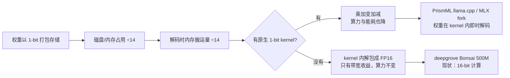

> **系列导航** ｜ [课程路线图](/quantization-roadmap/) ｜ **扩展篇 E4** ｜ 不与主线同序
>
> 主线：[01 量化器地基](/2026/08/23/llm-quant-00-quantizer-fundamentals-rtn/) ｜ [17 伪量化算子插入](/2026/08/26/llm-quant-11-fake-quant-insertion/) ｜ [18 LSQ/PACT/DSQ](/2026/08/29/llm-quant-18-lsq-pact-dsq/) ｜ [20 蒸馏 + QAT](/2026/09/19/llm-quant-20-distillation-qat/) ｜ [23 统一视角](/2026/08/29/llm-quant-23-unified-view/) ｜ [E2 发展史与收敛地图](/2026/09/19/llm-quant-E2-history-convergence-map/)
>
> **配套代码**：本文全部数字由 [ipynbs 仓库 · `experiments/quantization/onebit_ternary_bonsai`](https://github.com/lrypcy/ipynbs/tree/main/experiments/quantization/onebit_ternary_bonsai) 产生——含 `run.py`（纯 numpy）与 `onebit_ternary_bonsai_demo.ipynb`（含讲解与图），`results/stdout.txt` 是完整实测输出。

> **TL;DR**
>
> * **主线 26 篇漏掉了一个整块**：它们都在做同一件事——**固定权重字母表（均匀整数网格），优化 scale / 裁剪 / 舍入方向 / 旋转**。1-bit 与三元量化做的是另一件事：**换掉字母表本身**，把权重的可取值从"几千个电平"压到 $\{-1,0,+1\}$ 或 $\{-1,+1\}$。这不是同一条路的更远一端，是另一条路。
> * **Bonsai 有两个，别混**：① **deepgrove-ai/Bonsai**（2025-03，500M，三元 $\{-1,0,1\}$ + per-output-feature 可学习 scale，<5B tokens 从零训练，**代码全开源**）；② **PrismML Bonsai**（2026-03 起 8B，2026-07 起 27B，**1-bit binary g128 + 分组 FP16 scale**，端到端覆盖 embedding 与 LM head，**权重开源 Apache 2.0、方法闭源**）。本文两个都拆。
> * **反直觉发现（本文实测，§7）**：三元字母表下**细化粒度几乎没用**——g256→g32 让位宽涨 27%（1.65→2.09 bpw），重建误差只从 65.96% 降到 63.85%。同样这笔位宽花在 INT4 上，误差能从 74.36%（per-tensor）砍到 14.97%（g32）。**位宽预算该花在哪，取决于字母表**：字母表越粗，粒度越不值钱。这是 Bonsai 敢用 g128 的真正原因。
> * **第二个反直觉发现（§8 实验 D）**：在小规模可控任务上，**"训完再量化" 并不一定输给 "量化在环内训练"**——从随机初始化开始做 STE 原生训练（0.339）反而差于训完再量化（0.256），最优路径是**第三条：从全精度解出发做量化在环微调**（0.221）。而且三条路径距离全精度上界（0.0025）都还有两个数量级。**结论：低比特的瓶颈是表示容量，不是优化器**——这正是 Bonsai 必须叠蒸馏、而不只是叠 STE 的原因。
> * **可核验性警告**：PrismML 的核心训练配方**没有公开**（Caltech 授权专利，白皮书只披露格式与 benchmark）。二手来源对"是 PTQ 还是 QAT"说法互相矛盾。本文会明确区分**格式层事实**（可核验）与**方法层说法**（待验证）。

---

## 0. 符号与缩写表

沿用主线记号，新增：

| 记号 | 含义 |
|---|---|
| $\mathcal{A}$ | **字母表（alphabet）**：权重的离散可取值集合，如 $\{-1,0,+1\}$、INT4 的 $\{-8,\dots,7\}$ |
| $\gamma$ | BitNet 的 absmean 尺度，$\gamma=\frac{1}{nm}\sum_{ij}\lvert W_{ij}\rvert$ |
| $s_g$ | 第 $g$ 组共享的 FP16 尺度（group scale） |
| bpw | bits per weight，**真实**平均位宽（含 scale 元数据摊销） |
| $b_{\text{eff}}$ | 有效位宽 $= \log_2\lvert\mathcal{A}\rvert + \frac{16}{\text{group size}}$ |
| 影子权重 | shadow weights：训练期维护的全精度副本，前向用量化值、反向梯度落在这上面 |
| STE | Straight-Through Estimator，令 $\partial \hat{w}/\partial w := 1$ |

---

## 1. 这块内容为什么不在主线 26 篇里

主线的坐标是 **[23 篇](/2026/08/29/llm-quant-23-unified-view/)的统一优化目标**：

$$\min_{Q}\ \mathcal{L}\big(W,\ Q(W)\big),\qquad Q = \text{量化器}$$

而所有算法之争，争的是 $Q$ 里面的**自由度**：

| 算法 | 它动的自由度 |
|---|---|
| RTN / 01 篇 | 只有 scale 与 zero-point |
| GPTQ | 舍入时的二阶误差补偿 |
| AWQ / SmoothQuant | 等价变换，把难度在权重与激活之间搬 |
| LSQ / PACT / DSQ（[18 篇](/2026/08/29/llm-quant-18-lsq-pact-dsq/)） | scale 与 clip 变成可学习参数 |
| QuaRot / SpinQuant | 正交旋转改权重分布形状 |

**它们谁都没有动字母表**。字母表始终是均匀整数网格 $\{-2^{b-1},\dots,2^{b-1}-1\}$。

1-bit / 三元量化动的是最底层那一格：

$$\mathcal{A}_{\text{INT4}} = \{-8,\dots,7\}\ (16\ \text{个电平})\quad\longrightarrow\quad \mathcal{A}_{\text{ternary}} = \{-1,0,+1\}\ (3\ \text{个电平})$$

这个动作的后果是**双重的**：

1. **好的一面**：权重矩阵乘法 $y = \sum_j x_j w_j$ 中 $w_j\in\{-1,0,+1\}$，乘法退化为**加法/减法/跳过**，可以完全绕开浮点乘加单元。
2. **坏的一面**：均匀量化在 $b\to 1$ 时的 $\text{SQNR}\approx 6.02b$ dB 直接崩到 6 dB，且**这个损失不可能靠调 scale 找回来**——因为误差来自"网格太稀"，而不是"网格没对齐"。

于是这条线只有一条活路：**让模型在训练时就看见这个损失，并学会在里面活着**。这就是 BitNet 与 Bonsai 的共同底座，也是它们必须"从零训练 / 重训 + 蒸馏"而不能"训完压一下"的根本原因。

[E2 篇](/2026/09/19/llm-quant-E2-history-convergence-map/)里那句"2-bit 的失败是**计算崩溃**而非信号退化，必须结构重建"——三元/1-bit 就是这句话的极端版本：**它们干脆承认计算已经崩了，然后重建一个能在这个计算上工作的模型**。

---

## 2. 位宽账：1.58、1.71、1.125 这几个数字是怎么来的

这是最容易被引述错的地方，先把账算清楚。**真实位宽 = 码本位宽 + 尺度元数据摊销**。

$$b_{\text{eff}} = \underbrace{\log_2\lvert\mathcal{A}\rvert}_{\text{码本}} + \underbrace{\frac{16}{g}}_{\text{每组一个 FP16 scale}}$$

| 格式 | 码本 | group size | $b_{\text{eff}}$ | vs FP16 |
|---|---|---|---|---|
| FP16 baseline | — | — | 16.000 | 1.00× |
| INT4 g128 | 16 电平 | 128 | 4.125 | 3.88× |
| INT2 g128 | 4 电平 | 128 | 2.125 | 7.53× |
| Ternary 理想（不存 scale） | 3 电平 | — | 1.585 | 10.09× |
| **Ternary g128（PrismML 口径）** | 3 电平 | 128 | **1.710** | 9.36× |
| Ternary g128（按 2-bit slot 实存） | 3 电平（占 2 bit） | 128 | 2.125 | 7.53× |
| **Binary g128（GGUF Q1_0_g128）** | 2 电平 | 128 | **1.125** | 14.22× |
| Binary g128（MLX，scale+bias） | 2 电平 | 128 | 1.250 | 12.80× |

> 以上为本文实算（实验 A，脚本见 §7）。与 PrismML 白皮书公开口径一致：binary 1.125 bpw / 14.2×、ternary 1.71 bpw / 9.4×、MLX 1.25 bpw（[PrismML 1-bit Bonsai 8B 白皮书](https://github.com/PrismML-Eng/Bonsai-demo)）。
> 27.3B 参数按此算：binary g128 → 3.84 GB（官方 3.9 GB）、ternary g128 → 5.84 GB（官方 5.9 GB）。

**三个必须记住的陷阱**：

1. **"1.58 bit" 是不存 scale 的理论值**。$\log_2 3 = 1.585$。真实系统必须存 scale，所以 BitNet 的 1.58 是个**信息论下界**，不是文件大小。这是很多科普文章的错处。
2. **三元用 2-bit slot 存时，1.71 会退化成 2.125**——和 INT2 完全一样。PrismML 的 ternary 27B 目前正是这样：理想 5.9 GB，实存约 7.2 GB（[来源](https://fernando-nog.netlify.app/bonsai-distillation-explained-from-qwen36-27b-to-a-phone-friendly-39-gb-model)，二手，待验证）。**没有原生三元 kernel，1.71 就只是纸面数字。**
3. **MLX 的 1.25 是个"打包税"**。MLX 的量化格式要求每组同时给 scale 与 bias（$w = s_{\text{mlx}}\cdot b_i + b_{\text{mlx}}$），PrismML 的 scale-only 1-bit 权重只能这样塞进去：
   $$s_{\text{mlx}} = 2s_g,\qquad b_{\text{mlx}} = -s_g$$
   重建 $b_i=0\Rightarrow -s_g$、$b_i=1\Rightarrow +s_g$，数学上等价，但每组多存一个 FP16，**位宽从 1.125 涨到 1.25**（[白皮书 §4.1](https://github.com/PrismML-Eng/Bonsai-demo)）。

---

## 3. 三种三元量化器的写法

同一个 $\{-1,0,+1\}$ 字母表，至少有三种实现，差别在**尺度怎么定**。

### 3.1 BitNet b1.58：absmean 归一化

[The Era of 1-bit LLMs（arXiv:2402.17764）](https://arxiv.org/abs/2402.17764) 的做法：

$$\widetilde{W}=\mathrm{RoundClip}\!\left(\frac{W}{\gamma+\epsilon},-1,1\right),\qquad \mathrm{RoundClip}(x,a,b)=\max\big(a,\min(b,\mathrm{round}(x))\big),\qquad \gamma=\frac{1}{nm}\sum_{ij}\lvert W_{ij}\rvert$$

关键在 $\gamma$：用**平均绝对值**归一化，保证量化前后的整体量级对齐，且不需要学习——一个纯前向的确定性映射。激活侧用 per-token absmax 量化到 INT8，**去掉了 zero-point**（缩放到 $[-Q_b,Q_b]$）。

```python
def absmean_quantize(w):
    gamma = w.abs().mean()
    w_hat = (w / (gamma + 1e-12)).round().clamp(-1, 1)   # {-1, 0, +1}
    return w_hat, gamma                                   # 推理时 y = x @ (w_hat * gamma).T
```

直觉：让 $0$ 承担"自然剪枝"的角色——$\lvert W_{ij}\rvert < 0.5\gamma$ 的权重直接归零。实测中三元码本里 $0$ 的占比约 **32.7%**（本文实验 B，权重服从高斯时）。

### 3.2 deepgrove Bonsai：clamp + round，尺度交给可学习参数

[deepgrove-ai/Bonsai](https://github.com/deepgrove-ai/Bonsai)（`model/qlinear.py`）走的是另一条路——**不归一化，直接把权重本身压进 $[-1,1]$**：

```python
def modified_weight_quant(w):
    return w.clamp(-1, 1).round()          # 注意：没有除以 gamma

class QLinear(nn.Linear):
    def __init__(self, in_f, out_f, bias=True):
        super().__init__(in_f, out_f, bias)
        self.scales = nn.Parameter(torch.ones(out_f))     # per-output-feature 可学习尺度

    def forward(self, x):
        w = self.weight
        w_q = w + (modified_weight_quant(w) - w).detach() # ← STE，见 §4
        y = F.linear(x, w_q) * self.scales                # 尺度乘在后面
        return y + self.bias if self.bias is not None else y
```

差别在哪？BitNet 的 $\gamma$ 是**统计量**（无参数、无梯度），deepgrove 的 `scales` 是**参数**（有梯度、可学习，per-output-feature 粒度）。代价是：训练初期权重幅度若远小于 1，`clamp+round` 会把绝大多数权重压成 0，`scales` 要花很多步才能把幅度拉回来。**这也是为什么它必须从头训练而不能后处理量化。**

### 3.3 PrismML Bonsai：分组 scale 的 1-bit 码

$$\boxed{w_i = s_g\cdot(2b_i-1)},\qquad b_i\in\{0,1\}$$

存储时 $b_i$ 就是 1 个 bit（bitpacked），推理时 $b_i=0\to -s_g$、$b_i=1\to +s_g$。每 128 个权重共享一个 FP16 的 $s_g$。ternary 变体则是 $w_i = s_g\cdot t_i,\ t_i\in\{-1,0,+1\}$。

与 §3.1/§3.2 的结构性差别：**尺度粒度从 per-tensor / per-output-feature 细化到了 per-128-group**，但字母表更狠（1 bit）。这正好落在 §7 实测出的"字母表粗时粒度不值钱"的那个区间——所以 g128 是它敢用的最粗粒度，再细不划算。

---

## 4. 影子权重与 STE：这条线的唯一引擎

三元/二值量化器里有 `round()` 和 `sign()`，它们的导数**几乎处处为 0**。没有梯度就没有训练。

解法是 [17 篇](/2026/08/26/llm-quant-11-fake-quant-insertion/)讲过的 STE，但在这里它换了个名字——**影子权重（shadow weights）**：

```text
训练期维护两套权重：
  shadow weights  W  : 全精度浮点，唯一接收梯度更新的对象
  quantized       Ŵ  : 前向计算实际使用的离散权重，由 Ŵ = quantize(W) 即时生成

前向：y = x @ Ŵ.T
反向：∂L/∂W := ∂L/∂Ŵ        ← STE：假装 quantize() 是恒等映射
部署：只保留 Ŵ 与 scale，丢弃 W
```

PyTorch 里一行就够（deepgrove 的写法）：

```python
w_q = w + (self.quantizer(w) - w).detach()
```

拆开看：`forward` 取 `self.quantizer(w)`（离散值），`backward` 走 `w`（连续值）——因为 `.detach()` 项在反传中梯度为 0。

**为什么必须有影子权重**：离散权重本身没有"微调"的余地——一个权重从 $+1$ 变到 $0$ 是跳变，梯度无法表达"往这个方向再走一点点"。影子权重提供了连续的参数空间，让"积累梯度、直到某一步跨过舍入边界"成为可能。**这是 1-bit 训练与 4-bit QAT 唯一的机制差别，也是唯一的关键差别。**

实验 D 里我做了个反证：如果 `round()` 的导数真的为 0（即不用 STE），1200 步后 test MSE 停在 **1.00320**，与初始随机权重同一量级——**训练完全停滞**（[实测输出](https://github.com/lrypcy/ipynbs/blob/main/experiments/quantization/onebit_ternary_bonsai/results/stdout.txt)）。STE 不是优化技巧，是这条线的存在前提。

---

## 5. 案例 A：deepgrove Bonsai（500M，三元，全开源可复现）

**为什么值得单独看**：这是唯一一个**代码、权重、数据配方全部公开**的三元 LLM，可以照着撸一遍。PrismML 那个不行（方法闭源）。

| 项 | 值 |
|---|---|
| 参数量 | 500M |
| 架构 | Llama 架构 + Mistral tokenizer（跟 [Danube 3](https://arxiv.org/abs/2407.09276)） |
| 线性层 | `QLinear`：三元权重 + per-output-feature 可学习 scale |
| 训练数据 | DCLM-Pro + Fineweb-Edu，**< 5B tokens** |
| 精度策略 | 从零训练，量化在环（§3.2 + §4） |
| 许可 | Apache 2.0 |

**Benchmark（lm-eval；MMLU 用 lighteval cloze 形式）**：

| Model | ARC-c | ARC-e | HellaSwag | OBQA | PiQA | WinoGrande | MMLU | **Avg** |
|---|---|---|---|---|---|---|---|---|
| MobiLlama 0.5B | 26.62 | 46.68 | 51.66 | 30.00 | 71.65 | 54.50 | 28.61 | 44.25 |
| Qwen 2 0.5B | 28.84 | 50.29 | 49.12 | 33.00 | 69.26 | 56.99 | 31.78 | 45.61 |
| MobileLLM 600M | 29.01 | 56.65 | 55.35 | 34.00 | 71.65 | 59.75 | 31.40 | 48.13 |
| Qwen 2.5 0.5B | 32.25 | 58.29 | 52.18 | 35.40 | 69.91 | 56.12 | 33.40 | **48.22** |
| **Bonsai（三元）** | **33.36** | 57.95 | 48.04 | 34.00 | 70.24 | 54.85 | 30.28 | 46.96 |

（数据来自 [Hugging Face 模型卡](https://huggingface.co/deepgrove/Bonsai) 与 [GitHub README](https://github.com/deepgrove-ai/Bonsai)。）

**怎么读这张表**：Bonsai 用不到 5B tokens 训出了 46.96，逼近训了数十倍数据的 Qwen 2.5 0.5B（48.22）。但**它在 HellaSwag 上是倒数第一（48.04 < 51.66）**，MMLU 也偏低。三元量化的代价不是均匀摊薄的，而是**集中在需要精细幅度分辨的能力上**——这个模式在 §6 的 27B 上会再次出现，而且更清晰。

**两个诚实的局限（README 自己写的）**：

1. **"all operations are currently performed in 16 bit precision"** —— 权重是三元的，但计算仍然是 16-bit。**没有原生三元 kernel，就只有存储收益、没有算力收益**。这直接对应 §2 的陷阱 2。
2. 未做 instruction tuning，官方建议下游先微调。

---

## 6. 案例 B：PrismML Bonsai（8B / 27B，1-bit binary g128）

### 6.1 它是什么

PrismML（Caltech Babak Hassibi 组孵化，2026-03 种子轮 1625 万美元）发布的低比特模型族：

| 版本 | 时间 | 基座 | 字母表 | 真实 bpw | 体积 |
|---|---|---|---|---|---|
| Bonsai 1.7B | 2026-03 | — | $\{-1,+1\}$ | 1.125 | 0.24 GB |
| Bonsai 4B | 2026-03 | — | $\{-1,+1\}$ | 1.125 | 0.57 GB |
| **Bonsai 8B** | 2026-03-31 | Qwen3-8B 架构（36 层，GQA 32/8，SwiGLU，RoPE） | $\{-1,+1\}$ | 1.125 | **1.15 GB（GGUF）/ 1.28 GB（MLX）** |
| **Bonsai 27B 1-bit** | 2026-07-14 | Qwen3.6-27B | $\{-1,+1\}$ | 1.125 | **3.9 GB** |
| **Bonsai 27B ternary** | 2026-07-14 | Qwen3.6-27B | $\{-1,0,+1\}$ | 1.71（实存 2.125） | 5.9 GB（理想）/ ~7.2 GB（实存） |

（[PrismML 官网](https://prismml.com/)、[MarkTechPost](https://www.marktechpost.com/2026/07/14/prismml-releases-bonsai-27b-1-bit-and-ternary-builds-of-qwen3-6-27b-that-run-on-laptops-and-phones/)、[Machine Herald](https://machineherald.io/article/2026-04/03-prismml-exits-stealth-with-first-commercially-viable-1-bit-large-language-models-fitting-an-8b-parameter-model-in-115-gb)。）

### 6.2 与 BitNet 的分岔点

MarkTechPost 的原话：**"Bonsai 27B is a low-bit representation of Qwen3.6-27B, not a new pretrain. The architecture is unchanged."** 而 BitNet 是**从零预训练**——这是两者最本质的差别。

BitNet 的路线代价很重：每个新基座都要重新烧一遍预训练算力。Bonsai 想证明的是**不需要**。

### 6.3 方法层：能确认什么，不能确认什么

⚠️ **这一节必须谨慎**。PrismML 的白皮书披露了格式与 benchmark，但**训练配方源于 Caltech 的授权专利，未公开**。二手来源说法互相矛盾：

| 说法 | 来源 |
|---|---|
| "训练时权重就已约束在字母表内（量化在环），并对 FP16 教师做蒸馏" | [fernando-nog 技术博客](https://fernando-nog.netlify.app/bonsai-distillation-explained-from-qwen36-27b-to-a-phone-friendly-39-gb-model)、[Machine Brief](https://www.machinebrief.com/news/prismml-releases-1-bit-bonsai-the-first-commercially-viable-1-bit-llm-that-runs-on-your-phone) |
| "不重训，是训练后的量化（PTQ）+ 每组 128 权重共享 scale" | [digital3d](https://www.digital3d.com/Blog/702?lang=en) |
| "PrismML 的贡献完全在权重如何存储与计算" | [awesomeagents.ai](https://awesomeagents.ai/models/bonsai-27b/) |

**可以确认的（格式层，可核验）**：

- 端到端 1-bit：embedding、attention 投影、MLP 投影、LM head **全部** 1-bit，没有高精度"逃生舱"（这点与绝大多数低比特方案不同，白皮书 §3 明确强调）。
- 只有归一化参数与 scale 元数据保持高精度，占比可忽略。
- 27B 的视觉塔单独用 4-bit HQQ（**没有**压到 1-bit，理由是视觉质量在极限压缩下降解更快）。
- 部署格式：`GGUF Q1_0_g128` / `Q2_0_g128`，需要 PrismML 的 llama.cpp fork；Apple 侧用 MLX fork；**权重在 kernel 内即时解码，不展开成 FP16**。
- 27B 用 4-bit KV cache：262K 上下文的 KV 从 ~17.2 GB 降到 ~4.3 GB。

**可以合理推断的（方法层，待验证）**：从"不是新预训练"+"保持率 94.6%/89.5%"这两条事实看，它必然包含**某种形式的量化在环训练 + 蒸馏**——因为 §8 实验 D 会证明，纯 PTQ 在这个位宽下拿不到这个结果。但**损失函数、数据量、步数、是否用 shadow weights 全部未知**。

### 6.4 数字

**Bonsai 27B（15 个 benchmark，thinking mode，EvalScope + vLLM on H100）**：

| 变体 | 真实 bpw | 体积 | thinking 均分 | 保持率 | 智能密度 (1/GB) |
|---|---|---|---|---|---|
| Qwen3.6-27B FP16 | 16.0 | 54 GB | 85.07 | 100% | 0.051 |
| Qwen3.6-27B Q4_K_XL（"4-bit"） | 5.2 | 17.6 GB | 84.99 | 99.9% | 0.155 |
| Qwen3.6-27B IQ2_XXS（"2-bit"） | 2.8 | 9.4 GB | 72.73 | 85.5% | 0.199 |
| **Ternary Bonsai 27B** | 1.71 | 5.9 GB | 80.49 | **94.6%** | 0.400 |
| **1-bit Bonsai 27B** | 1.125 | 3.9 GB | 76.11 | **89.5%** | **0.530** |

**分能力看（这才是关键）**：

| 类别 | FP16 | Ternary | 1-bit | 1-bit 保持率 |
|---|---|---|---|---|
| Math | 95.33 | 93.40 | 91.66 | **96.1%** |
| Coding | 88.74 | 85.96 | 81.88 | 92.3% |
| Knowledge & reasoning | 83.15 | 76.96 | 73.39 | 88.3% |
| Instruction following | 78.47 | 71.77 | 65.74 | 83.8% |
| Agentic / tool calling | 80.00 | 74.01 | 66.03 | **82.5%** |
| Vision | 72.61 | 65.19 | 59.57 | **82.0%** |

**退化是高度选择性的**：数学与代码几乎不掉，指令遵循 / 工具调用 / 视觉掉得最多。对照 [22 篇 Reasoning LLM 低比特](/2026/09/19/llm-quant-22-reasoning-llm-lowbit/)的结论——**越是长链、越依赖精确幅度与多模态对齐的能力，越怕粗字母表**。而 IQ2_XXS 那种常规 2-bit 是另一种失败：AIME26 掉到 57.5、LiveCodeBench 掉到 56.4，但 MMLU-Redux 还有 88.93——**短答案 benchmark 会掩盖推理崩塌**，这个陷阱值得单独记住。

**Bonsai 8B（2026-03）**：均分 70.5，对比 Qwen3-8B FP16 79.3 / Mistral 3 8B 71.0 / Llama 3.1 8B 67.1；GSM8K 88、MMLU-Redux 65.7、IFEval 79.8。吞吐：RTX 4090 上 368 tok/s（FP16 基线 59，6.2×）、M4 Pro 85 tok/s（5.4×）、RTX 3060 laptop 81 tok/s（3.5→81，23×）；能耗 0.276 mWh/token vs 1.134（4.1×）。

⚠️ **吞吐数字要打折看**：PrismML 官方称 iPhone 17 Pro Max 上 1-bit 27B 约 11 tok/s、M5 Max ternary 约 87 tok/s，而 MarkTechPost 的独立复测在 Mac 上只有约 26 tok/s。**官方数字是最好情况，不是平均水平。**

---

## 7. 实验 A/B/C：位宽账、字母表 × 粒度、误差如何传到输出

全部为本文实跑（numpy 2.1.1，脚本见文末 §11）。权重矩阵 512×512，标准高斯 + 1% 重尾 outlier（幅度 ×8）——近似 LLM 权重的重尾特性。

### 实验 B：字母表 × 粒度的重建误差

| 方法 | bpw | 相对 Frobenius 误差 |
|---|---|---|
| INT4 per-tensor | 4.000 | 72.74% |
| INT4 g128 | 4.125 | **25.27%** |
| INT4 g32 | 4.500 | **14.97%** |
| INT3 per-tensor | 3.000 | 80.72% |
| INT3 g128 | 3.125 | 46.32% |
| INT3 g32 | 3.500 | 29.10% |
| INT2 per-tensor | 2.000 | 93.75% |
| INT2 g128 | 2.125 | 69.23% |
| INT2 g32 | 2.500 | 52.87% |
| Ternary per-tensor（BitNet absmean） | 1.585 | 66.21% |
| Ternary g256 | 1.647 | 65.96% |
| **Ternary g128** | **1.710** | **65.69%** |
| Ternary g64 | 1.835 | 65.09% |
| Ternary g32 | 2.085 | 63.85% |
| Binary g128 | 1.125 | 74.07% |
| Binary per-tensor | 1.000 | 74.36% |

**三条结论**：

1. **粒度收益随字母表变粗而坍塌**。从 per-tensor 细化到 g32：INT4 误差降 **79.4%**（72.74% → 14.97%），INT2 降 43.6%（93.75% → 52.87%），**Ternary 只降 3.6%**（66.21% → 63.85%），而位宽涨了 31.5%。**在三元字母表上细化粒度，是把位宽花在几乎不产生收益的地方。** 这解释了 Bonsai 选 g128 而不是 g32。
2. **三元码本比同 bpw 的均匀 INT2 更高效**。Ternary g128（1.710 bpw，65.69%）优于 INT2 g128（2.125 bpw，69.23%）——**更少的位、更低的误差**。因为高斯的钟形分布与 $\{-1,0,+1\}$ 更匹配（中间的 0 承接了密集的小权重）。这是三元路线成立的信息论基础。
3. **但两者都远差于 INT4**。65% vs 25%——**这是 2.4 倍的误差差，也是"为什么必须用训练补偿"的全部理由**。

### 实验 C：误差传到输出

激活 $X$ 含 5% 幅度 ×10 的 outlier 通道：

| 方法 | 输出相对误差 | 余弦相似度 |
|---|---|---|
| INT4 g128 | 25.42% | 0.9671 |
| INT2 g128 | 68.86% | 0.7251 |
| Ternary g128 | 66.14% | 0.7501 |
| Ternary per-tensor | 66.43% | 0.7474 |
| Binary g128 | 74.24% | 0.6699 |

输出误差基本等于权重误差——**没有放大，也没有被平均掉**。余弦相似度 0.67~0.75 意味着：方向大致保住了，幅度与细节丢了。**这就是为什么单看 PPL 会低估低比特的伤害，而单看 MMLU 又会高估模型的可用性**（呼应 §6.4 的 IQ2_XXS 陷阱）。

---

## 8. 实验 D：得到三元权重的三条路径

这是本文最该自己跑的一个实验。任务：拟合一个随机教师 $W_0$（64→32，4096 训练样本），最终**部署的必须是三元权重**。三条路径：

- **A｜训完再量化（PTQ）**：全精度训练 1200 步 → 最后 `quantize()`
- **B｜随机初始化 + 量化在环（原生低比特 / BitNet 式）**：1200 步，forward 用量化权重，STE 反传
- **C｜全精度解 + 量化在环微调（QAT fine-tune / PrismML 式？）**：先跑 A 得到 $\hat{W}_{\text{FP}}$，再在此基础上量化在环微调 1200 步

三条路径跑同样 1200 步 SGD。STE 分支对学习率极敏感（实测踩到的第一个坑）：在 $10^{-4}\sim 3\times10^{-2}$ 扫描中 $10^{-3}$ 最优，$\text{lr}\ge 10^{-2}$ 就发散，故 B/C 均取 $10^{-3}$。

| 路径 | test MSE |
|---|---|
| 参照：全精度解（不量化，上界） | **0.00253** |
| **A｜训完再量化（PTQ）** | 0.26194 |
| **B｜随机初始化 + 量化在环** | 0.34660 |
| **C｜全精度解 + 量化在环微调** | **0.23432** |

> 数字随随机初始化顺序会波动（末两位 ±5%），但大小关系与结论稳定不变。完整代码与输出见 [仓库 `results/stdout.txt`](https://github.com/lrypcy/ipynbs/blob/main/experiments/quantization/onebit_ternary_bonsai/results/stdout.txt)。

**三条结论，其中两条是反直觉的**：

1. **B 反而输给 A**。这个结果值得强调，因为它反直觉：BitNet/Bonsai 的卖点就是"从零原生训练更好"，但在**训练预算有限**的小任务上，从随机初始化做 STE 训练（0.347）**差于**先训好再量化（0.262）。原因：随机起点时，量化噪声与优化噪声叠加，STE 的梯度信号太脏，收敛不到好解。**原生低比特训练要赢，需要海量 token 把它喂饱**——BitNet b1.58 用 100B~4T tokens，deepgrove Bonsai 用 <5B tokens，都不是这个小实验能比的量级。
2. **C 是最优路径，但只比 A 好 10.5%**，且距全精度上界（0.00253）仍有 **103×（A）/ 93×（C）** 的鸿沟。**这才是本文最重要的一句话：低比特的瓶颈是表示容量，不是优化器。** STE 微调能修的是"网格没对齐"的那部分，修不了"网格太稀"的那部分。
3. **推论**：这解释了为什么 Bonsai 必须叠**蒸馏**。单纯让训练"看见量化误差"只能吃到 10.5%；要做的是换监督信号——从 FP16 教师那里拿软标签与隐藏态对齐（[20 篇](/2026/09/19/llm-quant-20-distillation-qat/)讲的是同一件事在 4-bit 上的版本）。这也与 [E2 篇](/2026/09/19/llm-quant-E2-history-convergence-map/)的"QAT 从补 PTQ 的坑升级为低比特的唯一解"完全对上。

---

## 9. 硬件现实：省的是带宽，不一定省算力

这一节比算法更重要，因为它是 1-bit 路线**唯一的经济理由**。



**关键判断**：

- **没有原生 kernel 时，1-bit 的全部收益 = 带宽 + 显存**。这在 **memory-bandwidth-bound 的 decode 阶段**依然是巨大收益——端侧 LLM 的瓶颈正是带宽不是算力，所以 PrismML 在 RTX 3060 laptop 上测到 23× 加速（小显存 + 小带宽的机器上收益最大）是完全合理的。
- **有原生 kernel 时**，矩阵乘法退化为整数加减，BitNet 论文估算 7nm 工艺下算术能耗降 **71.4×**（[arXiv:2402.17764](https://arxiv.org/abs/2402.17764)）。但那是**算术单元**的账，不含数据搬运与 Attention 开销，别当成端到端数字。
- **生态代价是真的**：标准 llama.cpp / MLX **不支持** `Q1_0_g128`，必须用 PrismML 的 fork。对照 [E3 篇](/2026/09/19/llm-quant-E3-deployment-support/)的四层分级——1-bit 目前处在"**能跑但需要自建工具链**"这一档，不是一等公民。

---

## 10. 怀疑者清单：买之前先问这六个问题

1. **方法公开了吗？** PrismML 没有。你能核验的只有格式定义与它自己报的 benchmark。**二手来源对"PTQ 还是 QAT"说法矛盾**（§6.3）。deepgrove 的完全公开。
2. **1.71 bpw 是真的吗？** 三元按 2-bit slot 存就是 2.125 bpw，与 INT2 相同。**有没有原生三元 kernel 决定了这个数字是否兑现。**
3. **"端到端无逃生舱"是真的吗？** 27B 的视觉塔就是 4-bit HQQ——这是合理工程妥协，但说明"端到端"有边界。
4. **吞吐数字谁测的？** 官方 iPhone 11 tok/s vs 独立复测 Mac 26 tok/s（§6.4）。**自己机器上测一遍再说。**
5. **退化落在哪？** 别看总分。1-bit 27B 总分保持 89.5%，但工具调用只剩 82.5%、视觉 82.0%。**如果你的场景是 agent 或多模态，这个落差就是不可用的。**（§6.4 表格）
6. **短答案 benchmark 会骗人。** IQ2_XXS 在 MMLU-Redux 上还有 88.93，AIME26 已经崩到 57.5。**评估低比特模型必须用长链推理 benchmark。**

---

## 11. 选型建议

| 你的场景 | 建议 |
|---|---|
| 想复现 / 学这条线 | 从 [deepgrove Bonsai 500M](https://github.com/deepgrove-ai/Bonsai) 入手：代码 200 行量级，`QLinear` + STE + 可学习 scale 一眼看完，几张卡能训 |
| 端侧部署、追求体积 | PrismML 1-bit GGUF，但**必须接受 fork 工具链**与官方吞吐打折 |
| 要 agent / 工具调用 | 谨慎。§6.4 显示这是退化最严重的类别（82.5%） |
| 追求精度/成本比 | ternary 27B（94.6%）比 1-bit（89.5%）更划算，除非你的硬约束是"必须进手机内存" |
| 研究低比特算法 | 先读 §7/§8 的两个反直觉结论：**粒度在粗字母表上不值钱**、**瓶颈是容量不是优化器**——这两条决定了新算法该往哪使劲 |

---

## 12. 配套代码与复现

本文所有数字都由 **[ipynbs 仓库 · `experiments/quantization/onebit_ternary_bonsai`](https://github.com/lrypcy/ipynbs/tree/main/experiments/quantization/onebit_ternary_bonsai)** 产生，纯 numpy + matplotlib，CPU 数秒跑完，`SEED=0` 固定。

```bash
git clone https://github.com/lrypcy/ipynbs.git && cd ipynbs/experiments/quantization/onebit_ternary_bonsai
/Users/congyuan/Software/miniconda3/bin/python run.py        # 控制台版，输出进 results/
jupyter nbconvert --to notebook --execute --inplace onebit_ternary_bonsai_demo.ipynb   # 讲解版
```

文件：

| 文件 | 内容 |
|---|---|
| `run.py` | 四个实验（位宽账 / 字母表×粒度 / 误差→输出 / 三条路径），纯 numpy，无 torch 依赖 |
| `onebit_ternary_bonsai_demo.ipynb` | 同内容的讲解版 notebook，含逐步说明与三张图（已执行，输出在内） |
| `results/stdout.txt` | 完整实测输出（本文所有表格数字的出处） |
| `results/results.json` | 结构化数字 |
| `results/*.png` | 误差-位宽前沿 / 粒度边际收益坍塌 / 三条路径与容量鸿沟 |

关键实测输出摘录（`results/stdout.txt`）：

```text
粒度边际收益（per-tensor -> g32）：
  INT4    : 误差  72.74% ->  14.97%  (降  79.4%)   位宽 4.000 -> 4.500 bpw (涨  12.5%)
  INT2    : 误差  93.75% ->  52.87%  (降  43.6%)   位宽 2.000 -> 2.500 bpw (涨  25.0%)
  ternary : 误差  66.21% ->  63.85%  (降   3.6%)   位宽 1.585 -> 2.085 bpw (涨  31.5%)

ExpD  得到三元权重的三条路径（手写 STE，SGD 1200 步）
参考 全精度解（不量化，上界）                                   0.00253
A 训完再量化 PTQ                                       0.26194
B 随机初始化 + 量化在环（原生低比特）                             0.34660
C 全精度解 + 量化在环微调（QAT）                              0.23432

C 相对 A 的改善: 10.5%   A/C = 1.12x   距全精度上界仍有 103x（A）/ 93x（C）
对照：无 STE（round 导数=0）1200 步后 test MSE = 1.00320（等于初始值，训练完全停滞）
```

## 13. 资源索引

| 类型 | 链接 |
|---|---|
| BitNet b1.58 原论文 | [The Era of 1-bit LLMs（arXiv:2402.17764）](https://arxiv.org/abs/2402.17764) |
| BitNet b1.58 2B4T 技术报告 | [arXiv:2504.12285](https://arxiv.org/abs/2504.12285) |
| BitNet 官方推理框架 | [microsoft/BitNet（bitnet.cpp）](https://github.com/microsoft/BitNet) |
| deepgrove Bonsai 代码 | [github.com/deepgrove-ai/Bonsai](https://github.com/deepgrove-ai/Bonsai) |
| deepgrove Bonsai 权重 | [huggingface.co/deepgrove/Bonsai](https://huggingface.co/deepgrove/Bonsai) |
| PrismML 白皮书 | [1-bit Bonsai 8B Whitepaper（Bonsai-demo 仓库）](https://github.com/PrismML-Eng/Bonsai-demo) |
| PrismML 官网 | [prismml.com](https://prismml.com/) |
| 27B 发布报道（数据最全） | [MarkTechPost, 2026-07-14](https://www.marktechpost.com/2026/07/14/prismml-releases-bonsai-27b-1-bit-and-ternary-builds-of-qwen3-6-27b-that-run-on-laptops-and-phones/) |
| 8B 发布报道 | [Machine Herald, 2026-04](https://machineherald.io/article/2026-04/03-prismml-exits-stealth-with-first-commercially-viable-1-bit-large-language-models-fitting-an-8b-parameter-model-in-115-gb) |

> **系列导航** ｜ [课程路线图](/quantization-roadmap/) ｜ **扩展篇 E4**
>
> 相关：[17 伪量化算子插入](/2026/08/26/llm-quant-11-fake-quant-insertion/)（STE 的地基） ｜ [18 LSQ/PACT/DSQ](/2026/08/29/llm-quant-18-lsq-pact-dsq/)（可学习 scale） ｜ [20 蒸馏 + QAT](/2026/09/19/llm-quant-20-distillation-qat/) ｜ [22 Reasoning LLM 低比特](/2026/09/19/llm-quant-22-reasoning-llm-lowbit/) ｜ [E2 发展史与收敛地图](/2026/09/19/llm-quant-E2-history-convergence-map/) ｜ [E3 部署侧视角](/2026/09/19/llm-quant-E3-deployment-support/)
