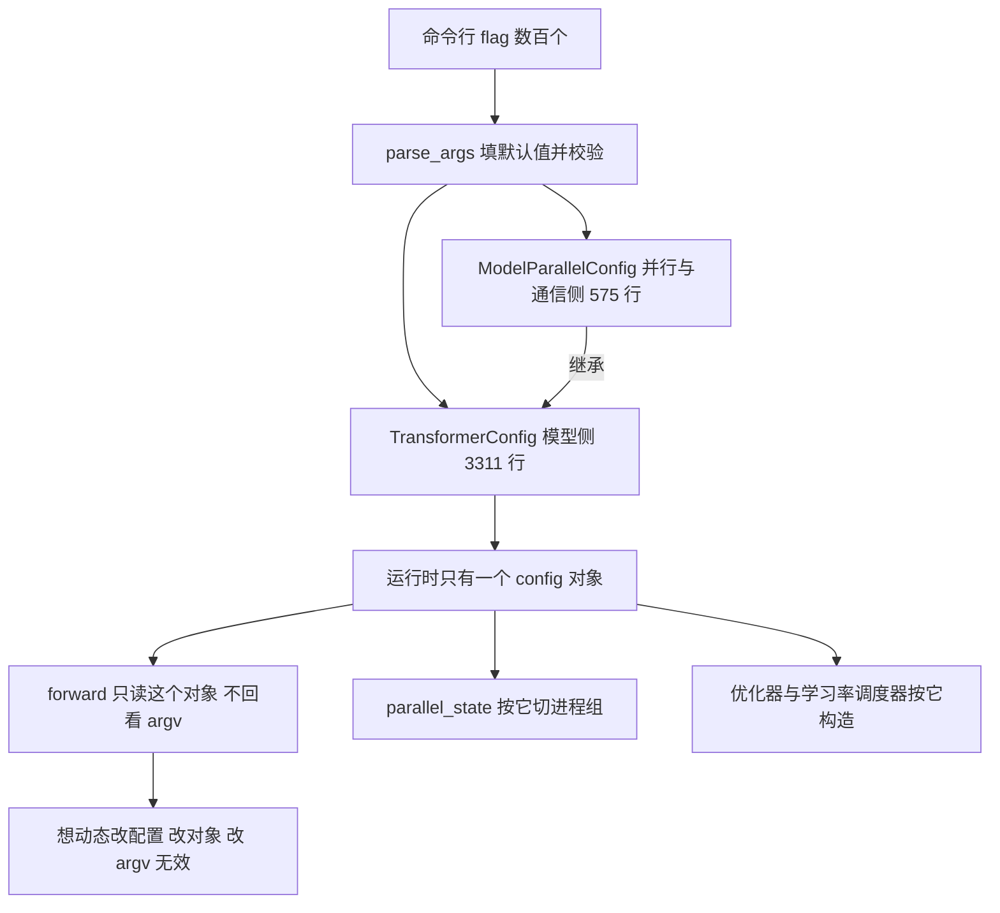
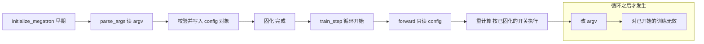
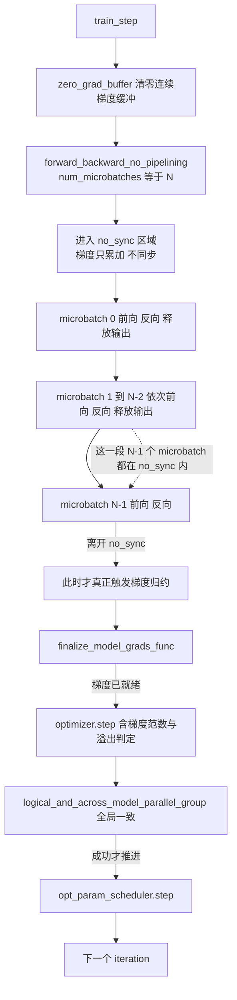

> **Megatron-LM 深度剖析系列 · 第 00 篇（地基）**
>
> 前置：[分布式训练（03）：张量并行](/2026/08/31/dist-train-03-tensor-parallel/) ｜ [（04）：流水并行](/2026/08/31/dist-train-04-pipeline-parallel/) ｜ [（08）：组合实战](/2026/08/31/dist-train-08-combined-practice/)
>
> 后续：**01 并行体系源码层**（进程组 / TP+SP / GTP / DP / PP / CP）

**TL;DR**

> * 本系列做 **源码层**：并行原理已在《分布式训练》系列讲透，这里一律引用不重推。源码基准 **`megatron-core` 0.20.0**，commit `60e039626`。
> * **仓库是三件东西而非一件**：Megatron Core（可组合的算子与并行库）、Megatron-LM（Core + 预置脚本与例子）、Megatron Bridge（HF ↔ mcore 双向转换）。命名和职责都容易混。
> * **v0.20 已经不是旧文章里那个 Megatron**：GTP（新一代张量并行）、三套数据并行、原生 RL 栈、MLA/DSA、Bridge 全部进了主干。
> * **规模感**：`megatron/training/training.py` 有 5606 行，`transformer/cuda_graphs.py` 3311 行，`optimizer/distrib_optimizer.py` 3189 行——读之前先知道哪块最重。
> * **全部开关落在两个 dataclass 上**：`TransformerConfig`（重计算、精度等模型侧）与 `ModelParallelConfig`（并行与通信重叠）。命令行只是它们的一层皮。
> * **FLOPs 有三种口径**。独立实现一份逐算子记账器与 Megatron 内置的 `num_floating_point_operations()` 交叉验证，四个模型**全部 +0.00% 吻合**；但官方公式收尾是 `return flops_fwd * 3`，**不含重计算系数**——开启重计算时日志里的 `throughput per GPU` 字段不会随之增大。
> * **6ND（训练算力 ≈ $$6ND$$ 次浮点运算）是近似式**，漏掉了 attention core 的 $$4sh$$ 项、lm_head 投影和重计算增量。与精确口径的偏差**随序列长度放大**：llama3-8b（8k）官方口径比 6ND 高 **+22.9%**，gpt3-175b（2k）只高 **+1.7%**。
> * **控制流最关键的一处**：`forward_backward_no_pipelining` 的循环是 `range(num_microbatches - 1)`，最后一个 microbatch 被**特意挪到 `no_sync` 之外**——梯度归约只在循环结束时发生一次。循环里那个 `del output_tensor` 也不是随手写的，注释引了 issue #4124。

---

## 1. 为什么要另开一个系列

本站已有一组并行计算文章（`dist-train-00..08`），把 DDP、ZeRO、TP、PP、SP、EP、集合通信和 3D 组合推了一遍。那组文章停在三个地方，而这三处恰恰是工程上最容易踩坑的地方：

| 停在哪 | 具体表现 |
|---|---|
| 没进源码 | 只给结论和 flag 名。`ColumnParallelLinear` 长什么样、`ParallelState` 怎么把 rank 切成网格，都没看 |
| 结论缺少实测支撑 | 数字多为解析估算，或引二手材料 |
| 没跟上 2026 | 还在讲 1D TP + Ring Attention |

这一系列补的正是这三块，定位是**源码层**：读代码、给行号、把「为什么这么写」讲清楚。

---

## 2. 代码地图

读一个 20 万行量级的仓库，先建立规模感，否则容易在错误的细节里迷路。

### 2.1 顶层：三件东西放在一起

仓库名字叫 Megatron-LM，但顶层 `megatron/` 下是六个包：

```
megatron/
├── core/            ← Megatron Core：算子、并行、模型的库本体
├── training/        ← 训练编排：pretrain() / train() / train_step() 都在这里
├── inference/       ← 推理路径
├── rl/              ← 原生 RL 栈（v0.20 新）
├── post_training/   ← 后训练（modelopt 量化/蒸馏）
└── elastification/  ← 弹性伸缩
```

### 2.2 三个组件的分工

| 组件 | 是什么 | 什么时候用 |
|---|---|---|
| **Megatron Core** | `megatron/core/`，可组合的算子与并行库 | 要自己搭训练框架 |
| **Megatron-LM** | Core + 预置脚本 + 例子 | 直接使用，或用来学分布式训练 |
| **Megatron Bridge** | HF ↔ mcore 双向 checkpoint 转换 + recipes | 在两套生态之间搬权重 |

装法也分两路：`uv pip install megatron-core` 只拿库；`git clone` 后 `uv pip install -e .` 拿全套。从源码构建很吃内存，官方建议用 `MAX_JOBS=4` 限制并行编译。

### 2.3 core/ 子模块地图

```
megatron/core/
├── tensor_parallel/     Column/RowParallelLinear、GTP、词表并行
├── pipeline_parallel/   schedules、p2p 通信、combined_1f1b
├── distributed/         DDP、Megatron-FSDP、FSDP2、梯度终局处理
├── optimizer/           DistributedOptimizer、Muon、CPU offload
├── transformer/         attention、MLP、MoE、MLA、CUDA graph
├── models/              gpt / bert / t5 / mamba / multimodal / mimo
├── fusions/             13 个融合算子
├── dist_checkpointing/  分布式 checkpoint
├── resharding/          训练↔推理权重搬运（RL refit）
├── inference/           推理引擎（v0.20 已相当完整）
├── datasets/ ssm/ quantization/ export/ extensions/ telemetry/ ...
```

### 2.4 关键文件的规模

读之前先知道哪块最重。下面的行数是对 commit `60e039626` 逐个取出文件、再数行数得到的；最重的几个文件在这里各给一个行内锚点，其余文件的行数同样可复算：

| 文件 | 行数 | 是什么 |
|---|---|---|
| [`megatron/training/training.py`](https://github.com/NVIDIA/Megatron-LM/blob/60e039626/megatron/training/training.py#L1500) | **5606** | 训练编排总入口，`pretrain` / `train_step` / `training_log` 都在 |
| `megatron/training/arguments.py` | 3793 | CLI 参数定义 |
| `core/parallel_state.py` | 2692 | 进程组体系 |
| `core/pipeline_parallel/schedules.py` | 2509 | 三种 forward-backward 调度 |
| `core/transformer/transformer_layer.py` | 2254 | 单层实现 |
| `core/transformer/attention.py` | 2171 | 注意力（含 CP 分派） |
| `core/optimizer/optimizer.py` | 2054 | 优化器基类 |
| [`core/distributed/param_and_grad_buffer.py`](https://github.com/NVIDIA/Megatron-LM/blob/60e039626/megatron/core/distributed/param_and_grad_buffer.py#L1) | 1794 | DDP 的桶式缓冲 |
| `core/tensor_parallel/layers.py` | 1583 | `ColumnParallelLinear` / `RowParallelLinear` |
| `core/transformer/multi_latent_attention.py` | 1502 | MLA |
| [`core/optimizer/distrib_optimizer.py`](https://github.com/NVIDIA/Megatron-LM/blob/60e039626/megatron/core/optimizer/distrib_optimizer.py#L1) | **3189** | 分布式优化器 |
| [`core/transformer/cuda_graphs.py`](https://github.com/NVIDIA/Megatron-LM/blob/60e039626/megatron/core/transformer/cuda_graphs.py#L1) | **3311** | CUDA graph（全仓库最大单文件之一） |
| [`core/transformer/transformer_config.py`](https://github.com/NVIDIA/Megatron-LM/blob/60e039626/megatron/core/transformer/transformer_config.py#L522) | **3311** | 模型侧配置 dataclass |
| `core/transformer/moe/token_dispatcher.py` | 2085 | MoE token 路由 |
| `core/transformer/moe/router.py` | 996 | MoE 路由器 |
| `core/transformer/moe/moe_layer.py` | 814 | MoE 层 |
| `core/distributed/distributed_data_parallel.py` | 759 | DDP 包装 |
| `core/distributed/finalize_model_grads.py` | 713 | 梯度终局分派 |
| `core/model_parallel_config.py` | 575 | 并行侧配置 dataclass |
| `core/fp8_utils.py` | 1056 | FP8 支持 |
| `core/hyper_comm_grid.py` | 447 | 多维通信网格 |
| `core/full_cuda_graph.py` | 267 | 整迭代图化封装 |
| `core/recompute.py` | 189 | 重计算（仅一个函数） |

两个反直觉的事实：

- **`recompute.py` 只有 189 行、只导出一个 `checkpointed_forward`**。重计算的复杂度不在这一层，而在调用侧与配置里。
- **`transformer_config.py` 有 3311 行**，因为它把所有模型侧开关的语义都写成了 dataclass 字段 + 文档字符串。读配置比读代码更快。

### 2.5 v0.20 的新东西

| 新东西 | 位置 | 一句话 |
|---|---|---|
| **GTP**（Generalized Tensor Parallelism） | `tensor_parallel/gtp_api.py`、`generalized_tensor_parallelism.py`、`gtp_cuda_graphs.py` | 新一代张量并行，强依赖 TransformerEngine |
| **三套数据并行** | `distributed/param_and_grad_buffer.py`、`distributed/fsdp/`（MFSDP v2）、`torch_fully_sharded_data_parallel.py` | DDP / Megatron-FSDP / PyTorch FSDP2 三选一 |
| **原生 RL 栈** | `megatron/rl/` + 近 40 个 `--grpo-*` / `--rl-*` flag | 训练↔推理权重搬运在 `core/resharding/`（planner → execution → NCCL/Gloo/NVSHMEM） |
| **Attention 家族** | `multi_latent_attention.py`、`experimental_attention_variant/{absorbed_mla, dsa}.py` | MLA 与 DSA 都进了主干 |
| **Megatron Bridge** | 独立模块 | HF ↔ mcore 双向转换 |

---

## 3. 配置系统：两个 dataclass 撑起全部开关

命令行那几百个 flag 只是表象，真正承载语义的是两个 dataclass。理解它们比背 flag 名有用得多。

### 3.1 TransformerConfig：模型侧

`transformer_config.py`（3311 行）。重计算相关字段集中在 [L522-L575](https://github.com/NVIDIA/Megatron-LM/blob/60e039626/megatron/core/transformer/transformer_config.py#L522-L575)：

| 字段 | 取值 | 说明 |
|---|---|---|
| `recompute_granularity` | `full` / `selective` / `None` | `selective` 时由 `recompute_modules` 指定重算哪些子模块 |
| `recompute_method` | `uniform` / `block` / `None` | 配合 `full` 使用：均匀切块还是只重算每个 stage 的前若干层 |
| `recompute_num_layers` | int | `uniform` 时是每个重算单元的层数；`block` 时是每 stage 重算的层数 |
| `recompute_modules` | 列表 | 可选：`core_attn`（默认）、`moe_act`、`layernorm`、`mla_up_proj`、`mlp`、`moe`、`shared_experts`、`gdn_norm_out`、`gdp_in_proj`、`gdp_qkv`、`mhc` |
| `distribute_saved_activations` | bool | 把保存下来的激活摊到模型并行组上 |

源码里还区分了两种重算语义：`moe_act`、`layernorm`、`mla_up_proj`、`gdn_norm_out`、`gdp_in_proj`、`gdp_qkv`、`mhc` 用 **output-discarding checkpointing**（丢弃输出），而 `core_attn`、`mlp`、`moe`、`shared_experts` 用普通 checkpointing。

### 3.2 ModelParallelConfig：并行与通信侧

`model_parallel_config.py`（575 行）。张量并行通信重叠的开关全家桶在 [L265-L410](https://github.com/NVIDIA/Megatron-LM/blob/60e039626/megatron/core/model_parallel_config.py#L265-L410)：

| 字段 | 默认 | 作用 |
|---|---|---|
| `tp_comm_overlap` | False | 总开关：允许 Linear 执行与 TP 通信重叠 |
| `tp_comm_bulk_wgrad` | True | All-Gather 与反向权梯度 GEMM 重叠 |
| `tp_comm_bulk_dgrad` | True | Reduce-Scatter 与反向输入梯度 GEMM 重叠 |
| `tp_comm_overlap_ag` / `_rs` | True | 把 GEMM 与 AG / RS 流水线化 |
| `tp_comm_overlap_rs_dgrad` | False | RS 与 dgrad GEMM 分块流水线 |
| `tp_comm_overlap_disable_qkv` / `_fc1` | False | 单独关掉 QKV 或 MLP FC1 的 AG→GEMM 重叠 |
| `overlap_moe_expert_parallel_comm` | False | MoE 专家并行通信重叠 |
| `delay_wgrad_compute` | False | 推迟权梯度计算以改善 batch 级重叠 |
| `overlap_p2p_comm` | False | 流水线并行的 P2P 与计算重叠 |
| `defer_embedding_wgrad_compute` | False | 推迟 embedding 的权梯度 |

这些开关是后续优化工具箱篇的主角，这里先建立「配置在哪里」的坐标。



两个 dataclass 不是并列的两套开关，而是**一套开关的两层**：`ModelParallelConfig` 定义「怎么切、怎么通信」，`TransformerConfig` 再叠加「模型长什么样」，最后 `pretrain()` 全程只持有一个 `TransformerConfig` 实例。

### 3.3 一个容易忽略的顺序约束

`--recompute-*`、`--distribute-saved-activations` 等在 `pretrain()` 早期就固化进 `TransformerConfig`。后续 forward 只是消费这个 dataclass，**不再回头看命令行参数**。想动态改配置，改的是 dataclass 而不是 argv。



这条约束有个实际后果：**任何想按 step 动态调整重计算策略的尝试，都必须去改 config 对象**（或重进 `train_step`），改环境变量或 argv 不会有任何效果。这也是第 07 篇要处理的「重计算策略运行时切换」必须动 dataclass 的原因。

---

## 4. 记账校准：先让模型规模对上，再谈 FLOPs

解析模型最危险的地方是「看起来对」。所以第一步不是算新东西，而是找一个**已知答案**去对：公开模型的参数量是确定的，`n_params()` 必须能对上。

### 4.1 参数量自检

```
llama-7b     total=   6.738 B   no-embed=   6.476 B   gated=True
llama3-8b    total=   8.030 B   no-embed=   6.979 B   gated=True
qwen-14b     total=  14.769 B   no-embed=  13.212 B   gated=True
gpt3-175b    total= 175.181 B   no-embed= 173.946 B   gated=False
```

GPT-3 算出 **175.181 B**，与公布的 175,181,291,520 一致（[Brown et al., *Language Models are Few-Shot Learners*](https://arxiv.org/abs/2005.14165)）。表里另两个模型的规格取自 [Llama 3 报告](https://arxiv.org/abs/2407.21783)（405B 稠密 Transformer，上下文最长 128K）——`llama3-8b` 用的是同一系列的 8B 档。

MLP 结构必须区分 gated 与非 gated，否则参数量与 FLOPs 都会系统性偏大。GPT-3 用的是 GELU，只有 up/down 两个投影；SwiGLU 多一个 gate，共三个：

| GPT-3（96 层）口径 | 每层 MLP 参数 | 总量 |
|---|---|---|
| 按 GELU（正确，2 个矩阵） | $$2 h \cdot 4h = 8h^2$$ | **175.181 B**（与官方一致） |
| 按 SwiGLU（错误，3 个矩阵） | $$3 h \cdot 4h = 12h^2$$ | 233.2 B（与官方不符） |

错判偏大 33%。`flops.py` 的 `ModelSpec` 因此带 `gated_mlp` 标记：每个模型规格都要标明 MLP 是 gated 还是非 gated。FLOPs 记账同样依赖这个区分——SwiGLU 前向 $$6hI$$，GELU 是 $$4hI$$。

### 4.2 交叉验证：独立实现 vs 官方公式

另写了一个逐算子累加的记账器（[`flops.py` L142-L156](https://github.com/lrypcy/ipynbs/blob/26f90e7f988e0f7fed2109497669e3112cd978e6/experiments/megatron/foundation/flops.py#L142-L156) 的 `cross_validate`），再把 Megatron 内置的那份（[`training.py` L802](https://github.com/NVIDIA/Megatron-LM/blob/60e039626/megatron/training/training.py#L802) 的 `num_floating_point_operations()`）**原样复刻**一遍做对照。逐格对账脚本是 [`gen_stdout.py`](https://github.com/lrypcy/ipynbs/blob/26f90e7f988e0f7fed2109497669e3112cd978e6/experiments/megatron/foundation/gen_stdout.py)，固化输出见 [`results/stdout.txt`](https://github.com/lrypcy/ipynbs/blob/26f90e7f988e0f7fed2109497669e3112cd978e6/experiments/megatron/foundation/results/stdout.txt)。

| 模型 | 序列长度 | 独立实现（causal 折半） | 官方公式 | 偏差 |
|---|---|---|---|---|
| llama-7b | 4096 | 42.864 GFLOP | 42.864 GFLOP | **+0.00%** |
| llama3-8b | 8192 | 51.470 GFLOP | 51.470 GFLOP | **+0.00%** |
| qwen-14b | 8192 | 96.023 GFLOP | 96.023 GFLOP | **+0.00%** |
| gpt3-175b | 2048 | 1061.878 GFLOP | 1061.878 GFLOP | **+0.00%** |

两条独立实现在四种不同架构（MHA / GQA / SwiGLU / GELU）上完全吻合。这是后续所有解析结果可信赖的依据。

### 4.3 官方公式逐条拆开

`num_floating_point_operations()`（[`training.py` L802](https://github.com/NVIDIA/Megatron-LM/blob/60e039626/megatron/training/training.py#L802)）内部有**两个互斥分支**，入口在 [L1332](https://github.com/NVIDIA/Megatron-LM/blob/60e039626/megatron/training/training.py#L1332)：

```python
# Main entrypoint for FLOPs calculation.
if is_hybrid_model(args):
    ...
    return hybrid_flops(...)      # L1350
else:
    # Compute standard Transformer model FLOPs.
    return transformer_flops()    # L1388
```

纯 Transformer 走 `transformer_flops()`（[L1009](https://github.com/NVIDIA/Megatron-LM/blob/60e039626/megatron/training/training.py#L1009)），Mamba / GDN / linear-attention 混合模型走 `hybrid_flops()`（[L964](https://github.com/NVIDIA/Megatron-LM/blob/60e039626/megatron/training/training.py#L964)）。**两分支的算式等价，但代码结构完全不同**，这也是下面两段要分开引的原因。

#### 4.3.1 dense 分支（`transformer_flops()`）

三个系数先立起来（[L1063-L1070](https://github.com/NVIDIA/Megatron-LM/blob/60e039626/megatron/training/training.py#L1063-L1070)）：

```python
# - 3x: Each GEMM in the model needs to be performed 3 times (forward pass,
#       backward wgrad [weight gradient], backward dgrad [data gradient]).
forward_backward_expansion_factor = 3
# - 2x: A GEMM of a m*n tensor with a n*k tensor requires 2mnk floating-point operations.
fma_expansion_factor = 2
# - 3x (SwiGLU enabled): h->2*ffn_h GEMM and ffn_h->h GEMM are stacked.
# - 2x (SwiGLU disabled): h->ffn_h GEMM and ffn_h->h GEMM are stacked.
ffn_expansion_factor = 3 if args.swiglu else 2
```

attention 两项是**内联**的，MHA / GQA 走这一支（[L1139-L1170](https://github.com/NVIDIA/Megatron-LM/blob/60e039626/megatron/training/training.py#L1139-L1170)，节选）：

```python
else:
    ## MHA or GQA
    query_projection_size = args.kv_channels * args.num_attention_heads
    key_projection_size = args.kv_channels * args.num_query_groups
    value_projection_size = args.kv_channels * args.num_query_groups
    gate_projection_size = query_projection_size if args.attention_output_gate else 0
    # Token-linear part of self-attention (QKV projection + output projection).
    standard_self_attn_term = (
        forward_backward_expansion_factor
        * fma_expansion_factor
        * (
            ## qkv proj
            args.hidden_size
            * (
                query_projection_size
                + key_projection_size
                + value_projection_size
                + gate_projection_size
            )
            ## out proj
            + query_projection_size
            * args.hidden_size
        )
    )
    # Core-attention (L^2) part: ``QK^T`` and ``(softmax(QK^T)) V``.
    standard_self_attn_core_term = (
        forward_backward_expansion_factor
        * fma_expansion_factor
        * query_projection_size
        / 2  # causal mask (only half of the mask is non-zero)
        * 2  # QK^T and (QK^T)V
    )
```

最终在 [L1311](https://github.com/NVIDIA/Megatron-LM/blob/60e039626/megatron/training/training.py#L1311) 返回 `total_floating_point_operations`。注意 **$$\times 3$$ 是折进每一项的**（`forward_backward_expansion_factor`），不是收尾统一乘一次。

#### 4.3.2 hybrid 分支（`hybrid_flops()`）

这条分支把逐层算子抽成 helper。`mlp_layer_flops`（[L840-L843](https://github.com/NVIDIA/Megatron-LM/blob/60e039626/megatron/training/training.py#L840-L843)）：

```python
def mlp_layer_flops(total_tokens, hidden_size, expansion=4.0, swiglu=False):
    """Calculate FLOPs for an MLP layer."""
    scale_factor = 3.0 / 2.0 if swiglu else 1.0
    return 4 * expansion * scale_factor * total_tokens * hidden_size**2
```

`attn_layer_flops`（[L862-L883](https://github.com/NVIDIA/Megatron-LM/blob/60e039626/megatron/training/training.py#L862-L883)，节选）：

```python
def attn_layer_flops(
    total_tokens, seqlen_squared_sum, hidden_size, num_heads, gqa=True,
    gqa_groups=8, kv_channels=None,
):
    p = (kv_channels * num_heads / hidden_size) if kv_channels else 1
    g = gqa_groups if gqa else num_heads
    # 4 * total_tokens * h * p * (h + h*(g/n)): QKV + output projections (fwd*3, with FMA*2).
    # 2 * sum(L^2) * h * p: core attention (causal mask -> /2 cancels with FMA *2).
    return (
        4 * total_tokens * hidden_size * p
        * (hidden_size + hidden_size * (g / num_heads))
        + 2 * seqlen_squared_sum * hidden_size * p
    )
```

这两个 helper **只在 `hybrid_flops()` 内部被调用**——[L992](https://github.com/NVIDIA/Megatron-LM/blob/60e039626/megatron/training/training.py#L992) 与 [L995](https://github.com/NVIDIA/Megatron-LM/blob/60e039626/megatron/training/training.py#L995)：

```python
flops_fwd = (
    num_attn_layers * attn_layer_flops(total_tokens, seqlen_squared_sum, ...) +
    num_mlp_layers * mlp_layer_flops(total_tokens, hidden_size, ...) +
    ...
)
return flops_fwd * 3      # L1007
```

这条分支的 $$\times 3$$ 是**收尾统一乘一次**。

#### 4.3.3 两分支的系数对照

| 系数 | dense 分支（`training.py`） | hybrid 分支的 helper（同文件） | 折算到「每 token forward 单项」 |
|---|---|---|---|
| FMA | `fma_expansion_factor = 2`（[L1067](https://github.com/NVIDIA/Megatron-LM/blob/60e039626/megatron/training/training.py#L1067)） | 系数 $$4 = 2 \times 2$$（[L880](https://github.com/NVIDIA/Megatron-LM/blob/60e039626/megatron/training/training.py#L880)） | 相同 |
| fwd × wgrad × dgrad | `forward_backward_expansion_factor = 3`（[L1065](https://github.com/NVIDIA/Megatron-LM/blob/60e039626/megatron/training/training.py#L1065)），**折进每项** | `return flops_fwd * 3`（[L1007](https://github.com/NVIDIA/Megatron-LM/blob/60e039626/megatron/training/training.py#L1007)），**收尾乘** | 相同（3 倍） |
| SwiGLU / GELU | `ffn_expansion_factor = 3 if swiglu else 2`（[L1070](https://github.com/NVIDIA/Megatron-LM/blob/60e039626/megatron/training/training.py#L1070)） | `scale_factor = 3.0/2.0 if swiglu else 1.0`（[L842](https://github.com/NVIDIA/Megatron-LM/blob/60e039626/megatron/training/training.py#L842)） | 相同（$$6hI$$ / $$4hI$$） |
| causal 折半 | `/ 2  # causal mask`（[L1168](https://github.com/NVIDIA/Megatron-LM/blob/60e039626/megatron/training/training.py#L1168)） | $$/2$$ 与 $$\times 2$$ 相消（[L882](https://github.com/NVIDIA/Megatron-LM/blob/60e039626/megatron/training/training.py#L882) 注释） | 相同 |

**§4.2 那个 +0.00% 的交叉验证正是这两套写法算出来同一个数**——`transformer_flops` 的内联项与 `attn_layer_flops` / `mlp_layer_flops` 在代数上等价，`flops.py` 里两种口径复刻的是同一组系数。

三个约定与分支无关，两边都成立：

1. **GQA 被显式处理**：$$g/n$$ 是 kv 组数与 query 头数之比。MHA 时 $$g=n$$，退化为 $$8h^2$$。
2. **attention core 用 $$\sum_i L_i^2$$ 计**，不是 $$b \cdot s^2$$。这个区别在 THD（打包序列）格式下很关键——docstring 明确写了 padding token **不计入** core attention 的 FLOPs：
   > `total_real_tokens_in_batch`: ... so neither kind of padding shows up in the reported FLOPs.
3. **causal mask 的 $$\frac{1}{2}$$ 与 FMA 的 $$2$$ 抵消**，所以 core 项系数是 2 而不是 4。

逐项反推验证一遍（llama-7b，$$h=4096$$，$$s=4096$$）：

| 项 | 每 token forward（官方公式） | 独立实现 |
|---|---|---|
| QKV + 输出投影 | $$8h^2 = 134.2$$ MFLOP | 100.66 + 33.55 = **134.21** |
| attention core（causal 折半） | $$2sh = 33.55$$ MFLOP | 67.11（未折半） |
| MLP（SwiGLU，$$I=11008$$） | $$6hI = 270.5$$ MFLOP | **270.53** |
| lm_head | $$2hV = 262.1$$ MFLOP | **262.14** |

**一个会让读者重复计数的坑**：helper 里那行内联注释写着 `(fwd*3, with FMA*2)`，看起来像每个 helper 已经乘了 3。把系数对一遍就会发现不是——`attn_layer_flops` 里的 $$4$$ 是「FMA 计 2」×「QKV+O 共 $$2h^2(1+g/n)$$ 参数」，返回的是 **forward 单项**。dense 分支则连这句注释都没有，$$\times 3$$ 与 $$\times 2$$ 藏在 `forward_backward_expansion_factor` / `fma_expansion_factor` 两个名字里。**两个分支都只在最后（或每项里）乘一次 3**，按注释字面理解会多算 3 倍。

### 4.4 官方漏掉的那一项：重计算不计入

上一节的两条分支里都找不到重计算项。在 [L802-L1390](https://github.com/NVIDIA/Megatron-LM/blob/60e039626/megatron/training/training.py#L802) 全段内检索 `recompute` 是**零命中**——`transformer_flops()` 的每一个系数（`forward_backward_expansion_factor`、`fma_expansion_factor`、`ffn_expansion_factor`）都只描述「一次前向 + 一次权梯度 + 一次输入梯度」，`hybrid_flops()` 的 `flops_fwd` 同理。**两个分支一致地没有 recompute 项，所以这条结论与走哪条分支无关。**

> **Megatron 日志里的 `throughput per GPU (TFLOP/s/GPU)` 不统计重计算带来的额外前向。**

后果很实际：开启重计算后，实际算力消耗上升约 **32.8%**（$$\frac{61.18}{46.08} = 1.328$$），但计数器报的数不变。拿两篇配置不同的训练日志横向比较这个字段时，如果一篇开了重计算一篇没开，比较是倾斜的。

### 4.5 6ND 是什么，以及它差在哪

先补一个定义。**6ND 是估算训练算力的经验公式**：一个含 $$N$$ 个参数的 Transformer，处理 $$D$$ 个 token 大约需要 $$6ND$$ 次浮点运算。这个式子不是 Megatron 的发明，[Hoffmann et al., *Training Compute-Optimal Large Language Models*](https://arxiv.org/abs/2203.15556) 在拟合 compute-optimal 前沿时直接以 $$\text{FLOPs}(N, D) \approx 6ND$$ 为约束（式子归因 Kaplan et al. 2020），本节的偏差分析正是在检查这个近似式漏掉了什么。

推导只有两步：

1. **前向** ≈ $$2N$$ FLOP/token。每个权重参数在处理一个 token 时会被用到一次，一次乘加算 2 个 FLOP，所以全模型一遍前向就是 $$2N$$。
2. **反向** ≈ $$4N$$ FLOP/token。反向要算两样东西——权梯度（更新权重用）和输入梯度（往回传用），各自又是 $$2N$$。

合起来每个 token $$6N$$，乘上 token 数 $$D$$ 就是 $$6ND$$。这个式子来自 OpenAI 的 scaling law 工作，因为量级准、形式简单，成了行业里报算力预算的默认口径。

**但它是近似，而且漏了三样东西**（这正是本篇要拿它和精确口径对照的原因）：

| 6ND 漏掉的 | 后果 |
|---|---|
| attention core 的 $$4sh$$ 项——它随序列长，与参数量无关 | 序列越长偏差越大，见下方数据 |
| lm_head 的 $$2hV$$ 投影 | 词表越大偏差越大 |
| 重计算的额外前向 | 开了重计算后 6ND 完全不反映增量 |

另外 6ND 里的 $$N$$ 惯例上取**参与矩阵乘的参数**（通常不含 embedding），且不计 layernorm、softmax、激活函数这类 elementwise 算子。

把官方口径与 6ND 摆在一起：

| 模型 | 序列长度 | 官方口径 | 6ND | 偏差 |
|---|---|---|---|---|
| llama-7b | 4096 | 42.864 | 38.856 | **+10.3%** |
| llama3-8b | 8192 | 51.470 | 41.876 | **+22.9%** |
| qwen-14b | 8192 | 96.023 | 79.272 | **+21.1%** |
| gpt3-175b | 2048 | 1061.878 | 1043.677 | **+1.7%** |

**偏差随序列长度放大，这条可以扫一遍验证**（独立实现、未折半口径）：

| 模型 | 序列长度 | 精确 / 6ND 偏差 |
|---|---|---|
| llama-7b | 4096 | +18.6% |
| llama3-8b | 8192 | **+38.3%** |

序列翻倍，偏差翻倍。原因是 6ND 的 $$N$$ 不含 attention core 的 $$4sh$$ 项——那一项跟参数量无关，只随序列长。gpt3-175b 只差 1.7%，因为它的序列短（2048）而参数量巨大，attention core 的占比被稀释了。

**结论：引用 MFU 必须写清口径。** 同一份实测吞吐，用 6ND 算出来的 MFU 会系统性偏低；反过来拿 6ND 口径的 MFU 去反推训练预算，会低估算力需求。

---

## 5. 一次迭代的控制流全图

原理文章通常把一个 step 画成「前向 → loss → 反向 → 更新」四个方框。真实代码里这四个方框之间隔着四层调用、三条分支，以及一个有意把最后一个 microbatch 单独拿出来的 trick。

### 5.1 启动：initialize_megatron 的顺序

`initialize_megatron()`（[`initialize.py` L48](https://github.com/NVIDIA/Megatron-LM/blob/60e039626/megatron/training/initialize.py#L48)）：

| `initialize.py` 行 | 动作 |
|---|---|
| L110 | `_initialize_distributed(...)` |
| L120 | `_set_random_seed(...)` |
| L161 | `_compile_dependencies()` |

`_initialize_distributed()`（[`initialize.py` L271](https://github.com/NVIDIA/Megatron-LM/blob/60e039626/megatron/training/initialize.py#L271)）内部：

| `initialize.py` 行 | 动作 |
|---|---|
| L276 | `device_count = torch.cuda.device_count()` |
| L280-281 | `args.rank = get_rank()`、`args.world_size = get_world_size()` |
| L288 | `torch.cuda.set_device(args.local_rank)` |
| L376 | `mpu.initialize_model_parallel(...)` ← **进程组在这里建起来** |

注意顺序：**先绑卡，再建进程组**。进程组的拓扑决定了后面每一步通信走哪条链路。

### 5.2 pretrain() 的几个关键节点

`pretrain()`（[`training.py` L1500](https://github.com/NVIDIA/Megatron-LM/blob/60e039626/megatron/training/training.py#L1500)）：

| `training.py` 行 | 动作 | 为什么重要 |
|---|---|---|
| L1608 | `set_jit_fusion_options(tp_size=...)` | 按 TP size 设置 torch 的 fusion policy，**必须在建模型之前** |
| L1759 | 记录 `all-reduce-start-timestamps-tensor` | 注释写着「2x All-reduce, first collective call」——**第一次真正跑集合通信**就在这里，排查启动耗时从这个点切 |
| L1820 | `setup_model_and_optimizer(...)` | 内部调 `get_model()`（[`training.py` L2710](https://github.com/NVIDIA/Megatron-LM/blob/60e039626/megatron/training/training.py#L2710) → [L2351](https://github.com/NVIDIA/Megatron-LM/blob/60e039626/megatron/training/training.py#L2351)）；DDP/FSDP 的包装在这里决定 |
| L1950 | `build_train_valid_test_data_iterators(...)` | 数据 iterator 建好，后面 `train()` 消费 |

### 5.3 分派：一次前向/反向走哪个函数

`core/pipeline_parallel/schedules.py` L53ff，这是整个控制流的枢纽：

```python
def get_forward_backward_func(pp_size=None, vp_size=None, schedule_pg_collection=None):
    if isinstance(schedule_pg_collection, MultiModuleProcessGroupCollection):
        return forward_backward_pipelining_without_interleaving          # L155

    if pp_size is None and vp_size is None:
        pp_size = parallel_state.get_pipeline_model_parallel_world_size()
        vp_size = parallel_state.get_virtual_pipeline_model_parallel_world_size()

    if pp_size > 1:
        if vp_size is not None:
            forward_backward_func = forward_backward_pipelining_with_interleaving      # L163
        else:
            forward_backward_func = forward_backward_pipelining_without_interleaving   # L165
    else:
        forward_backward_func = forward_backward_no_pipelining                         # L167
    return forward_backward_func
```

| 条件 | 走哪个 schedule | 场景 |
|---|---|---|
| 传了 `MultiModuleProcessGroupCollection` | `without_interleaving` | VLM 等多模块跨 grid |
| `pp > 1` 且 `vp` 有值 | `with_interleaving` | interleaved 1F1B |
| `pp > 1` 且 `vp` 无值 | `without_interleaving` | 普通 1F1B |
| `pp == 1` | `no_pipelining` | 纯 DP/TP/CP |

**第一条的优先级比后两条还高**：多模块场景会强行走 `without_interleaving`，即使配了 virtual pipeline 也不生效。

docstring 里还藏着一个常被忽略的参数（[`schedules.py` L140-L143](https://github.com/NVIDIA/Megatron-LM/blob/60e039626/megatron/core/pipeline_parallel/schedules.py#L140-L143)）：

> `force_all_reduce`: If true, force use of all-reduce for gradient reduction instead of reduce-scatter (**if using distributed optimizer**) ... useful for easier wgrad saving.

这解释了为什么开了分布式优化器（默认 reduce-scatter）之后，某些步骤还会见到 all-reduce——**要全量梯度时就得强制换回来**。

### 5.4 同一次前向可能被再包一层

`train()` 里拿到的 `forward_backward_func` 不一定是最终那个（[`training.py` L4386-L4402](https://github.com/NVIDIA/Megatron-LM/blob/60e039626/megatron/training/training.py#L4386-L4402)）：

```python
forward_backward_func = get_forward_backward_func(schedule_pg_collection=pg_collection)
if args.cuda_graph_impl == "full_iteration":
    forward_backward_func = FullCudaGraphWrapper(
        forward_backward_func,
        cuda_graph_warmup_steps=args.cuda_graph_warmup_steps,
        use_single_mempool=config.cuda_graph_use_single_mempool,
    )
if args.moe_expert_rank_capacity_factor is not None:
    forward_backward_func = PagedStashRunner(config, copy_main_params, model, optimizer, ...)
```

| wrapper | 触发条件 | 干什么 |
|---|---|---|
| `FullCudaGraphWrapper` | `--cuda-graph-scope full_iteration` | 把**整个 forward-backward** 图化成一张 CUDA graph，而非逐段图化 |
| `PagedStashRunner` | 设了 `--moe-expert-rank-capacity-factor` | MoE 专家溢出处理，放不下的 token 暂存到分页区 |

`FullCudaGraphWrapper` 的实现只有 267 行（`core/full_cuda_graph.py`），但它配合的 `transformer/cuda_graphs.py` 有 **3311 行**——整个仓库最大的单文件之一。这是后续优化工具箱篇的重点。

### 5.5 train_step：一次迭代的骨架

`train_step()`（[`training.py` L2994](https://github.com/NVIDIA/Megatron-LM/blob/60e039626/megatron/training/training.py#L2994)）按顺序：

| `training.py` 行 | 动作 |
|---|---|
| L3003 | `timers = get_timers()` —— 日志里的 `forward-compute` / `optimizer` 段来自它 |
| L3011 | `rerun_state_machine = get_rerun_state_machine()` |
| L3022 | `while rerun_state_machine.should_run_forward_backward(data_iterator):` |
| L3025 / L3028 | `model_chunk.zero_grad_buffer()` 或 `optimizer.zero_grad()` |
| L3077 | `losses_reduced = forward_backward_func(...)` ← **前向 + 反向全在这一个调用里** |
| L3128 | `rerun_state_machine.should_checkpoint_and_exit()` |
| L3143-3149 | `timers('optimizer')` 起；`update_successful, grad_norm, num_zeros_in_grad = optimizer.step()` |
| L3182 | `update_successful = logical_and_across_model_parallel_group(...)` |
| L3197 / L3207 | `if update_successful:` 才走 `opt_param_scheduler.step(...)` |

三个关键观察：

- **L3182 解释了为什么 loss 不会在某一张卡上单边发散。** 溢出/裁剪的判定结果要跨整个 MP 组做逻辑与——任一张卡发现 inf/nan，全体跳过更新。代价是这条路径上多一次集合通信。
- **L3197 说明 LR schedule 按「成功更新」推进**，不是按 iteration 计数。跳过的 step 不消耗学习率进度。
- **L3022 是 `while` 不是 `if`**，这是容错重跑（`rerun_state_machine.py`）的接口——`--inprocess-restart` 后同一个 microbatch 可能被重跑。

### 5.6 no_pipelining：最常被读错的那个循环

`forward_backward_no_pipelining` 在 [`schedules.py` L723](https://github.com/NVIDIA/Megatron-LM/blob/60e039626/megatron/core/pipeline_parallel/schedules.py#L723)。核心循环（[`schedules.py` L813-L861](https://github.com/NVIDIA/Megatron-LM/blob/60e039626/megatron/core/pipeline_parallel/schedules.py#L813-L861)，原文摘录）：

```python
else:
    with no_sync_func():
        for i in range(num_microbatches - 1):
            output_tensor, num_tokens = forward_step(...)
            total_num_tokens += num_tokens
            if not forward_only:
                backward_step(input_tensor, output_tensor, output_tensor_grad, config)
                # Release the autograd graph head before the next forward_step.
                # Without this, the previous microbatch's output_tensor stays
                # live until the next iteration rebinds the variable, deferring
                # autograd-node teardown onto the next forward's dispatch path
                # and triggering PyTorch's "AccumulateGrad node's stream does
                # not match" warning. See issue #4124.
                del output_tensor
    # Run computation for last microbatch out of context handler (want to
    # synchronize gradients).
    output_tensor, num_tokens = forward_step(...)
    ...
    if config.finalize_model_grads_func is not None and not forward_only:
        ...
```

三点必须说明白：

**① 为什么是 `num_microbatches - 1`。** 不是笔误。前 $$N-1$$ 个 microbatch 包在 `no_sync_func()` 里——**这些 microbatch 的梯度不同步**，只累加在本地。最后一个被放在 context manager **外面**，因为它的 backward 结束才允许同步。梯度归约因此**只发生一次**，而不是每个 microbatch 一次。这正是 gradient accumulation 能让通信次数与 microbatch 数解耦的机制，也是 [ZeRO](https://arxiv.org/abs/1910.02054) 那套「先算完再归约」的调度在通信量上的收益来源。

**② `del output_tensor` 不是随手写的。** 注释引了 issue #4124：不手动删，上一个 microbatch 的 `output_tensor` 会一直存活到下一次 Python 变量重绑定，把 autograd 节点的拆解推迟到下个 forward 的 dispatch 路径上，触发 PyTorch 的 “AccumulateGrad node's stream does not match” 警告。这是「Python 引用寿命影响 CUDA 行为」的典型坑。

**③ 梯度最终由 `config.finalize_model_grads_func` 收尾**（[`schedules.py` L863](https://github.com/NVIDIA/Megatron-LM/blob/60e039626/megatron/core/pipeline_parallel/schedules.py#L863)）。运行时它指向 `core/distributed/finalize_model_grads.py`（713 行）——那个文件之所以写成一张大查找表，是因为「是否用分布式优化器 × 是否 overlap × 是否 EP」组合起来有八种情况要分派。这是后续优化工具箱篇的主角之一。

### 5.7 拼起来：一个 rank 视角的时序

PP=1 时，一次 iteration 在每个 rank 上：

```
train_step()
├── zero_grad_buffer / zero_grad
├── forward_backward_no_pipelining(num_microbatches=N)
│   ├── no_sync 区域
│   │   ├── microbatch 0: forward → backward → del out
│   │   ├── microbatch 1: forward → backward → del out
│   │   └── ... 直到 N-2
│   └── 离开 no_sync
│       └── microbatch N-1: forward → backward
│   └── finalize_model_grads_func   ← 梯度归约与 overlap 的发生地
├── optimizer.step()   ← 含 grad norm、溢出判定
├── logical_and_across_model_parallel_group
└── opt_param_scheduler.step()   ← 只在更新成功时推进
```

PP>1 时 `finalize_model_grads_func` **仍然只在最后调一次**，但 microbatch 循环被重排成 warmup / steady / cooldown 三段以适应 1F1B。这是第 01 篇的内容。

把上面那棵树画成图，`no_sync` 覆盖哪一段是重点：



`no_sync` 的作用是让前 N-1 个 microbatch 的梯度**只在本地累加**，把梯度归约推迟到最后一个 microbatch 之后统一触发一次。这样 N 次前向反向只付一次通信代价，而不是 N 次。代价是那 N-1 个 microbatch 期间累积的梯度没有任何同步保护，且显存里要同时 hold 住它们的中间结果——这是第 06 篇 microbatch 数讨论的起点。

---

## 6. microbatch 数是怎么定下来的

`num_microbatches_calculator.py` 里有个容易埋雷的函数（[`num_microbatches_calculator.py` L299](https://github.com/NVIDIA/Megatron-LM/blob/60e039626/megatron/core/num_microbatches_calculator.py#L299)）：

```python
def _round(batch_size: int, divisor: int) -> int:
    """Round `batch_size` down to nearest batch size divisible by `divisor`."""
    return (batch_size // divisor) * divisor
```

而 microbatch 数就是（[`num_microbatches_calculator.py` L379-L388](https://github.com/NVIDIA/Megatron-LM/blob/60e039626/megatron/core/num_microbatches_calculator.py#L379-L388)）：

```python
num_micro_batches = global_batch_size // micro_batch_times_data_parallel_size
```

连起来看：**如果 `--global-batch-size` 不能被 `micro_batch_size × data_parallel_size` 整除，多出来的那部分会被静默截断。**

举例：`dp=8`、`micro_batch=4`、GBS 设成 1000 —— 除数 $$4 \times 8 = 32$$，$$1000 // 32 = 31$$ 个 microbatch，实际 GBS 变成 $$31 \times 32 = 992$$。**少了 8 条序列，日志不会报错。**

另外两条：

- `rampup_batch_size` 已废弃（[`num_microbatches_calculator.py` L100](https://github.com/NVIDIA/Megatron-LM/blob/60e039626/megatron/core/num_microbatches_calculator.py#L100) 与 [L157](https://github.com/NVIDIA/Megatron-LM/blob/60e039626/megatron/core/num_microbatches_calculator.py#L157) 会打 deprecation 警告），替代者是 `StepBatchsizeNumMicroBatchesCalculator`（[L402](https://github.com/NVIDIA/Megatron-LM/blob/60e039626/megatron/core/num_microbatches_calculator.py#L402)）。
- 每次 `update_num_microbatches(consumed_samples)` 都会重算（[`training.py` L2159](https://github.com/NVIDIA/Megatron-LM/blob/60e039626/megatron/training/training.py#L2159)），所以动态调整 GBS 是支持的。

---

## 7. 训练日志每一个字段都在哪儿产出

`training_log()`（[`training.py` L3247](https://github.com/NVIDIA/Megatron-LM/blob/60e039626/megatron/training/training.py#L3247)）逐字段拼接，搞清来源才能拿它诊断问题（行号是拼接位置）：

| 字段 | `training.py` 位置 | 说明 |
|---|---|---|
| `iteration` | L3524 | 计数 |
| `consumed samples` | L3525 | 已消耗的样本数 |
| `skipped samples` | L3529 | 被跳过的样本（RL / 数据过滤） |
| `elapsed time per iteration (ms)` | L3530 | 单步墙钟 |
| **`throughput per GPU (TFLOP/s/GPU)`** | **L3534** | **口径见第 4.4 节：不含重计算** |
| `energy per GPU (J/iter/GPU)` | L3543 | 能耗（`energy_monitor.py`） |
| `power per GPU (W/GPU)` | L3544 | 功耗 |
| `learning rate` | L3553 | 经 `reduce_max_stat_across_model_parallel_group` 取最大值 |
| `global batch size` | L3554 | 注意是**截断后**的实际值 |
| 各项 loss | L3582 | 形如 `lm loss: 1.234E+00` |
| `moe_log_string` | L3586 | MoE 相关（路由分布、负载均衡） |
| `loss scale` | L3587 | FP16 动态缩放 |
| `grad norm` | L3589 | 裁剪前的梯度范数 |
| `num zeros` | L3591 | 梯度里零的个数——**突然增多通常意味着某层断了梯度** |
| `params norm` | L3593 | 参数范数 |
| `number of skipped iterations` | L3594 | 跳过次数 |
| `number of nan iterations` | L3597 | NaN 次数 |

诊断时最常用的一组：`throughput per GPU`（有没有退化）→ `grad norm`（有没有炸）→ `num zeros`（有没有层断梯度）→ `number of skipped iterations`（有没有反复溢出）。

---

## 8. 小结与下一篇

本篇把三件事钉死了：

1. **坐标**：三个组件的分工、目录地图、关键文件规模，以及 v0.20 的五项新变化。
2. **配置**：全部开关落在 `TransformerConfig` 与 `ModelParallelConfig` 两个 dataclass 上，命令行只是皮。
3. **控制流**：从 `initialize_megatron` 到 `finalize_model_grads_func`，包括 `no_sync` 那个 $$N-1$$ 的 trick。

顺带留下两个可以直接用的结论：

- **官方 FLOPs 记账不含重计算**，跨配置比较日志里的吞吐字段时要小心。
- **6ND 与精确口径的偏差随序列长度放大**，引用 MFU 必须写清口径。

下一篇写**并行体系源码层**：进程组怎么把 world_size 切成 TP×CP×PP×EP×DP（`parallel_state.py::initialize_model_parallel` 从 L601 起写了近一千行）、TP+SP 的真实实现、GTP 到底改了什么、三套数据并行怎么分叉、1F1B 调度器里那些不在论文上的细节，以及 CP 的三条路线。

---

## 引用关系网

本篇的核心论断是「FLOPs 记账的 dense 与 hybrid 两个分支等价，且两者都不含重计算」。支撑它的是下面这三条独立的证据链——源码结构、配套实测、外部文献。

```mermaid
graphLR
    CLAIM["核心论断<br/>dense 与 hybrid 两分支等价<br/>且都不含重计算"]

    subgraph SRC["源码证据 基准 60e039626"]
        S1["主入口二选一分叉<br/>is_hybrid_model 判定 L1332"]
        S2["dense 分支<br/>transformer_flops L1009"]
        S3["hybrid 分支<br/>hybrid_flops L964"]
        S4["两分支共用的层内公式<br/>mlp_layer_flops L840<br/>attn_layer_flops L862"]
        S5["两分支同乘 3<br/>hybrid L1007<br/>dense L1065"]
        S6["L802 到 L1390 全文<br/>无 recompute 项"]
    end

    subgraph EMPI["实测证据 ipynbs commit 26f90e7"]
        E1["flops.py L142-L156<br/>独立实现 官方公式 6ND 三口径交叉验证"]
        E2["gen_stdout.py L101-L169<br/>逐格对账 30 项断言全通过"]
    end

    subgraph LIT["文献证据"]
        L1["Korthikanti 2022<br/>激活重计算的代价在反向重算<br/>arxiv 2205.05198"]
        L2["Narayanan 2021<br/>Megatron-LM 吞吐口径<br/>arxiv 2104.04473"]
    end

    S1 -->|"支撑 二选一而非叠加"| CLAIM
    S2 -->|"支撑"| CLAIM
    S3 -->|"支撑"| CLAIM
    S4 -->|"支撑 同一套层内公式"| CLAIM
    S5 -->|"支撑 同一反向倍数"| CLAIM
    S6 -->|"支撑 不含重计算"| CLAIM
    E1 -->|"支撑 独立实现复现同一数值"| CLAIM
    E2 -->|"支撑 逐格可复现"| CLAIM
    L1 -->|"支撑 重计算确有代价但不在此函数内"| CLAIM
    L2 -->|"支撑 吞吐字段口径来源"| CLAIM
```

这张图想说明的是：核心论断**不依赖任何单一证据**。就算读者不接受某一层，只要接受源码分支结构（S1-S6）或实测复现（E1-E2）中的任一条，论断就站得住。反过来说，如果这三条链里出现反例，论断就该被推翻——所以它们是可证伪的，不是修辞。

---

## 参考

1. Megatron Core 源码：`https://github.com/NVIDIA/Megatron-LM`（本文对应 commit `60e039626`，`megatron-core` 0.20.0）
2. Korthikanti et al., *Reducing Activation Recomputation in Large Transformer Models*：https://arxiv.org/abs/2205.05198
3. Narayanan et al., *Efficient Large-Scale Language Model Training on GPU Clusters Using Megatron-LM*：https://arxiv.org/abs/2104.04473
4. 配套记账工具（ipynbs 仓库，commit `26f90e7`）：`experiments/megatron/foundation/` —— [`flops.py` L142-L156](https://github.com/lrypcy/ipynbs/blob/26f90e7f988e0f7fed2109497669e3112cd978e6/experiments/megatron/foundation/flops.py#L142-L156) 三口径交叉验证、[`gen_stdout.py` L101-L169](https://github.com/lrypcy/ipynbs/blob/26f90e7f988e0f7fed2109497669e3112cd978e6/experiments/megatron/foundation/gen_stdout.py#L101-L169) 逐格对账、[`results/stdout.txt`](https://github.com/lrypcy/ipynbs/blob/26f90e7f988e0f7fed2109497669e3112cd978e6/experiments/megatron/foundation/results/stdout.txt) 固化输出（30 项断言全通过）
5. 前作：《分布式训练（03）张量并行》[/2026/08/31/dist-train-03-tensor-parallel/]、《（04）流水并行》[/2026/08/31/dist-train-04-pipeline-parallel/]
