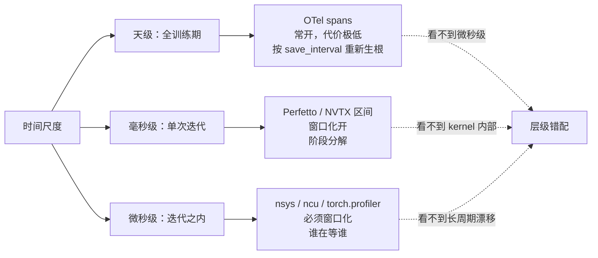
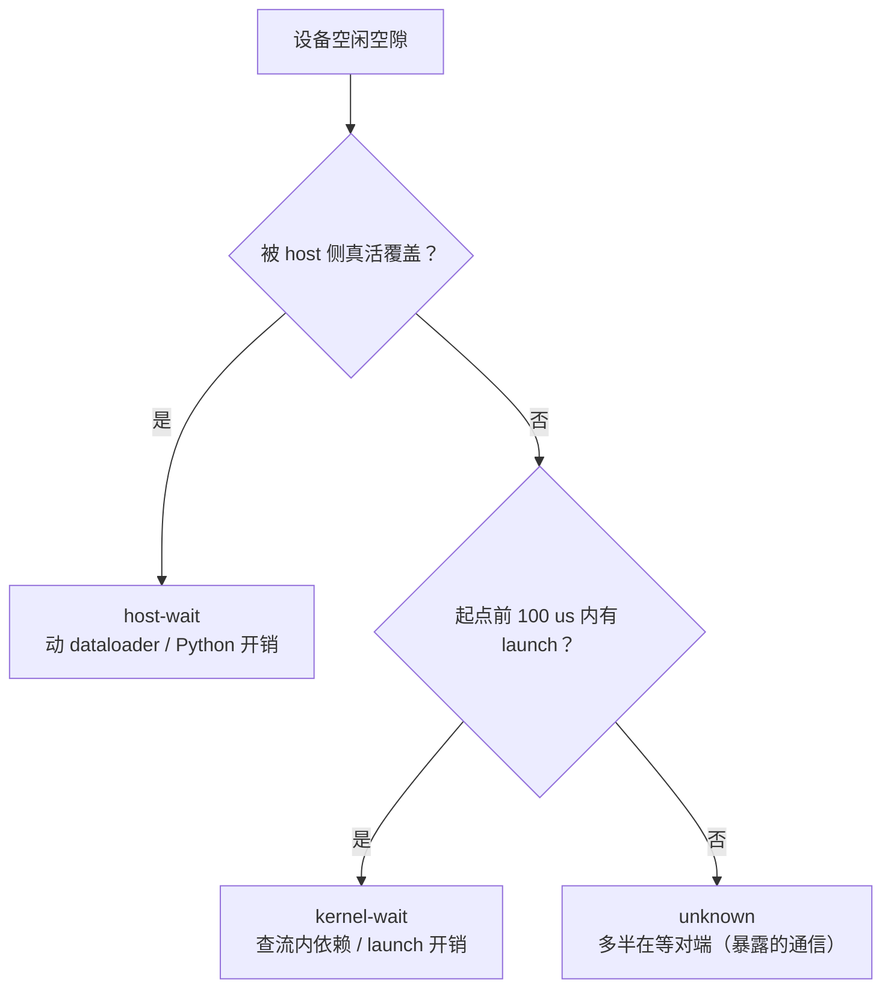

> **系列导航** ｜ 工具总纲：[NV 卡性能剖析工具全景：从 nvidia-smi 到 Nsight Compute](/2026/08/26/nv-gpu-profiling-toolkit/) ｜ 本系列：[00 度量口径](/2026/09/29/profiling-00-metrics/) → **01 训练栈 profiling** → [02 推理服务 profiling](/2026/09/29/profiling-02-inference/)
>
> 上一篇做的是尺子：MFU / HFU 的分子分母、timer 的语义、goodput 的边界。这一篇用那把尺子回答栈级问题——**一次迭代的时间去哪了**。单 kernel 怎么分析已经由 [算子系列 op-04](/2026/09/03/op-04-case-gemm/) 讲过，这里只做聚合与归因。

**TL;DR**

> * **三个观测面管三种时间尺度，不能互相替代。** OTel spans（Megatron v0.20 原生）覆盖全训练期的漂移与 goodput、代价极低可常开；Perfetto / NVTX 区间覆盖单次迭代的阶段分解；nsys / ncu / torch.profiler 覆盖微秒级的“谁在等谁”。**拿 nsys 看整轮训练的漂移、拿 OTel 看单个 kernel，都是层级错配**——前者会让 trace 大到读不动，后者根本量不到 kernel 内部。
> * **Megatron v0.20 的 OTel trace 是按 checkpoint 周期重新生根的。** `training.py:625` 的 `_maybe_reroot_otel_interval()` 在每个 `save_interval` 边界重开一个 interval root，用一个独立计数器分块（不受 resume 偏移影响）。写这段的理由在代码注释里：**曾经的 run-long umbrella span 会在“训练已经死了、exporter 还没 flush”的窗口里被 SIGKILL 一起带走**。这个细节决定了你读 OTel 数据时的聚合粒度。
> * **`overlap` 有两个分母，两个分母给出两个结论。** 同一份 trace：`overlap / comm_total` = 50.0%（通信藏住了一半，效率视角），`overlap / iter_time` = 14.2%（通信在整步里占这么多，“还能再藏多少”的上界视角）。混用就会出现“我们 overlap 只有 14%，还有很大空间”这种把上界当缺口的结论。
> * **α-β 模型给出一条比“通信占比”有用得多的判据：`D* = n·α·BW`。** 它是延迟项与带宽项相等时的消息量。α = 2 us 时：H100 + IB(50 GB/s) 的 n=8 交叉点是 **0.8 MB**，H100 + NVLink(450 GB/s) 是 **7.2 MB**，B200 + NVLink 是 **14.4 MB**。消息在 `D*` 以下是延迟主导——**此时做重叠收益很小，该做的是合并小消息或换算法，不是调 overlap**。
> * **重叠的全部价值有一个可算的上界：`max(C, M)`。** 完全不重叠是 `T = C + M`；任何调度器都突破不了 `T ≥ max(C, M)`。实测配置（llama3-8b / H100 / tp=8 dp=8 / seq 8192 / mb 4 / ga 8 / MFU 40%）：`C = 3.991 s`、`M = 1.129 s`，因此从 η=0 到 η=1 全部落差 = **22.0%**。**如果这个落差只有几个百分点，所有 overlap 调参都不必做。**
> * **一个被广泛搞反的事实：序列并行（SP）不降低 TP 的通信量。** 恒等式 AR(d) = RS(d) + AG(d) 决定总量守恒——baseline TP 每层 4 次 AR（每次 2(n−1)/n·d），SP 每层 4 次 AG + 4 次 RS（每次 (n−1)/n·d），两边都等于 8(n−1)/n·d，脚本实测比值 **恒为 1.00×**。SP 真正省的是**激活显存**（LN / dropout / residual 从每卡 (s,b,h) 变成 (s/t,b,h)），提速来自“显存省下来了，可以把 activation recompute 关掉”。见 [arXiv:2205.05198](https://arxiv.org/abs/2205.05198)；通信条数的独立复述见 [arXiv:2311.02382](https://arxiv.org/abs/2311.02382) §3。本次核实同时修掉了 `tools/megatron_bench/comm.py` 里标记为“待校准”的 SP 条目。
> * **GPU 空闲必须三分：host-wait / kernel-wait / unknown。** 三者的修法完全不同——等数据要动 dataloader，流内依赖要动图与调度，unknown 多半在等对端。合成 trace 里按 50/30/20 构造，本实现反算出的三分绝对偏差 **0.0 us**。
> * **分布式里“平均值”永远是乐观的。** 8 卡合成 trace：最慢 rank 3 单步 159000 us，中位数 141000 us，**均值 143250 us**——均值把掉队卡的惩罚摊给了其它卡，于是“最慢/均值”只报 +10.99%，而真实代价是 +12.77%。
> * **更要紧的是：先按 rank 聚合再观察，会把“轮转短板”伪装成轻微不均衡。** 同样平均拖慢 12.77%：短板固定在 rank 3 时，聚合后最慢 rank = 159000 us；短板每轮换卡时，每个 rank 的**平均值**都是 147000 us，只比中位数高 **4.26%**——而每一步实际都被拖了 12.77%。**“逐迭代最慢卡是不是同一张”这个区分，靠聚合后的数字永远看不出来。**
> * **`algbw` 与 `busbw` 的排名可以完全相反。** 同一张 25 GB/s 单向链路：AllReduce N=8 的 algbw 只有 22.0 但 busbw 38.5；AllGather N=8 的 algbw 高达 39.0 而 busbw 只有 34.1。看 algbw 会得出“AllGather 快得多”，看 busbw 会得出“AllReduce 快得多”。**跨集合类型比带宽数字，是这张表要防的唯一一件事。**
> * **本篇两个 notebook 都是纯 CPU 可跑、且必须通过真值反算**：[trace 聚合分析](https://github.com/lrypcy/ipynbs/blob/main/experiments/profiling/profiling-01-trace-agg/profiling-01-trace-agg.ipynb)（合成多 rank chrome trace → 时间分解 / idle 三分 / overlap / 掉队卡，真值反算最大相对误差 **0.00%**）、[重叠收益上界](https://github.com/lrypcy/ipynbs/blob/main/experiments/profiling/profiling-01-overlap-bound/profiling-01-overlap-bound.ipynb)（α-β 交叉点 / 重叠收益上界 / busbw 换算）。前者也能直接吃 Perfetto 与 kineto 的真实 trace。

---

## 1. 这一篇站在哪里

算子系列回答的是“这个 GEMM 为什么慢”，工具总纲回答的是“有哪些工具、各自回答什么”。中间缺一层：**一次完整的迭代，时间是怎么被分掉的，以及当它变慢时，责任怎么归到某一张卡、某一段代码上。**

这一层有三个特点，决定了它不能照搬单 kernel 的方法：

1. **量级跨度大。** 从 20 us 的 kernel launch 到 30 s 的 checkpoint，中间跨六个数量级。任何单一工具都覆盖不了全段。
2. **答案在“关系”里，不在“数值”里。** 单 kernel 分析找的是“这条指令慢”；栈级分析找的是“这段通信没被藏住”“这张卡比别的慢”——这些是跨事件、跨 rank 的关系量。
3. **采集本身会改变被测对象。** 全量采集一轮训练的 nsys trace 是几百 GB 级的量，写入本身会拖慢训练，于是你量到的已经不是原来那个系统了。这一条是本篇反复出现的主线。

所以先建立结构：三个观测面，各管一段尺度。

---

## 2. 三个观测面，管三种时间尺度

| 观测面 | 时间尺度 | 回答什么 | 代价 | 能否常开 |
|:---|:---|:---|:---|:---|
| OTel spans（Megatron v0.20 原生） | 全训练期（天级） | 长周期漂移、goodput、checkpoint 占比、阶段占比的**趋势** | 极低 | 可以，设计上就是为了常开 |
| Perfetto / NVTX 区间 | 单次迭代（ms 级） | 阶段分解、RL 各阶段占比、通信与计算的重叠关系 | 低 | 可以，窗口化开 |
| nsys / ncu / torch.profiler | 微秒级 | 谁在等谁、单 kernel 为什么慢、launch 开销 | 高（trace 体积 + 采集扰动） | 不行，必须窗口化 |



**核心论点：这三层不是替代关系，而是严格的分工。** 具体到操作层面：

- 想知道“训练跑到第 30000 步以后吞吐掉了 8%”，用 **OTel**。用 nsys 做这件事需要连续采集几天，产出的 trace 没有任何工具能打开。
- 想知道“这一步里 forward / backward / optimizer 各占多少”，用 **Perfetto / NVTX**。OTel 的 step span 粒度到不了这个层次（除非把 span group 开到 `all`，那时开销就上去了）。
- 想知道“backward 里为什么有一段 80 us 的空隙”，用 **nsys / ncu**。前两层都看不到内核之间的等待关系。

### 2.1 OTel 这一层在 Megatron 里长什么样

`megatron/core/telemetry/` 是 v0.20 引入的原生观测栈（版权头是 2026），实现在外部包 `nemo-lens` 里，没装时全部退化成 no-op，不会让训练挂掉。开关是 `--otel-enable` / `--otel-service-name` / `--otel-span-groups`，环境变量前缀 `MEGATRON_OTEL`（回退 `NEMO_LENS`），初始化在 `megatron/training/global_vars.py:490`。上一篇已经讲过 span group 的清单与 8 个训练指标，这里补一个**上一篇没讲、但决定怎么读数据**的机制：

`megatron/training/training.py:625` 的 `_maybe_reroot_otel_interval()`：

```python
def _maybe_reroot_otel_interval():
    """Called once at the top of each training-loop pass. Re-roots the trace at each
    checkpoint-frequency boundary using a dedicated counter (so groups are clean
    save_interval-sized chunks regardless of the resume offset in `iteration`).
    save_interval<=0 (no checkpointing) -> never re-roots (single trace, as before)."""
    freq = getattr(get_args(), 'save_interval', None) or 0
    if freq > 0 and (_otel_trace_interval_step % freq == 0):
        _reroot_otel_interval()
    _otel_trace_interval_step += 1
```

三个值得注意的点：

1. **聚合粒度是 `save_interval`，不是整轮。** 所以 OTel 数据天然是“每个 checkpoint 区间一条紧凑 trace”。做趋势分析时你要按这个粒度聚合，不要假设存在一条贯穿全程的 trace。
2. **分块用的是独立计数器 `_otel_trace_interval_step`，不是 `iteration`。** 这样 resume 之后分块边界仍然落在 `save_interval` 的整数倍上，不会被 resume 偏移污染——这是一个容易被忽略但会直接毁掉跨实验对比的设计。
3. **`save_interval <= 0` 时永不重根**，退回“单条长 trace”的旧行为。也就是说**关掉 checkpoint 会同时关掉这条分块语义**，跨配置对比时要注意这一点。

至于为什么要重根，代码在 `training.py:666` 附近的注释里写得很直白：run-long 的 umbrella span 会在“训练已经死了、exporter 还没 flush”的窗口里被 SIGKILL 一起带走，所以被移除了。**这是一条很好的方法论提醒：观测系统的结构本身就会因为“故障时还能不能留下证据”而被改写。**

### 2.2 Perfetto / NVTX 这一层

Megatron 的 NVTX 标注是**受 profiling 窗口控制的**，不是一直开着的。`training.py:4519-4528`：

```python
# Enable NVTX range when profiling starts and nvtx_ranges is set.
if iteration == args.profile_step_start and args.nvtx_ranges:
    configure_nvtx_profiling(True)
if args.use_pytorch_profiler:
    prof.step()
elif iteration == args.profile_step_start:
    torch.cuda.check_error(torch.cuda.cudart().cudaProfilerStart())
    if args.record_shapes:
        nsys_nvtx_context = torch.autograd.profiler.emit_nvtx(record_shapes=args.record_shapes)
        nsys_nvtx_context.__enter__()
```

- 字段 `nvtx_ranges: bool = False`（`megatron/training/config/common_config.py:65`，注释是“Enable NVTX range annotations for profiling”）。
- `--profile` 这个参数在配置里的字段名其实叫 `use_nsys_profiler`（`common_config.py:28`），`dest` 才是 `profile`——查参数时容易对不上号。
- 走 nsys 路径时用的是显式的 `cudaProfilerStart()`，配合 `nsys --capture-range=cudaProfilerApi`；走 torch.profiler 路径时用 `prof.step()` 推进 schedule。**两条路径的起止语义不同，不能混着解释。**

区间本身由 `megatron/core/utils.py:2750` 的 `nvtx_range_push()` / `:2777` 的 `nvtx_range_pop()` 打点，`megatron/training/utils/common_utils.py:612` 的 `get_nvtx_range()` 提供上下文管理器。RL 侧还有一批现成的区间名（`megatron/rl/rl_utils.py`）：`rl/offload-optimizer-before-inference`、`rl/rollout-collection`、`rl/get-logprobs`、`rl/prefetch-weights-to-gpu` 等，做 RL 阶段分解时直接可用。

### 2.3 nsys / ncu / torch.profiler 这一层

`training.py:4436-4463` 是 torch.profiler 的装配：

```python
profile_dir = Path(f"{args.tensorboard_dir}/../torch_profile")
profile_dir.mkdir(parents=True, exist_ok=True)
p.export_chrome_trace(f"{profile_dir}/rank-{torch.distributed.get_rank()}.json.gz")
prof = torch.profiler.profile(
    schedule=torch.profiler.schedule(
        wait=max(args.profile_step_start - 1, 0),
        warmup=1 if args.profile_step_start > 0 else 0,
        active=args.profile_step_end - args.profile_step_start,
        repeat=1,
    ),
    on_trace_ready=trace_handler, ...)
```

几处细节值得单独点出来：

- **导出路径是 `{tensorboard_dir}/../torch_profile/rank-N.json.gz`**（`training.py:4449-4451`）。是 **chrome trace 格式、独立文件、per-rank**。这意味着它天然适合做多 rank 聚合——**它正好是 Holistic Trace Analysis（HTA）的输入格式**，见 §8。
- **另有一条 Chakra ET 路径**（`training.py:4443-4445`，`pytorch_profiler_collect_chakra` 打开时）：导出到 `{tensorboard_dir}/../chakra/rank-N.json.gz`，用途是**回放式仿真**——不做“时间去哪了”，而是做“换一种硬件配置会怎样”。两种用途不要混。
- **采集窗口的默认值是 `profile_step_start: int = 10`、`profile_step_end: int = 12`**（`common_config.py:35`、`:38`），也就是默认只采 2 步，`wait=9, warmup=1, active=2`。`warmup=1` 只有在 `profile_step_start > 0` 时才给——**`--profile-step-start 0` 会得到一个没有 warmup 的 trace**，第一次迭代的编译、CUDA graph capture、cache 预热会全部混在里面。这是新手最常见的误读来源。
- `profile_ranks` 为空列表表示**全 rank**（`training.py:3496`：`args.profile_ranks == [] or safe_get_rank() in args.profile_ranks`）。**全 rank 采集的 trace 体积是 per-rank 的 N 倍**，8 卡还勉强，64 卡以上必须挑 rank。

一层读法总结成一句话：**先看该层的正确性边界，再看它的数字。** 一个没有 warmup 的 trace、一个全 rank 采集导致自身被拖慢的 nsys run，数字再漂亮也是错的。

---

## 3. 一次迭代的解剖：观测点在哪

Megatron 的一次训练迭代在 OTel 里的骨架（span 名取自 `training.py` 与 `checkpointing.py` 的实际字符串）。span group 有三类落点：`step`（每步都发生的）、`checkpoint`（周期性的）、`job`（一次性的）。

| 阶段 | OTel span 名 | 源码位置 | 备注 |
|:---|:---|:---|:---|
| 迭代总壳 | `megatron.train.iteration` | `training.py:4667` | 带 `megatron.iteration` 属性；goodput span |
| 首次迭代额外壳 | `megatron.train.first_iteration` + `megatron.train.forward_pre_hook` | `:4660`、`:4727` | 只在第一次迭代，CUDA graph capture 落在这里 |
| CUDA graph 捕获 | `megatron.train.cuda_graph_capture` | `:4594` | goodput span |
| GC | `megatron.train.gc_collect` | `:3988` | goodput span；周期性尖刺的常见来源 |
| 参数范数 | `megatron.train.params_norm` | `:4835` | goodput span；DP 组的 all-reduce |
| 日志 | `megatron.train.log` | `:4843` | goodput span |
| checkpoint 主壳 | `megatron.checkpoint.save` | `:3826` | 带 `megatron.iteration`；goodput span |
| └ state_dict 收集 | `megatron.checkpoint.save.state_dict` | `checkpointing.py:810` | goodput span |
| └ 后台写盘 | `megatron.checkpoint.save.io_write` | `checkpointing.py:896` | goodput span |
| └ 异步收尾 | `megatron.checkpoint.save.finalize` | `:4540` | **关键**，见下 |
| └ 回收显存 | `megatron.checkpoint.reclaim_memory` | `:3797` | goodput span |
| └ timer 落盘 | `megatron.checkpoint.timers_log` | `:3865` | goodput span |
| 容错心跳 | `megatron.checkpoint.ft_heartbeat` | `:4533` | goodput span |
| 启动期 | `megatron.startup.model_init` / `.dataloader` / `.weight_hash_check` | `:1819` / `:1937` / `:4482` | 都是一次性，但 weight-hash 会 all-reduce 全部参数 |
| 载入 | `megatron.checkpoint.load` / `.load.io_read` | `:2849` / `checkpointing.py:2515` | goodput span |
| 退出 | `megatron.checkpoint.exit_finalize` | `:4989` | goodput span |

`is_goodput_span=True` 在 `megatron/training/` 下共出现 **23 处**（`training.py` 20 处 + `checkpointing.py` 3 处）。这个清单本身就是 goodput 口径的定义：**checkpoint 的存、模型的初始化、dataloader 的构建都被算作“正事”**，所以缩短 checkpoint 间隔只会掉有效吞吐、几乎不动 goodput——上一篇已经用数字演示过这一点（90.56% → 91.15%，同期有效吞吐 −6.2%）。

### 3.1 一个“代码里写明了的”空闲来源

`training.py:4535-4541` 这段注释是本节最有价值的一条：

```python
# Non-blocking finalize of the *previous* async checkpoint, on the training
# critical path -- this is the "exposed" cost the async save imposes back on
# the loop (the flip side of the background write span on the worker), and
# shows up as a per-iteration gap near checkpoint boundaries. Cheap most
# iterations, blocks when finalizing.
with _otel_managed_span('checkpoint', 'megatron.checkpoint.save.finalize', is_goodput_span=True):
    maybe_finalize_async_save(blocking=False)
```

**这段文字同时给出了症状、机制和验证手段**：异步 checkpoint 的后台写盘是“免费的”，但它的收尾动作会回到训练关键路径上，表现为**checkpoint 边界附近的 per-iteration 空隙**；平时很便宜，真正 finalize 时会阻塞。

这就把 §5 的 idle 三分从“方法论”落到一个具体病例上：一个周期等于 `save_interval` 的 idle 周期性尖刺，**看 `megatron.checkpoint.save.finalize` 这个 span 就能确认或排除**，不需要上 nsys。**能用一个 span 回答的问题，不要用一节 trace 去回答。**

### 3.2 不要在这里编数字

本篇不给“forward 占 40%、backward 占 50%”这类比例表。原因很直接：**这些比例完全取决于模型、并行配置、序列长度与 micro batch 数，任何不来自你自己 trace 的百分比都是编的。** §3 的表给的是**观测点清单**——知道该去哪里读，比背一组会随配置失效的数有用。

如果你需要一组可对照的参考值，正确的做法是先在自己的配置上跑一次 `overlap_bound.py` 拿到 `C` 与 `M` 的量级（§4.3），再和 trace 里的实测值比。

---

## 4. 通信到底藏住了没有

这是栈级 profiling 里最容易得出错误结论的一节，因为“重叠率”这个指标本身就有两个同样合理的定义。

### 4.1 两个分母

[trace 聚合 notebook](https://github.com/lrypcy/ipynbs/blob/main/experiments/profiling/profiling-01-trace-agg/profiling-01-trace-agg.ipynb) 用区间代数算重叠——不是“各取一半”的估算，而是 comm 区间集合与 compute 区间集合的**交集长度**。同一份数据，两个分母：

| 分母 | 含义 | 数值（合成 trace，overlap 真值 50%） |
|:---|:---|:---|
| `comm_total` | 通信有多少被藏住了（**效率视角**） | 50.0% |
| `iter_time` | 通信在整步里占多少（**上界视角**） | 14.2% |

两个数都是“对的”。问题在于它们回答的问题不同：

- `overlap / comm_total` 接近 100% ⇒ 通信基本藏完了，重叠这件事已经做到头。
- `overlap / iter_time` 天生不可能接近 100%，因为分母是整步时间。把它当“缺口”读，就会得出“我们 overlap 只有 14%，还有很大空间”。

把重叠率从 0% 扫到 100%，看两个分母怎么分道扬镳：

```
重叠率扫描：两个分母给出的结论差距
 overlap    ov/comm (%)    ov/iter (%)     iter(us)
      0%            0.0            0.0     161000.0
     25%           25.0            6.6     151000.0
     50%           50.0           14.2     141000.0
     75%           75.0           22.9     131000.0
    100%          100.0           33.1     121000.0
```

注意最后一列：`ov/comm` 从 0 走到 100% 时，整步时间从 161000 us 降到 121000 us，**收益 24.8%**——这是真实存在的大收益。而 `ov/iter` 只从 0% 涨到 33.1%。**同一个改善，在两个读数里分别表现为“从 0 到 100”和“从 0 到 33”。**

这与 HTA 的 `get_comm_comp_overlap()` 语义一致，本实现按同样定义做，便于对齐。**报告任何 overlap 数字时必须写出分母**，和上一篇要求写清 MFU 分母是同一条纪律。

### 4.2 α-β 模型给出的判据：`D* = n·α·BW`

“通信占比”回答不了“这次通信值不值得藏”。α-β 模型可以。一次 ring AllReduce：

$$t = 2(n-1)\alpha + \frac{2(n-1)}{n}\cdot\frac{D}{BW}$$

前一项是**依赖链**，和消息量无关；后一项是**带宽搬运**，有独立计算可跑就能藏。两项相等时：

$$\alpha = \frac{D}{n\cdot BW} \quad\Longrightarrow\quad D^{*} = n\cdot\alpha\cdot BW$$

AllGather / ReduceScatter 的步数是 $$n-1$$ 而不是 $$2(n-1)$$，比值同为 $$n$$，**结论一样**。所以这是一条不依赖具体集合类型的判据。取 $$\alpha = 2$$ us（nccl-tests 常见量级）：

| 硬件 | 链路 | n | BW (GB/s) | D* (bytes) |
|:---|:---|:---|:---|:---|
| a100-80g | NVLink | 8 | 300 | 4,800,000 |
| a100-80g | IB | 8 | 25 | 400,000 |
| h100-80g | NVLink | 8 | 450 | 7,200,000 |
| h100-80g | IB | 8 | 50 | 800,000 |
| b200-180g | NVLink | 8 | 900 | 14,400,000 |
| b200-180g | IB | 8 | 100 | 1,600,000 |
| h100-80g | NVLink | 64 | 450 | 57,600,000 |

（完整表含 n=64 的全部档位，见 `overlap_bound.py --crossover`。）

读法：

- **`D*` 以下 = 延迟主导。** 此时改 overlap、加 buffer 都收效很小；真正有效的是**合并小消息**（把 N 个小 AllReduce 合成一个）或换算法（NVLS）。
- **`D*` 以上 = 带宽主导。** 这才是重叠能发挥作用的区间。
- **`D*` 与 `n` 成正比。** 卡越多，依赖链越长，小消息越吃亏——这解释了为什么同样的通信量在小规模上没事、扩到 64 卡就出问题。
- **IB 的 `D*` 只有几百 KB**（H100 + IB 是 0.8 MB），而 NVLink 的 `D*` 是它的 9 倍（7.2 MB）。“跨机通信藏不住”的第一个原因是**它本身就落在延迟主导区**，带宽窄只是第二个原因。
- 这条判据还能解释一个常见现象：**DP 的梯度 reduce 消息量大（几百 MB 级）稳落在带宽主导区，`--overlap-grad-reduce` 一开就有收益；而 TP 的每层通信消息量恰好落在 `D*` 附近**，所以 `tp_comm_overlap` 的收益不稳定、且强依赖 shape 与 TE 版本。

### 4.3 重叠收益的上界：`max(C, M)`

有了每组的通信时长估计，就可以算“重叠这件事最多值多少”：

| 口径 | 公式 | 迭代时间 |
|:---|:---|:---|
| 完全不重叠 | $$T = C + M$$ | 5.1194 s（100.0%） |
| 重叠效率 η=0.5 | $$T = C + M - \eta\min(C,M)$$ | 4.5551 s（89.0%） |
| 重叠效率 η=0.7 | 同上 | 4.3294 s（84.6%） |
| 重叠效率 η=0.9 | 同上 | 4.1037 s（80.2%） |
| **完美重叠** | $$T = \max(C, M)$$ | 3.9908 s（**78.0%**） |

实测配置（llama3-8b / h100-80g / tp=8 cp=1 pp=1 dp=8 → 64 卡 / seq 8192 / mb 4 / ga 8 / MFU 40%）下：

- TP 通信（`tensor_parallel_events`，无 SP）：每层 4 次 AllReduce，每次消息 268.44 MB、耗时 1071.92 us，**每迭代 1097.64 ms**。
- DP 梯度 reduce（`reduce_scatter`，n=8，IB 50 GB/s）：每层 54.53 MB、0.968 ms，×32 层 = **30.983 ms**。
- $$M = 1.098 + 0.031 = 1.129$$ s。
- $$C$$：每迭代 token = 4 × 8192 × 8 × 8 = 2,097,152；6ND FLOPs = 1.010e17；除以 64 卡 × 989 TFLOP/s × 40% = **3.991 s**。

于是从 η=0 到 η=1 的**全部落差 = 22.0%**。这是“重叠”这件事在这个配置下的天花板。三条推论：

1. **`max(C, M)` 是下界，不是目标值。** 报告时要写成“上界收益”，不能当规划目标。
2. **本例 `min(C, M) = M`**（通信总量 1.1 s 小于计算量 4.0 s）。这隔断了一类错误归因：**重叠在原理上够用，所以“通信没藏住”一定是调度/依赖问题，不是通信量太大。** 反过来若 $$M > C$$，即使 η=1 也只能降到 $$M$$——那时唯一有效的手段是**减少通信量本身**（换并行策略、增大 micro batch 摊薄、减少重计算触发的额外通信、改通信算法/拓扑）。
3. **判断实测 η 落在哪**：从 trace 里量 `overlap / min(C, M)`——在 $$C \ge M$$（本例）时它就等于 `overlap / comm_total`。**两个脚本在这里接上了**：`overlap_bound.py` 给上界，`trace_agg.py` 给实测。

这一段还顺手做了一次**对账**（自校验的一种形式）：DP 的每层耗时 × 32 层 = 30.983 ms，而朴素估算（只看带宽项）是 1744.83 MB × (dp−1)/dp = 1526.73 MB ÷ 50 GB/s = 30.535 ms，差额 0.448 ms 全部是 32 层 × 7 步的 α 项，相对偏差 1.47%。**估算模型和对账口径能闭合，才有资格拿它去解释实测。**

### 4.4 一个被广泛搞反的事实：SP 不降通信量

在规划“怎么降低通信”时，序列并行（sequence parallel, SP）经常被列进候选。上面的脚本给出的结果是：**TP only 总时长 1097.64 ms，TP+SP 总时长 1097.64 ms，比值 1.00×。**

这不是模型不够精细，而是结论本身。恒等式：

$$\text{AR}(d) = \text{RS}(d) + \text{AG}(d)$$

- baseline TP：每层 4 次 AllReduce，每次搬 $$2(n-1)/n \cdot d$$ ⇒ 合计 $$8(n-1)/n \cdot d$$
- TP + SP：每层 4 次 AllGather + 4 次 ReduceScatter，每次搬 $$(n-1)/n \cdot d$$ ⇒ 合计 $$8(n-1)/n \cdot d$$

**完全相等。** 具体到算子的形态变化：$$f$$（TP 区入口）从 forward identity / backward identity 变成 forward AllGather / backward ReduceScatter；$$g$$（TP 区出口）从 forward AllReduce 变成 forward ReduceScatter / backward AllGather。于是那 4 次 AR 被拆成了 4 组 (RS, AG)，总量守恒。

SP 真正省的是**激活显存**：LN / dropout / residual 这些按 token 独立算子从“每卡存一份完整的 $$(s, b, h)$$”变成存 $$(s/t, b, h)$$，缩小 $$t$$ 倍。它带来的提速来自**显存省下来之后可以把 activation recompute 关掉**——重计算减少才是速度的来源，不是通信变少。

证据链：

- Korthikanti et al., *Reducing Activation Recomputation in Large Transformer Models*，[arXiv:2205.05198](https://arxiv.org/abs/2205.05198)——SP 的原始描述。
- 对基线 SP 通信条数的独立复述：[arXiv:2311.02382](https://arxiv.org/abs/2311.02382) §3 明确写 “8 global communications per attention layer (4 in forward pass and 4 in backward pass)”，与本实现的 8 次/层一致。
- 恒等式 AR = RS ∘ AG 本身与实现无关，可直接验证。

**顺带修掉一笔技术债**：`tools/megatron_bench/comm.py` 的 `tensor_parallel_events()` 里，SP 分支此前标注为“保守版本，条目待对照 Korthikanti et al. 2205.05198 校准”，并且把边界转换描述成“额外两笔”。本次核实后已改写为标定过的四条事件 + 上述引用——**“边界转换”并不是额外开销，它就是那 8 次通信本身**。这篇正文和那个函数现在用的是同一个口径。

### 4.5 Megatron 的 overlap 开关清单

| 开关 | 位置 | 管什么 |
|:---|:---|:---|
| `overlap_grad_reduce` | `distributed_data_parallel_config.py:18` | DP 梯度 reduce 与 backward 重叠 |
| `overlap_param_gather` | `distributed_data_parallel_config.py:21`、`optimizer_config.py:336` | 参数 all-gather 与前向计算重叠 |
| `delay_wgrad_compute` | `distributed_data_parallel_config.py:185`、`model_parallel_config.py:348` | 推迟 wgrad，为梯度 reduce 让出窗口 |
| `tp_comm_overlap` | `model_parallel_config.py:265` | TP 通信与 Linear 层执行重叠（需 TE） |
| ├ `tp_comm_overlap_ag` | `:281` | AllGather 与 GEMM 流水线化 |
| ├ `tp_comm_overlap_rs` | `:286` | ReduceScatter 与 GEMM 流水线化 |
| ├ `tp_comm_bulk_wgrad` | `:271` | AllGather 与 bprop activation grad GEMM |
| ├ `tp_comm_bulk_dgrad` | `:276` | ReduceScatter 与 bprop weight grad GEMM |
| └ `tp_comm_overlap_rs_dgrad` | `:291` | RS 与 DGRAD GEMM 的 split 流水线（默认 False） |
| `moe_shared_expert_overlap` | `transformer_config.py:710` | 共享专家与 dispatch 重叠（仅 alltoall / flex dispatcher） |
| `overlap_moe_expert_parallel_comm` | `model_parallel_config.py:343` | MoE 专家并行通信重叠 |
| `overlap_dispatch_backward_with_experts_wgrad` | `:351` | dispatch 反向与专家 wgrad 重叠 |

两个 2026 年的观察：

- **MFSDP v2 把这两个开关的默认值改成了 True**（`megatron/core/distributed/fsdp/src/megatron_fsdp/fully_shard.py:92-93`：`overlap_grad_reduce: bool = True`、`overlap_param_gather: bool = True`）。也就是说走 MFSDP 路线时重叠是默认行为，**审阅 trace 时要先确认自己看到的是“开了重叠的效果”还是“没开”**——不确认默认值就比 A/B，是另一种口径错误。
- `overlap_moe_expert_parallel_comm` 的合法性检查（`transformer_config.py:2980-3055`）里有一串硬约束：只支持 expert model parallelism、只支持 alltoall/flex dispatcher、**要求关闭 full recomputation 与 recompute method**、只支持 bf16/fp16、`recompute_num_layers` 必须为 None、MTP 最多一层……这一串 assert 本身就是一条重要线索：**重叠与重计算是互相排斥的资源**，两者抢的是同一份“可用于填补通信窗口的独立计算”。

---

## 5. GPU 饿了的三种成因，以及为什么必须分开

上一节的结论是“重叠在原理上够用”。但原理够用不代表实际用上了。诊断的实际问题变成了：**GPU 在等，它在等谁？**

这里必须三分，因为三类的修法完全不同：

| 成因 | 现象 | 修法 | 判据 |
|:---|:---|:---|:---|
| `host-wait` | 空隙期间 host 在跑数据加载 / Python 侧逻辑 | 动 dataloader（num_workers、prefetch、pin_memory）、减少 Python 开销、上 CUDA graph | 空隙被 host 侧非 launch 事件覆盖 |
| `kernel-wait` | 空隙前 host 已 post 下一个 kernel，设备没开工 | 查流内依赖、launch 开销、算子融合、CUDA graph 覆盖 | 空隙前 100 us 内有 launch 事件 |
| `unknown` | 窗口内看不到任何 host 侧解释 | 多半在等对端——即暴露出来的通信、或 host 侧采样缺失 | 前两条都不匹配 |



**混在一起统计会把人引向错误的优化方向**：把“等数据”和“等对端”合成一个“GPU 空闲 30%”的数字，然后去调 NCCL 参数——这是常见的整段浪费。

### 5.1 实现与真值反算

`trace_agg.py` 的 `_triage_split()` 按 host 侧“真活”的边界把空隙切成原子段，再逐段归因；`kernel-wait` 的判定是**整段空隙级别**的——一个 launch 只能解释紧随其后的那个空隙，不能反过来解释它前面的空隙（这条约束很重要，否则相邻空隙会互相污染）。

工具最值得看的部分是它的自校验：合成 trace 时按 **50 / 30 / 20** 的比例把 20 ms 的 idle 切成 10 个空隙（每段 2000 us），其中 `host-wait` 段填一个覆盖整个空隙的 `DataLoader._next`，`kernel-wait` 段在空隙开始前 20 us 放一个 launch 事件，`unknown` 段什么都不放。分析器能否把这些还原出来：

```
-- idle 三分（构造时切成 10 个空隙，每段 2000 us）--
   成因                 真值(us)       反算(us)         占比
   host-wait       10000.000    10000.000      50.0%
   kernel-wait      6000.000     6000.000      30.0%
   unknown          4000.000     4000.000      20.0%
   三分绝对偏差最大 0.0 us OK
```

同一个自校验把六项主量也一起对了一遍，**最大相对误差 0.00%**：

```
   compute_us           101000.000   101000.000      0.00%  OK
   comm_us               40000.000    40000.000      0.00%  OK
   overlap_us            20000.000    20000.000      0.00%  OK
   exposed_comm_us       20000.000    20000.000      0.00%  OK
   idle_us               20000.000    20000.000      0.00%  OK
   iter_us              141000.000   141000.000      0.00%  OK
```

这个自校验不是装饰。构造它的时候它确实抓出了两个实现 bug：

1. **最初把 idle 切成 4 段**，导致 50/30/20 的目标占比被量化成 50/25/25——分析器算得再准也还原不出目标值。改成 10 段后量化误差归零。**这条提醒本身有普遍意义：任何“从 trace 里统计比例”的结论，都要先问一句“我的构造粒度支持这个精度吗”。**
2. **最初把 10 个 idle 空隙首尾相接**，于是 `_complement()` 把它们合并成了一段，整段只能判一个成因，三分直接退化成“全 host-wait”。改成“小 kernel + 空隙”交替之后才切得开。**真实 trace 里空隙必然被 kernel 隔开，这个构造约束是从物理事实反推出来的**——它不是为了让测试通过而加的补丁。

另外，本实现的判据与 HTA 不完全相同：HTA 基于 Kineto 的 CPU 侧算子链推断，本实现基于 host 事件的时间重叠关系。**跨工具比三分占比之前必须先对齐判据**，否则同一个 trace 会给出两组数。

---

## 6. 掉队卡：为什么“平均值”在分布式里几乎总是骗人的

分布式训练里整步时长由**最慢的那张卡**决定。这意味着按 rank 求均值是一个系统性乐观的统计量：它把掉队卡的超时摊给了其它卡。

合成 trace（8 rank × 3 迭代，掉队 rank 3 的 compute 多 18 ms）：

```
-- 掉队卡 --
   最慢 rank 3  iter = 159000.0 us
   最快 rank 0  iter = 141000.0 us
   中位数 141000.0 us，均值 143250.0 us
   最慢 / 中位数 - 1 = +12.77%
   最慢 / 均值   - 1 = +10.99%
   最慢 / 最快   - 1 = +12.77%
```

**同一个真实代价（+12.77%），换成“最慢 / 均值”就缩水成 +10.99%。** 卡越多，摊薄效应越强。所以报告掉队时应该报**最慢 vs 中位数**，而且要把分布给出来，不要只给一个数。

### 6.1 固定短板 vs 轮转短板（本节最重要的一条）

比“平均值骗人”更隐蔽的问题在**聚合维度**上。同一个平均拖慢量（每步都被拖 12.77%），两种形态：

```
[固定 rank 3]
   迭代 0: 最慢 rank 3  159000.0 us  (+12.77% vs 中位数)
   迭代 1: 最慢 rank 3  159000.0 us  (+12.77% vs 中位数)
   迭代 2: 最慢 rank 3  159000.0 us  (+12.77% vs 中位数)
   均值 143250.0 / 中位数 141000.0 / 最大 159000.0 us

[每轮换卡]
   迭代 0: 最慢 rank 0  159000.0 us  (+12.77% vs 中位数)
   迭代 1: 最慢 rank 1  159000.0 us  (+12.77% vs 中位数)
   迭代 2: 最慢 rank 2  159000.0 us  (+12.77% vs 中位数)
   均值 143250.0 / 中位数 141000.0 / 最大 147000.0 us
```

两种形态的**均值完全相同**（143250 us），**逐迭代的最慢值也完全相同**（都是 159000 us）。差别只在最后一列：如果先把每个 rank 的迭代**取平均**、再取最大，固定短板得到 159000 us（+12.77%），轮转短板得到 147000 us（**只比中位数高 4.26%**）。

**也就是说：「先按 rank 聚合、再找最慢卡」这个常规流程，会把轮转短板伪装成一个轻微的分布不均。** 而实际上每一步都被拖了 12.77%。

正确的做法是**逐迭代回答“这一轮最慢的是谁”**：

| 观察结果 | 结论 | 下一步 |
|:---|:---|:---|
| 每轮都是同一张卡 | 固定短板 | 查那张卡本身：NIC / 拓扑位置 / 掉频 / ECC / 邻居干扰 |
| 每轮换卡，位置无关 | 资源争抢或负载不均 | 查数据分片、专家路由、共享卡、内存带宽争抢 |
| 每轮换卡，但总在同一个“槽位” | 拓扑位置问题 | 查该槽位对应的 NIC / 交换机端口 |

`trace_agg.py` 的 `--selftest` 会直接把这张逐迭代表打出来，**这是它存在的另一个理由：这个区分靠聚合后的数字永远看不出来。**

### 6.2 2026 年的工具面

- **nsys 2026.5.1 提供了 NCCL straggler analysis recipe**——把 NCCL 集合的执行与参与 rank 对齐，直接标出拖后腿的 rank。判读要点：要区分“这张卡在等”和“这张卡在拖”，前者是受害者。引用级别标为 B 级（工具文档，未见独立复现），使用前建议先用合成/已知病例验证一遍它的判定。
- **hta 的 temporal breakdown 让每 rank 的 compute / comm / idle 三色并排**，这是看“分布”最快的入口。前提是你的 trace 能进 HTA（见 §8）。
- **自建的 HTA 等价物**：`trace_agg.py --trace <dir 里的某个 rank-N.json.gz>` 就能给出 per-rank 的 iter / compute / comm / overlap / idle 表与最慢 rank 的 idle 三分。它不做 HTA 的增强计数器与 CUPTI 计数，只做 §5、§6 需要的部分：

```
rank        iter(us)     compute        comm     overlap        idle
3           159000.0    119000.0     40000.0     20000.0     20000.0
最慢 rank 3（159000.0 us），中位数 141000.0 us，+12.77%
最慢 rank 的 idle 三分: host-wait 10000.0 / kernel-wait 6000.0 / unknown 4000.0 us
```

---

## 7. 通信微基准怎么读：`algbw` 与 `busbw`

`nccl-tests` 输出两个带宽数。它们的关系只取决于集合类型与卡数：

$$\text{busbw} = \text{algbw} \times f,\qquad
f = \begin{cases}
2(n-1)/n, & \text{AllReduce}\\
(n-1)/n, & \text{AllGather / ReduceScatter}
\end{cases}$$

| 集合 | N=2 | N=4 | N=8 | N=16 | N=64 |
|:---|:---|:---|:---|:---|:---|
| AllReduce | 1.000 | 1.500 | **1.750** | 1.875 | 1.969 |
| AllGather / ReduceScatter | 0.500 | 0.750 | 0.875 | 0.938 | 0.984 |

三条判读规则：

1. **同一份数据，AllReduce 的 factor 是 AllGather 的两倍**，所以“我的 AllReduce 达到 40 GB/s”和“我的 AllGather 达到 40 GB/s”在物理链路上不是一回事。
2. **N=2 时 AllReduce 的 factor 只有 1.0**——两卡 AllReduce 就是 SendRecv，没有 busbw 口径优势。**拿两卡测出的 busbw 去推 8 卡性能会严重高估。**
3. **busbw 是双向口径，链路标称带宽通常是单向口径。** ring AllReduce 在大 N 下 busbw ≈ 2 × 单向链路是**正常的**（N=8 是 1.75×），看到它超过链路标称值不要急着报故障。

### 7.1 排名可以相反

这是本节要防的核心陷阱。同一张 25 GB/s 的单向链路：

| 集合 | N | algbw | factor | busbw | busbw / 单向链路 |
|:---|:---|:---|:---|:---|:---|
| all_reduce | 8 | 22.0 | 1.750 | **38.5** | 1.54× |
| all_gather | 8 | **39.0** | 0.875 | 34.1 | 1.36× |
| all_reduce | 2 | 24.0 | 1.000 | 24.0 | 0.96× |

- 看 algbw：AllGather 39.0 > AllReduce 22.0 ⇒“AllGather 快得多”。
- 看 busbw：AllReduce 38.5 > AllGather 34.1 ⇒“AllReduce 快得多”。

**两个结论都“对”，也都没用——它们量的不是同一个东西。** AllReduce 的 algbw 低是因为它按定义要搬 $$2(n-1)/n$$ 倍的量；AllGather 的 factor 小于 1 是因为 algbw 的分母是“集合要处理的数据量”，而 ring AllGather 下每卡实际只承担 $$(n-1)/n$$ 份。**跨集合类型比带宽数字，是这张表要防的唯一一件事。**

### 7.2 什么时候 busbw 不再对应单一链路

真正会让口径失效的不是“超过链路标称值”，而是 **NVLS**（NVLink SHARP，网内归约）、**CollNet**（SHARP 交换机内归约）与各种分层算法：数据不在链路上被逐跳转发，甚至不在链路上归约，此时上面 `f` 的推导前提（数据在 N 卡链路上都跑了一遍）不成立，busbw 会超出 2× 这个经验上界。

**判据：`busbw / 单向链路 > 2` 时，不要再拿它反推线速，只能同类算法、同 N 之间横向比。**

正确的用法始终是：**同算法、同 N、同消息量下横比**。busbw 曲线在某档位出现 cliff，就把故障定位到了“引入该档位的那一层”——小消息看 α、中消息看算法、大消息看链路。这也是小消息档必须存在的理由：它测的不是带宽，是 α。

---

## 8. 多 rank trace 的聚合：HTA 及其等价物

`training.py:4451` 导出的 `torch_profile/rank-N.json.gz` 是标准 chrome trace。这带来一个很实用的衔接：**Holistic Trace Analysis（HTA）的输入就是 PyTorch Profiler / Kineto 的 trace，同一 job 的所有 trace 放进一个独立目录（`trace_dir`）即可**——Megatron 的官方导出**不需要任何转换**就是它的输入。

HTA 当前版本是 **v0.6.0**（MIT；发布提交 PR #341 日期 2026-04-22；要求 Python ≥ 3.10）。README 列出的能力：

| 能力 | 用途 |
|:---|:---|
| Temporal Breakdown | 按 compute / comm / memory 事件与 idle 分解各 rank 的 GPU 耗时 |
| Idle Time Breakdown | 把 GPU 空闲分成 **host wait / kernel wait / unknown** |
| Kernel Breakdown | 找出各 rank 上最耗时的小 kernel |
| Comm-Comp Overlap | 通信与计算重叠的时间百分比 |
| Kernel Duration Distribution / Frequent Kernel Patterns / Launch Statistics | 形态与调用模式 |
| Augmented Counters | 增强 trace：内存带宽利用率 + 每 stream 的未决操作数（队列长度） |
| Trace Comparison | trace 之间的 diff |
| CUPTI Counter Analysis（实验性） | 取 GPU 性能计数器，把 kernel 指标归因到 PyTorch 算子做 roofline |

三点使用纪律：

1. **`critical_path_analysis.py` 在代码里，但没有出现在 README 的 feature 列表里。** 引用时要写成“代码中存在关键路径分析模块”，不要写成“官方支持的关键路径分析”。这是个典型的“能力边界靠读代码确认、不靠读 README 确认”的例子。
2. **本项目的 idle 三分与 HTA 措辞对齐、判据不同**（见 §5.1）。`kernel wait` 就是本实现里的 `kernel-wait`。
3. **换配置后的 A/B 要用 trace diff，不要靠感觉。** 两次 run 的 trace 直接叠图看哪段变长、哪段变短，比对着两份聚合数字猜要可靠得多。这也是 HTA 的 Trace Comparison 存在的意义。

顺带说，HTA 的“增强计数器”给了本系列一个现成的观测点：**每 stream 的未决操作数（队列长度）**。队列长度持续 >1 说明 launch 跟得上、设备在有序消费；队列频繁见底说明 host 侧是瓶颈——这正好是 §5 里 `host-wait` 的直接证据，可以作为三分结论的交叉验证。

---

## 9. 八种常见病的排除树

按“症状 → 最可能的原因 → 怎么验证”组织。最后一列是**无 GPU 时的替代手段**——本机就是这种情况，所以这一列不是免责声明，而是真有对应的做法。

| # | 症状 | 最可能的原因 | 验证方法 | 无 GPU 时的替代 |
|:---|:---|:---|:---|:---|
| 1 | 迭代时间随步数**缓慢单调上涨** | 显存碎片 / 缓存未命中 / 日志与累积结构增长 | 看 allocated / reserved 曲线与 allocator cache 命中率；对比第 100 步与第 30000 步的 trace | 读源码找累积容器（list 攒 loss、metric 只增不减）；`goodput_calc.py` 检查 span 定义是否把增长量算进了正事 |
| 2 | 迭代时间**周期性尖刺**，周期 = `save_interval` | 异步 checkpoint 的 finalize 回到关键路径 | 看 `megatron.checkpoint.save.finalize` span（`training.py:4540`） | 该 span 的存在与注释本身就说明了机制；`goodput_calc.py` 演示缩短间隔的收益结构 |
| 3 | 单卡不变，但全局变慢 | 掉队卡 | per-rank iter 分布；逐迭代最慢卡 | `trace_agg.py` 的固定/轮转对照（§6.1） |
| 4 | 小消息集合通信慢 | α 主导 | `D* = n·α·BW` 判据；nccl-tests 小消息档 | `overlap_bound.py --crossover` 直接给 D* |
| 5 | 大消息集合通信慢 | 链路 / 拓扑 | busbw 曲线的 cliff 位置 | `overlap_bound.py --busbw` 给 factor 与判据 |
| 6 | GPU 利用率低，但 kernel 都很快 | host 侧瓶颈（数据 / Python） | idle 三分中 `host-wait` 占比高；stream 队列长度见底 | `trace_agg.py` 的 host-wait 分支与真值反算 |
| 7 | kernel 之间有明显空隙 | 流内依赖 / launch 开销 | idle 三分中 `kernel-wait` 占比高 | `trace_agg.py` 的 kernel-wait 分支 |
| 8 | kernel 本身慢 | 单算子问题 | ncu（见工具总纲与算子系列） | **本篇不覆盖**——单 kernel 分析不在栈级范围内，不要用栈级工具硬推 |
| 9 | 每步 FLOPs 变多，MFU 却不变 | 重计算 / 额外通信 | 检查 `--recompute-*` 与重叠开关的相互约束 | `overlap_bound.py` 的 TP/SP 对账；上一篇的 MFU/HFU 换算 |

第 8 行是这张表的边界，也是本篇的边界：**栈级 profiling 的产出是“责任归属”，不是“算子怎么改”。** 用 nsys 看 kernel 内部、或者用 ncu 看整轮训练，都是层级错配。

---

## 10. 一次调优的记账表：结构比数字重要

调优最容易失控的地方不是“改错了”，而是“改了五六处、每处都记得有收益、加起来却对不上”。所以需要一个固定的记账结构。下面是这张表的骨架——**“怎么确认”这一列必须落到具体的 span 名或 trace 特征上**，否则那一行就不是一条记录，而是一个印象。

| 改动 | 预期收益（上界，从模型算） | 怎么确认（证据） | 代价 | 实测 |
|:---|:---|:---|:---|:---|
| 开 `--overlap-grad-reduce` | ≤ DP 的 `M_dp`（本例 30.983 ms/迭代，约 0.6% 的 5.12 s） | trace 里 DP reduce 与 backward 的重叠区间；`overlap / comm_total` 应从 ~0 升到接近 1 | 显存（需额外的梯度 buffer） | 待测 |
| 开 `--overlap-param-gather` | ≤ 参数 all-gather 时长 | 同上，对象换成前向前的 AG | 显存 | 待测 |
| 调 `tp_comm_overlap` 全家桶 | ≤ TP 的 `M_tp`（本例 1097.64 ms，约 21%——**但只在 `D*` 以上有效**） | nsys 里 AG/RS 与 GEMM 是否真的并行；`D*` 判据先过一遍 | TE 版本要求、与重计算冲突 | 待测 |
| 缩短 `save_interval` | 有效吞吐**下降**、goodput 基本不动 | `goodput_calc.py`；`megatron.checkpoint.*` span 占比 | — | 已验证结构（上一篇） |
| 打开 seqlen 的 SP + 关 recompute | 通信量不变，收益来自重计算减少 | `overlap_bound.py` 的 TP/SP 比值应为 1.00× | 要求 tp > 1 | 模型已确认 |

**为什么“预期收益”这一列取上界而不是估计值**：上界是可算的、可复现的（`overlap_bound.py --bound`），估计值是猜的。先写上界，实测回来再填最后一列——**如果实测接近上界，说明这一类优化已经做完了；如果实测远低于上界，那是个需要解释的问题，而不是一个可以忽略的误差。** 这两种情况的处理方式完全不同，所以上界必须显式写出来。

这张表在这个项目里**没有填“实测”列**。本机没有 GPU，任何实测数字都会是编的。按项目一贯的纪律——**没有实验就没有**——表填到模型层为止，实测部分留给有卡的人。

---

## 11. 批判与展望

**trace 的体积与采集偏差。** 全 rank、全迭代的 nsys trace 是几百 GB 级。更麻烦的是采集本身会拖慢训练，于是“你量到的不是原来那个系统”。缓解手段是窗口化（`profile_step_start/end`）与挑 rank（`profile_ranks`），但两者都会引入**采样偏差**：只采第 10-12 步，会漏掉 checkpoint 边界、周期性尖刺、以及长周期漂移。**OTel 与 nsys 的分工本质上就是“低开销全时段”和“高开销小窗口”的分工**，不存在一个能同时做到两者的工具。

**OTel 语义约定的碎片化。** 环境变量前缀是 `MEGATRON_OTEL`，但回退到 `NEMO_LENS`——**双前缀本身就是信号**：观测层的实现被放在外部包 `nemo-lens` 里，意味着 span 名、属性名、以及 goodput 的判定规则都不由 Megatron 自己锁定。这对生态是好事，对“跨版本对比 trace”是坏事。做长期趋势分析时要把 span 名一起存进结果里。

**“关键路径”的实用性争议。** HTA 的 `critical_path_analysis.py` 存在但未进 README 的 feature 列表，这件事值得多想一层。关键路径在理论上给出“缩短哪一段最能缩短整体”的答案，非常吸引人；但在高度重叠的训练循环里，关键路径会**随重叠形态实时改变**——你按某一步的关键路径去优化，改完之后关键路径可能已经移到别处了，而新的关键路径正是被你改动的重叠造成的。**这类指标的适用前提是依赖结构稳定**，而重叠本身就是在改变依赖结构。

**分布式计量的单位问题。** 本篇所有的“整步时长”都默认了一个前提：存在一个良定义的“一步”。在 pipeline 并行下，microbatch 之间的边界是重叠的；在 RL 训练里，“一步”包含 rollout 采集，而采集的耗时取决于生成长度分布，不是一个确定量。**当“一步”本身没有定义时，“每步耗时”和“每步 goodput”都会失去意义**——这个问题在推理服务侧更严重（见下一篇的 goodput 与负载模型）。

---

## 12. Lab Exercises

1. **把真值反算的容差收紧到 0.1% 再跑一遍 `trace_agg.py`。** 现在的构造里每个 rank 每个迭代完全同构，这是它能做到 0.00% 的原因之一。给迭代之间加上随机抖动（compute 时长 ±5%），观察误差怎么变，并回答：**容差应该按什么标准定？**（提示：分析器不做任何平滑，所以理想情况下抖动不应该产生误差——如果没有，说明某处有问题。）

2. **给 `trace_agg.py` 加一个“缺标注”分支。** 现在没有 `iteration` 标注时会退化成整段跨度口径并打警告。构造一份没有标注的 trace，量出“退化口径”比“分段口径”高估了多少 idle，并解释为什么跨迭代间隙会被算成 idle。

3. **用 `overlap_bound.py` 找出你自己配置下的 `D*`。** 把 `--tp`、`--dp`、`--hardware` 换成你实际在用的值，算出 TP 每层通信的消息量，与对应的 `D*` 比大小。回答：**你的 TP 通信落在延迟主导区还是带宽主导区？** 这个答案决定 `tp_comm_overlap` 值不值得调。

4. **构造一个 `M > C` 的配置。** 用 `--mfu` 把它压到 15% 左右（或者把 tp 拉到很小让通信量上升），让 `M > C`。然后回答：此时 η=1 的迭代时间是多少，为什么它等于 `M` 而不是 `C`？以及**在这种情况下最该动的是什么**。

5. **用 `overlap_bound.py --busbw` 验证“排名可以相反”。** 自己挑一组 (algbw, N) 让 algbw 的排名与 busbw 的排名相反，并说明这在真实测量里对应什么场景。

6. **把 §10 的记账表填上你自己的实测列。** 要求每一行的“实测”都必须能在 trace 里指出对应的特征（区间、span 名、或计数）。指不出来的那一行，删掉。

---

## 参考

**Megatron-LM（源码引用均对 v0.20.0 / commit `60e039626` 核验，2026-08-21 main）**

- 仓库：<https://github.com/NVIDIA/Megatron-LM>
- OTel 重根与分块：`megatron/training/training.py:625`（`_maybe_reroot_otel_interval`）、`:666`（移除 run-long umbrella span 的理由）
- torch.profiler 装配与导出：`megatron/training/training.py:4436-4463`；`profile_dir` `:4449`；`export_chrome_trace` `:4451`；Chakra ET 路径 `:4443-4445`；schedule `:4454-4456`
- NVTX 窗口控制：`megatron/training/training.py:4519-4528`；字段 `megatron/training/config/common_config.py:65`；`--profile` 的 dest `common_config.py:28`
- profiling 窗口默认值：`megatron/training/config/common_config.py:35`、`:38`
- `profile_ranks` 语义：`megatron/training/training.py:3496`
- goodput span 标记：`is_goodput_span=True` 共 23 处（`training.py` 20 处 + `checkpointing.py` 3 处），清单见 §3
- 异步 checkpoint 的暴露代价：`megatron/training/training.py:4535-4541`（注释 + `megatron.checkpoint.save.finalize`）
- overlap 开关：`megatron/core/model_parallel_config.py:265/271/276/281/286/291/340/343/348/351`；`megatron/core/distributed/distributed_data_parallel_config.py:18/21/185`；`megatron/core/optimizer/optimizer_config.py:336`；`megatron/core/transformer/transformer_config.py:710`
- MFSDP v2 重叠默认值：`megatron/core/distributed/fsdp/src/megatron_fsdp/fully_shard.py:92-93`
- NVTX 区间工具：`megatron/core/utils.py:2750`（`nvtx_range_push`）、`:2777`（`nvtx_range_pop`）；`megatron/training/utils/common_utils.py:612`（`get_nvtx_range`）
- RL 阶段区间：`megatron/rl/rl_utils.py`（`rl/rollout-collection`、`rl/get-logprobs`、`rl/prefetch-weights-to-gpu` 等）

**序列并行与通信量**

- Vijay Korthikanti, Jared Casper, Sangkug Lym, Lawrence McAfee, Michael Andersch, Mohammad Shoeybi, Bryan Catanzaro, *Reducing Activation Recomputation in Large Transformer Models*, [arXiv:2205.05198](https://arxiv.org/abs/2205.05198)（SP 的原始描述；激活显存从 $$sbh(10 + 24/t) + 5\text{abs}^2/t$$ 变为 $$sbh\cdot 34/t + 5\text{abs}^2/t$$，即未被 TP 分片的 $$10sbh$$ 项也被 $$t$$ 分掉了；$$a, b, s$$ 分别是 attention head 数、batch、序列长度，沿用原文记号）
- *Ultra-Long Sequence Distributed Transformer*, [arXiv:2311.02382](https://arxiv.org/abs/2311.02382) §3（对基线 SP 通信条数的独立复述：“8 global communications per attention layer (4 in forward pass and 4 in backward pass)”）

**工具**

- Holistic Trace Analysis（HTA）：<https://github.com/facebookresearch/HolisticTraceAnalysis> ／ [文档](https://hta.readthedocs.io/)（v0.6.0，Python ≥ 3.10；idle 三分官方措辞为 host wait / kernel wait / unknown；`critical_path_analysis.py` 在代码中但未列入 README feature 列表）
- NVIDIA Nsight Systems：[文档](https://docs.nvidia.com/nsight-systems/)（2026.5.1 的 NCCL straggler analysis recipe，引用级别 B）
- NVIDIA Nsight Compute：[文档](https://docs.nvidia.com/nsight-compute/)（单 kernel，见算子系列）
- NVIDIA nccl-tests：<https://github.com/NVIDIA/nccl-tests>（`algbw` / `busbw` 定义出处）
- PyTorch Profiler / Kineto：[文档](https://pytorch.org/docs/stable/profiler.html)
- Perfetto：[perfetto.dev](https://perfetto.dev/)

**本系列 notebook（纯 CPU 可复算，输出已固化，GitHub 上直接读）**

- [trace 聚合分析](https://github.com/lrypcy/ipynbs/blob/main/experiments/profiling/profiling-01-trace-agg/profiling-01-trace-agg.ipynb) —— 合成多 rank chrome trace → temporal 分解 / idle 三分 / overlap 双分母 / 掉队卡形态；同时能直接读真实 chrome trace（`.json` / `.json.gz`）
- [重叠收益上界](https://github.com/lrypcy/ipynbs/blob/main/experiments/profiling/profiling-01-overlap-bound/profiling-01-overlap-bound.ipynb) —— `D* = n·α·BW` 交叉点、`max(C, M)` 上界与 η 敏感度、TP/SP 通信量对账、`algbw`↔`busbw` 换算

仓库内的对应脚本是同一份源码（本仓库 `tools/profiling_bench/trace_agg.py` 与 `overlap_bound.py`，α-β 模型在 `tools/megatron_bench/comm.py`，本次核实后已更新 SP 分支并附引用）。notebook 里的代码是从这些文件**逐字抽取**的，不是另写一份。上一篇的 [Timer 计时语义](https://github.com/lrypcy/ipynbs/blob/main/experiments/profiling/profiling-00-timer-semantics/profiling-00-timer-semantics.ipynb)、[MFU/HFU 口径](https://github.com/lrypcy/ipynbs/blob/main/experiments/profiling/profiling-00-mfu-accounting/profiling-00-mfu-accounting.ipynb)、[goodput 与 MFU](https://github.com/lrypcy/ipynbs/blob/main/experiments/profiling/profiling-00-goodput/profiling-00-goodput.ipynb) 同理。

---

**下一篇**：[性能剖析（02）：推理服务 profiling——TTFT、goodput 与负载模型](/2026/09/29/profiling-02-inference/)。那里要处理一组本篇刻意绕开的问题：当“一步”不再有定义时，吞吐和延迟该怎么记。
