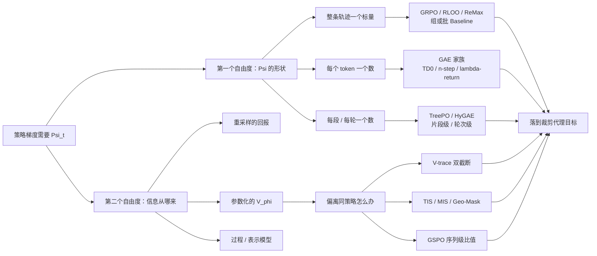
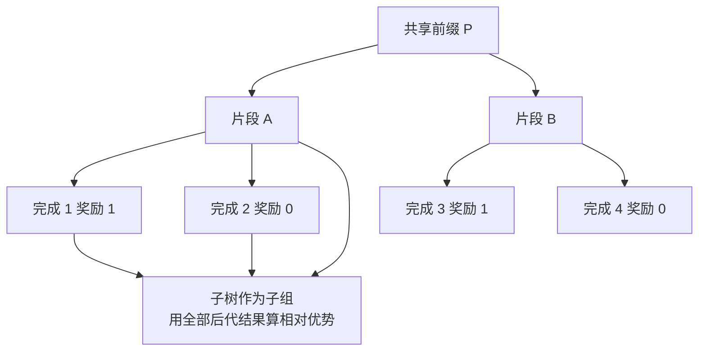
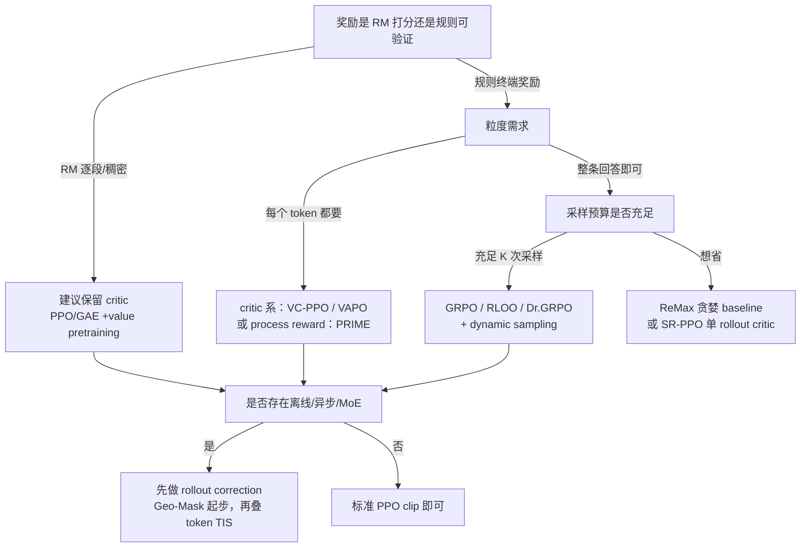

> **系列导航** ｜ [从 MDP 到 GRPO（二）：策略梯度与 REINFORCE](/2026/08/21/mdp-to-grpo-02-policy-gradient-reinforce/) ｜ [（四）：PPO 与裁剪代理目标](/2026/08/21/mdp-to-grpo-04-ppo-clipped-surrogate/) ｜ [（五）：GRPO 组相对优势](/2026/08/21/mdp-to-grpo-05-grpo-group-relative/) ｜ **本篇：估计方法的方法谱系** ｜ 姊妹篇 [RL 符号与计算全景](/2026/09/19/rl-notation-and-estimators-deepdive/) ｜ 源码侧 [RL 框架里的那些变量到底怎么算](/2026/09/30/rl-variables-in-frameworks/)

> **TL;DR**
>
> * **先把「要估什么」和「用什么去估」拆成两件事（§1）**。策略梯度真正需要的是一个系数 $$\Psi_t$$；它的**形状**（每条轨迹一个数 / 每个 token 一个数 / 每个片段一个数）与它的**信息源**（重采样的回报、参数化的 $$V_\phi$$、组统计量、过程奖励模型）是两个正交维度。近两年绝大多数「新算法」只是在这两张表的不同格子里换位置。
> * **所有多步回报都是同一个反向扫描（§3）**：$$\Delta_t=\alpha_t+\beta_t\,\Delta_{t+1}$$。$$n$$-step、折后回报、$$\mathrm{TD}(\lambda)$$ 回报、GAE、V-trace、Retrace($$\lambda$$) 只差一对 $$(\alpha_t,\beta_t)$$ 和边界值；不少工程 bug 来自混淆了「cut 在哪里」而非「公式是什么」。
> * **$$\lambda$$ 的历史包袱是 $$\lambda$$-return（§4）**：$$\sum_{l\ge0}(\gamma\lambda)^l\delta_{t+l}$$ 恒等于 n-step advantage 的指数加权平均 $$(1-\lambda)\sum_{n\ge1}\lambda^{n-1}\hat A^{(n)}_t$$（望远镜抵消，§4.2 给出逐项核对）。所以 $$\lambda$$ 不是在「调偏差」和「调方差」之间拨开关，而是在**选一条收益分配曲线的形状**——$$\gamma=1$$ 的 RLHF 里尤其明显。
> * **RLHF 的长序列让 $$\lambda=0.95$$ 变成了具体问题（§4.5）**：终端奖励传到第 $$t$$ 个 token 时只剩 $$0.95^{T-t}$$ 倍，$$T-t=100$$ 时约 $$0.006$$。VC-PPO 的解法是**把 critic 与 policy 的 GAE 解耦**（value target 用 $$\lambda=1.0$$，policy 用 $$0.95$$），VAPO 的解法是让 $$\lambda$$ 随长度自适应 $$\lambda=1-\frac{1}{\alpha l}$$。
> * **off-policy 修正是另一条独立谱系（§5）**，从 V-trace 的双截断到 2025–2026 的 TIS / MIS / Geo-Mask / IcePop / GSPO：它们修正的是**同一个 off-policy 估计偏差**，区别只在截断对象（token 级乘积 / 序列几何平均 / 双侧遮蔽 / 长度归一化的对数阈值）。三策略视角 $$\pi_{\rm rollout},\pi_{\rm old},\pi_\theta$$ 是读这些方法的唯一正确坐标。
> * **critic-free 一支的本质是用重采样换 critic（§6）**：$$\gamma=1$$ + 轨迹级奖励使 RLHF 退化为一个 contextual bandit，而 group baseline 只是「用 $$K$$ 次采样去估 $$V(q)$$」。它的统计代价只有 $$1/(K-1)$$ 量级（§2.3），真正贵的是「必须多采 $$K$$ 条」——成本写在采样预算里，而不是写在公式的优雅程度上。
> * **2026 的两个新方向（§7）**：一是把 baseline 从「标量奖励」换成「奖励模型隐空间上的图传播」（GraphAE），二是把 **隐式奖励即为优势** 这条理论线（DPO → 隐式 PRM → progress advantage）反过来当作分粒度优势的来源；代价是这条结论只在「KL 正则成立、$$\pi_{\rm ref}$$ 取训练起点」的前提下成立（§7.2）。
>
> 本篇只做解析推导与机制对照，不含本地实测数字；所有引用数字都给出处，二手转述的站点会标注「论文报告」。

---

## 目录

- [1. 先问「要估什么」：$$\Psi_t$$ 的三个自由度](#1-先问要估什么psi_t-的三个自由度)
- [2. baseline 理论：为什么减一个东西不改期望](#2-baseline-理论为什么减一个东西不改期望)
- [3. 蒙特卡洛一支：从 return-to-go 到 n-step](#3-蒙特卡洛一支从-return-to-go-到-n-step)
- [4. $$\lambda$$ 的来历：$$\lambda$$-return、TD($$\lambda$$) 与 GAE](#4-lambda-的来历lambda-returntdlambda-与-gae)
- [5. off-policy 一支：重要性比修正的谱系](#5-off-policy-一支重要性比修正的谱系)
- [6. critic-free 一支：拿重采样换 critic](#6-critic-free-一支拿重采样换-critic)
- [7. 粒度那一侧：过程级、结构化与表示级](#7-粒度那一侧过程级结构化与表示级)
- [8. 选型：决策树、默认配置与监控量](#8-选型决策树默认配置与监控量)
- [9. 15 个坑](#9-15-个坑)
- [10. 参考](#10-参考)

---

## 1. 先问「要估什么」：$$\Psi_t$$ 的三个自由度

### 1.1 策略梯度真正需要的，只是一个系数

语言模型 RL 的基本对象是：给定 prompt $$q$$，采样回答 $$y=(y_1,\dots,y_T)$$，得到一个（通常是序列级的）奖励 $$R(q,y)$$。要最大化的是

$$J(\theta)=\mathbb E_{q\sim\mathcal D,\ y\sim\pi_\theta(\cdot\mid q)}\big[R(q,y)\big]\ ,$$

它的梯度（REINFORCE / 策略梯度定理，[Williams 1992](https://link.springer.com/article/10.1007/BF00992696)、[Sutton et al. 2000](https://papers.nips.cc/paper/1999/hash/464d828b85b0bed98e80ade0a5c43b0f-Abstract.html)）是

$$\nabla_\theta J(\theta)=\mathbb E\Big[\sum_{t=1}^{T}\nabla_\theta\log\pi_\theta(y_t\mid q,y_{<t})\ \Psi_t\Big]\ .$$

**这篇文章的全部内容，就是讨论这个 $$\Psi_t$$ 能放哪些东西、放进去之后偏差和方差怎么变。** 合法的候选远不止一种：

| $$\Psi_t$$ | 叫什么 | 备注 |
|:---|:---|:---|
| $$G_t=\sum_{s\ge t}\gamma^{s-t}r_s$$ | return-to-go | 因果的（只依赖 $$t$$ 之后），但方差大 |
| $$G_0$$（或整个 $$R$$） | 全轨迹回报 | 非因果也算无偏（见 §3.1），但方差最大 |
| $$Q^\pi(s_t,a_t)$$ | 动作价值 | 最优方差，但需要模型 |
| $$A^\pi(s_t,a_t)=Q^\pi-V^\pi$$ | 优势 | 上面那个减去 baseline（§2） |
| $$\delta_t=r_t+\gamma V^\pi(s_{t+1})-V^\pi(s_t)$$ | TD 残差 | 确定性环境下 $$\delta^\pi=A^\pi$$（见姊妹篇 §3） |
| $$R(q,y)-b(q)$$（整轨迹一个标量） | bandit 化优势 | RLHF 里 GRPO / RLOO 那一支（§6） |

需要注意：$$\Psi_t$$ **只要不依赖「尚未采到的未来动作」，就不会引入梯度偏差**——这也是 1999/2000 那批策略梯度定理的通项形式（Sutton et al. 的表述是「$$\Psi$$ 可以是任何满足兼容性条件的函数」）。这一句话决定了后面所有变量的自由度：

- baseline $$b$$ 能不能减、能依赖什么：见 §2；
- $$V$$ 用真值还是用 $$V_\phi$$：决定了你是做 critic-base 还是 critic-free；
- $$\Psi_t$$ 是每 token 一个数还是整条轨迹一个数：粒度的选择，与上面两点独立。

### 1.2 两个正交维度，构成全文的坐标系

把近年所有「新优势估计方法」摆到一张表上，两个轴就够：

| | **信息源：参数化 critic** | **信息源：重采样** | **信息源：外部 / 过程模型** |
|:---|:---|:---|:---|
| **粒度：token 级** | PPO/GAE、VC-PPO、VAPO | ——（成本不可承受） | PRM 逐 token 稠密奖励、PRIME 隐式过程奖励、progress advantage |
| **粒度：片段 / 步骤级** | GiGPO、分段 critic | TreePO 子树相对优势 | step-level PRM、过程验证器 |
| **粒度：轨迹级** | 整条回答的价值回归（少见） | REINFORCE / RLOO / ReMax / GRPO / REINFORCE++ | ORM + 留一 baseline、GraphAE |
| **粒度：轮次级（多轮 agent）** | HyGAE 的统一 critic | —— | —— |

读到这里应该能得到的判据：**「critic vs 无 critic」不是方法论站队，而是「在哪个粒度上、用哪种信息源去估同一个 $$V$$」**。前者只是在每个 $$t$$ 上都给出一份还不错的 $$V_\phi(s_t)$$，代价是它自己也要训练、也有偏差；后者只在 $$t=0$$ 处用 $$K$$ 次采样估 $$V(q)$$，代价是 $$K$$ 倍采样预算且 $$t>0$$ 处拿不到独立信息。

### 1.3 一张图看谱系

### 1.4 本文符号对照表

符号一律用来源文献的通行写法；不同来源用了同一个字母的地方，在表里固定（与姊妹篇《RL 符号与计算全景》保持一致）：

| 符号 | 含义 | 出处 |
|:---|:---|:---|
| $$r_t$$ | 第 $$t$$ 步的即时奖励（含 KL shaping 时已含 KL 项） | Sutton & Barto |
| $$R$$ / $$R(q,y)$$ | 整条回答的回报（RLVR 里常是终端二元信号） | — |
| $$V_\phi(s_t)$$ | 参数化 critic 对状态价值的估计 | — |
| $$Q^\pi, A^\pi, V^\pi$$ | 真值；**不带帽的量永远拿不到** | — |
| $$\delta_t=r_t+\gamma V_\phi(s_{t+1})-V_\phi(s_t)$$ | TD 残差（带 $$\hat{}$$ 时用 $$V_\phi$$） | — |
| $$r_t(\theta)=\pi_\theta(y_t\mid\cdot)/\pi_{\rm old}(y_t\mid\cdot)$$ | PPO 的 **token 级重要性比** | [PPO 2017](https://arxiv.org/abs/1707.06347) |
| $$s_i(\theta)=\big(\pi_\theta(y_i\mid q)/\pi_{\rm old}(y_i\mid q)\big)^{1/\lvert y_i\rvert}$$ | GSPO 的 **序列级几何平均比** | [2507.18071](https://arxiv.org/abs/2507.18071) |
| $$\rho_t=\pi_\theta(a_t\mid s_t)/\mu(a_t\mid s_t)$$ | 一般 off-policy 重要性比（对 behavior policy $$\mu$$） | IMPALA |
| $$\bar\rho,\bar c$$ | V-trace 的两个截断上界 | [1802.01561](https://arxiv.org/abs/1802.01561) |
| $$\pi_\theta,\pi_{\rm old},\pi_{\rm ref}$$ | 当前策略 / 采这批 rollout 的策略 / 冻结的参考策略 | — |
| $$G$$ 或 $$K$$ | 组内采样条数 | GRPO 系 |

> **帽子规则**：本文所有带估计性的量都加 $$\hat{}$$（如 $$\hat A$$、$$\hat V$$、$$\hat\mu_{-i}$$）；原文不写帽子的地方，本文一律补上，因为「它是估计量」这件事本身就是后面一半坑的来源。

---

## 2. baseline 理论：为什么减一个东西不改期望

### 2.1 无偏性的充分条件：只依赖状态，不依赖动作

从 $$\Psi_t=Q^\pi(s_t,a_t)$$ 换到 $$\Psi_t=A^\pi=Q^\pi-V^\pi$$ 之所以不改梯度，是因为减掉的项在期望下为零：

$$\mathbb E_{a\sim\pi_\theta(\cdot\mid s)}\big[\nabla_\theta\log\pi_\theta(a\mid s)\,b(s)\big]
=\sum_a \pi_\theta(a\mid s)\frac{\nabla_\theta\pi_\theta(a\mid s)}{\pi_\theta(a\mid s)}b(s)
=b(s)\,\nabla_\theta\underbrace{\sum_a\pi_\theta(a\mid s)}_{=1}=0\ .$$

关键是 **$$b$$ 只能依赖左边的条件（状态），不能依赖这一次采样出来的动作**。这条看似简单的限制，直接分开了两个流派：

| baseline $$b$$ | 依赖什么 | 是否无偏 |
|:---|:---|:---|
| critic $$V_\phi(s_t)$$ | 状态（模型参数与有关的状态量） | 无偏（剩下的偏差只来自 critic 自身的近似误差） |
| 贪婪解码的奖励 $$R(q,y^{\rm greedy})$$（ReMax） | prompt $$q$$ 与另一个确定轨迹 | 无偏，与本次采样独立 |
| 留一法均值 $$\hat\mu_{-i}=\frac{1}{K-1}\sum_{j\ne i}R_j$$ | 其他 $$K-1$$ 条独立采样 | 无偏（因为与 $$y^i$$ 独立） |
| 含自身的组均值 $$\hat\mu_g=\frac{1}{K}\sum_{j}R_j$$ | **第 $$i$$ 条自己的回报也进来了** | **有偏，$$O(1/K)$$** |
| 全局 batch 均值 | 包含自己 + 跨 prompt | 有偏，$$O(1/B)$$；且把不同 prompt 的难度混在一起 |

[ReMax（2310.10505）](https://arxiv.org/abs/2310.10505) 与 [RLOO（2402.14740）](https://arxiv.org/abs/2402.14740) 的差别，先从这一行看最清楚：前者拿一条**额外跑出来的**确定性轨迹做对照，后者拿**本来就得多采样几次**的兄弟样本做对照；GRPO 则选择了「含自身」的便宜版本，用 $$O(1/K)$$ 的偏差换了实现上的简单和 std 归一化带来的稳定性。

### 2.2 方差：最优 baseline 长什么样

减 baseline 的动机是方差。一个经典结果（[Weaver & Tao 2001](https://www.cs.toronto.edu/~tingwuwang/RL_course/ref/baseline.pdf)）给出：对第 $$k$$ 个参数，最小方差的标量 baseline 是按梯度平方加权的回报期望，

$$b^\star_k=\frac{\mathbb E\big[\,(\nabla_{\theta_k}\log \pi_\theta(y))^2\,G\,\big]}{\mathbb E\big[\,(\nabla_{\theta_k}\log \pi_\theta(y))^2\,\big]}\ ,$$

注意两点推论：

1. **最优 baseline 是逐参数的**，不是一条轨迹一个标量。$$V_\phi(s_t)$$ 是「按状态」逼近它，组均值是「按 prompt」逼近它，两者都是廉价近似，都不是最优。
2. 组统计量里没有谁是天然最优的。GRPO 再除一个 $$\hat\sigma_g$$，严格说已经不是「同一个 baseline 家族」内部的操作——它改变的是每条样本的有效**尺度**，也引入了难度偏置（§6.4）。

### 2.3 方差账：留一法 baseline 到底贵不贵

设单次回报方差为 $$\sigma^2$$，组内 $$K$$ 条独立采样。用留一法均值做 baseline 时，单个样本的有效信号的方差是

$${\rm Var}\big(R_i-\hat\mu_{-i}\big)=\sigma^2+\frac{\sigma^2}{K-1}=\sigma^2\Big(1+\frac{1}{K-1}\Big)\ .$$

也就是说 **baseline 本身的统计代价只有 $$1/(K-1)$$ 倍，$$K=8$$ 时约 $$1/7$$，几乎可以忽略**；真正的钱花在「必须多采 $$K$$ 条」上。这个结论有一个重要推论：

> critic 的价值不在于「它是一个更好的估计量」，而在于**它把「每个 t 都要一份 $$\hat V$$」这件事的成本从 $$K$$ 次 rollout 降到了一次前向传播**。反过来，当粒度只需要 $$t=0$$ 一份（bandit 结构，§6.1）时，critic 的优势就只剩「$$K$$ 太贵」这一个理由了。

### 2.4 留一 vs 含自身，还有一个隐藏区别

$$K$$ 条样本里，含自身的均值使得每个样本的信号强度被乘以 $$(1-1/K)$$（自己拉低了自己的偏离程度），并且梯度之间不再独立。当 $$K$$ 很小（很多 GRPO 配置用 $$K=8$$ 甚至 $$4$$）时，这个 $$(1-1/K)$$ 与 std 归一化带来的 $$\hat\sigma_g$$ 估计噪声叠加在一起，会让有效更新步长随 $$K$$ 系统性漂移。**换 $$K$$ 就等于换学习率的有效性**——这是复现别人结果时最常见的隐性变量。

---

## 3. 蒙特卡洛一支：从 return-to-go 到 n-step

### 3.1 return-to-go 与「全轨迹回报」不是一回事

同一个 $$G_0$$ 挂在所有 token 上（经典 REINFORCE），与挂在自己的位置上（return-to-go $$G_t$$），梯度是同一个吗？**在期望意义下是**：对第 $$t$$ 个 token 而言，$$s<t$$ 那些奖励与 $$a_t$$ 在给定 $$s_t$$ 的条件下独立，于是它们在期望下是常数、会被第 2 节的恒等式吃掉。所以

$$\mathbb E\big[\nabla\log\pi_\theta(y_t\mid\cdot)\,G_0\big]=\mathbb E\big[\nabla\log\pi_\theta(y_t\mid\cdot)\,G_t\big]\ ,$$

但方差完全不同：$$G_0$$ 中「与当前动作无关的那部分」纯粹是噪声。这就是 return-to-go 「看起来只是把前缀减掉」却能显著降低方差的原因（[Sutton & Barto 第 13 章](http://incompleteideas.net/book/the-book-2nd.html) 的 causality 一节）。

### 3.2 $$n$$-step：两端之间的有限插值

把 return-to-go 的前 $$n$$ 步奖励留下来，剩下的部分用 Bootstrapping 代替：

$$G^{(n)}_t=\sum_{l=0}^{n-1}\gamma^l r_{t+l}+\gamma^n V_\phi(s_{t+n})\ ,\qquad
\hat A^{(n)}_t=G^{(n)}_t-V_\phi(s_t)\ .$$

$$n=1$$ 是纯 TD（偏差最大、方差最小），$$n\to\infty$$ 是纯 MC（偏差最小、方差最大）。$$n$$ 是一个离散旋钮：[A3C（Mnih et al. 2016）](https://arxiv.org/abs/1602.01783) 就是把不同 $$n$$ 的 truncated return 混起来用。

### 3.3 统一视角：一切多步回报都是同一个反向扫描

近期的一个工程总结（[rl-triton, arXiv:2608.17641](https://arxiv.org/abs/2608.17641) 表 1）把上面这些写成同一个一阶递推：

$$\boxed{\ \Delta_t=\alpha_t+\beta_t\,\Delta_{t+1}\ }$$

配上终端/截断标志来处理边界：

| 算法 | $$\alpha_t$$ | $$\beta_t$$ | 边界 $$\Delta_T$$ |
|:---|:---|:---|:---|
| 折后回报 | $$r_t$$ | $$\gamma(1-d_t)$$ | $$G_T$$ |
| $$n$$-step 回报 | 见 §3.2，按窗口直接截断 | — | 0 |
| $$\mathrm{TD}(\lambda)$$ 回报 | $$r_t+\gamma(1-\lambda)(1-d^{\mathrm{term}}_t)V_\phi(s_{t+1})$$ | $$\gamma\lambda(1-d_t)$$ | $$G^{\lambda}_T$$ |
| GAE | $$r_t+\gamma(1-d^{\mathrm{term}}_t)V_\phi(s_{t+1})-V_\phi(s_t)$$ | $$\gamma\lambda(1-d_t)$$ | $$0$$ |
| V-trace | $$\rho_t\big(r_t+\gamma(1-d^{\mathrm{term}}_t)V_\phi(s_{t+1})-V_\phi(s_t)\big)$$ | $$\gamma c_t(1-d_t)$$ | $$0$$ |
| Retrace($$\lambda$$) | $$r_t+\gamma(1-d^{\mathrm{term}}_t)\mathbb E_\pi[Q(s_{t+1},\cdot)]-Q(s_t,a_t)$$ | $$\gamma c_{t+1}(1-d_t)$$ | $$0$$ |

其中 $$d^{\mathrm{term}}_t$$ 表示「这一步之后是真正的终止」，$$d^{\mathrm{trunc}}_t$$ 表示「这一步之后被长度上限截断，需要外部 bootstrap」，$$d_t=d^{\mathrm{term}}_t\vee d^{\mathrm{trunc}}_t$$。

这张表的价值不在公式，而在**把差异收敛到两个地方**：一是 $$\alpha$$ 里吃不吃重要性比、用 $$V$$ 还是 $$Q$$ 做 bootstrap；二是 $$\beta$$ 里有没有乘以 $$c_t$$ 或 $$\lambda$$。工程实现里绝大多数 bug（跨 episode 传递、多轮对话把两轮的 $$A$$ 串成一条扫描、工具类 token 没掩掉）都发生在第二个地方。

> **判据**：拿到任何一个新的多步估计量，先问它在这种形式下的 $$(\alpha_t,\beta_t)$$ 是什么，再问它的 $$\Delta_T$$ 取什么。**答不出这两问，就等于还没读懂它的边界处理。**

---

## 4. $$\lambda$$ 的来历：$$\lambda$$-return、TD($$\lambda$$) 与 GAE

### 4.1 $$\lambda$$-return：对 $$n$$-step 做指数加权平均

既然 $$n=1$$ 偏差大、$$n=\infty$$ 方差大，Sutton（1988）的做法不是挑一个 $$n$$，而是**把所有 $$n$$ 加权平均起来**，权重是几何衰减的：

$$G^{\lambda}_t=(1-\lambda)\sum_{n\ge1}\lambda^{\,n-1}G^{(n)}_t+\lambda^{T-t-1}G_t\ .$$

这里的 $$(1-\lambda)\lambda^{n-1}$$ 是归一化好的几何分布：$$\lambda\to0$$ 时全部权重压在 $$n=1$$（一步 TD），$$\lambda\to1$$ 时权重摊到无穷远（MC）。最后那一项是有限地平线的补偿项。

### 4.1.1 前向视角与后向视角：资格迹解决了什么

$$\lambda$$-return 有个致命的工程问题：**它是前向视角（forward view）**——要算 $$G^{\lambda}_t$$ 就得看到 $$t$$ 之后直到回合结束的所有奖励，在线学习时无法立刻更新。Sutton 的解法是等价的后向视角（backward view），也就是资格迹（eligibility trace）：

$$z_t=\gamma\lambda\,z_{t-1}+\nabla_w \hat V(s_t,w)\ ,\qquad \Delta w\propto \delta_t\,z_t\ .$$

它不再等到回合结束，而是每来一个新样本就立刻更新，并把这次的 TD 残差按「最近-频度」的几何权重回灌到历史状态上（$$z$$ 的递推与 §3.3 的扫描是同一种递归，只是方向相反、多了一份梯度）。对线性函数逼近，前向视角在回合结束时累计的总更新与后向视角在线更新的累计结果精确相等（[Sutton & Barto 第 12 章](http://incompleteideas.net/book/the-book-2nd.html)）。

这段历史解释了今天为什么所有 RL 代码里都是**递归形式**：

- TD($$\lambda$$) 里的资格迹是「**用后向递归实现前向的 $$\lambda$$-return**」；
- GAE 里的 $$\hat A_t=\delta_t+\gamma\lambda\hat A_{t+1}$$ 是同一台机器在 **advantage** 上的应用（$$V$$ 固定时不严格等价，但实践用法完全一致）；
- 两者的对象不同：前者估计的是 $$V$$（等式里有额外 $$(1-\lambda)\gamma V(s_{t+1})$$ 混合项，见 §3.3 的 TD($$\lambda$$) 行），后者估计的是 $$A$$。

### 4.2 GAE 就是它的「减掉 $$V$$」版本（逐项核对）

Schulman 的 GAE（[1506.02438](https://arxiv.org/abs/1506.02438)）定义写作 TD 残差的加权和：

$$\hat A^{\mathrm{GAE}(\gamma,\lambda)}_t=\sum_{l\ge0}(\gamma\lambda)^l\delta_{t+l}\ ,\qquad
\delta_t=r_t+\gamma V_\phi(s_{t+1})-V_\phi(s_t)\ .$$

它与 §4.1 的 $$\lambda$$-return 是同一个东西减掉基线。直接展开可以逐项对数（忽略末端有限地平线修正；$$V$$ 固定时精确成立）：

$$(1-\lambda)\sum_{n\ge1}\lambda^{\,n-1}\hat A^{(n)}_t
=(1-\lambda)\sum_{n\ge1}\lambda^{\,n-1}\Big[-V_\phi(s_t)+\sum_{l=0}^{n-1}\gamma^l r_{t+l}+\gamma^n V_\phi(s_{t+n})\Big]\ .$$

按三种成分分别收集系数：

- $$V_\phi(s_t)$$ 的系数：$$-(1-\lambda)\sum_{n\ge1}\lambda^{n-1}=-1$$；
- $$r_{t+l}$$ 的系数：出现在所有 $$n\ge l+1$$ 的项里，$$(1-\lambda)\sum_{n\ge l+1}\lambda^{n-1}\gamma^l=\gamma^l\lambda^l$$；
- $$V_\phi(s_{t+m})$$（$$m\ge1$$）的系数：只来自 $$n=m$$ 那一项，$$(1-\lambda)\lambda^{m-1}\gamma^m$$。

再看右侧 GAE 展开式 $$\sum_{l\ge0}(\gamma\lambda)^l(r_{t+l}+\gamma V_\phi(s_{t+l+1})-V_\phi(s_t))$$ 的同类系数：

- $$r_{t+l}$$：$$\gamma^l\lambda^l$$ ✔ 一致；
- $$V_\phi(s_{t+m})$$：来自上一步的 $$+\gamma(\gamma\lambda)^{m-1}$$ 与自身的 $$-(\gamma\lambda)^m$$，合计 $$\gamma^m\lambda^{m-1}(1-\lambda)$$ ✔ 一致；
- $$V_\phi(s_t)$$：$$-1$$ ✔ 一致。

三项全部一致，恒等式成立。所以

> **GAE = 对 1 步、2 步、……、无穷步 advantage 的几何加权平均，再统一减掉 $$V_\phi(s_t)$$。**

这也解释了为什么实践里写反向递归 $$\hat A_t=\delta_t+\gamma\lambda\hat A_{t+1}$$ 就够了——它只是这条指数加权的 Horner 形式。

### 4.3 $$\gamma$$ 与 $$\lambda$$ 谁缓谁先认錯

两个字母经常被一起当作「折扣」，但它们的角色完全不同：

| | 出现在 | 改变的是 |
|:---|:---|:---|
| $$\gamma$$ | 目标函数里（奖励的时间贴现） | **优化问题本身**：$$\gamma<1$$ 时优化的是贴现回报；同时降低方差（更「近视」） |
| $$\lambda$$ | 估计量里 | **用哪个估计量去逼近同一个目标**：改变偏差—方差配比，不改变问题 |

RLHF 里通常取 $$\gamma=1$$（回报不累积、不做时间偏好），于是 $$\lambda$$ 成了**唯一**的旋钮，也承担了本不属于它的职责——它开始影响终端奖励沿序列的分配形状，见下。

### 4.4 $$\gamma=1$$ + 终端奖励：RLHF 的特例

当环境的转移是确定的（token 一旦产出，下一个状态就定了）、奖励只在生成结束时给一个 $$R$$，则

$$Q^\pi(s_t,a_t)=r_t+\gamma V^\pi(s_{t+1})\quad\Longrightarrow\quad A^\pi(s_t,a_t)=\delta^\pi_t\ .$$

**「优势」在这里就等于 TD 残差的真值**（姊妹篇 §3 有完整推导）。代入 GAE：只有最后一步的 $$\delta$$ 含真实 $$R$$，其余都是 critic 的自举差。于是在 $$\gamma=1$$ 下展开可以得到闭式形式

$$\hat A_t=-V_\phi(s_t)+(1-\lambda)\sum_{j\ge1}\lambda^{\,j-1}V_\phi(s_{t+j})+\lambda^{\,T-1-t}R\ .$$

**终端奖励在第 $$t$$ 个位置的权重就是 $$\lambda^{T-1-t}$$。** 这就是下一节所有修正方法的起点。

### 4.5 长 CoT 下的信号衰减：两条修正路线

上述权重在 $$T-t$$ 很大时会消失——[VAPO（2504.05118）](https://arxiv.org/abs/2504.05118) 明确把这个数字摆了出来：$$\lambda=0.95$$ 时 $$0.95^{100}\approx0.006$$（原文 §4.2 的论述），也就是说序列长度超过一两百之后，靠前的 token 拿到的 advantage 几乎全部来自 critic 自举，而非真实的结果信号。

两条修正路线：

**(a) VC-PPO：把 critic 和 policy 的 GAE 解耦。** [2503.01491](https://arxiv.org/abs/2503.01491) 指出 PPO 在长 CoT 上崩的两个根：一是 value model 由 reward model 初始化带来的系统性正偏差（RM 打分时前面的 token 上下文不全 → 分数偏低）沿着 GAE 反向传导、逐帧累积。二是 GAE 的奖励衰减。解法是两条：① value pretraining——先用固定的 SFT 策略离线生成回答、用 MC 回报预训练 value head，直到 value loss 与 explained variance 收敛；② **decoupled GAE**——value target 用 $$\lambda_{\rm critic}=1.0$$（等价 MC 回报回归、无偏），policy 侧继续用较小的 $$\lambda_{\rm policy}$$。

**(b) VAPO：让 $$\lambda$$ 随长度自适应。** 既然固定长度下系数和是 $$\sum_{t\ge0}\lambda^t=\frac{1}{1-\lambda}$$，那就让这个和随输出长度 $$l$$ 线性增长：

$$\frac{1}{1-\lambda_{\rm policy}}=\alpha l\quad\Longrightarrow\quad \lambda_{\rm policy}=1-\frac{1}{\alpha l}\ ,$$

论文取 $$\alpha=0.05$$。长度越长，$$\lambda$$ 越接近 1，信号的有效窗口随序列长度一起变长，短序列与长序列上的 TD 误差分布更均匀。

> 这两条路线的共同点是：**不要再指望一个全局常数 $$\lambda$$ 同时服务不同长度的序列。**

### 4.6 两个极限位置该怎么记

- $$\lambda=0$$：$$\hat A_t=\delta_t$$。每个 token 的 advantage 只看「这一步让价值变好了多少」，$$\sum_t\hat A_t=R-V_\phi(s_0)$$ 望远镜守恒；critic 一塌缩就没有任何 token 能学到东西（姊妹篇 §5.6 有量化）。
- $$\lambda=1$$：$$\hat A_t=R-V_\phi(s_t)$$（末步 bootstrap 取 0 时）。退化成 MC − baseline，$$\sum_t\hat A_t$$ 随 $$T$$ 线性放大，梯度尺度与长度绑在一起。

---

## 5. off-policy 一支：重要性比修正的谱系

### 5.1 为什么又多了一支

上一节默认「用来更新的数据就是 $$\pi_\theta$$ 采的」。LLM RL 里这个假设几乎必然被破坏，来源至少有五类（社区整理的对照表见 [veRL Rollout Correction 文档](https://verl.readthedocs.io/en/latest/algo/rollout_corr.html)、[SkyRL 文档](https://docs.skyrl.ai/docs/algorithms/off_policy_correction)）：

| 来源 | 实际采样分布 | 假定分布 | 何时出现 |
|:---|:---|:---|:---|
| 多 epoch 策略漂移 | $$\pi_{\rm old}$$（本轮 rollout 起点） | $$\pi_\theta$$ | PPO/GRPO 的多 epoch 训练 |
| **引擎 mismatch** | $$\pi_{\rm sampler}(\theta)$$（vLLM/SGLang） | $$\pi_{\rm learner}(\theta)$$（FSDP/Megatron） | 几乎总是，同权重不同 kernel/精度都会差 |
| 异步陈旧 | $$\pi_{\theta_k}$$（$$k$$ 步前） | $$\pi_\theta$$ | 异步 RL |
| MoE 路由 | 旧路由下的 $$\pi_\theta$$ | 新路由下的 $$\pi_\theta$$ | MoE 模型 |
| 工具 / 环境轨迹 | $$\pi_\theta\times P_{\rm env}$$ 的联合分布 | $$\pi_\theta$$ | agentic RL |

**修正的数学形式永远是同一句**：我们采样自 $$\mu$$，却按 $$\pi$$ 优化，所以梯度要乘重要性比

$$\nabla_\theta J=\mathbb E_{y\sim\mu}\Big[\frac{\pi_\theta(y)}{\mu(y)}\,X\,\nabla_\theta\log\pi_\theta(y)\Big]\ ,$$

其中 $$X$$ 是你想要的那个量（奖励、advantage……）。**整支的核心难题只有一个：这个比值方差爆炸。**

### 5.2 朴素 IS 为什么会炸

序列级的精确比值是 token 比值的连乘：

$$\frac{\pi_\theta(y\mid q)}{\mu(y\mid q)}=\prod_{t=1}^{T}\frac{\pi_\theta(y_t\mid q,y_{<t})}{\mu(y_t\mid q,y_{<t})}\ .$$

即使每个 token 的比值平均而言是 1，方差也会随 $$T$$ 累积（姊妹篇 §8.2 用对数正态模型量化过：每 token $$\log$$ ratio 标准差 0.05 时，$$T=4096$$ 的序列级 ratio 中位数已经到 $$6.1\times10^{17}$$ 量级）。**所以「是否 IS 校正」不是判断题，而是「在哪个粒度上截断」的选择题。**

### 5.3 V-trace：双截断的设计意图

[IMPALA（1802.01561）](https://arxiv.org/abs/1802.01561) 给了两个**各司其职**的截断：

$$\rho_t=\min\!\Big(\bar\rho,\ \frac{\pi_\theta(a_t\mid s_t)}{\mu(a_t\mid s_t)}\Big)\ ,\qquad
c_t=\min\!\Big(\bar c,\ \frac{\pi_\theta(a_t\mid s_t)}{\mu(a_t\mid s_t)}\Big)\ ,$$

$$\Delta_t=\rho_t\,\delta^V_t+\gamma c_t\,\Delta_{t+1}\ ,\qquad
v_t=V_\phi(s_t)+\Delta_t\ ,\qquad
\hat A_t=\rho_t\big(r_t+\gamma v_{t+1}-V_\phi(s_t)\big)\ .$$

两个角色的区分非常关键，因为它们作用的位置完全不同：

- **$$\bar\rho$$ 管 target 的偏差**：它乘在 $$\delta$$ 上，决定 value target 允许偏离 on-policy 多远。$$\bar\rho\to\infty$$ 退化为纯 IS（无偏、方差炸），$$\bar\rho\to0$$ 退化为直接拿 behavior data 当 on-policy（有偏、稳）。
- **$$\bar c$$ 管 trace 的长度**：它沿着 $$\beta_t=\gamma c_t$$ 连乘，决定自举传多远。$$\bar c\to0$$ 时 $$\Delta_t\approx\rho_t\delta^V_t$$，就是「截断到一步」，也就是「只用一步残差」的价值迭代。

默认 $$\bar\rho=\bar c=1$$。V-trace 的另一个理论价值是它的 target 算子是收缩的（原文的 contraction 证明），因此在 policy lag 存在时仍有收敛保证。

### 5.4 Retrace($$\lambda$$) 与更早的兄弟们

[Retrace($$\lambda$$)（Munos et al. 2016）](https://arxiv.org/abs/1606.02647) 与 V-trace 只差一个索引：

$$\Delta_t=\delta_t+\gamma\,c_{t+1}\,\Delta_{t+1}\ .$$

差别来自 evaluation 的对象：V-trace 估计的是状态价值（所以要立刻从 $$a_t$$ 开始修正），Retrace 估计的是 $$Q(s_t,a_t)$$——动作已经被「钉死」为评价对象了，因此修正应当从下一个动作才开始。再往前还有 $$Q(\lambda)$$ / Watkins 的 tree-backup（只用 $$\pi/\mu$$ 的期望而不真正采样 IS），它们的共同 ancestors 可以写成同一个 mega-function（详见 [Munos et al. 2016 的耦合家族图](https://arxiv.org/abs/1606.02647)）。

### 5.5 2025–2026：LLM RL 把同一套谱系重新走了一遍

LLM RL 里的 off-policy 来源比经典的 policy lag 更杂（还叠了精度、MoE 路由、工具调用），修正对象因此五花八门，但落到表格里仍然只有一张「粒度 × 截断方式」：

| 方法 | 作用于 | 形式 | 出处 |
|:---|:---|:---|:---|
| **token TIS** | 每 token 比值 | $$\min(\rho_t,C)$$，**只截上尾** | [Yao et al., NeurIPS 2025](https://neurips.cc/virtual/2025/126728) |
| **序列 TIS** | 序列比值 | $$\min(\rho,C)$$ | 同上 / verl rollout correction |
| **MIS** | 整个样本 | $$\rho\cdot\mathbb 1[\rho\le C]$$，超阈直接丢（hard trust region） | [When Speed Kills Stability](https://richardli.xyz/rl-collapse)（Liu & Li 等 2025）、[Trust Region Masking 2512.23075](https://arxiv.org/abs/2512.23075) |
| **Geo-Mask** | 长度归一化比值 | 判据取 $$\frac{1}{\lvert y\rvert}\sum_t\log\rho_t\in[\text{low},\text{high}]$$ | 同上；veRL / SkyRL 默认推荐先开这个 |
| **IcePop** | token 双侧 | 比值过大或过小都从梯度里剔除，band 内的比值作为权重保留 | Ring-1T 技术报告（转述见 [整理贴](https://xihuai18.github.io/reinforcement-learning/2025/11/15/three-policy-en.html)） |
| **GSPO** | 序列几何平均 | $$s_i(\theta)=\exp\big(\frac{1}{\lvert y_i\rvert}\sum_t\log r_t(\theta)\big)$$，裁剪整条序列 | [2507.18071](https://arxiv.org/abs/2507.18071) |
| **R3（路由重放）** | 不是比值修正，而是从根上消 mismatch | 训练时重放 rollout 时记录的专家路由 | [2510.11370](https://arxiv.org/abs/2510.11370) |

Geo-Mask 值得单独提一句：**原始序列比值随长度指数增长**，因此一个固定阈值会系统性拒绝长回答——在推理模型上这是「越长越容易被判死刑」的失败模式。把判据换成**逐 token 平均的 $$\log$$ 比值**之后，200 token 与 20000 token 的回答被同一把尺子衡量（同上出处）。

### 5.6 三策略视角：很多实现错在「假定 $$\pi_{\rm old}=\pi_{\rm rollout}$$」

veRL 的 rollout correction 文档把这件事说破了：**许多 LLM RL 实现直接用 $$\pi_{\rm old}$$ 当作采样分布，这在 $$\pi_{\rm rollout}\neq\pi_{\rm old}$$ 时是不成立的**。正确的坐标系是三个策略：

- $$\pi_{\rm rollout}$$：真正吐出这些 token 的那个引擎（可能还是 INT8/FP8 的）；
- $$\pi_{\rm old}$$：PPO 里的锚点（多个 epoch 前的那份参数）；
- $$\pi_\theta$$：正在被更新的当前策略。

修正要在 $$\pi_{\rm rollout}\to\pi_{\rm old}$$（这一层是 engine mismatch，**必须**修正）与 PPO 自身的 clip（处理 $$\pi_{\rm old}\to\pi_\theta$$）之间分清职责。把两层混成一个 ratio 塞进 PPO 的 clip，会得到「比值天生不等于 1 → 频繁触发无效裁剪 → 训练信息量塌掉」的失败模式（Yao et al. 对 PPO-IS 的评述）。

---

## 6. critic-free 一支：拿重采样换 critic

### 6.1 RLHF 在结构上更像 contextual bandit

$$\gamma=1$$、奖励只在最后一个 token 给一个标量、prompt 从静态数据集里独立采样——这三条合起来意味着：**每个 token 的决策并不改变未来的 prompt 分布，整条回答就是一个「结构化动作」**。这也是为什么 [GRO 框架（2025）](https://www.emergentmind.com/topics/generalized-reinforce-optimization-gro) 能干脆把 RLHF 重写成一个 neural structured bandit prediction 问题，并把 RLOO / ReMax / GRPO / REINFORCE++ 解释为「同一个结构化赌博机目标 + 不同的 baseline / 归一化 / 裁剪」的组合。

**结论很硬**：在 bandit 结构下，SOTA 所需的 $$\Psi$$ 在形式上就是每条轨迹一个标量；写得再复杂，也只是「怎么把这个标量算得更稳」。

### 6.2 baseline 家族表

| 估计量 | baseline | 独立性 | 额外成本 | 出处 |
|:---|:---|:---|:---|:---|
| REINFORCE | 0 | — | 无 | Williams 1992 |
| batch mean | batch 均值（含自身，跨 prompt） | 弱（含自身 + 跨 prompt） | 无 | Sutton & Barto |
| **RLOO** | $$\hat\mu_{-i}$$ 留一均值 | 与 $$y^i$$ 独立 → 无偏 | $$K\ge2$$ 次采样 | [2402.14740](https://arxiv.org/abs/2402.14740) |
| **ReMax** | $$R(q,y^{\rm greedy})$$ 贪婪解码 | 与采样独立 → 无偏 | 额外一次 greedy decode | [2310.10505](https://arxiv.org/abs/2310.10505) |
| **GRPO** | $$(\cdot-\hat\mu_g)/\hat\sigma_g$$ | 含自身 → $$O(1/K)$$ 偏差 | $$K$$ 次采样 | [2402.03300](https://arxiv.org/abs/2402.03300) |
| **Dr.GRPO** | $$\cdot-\hat\mu_g$$（不除 std） | 同上 | 同上 | [2503.20783](https://arxiv.org/abs/2503.20783) |
| **LitePPO** | 组级均值 + batch 级 std | 同上 | 同上 | 2025（ summarised in [survey 2509.08827 表 3](https://arxiv.org/html/2509.08827v3)） |
| **REINFORCE++** | 全局 batch $$z$$ 归一化 + token 级 $$k_1$$ KL shaping | 同上 | 同上 | [2501.03262](https://arxiv.org/abs/2501.03262) |

一个容易忽略的实现细节：**REINFORCE++ 的 KL 是逐 token 注进奖励的**，也就是每个位置都多了一个 $$\log\frac{\pi_\theta}{\pi_{\rm ref}}$$ 的即时项。它会改变 §4.4 的闭式解（不再是「只有末步有奖励」），也会改变value target 的含义——见 §9 的坑 11。

### 6.3 退化的组：不是「数据浪费」，而是有效 batch size 在变

若一个 prompt 的 $$K$$ 条回答奖励全同（二元奖励下就是全对或全错），GRPO 的 group-relative advantage 全零，梯度严格为零。假设单条正确率 $$p$$、组内独立，退化概率是 $$p^K+(1-p)^K$$。$$K=8$$ 时：

- $$p=0.5$$ → $$2\times0.5^8\approx0.8\%$$（几乎不发生）；
- $$p=0.9$$ → $$0.9^8\approx43\%$$；
- $$p=0.95$$ → $$0.95^8\approx66\%$$。

也就是说训练到中后期，「有一半以上的组白采了」是完全正常的。**DAPO 的 dynamic sampling（[2503.14476](https://arxiv.org/abs/2503.14476)）就是为此**：超采样后丢掉全对/全错的组，让每个 batch 内真正有信号的 prompt 数保持稳定。

### 6.4 归一化：除不除 std，改的是样本权重而非目标本身

GRPO 除以 $$\hat\sigma_g$$ 之后，advantage 是「相对本组而言的标准分数」而不是「相对本组均值而言的奖励差」。后果是**难度偏置**：组内几乎全对的题，$$\hat\sigma_g$$ 很小，答对的那一条拿到不成比例的大 advantage；几乎全错的题同理。[Dr.GRPO（2503.20783）](https://arxiv.org/abs/2503.20783) 的修正就是干脆不除。

需要记住的判据：`std` 归一化改的不是估计量的无偏性，而是**每条样本在 loss 里的相对权重**；它和 §2.2 的「最优 baseline」无关，却会显著改变难度分布上的采样效率。

### 6.5 $$\hat A+V$$ 与 value target：critic-free 支的隐藏耦合

哪怕是纯 GRPO，也常常还是会训练一个 value head 做监控或者在未来切回 PPO。此时必须分清：$$\hat A$$ 是相对**组**的，$$V_\phi$$ 的 target 是相对**绝对回报**的。把 group $$z$$ 分数喂给 value loss 去做回归（有些早期开源实现确实这么写过），等于回归目标被换了一个量纲。姊妹篇 §0 的「坑一」专门量化了这件事。

---

## 7. 粒度那一侧：过程级、结构化与表示级

前面两支都在回答「怎么估得更准」。这一节回答另一个问题：**即使 $$\hat A$$ 估得很准，每个 token 分到同一个标量这件事本身是不是足够的信用分配。** 这正是各类细粒度方法的动因，也与本站 [RL 信用分配与奖励系数](/2026/09/19/rl-credit-assignment-settlement/) 互补。

### 7.1 稠密过程奖励：先把数据流说清楚

给每个 token 一个 $$r_\phi(y_t)$$ 之后，$$\Psi_t$$ 立刻变成 return-to-go 的形态，方差大降，但我们付出了「过程奖励从哪来」的代价。[PRIME（2502.01456）](https://arxiv.org/abs/2502.01456) 的路线是：只用结果标签训练一个充当 PRM 的语言模型 $$\pi_\phi$$，把它的建模对象参数化为对数比

$$r_\phi(\mathbf y)=\beta\log\frac{\pi_\phi(\mathbf y)}{\pi_{\rm ref}(\mathbf y)}\ \Longrightarrow\ r_\phi(y_t)=\beta\log\frac{\pi_\phi(y_t\mid \mathbf y_{<t})}{\pi_{\rm ref}(y_t\mid \mathbf y_{<t})}\ ,$$

于是 per-token 的稠密奖励作为自回归因子分解的副产品直接掉了出来，并且每次 RL 迭代后用当前采样的数据在线更新这个 PRM。它的 advantage 把过程部分与结果部分**各自减留一 baseline 再相加**（原文式）：

$$\hat A_i^t=\sum_{s\ge t}\gamma^{\,s-t}\Big[r_\phi(y_i^s)-\frac{1}{K-1}\sum_{j\ne i}r_\phi(y_j^s)\Big]+\Big[r_o(y_i)-\frac{1}{K-1}\sum_{j\ne i}r_o(y_j)\Big]\ .$$

这条式子的结构值得记住：**稠密项走折扣求和（每个 $$t$$ 各有自己的 return-to-go），稀疏项走整体标量**，两者都是 LOO baseline。它是一个干净的例子，说明「粒度」与「baseline 类型」确实可以自由组合。

### 7.2 一条被反复重用的理论线：隐式奖励就是优势

在带 KL 正则的目标里，最优策略的软 Bellman 方程给出

$$\log\pi^\star(a_t\mid s_t)=\frac{1}{\beta}\big(Q^\star(s_t,a_t)-V^\star(s_t)\big)=\frac{1}{\beta}A^\star(s_t,a_t)\ ,$$

也就是说 **$$\beta\log\frac{\pi^\star}{\pi_{\rm ref}}$$ 本身就是优势**（差一个只与状态有关的常数）。这条线近年来被三处独立利用：

1. **DPO 的隐式奖励**（[2305.18290](https://arxiv.org/abs/2305.18290)）——把偏好学习写进这个对数比；
2. **隐式 PRM**（[2412.01981](https://arxiv.org/abs/2412.01981) → PRIME）——用 per-token 的对数比当过程奖励；
3. **progress advantage**（[2606.26080](https://arxiv.org/abs/2606.26080)）——反过来：既然 RL 训练出来的策略与参考策略的对数比已经携带了最优优势，那么在一个 sample-efficient agent RL 流程里，**$$\log(\pi_\theta/\pi_{\rm ref})$$ 就可以直接当作逐步的 step-level advantage，用于测试时打分、不确定性估计与失败归因**，不需要再训任何 RM。论文同时给出了提取这个信号的前提条件讨论。

这条线的实用价值是：**当你缺评估器又不愿意训 RM 时，训练过程本身已经产生了 step-level 的优势信号**；它的局限性同样明确——它要求 $$\pi_{\rm ref}$$ 就是训练起点，且 KL 正则假设成立。

### 7.3 结构化：树型 / 共享前缀

同一个 prompt 的多次采样往往共享很长的前缀（TreePO 的观测：「问题重述 / 变量设定」这类片段几乎逐 token 相同）。既然前缀是共享的，**同一个 token 会出现在多条轨迹里**，信用就必须按树结构聚合，否则会被重复计数（也会让 KV cache 被重复计算）。

[TreePO（2508.17445）](https://arxiv.org/abs/2508.17445) 的做法是：在树上进行分段采样，让每个节点开若干分支；计算 advantage 时把**整棵子树当成一个「子组」**，用所有后代的结果做相对优势（与此前的 TreeRL / SPO 那种「父节点—子节点价值差」的 MCTS 式写法不同）。

值得注意的设计判据（原文 ablation，转述自[第三方摘要](https://www.1kpapers.com/papers/treepo-bridging-the-gap-of-policy-optimization-and-efficacy-and-inference)：子组 advantage 的**简单平均优于按子树大小加权**，可在自己实现时作为默认项。

### 7.4 表示级：把 baseline 换成 RM 隐空间上的图传播

当奖励模型只吐一个标量时，$$\hat A$$ 的信息量就被封在那个标量里了。[GraphAE（2606.10528）](https://arxiv.org/abs/2606.10528) 的做法是把一个采样组看成一张图：节点是回答，边权由它们在 reward model **隐层表示**空间里的相似度给出，然后用图传播把邻域信息揉进 advantage：

$$\text{节点}=y_i,\quad \text{边}= \text{sim}\big(h_{\rm RM}(y_i),h_{\rm RM}(y_j)\big),\quad \hat A\ \text{由图上传播后再归一化}\ .$$

它可以无缝挂在 GRPO / GSPO / RLOO 上（论文报告在多个 benchmark 上一致提升）。这条路的直觉是：**「这条回答好不好」这个问题的答案里，还有一部分信息藏在 RM 的内部表示里没被利用。**

### 7.5 多粒度的统一 critic

多轮 agent 场景同时存在两个「合法」的动作粒度：每轮一级（turn-wise）与每 token 一级（token-wise）。[HyGAE（2607.23605，ECCV 2026）](https://arxiv.org/abs/2607.23605) 给两级分别建立理论形式，然后推导出一个**混合优势**可以同时服务两个目标，并证明在合适的折扣因子与学习目标选择下，**同一个 critic 就能同时估计两级的价值**（unified critic）。论文强调这个混合优势与其 return 的**精确解析形式**对优化至关重要（具体推导见原文），并在五个多轮环境上报告了显著优于其他方法的结果（论文报告平均成功率约 91%，相对最优基线约 +10%，具体数字以原文为准）。

### 7.6 用一次 rollout 换掉整组采样

如果连 $$K$$ 次采样都嫌贵，还有一条路：训练 critic 直接预测「从这个前缀出发，$$k$$ 次尝试里至少成功一次的概率」$${\rm Pass}@k$$。[SR-PPO（2606.25451）](https://arxiv.org/abs/2606.25451) 用每个 prompt **只采样一次的 rollout** 来训练这个 token 级 critic，随 $$k$$ 增大，$${\rm Pass}@k$$ 收敛到一个「可达性指示量」，比 $${\rm Pass}@1$$ 更能区分「前缀还行但后续难」的情形。这条路与本站 [信用分配篇 §6](/2026/09/19/rl-credit-assignment-settlement/) 有交叉，这里不重复展开。

---

## 8. 选型：决策树、默认配置与监控量

### 8.1 决策树

### 8.2 默认配置参考

| 场景 | $$\gamma$$ | $$\lambda_{\rm policy}$$ | $$\lambda_{\rm critic}$$ | 估计量 | IS 层级 |
|:---|:---|:---|:---|:---|:---|
| RM 奖励、中短回答 | $$1.0$$（或 $$0.99$$） | $$0.95$$ | $$0.95$$ | GAE + PPO clip | token + PPO clip |
| 长 CoT + verifier + 有 critic | $$1.0$$ | $$0.95$$ 或 $$1-\frac{1}{\alpha l}$$ | $$1.0$$ | GAE（decoupled） | token |
| 长 CoT + 无 critic | $$1.0$$ | — | — | GRPO / 组内 $$z$$ | token 或序列（GSPO） |
| 多轮 / agent | $$<1$$（控制方差） | $$0.95$$ | 与轮次级统一 | HyGAE 型混合优势 | token + TIS |
| MoE 或异步严重 | 视算法 | — | — | 视算法 | **序列级**几何平均 + Geo-Mask |

### 8.3 要盯的量（与姊妹篇 §11 一致）

- **critic 的 explained variance**：$$1-{\rm Var}(\hat R-V_\phi)/{\rm Var}(\hat R)$$。它掉下来说明 value model 已经跟不上 policy，GAE 的 $$\hat A$$ 就只是在放大 critic 的系统误差。
- **zero-advantage 组占比**：接近 $$p^K+(1-p)^K$$ 的理论值是正常的；远高于它说明采样或 verifier 有偏。
- **clipped token / sequence 比例**：GSPO 论文特意指出序列级裁剪下「被裁的 token 比例比 GRPO 高两个数量级」，这是预期行为而非故障。
- **train/rollout logprob 差的分布均值**：这是 TIS / Geo-Mask 该不该开的第一手信号。

---

## 9. 15 个坑

1. **把 $$G_0$$ 挂到所有 token 上**：期望无偏但方差白白变大，因为与当前动作无关的那部分纯粹是噪声（§3.1）。
2. **跨 episode 的反向扫描没切断**：一定要用 $$d_t=d^{\mathrm{term}}_t\vee d^{\mathrm{trunc}}_t$$ 置零 $$\beta_t$$，否则第二条回答的优势会污染第一条。
3. **$$\lambda=1$$ 却仍在末步用 critic bootstrap**：那就会多出一个 $$\gamma^T V_\phi(s_T)$$ 的系统项；$$\gamma=1$$ 时它并不小（姊妹篇 §5.3 有数值）。
4. **baseline 依赖了动作**：一旦 $$b$$ 里混进了这条样本自己的信息（例如含自身的组均值、或用 batch 统计却忘了自己在 batch 里），无偏性直接不成立（§2.1）。
5. **把 std 归一化当成「免费的方差缩减」**：它改变的是每条样本在 loss 里的相对权重，会引入难度偏置（§6.4）。
6. **$$K$$ 变了却不重新标定 lr 或 loss 归一**：有效更新步长随 $$K$$ 漂移（§2.4）。
7. **退化组不处理**：训练中后期一半以上的组梯度为零是常态，dynamic sampling 是标准解法（§6.3）。
8. **V-trace 的 $$\bar\rho$$ 与 $$\bar c$$ 混淆**：一个缩放 target 的偏差，一个缩放 trace 的长度，调错任何一个都会把它变成另一个旋钮（§5.3）。
9. **token 级 IS 与序列级 IS 的聚合粒度不一致**：比值在哪一层算，裁剪就得在哪一层做；否则会大量「无效裁剪」（§5.6）。
10. **直接用 $$\pi_{\rm old}$$ 当采样分布**：正确坐标是三策略 $$\pi_{\rm rollout},\pi_{\rm old},\pi_\theta$$（§5.6）；这是最容易被照抄上线的一处错误。

11. **KL shaping 改了 $$r_t$$ 却没改 value target**：注入 KL 后 $$\delta_t$$ 的定义变了，$$V_\phi$$ 的回归目标必须含 KL，否则 $$\hat A$$ 与 $$V_\phi$$ 量纲不一致（§6.2 末尾）。
12. **用固定阈值做序列级 IS masking**：Raw 序列比值随长度指数增长 → 系统性拒绝长回答；用几何平均 / Geo-Mask（§5.5）。
13. **group $$z$$ 分数喂给 value loss**：两个量纲，回归目标被偷偷换掉（§6.5）。
14. **共享前缀重复计数**：任何 tree / segment 采样都要保证每个 token 的优势按结构被聚合一次且仅一次（§7.3）。
15. **以为 $$\lambda$$ 是纯粹的方差旋钮**：$$\gamma=1$$ 时它还决定了终端奖励沿序列的衰减形状，$$\lambda$$ 与序列长度的交互才是长 CoT 上的主矛盾（§4.4–§4.5）。

---

## 10. 参考

**基础与 trace 家族**

- [REINFORCE（Williams, 1992）](https://link.springer.com/article/10.1007/BF00992696) — 策略梯度与 baseline 的原始形态
- [Policy Gradient with Function Approximation（Sutton et al., 2000）](https://papers.nips.cc/paper/1999/hash/464d828b85b0bed98e80ade0a5c43b0f-Abstract.html) — $$\Psi$$ 的合法性条件
- [The optimal reward baseline（Weaver & Tao, 2001）](https://www.cs.toronto.edu/~tingwuwang/RL_course/ref/baseline.pdf) — §2.2 的最优 baseline
- [GAE（Schulman et al., ICLR 2016）](https://arxiv.org/abs/1506.02438) — $$\gamma$$-just、Proposition 1
- [Retrace($$\lambda$$)（Munos et al., 2016）](https://arxiv.org/abs/1606.02647) — 截断谱系与 $$(\alpha_t,\beta_t)$$ 家族
- [IMPALA / V-trace（Espeholt et al., 2018）](https://arxiv.org/abs/1802.01561) — 双截断与收缩性证明
- [A3C（Mnih et al., 2016）](https://arxiv.org/abs/1602.01783) — $$n$$-step return 的经典用法
- [rl-triton（2026）](https://arxiv.org/abs/2608.17641) — §3.3 的 $$(\alpha_t,\beta_t)$$ 统一表

**RLHF 里的 critic 系**

- [VC-PPO / What's Behind PPO's Collapse in Long-CoT（2025）](https://arxiv.org/abs/2503.01491) — value pretraining 与 decoupled GAE
- [VAPO（2025）](https://arxiv.org/abs/2504.05118) — length-adaptive GAE $$\lambda=1-\frac{1}{\alpha l}$$、decoupled GAE、Token-level loss
- [DAPO（2025）](https://arxiv.org/abs/2503.14476) — dynamic sampling、clip-higher、token-level loss

**critic-free 系**

- [ReMax（2023）](https://arxiv.org/abs/2310.10505) ｜ [RLOO / Back to Basics（2024）](https://arxiv.org/abs/2402.14740) ｜ [GRPO / DeepSeekMath（2024）](https://arxiv.org/abs/2402.03300)
- [Dr. GRPO / Understanding R1-Zero-Like Training（2025）](https://arxiv.org/abs/2503.20783) ｜ [REINFORCE++（2025）](https://arxiv.org/abs/2501.03262)
- [GSPO（2025）](https://arxiv.org/abs/2507.18071) — 序列级几何平均比与环境裁剪层级
- [A Survey of RL for Large Reasoning Models（2025）](https://arxiv.org/html/2509.08827v3) — 表 3 给出按「advantage estimate / IS / loss 聚合」的算法对照

**off-policy 修正（2025–2026）**

- [On the Rollout-Training Mismatch（Yao et al., NeurIPS 2025）](https://neurips.cc/virtual/2025/126728) — TIS
- [When Speed Kills Stability（Liu & Li 等, 2025）](https://richardli.xyz/rl-collapse) ｜ [Trust Region Masking（2025）](https://arxiv.org/abs/2512.23075) — MIS / Geo-Mask
- [R3: Rollout Routing Replay（2025）](https://arxiv.org/abs/2510.11370) — 从根上消 MoE 路由 mismatch
- [veRL Rollout Correction 文档](https://verl.readthedocs.io/en/latest/algo/rollout_corr.html) ｜ [SkyRL Off-Policy Correction 文档](https://docs.skyrl.ai/docs/algorithms/off_policy_correction)

**粒度与表示级（2025–2026）**

- [PRIME（2025）](https://arxiv.org/abs/2502.01456) ｜ [Free Process Rewards without Process Labels（2024）](https://arxiv.org/abs/2412.01981)
- [Progress Advantage for LLM Agents（2026）](https://arxiv.org/abs/2606.26080) — $$\log(\pi_{\rm RL}/\pi_{\rm ref})$$ 即为最优优势
- [TreePO（2025）](https://arxiv.org/abs/2508.17445) — 树型片段级优势
- [GraphAE（2026）](https://arxiv.org/abs/2606.10528) — RM 隐空间上的图传播 advantage
- [HyGAE（2026, ECCV）](https://arxiv.org/abs/2607.23605) — token / turn 混合优势与统一 critic
- [SR-PPO（2026）](https://arxiv.org/abs/2606.25451) — 单 rollout 的 $${\rm Pass}@k$$ critic

**本站脉络**

- [RL 符号与计算全景](/2026/09/19/rl-notation-and-estimators-deepdive/) — GAE 的偏差-方差分解、KL 三种估计器、量纲
- [RL 信用分配与奖励系数](/2026/09/19/rl-credit-assignment-settlement/) — 粒度与明示细粒度的新进展
- [RL 框架里的那些变量到底怎么算](/2026/09/30/rl-variables-in-frameworks/) — veRL / TRL 的实现对照与监控量

> **未验证 / 二手来源声明**
> ① §7.3 中 TreePO 的 ablation 结论（子组平均优于按大小加权）转述自第三方摘要站点，请以原文为准。
> ② §7.5 中 HyGAE 的成功率数值为论文报告值，本文未做独立核验。
> ③ §5.5 中 IcePop 的描述转述自社区整理贴，原文见 Ring-1T 技术报告。
> ④ §8.2 的默认配置是工程建议，非实验结论。

---

*上一篇：[RL 框架里的那些变量到底怎么算](/2026/09/30/rl-variables-in-frameworks/) ｜ 本篇：优势估计的方法谱系 ｜ 姊妹篇：[RL 符号与计算全景](/2026/09/19/rl-notation-and-estimators-deepdive/)*
