> **Megatron-LM 深度剖析系列 · 第 01 篇**
>
> 前置：[00 地基](/2026/09/28/megatron-00-foundation/)（代码地图 / 配置系统 / 一次迭代的控制流）｜ [分布式训练（00）总览](/2026/08/31/dist-train-00-overview/) ｜ [（03）张量并行](/2026/08/31/dist-train-03-tensor-parallel/) ｜ [（04）流水并行](/2026/08/31/dist-train-04-pipeline-parallel/) ｜ [（08）组合实战](/2026/08/31/dist-train-08-combined-practice/)
>
> 本系列做**源码层**：并行原理已在《分布式训练》系列讲透，这里一律引用不重推。源码基准 **`megatron-core` 0.20.0**，commit `60e039626`。
>
> 编号说明：专家并行（02）因单主题源码体量超出「一个模块一篇」的承载上限而提前独立成篇，本篇先落地编号靠前的进程组与通信组织。

**TL;DR**

> * 一个 rank 到底握着几个通信域？答案不是「TP 一个、PP 一个」，而是**全部由一次函数调用建立、存进 59 个模块级全局变量**。`initialize_model_parallel` 一个函数 L601–L1583（983 行）建完所有组，没有对象、没有注册表、没有生命周期管理。
> * **状态载体是模块级全局变量，不是对象。** `parallel_state.py` L29–L159 共 59 个：39 个是进程组句柄、10 个 `*_GLOBAL_RANKS` 记录组内 rank 列表、10 个 `_*_MPU_*_SIZE|RANK` 做记账。「析构」`destroy_model_parallel()` L2506–L2692 就是把逐个置 `None`。
> * **所有 `torch.distributed.new_group` 收口在一个函数**：`create_group()` L232–L266。它额外做两件事——按torch 版本裁剪参数（L249–L258），以及把本rank 所属的组登记进 `_global_process_group_list`（L264–L265，首位 `None` 代表默认组）。这个台账的唯一用途是 `update_pg_timeout()` L203–L229 批量改超时。
> * **网格切分是一个不依赖 rank 的纯函数。** `RankGenerator` L465–L557 只吃 `world_size`、各轴 size、`order` 字符串，输出与当前 rank 无关。这是「同序创建」能成立的前提：`generate_masked_orthogonal_rank_groups` 建立在混合基数恒等式 $$r_{\text{global}} = r_{\text{tp}} + r_{\text{dp}} S_{\text{tp}} + r_{\text{pp}} S_{\text{tp}} S_{\text{dp}}$$ 上，`order` 决定分解顺序，`mask` 决定哪些轴在组内变化、哪些决定组编号。全部是整数运算，一次通信都不发。
> * **「相同的 PG 互不影响」是两件事叠加**：构建期靠 `if rank in ranks` 过滤（非成员不保存句柄，L1171–L1173），运行期靠 NCCL communicator 只存在于成员之间。而 `new_group` 本身是集合操作，要求所有 rank **同序同参**调用——因此 `order` 归一化（L504–L511）与 dense / expert 两套网格的 PP 组一致性断言（L904–L906）都是刚需，不是洁癖。
> * **单进程持有七八个组句柄不乱，靠三层机制**：`__init__` 显式注入（`None` 才回落全局，L261–L263）→ forward 只用 `self.tp_group` → **组存进 `ctx.tp_group`（L612），反向自动拿到同一个组**。第三层是关键：`f`/`g` 算子对能共用一个组对象，靠的就是 `ctx`。另有组内坐标抽象 `get_pg_rank`（L650–L661）返回 0..size-1 而非全局 rank，且 `group is None` 时返回 0，让「单卡」与「组只有我一个」走同一条路径。
> * **哪些所有卡同步、哪些各自算，取决于通信落在哪个时间尺度。** TP / SP / CP / EP 在**层内**，PP 在**层间**，DP 在**iteration 末尾**。三档天然错开，这就是 1F1B 能成立的前提，也是单进程同时持有多个句柄却不需要任何仲裁的原因。
> * **通信与计算的组织有两个流派，而且全局约束互斥。** 流派 A 不切side stream，用 `async_op=True` 在默认 stream 上提交通信后立刻排后续 GEMM，靠 `CUDA_DEVICE_MAX_CONNECTIONS=1` 强制「launch 顺序 = 执行顺序」来实现物理并行（L831–L836）；代价是该进程内所有 kernel 串行排队。流派 B 按 `(chain_id, group)` 建独立 side stream，依赖全用 event 显式声明（L290–L291、L361–L374、L1388–L1400）。
> * **同一个环境变量有两条相反的硬约束**：`layers.py` L897–L909 要求 `CUDA_DEVICE_MAX_CONNECTIONS == "1"`，而 `parallel_state.py` L1201–L1207 在UCC backend 下断言它 `!= "1"`。根因见 L1188–L1192 的注释——UCC 的卖点之一是 Zero-SM 不占 SM 资源，反过来说 NCCL 通信是占 SM 的。**改这个变量前必须先确认 backend。**
> * **CUDA graph 与 side stream 相撞时，裸的 stream 上下文会丢依赖边**，必须额外持一个 event，且该 event **挂在 `self` 上**而非放进 event pool，否则 capture 与 replay 之间被回收，重放时静默读脏数据（L1385–L1387）。
> * **规模感**：`parallel_state.py` 2692 行，其中 `initialize_model_parallel` 占 983 行；`layers.py` 1583 行，单个 `LinearWithGradAccumulationAndAsyncCommunication` 就占 226 行；`generalized_tensor_parallelism.py` 2647 行。

---

## 1. 一个 rank 握着多少个通信域

并行原理层面，「通信域」这个词并不常被单独拿出来讨论。张量并行要all-reduce、流水并行要 send/recv、数据并行要归约梯度、上下文并行要换 KV、专家并行要 all-to-all——这些在《分布式训练》系列里是分别讲的，读者很容易形成「一个维度对应一个通信域」的印象。

但从代码的角度看，问题要尖锐得多：

- 一个进程在一次 forward 里，究竟要往多少个不同的通信域上发消息？
- 这些通信域是**谁**决定切分的？
- 一个进程同时握着好几个通信域的句柄，它怎么知道每一次 `all_reduce` 该发给谁？

1024 卡、`tensor_model_parallel_size=8`、`context_parallel_size=2`、`pipeline_model_parallel_size=4` 是 megatron 里最常见的一类配置。按 `initialize_model_parallel` 的切分逻辑，这套配置下会被建立起来的组是（组数 × 组大小）：

| 组 token | 组数 | 组大小 | 首组的 rank |
| --- | --- | --- | --- |
| `tp` | 128 | 8 | 0–7 |
| `cp` | 512 | 2 | 0, 8 |
| `dp` | 64 | 16 | 0, 16, 32, … |
| `pp` | 256 | 4 | 0, 256, 512, 768 |
| `tp-cp` | 64 | 16 | 0–7 |
| `tp-dp` | 8 | 128 | 0–7 |
| `dp-cp` | 32 | 32 | 0, 8, 16, … |

而这还只是「正交」的那几张表。真实建立起来的组还要加上 embedding 组、position embedding 组、expert网格的 EP / ETP / expert-DP 组、FP8 amax 归约组、Gloo 组、层次化 CP 组、DP-CP 混合组等。

也就是说：**一个 rank 在初始化结束时握着十几个进程组句柄，而在一次 iteration 里要往其中若干个上发消息。** 回答开头那三个问题，需要看的不是某一个并行算子，而是承载全部并行维度的那一个模块——`megatron/core/parallel_state.py`（2692 行）。它是整个并行体系的 地基：`ColumnParallelLinear`、`RowParallelLinear`、`VocabParallelEmbedding`、MoE 的 dispatcher、流水调度的 p2p、分布式优化器的梯度归约，全都要向它要组。

本文按「组怎么被切出来 → 组怎么被建立 → 组怎么被选中 → 通信与计算怎么组织」四层展开。读完可以回答一个具体问题：给定 1024 卡与一组并行 size，谁负责把它们切成TP×CP×PP×DP，以及两个 rank 之间的 NCCL 通信究竟建在哪一层。

论文的 Figure 2 画的是张量并行与流水并行的组合方式，即上表里 TP 与 PP 两个轴的二维投影；本文要处理的是完整网格，以及网格上所有轴对应的组如何被一次性建立起来。

### 1.1 三档时机

先给一个后面反复用到的分层。一条训练 iteration 里，所有集合通信按发生时机可以分成三档，这三档**在时间轴上互不重叠**：

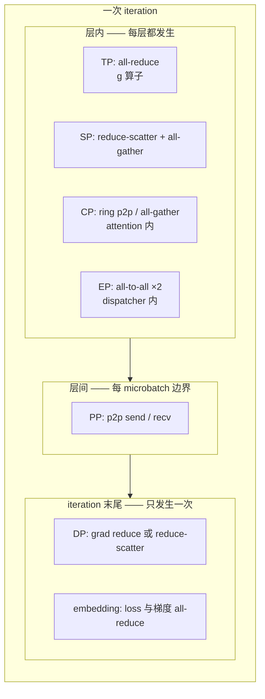

「互不重叠」这四个字是本文很多结论的根因。§9 会展开为什么它使得「单进程持多组」这件事完全不需要仲裁机制，§10 会展开通信与计算如何在每一档内部再叠加重叠。

---

## 2. 两层初始化：torch 的默认组与 Megatron 的子组

通信初始化分两层，调用点都在 `megatron/training/initialize.py` 的 `_initialize_distributed()`（L271–L412）里。

### 2.1 第一层：torch 的默认通信域

L341–L358：

```python
init_process_group_kwargs = {
    'backend': args.distributed_backend,
    'store': store,
    'world_size': args.world_size,
    'rank': args.rank,
    'timeout': timedelta(minutes=args.distributed_timeout_minutes),
}
if args.fake_process_group:
    assert is_torch_min_version("2.3.0")
    from torch.testing._internal.distributed.fake_pg import FakeStore
    store = FakeStore()
    init_process_group_kwargs['backend'] = 'fake'
    init_process_group_kwargs['store'] = store

torch.distributed.init_process_group(**init_process_group_kwargs)
```

这一层全局只做一次，建出来的是默认进程组（world group），覆盖全部 rank。它是所有子组的母体——`torch.distributed.new_group` 必须在它之后调用。

`_initialize_distributed` 的开头 L277–L281 做了一次幂等保护：若 `torch.distributed.is_initialized()` 已经为真，就直接读回 `rank` 与 `world_size` 并跳过整段。这让「外部已经初始化好分布式、再进Megatron」这种用法可行。

L288 是另一个容易被忽略的细节：

```python
if device_count > 0:
    torch.cuda.set_device(args.local_rank)
```

每个进程在这里绑定自己的 GPU。这一行是「一个 rank 一个进程」这件事在代码里的落点。

### 2.2 第二层：Megatron 的全部子组

L364–L400：

```python
if device_count > 0 and not skip_model_parallel_init:
    if mpu.model_parallel_is_initialized():
        print("model parallel is already initialized")
    else:
        if args.gtp_weight_remat_size > 1 or args.expert_gtp_weight_remat_size > 1:
            from megatron.core.tensor_parallel.gtp_api import HAVE_GTP
            assert HAVE_GTP, (
                "GTP requires TransformerEngine >= 2.19. ..."
            )
        mpu.initialize_model_parallel(
            args.tensor_model_parallel_size,
            args.pipeline_model_parallel_size,
            args.virtual_pipeline_model_parallel_size,
            pipeline_model_parallel_comm_backend=args.pipeline_model_parallel_comm_backend,
            use_sharp=args.use_sharp,
            gtp_remat_size=args.gtp_weight_remat_size,
            expert_gtp_remat_size=args.expert_gtp_weight_remat_size,
            context_parallel_size=args.context_parallel_size,
            hierarchical_context_parallel_sizes=args.hierarchical_context_parallel_sizes,
            hybrid_context_parallel=args.hybrid_context_parallel,
            expert_model_parallel_size=args.expert_model_parallel_size,
            num_distributed_optimizer_instances=args.num_distributed_optimizer_instances,
            expert_tensor_parallel_size=args.expert_tensor_parallel_size,
            distributed_timeout_minutes=args.distributed_timeout_minutes,
            nccl_communicator_config_path=args.nccl_communicator_config_path,
            order='tp-cp-ep-dp-pp' if not args.use_tp_pp_dp_mapping else 'tp-cp-ep-pp-dp',
            get_embedding_ranks=get_embedding_ranks,
            get_position_embedding_ranks=get_position_embedding_ranks,
            create_gloo_process_groups=args.use_gloo_process_groups,
            high_priority_stream_groups=args.high_priority_stream_groups,
            sharp_enabled_group=args.sharp_enabled_group,
        )
```

关于这个函数有三个要点，后面都会用到：

**第一，`order` 是唯一决定网格形状的实参**（L394）。默认 `'tp-cp-ep-dp-pp'`，开了 `--use-tp-pp-dp-mapping` 则换成 `'tp-cp-ep-pp-dp'`。§5 会说明这个字符串如何被拆成 `RankGenerator` 的六个轴。

**第二，是 eager 建立而不是 lazy 建立。** `initialize_model_parallel` 返回时，全部进程组已经建完。后续所有 getter 只做校验，不做创建。这个选择让「初始化」的边界非常清晰：`initialize_megatron` 返回后进程组状态不再变化。代价是即使某个并行维度 size 为 1，对应的单元素组也会被建出来（见 §5.3 的 order 归一化）。

**第三，GTP 相关轴会额外断言依赖。** L368–L375 检查 `HAVE_GTP`——泛化张量并行需要较新的 TransformerEngine，这与 §10.3 的 stream 流派有关。

### 2.3 两层的分工

| |第一层（torch） | 第二层（Megatron） |
| --- | --- | --- |
| 调用 | `init_process_group` L358 | `initialize_model_parallel` L376 |
| 次数 | 全局一次 | 全局一次 |
| 产物 | 默认组 / world group | 全部子组 |
| 实现位置 | `torch.distributed` | `megatron/core/parallel_state.py` L601–L1583 |
| 幂等保护 | L277–L281 `is_initialized()` | L365 `model_parallel_is_initialized()` |

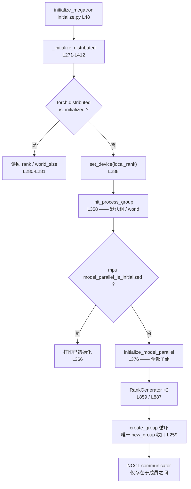

---

## 3. 状态载体：59 个模块级全局变量

`parallel_state.py` L29–L159 是全部并行状态的存放处。这段区间内共 **59** 个模块级赋值，分三类：

| 类别 | 数量 | 例子 | 作用 |
| --- | --- | --- | --- |
| 进程组句柄 | 39 | `_TENSOR_MODEL_PARALLEL_GROUP` | `ProcessGroup` 对象本身 |
| rank 列表 | 10 | `_TENSOR_MODEL_PARALLEL_GLOBAL_RANKS` | 该组的 global rank 列表 |
| 记账量 | 10 | `_MPU_TENSOR_MODEL_PARALLEL_WORLD_SIZE` | 各轴 world size 与本 rank 组内编号 |

「三类严格配对」这件事本身就是设计上的核心约束：几乎每个组句柄都有一个同名的 `_GLOBAL_RANKS` 与之对应。理由在 §8.3 会具体用到——句柄用于发通信，rank 列表用于回答「我在这个组里是第几个」「这个组一共有几张卡」，二者的使用场景不同。

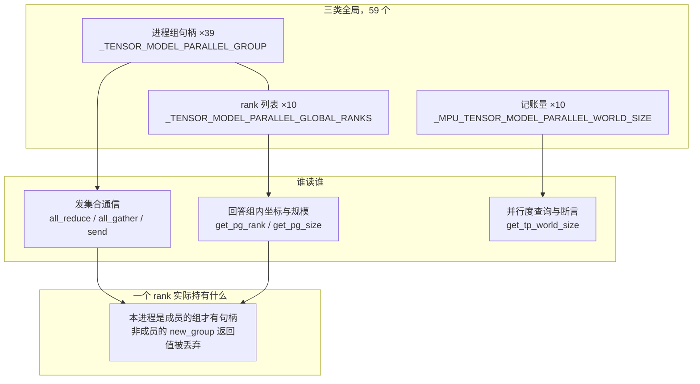

举例，TP 组的一对（L29 与 L113）：

```python
_TENSOR_MODEL_PARALLEL_GROUP = None        # L29
...
_TENSOR_MODEL_PARALLEL_GLOBAL_RANKS = None # L113
```

### 3.1 没有对象，也就没有生命周期

这套设计最直接的后果是：**没有 RAII，没有注册表，没有「谁拥有这个组」的概念**。

「是否已初始化」的判据就是某个全局是否为 `None`（L1681–L1683）：

```python
def is_initialized():
    """Useful for code segments that may be accessed with or without mpu initialization"""
    return _DATA_PARALLEL_GROUP is not None
```

而 `model_parallel_is_initialized()` L1686–L1694 检查三个组同时非空：

```python
def model_parallel_is_initialized():
    """Check if model- and data-parallel groups are initialized."""
    if (
        _TENSOR_MODEL_PARALLEL_GROUP is None
        or _PIPELINE_MODEL_PARALLEL_GROUP is None
        or _DATA_PARALLEL_GROUP is None
    ):
        return False
    return True
```

「析构」 correspondingly 也是极简的。`destroy_model_parallel()` L2506–L2692 有 187 行，但绝大部分是 `global` 声明加置 `None`；开头唯一有内容的部分是先释放 NCCL EP 上下文：

```python
def destroy_model_parallel():
    """Set the groups to none."""
    # Release the NCCL EP context (if the 'ncclep' flex dispatcher bootstrapped one) before the
    # process group's communicator is torn down. TE registers an atexit ep_finalize that would
    # otherwise run after dist.destroy_process_group() and hit a "corrupted comm object" at exit.
    # Idempotent and a no-op when NCCL EP was never bootstrapped.
    try:
        from megatron.core.transformer.moe.fused_a2a import nccl_ep_finalize
        nccl_ep_finalize()
    except Exception:  # finalize must never block teardown
        pass
```

这段注释值得留意：它处理的是「进程退出时 TE 注册的 `atexit` 回调晚于 `destroy_process_group()` 执行，导致访问已销毁的 comm 对象」的问题。这是从进程组无对象化设计里漏出来的一个真实边角——**因为没有对象持有资源，就只能在退出顺序上打补丁**。

### 3.2 getter 的内联断言

50余个 `get_*_group` getter 共享同一个模式：`check_initialized` 布尔开关 + 内联 `assert`。以 TP 组为例（L1704–L1710）：

```python
def get_tensor_model_parallel_group(check_initialized=True):
    """Get the tensor-model-parallel group the caller rank belongs to."""
    if check_initialized:
        assert (
            _TENSOR_MODEL_PARALLEL_GROUP is not None
        ), "tensor model parallel group is not initialized"
    return _TENSOR_MODEL_PARALLEL_GROUP
```

`check_initialized=False` 的存在是为了那些「可能在未初始化时也被访问」的代码路径。与之配套的是一组 `get_*_world_size()` / `get_*_rank()` 函数，它们只读 `_MPU_*` 记账量，不要求组已建立。

至此可以给出这一层的结论：**eager 建立 + lazy 校验**。组在 `initialize_model_parallel` 返回时全部就位，之后每次取组只是一次判空。

---

## 4. `create_group`：唯一的 `new_group` 收口

全仓库所有 `torch.distributed.new_group` 调用都收敛在一个函数里——`create_group()` L232–L266：

```python
def create_group(
    ranks=None,
    timeout=None,
    backend=None,
    pg_options=None,
    use_local_synchronization=False,
    group_desc=None,
):
    """Creates a ProcessGroup."""
    kwargs = {
        "ranks": ranks,
        "timeout": timeout,
        "backend": backend,
        "pg_options": pg_options,
        "use_local_synchronization": use_local_synchronization,
        "group_desc": group_desc,
    }
    if not is_torch_min_version("2.4.0"):
        kwargs.pop("group_desc")
        if timeout is None:
            # Old version (e.g. v2.1.2) sets default_pg_timeout as default value to timeout
            # in function signature, then check tiemout value type.
            # New version sets None as default value to timeout in function signature. If value
            # is None, torch will give value according to the backend, then check type.
            # So need to unset timeout here if caller doesn't set value. Otherwise there is
            # type error.
            kwargs.pop("timeout")
    group = torch.distributed.new_group(**kwargs)
    global _global_process_group_list
    if _global_process_group_list is None:
        # None stands for the default process group
        _global_process_group_list = [None]
    if torch.distributed.get_rank() in ranks:
        _global_process_group_list.append(group)
    return group
```

它做了三件事。

### 4.1 版本兼容

`is_torch_min_version("2.4.0")` 为假时，`group_desc` 参数不存在，必须摘掉；`timeout=None` 的语义在 2.4 也变过——旧版本在函数签名里用 `default_pg_timeout` 作默认值，新版本改成 `None`，所以旧版本还要额外把 `timeout` 摘掉以免类型检查报错。这类兼容代码通常是最容易随torch 版本失效的部分，收在一个函数里比散落在上百个调用点要好。

### 4.2 建组

L259 一行 `torch.distributed.new_group(**kwargs)`，所有组都在这里产生。§7 会展开这一行的集合语义。

### 4.3 进程组台账

L260–L265 维护 `_global_process_group_list`（L165 声明）：

```python
_global_process_group_list = None
```

这个列表的语义有两层：

- **首位 `None` 代表默认进程组**（world group）。默认组不是通过 `new_group` 建的，所以没法拿到对象，只能用 `None` 占位。
- **只有本 rank 是成员的组才被登记**。所以这个列表天然是「本进程有能力修改的组」的集合。

它唯一的用途是 `update_pg_timeout()`（L203–L229）批量改超时：

```python
def update_pg_timeout(
    timeout: timedelta, pg: Optional[torch._C._distributed_c10d.ProcessGroup] = None
):
    """Update the timeout for all process groups or a specific process group.
       Synchronize the process groups before updating the timeout.
    """
    if hasattr(torch.distributed.distributed_c10d, "_set_pg_timeout"):
        torch.distributed.barrier(pg)
        torch.cuda.synchronize()
        try:
            if pg is None:
                global _global_process_group_list
                for group in _global_process_group_list:
                    torch.distributed.distributed_c10d._set_pg_timeout(timeout, group)
            else:
                torch.distributed.distributed_c10d._set_pg_timeout(timeout, pg)
```

改超时需要先 `barrier` 再 `torch.cuda.synchronize()`，因为所有 rank 必须一起换，否则先换的 rank 会因为等待旧通信而超时。

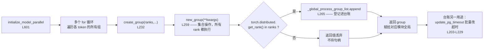

### 4.4 顺带一提：NCCL 层是per-group 配置

组句柄之外，`create_group` 还会通过 `pg_options` 传一个 per-group 的 NCCL 配置。构造函数在 `get_nccl_options()`（L168–L200）：

```python
nccl_options = torch.distributed.ProcessGroupNCCL.Options(
    is_high_priority_stream=nccl_comm_cfgs[pg_name].get("is_high_priority_stream", False)
)
if "cga_cluster_size" in nccl_comm_cfgs[pg_name]:
    nccl_options.config.cga_cluster_size = nccl_comm_cfgs[pg_name]["cga_cluster_size"]
if "max_ctas" in nccl_comm_cfgs[pg_name]:
    nccl_options.config.max_ctas = nccl_comm_cfgs[pg_name]["max_ctas"]
...
```

也就是说 TP 组和 PP 组可以有各自的 `cga_cluster_size`、`max_ctas`、`min_ctas`、`net_name`，以及是否走 `is_high_priority_stream`。配置来源是 `--nccl-communicator-config-path` 指定的文件。函数开头注释给了 Hopper 的默认值参考（`cga_cluster_size=4`、`max_ctas=32`、`min_ctas=1`），并提醒不同 GPU 世代与 NCCL 版本的默认值不同。

---

## 5. `RankGenerator`：`order` 字符串与网格切分

### 5.1 六个轴与一个字符串

`RankGenerator`（L465–L557）是网格切分的全部逻辑。它的构造函数 L468–L517：

```python
def __init__(
    self,
    tp: int,
    ep: int,
    dp: int,
    pp: int,
    cp: int,
    order: str,
    rank_offset: int = 0,
    gtp_remat: int = 1,
) -> None:
    assert (
        ep == 1 or cp == 1
    ), "Both EP and CP > 1 in not allow in one rank generator. \
        CP is only included in default RankGenerator, and EP only in expert RankGenerator."

    self.tp = tp
    ...
    self.world_size = tp * dp * pp * cp * ep * gtp_remat
```

**第一个约束在断言里**：`ep == 1 or cp == 1`。上下文并行与专家并行不能同时大于 1，所以一个 `RankGenerator` 实例里，要么 EP 轴是平凡的，要么 CP 轴是平凡的。§5.4 会看到这直接导致 dense 与 expert 各用一个实例。

`world_size` 是六个轴的乘积（L491），其中 `gtp_remat` 是 GTP 的权重重 materialization 轴，默认为 1，即不切分。

### 5.2 `order` 归一化

L502–L517：

```python
self.order = order
order = order.lower()

for name in self.name_to_size.keys():
    if name not in order and self.name_to_size[name] != 1:
        raise RuntimeError(
            f"The size of ({name}) is ({self.name_to_size[name]}), but you haven't"
            f"specified the order ({self.order})."
        )
    elif name not in order:
        order = order + "-" + name

self.order = order
self.ordered_size = []

for token in order.split("-"):
    self.ordered_size.append(self.name_to_size[token])
```

两条规则：

- **size 不为 1 的轴必须出现在 `order` 里**，否则 `RuntimeError`。这是硬校验。
- **size 等于 1 的轴自动追加**到 `order` 末尾。

以 §1 的1024 卡配置为例，`order='tp-cp-ep-dp-pp'`、`ep=1`、`gtp_remat=1`，归一化后是

```
tp-cp-ep-dp-pp-gtp_remat
```

对应的 `ordered_size` 是 `[8, 2, 1, 16, 4, 1]`。归一化的意义在于：无论调用方是否显式写了那些size 为 1 的轴，最终的 `order` 字符串形式是唯一的。§7 会说明这个唯一性为什么是「同序创建」的前提。

### 5.3 取组：`get_mask` + `get_ranks`

`get_ranks(token)`（L534–L550）接受形如 `'tp'`、`'tp-dp'` 的 token（多个轴用连字符分隔）：

```python
def get_ranks(self, token):
    """Get rank group by input token.
    ...
    """
    mask = self.get_mask(self.order, token)
    ranks = generate_masked_orthogonal_rank_groups(self.world_size, self.ordered_size, mask)
    if self.rank_offset > 0:
        for rank_group in ranks:
            for i in range(len(rank_group)):
                rank_group[i] += self.rank_offset
    return ranks
```

`get_mask`（L519–L532）把 token 翻译成布尔向量，位置对齐 `order` 里的每个轴：

```python
def get_mask(self, order: str, token: str):
    ordered_token = order.split("-")
    token_list = token.split("-")
    mask = [False] * len(ordered_token)
    for t in token_list:
        mask[ordered_token.index(t)] = True
    return mask
```

于是 `'tp'` 得到 `[True, False, False, False, False, False]`，`'tp-dp'` 得到 `[True, False, False, True, False, False]`。掩码的语义在 §6 展开。

`rank_offset` 的存在是为了支持子进程组——比如在已经划出一片 rank 之后，在其内部再起一套并行的网格。

`get_gtp_ranks`（L552–L557）是 GTP 专用入口，返回 `gtp_remat` 轴对应的组，并断言请求的 size 与构造时一致。

### 5.4 两套网格：dense 与 expert

因为 `ep == 1 or cp == 1` 的约束，`initialize_model_parallel` 里建了两个独立实例。dense 网格（L857–L868）：

```python
decoder_order = _inject_gtp_remat_axis(order, after="tp")

decoder_rank_generator = RankGenerator(
    tp=tensor_model_parallel_size,
    ep=1,
    dp=data_parallel_size,
    pp=pipeline_model_parallel_size,
    cp=context_parallel_size,
    order=decoder_order,
    rank_offset=rank_offset,
    gtp_remat=gtp_remat_size,
)
```

expert 网格（L886–L896）：

```python
expert_order = _inject_gtp_remat_axis(order, after="ep")
expert_decoder_rank_generator = RankGenerator(
    tp=expert_tensor_parallel_size,
    ep=expert_model_parallel_size,
    dp=expert_data_parallel_size,
    pp=pipeline_model_parallel_size,
    cp=1,
    order=expert_order,
    rank_offset=rank_offset,
    gtp_remat=expert_gtp_remat_size,
)
```

两者的差别不只是把 `ep` 和 `cp` 对调。expert 网格的 `dp` 是**单独算出来的**（L880）：

```python
expert_data_parallel_size = world_size // expert_tensor_model_pipeline_parallel_size
if world_size % expert_tensor_model_pipeline_parallel_size != 0:
    raise RuntimeError(...)
```

也就是说 expert 的 DP size 由 world_size 与 expert 侧的乘积反推，而不是沿用 dense 的 DP。§[02 篇](/2026/10/08/megatron-02-expert-parallel/) 展开过这个设计的含义：EP 不是加在dense 网格上的一根新轴，而是把 dense 网格里的 DP 维度重新解释成 EP。

两套网格必须给出一致的 PP 组，否则同一条流水通信会被切成两种形状。L898–L906 用两个断言把这件事钉住：

```python
assert (
    order.endswith("pp")
    or pipeline_model_parallel_size == 1
    or expert_data_parallel_size == data_parallel_size
), "When not using pp-last rank ordering, the data parallel size of the attention and moe layers must be the same"

assert decoder_rank_generator.get_ranks("pp") == expert_decoder_rank_generator.get_ranks(
    "pp"
), f"Pipeline parallel groups are expected to be the same for Non-Expert and Expert part, ..."
```

第二个断言是两套网格的唯一一致性约束，而它成立的前提正是 §6 那套纯函数的确定性。

### 5.5 GTP 轴的注入位置

`_inject_gtp_remat_axis`（L582–L597）值得单独看，因为它把一个性能考量写进了字符串处理：

```python
def _inject_gtp_remat_axis(order_str: str, after: str = "tp") -> str:
    """Inject the 'gtp_remat' axis into a RankGenerator order string for NCCL locality.

    Position controls locality (leftmost token = smallest stride = most adjacent ranks):
      - dense/decoder: inject after 'tp' -> 'tp-gtp_remat-cp-ep-dp-pp' (GTP_remat local).
      - expert: inject after 'ep' -> 'tp-cp-ep-gtp_remat-dp-pp' so EP keeps more-local placement
        than EGTP (the MoE EP all-to-all is the heavier expert-side collective).
    When gtp_remat/egtp_remat size is 1 the injected axis is a no-op (singleton groups).
    """
    toks = order_str.split("-")
    if "gtp_remat" in toks:
        return order_str
    anchor = after if after in toks else "tp"
    pos = (toks.index(anchor) + 1) if anchor in toks else 0
    toks.insert(pos, "gtp_remat")
    return "-".join(toks)
```

**左端 = stride 最小 = rank 最相邻。** 这个位置约定是 §6 那套分解的直接推论：越靠左的轴，在 global rank 里权重越大、变化越慢，因而组内成员的 rank 号越接近。

于是注入位置的选择变成一个通信局部性的决策：

- dense 侧插到 `tp` 之后，让 GTP 的重 materialization 组尽量落在机内
- expert 侧插到 `ep` 之后，让 EP 保持比 EGTP 更靠左的位置——因为 MoE 的 all-to-all 是expert 侧更重的集合通信，应当优先获得更好的局部性

当 `gtp_remat` size 为 1 时，注入的是一个单元素轴，等价于 no-op。

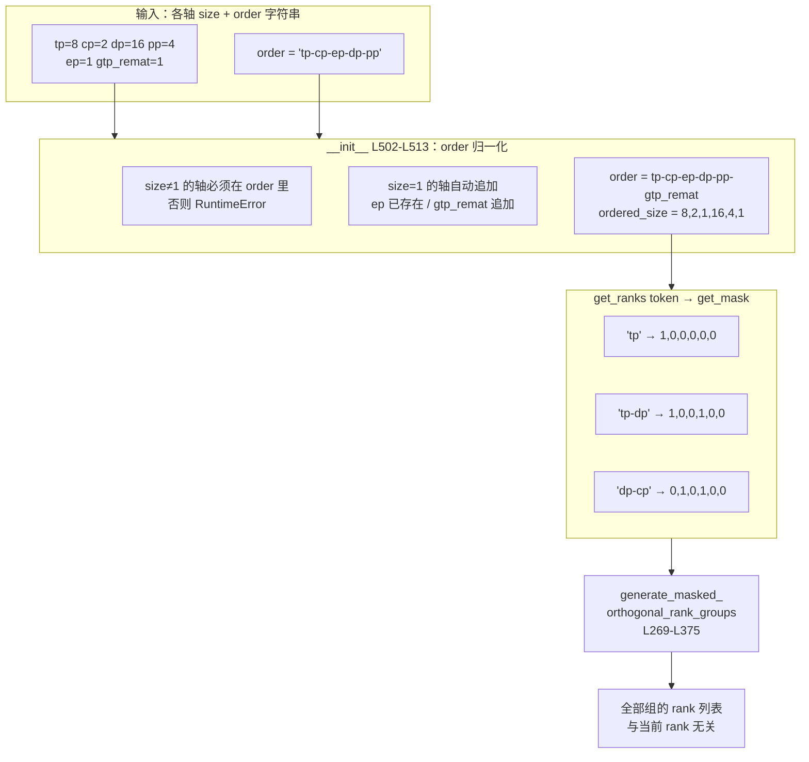

---

## 6. `generate_masked_orthogonal_rank_groups`：混合基数分解

这是网格切分的数学核心，L269–L375。它是一个**纯整数函数**：输入 `world_size`、各轴 size 列表、一个布尔掩码，输出若干个 rank 列表。不做任何通信，不读任何全局状态，不依赖当前 rank。

### 6.1 那条恒等式

函数的 docstring（L289–L307）把算法讲得很直接。下面是原文：

```text
Algorithm:
    For orthogonal parallelism, such as tp/dp/pp/cp, the global_rank and
    local_rank satisfy the following equation:
        global_rank = tp_rank + dp_rank * tp_size + pp_rank * tp_size * dp_size (1)
            tp_rank \in [0, tp_size)
            dp_rank \in [0, dp_size)
            pp_rank \in [0, pp_size)

    If we want to get the `dp_group` (tp_size * pp_size groups of dp_size ranks each.
    For example,  if the gpu size is 8 and order is 'tp-pp-dp', size is '2-2-2', and the
    dp_group here is [[0, 4], [1, 5], [2, 6], [3, 7]].)
    The tp_rank and pp_rank will be combined to form the `dp_group_index`.
        dp_group_index = tp_rank + pp_rank * tp_size (2)
```

式(1) 是全篇的枢纽。`order` 字符串的作用在这里变得明确：**它就是式(1) 里各项的排列顺序**。`'tp-pp-dp'` 给出 `tp + pp*tp_size + dp*tp_size*pp_size`，`'tp-dp-pp'` 给出 `tp + dp*tp_size + pp*tp_size*dp_size`。一般地，把 `order` 记为 $$c_1, c_2, \ldots, c_k$$，各轴 size 记为 $$S_1, S_2, \ldots, S_k$$，则 $$r_{\text{global}} = \sum_{i=1}^{k} r_{c_i} \prod_{j < i} S_{c_j}$$。

这是一个标准的**混合基数（mixed-radix）分解**：`order` 决定位序，$$S$$ 决定每位基数。

把 §1 那套 1024 卡配置代进去，位序阶梯是：

| 轴（`order` 里的位置） | size | stride | 取值范围 |
| --- | --- | --- | --- |
| `tp` | 8 | 1 | 0–7 |
| `cp` | 2 | 8 | 0–1 |
| `ep` | 1 | 16 | 恒为 0 |
| `dp` | 16 | 16 | 0–15 |
| `pp` | 4 | 256 | 0–3 |
| `gtp_remat` | 1 | 1024 | 恒为 0 |

于是 $$r_{\text{global}} = r_{\text{tp}} + 8\,r_{\text{cp}} + 16\,r_{\text{dp}} + 256\,r_{\text{pp}}$$。size 为 1 的轴不贡献任何变化，但它仍然占一个位次——这正是 `order` 归一化要保留它们的原因：位次一旦移动，后面所有轴的 stride 都会变。

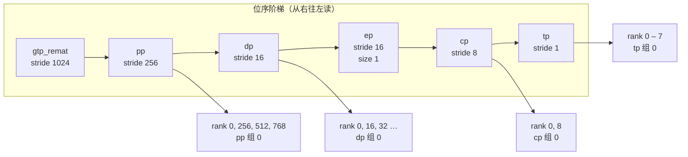

越靠左的轴 stride 越小，组内成员的 rank 号越紧凑——这就是 §5.5 里「左端 = 最相邻」的字面含义。

### 6.2 掩码的语义

掩码区分两类轴：

- `mask[i] == True`：这一轴**在组内变化**——它的坐标是组内成员的区分依据
- `mask[i] == False`：这一轴**决定组编号**——它的坐标在整个 world 里张成组之间的区分

于是组大小是 `True` 位置的轴 size 之积，组数是 `world_size // 组大小`。docstring 里给的算例（L309–L319）是 `parallel_size = [tp_size, dp_size, pp_size] = [2, 3, 4]`、`mask = [False, True, False]`：

```text
    dp_group_index(0) = tp_rank(0) + pp_rank(0) * 2
    dp_group_index(1) = tp_rank(1) + pp_rank(0) * 2
    ...
    dp_group_index(7) = tp_rank(1) + pp_rank(3) * 2

    dp_group[0] = 0 + range(0, 3) * 2 + 0 = [0, 2, 4]
    dp_group[1] = 1 + range(0, 3) * 2 + 0 = [1, 3, 5]
    ...
    dp_group[7] = 1 + range(0, 3) * 2 + 3 * 2 * 3 = [19, 21, 23]
```

掩码为 `False` 的轴（此处是 `tp` 与 `pp`）合成组编号，为 `True` 的轴（此处是 `dp`）在组内遍历。`dp_group_index` 的构造正是式(2)——把两个被掩掉的轴的坐标按 `order` 加权。

### 6.3 实现：商余分解与回加权

函数体（L322–L375）是上面数学的直接编码。两个内部辅助函数：

`prefix_product`（L322–L327）算出累积乘积作为 stride：

```python
def prefix_product(a: List[int], init=1) -> List[int]:
    r = [init]
    for v in a:
        init = init * v
        r.append(init)
    return r
```

`inner_product`（L329–L330）是逐项相乘求和：

```python
def inner_product(a: List[int], b: List[int]) -> int:
    return sum([x * y for x, y in zip(a, b)])
```

`decompose`（L332–L350）是核心——给定一个整数 index 与 shape，返回它的各位坐标：

```python
def decompose(index, shape, stride=None):
    """
    This function solve the math problem below:
        There is an equation:
            index = sum(idx[i] * stride[i])
    And given the value of index, stride.
    Return the idx.
    This function will be used to get the pp/dp/pp_rank
    from group_index and rank_in_group.
    """
    if stride is None:
        stride = prefix_product(shape)
    idx = [(index // d) % s for s, d in zip(shape, stride)]
    # stride is a prefix_product result. And the value of stride[-1]
    # is not used.
    assert (
        sum([x * y for x, y in zip(idx, stride[:-1])]) == index
    ), "idx {} with shape {} mismatch the return idx {}".format(index, shape, idx)
    return idx
```

那句 `assert` 是这段代码里最有价值的一行：它把「分解正确」变成了运行时的显式检查，而不是靠注释保证。任何 stride 与 shape 不匹配的输入都会在这里炸掉，而不是静默产生错误的组。

主循环（L352–L375）：

```python
masked_shape = [s for s, m in zip(parallel_size, mask) if m]
unmasked_shape = [s for s, m in zip(parallel_size, mask) if not m]

global_stride = prefix_product(parallel_size)
masked_stride = [d for d, m in zip(global_stride, mask) if m]
unmasked_stride = [d for d, m in zip(global_stride, mask) if not m]

group_size = prefix_product(masked_shape)[-1]
num_of_group = world_size // group_size

ranks = []
for group_index in range(num_of_group):
    # get indices from unmaksed for group_index.
    decomposed_group_idx = decompose(group_index, unmasked_shape)
    rank = []
    for rank_in_group in range(group_size):
        # get indices from masked for rank_in_group.
        decomposed_rank_idx = decompose(rank_in_group, masked_shape)
        rank.append(
            inner_product(decomposed_rank_idx, masked_stride)
            + inner_product(decomposed_group_idx, unmasked_stride)
        )
    ranks.append(rank)
return ranks
```

读法是：外层循环给**组编号**（`unmasked` 部分固定），内层循环给**组内位置**（`masked` 部分遍历）。两者按各自的 stride 加权求和，相加就是一个 global rank。数学部分到此结束，剩下的都是记账。

### 6.4 算例

按 §1 的1024 卡配置，`order` 归一化后为 `tp-cp-ep-dp-pp-gtp_remat`，`ordered_size = [8, 2, 1, 16, 4, 1]`。取若干 token：

| token | 掩码 | 组数 | 组大小 | 首组 |
| --- | --- | --- | --- | --- |
| `tp` | `1,0,0,0,0,0` | 128 | 8 | 0–7 |
| `cp` | `0,1,0,0,0,0` | 512 | 2 | 0, 8 |
| `dp` | `0,0,0,1,0,0` | 64 | 16 | 0, 16, 32, … |
| `pp` | `0,0,0,0,1,0` | 256 | 4 | 0, 256, 512, 768 |
| `tp-cp` | `1,1,0,0,0,0` | 64 | 16 | 0–7 |
| `tp-dp` | `1,0,0,1,0,0` | 8 | 128 | 0–7 |
| `dp-cp` | `0,1,0,1,0,0` | 32 | 32 | 0, 8, 16, … |

「正交」这个词的含义在这里可以精确验证：任意 TP 组与任意 DP 组的交集恒为一个 rank。用 `world_size=64`、`order=tp-cp-ep-dp-pp`、各轴 `2-4-2-2-2` 枚举全部 TP 组与 DP 组，两两交集的大小集合只有 `{1}`。

这不是巧合，而是混合基数分解的直接后果：`mask` 为真的轴构成一个划分，`mask` 为假的轴构成另一个划分，两者在每个 rank 上给出唯一的一对坐标，所以每对坐标组合恰好对应一个 rank。

用一个更小的例子把「网格」这个词坐实。取 `world_size=16`、`order='tp-cp-dp-pp'`、四轴 size 均为 2，于是 $$r = r_{\text{tp}} + 2\,r_{\text{cp}} + 4\,r_{\text{dp}} + 8\,r_{\text{pp}}$$。把这个式子摊成二维就是整个 rank 布局：

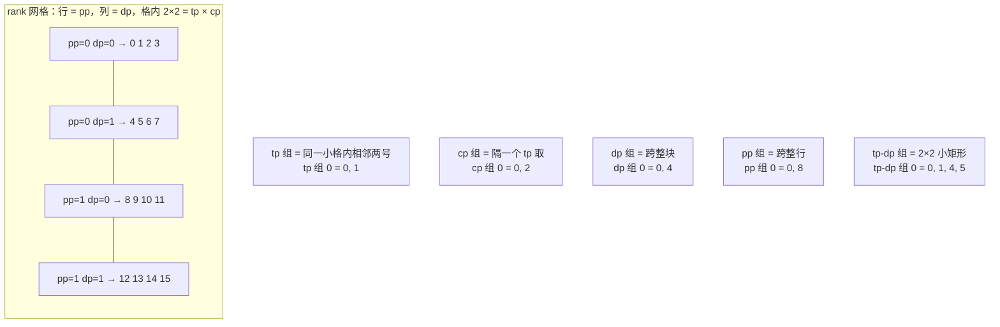

四种单轴组各 8 个，`tp-dp` 这类双轴组 4 个——组数总是 $$16 / \text{组大小}$$。任意 TP 组与任意 DP 组的交集恒为一个 rank，这就是「正交」这个名字的来源。

§5.5 那条「左端 = stride 最小 = rank 最相邻」的注释，说的也是同一件事：`tp` 在 `tp-cp-…` 里排第一位，`tp_size = 2`，所以 TP 组是 0,1；`cp` 排第二位，`cp_size = 4`，stride 为 2，所以 CP 组是 0,2,4,6。TP 组的成员挤在连续号段里，CP 组跨越更长的距离。

---

## 7. 同序创建：为什么「相同的 PG」互不影响

§4 留了一个没展开的问题：所有 rank 都执行同一句 `create_group(ranks, ...)`，建的是「同一个」组，为什么不会互相污染？

### 7.1 一个 rank 是一个进程

先确认前提。`torchrun` 起 $$N$$ 个独立进程，每个进程一个 `LOCAL_RANK`。`initialize.py` L287–L289：

```python
if device_count > 0:
    torch.cuda.set_device(args.local_rank)
    device_id = torch.device(f'cuda:{args.local_rank}')
else:
    device_id = None
```

每进程各自持有独立的 CUDA context、显存地址空间、Python 解释器状态，以及**自己那一份 `parallel_state` 的模块级全局变量**。`_TENSOR_MODEL_PARALLEL_GROUP` 在 rank 0 与 rank 1 里是两个毫不相干的 Python 对象，只是恰好指向同一组物理 rank。

这一点很重要：模块级全局变量**不是**跨进程共享的存储，「所有 rank 都有这个变量」的含义是「每个进程都有一份同名的、装着各自组句柄的变量」。

### 7.2 `new_group` 是集合操作

`torch.distributed.new_group(ranks)` 的语义是：它必须在**默认组覆盖的全部进程上**被调用，调用顺序与参数必须完全一致。它的内部过程包含一次 rendezvous——所有参与的 rank 交换信息、协商出一个编号，然后各自建立本地对象。

因此：

- 第 $$k$$ 次 `new_group` 调用在所有 rank 上必须配对成**同一组**。顺序一旦错位，第 $$k$$ 次在 rank A 上和 rank B 上协商出的是不同组成的两组，communicator错配，表现为挂死或静默算错。
- 非成员 rank 也会走完整个 rendezvous（否则后续所有调用的序号就错位了），但它拿到的对象不属于任何建立起来的 communicator，在其上做集合通信是无效的。

### 7.3 两层隔离

Megatron 用两件事把上述语义收拾干净。第一层是 `create_group` 里的台账过滤（L264–L265），第二层在每个建组循环的成员判断里。以 TP 组为例（L1164–L1173）：

```python
for ranks in decoder_rank_generator.get_ranks('tp'):
    group = create_group(
        ranks,
        timeout=timeout,
        pg_options=get_nccl_options("tp", nccl_comm_cfgs),
        group_desc="TENSOR_MODEL_PARALLEL_GROUP",
    )
    if rank in ranks:
        _TENSOR_MODEL_PARALLEL_GROUP = group
        _TENSOR_MODEL_PARALLEL_GLOBAL_RANKS = ranks
```

读法：

- `create_group` 被**所有** rank 执行，对每个候选组都走一次 `new_group`
- 返回值只在 `rank in ranks` 时被赋给模块全局，其余 rank 直接丢弃（L1171–L1173）
- 于是「本进程持有哪些句柄」这件事由组成员关系决定，不需要额外登记

于是隔离分成两层：**构建期**非成员不持有句柄；**运行期**物理链路只在成员之间建立。

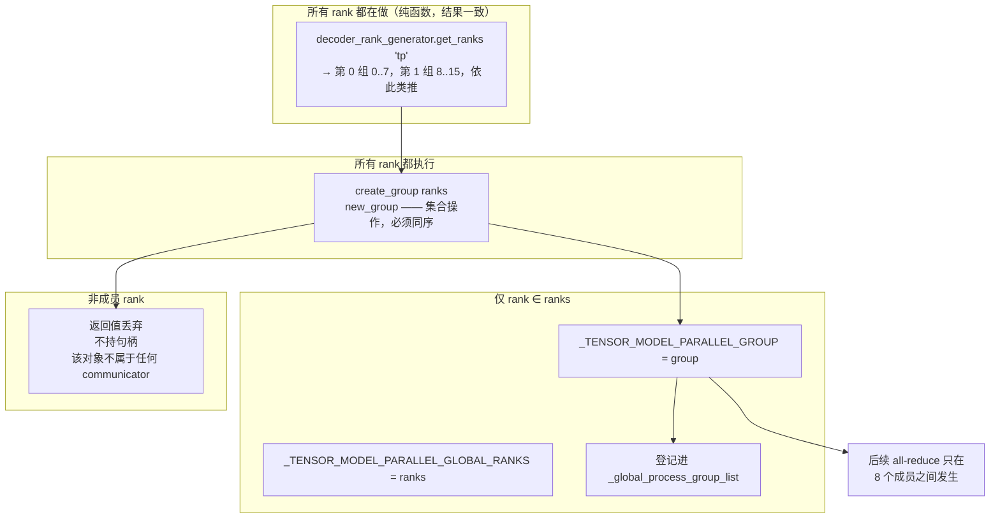

### 7.4 于是那几条「洁癖」全是刚需

回到 §5 与 §4，现在可以给它们一个统一的解释。**只要 `order` 字符串或组的遍历顺序在不同 rank 上有任何差异，`new_group` 的调用序列就错位了**。以下几处都是为了防止这件事：

| 代码 | 防的是什么 |
| --- | --- |
| `order` 归一化 L504–L511 | `order` 字符串在不同 rank 上形态不同，导致后续轴的 stride 不同 |
| size 为 1 的轴自动追加 L510–L511 | 遗漏的轴在不同 rank 上补入的位置不一致 |
| `generate_masked_orthogonal_rank_groups` 不读任何全局 | 组的内容依赖当前 rank |
| `decompose` 里的 `assert` L347–L349 | 分解出错时立刻炸掉，而不是产生错位的组 |
| dense / expert PP 组一致性断言 L904–L906 | 两套网格给出不同的 PP 组，同一条流水通信被切成两种形状 |

其中第一条还有一个副作用值得注意：**归一化保证了 `ordered_size` 与 `order` 严格对应**，所以 `_inject_gtp_remat_axis` 可以纯粹按字符串插入位置——它不需要知道任何全局状态，插入结果只取决于传入的 `order` 字符串。

---

## 8. 组的选择：三层机制与组内坐标

§7 解决了「组怎么建」，接下来是「一次 `all_reduce` 到底该发给哪个组」。答案是：**没有人「选择」，组在建模块的时候就被钉死了**。

### 8.1 第一层：构造时显式注入

`ColumnParallelLinear.__init__` 接受 `tp_group` 形参，并保存到 `self.tp_group`：

```python
tp_group: Optional[torch.distributed.ProcessGroup] = None,
...
self.tp_group = tp_group
if self.tp_group is None:
    self.tp_group = get_tensor_model_parallel_group_if_none(self.tp_group)
```

`get_tensor_model_parallel_group_if_none` 在 `megatron/core/utils.py` L607–L633，语义就是「非`None` 就用传入值，为 `None` 才回落到全局查询」。

**为什么必须显式注入而不是全局查询？** 因为 MoE 里 dense 层用 `tp` 组、expert 层用 `expt_tp` 组，两者是**同一个类**。组的身份是模块的状态，不是全局的单一事实。这与 §3.1「全局变量只是各进程的私有副本」是一致的——多进程场景下「当前模块属于哪个组」这种信息必须随模块一起流动。

### 8.2 第二层：forward 只经过 `self.tp_group`

`layers.py` 里 `ColumnParallelLinear` 的 forward（L368–L376 附近）：

```python
output_parallel = copy_to_tensor_model_parallel_region(input_, self.tp_group, self.config)
...
output = reduce_from_tensor_model_parallel_region(output_parallel, group=self.tp_group)
```

注意计算图里**没有任何一处** `get_tensor_model_parallel_group()` 调用。`self.tp_group` 从构造一路带到 forward。

### 8.3 第三层：组存进 `ctx`，反向自动同组

这是整套机制里最关键、也最容易漏掉的一环。`LinearWithGradAccumulationAndAsyncCommunication.forward` 把 `tp_group` 收进 `ctx`（L612）：

```python
ctx.tp_group = tp_group
```

backward 取回来用（L648 附近、L689）：

```python
tp_group = ctx.tp_group
...
handle = torch.distributed.all_reduce(grad_input, group=tp_group, async_op=True)
```

于是**反向传播自动拿到与前向同一个组对象**，不需要重新查询、不需要额外传参、也不可能选错。

《分布式训练（03）》讲的 $$f$$ / $$g$$ 算子对，在这里落地成两个函数（`mappings.py` L492–L501）：

```python
def copy_to_tensor_model_parallel_region(input_, group, config):
    ...

def reduce_from_tensor_model_parallel_region(input_, group):
    ...
```

两者共用同一个 `group` 对象——`f` 的反向是 `g` 的正向，而两者的组必须是同一个。这个「同一个」由 `ctx` 保证，而不是由调用点自觉。

Megatron 论文的 Figure 5 给出了这对算子的规范画法，措辞与这里的实现一一对应：$$f$$ 在前向是恒等算子、在反向是 all-reduce，$$g$$ 反之；两者互为共轭（conjugate）。

### 8.4 组内坐标：`get_pg_rank` 与 `get_pg_size`

`utils.py` L650–L661：

```python
def get_pg_rank(group=None):
    """Get rank for a distributed group.
    ...
    Returns:
        int: Rank (0 if distributed not initialized or group is None, else group.rank())
    """
    if not torch.distributed.is_initialized() or group is None:
        return 0
    return group.rank()
```

两个要点：

1. 返回的是**组内 rank**（$$0 \ldots \text{size}-1$$），不是 global rank
2. `group is None` 或分布式未初始化时返回 **0**

对照 `torch.distributed.get_rank(group)`——后者对非成员返回 **-1**。这个抽象的价值在于**让「单卡」与「组只有我一个」走同一条代码路径**。`mappings.py` L40–L57 里挑自己那一片的写法就依赖它：

```python
def _split_along_last_dim(input_, group):
    """Split the tensor along its last dimension and keep the
    corresponding slice."""
    assert group is not None, "group should not be None"

    world_size = group.size()
    # Bypass the function if we are using only 1 GPU.
    if world_size == 1:
        return input_

    input_list = split_tensor_along_last_dim(input_, world_size)

    # Note: torch.split does not create contiguous tensors by default.
    rank = group.rank()
    output = input_list[rank].contiguous()

    return output
```

同一个抽象也用在参数更新上。`layers.py` L95–L110 的 `param_is_not_tensor_parallel_duplicate` 用 `tp_group.rank() == 0` 判断当前 rank 是否负责这个参数在 TP 组内的更新。

### 8.5 `size == 1` 短路是纪律

`mappings.py` 里每个集合通信辅助函数开头都有同一个短路（L27、L47、L89……）：

```python
# Bypass the function if we are using only 1 GPU.
if group.size() == 1:
    return input_
```

`layers.py` 里则是 `if self.tp_group.size() > 1:`。单元素组上的集合通信在数学上是 no-op，但仍然要走一次 kernel launch 与一次 stream 同步。**短路必须显式写**，因为它依赖的是组大小，而组大小是运行时才知道的。

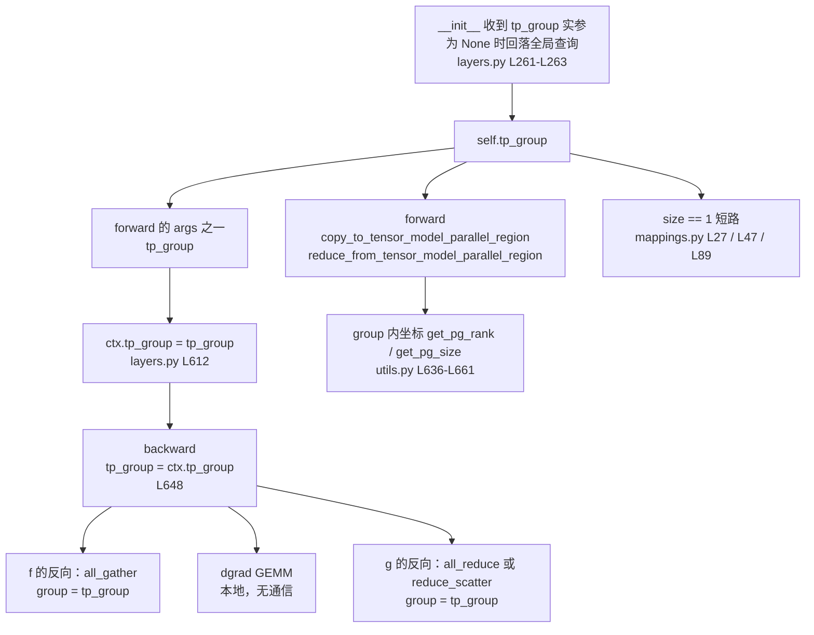

---

## 9. 哪些同步、哪些各自算：三个时间尺度

### 9.1 判据

集合通信出现的位置有一个精确的判据：**张量被切开之后，数学上必须跨 rank 合并**。

具体到张量并行那两个虚拟算子（《分布式训练（03）》已推）：

- **切分轴是归约轴** → 切开后每一份都需要与他人相加才是完整结果 → `g` 算子（all-reduce / reduce-scatter）
- **非切分轴被切**（序列并行沿序列维切） → 切开后每一份都缺了别的部分 → `f` 算子（all-gather / scatter）

除此之外的一切计算都不需要跨 rank。

### 9.2 三档时机

§1.1 的分层展开成表：

| 维度 | 原语 | 频率 | 时机 | 位置 |
| --- | --- | --- | --- | --- |
| TP | all-reduce（`g`） | 每层 2 次 | 层内 | `layers.py` `ColumnParallelLinear` / `RowParallelLinear` |
| SP | reduce-scatter + all-gather | 每层 2 次 | 层内 | `mappings.py` |
| CP | ring p2p / all-gather | 每层 attention | 层内 | `dot_product_attention.py` |
| EP | all-to-all ×2 | 每 MoE 层 | 层内 | `token_dispatcher.py` |
| PP | p2p send / recv | 每 microbatch 边界 | 层间 | `p2p_communication.py` |
| DP | grad reduce / reduce-scatter | **整个 iteration 1 次** | backward 末尾 | `finalize_model_grads.py` |
| embedding | all-reduce | 每 iteration 1 次 | loss 与梯度 | `parallel_state.py` L1269–L1288 |
| amax | all-reduce | 每 FP8 层 1 次 | amax 计算处 | `get_amax_reduction_group` L1877 |

**三档在时间轴上不重叠，这是本文最有用的一条结论。** 它直接推出一件事：一个进程同时持有十几个组句柄、要在多个组上发消息，**不需要任何仲裁机制**，因为它们根本不会在同一时刻发生。这也是 1F1B 调度能成立的前提——若 TP 与 PP 的通信需要相互等待，流水线气泡就无法被填充。

### 9.3 各自计算的部分

所有 rank 都做、不需要任何通信的部分：

- 全部 GEMM、LayerNorm、激活函数、softmax
- 被切分后仍落在本 rank 的那部分权重与激活
- **router 的 logits 计算与 top-k 选择**——这是 MoE 里最容易误解的一点：路由决策完全在本地算完，正是因为本地算完，才知道每个 token 要发给哪些 expert，从而定出 all-to-all 的 splits。如果路由需要先通信才知道，那么 splits 本身就无法确定
- 局部 layernorm 的统计量

### 9.4 正交性是硬纪律

**同一个张量不会同时被两个组归约。** TP 组内被 all-reduce 的张量，在 PP 组内是逐 rank 完整传递的；PP 边界传来的完整张量，到 TP 层才被切开。这条纪律让 §9.2 的三档划分成立。

需要「真正全局」的归约时，方法是**开一个专门的组**，而不是复用别的组。最典型的是 embedding：`default_embedding_ranks`（L560–L566）默认取 PP 组的**第一个与最后一个 stage**：

```python
def default_embedding_ranks(pp_ranks):
    """Return the default ranks that constitute the stages on which the word embeddings live.
    For most models, these are the first and last pipeline stages."""
    if len(pp_ranks) == 1:
        return [pp_ranks[0]]
    else:
        return [pp_ranks[0], pp_ranks[-1]]
```

位置编码组则只取第一个 stage（L569–L572）。这两个组跨 PP stage，是「正交性」之外的必要例外。

### 9.5 序列并行不减少通信量

这一点与常见误解相反，值得单独写明。SP 开启后，`f` 从 all-reduce 换成 reduce-scatter、`g` 从 all-reduce 换成 all-gather，但**两者合起来的总量与 AR + AG 完全相等**，因为 `all_reduce` 本身就可以分解为一次 reduce-scatter 加一次 all-gather，即 $$\text{AllReduce} = \text{ReduceScatter} \circ \text{AllGather}$$（按算子规模加权后同阶）。

所以 SP 换来的不是更少的通信量，而是**更小的激活显存**：激活在进入 LayerNorm 与 dropout 之前不再被复制到每个 TP rank，于是可以关掉 activation recompute。提速是通过省下的显存余量间接得到的，不是通信量下降的直接结果。

---

## 10. 通信与计算的组织

前三节讲完了「发到哪个组」「什么时候发」。这一节讲「发了之后怎么和计算摆在一起」。

### 10.1 流派 A：默认 stream + `async_op=True` + `CUDA_DEVICE_MAX_CONNECTIONS=1`

这是传统 TP comm-overlap 的实现，也是最容易被误解的一段代码。取`LinearWithGradAccumulationAndAsyncCommunication.backward`（L630–L798）里的 `if ctx.sequence_parallel and wgrad_compute:` 分支（L667–L680）：

```python
handle = dist_all_gather_func(
    all_gather_buffer, input, group=tp_group, async_op=True
)

# Here we rely on CUDA_DEVICE_MAX_CONNECTIONS=1 to ensure that the
# gather is scheduled before the input gradient computation
total_input = all_gather_buffer
grad_input = grad_output.matmul(weight)

if ctx.sequence_parallel and wgrad_compute:
    # pylint: disable=possibly-used-before-assignment
    handle.wait()
```

**注意这段代码没有切换到任何 side stream。** 通信就发在当前（默认）stream 上，靠 `async_op=True` 变成异步；然后**立刻在通信 buffer 上排后续的 dgrad GEMM**；GEMM 提交完才 `handle.wait()`。

它能并行的机制由 L831–L836 的注释给出：

> CUDA_DEVICE_MAX_CONNECTIONS=1. There are a few collective ...
> CUDA_DEVICE_MAX_CONNECTIONS=1 forces the kernels to be scheduled ...

这个环境变量把硬件 work queue 的深度设为 1，于是 **kernel 严格按提交顺序被调度**，不能乱序发射。因此上面那段代码的执行顺序是确定的：all-gather 的 DMA 先启动 → dgrad GEMM 的 SM 占用后启动 → 两者物理上并行。`handle.wait()` 提供的是同步语义，**不是用来「启动并行」的**。

代价同样来自这条约束：**该进程内所有 kernel 串行排队**，GEMM 之间也不能并发。它是全局性的，不是局部的。

### 10.2 同一个环境变量，两条相反的硬约束

`layers.py` L897–L909 在条件不满足时直接 `raise`：

```python
if os.environ.get("CUDA_DEVICE_MAX_CONNECTIONS") != "1":
    ... "environment variable CUDA_DEVICE_MAX_CONNECTIONS to 1 for ..."
```

而 `parallel_state.py` L1201–L1207 是**反向断言**：

```python
if "CUDA_DEVICE_MAX_CONNECTIONS" in os.environ:
    # UCC backend requires CUDA_DEVICE_MAX_CONNECTIONS variable to be larger than 1,
    assert (
        os.environ["CUDA_DEVICE_MAX_CONNECTIONS"] != "1"
    ), "UCC-backend requires CUDA_DEVICE_MAX_CONNECTIONS > 1"
```

同一个变量，两条相反的要求。根因在 `initialize_model_parallel` 里那段 UCC 注释（L1188–L1192，此处位于 `pipeline_model_parallel_comm_backend == "ucc"` 分支内）：

> The UCC backend provides two key benefits:
> 1) Achieves better bandwidth utilization than NCCL when using InfiniBand links.
> 2) Does not use GPU SM resources (Zero-SM), mitigating performance interference with overlapping compute kernels.

反过来读这段话就是答案：**NCCL 的通信 kernel 是占 SM 的**，会和计算 kernel 抢资源，这正是「reliable 排序」这个机制存在的原因；而 UCC 走 Zero-SM 路径根本不占 SM，因此不需要这个机制，也就必须放开连接数。

所以**修改这个环境变量之前必须先确认 pipeline 通信 backend 是 NCCL 还是 UCC**。

### 10.3 流派 B：per-`(chain, group)` 独立 side stream + CUDA event

另一套做法是真正切流。GTP 的实现把 stream 按「通信链 × 进程组」维度分开（`generalized_tensor_parallelism.py` L290–L291）：

```python
_AG_STREAMS: Dict[str, torch.cuda.Stream] = {}
_RS_STREAMS: Dict[str, torch.cuda.Stream] = {}
```

取流函数按 key 惰性创建（L361–L374）：

```python
def get_ag_stream(chain_id: str = GTPChain.GRAPHED.value, group=None) -> torch.cuda.Stream:
    """..."""
    if key not in _AG_STREAMS:
        _AG_STREAMS[key] = torch.cuda.Stream()
    return _AG_STREAMS[key]
```

**每条通信链 × 每个进程组一条独立 stream**。这正面回答了「一个进程持有八个组，流怎么组织」：不同 `(chain, group)` 拿不同的 stream，依赖关系全部用 event 显式声明，不再依赖全局的提交顺序保证。

AG 侧的用法（L1388–L1400）：

```python
outer_stream = torch.cuda.current_stream()
ag_stream = get_ag_stream(self.chain_id, gtp_remat_group)
if getattr(self, "_ag_outer_sync_event", None) is None:
    self._ag_outer_sync_event = torch.cuda.Event()
outer_sync_event = self._ag_outer_sync_event
outer_sync_event.record(outer_stream)
ag_stream.wait_event(outer_sync_event)
ag_ctx = torch.cuda.stream(ag_stream)

with ag_ctx:
    ...
```

四步固定下来：**记录外流 → 侧流等事件 → 在侧流上下文里发通信 → 退出上下文回到外流**。RS 侧（L1800–L1815）是镜像：等 `handle.wait()`、记录 `rs_event`、再更新 ring slot 状态。

两种流派的取舍：

| | 流派 A（默认 stream + `async_op`） | 流派 B（side stream + event） |
| --- | --- | --- |
| 顺序保证 | 靠 `CUDA_DEVICE_MAX_CONNECTIONS=1` | 靠显式 event |
| 全局约束 | 有，且与 UCC 互斥 | 无 |
| 同步点 | `handle.wait()` | event record / wait |
| 同组多段的顺序 | 靠提交顺序 | 靠 event 链 |

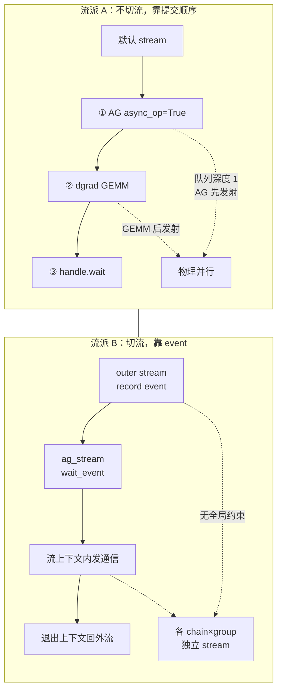

### 10.4 CUDA graph 与 side stream 相撞

side stream 遇上 CUDA graph 有一个必须处理的细节。L1385–L1387 的注释：

> sync event preserves the upstream quantize-writer edge the bare stream context drops; held on `self` so the event pool can't recycle it between capture and replay.

裸的 `torch.cuda.stream(...)` 上下文会丢掉「上游写者 → 本次读」的依赖边，所以需要额外持一个 event 来补。并且这个 event **必须挂在 `self` 上**，不能放进 event pool——否则 capture 与 replay 之间它会被回收，重放时依赖边消失，读到未就绪的数据。这类问题不会报错，只会静默产生错误结果。

### 10.5 三个计算组织手段

除了流本身，还有三个手段决定通信与计算怎么摆。

**`GlobalMemoryBuffer`。** 通信的输入输出 buffer 不每次 `torch.empty`，而是从一个全局池取（forward 的 SP 分支 L616–L621）：

```python
if sequence_parallel:
    dim_size = list(input.size())
    dim_size[0] = dim_size[0] * tp_group.size()

    all_gather_buffer = get_global_memory_buffer().get_tensor(dim_size, input.dtype, "mpu")
    dist_all_gather_func(all_gather_buffer, input, group=tp_group)
    total_input = all_gather_buffer
```

```python
all_gather_buffer = get_global_memory_buffer().get_tensor(dim_size, input.dtype, "mpu")
```

它的形状完全可预测——只有一个维度随 `tp_group.size()` 变——所以池化的额外开销近乎为零。

**wgrad deferral。** L654–L657：

```python
if grad_output_buffer is not None:
    if wgrad_deferral_limit == 0 or len(grad_output_buffer) < wgrad_deferral_limit:
        grad_output_buffer.append(grad_output)
        wgrad_compute = False
```

`grad_output` 被缓存起来，攒够了（`wgrad_deferral_limit == 0` 表示不限）才做 wgrad GEMM；`prepare_input_tensors_for_wgrad_compute` 负责把攒下的转成能直接喂 GEMM 的 `(total_input, grad_output)` 列表。

动机很清楚：**dgrad 后面还挂着 all-reduce 或 reduce-scatter，有东西可以重叠；wgrad 后面什么都没有，裸着跑就是白等**。deferral 把 wgrad 推到更靠后的位置去蹭别的通信。它与流派 A 是同一个思想的两面——都是用调度顺序换重叠，不靠 stream。

**gradient accumulation fusion。** forward 里先判 `hasattr(weight, "main_grad")`，成立才让 `_wgrad_gemm`（L554–L570）直接累加进 `main_grad`；Megatron-FSDP 走in-place 分支 `weight.get_main_grad()`。省掉一个中间 buffer 与一次显式加法。

### 10.6 一个 backward 的完整 launch 序列

TP + SP 开启、wgrad deferral 开启时：

| 序| 操作 | 组 | 是否异步 |
| --- | --- | --- | --- |
| ① | all-gather（`f` 的反向） | `tp_group` | 提交后不等 |
| ② | dgrad GEMM | — | — |
| ③ | `handle.wait()` | — | 同步点 |
| ④ | wgrad 输入准备 | — | — |
| ⑤ | reduce-scatter（`g` 的反向） | `tp_group` | 提交后不等 |
| ⑥ | wgrad GEMM | — | deferral 攒够了才做 |

非 SP 模式不同：① 不存在，且代码里有 `assert not ctx.allreduce_dgrad`（SP 下 reduce-scatter 已经隐含了归约），⑤ 换成异步 all-reduce。

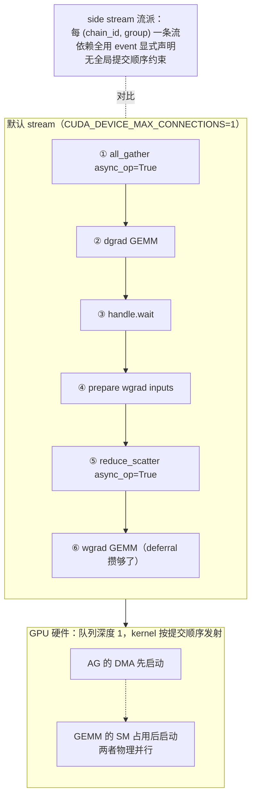

---

## 11. 小结与下一篇

把全文收成五条：

1. **状态即全局变量。** `parallel_state.py` L29–L159 的 59 个模块级赋值是全部并行状态；`initialize_model_parallel`（L601–L1583）一次性建立所有组，是 eager 建立 + lazy 校验。
2. **网格切分是一个不依赖 rank 的纯函数。** `RankGenerator` 只吃 `world_size`、各轴 size 与 `order` 字符串，核心是 `generate_masked_orthogonal_rank_groups`（L269–L375）的混合基数分解。「相同的 PG 互不影响」靠构建期的成员过滤与运行期的 communicator 隔离，而「同序同参」这条要求正是纯函数设计的原因。
3. **组的选择靠三层机制，其中第三层最关键。** 构造时注入 → forward 只用 `self.tp_group` → `ctx.tp_group`（L612）让反向自动拿到同一个组。组内坐标抽象（`get_pg_rank`，L650–L661）返回组内 rank 且在无组时退化为 0，让单卡与单成员组走同一条路径。
4. **同步与计算的划分由三个时间尺度决定。** TP / SP / CP / EP 在层内，PP 在层间，DP 在 iteration 末尾。三档不重叠，所以多组共存不需要仲裁；正交性保证同一个张量只被一个组归约，需要真正全局归约时另开专用组。
5. **通信与计算的组织有两个流派，全局约束互斥。** 流派 A 靠 `CUDA_DEVICE_MAX_CONNECTIONS=1` 强制提交顺序等于执行顺序，代价是全进程 kernel 串行；流派 B 按 `(chain_id, group)` 建独立 side stream，依赖全用 event，但遇上 CUDA graph 必须自己补回被裸 stream context 丢掉的依赖边。

顺手留下的几条可直接用的结论：

- **序列并行不减少通信量**。`all_reduce` 可分解为 reduce-scatter 加 all-gather，SP 的收益在激活显存，提速来自能关掉 activation recompute。
- **`order` 字符串里靠左的轴 stride 更小、组内成员 rank 更相邻**。GTP 轴在 dense 侧插到 `tp` 后、在 expert 侧插到 `ep` 后，都是为了让更重的集合通信拿到更好的局部性。
- **`size == 1` 的短路要显式写**，它依赖运行时的组大小，不能指望单元素组的集合通信自动廉价。
- **同一个 `CUDA_DEVICE_MAX_CONNECTIONS` 有两条相反的硬断言**，改它之前先确认 pipeline 通信 backend。
- **`global_process_group_list` 首位是 `None`**，代表默认进程组——默认组不是通过 `new_group` 建的，拿不到对象。

本篇是并行体系源码层的**第一篇**，覆盖进程组与通信组织。后续几篇分别处理：TP 与序列并行的真实实现（`f` / `g` 在代码里换成 RS+AG 的分支、`LinearWithGradAccumulationAndAsyncCommunication` 的完整生命周期）、GTP 到底改了什么、三套数据并行怎么分叉、1F1B 调度器里不在论文上的那些细节、以及上下文并行的三条路线。

overlap 的**开关组合决策**（`finalize_model_grads` 里八种条件组合的分派、十二个 `tp_comm_overlap_*` 开关、NCCL UserBuffer、收益上界与帕累托前沿）不属本文范围，另归优化工具箱那一块；本文只在 §10 给出它们所依赖的机制基础。

---

## 参考

1. Megatron Core 源码：`https://github.com/NVIDIA/Megatron-LM`（本文对应 commit `60e039626`，`megatron-core` 0.20.0）
2. 本文主要引用的源文件（均锁 commit）：[`megatron/core/parallel_state.py`](https://github.com/NVIDIA/Megatron-LM/blob/60e039626/megatron/core/parallel_state.py)（L29–L159全局变量、L232–L266 `create_group`、L269–L375 `generate_masked_orthogonal_rank_groups`、L465–L557 `RankGenerator`、L601–L1583 `initialize_model_parallel`、L2506–L2692 `destroy_model_parallel`）、[`megatron/training/initialize.py`](https://github.com/NVIDIA/Megatron-LM/blob/60e039626/megatron/training/initialize.py)（L271–L412 `_initialize_distributed`）、[`megatron/core/tensor_parallel/mappings.py`](https://github.com/NVIDIA/Megatron-LM/blob/60e039626/megatron/core/tensor_parallel/mappings.py)、[`megatron/core/tensor_parallel/layers.py`](https://github.com/NVIDIA/Megatron-LM/blob/60e039626/megatron/core/tensor_parallel/layers.py)、[`megatron/core/tensor_parallel/generalized_tensor_parallelism.py`](https://github.com/NVIDIA/Megatron-LM/blob/60e039626/megatron/core/tensor_parallel/generalized_tensor_parallelism.py)、[`megatron/core/utils.py`](https://github.com/NVIDIA/Megatron-LM/blob/60e039626/megatron/core/utils.py)
3. Narayanan et al., *Efficient Large-Scale Language Model Training on GPU Clusters Using Megatron-LM*：https://arxiv.org/abs/2104.04473
4. Korthikanti et al., *Reducing Activation Recomputation in Large Transformer Models*：https://arxiv.org/abs/2205.05198（SP 的收益在激活显存，不在通信量）
5. 官方上下文并行文档：`docs/api-guide/core/context_parallel.html`（ring / all-gather / hybrid 三条路线）
6. 前作：《Megatron-LM 深度剖析（00）地基》[/2026/09/28/megatron-00-foundation/]、《（02）专家并行》[/2026/10/08/megatron-02-expert-parallel/]、《分布式训练（00）总览》[/2026/08/31/dist-train-00-overview/]、《（03）张量并行》[/2026/08/31/dist-train-03-tensor-parallel/]、《（08）组合实战》[/2026/08/31/dist-train-08-combined-practice/]

---

*下一篇：[Megatron-LM 深度剖析（02）：专家并行——进程组、token dispatch 全链路与负载均衡的源码层](/2026/10/08/megatron-02-expert-parallel/)*