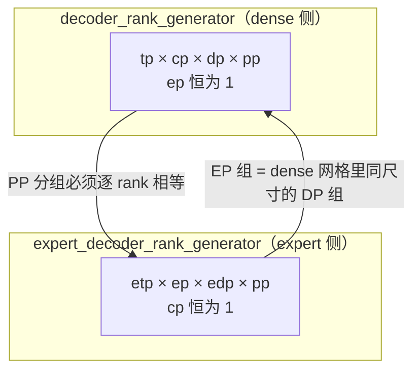
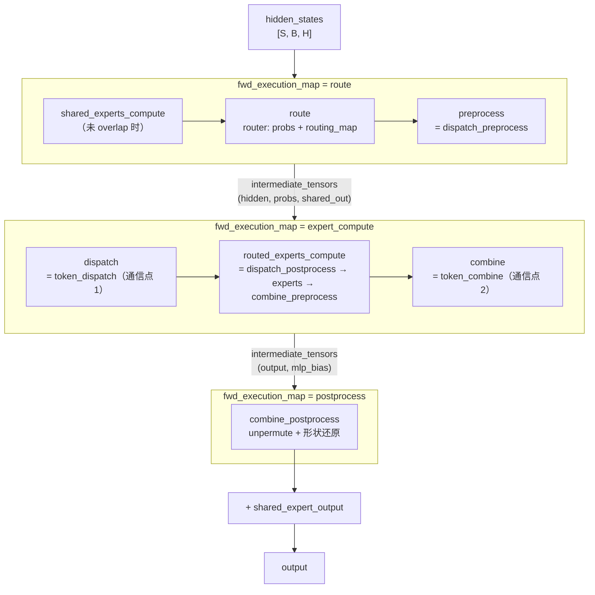
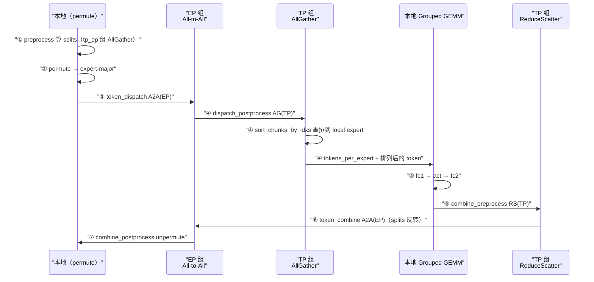

> **Megatron-LM 深度剖析系列 · 第 02 篇**
>
> 前置：[00 地基](/2026/09/28/megatron-00-foundation/)（代码地图 / 配置系统 / 一次迭代的控制流）｜ [分布式训练（06）专家并行](/2026/08/31/dist-train-06-expert-parallel/)（并行原理：All-to-All 模型、aux loss、容量）
>
> 本系列做**源码层**：并行原理已在《分布式训练》系列讲透，这里一律引用不重推。源码基准 **`megatron-core` 0.20.0**，commit `60e039626`。
>
> 编号说明：01（并行体系源码层：进程组 / TP+SP / GTP / DP / PP / CP）在写作中；本篇先落地原计划里排在模块 B 的 MoE 主题。

**TL;DR**

> * EP 在 Megatron 里不是一个模块，而是**二十个文件、上万行代码**的一整套协议层。核心矛盾只有一句话：**专家的位置是静态的，token 的位置是动态的**。所有设计都是这句话的推论。
> * **进程组必须开两套表。** `initialize_model_parallel` 同时建 `decoder_rank_generator`（`ep=1, cp=cp`）与 `expert_decoder_rank_generator`（`ep=EP, cp=1`），因为 EP 不是加在 dense 网格上的一根新轴，而是**把 dense 网格里的 DP 维度重新解释成 EP**。EP 组恰好等于 dense 网格里那个 DP 组的 rank 集合。两套表的 PP 分组被断言逐 rank 相等。
> * **token dispatch 有三个家族、四套后端。** `MoEAllGatherTokenDispatcher`（在 TP×EP 域上 AllGather）、`MoEAlltoAllTokenDispatcher`（permute → A2A → sort_chunks → …  七步）、`MoEFlexTokenDispatcher`（把 TP×EP 合成单一通信域，后端 deepep / hybridep / ncclep）。三者在 `TransformerConfig` 里只由 `moe_token_dispatcher_type` 一个字段区分。
> * **All-to-All 路线的全部复杂度来自“变长”。** dropless 模式下每个 expert 收到的 token 数依赖输入数据，所以 `input_splits` / `output_splits` / `output_splits_tp` 都得在 `tp_ep` 组上 AllGather 出来，再搬回 CPU。Megatron 的做法是**侧流 DtoH + 优先级同步点**：所有可能的拷贝在最早的点一次性发出，只在最晚的点 `event.synchronize()`。
> * **permute 为了 CUDA graph 放弃了 `masked_select`。** `moe_utils.py` 里用 `argsort(descending=True, stable=True)[:num_out_tokens]` 而不是 `masked_select`，因为后者输出 shape 随数据变化，前者固定。这是全仓库唯一一处为 CUDA graph 而牺牲表达力的地方，注释直接写明动机。
> * **负载均衡有三个正交手段，它们的 reduce group 各不相同**——这是最容易配错的地方：`aux_loss` / `seq_aux_loss` 都在 `tp_cp` 组上归约，`global_aux_loss` 在 `tp_dp_cp` 组上跨 step 累计，而 expert bias（DeepSeek-V3 式）的更新干脆不在 forward 里，而在 `finalize_model_grads` 里对 `tp_dp_cp` 做 all-reduce。配错组的后果是 loss 数值看起来正常但梯度方向错的。
> * **EP overlap 与整层 CUDA graph 互斥。** `overlap_moe_expert_parallel_comm` 依赖跨 microbatch 的 stream 交错，而 graph 内执行顺序 capture 时就冻结了。所以这两条优化路径只能选一条，`transformer_layer.py` 里是一条硬 assert。
> * **规模感**：`token_dispatcher.py` 2085 行、`moe_utils.py` 1762 行、`experts.py` 1567 行、`paged_stash.py` 1326 行、`router.py` 996 行。`TransformerConfig` 里有 **62 个 `moe_*` 字段**。

---

## 1. 符号表与阅读坐标

### 1.1 符号约定

沿用 GShard / Switch Transformer / DeepSeek-V3 的通行写法，不引入新字母。

| 符号 | 含义 | 源码对应 |
|---|---|---|
| $$E$$ | 路由专家总数 | `config.num_moe_experts` |
| $$k$$ | 每 token 激活的专家数 | `config.moe_router_topk` |
| $$H$$ | 隐藏维 | `config.hidden_size` |
| $$T$$ | 全局 token 数（一个 global batch 内） | 由 rank 数 × local token 数构成 |
| $$T_\ell$$ | rank $$\ell$$ 上的 local token 数 | dispatcher 的 `num_local_tokens` |
| $$N_{\mathrm{ep}}$$ | 专家并行组大小 | `pg_collection.ep.size()` |
| $$N_{\mathrm{etp}}$$ | 专家张量并行组大小 | `pg_collection.expt_tp.size()` |
| $$g_e$$ | router 门控输出（logits），长度 $$E$$ | `TopKRouter` 的 `logits` |
| $$s_e$$ | score function 之后的分数 | `scores_for_aux_loss` |
| $$p_e$$ | 归一化后的路由概率 | `probs` |
| $$\mathcal{M}$$ | 二值路由映射，$$\mathcal{M}_{x,e} \in \{0,1\}$$ | `routing_map` |
| $$c_e$$ | 分到专家 $$e$$ 的 token 数 | `tokens_per_expert[e]` |
| $$f_e$$ | 专家 $$e$$ 实际分到的 token 比例 | aux loss 公式里的 $$f_e$$ |
| $$P_e$$ | router 给专家 $$e$$ 的平均概率 | aux loss 公式里的 $$P_e$$ |
| $$\alpha$$ | aux loss 系数 | `moe_aux_loss_coeff` |
| $$\beta$$ | expert bias 更新步长 | `moe_router_bias_update_rate` |
| $$C$$ | 单专家容量 | `get_capacity(...)` 返回值 |
| $$M_{i \to j}$$ | rank $$i$$ 发往 rank $$j$$ 的行数 | dispatcher 的 `input_splits[i→j]` |

**估计值与真值的区分**：$$\mathcal{M}$$ 是布尔张量（真值），$$p_e$$ 是浮点权重（由 $$s_e$$ 归一化而来）。两者在代码里是分开的两个对象，aux loss 用 $$s_e$$ 而不是 $$p_e$$ 计算——这一点在 §6.1 会展开，因为它是 aux loss 正确性的关键。

### 1.2 MoE 目录的文件分工

行数对应 commit `60e039626`：

| 文件 | 行数 | 职责 |
|---|---|---|
| `moe/token_dispatcher.py` | **2085** | 三套 dispatcher + 四套通信后端 + 推理专用 dispatcher |
| `moe/moe_utils.py` | 1762 | permute/unpermute、aux loss、capacity、drop、CUDA graph 信号 |
| `moe/experts.py` | 1567 | `TEGroupedMLP` / `SequentialMLP` / `InferenceGroupedMLP` |
| `moe/shared_experts.py` | 645 | shared expert 及其与通信的重叠编排 |
| `moe/fused_a2a.py` | 807 | DeepEP / HybridEP / TE NCCL-EP 的 kernel 封装 |
| `moe/moe_layer.py` | 814 | `BaseMoELayer` / `MoELayer`，层级控制流 |
| `moe/router.py` | 996 | `Router` / `TopKRouter` / `InferenceTopKRouter` |
| `moe/paged_stash.py` | 1326 | dropless 溢出暂存与重放 |
| `moe/upcycling_utils.py` | 358 | dense checkpoint → MoE |
| `moe/router_trace.py` | 492 | 路由决策落盘（离线分析） |
| `moe/router_replay.py` | 208 | 路由决策录制 / 回放（RL） |
| `moe/moe_logging.py` | 384 | MoE 指标 tracker |
| `moe/batch_invariant.py` | 92 | batch-invariant 的 unpermute 所有权模型 |
| `moe/moe_layer_config.py` | 10 | dataclass 定义 |

`token_dispatcher.py` 一个文件里塞了四层东西，这是读它最容易迷路的原因：

```
token_dispatcher.py
├── MoETokenDispatcher                 抽象基类，五个钩子
├── MoEAllGatherTokenDispatcher        L233   TP×EP 域 AllGather + ReduceScatter
├── MoEAlltoAllTokenDispatcher         L375   permute → A2A → sort_chunks → …
├── _DispatchManager (ABC)             L963   flex 后端的统一接口
├── _HybridEPManager                   L1001  HybridEP kernel
├── _DeepepManager                     L1225  DeepEP kernel
├── _NCCLEPManager                     L1471  TransformerEngine NCCL EP
└── MoEFlexTokenDispatcher             L1809  上述三者的统一外壳
```

推理路径另开一个文件 `token_dispatcher_inference.py`（675 行），因为它要解决的是另一个问题：**变长请求下的 CUDA graph 捕获**。

---

## 2. EP 网格：world_size 如何被切成两张互不相同的表

### 2.1 为什么必须开两套

`initialize_model_parallel` 同时构造两个 `RankGenerator`（[parallel_state.py L857-L896](https://github.com/NVIDIA/Megatron-LM/blob/60e039626/megatron/core/parallel_state.py#L857-L896)）：

```python
decoder_order = _inject_gtp_remat_axis(order, after="tp")
decoder_rank_generator = RankGenerator(
    tp=tensor_model_parallel_size, ep=1, dp=data_parallel_size,
    pp=pipeline_model_parallel_size, cp=context_parallel_size,
    order=decoder_order, rank_offset=rank_offset, gtp_remat=gtp_remat_size,
)

expert_order = _inject_gtp_remat_axis(order, after="ep")
expert_decoder_rank_generator = RankGenerator(
    tp=expert_tensor_parallel_size, ep=expert_model_parallel_size,
    dp=expert_data_parallel_size, pp=pipeline_model_parallel_size, cp=1,
    order=expert_order, rank_offset=rank_offset, gtp_remat=expert_gtp_remat_size,
)
```

差异有五处，其中三处是硬约束：

| 轴 | decoder | expert | 性质 |
|---|---|---|---|
| `ep` | 1 | `expert_model_parallel_size` | 核心差异 |
| `cp` | `context_parallel_size` | **恒为 1** | 硬断言 |
| `tp` | `tensor_model_parallel_size` | `expert_tensor_parallel_size` | 独立开关，默认相等 |
| `dp` | $$\frac{N_{\mathrm{world}}}{n_{\mathrm{tp}} n_{\mathrm{pp}} n_{\mathrm{cp}} g}$$ | $$\frac{N_{\mathrm{world}}}{n_{\mathrm{etp}} N_{\mathrm{ep}} n_{\mathrm{pp}} g_{\mathrm{egtp}}}$$ | 被 EP 挖走一块 |
| `gtp_remat` | `gtp_remat_size` | `expert_gtp_remat_size` | 独立轴（见 §2.5） |

**CP 不能进 expert 网格**是构造函数里的第一条断言（[parallel_state.py L479-L482](https://github.com/NVIDIA/Megatron-LM/blob/60e039626/megatron/core/parallel_state.py#L479-L482)）：

```python
assert (
    ep == 1 or cp == 1
), "Both EP and CP > 1 in not allow in one rank generator. \
    CP is only included in default RankGenerator, and EP only in expert RankGenerator."
```

理由是 CP 切 sequence 长度，为的是让 attention 能看到完整序列。expert 是逐 token 独立的 FFN，切 sequence 对它没有意义；而且 expert token 本来就要靠 EP All-to-All 跨 rank 收集，再叠一层 CP 只会让通信模式更碎。



### 2.2 EP 组就是 dense 网格的 DP 组

这是整节最关键的一条。取一个具体配置走一遍（全部为解析推导，可手算复核）：

$$N_{\mathrm{world}} = 64,\quad n_{\mathrm{tp}} = 4,\quad n_{\mathrm{pp}} = 2,\quad n_{\mathrm{cp}} = 1,\quad N_{\mathrm{ep}} = 8,\quad n_{\mathrm{etp}} = 4$$

这个配置是合法的：expert 侧要求 $$n_{\mathrm{etp}} \cdot N_{\mathrm{ep}} \cdot n_{\mathrm{pp}} = 4 \times 8 \times 2 = 64 = N_{\mathrm{world}}$$。

**dense 侧**：`order = "tp-gtp_remat-cp-ep-dp-pp"`，各轴 size 为 $$[4,1,1,1,8,2]$$（`gtp_remat=1` 时是 singleton，stride 不变）：

$$n_{\mathrm{dp}} = \frac{64}{4 \times 2 \times 1 \times 1} = 8$$

rank 编号满足（`cp` 与 `ep` 轴 size 均为 1，不贡献 stride）

$$\text{rank} = r_{\mathrm{tp}} + r_{\mathrm{dp}} \cdot 4 + r_{\mathrm{pp}} \cdot 32$$

于是 rank 0 的 DP 组是 $$\{0, 4, 8, 12, 16, 20, 24, 28\}$$。

**expert 侧**：`order = "tp-cp-ep-gtp_remat-dp-pp"`，各轴 size 为 $$[4,1,8,1,1,2]$$：

$$n_{\mathrm{edp}} = \frac{64}{4 \times 8 \times 2 \times 1} = 1$$

rank 编号满足（`cp` 与 `gtp_remat` 轴 size 均为 1）

$$\text{rank} = r_{\mathrm{etp}} + r_{\mathrm{ep}} \cdot 4 + r_{\mathrm{pp}} \cdot 32$$

于是 rank 0 的 EP 组是 $$\{0, 4, 8, 12, 16, 20, 24, 28\}$$ —— **和上面那个 DP 组逐个相同**。

两组相等的原因可以直接读出来：dense 侧 DP 轴的 stride 等于 $$n_{\mathrm{tp}} = 4$$，expert 侧 EP 轴的 stride 等于 $$n_{\mathrm{etp}} = 4$$，两者相等是因为本例里 $$n_{\mathrm{etp}} = n_{\mathrm{tp}}$$。

所以准确的表述是：**EP 不是加在 dense 网格上的一根新轴，而是把 dense 网格里算作 DP 的那批 rank 重新解释成 EP 组**。expert 侧的 DP 基数因此变小（这里是 1，退化成 singleton）。这条推导给出一个可直接验证的判据：

$$n_{\mathrm{edp}} = \frac{n_{\mathrm{dp}} \cdot n_{\mathrm{tp}}}{n_{\mathrm{etp}} \cdot N_{\mathrm{ep}}}$$

当 $$n_{\mathrm{etp}} = n_{\mathrm{tp}}$$ 时 $$n_{\mathrm{edp}} = \frac{n_{\mathrm{dp}}}{N_{\mathrm{ep}}}$$。也就是说 **EP 每翻一倍，expert 侧的 replicate 度数就减半**。

**PP 分组必须一致**（[parallel_state.py L904-L907](https://github.com/NVIDIA/Megatron-LM/blob/60e039626/megatron/core/parallel_state.py#L904-L907)）：

```python
assert decoder_rank_generator.get_ranks("pp") == expert_decoder_rank_generator.get_ranks("pp"), \
    f"Pipeline parallel groups are expected to be the same for Non-Expert and Expert part"
```

这不是性能考虑，是正确性：同一个 pipeline stage 必须同时持有同一层的 attention 权重和 expert 权重，两套网格的 DP 基数不同（EP 挖走了一块），PP 边界不对齐就会在流水线递推时错配层。配套还有一条（[L898-L902](https://github.com/NVIDIA/Megatron-LM/blob/60e039626/megatron/core/parallel_state.py#L898-L902)）：

```python
assert (
    order.endswith("pp")
    or pipeline_model_parallel_size == 1
    or expert_data_parallel_size == data_parallel_size
), "When not using pp-last rank ordering, the data parallel size of the attention and moe layers must be the same"
```

用 pp-last 排序时 PP 组是跨 DP 的连续段（stride 最大），两套网格 DP 基数不同会导致 PP 边界错位，所以强制要求相等。

### 2.3 masked-orthogonal 分组的数学

`RankGenerator.get_ranks(token)` 只做两件事：把 `order` 字符串转成 mask，再交给 `generate_masked_orthogonal_rank_groups`（[parallel_state.py L269-L373](https://github.com/NVIDIA/Megatron-LM/blob/60e039626/megatron/core/parallel_state.py#L269-L373)）。

```python
def get_mask(self, order: str, token: str):
    ordered_token = order.split("-")
    token_list = token.split("-")
    mask = [False] * len(ordered_token)
    for t in token_list:
        mask[ordered_token.index(t)] = True
    return mask
```

mask 是**按 `order` 字符串的位置**，不是按轴名。所以同一句 `get_ranks('tp-ep')` 在两套网格上落在不同的 index 上——这也是为什么两张表必须各自算 mask。

核心实现（[L352-L373](https://github.com/NVIDIA/Megatron-LM/blob/60e039626/megatron/core/parallel_state.py#L352-L373)）：

```python
masked_shape = [s for s, m in zip(parallel_size, mask) if m]
unmasked_shape = [s for s, m in zip(parallel_size, mask) if not m]

global_stride = prefix_product(parallel_size)
masked_stride = [d for d, m in zip(global_stride, mask) if m]
unmasked_stride = [d for d, m in zip(global_stride, mask) if not m]

group_size = prefix_product(masked_shape)[-1]
num_of_group = world_size // group_size

for group_index in range(num_of_group):
    decomposed_group_idx = decompose(group_index, unmasked_shape)
    for rank_in_group in range(group_size):
        decomposed_rank_idx = decompose(rank_in_group, masked_shape)
        rank.append(inner_product(decomposed_rank_idx, masked_stride)
                    + inner_product(decomposed_group_idx, unmasked_stride))
```

写成公式：

$$\text{rank} = \underbrace{\sum_{i \in \text{masked}} d_i\, r_i}_{\text{组内坐标投影}} + \underbrace{\sum_{i \in \text{unmasked}} d_i\, g_i}_{\text{组编号投影}}$$

其中 $$d_i = \prod_{j<i} n_j$$ 是第 $$i$$ 根轴的 stride，$$r_i$$ 是组内坐标，$$g_i$$ 是组编号坐标。**mask 选中的轴贡献组内变化，未选中的轴贡献组编号**——每个组因此是“固定所有未选中轴坐标、只遍历选中轴”的正交切片。

沿用 §2.2 的 expert 网格（$$N_{\mathrm{world}}=64$$，各轴 size $$[4,1,8,1,1,2]$$，`prefix_product` 给出有效 stride $$[1,4,4,32,32,32]$$）：

| token | mask | group_size | 组数 | rank 0 所在组 |
|---|---|---|---|---|
| `ep` | `[F,F,T,F,F,F]` | 8 | 8 | $$\{0,4,8,12,16,20,24,28\}$$ |
| `tp` | `[T,F,F,F,F,F]` | 4 | 16 | $$\{0,1,2,3\}$$ |
| `tp-ep` | `[T,F,T,F,F,F]` | 32 | 2 | $$\{0,1,\ldots,31\}$$ |
| `dp` | `[F,F,F,F,T,F]` | 1 | 64 | $$\{0\}$$ |
| `pp` | `[F,F,F,F,F,T]` | 2 | 32 | $$\{0,32\}$$ |

`tp-ep` 这一行值得注意：它是**跨半个场地的组**（32 个 rank），因为它同时吃掉了 etp 与 ep 两根轴。这就是 flex dispatcher 的通信域（§9.2）——EP 组内的所有 ETP rank 必须拿到同一批 token 的副本。

而 `pp` 组 $$\{0,32\}$$ 与 dense 侧的 PP 组完全相同——这就是 §2.2 那条断言成立的直观原因。

### 2.4 `order` 归一化与 size=1 的轴

`RankGenerator.__init__`（[L468-L517](https://github.com/NVIDIA/Megatron-LM/blob/60e039626/megatron/core/parallel_state.py#L468-L517)）：

```python
self.world_size = tp * dp * pp * cp * ep * gtp_remat
self.name_to_size = {"tp": tp, "pp": pp, "dp": dp, "ep": ep, "cp": cp, "gtp_remat": gtp_remat}

for name in self.name_to_size.keys():
    if name not in order and self.name_to_size[name] != 1:
        raise RuntimeError(
            f"The size of ({name}) is ({self.name_to_size[name]}), but you haven't"
            f"specified the order ({self.order})."
        )
    elif name not in order:
        order = order + "-" + name

self.ordered_size = [self.name_to_size[token] for token in order.split("-")]
```

三条规则：

1. **size 大于 1 的轴漏写在 `order` 里直接报错**。
2. size 等于 1 的轴漏写会静默补到末尾——因为 stride 计算里乘 1 不改变任何值，等价于不存在。
3. `initialize_model_parallel` 的默认 `order` 是 `"tp-cp-ep-dp-pp"`（[L617](https://github.com/NVIDIA/Megatron-LM/blob/60e039626/megatron/core/parallel_state.py#L617)），**dense 侧的 order 串里也带 `ep`**，靠规则 2 把它消掉。

### 2.5 GTP 轴的注入位置与 NCCL locality

v0.20 新增的 `gtp_remat` 轴（GTP = TP × GTP_remat，把权重切分域一分为二，TP 那份永久保持切分、GTP_remat 那份 GEMM 前临时 all-gather 回来）在两套网格里占据不同 stride，注入位置由 `_inject_gtp_remat_axis` 决定（[L582-L597](https://github.com/NVIDIA/Megatron-LM/blob/60e039626/megatron/core/parallel_state.py#L582-L597)）：

```python
def _inject_gtp_remat_axis(order_str: str, after: str = "tp") -> str:
    """Inject the 'gtp_remat' axis into a RankGenerator order string for NCCL locality.

    Position controls locality (leftmost token = smallest stride = most adjacent ranks):
      - dense/decoder: inject after 'tp' -> 'tp-gtp_remat-cp-ep-dp-pp' (GTP_remat local).
      - expert: inject after 'ep' -> 'tp-cp-ep-gtp_remat-dp-pp' so EP keeps more-local placement
        than EGTP (the MoE EP all-to-all is the heavier expert-side collective).
    """
```

判断依据是 docstring 里那句：EP All-to-All 是 expert 侧更重的集合通信，rank 越物理相邻，NCCL 拓扑越友好。所以 expert 侧让 EP 紧贴 TP，把 EGTP 推到更外层。

取一个双轴都开启的配置对比（$$N_{\mathrm{world}}=64,\ n_{\mathrm{tp}}=2,\ g=2,\ N_{\mathrm{ep}}=4,\ n_{\mathrm{etp}}=2,\ g_{\mathrm{egtp}}=2,\ n_{\mathrm{pp}}=2$$，因此 $$n_{\mathrm{dp}}=8$$、$$n_{\mathrm{edp}}=2$$）：

| 网格 | order | 各轴 size | ep 的 stride | egtp 的 stride |
|---|---|---|---|---|
| dense | `tp-gtp_remat-cp-ep-dp-pp` | $$[2,2,1,1,8,2]$$ | —（`ep=1`） | — |
| expert | `tp-cp-ep-gtp_remat-dp-pp` | $$[2,1,4,2,2,2]$$ | 2 | 8 |

expert 侧 rank 0 的 EP 组是 $$\{0,2,4,6\}$$（stride 2），EGTP 组是 $$\{0,8\}$$（stride 8）。dense 侧 rank 0 的 GTP 组是 $$\{0,2\}$$（stride 2）。

两处 stride 都比 §2.2 的例子小一档——`gtp_remat` 占掉了紧邻 TP 的那个最紧邻位置，这正是 `_inject_gtp_remat_axis` docstring 里 “Position controls locality” 想控制的东西。

GTP 的权重切分语义与 EP 无关，两者正交叠加；GTP 本身（`--tensor-parallel-num-weight-shards` 推导出的 `gtp_weight_remat_size`）属于本系列 GTP 篇的主题，此处只记录它对 EP 拓扑的影响。

---

## 3. 专家的切法：连续块不变量

`BaseMoELayer.__init__`（[moe_layer.py L168-L211](https://github.com/NVIDIA/Megatron-LM/blob/60e039626/megatron/core/transformer/moe/moe_layer.py#L168-L211)）只有五行是实质逻辑：

```python
self.ep_group = pg_collection.ep
self.attn_tp_group = pg_collection.tp
ep_size = utils.get_pg_size(self.ep_group)
ep_rank = utils.get_pg_rank(self.ep_group)

assert self.config.num_moe_experts % ep_size == 0
self.num_local_experts = self.config.num_moe_experts // ep_size
local_expert_indices_offset = ep_rank * self.num_local_experts

self.local_expert_indices = [local_expert_indices_offset + i for i in range(self.num_local_experts)]
assert all(map(lambda x: x < self.config.num_moe_experts, self.local_expert_indices))
```

写成公式：EP 组内第 $$j$$ 个 rank 持有专家

$$\mathcal{E}_j = \{\, j \cdot \tfrac{E}{N_{\mathrm{ep}}},\ \ldots,\ (j{+}1) \cdot \tfrac{E}{N_{\mathrm{ep}}} - 1 \,\}$$

**切法是连续块，不是轮询或哈希。** dispatcher 里有一条断言把这条不变量钉死（[token_dispatcher.py L414-L420](https://github.com/NVIDIA/Megatron-LM/blob/60e039626/megatron/core/transformer/moe/token_dispatcher.py#L414-L420)）：

```python
assert (
    len(self.local_expert_indices) == self.num_local_experts
), "Invalid local expert indices"
for i in range(len(self.local_expert_indices) - 1):
    assert (
        self.local_expert_indices[i] == self.local_expert_indices[i + 1] - 1
    ), "local_expert_indices must be continuous"
```

连续块带来一个可被预计算的重排表。`MoEAlltoAllTokenDispatcher.__init__`（[L432-L442](https://github.com/NVIDIA/Megatron-LM/blob/60e039626/megatron/core/transformer/moe/token_dispatcher.py#L432-L442)）：

```python
input_chunk_idxs = torch.arange(self.num_experts * self.tp_size, device=self.permute_idx_device)
# [num_local_experts, tp_size * ep_size]. Sort the input chunks by local experts.
self.sort_input_by_local_experts = input_chunk_idxs.reshape(-1, self.num_local_experts).T.ravel()
# [tp_size * ep_size, num_local_experts]. Restore the output chunks by local experts.
self.restore_output_by_local_experts = input_chunk_idxs.reshape(self.num_local_experts, -1).T.ravel()
```

A2A 之后收到的 token 是按「源 rank × 全局专家编号」分块的，而本地 GEMM 需要按「本地专家编号」分块。这两个 reshape-transpose 就是那个重排表——**因为专家编号连续且块大小相等，转置后的索引可以直接算出来，不用查表**。如果切法改成轮询，这段代码要换成真正的 gather。

这条不变量还影响 checkpoint。`TEGroupedMLP.sharded_state_dict`（[experts.py L1049-L1091](https://github.com/NVIDIA/Megatron-LM/blob/60e039626/megatron/core/transformer/moe/experts.py#L1049-L1091)）把每个 local expert 映射回 global expert 编号：

```python
num_global_experts = self.ep_group.size() * self.num_local_experts
local_expert_indices_offset = self.ep_group.rank() * self.num_local_experts
ep_axis = len(sharded_offsets)
for i in range(self.num_local_experts):
    new_sharded_offsets = (
        *sharded_offsets,
        (ep_axis, local_expert_indices_offset + i, num_global_experts),
    )
```

即在已有的 TP/PP offset 之后**追加一根 EP 轴**。GLU 的 `weight{i}` / `bias{i}` 额外过一层 `apply_swiglu_sharded_factory` 处理 interleaving。`SequentialMLP.sharded_state_dict`（[experts.py L1526](https://github.com/NVIDIA/Megatron-LM/blob/60e039626/megatron/core/transformer/moe/experts.py#L1526)）产出同样的 key，所以两种 expert 实现可以在 checkpoint 层面互换。

---

## 4. 路由：logits 到 routing_map 的四段变换

### 4.1 TopKRouter 的命名约定

`TopKRouter` 的类 docstring（[router.py L144-L158](https://github.com/NVIDIA/Megatron-LM/blob/60e039626/megatron/core/transformer/moe/router.py#L144-L158)）把四个中间量的名字一次定义清楚，这套命名贯穿全文件：

```python
Naming convention:
    logits: The output logits by the router gating network.
    scores: The scores after score function used to select the experts and calculate aux loss.
    probs: The topk weights used to combined the experts' outputs.
    routing_map: The masked routing map between tokens and experts.
```

注意 `scores` 与 `probs` 是**两个不同的对象**：前者用于选专家和算 aux loss，后者是组合专家输出时的权重。§6.1 会说明为什么 aux loss 必须用 `scores` 而不能用 `probs`。

### 4.2 routing() 的七个步骤

`TopKRouter.routing`（[router.py L744-L835](https://github.com/NVIDIA/Megatron-LM/blob/60e039626/megatron/core/transformer/moe/router.py#L744-L835)）：

```python
logits = logits.view(-1, self.config.num_moe_experts)

# Apply Z-Loss
logits = self.apply_z_loss(logits, padding_mask=padding_mask)

if self.routing_type == "sinkhorn":
    probs, routing_map = self.sinkhorn_load_balancing(logits)
elif self.routing_type == "quantile_balancing":
    probs, routing_map = self.quantile_balancing(logits)
else:
    probs, routing_map = topk_routing_with_score_function(
        logits, self.topk,
        use_pre_softmax=self.config.moe_router_pre_softmax,
        num_groups=self.config.moe_router_num_groups,
        group_topk=self.config.moe_router_group_topk,
        scaling_factor=self.config.moe_router_topk_scaling_factor,
        score_function=self.score_function,
        expert_bias=self.expert_bias,
        fused=self.config.moe_router_fusion,
        router_replay=self.router_replay,
    )

if self.config.moe_expert_capacity_factor is not None:
    probs, routing_map = apply_router_token_dropping(
        probs, routing_map, router_topk=self.topk,
        capacity_factor=self.config.moe_expert_capacity_factor,
        drop_policy=self.config.moe_token_drop_policy,
        pad_to_capacity=self.config.moe_pad_expert_input_to_capacity,
    )

if self.training and torch.is_grad_enabled() and self.is_aux_loss_enabled():
    routing_map_for_aux_loss, scores_for_aux_loss = compute_routing_scores_for_aux_loss(
        logits, self.topk, self.score_function, fused=self.config.moe_router_fusion,
        padding_mask=padding_mask,
    )
    probs = self._apply_aux_loss(probs, scores_for_aux_loss, routing_map_for_aux_loss, ...)
    probs = self._apply_seq_aux_loss(probs, scores_for_aux_loss, routing_map_for_aux_loss,
                                     seq_length, bsz, ...)
    probs = self._apply_global_aux_loss(probs, scores_for_aux_loss, routing_map_for_aux_loss, ...)

self._apply_expert_bias(routing_map, padding_mask=padding_mask)
return probs, routing_map
```

顺序上有一处容易忽略：**aux loss 在 token dropping 之后施加**。所以 aux loss 看到的是「已经被容量裁剪过」的分布，梯度不会去鼓励产生会被丢掉的 token。

z-loss 的作用是抑制 logits 的绝对值规模：

$$\mathcal{L}_z = \frac{1}{T} \sum_{x \in B} \left( \frac{1}{E} \sum_{e=1}^{E} \lvert \logit_{x,e} \rvert^2 \right)$$

它与 aux loss 正交：aux loss 管**分布**，z-loss 管**尺度**。`moe_input_jitter_eps` 则是在门控前给输入加高斯扰动，抑制早期训练中 router 对少数专家的过度自信。

### 4.3 三种 routing_type

| `moe_router_load_balancing_type` | 机制 | 依赖 |
|---|---|---|
| `aux_loss`（默认） | topk + aux loss 惩罚 | `moe_aux_loss_coeff` |
| `sinkhorn` | 把分配问题当成最优传输，用 Sinkhorn 迭代求软分配 | — |
| `quantile_balancing` | 用 per-expert 分位数 bias 替代 aux loss | `moe_router_quantile_balancing_ema` |

`quantile_balancing` 与 aux loss **互斥**（[router.py L228-L235](https://github.com/NVIDIA/Megatron-LM/blob/60e039626/megatron/core/transformer/moe/router.py#L228-L235)）：

```python
assert not self.is_aux_loss_enabled(), (
    "Quantile balancing handles load balance via the bias update; "
    "aux losses must be disabled (set moe_aux_loss_coeff to 0)."
)
```

它的 bias 走 EMA 更新（`moe_router_quantile_balancing_ema` 的 docstring，L820-L824）：

$$b_e \leftarrow \text{ema} \cdot b_e + (1 - \text{ema}) \cdot \text{local\_quantile}_e$$

默认 `ema = 0.0`，即无记忆，每步用最新的 global-batch 分位数估计替换。

### 4.4 group-limited routing：EP 拓扑与路由的联合设计

`group_limited_topk`（[moe_utils.py L673-L729](https://github.com/NVIDIA/Megatron-LM/blob/60e039626/megatron/core/transformer/moe/moe_utils.py#L673-L729)）的 docstring 直接给出两种用法：

> - **Device-limited routing**: Set `moe_router_num_groups` equal to expert parallel size (EP) to limit each token to experts on a subset of devices (DeepSeek-V2)
> - **Node-limited routing**: Set `moe_router_num_groups` equal to number of nodes in EP group (DeepSeek-V3)

实现分两步：

```python
group_scores = scores.view(num_tokens, num_groups, -1).topk(topk // group_topk, dim=-1)[0].sum(dim=-1)
group_idx = torch.topk(group_scores, k=group_topk, dim=-1, sorted=False)[1]
group_mask = torch.zeros_like(group_scores)
group_mask.scatter_(1, group_idx, 1)
score_mask = group_mask.unsqueeze(-1).expand(num_tokens, num_groups, num_experts // num_groups).reshape(num_tokens, -1)
masked_scores = scores.masked_fill(~score_mask.bool(), float('-inf'))
probs, top_indices = torch.topk(masked_scores, k=topk, dim=-1)
```

写成公式：把 $$E$$ 个专家划成 $$n_g$$ 个等大组，组分数取组内 top-$$\lfloor k / k_g \rfloor$$ 分数之和

$$S_g(x) = \sum_{\text{e} \in \text{group} g} \operatorname{Top}_{\lfloor k/k_g \rfloor}\bigl( s_{x,e} \bigr)$$

选分数最高的 $$k_g$$ 个组，再在这些组内取 top-$$k$$。未选中的专家被填 $$-\infty$$。

**这是 EP 独有的优化维度。** 没有 EP 的时候「限制到哪些 device」根本不是个问题。把 $$n_g$$ 设成 $$N_{\mathrm{ep}}$$、$$k_g = 1$$，则每个 token 只落在 1 个 EP rank 上，A2A 的目标 rank 数从 $$N_{\mathrm{ep}}$$ 降到 1：

$$\text{dispatch 涉及的目标 rank 数} = \min(k_g \cdot N_{\mathrm{ep}},\ N_{\mathrm{ep}})$$

这直接决定 EP 组的实际带宽压力。`moe_router_topk_limited_devices` 是这条路径的旧开关，docstring 标了 DEPRECATED（L759-L762），已被 `moe_router_num_groups` + `moe_router_group_topk` 取代。

---

## 5. 负载均衡的三个正交手段

### 5.1 辅助平衡损失

`switch_load_balancing_loss_func`（[moe_utils.py L63-L151](https://github.com/NVIDIA/Megatron-LM/blob/60e039626/megatron/core/transformer/moe/moe_utils.py#L63-L151)）的 docstring 给出公式：

$$\mathcal{L}_{\text{aux}} = \alpha \cdot E \sum_{e=1}^{E} \bigl( f_e \cdot P_e \bigr)$$

其中

$$f_e = \frac{1}{T k} \sum_{x \in B} \mathcal{M}_{x,e},
\qquad
P_e = \frac{1}{T} \sum_{x \in B} p_{x,e}$$

$$T = \sum_{x \in B} \mathbb{1}[\text{valid}], \qquad B = \text{全局 batch}$$

均匀时 $$f_e = P_e = 1/E$$，$$\sum_e f_e P_e = E \cdot \tfrac{1}{E} \cdot \tfrac{1}{E} = 1/E$$，乘 $$E$$ 得下界 $$1/\alpha$$ 附近的极小值。倾斜时乘积陡增，梯度推动 router 平摊概率。

代码实现只有两行：

```python
aggregated_probs_per_expert = probs.sum(dim=0)
aux_loss = torch.sum(aggregated_probs_per_expert * tokens_per_expert) * (
    num_experts * moe_aux_loss_coeff / (topk * total_num_tokens * total_num_tokens)
)
```

两处必须与公式对齐的细节：

1. **`probs` 传进来的是 `scores_for_aux_loss` 而非 `probs`。** 因为 $$f_e$$ 是布尔的（只看有没有被选中），$$P_e$$ 要用未归一化的分数，否则 $$P_e$$ 恒等于 $$f_e$$，乘积失去区分度。
2. **`tokens_per_expert` 必须在 `get_tokens_per_expert_and_token_count` 里先做跨 rank 归约**（[moe_utils.py L269-L288](https://github.com/NVIDIA/Megatron-LM/blob/60e039626/megatron/core/transformer/moe/moe_utils.py#L269-L288)）：

```python
local_tokens_per_expert = routing_map.sum(dim=0)
global_tokens_per_expert = reduce_from_tensor_model_parallel_region(
    local_tokens_per_expert, reduce_group
)
```

### 5.2 三种 aux loss 的 reduce group 各不相同

这是本节最需要记住的一条。三个方法在 `router.py` 里并排，调用的归约组两两不同：

| loss | 方法 | `reduce_group` | 作用域 | 归约方式 |
|---|---|---|---|---|
| `aux_loss` | [L410-L448](https://github.com/NVIDIA/Megatron-LM/blob/60e039626/megatron/core/transformer/moe/router.py#L410-L448) | `self.tp_cp_group` | micro-batch | 每步 AllReduce |
| `seq_aux_loss` | [L450-L505](https://github.com/NVIDIA/Megatron-LM/blob/60e039626/megatron/core/transformer/moe/router.py#L450-L505) | `self.tp_cp_group` | sequence 级 | 每步 AllReduce |
| `global_aux_loss` | [L507-L551](https://github.com/NVIDIA/Megatron-LM/blob/60e039626/megatron/core/transformer/moe/router.py#L507-L551) | `self.tp_dp_cp_group` | global batch 累计 | 跨 step 累加 |

`seq_aux_loss` 的做法是把 batch 维折进专家维：

```python
scores_for_aux_loss = scores_for_aux_loss.reshape(seq_length, -1)
routing_map = routing_map.reshape(seq_length, -1)
global_tokens_per_expert, local_num_tokens, total_num_tokens = (
    get_tokens_per_expert_and_token_count(
        routing_map=routing_map, reduce_group=self.tp_cp_group,
        with_padding_mask=with_padding_mask, topk=self.topk * bsz,
    )
)
aux_loss = switch_load_balancing_loss_func(...) / bsz
```

它多传了一个 `topk = self.topk * bsz`，因为 batch 已经折进专家维，topk 要相应放大。最后除以 `bsz` 把「batch 内各序列之和」转成均值。配套的 `valid_token_count` 有一个易漏的乘数（[L492-L494](https://github.com/NVIDIA/Megatron-LM/blob/60e039626/megatron/core/transformer/moe/router.py#L492-L494)）：

```python
# local_num_tokens is per-sequence (bsz folded into the expert dim above);
# * bsz recovers the micro-batch total, else per-token-loss scaling keeps a 1/MBS.
valid_token_count=local_num_tokens * bsz,
```

`global_aux_loss` 则是跨 step 累加（[L534-L537](https://github.com/NVIDIA/Megatron-LM/blob/60e039626/megatron/core/transformer/moe/router.py#L534-L537)）：

```python
self.global_tokens_per_expert += global_tokens_per_expert
self.ga_steps += 1
averated_tokens_per_expert = self.global_tokens_per_expert / self.ga_steps
```

**这条路径要求 loss 的归一化因子与 `finalize_model_grads` 里的 token 计数一致。** 这是 `parallel_state.py` 里那条注释的由来（[L1297-L1300](https://github.com/NVIDIA/Megatron-LM/blob/60e039626/megatron/core/parallel_state.py#L1297-L1300)）：

```python
# Spans gtp_remat (like dp): gtp_remat peers are distinct-data ranks, so this group serves both
# FP8 amax reduction and the MoE router's expert-bias / load-balancing token reduction. The
# gtp_remat axis is a no-op when its size is 1.
for ranks in decoder_rank_generator.get_ranks('tp-gtp_remat-dp-cp'):
```

这个组必须跨 `gtp_remat` 轴，因为 gtp_remat 的 peer 持有的是**不同的 microbatch**，per-token-loss 的除数要计入它们的 token 数。

aux loss 通过 `MoEAuxLossAutoScaler`（[moe_utils.py L291](https://github.com/NVIDIA/Megatron-LM/blob/60e039626/megatron/core/transformer/moe/moe_utils.py#L291)）挂进 autograd 图，梯度按 $$\alpha$$ 缩放后回传到 `probs`。

### 5.3 expert bias：DeepSeek-V3 式的无 aux loss 均衡

`moe_router_enable_expert_bias` 打开后，router 多维护两个 buffer（[router.py L179-L197](https://github.com/NVIDIA/Megatron-LM/blob/60e039626/megatron/core/transformer/moe/router.py#L179-L197)）：`local_tokens_per_expert`（`persistent=False`）与 `expert_bias`（**持久化，随 checkpoint 存**）。

**更新不在 forward 里，而在梯度终局处理阶段。** `_update_router_expert_bias`（[finalize_model_grads.py L334-L371](https://github.com/NVIDIA/Megatron-LM/blob/60e039626/megatron/core/distributed/finalize_model_grads.py#L334-L371)）：

```python
stacked_updated_expert_bias = get_updated_expert_bias(
    stacked_tokens_per_expert, stacked_expert_bias,
    config.moe_router_bias_update_rate, tp_dp_cp_group=tp_dp_cp_group,
)
```

而 `get_updated_expert_bias`（[moe_utils.py L1197-L1228](https://github.com/NVIDIA/Megatron-LM/blob/60e039626/megatron/core/transformer/moe/moe_utils.py#L1197-L1228)）是全部逻辑所在：

```python
with torch.no_grad():
    # All Reduce Across TPxCPxDP group
    torch.distributed.all_reduce(tokens_per_expert, group=tp_dp_cp_group)
    average_tokens = tokens_per_expert.sum(dim=-1, keepdim=True) / tokens_per_expert.shape[-1]
    offset = average_tokens - tokens_per_expert
    updated_expert_bias = expert_bias + torch.sign(offset) * expert_bias_update_rate
```

更新规则只有一行：

$$b_e \leftarrow b_e + \beta \cdot \operatorname{sign}\!\Bigl( \bar{c} - c_e \Bigr),
\qquad
\bar{c} = \frac{1}{E} \sum_{e=1}^{E} c_e$$

即**只按符号走固定步长**：超载的专家（$$c_e < \bar{c}$$）bias 减小，欠载的增大。没有除以方差、没有自适应步长，因此不需要额外的状态量。

收集 router 模块时的过滤条件值得注意（[finalize_model_grads.py L352-L358](https://github.com/NVIDIA/Megatron-LM/blob/60e039626/megatron/core/distributed/finalize_model_grads.py#L352-L358)）：

```python
if (
    hasattr(module, 'expert_bias')
    and module.training
    and not getattr(module, 'frozen_expert_bias', False)
):
```

`module.training` 这一条是为在线知识蒸馏准备的——师生同时在场时 teacher 在 eval mode，要避免更新 teacher 的 bias。而 `len(expert_bias_list) == 0` 的早退（[L362-L363](https://github.com/NVIDIA/Megatron-LM/blob/60e039626/megatron/core/distributed/finalize_model_grads.py#L362-L363)）覆盖的是 MoE + dense 混排模型。

因为更新走 `tp_dp_cp_group`，**bias 的收敛依赖 DP 规模**：单卡训练时该组是 singleton，bias 永远只按本卡分布更新。

### 5.4 容量与 token drop

容量由 `get_capacity`（[moe_utils.py L248-L265](https://github.com/NVIDIA/Megatron-LM/blob/60e039626/megatron/core/transformer/moe/moe_utils.py#L248-L265)）给出：

$$C = \left\lceil \frac{n_{\mathrm{tok}} \cdot k}{E} \cdot \text{capacity\_factor} \right\rceil$$

注意传进去的 $$n_{\mathrm{tok}} \cdot k$$ 是**总路由槽位数**而非 token 数，所以 $$C$$ 的物理含义是「每个专家平均分到的槽位数的 $$\text{capacity\_factor}$$ 倍」。

`moe_expert_capacity_factor = \text{null}$$（默认）表示不丢 token，即 dropless。此时 `apply_router_token_dropping` 整个跳过。

两种 drop policy（[moe_utils.py L1051-L1066](https://github.com/NVIDIA/Megatron-LM/blob/60e039626/megatron/core/transformer/moe/moe_utils.py#L1051-L1066)）：

```python
if expert_capacity > num_tokens:
    # No need to drop tokens if capacity exceeds the number of tokens
    capacity_mask = torch.ones_like(routing_probs).bool()
else:
    if drop_policy == "probs":
        _, capacity_indices = torch.topk(routing_probs, k=expert_capacity, dim=0, sorted=False)
        capacity_mask = torch.zeros_like(routing_probs).scatter(0, capacity_indices, 1).bool()
    elif drop_policy == "position":
        _, capacity_indices = torch.topk(routing_map.int(), k=expert_capacity, dim=0, sorted=False)
        capacity_mask = torch.zeros_like(routing_probs).scatter(0, capacity_indices, 1).bool()
```

- `probs` 保留置信度最高的 $$C$$ 个
- `position` 保留序列位置最靠前的 $$C$$ 个（因为 `routing_map` 是 0/1，`topk` 相当于取最靠前的 $$C$$ 行）

**这直接影响数值**：`position` 偏向序列开头的 token，在变长序列或 THD 打包布局下会造成系统性偏置。默认是 `probs`。

`pad_to_capacity` 分支决定丢完之后怎么补齐（[L1068-L1076](https://github.com/NVIDIA/Megatron-LM/blob/60e039626/megatron/core/transformer/moe/moe_utils.py#L1068-L1076)）：

```python
if pad_to_capacity:
    final_map = capacity_mask
    final_probs = routing_probs * final_map
else:
    final_map = torch.logical_and(routing_map, capacity_mask)
    final_probs = routing_probs * final_map
```

`pad_to_capacity = True`（即 `moe_pad_expert_input_to_capacity`）时每个专家的段长恒为 $$C$$，形状静态；否则段长是 $$c_e \le C$$，形状动态。**这一个布尔值决定了后面所有 buffer 能不能静态分配**，也是 §8 里 DtoH 逻辑存在与否的分水岭。

---

## 6. dispatcher 的五个钩子与 MoE 层的六段控制流

### 6.1 为什么抽象成五个钩子

`MoETokenDispatcher`（[token_dispatcher.py L64-L231](https://github.com/NVIDIA/Megatron-LM/blob/60e039626/megatron/core/transformer/moe/token_dispatcher.py#L64-L231)）定义五个抽象方法：

| 钩子 | 职责 | 允许通信？ |
|---|---|---|
| `dispatch_preprocess` | 重排 + 提取元数据 | 否 |
| `token_dispatch` | 主通信（All-to-All / AllGather） | **是** |
| `dispatch_postprocess` | 通信后的本地重排 | 否 |
| `combine_preprocess` | 专家输出的本地逆重排 | 否 |
| `token_combine` | 反向主通信 | **是** |
| `combine_postprocess` | 还原形状 + 加 shared expert | 否 |

基类 docstring 对后四个钩子给了同一条约束（[L145-L147](https://github.com/NVIDIA/Megatron-LM/blob/60e039626/megatron/core/transformer/moe/token_dispatcher.py#L145-L147)）：

> Try to avoid any communication here to enable optimal computation-communication overlapping when enabling communication overlap, since communications in the same stream runs sequentially and may get exposed.

这条约束是通信重叠的前提：**通信只允许出现在 `token_dispatch` / `token_combine` 两个点**，其余全是本地计算，才能挂到不同的 CUDA stream 上交错（§10）。

构造函数还从 `pg_collection` 取三个组（[L84-L92](https://github.com/NVIDIA/Megatron-LM/blob/60e039626/megatron/core/transformer/moe/token_dispatcher.py#L84-L92)）：

```python
self.ep_group = pg_collection.ep
# use pg_collection.expt_tp_group as tensor parallel group in this module.
self.tp_group = pg_collection.expt_tp
self.tp_ep_group = pg_collection.tp_ep
```

那句注释是个防错标记：**这里的 `tp` 是 ETP，不是 attention 的 TP**。取错组是这一层最容易犯的错。

### 6.2 MoELayer 的六段控制流

`MoELayer.forward`（[moe_layer.py L614-L719](https://github.com/NVIDIA/Megatron-LM/blob/60e039626/megatron/core/transformer/moe/moe_layer.py#L614-L719)）把整个 MoE 层拆成六段，靠 `fwd_execution_map` 这个字符串列表驱动：

```python
self.fwd_execution_map = ["route", "expert_compute", "postprocess"]
```

`custom_forward` 的骨架（[L658-L699](https://github.com/NVIDIA/Megatron-LM/blob/60e039626/megatron/core/transformer/moe/moe_layer.py#L658-L699)）：

```python
def custom_forward(hidden_states, intermediate_tensors=None, padding_mask=None):
    if "route" in self.fwd_execution_map:
        shared_expert_output = self.shared_experts_compute(hidden_states)
        probs, routing_map = self.route(hidden_states, padding_mask)
        hidden_states, probs = self.preprocess(hidden_states, probs, routing_map)
        if intermediate_tensors is not None:
            return hidden_states, probs, shared_expert_output

    if "expert_compute" in self.fwd_execution_map:
        if intermediate_tensors is not None:
            hidden_states, probs = intermediate_tensors
        dispatched_input, probs = self.dispatch(hidden_states, probs)
        output, mlp_bias = self.routed_experts_compute(dispatched_input, probs)
        output = self.combine(output)
        if intermediate_tensors is not None:
            return output, mlp_bias

    if "postprocess" in self.fwd_execution_map:
        if intermediate_tensors is not None:
            output, shared_expert_output = intermediate_tensors
        output = self.postprocess(output, shared_expert_output)
        if intermediate_tensors is not None:
            return output
    return output, mlp_bias
```

三个阶段之间用 `intermediate_tensors` 传递，**同一个 `forward` 被当作三段不同的 callable 反复调用**。



`"route" in self.fwd_execution_map` 这个判断同时兼容 list 与 str——因为 `"route" in "route"`（子串判断）也成立。partial CUDA graph 模式把 `fwd_execution_map` 改成单个字符串时不用改任何一行判断逻辑（§10.3）。

`preprocess` 之前还插了一个 latent 投影（[L488-L490](https://github.com/NVIDIA/Megatron-LM/blob/60e039626/megatron/core/transformer/moe/moe_layer.py#L488-L490)）：

```python
if self.config.moe_latent_size:
    hidden_states, _ = self.fc1_latent_proj(hidden_states)
```

`moe_latent_size` 是 v0.20 的新维度：先把隐藏维投影到低秩 latent，**在 latent 维上做 token dispatch**，专家的 fc1/fc2 都在 latent 维工作。这会改变 EP buffer 的定 sized 依据——dispatcher 里因此有一处（[token_dispatcher.py L1532-L1535](https://github.com/NVIDIA/Megatron-LM/blob/60e039626/megatron/core/transformer/moe/token_dispatcher.py#L1532-L1535)）：

```python
# With MoE latent projections, the dispatcher operates on latent-dim tensors
# (fc1_latent_proj runs before dispatch; see moe_layer.py), so the EP buffers must be
# sized to the latent dim, not hidden_size.
self.hidden_dim = config.moe_latent_size or config.hidden_size
```

---

## 7. permute 的数学

permute 是 dispatch 前后的两次重排，§8 的所有通信量都由它决定。

### 7.1 为什么不用 masked_select

`permute`（[moe_utils.py L344-L494](https://github.com/NVIDIA/Megatron-LM/blob/60e039626/megatron/core/transformer/moe/moe_utils.py#L344-L494)）的 dropless 分支（L467-L486）：

```python
routing_map_for_inverse = routing_map

# mask [num_tokens, num_experts] -> [num_experts, num_tokens]
routing_map = routing_map.bool().T.contiguous()

# Use argsort to get indices of non-zero entries in row-major order.
# This is equivalent to masked_select but produces fixed-shape output,
# making it compatible with CUDA graph capture.
flat_sorted = routing_map.reshape(-1).argsort(descending=True, stable=True)
flat_sorted = flat_sorted[:num_out_tokens]
sorted_indices = flat_sorted % num_tokens

if probs is not None:
    permuted_probs = probs.T.contiguous().reshape(-1)[flat_sorted]

permuted_input = tokens.index_select(0, sorted_indices)
```

数学上是一次**稳定计数排序**。令 $$m_{e,x} = \mathcal{M}_{x,e}$$，把 $$m^\top$$ 展平成长度 $$E \cdot T_\ell$$ 的 0/1 序列 $$b$$，则

$$b_{e \cdot T_\ell + x} = m_{e,x}$$

取 $$b$$ 中前 $$n_{\mathrm{out}}$$ 个 1 的下标：

$$p_j = \operatorname*{argsort}_{\text{stable}}(1 - b)\big|_{j}
= e_j \cdot T_\ell + x_j,
\qquad j = 0, \ldots, n_{\mathrm{out}} - 1$$

于是置换后的第 $$j$$ 行是

$$y_j = x_{p_j \bmod T_\ell} = x_{x_j}$$

**关键性质：结果长度恒为 $$n_{\mathrm{out}}$$，与 $$b$$ 里 1 的个数无关。** 而 `masked_select` 的输出长度就是 1 的个数——数据依赖，因此无法 CUDA graph 捕获。源码注释把这条理由写在了代码里。

三个细节：

1. **`descending=True` 而非 `ascending=True`**：非零排在前面，配合 stable 保证同专家内 token 按原序排列（recombine 时能省一次排序）。
2. **`% num_tokens`** 把 (expert, token) 二维下标压回一维 token 下标。
3. **`permuted_probs` 用同一个 `flat_sorted` 索引**——保证 probs 与 token 的行严格对齐。

`n_{\mathrm{out}}` 的来源分两种（[token_dispatcher.py L543-L556](https://github.com/NVIDIA/Megatron-LM/blob/60e039626/megatron/core/transformer/moe/token_dispatcher.py#L543-L556)）：

```python
num_local_tokens_per_expert = routing_map.sum(dim=0).long()

if (self.config.moe_expert_capacity_factor is not None
        or self.config.moe_router_padding_for_quantization):
    # When using token dropping or router padding, output size is dynamic.
    # Need to sync output size GPU->CPU before allocating output buffer
    self.num_out_tokens = num_local_tokens_per_expert.sum()
    self._maybe_update_cuda_sync_point("before_permutation_1")
else:
    # For dropless training, output size is static (num_tokens * topk)
    # No explicit sync needed
    self.num_out_tokens = routing_map.size(0) * self.config.moe_router_topk
```

**dropless 训练下 $$n_{\mathrm{out}} = T_\ell \cdot k$$ 是静态的**——因为每个 token 恰好激活 $$k$$ 个专家，一个都不丢。这是 dropless 相对 drop-and-pad 的核心优势，也是 §8.2 那套 DtoH 机制存在的前提。

### 7.2 drop_and_pad 分支

`pad_to_capacity = True` 时 `routing_map` 每列的非零数恒为 $$C$$，`permute` 走另一条路（[L439-L460](https://github.com/NVIDIA/Megatron-LM/blob/60e039626/megatron/core/transformer/moe/moe_utils.py#L439-L460)）：

```python
capacity = num_out_tokens // num_experts
routing_map = routing_map.to(dtype=torch.int8).T.contiguous()
sorted_indices = routing_map.argsort(dim=-1, descending=True, stable=True)[:, :capacity].contiguous()
sorted_indices = sorted_indices.view(-1)
```

输出长度恒为 $$C \cdot E$$，完全静态。代价是 token 丢弃带来的信息损失，以及 §8.5 那条静态分支里的大量特判。

### 7.3 unpermute

`unpermute`（[moe_utils.py L497-L625](https://github.com/NVIDIA/Megatron-LM/blob/60e039626/megatron/core/transformer/moe/moe_utils.py#L497-L625)）做逆置换：把每行按 `sorted_indices` 加权 scatter 回原 token 位置。同一个 token 被 $$k$$ 个专家处理，所以有 $$k$$ 次累加。尾部有一处显存相关的处理（[L619-L624](https://github.com/NVIDIA/Megatron-LM/blob/60e039626/megatron/core/transformer/moe/moe_utils.py#L619-L624)）：

```python
# caching allocator to reclaim memory immediately during full
# recomputation. Without this, scatter_add_/index_add_ autograd
# references prevent GC until the next training iteration.
# See: https://github.com/NVIDIA/Megatron-LM/issues/3221
del output_tokens, permuted_tokens, sorted_indices
```

`batch_invariant` 模式换了一套所有权模型（[batch_invariant.py L15-L18](https://github.com/NVIDIA/Megatron-LM/blob/60e039626/megatron/core/transformer/moe/batch_invariant.py#L15-L18)）：

> The regular permutation map is row → token. Batch-invariant unpermute needs the **inverse ownership model** so each output token can read its routed rows and **add them in a fixed order**.

累加顺序必须固定，否则浮点加法不满足结合律，同一份输入在不同 batch 切分下会给出不同结果。代价是 fused 与 drop_and_pad 两条路都被禁用（[moe_utils.py L400-L402](https://github.com/NVIDIA/Megatron-LM/blob/60e039626/megatron/core/transformer/moe/moe_utils.py#L400-L402)）：

```python
if return_batch_invariant_inverse_map:
    assert not fused, "batch-invariant MoE permute requires the unfused path"
    assert not drop_and_pad, "batch-invariant MoE supports dynamic dropless routing only"
```

---

## 8. All-to-All 路线：七步流程与变长元数据

`MoEAlltoAllTokenDispatcher` 的类 docstring 把七步写全了（[token_dispatcher.py L375-L387](https://github.com/NVIDIA/Megatron-LM/blob/60e039626/megatron/core/transformer/moe/token_dispatcher.py#L375-L387)）：

```python
"""
AlltoAll-based token dispatcher.

The workflow of AlltoAll token dispatcher is as follows:
(1) preprocess: calculate necessary metadata for communication and permute
(2) dispatch process: permute tokens
(3) token dispatch: A2A(EP)
(4) dispatch postprocess: AG(TP)->sort_chunk(if num_local_experts>1)
(5) combine preprocess: sort_chunk(if num_local_experts>1)->RS(TP)
(6) token combine: A2A(EP)
(7) combine postprocess: unpermute tokens
"""
```



### 8.1 preprocess：一次 tp_ep AllGather 算出全部 splits

这是整条 All-to-All 路线信息量最大的一段（[token_dispatcher.py L542-L605](https://github.com/NVIDIA/Megatron-LM/blob/60e039626/megatron/core/transformer/moe/token_dispatcher.py#L542-L605)）：

```python
num_local_tokens_per_expert = routing_map.sum(dim=0).long()      # [num_experts]

self.input_splits = num_local_tokens_per_expert.reshape(
    self.ep_size, self.num_local_experts
).sum(axis=1)                                                    # [ep_size]

num_global_tokens_per_expert = (
    gather_from_sequence_parallel_region(
        num_local_tokens_per_expert, group=self.tp_ep_group
    )
    .reshape(self.ep_size, self.tp_size, self.num_experts)
    .transpose(0, 1)                                             # [tp_size, ep_size, num_experts]
)

num_global_tokens_per_local_expert = num_global_tokens_per_expert[
    :, :, self.local_expert_indices[0] : self.local_expert_indices[-1] + 1
].contiguous()                                                   # [tp, ep, num_local_experts]

num_global_tokens_per_rank = num_global_tokens_per_local_expert.sum(axis=2)   # [tp, ep]
self.output_splits = num_global_tokens_per_rank[self.tp_rank]                  # [ep]
self.output_splits_tp = num_global_tokens_per_rank.sum(axis=1)                # [tp]
num_tokens_per_local_expert = num_global_tokens_per_local_expert.sum(dim=(0, 1))
```

四个量的语义必须分清：

| 量 | 形状 | 含义 |
|---|---|---|
| `input_splits` | $$[N_{\mathrm{ep}}]$$ | 本 rank 发往各 EP rank 的行数 |
| `output_splits` | $$[N_{\mathrm{ep}}]$$ | 本 rank 从各 EP rank 收多少行 |
| `output_splits_tp` | $$[n_{\mathrm{etp}}]$$ | 本 rank 从各 **ETP** rank 收多少行 |
| `tokens_per_expert` | $$[E/N_{\mathrm{ep}}]$$ | 本地每个专家的 token 数 |

写成公式。令 $$n_e^{(l)}$$ 为 rank $$l$$ 上分给专家 $$e$$ 的 token 数，则

$$\text{input\_splits}[j] = \sum_{e \in \mathcal{E}_j} n_e^{(l)}$$

$$\text{output\_splits}[j] = \sum_{e \in \mathcal{E}_{\text{local}}} n_e^{(\text{EP rank } j)}$$

$$\text{output\_splits\_tp}[i] = \sum_{j} \sum_{e \in \mathcal{E}_{\text{local}}} n_e^{(\text{EP rank } j,\ \text{ETP rank } i)}$$

$$c_e^{\text{local}} = \sum_{i,j} n_e^{(\text{ETP } i,\ \text{EP } j)},
\qquad e \in \mathcal{E}_{\text{local}}$$

**`output_splits` 与 `output_splits_tp` 的区别是这段代码最容易混的地方**：前者是 EP 维度（跨节点），后者是 ETP 维度（节点内）。`num_global_tokens_per_rank` 是一个 $$[n_{\mathrm{etp}}, N_{\mathrm{ep}}]$$ 的二维表，两个 splits 分别取它的行和与列和：

```python
self.output_splits     = num_global_tokens_per_rank[self.tp_rank]     # 取第 i 行 → 按 EP rank 分
self.output_splits_tp  = num_global_tokens_per_rank.sum(axis=1)       # 按 ETP rank 分
```

一致性恒等式（可用来自检）：

$$\sum_{j} \text{output\_splits}[j] = \sum_i \text{output\_splits\_tp}[i] = \sum_{e \in \mathcal{E}_{\text{local}}} c_e^{\text{local}}$$

### 8.2 侧流 DtoH 与同步点优先级

变长 All-to-All 的 splits 必须在 CPU 上（`all_to_all` 接受 numpy 数组），但 GPU→CPU 的同步会打断流水。Megatron 的解法是**侧流发起 + 延迟等待**（[token_dispatcher.py L910-L960](https://github.com/NVIDIA/Megatron-LM/blob/60e039626/megatron/core/transformer/moe/token_dispatcher.py#L910-L960)）：

```python
def _maybe_update_cuda_sync_point(self, point: str):
    if (self.cuda_sync_point_priority[point]
            < self.cuda_sync_point_priority[self.cuda_sync_point]):
        self.cuda_sync_point = point

def _maybe_dtoh_and_synchronize(self, point, tokens_per_expert=None):
    if not self.drop_and_pad:
        if point == self.cuda_dtoh_point:
            on_side_stream = torch.cuda.current_stream() != self.cuda_dtoh_stream
            if on_side_stream:
                self.cuda_dtoh_stream.wait_stream(torch.cuda.current_stream())
            with torch.cuda.stream(self.cuda_dtoh_stream):
                tokens_per_expert = maybe_move_tensor_to_cpu(tokens_per_expert, record_stream=on_side_stream)
                self.input_splits = maybe_move_tensor_to_cpu(self.input_splits, as_numpy=True, record_stream=on_side_stream)
                self.output_splits = maybe_move_tensor_to_cpu(self.output_splits, as_numpy=True, record_stream=on_side_stream)
                self.output_splits_tp = maybe_move_tensor_to_cpu(self.output_splits_tp, as_numpy=True, record_stream=on_side_stream)
                self.num_out_tokens = maybe_move_tensor_to_cpu(self.num_out_tokens, record_stream=on_side_stream)
                if self.num_local_experts > 1 and not self.config.moe_permute_fusion:
                    self.num_global_tokens_per_local_expert = maybe_move_tensor_to_cpu(
                        self.num_global_tokens_per_local_expert, record_stream=on_side_stream)
            self.d2h_event = self.cuda_dtoh_stream.record_event()

        if point == self.cuda_sync_point:
            self.d2h_event.synchronize()

    return tokens_per_expert
```

两个点、两种语义：

- **`cuda_dtoh_point`**：所有 DtoH 拷贝的**发起点**。一次发起，涵盖 tokens_per_expert、三个 splits、num_out_tokens、（必要时）num_global_tokens_per_local_expert。
- **`cuda_sync_point`**：唯一等待点，`d2h_event.synchronize()`。

优先级表（[L458-L465](https://github.com/NVIDIA/Megatron-LM/blob/60e039626/megatron/core/transformer/moe/token_dispatcher.py#L458-L465)）：

```python
self.cuda_sync_point = "no_sync"
self.cuda_sync_point_priority = {
    "before_permutation_1": 0,
    "before_ep_alltoall": 1,
    "before_permutation_2": 2,
    "before_finish": 3,
    "no_sync": 4,
}
self.cuda_dtoh_point = "before_permutation_1"
```

`preprocess` 沿流程推进时不断调 `_maybe_update_cuda_sync_point`，只允许优先级**变小**（更晚）。末尾有断言兜底（[L618-L621](https://github.com/NVIDIA/Megatron-LM/blob/60e039626/megatron/core/transformer/moe/token_dispatcher.py#L618-L621)）：

```python
assert (
    self.cuda_sync_point_priority[self.cuda_dtoh_point]
    <= self.cuda_sync_point_priority[self.cuda_sync_point]
), "cuda_sync_point must be after cuda_dtoh_point."
```

**dropless 训练下这个机制基本不启动**：`num_out_tokens = T_\ell \cdot k` 静态，不需要提前知道；`input_splits` / `output_splits` 仍然动态，所以同步点被推到 `"before_ep_alltoall"`。开 `cuda_graph_impl` 且捕获 `moe_preprocess` 时，`cuda_dtoh_point` 也被钉到同一位置（[L466-L470](https://github.com/NVIDIA/Megatron-LM/blob/60e039626/megatron/core/transformer/moe/token_dispatcher.py#L466-L470)）——因为 graph 内做 DtoH + `event.synchronize()` 本身不合法，必须把等待推到 graph 之外。

### 8.3 dispatch 侧：两次 A2A 之间的 TP AllGather

`dispatch_postprocess`（[L728-L794](https://github.com/NVIDIA/Megatron-LM/blob/60e039626/megatron/core/transformer/moe/token_dispatcher.py#L728-L794)）：

```python
if self.tp_size > 1:
    if self.output_splits_tp is None:
        output_split_sizes = None
    else:
        output_split_sizes = self.output_splits_tp.tolist()
    global_input_tokens = gather_from_sequence_parallel_region(
        global_input_tokens, group=self.tp_group, output_split_sizes=output_split_sizes)
    global_probs = gather_from_sequence_parallel_region(
        global_probs, group=self.tp_group, output_split_sizes=output_split_sizes)

# Permutation 2: Sort tokens by local expert.
self.tokens_per_expert = self._maybe_dtoh_and_synchronize("before_permutation_2", self.tokens_per_expert)
if self.num_local_experts > 1:
    if self.drop_and_pad:
        global_input_tokens = (
            global_input_tokens.view(self.tp_size * self.ep_size, self.num_local_experts,
                                    self.capacity, *global_input_tokens.size()[1:])
            .transpose(0, 1).contiguous().flatten(start_dim=0, end_dim=2))
        ...
    else:
        global_input_tokens, global_probs = sort_chunks_by_idxs(
            global_input_tokens,
            self.num_global_tokens_per_local_expert.ravel(),
            self.sort_input_by_local_experts,
            probs=global_probs, fused=self.config.moe_permute_fusion,
        )
```

注意 `group=self.tp_group` 这里是 **ETP 组**（§6.1 那条防错注释的效果）。ETP 组内的所有 rank 都要拿到同一批 token 副本，各自算自己那部分 expert 权重。

### 8.4 combine 侧：splits 反转

`token_combine`（[L837-L874](https://github.com/NVIDIA/Megatron-LM/blob/60e039626/megatron/core/transformer/moe/token_dispatcher.py#L837-L874)）：

```python
permutated_local_input_tokens = all_to_all(
    self.ep_group,
    hidden_states,
    self.input_splits,       # ← 发送用 input_splits
    self.output_splits,      # ← 接收用 output_splits
    use_nccl_stream=self.use_nccl_stream,
)
```

**回程的 A2A 把 splits 的角色互换**：去程是「按 `input_splits` 切出发给各 rank 的块」，回程是「按 `output_splits` 切出从各 rank 收到的块」。这是 A2A 的自反性——同一个 `all_to_all` 调用，`split_arg` 与 `split_req` 交换位置。

### 8.5 shared expert 的通信重叠与 launch 顺序

`moe_shared_expert_overlap` 打开后，shared expert 的 fc1/fc2 被塞进 dispatch/combine 的通信空隙，而且 kernel launch 顺序经过精心安排（[L697-L724](https://github.com/NVIDIA/Megatron-LM/blob/60e039626/megatron/core/transformer/moe/token_dispatcher.py#L697-L724)）：

```python
# Make sure the shared experts fc1 is overlapped with dispatch A2A
# when CUDA_DEVICE_MAX_CONNECTIONS>1.
if self.shared_experts is not None:
    self.shared_experts.wait_current_stream()
self.tokens_per_expert = self._maybe_dtoh_and_synchronize("before_ep_alltoall", self.tokens_per_expert)
global_input_tokens = all_to_all(self.ep_group, permutated_local_input_tokens,
                                 self.output_splits, self.input_splits, ...)
# Move the shared experts fc1 right after the tokens A2A, to prevent the probs A2A
# block the launch of fc1 GEMM when CUDA_DEVICE_MAX_CONNECTIONS=1.
# Forward launch order: tokens A2A -> shared experts fc1 -> probs A2A
# Backward launch order: probs A2A -> tokens A2A -> shared experts fc1
if self.shared_experts is not None:
    self.shared_experts.linear_fc1_forward_and_act(global_input_tokens)
global_probs = all_to_all(self.ep_group, permuted_probs,
                          self.output_splits, self.input_splits, ...)
```

注释解释了动机：`CUDA_DEVICE_MAX_CONNECTIONS=1` 时 probs 的 A2A 会阻塞 fc1 GEMM 的 launch，所以要把 fc1 插在两次 A2A 之间。前向与反向的顺序是**相反**的，因为反向时 probs 先于 tokens 被需要。

shared expert 的执行位置有一个副作用，官方 docstring 写得很明确（[transformer_config.py L699-L704](https://github.com/NVIDIA/Megatron-LM/blob/60e039626/megatron/core/transformer/transformer_config.py#L699-L704)）：

```python
By default, the shared experts execute before the router. However, when
moe_shared_expert_overlap or overlap_moe_expert_parallel_comm is set,
the shared experts execute after the router, before the routed experts.
This makes the gradients from the router and the shared experts added in
different orders to the hidden_states, causing minor numerical differences
in the hidden_states gradient.
```

**开关会改变梯度累加顺序，从而改变数值。** 两条路径的 loss 不会逐位相同。

---

## 9. All-Gather 与 Flex：统一 TP×EP 通信域

### 9.1 AllGather 路线

`MoEAllGatherTokenDispatcher`（[token_dispatcher.py L233-L372](https://github.com/NVIDIA/Megatron-LM/blob/60e039626/megatron/core/transformer/moe/token_dispatcher.py#L233-L372)）在 `tp_ep` 组上做 AllGather（[L281-L303](https://github.com/NVIDIA/Megatron-LM/blob/60e039626/megatron/core/transformer/moe/token_dispatcher.py#L281-L303)）：

```python
if self.tp_size > 1 or self.ep_size > 1:
    with torch.no_grad():
        self.routing_map = gather_from_sequence_parallel_region(self.routing_map, group=self.tp_ep_group)
    probs = gather_from_sequence_parallel_region(probs, group=self.tp_ep_group)
    # Note that this allgather spans the communication domain of TP*EP.
    #  [(S/TP)*B, H] -> [((S/TP)*B)*(TP*EP), H] = [S*B*EP, H]
    hidden_states = gather_from_sequence_parallel_region(
        hidden_states, group=self.tp_ep_group, use_global_buffer=True)
```

gather 之后每个 rank 持有全部 $$T_\ell \cdot n_{\mathrm{etp}} \cdot N_{\mathrm{ep}}$$ 行，再切出本地专家那几列做本地 permute（[L305-L335](https://github.com/NVIDIA/Megatron-LM/blob/60e039626/megatron/core/transformer/moe/token_dispatcher.py#L305-L335)）：

```python
self.local_map = self.routing_map[
    :, self.local_expert_indices[0] : self.local_expert_indices[-1] + 1
].contiguous()
self.local_probs = probs[
    :, self.local_expert_indices[0] : self.local_expert_indices[-1] + 1
].contiguous()

tokens_per_expert = self.local_map.sum(dim=0).long().cpu()

permuted_local_hidden_states, _, self.reversed_local_input_permutation_mapping, _, _ = permute(
    hidden_states, self.local_map, num_out_tokens=tokens_per_expert.sum().item(),
    fused=self.config.moe_permute_fusion)

self.local_probs = self.local_probs.T.contiguous().masked_select(self.local_map.T.contiguous())
```

**代价模型（解析）**。比较的是**每个 rank 的收发字节数**（决定该 rank 的 NIC / NVLink 压力）。AllGather 路线下每个 rank 从其余 $$n_{\mathrm{etp}} N_{\mathrm{ep}} - 1$$ 个 rank 各收一份完整 hidden：

$$\text{AG\ 每 rank 接收量} = T_\ell \cdot (n_{\mathrm{etp}} N_{\mathrm{ep}} - 1) \cdot H \cdot \text{sizeof(dtype)}$$

All-to-All 路线下每个 rank 向外发出 $$k$$ 份（每份 $$T_\ell$$ 行中的一份分给某个目标 rank 的份额之和为 $$k T_\ell$$ 行）：

$$\text{A2A\ 每 rank 发出量} = k \cdot T_\ell \cdot H \cdot \text{sizeof(dtype)}$$

令 $$F = n_{\mathrm{etp}} N_{\mathrm{ep}} - 1$$ 为「除自己以外的并行伙伴数」，则两者之比是

$$\frac{\text{AG}}{\text{A2A}} = \frac{F}{k}$$

所以 **$$k \ll F$$ 时 All-to-All 明显更省**。三组配置：

| $$k$$ | $$n_{\mathrm{etp}}$$ | $$N_{\mathrm{ep}}$$ | $$F$$ | $$\text{AG}/\text{A2A}$$ | 更省 |
|---|---|---|---|---|---|
| 2 | 1 | 8 | 7 | 3.50× | All-to-All |
| 2 | 2 | 2 | 3 | 1.50× | All-to-All（差距不大） |
| 1 | 2 | 2 | 3 | 3.00× | All-to-All |

而 AllGather 的实现代价低得多：**无变长 splits、无 DtoH 同步点、无二次 permute**（§8 的整套元数据机制在 AllGather 路线上一行都不需要）。`moe_token_dispatcher_type` 的默认值是 `"allgather"`，正是为小规模场景保留这条简单路径。

需要留意的是这条比较只针对**单 rank 带宽**。总网络流量两者同阶（All-to-All 是 $$2$$ 趟、每趟 $$k T$$ 行；AllGather 是 $$1$$ 趟、每份 $$T$$ 行乘以 $$F$$ 个伙伴），差异体现在谁承担带宽而不是总量。

combine 侧对称，用 `reduce_scatter_to_sequence_parallel_region` 收尾。

### 9.2 Flex：把 TP×EP 合成一个通信域

`MoEFlexTokenDispatcher`（[token_dispatcher.py L1809-L2085](https://github.com/NVIDIA/Megatron-LM/blob/60e039626/megatron/core/transformer/moe/token_dispatcher.py#L1809-L2085)）的思路是**只用一个 `tp_ep` 组**，从而让通信策略与 TP/EP 的具体大小无关。代价是路由表要升维（[L1893-L1919](https://github.com/NVIDIA/Megatron-LM/blob/60e039626/megatron/core/transformer/moe/token_dispatcher.py#L1893-L1919)）：

```python
num_local_tokens = routing_map.shape[0]
world_size = self.tp_size * self.ep_size
# Organize routing map and probs to [num_local_tokens, world_size, num_local_experts]
routing_map = (
    routing_map.reshape(num_local_tokens, self.ep_size, 1, self.num_local_experts)
    .expand(-1, -1, self.tp_size, -1)
    .reshape(num_local_tokens, world_size, self.num_local_experts)
).contiguous()
probs = (
    probs.reshape(num_local_tokens, self.ep_size, 1, self.num_local_experts)
    .expand(-1, -1, self.tp_size, -1)
    .reshape(num_local_tokens, world_size, self.num_local_experts)
).contiguous()
```

`expand(-1, -1, self.tp_size, -1)` 是关键：**同一 EP rank 内的所有 ETP rank 复制同一份路由决策**（因为它们要处理同一批 token）。升维后形状 $$[T_\ell,\ n_{\mathrm{etp}} N_{\mathrm{ep}},\ E/N_{\mathrm{ep}}]$$。

注意这个视角下 topk 与专家数都是 **TP-folded** 的（[L1837-L1861](https://github.com/NVIDIA/Megatron-LM/blob/60e039626/megatron/core/transformer/moe/token_dispatcher.py#L1837-L1861)）：

```python
self._comm_manager = _DeepepManager(
    group=self.tp_ep_group,
    num_local_experts=self.num_local_experts,
    router_topk=self.tp_size * self.config.moe_router_topk,
    num_experts=self.tp_size * self.config.num_moe_experts,
    config=self.config,
)
```

即在这个视角下 $$k' = n_{\mathrm{etp}} k$$、$$E' = n_{\mathrm{etp}} E$$。这解释了 §9.1 那个相消条件 $$k = n_{\mathrm{etp}} N_{\mathrm{ep}} - 1$$ 的来源。

### 9.3 三套后端

`_DispatchManager`（[L963-L1000](https://github.com/NVIDIA/Megatron-LM/blob/60e039626/megatron/core/transformer/moe/token_dispatcher.py#L963-L1000)）定义五个方法，接口刻意做得很窄：

| 方法 | 职责 |
|---|---|
| `setup_metadata(routing_map, probs)` | 从 multihot 路由表还原 (topk weights, topk indices) |
| `dispatch(hidden_states)` | 一体化 permute + 通信，返回 expert-major 布局 |
| `get_permuted_hidden_states_by_experts(h)` | 取出 per-expert 视图 |
| `get_number_of_tokens_per_expert()` | device 上的 per-expert 计数 |
| `get_restored_hidden_states_by_experts(h)` | 交回给 combine 的视图 |
| `combine(hidden_states)` | 反向通信 + 权重乘回 |

| 后端 | 类 | 机制 |
|---|---|---|
| `deepep` | [_DeepepManager L1225](https://github.com/NVIDIA/Megatron-LM/blob/60e039626/megatron/core/transformer/moe/token_dispatcher.py#L1225) | DeepEP 的 `fused_dispatch` / `fused_combine`，normal 与 low-latency 两模式 |
| `hybridep` | [_HybridEPManager L1001](https://github.com/NVIDIA/Megatron-LM/blob/60e039626/megatron/core/transformer/moe/token_dispatcher.py#L1001) | HybridEP kernel，支持静态预算 `num_permuted_tokens` |
| `ncclep` | [_NCCLEPManager L1471](https://github.com/NVIDIA/Megatron-LM/blob/60e039626/megatron/core/transformer/moe/token_dispatcher.py#L1471) | TransformerEngine 的 `transformer_engine.pytorch.ep` |

`_NCCLEPManager` 的 docstring 把工作流写全（[L1476-L1492](https://github.com/NVIDIA/Megatron-LM/blob/60e039626/megatron/core/transformer/moe/token_dispatcher.py#L1476-L1492)），并给出一个容易被忽略的开关语义：

> `moe_expert_rank_capacity_factor` selects the mode: set for static shapes (fixed receive buffer, CUDA-graph capturable, needs the fused grouped GEMM), unset for eager (TE sizes the receive buffer per step from the actual received-token count).

即 `moe_expert_rank_capacity_factor` **不是丢 token 的阈值，而是「要不要静态 shape」的开关**。这个字段的 docstring（[transformer_config.py L1012-L1018](https://github.com/NVIDIA/Megatron-LM/blob/60e039626/megatron/core/transformer/transformer_config.py#L1012-L1018)）把三种后端的行为分开说：

> With the 'hybridep' backend, tokens exceeding this budget are dropped. With the 'ncclep' backend, setting it selects static shapes (fixed receive buffer, CUDA-graph capturable) and leaving it None selects eager mode.

静态模式的约束链（[L1564-L1589](https://github.com/NVIDIA/Megatron-LM/blob/60e039626/megatron/core/transformer/moe/token_dispatcher.py#L1564-L1589)）值得单独记：

```python
if not (config.use_transformer_engine_op_fuser and config.moe_grouped_gemm):
    raise ValueError(
        "moe_expert_rank_capacity_factor with the 'ncclep' backend requires BOTH "
        "use_transformer_engine_op_fuser and moe_grouped_gemm (the fused grouped GEMM "
        "over device-side per-expert counts); unset it to use eager mode instead.")
if config.fp8 or config.fp4:
    if torch.cuda.get_device_capability()[0] < 10:
        raise ValueError("... requires an sm100+ (Blackwell+) GPU for the CuTe DSL grouped GEMM")
    if int(os.environ.get("NVTE_CUTEDSL_FUSED_GROUPED_MLP", "0")) <= 0:
        raise ValueError("... set NVTE_CUTEDSL_FUSED_GROUPED_MLP=1")
```

原因是静态形状下 grouped GEMM 必须**在 device 上直接消费 ragged 的 per-expert 计数**，不能把 counts 搬回 host。

零拷贝是另一条独立开关（`moe_ncclep_zero_copy`）。它的 class-level 注释解释了 fp8 与 bf16 的差别（[L1494-L1503](https://github.com/NVIDIA/Megatron-LM/blob/60e039626/megatron/core/transformer/moe/token_dispatcher.py#L1494-L1503)）：

```python
#  - fp8/fp4 (mxfp8 CuTe DSL grouped GEMM, Blackwell+): recv_tokens dies after FC1 quantizes it,
#    so _zc_fwd_token_buf doubles as the dispatch recv_tokens; mcore also holds the dispatch
#    probs (_zc_recv_topk_weights_buf) -- TE allocates nothing.
#  - bf16 (op-fuser GroupedLinear GEMM, Hopper+): recv_tokens is the saved activation and
#    can't double-duty, so TE pools the per-call recv_tokens/topk; _zc_fwd_token_buf holds only
#    the fc2 output.
```

`_HybridEPManager` 在 `moe_hybridep_pad_uneven_dispatch_inputs` 打开时先对齐各 rank 的 token 数（[L1073-L1084](https://github.com/NVIDIA/Megatron-LM/blob/60e039626/megatron/core/transformer/moe/token_dispatcher.py#L1073-L1084)）：

```python
max_num_tokens_across_ep = torch.tensor([num_tokens], device=routing_map.device, dtype=torch.long)
torch.distributed.all_reduce(
    max_num_tokens_across_ep, op=torch.distributed.ReduceOp.MAX, group=self.group)
padded_num_tokens = int(max_num_tokens_across_ep.item())
padded_num_tokens += -padded_num_tokens % HYBRIDEP_TOKEN_ALIGNMENT
```

`int(...item())` 是一次 host 同步——所以这条路径默认关闭。

### 9.4 推理专用 dispatcher

`token_dispatcher_inference.py`（675 行）另有两个类，解决的是变长请求下的 CUDA graph 捕获：

| 类 | 机制 |
|---|---|
| `NCCLAllGatherDispatcher` | 两种模式：CUDA-graph 路径（各 rank token 数相等，标准 AG/RS）与 non-CG 路径（prefill 时不等，`pad_to_max` → AllGather → `compact`） |
| `NVLSAllGatherVDispatcher` | Hopper+ NVLink，变量长度 NVLS 集合通信 + 对称内存，全部 metadata 在 device 上，**step 之间零 host sync** |

两者共享一个 class-level 的 int32[1]：

```python
class InferenceAllGatherDispatcherBase(MoEAllGatherTokenDispatcher):
    # [1] int32: total valid tokens across all EP ranks this step.
    # Written in-place each step so CUDA graph replay sees a stable address.
    _valid_tokens_tensor: Optional[torch.Tensor] = None
```

它由 dispatcher 写、由 `experts.py` 里的 `mcore_fused_moe` 读，用来把 kernel 工作限制在有效 token 前缀内。这是「graph 捕获要求静态地址」与「变长请求要求动态计数」两个矛盾的解法：**地址固定，值可变**。

---

## 10. 专家计算：Grouped GEMM 的分段契约

### 10.1 TEGroupedMLP 的初始化

`TEGroupedMLP.__init__`（[experts.py L190-L314](https://github.com/NVIDIA/Megatron-LM/blob/60e039626/megatron/core/transformer/moe/experts.py#L190-L314)）里两处与 EP 直接相关：

```python
self.ep_group = pg_collection.ep
self.tp_group = pg_collection.expt_tp
```

以及 fc1/fc2 的输入维度选择：

```python
self.linear_fc1 = submodules.linear_fc1(
    self.num_local_experts,
    self.input_size if self.config.moe_latent_size is None else self.config.moe_latent_size,
    ffn_hidden_size, ...)
self.linear_fc2 = submodules.linear_fc2(
    self.num_local_experts,
    not_none(self.config.moe_ffn_hidden_size),
    self.config.hidden_size if self.config.moe_latent_size is None else self.config.moe_latent_size,
    ...)
```

latent 模式下**两个 FC 都在 latent 维上工作**，最后一层投影回隐藏维由 `fc2_latent_proj` 在 `postprocess` 里做（`moe_layer.py` 的 `postprocess`）。

### 10.2 padding 的三方分工

`TEGroupedMLP.forward`（[experts.py L840-L917](https://github.com/NVIDIA/Megatron-LM/blob/60e039626/megatron/core/transformer/moe/experts.py#L840-L917)）有一段长注释解释「谁负责补齐」：

```python
# The token buffer may already contain per-expert padding when padding was performed
# before expert compute:
#   * router padding modified the routing map before dispatch;
#   * HybridEP/NCCL-EP fused padding into dispatch/permute;
#   * DeepEP fused padding into its post-communication local permutation.
# In those cases tokens_per_expert already describes the padded expert segments. Running
# Fp8Padding again would change the segment lengths without matching the existing token
# layout, so this module must leave both tensors unchanged.
if skip_routed_expert_padding(self.config):
    pass
# Regular AllToAll normally supplies unpadded expert segments and therefore uses this
# explicit fallback. FP8/FP4 need their recipe-specific alignment.
elif self.config.fp8 or self.config.fp4 or self._use_grouped_tensor:
    tokens_per_expert = tokens_per_expert.tolist()
    unpadded_tokens_per_expert = tokens_per_expert
    permuted_local_hidden_states, tokens_per_expert = self.quantization_padding(
        permuted_local_hidden_states, tokens_per_expert)
    permuted_probs, _ = self.quantization_padding(permuted_probs, unpadded_tokens_per_expert)
```

三处 padding 源：

| 来源 | 触发条件 | 补齐维度 |
|---|---|---|
| router padding | `moe_router_padding_for_quantization` | permute **之前**改 `routing_map` |
| HybridEP / NCCL-EP | 后端自带 fused padding | dispatch / permute 内部 |
| DeepEP | 后端自带 fused padding | 通信后的本地 permute |
| `Fp8Padding` | 上面都没做，且开了 fp8/fp4/grouped_tensor | 这里的兜底 |

**重复补齐会改变段长却不匹配已有 token 布局**——这是注释里那句 “must leave both tensors unchanged” 的含义。判断函数是 `skip_routed_expert_padding(config)`。

### 10.3 probs 乘输入的特例

`moe_apply_probs_on_input`（[experts.py L918-L926](https://github.com/NVIDIA/Megatron-LM/blob/60e039626/megatron/core/transformer/moe/experts.py#L918-L926)）：

```python
if self.config.moe_apply_probs_on_input:
    assert (self.config.moe_router_topk == 1), \
        "`moe_apply_probs_on_input` only works with `moe_router_topk`=1."
    original_dtype = permuted_local_hidden_states.dtype
    permuted_local_hidden_states = permuted_probs * permuted_local_hidden_states
    permuted_local_hidden_states = permuted_local_hidden_states.to(original_dtype)
    # Probs already applied, so reset to 1.
    permuted_probs = torch.ones_like(permuted_probs)
```

只在 $$k = 1$$ 时可用——因为 $$k > 1$$ 时一个 token 会被 $$k$$ 个专家各乘一次 $$p_e$$，在输入侧合并会重复加权。做法是把权重从输出侧搬到输入侧，省掉 fc2 之后的一次乘法。

---

## 11. 通信重叠与 CUDA graph：两个互斥方向

### 11.1 五槽调度

`overlap_moe_expert_parallel_comm` 把 TransformerLayer 拆成 5 个 callable（[fine_grained_callables.py L20-L55](https://github.com/NVIDIA/Megatron-LM/blob/60e039626/megatron/core/models/gpt/fine_grained_callables.py#L20-L55)）：

```python
def build_transformer_layer_callables(layer: TransformerLayer):
    """Create callables for transformer layer nodes.
    Divides the transformer layer's operations into a sequence of smaller, independent
    functions. This decomposition separates computation-heavy tasks (e.g., self-attention,
    MLP) from communication-heavy tasks (e.g., MoE's All-to-All).

    The five callables align with the schedule plan's slot order:
    1. pre_dispatch_computation (computation):
       attention -> pre-MLP layernorm -> router -> dispatch preprocess.
       For dense layers this is just the attention pass.
    2. moe_dispatch (communication): MoE dispatch All-to-All.
    3. mlp / moe_experts (computation): dense MLP or routed-experts compute.
    4. moe_combine (communication): MoE combine All-to-All + post-MLP residual.
    5. mtp_post_process (computation): always ``None`` here; only the MTP
       wrapper in ``common/fine_grained_callables.py`` fills this slot.
    """
```

| # | 槽位 | 类型 | 内容 |
|---|---|---|---|
| 1 | `pre_dispatch_computation` | 计算 | attention → pre-MLP layernorm → router → dispatch preprocess |
| 2 | `moe_dispatch` | **通信** | MoE dispatch All-to-All |
| 3 | `mlp` / `moe_experts` | 计算 | dense MLP 或 routed experts |
| 4 | `moe_combine` | **通信** | combine All-to-All + post-MLP residual |
| 5 | `mtp_post_process` | 计算 | 本层恒为 `None`，由 MTP wrapper 填 |

这些槽位被分到 compute stream 与 communication stream 上，跨 microbatch 重叠。`mlp_bda` 的位置有明确理由（[L204-L212](https://github.com/NVIDIA/Megatron-LM/blob/60e039626/megatron/core/models/gpt/fine_grained_callables.py#L204-L212)）：

```python
# Triggers token combine and the remaining computation in the transformer layer.
# The `mlp_bda` computation is placed after `mlp.combine` due to data dependency.
# This ordering is also critical for pipeline performance. Starting the `mlp.combine`
# communication at first allows it to be overlapped with computation from another
# microbatch. If `mlp_bda` were to run first, it would compete for SM resources
# with another microbatch's computation and expose the communication.
```

`fine_grained_callables.py` 顶部按后端分派子函数（L52-L61 附近）：

```python
is_moe = isinstance(layer.mlp, MoELayer)
enable_deepep = (layer.config.moe_token_dispatcher_type == "flex"
                 and layer.config.moe_flex_dispatcher_backend == "deepep")
enable_hybridep = (... == "hybridep")
enable_ncclep = (... == "ncclep")
```

**overlap 模式对 dispatcher 类型敏感**：flex 的三个后端各有专门的 dispatch/combine 子函数，`alltoall` 路线则走通用路径。

配套地，流水线调度要多排一个 microbatch 的 warmup（[schedules.py L966-L970](https://github.com/NVIDIA/Megatron-LM/blob/60e039626/megatron/core/pipeline_parallel/schedules.py#L966-L970)）：

```python
# When enabling overlap_moe_expert_parallel_comm, we schedule one extra micro-batch
# forward step before the 1f1b stages. This is needed to ensure the forward
# and backward computations are independent in all 1f1b steps.
if overlap_moe_expert_parallel_comm:
    num_warmup_microbatches = num_warmup_microbatches + 1
```

多排这一个 microbatch 是为了让每个 1F1B step 里前向与反向的计算集合互不重叠。

### 11.2 partial CUDA graph 的两种实现

`MoETransformerLayer` 的 docstring 点明了动机（[transformer_layer.py L1985-L1993](https://github.com/NVIDIA/Megatron-LM/blob/60e039626/megatron/core/transformer/transformer_layer.py#L1985-L1993)）：

```python
"""
Implements specific functionality to support CUDA graph capture for MoE layers.
Due to the dynamic nature of MoE, capturing the entire layer in a single CUDA graph
can be challenging. This class supports "partial" CUDA graphs by decomposing the
MLP forward pass into router, expert-compute, and post-process stages.
"""
```

**整块捕获是默认行为**，`create_mcore_cudagraph_manager`（[L2057-L2080](https://github.com/NVIDIA/Megatron-LM/blob/60e039626/megatron/core/transformer/transformer_layer.py#L2057-L2080)）按 flag 分岔：

```python
if (not self.config.cuda_graph_modules
        and self.config.inference_cuda_graph_scope != InferenceCudaGraphScope.block
    ) or CudaGraphModule.moe in self.config.cuda_graph_modules:
    self.cudagraph_manager = CudaGraphManager(config)
elif (CudaGraphModule.moe_router in self.config.cuda_graph_modules
      or CudaGraphModule.moe_preprocess in self.config.cuda_graph_modules):
    self.transition_cudagraph_scope('partial')
```

`transition_cudagraph_scope('partial')`（[L2023-L2056](https://github.com/NVIDIA/Megatron-LM/blob/60e039626/megatron/core/transformer/transformer_layer.py#L2023-L2056)）建两个 manager：

```python
self.cudagraph_manager_router = CudaGraphManager(
    self.config, self, function_name="_forward_mlp_router")
self.cudagraph_manager_postprocess = CudaGraphManager(
    self.config, self, function_name="_forward_mlp_postprocess")
```

`CudaGraphManager.__init__` 收到 `function_name` 就把该方法 monkey-patch 成 wrapper（[cuda_graphs.py L1899-L1911](https://github.com/NVIDIA/Megatron-LM/blob/60e039626/megatron/core/transformer/cuda_graphs.py#L1899-L1911)）：

```python
if function_name is not None:
    func = getattr(base_module, function_name)

    def wrapped_func(*args, eager=False, cache_key=None, **kwargs):
        if eager:
            return func(*args, **kwargs)
        out = self(base_module, args, kwargs, cache_key=cache_key)
        if isinstance(out, tuple) and len(out) == 1:
            return out[0]
        return out

    setattr(base_module, function_name, wrapped_func)
```

于是 `_forward_mlp` 在 partial 模式下走三条直线（[L2197-L2218](https://github.com/NVIDIA/Megatron-LM/blob/60e039626/megatron/core/transformer/transformer_layer.py#L2197-L2218)）：

```python
def _forward_mlp_partial_cudagraphs(hidden_states, inference_context=None, padding_mask=None):
    router_outputs = self._forward_mlp_router(hidden_states, padding_mask=padding_mask)
    (residual, hidden_states, probs, shared_expert_output,
     *token_dispatcher_attr_outputs) = router_outputs

    # CUDA outputs remain ordered by the graph-completion event. Only host outputs need
    # a CPU-blocking wait before the eager dispatcher can consume them.
    self._synchronize_router_host_outputs(token_dispatcher_attr_outputs)

    expert_output, mlp_bias = self._forward_mlp_expert_compute(
        hidden_states, probs, token_dispatcher_attr_outputs)
    return self._forward_mlp_postprocess(residual, expert_output, shared_expert_output, mlp_bias)
```

**这里有一处设计得非常好的地方**：动态的 splits 不跨 graph 边界传，而是**作为 graph 的输出 tensor 传出去，再塞回 dispatcher**。`token_dispatcher.cudagraph_attrs`（[token_dispatcher.py L476-L487](https://github.com/NVIDIA/Megatron-LM/blob/60e039626/megatron/core/transformer/moe/token_dispatcher.py#L476-L487)）列出了全部 11 项：

```python
self.cudagraph_attrs = [
    'tokens_per_expert', 'input_splits', 'output_splits', 'output_splits_tp',
    'num_out_tokens', 'num_global_tokens_per_local_expert',
    'reversed_local_input_permutation_mapping', 'routing_map', 'hidden_shape', 'probs',
]
if self.config.batch_invariant_mode:
    self.cudagraph_attrs.append('batch_invariant_inverse_permutation_mapping')
```

回填在 `_forward_mlp_expert_compute` 开头（[transformer_layer.py L2150-L2164](https://github.com/NVIDIA/Megatron-LM/blob/60e039626/megatron/core/transformer/transformer_layer.py#L2150-L2164)）：

```python
def _forward_mlp_expert_compute(self, hidden_states, probs, token_dispatcher_attr_outputs):
    if self.use_partial_cudagraphs:
        # Restore the token dispatcher attrs returned on the router graph's output surface.
        self._restore_token_dispatcher_attrs(token_dispatcher_attr_outputs)
    self.mlp.fwd_execution_map = "expert_compute"
    return apply_module(self.mlp)(None, intermediate_tensors=(hidden_states, probs))
```

于是**动态元数据以 device tensor 形式跨过 graph 边界，eager 中间段直接消费，全程不需要 host 同步**。只有当某个输出落在 host 上时才需要等（[L2107-L2115](https://github.com/NVIDIA/Megatron-LM/blob/60e039626/megatron/core/transformer/transformer_layer.py#L2107-L2115)）：

```python
def _synchronize_router_host_outputs(self, attr_outputs):
    """Wait for partial-router graph outputs only when they reside on the host."""
    if not any(attr.device.type == "cpu" for attr in attr_outputs):
        return
    if not hasattr(self, '_router_dtoh_event'):
        self._router_dtoh_event = torch.cuda.Event()
    self._router_dtoh_event.record()
    self._router_dtoh_event.synchronize()
```

TE 实现路径用的是另一套机制——**异常 unwind**。`maybe_skip_or_early_return_by_cudagraph`（[moe_utils.py L1653-L1690](https://github.com/NVIDIA/Megatron-LM/blob/60e039626/megatron/core/transformer/moe/moe_utils.py#L1653-L1690)）：

```python
def maybe_raise_signal(moe_layer, **kwargs):
    if (moe_layer.config.cuda_graph_impl == "transformer_engine"
            and moe_layer.training and is_graph_capturing()):
        if (step_condition == "route"
            and CudaGraphModule.moe_router in moe_layer.config.cuda_graph_modules
            and CudaGraphModule.moe_preprocess not in moe_layer.config.cuda_graph_modules):
            raise MoECudaGraphPartialCaptureSignal(moe_layer, "route", **kwargs)
        elif (step_condition == "preprocess"
              and CudaGraphModule.moe_preprocess in moe_layer.config.cuda_graph_modules):
            raise MoECudaGraphPartialCaptureSignal(moe_layer, "preprocess", **kwargs)
```

`MoELayer.forward` 在 `custom_forward` 里 catch 并返回中间张量（[moe_layer.py L668-L674](https://github.com/NVIDIA/Megatron-LM/blob/60e039626/megatron/core/transformer/moe/moe_layer.py#L668-L674)）：

```python
except MoECudaGraphPartialCaptureSignal as e:
    # This signal is raised from the maybe_skip_or_early_return_by_cudagraph decorator.
    # It means we should early-return from the MoE layer forward pass.
    return e.get_early_return_outputs(hidden_states, shared_expert_output)
```

回放时靠 `MoECudaGraphTensorStore`（[moe_utils.py L1601-L1650](https://github.com/NVIDIA/Megatron-LM/blob/60e039626/megatron/core/transformer/moe/moe_utils.py#L1601-L1650)）跳过重算：

```python
if not is_graph_capturing() and moe_layer.cudagraph_tensor_store.is_empty():
    return func(moe_layer, *args, **kwargs)
...
if moe_layer.cudagraph_tensor_store.probs is None:
    probs, routing_map = func(moe_layer, *args, **kwargs)
else:
    probs, routing_map = (moe_layer.cudagraph_tensor_store.probs,
                          moe_layer.cudagraph_tensor_store.routing_map)
```

`--cuda-graph-modules` 的语义（[arguments.py L2030-L2038](https://github.com/NVIDIA/Megatron-LM/blob/60e039626/megatron/training/arguments.py#L2030-L2038)）：

| 值 | 捕获范围 |
|---|---|
| `moe_router` | `_forward_mlp()` 直到 `MoELayer.router()`，含 shared expert（若未 overlap） |
| `moe_preprocess` | `MoELayer.preprocess()`，**必须与 `moe_router` 同时用** |
| `moe` | 整个 `_forward_mlp()` |
| 空 | 整个 TransformerLayer |

### 11.3 两条路互斥

整块捕获有一条硬约束（[transformer_layer.py L1366-L1375](https://github.com/NVIDIA/Megatron-LM/blob/60e039626/megatron/core/transformer/transformer_layer.py#L1366-L1375)）：

```python
if (
    not self.config.cuda_graph_modules
    or (not self.is_moe_layer and CudaGraphModule.mlp in self.config.cuda_graph_modules)
    or (self.is_moe_layer and CudaGraphModule.moe in self.config.cuda_graph_modules)
):
    # CUDA Graph captures the whole MLP/MoE part. CUDA Graph output is the layer output.
    assert len(cuda_graph_output) == 1, "CUDA Graph output should be the layer output."
    output = cuda_graph_output.pop()
    assert not self.config.overlap_moe_expert_parallel_comm, "EP overlap must be \
        disabled when CUDA graph captures the whole MLP/MoE part."
```

原因是 EP overlap 依赖跨 microbatch 的 stream 交错，而 graph 内的执行顺序在 capture 时就冻结了。**同一份模型配置，overlap 模式与整层 CUDA graph 只能选一条**：

| 需求 | 选择 |
|---|---|
| 最大化 expert GEMM 与 A2A 的重叠 | `overlap_moe_expert_parallel_comm`，放弃整层 graph |
| 消除 MoE 层的 launch 开销、配合 dynamic shape 推理 | 整层 CUDA graph，放弃 EP overlap |
| 两者都要 | `moe_router` + `moe_preprocess` partial graph + overlap（可行，`_te_cuda_graph_replay` 有专门分支，L1422-L1426） |

第三种组合在 `_te_cuda_graph_replay` 里有专门处理：

```python
if self.config.overlap_moe_expert_parallel_comm:
    probs, routing_map = self.mlp.route(hidden_states)
    hidden_states, probs = self.mlp.preprocess(hidden_states, probs, routing_map)
    return residual, hidden_states, probs, shared_expert_output
```

### 11.4 dropless 的动态 buffer 与重放

dropless 的 recv buffer 大小依赖每个 step 实际收到的 token 数，这与静态 shape 冲突。Megatron 的处理有两层：

**第一层：把「大」编码成一个静态预算。** `_NCCLEPManager._ensure_bootstrap`（[L1641-L1649](https://github.com/NVIDIA/Megatron-LM/blob/60e039626/megatron/core/transformer/moe/token_dispatcher.py#L1641-L1649)）：

```python
budget = int(self._max_tokens_per_rank * self.router_topk * self.moe_expert_rank_capacity_factor)
if self._recv_capacity_override is not None:
    budget = max(budget, self._recv_capacity_override)
if self.alignment != 0:
    budget += -budget % self.alignment
self._recv_capacity = budget
```

超预算时不立刻失败，而是**在 device 上记账**（[L1733-L1738](https://github.com/NVIDIA/Megatron-LM/blob/60e039626/megatron/core/transformer/moe/token_dispatcher.py#L1733-L1738)）：

```python
if not self.eager:
    total_recv_tokens = self._buffer.total_recv_tokens
    self.over_budget |= total_recv_tokens > self._recv_capacity
    torch.maximum(self.required_recv, total_recv_tokens, out=self.required_recv)
```

happy path 因此零同步。

**第二层：真的溢出时重放。** `paged_stash.py`（1326 行）把放不下的 token 暂存到分页缓冲区，必要时 spill 到 pinned host 内存，然后用 dropless 模式重跑一遍。重试次数是硬编码的 1 次（[L22-L24](https://github.com/NVIDIA/Megatron-LM/blob/60e039626/megatron/core/transformer/moe/paged_stash.py#L22-L24)）：

```python
# One retry only, and it is enough: prepare_for_rerun clears the capacity factor (dropless, so no
# receive budget to exceed) and disables paged stashing, so the retry cannot fail either way.
_MAX_RERUN_ATTEMPTS = 2
```

`PagedStashBuffer` 的 free list 状态放在 device 上给 kernel 读（[L88-L98](https://github.com/NVIDIA/Megatron-LM/blob/60e039626/megatron/core/transformer/moe/paged_stash.py#L88-L98)）：

```python
# Free list state: shape (2,) index 0 = CUDA, 1 = host (all in device memory for kernel)
self.free_list_head = torch.zeros(2, dtype=torch.int64, device=device)
self.free_list_tail = torch.tensor([self.num_cuda_pages, self.num_host_pages], ...)
self.free_list_capacity = torch.tensor([self.num_cuda_pages, self.num_host_pages], ...)
```

成功后静态预算单调抬高（[L1745-L1761](https://github.com/NVIDIA/Megatron-LM/blob/60e039626/megatron/core/transformer/moe/token_dispatcher.py#L1745-L1761)）：

```python
def grow_recv_capacity(self, new_capacity: int) -> None:
    """Raise the static receive budget to ``new_capacity``, the peak a dropped step needed."""
    if self.config.moe_expert_rank_capacity_factor is None:
        return
    assert new_capacity > (self._recv_capacity_override or 0), (...)
    self._recv_capacity_override = new_capacity
    self._buffer = None
    self._bootstrapped = False
```

这个 wrapper 在训练主循环里挂上（[training.py L400-L401](https://github.com/NVIDIA/Megatron-LM/blob/60e039626/megatron/training/training.py#L400-L401)）：

```python
if args.moe_expert_rank_capacity_factor is not None:
    forward_backward_func = PagedStashRunner(config, copy_main_params, model, optimizer, ...)
```

---

## 12. 配置全景：62 个 moe_* 字段

`TransformerConfig` 里与 MoE 相关的字段共 **62 个**，行号对应 commit `60e039626`。按职责分组：

### 12.1 专家池与稀疏度

| 字段 | 默认 | 说明 |
|---|---|---|
| `num_moe_experts` L232 | `None` | 专家总数 $$E$$ |
| `moe_ffn_hidden_size` L733 | `None` | 专家 FFN 中间维 |
| `moe_layer_freq` L728 | 1 | MoE 层频率（int 或 list，用于隔层 MoE） |
| `moe_latent_size` L945 | `None` | latent MoE 的低秩维；非 None 时 dispatch 在 latent 维进行 |
| `moe_mlp_glu_interleave_size` L1004 | `None` | 专家 MLP 的 GLU 交织块大小 |

### 12.2 Router

| 字段 | 默认 | 说明 |
|---|---|---|
| `moe_router_topk` L753 | 2 | 每 token 激活专家数 $$k$$ |
| `moe_router_load_balancing_type` L736 | `"aux_loss"` | `aux_loss` / `sinkhorn` / `quantile_balancing`，可为 list |
| `moe_router_score_function` L801 | `"softmax"` | `softmax` / `sigmoid` / `sqrtsoftplus` |
| `moe_router_pre_softmax` L792 | False | softmax 在 topk 前还是后 |
| `moe_router_topk_scaling_factor` L797 | `None` | 归一化缩放因子 |
| `moe_router_dtype` L804 | `None` | router 计算精度（`fp32` / `fp64`）；DeepEP / HybridEP 强制 fp32 |
| `moe_router_num_groups` L773 | `None` | group-limited routing 的组数 |
| `moe_router_group_topk` L789 | `None` | 选中的组数 $$k_g$$ |
| `moe_router_topk_limited_devices` L759 | `None` | **已废弃**，被上面两个取代 |
| `moe_router_enable_expert_bias` L809 | False | 启用 expert bias |
| `moe_router_bias_update_rate` L814 | 1e-3 | bias 更新步长 $$\beta$$ |
| `moe_router_quantile_balancing_ema` L820 | 0.0 | quantile balancing 的 EMA 系数 |
| `moe_router_fusion` L937 | False | router 的 fused kernel（TE） |
| `moe_router_padding_for_quantization` L764 | False | 为量化对齐把 `routing_map` 补齐 |
| `moe_router_padding_for_fp8` L769 | False | 上者的兼容别名 |
| `moe_input_jitter_eps` L876 | `None` | 门控前高斯扰动 |
| `moe_enable_routing_replay` L756 | False | 路由录制 / 回放 |
| `moe_router_force_load_balancing` L826 | False | **[实验]** 随机 logits 强制均衡，仅供 benchmark |
| `moe_router_force_biased` L830 | `None` | **[实验]** 随机 bias |

### 12.3 负载均衡与容量

| 字段 | 默认 | 说明 |
|---|---|---|
| `moe_aux_loss_coeff` L868 | 0.0 | aux loss 系数 $$\alpha$$（建议 1e-2 起） |
| `moe_z_loss_coeff` L873 | `None` | z-loss 系数 |
| `moe_expert_capacity_factor` L910 | `None` | 单专家容量因子；`None` = dropless |
| `moe_pad_expert_input_to_capacity` L914 | False | 补齐到容量（静态 shape） |
| `moe_token_drop_policy` L925 | `"probs"` | `probs` / `position` |
| `moe_token_dropping` L879 | False | 旧开关，现由 `moe_expert_capacity_factor` 直接控制 |
| `moe_expert_rank_capacity_factor` L1012 | `None` | **per-rank token 预算**；对 ncclep 是「静态 shape」开关 |
| `moe_per_layer_logging` L907 | False | 逐层记录 aux / z loss |

### 12.4 Dispatcher

| 字段 | 默认 | 说明 |
|---|---|---|
| `moe_token_dispatcher_type` L884 | `"allgather"` | `allgather` / `alltoall` / `flex` |
| `moe_flex_dispatcher_backend` L891 | `"deepep"` | `deepep` / `hybridep` / `ncclep` |
| `moe_enable_deepep` L888 | False | 旧开关 |
| `moe_permute_fusion` L934 | False | permute 的 fused kernel |
| `moe_flex_dispatcher_num_sms` L957 | `None` | flex 后端的 SM 数 |
| `moe_deepep_num_sms` L962 | `None` | DeepEP 专用 |
| `moe_hybridep_num_sms` L966 | `None` | HybridEP 专用 |
| `moe_hybridep_num_blocks_permute` L970 | `None` | HybridEP permute 块数 |
| `moe_hybridep_num_blocks_unpermute` L975 | `None` | HybridEP unpermute 块数 |
| `moe_hybridep_num_sms_preprocessing` L980 | 108 | HybridEP 预处理 SM 数 |
| `moe_hybridep_pad_uneven_dispatch_inputs` L900 | False | 对齐各 rank token 数（含 host 同步） |
| `moe_permute_fusion_into_hybridep` L897 | False | permute 融进 HybridEP |
| `moe_ncclep_zero_copy` L983 | False | NCCL-EP 对称内存零拷贝 |
| `moe_dispatch_fwd_dtype` L990 | `'bf16'` | dispatch 前向量化（`bf16` / `mxfp8`） |
| `moe_combine_bwd_dtype` L997 | `'bf16'` | combine 反向量化 |

### 12.5 专家计算

| 字段 | 默认 | 说明 |
|---|---|---|
| `moe_grouped_gemm` L843 | False | 用 grouped GEMM |
| `moe_use_grouped_tensor` L850 | False | 权重存成单个 `GroupedTensor` |
| `moe_single_grouped_weight` L857 | False | 权重合并成一个参数 |
| `moe_single_grouped_bias` L863 | False | bias 合并成一个参数 |
| `moe_apply_probs_on_input` L942 | False | probs 乘输入（仅 $$k=1$$） |

### 12.6 Shared expert

| 字段 | 默认 | 说明 |
|---|---|---|
| `moe_shared_expert_intermediate_size` L694 | `None` | 非 `None` 即启用 |
| `moe_shared_expert_gate` L706 | False | shared expert 门控 |
| `moe_shared_expert_overlap` L710 | False | 与 dispatcher 通信重叠 |
| `moe_shared_expert_glu_interleave_size` L722 | `None` | GLU 交织块大小 |

### 12.7 重计算与 paged stash

| 字段 | 默认 | 说明 |
|---|---|---|
| `moe_layer_recompute` L931 | False | MoE 层重计算（`recompute_modules` 含 `moe` 时由主配置推导） |
| `moe_paged_stash` L1349 | False | 溢出暂存 |
| `moe_paged_stash_page_size` L1352 | 64 | 分页大小 |
| `moe_paged_stash_buffer_size_factor_cuda` L1355 | 1.10 | CUDA buffer 余量系数 |
| `moe_paged_stash_buffer_size_factor_cpu` L1361 | 0.0 | host spill 余量系数（0 = 不 spill） |
| `moe_pad_experts_for_cuda_graph_inference` L919 | False | 推理侧为 graph 补齐专家段 |

**一个字段容易踩的坑：`moe_expert_capacity_factor` 与 `moe_expert_rank_capacity_factor` 名字相近语义完全不同。** 前者是「单专家能收多少 token」的容量因子（超出即丢），后者是「单 rank 的 recv 预算」（对 hybridep 超出的 token 被丢，对 ncclep 则是选静态 shape 的开关）。两者的比值决定了静态预算的大小：

$$\text{budget} = \left\lceil \frac{T_{\ell}^{\max} \cdot k'}{1} \right\rceil \cdot \text{moe\_expert\_rank\_capacity\_factor}$$

其中 $$k' = n_{\mathrm{etp}} k$$ 是 TP-folded 后的 topk（§9.2）。

---

## 13. 小结与下一篇

本篇钉死了五件事：

1. **EP 不是加在 dense 网格上的一根新轴，而是把 dense 网格的 DP 维度重新解释成 EP**（§2.2 给了可手算的验证：EP 组恰好等于同尺寸的 dense DP 组）。因此 `initialize_model_parallel` 必须建两套 `RankGenerator`，且两套的 PP 分组被断言逐 rank 相等。
2. **token dispatch 有三个家族、四套后端**（§7-§9）。All-to-All 路线上 permute 用 `argsort` 而非 `masked_select` 是为了固定 shape；dropless 下 $$n_{\mathrm{out}} = T_\ell k$$ 静态，是整套 DtoH 机制得以按兵不动的前提。
3. **变长通信的元数据靠一次 `tp_ep` 组 AllGather 算出，再用侧流 DtoH + 优先级同步点把 host 同步推到最晚**（§8.1-§8.2）。`input_splits` 与 `output_splits` 在回程 A2A 中角色互换。
4. **负载均衡的三个手段 reduce group 各不相同**（§5）：`aux_loss` / `seq_aux_loss` 在 `tp_cp`，`global_aux_loss` 在 `tp_dp_cp` 且跨 step 累计，expert bias 的更新干脆在 `finalize_model_grads` 里对 `tp_dp_cp` 做 all-reduce。配错组不会报错但梯度方向会错。
5. **EP overlap 与整层 CUDA graph 互斥**（§11.3），第三种组合（partial graph + overlap）在 `_te_cuda_graph_replay` 里有专门分支。

顺手留下的几条可直接用的结论：

- **EP 组大小每翻一倍，expert 侧的 replicate 度数减半**（$$n_{\mathrm{edp}} = n_{\mathrm{dp}} / N_{\mathrm{ep}}$$）。单卡训练时 expert bias 永远只按本卡分布更新，因为归约组是 singleton。
- **`group_limited_topk` 是 EP 独有的旋钮**：把 `moe_router_num_groups` 设成 $$N_{\mathrm{ep}}$$、`moe_router_group_topk = 1`，A2A 的目标 rank 数从 $$N_{\mathrm{ep}}$$ 降到 1。
- **`moe_shared_expert_overlap` 会改变梯度累加顺序**，因此开关两侧的 loss 不会逐位相同。
- **`moe_expert_capacity_factor` 与 `moe_expert_rank_capacity_factor` 语义完全不同**，前者管丢 token，后者管静态 shape。

下一篇是 **01 并行体系源码层**：进程组怎么把 world_size 切成 TP×CP×PP×DP（`parallel_state.py::initialize_model_parallel` 近千行）、TP+SP 的真实实现（`f` / `g` 算子换成 RS+AG 的代码分支）、GTP 到底改了什么、三套数据并行怎么分叉、1F1B 调度器里那些不在论文上的细节，以及 CP 的三条路线。

---

## 参考

1. Megatron Core 源码：`https://github.com/NVIDIA/Megatron-LM`（本文对应 commit `60e039626`，`megatron-core` 0.20.0）
2. Lepikhin et al., *GShard: Scaling Giant Models with Conditional Computation and Automatic Sharding*：https://arxiv.org/abs/2006.16668
3. Fedus et al., *Switch Transformers: Scaling to Trillion Parameter Models with Simple and Efficient Sparsity*：https://arxiv.org/abs/2101.03961（aux loss 公式与容量经验法则）
4. DeepSeek-AI, *DeepSeek-V2*：https://arxiv.org/abs/2405.04434（device-limited routing）
5. DeepSeek-AI, *DeepSeek-V3 Technical Report*：https://arxiv.org/abs/2412.19437（node-limited routing、无 aux-loss 的 expert bias）
6. Jiang et al., *Mixtral of Experts*：https://arxiv.org/abs/2401.04088
7. 官方 MoE 文档：`docs/api-guide/core/generalized_tensor_parallel.md`（`gtp_remat` 与 EP 轴的正交关系）
8. 前作：《Megatron-LM 深度剖析（00）地基》[/2026/09/28/megatron-00-foundation/]、《分布式训练（06）专家并行》[/2026/08/31/dist-train-06-expert-parallel/]

---

*上一篇：[Megatron-LM 深度剖析（00）：代码地图、配置系统与一次迭代的控制流全图](/2026/09/28/megatron-00-foundation/)*
