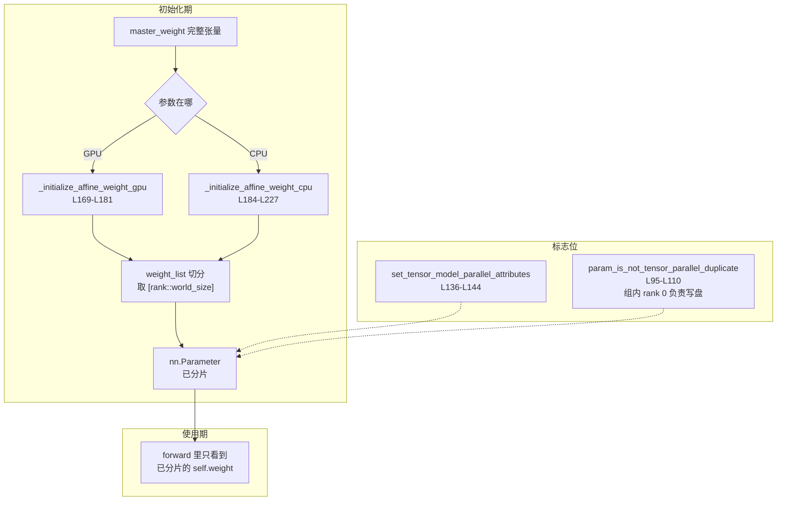
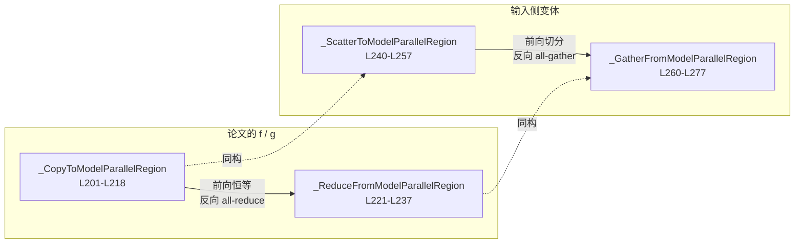
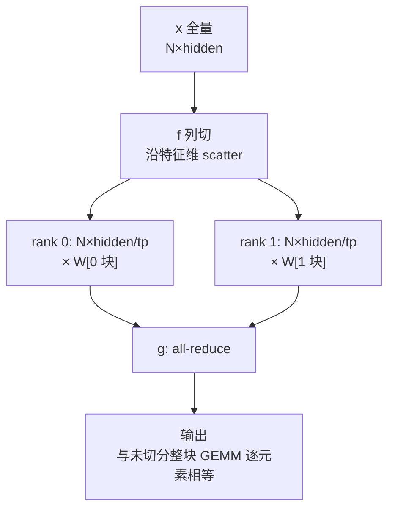
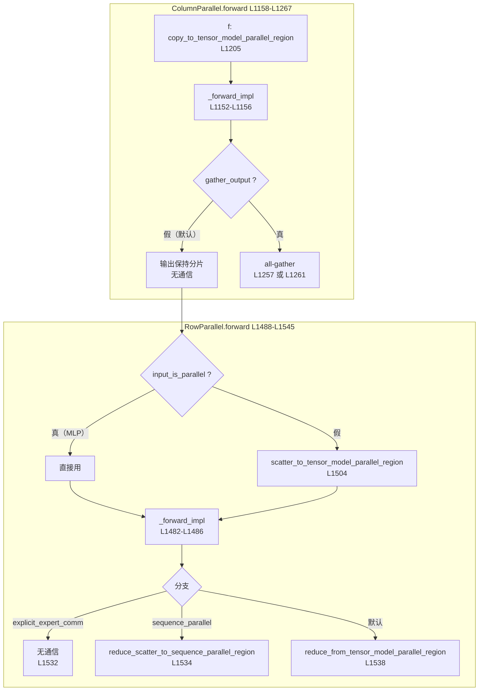
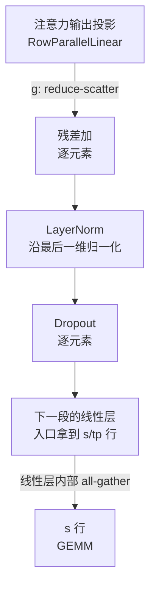
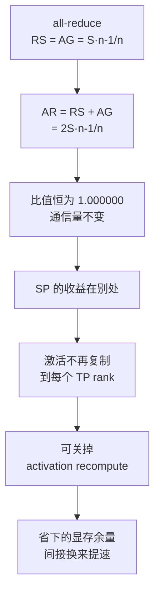
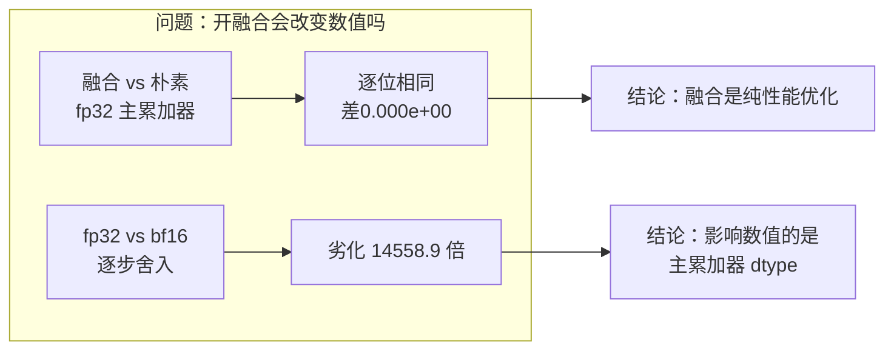

> **Megatron-LM 深度剖析系列 · 第 03 篇**
>
> 前置：[00 地基](/2026/09/28/megatron-00-foundation/)（代码地图 / 配置系统 / 控制流）｜ [01 进程组](/2026/10/08/megatron-01-process-groups-and-comm-overlap/)（组怎么建、怎么选、stream 流派）｜ [02 专家并行](/2026/10/08/megatron-02-expert-parallel/) ｜ [分布式训练（03）张量并行](/2026/08/31/dist-train-03-tensor-parallel/)（并行原理：$$f$$ / $$g$$ 算子、SP 的 RS + AG）
>
> 本系列做**源码层**：并行原理已在《分布式训练》系列讲透，这里一律引用不重推。源码基准 **`megatron-core` 0.20.0**，commit `60e039626`。
>
> **本篇的边界**：只讲**算子代数与数值等价**。通信与计算怎么在 CUDA stream 上组织、`async_op` 与 `CUDA_DEVICE_MAX_CONNECTIONS`、两种 stream 流派、backward 的 launch 序列——这些已在 [01 篇](/2026/10/08/megatron-01-process-groups-and-comm-overlap/) §10 讲透，本篇一律引用不重复。

**TL;DR**

> * 张量并行在一个 transformer 层里只有**两处 all-reduce**：注意力输出投影与 MLP 输出投影。两段 GEMM 之间**没有** all-reduce——这是最容易被记反的一条，因为 GeLU 逐元素、而 Column 的输出特征已经按 rank 切开了（[`mappings.py` L201–L237](https://github.com/NVIDIA/Megatron-LM/blob/60e039626/megatron/core/tensor_parallel/mappings.py#L201-L237)）。
> * `mappings.py` 把张量并行的全部代数收敛成**四个 autograd.Function**：`_CopyToModelParallelRegion`（`mappings.py` L201–L218）、`_ReduceFromModelParallelRegion`（`mappings.py` L221–L237）、`_ScatterToModelParallelRegion`（`mappings.py` L240–L257）、`_GatherFromModelParallelRegion`（`mappings.py` L260–L277）。前两个是论文里的 $$f$$ 与 $$g$$，后两个是它们的「输入侧」版本（[`mappings.py` L240–L277](https://github.com/NVIDIA/Megatron-LM/blob/60e039626/megatron/core/tensor_parallel/mappings.py#L240-L277)）。
> * `f` / `g` 共轭关系的原文出处是 Megatron 原始论文，措辞是「`f` 在前向是恒等算子、在反向是 all-reduce，`g` 反之」；SC21 论文的 Figure 5 是它的规范画法，图注注明图借自原始论文（[arXiv:1909.08053](https://arxiv.org/abs/1909.08053)、[arXiv:2104.04473](https://arxiv.org/abs/2104.04473)）。
> * 代码里 `f` / `g` 的语义写在两个包装函数的 docstring 里，一句话各半：**`forward: copy, backward allreduce`** 与 **`forward: all reduce, backward copy`**（[`mappings.py` L492–L501](https://github.com/NVIDIA/Megatron-LM/blob/60e039626/megatron/core/tensor_parallel/mappings.py#L492-L501)）。这是全篇最该先记住的两行。
> * `ColumnParallelLinear` 的输出**默认不归约**（`gather_output=False`），归约交给下一层的 `RowParallelLinear`。这两层的分工是 TP 最容易看错的地方（[`layers.py` L1158–L1267](https://github.com/NVIDIA/Megatron-LM/blob/60e039626/megatron/core/tensor_parallel/layers.py#L1158-L1267)）。
> * `RowParallelLinear` 的 `input_is_parallel` 决定走哪条路：为 `True` 时输入已按特征维分片、直接用；为 `False` 时先 `scatter_to_tensor_model_parallel_region` 切一次。后者才是论文里 `f` 的「列切」形态（[`layers.py` L1502–L1504](https://github.com/NVIDIA/Megatron-LM/blob/60e039626/megatron/core/tensor_parallel/layers.py#L1502-L1504)）。
> * **序列并行不减少通信量。** SP 把 `g` 的 all-reduce 换成 reduce-scatter、把 Column 输入侧的 scatter 换成 all-gather，ring 算法下 $$\text{AR} = \tfrac{2S(n-1)}{n}$$ 而 $$\text{RS} + \text{AG} = \tfrac{S(n-1)}{n} \times 2 = \tfrac{2S(n-1)}{n}$$，**逐字节相等**。实测比值 tp = 2 / 4 / 8 均为 `1.000000000000000`（[`results/stdout.txt`](https://github.com/lrypcy/ipynbs/blob/890371d1edaa207d60728ffae9627b371a690b63/experiments/megatron/tensor_parallel/results/stdout.txt)）。
> * SP 的收益在**激活显存**：只切 LayerNorm 与 Dropout 之前的那一段激活，官方文档措辞是 *Reduces activation memory by sharding sequence dimension in LayerNorm and Dropout*（[Megatron Core 并行策略指南](https://docs.nvidia.com/megatron-core/developer-guide/latest/user-guide/parallelism-guide.html)）。提速是通过省下的显存余量间接得到的。
> * SP 切的是**序列轴**（`axis=0`），TP 切的是**特征轴**——这是两者最本质的分野。SP 的 `f` 是 all-gather 而非 scatter，作用在序列维上（[`mappings.py` L280–L352](https://github.com/NVIDIA/Megatron-LM/blob/60e039626/megatron/core/tensor_parallel/mappings.py#L280-L352)）。
> * **`gradient-accumulation-fusion` 不改变数值。** 只要主累加器是 fp32，开不开这个开关结果**逐位相同**（实测 `fused vs naive32` 恒为 `0.000e+00`）；真正影响数值的是主累加器的 dtype——每步先把 wgrad 舍入到 bf16 再累加，相对误差从 `9.761e-08` 劣化到 `1.421e-03`，**14558.9 倍**（[`results/stdout.txt`](https://github.com/lrypcy/ipynbs/blob/890371d1edaa207d60728ffae9627b371a690b63/experiments/megatron/tensor_parallel/results/stdout.txt)）。
> * 权重梯度的累加有两条路：`wgrad_deferral` 把 `grad_output` 攒起来延迟算，靠**调度顺序**换重叠；`gradient_accumulation_fusion` 让 wgrad GEMM 以 `beta=1` 直接累加进 `main_grad`，省掉中间 buffer。两者正交，可同时开（[`layers.py` L554–L570](https://github.com/NVIDIA/Megatron-LM/blob/60e039626/megatron/core/tensor_parallel/layers.py#L554-L570)）。
> * vocab-parallel cross entropy 把**词表维**留在每个 rank 上，于是 logits 从 `[seq, batch, vocab]` 降到 `[seq, batch, vocab/tp]`；代价是 log-sum-exp 需要三次 TP 组 all-reduce，其中第一次的归约算子是 `ReduceOp.MAX`（[`cross_entropy.py` L119–L210](https://github.com/NVIDIA/Megatron-LM/blob/60e039626/megatron/core/tensor_parallel/cross_entropy.py#L119-L210)）。
> * 切分发生在**初始化期**，且两条路径分工不是「GPU 快、CPU 慢」而是「权重已经在哪」：`_initialize_affine_weight_gpu`（`layers.py` L169–L181）**不做切分**，只打 TP 标记后在 CUDA RNG tracker 的 `fork()` 里初始化本 rank 那一片；`_initialize_affine_weight_cpu`（`layers.py` L184–L227）才建完整 `master_weight`、切分后跨步取片 `weight_list[rank::world_size]`（[`layers.py` L169–L227](https://github.com/NVIDIA/Megatron-LM/blob/60e039626/megatron/core/tensor_parallel/layers.py#L169-L227)）。
> * **规模感**：`layers.py` 1583 行、`mappings.py` 621 行、`cross_entropy.py` 仅 235 行。其中 `RowParallelLinear` L1308–L1583 占 276 行，而全部集合通信代数集中在 `mappings.py` 的 621 行里。

---

## 1. 引言：一个 transformer 层里有两处 all-reduce

张量并行的原理在《分布式训练（03）》已经推完：把权重按列切、按行切，中间插入一对共轭的虚拟算子 $$f$$ 与 $$g$$，用 all-reduce 把分片的结果合并。本篇要回答的是这三个问题在 mcore 0.20.0 里**具体落在哪几行**。

第一个必须先纠正的记忆点：**一个 transformer 层里只有两处 all-reduce，不是在每个 GEMM 后面。**

MLP 的两段 GEMM 之间没有 all-reduce。这不是实现上的简化，而是结构决定的：

1. 第一段的 `ColumnParallelLinear` 把 $$W_{\text{up}} \in \mathbb{R}^{h \times f}$$ 按**输出维**切成 $$n$$ 份，于是每个 rank 算出的中间结果是 $$[\ast, f/n]$$，各 rank 拿到的是**互不重叠的特征段**；
2. 中间的 `GeLU` 是逐元素的，作用在特征分片上与作用在全量上等价；
3. 第二段的 `RowParallelLinear` 的 `input_is_parallel=True`，直接拿自己那份特征分片去乘 $$W_{\text{down}}$$ 对应的那一块块，产出 $$[\ast, h]$$ 的**部分和**；
4. 这一层的 all-reduce 发生在**输出**上。

所以两处 all-reduce 分别来自注意力输出投影与 MLP 输出投影，结构完全相同。本篇以 MLP 这一处为模型。


*图 1：MLP 的两段式 TP。`f` 在 Column 入口是恒等（输入已全量），`g` 在 Row 出口做 all-reduce。两段 GEMM 之间没有集合通信。*

第二处 all-reduce 在注意力输出投影。那里的输入是 `input_is_parallel=False`，所以 `f` 会真正做一次列切（§5 详述）。

### 1.1 本篇不重复 01 篇的哪一部分

通信与计算的组织方式——`async_op=True`、默认 stream 与 side stream 两种流派、`CUDA_DEVICE_MAX_CONNECTIONS` 为什么被设成 1、backward 的 launch 序列——全在 [01 篇](/2026/10/08/megatron-01-process-groups-and-comm-overlap/) §10。本篇只在需要时引用其结论，不重推。

本篇要讲的是**代数**：哪些算子、什么顺序、数值上凭什么等价。

### 1.2 验证方法与证据等级

三处等价性断言（$$f$$ + `g` ≡ 未切分、SP 的 RS + AG ≡ AR、wgrad 融合不改数值）在 CPU 上用 numpy 复现，属 C 级证据（验算法正确性与数值等价性，不假装是端到端性能）。脚本落在 `ipynbs` 的 `experiments/megatron/tensor_parallel/`，固定 seed，逐格对账，退出码非 0 即为失败。

```bash
cd ~/Desktop/Projects/sandbox/ipynbs/experiments/megatron/tensor_parallel
~/Software/miniconda3/bin/python3 gen_stdout.py            # 写 results/stdout.txt
~/Software/miniconda3/bin/python3 gen_stdout.py --stdout   # 只打屏
```

三项验证与源码的对应关系：

| 编号 | 验证内容 | 对应源码 | 本文章节 |
| --- | --- | --- | --- |
| E1 | `f` 的列切 + `g` 的 all-reduce ≡ 未切分整块 GEMM | `RowParallelLinear.forward` L1504 / L1538 | §3.5 |
| E2 | SP 路径数值等价 + 通信量守恒 | `layers.py` L616–L621、L1534；`mappings.py` L355–L381 | §7 |
| E3 | `gradient-accumulation-fusion` 不改变数值 | `LinearWithGradAccumulationAndAsyncCommunication`、`_wgrad_gemm` | §9.5 |

---

## 2. 权重是怎么被切的

切分逻辑不在 `ColumnParallelLinear` 里，而在它调用的权重初始化函数中。这一点值得先说清楚：读代码时容易在 `forward` 里找「哪一行做了切分」，但那里只看到 `self.weight` 已经是分片状态。

### 2.1 两条初始化路径的分工

`layers.py` 提供两个权重初始化函数，它们的**分工不是「GPU 快、CPU 慢」**，而是「权重已经在哪」。

**GPU 路径**（[`_initialize_affine_weight_gpu` L169–L181](https://github.com/NVIDIA/Megatron-LM/blob/60e039626/megatron/core/tensor_parallel/layers.py#L169-L181)）只有两步：

```python
    set_tensor_model_parallel_attributes(
        tensor=weight, is_parallel=True, dim=partition_dim, stride=stride
    )

    if not is_expert:
        with get_cuda_rng_tracker().fork():
            init_method(weight)
    else:
        with get_cuda_rng_tracker().fork(get_expert_parallel_rng_tracker_name()):
            init_method(weight)
```

它**不做任何切分**——`weight` 传进来时就已经是本 rank 的那一片了，`init_method` 直接在它上面初始化。所以这条路径的前提是「分片已在别处完成」。

那两层 `fork()` 是另一件事：`get_cuda_rng_tracker().fork()` 让不同 TP rank 走到不同的 CUDA RNG 流上，同时保持可复现（同一个 `seed` 下各 rank 的分片互不相关且可重建）。`is_expert` 为真时换用专家并行专用的 RNG tracker 名字。

**CPU 路径**（[`_initialize_affine_weight_cpu` L184–L227](https://github.com/NVIDIA/Megatron-LM/blob/60e039626/megatron/core/tensor_parallel/layers.py#L184-L227)）才真正做切分，docstring 写得很清楚：*Build the master weight on all processes and scatter the relevant chunk*。

```python
    # Initialize master weight
    master_weight = torch.empty(output_size, input_size, dtype=torch.float, requires_grad=False)
    init_method(master_weight)
    master_weight = master_weight.to(dtype=params_dtype)
    # Split and copy
    per_partition_per_stride_size = divide(per_partition_size, stride)
    weight_list = torch.split(master_weight, per_partition_per_stride_size, dim=partition_dim)
    if rank is None:
        rank = get_tensor_model_parallel_rank()
        world_size = get_tensor_model_parallel_world_size()
    my_weight_list = weight_list[rank::world_size]

    with torch.no_grad():
        # all tensors must live on the same device
        cpu_weight = torch.cat(my_weight_list, dim=partition_dim).to_dense()
        weight.data.copy_(cpu_weight)
```

四处值得注意：

| 行 | 行为 | 为什么重要 |
| --- | --- | --- |
| L208–L210 | `master_weight` 恒用 `dtype=torch.float` 建，再 `.to(params_dtype)` | **初始化永远在 fp32 上做**，与训练精度无关 |
| L213 | `torch.split(..., dim=partition_dim)` | 切分轴由调用方传入，`ColumnParallel` 传输出维、`RowParallel` 传输入维 |
| L218 | `weight_list[rank::world_size]` | **跨步取片**：每个 rank 取下标对 `world_size` 同余的那几块 |
| L221–L223 | `torch.cat(...).to_dense()` 后 `copy_` | 跨步取到的多块要重新拼回连续张量 |

那个**跨步取片**（`[rank::world_size]`）是「按 rank 交错分片」的实现细节：先按 `per_partition_size / stride` 把切分轴等分，再按 rank 跨步取。取到的片段数是 `stride`，所以要用 `torch.cat` 拼回去——这解释了 L221 那一步为什么存在。

`rank is None` 时才回落到全局查询（`layers.py` L216–L217），这与 01 篇 §8.1 那套「显式注入优先、`None` 才回落」是同一个模式。

还有两个纯 CPU 路径才有的参数：`return_master_weight`（保留完整张量，供 checkpoint 与权重转换用）与 `skip_set_tensor_parallel_attributes`（跳过标记，供已经打好标的调用方使用）。

**所以两条路径的适用场景是**：模型构建立即在 GPU 上、且分片由外部机制（权重加载、参数搬运）给定时走 GPU 路径；需要从完整权重出发、或要在 CPU 上完成初始化时走 CPU 路径。

### 2.2 TP 属性是一组「标志位」而非组对象

切分信息以三个布尔 / 整型属性挂在 `nn.Parameter` 上。`set_tensor_model_parallel_attributes`（[L136–L144](https://github.com/NVIDIA/Megatron-LM/blob/60e039626/megatron/core/tensor_parallel/layers.py#L136-L144)）只做两件事：

```python
def set_tensor_model_parallel_attributes(tensor, is_parallel, dim, stride):
    """Sets tp attributes to tensor"""
    # Make sure the attributes are not set.
    for attribute in _MODEL_PARALLEL_ATTRIBUTE_DEFAULTS:
        assert not hasattr(tensor, attribute)
    # Set the attributes.
    setattr(tensor, "tensor_model_parallel", is_parallel)
    setattr(tensor, "partition_dim", dim)
    setattr(tensor, "partition_stride", stride)
```

**那圈 `assert` 是这道函数的核心防御**：三个属性只要有一个已经存在就报错。所以重复调用会被当场拦住，而不是静默覆盖成新值。这比「存在就更新」的做法安全得多——后者会让参数在不同路径下被标成不同的切分方式，而这种错误要到 checkpoint 读写时才暴露。

配套的默认值由 `_MODEL_PARALLEL_ATTRIBUTE_DEFAULTS` 提供，另外三个函数各管一种场景（[L113–L166](https://github.com/NVIDIA/Megatron-LM/blob/60e039626/megatron/core/tensor_parallel/layers.py#L113-L166)）：

| 函数 | 行号 | 作用 |
| --- | --- | --- |
| `copy_gtp_attributes` | L113–L118 | 复制 GTP 相关标志 |
| `param_is_not_gtp_duplicate` | L121–L133 | 是否为 GTP 下的非副本参数 |
| `set_defaults_if_not_set_tensor_parallel_attributes` | L147–L155 | 给未标记的参数补上默认值 |
| `copy_tensor_model_parallel_attributes` | L158–L166 | 在替身参数间复制标志 |

`param_is_not_tensor_parallel_duplicate`（[L95–L110](https://github.com/NVIDIA/Megatron-LM/blob/60e039626/megatron/core/tensor_parallel/layers.py#L95-L110)）回答「这个参数是不是唯一分片」，三条路径：

```python
    if hasattr(param, "tensor_model_parallel") and param.tensor_model_parallel:
        return True
    # allreduce=False marks parameters using the expert topology, so filter duplicates over ETP.
    if not getattr(param, "allreduce", True) and expert_tp_group is not None:
        tp_group = expert_tp_group
    # Prefer provided tp_group when available (new explicit path).
    if tp_group is not None:
        return tp_group.rank() == 0
    # Fallback to legacy global state (back-compat).
    return get_tensor_model_parallel_rank() == 0
```

先看参数自己有没有 TP 标志；没有的话按 `allreduce` 判断它是不是走专家拓扑（是则改用 `expert_tp_group`）；最后才看实参 `tp_group`，实参也没有才回落全局状态。两处源码注释把这套优先级写得很清楚——*Prefer provided tp_group when available (**new explicit path**)* 与 *Fallback to legacy global state (**back-compat**)*。这是一处**正在迁移的接口**：新代码应传 `tp_group`，旧代码仍靠全局状态兜底。

判断结果是 `tp_group.rank() == 0`，即**每个 TP 组里只有组内第 0 号 rank 负责把这个参数写进 checkpoint**。01 篇 §8.4 提过这个组内坐标抽象，这里是它在初始化路径上的用途。



*图 2：切分发生在初始化期，`forward` 只消费已分片的权重。标志位负责「谁负责更新与写盘」，不参与切分本身。数据出处：[`layers.py` L95–L227](https://github.com/NVIDIA/Megatron-LM/blob/60e039626/megatron/core/tensor_parallel/layers.py#L95-L227)。*

---

## 3. `f` / `g` 的完整代数

《分布式训练（03）》引入的那对共轭算子，在 mcore 里落成 `mappings.py` 里的一组 autograd.Function。这个文件是张量并行全部代数的所在：**621 行里没有任何模型结构，只有分片与合并**。

### 3.1 七个原语

底层是七个纯函数，都带同一个短路（[L22–L198](https://github.com/NVIDIA/Megatron-LM/blob/60e039626/megatron/core/tensor_parallel/mappings.py#L22-L198)）：

| 函数 | 行号 | 作用 |
| --- | --- | --- |
| `_reduce` | L22–L37 | all-reduce（原地） |
| `_split_along_last_dim` | L40–L57 | 沿最后一维切分并取本 rank 那片 |
| `_split_along_first_dim` | L60–L81 | 沿第一维切分并取本 rank 那段 |
| `_gather_along_last_dim` | L84–L100 | 沿最后一维 all-gather |
| `_reduce_scatter_along_last_dim` | L103–L115 | 沿最后一维 reduce-scatter |
| `_gather_along_first_dim` | L118–L156 | 沿第一维 all-gather |
| `_reduce_scatter_along_first_dim` | L159–L198 | 沿第一维 reduce-scatter |

`_reduce`（[L22–L37](https://github.com/NVIDIA/Megatron-LM/blob/60e039626/megatron/core/tensor_parallel/mappings.py#L22-L37)）的短路写法值得留意：

```python
def _reduce(input_, group):
    """All-reduce the input tensor across model parallel group."""
    assert group is not None, "group should not be None"

    # Bypass the function if we are using only 1 GPU.
    if group.size() == 1:
        return input_

    # All-reduce.
    # Note: If input_ is contiguous, it is mutated in-place.
    # If not, a new contiguous tensor is created and returned;
    # callers must use the returned value to ensure the reduced result is captured.
    input_ = input_.contiguous()
    torch.distributed.all_reduce(input_, group=group)

    return input_
```

两处细节：单元素组直接返回（**短路必须显式写**，它依赖运行时的组大小）；以及 in-place 与否取决于 `input_` 是否 contiguous，注释明确要求调用方**必须使用返回值**——否则非 contiguous 情形下归约结果会被丢掉。

`_split_along_last_dim`（[L40–L57](https://github.com/NVIDIA/Megatron-LM/blob/60e039626/megatron/core/tensor_parallel/mappings.py#L40-L57)）用 `group.rank()` 取组内坐标，这是 01 篇 §8.4 那套组内坐标抽象的用处：

```python
    world_size = group.size()
    # Bypass the function if we are using only 1 GPU.
    if world_size == 1:
        return input_

    input_list = split_tensor_along_last_dim(input_, world_size)

    # Note: torch.split does not create contiguous tensors by default.
    rank = group.rank()
    output = input_list[rank].contiguous()

    return output
```

### 3.2 两套维度：first 与 last

七个原语里除 `_reduce` 外都成对存在——`_split` / `_gather` / `_reduce_scatter` 各有 `along_first_dim` 与 `along_last_dim` 两个版本。两者的差别不只是参数名，实现手法也不同。

`_split_along_first_dim`（[L60–L81](https://github.com/NVIDIA/Megatron-LM/blob/60e039626/megatron/core/tensor_parallel/mappings.py#L60-L81)）走**连续切片**：

```python
    # Split along first dimension.
    dim_size = input_.size()[0]
    assert (
        dim_size % world_size == 0
    ), "First dimension of the tensor should be divisible by tensor parallel size"
    local_dim_size = dim_size // world_size
    rank = group.rank()
    dim_offset = rank * local_dim_size

    output = input_[dim_offset : dim_offset + local_dim_size].contiguous()
```

而 `_split_along_last_dim` 走 `torch.split` 再按下标取。差别在于：first-dim 的分片在张量里**物理连续**，可以直接切片；last-dim 的分片在内存里是交错的，只能先 split 出全部再取一份。

那句 `assert dim_size % world_size == 0` 也值得注意：**first-dim 版本要求整除，没有非等分的余地**。非等分场景由 gather 侧承担——`_gather_along_first_dim`（[L118–L156](https://github.com/NVIDIA/Megatron-LM/blob/60e039626/megatron/core/tensor_parallel/mappings.py#L118-L156)）多两个参数：

```python
def _gather_along_first_dim(input_, group, output_split_sizes=None, use_global_buffer=False):
    """Gather tensors and concatenate along the first dimension.

    Args:
        input_tensor (torch.Tensor):
            A tensor to be gathered.
        output_split_sizes (List[int], optional):
            A list specifying the sizes of the output splits along the first dimension.
            If None, equal splitting is assumed. Default: None.
    """
```

`output_split_sizes` 让调用方指定每段的长度，缺省才用等分。这对应的是**变长序列场景**：pack 之后每个样本长度不同，序列维上的分片天然不等分（07 篇讲 CP 与 packed 序列时会回到这个参数）。

`use_global_buffer` 则对应 01 篇 §10.5 那个 `GlobalMemoryBuffer`——是否复用全局缓冲池。

七个原语与四个算子的对应关系：

| 原语 | 被谁调用 | 切分轴 |
| --- | --- | --- |
| `_reduce` | `_ReduceFromModelParallelRegion.forward` | — |
| `_split_along_last_dim` | `_CopyToModelParallelRegion.forward` | 特征维 |
| `_gather_along_last_dim` | `_GatherFromModelParallelRegion.backward` | 特征维 |
| `_split_along_first_dim` | `_ScatterToModelParallelRegion.forward` | 序列维 |
| `_gather_along_first_dim` | `_GatherFromModelParallelRegion.forward` | 序列维 |
| `_reduce_scatter_along_first_dim` | `_ReduceScatterToSequenceParallelRegion` | 序列维 |

这张表也解释了为什么 `mappings.py` 需要两套维度：**TP 切特征维、SP 切序列维**，而 gather/scatter 的实现在两个轴上的内存布局不同。

### 3.3 四个张量并行算子

原语之上是四个 autograd.Function，构成 TP 的完整代数（[L201–L277](https://github.com/NVIDIA/Megatron-LM/blob/60e039626/megatron/core/tensor_parallel/mappings.py#L201-L277)）：

| 算子 | 行号 | forward | backward | 在 TP 里的角色 |
| --- | --- | --- | --- | --- |
| `_CopyToModelParallelRegion` | L201–L218 | 恒等 | all-reduce | $$f$$ |
| `_ReduceFromModelParallelRegion` | L221–L237 | all-reduce | 恒等 | $$g$$ |
| `_ScatterToModelParallelRegion` | L240–L257 | 沿输入维切分 | all-gather | Column 的输入侧变体 |
| `_GatherFromModelParallelRegion` | L260–L277 | all-gather | 沿输出维切分 | Row 的输入侧变体 |

四个算子的 forward / backward 组合只有四种，全部是「恒等 ↔ 集合通信」的排列。把它们排成一张表就是 TP 的全部代数：

| | forward | backward |
| --- | --- | --- |
| 恒等 | `_Copy`（$$f$$） | `_Reduce` |
| 通信 | `_Reduce`（$$g$$） | `_Copy` |

而另外两个把「通信」换成了「切分 / 拼接」，于是多出两组：

| | forward | backward |
| --- | --- | --- |
| 切分 / 拼接 | `_Scatter` | `_Gather` |
| 拼接 / 切分 | `_Gather` | `_Scatter` |

**这张 2×2 表就是 TP 的全部**。前两行是论文里的 $$f$$ / $$g$$，后两行是它们在「输入侧」的对应物。01 篇 §8.3 提到过 `f` / `g` 共用一个 `group` 对象——而这里能看到更深一层：`_Copy` 与 `_Reduce` 互为逆运算，所以反向传播可以直接复用前向那个算子的反向形态，不需要另写一份。

Megatron 原始论文给出的措辞与这张表一致：$$f$$ 在前向是恒等算子、在反向是 all-reduce，$$g$$ 反之，两者互为共轭（[arXiv:1909.08053](https://arxiv.org/abs/1909.08053)）。SC21 论文的 Figure 5 是它的规范画法，图注写明图借自原始论文（[arXiv:2104.04473](https://arxiv.org/abs/2104.04473)）。



*图 3：四个张量并行算子。前两个是论文里的 $$f$$ 与 $$g$$，后两个把「集合通信」换成「切分 / 拼接」，用于输入侧。数据出处：[`mappings.py` L201–L277](https://github.com/NVIDIA/Megatron-LM/blob/60e039626/megatron/core/tensor_parallel/mappings.py#L201-L277)。*

### 3.4 包装函数：语义写在 docstring 里

对外暴露的是七个包装函数，`f` / `g` 的定义就在其中（[L492–L513](https://github.com/NVIDIA/Megatron-LM/blob/60e039626/megatron/core/tensor_parallel/mappings.py#L492-L513)）：

```python
def copy_to_tensor_model_parallel_region(input_, group=None):
    """Wrapper for autograd function: forward: copy, backward allreduce"""
    group = get_tensor_model_parallel_group_if_none(group)
    return _CopyToModelParallelRegion.apply(input_, group)


def reduce_from_tensor_model_parallel_region(input_, group=None):
    """Wrapper for autograd function: forward: all reduce, backward copy"""
    group = get_tensor_model_parallel_group_if_none(group)
    return _ReduceFromModelParallelRegion.apply(input_, group)
```

**这两段 docstring 应当是全篇最先记住的两行**：`forward: copy, backward allreduce` 与 `forward: all reduce, backward copy`。01 篇 §8.3 讨论过它们的 `group` 回落逻辑（两处都调 `get_tensor_model_parallel_group_if_none`），那是组的选择机制；这里关注的是它们定义的两个算子。

另外两个包装函数对应输入侧（[L504–L513](https://github.com/NVIDIA/Megatron-LM/blob/60e039626/megatron/core/tensor_parallel/mappings.py#L504-L513)）：

```python
def scatter_to_tensor_model_parallel_region(input_, group=None):
    ...

def gather_from_tensor_model_parallel_region(input_, group=None):
    ...
```

### 3.5 数值等价性：$$f$$ + `g` ≡ 未切分

第一项验证：`f` 的列切 + `g` 的 all-reduce 与未切分的整块 GEMM 逐元素相等。

模型取 `RowParallelLinear` 在 `input_is_parallel=False` 时的路径——输入全量复制，`f` 沿特征维 scatter，$$W$$ 按输入维切，每 rank 算出一份部分和，`g` 做 all-reduce。

规格取 `s=8 b=4 hidden=16 ffn=48`（$$N = 32$$，$$ffn = 3 \times hidden$$），参考量级 `absmax = 15.8227`：

| tp | 相对误差 | 绝对误差 |
| --- | --- | --- |
| 2 | 1.205e-07 | 1.907e-06 |
| 4 | 1.205e-07 | 1.907e-06 |
| 8 | 1.808e-07 | 2.861e-06 |

误差停在 float32 的机器精度量级（`1.2e-07`），**且不随 tp 增大而累积**。这是「分片求和」与整块 GEMM 等价的直接证据：误差来源是浮点加法顺序，与分片数无关。

对账脚本对这三行用的判据是**相对误差不得超过 `1e-5`**，比实测值宽两个数量级。这个阈值不是随手取的：float32 的机器精度是约 `1.2e-07`，所以「等价」在数值上的含义就是「误差停在机器精度那一档」，而不是「误差为零」。真正的零误差在通信参与求和时不可能出现——`2 + 3` 与 `3 + 2` 在浮点下逐位相同，但三项求和的顺序一变，结果就可能差一个 ulp。这也是为什么断言写成阈值而不是 `== 0`。

对比 §9.5 那条 `fused vs naive32` 恒等于 `0`：那里能断言等号，是因为两条路径的**浮点运算顺序完全相同**，差别只在累加写回的位置。那条对比恰好把「顺序相同 ⇒ 逐位相同」这件事反证了出来。



*图 4：第一项验证的数据流。误差 `1.2e-07` 不随 tp 增大，说明分片数不改变浮点加法链的长度。数据出处：[`results/stdout.txt`](https://github.com/lrypcy/ipynbs/blob/890371d1edaa207d60728ffae9627b371a690b63/experiments/megatron/tensor_parallel/results/stdout.txt) §3。*

---

## 4. `ColumnParallelLinear`：`f` 在哪，为什么输出不归约

`ColumnParallelLinear` 有 386 行（[L920–L1305](https://github.com/NVIDIA/Megatron-LM/blob/60e039626/megatron/core/tensor_parallel/layers.py#L920-L1305)），但通信相关的只有四处。

### 4.1 `forward` 的骨架

`forward` 签名（`layers.py` L1158–L1163）只收三样：`input_`、`weight`、`runtime_gather_output`。输入的三维顺序在 docstring 里写明是 `[sequence, batch, hidden]`。

真正干活的部分按顺序是：

| 位置 | 行号 | 做什么 |
| --- | --- | --- |
| 输入侧通信 | L1205 | `f`：`copy_to_tensor_model_parallel_region` |
| wgrad 延迟分支 | L1207–L1212 | 若 `defer_embedding_wgrad_compute`，可能先把 `input` 存进 `embedding_activation_buffer` |
| GEMM | L1152–L1156 | `_forward_impl` 二选一（见 §8） |
| 输出侧 | L1251–L1266 | 仅当 `gather_output` 为真才通信 |

`f` 那一行（`layers.py` L1205）：

```python
            input_parallel = copy_to_tensor_model_parallel_region(input_, group=self.tp_group)
```

`copy_to_tensor_model_parallel_region` 的 forward 是恒等（§3.4），所以这一行在非 SP 下不做任何实际通信——**`f` 的代价全在反向**。这一点值得停一下：`f` 的名字看起来像「复制」，实际上它真正的身份是「反向的 all-reduce」，因为 backward 里的 `all_reduce` 只在它的反向出现。

### 4.2 为什么输出默认不归约

`gather_output` 默认 `False`。为假时，L1251–L1266 整段跳过，输出保持 `[s/tp, b, out/tp]` 的分片状态直接交给下一层：

```python
        if gather_output:
            # All-gather across the partitions.
            if self.use_inference_optimized_all_gather and not self.training:
                from .inference_layers import inference_all_gather_from_tensor_model_parallel_region
                output = inference_all_gather_from_tensor_model_parallel_region(
                    output_parallel, self.tp_group, self.config
                )
            else:
                output = gather_from_tensor_model_parallel_region(
                    output_parallel, group=self.tp_group
                )
        else:
            output = output_parallel
```

这段有两处值得注意：

1. **L1257 的推理专用分支**用 `import` 写在函数体内，注释写明理由是 *Deferred to avoid circular import: inference_layers → TE → layers*。这是处理循环 import 的常见手法，但代价是这个 import 每步都走一遍字典查找。
2. **L1261 与 L1257 二选一**，判据是 `use_inference_optimized_all_gather and not self.training`。所以训练与推理走的是不同的 all-gather 实现。

**输出的分片状态是被下游消费的**——下一个 `LayerNorm` 在特征维上逐元素归一化，不需要跨 rank；`RowParallelLinear` 再把这份分片乘起来。所以 MLP 中间**不需要**任何通信，这与 §1 的结构图一致。

### 4.3 `backward_dw` 与 `sharded_state_dict`

`backward_dw`（`layers.py` L1269–L1274）与 `backward_ad` 并列，负责权重梯度。它是 §9 里 deferral 与融合的挂载点——`ColumnParallelLinear` 把「权重梯度怎么算」这件事完全交给了 `LinearWithGradAccumulationAndAsyncCommunication`，自己只保留一个把 `grad_output` 转成权重梯度的入口。

`sharded_state_dict`（[L1276–L1286](https://github.com/NVIDIA/Megatron-LM/blob/60e039626/megatron/core/tensor_parallel/layers.py#L1276-L1286)）负责 checkpoint 侧的元数据：把本 rank 的**分片形状**与全局形状一并记录下来，否则加载方无法复原完整权重。`RowParallelLinear` 有一份对应的（`layers.py` L1554–L1564）、`VocabParallelEmbedding` 也有一份（`layers.py` L381–L400）。

这三份 `sharded_state_dict` 与 §2.2 的 `param_is_not_tensor_parallel_duplicate` 是配套的两半：后者决定**哪个 rank 负责写**，前者决定**写出去的形状怎么描述**。TP 权重不是每个 rank 都有一份完整副本，所以 checkpoint 的读写必须两处都改到，缺一处就会出现「只有 0 号 rank 的分片被存下来」这类静默错误。

---

## 5. `RowParallelLinear`：`g` 在哪，SP 分支怎么换

`RowParallelLinear` 有 276 行（[L1308–L1583](https://github.com/NVIDIA/Megatron-LM/blob/60e039626/megatron/core/tensor_parallel/layers.py#L1308-L1583)），是本篇最重的单个类。通信相关的是两处分叉。

### 5.1 输入侧：`input_is_parallel` 的二选一

L1502–L1507：

```python
        # Set up backprop all-reduce.
        if self.input_is_parallel:
            input_parallel = input_
        else:
            assert not self.sequence_parallel
            input_parallel = scatter_to_tensor_model_parallel_region(input_, group=self.tp_group)
```

这是**整篇最容易看错的一处**，§1.2 的实验就踩在这里：

- `input_is_parallel=True`：输入已经按特征维分片，直接用。MLP 的第二个 GEMM 走这条。
- `input_is_parallel=False`：输入是全量复制的，需要 `scatter_to_tensor_model_parallel_region` 沿特征维切一次。**这才是论文里 `f` 的「列切」形态**，也是 §3.5 验证的那条路径。

那句 `assert not self.sequence_parallel` 是纪律：这两条路互斥。SP 场景下输入必然是分片的（SP 切序列维，但 `RowParallelLinear` 的 `input_is_parallel` 说的是特征维是否分片），所以不能同时成立。

紧随其后的 L1506 是 `allreduce_dgrad = False`——**`RowParallelLinear` 自己不做 dgrad 的 all-reduce**，那件事由 `_forward_impl` 内部的 autograd.Function 负责（§9）。

### 5.2 输出侧：三选一

L1531–L1538：

```python
        if self.explicit_expert_comm:
            assert self.skip_bias_add
            output_ = output_parallel
        elif self.sequence_parallel:
            output_ = reduce_scatter_to_sequence_parallel_region(
                output_parallel, group=self.tp_group
            )
        else:
            output_ = reduce_from_tensor_model_parallel_region(output_parallel, group=self.tp_group)
```

三条分支的判据顺序值得留意：

| 分支 | 条件 | `g` 的形态 |
| --- | --- | --- |
| 专家通信 | `explicit_expert_comm` | **无通信**，直接把分片交给调用方 |
| 序列并行 | `sequence_parallel` | reduce-scatter |
| 默认 | 其余 | all-reduce |

第一条是为 MoE 准备的：`explicit_expert_comm` 打开时，`RowParallelLinear` 不做归约，把分片原样交出去（[02 篇](/2026/10/08/megatron-02-expert-parallel/) §2 讲过 expert 网格的 DP 组等于 dense 网格的 DP 组，通信由 dispatcher 接管）。

第二条就是 SP 的全部改动：**`g` 从 all-reduce 换成 reduce-scatter**，输出从 `[s, b, h]` 变成 `[s/tp, b, h]`。

### 5.3 两个类的对照



*图 5：两个线性层的通信点全貌。`ColumnParallel` 的通信在入口且默认不出口，`RowParallel` 的通信在出口。数据出处：[`layers.py` L1152–L1545](https://github.com/NVIDIA/Megatron-LM/blob/60e039626/megatron/core/tensor_parallel/layers.py#L1152-L1545)。*

---

## 6. 序列并行的三件套

SP 在 `mappings.py` 里有三个专属算子，加上两个 TP 变体共五个（[L280–L421](https://github.com/NVIDIA/Megatron-LM/blob/60e039626/megatron/core/tensor_parallel/mappings.py#L280-L421)）：

| 算子 | 行号 | forward | backward | 用在哪 |
| --- | --- | --- | --- | --- |
| `_ScatterToSequenceParallelRegion` | L280–L297 | 沿序列维切分 | all-gather | SP 下把全序列变成分片序列 |
| `_GatherFromSequenceParallelRegion` | L300–L352 | all-gather | reduce-scatter | Column 的输入侧（§9） |
| `_ReduceScatterToSequenceParallelRegion` | L355–L381 | reduce-scatter | all-gather | `RowParallelLinear` 的 `g` |
| `_AllGatherFromTensorParallelRegion` | L384–L401 | 沿最后一维 all-gather | reduce-scatter | 变体 |
| `_ReduceScatterToTensorParallelRegion` | L404–L421 | 沿最后一维 reduce-scatter | all-gather | 变体 |

对比 §3.3 的四个 TP 算子，SP 这一组有两个明显差别：

1. **切分轴不同**。TP 算子切特征维（`split_along_last_dim` / `first_dim`），SP 算子切序列维。这正是「SP 与 TP 的分界」在代码里的落点。
2. **多了两个变体**。`_AllGatherFromTensorParallelRegion` 与 `_ReduceScatterToTensorParallelRegion`（`mappings.py` L384–L421）沿**最后一维**做 gather / reduce-scatter，用于词表维切分那类场景（§10）。

对外的包装函数是三个（[L516–L543](https://github.com/NVIDIA/Megatron-LM/blob/60e039626/megatron/core/tensor_parallel/mappings.py#L516-L543)）：

```python
def scatter_to_sequence_parallel_region(input_, group=None):
    ...

def gather_from_sequence_parallel_region(input_, group=None, output_split_dim=-1):
    ...

def reduce_scatter_to_sequence_parallel_region(input_, group=None):
    ...
```

`gather_from_sequence_parallel_region` 多一个 `output_split_dim=-1` 参数——gather 回来之后要决定沿哪个维再切一次，这个参数就是给 Column 的 `W` 按输出维切分用的。

### 6.1 SP 的前向：gather 在线性层内部

SP 最容易漏掉的一处是 **all-gather 发生在 `LinearWithGradAccumulationAndAsyncCommunication.forward` 内部**，而不是在 `ColumnParallelLinear` 里：

```python
        if sequence_parallel:
            dim_size = list(input.size())
            dim_size[0] = dim_size[0] * tp_group.size()

            all_gather_buffer = get_global_memory_buffer().get_tensor(dim_size, input.dtype, "mpu")
            dist_all_gather_func(all_gather_buffer, input, group=tp_group)
            total_input = all_gather_buffer
        else:
            total_input = input

        return _linear_forward(total_input, weight, bias, output_dtype)
```

在非 SP 路径下 `total_input = input`，一行通信都没有。所以 `ColumnParallelLinear.forward` L1205 那个 `f` 既是恒等、也是 gather——因为真正的 gather 被推到线性层里去了。

这个设计带来一个实用好处：`GlobalMemoryBuffer` 复用（01 篇 §10.5 提过）让这个 all-gather 的 buffer 不必每次分配。

### 6.2 SP 在 transformer 层里的落点

既然 SP 只改两处通信，那这两处在层内的**相对位置**就决定了它能省多少显存。

关键在 §6.1 那行 `dim_size[0] = dim_size[0] * tp_group.size()`（`layers.py` L617–L618）：SP 下线性层**入口期望的输入是 `[s/tp, b, h]`**，all-gather 之后才变成 `[s, b, h]` 去算 GEMM。把它放回层结构里看：



*图 6：SP 的分片区间覆盖残差加、LayerNorm、Dropout 三处。它们全是逐元素或沿最后一维归一化，所以在 `[s/tp, b, h]` 上做与在全量上做等价，无需任何通信。数据出处：[`layers.py` L616–L621](https://github.com/NVIDIA/Megatron-LM/blob/60e039626/megatron/core/tensor_parallel/layers.py#L616-L621)。*

于是「SP 为什么只切两处」有了结构性解释：进入 LayerNorm 之前把序列切掉，LayerNorm 沿最后一维归一化、切序列不影响它；Dropout 逐元素、同样不受影响；残差加要求两侧形状一致，所以残差也必须是分片状态。**从 reduce-scatter 到下一次 all-gather 之间，所有算子都得能在分片序列上工作**——而这三处恰好都满足。

官方并行策略指南的措辞正是这个区间：*sharding sequence dimension in LayerNorm and Dropout*（[Parallelism Strategies Guide](https://docs.nvidia.com/megatron-core/developer-guide/latest/user-guide/parallelism-guide.html)）。

这也解释了 SP 与 CP 的分野：SP 只切这一小段区间里的激活，段外的激活（attention 内部的 QKV、softmax 输出等）仍是全量；CP 切的是整条序列维上的**全部**激活，所以通信对象与组大小都不同（[Context Parallel Package](https://docs.nvidia.com/megatron-core/developer-guide/latest/user-guide/features/context_parallel.html)）。

### 6.3 两个配置级约束

SP 不是孤立的开关，它与另两个配置项有硬依赖。

**与 `distribute_saved_activations` 互斥**（[`transformer_config.py` L1912–L1916](https://github.com/NVIDIA/Megatron-LM/blob/60e039626/megatron/core/transformer/transformer_config.py#L1912-L1916)）：

```python
            if self.distribute_saved_activations and self.sequence_parallel:
                raise ValueError(
                    f"distribute_saved_activations: {self.distribute_saved_activations} must be "
                    f"false when sequence parallel is enabled: {self.sequence_parallel}"
                )
```

这条在 `__post_init__` 里，所以是**启动即失败**而不是运行到一半才炸。两个开关都在动激活的存放位置，一个要跨模型并行组摊开、一个要沿序列切，互斥是必然的。配置类里还有另外两条同类互斥（`transformer_config.py` L1908 附近那条 `recompute_num_layers` 与 `recompute_granularity`），说明这个类把互斥关系集中收在 `__post_init__` 里。

**`clone_scatter_output_in_embedding` 默认开**（[`transformer_config.py` L1164–L1166](https://github.com/NVIDIA/Megatron-LM/blob/60e039626/megatron/core/transformer/transformer_config.py#L1164-L1166)）：

```python
    clone_scatter_output_in_embedding: bool = True
    """When set to True, clone the output of scatter_to_sequence_parallel_region in embedding layer
    to facilitate garbage collection of input."""
```

它的动机是**让 `input` 引用计数归零以便被回收**——SP 下 embedding 层的 scatter 输出如果不 clone，`input` 会一直被 autograd 图引用住，显存回收不掉。这类「为了 GC 而多复制一次」的取舍在显存账本里通常被忽略（00 篇 §5 记的六项之外还有这类）。

---

## 7. SP 的数值等价与通信量守恒

本节是全篇的核心断言，都由 §1.2 那套脚本验证。

### 7.1 数值等价

SP 路径把 `Column` 输入侧的分片 gather 回全序列、把 `Row` 出口的 all-reduce 换成 reduce-scatter。两者都不改变数学结果：

| tp | 非 SP 相对误差 | SP 相对误差 |
| --- | --- | --- |
| 2 | 1.706e-07 | 1.706e-07 |
| 4 | 1.706e-07 | 1.138e-07 |
| 8 | 2.275e-07 | 1.138e-07 |

两列都停在 float32 的机器精度量级，且 **SP 并不比非 SP 更差**——因为 SP 的 reduce-scatter 在数学上就是 all-reduce 的一半 + 一次分片。

注意 reduce-scatter 与 all-reduce 的差别**只在最后一步**：两者都先跨 rank 求和拿到全量行，区别是 RS 随后只让每个 rank 保留自己那段行。求和这一步是共用的，所以数值路径完全一致。

### 7.2 通信量守恒

这是必须钉死的一条，因为它最容易被反过来理解。按 ring 算法的 bus-byte 口径（单 rank 收发字节数）：

$$\text{AllReduce} = \frac{2S(n-1)}{n}, \qquad \text{ReduceScatter} = \frac{S(n-1)}{n}, \qquad \text{AllGather} = \frac{S(n-1)}{n}$$

于是

$$\text{AllReduce} = \text{ReduceScatter} \circ \text{AllGather} = \frac{2S(n-1)}{n}$$

**这是一个恒等式，不是近似。** 实测（单位化到 $$S = 1$$）：

| tp | AllReduce | RS + AG | 比值 |
| --- | --- | --- | --- |
| 2 | 2.000000 | 2.000000 | 1.000000000000000 |
| 4 | 3.000000 | 3.000000 | 1.000000000000000 |
| 8 | 3.500000 | 3.500000 | 1.000000000000000 |

比值**逐位为 1**。所以：**序列并行不减少通信量。**

这里要加一条限定，否则容易被读过头：上表数的是**单 rank 的 bus 字节**（bus bytes，即每个 rank 收发之和），不是集合通信的总量，也不是时间。$$\frac{2S(n-1)}{n}$$ 是 ring 算法在理想链路上单 rank 的收发字节数，实际耗时还取决于拓扑（哪些 rank 在同一节点、节点间链路多快）、消息大小是否够大到 saturate、以及通信与计算能否重叠（01 篇 §10 讲的那一层）。

所以准确的说法是：**SP 在字节层面与 TP 持平，在时间层面未必持平**。RS 与 AG 的消息数是 AR 的两倍（两个原语 vs 一个），小消息下固定开销占比更高。真实的取舍是「省下的激活显存」与「多一次原语的固定开销」之间的比较，而本篇不给出这个比较的数值——本机无 GPU，耗时类数字只能引官方数据（00 篇引过的那批），不能自己测（`profiling` 系列负责那部分）。

### 7.3 SP 的收益在哪

在**激活显存**。Megatron Core 官方并行策略指南的措辞是 *Reduces activation memory by sharding sequence dimension in LayerNorm and Dropout*（[Parallelism Strategies Guide](https://docs.nvidia.com/megatron-core/developer-guide/latest/user-guide/parallelism-guide.html)）——收益字段只写显存，不写带宽。

官方上下文并行文档给出了 SP 与 CP 的分界，读起来也是同一个意思：*Unlike prior SP (sequence parallelism) which only splits the sequence of Dropout and LayerNorm activations, CP partitions the network inputs and all activations along sequence dimension*（[Context Parallel Package](https://docs.nvidia.com/megatron-core/developer-guide/latest/user-guide/features/context_parallel.html)）。

SP 的原始出处是 [arXiv:2205.05198](https://arxiv.org/abs/2205.05198)。机制层面的因果是：SP 打开后，在进入 LayerNorm 与 Dropout 之前激活不再被复制到每个 TP rank，于是可以**关掉 activation recompute**——提速是通过省下的显存余量间接得到的，而不是通信量下降的直接结果。

把这条记反的代价很具体：会以为开了 SP 就能省带宽，于是把 TP 往跨节点方向调，结果瓶颈从显存挪到网络。



*图 7：SP「不减通信量」与「收益在激活显存」的关系。数据出处：[`results/stdout.txt`](https://github.com/lrypcy/ipynbs/blob/890371d1edaa207d60728ffae9627b371a690b63/experiments/megatron/tensor_parallel/results/stdout.txt) §6 的通信量三行与 [并行策略指南](https://docs.nvidia.com/megatron-core/developer-guide/latest/user-guide/parallelism-guide.html)。*

---

## 8. `_forward_impl`：两条路的分叉点

两个线性类把「用哪套 autograd.Function」这件事收敛到同一个判断上。`ColumnParallelLinear._forward_impl`（[L1152–L1156](https://github.com/NVIDIA/Megatron-LM/blob/60e039626/megatron/core/tensor_parallel/layers.py#L1152-L1156)）与 `RowParallelLinear._forward_impl`（[L1482–L1486](https://github.com/NVIDIA/Megatron-LM/blob/60e039626/megatron/core/tensor_parallel/layers.py#L1482-L1486)）**逐字相同**：

```python
    def _forward_impl(self, input, weight, *args, **kwargs):
        if not weight.requires_grad:
            return linear_with_frozen_weight(input, weight, *args, **kwargs)
        else:
            return linear_with_grad_accumulation_and_async_allreduce(input, weight, *args, **kwargs)
```

判据只有一个：`weight.requires_grad`。

### 8.1 冻结权重路径

`LinearWithFrozenWeight`（[L403–L441](https://github.com/NVIDIA/Megatron-LM/blob/60e039626/megatron/core/tensor_parallel/layers.py#L403-L441)）的 `forward`（`layers.py` L414–L420）极短：

```python
    def forward(ctx, input, weight, bias, allreduce_dgrad, tp_group, output_dtype):
        """Forward with frozen weight."""
        ctx.save_for_backward(weight)
        ctx.allreduce_dgrad = allreduce_dgrad
        ctx.tp_group = tp_group
        ctx.input_dtype = input.dtype
        return _linear_forward(input, weight, bias, output_dtype)
```

两处与可训练路径形成鲜明对比：

- **`ctx.save_for_backward(weight)` 只存权重，不存输入**。权重不需要梯度，所以反向传播不需要 `input`；而可训练路径必须存 `input`（`grad_output^T @ input` 是权重梯度的来源）。
- **前向零通信**，也不做任何分片处理——它就是个 GEMM。

`backward`（`layers.py` L424–L441）相应地只产出输入梯度，且藏着两个值得记的细节：

```python
    def backward(ctx, grad_output):
        """Backward with frozen weight."""
        (weight,) = ctx.saved_tensors
        grad_output = grad_output.to(ctx.input_dtype)
        if grad_output.dim() > 2:
            # Work around PyTorch matmul not folding some size-1 leading dims to mm.
            # Remove this once https://github.com/pytorch/pytorch/issues/186148 is fixed.
            grad_output_2d = grad_output.reshape(-1, grad_output.size(-1))
            grad_input = grad_output_2d.matmul(weight)
            grad_input = grad_input.reshape(*grad_output.shape[:-1], weight.size(1))
        else:
            grad_input = grad_output.matmul(weight)

        if ctx.allreduce_dgrad:
            # All-reduce. Note: here async and sync are effectively the same.
            torch.distributed.all_reduce(grad_input, group=ctx.tp_group)

        return grad_input, None, None, None, None, None
```

**其一，三维输入要显式摊成二维。** 注释挂着一个 PyTorch issue：*Work around PyTorch matmul not folding some size-1 leading dims to mm*——某些 size 为 1 的前导维不会被 `matmul` 折叠进底层 `mm`，所以这里手动 `reshape(-1, ...)` 算完再 `reshape` 回来，并注明「等 pytorch#186148 修掉就删」。这是典型的「已知上游 bug + 写明移除条件」的写法。

**其二，all-reduce 是同步的。** 注释只有一句 *Note: here async and sync are effectively the same*。原因是可训练路径的 all-reduce 能与 wgrad 重叠，而冻结路径没有 wgrad，异步没有任何东西可掩盖——所以这里老老实实同步调用。同一份代码里两种路径的同步/异步选择，是 §9 那套重叠机制的一个反例参照。

末尾的 `None, None, None, None, None` 对应 `input / weight / bias / allreduce_dgrad / tp_group / output_dtype` 六个入参：权重不需要梯度，其余四个都不是张量。

包在外面的 `linear_with_frozen_weight`（`layers.py` L471–L551）负责取 `tp_group`、组装参数并 `apply`。所以「冻结权重」省下的是**反向的整套 grad accumulation 机制**，而不是前向的通信。

---

## 9. `LinearWithGradAccumulationAndAsyncCommunication`

这是全篇最长的单个类，226 行（[L573–L798](https://github.com/NVIDIA/Megatron-LM/blob/60e039626/megatron/core/tensor_parallel/layers.py#L573-L798)），也是 01 篇 §10 讲过的通信与 GEMM 重叠的**真身**。

**本节不重复 01 篇 §10.1 与 §10.6 的内容**——那些是 stream 层的机制（`async_op`、两种流派、`CUDA_DEVICE_MAX_CONNECTIONS`、launch 序列）。这里只看**代数层**：哪些梯度、在什么顺序、怎么累加。

### 9.1 forward：只有一个分叉

`forward`（`layers.py` L578–L626）主体是一次 GEMM，唯一分叉是 SP 的输入 gather（§6.1 已引）。

GEMM 本身在 `_linear_forward`（[L444–L468](https://github.com/NVIDIA/Megatron-LM/blob/60e039626/megatron/core/tensor_parallel/layers.py#L444-L468)）里，它有两条路径：

```python
def _linear_forward(
    input: torch.Tensor,
    weight: torch.Tensor,
    bias: Optional[torch.Tensor],
    output_dtype: Optional[torch.dtype],
) -> torch.Tensor:
    """Run a linear GEMM with an optional output dtype distinct from its input dtype."""
    if output_dtype is None or output_dtype == input.dtype:
        output = torch.matmul(input, weight.t())
        if bias is not None:
            output = output + bias
        return output

    # Deferred to avoid a circular import: transformer_engine imports tensor-parallel layers.
    from megatron.core.extensions.transformer_engine import te_general_gemm

    if te_general_gemm is None:
        raise RuntimeError(
            "A mixed-precision linear output requires Transformer Engine general_gemm."
        )

    input_shape = input.shape
    input_2d = input.reshape(-1, input_shape[-1])
    output = te_general_gemm(weight, input_2d, out_dtype=output_dtype, layout="TN", bias=bias)[0]
    return output.reshape(*input_shape[:-1], weight.size(0))
```

四点值得记：

- **`weight.t()`**。权重按 `[out, in]` 存储，GEMM 时才转置——这与 §2.1 里 `master_weight = torch.empty(output_size, input_size)` 的顺序一致。
- **同精度走 `torch.matmul`，混合精度才进 TE**。判据是 `output_dtype` 存在且与输入不同，注意这是**输出侧**精度的开关。
- **又一处延迟导入**，理由与 §4.2 那处完全相同：*Deferred to avoid a circular import: transformer_engine imports tensor-parallel layers*。且 `te_general_gemm` 为 `None` 时明确 `raise` 而非静默退化——混合精度输出**强依赖** Transformer Engine。
- **`layout="TN"` 与两次 `reshape`**。先摊成二维让 TE 只看到规整的矩阵形状，算完再 `reshape` 回 `[s, b, h]`。这让 GEMM 与张量前三维的具体布局解耦。

`forward` 开头还有一个判断（`layers.py` L591–L594）：

```python
        if gradient_accumulation_fusion and hasattr(weight, "main_grad"):
            main_grad = weight.main_grad
        else:
            main_grad = None
```

**两个条件是与的**。开了 `--gradient-accumulation-fusion` 但参数上没有 `main_grad`（例如 Megatron-FSDP 的 `__fsdp_param__` 情形），会退回朴素路径。这道门禁的作用是防止「开关开了但累加进了一个不存在的 buffer」这种静默错误。

### 9.2 backward 的顺序

`backward`（`layers.py` L630–L798）的执行顺序在 01 篇 §10.6 以 launch 序列的形式列过。这里按**代数**重排一遍，每一步标出它算什么：

| 步 | 算什么 | 落在哪 |
| --- | --- | --- |
| ① | SP 时 all-gather `input` | L667 |
| ② | `grad_output^T @ weight` 得到 `grad_input` 的 dgrad 部分 | L676 |
| ③ | `handle.wait()` | L680 |
| ④ | `prepare_input_tensors_for_wgrad_compute` 把攒下的转成可喂 GEMM 的列表 | L683 |
| ⑤ | 非 SP 时异步 all-reduce `grad_input`；SP 时异步 reduce-scatter | L687–L703 |
| ⑥ | `_wgrad_gemm` 累加权重梯度 | L554–L570 |

② 与 ⑤ 之间那次 `wait()` 是**同步点**：dgrad 必须先算完，才能交给 all-reduce。① 与 ② 之间没有等待，这正是重叠的来源（机制见 01 篇 §10.1）。

### 9.3 权重梯度为什么要 fuse

`_wgrad_gemm`（[L554–L570](https://github.com/NVIDIA/Megatron-LM/blob/60e039626/megatron/core/tensor_parallel/layers.py#L554-L570)）是 `grad_output^T @ input`，输出直接累加进 `main_grad`：

```python
        if ctx.gradient_accumulation_fusion:
            # In case of Megatron-FSDP, need to create main grad buffers in-place
            if hasattr(weight, "__fsdp_param__"):
                weight.main_grad = weight.get_main_grad()
                _wgrad_gemm(weight.main_grad, grad_output, total_input)
```

融合省掉的是一个**中间张量**：不融合时每步要产出一份独立的 wgrad，再由 autograd 的梯度累加器加到 `.grad` 上；融合时 `main_grad` 就是那个累加器本身，GEMM 以 `beta = 1` 直接写进去。

`__fsdp_param__` 那个分支要单独说一句：Megatron-FSDP 的参数在包装时可能还没有 `main_grad` 缓冲区，需要 `weight.get_main_grad()` 现场建一个再传进去。这不是可选项——少这一步融合路径会崩。

### 9.4 wgrad deferral：用调度顺序换重叠

`wgrad_deferral` 与融合是**两件正交的事**。deferral 的判断在 L654–L657：

```python
        wgrad_compute = True
        if grad_output_buffer is not None:
            if wgrad_deferral_limit == 0 or len(grad_output_buffer) < wgrad_deferral_limit:
                grad_output_buffer.append(grad_output)
                wgrad_compute = False
```

`wgrad_deferral_limit == 0` 表示不限，于是所有 micro-step 的 `grad_output` 都攒起来，等到 §9.2 的 ④ 步一次性喂给 `_wgrad_gemm`。

两者的分工很清楚：

| | 改变什么 | 不改变什么 |
| --- | --- | --- |
| `gradient_accumulation_fusion` | 权重梯度的**累加位置**（省中间张量） | 累加次数、累加顺序 |
| `wgrad_deferral` | 权重梯度的**计算时机**（推迟，蹭别的通信） | 计算量、累加结果 |

§9.1 那道 `hasattr(weight, "main_grad")` 门禁也说明融合不是无条件安全的。

### 9.5 融合不改变数值

第二项针对 §9.3 的断言：**开不开 `gradient-accumulation-fusion`，结果逐位相同。**

三条累加路径，真值基准取 fp64 累加：

| steps | fused vs naive32 | fused vs fp64 | naive16 vs fp64 |
| --- | --- | --- | --- |
| 4 | **0.000e+00** | 1.113e-07 | 2.070e-03 |
| 16 | **0.000e+00** | 9.761e-08 | 1.421e-03 |
| 64 | **0.000e+00** | 2.829e-07 | 1.901e-03 |

三条路径分别是：`fused` 每步以 `beta = 1` 累加进 fp32 的 `main_grad`；`naive32` 每步产出独立 fp32 wgrad 再按步序相加；`naive16` 每步先把 wgrad 舍入到 bf16 再累加。

两条结论：

1. **`fused_vs_naive32` 恒为 `0`**——只要主累加器是 fp32，两条路径**逐位相同**。这个开关是纯性能优化，不是数值语义变更。
2. **劣化全部来自 dtype，不来自融合方式。** steps = 16 时 fp32 主累加器相对误差 `9.761e-08`；若每步先舍入 bf16 再累加则为 `1.421e-03`，**劣化 14558.9 倍**（`1.4559e4`）。

所以「要不要开融合」的答案与数值无关，只与显存和速度有关；而**「主累加器用 fp32」才是数值稳定性的关键**。



*图 8：第二项验证的两条结论。`fused vs naive32` 恒为 0，`naive16` 相对 `fp64` 劣化约 1.46e4 倍。数据出处：[`results/stdout.txt`](https://github.com/lrypcy/ipynbs/blob/890371d1edaa207d60728ffae9627b371a690b63/experiments/megatron/tensor_parallel/results/stdout.txt) §9。*

---

## 10. 词表维的两处切分

前面十节都在切特征维（hidden / ffn）。词表维是另一条切分线，由两个类承担：`VocabParallelEmbedding` 与 `vocab_parallel_cross_entropy`。

### 10.1 `VocabParallelEmbedding`

`VocabParallelEmbedding` 有 171 行（[L230–L400](https://github.com/NVIDIA/Megatron-LM/blob/60e039626/megatron/core/tensor_parallel/layers.py#L230-L400)），`forward` 在 L329–L379。与线性层同样的分工：**入口不通信，出口三选一**。

入口做的是 id 空间的重映射（`layers.py` L335–L341）：

```python
        if self.tp_group.size() > 1:
            # Build the mask.
            input_mask = (input_ < self.vocab_start_index) | (input_ >= self.vocab_end_index)
            # Mask the input.
            masked_input = input_.clone() - self.vocab_start_index
            masked_input[input_mask] = 0
        else:
            masked_input = input_
```

三步：

1. **建 mask**：不在本 rank 词表区间 $$[\texttt{vocab\_start\_index}, \texttt{vocab\_end\_index})$$ 内的 id 全部标记出来；
2. **平移**：`input_.clone() - vocab_start_index` 把全局 id 变成相对本分片的偏移；
3. **清零**：不属于本分片的位置置 0，避免后续索引越界。

`input_` 是**全局词表 id**，而每个 rank 的权重只有 `vocab/tp` 行。所以「查表」在 TP 下必须先解决 id 空间映射——这一步与 §10.2 里 cross entropy 用 `vocab_start_index` / `vocab_end_index` 算区间是同一套机制，只是那边用来 mask target、这边用来重映射输入。

L337 的 `input_.clone()` 是**必须的一次复制**：`masked_input` 要被就地改写，而 `input_` 是调用方持有的张量。

查表那一步有一个为可复现性准备的分支（`layers.py` L347–L354）：

```python
        # Get the embeddings.
        if self.deterministic_mode:
            output_parallel = weight[masked_input]
        else:
            # F.embedding currently has a non-deterministic backward function
            output_parallel = F.embedding(masked_input, weight)
```

`deterministic_mode` 打开时用**高级索引** `weight[masked_input]` 替代 `F.embedding`，注释给出原因：*F.embedding currently has a non-deterministic backward function*。即 PyTorch 的 embedding **反向**（对权重求导时的原子累加顺序）不确定，而前向确定。RL 场景要求训练与推理的 logprob 逐位一致（[02 篇](/2026/10/08/megatron-02-expert-parallel/) 提到的 `batch_invariant` 那条线），所以需要一个开关把反向也钉住。

出口那三选一（`layers.py` L368–L376）：

```python
        if self.reduce_scatter_embeddings:
            # Data format change to avoid explicit tranposes : [b s h] --> [s b h].
            output_parallel = output_parallel.transpose(0, 1).contiguous()
            ...
                output = reduce_scatter_to_sequence_parallel_region(
                    output_parallel, group=self.tp_group
                )
        elif self.tp_group.size() > 1:
            # Reduce across all the model parallel GPUs.
            output = reduce_from_tensor_model_parallel_region(output_parallel, group=self.tp_group)
        else:
            output = output_parallel
```

三个分支对应三种下游需求：

| 分支 | 条件 | 出口形态 |
| --- | --- | --- |
| reduce-scatter | `reduce_scatter_embeddings` | `[s/tp, b, h]`，进入 SP 路径 |
| all-reduce | `tp_size > 1` | `[s, b, h]` 全量 |
| 直通 | 单 rank | 原样 |

`reduce_scatter_embeddings` 这个开关的语义在 `__init__` 的 docstring 里写得很直白：*Decides whether to perform ReduceScatter after embedding lookup*。注意第一分支里那句注释 *Data format change to avoid explicit tranposes : `[b s h] --> [s b h]`*——transpose 被提到通信之前做，是为了避免 all-gather / reduce-scatter 内部再转置一次。

另有一处容易漏的细节（`layers.py` L335–L357）：padding 位置要在通信**之前**置零。

```python
        # Mask the output embedding.
        if self.tp_group.size() > 1:
            output_parallel[input_mask, :] = 0.0
```

顺序很关键——若先通信再置零，那次 all-reduce 会把别处的 0 冲掉。

### 10.2 vocab-parallel cross entropy

`cross_entropy.py` 全文只有 235 行，是本篇最短的文件，三个符号（[L13–L235](https://github.com/NVIDIA/Megatron-LM/blob/60e039626/megatron/core/tensor_parallel/cross_entropy.py#L13-L235)）：

| 符号 | 行号 | 角色 |
| --- | --- | --- |
| `VocabParallelCrossEntropy` | L13–L116 | 静态方法集合，真正的算法在这里 |
| `_VocabParallelCrossEntropy` | L119–L210 | autograd.Function，只负责 `forward` / `backward` 的编排 |
| `vocab_parallel_cross_entropy` | L213–L235 | 对外入口 |

**为什么它是「显存杀手解法」**：logits 的形状是 `[sequence_length, batch_size, vocab_size/num_parallel_ranks]`（`cross_entropy.py` L213–L235 的 docstring 明写）。词表维切到每个 rank 上之后，长词表的 logits 从 `[s, b, vocab]` 降到 `[s, b, vocab/tp]`——这是长序列训练里最占显存的单个张量。

代价是 log-sum-exp 需要跨 rank 归约。`forward`（`cross_entropy.py` L121 起）里有**三次** TP 组 all-reduce：

| 序 | 行号 | 归约对象 | 算子 |
| --- | --- | --- | --- |
| ① | L130 | `logits_max` | `ReduceOp.MAX` |
| ② | L146–L148 | `predicted_logits` | `ReduceOp.SUM` |
| ③ | L150–L152 | `sum_exp_logits` | `ReduceOp.SUM` |

①是典型的 **log-sum-exp 稳定化**：先在本地取最大值，再在 TP 组上取全局最大值，之后所有 `exp` 都在减去这个最大值之后计算。②③ 各需要一个求和，因为每个 rank 只持有词表的一段。

L136–L138 用组内坐标算本 rank 的词表区间：

```python
        get_vocab_range = VocabUtility.vocab_range_from_per_partition_vocab_size
        partition_vocab_size = vocab_parallel_logits.size()[-1]
        rank = get_pg_rank(tp_group)
        world_size = get_pg_size(tp_group)
        vocab_start_index, vocab_end_index = get_vocab_range(partition_vocab_size, rank, world_size)
```

`get_pg_rank` / `get_pg_size` 正是 01 篇 §8.4 那套组内坐标抽象（返回 `0..size-1` 的组内编号，`group is None` 时退化为 0）。这里它们的作用是把**全局词表 id**映射到**本地分片区间**——`vocab_start_index` 正是 `target` 里那些落在别处 id 上的位置需要被 mask 掉的依据。

`VocabParallelCrossEntropy` 的算法被拆成五个静态方法，官方 API 文档给出了同一份清单（[core.tensor_parallel.cross_entropy](https://docs.nvidia.com/megatron-core/developer-guide/latest/apidocs/core/core.tensor_parallel.cross_entropy.html)）：

| 方法 | 作用 |
| --- | --- |
| `calculate_logits_max` | 算本地最大值（对应的全局归约即 L130） |
| `calculate_predicted_logits` | 算目标 token 的 logit 与 `sum_exp`（对应 L146、L150） |
| `calculate_cross_entropy_loss` | 由三者组装 loss |
| `prepare_gradient_calculation_operands` | 准备反向需要的操作数 |
| `calculate_gradients` | 反向梯度 |

同一份文档也确认了 `vocab_parallel_cross_entropy` 的四个参数与本篇引用一致。

---

## 11. 小结与下一篇

把全篇收成六条：

1. **一个 transformer 层只有两处 all-reduce。** MLP 的两段 GEMM 之间没有通信，因为 Column 的输出特征已按 rank 切好、GeLU 逐元素、Row 的 `input_is_parallel=True`。
2. **张量并行的全部代数是四个 autograd.Function。** `_Copy` / `_Reduce` 是论文里的 $$f$$ 与 $$g$$；`_Scatter` / `_Gather` 是它们在输入侧的对应物。四者的 forward / backward 组合只有「恒等 ↔ 集合通信」与「切分 ↔ 拼接」两组。
3. **切分发生在初始化期。** `_initialize_affine_weight_gpu` 用 `weight_list[rank::world_size]` 把分片写进 `nn.Parameter`，`forward` 只消费已分片的权重。组内 rank 0 负责更新与写盘。
4. **SP 改的是轴不是算法。** 序列轴（`axis=0`）而非特征轴，`g` 从 all-reduce 换成 reduce-scatter、输入侧从 scatter 换成 all-gather。数值等价（相对误差 `1.1e-07`），通信量**逐字节守恒**（比值恒 `1.000000000000000`）。
5. **SP 的收益在激活显存，不在带宽。** 官方文档写的是 *Reduces activation memory by sharding sequence dimension in LayerNorm and Dropout*；提速来自能关掉 activation recompute。
6. **融合不改数值，主累加器 dtype 才改。** `gradient-accumulation-fusion` 在 fp32 主累加器下与朴素累加**逐位相同**；每步先舍入 bf16 则相对误差劣化 `1.4559e4` 倍。`wgrad_deferral` 则是推迟计算时机，与融合正交、可同时开。

顺手留下的几条可直接用的结论：

- **`ColumnParallelLinear` 默认不归约输出**（`gather_output=False`），归约在下一层 `RowParallelLinear` 上。看到「为什么 Column 后面没有 all-reduce」，答案是它不需要。
- **`input_is_parallel` 决定 `RowParallelLinear` 的输入侧走哪条路**，且它与 `sequence_parallel` 互斥。互斥由两处分别保证：构造期 `__init__` 的 `raise RuntimeError`（`layers.py` L1376–L1377，提示 *To enable `sequence_parallel`, `input_is_parallel` must be `True`*），与 forward 里 else 分支的 `assert not self.sequence_parallel`（`layers.py` L1503）。
- **`explicit_expert_comm` 打开时 `RowParallelLinear` 完全不做 `g`**，把分片原样交给 MoE dispatcher。
- **`LinearWithFrozenWeight` 的 `forward` 不存 `input`**，因为权重梯度不需要它；这条路径省的是反向的累加机制。
- **`--gradient-accumulation-fusion` 有前提**：参数上必须有 `main_grad`，否则静默退回朴素路径（`layers.py` L591）。

本篇是并行体系源码层的第三篇。下一篇 **04 GTP**：`generalized_tensor_parallelism.py`（2647 行）改了什么、weight-centric 与 activation-centric 的分野、`gtp_remat` 的重 materialization 策略，以及它那套 per-`(chain_id, group)` 的 side stream 与本文 §9 那条 `async_op` 路线的分野。

其余待写：数据并行与三套优化器实现、1F1B 调度器的工程细节、上下文并行的三条路线。

### 11.1 覆盖边界

本篇在 `tensor_parallel/` 三个文件里的覆盖情况：

| 符号 | 行号 | 本篇 | 备注 |
|---|---|---|---|
| `_initialize_affine_weight_gpu` / `_cpu` | L169–L227 | §2.1 讲透 | — |
| TP 属性三函数 | L136–L166 | §2.2 讲透 | `copy_gtp_attributes` 只列名 |
| `VocabParallelEmbedding` | L230–L400 | §10.1 讲透 | `sharded_state_dict` 未展开 |
| `LinearWithFrozenWeight` | L403–L441 | §8.1 讲透 | — |
| `_linear_forward` | L444–L468 | §9.1 讲透 | — |
| `linear_with_frozen_weight` | L471–L551 | §8.1 提一句 | 组装逻辑未展开 |
| `_wgrad_gemm` | L554–L570 | §9.3 讲透 | — |
| `LinearWithGradAccumulationAndAsyncCommunication` | L573–L798 | §9 讲代数层 | **stream 与重叠机制引 01 §10，不重复** |
| `linear_with_grad_accumulation_and_async_allreduce` | L801–L914 | §8 提一句 | 警示打印那段未展开 |
| `ColumnParallelLinear` | L920–L1305 | §4 讲通信点 | `__init__` 的参数校验未展开 |
| `RowParallelLinear` | L1308–L1583 | §5 讲通信点 | 同上 |
| `mappings.py` 七个原语 | L22–L198 | §3.1–§3.2 讲透 | — |
| `mappings.py` 四个 TP 算子 | L201–L277 | §3.3 讲透 | — |
| `mappings.py` 三个 SP 算子 + 两变体 | L280–L421 | §6 列全 | `_Scatter` 的反向未逐行讲 |
| `mappings.py` `_AllToAll` 及 SP↔HP | L424–L621 | **未覆盖** | 属 MoE 与 CP，02 篇与 07 篇负责 |
| `cross_entropy.py` | L13–L235 | §10.2 讲前向三归约 | `backward` 与 `calculate_gradients` 未展开 |

明确**不在**本篇范围：通信与计算的 stream 组织（01 篇 §10）、overlap 开关组合决策与收益上界（优化工具箱）、MoE 的 all-to-all（02 篇）、上下文并行的三条路线（07 篇）。

上表里标「讲透」的部分，其数值断言都能在 `experiments/megatron/tensor_parallel/` 的对账输出里逐格找到对应行；标「未展开」的部分不是不重要，而是留给更合适的篇目。`gen_stdout.py` 的退出码非 0 即为对账失败，可以直接当 CI 门禁用——本文的三张表因此不是「写完就算」，而是每次改动都能重跑复核。

---

## 引用关系网

```mermaid
graphLR
    subgraph CL["核心论断"]
        C1["层内只有两处all-reduce<br/>两段 GEMM 之间无通信"]
        C2["SP 不减通信量<br/>收益在激活显存"]
        C3["融合不改数值<br/>主累加器 dtype 才改"]
        C4["切分发生在初始化期"]
    end
    subgraph SR["支撑来源"]
        S1["layers.py ColumnParallel<br/>forward"]
        S2["layers.py RowParallel<br/>forward"]
        S3["mappings.py<br/>四个 TP 算子"]
        S4["mappings.py<br/>三个 SP 算子"]
        S5["layers.py<br/>初始化函数"]
        S6["arXiv 2205.05198"]
        S7["arXiv 1909.08053"]
        S8["并行策略指南"]
        S9["results/stdout.txt<br/>等价性实验"]
    end
    S1 -->|"支撑"| C1
    S2 -->|"支撑"| C1
    S3 -->|"支撑"| C1
    S5 -->|"支撑"| C4
    S6 -->|"支撑"| C2
    S8 -->|"支撑"| C2
    S4 -->|"支撑"| C2
    S9 -->|"支撑"| C2
    S9 -->|"支撑"| C3
    S7 -->|"支撑"| C3
```

*图 9：核心论断与支撑来源。四条论断分别落在 §1、§7、§9、§2。完整 permalink 见下方图注与参考节。*

---

## 参考

1. Megatron Core 源码：`https://github.com/NVIDIA/Megatron-LM`（本文对应 commit `60e039626`，`megatron-core` 0.20.0）
2. 本文主要引用的源文件（均锁 commit）：[`megatron/core/tensor_parallel/layers.py`](https://github.com/NVIDIA/Megatron-LM/blob/60e039626/megatron/core/tensor_parallel/layers.py)（`layers.py` L95–L227 权重初始化与 TP 属性、L230–L400 `VocabParallelEmbedding`、L403–L441 `LinearWithFrozenWeight`、L444–L468 `_linear_forward`、L554–L570 `_wgrad_gemm`、L573–L798 `LinearWithGradAccumulationAndAsyncCommunication`、L801–L914 包装函数、L920–L1305 `ColumnParallelLinear`、L1308–L1583 `RowParallelLinear`）、[`megatron/core/tensor_parallel/mappings.py`](https://github.com/NVIDIA/Megatron-LM/blob/60e039626/megatron/core/tensor_parallel/mappings.py)（`mappings.py` L22–L198 七个原语、L201–L277 四个 TP 算子、L280–L421 三个 SP 算子与两个变体、L492–L543 包装函数）、[`megatron/core/tensor_parallel/cross_entropy.py`](https://github.com/NVIDIA/Megatron-LM/blob/60e039626/megatron/core/tensor_parallel/cross_entropy.py)（`cross_entropy.py` L13–L116 算法五步、L119–L210 autograd.Function、L213–L235 对外入口）
3. 本文的等价性实验（C 级，纯 CPU、固定 seed）：[`experiments/megatron/tensor_parallel/`](https://github.com/lrypcy/ipynbs/tree/890371d1edaa207d60728ffae9627b371a690b63/experiments/megatron/tensor_parallel)，锁定 commit `890371d`；实跑输出 [`results/stdout.txt`](https://github.com/lrypcy/ipynbs/blob/890371d1edaa207d60728ffae9627b371a690b63/experiments/megatron/tensor_parallel/results/stdout.txt)，实现 [`tp_equiv.py`](https://github.com/lrypcy/ipynbs/blob/890371d1edaa207d60728ffae9627b371a690b63/experiments/megatron/tensor_parallel/tp_equiv.py)，对账脚本 [`gen_stdout.py`](https://github.com/lrypcy/ipynbs/blob/890371d1edaa207d60728ffae9627b371a690b63/experiments/megatron/tensor_parallel/gen_stdout.py)（退出码非 0 即为对账失败）
4. Shoeybi et al., *Megatron-LM: Training Multi-Billion Parameter Language Models Using Model Parallelism and Reducing Activation Recomputation in Large Transformer Models*：https://arxiv.org/abs/1909.08053（$$f$$ / $$g$$ 共轭算子的原始出处，§3.3）
5. Narayanan et al., *Efficient Large-Scale Language Model Training on GPU Clusters Using Megatron-LM*：https://arxiv.org/abs/2104.04473（Figure 5 给出 $$f$$ / $$g$$ 的规范画法，图注注明借自上一条，§3.3）
6. Korthikanti et al., *Reducing Activation Recomputation in Large Transformer Models*：https://arxiv.org/abs/2205.05198（序列并行的原始出处；收益在激活显存，§7.3）
7. Megatron Core 官方并行策略指南：https://docs.nvidia.com/megatron-core/developer-guide/latest/user-guide/parallelism-guide.html（SP 的作用是 *Reduces activation memory by sharding sequence dimension in LayerNorm and Dropout*，§7.3）
8. Megatron Core 官方上下文并行文档：https://docs.nvidia.com/megatron-core/developer-guide/latest/user-guide/features/context_parallel.html（SP 与 CP 的分界：SP 只切 Dropout / LayerNorm 激活，CP 切网络输入与全部激活，§7.3）
9. Megatron Core API 文档 `core.tensor_parallel.cross_entropy`：https://docs.nvidia.com/megatron-core/developer-guide/latest/apidocs/core/core.tensor_parallel.cross_entropy.html（`VocabParallelCrossEntropy` 的五个静态方法与 `vocab_parallel_cross_entropy` 的参数，§10.2）
10. Megatron Core API 文档 `core.tensor_parallel.layers`：https://docs.nvidia.com/megatron-core/developer-guide/latest/apidocs/core/core.tensor_parallel.layers.html（SP 下前向 all-gather、反向 reduce-scatter，且 reduce-scatter 与权重梯度计算异步，§6.1）
11. 前作：《Megatron-LM 深度剖析（00）地基》[/2026/09/28/megatron-00-foundation/]、《（01）进程组》[/2026/10/08/megatron-01-process-groups-and-comm-overlap/]、《（02）专家并行》[/2026/10/08/megatron-02-expert-parallel/]、《分布式训练（03）张量并行》[/2026/08/31/dist-train-03-tensor-parallel/]