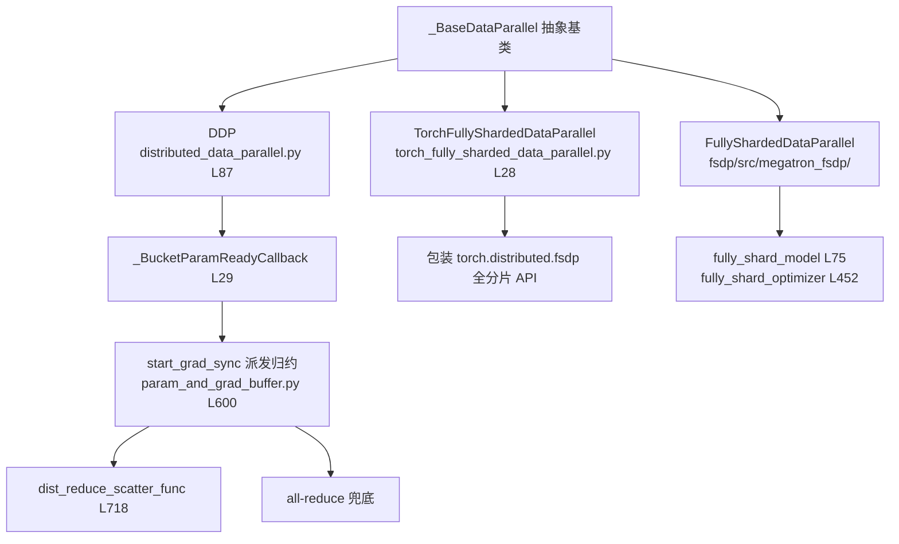
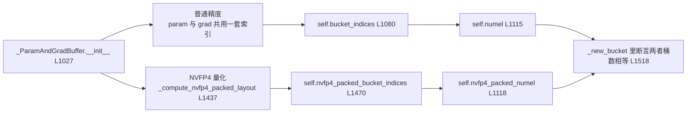
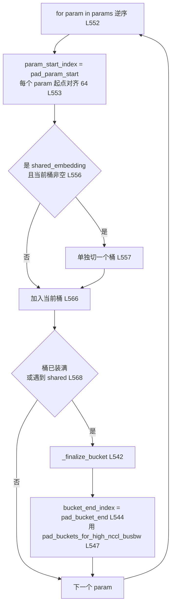
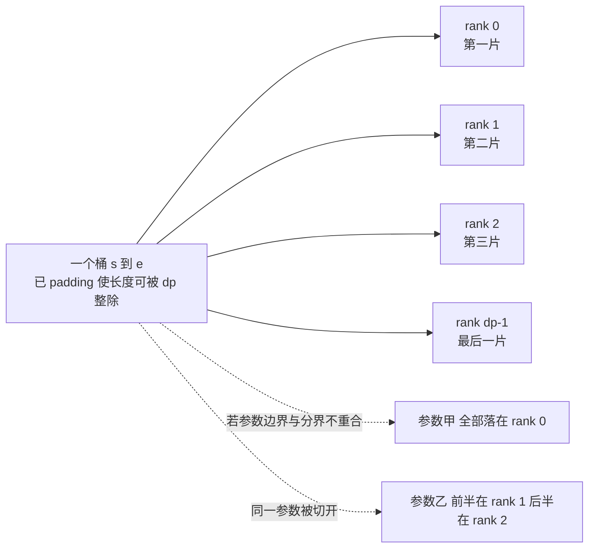
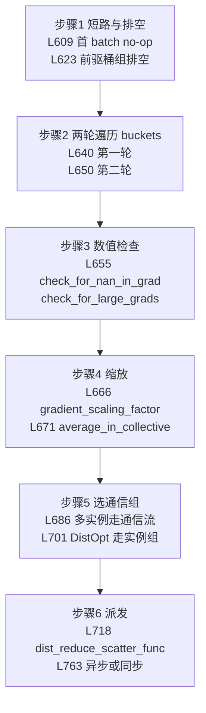
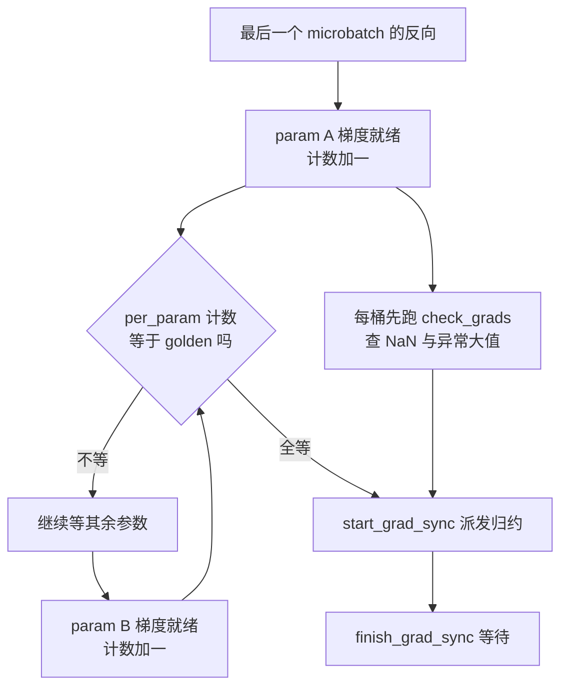
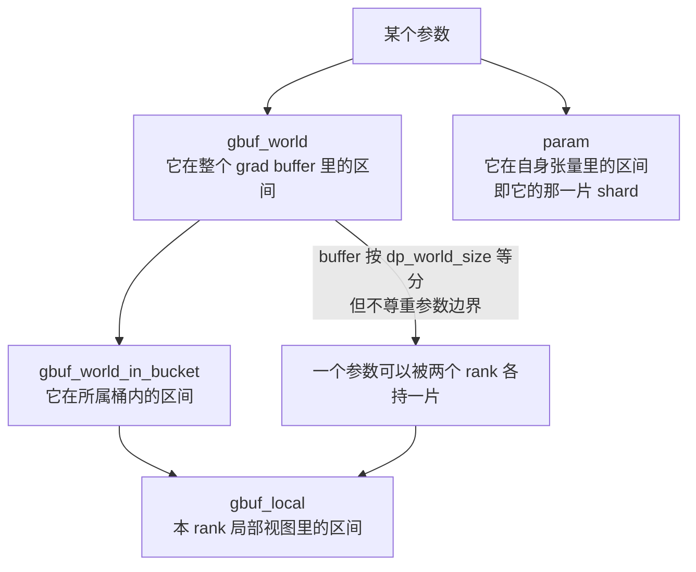
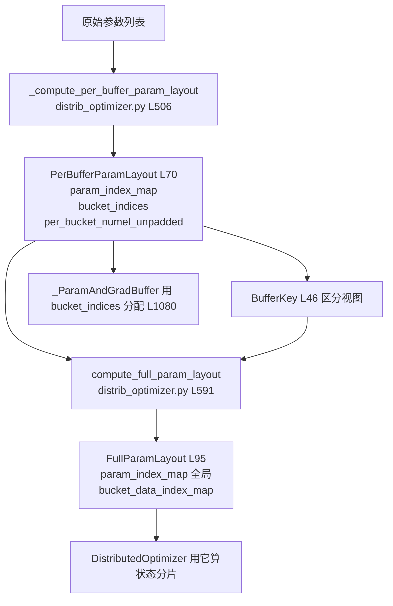
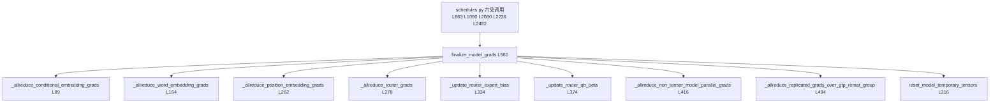
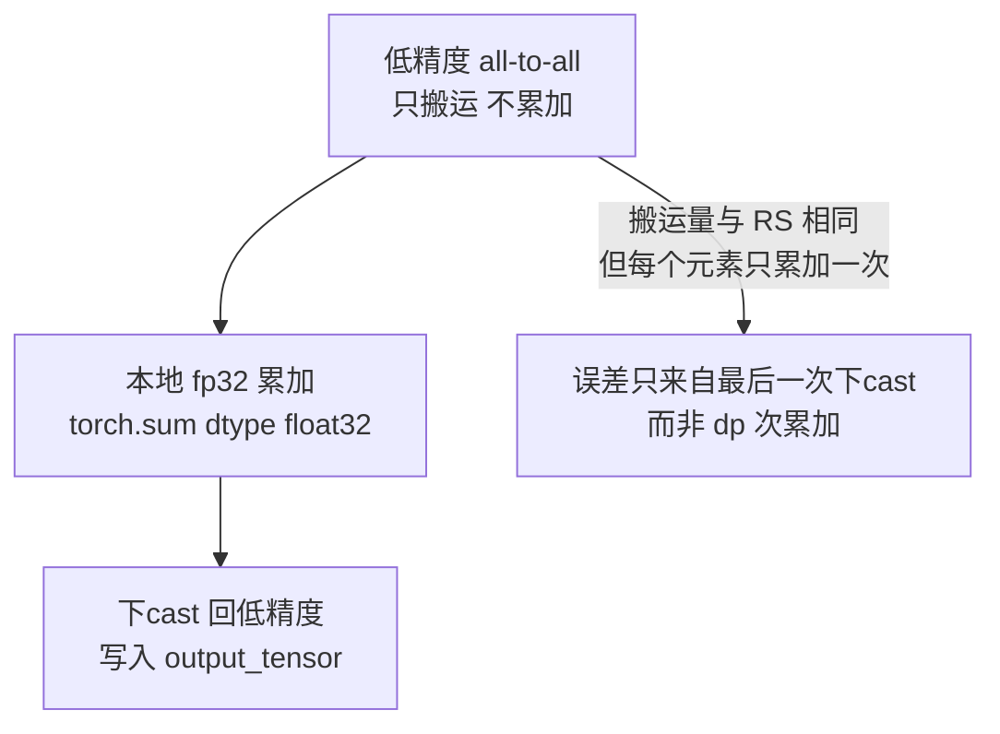

> 源码基准：`megatron-core` **0.20.0**，commit [`60e039626`](https://github.com/NVIDIA/Megatron-LM/tree/60e039626)。本文所有行号均对该 commit 取证。
> 配套实验：[`ipynbs` commit `31438fd`](https://github.com/lrypcy/ipynbs/tree/31438fd) 的 `experiments/megatron/data_parallel/`。

这是本系列最硬的一块。前面四篇都在讲「怎么切」，这一篇讲「切完之后梯度怎么回来」。DP + TP + PP 这套组合本身出自 [Narayanan et al., *Efficient Large-Scale Language Model Training on GPU Clusters Using Megatron-LM*](https://arxiv.org/abs/2104.04473)；本文要处理的是它留在数据并行侧的那堆工程细节。

数据并行的实现难度不在切分，而在于：**梯度归约要压在反向传播的计算间隙里，还不能挡住它**。为了做到这一点，Megatron 把梯度搬进了一块自己管理的连续显存，并且让它与权重共享同一块 buffer——这个设计省下大量显存，也让整篇 `param_and_grad_buffer.py`（1794 行）变成了全系列最长的单文件。

本文要回答四个问题：

1. DDP / Megatron-FSDP / FSDP2 三套实现在**代码的哪一层**分叉？
2. `param_and_grad_buffer` 里的 bucket 到底怎么切？padding 的 64 / 128 / 2<sup>16</sup> 是什么？
3. `DistributedOptimizer` 的分片布局和 ZeRO-1 为什么**不完全是一回事**？`param_layout.py` 到底在干什么？
4. `overlap_grad_reduce` / `overlap_param_gather` / `overlap_param_gather_with_optimizer_step` 三种组合各自干了什么？

---

## 1. 三套 DP 在哪一层分叉

### 1.1 分派点只有五行

先给答案：分叉发生在**模型包装层**，不在优化器层，也不在 buffer 层。

[`training/training.py` L2476-L2495](https://github.com/NVIDIA/Megatron-LM/blob/60e039626/megatron/training/training.py#L2476-L2495)：

```python
if wrap_with_ddp:
    if args.use_torch_fsdp2:
        assert HAVE_FSDP2, "Torch FSDP2 requires torch>=2.4.0"
        DP = torch_FSDP
    elif args.use_megatron_fsdp:
        DP = FullyShardedDataParallel
    else:
        DP = DDP
```

就这三行 if/elif/else。整个 Megatron 里，「用哪套数据并行」最终只由两个布尔 flag 决定：`--use-torch-fsdp2` 与 `--use-megatron-fsdp`。分派点在 [`training.py` L2477-L2483](https://github.com/NVIDIA/Megatron-LM/blob/60e039626/megatron/training/training.py#L2477-L2483)，两个字段都定义在 [`common_config.py` L92 与 L95](https://github.com/NVIDIA/Megatron-LM/blob/60e039626/megatron/training/config/common_config.py#L92-L95)——**不在** `distributed_data_parallel_config.py` 里，后者只有一个同名的 `use_megatron_fsdp`（[L90](https://github.com/NVIDIA/Megatron-LM/blob/60e039626/megatron/core/distributed/distributed_data_parallel_config.py#L90)），供 DDP 包装层自己读。两者**互斥**：同时给会在 [`dist_utils.py` L294-L295](https://github.com/NVIDIA/Megatron-LM/blob/60e039626/megatron/training/models/dist_utils.py#L294-L295) 直接 `raise ValueError`。字段语义见 [`DistributedDataParallelConfig` 的官方 API 页](https://docs.nvidia.com/megatron-core/developer-guide/latest/apidocs/core/core.distributed.distributed_data_parallel_config.html)：

| 字段 | 行号 | 默认 | 作用 |
|---|---|---|---|
| `overlap_grad_reduce` | L18 | False | 梯度归约与反向计算重叠 |
| `overlap_param_gather` | L21 | False | 参数 all-gather 与前向计算重叠 |
| `use_distributed_optimizer` | L29 | False | 走 `DistributedOptimizer`（本文第 7、8 章） |
| `pad_buckets_for_high_nccl_busbw` | L58 | False | 桶尾对齐到 2<sup>16</sup>（第 4 章） |
| `use_megatron_fsdp` | L90 | False | 选 Megatron-FSDP |
| `use_custom_fsdp` | L96 | False | 选自定义 FSDP 实现 |

注意 `use_distributed_optimizer` 和 `use_megatron_fsdp` 是**正交**的：Megatron-FSDP 内部也会用分布式优化器。这一点很容易误解，第 10 章的取舍表会拆开讲。

### 1.2 继承链：三者共享同一个抽象基类

三套实现都继承 `_BaseDataParallel`（官方定位是「a template class for DistributedDataParallel implementations」，见 [`core.distributed.data_parallel_base` 的 API 页](https://docs.nvidia.com/megatron-core/developer-guide/latest/apidocs/core/core.distributed.data_parallel_base.html)），所以 `train_step` 拿到的接口是一样的：



*图 1：三者共享同一个抽象基类，只有 DDP 那条路的梯度归约经由 `_ParamAndGradBuffer`。数据出处：基类定义 [`_BaseDataParallel` L11-L13](https://github.com/NVIDIA/Megatron-LM/blob/60e039626/megatron/core/distributed/data_parallel_base.py#L11-L13)、三个子类 [`DistributedDataParallel` L87-L107](https://github.com/NVIDIA/Megatron-LM/blob/60e039626/megatron/core/distributed/distributed_data_parallel.py#L87-L107) / [`TorchFullyShardedDataParallel` L28-L33](https://github.com/NVIDIA/Megatron-LM/blob/60e039626/megatron/core/distributed/torch_fully_sharded_data_parallel.py#L28-L33) / [`FullyShardedDataParallelV1` L72-L77](https://github.com/NVIDIA/Megatron-LM/blob/60e039626/megatron/core/distributed/fsdp/mcore_fsdp_adapter.py#L72-L77)，以及归约派发点 [`start_grad_sync` L600-L610](https://github.com/NVIDIA/Megatron-LM/blob/60e039626/megatron/core/distributed/param_and_grad_buffer.py#L600-L610) 与 [`dist_reduce_scatter_func` 调用处 L715-L720](https://github.com/NVIDIA/Megatron-LM/blob/60e039626/megatron/core/distributed/param_and_grad_buffer.py#L715-L720)。*

这个继承结构带来一个重要后果：**`param_and_grad_buffer.py` 只服务 DDP 那条路**。FSDP2 与 Megatron-FSDP 各自有 flat parameter 与自己的分片梯度机制，不走这套 buffer。所以本文第 2 到第 6 章讨论的 bucket 细节，读者在用 FSDP2 时**用不上**。

`DDP` 类的 docstring（[`distributed_data_parallel.py` L88-L107](https://github.com/NVIDIA/Megatron-LM/blob/60e039626/megatron/core/distributed/distributed_data_parallel.py#L88-L107)，官方 API 页同文：[`DistributedDataParallel`](https://docs.nvidia.com/megatron-core/developer-guide/latest/apidocs/core/core.distributed.distributed_data_parallel.html)）把 bucketing 策略讲得比正文清楚——它明确说这个类「stores grads in contiguous buffers」，并通过「breaking up full model's gradients into smaller buckets and running all-reduce / reduce-scatter on each bucket asynchronously」实现与反向的重叠。

FSDP2 那条路是薄适配层：官方 API 页对 [`TorchFullyShardedDataParallel`](https://docs.nvidia.com/megatron-core/developer-guide/latest/apidocs/core/core.distributed.torch_fully_sharded_data_parallel.html) 的描述就是「wrapping the given model with the PyTorch FSDP2 API」，并注明需要 PyTorch ≥ 2.4.0——这正是 §1.1 那个 `assert HAVE_FSDP2` 的依据。Megatron-FSDP 则是独立实现，官方把它定位为「an NVIDIA-developed distributed parallelism library written in native PyTorch that provides a high-performance implementation of Fully Sharded Data Parallelism」，见 [Megatron-FSDP 特性页](https://docs.nvidia.com/megatron-core/developer-guide/latest/user-guide/features/megatron_fsdp.html)。

### 1.3 一个立刻能踩的坑

分派点后面紧跟着的这几行（`training.py` L2488-L2495）值得单独看：

```python
    if args.ddp_bucket_size is not None or ...:
        bucket_size = resolve_ddp_bucket_size(...)
```

`resolve_ddp_bucket_size` 定义在 [`training.py` L2172-L2187](https://github.com/NVIDIA/Megatron-LM/blob/60e039626/megatron/training/training.py#L2172-L2187)：

```python
def resolve_ddp_bucket_size(ddp_config, dp_cp_group, overlap_grad_reduce, num_parameters):
    if ddp_config.num_buckets is not None:
        bucket_size = num_parameters // ddp_config.num_buckets
    elif ddp_config.bucket_size is None:
        bucket_size = max(40000000, 1000000 * get_pg_size(dp_cp_group))
    else:
        bucket_size = ddp_config.bucket_size
    if not overlap_grad_reduce:
        bucket_size = None
    return bucket_size
```

**`overlap_grad_reduce=False` 会让 `bucket_size` 直接变成 `None`**，也就是不分桶。这个开关和第 4 章的 padding 开销是同一件事的两面：

- 开了 `overlap_grad_reduce` → 分桶 → 每桶一次归约 → 桶尾要 padding（第 4 章）
- 关了 `overlap_grad_reduce` → 不分桶 → 一次全量归约 → 没有 padding，但也没有重叠

这是个明确的取舍：**重叠的代价是分桶带来的显存尾巴**。C 级实验实测默认桶容量是 `max(4×10<sup>7</sup>, 10<sup>6</sup>×dp_cp)`，见 [`pad_tail_waste.py` L78-L87](https://github.com/lrypcy/ipynbs/blob/31438fd/experiments/megatron/data_parallel/pad_tail_waste.py#L78-L87)。

---

## 2. `_ParamAndGradBuffer`：一块连续显存怎么长出来的

### 2.1 为什么要有这块 buffer

朴素实现是：每个 `torch.nn.Parameter` 各自持有 `.grad`，归约时逐个 collective。问题是**几千个参数就几千次通信**，每次都要等一次 kernel 启动，通信开销被 launch 延迟淹没。

Megatron 的做法是把所有参数和梯度搬进两块**连续**显存：

| 缓冲 | 内容 | 是否 padding |
|---|---|---|
| `param_data` | 所有参数权重 | 是（DistOpt 路） |
| `grad_data` | 所有梯度 | 是（DistOpt 路） |

主类 [`_ParamAndGradBuffer` L1005](https://github.com/NVIDIA/Megatron-LM/blob/60e039626/megatron/core/distributed/param_and_grad_buffer.py#L1005)，`__init__` 从 [L1027](https://github.com/NVIDIA/Megatron-LM/blob/60e039626/megatron/core/distributed/param_and_grad_buffer.py#L1027) 开始。官方对它的定义是「Groups parameters and gradients into a contiguous buffer, and then breaks the buffer into buckets with roughly `bucket_size` parameters each」，见 [`core.distributed.param_and_grad_buffer` 的 API 页](https://docs.nvidia.com/megatron-core/developer-guide/latest/apidocs/core/core.distributed.param_and_grad_buffer.html)——「一块连续显存 + 按桶切分」两件事是同一个类的职责。它做的事按顺序是：

1. 逐个 `param.data.view(-1)` 把参数拷进 `param_data`
2. 调 `group_params_for_buffers` 把参数分组（第 3 章）
3. 调布局函数算出 `bucket_indices`（第 3、4 章）
4. 对每个桶调 `_new_bucket` 建立视图（`param_and_grad_buffer.py` L1549）
5. 把每个 `param.main_grad` 指到 `grad_data` 里它自己那一段

第 5 步是关键：之后所有梯度累加都发生在**一块连续大 buffer**上，一次 collective 就能覆盖整个桶。

### 2.2 连续 buffer 带来的免费优化

因为梯度在一块连续内存里，`finish_grad_sync`（[L787](https://github.com/NVIDIA/Megatron-LM/blob/60e039626/megatron/core/distributed/param_and_grad_buffer.py#L787)）之后可以直接对整块做 `torch.norm`，不需要逐参数循环。这就是 `clip_grads.py` 能高效工作的原因——该模块的三个函数 [`get_grad_norm_fp32` / `clip_grad_by_total_norm_fp32` / `count_zeros_fp32`](https://docs.nvidia.com/megatron-core/developer-guide/latest/apidocs/core/core.optimizer.clip_grads.html) 接受的 `grads_for_norm` 类型是 `Union[List[torch.Tensor], torch.Tensor]`，单个张量与列表都合法。

另外，桶是**视图**而非拷贝。`_new_bucket` 里调 `self._get(...)`（[L1530](https://github.com/NVIDIA/Megatron-LM/blob/60e039626/megatron/core/distributed/param_and_grad_buffer.py#L1530)）拿到的 `bucketed_grad_data` 只是大 buffer 的一段 view，collective 直接作用在上面，零额外分配。

### 2.3 缓冲区类型与 NVFP4 分支

[`BufferType` L60](https://github.com/NVIDIA/Megatron-LM/blob/60e039626/megatron/core/distributed/param_and_grad_buffer.py#L60) 是个枚举，只分 `PARAM` 与 `GRAD` 两类（官方 API 页的 [`BufferType`](https://docs.nvidia.com/megatron-core/developer-guide/latest/apidocs/core/core.distributed.param_and_grad_buffer.html) 同样只列 `PARAM` / `GRAD` 两项）。同一份 buffer 可能被两种偏移量索引——在 NVFP4 量化下，param buffer 用**打包后**的 numel，grad buffer 用**原始** numel，于是出现了两套索引：同一份 buffer 可能被两种偏移量索引——在 NVFP4 量化下，param buffer 用**打包后**的 numel，grad buffer 用**原始** numel，于是出现了两套索引：



*图 2：param 与 grad 两类视图共用一个 `BufferType` 枚举，NVFP4 下 param 走打包后的独立索引，grad 始终走原始 numel 索引，两套索引在 `_new_bucket` 里由一条断言对齐。数据出处：[`BufferType` L60-L63](https://github.com/NVIDIA/Megatron-LM/blob/60e039626/megatron/core/distributed/param_and_grad_buffer.py#L60-L63)、[`_ParamAndGradBuffer.__init__` 里的 `bucket_indices` 与 `numel` L1080-L1116](https://github.com/NVIDIA/Megatron-LM/blob/60e039626/megatron/core/distributed/param_and_grad_buffer.py#L1080-L1116)、[`_compute_nvfp4_packed_layout` L1437-L1470](https://github.com/NVIDIA/Megatron-LM/blob/60e039626/megatron/core/distributed/param_and_grad_buffer.py#L1437-L1470) 与桶数一致性断言 [L1518-L1521](https://github.com/NVIDIA/Megatron-LM/blob/60e039626/megatron/core/distributed/param_and_grad_buffer.py#L1518-L1521)。*

这个双索引设计是 NVFP4 支持带来的复杂度。本系列主线不涉及量化，读者只需知道：**开了 NVFP4，param buffer 比 grad buffer 小**，L1518-L1520 的一致性断言会拦住不一致的布局。

### 2.4 padding 的门控在源码里，不只在 docstring 里

第 2.3 节提到的双索引函数里藏着一条比 docstring 更硬的证据。[`_compute_nvfp4_packed_layout` L1466-L1521](https://github.com/NVIDIA/Megatron-LM/blob/60e039626/megatron/core/distributed/param_and_grad_buffer.py#L1466-L1521) 内部定义了两个局部函数（[L1455-L1466](https://github.com/NVIDIA/Megatron-LM/blob/60e039626/megatron/core/distributed/param_and_grad_buffer.py#L1455-L1466)）：

```python
def _pad_start_of_param(param_start_index: int) -> int:
    if self.ddp_config.use_distributed_optimizer:
        return pad_param_start(param_start_index)
    return param_start_index

def _pad_end_of_bucket(bucket_end_index: int) -> int:
    if self.ddp_config.use_distributed_optimizer:
        return pad_bucket_end(
            bucket_end_index,
            self.data_parallel_world_size,
            self.ddp_config.pad_buckets_for_high_nccl_busbw,
        )
```

**两个函数都以 `use_distributed_optimizer` 为条件。** 不开这个 flag 时它们是恒等函数，一个元素都不补。

这条证据比 L959 的 docstring 强，因为它是**可执行的条件判断**，而不是注释里的声明——有人若改了 docstring 忘记改代码，这里会立刻暴露；反之若删了代码注释还在，检查脚本会发现行为变了。我在前面的实验里把这条写成了硬事实（「padding 只在 `use_distributed_optimizer=True` 时存在」），依据就是这两处 `if`，不是那句 docstring。

顺带说明：这两个局部函数与 `param_layout.py` 的 `pad_param_start` / `pad_bucket_end` 是同一套逻辑，`param_and_grad_buffer.py` 侧的调用点 L1481、L1489、L1515 全部经过它们。也就是说 padding 只有**一个**实现，散落在两处的都是调用。

### 2.5 NVFP4 打包：为什么 param buffer 只有一半大

[L1495-L1502](https://github.com/NVIDIA/Megatron-LM/blob/60e039626/megatron/core/distributed/param_and_grad_buffer.py#L1495-L1502)：

```python
# NVFP4 tensors use half the numel in the packed param buffer.
if is_nvfp4tensor(param) or is_grouped_nvfp4tensor(param):
    assert (
        param_numel % 2 == 0
    ), f"NVFP4 requires even numel for packing, got {param_numel}"
    packed_numel = param_numel // 2
else:
    packed_numel = param_numel
```

NVFP4 是 4-bit 量化，两个元素打包进一个字节，所以 numel 减半。断言要求 numel 为偶数——否则打包会丢半个元素。这个「除以 2」的规则在 Megatron-Core 里是独立函数 [`get_nvfp4_rowwise_packed_shape`](https://docs.nvidia.com/megatron-core/developer-guide/latest/apidocs/core/core.fp4_utils.html)，官方说明是「Return packed byte shape for NVFP4 rowwise storage (last dim // 2)」。

这段的要点是：**packed 布局是独立重算一遍的**，不是从 `bucket_indices` 推导的。它自己再走一遍 `_pad_start_of_param` / `_pad_end_of_bucket`，维护 `nvfp4_packed_param_index_map`（[L1469](https://github.com/NVIDIA/Megatron-LM/blob/60e039626/megatron/core/distributed/param_and_grad_buffer.py#L1469)）与 `nvfp4_packed_bucket_indices`（[L1470](https://github.com/NVIDIA/Megatron-LM/blob/60e039626/megatron/core/distributed/param_and_grad_buffer.py#L1470)）。

于是 `_new_bucket` 里要拿两套偏移分别取视图（[L1583-L1598](https://github.com/NVIDIA/Megatron-LM/blob/60e039626/megatron/core/distributed/param_and_grad_buffer.py#L1583-L1598)）：

```python
if nvfp4_packed_start_index is not None:
    bucketed_param_data = self._get(
        torch.Size([nvfp4_packed_end_index - nvfp4_packed_start_index]),
        nvfp4_packed_start_index,
        buffer_type=BufferType.PARAM,
    )
else:
    bucketed_param_data = self._get(
        torch.Size([end_index - start_index]), start_index, buffer_type=BufferType.PARAM
    )
# Grad buffer always uses full-numel offsets.
bucketed_grad_data = self._get(
    torch.Size([end_index - start_index]), start_index, buffer_type=BufferType.GRAD
)
```

注释 `Grad buffer always uses full-numel offsets.` 说明梯度永远是原始 numel——因为梯度要参与累加与通信，量化它没有收益且会掉精度。

### 2.6 buffer 的生命周期：reset / offload / reload

连续 buffer 有一个副作用：它不是 `nn.Parameter` 那种自动管理生命周期的对象，得手工管。

**`reset`（[L1617-L1623](https://github.com/NVIDIA/Megatron-LM/blob/60e039626/megatron/core/distributed/param_and_grad_buffer.py#L1617-L1623)）**

```python
def reset(self):
    self.grad_data.zero_()
    for grad in self.extra_main_grads:
        grad.zero_()
```

每个 iteration 开头清零。注意是 `zero_()` 而非重新分配——这是**原地清零**，避免每步都 malloc 一块新 buffer。

**`offload_to_cpu`（[L1625-L1638](https://github.com/NVIDIA/Megatron-LM/blob/60e039626/megatron/core/distributed/param_and_grad_buffer.py#L1625-L1638)）**

```python
def offload_to_cpu(self, move_params: bool = True, move_grads: bool = True) -> None:
    if move_grads and self.grad_data is not None and self.grad_data.storage().size() > 0:
        self.grad_data_size = self.grad_data.storage().size()
        self.grad_data.storage().resize_(0)
    if move_params and self.param_data is not None and self.param_data.storage().size() > 0:
        self.param_data_size = self.param_data.storage().size()
        if self.param_data_cpu is not None:
            self.param_data_cpu.copy_(self.param_data, non_blocking=True)
        else:
            self.param_data_cpu = self.param_data.cpu().pin_memory()
        self.param_data.storage().resize_(0)
```

两个细节：

2. **梯度只记录大小就释放**（`resize_(0)`），不拷贝到 CPU——梯度 offload 后就没用了，源数据在反向时会重新算。
3. **参数要真拷到 pinned memory**（`pin_memory()`），因为下一步要传回 GPU，锁页内存的拷贝更快。`non_blocking=True` 让这个拷贝与后续 kernel 重叠。

`pin_memory()` 与 `non_blocking` 的语义见 [`torch.Tensor.pin_memory`](https://docs.pytorch.org/docs/2.14/generated/torch.Tensor.pin_memory.html) 与 [`torch.cuda`](https://docs.pytorch.org/docs/2.14/cuda.html)：前者分配主机端的锁页内存，后者说明 `non_blocking=True` 的拷贝「may be asynchronous with respect to the host」但仍需在依赖点同步。整条 CPU offload 路径的官方开关说明见 [Optimizer CPU Offload 特性页](https://docs.nvidia.com/megatron-core/developer-guide/latest/user-guide/features/optimizer_cpu_offload.html)。

`resize_(0)` 是 PyTorch 释放显存的标准手法：tensor 对象还在，storage 收缩为 0，后续可以 `resize_(原大小)` 再用。这样 tensor 的引用关系（param 的 `.main_grad` 指向）不会失效。

**`reload_from_cpu`（[L1640](https://github.com/NVIDIA/Megatron-LM/blob/60e039626/megatron/core/distributed/param_and_grad_buffer.py#L1640)）** 做反向操作，条件是 `self.param_data.storage().size() == 0`——即确认确实被释放过才搬回来。

### 2.7 `partition_buckets`：为什么还要再切一层

[`partition_buckets` L1658](https://github.com/NVIDIA/Megatron-LM/blob/60e039626/megatron/core/distributed/param_and_grad_buffer.py#L1658) 是给 FSDP 风格的分片用的。它的 docstring 里有一句很长的解释（`param_and_grad_buffer.py` L1688 附近）：

> This is because we need to wait for the non-fp8 params from the beginning ...

意思是：分组归约时要等开头的非 fp8 参数先就位，才能确定整个桶组的划分。fp8 路径的参数到达顺序与常规路径不同，所以需要额外的等待逻辑。

DDP 那条路不走 `partition_buckets`——它的桶在 `_new_bucket` 阶段就定好了。FSDP 路才需要，因为那里的参数是按 shard 动态到达的。这个函数在官方 API 页上的定位就是「Automatically regroup the buckets of input buffers and return a list of bucket groups」，见 [`core.distributed.param_and_grad_buffer`](https://docs.nvidia.com/megatron-core/developer-guide/latest/apidocs/core/core.distributed.param_and_grad_buffer.html)。

---

## 3. bucket 到底怎么切

这一章是本文的核心。先说结论：**参数按逆序（backprop 顺序）遍历，装满一个桶就切一个**。

### 3.1 默认路径的装箱：逆序 + 装满即切

[`_compute_default_per_buffer_param_layout` L954-L1002](https://github.com/NVIDIA/Megatron-LM/blob/60e039626/megatron/core/distributed/param_and_grad_buffer.py#L954-L1002)，docstring 第 959 行明写：

> No padding is applied. Parameters are iterated in reverse order (backprop order) and grouped into buckets of approximately `bucket_size` elements.

装箱循环（[L980-L992](https://github.com/NVIDIA/Megatron-LM/blob/60e039626/megatron/core/distributed/param_and_grad_buffer.py#L980-L992)）：

```python
for param in params[::-1]:
    this_numel = param.data.nelement()
    param_end_index = param_start_index + this_numel
    param_index_map[param] = (param_start_index, param_end_index, bucket_id)
    bucket_params.add(param)

    if bucket_size is not None and (param_end_index - bucket_start_index) >= bucket_size:
        per_bucket_numel_unpadded.append(param_end_index - bucket_start_index)
        bucket_indices.append((bucket_start_index, param_end_index))
        bucket_start_index = param_end_index
        bucket_params = set()
        bucket_id += 1
    param_start_index = param_end_index
```

三个要点：

1. **`params[::-1]`**——逆序。因为反向传播是从最后一层往前走的，先归约后算的梯度可以更早开始通信。这是重叠的**前提**，不是优化。
2. 判断条件是 `>= bucket_size` 而非 `>`，且**先加入再判断**，所以桶的实际大小会略微超过 `bucket_size`（最多超一个参数）。
3. `bucket_size is None` 时永不相切，全程一个桶。这正是第 1.3 节 `overlap_grad_reduce=False` 的效果。

官方 API 页对同一函数的描述是「Compute parameter layout for the non-distributed-optimizer case」，见 [`core.distributed.param_and_grad_buffer`](https://docs.nvidia.com/megatron-core/developer-guide/latest/apidocs/core/core.distributed.param_and_grad_buffer.html)——函数名里的 `default` 指的正是「不开 DistOpt」这条默认路。

C 级实验逐字复刻了这段逻辑，见 [`pad_tail_waste.py` L90-L106](https://github.com/lrypcy/ipynbs/blob/31438fd/experiments/megatron/data_parallel/pad_tail_waste.py#L90-L106)。

### 3.2 DistOpt 路径的装箱：三处不同

开了 `use_distributed_optimizer` 后，改用 [`distrib_optimizer.py` L506-L580](https://github.com/NVIDIA/Megatron-LM/blob/60e039626/megatron/core/optimizer/distrib_optimizer.py#L506-L580) 的 `_compute_per_buffer_param_layout`。相比默认路径有**三处不同**：

官方对该函数的 docstring 把这三处一次列全了：「Iterates params in reverse order (backprop order), applies **64-byte param alignment**, bucket-end padding for DP divisibility, and **shared-embedding bucket splitting**」，见 [`DistributedOptimizer._compute_per_buffer_param_layout`](https://docs.nvidia.com/megatron-core/developer-guide/latest/apidocs/core/core.optimizer.distrib_optimizer.html)。注意官方写的是 **64-byte**（字节），源码 `pad_param_start` 的 docstring 写的是 **64-element boundary**（元素）——两者单位不同，第 4 章会看到实测值按元素计。



*图 3：DistOpt 路装箱的三个差异点——参数起点对齐 64、桶尾按 lcm 对齐、shared embedding 独占一桶——都落在同一个循环里。数据出处：装箱循环 [`_compute_per_buffer_param_layout` L552-L575](https://github.com/NVIDIA/Megatron-LM/blob/60e039626/megatron/core/optimizer/distrib_optimizer.py#L552-L575)、桶尾对齐与 unpadded 长度记录 [`_finalize_bucket` L542-L550](https://github.com/NVIDIA/Megatron-LM/blob/60e039626/megatron/core/optimizer/distrib_optimizer.py#L542-L550)，shared embedding 判据 [`_does_param_require_new_bucket` L530-L540](https://github.com/NVIDIA/Megatron-LM/blob/60e039626/megatron/core/optimizer/distrib_optimizer.py#L530-L540)。*

三处不同：

1. **每个 param 起点对齐 64**（`distrib_optimizer.py` L553）——`pad_param_start`
2. **每个桶尾按 lcm 对齐**（`distrib_optimizer.py` L544）——`pad_bucket_end`
3. **shared embedding 强制单独成桶**（`distrib_optimizer.py` L556）——判据是 `_does_param_require_new_bucket`（[L530](https://github.com/NVIDIA/Megatron-LM/blob/60e039626/megatron/core/optimizer/distrib_optimizer.py#L530)），读 `param.shared_embedding` 属性

第 3 点的原因：输入 embedding 与输出 embedding 共享权重，它不能和其他参数待在同一桶里，否则 reduce-scatter 会把它切给某个 rank，破坏共享语义。

`_finalize_bucket` 的实现（`distrib_optimizer.py` L542-L550）：

```python
def _finalize_bucket(param_end_index, bucket_start_index, bucket_id):
    per_bucket_numel_unpadded.append(param_end_index - bucket_start_index)
    bucket_end_index = pad_bucket_end(
        param_end_index,
        self.dp_world_size,
        ddp_config.pad_buckets_for_high_nccl_busbw,
    )
    bucket_indices.append((bucket_start_index, bucket_end_index))
    return bucket_end_index, bucket_id + 1
```

注意它**同时**记录了 `per_bucket_numel_unpadded` 与 padded 后的 `bucket_indices`——前者给优化器算状态分片用，后者给 buffer 分配用。这是 `param_layout.py` 存在的根本原因，第 8 章展开。

### 3.3 一致性断言

[`_new_bucket` L1549-L1579](https://github.com/NVIDIA/Megatron-LM/blob/60e039626/megatron/core/distributed/param_and_grad_buffer.py#L1549-L1579) 有一串断言，其中 L1571-L1573 是 padding 存在的**直接理由**：

```python
if self.ddp_config.use_distributed_optimizer:
    assert start_index % self.data_parallel_world_size == 0
    assert end_index % self.data_parallel_world_size == 0
assert (start_index, end_index) == self.bucket_indices[bucket_id]
```

第一行要求桶边界能被 `dp_world_size` 整除，reduce-scatter 才能把桶均分给 dp 个 rank。第二行要求这里传进来的边界与布局函数算出来的一致——防止有人绕过布局函数直接调 `_new_bucket`。

**这三行断言就是 `pad_bucket_end` 里那个 `dp_world_size` 因子的全部理由**。不是性能优化，是正确性约束。

### 3.4 桶到 rank 的分片：一个容易搞混的细节

第 7.5 节说过，buffer 按 `dp_world_size` 等分时**每个桶独立等分**。这里补上具体机制，因为它和 padding 是一对。

设一个桶的真实区间是 `[s, e)`，已 padding 到能被 `dp` 整除。rank `i`（`0 <= i < dp`）负责的是：

```python
shard_size = (e - s) // dp
own_range = Range(s + i * shard_size, s + (i + 1) * shard_size)
```

三个推论：

**推论一：桶内每个 rank 的份额大小相同。** 因为 `(e - s)` 能被 `dp` 整除（padding 保证的），所以 `shard_size` 是整数。

**推论二：一个参数可以被多个 rank 各持一片。** 桶边界不对齐参数边界时，某个参数跨越了 rank 分界——rank `i` 持有它的后半段，rank `i+1` 持有前半段。这就是第 7.3 节 docstring 那句 “does **NOT** respect parameter boundaries” 的具体后果。

**推论三：reduce-scatter 的输出直接就是各 rank 的 own_range。** 不需要额外的 gather 或切片——通信原语的输出布局与分片布局天然一致。这是 DistOpt 省通信的关键：标准 all-reduce 要「全量归约 + 各自取 1/dp」，reduce-scatter 直接把结果送到该去的地方。

这正是 ReduceScatter 的官方语义：NCCL 文档说它「performs the same operation as Reduce, except that the result is scattered in equal-sized blocks between ranks, each rank getting a chunk of data based on its rank index」，见 [NCCL 集合通信页的 ReduceScatter 段](https://docs.nvidia.com/deeplearning/nccl/user-guide/docs/usage/collectives.html)。PyTorch 侧的 `reduce_scatter` / `reduce_scatter_single` 定义为「Reduces, then scatters a tensor to all ranks in a group」，见 [`torch.distributed` 文档](https://docs.pytorch.org/docs/2.14/distributed.html)。



*图 4：每个桶独立按 `1/dp_world_size` 等分，第 i 个 rank 持每桶的第 i 片；分片边界不与参数边界对齐时一个参数会被切给两个 rank。数据出处：分片长度的计算与整除断言 [`_build_model_gbuf_range` L226-L246](https://github.com/NVIDIA/Megatron-LM/blob/60e039626/megatron/core/optimizer/distrib_optimizer.py#L226-L246)，桶边界可被 `dp_world_size` 整除的断言 [`_new_bucket` L1570-L1573](https://github.com/NVIDIA/Megatron-LM/blob/60e039626/megatron/core/distributed/param_and_grad_buffer.py#L1570-L1573)，「不尊重参数边界」的原文 [`_build_model_gbuf_param_range_map` L150-L156](https://github.com/NVIDIA/Megatron-LM/blob/60e039626/megatron/core/optimizer/distrib_optimizer.py#L150-L156)。*

**为什么「一个参数被两个 rank 各持一片」不是问题？** 因为优化器是逐元素的（AdamW，见第 8.3 节），每个元素只需要自己那一份的梯度与状态，不需要参数的完整性。共享 embedding 是唯一的例外——它必须独占一桶（第 3.2 节），否则两个 rank 各自持有一半「共享」权重就失去了共享的意义。跨首尾 pipeline stage 的 embedding 梯度归约同样要看 `if not tied` 这个条件，见 [`finalize_model_grads` 的官方 API 页](https://docs.nvidia.com/megatron-core/developer-guide/latest/apidocs/core/core.distributed.finalize_model_grads.html)（原文是「embedding grads across first and last pipeline stages (if not tied)」）。

### 3.5 三条路径的桶数对照

把前面的结论汇总成一张对照表。桶数由第 1.3 节的 `resolve_ddp_bucket_size` 决定：

| 路径 | 桶容量 | 是否分桶 | 是否 padding | 桶数（7B/TP8/PP1） |
|---|---|---|---|---|
| DDP（`overlap_grad_reduce=False`） | `None` | 否 | 否 | 1 |
| DDP（开重叠） | `max(4×10<sup>7</sup>, 10<sup>6</sup>×dp_cp)` | 是 | 否 | 10 |
| DistOpt（关重叠） | `None` | 否 | 是 | 1 |
| DistOpt（开重叠） | 同上 | 是 | 是 | 10 |
| FSDP2 / MFSDP | 不适用 | 由框架管 | 不适用 | — |

（桶数为 [`pad_tail_waste.py` L182-L232](https://github.com/lrypcy/ipynbs/blob/31438fd/experiments/megatron/data_parallel/pad_tail_waste.py#L182-L232) 在 TP=8 PP=1 dp=8 下的实测值）

**倒数第二行值得注意**：DistOpt 关掉 `overlap_grad_reduce` 时 `bucket_size` 变成 `None`，但 padding **依然存在**。因为 padding 由 `use_distributed_optimizer` 控制（第 2.4 节），与 `overlap_grad_reduce` 无关。

所以 DistOpt 关重叠 = 一个桶 + padding。此时桶尾那点 padding 完全没有分摊意义（只有一个桶），但也只浪费一次桶尾的量。这是**四个组合里显存最省的**，代价是没有任何重叠。

---

## 4. `pad_to_divisor` 的三个常数：64 / 128 / 2<sup>16</sup>

`param_layout.py` 只有 24 行的实质代码，但它决定了几亿个元素的位置。全文照录（[L19-L42](https://github.com/NVIDIA/Megatron-LM/blob/60e039626/megatron/core/optimizer/param_layout.py#L19-L42)）：

```python
def pad_to_divisor(value: int, divisor: int) -> int:
    return int(math.ceil(value / divisor) * divisor)

def pad_param_start(param_start_index: int) -> int:
    """Align parameter start index to a 64-element boundary."""
    return pad_to_divisor(param_start_index, 64)

def bucket_end_divisor(data_parallel_world_size: int, pad_for_high_nccl_busbw: bool) -> int:
    """Divisor used to pad bucket ends for DP-divisibility (and optional NCCL busbw)."""
    if pad_for_high_nccl_busbw:
        return math.lcm(data_parallel_world_size, 128, 2**16)
    return math.lcm(data_parallel_world_size, 128)

def pad_bucket_end(bucket_end_index: int, data_parallel_world_size: int,
                   pad_for_high_nccl_busbw: bool) -> int:
    return pad_to_divisor(bucket_end_index,
                          bucket_end_divisor(data_parallel_world_size, pad_for_high_nccl_busbw))
```

### 4.1 能确定的部分

| 断言 | 依据 | 级别 |
|---|---|---|
| `dp_world_size` 是桶尾对齐的因子 | L1571-L1573 的断言要求 end 能被它整除 | **A**（源码断言） |
| `pad_high=True` 时额外要求 2<sup>16</sup> 整除 | 函数名与 docstring 提到 NCCL busbw | **A**（源码） |
| `pad_high=False` 时在 `dp<=128` 恒等于 128 | `lcm(dp,128)`，dp 是 2 的幂时 lcm 取大者 | **A**（可复算） |
| 参数起点按 64 元素对齐 | docstring 明写 `64-element boundary` | **A**（源码） |

三个常数的**语义**在官方 API 页上写得更明确。`pad_buckets_for_high_nccl_busbw` 的字段说明是：「If true, make sure the bucket size is divisible by a large power of 2 (2<sup>16</sup>) to ensure NCCL collectives have high bus bandwidth at large DP counts, since NCCL message size (which for ring algorithms is `bucket_size` / `dp_size`) apparently needs to be divisible by a power of 2 for high busbw」，见 [`DistributedDataParallelConfig` 的 API 页](https://docs.nvidia.com/megatron-core/developer-guide/latest/apidocs/core/core.distributed.distributed_data_parallel_config.html)。这段原文给出了 2<sup>16</sup> 的**用途**（大 DP 下 NCCL ring 的消息大小要能被 2 的幂整除），但用的是「apparently needs」这种措辞——它是官方给出的解释依据，不是推导证明。

C 级实验 [`pad_tail_waste.py` L58-L75](https://github.com/lrypcy/ipynbs/blob/31438fd/experiments/megatron/data_parallel/pad_tail_waste.py#L58-L75) 逐字复刻这四个函数，并扫出完整的因子跳变表。

### 4.2 不能确定的部分

**源码 docstring 没有解释三个常数各自的选型依据。** `param_layout.py` 只说「Align to 64」和「for DP-divisibility」，没有解释为什么是 64 而不是 32 或 128。

2<sup>16</sup> 有部分答案，见上一节引的 `pad_buckets_for_high_nccl_busbw` 字段说明：它把 2<sup>16</sup> 的用途写成「大 DP 下 NCCL ring 的消息大小需要能被 2 的幂整除」。但这只解释了「为什么要一个 2 的幂」，**没有解释为什么恰好是 2<sup>16</sup> 而不是 2<sup>20</sup> 或 2<sup>12</sup>**——NCCL 文档里也没有这个数值的选择依据（见 [NCCL 集合通信页](https://docs.nvidia.com/deeplearning/nccl/user-guide/docs/usage/collectives.html)，它只定义语义不提对齐窗口）。

仍属**待验证**的部分：
- 64 这个数值的依据（源码与官方文档都只给结论不给推导）
- 128 这个数值的依据
- 2<sup>16</sup> 这个具体数值的选择依据

本系列不写推测。读者若能从 NCCL 源码或 kernel 侧找到依据，可以补充。

### 4.3 实测：padding 到底浪费多少

这是本篇第一个 A 级实测。结论分三层：

**第一层：默认路径一个元素都不补。** L959 的 docstring 已经说了，实测确认（见 [`pad_tail_waste.py` L182-L232](https://github.com/lrypcy/ipynbs/blob/31438fd/experiments/megatron/data_parallel/pad_tail_waste.py#L182-L232) 的前提 2 段）：

| 模型 | 真实元素 | 桶尾 | 桶数 | 差值 |
|---|---|---|---|---|
| llama-7b | 352,456,704 | 352,456,704 | 9 | 0 |
| qwen-14b | 885,642,240 | 885,642,240 | 17 | 0 |

**第二层：DistOpt 路对稠密模型也补不出东西。** 因为稠密模型的 `d_model` / `ffn` 除以 TP 后通常仍是 128 的倍数（实测 TP=8 时 `dloc=512`），累加索引天然 128 对齐，`lcm(dp,128)=128` 补了个寂寞。

**第三层：真正制造浪费的是不对齐的 param。** 实测把「非对齐 layernorm 分片（3 路，1203 元素）」这种 param 放进去：

| 场景 | numel | start 浪费 | end 浪费 |
|---|---|---|---|
| 稠密层 qkv（dloc=512） | 6,291,456 | 0 | 0 |
| 稠密层 mlp | 2,113,536 | 0 | 0 |
| MoE 单专家 up | 1,441,792 | 0 | 0 |
| 非对齐 layernorm 分片（3 路） | 1,203 | **13** | **77** |

连续排布多个非对齐 param 时，`pad_high` 的影响才显现：

| pad_high | 真实 | padded | 浪费 | 浪费率 |
|---|---|---|---|---|
| False | 2,894,003 | 2,894,080 | 77 | 0.003% |
| True | 2,894,003 | 2,949,120 | 55,117 | **1.869%** |

开 `pad_buckets_for_high_nccl_busbw` 后 `lcm` 从 128 跃升到 65,536，非对齐场景的浪费率涨了约 600 倍。**换来的是 NCCL busbw 对齐。** 这是个明确的显存换延迟取舍，量级取决于模型有多少非对齐 param——稠密模型接近 0，MoE + 大量 norm 分片的模型可能到 1% 量级。

固化输出见 [`results/stdout.txt`](https://github.com/lrypcy/ipynbs/blob/31438fd/experiments/megatron/data_parallel/results/stdout.txt)。

---

## 5. `_ParamAndGradBucketGroup`：三段式同步

一个 bucket group 里有一组桶，生命周期是「参数同步 → 反向计算 → 梯度同步」三段。

### 5.1 类结构

[`_ParamAndGradBucketGroup` L179](https://github.com/NVIDIA/Megatron-LM/blob/60e039626/megatron/core/distributed/param_and_grad_buffer.py#L179)，`__init__` 在 L194。核心成员：

| 字段 | 作用 |
|---|---|
| `buckets` | 组内的 `_ParamAndGradBucket` 列表 |
| `communication_stream` | 通信专用 CUDA stream，让归约与计算真正并行 |
| `overlap_grad_reduce` | 是否异步派发归约 |
| `previous_grad_reduce_bucket_group` | 前驱桶组，用于排空（fp32 累加场景） |
| `grad_reduce_handle` | 当前未完成的归约句柄 |

这个类在官方 API 页上的定位是「Put multiple buckets into a group so that their communications can be aggregated together. Provides functionality to register when params in the bucket group have grads ready to be synced; an asynchronous communication call is automatically launched when *all* params in the bucket group have grads ready」，见 [`_ParamAndGradBucketGroup`](https://docs.nvidia.com/megatron-core/developer-guide/latest/apidocs/core/core.distributed.param_and_grad_buffer.html)。**「全部参数就绪才派发」这条规则是官方写明的契约**，不是实现细节。

### 5.2 参数同步：start / finish

[`start_param_sync` L383](https://github.com/NVIDIA/Megatron-LM/blob/60e039626/megatron/core/distributed/param_and_grad_buffer.py#L383) 派发参数的 all-gather，[`finish_param_sync` L538](https://github.com/NVIDIA/Megatron-LM/blob/60e039626/megatron/core/distributed/param_and_grad_buffer.py#L538) 等待完成。

这个两段式设计是为了与 `overlap_param_gather` 配合：前向算完第 L 层才需要第 L 层的权重，所以 all-gather 可以提前发起，`finish` 延后到真正要用之前。中间由 [`register_grad_ready` L863](https://github.com/NVIDIA/Megatron-LM/blob/60e039626/megatron/core/distributed/param_and_grad_buffer.py#L863) 与 `overlap_grad_reduce` 协调。

`communication_stream` 的用法在 L692-L697：

```python
stream_context = torch.cuda.stream(self.communication_stream)
self.communication_stream.wait_stream(torch.cuda.current_stream())
```

通信流必须先等计算流跑完，才能安全地读那些刚算出来的梯度。

NCCL 官方文档单列了 [CUDA Stream Semantics 段](https://docs.nvidia.com/deeplearning/nccl/user-guide/docs/usage/collectives.html)：集合通信被发射到一条 stream 上，必须由该 stream 显式 join 与 leave，而 NCCL 的 group 调用与 stream 之间有既定的顺序语义——这解释了为什么 `wait_stream` 不能省。NCCL 本身的定位见 [NCCL Overview](https://docs.nvidia.com/deeplearning/nccl/user-guide/docs/overview.html)：「a library providing inter-GPU communication primitives that are topology-aware」，它不是并行编程框架，只是通信原语库——所以 Megatron 必须自己管 stream 与依赖顺序。

### 5.3 梯度同步：本文最重要的一段代码

[`start_grad_sync` L600-L786](https://github.com/NVIDIA/Megatron-LM/blob/60e039626/megatron/core/distributed/param_and_grad_buffer.py#L600-L786) 单方法 187 行，是全文件最长的函数。按顺序拆成六步：



*图 5：`start_grad_sync` 的六步顺序——短路与排空、两轮遍历、数值检查、缩放、选通信组、派发。数值检查必须在缩放之前，这个顺序由源码给定。数据出处：整个方法 [`start_grad_sync` L600-L786](https://github.com/NVIDIA/Megatron-LM/blob/60e039626/megatron/core/distributed/param_and_grad_buffer.py#L600-L786)，其中首 batch 短路 [L609-L611](https://github.com/NVIDIA/Megatron-LM/blob/60e039626/megatron/core/distributed/param_and_grad_buffer.py#L609-L611)、前驱桶组排空 [L623-L625](https://github.com/NVIDIA/Megatron-LM/blob/60e039626/megatron/core/distributed/param_and_grad_buffer.py#L623-L625)、两轮遍历 [L640-L651](https://github.com/NVIDIA/Megatron-LM/blob/60e039626/megatron/core/distributed/param_and_grad_buffer.py#L640-L651)、检查与缩放的先后 [L655-L667](https://github.com/NVIDIA/Megatron-LM/blob/60e039626/megatron/core/distributed/param_and_grad_buffer.py#L655-L667)、通信组分派 [L686-L704](https://github.com/NVIDIA/Megatron-LM/blob/60e039626/megatron/core/distributed/param_and_grad_buffer.py#L686-L704)。*

逐步说明：

**步骤 1：短路与排空**（`param_and_grad_buffer.py` L609、L623-L625）

```python
if self.is_first_batch and self.grad_reduce_handle is not None:
    # Make this start_grad_sync call a no-op if in first batch and collective has
```

首 batch 且上一轮归约还没完成时，直接 no-op。L623-L625 是前驱桶组排空——只在 `reduce_scatter_with_fp32_accumulation` 下才连起来（第 11 章）。

**步骤 2：两轮遍历**（`param_and_grad_buffer.py` L640、L650）

第一轮与第二轮遍历同一份 `self.buckets`。第一轮做每桶的前置工作，第二轮才派发 collective。分成两轮是因为某些检查需要看到所有桶的状态。

**步骤 3：数值检查**（`param_and_grad_buffer.py` L655-L667）

这一步与 `gradient_scaling_factor` 的存在互为前提：桶里的梯度在归约前可能整体乘一个系数（fp16 loss scaling 的 `scale`，或 MoE 的辅助损失权重），而 fp16 的动态 loss scale 本身就是「发现溢出就回退」的机制，官方 API 页把梯度缩放器分成 `ConstantGradScaler`（固定系数）与 `DynamicGradScaler`（「Gradient scaler with a dynamic scale factor adjusted during training」）两类，见 [`core.optimizer.grad_scaler`](https://docs.nvidia.com/megatron-core/developer-guide/latest/apidocs/core/core.optimizer.grad_scaler.html)。

```python
if self.ddp_config.check_for_nan_in_grad or self.ddp_config.check_for_large_grads:
    ...
if bucket.gradient_scaling_factor != 1.0:
    bucket.grad_data *= bucket.gradient_scaling_factor
```

注意顺序：**先检查数值，再缩放**。这个顺序不能反——先缩放会把溢出值拉回合法范围，掩盖掉真实的溢出。

**步骤 4：平均策略**（`param_and_grad_buffer.py` L671）

`average_in_collective` 决定除以 dp 是在集合通信**内部**做（True）还是**外部**预缩放（False）。这个选择会影响浮点舍入，第 9 章用实验量化。PyTorch 的 `reduce_scatter` / `reduce_scatter_single` 默认 `op=ReduceOp.SUM`（不做平均），要平均得自己在外面先缩放，见 [`torch.distributed` 文档](https://docs.pytorch.org/docs/2.14/distributed.html)——Megatron 这两个开关正是把「在哪里除」显式化的做法。

**步骤 5：选通信组**（`param_and_grad_buffer.py` L686-L704）

```python
if (
    self.ddp_config.num_distributed_optimizer_instances > 1
    and self.ddp_config.overlap_grad_reduce
):
    stream_context = torch.cuda.stream(self.communication_stream)
    self.communication_stream.wait_stream(torch.cuda.current_stream())
else:
    stream_context = nullcontext()

if self.ddp_config.use_distributed_optimizer:
    communication_group = self.intra_distributed_optimizer_instance_group
else:
    communication_group = self.data_parallel_group
```

多 DistOpt 实例 + 开重叠时才占用通信流，否则用 `nullcontext()`（同步执行）。第二个分支：DistOpt 走的是**实例内部组**而不是全 DP 组——因为多个实例各自在不同的子组上归约。

**步骤 6：派发**（`param_and_grad_buffer.py` L707-L785）

```python
grad_reduce_handle = None
...
    grad_reduce_handle = dist_reduce_scatter_func(...)
...
if async_op:
    assert grad_reduce_handle is not None
    self.grad_reduce_handle = grad_reduce_handle
else:
    ...
    self.grad_reduce_handle = None
```

异步派发时句柄存下来给 `finish_grad_sync`（[L787](https://github.com/NVIDIA/Megatron-LM/blob/60e039626/megatron/core/distributed/param_and_grad_buffer.py#L787)）等待；同步执行时直接置空。

`finish_grad_sync` 之后还有 [`free_overlap_buffers` L834](https://github.com/NVIDIA/Megatron-LM/blob/60e039626/megatron/core/distributed/param_and_grad_buffer.py#L834) 释放重叠期的临时 buffer，以及 [`_copy_back_extra_main_grads` L848](https://github.com/NVIDIA/Megatron-LM/blob/60e039626/megatron/core/distributed/param_and_grad_buffer.py#L848) 把额外梯度拷回。

---

## 6. 三种 overlap 组合的精确分派

### 6.1 第三个开关不在 config 里

工单点名的三个开关，前两个在 `distributed_data_parallel_config.py`（`distributed_data_parallel_config.py` L18、L21），**第三个不在**。全仓搜索的结果是：

[`distributed_data_parallel.py` L483](https://github.com/NVIDIA/Megatron-LM/blob/60e039626/megatron/core/distributed/distributed_data_parallel.py#L483)：

```python
self.overlap_param_gather_with_optimizer_step = False
```

它先在 DDP 类里**初始化为 `False`**（硬编码，不读 config），然后由优化器层在构造时**回写**。

[`optimizer/__init__.py` L1063-L1068](https://github.com/NVIDIA/Megatron-LM/blob/60e039626/megatron/core/optimizer/__init__.py#L1063-L1068)：

```python
if config.overlap_param_gather_with_optimizer_step:
    ...
    overlap_param_gather_with_optimizer_step_flags = [True, False]
else:
    overlap_param_gather_with_optimizer_step_flags = [False]
```

这行揭示了一个反直觉的事实：**开这个开关意味着建两个优化器实例**，一个开重叠一个不开（`optimizer/__init__.py` L1105-L1106 与 L1174 处 `zip` 两份 model chunk 分别传 `True` / `False`）。

原因：参数 all-gather 要和 `optimizer.step()` 重叠，而 `step()` 会读写优化器状态——同一份状态不能被两个实例同时碰。所以正确做法是**拆成两个实例，交替处理不同的 model chunk**。

### 6.2 三种组合各自干了什么

| 组合 | 开关 | 机制 | 代价 |
|---|---|---|---|
| 梯度重叠 | `overlap_grad_reduce` | bucket ready 就派发归约（异步） | 分桶 → padding 尾巴 |
| 参数重叠 | `overlap_param_gather` | 前向提前 all-gather 权重 | 一整份 param 的临时 buffer |
| 参数×步重叠 | `overlap_param_gather_with_optimizer_step` | 建**两个**优化器实例交替 | 两份实例状态 |

第 3 行是最容易踩坑的：它是**双实例设计**，不是单实例开关。而且 [`optimizer/__init__.py` L766-L767](https://github.com/NVIDIA/Megatron-LM/blob/60e039626/megatron/core/optimizer/__init__.py#L766-L767) 有断言禁止它与 layer-wise 模式同开（断言的另一方是 [`LayerWiseDistributedOptimizer`](https://docs.nvidia.com/megatron-core/developer-guide/latest/apidocs/core/core.optimizer.layer_wise_optimizer.html)，官方描述是「Layer-wise distributed optimizer for Megatron-core models」）：

```python
assert not (use_layer_wise and config.overlap_param_gather_with_optimizer_step), (
    "overlap_param_gather_with_optimizer_step is not supported with "
```

### 6.3 一条不能当证据的测量

**内置 `Timer` 会毁掉重叠。** [`core/timers.py` L109](https://github.com/NVIDIA/Megatron-LM/blob/60e039626/megatron/core/timers.py#L109) 用 `time.time()` + `torch.cuda.synchronize()`，而 `synchronize()` 会把 CUDA 流全部排空。

官方 API 页也把「同步」写成了 `Timer` 每个方法的显式参数——`start(barrier=False)`、`stop(barrier=False)`、`elapsed(reset=True, barrier=False)`，其中 `barrier` 的说明是「Synchronizes ranks before starting」，见 [`core.timers`](https://docs.nvidia.com/megatron-core/developer-guide/latest/apidocs/core/core.timers.html)。也就是说这条计时路径**按设计就要做跨 rank 同步**，与「不打断重叠」天然冲突。

所以：**不要用 Megatron 自带 timer 的读数去论证重叠收益**。计时动作本身消除了被测量的现象。要测重叠必须用 CUDA Event，并且只包住区间两端、不要在区间内插入同步点。

这条是 B 级证据（源码阅读），本机无 GPU 无法做 C 级验证。

### 6.4 桶就绪：一个计数器协议

三段式同步要成立，得先解决一个问题：**什么时候知道一个桶的梯度算完了？**

答案在 [`register_grad_ready` L863-L885](https://github.com/NVIDIA/Megatron-LM/blob/60e039626/megatron/core/distributed/param_and_grad_buffer.py#L863-L885)：

```python
def register_grad_ready(self, param, force_all_reduce=False):
    assert (
        self.ddp_config.overlap_grad_reduce
    ), "register_grad_ready() should only be called when overlap_grad_reduce is True"
    if self.is_last_microbatch:
        assert param in self.param_to_bucket, "Param is not in the bucket group"
        if param not in self.per_param_grad_ready_counts:
            self.per_param_grad_ready_counts[param] = 0
        self.per_param_grad_ready_counts[param] += 1
        if not self.is_first_batch:
            if self.per_param_grad_ready_counts == self.golden_per_param_grad_ready_counts:
                assert len(self.per_param_grad_ready_counts) == len(self.params)
                self.start_grad_sync(force_all_reduce=force_all_reduce)
```

逐行读出四条规则：

1. **只在 `overlap_grad_reduce=True` 时调用**（`param_and_grad_buffer.py` L873-L875 的断言）。不开这个开关就没有「就绪」概念，因为不需要提前派发。
2. **只在最后一个 microbatch 注册**（`param_and_grad_buffer.py` L876）。对应 00 篇讲的 `no_sync` trick：前 N-1 个 microbatch 的梯度只在本地累加，只有最后一个才真正触发同步。
3. **逐参数计数**（`param_and_grad_buffer.py` L878-L880）。`per_param_grad_ready_counts` 是一个 `param → 次数` 的字典。
4. **计数与 golden 全等才派发**（`param_and_grad_buffer.py` L883-L885）。`golden_per_param_grad_ready_counts` 是「每个参数应该被注册的次数」的基准模板。字典与它**全等**才触发 `start_grad_sync`。

第 4 条是精髓：它是**全等比较**而非「达到某个数」。这意味着如果某个参数的梯度被注册了两次（多注册），计数就会超过 golden，**永远不等**，于是什么都不派发——这类 bug 会表现为「重叠开了但一点通信都没发生」，而不是报错。

所以 `golden_per_param_grad_ready_counts` 与 `is_last_microbatch` 必须严格配套。这是本文提醒的第二个易错点（第一个是 L766 的断言）。

「只在最后一个 microbatch 注册」这条在官方 API 页上同样写明：`register_grad_ready` 的说明是「When the number of microbatches is greater than 1, we only want to register grads as ready when processing the last microbatch and `ddp_config.overlap_grad_reduce` is True」，见 [`core.distributed.param_and_grad_buffer`](https://docs.nvidia.com/megatron-core/developer-guide/latest/apidocs/core/core.distributed.param_and_grad_buffer.html)。



*图 6：桶就绪是「逐参数计数与 golden 模板全等」的协议，不是「达到某个阈值」；全等判定在前，所以任何多注册都会让归约永不派发。数据出处：计数与全等判定 [`register_grad_ready` L863-L885](https://github.com/NVIDIA/Megatron-LM/blob/60e039626/megatron/core/distributed/param_and_grad_buffer.py#L863-L885)，派发前的逐桶数值检查 [`check_grads` L345-L360](https://github.com/NVIDIA/Megatron-LM/blob/60e039626/megatron/core/distributed/param_and_grad_buffer.py#L345-L360)。*

### 6.5 数值检查在派发之前

[`check_grads` L345-L360](https://github.com/NVIDIA/Megatron-LM/blob/60e039626/megatron/core/distributed/param_and_grad_buffer.py#L345-L360) 在通信前逐桶查范数：

```python
def check_grads(self, check_for_nan_or_inf, check_for_large):
    rerun_state_machine = get_rerun_state_machine()
    for i in range(len(self.buckets)):
        grad_norm = self.buckets[i].grad_data.norm(p=2)
        if check_for_nan_or_inf:
            rerun_state_machine.validate_result(
                result=grad_norm,
                rejection_func=torch.isnan,
                message=f"found NaN in local grad norm for bucket #{i} ...",
                tolerance=0.001,  # 0.1% tolerance to account for non-deterministic FA backward
```

这里有一处容易被忽略的工程细节：`grad_data.norm(p=2)` 是**同步**操作——它会把 CUDA 流排空。所以**开了数值检查就等于放弃了这一桶的重叠**。

被调用的那个 `rerun_state_machine` 是 Megatron 的重跑机制，官方定位是「Class implementing the re-run state machine used to validate calculations」，见 [`core.rerun_state_machine`](https://docs.nvidia.com/megatron-core/developer-guide/latest/apidocs/core/core.rerun_state_machine.html)。它在通信**之前**参与判定，因此这个 `norm()` 无法推迟到通信之后。

源码注释自己承认了这点：`tolerance=0.001,  # 0.1% tolerance to account for non-deterministic FA backward`。因为 FlashAttention 的反向是非确定性的，同一份权重两次跑出的梯度范数会有微小抖动，所以阈值必须留 0.1% 的余量，否则会误杀正常训练。

结论：`--check-for-nan-in-grad` 与 `--check-for-large-grads` 是**调试开关，不是生产开关**。它们与重叠互斥这件事，源码没有写在一处，但由 `norm()` 的同步语义直接决定。

### 6.6 参数就绪：按需发布

[`_BucketParamReadyCallback` L29-L87](https://github.com/NVIDIA/Megatron-LM/blob/60e039626/megatron/core/distributed/distributed_data_parallel.py#L29-L87) 是参数侧的对应机制。它的 docstring 说明了定位（`distributed_data_parallel.py` L30-L39）：

> Publishes one bucket group's parameters on demand. DDP's side of `megatron.core.utils.ensure_params_ready`: one instance is stored on every parameter of the group under `PARAM_READY_CALLBACK_ATTR`, and calling it makes those parameters readable.

（这个回调在官方 API 页上有独立的类条目，见 [`_BucketParamReadyCallback`](https://docs.nvidia.com/megatron-core/developer-guide/latest/apidocs/core/core.distributed.distributed_data_parallel.html)。`ensure_params_ready` 一侧在 `core.utils` 里，`core.utils` 的模块页同时收录了 `GlobalMemoryBuffer`（「Global buffer to avoid dynamic memory allocations」）这类减少动态分配的工具，见 [`core.utils`](https://docs.nvidia.com/megatron-core/developer-guide/latest/apidocs/core/core.utils.html)。）

关键在于「**on demand**」——参数不是提前全部 all-gather 好，而是**消费方读到某个参数时才触发发布**。

热路径（`distributed_data_parallel.py` L51-L54）：

```python
# HOT PATH: already published. True for every microbatch after the first one of
if bucket_group.param_gather_dispatched and bucket_group.param_gather_handle is None:
    return
```

第一个 microbatch 之后，每次读都是这个判断然后立刻返回。这是把同步开销压到最低的关键。

两个特殊分支值得注意：

- **CUDA graph 捕获时直接返回**（`distributed_data_parallel.py` L62-L65）。graph 捕获要求所有算子在 stream 上确定性地执行，中途插同步会破坏捕获。
- **pre-hook 被摘掉时不碰**（`distributed_data_parallel.py` L67-L68）。调用方若用 `disable_forward_pre_hook(param_sync=False)` 自己接管了 param 同步，就不该由 DDP 再调度。

L73-L74 的注释解释了 `finish_param_sync` 的双重职责：

> finish_param_sync() does two things: wait for THIS bucket, then start the NEXT bucket's gather. The wait is mandatory; starting the next bucket is ...

**等当前桶是强制的，启动下一个桶是可选项。** 所以回调里要传 `skip_next_bucket_dispatch=True` 区分这两种调用。

### 6.7 决策表：什么规模该开哪个

以下是**基于源码结构的决策表**，不是实测吞吐。D/G/A 三列分别表示梯度归约、参数收集、优化器步。

| 场景 | `overlap_grad_reduce` | `overlap_param_gather` | 第三个开关 | 理由 |
|---|---|---|---|---|
| 单卡 / 调试 | 关 | 关 | 关 | 不分桶，行为最简单 |
| 小模型，DP 已够用 | 关 | 关 | — | 分桶的 padding 尾巴可能比省下的通信还多（第 4 章） |
| 大模型，显存吃紧 | **开** | 关 | — | 省通信，但要留 padding 预算 |
| 大模型 + DistOpt | **开** | **开** | — | 标准组合；开 param_gather 是 DistOpt 的前提 |
| 上面再加 FSDP2 | — | — | 不适用 | FSDP 路径不走这套 buffer（第 1.2 节） |
| layer-wise 优化器 | 按需 | 按需 | **禁止** | L766 断言 |
| 生产训练 | **开** | **开** | 谨慎 | 第三个开关建两个实例（第 6.1 节），状态翻倍 |
| 需要数值检查时 | 需重测 | 需重测 | — | `check_grads` 的 `norm()` 是同步的（第 6.5 节） |

官方在 [Parallelism Strategies Guide](https://docs.nvidia.com/megatron-core/developer-guide/latest/user-guide/parallelism-guide.html) 里把三条数据并行路线并列给出，恰好能对上这张表的分派：`--data-parallel-sharding-strategy no_shard` 对应「Replicate the model across GPUs and split the batch」（标准 DDP，`param` 与 `optim` 全量复制）；`--use-megatron-fsdp --data-parallel-sharding-strategy optim_grads_params` 对应「Shard parameters, gradients, and optimizer states across GPUs」。同页还给出三个分片档位与 ZeRO 阶段的对应：`optim` 是 ZeRO-1、`optim_grads` 是 ZeRO-2、`optim_grads_params` 是 ZeRO-3。

两条选择原则：

**第一，梯度重叠的收益与桶数成正比，与 padding 代价成反比。** 桶多 → 每桶通信小、启动开销摊薄 → 收益大；但桶多 → padding 尾巴多 → 代价大。第 4.3 节实测显示稠密模型 padding 可忽略，所以对 dense 模型可以放心开；MoE + 大量 norm 分片要先算一遍。

**第二，参数重叠依赖 DistOpt。** 不开 `use_distributed_optimizer` 就不需要 all-gather 参数（每个 rank 本来就有全量权重），`overlap_param_gather` 也就无从谈起。它是 DistOpt 的**补偿措施**，不是独立优化。

第三行「小模型」那条要特别小心：`resolve_ddp_bucket_size` 给的默认容量是 `max(4×10<sup>7</sup>, 10<sup>6</sup>×dp_cp)`（[第 1.3 节](#133-一个立刻能踩的坑)）。模型参数量小于这个值时**只有一个桶**，「重叠」退化成分桶通信，开了也没重叠可藏。

---

## 7. `DistributedOptimizer`：分片布局怎么算出来的

### 7.1 它改了什么

[`DistributedOptimizer` L113](https://github.com/NVIDIA/Megatron-LM/blob/60e039626/megatron/core/optimizer/distrib_optimizer.py#L113)，`__init__` 在 L633。核心动作：

- 梯度用 **reduce-scatter** 而不是 all-reduce
- 每个 rank 只保留 `1/dp` 的**主参数副本**与优化器状态
- all-reduce 之后需要重新 all-gather 参数（这正是 `overlap_param_gather` 要藏的东西）

官方的定位是一句话：「Optimizer that shards state across data-parallel ranks. This class reduces memory usage by distributing optimizer states (like momentum and variance buffers) across GPUs in the data-parallel group」，见 [`DistributedOptimizer`](https://docs.nvidia.com/megatron-core/developer-guide/latest/apidocs/core/core.optimizer.distrib_optimizer.html)。注意它说的是 **state**——主参数分片是 `state` 的一部分，见下一节。

`param_and_grad_buffer.py` L701-L704 揭示了通信组的切换：

```python
if self.ddp_config.use_distributed_optimizer:
    communication_group = self.intra_distributed_optimizer_instance_group
else:
    communication_group = self.data_parallel_group
```

### 7.2 `Range`：一个只有三个字段的区间

先看最基础的构件。[`Range` L78-L111](https://github.com/NVIDIA/Megatron-LM/blob/60e039626/megatron/core/optimizer/distrib_optimizer.py#L78-L111) 不是 dataclass，是个手写类：

```python
class Range:
    """
    A range represents a start and end points for indexing a shard
    from a full tensor.

    Args:
        start (int): Start index.
        end (int): End index.
    """

    def __init__(self, start: int, end: int):
        self.start = start
        self.end = end
        self.size = end - start

    def normalize(self, start: int = 0):
        """Shift start/end indexes to start at new start index."""
        return Range(start, start + self.size)
```

三个字段（`start` / `end` / `size`）加两个便利方法：`normalize(start)` 把区间平移到以 `start` 为起点，`__len__` 返回区间长度。官方对 `normalize` 的说明更精确：「Both start and end indexes will be shifted by [new start] - [old start]」，见 [`Range`](https://docs.nvidia.com/megatron-core/developer-guide/latest/apidocs/core/core.optimizer.distrib_optimizer.html)——即偏移量固定为新旧起点之差，`size` 不变。

`normalize` 是这套映射能复用的关键——同一份区间描述，在「全 buffer 坐标系」和「桶内坐标系」下只要能平移就能复用，不必存两份。

### 7.3 四层坐标系：为什么一个参数需要四个区间

这是本篇最容易被跳过、但决定后面所有逻辑的一段。[`_build_model_gbuf_param_range_map` L134-L167](https://github.com/NVIDIA/Megatron-LM/blob/60e039626/megatron/core/optimizer/distrib_optimizer.py#L134-L167) 的 docstring 把这件事讲得很清楚：

> Each grad buffer (padded to be an even multiple of DP-world-size) is conceptually divided into DP-world-size contiguous regions, where each DP rank 'owns' a contiguous region. Ownership in this sense means DP rank is responsible for reducing the relevant subset of grads, and updating the relevant subset of params.

> This conceptual partitioning of the grad buffer does **NOT** respect parameter boundaries, and as such it is assumed that each created range references a shard (or subset) of the full parameter.

> This method creates four ranges:
> - `gbuf_world`: The param's range within the entire grad buffer (world index).
> - `gbuf_world_in_bucket`: The param's range within the relevant grad bucket's buffer.
> - `gbuf_local`: The param's range within the DP rank's local view of the grad buffer.
> - `param`: The param's range within itself (i.e., its shard).

四层坐标系：



*图 7：一个参数同时被登记在四套坐标系里，全等比较依赖 `normalize` 把区间平移而不是各自存一份绝对下标。数据出处：四层 range 的定义与原文说明 [`_build_model_gbuf_param_range_map` L134-L167](https://github.com/NVIDIA/Megatron-LM/blob/60e039626/megatron/core/optimizer/distrib_optimizer.py#L134-L167)，区间平移方法 [`Range.normalize` L78-L111](https://github.com/NVIDIA/Megatron-LM/blob/60e039626/megatron/core/optimizer/distrib_optimizer.py#L78-L111)。*

**「不尊重参数边界」这句是整段的关键。** buffer 是按 `dp_world_size` 等分的连续区间，而参数各有 numel。两者不整除时，一个参数会被切给两个甚至多个 rank——每个 rank 拿到的 `param` 区间只是原参数的一部分。

这就是为什么需要 `param` 这一层坐标系：rank 不持有完整的 `torch.nn.Parameter`，只持有一个 view。优化器要更新的是这个 view，不是原参数。

| 坐标系 | 相对谁 | 谁在用 |
|---|---|---|
| `gbuf_world` | 整个 grad buffer | range map 的全局索引 |
| `gbuf_world_in_bucket` | 所属桶 | 桶级 collective |
| `gbuf_local` | 本 rank 视图 | 主参数副本的读写 |
| `param` | 参数自身 | 优化器逐参数更新 |

四层之间靠 `normalize` 平移互相转换，不需要各自存一份绝对下标。

这段 docstring 同样整段出现在官方 API 页上，见 [`DistributedOptimizer._build_model_gbuf_param_range_map`](https://docs.nvidia.com/megatron-core/developer-guide/latest/apidocs/core/core.optimizer.distrib_optimizer.html)。同一页对 `_build_model_and_main_param_groups` 的说明把「为什么只有 shard」讲得更直接：「Given that the conceptual grad buffer partitioning doesn't respect parameter boundaries, the optimizer operates on shards of the model parameters, rather than the full parameters」。

### 7.4 构造过程：五层递推

有了上面的坐标系理解，五层映射函数就好读了。它们不是「五层递推」，而是**两个正交方向的三段**：

| 函数 | 行号 | 方向 | 做什么 |
|---|---|---|---|
| `_build_model_gbuf_param_range_map` | L134 | 参数 → buffer | 建四层区间映射（上一节） |
| `_build_model_gbuf_range` | L200 | 同上（简化版） | 只要 `gbuf_world` 一层 |
| `_build_gbuf_range_map` | L259 | buffer → rank | 按 DP rank 切 buffer |
| `_build_model_param_gbuf_map` | L281 | 反向 | 参数 → buffer 下标 |
| `_build_optimizer_group_ranges` | L300 | 按超参分组 | 同组才能共享通信 |
| `_build_model_and_main_param_groups` | L347 | 组装 | 产出真实 param group |

**第一个方向（参数 → buffer）** 回答「这个参数在 buffer 的哪儿」。L134 建完整的四层映射，L200 只取其中一层（用于不需要全部信息的场合）。

**第二个方向（buffer → rank）** 回答「这个 buffer 归哪个 rank」。L259 按 `dp_world_size` 等分——注意这里就是第 4 章那个 padding 保证整除的地方。

**`_build_optimizer_group_ranges`（`distrib_optimizer.py` L300）是个正交约束**：优化器超参（weight decay、是否用 Muon 等）不同的参数不能共享一次归约，否则梯度缩放系数不一致。这个分组与 DP 切分**互不感知**，所以最终要 `_build_model_and_main_param_groups`（`distrib_optimizer.py` L347）把两个维度求交。

### 7.5 buffer → rank：按 dtype 分组

[`_build_gbuf_range_map` L259-L278](https://github.com/NVIDIA/Megatron-LM/blob/60e039626/megatron/core/optimizer/distrib_optimizer.py#L259-L278) 是「buffer → rank」那一方向的入口，实现只有 6 行：

```python
@classmethod
def _build_gbuf_range_map(cls, param_and_grad_buffer: _ParamAndGradBuffer):
    """
    Builds a map between parameters and their ranges in the grad buffer.

    These mappings are partitioned according to data type. This method
    iterates through all buckets of a grad buffer to construct param
    ranges that this rank "owns" (the dp_rank'th shard of each bucket,
    where each shard is 1/dp_world_size of the bucket).
    """
    return {
        (param_and_grad_buffer.param_dtype, param_and_grad_buffer.grad_dtype): [
            cls._build_model_gbuf_range(param_and_grad_buffer, bucket_index)
            for bucket_index in range(len(param_and_grad_buffer.buckets))
        ]
    }
```

两个细节：

（这段 docstring 与实现同样整段出现在官方 API 页，见 [`_build_gbuf_range_map`](https://docs.nvidia.com/megatron-core/developer-guide/latest/apidocs/core/core.optimizer.distrib_optimizer.html)。）

**返回值是嵌套字典，外层键是 `(param_dtype, grad_dtype)` 二元组。** 同一组 dtype 的桶才可能共享一次 collective——不同 dtype 的梯度不能放进同一个 reduce-scatter 调用。这是第 7.4 节那个「正交约束」的具体体现。

**docstring 里 `dp_rank'th shard of each bucket, where each shard is 1/dp_world_size of the bucket`** 这句给出了分片的精确定义：**每个桶独立按 1/`dp_world_size` 等分**，而不是「整个 buffer 等分再切桶」。

这个区别有实际后果。假设 buffer 有 10 个桶、dp=4：

| 切法 | 每个 rank 拿到 |
|---|---|
| 整个 buffer 等分再切桶 | 2.5 个桶的连续区间（可能跨桶边界） |
| 每桶独立等分（实际做法） | 10 个区间，每个是整桶的 1/4 |

后者是代码里实际做的。前者会跨越桶边界，而一个 rank 的区间如果横跨两个桶，就要用两次 collective 才能表达——与「桶是 collective 的最小单位」这个前提冲突。

**注意这与第 3 章的 padding 无关。** padding 保证的是「桶边界能被 `dp_world_size` 整除」，从而每桶能等分；这里说的是分片的**位置**——第 i 个 rank 拿每个桶的第 i 片。两件事在不同层面，不要混。

### 7.6 三种优化器状态视图

[`optimizer_state_keys` L805](https://github.com/NVIDIA/Megatron-LM/blob/60e039626/megatron/core/optimizer/distrib_optimizer.py#L805) 是 property。相关的三个 getter：

| 方法 | 行号 | 语义 |
|---|---|---|
| `get_parameter_state_dp_reshardable` | L1227 | 需要重新分片的参数状态（full replica） |
| `get_parameter_state_dp_zero` | L1262 | 纯 DP 分片的状态（已分片） |

`_get_main_param_and_optimizer_states`（[L1090](https://github.com/NVIDIA/Megatron-LM/blob/60e039626/megatron/core/optimizer/distrib_optimizer.py#L1090)）负责把两者打包给 checkpoint 用。`state_dict`（`distrib_optimizer.py` L825）与 `load_state_dict`（`distrib_optimizer.py` L887）是 checkpoint 路径。

**这里有个实际的坑**：DistOpt 的 checkpoint 格式与 DDP 不同（状态是分片的）。跨两种路径恢复训练需要走 `_get_main_param_and_optimizer_states` 的转换，不能直接 `load_state_dict`。构造签名里 `data_parallel_group_gloo` 的说明印证了这个约束：「Gloo data-parallel group used specifically for checkpoint loading and saving」——落盘与加载走的是一条独立的 gloo 组，见 [`DistributedOptimizer` 的 API 页](https://docs.nvidia.com/megatron-core/developer-guide/latest/apidocs/core/core.optimizer.distrib_optimizer.html)。

---

## 8. `param_layout.py` 在干什么，以及为什么不是 ZeRO-1

### 8.1 三个数据类

工单点名的这个文件，本质是三个 dataclass：

| 类 | 行号 | 作用 |
|---|---|---|
| `BufferKey` | L46 | 定位一块 buffer（区分 param/grad、main/dist 视图） |
| `PerBufferParamLayout` | L70 | **单块 buffer** 的布局：参数区间 + 桶区间 + 未 padding 长度 |
| `FullParamLayout` | L95 | **跨所有 buffer** 的完整布局：把 per-buffer 拼起来 |

三个类的字段定义见 [`core.optimizer.param_layout` 的 API 页](https://docs.nvidia.com/megatron-core/developer-guide/latest/apidocs/core/core.optimizer.param_layout.html)——`FullParamLayout` 的 `layouts` 字段类型是 `Dict[BufferKey, PerBufferParamLayout]`，即「按 buffer 身份索引的单 buffer 布局」，这正是两层结构的类型体现。

三者关系：



*图 8：三个数据类的分工——`PerBufferParamLayout` 是单块 buffer 的布局，`FullParamLayout` 把跨 buffer 的下标统一，`BufferKey` 用来区分同一块 buffer 的不同视图。数据出处：三个 dataclass 的定义 [`param_layout.py` L44-L106](https://github.com/NVIDIA/Megatron-LM/blob/60e039626/megatron/core/optimizer/param_layout.py#L44-L106)，两个布局函数的调用点 [`_compute_per_buffer_param_layout` L506-L540](https://github.com/NVIDIA/Megatron-LM/blob/60e039626/megatron/core/optimizer/distrib_optimizer.py#L506-L540) 与 [`compute_full_param_layout` L591-L620](https://github.com/NVIDIA/Megatron-LM/blob/60e039626/megatron/core/optimizer/distrib_optimizer.py#L591-L620)。*

**为什么要分 PerBuffer 和 Full 两层？** 因为 param buffer 与 grad buffer 是**分开的**，而优化器需要跨越两者做映射——主参数在哪、重计算梯度在哪、状态在哪，三者下标体系不同。`FullParamLayout` 就是把这些统一到一套全局下标。

### 8.2 为什么不是 ZeRO-1

工单专门点出「为什么不完全是一回事」。核心区别三条：

**第一，ZeRO-1 只切优化器状态，Megatron DistOpt 还切主参数。** ZeRO-1 的每个 rank 保留全量参数，只把 `m`/`v` 分片。Megatron 的 DistOpt 连主参数（fp32 master weights）一起分片，所以显存收益更大，但前向必须 all-gather 回全量。

ZeRO 三阶段的官方定义（[DeepSpeed ZeRO 教程](https://www.deepspeed.ai/tutorials/zero/) 的 ZeRO Overview 段）：Stage 1 是「The optimizer states (e.g., for Adam optimizer, 32-bit weights, and the first, and second moment estimates) are partitioned across the processes, so that each process updates only its partition」；Stage 2 加上「The reduced 16-bit gradients ... are also partitioned」；Stage 3 才是「The 16-bit model parameters are partitioned across the processes」，同页把 ZeRO-3 连同 offload 引擎一起称作 ZeRO-Infinity（[*ZeRO-Infinity: Breaking the GPU Memory Wall for Extreme Scale Deep Learning*](https://arxiv.org/abs/2104.07857)）。Megatron 的官方文档也采用同一套档位命名，把 `--data-parallel-sharding-strategy optim` 标为 ZeRO-1、`optim_grads` 为 ZeRO-2、`optim_grads_params` 为 ZeRO-3，见 [Parallelism Strategies Guide](https://docs.nvidia.com/megatron-core/developer-guide/latest/user-guide/parallelism-guide.html)。

**第二，通信原语不同。** ZeRO-1 用 all-reduce 梯度 + 各自的 optimizer step。Megatron 用 reduce-scatter，梯度**直接落到本 rank 负责的区间**，不需要「先全量再切片」这一步。这是实打实的通信量差异。Megatron 官方的分布式优化器说明把这条流程写成四步：「Backward pass finishes (gradient buffer holds ... gradient elements) → Call reduce-scatter on each DP rank → Each DP rank now has ... elements within the gradient buffer that are fully reduced (remaining ... elements are garbage) → `Optimizer.step()`」，见 [Distributed Optimizer 特性页](https://docs.nvidia.com/megatron-core/developer-guide/latest/user-guide/features/dist_optimizer.html)。

**第三，布局是分层的。** ZeRO-1 对 param 的放置基本不敏感；Megatron 上面有 `PerBufferParamLayout` / `FullParamLayout` 两层约束（桶要能被 DP 整除、shared embedding 单独成桶、NVFP4 双索引），这些 ZeRO-1 都不需要考虑。

**第四条（补充）：显存账本的量级口径也只有 DistOpt 这一侧有官方数字。** 官方特性页按 dtype 给出每参数的理论字节数：fp16 参数 + fp16 梯度时非分布式优化器是 20 字节、分布式是 `4 + 16/d`；bf16 + fp32 梯度是 18 对 `6 + 12/d`；fp32 全 fp32 是 16 对 `8 + 8/d`，其中 `d` 是数据并行规模，见 [Distributed Optimizer 特性页](https://docs.nvidia.com/megatron-core/developer-guide/latest/user-guide/features/dist_optimizer.html)。第 10.1 节的 `mem_ledger.py` 账本与这套口径一致。

```mermaid
graphLR
    CLAIM["核心论断<br/>mcore 的分片布局不等于 ZeRO-1"]

    subgraph CUT["切什么"]
        Z1["ZeRO-1<br/>只切 m 与 v"]
        M1["Megatron DistOpt<br/>切 m 与 v 与主参数"]
    end

    subgraph PRIM["通信原语"]
        Z2["ZeRO-1<br/>all-reduce 梯度"]
        M2["Megatron DistOpt<br/>reduce-scatter 直接落到本 rank 区间"]
    end

    subgraph LAYOUT["布局约束"]
        Z3["ZeRO-1<br/>对 param 放置不敏感"]
        M3["Megatron<br/>桶边界须被 dp 整除 L1571<br/>shared embedding 单独成桶 L556<br/>NVFP4 双索引 L1437"]
    end

    subgraph EQUIV["数学基础"]
        E1["AdamW 逐元素<br/>切片不改变更新式"]
    end

    Z1 -->|"支撑"| CLAIM
    M1 -->|"支撑"| CLAIM
    Z2 -->|"支撑"| CLAIM
    M2 -->|"支撑"| CLAIM
    Z3 -->|"支撑"| CLAIM
    M3 -->|"支撑"| CLAIM
    E1 -->|"支撑 分片不改变收敛语义"| CLAIM
```

*图 9：三条差异的对照——切什么、通信原语、布局约束，加上「AdamW 逐元素所以切片不改变更新式」这一数学前提。切什么与通信原语两条据 [ZeRO 论文](https://arxiv.org/abs/1910.02054) 的 Stage 1 定义（只切 `m` / `v`、梯度走 all-reduce）；布局约束三条据 [`_does_param_require_new_bucket` L530-L540](https://github.com/NVIDIA/Megatron-LM/blob/60e039626/megatron/core/optimizer/distrib_optimizer.py#L530-L540)、[`_new_bucket` L1570-L1573](https://github.com/NVIDIA/Megatron-LM/blob/60e039626/megatron/core/distributed/param_and_grad_buffer.py#L1570-L1573) 与 [`_compute_nvfp4_packed_layout` L1437-L1470](https://github.com/NVIDIA/Megatron-LM/blob/60e039626/megatron/core/distributed/param_and_grad_buffer.py#L1437-L1470)。*

### 8.3 等价性：C 级实验

上面那张图里 `E1` 是唯一让整个设计成立的前提：**AdamW 是逐元素运算，所以参数切片不改变任何元素的更新式**。这可以精确验证。

[`rs_shard_equivalence.py`](https://github.com/lrypcy/ipynbs/blob/31438fd/experiments/megatron/data_parallel/rs_shard_equivalence.py)（201 行）用 numpy `float64` 实现两条路：

- 朴素路（[`naive_ddp` L57](https://github.com/lrypcy/ipynbs/blob/31438fd/experiments/megatron/data_parallel/rs_shard_equivalence.py#L57)）：求和全量梯度 → 各 rank 算完整 AdamW
- 分片路（[`sharded_distopt` L72](https://github.com/lrypcy/ipynbs/blob/31438fd/experiments/megatron/data_parallel/rs_shard_equivalence.py#L72)）：reduce-scatter → 逐片 AdamW

AdamW 更新式在 [`adamw_step` L47](https://github.com/lrypcy/ipynbs/blob/31438fd/experiments/megatron/data_parallel/rs_shard_equivalence.py#L47)：

```python
m_new = beta1 * m + (1.0 - beta1) * g
v_new = beta2 * v + (1.0 - beta2) * (g * g)
m_hat = m_new / (1.0 - beta1 ** t)
v_hat = v_new / (1.0 - beta2 ** t)
update = m_hat / (np.sqrt(v_hat) + eps)
w_new = w - lr * (update + weight_decay * w)
```

每个元素只依赖同位置的 `g`、`m`、`v`、`w`，切片不改变任何一项。`torch.optim.AdamW` 的官方文档把更新式拆成 `exp_avg` / `exp_avg_sq` 两个状态与一步 `step`，每一步都只读写当前参数元素的对应状态，见 [`torch.optim.AdamW`](https://docs.pytorch.org/docs/2.14/generated/torch.optim.AdamW.html)。这里那个 `- weight_decay * w` 项是 decoupled weight decay，与 L2 正则不同源：Adam 类自适应算法上二者不等价，出处是 Loshchilov & Hutter, [*Decoupled Weight Decay Regularization*](https://arxiv.org/abs/1711.05101)。

**实测结果有一个反直觉的点，值得单独说。**

第一轮实验我用 dp = 2 / 8 / 32 / 64，全部 0 ULP 逐位相同。但这个测试**根本不可能失败**：dp 是 2 的幂时 `1/dp` 可被二进制精确表示（只降阶数），所以「先求和后缩放」与「先缩放后求和」必然相同。

补上非 2 的幂的 dp 才有分辨力：

| dp | 结果 | max_abs_diff | ULP |
|---|---|---|---|
| 2 / 8 / 32 / 64 | 逐位相同 | 0.000e+00 | 0 |
| 3 | 差 24 ULP | 1.110e-16 | 24 |
| 6 | 差 10 ULP | 4.441e-16 | 10 |
| 12 | 差 4 ULP | 1.110e-16 | 4 |
| 5 | 差 8 ULP | 2.220e-16 | 8 |

结论：

1. **dp 为 2 的幂（实践中最常见）时逐位相同**，两种 `average_in_collective` 写法结果一致。
2. **dp 非 2 的幂时差 4–24 ULP**。数学上等价，浮点实现上不逐位等价。换 DP 组大小做 bit-wise 复现时要注意。

无论哪种情况，**分片都不改变收敛语义**——第 9 章的显存账本可以直接引用这个结论。

---

## 9. `finalize_model_grads` 为什么写成一张查找表

### 9.1 它是梯度归约的总调度

[`finalize_model_grads` L560](https://github.com/NVIDIA/Megatron-LM/blob/60e039626/megatron/core/distributed/finalize_model_grads.py#L560)（文件共 713 行）是 `finalize_model_grads_func` 的默认实现。它的任务：所有 **DP 之外的** 梯度同步都在这里收口——因为 TP/CP/EP/PP 的梯度归约时机各不相同，需要一个统一入口按配置分派。

它由 `schedules.py` 调用，共 6 处：[L863/L866](https://github.com/NVIDIA/Megatron-LM/blob/60e039626/megatron/core/pipeline_parallel/schedules.py#L863)（no_pipelining）、L1090、L2080/L2092、L2236、L2482/L2493。



*图 10：`finalize_model_grads` 作为 DP 之外所有梯度归约的唯一入口，按配置分派到九个处理分支——embedding 三连、router 梯度与两项偏置更新、非张量并行梯度、GTP 重计算组，以及临时张量清理。数据出处：入口定义 [`finalize_model_grads` L560-L600](https://github.com/NVIDIA/Megatron-LM/blob/60e039626/megatron/core/distributed/finalize_model_grads.py#L560-L600)，九分支的调用点 [L649-L692](https://github.com/NVIDIA/Megatron-LM/blob/60e039626/megatron/core/distributed/finalize_model_grads.py#L649-L692)，`schedules.py` 的六处调用见 [`no_pipelining` L863-L869](https://github.com/NVIDIA/Megatron-LM/blob/60e039626/megatron/core/pipeline_parallel/schedules.py#L863-L869) 与 [`forward_backward_pipelining_without_interleaving` L2482-L2496](https://github.com/NVIDIA/Megatron-LM/blob/60e039626/megatron/core/pipeline_parallel/schedules.py#L2482-L2496)。*

写成函数表而不是散落在各处，是因为这些归约之间**有顺序依赖**：embedding 的梯度要先在 TP 组内归约，再在 word-embedding 组内跨 DP 归约，最后才是 router 的偏置更新。

### 9.2 逐个说明

官方对该函数的一句话概括是「All-reduce all model grads across DP replicas, layernorm grads for sequence parallelism, embedding grads across first and last pipeline stages (if not tied), scale gradients by `num_tokens`」，见 [`core.distributed.finalize_model_grads`](https://docs.nvidia.com/megatron-core/developer-guide/latest/apidocs/core/core.distributed.finalize_model_grads.html)——四类收口对象（DP 副本、序列并行 layernorm、pipeline 首尾 embedding、`num_tokens` 缩放）都在这一句里，与下面逐段展开的九分支对应。

**embedding 三连**（`finalize_model_grads.py` L89、L164、L262）

输入 embedding 与输出 embedding 共享权重，梯度必须跨所有相关组归约。L89 处理条件 embedding，L164 处理 word embedding，L204 的 `_allreduce_embedding_grad` 是共用的底层实现，L262 处理 position embedding。

这三支都涉及 `shared_embedding` 属性——就是第 3.2 节里 forced 单独成桶的那个属性。两处逻辑必须一致，否则会出现「桶里分了、归约时又不分」的不一致。

**router 梯度与偏置**（`finalize_model_grads.py` L278、L334、L374）

`_allreduce_router_grads`（`finalize_model_grads.py` L278）归约 router 权重的梯度（跨 EP 组）。`_update_router_expert_bias`（`finalize_model_grads.py` L334）更新专家负载偏置——这是 MoE 的辅助损失梯度，**不是**训练梯度。`_update_router_qb_beta`（`finalize_model_grads.py` L374）更新 quantile beta。

后两支是 MoE 负载均衡的闭环，与主梯度路径正交。`--moe-router-enable-expert-bias` 在官方文档里的说明就是「Dynamic per-expert bias」、配套 `--moe-router-bias-update-rate`（默认 1e-3），见 [MoE 特性页的 router 参数表](https://docs.nvidia.com/megatron-core/developer-guide/latest/user-guide/features/moe.html)——`_update_router_expert_bias` 更新的正是这个偏置。

**非张量并行梯度**（`finalize_model_grads.py` L416）

有些梯度不在任何张量并行组内（比如 replicated 层的梯度），需要跨 TP 组归约。

**GTP 重计算组**（`finalize_model_grads.py` L494）

`_allreduce_replicated_grads_over_gtp_remat_group` 处理 GTP（可能是某种重计算变体）下 replicated 层的梯度归约。

### 9.3 与 DP 的关系

这里容易混淆：**DP 的梯度归约不在这个文件里**。DP 归约在 `param_and_grad_buffer.py` 的 `start_grad_sync`（第 5.3 节），通过 `schedules.py` → `forward_backward_func` 的调用链触发。

`finalize_model_grads` 收的是「DP 之外的最后一公里」：TP、CP、EP、PP 的梯度要在进入 DP 归约**之前**归约完，否则 reduce-scatter 会把没归约完的梯度切给不同 rank。

---

## 10. 三条路径的取舍表

| 维度 | DDP | DistributedOptimizer | Megatron-FSDP / FSDP2 |
|---|---|---|---|
| 分派 flag | 默认 | `--use-distributed-optimizer` | `--use-megatron-fsdp` / `--use-torch-fsdp2` |
| 梯度通信 | all-reduce | **reduce-scatter** | reduce-scatter |
| 主参数 | 全量副本 | **分片 1/dp** | 分片 |
| 优化器状态 | 全量 | **分片 1/dp** | 分片 |
| 参数 all-gather | 不用 | 必需（可重叠） | 必需（可重叠） |
| 走 `param_and_grad_buffer` | 是 | 是 | **否** |
| bucket padding | **无**（`param_and_grad_buffer.py` L959） | 有（第 4 章） | 不适用 |
| `overlap_grad_reduce` | 支持 | 支持 | 由框架内部处理 |
| 代码规模 | 759 行 | 3189 行 | 803 + 167 行 |

三条路径的分派关系在官方文档里也有一致的表述：标准 DDP 是 `--data-parallel-sharding-strategy no_shard`（复制模型、切 batch），Megatron-FSDP 是 `--use-megatron-fsdp` 配 `--data-parallel-sharding-strategy optim_grads_params`（分片参数、梯度与优化器状态），FSDP2 则由 PyTorch 侧的全分片 API 承担，见 [Parallelism Strategies Guide](https://docs.nvidia.com/megatron-core/developer-guide/latest/user-guide/parallelism-guide.html)。FSDP 的语义以 PyTorch 官方文档为准（[`torch.distributed.fsdp`](https://docs.pytorch.org/docs/2.14/fsdp.html)），PyTorch 自带的 `DistributedOptimizer` 则是另一套按 remote parameter 组织的实现（[`torch.distributed.optim`](https://docs.pytorch.org/docs/2.14/distributed.optim.html)），与 Megatron 的 DistOpt 不共享代码。

### 10.1 显存账本（A 级实测）

[`mem_ledger.py`](https://github.com/lrypcy/ipynbs/blob/31438fd/experiments/megatron/data_parallel/mem_ledger.py)（160 行，账本函数 [`ledger` L43](https://github.com/lrypcy/ipynbs/blob/31438fd/experiments/megatron/data_parallel/mem_ledger.py#L43)）按六项口径算账。7B 参数、TP=8、DP=8、bf16 权重 + fp32 优化器状态：

| 路径 | param | grad | optim | 临时桶 | fp32 暂存 | 合计 |
|---|---|---|---|---|---|---|
| DDP | 1.63 | 1.63 | 6.52 | 0.00 | 0.00 | **9.78 GiB** |
| DistOpt | 1.63 | 1.63 | 0.81 | 0.00 | 0.00 | **4.07 GiB** |
| DistOpt + overlap | 1.63 | 1.63 | 0.81 | 1.63 | 0.41 | **6.11 GiB** |
| FSDP2 / MFSDP | 1.63 | 0.20 | 0.81 | 0.00 | 0.00 | **2.65 GiB** |

（单位 GiB）

三条读数：

1. **DistOpt 省的是优化器状态，不是梯度。** 6.52 → 0.81 GiB，省 88%；grad buffer 仍是完整 1.63 GiB——reduce-scatter 只是让每个 rank 只写自己那 1/dp 区间，缓冲本身没变小。
2. **开 overlap 的代价是显存。** `overlap_param_gather` 要一整份 param 的临时桶（1.63 GiB），fp32 累加归约再要 0.41 GiB。两项叠加后 DistOpt 从 4.07 涨到 6.11 GiB，仍低于 DDP 的 9.78。
3. **FSDP2 / MFSDP 最省（2.65 GiB）**，因为连梯度都分片了（0.20 GiB）。代价是不走 `param_and_grad_buffer`，第 2–6 章的 bucket 机制全部用不上。

**activation 项记 0**，它与 DP 路径无关，由 microbatch 数与重计算策略决定。因此上表**不能当作训练峰值显存**——这是账本的口径限制，不是疏漏。

### 10.2 坑

| 坑 | 触发条件 | 表现 |
|---|---|---|
| 内置 timer 毁掉重叠 | 用 `core/timers.py` 测重叠 | 读数显示没有收益（第 6.3 节） |
| bucket padding 尾巴 | DistOpt + 非对齐 param + `pad_high` | 最高观测 1.869%（第 4.3 节） |
| checkpoint 格式不兼容 | DistOpt ↔ DDP 互转 | 需走 `_get_main_param_and_optimizer_states` |
| shared embedding 混桶 | 绕过 `_does_param_require_new_bucket` | 共享权重被切给单 rank，语义破坏 |
| 双实例误用 | `overlap_param_gather_with_optimizer_step` + layer-wise | 断言失败（`optimizer/__init__.py` L766） |
| 非 2 的幂 dp 的 ULP 差 | bit-wise 复现对比 | 4–24 ULP（第 8.3 节） |

---

## 11. `--ddp-reduce-scatter-with-fp32-accumulation`

### 11.1 它解决什么问题

bf16 梯度做 reduce-scatter 时，**每次跨 rank 的加法都在 bf16 里做**。dp 越大，参与累加的项越多，误差累积越严重。

这个开关在官方配置文档里有完整说明：「If true, use a reduce-scatter implementation which sends lower-precision values over the wire (using an all-to-all to keep total communication overhead in line with the standard ring implementation) but performs accumulation locally in FP32」，见 [`DistributedDataParallelConfig` 的 API 页](https://docs.nvidia.com/megatron-core/developer-guide/latest/apidocs/core/core.distributed.distributed_data_parallel_config.html)。**「用 all-to-all 以保持总通信开销与标准 ring 实现相当」是官方给出的理由**——这解释了第 11.2 节为什么第一步不是 reduce-scatter。

[`reduce_scatter_with_fp32_accumulation.py`（103 行）](https://github.com/NVIDIA/Megatron-LM/blob/60e039626/megatron/core/distributed/reduce_scatter_with_fp32_accumulation.py#L42-L53)的 docstring 把做法说得很直白（[L50-L53](https://github.com/NVIDIA/Megatron-LM/blob/60e039626/megatron/core/distributed/reduce_scatter_with_fp32_accumulation.py#L50-L53)）：

> Collects input_tensor in lower precision using an all-to-all, then locally accumulates in FP32 precision, then downcasts final sum back into right location in input_tensor.

**注意第一步是 all-to-all，不是 reduce-scatter。** 这是本节最重要的技术点。

### 11.2 关键：为什么先 all-to-all

标准的 reduce-scatter 在通信过程中就把各 rank 的贡献累加进输出缓冲区，累加发生在**低精度**下。这个改法把它拆成两步：



*图 11：fp32 累加版 reduce-scatter 拆成「低精度 all-to-all 纯搬运 → 本地 fp32 一次求和 → 一次下cast」，把累加次数从 dp-1 压到 1。数据出处：做法说明 [`reduce_scatter_with_fp32_accumulation.py` L52-L53](https://github.com/NVIDIA/Megatron-LM/blob/60e039626/megatron/core/distributed/reduce_scatter_with_fp32_accumulation.py#L52-L53)，三段实现 [`wait` L26-L39](https://github.com/NVIDIA/Megatron-LM/blob/60e039626/megatron/core/distributed/reduce_scatter_with_fp32_accumulation.py#L26-L39)，该原语被挂到 `dist_reduce_scatter_func` 的位置见 [`param_and_grad_buffer.py` L247-L249](https://github.com/NVIDIA/Megatron-LM/blob/60e039626/megatron/core/distributed/param_and_grad_buffer.py#L247-L249)。*

语义拆开看：

| 步骤 | 操作 | 精度 | 谁做 |
|---|---|---|---|
| 1 | all-to-all | 低精度（bf16/fp16） | 集合通信 |
| 2 | `torch.sum(dim=0, dtype=torch.float32)` | **fp32** | 本地单卡 |
| 3 | `copy_` 下cast | 低精度 | 本地单卡 |

**为什么这更准？** 低精度 all-to-all 只做数据搬运，不做加减——所以没有舍入。累加全部集中在本地 fp32 的 `torch.sum` 里完成，一次算完。最后的下cast 只引入**一次**舍入，而不是标准 reduce-scatter 里 dp-1 次累加各引入一次。

`wait()` 的实现（[L26-L39](https://github.com/NVIDIA/Megatron-LM/blob/60e039626/megatron/core/distributed/reduce_scatter_with_fp32_accumulation.py#L26-L39)）：

```python
def wait(self):
    """Wait until communication (and associated computation) is completed."""
    if self.all_to_all_handle is not None:
        self.all_to_all_handle.wait()

    # Accumulate into a fp32 sum.
    output_tensor_in_fp32 = torch.sum(
        self.all_to_all_output_tensor.view((self.world_size, -1)), dim=0, dtype=torch.float32
    )
    assert output_tensor_in_fp32.dtype == torch.float32

    # Copy downcasted sum into output_tensor.
    self.output_tensor.copy_(output_tensor_in_fp32.view(self.output_tensor.shape))
```

三段与 docstring 逐行对应：等通信、`view((world_size, -1))` 把 all-to-all 的输出重整成 `[world_size, shard]` 再沿 dim=0 求和、`copy_` 下cast 落位。

`view((self.world_size, -1))` 这一步是理解前提：all-to-all 的输出布局是「先按源 rank 分组」，重整成二维后沿第 0 维求和，正好把 dp 个 rank 对同一分片的贡献加起来。

AllToAll 的官方语义是：「In an AlltoAll operation between k ranks, each rank provides an input buffer of size `k*N` values, where the j-th chunk of N values is sent to destination rank j. Each rank receives an output buffer of size `k*N` values, where the i-th chunk of N values comes from source rank i」，见 [NCCL 集合通信页的 AllToAll 段](https://docs.nvidia.com/deeplearning/nccl/user-guide/docs/usage/collectives.html)。PyTorch 侧的 `all_to_all_single` 定义一致：「Split input tensor and then scatter the split list to all processes in a group. Later the received tensors are concatenated from all the processes in the group and returned as a single output tensor」，见 [`torch.distributed` 文档](https://docs.pytorch.org/docs/2.14/distributed.html)。**搬运量与 reduce-scatter 相同（每个元素仍走一次跨 rank 传输），差别只在累加发生在本地 fp32 还是通信链路的低精度缓冲里。**

`assert output_tensor_in_fp32.dtype == torch.float32`（`reduce_scatter_with_fp32_accumulation.py` L36）是个**防御性断言**——如果 PyTorch 改了 `torch.sum(dtype=...)` 的语义导致求和结果不是 fp32，这里会立刻拦住，而不是静默地退回低精度累加。

### 11.3 两个限制

**只支持 SUM。** docstring L59 明写 `Only torch.distributed.ReduceOp.SUM is supported`，官方 API 页同文，见 [`core.distributed.reduce_scatter_with_fp32_accumulation`](https://docs.nvidia.com/megatron-core/developer-guide/latest/apidocs/core/core.distributed.reduce_scatter_with_fp32_accumulation.html)。需要 MAX（某些梯度裁剪场景）或 AVG 时不能用——AVG 可以先 SUM 再本地除。PyTorch 的 `reduce_scatter` / `reduce_scatter_single` 默认 `op=ReduceOp.SUM`（[官方文档](https://docs.pytorch.org/docs/2.14/distributed.html)），所以 SUM 之外的取值要在调用侧解决。

**必须提供 `all_to_all_output_tensor`。** 签名（`reduce_scatter_with_fp32_accumulation.py` L48）里它是可选的 `Optional`，但实际 fp32 累加必须有它——`wait()` 无条件访问 `self.all_to_all_output_tensor`。所以调用方必须分配这个中间 buffer，这就是账本里那 0.41 GiB 的来源。

### 11.4 与桶组排空的联动

这个功能通过 `previous_grad_reduce_bucket_group`（第 5.1 节）与前一个桶组串起来。第 5.3 节步骤 1 提到的 L623-L625 排空逻辑，注释写明「Only linked under `reduce_scatter_with_fp32_accumulation`」——因为 ring/all-to-all 式的分片归约要求前一片的输出是下一次的输入，桶与桶之间有真实的依赖，不能各自独立派发。

不开这个开关时桶之间无依赖，`start_grad_sync` 逐桶独立派发（第 5.3 节步骤 6），靠 `register_grad_ready` 的就绪计数（第 6.4 节）保证顺序。

### 11.5 代价，以及本篇不给的数字

**代价**（[`mem_ledger.py` L43-L104](https://github.com/lrypcy/ipynbs/blob/31438fd/experiments/megatron/data_parallel/mem_ledger.py#L43-L104) 实测）：额外 0.41 GiB 暂存（`shard/DP × 4` 字节）。

**收益的量级本篇不给数字。** 需要真实的 bf16 collective 与实测梯度分布才能算，本机无 GPU。**待验证**。

按 SPEC §4 的证据分级，这属于「推不出来又查不到出处」，因此不写「大约减少 X% 误差」这类 D 级表述。能确定的只有机制层面的一句话：**标准 reduce-scatter 的舍入发生在 dp-1 次累加中，这个改法把它压到 1 次下cast**。至于这个差异在实际训练里值多少，本篇不猜。

---

## 12. Muon 与 `qk_clip` 怎么接入

### 12.1 `muon.py` 只是个工厂壳

[`muon.py` 只有 28 行](https://github.com/NVIDIA/Megatron-LM/blob/60e039626/megatron/core/optimizer/muon.py)，唯一的实质是 [`get_megatron_muon_optimizer` L8](https://github.com/NVIDIA/Megatron-LM/blob/60e039626/megatron/core/optimizer/muon.py#L8)。

真正的实现在 [`emerging_optimizers.py`（580 行）](https://github.com/NVIDIA/Megatron-LM/blob/60e039626/megatron/core/optimizer/emerging_optimizers.py#L33-L47)——L37 那行 `from emerging_optimizers.orthogonalized_optimizers.muon_utils import NSCoeffT, newton_schulz_tp` 就是证据：Muon 本体在**外部包**里，这个文件只做导入与 TP 包装（[L177](https://github.com/NVIDIA/Megatron-LM/blob/60e039626/megatron/core/optimizer/emerging_optimizers.py#L177) 的 `TensorParallelMuon` 是包装类）。

### 12.2 关键边界：实现不在 Megatron 仓库里

这一点必须讲清楚，否则读者会去 Megatron 仓库里找 Newton-Schulz 迭代然后找不到。

[`emerging_optimizers.py` L30-L47](https://github.com/NVIDIA/Megatron-LM/blob/60e039626/megatron/core/optimizer/emerging_optimizers.py#L30-L47)：

```python
try:
    from emerging_optimizers import registry
    from emerging_optimizers.orthogonalized_optimizers import (
        AdaptiveMuon,
        OrthogonalizedOptimizer,
        get_muon_scale_factor,
    )
    from emerging_optimizers.orthogonalized_optimizers.muon_utils import NSCoeffT, newton_schulz_tp
    ...
    HAVE_EMERGING_OPTIMIZERS = True
except ImportError:
    HAVE_EMERGING_OPTIMIZERS = False
    OrthogonalizedOptimizer = object
    AdaptiveMuon = object
```

`OrthogonalizedOptimizer` 与 `AdaptiveMuon` 是**外部 PyPI 包 `emerging_optimizers`** 的类。`ImportError` 时降级为 `object`，Muon 就不可用。

Muon 本身的原始出处是作者的 blog 而非 arXiv 论文：[Keller Jordan, *Muon: An optimizer for hidden layers in neural networks*](https://kellerjordan.github.io/posts/muon/)（2024-12-08）。那篇给出 $$\mathrm{Ortho}(G) = \arg\min_{O} \{\, \lVert O - G \rVert_F : \text{either}\ O^\top O = I \text{ or } OO^\top = I \,\}$$ 的定义与五步 Newton–Schulz 迭代（即代码里的 `newtonschulz5`，系数 `a=3.4445, b=−4.7750, c=2.0315`），并说明迭代内部 `X = G.bfloat16()`——即 Muon 的正交化步骤本身就允许在低精度下跑。它同时把前身对照清楚：Tuddenham et al. 用 SVD 做正交化得到 Orthogonal-SGDM（[*Orthogonalising gradients to speed up neural network optimisation*](https://arxiv.org/abs/2202.07052)），差别在于 Muon 把正交化放在动量**之后**、再拿它当更新量。

Megatron 侧的 `emerging_optimizers` 模块只负责把 `OptimizerConfig` 翻译成外部实现的构造参数，官方 API 页上它的三个函数是 `_default_adam_based_eopt_config_to_kwargs`（「Convert OptimizerConfig to default emerging optimizer constructor kwargs」）、`validate_coefficient_type` 与 `get_supported_coefficient_types`，见 [`core.optimizer.emerging_optimizers`](https://docs.nvidia.com/megatron-core/developer-guide/latest/apidocs/core/core.optimizer.emerging_optimizers.html)。

所以 Megatron 侧只做三件事：

1. **TP 包装**：`TensorParallelMuon`（[L177](https://github.com/NVIDIA/Megatron-LM/blob/60e039626/megatron/core/optimizer/emerging_optimizers.py#L177)）继承 `OrthogonalizedOptimizer`，补上张量并行切分的 scale factor
2. **排除规则**：`_is_nonlinear_or_embedding`（[L140](https://github.com/NVIDIA/Megatron-LM/blob/60e039626/megatron/core/optimizer/emerging_optimizers.py#L140)）与 `_is_muon_excluded`（[L145](https://github.com/NVIDIA/Megatron-LM/blob/60e039626/megatron/core/optimizer/emerging_optimizers.py#L145)）——embedding、router、norm 这类参数不用 Muon
3. **QKV 形状切分**：`_get_qkv_split_shapes`（[L150](https://github.com/NVIDIA/Megatron-LM/blob/60e039626/megatron/core/optimizer/emerging_optimizers.py#L150)）告诉外部实现 QKV 在 TP 下切成什么形状

### 12.3 版本门控

[`emerging_optimizers.py` L52-L56](https://github.com/NVIDIA/Megatron-LM/blob/60e039626/megatron/core/optimizer/emerging_optimizers.py#L52-L56)：

```python
# newton_schulz_tp() gained the use_syrk kwarg in emerging_optimizers 0.4.0. Earlier releases
# expose use_syrk on the non-TP newton_schulz() only, so 0.3.x still rejects it here.
_SYRK_MIN_EO_VERSION = "0.4.0.dev0"
```

要 `>= 0.4.0.dev0`。注释写明 0.3.x 会拒绝 `newton_schulz_tp(use_syrk=...)`。这个门控常量拼成 `.dev0` 后缀是为了接受预发布版本，与 TE 的最小版本写法一致。包的可用版本见 [`emerging_optimizers` 的 PyPI 页](https://pypi.org/project/emerging-optimizers/)。

Newton–Schulz 迭代作为正交化手段的文献依据见 Bernstein & Newhouse, [*Old Optimizer, New Norm: An Anthology*](https://arxiv.org/abs/2409.20325)：该文论证 Adam / Shampoo / Prodigy 都可以理解成「在某个特定范数下的steepest descent」，因此把更新按张量角色分配不同算子范数构成一个设计空间——Muon 属于其中「用谱范数做动量正交化」的一支。Muon 的收敛性有一个专门的分析：[*Convergence of Muon with Newton-Schulz*](https://arxiv.org/abs/2601.19156) 证明用 q 步 Newton–Schulz 的 Muon 与「精确 SVD 极分解」理想化以相同速率收敛到驻点（差一个常数因子），并分析该因子随 q 双指数收敛。

`TensorParallelAdaptiveMuon`（[L409](https://github.com/NVIDIA/Megatron-LM/blob/60e039626/megatron/core/optimizer/emerging_optimizers.py#L409)）用多继承组合两个基类，L247-L249 有注释解释为什么不能简单地把 `__init__` 串起来：

```python
# multiple inheritance (e.g. TensorParallelAdaptiveMuon) don't route
OrthogonalizedOptimizer.__init__(
```

`step` 的分派在 [L494](https://github.com/NVIDIA/Megatron-LM/blob/60e039626/megatron/core/optimizer/emerging_optimizers.py#L494)。

### 12.4 `qk_clip`

[`qk_clip.py` 只有 52 行](https://github.com/NVIDIA/Megatron-LM/blob/60e039626/megatron/core/optimizer/qk_clip.py)，唯一函数 [`clip_qk` L8](https://github.com/NVIDIA/Megatron-LM/blob/60e039626/megatron/core/optimizer/qk_clip.py#L8)，签名 `clip_qk(model, log_max_only=False)`。

它对 attention 的 `q` 与 `k` 的乘积做裁剪，属于训练稳定化手段，与 Muon 一样挂在 `OptimizerConfig` 上按 key 生效。官方 API 页对 `clip_qk` 的描述是「Clips QK attention logits to prevent numerical instability」，返回值为「The maximum QK logit value across all chunks」——即它同时是一个 logit 峰值探针，见 [`core.optimizer.qk_clip`](https://docs.nvidia.com/megatron-core/developer-guide/latest/apidocs/core/core.optimizer.qk_clip.html)。

QK-Clip 的原始出处是 Kimi K2 的技术报告：[*Kimi K2: Open Agentic Intelligence*](https://arxiv.org/abs/2507.20534) 提出 MuonClip，「improves upon Muon with a novel QK-clip technique to address training instability」，并在 15.5 万亿 token 的预训练中做到零 loss spike。

**本篇不给 Muon / QK clip 的收敛收益数字**——需要真实模型消融实验，本机无 GPU，且工单明确禁止 D 级「大约快 X%」。**待验证**。

---

## 13. 引用关系网

```mermaid
graphLR
    CLAIM["核心论断<br/>DDP / Megatron-FSDP / FSDP2 在模型包装层分叉<br/>且只有 DDP 那条路走 param_and_grad_buffer"]

    subgraph WHERE["分叉点"]
        W1["training.py L2476-L2495<br/>三行 if elif else"]
        W2["ddp_config.py L90 use_megatron_fsdp<br/>L96 use_custom_fsdp"]
        W3["继承链共享 _BaseDataParallel"]
    end

    subgraph BUCKET["bucket 与 padding 只服务 DDP 路"]
        B1["_compute_default_per_buffer_param_layout L954<br/>docstring 明写无 padding"]
        B2["distrib_optimizer.py L506<br/>有 padding 逆序装箱"]
        B3["param_layout.py L19-L42<br/>64 与 lcm"]
        B4["_new_bucket L1571<br/>断言边界须被 dp 整除"]
        B5["resolve_ddp_bucket_size L2172<br/>overlap 关闭则不分桶"]
    end

    subgraph OPT["优化器分片"]
        O1["DistributedOptimizer L113"]
        O2["reduce_scatter_func L718"]
        O3["range map 五层 L134 至 L347"]
        O4["两个状态视图 L1227 L1262"]
    end

    subgraph FSDP["两条 FSDP 路径"]
        F1["torch_fully_sharded_data_parallel.py L28"]
        F2["fsdp/src/megatron_fsdp/fully_shard.py L702"]
    end

    subgraph EMPI["配套实验 ipynbs 31438fd"]
        E1["rs_shard_equivalence.py L72<br/>分片与非分片逐位对比"]
        E2["pad_tail_waste.py L110<br/>两套装箱逻辑逐字复刻"]
        E3["mem_ledger.py L43<br/>六项口径显存账本"]
    end

    subgraph LIT["外部文献"]
        R1["ZeRO 论文 1910.02054"]
        R2["PyTorch FSDP 官方文档"]
    end

    W1 -->|"支撑 分派只在此处"| CLAIM
    W2 -->|"支撑 flag 定义"| CLAIM
    W3 -->|"支撑 共享接口"| CLAIM
    B1 -->|"支撑 默认路无 padding"| CLAIM
    B2 -->|"支撑 padding 只在 DistOpt 路"| CLAIM
    B3 -->|"支撑 对齐常数的定义处"| CLAIM
    B4 -->|"支撑 padding 的正确性理由"| CLAIM
    B5 -->|"支撑 开关与分桶同源"| CLAIM
    O1 -->|"支撑 分片实现"| CLAIM
    O2 -->|"支撑 通信原语是 RS"| CLAIM
    O3 -->|"支撑 分片不是按下标硬切"| CLAIM
    O4 -->|"支撑 状态视图分两种"| CLAIM
    F1 -->|"支撑 FSDP2 是薄适配层"| CLAIM
    F2 -->|"支撑 MFSDP 独立实现"| CLAIM
    E1 -->|"支撑 分片不改变收敛语义"| CLAIM
    E2 -->|"支撑 padding 只影响非对齐 param"| CLAIM
    E3 -->|"支撑 省的是优化器状态"| CLAIM
    R1 -->|"支撑 ZeRO-1 的切法对照"| CLAIM
    R2 -->|"支撑 FSDP2 行为对照"| CLAIM
```

*图 12：一条中心论断与三组支撑来源——分叉点在包装层（§1.1 / §1.2）、bucket 与 padding 只服务 DDP 路（§3.1–§4.3）、优化器分片与两条 FSDP 路径（§7 / §8 / §10）。中心论断落在 §1.2、§3.5、§7.5 与 §8.2；配套实验落在 §4.3 / §8.3 / §10.1，文献对照落在 §8.2 与 §10。完整 permalink 见各图注与参考节。*

这张图的结构是：中心论断有两根支柱——「分叉在包装层」（W1-W3）与「bucket 机制只服务 DDP 路」（B1-B5, O1-O4, F1-F2）。实验（E1-E3）与文献（R1-R2）是交叉验证：即使读者不接受某一条源码证据，只要接受实验或文献中的任一条，论断仍站得住。

FSDP2 那一支的对照物在 PyTorch 侧：[`torch.distributed.fsdp`](https://docs.pytorch.org/docs/2.14/fsdp.html) 给出 `fully_shard` 的语义，而官方 Megatron API 页对 `TorchFullyShardedDataParallelConfig` 的唯一自有字段是 `reshard_after_forward`，说明其余行为全部转交给 PyTorch（页面上直接链到 PyTorch 源码的 `_fully_shard.py`），见 [`core.distributed.torch_fully_sharded_data_parallel_config`](https://docs.nvidia.com/megatron-core/developer-guide/latest/apidocs/core/core.distributed.torch_fully_sharded_data_parallel_config.html)。

---

## 14. 小结与下一篇

本篇钉死了五件事：

1. **分叉点**：`training.py` L2476-L2483 的三行 if/elif/else，只由两个 flag 决定。分叉在**包装层**，不在优化器层。
2. **bucket 怎么切**：逆序遍历，装满即切。默认路**无 padding**（`param_and_grad_buffer.py` L959 docstring），DistOpt 路有。
3. **padding 的正确性理由**：不是性能优化，是 `_new_bucket` L1571-L1573 的断言要求——桶边界须被 `dp_world_size` 整除，reduce-scatter 才能均分。
4. **为什么不是 ZeRO-1**：ZeRO-1 只切状态且用 all-reduce；Megatron 连主参数一起切且用 reduce-scatter，还有两层布局约束。
5. **分片不改变收敛语义**：AdamW 逐元素，切片不改变任何元素的更新式。dp 为 2 的幂时**逐位相同**（0 ULP），非 2 的幂时差 4–24 ULP。

三个明确的**待验证**（本篇不编造）：

- 64 / 128 / 2<sup>16</sup> 三个对齐常数的选型依据（源码 docstring 未给推导；2<sup>16</sup> 的用途有官方字段说明，选具体数值仍无出处）
- fp32 累加归约的精度收益量级（需真实 bf16 collective + 梯度分布）
- Muon / QK clip 的收敛收益（需真实模型消融）

一条容易踩的坑：内置 `core/timers.py` 用 `time.time()` + `cuda.synchronize()`，**测量动作本身毁掉重叠**。测重叠必须用 CUDA Event。

下一篇写**流水并行调度器**：`schedules.py` 里 1F1B 的实际代码结构、warmup/steady/cooldown 三段、virtual pipeline 省掉多少气泡、以及 forward/backward/wgrad/dgrad 四种 tensor 形状怎么保证 sender == receiver。

---

## 参考

### 论文与 blog

1. Rajbhandari et al., *ZeRO: Memory Optimizations Toward Training Trillion Parameter Models*：https://arxiv.org/abs/1910.02054
2. Narayanan et al., *Efficient Large-Scale Language Model Training on GPU Clusters Using Megatron-LM*：https://arxiv.org/abs/2104.04473
3. Kimi AI, *Kimi K2: Open Agentic Intelligence*（MuonClip / QK-clip 的原始出处）：https://arxiv.org/abs/2507.20534
4. Bernstein & Newhouse, *Old Optimizer, New Norm: An Anthology*：https://arxiv.org/abs/2409.20325
5. *Convergence of Muon with Newton-Schulz*：https://arxiv.org/abs/2601.19156
6. Rajbhandari et al., *ZeRO-Infinity: Breaking the GPU Memory Wall for Extreme Scale Deep Learning*：https://arxiv.org/abs/2104.07857
7. Loshchilov & Hutter, *Decoupled Weight Decay Regularization*：https://arxiv.org/abs/1711.05101
8. Tuddenham et al., *Orthogonalising gradients to speed up neural network optimisation*：https://arxiv.org/abs/2202.07052
9. Keller Jordan, *Muon: An optimizer for hidden layers in neural networks*：https://kellerjordan.github.io/posts/muon/
10. `emerging_optimizers` 包（Muon / Adaptive Muon 实现，Megatron 侧只做 TP 包装）：https://pypi.org/project/emerging-optimizers/

### 官方文档：Megatron-Core

11. Megatron Core 源码：`https://github.com/NVIDIA/Megatron-LM`（本文对应 commit `60e039626`，`megatron-core` 0.20.0）
12. [Parallelism Strategies Guide](https://docs.nvidia.com/megatron-core/developer-guide/latest/user-guide/parallelism-guide.html)（各并行策略的适用边界与分片档位）
13. [Distributed Optimizer 特性页](https://docs.nvidia.com/megatron-core/developer-guide/latest/user-guide/features/dist_optimizer.html)（分片流程与每参数理论字节数）
14. [Megatron-FSDP 特性页](https://docs.nvidia.com/megatron-core/developer-guide/latest/user-guide/features/megatron_fsdp.html)
15. [Optimizer CPU Offload 特性页](https://docs.nvidia.com/megatron-core/developer-guide/latest/user-guide/features/optimizer_cpu_offload.html)
16. [MoE 特性页](https://docs.nvidia.com/megatron-core/developer-guide/latest/user-guide/features/moe.html)（router 参数表）
17. [`core.distributed.distributed_data_parallel_config`](https://docs.nvidia.com/megatron-core/developer-guide/latest/apidocs/core/core.distributed.distributed_data_parallel_config.html)（各开关的官方字段说明）
18. [`core.distributed.param_and_grad_buffer`](https://docs.nvidia.com/megatron-core/developer-guide/latest/apidocs/core/core.distributed.param_and_grad_buffer.html)
19. [`core.distributed.distributed_data_parallel`](https://docs.nvidia.com/megatron-core/developer-guide/latest/apidocs/core/core.distributed.distributed_data_parallel.html)
20. [`core.distributed.data_parallel_base`](https://docs.nvidia.com/megatron-core/developer-guide/latest/apidocs/core/core.distributed.data_parallel_base.html)
21. [`core.distributed.torch_fully_sharded_data_parallel`](https://docs.nvidia.com/megatron-core/developer-guide/latest/apidocs/core/core.distributed.torch_fully_sharded_data_parallel.html)
22. [`core.distributed.torch_fully_sharded_data_parallel_config`](https://docs.nvidia.com/megatron-core/developer-guide/latest/apidocs/core/core.distributed.torch_fully_sharded_data_parallel_config.html)
23. [`core.distributed.finalize_model_grads`](https://docs.nvidia.com/megatron-core/developer-guide/latest/apidocs/core/core.distributed.finalize_model_grads.html)
24. [`core.distributed.reduce_scatter_with_fp32_accumulation`](https://docs.nvidia.com/megatron-core/developer-guide/latest/apidocs/core/core.distributed.reduce_scatter_with_fp32_accumulation.html)
25. [`core.optimizer.distrib_optimizer`](https://docs.nvidia.com/megatron-core/developer-guide/latest/apidocs/core/core.optimizer.distrib_optimizer.html)
26. [`core.optimizer.param_layout`](https://docs.nvidia.com/megatron-core/developer-guide/latest/apidocs/core/core.optimizer.param_layout.html)
27. [`core.optimizer.clip_grads`](https://docs.nvidia.com/megatron-core/developer-guide/latest/apidocs/core/core.optimizer.clip_grads.html)
28. [`core.optimizer.grad_scaler`](https://docs.nvidia.com/megatron-core/developer-guide/latest/apidocs/core/core.optimizer.grad_scaler.html)
29. [`core.optimizer.layer_wise_optimizer`](https://docs.nvidia.com/megatron-core/developer-guide/latest/apidocs/core/core.optimizer.layer_wise_optimizer.html)
30. [`core.optimizer.emerging_optimizers`](https://docs.nvidia.com/megatron-core/developer-guide/latest/apidocs/core/core.optimizer.emerging_optimizers.html)
31. [`core.optimizer.qk_clip`](https://docs.nvidia.com/megatron-core/developer-guide/latest/apidocs/core/core.optimizer.qk_clip.html)
32. [`core.timers`](https://docs.nvidia.com/megatron-core/developer-guide/latest/apidocs/core/core.timers.html)
33. [`core.rerun_state_machine`](https://docs.nvidia.com/megatron-core/developer-guide/latest/apidocs/core/core.rerun_state_machine.html)
34. [`core.fp4_utils`](https://docs.nvidia.com/megatron-core/developer-guide/latest/apidocs/core/core.fp4_utils.html)
35. [`core.utils`](https://docs.nvidia.com/megatron-core/developer-guide/latest/apidocs/core/core.utils.html)

### 官方文档：NCCL 与 PyTorch

36. [NCCL Overview](https://docs.nvidia.com/deeplearning/nccl/user-guide/docs/overview.html)
37. [NCCL 集合通信](https://docs.nvidia.com/deeplearning/nccl/user-guide/docs/usage/collectives.html)（ReduceScatter / AllToAll 语义、CUDA stream 语义）
38. [PyTorch `torch.distributed`](https://docs.pytorch.org/docs/2.14/distributed.html)
39. [PyTorch FSDP](https://docs.pytorch.org/docs/2.14/fsdp.html)
40. [PyTorch DDP 设计说明](https://docs.pytorch.org/docs/2.14/notes/ddp.html)
41. [PyTorch `torch.distributed.optim`](https://docs.pytorch.org/docs/2.14/distributed.optim.html)
42. [PyTorch `torch.optim.AdamW`](https://docs.pytorch.org/docs/2.14/generated/torch.optim.AdamW.html)
43. [PyTorch `torch.Tensor.pin_memory`](https://docs.pytorch.org/docs/2.14/generated/torch.Tensor.pin_memory.html)
44. [PyTorch `torch.cuda`](https://docs.pytorch.org/docs/2.14/cuda.html)（`non_blocking` 拷贝的同步语义）
45. [DeepSpeed ZeRO 教程](https://www.deepspeed.ai/tutorials/zero/)（Stage 1/2/3 的官方定义）

### 配套实验

46. 配套实验（ipynbs 仓库，commit `31438fd`）：`experiments/megatron/data_parallel/`
   - [`pad_tail_waste.py` L58-L87](https://github.com/lrypcy/ipynbs/blob/31438fd/experiments/megatron/data_parallel/pad_tail_waste.py#L58-L87) 复刻 padding 四函数与桶容量解析
   - [`pad_tail_waste.py` L90-L149](https://github.com/lrypcy/ipynbs/blob/31438fd/experiments/megatron/data_parallel/pad_tail_waste.py#L90-L149) 两套装箱逻辑逐字复刻
   - [`rs_shard_equivalence.py` L47-L133](https://github.com/lrypcy/ipynbs/blob/31438fd/experiments/megatron/data_parallel/rs_shard_equivalence.py#L47-L133) AdamW 两条路与 ULP 测量
   - [`mem_ledger.py` L43-L104](https://github.com/lrypcy/ipynbs/blob/31438fd/experiments/megatron/data_parallel/mem_ledger.py#L43-L104) 六项口径显存账本
   - [`results/stdout.txt`](https://github.com/lrypcy/ipynbs/blob/31438fd/experiments/megatron/data_parallel/results/stdout.txt) 固化输出（3 个实验全过，167 行）
47. 本系列前作：《（00）代码地图、配置系统与一次迭代的控制流全图》[/2026/09/28/megatron-00-foundation/]、《（01）进程组——网格切分、通信域与计算组织》[/2026/10/08/megatron-01-process-groups-and-comm-overlap/]、《（02）专家并行——进程组、token dispatch 全链路与负载均衡》[/2026/10/08/megatron-02-expert-parallel/]、《（03）张量并行与序列并行——f / g 算子与 RS + AG 的真实实现》[/2026/10/09/megatron-03-tensor-parallel-and-sequence-parallel/]
