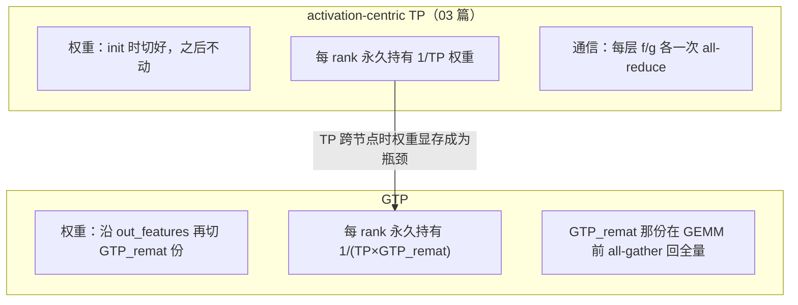
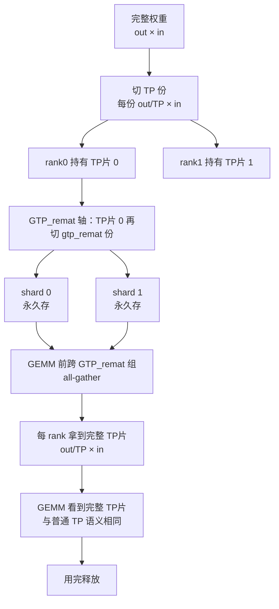
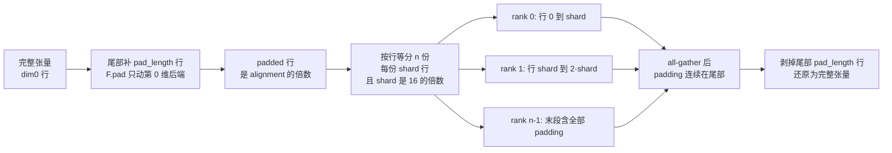
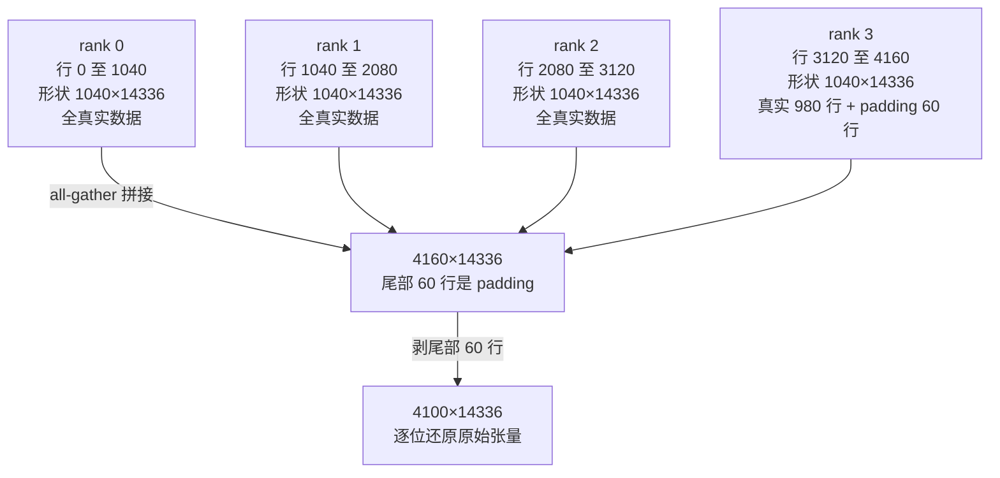
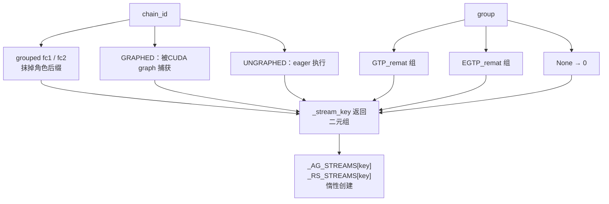
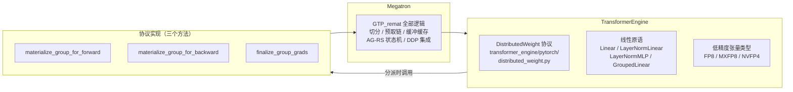

> **Megatron-LM 深度剖析系列 · 第 04 篇**
>
> 前置：[00 地基](/2026/09/28/megatron-00-foundation/)（代码地图 / 配置系统 / 控制流）｜ [01 进程组](/2026/10/08/megatron-01-process-groups-and-comm-overlap/)（组怎么建、怎么选、stream 流派）｜ [02 专家并行](/2026/10/08/megatron-02-expert-parallel/)｜ [03 张量并行与序列并行](/2026/10/09/megatron-03-tensor-parallel-and-sequence-parallel/)（`f` / `g` 算子与 RS + AG）｜ [分布式训练（03）张量并行](/2026/08/31/dist-train-03-tensor-parallel/)
>
> 本系列做**源码层**：并行原理已在《分布式训练》系列讲透，这里一律引用不重推。源码基准 **`megatron-core` 0.20.0**，commit `60e039626`。
>
> **本篇的边界**：讲 GTP 的**切分语义、prefetch 链、stream 划分与进程组**。通信与计算在 CUDA stream 上怎么组织、`async_op`、两种流派、`CUDA_DEVICE_MAX_CONNECTIONS`、backward 的 launch 序列——全在 [01 篇](/2026/10/08/megatron-01-process-groups-and-comm-overlap/) §10，本篇一律引用不重复。TP 与 SP 的算子代数在 [03 篇](/2026/10/09/megatron-03-tensor-parallel-and-sequence-parallel/)，亦不重复。
>
> **图全部自绘。** 本系列遵循「默认一律自绘」的引用许可原则：NVIDIA 官方文档与 blog 的图版权保留、不可复制；arXiv 论文的图需逐篇确认 abs 页有无 CC 标识（本系列常引的 [arXiv:2205.05198](https://arxiv.org/abs/2205.05198) 只有默认许可、其图不可用）。所以本篇每张图下方均注明所据的源码 permalink 或官方页面链接。

**TL;DR**

> * **GTP 把权重重切分成两个正交子轴：`GTP = TP × GTP_remat`**，于是每个 rank 只存 $$1/(TP \cdot GTP_{\text{remat}})$$ 的权重、梯度与优化器状态。`TP` 那一份**永久保持分片**（就是普通 TP），`GTP_remat` 那一份在 GEMM 前all-gather 回全量、用完释放（[GTP 设计文档](https://docs.nvidia.com/megatron-core/developer-guide/latest/api-guide/core/generalized_tensor_parallel.html)）。
> * **`remat` 在这里不是激活重计算。** apidocs 明确标注 *NOTE: “remat” here is NOT activation recomputation/checkpointing*——它指权重的 rematerialization，机制与 ZeRO-3 同构（切权重与梯度状态 → 用前 all-gather → 用后释放 → 回程 reduce-scatter 梯度，官方文档原文 *obeys the same contract*）。
> * **每个权重独立 rematerialize，不是逐层。** `initialize_model_parallel` 的 docstring 写的是 *each weight is rematerialized independently (**per-weight, not per-layer**) via async all-gather on every forward AND backward pass*（[parallel_state apidocs](https://docs.nvidia.com/megatron-core/developer-guide/latest/apidocs/core/core.parallel_state.html)）。
> * **切分沿权重的第 0 维（`out_features`）**，且**先补齐再切**。`gtp_remat_shard_dim0`（[L519–L533](https://github.com/NVIDIA/Megatron-LM/blob/60e039626/megatron/core/tensor_parallel/generalized_tensor_parallelism.py#L519-L533)）算出行数与 padding 长度，`_gtp_slice_one_param`（[L536–L576](https://github.com/NVIDIA/Megatron-LM/blob/60e039626/megatron/core/tensor_parallel/generalized_tensor_parallelism.py#L536-L576)）用 `F.pad` 把 padding 补在**尾部**再切片。补在尾部是 all-gather 结果里padding 连续的前提。
> * **`alignment = pad_for_alignment × gtp_remat_size` 这个写法保证每个 rank 的行数恒为 `pad_for_alignment` 的倍数。** 实测 `pad_for_alignment=16`、`size=8` 时 `alignment=128`，`shard = padded/8` 必为 16 的倍数（[`results/stdout.txt`](https://github.com/lrypcy/ipynbs/blob/58073b2a4c01e13653183c93c540b7367c0b201d/experiments/megatron/gtp/results/stdout.txt) §3）。
> * **padding 在标准维度上是 no-op。** `4096 / 5120 / 11008 / 13824 / 28672` 都已是 128 的倍数，`pad = 0`。它只在维度非标准（`777` 时浪费 `7.079%`）或 **`gtp_remat_size` 整除不上标准维度**时才生效：同一个 `11008`，`size=8` 时 `pad=0`、`size=3` 与 `size=6` 时 `pad=32`。
> * **prefetch 链只有两条：`GRAPHED` 与 `UNGRAPHED`。** 分类规则在 [`_classify_param_chain` L183–L240](https://github.com/NVIDIA/Megatron-LM/blob/60e039626/megatron/core/tensor_parallel/generalized_tensor_parallelism.py#L183-L240)，按参数名里的路径段判定（`.mlp.experts.` 最先查、`embedding` / `output_layer` 恒为 UNGRAPHED、`attn` / `moe` / `mamba` 各看自己的 scope tag）。链与链之间**不交叉**（*Chains never cross-link*）。
> * **AG / RS 的 stream 按 `(chain_id, group)` 两轴划分**，这是 01 篇 §10.3 那套 per-chain stream 的延续，但多了一条例外：**grouped fc1 / fc2 是两条链却共用一条流**，让它们的 gather 串起来而不是分掉带宽（[L347–L374](https://github.com/NVIDIA/Megatron-LM/blob/60e039626/megatron/core/tensor_parallel/generalized_tensor_parallelism.py#L347-L374)）。
> * **GTP 通过 TransformerEngine 的 `DistributedWeight` 协议接入**，官方文档说得很直接：TE 拥有线性原语、低精度张量类型与这个通用协议，*TE never names GTP*。Megatron 侧的三个方法 `materialize_group_for_forward` / `materialize_group_for_backward` / `finalize_group_grads`（[L2126–L2136](https://github.com/NVIDIA/Megatron-LM/blob/60e039626/megatron/core/tensor_parallel/generalized_tensor_parallelism.py#L2126-L2136)）就是协议实现。
> * **`gtp_remat_size = 1` 时 GTP 完全不活跃**，官方文档称此时与朴素 TP + DP **byte-identical**，所以留在代码路径里是安全的。
> * **梯度归约有 SUM / MEAN 两态，由 `calculate_per_token_loss` 决定。** `_prescale_wgrads_for_mean_rs` 先按 $$1/gtp_{\text{remat}}$$ 预缩放，使 SUM 型 reduce-scatter 得到该轴的均值；per-token-loss 模式下 DDP 不做 $$1/dp$$ 缩放，该轴必须 SUM（官方文档：*a 1/gtp_remat mean would shrink every gtp_remat grad*）。
> * **native FP8 权重需要一次 `__class__` 换身。** `dequantize_gtp_native_fp8`（[L734–L748](https://github.com/NVIDIA/Megatron-LM/blob/60e039626/megatron/core/tensor_parallel/generalized_tensor_parallelism.py#L734-L748)）在调用 TE 的 dequantize 前把动态子类换回 FP8 基类，用完在 `finally` 里换回来——因为 TE 的 `tex.dequantize` 按**精确的 FP8 类**分派，认不得 `GTP_<Fp8TensorClass>` 这个动态子类。
> * **规模感**：`generalized_tensor_parallelism.py` 2647 行，其中 `GTPShardedParam` 一个类占 1244 行（`generalized_tensor_parallelism.py` L922–L2165）；`gtp_api.py` 只有 66 行；`gtp_cuda_graphs.py` 249 行。

---

## 1. 引言：activation-centric 的天花板在哪

[03 篇](/2026/10/09/megatron-03-tensor-parallel-and-sequence-parallel/) 讲的那套张量并行是 **activation-centric**：权重在初始化时就按输出维 / 输入维切好，之后再也不动；每一层的前向与反向各有两次 all-reduce。它的好处是实现简单、通信量可解析，代价则写在 `initialize_model_parallel` 的 docstring 里——每个 rank 永久持有 $$1/TP$$ 的权重、梯度与优化器状态。

这个代价在 TP 不得不跨越 NVLink 域时会变得难以忍受：TP 组一旦跨越节点边界，每次 all-reduce 都要走网络，而权重显存并没有因此减少。于是有两条路——要么把 TP 调小（进而把 DP 调大，通信压力转到别处），要么想办法让**权重本身**也切得更细。

GTP 走的是第二条。它的官方定位是：

> Generalized Tensor Parallelism (GTP) is a lightweight, high-performance, memory-efficient distributed-training strategy implemented jointly in Megatron-LM and TransformerEngine. It shards weight tensors across a GTP process group and reconstructs them on demand via asynchronous all-gather, so larger models fit in the same memory without sacrificing throughput — **the communication is overlapped with computation rather than added to it**.

（[GTP 设计文档](https://docs.nvidia.com/megatron-core/developer-guide/latest/api-guide/core/generalized_tensor_parallel.html)）

这句话里的 *the communication is overlapped with computation rather than added to it* 是设计意图；**怎么做到的**属于 01 篇 §10 的范围（stream 与重叠机制），本篇只回答**切在哪里、什么时候切、什么时候聚回来**。

### 1.1 「remat」这个词的两层含义

必须先澄清一个用词。GTP 里的 `remat` 是 **rematerialization（重materialization）**，指把权重重新物化出来。它**不是**激活重计算 / gradient checkpointing——后者在 Megatron 里叫 `recompute`，对应 `recompute_granularity`（`full` / `selective` / `None`）与 `recompute_method`（`uniform` / `block` / `None`）这两个配置项，见 [00 篇的配置表](/2026/09/28/megatron-00-foundation/)。

官方 apidocs 在 `initialize_model_parallel` 的 `gtp_remat_size` 参数说明里专门加了一句警告：

> NOTE: “remat” here is NOT activation recomputation/checkpointing.

（[parallel_state apidocs](https://docs.nvidia.com/megatron-core/developer-guide/latest/apidocs/core/core.parallel_state.html)）

这个区分不是吹毛求疵：激活重计算省的是**激活**显存、用计算换显存；GTP 的 remat 省的是**权重**显存、用通信换显存。两者优化的对象不同，叠加时也各有各的约束。



*图 1：两种切法的差别在「权重是否被再次切分、是否需要聚回来」。数据出处：GTP 设计文档的 TP / GTP_remat 对照表与 [`initialize_model_parallel` 的 `gtp_remat_size` 说明](https://docs.nvidia.com/megatron-core/developer-guide/latest/apidocs/core/core.parallel_state.html)。*

---

## 2. 门面与门控：为什么 GTP 必须依赖 TransformerEngine

`gtp_api.py` 全文只有 66 行，是一个纯门面（[全文](https://github.com/NVIDIA/Megatron-LM/blob/60e039626/megatron/core/tensor_parallel/gtp_api.py)）。它的存在本身就是一条设计说明：

```python
"""Generalized Tensor Parallelism (GTP) public API.

Thin facade over the core implementation in ``generalized_tensor_parallelism`` and CUDA-graph
lifecycle support in ``gtp_cuda_graphs``. GTP depends on TransformerEngine: if TE is missing or
too old the core module imports cleanly but reports ``HAVE_TE = False``, mirrored here as
``HAVE_GTP = False``. Consumers gate every GTP code path behind ``if HAVE_GTP:``, so no core
module uses GTP symbols without TE.
"""

try:
    from megatron.core.tensor_parallel.generalized_tensor_parallelism import (
        GTP_CONFIG,
        HAVE_TE,
        GTPChain,
        ...
    )
    from megatron.core.tensor_parallel.gtp_cuda_graphs import (
        set_cuda_graph_mempool,
        track_gtp_capture_comms,
    )

    HAVE_GTP = HAVE_TE
except ImportError:
    # Defensive fallback for any unexpected inner-import failure; consumers import
    # the other symbols lazily under an ``if HAVE_GTP:`` guard, so no stubs needed.
    HAVE_GTP = False
```

三点值得记：

**一、`HAVE_GTP = HAVE_TE`。** 这个等式就是「GTP 为什么必须依赖 TE」的答案——不是因为性能，而是因为**协议**：GTP 的权重物化要挂进 TE 的线性层分派路径（§9）。TE 不在，GTP 就没法实现，而不是「实现了但慢」。

**二、缺 TE 时模块仍能import 成功。** 用 `try/except ImportError` 而不是让 `import` 直接失败，于是 `megatron.core` 的其余部分照常可用，只是 `HAVE_GTP = False`。注释还特意说明 `except` 分支里不需要打桩（*so no stubs needed*），因为消费方全都在 `if HAVE_GTP:` 后面才引用那些符号。

**三、门控点在调用方。** `initialize_model_parallel` 里有一道对应的断言（[L368–L375](https://github.com/NVIDIA/Megatron-LM/blob/60e039626/megatron/training/initialize.py#L368-L375)）：

```python
        if args.gtp_weight_remat_size > 1 or args.expert_gtp_weight_remat_size > 1:
            from megatron.core.tensor_parallel.gtp_api import HAVE_GTP

            assert HAVE_GTP, (
                "GTP requires TransformerEngine >= 2.19. "
                "Set both --gtp_remat-weight-remat-size and "
                "--expert-generalized-tensor-parallel-remat-size to 1 to disable GTP."
            )
```

注意它的判据是 `> 1`：**只有真的要用 GTP 时才检查 TE**。官方文档给了版本下限 *Requires TransformerEngine >= 2.19*，并说明 TE 版本不满足时 *GTP is disabled at import (`HAVE_GTP = False`) and enabling it raises an `ImportError`*。

`__all__` 列出的21 个符号就是 GTP 的公开面：`HAVE_GTP`、`GTP_CONFIG`、`GTPChain`、`GTPEmbeddingWeight`、`attach_gtp_to_presharded_module`、`classify_gtp_remat_chains`、`configure_gtp_remat_from_recipe`、`dequantize_gtp_native_fp8`、`get_ag_stream`、`get_rs_stream`、`gtp_native_fp8_load_context`、`gtp_remat_shard_dim0`、`is_gtp_param`、`initialize_graph_wgrad_rings`、`make_sharded_tensors_for_checkpoint_with_gtp_remat`、`set_cuda_graph_mempool`、`track_gtp_capture_comms`、`wait_async_comms`、`wait_for_gtp_grad_reduction_on_current_stream`、`wrap_module_params_gtp`。

---

## 3. `GTP = TP × GTP_remat`：两个正交子轴

这是理解 GTP 的关键一步。官方文档把它写成两条轴的乘积：

> GTP splits the weight-parallel domain into two orthogonal sub-axes — `GTP = TP × GTP_remat` — so every rank stores `1/(TP × GTP_remat)` of each linear weight, together with the matching slice of its gradient and optimizer state.

（[GTP 设计文档](https://docs.nvidia.com/megatron-core/developer-guide/latest/api-guide/core/generalized_tensor_parallel.html)）

而这两条轴在 GEMM 时的行为**完全不同**，官方用一张表说清楚：

| slice | 永久存储 | GEMM 时 |
| --- | --- | --- |
| `TP` | 权重的 $$1/TP$$ | **保持分片**——普通张量并行，输出是 TP 分片的 |
| `GTP_remat` | TP 那一片的 $$1/GTP_{\text{remat}}$$ | **rematerialize**：在 GEMM 前跨 `GTP_remat` 组 all-gather，使 GEMM 看到完整的 TP slice；用完释放，回程把 wgrad reduce-scatter 回去 |

（[GTP 设计文档](https://docs.nvidia.com/megatron-core/developer-guide/latest/api-guide/core/generalized_tensor_parallel.html)）

这段话解释了三件事：

1. **TP 那一轴的行为完全没变**，所以 03 篇讲的那套 `f` / `g` 算子代数一字不改。GTP 是叠加在 TP 上的，不是替换。
2. **GEMM 看到的是完整的 TP slice**，不是完整权重。所以 TP 的通信语义不变，变的只是「这个 slice 从哪来」——以前每个 rank 永久存着，现在每次 all-gather 出来。
3. **用完就释放**，所以峰值显存不是「权重全量 + 分片」，而是「全量 + 一个分片」。

`initialize_model_parallel` 的 docstring 补上了「粒度」这一点：*each weight is rematerialized independently (**per-weight, not per-layer**) via async all-gather on every forward AND backward pass*。**按权重独立、前向和反向各一次**，不是整层一起物化。

配置面上，GTP 的度数不直接暴露，而是从「权重分片总数」反推：

> The `GTP_remat` degree is `gtp_weight_remat_size`, derived from `--tensor-parallel-num-weight-shards` (= `tensor_model_parallel_size × gtp_weight_remat_size`). At `gtp_weight_remat_size = 1` GTP is inactive and the path is byte-identical to plain TP + DP, so it is safe to leave in the code path.

（[GTP 设计文档](https://docs.nvidia.com/megatron-core/developer-guide/latest/api-guide/core/generalized_tensor_parallel.html)）



*图 2：`GTP = TP × GTP_remat` 的两级切分与「GEMM 前聚合」。TP 片在 GEMM 时是完整的，所以 TP 的通信语义不变。数据出处：[GTP 设计文档](https://docs.nvidia.com/megatron-core/developer-guide/latest/api-guide/core/generalized_tensor_parallel.html) 的 TP / GTP_remat 对照表，与 [`_gtp_slice_one_param` L536–L576](https://github.com/NVIDIA/Megatron-LM/blob/60e039626/megatron/core/tensor_parallel/generalized_tensor_parallelism.py#L536-L576)。*

---

## 4. 切分语义：`gtp_remat_shard_dim0`

三级切分落到代码上，`initialize_model_parallel` 把 `gtp_remat` 当成一个**一等正交轴**处理（`world = TP · GTP_remat · CP · DP`），并建专属进程组 `_GTP_WEIGHT_REMAT_GROUP`。真正把一个权重的第 0 维切给这个组的，是两个函数。

### 4.1 算行数与 padding

`gtp_remat_shard_dim0`（[L519–L533](https://github.com/NVIDIA/Megatron-LM/blob/60e039626/megatron/core/tensor_parallel/generalized_tensor_parallelism.py#L519-L533)）：

```python
def gtp_remat_shard_dim0(dim0, gtp_remat_group):
    """Return ``(shard_dim0, pad_length)`` for allocating a dim-0 GTP weight-remat shard."""
    gtp_remat_size = gtp_remat_group.size()
    if GTP_CONFIG.pad_for_alignment > 0:
        alignment = GTP_CONFIG.pad_for_alignment * gtp_remat_size
        pad_length = (alignment - dim0 % alignment) % alignment
    else:
        assert dim0 % gtp_remat_size == 0, (
            f"gtp_remat_shard_dim0: dim0={dim0} not divisible by gtp_remat_size={gtp_remat_size}. "
            "Enable padding (GTP_CONFIG.pad_for_alignment > 0) or make dim-0 a multiple of the "
            "GTP group size."
        )
        pad_length = 0
    padded = dim0 + pad_length
    return padded // gtp_remat_size, pad_length
```

只有两条分支：**补齐**或**断言整除**。`pad_for_alignment` 的默认值是 16（`GTPRematConfig` L418，`GTP_CONFIG = GTPRematConfig()` 在 L443）。

**`alignment = pad_for_alignment × gtp_remat_size` 这个写法是整套机制的关键**，它保证

$$\text{shard\_dim0} = \frac{\text{padded}}{n} = \frac{\text{padded}}{n / (\text{pad\_for\_alignment} \times n)} \times \text{pad\_for\_alignment} \equiv 0 \pmod{\text{pad\_for\_alignment}}$$

即**每个 rank 拿到的行数本身就是对齐的**。这不是副作用，是设计目的——注释写得很直白：*Pad before slicing so **shards stay alignment-divisible***。

### 4.2 真正切片：先补后切

`_gtp_slice_one_param`（[L536–L576](https://github.com/NVIDIA/Megatron-LM/blob/60e039626/megatron/core/tensor_parallel/generalized_tensor_parallelism.py#L536-L576)）：

```python
    if GTP_CONFIG.pad_for_alignment > 0:
        # Pad before slicing so shards stay alignment-divisible and padding
        # ends up contiguous at the tail of the gathered result.
        alignment = GTP_CONFIG.pad_for_alignment * gtp_remat_size
        dim0 = tensor.shape[0]
        pad_length = (alignment - dim0 % alignment) % alignment
        if pad_length > 0:
            tensor = torch.nn.functional.pad(tensor, (0, 0, 0, pad_length))
    else:
        # No-pad mode: dim-0 must divide gtp_remat_size or AG output loses tail rows.
        assert tensor.shape[0] % gtp_remat_size == 0, (
            f"_gtp_slice_one_param: {name}.shape[0]={tensor.shape[0]} is not "
            f"divisible by gtp_remat_size={gtp_remat_size}. Either enable padding by "
            "setting GTP_CONFIG.pad_for_alignment > 0, or ensure the weight's "
            "dim-0 is a multiple of the GTP group size."
        )
        pad_length = 0

    shard_size = tensor.shape[0] // gtp_remat_size
    shard = tensor[gtp_rank * shard_size : (gtp_rank + 1) * shard_size]
    gtp_shard = GTPShardedParam(shard.clone())
    gtp_shard.pad_length = pad_length
```

三处值得记：

**一、`F.pad(tensor, (0, 0, 0, pad_length))` 只动第 0 维的后端。** 所以 padding 落在尾部。注释里那句 *padding ends up contiguous at the tail of the gathered result* 是 §5 的 I4 能成立的前提——若补在头部，各 rank 的分片里就会夹着「真实数据 / padding」的边界。

**二、`shard = tensor[rank * shard_size : (rank + 1) * shard_size]`。** 每个 rank 拿**连续的一段行**，不是跨步取。（对比 03 篇 §2.1 的 `weight_list[rank::world_size]`，那是 TP 初始化时的跨步分片，机制不同。）

**三、`pad_length` 挂在 shard 上。** `gtp_shard.pad_length = pad_length` 让 all-gather 之后能知道要剥掉多少行尾部 padding。

### 4.3 配置项与 CLI 面

`GTPRematConfig`（[L415–L440](https://github.com/NVIDIA/Megatron-LM/blob/60e039626/megatron/core/tensor_parallel/generalized_tensor_parallelism.py#L415-L440)）是全局配置，模块级实例化于 L443（`GTP_CONFIG = GTPRematConfig()`）。七个字段，每个都带一段解释其取舍的注释：

| 字段 | 默认 | 作用 |
| --- | --- | --- |
| `pad_for_alignment` | 16 | 对齐粒度；见 §4.1。`> 0` 走 padding，否则要求整除 |
| `check_param_states` | `False` | 参数状态自检。**GTP 保持关闭** |
| `weight_prefetch` | `True` | 是否提前一个权重预取（§7） |
| `async_reduction` | `True` | 非链头的 wgrad RS 是否 `async_op=True` 并延后 finalize |
| `calculate_per_token_loss` | `False` | 镜像同名配置；决定 gtp_remat 轴 SUM 还是 MEAN（§12.2） |
| `reduce_scatter_with_fp32_accumulation` | `False` | wgrad RS 走 all-to-all + 本地 fp32 累加（§12.3） |
| `graph_wgrad_ring_size` | 2 | partial-CG 异步 RS 的持久槽位数（§10.2） |

两条注释值得原样引用。`async_reduction`：

> True (default): non-chain-head wgrad RS is `async_op=True` and finalizes (`handle.wait` + `main_grad.add_`) in a **later** bwd's cascade walk, overlapping RS with compute. False: every wgrad RS is synchronous + inline (no overlap).

`check_param_states` 为什么默认关：见 `configure_gtp_remat_from_recipe` 里那句 *check_param_states=False: GTP buffer reuse (notably under CUDA-graph capture) trips the param-state debug asserts, so keep them off for GTP runs*——**缓冲复用会触发那些调试断言**，所以 GTP 运行必须关掉它们。

CLI 面上，GTP 的度数**不直接暴露**（[GTP 设计文档 §2](https://docs.nvidia.com/megatron-core/developer-guide/latest/api-guide/core/generalized_tensor_parallel.html)）：

| flag | 含义 |
| --- | --- |
| `--tensor-parallel-num-weight-shards <n>` | 每个 dense 权重被切成几份；`gtp_weight_remat_size = n / tensor_model_parallel_size` |
| `--expert-tensor-parallel-num-weight-shards <n>` | 路由专家权重沿 `out_features` 的总份数；须 `>= --expert-tensor-parallel-size` 且能被它整除 |

官方文档特意点明：**内部的 `gtp_weight_remat_size` / `expert_gtp_weight_remat_size` 没有 CLI flag**，只由上面两个推导。而 `tensor_model_parallel_size` 的 group size 固定为 `num-weight-shards / TP`——这就是 §12.1 那个专属组的规模。

其余开关走 `from ... import GTP_CONFIG, update_gtp_config` 在代码里设（官方文档 §2.4 称为 *Tuning knobs*），而不是 CLI。

---

## 5. 五组不变量：切分语义的数值验证

§4 的两个函数合起来定义了一套完整的切分语义，可以在 CPU 上逐条验。脚本落在 `ipynbs` 的 `experiments/megatron/gtp/`：

```bash
cd ~/Desktop/Projects/sandbox/ipynbs/experiments/megatron/gtp
~/Software/miniconda3/bin/python3 gen_stdout.py            # 写 results/stdout.txt
~/Software/miniconda3/bin/python3 gen_stdout.py --stdout   # 只打屏
```

固定 `seed=20261011`，纯 numpy，`gen_stdout.py` 退出码非 0 即为对账失败。

### 5.1 padding 在标准维度上是 no-op

`pad_for_alignment=16`、`gtp_remat_size=8` 时 `alignment = 128`，而常见维度都已是 128 的倍数：

| `dim0` | size | align | pad | padded | shard | shard % 16 | 每 rank 形状 |
| --- | --- | --- | --- | --- | --- | --- | --- |
| 4096 | 4 | 64 | 0 | 4096 | 1024 | 0 | (1024, 14336) |
| 4096 | 8 | 128 | 0 | 4096 | 512 | 0 | (512, 14336) |
| 5120 | 8 | 128 | 0 | 5120 | 640 | 0 | (640, 14336) |
| 11008 | 8 | 128 | 0 | 11008 | 1376 | 0 | (1376, 14336) |
| 13824 | 8 | 128 | 0 | 13824 | 1728 | 0 | (1728, 14336) |

`shard % 16` 全为 0，即 I2 成立。

### 5.2 padding 只在两种情况下才产生开销

| `dim0` | size | align | pad | padded | shard | shard % 16 | 浪费 |
| --- | --- | --- | --- | --- | --- | --- | --- |
| 4100 | 4 | 64 | 60 | 4160 | 1040 | 0 | 1.463% |
| 777 | 4 | 64 | 55 | 832 | 208 | 0 | 7.079% |
| 11008 | 3 | 48 | 32 | 11040 | 3680 | 0 | 0.291% |
| 11008 | 6 | 96 | 32 | 11040 | 1840 | 0 | 0.291% |

**`11008` 那两行是最有说服力的对照**：同一个维度，`size=8` 时 `pad = 0`（§5.1），`size = 3` 与 `size = 6` 时 `pad = 32`。所以 padding 的触发条件不是「维度不标准」，而是**`dim0` 与 `alignment` 不整除**——而 `alignment` 里含 `gtp_remat_size`，所以换 GTP 组大小就会改变是否需要补齐。

「浪费」一列是 `pad_length / dim0`，即补出来的行占原始行数的比例。

### 5.3 五组不变量

覆盖 8 组配置——`(4096,4) (4096,8) (5120,8) (4100,4) (777,4) (11008,3) (11008,8) (28672,2)`——六项检查全 `True`，数值往返全部「一致」：

| 编号 | 断言 | 含义 |
| --- | --- | --- |
| I1 | `padded % (pad_for_alignment × gtp_remat_size) == 0` | 补齐后的长度是 `alignment` 的倍数 |
| I2 | `shard_dim0 % pad_for_alignment == 0` | **每个 rank 的行数是对齐粒度的倍数** |
| I3 | 各 rank 行区间首尾相接、不重叠，并集恰为 `[0, padded)` | 没有行被重复拥有或漏掉 |
| I4 | 真实数据行 `[0, dim0)` 连续覆盖；padding 只落在尾部 | 尾部补齐的前提 |
| I5 | 各 rank 分片按 rank 序拼接精确还原 padded 张量；去尾部 pad 后逐位还原原始张量 | 数值往返 |



*图 3：补齐在尾部、切片按行等分、聚合后 padding 连续在尾部可整段剥除。三项性质合起来构成 I2 / I3 / I4。数据出处：[`gtp_shard.py`](https://github.com/lrypcy/ipynbs/blob/58073b2a4c01e13653183c93c540b7367c0b201d/experiments/megatron/gtp/gtp_shard.py) 与 [`_gtp_slice_one_param` L544–L562](https://github.com/NVIDIA/Megatron-LM/blob/60e039626/megatron/core/tensor_parallel/generalized_tensor_parallelism.py#L544-L562)。*

### 5.4 no-pad 模式

把 `pad_for_alignment` 设为 0 就走断言分支：

| `dim0` | `dim0 % 4` | 行为 |
| --- | --- | --- |
| 4096 | 0 | `shard = 1024, pad = 0` |
| 4100 | 0 | `shard = 1025, pad = 0` |
| 4101 | 1 | 抛 `AssertionError` |
| 777 | 1 | 抛 `AssertionError` |

源码注释给出了 no-pad 的代价，比断言文本更直白：*No-pad mode: dim-0 must divide gtp_remat_size or **AG output loses tail rows***——不补齐，all-gather 之后会丢尾部行。所以 `pad_for_alignment` 默认取 16 而非 0。

### 5.5 逐步推演：把每一行的归属写出来

工单要求的是「给定 `dim0` 与 `tp_size`，逐步给出每个 rank 上的张量形状」。取一个**会触发 padding** 的算例走完全程：`dim0 = 4100`、`gtp_remat_size = 4`、`trailing = (14336,)`（Llama-3 8B 的 `ffn`）。

**第 1 步，算 alignment**

$$\text{alignment} = \text{pad\_for\_alignment} \times n = 16 \times 4 = 64$$

**第 2 步，算 padding 长度**

$$4100 = 64 \times 64 + 4 \quad\Longrightarrow\quad \text{pad\_length} = (64 - 4) \bmod 64 = 60$$

**第 3 步，补齐后的长度与每 rank 行数**

$$\text{padded} = 4100 + 60 = 4160, \qquad \text{shard} = \frac{4160}{4} = 1040$$

$$1040 = 65 \times 16$$，是 `pad_for_alignment` 的倍数——**I2 成立**。

**第 4 步，逐 rank 列出形状与行区间**

| rank | 行区间 | 形状 | 其中真实行 | 其中 padding 行 |
| --- | --- | --- | --- | --- |
| 0 | $$[0,\ 1040)$$ | (1040, 14336) | 1040 | 0 |
| 1 | $$[1040,\ 2080)$$ | (1040, 14336) | 1040 | 0 |
| 2 | $$[2080,\ 3120)$$ | (1040, 14336) | 1040 | 0 |
| 3 | $$[3120,\ 4160)$$ | (1040, 14336) | **980** | **60** |

只有 rank 3 拿到 padding，且**全部 60 行都在它的尾部**——这就是 I4 的具体形态。四个区间首尾相接、并集恰为 $$[0, 4160)$$，这是 I3。

**第 5 步，验证还原**

把四个分片按 rank 序拼接，应精确还原 4160 行的补齐张量；剥掉尾部 60 行后应逐位还原原始的 4100 行张量。这是 I5，脚本对 `(4100, 4)` 实测**两项均为 True**。



*图 4：`dim0 = 4100`、`gtp_remat_size = 4` 的完整推演。只有最后一个 rank 承载 padding，且 padding 连续在尾部。数据出处：[`results/stdout.txt`](https://github.com/lrypcy/ipynbs/blob/58073b2a4c01e13653183c93c540b7367c0b201d/experiments/megatron/gtp/results/stdout.txt) §3-b 与 §4（I2 / I3 / I4 / I5 四项对该组配置均为 True）。*

---

## 6. 与 activation-centric 的形状对照

### 6.1 两种 “centric” 到底指什么

两个词的差别在**被切的对象与被恢复的对象**：

| | activation-centric | weight-centric |
| --- | --- | --- |
| 切什么 | **激活**（连带在初始化时切权重） | **权重本身** |
| 谁被恢复 | 不恢复 | 权重在使用前被 all-gather 恢复 |
| 通信作用在 | 激活 / 梯度上 | **权重**上 |
| 每 rank 永久持有 | $$1/TP$$ 权重 + 梯度 + 优化器状态 | $$1/(TP \cdot GTP_{\text{remat}})$$ 三者 |

关键在第三行。activation-centric TP 的通信发生在**激活与梯度**上（03 篇 §9 的三档时机），而 GTP 的额外通信发生在**权重**上。

为什么这被称为「天花板」？因为 activation-centric 的切分粒度被 TP 组大小**锁死**了：一个权重的第 0 维最多只能切到 $$1/TP$$，因为 `ColumnParallelLinear` 与 `RowParallelLinear` 的语义要求每个 rank 持有的是一个可独立完成 GEMM 的分片。要让每 rank 持有更少的权重，就必须引入一个**独立于 TP 的新正交轴**——而这正是 GTP_remat。

于是「降低单卡权重显存」有两条路：

| 路线 | 做法 | 通信代价落在 |
| --- | --- | --- |
| 调小 TP | TP 组变小，权重切得更细 | TP 的 all-reduce 频率不变但**总字节数变少**（每次的激活更小）；DP 变大，梯度归约压力上升 |
| 加 GTP_remat 轴 | TP 不变，权重额外沿第 0 维再切 | **权重 all-gather**，且每次前向与反向各一次 |

两条路可以叠加（官方文档：*It composes orthogonally with TP / SP / EP / DDP / CUDA Graphs*），但代价的**位置**不同：前者压激活通信，后者加权重通信。

官方文档对 GTP 的定位句里 *the communication is overlapped with computation rather than added to it*（§1 引过）说的就是这个代价的位置——它没有让通信变少，而是把它挪到能被计算掩盖的地方。具体怎么掩盖属于 01 篇 §10 的范围。

### 6.2 形状对照

两者的「每 rank 形状」可能完全相同，但**切的轴与时机不同**。以 `dim0 = hidden = 4096`、`tp = 4` 为例：

| | 切什么 | 每 rank 形状 |
| --- | --- | --- |
| activation-centric | 激活的最后一维 | 激活 `(1, 1, 1024)` |
| activation-centric | 权重（初始化时按输出维切） | 权重 `(1024, 4096)` |
| GTP | **权重的第 0 维** | 权重 `(1024, 4096)` |

**权重那两行形状相同**（都是 `(1024, 4096)`），因为 `dim0 = 4096` 与 `hidden = 4096` 在这个算例里相等。真正的差别不在形状而在**生命周期**：

| | activation-centric | GTP |
| --- | --- | --- |
| 切分时机 | 初始化，一次 | 初始化，一次 |
| 之后是否聚回 | **从不** | 每次前向与反向各聚一次 |
| 聚回的代价 | 无 | 一次跨 GTP 组的 all-gather |

所以「GTP 每 rank 权重形状 = TP 每 rank 形状」这个观察容易误导——形状相同不等于机制相同。判据是 `gtp_remat_size > 1` 时权重在运行期多了一轮聚散。

本章不给出「两者每层通信字节数」的对比数字：那需要 α-β 通信模型与真实拓扑，本机无 GPU，属于 `profiling` 系列的范围。

---

## 7. prefetch 链：为什么权重要分链预取

`gtp_remat_size > 1` 之后，每个权重在前向与反向各要 all-gather 一次。如果等到 GEMM 之前才发起通信，通信时间就全额暴露在关键路径上。GTP 的解法是**提前一个权重预取**：`all_gather_and_prefetch` 的 docstring 只有一句（[L1605–L1609](https://github.com/NVIDIA/Megatron-LM/blob/60e039626/megatron/core/tensor_parallel/generalized_tensor_parallelism.py#L1605-L1609)）：

> All-gather the current weight and async-prefetch the next.

于是每个参数都带着 `prev_w` / `next_w` 两个指针，构成一条**链**。链把「谁先谁后」固定下来，而链的身份由 CUDA graph 的捕获状态决定。

### 7.1 只有两条链

`GTPChain`（[L108–L119](https://github.com/NVIDIA/Megatron-LM/blob/60e039626/megatron/core/tensor_parallel/generalized_tensor_parallelism.py#L108-L119)）：

```python
class GTPChain(str, Enum):
    """Prefetch chain identifier for n GTPShardedParam.

    GRAPHED   — fwd/bwd captured by a CUDA graph (MLM _CudaGraphRunner).
    UNGRAPHED — fwd/bwd runs eagerly.

    Chains never cross-link (prev_w/next_w stay within one chain). See
    _classify_param_chain for the GRAPHED/UNGRAPHED rule.
    """

    GRAPHED = "GTP_graphed"
    UNGRAPHED = "GTP_ungraphed"
```

三条性质：

- **它是 `str, Enum` 而非 `Enum`**——链 id 直接当字符串用（做 dict key、进日志、进断言消息），省一层转换。
- **只有两条**。被 CUDA graph 捕获的进 `GRAPHED`，eager 跑的进 `UNGRAPHED`。
- **链与链之间不交叉**：*Chains never cross-link (prev_w/next_w stay within one chain)*。这保证同一时刻每个方向上只有一条链在被推进。

### 7.2 分类规则

判定逻辑在 [`_classify_param_chain` L183–L240](https://github.com/NVIDIA/Megatron-LM/blob/60e039626/megatron/core/tensor_parallel/generalized_tensor_parallelism.py#L183-L240)，纯按**参数名里的路径段**决定，顺序有讲究：

| 序 | 判据 | 归链 |
| --- | --- | --- |
| 1 | 名字含 `.mlp.experts.` | **最先查**。按 fc1 / fc2 各给一条同质链（供 one-block-ahead 预取）；graphness 仍按 `moe` scope 判 |
| 2 | `_FULL_ITERATION` | GRAPHED |
| 3 | 名字含 `embedding` 或 `output_layer` | UNGRAPHED（注释：*they live outside any per-layer CG runner*） |
| 4 | 名字含 `.mlp.fc1_latent_proj.` / `.mlp.fc2_latent_proj.` | `moe_router` 在 scope 则 GRAPHED |
| 5 | 名字含 `.mlp.shared_experts.` | `moe_shared_expert_overlap` 开着则 UNGRAPHED，否则 `moe` / `moe_router` 在 scope 则 GRAPHED |
| 6 | 名字含 `.self_attention.` / `.cross_attention.` | `attn` 在 scope 则 GRAPHED |
| 7 | 名字含 `.mixer.` | `mamba` 在 scope 则 GRAPHED |
| 8 | 兜底 | UNGRAPHED |

四条设计上的讲究：

**`.mlp.experts.` 必须最先判。** 注释给了原因：*Checked BEFORE the generic rules (`.mlp.shared_experts.` is a distinct substring, so shared experts never fall in here)*——`shared_experts` 与 `experts` 是两个不同的子串，顺序错了会把共享专家误判成路由专家。

**路由专家的分组拆分是 eager-only 的优化。** 源码注释：*The grouped split is an **EAGER-only optimization**: when MoE is captured, keep grouped weights in the plain GRAPHED chain so the cross-graph drain — `wait_async_comms(GTPChain.GRAPHED.value)` in cuda_graphs.py — still targets them by exact chain id*。也就是说一旦 MoE 被 CUDA graph 捕获，就退回单链——因为跨 graph 的 drain 靠**精确的链 id** 定位，链一多就定位不准了。

**`embedding` / `output_layer` 恒为 UNGRAPHED。** 它们不在逐层的 CG runner 里，捕获它们没有意义。

**兜底是 UNGRAPHED 而非 GRAPHED。** 新增的模块类型在没显式配置 scope tag 时会落到 eager 侧——这是安全的方向。

### 7.3 分类的时机

外层函数 `classify_gtp_remat_chains`（[L496–L516](https://github.com/NVIDIA/Megatron-LM/blob/60e039626/megatron/core/tensor_parallel/generalized_tensor_parallelism.py#L496-L516)）的 docstring 把时机钉死：

> Tag and classify every GTP param's prefetch chain (GRAPHED vs UNGRAPHED). Must be called once **AFTER model build + DDP wrap** and **before the first forward** (which lazily builds chain links).

它内部先 `reset_gtp_state()` 清掉进程级的陈旧链状态（注释：*so a rebuilt model starts fresh*），再对每个模型模块 `tag_gtp_params_with_names` + `classify_gtp_chains`。

**为什么必须在第一次 forward 之前？** 因为链是在第一次 forward 时**惰性建链**的（docstring 括号里的 *which lazily builds chain links*）。分类晚一步，链就建错了。

`flush_link_tables`（[L966–L980](https://github.com/NVIDIA/Megatron-LM/blob/60e039626/megatron/core/tensor_parallel/generalized_tensor_parallelism.py#L966-L980)）是配套的诊断：把每条链攒下的 prefetch 链表**一次性原子打印**。它的注释里有两条约束：

> Call only where the chains are complete -- **NOT on “this weight is already linked”, which MTP hits mid-forward while later links are still being created.**

> Clear each buffer on emit: **the latch alone is not enough, since the dynamic `GTP_*` subclasses each carry their own copy of it** over this one shared buffer set.

第二条又是那个动态子类的话题（§10 还会遇到）：`GTP_*` 动态子类各自持有一份 latch 的副本，所以光靠一个标志位不够，必须逐条清 buffer。

---

## 8. AG / RS 的专用 stream：两轴 key 与一个例外

01 篇 §10.3 讲过 GTP 的 side stream 按 `(chain_id, group)` 建独立 stream。本篇把 key 的构造讲全——`_stream_key`（[L347–L358](https://github.com/NVIDIA/Megatron-LM/blob/60e039626/megatron/core/tensor_parallel/generalized_tensor_parallelism.py#L347-L358)）：

```python
def _stream_key(chain_id: str, group) -> tuple:
    """Key for the per-(chain, group) AG/RS stream dicts.

    Partitioned on two axes: chain_id (captured GRAPHED vs eager UNGRAPHED ops must not
    share a stream) and group (independent NCCL, e.g. GTP_remat vs EGTP_remat, no serialization).

    Grouped fc1/fc2 are separate chains but must share ONE stream, so their gathers serialize
    instead of splitting bandwidth: drop the role from the key, keep the capture suffix.
    """
    if _chain_is_grouped(chain_id):
        chain_id = _GTP_REMAT_GROUPED_PREFIX + _graphness_suffix(_chain_is_graphed(chain_id))
    return (chain_id, id(group) if group is not None else 0)
```

**两个正交轴**：

| 轴 | 依据 | 理由 |
| --- | --- | --- |
| `chain_id` | `GRAPHED` / `UNGRAPHED` | *captured GRAPHED vs eager UNGRAPHED ops must not share a stream* |
| `group` | `id(group)` | *independent NCCL, e.g. GTP_remat vs EGTP_remat, no serialization* |

第二轴用的是**通信域**：dense 的 `GTP_remat` 组与 expert 的 `EGTP_remat` 组是两个独立 NCCL 通信域，让它们共用一条流会平白引入串行。key 里存的是 `id(group)`，没有组时用 `0`——所以 `None` 组的所有 key 落在同一条流上。

**唯一的例外是 grouped fc1 / fc2。** 它们在 §7.2 里被拆成两条链，但 `_stream_key` 会把链 id 里的**角色后缀抹掉**、只保留捕获状态：

```python
    if _chain_is_grouped(chain_id):
        chain_id = _GTP_REMAT_GROUPED_PREFIX + _graphness_suffix(_chain_is_graphed(chain_id))
```

理由写在 docstring 里：*Grouped fc1/fc2 are separate chains but must share ONE stream, so their gathers **serialize instead of splitting bandwidth***。这是个反直觉但正确的取舍——两条链的 all-gather 若各占一条流，就会**分掉**总带宽；让它们串行反而跑得更快。

`get_ag_stream` / `get_rs_stream`（[L361–L374](https://github.com/NVIDIA/Megatron-LM/blob/60e039626/megatron/core/tensor_parallel/generalized_tensor_parallelism.py#L361-L374)）就是按这个 key 惰性建流：

```python
def get_ag_stream(chain_id: str = GTPChain.GRAPHED.value, group=None) -> torch.cuda.Stream:
    """Return the GTP all-gather stream for (chain_id, group). See _stream_key."""
    key = _stream_key(chain_id, group)
    if key not in _AG_STREAMS:
        _AG_STREAMS[key] = torch.cuda.Stream()
    return _AG_STREAMS[key]
```



*图 5：stream key 的两轴构造，以及 grouped fc1/fc2 抹掉角色后缀这条例外。数据出处：[_stream_key` L347–L374](https://github.com/NVIDIA/Megatron-LM/blob/60e039626/megatron/core/tensor_parallel/generalized_tensor_parallelism.py#L347-L374)。*

---

## 9. TE `DistributedWeight` 协议：接入点在哪

### 9.1 所有权划分：TE 定义协议，GTP 实现逻辑

官方文档把所有权划得很清楚：

> Ownership. TE owns the linear primitives (`Linear` / `LayerNormLinear` / `LayerNormMLP` / `GroupedLinear`), the low-precision tensor types (FP8 / MXFP8 / NVFP4), and a generic `DistributedWeight` protocol (`transformer_engine/pytorch/distributed_weight.py`). Megatron owns all GTP_remat logic — sharding, the prefetch chain, the buffer cache, the AG/RS state machines, and DDP integration. **TE never names GTP.**

（[GTP 设计文档 §3.1](https://docs.nvidia.com/megatron-core/developer-guide/latest/api-guide/core/generalized_tensor_parallel.html)）

**TE 不认识 GTP**——它只提供一个通用的「分布式权重」协议。GTP 的三个方法就是该协议的实现（[L2126–L2136](https://github.com/NVIDIA/Megatron-LM/blob/60e039626/megatron/core/tensor_parallel/generalized_tensor_parallelism.py#L2126-L2136)）：

```python
    def materialize_group_for_forward(self):
        """Protocol: all-gather the group's shard(s) for the forward GEMM."""
        return self.all_gather_and_prefetch(fwd=True)

    def materialize_group_for_backward(self, nvtx_label=None):
        """Protocol: re-materialize the group's weight(s) for the backward GEMMs."""
        return self.all_gather_and_prefetch_bwd(nvtx_label=nvtx_label)

    def finalize_group_grads(self, wgrads, nvtx_label=None):
        """Protocol: reduce-scatter the group's freshly computed weight grad(s)."""
        return self.wgrad_reduce_scatter(wgrads, nvtx_label=nvtx_label)
```

**为什么是三个方法而不是一个**：权重在前向 GEMM 与反向的两个 GEMM（dgrad、wgrad）各需要物化一次，而梯度要在算完之后 reduce-scatter 回去。TE 的分派逻辑决定何时调哪个，GTP 只负责实现。

上面那段注释还交代了一个设计细节：*The leader param encapsulates the whole group via `self._weights`, so a single call covers both the Linear (one weight) and GroupedLinear (routed-expert list) cases*——**用 leader param 代表整组**，所以同一个协议方法对普通 Linear（一个权重）与 GroupedLinear（路由专家列表）都适用，底层方法按情况返回张量或张量列表。

低精度张量类型留在 TE、GTP 只 import（官方文档原话：*Low-precision tensor primitives (FP8 / MXFP8 / NVFP4) stay in TransformerEngine and are imported by the implementation module*），这也是 `HAVE_GTP = HAVE_TE` 的根源。

协议本身的定义在 TE 仓库的 [`transformer_engine/pytorch/distributed_weight.py`](https://github.com/NVIDIA/TransformerEngine/blob/main/transformer_engine/pytorch/distributed_weight.py)。也就是说：**协议是 TE 定的，GTP 只是实现方之一**。同一套协议下可能还有别的实现（ZeRO-3 类的权重管理器等），TE 不需要知道它们的存在——这正是 *TE never names GTP* 那句话的结构性含义。

从 GTP 侧的三个方法名（`materialize_group_for_forward` / `materialize_group_for_backward` / `finalize_group_grads`）能反推出协议至少规定了四件事：

| 协议要求 | GTP 的实现 | 触发的通信 |
| --- | --- | --- |
| 前向 GEMM 前把权重物化出来 | `materialize_group_for_forward` | 跨 GTP 组 all-gather |
| 反向 GEMM 前再物化一次 | `materialize_group_for_backward` | 又一次 all-gather |
| 梯度算完后归约回去 | `finalize_group_grads` | reduce-scatter |
| 分组内任一成员可代表整组 | leader param 持 `self._weights` | — |

第三条对应 §12.2 那个 SUM / MEAN 的选择，第四条是 §9.2 批量 AG 能成立的前提（一个 leader 就能驱动整组）。



*图 6：所有权划分。TE 定义协议与线性原语、低精度类型；Megatron 实现全部 GTP_remat 逻辑；TE 从不提及 GTP。数据出处：[GTP 设计文档 §3.1 的 Ownership 段](https://docs.nvidia.com/megatron-core/developer-guide/latest/api-guide/core/generalized_tensor_parallel.html)。*

### 9.2 批量 all-gather：把多个权重合并成一次

MoE 的路由专家权重是**一组**张量而不是一个。逐个 all-gather 会发起多次通信、每次都付固定开销。`grouped_gather_along_first_dim`（[L2437–L2484](https://github.com/NVIDIA/Megatron-LM/blob/60e039626/megatron/core/tensor_parallel/generalized_tensor_parallelism.py#L2437-L2484)）把多次 gather 合并成一次：

```python
def grouped_gather_along_first_dim(
    weights: list,
    process_group,
    async_op: bool = False,
    quantizers: list = None,
    output_tensors: list = None,
):
    """All-gather multiple weights in one coalesced op; handles NVFP4 post-processing for both
    sync and async paths."""
```

三处设计：

**一、合并靠 PyTorch 的 coalescing manager。**

```python
    with torch.distributed._coalescing_manager(
        group=process_group, device=device, async_ops=async_op
    ) as gather_coalescing_manager:
        for i, weight in enumerate(weights):
            weight_all, weight_handle = gather_along_first_dim(
                weight,
                process_group,
                quantizer=quantizers[i],
                output_tensor=output_tensors[i] if output_tensors is not None else None,
                external_coalescing=True,
            )
```

`external_coalescing=True` 是关键——它告诉 PyTorch「这个 gather 由外层统一合并」，于是内层的多次调用被攒成一个 collective 操作。

**二、每个权重可以带自己的 quantizer 与输出缓冲。** `quantizers[i]` 与 `output_tensors[i]` 都是按索引取的，所以**不同权重可以是不同精度**（NVFP4 / FP8 / BF16 混在一组里）。

**三、NVFP4 的后处理在同步与异步两条路都被处理。** docstring 明说 *handles NVFP4 post-processing for both sync and async paths*——这是 §11 那条「NVFP4 必须配 `--fp4-param-gather`」在批量路径上的延续。

设备的推断也考虑了量化张量：若输入是 `NVFP4TensorStorage`，设备要从 `_rowwise_data` 或 `_columnwise_data` 里取，而不是用 `.device`——量化张量的 device 属性位置与普通张量不同。

### 9.3 embedding 权重走另一条路

`GTPEmbeddingWeight`（[L2487–L2505](https://github.com/NVIDIA/Megatron-LM/blob/60e039626/megatron/core/tensor_parallel/generalized_tensor_parallelism.py#L2487-L2505)）是一个独立的 `autograd.Function`，**不是** §9 那三个协议方法：

```python
class GTPEmbeddingWeight(torch.autograd.Function):
    """All-gather the embedding weight across the GTP group in forward, reduce-scatter its
    gradient in backward.

    The weight is stored sharded along the vocab dimension; this materializes the full weight
    for the lookup and distributes the gradient back to the shard.
    """

    @staticmethod
    def forward(ctx, weight):
        """All-gather the full embedding weight across the GTP group for the lookup."""
        ctx.save_for_backward(weight)
        return weight.all_gather_and_prefetch(fwd=True)

    @staticmethod
    def backward(ctx, grad_output):
        """Reduce-scatter the gradient back to this rank's vocab-dim shard."""
        (weight,) = ctx.saved_tensors
        return weight.wgrad_reduce_scatter(grad_output)
```

**切分轴不同：沿词表维（vocab dimension），不是 `out_features`。** 所以 embedding 的自变量是**词表 id**，与 03 篇 §10.1 的 `VocabParallelEmbedding` 是同一套 id 空间映射机制。02 与 03 篇讲的那套「全局 id → 本地分片区间」的映射，在这里由「all-gather 整个词表」代替——因为查表需要全部行都在本地。

函数体只有四行，因为真正的活都在 `weight.all_gather_and_prefetch` 与 `weight.wgrad_reduce_scatter` 里（`weight` 是 `GTPShardedParam` 实例）。**前向物化、反向归约**这两件事与线性层一致，只是走的不是 TE 协议而是直接包一个 autograd.Function——因为 embedding 不是 TE 的线性层。

`layers.py` 里的调用点也印证这一点（[L344–L347](https://github.com/NVIDIA/Megatron-LM/blob/60e039626/megatron/core/tensor_parallel/layers.py#L344-L347)）：

```python
        weight = self.weight
        if self.gtp_remat_size > 1:
            from megatron.core.tensor_parallel.gtp_api import GTPEmbeddingWeight

            weight = GTPEmbeddingWeight.apply(self.weight)
```

`gtp_remat_size > 1` 才走这条路，否则 `weight` 原样使用。

### 9.4 缓冲池：票号式而不是索引式

物化出来的权重缓冲从哪来？答案是 `GTPWeightCache`（[L2181–L2327](https://github.com/NVIDIA/Megatron-LM/blob/60e039626/megatron/core/tensor_parallel/generalized_tensor_parallelism.py#L2181-L2327)）——一个**票号式（ticket-based）缓冲池**：

> Ticket-based buffer pool for GTP all-gather / reduce-scatter buffers.
>
> - `reserve(param, dtype, fwd)` → ticket: assign a persistent ticket (**no buffer yet**).
> - `get(ticket)` → buffer: return the buffer, **lazily** (re)allocating from pool or fresh.
> - `release(ticket)`: return the buffer to the pool; **ticket stays valid**.
> - `clear()`: drop all buffers/pools; **tickets stay valid**, next `get()` allocates fresh.

四个方法的注释里各有半句加粗，合起来是这个池的关键设计：**票号与缓冲解耦**。

- `reserve` 只发一个票，**不分配任何缓冲**。所以「预定」这件事极廉价，可以在构建期就把所有权重排好。
- `get` 才惰性分配。缓冲不够就从池里取，或新分配。
- `release` 归还缓冲，**票号继续有效**。
- `clear` 丢缓冲与池，**票号仍然有效**，下次 `get()` 重新分配。

于是「释放」不需要撤销任何预订：票号是永久的标识，缓冲只是它脚下可替换的资源。这与 `param_and_grad_buffer` 那套分桶思路不同——分桶是「按大小排序复用」，这里是「按身份预定 + 惰性落地」。

`_BYTES_PER_ELEMENT` 字典记录已知 dtype 的每元素字节数，**仅用于日志**。它的注释给了一条纪律：*Add entries when GTP caches buffers of new quantized dtypes — only DType values the TE pybind bindings expose (**verify via `hasattr(tex.DType, ...)` before adding speculative entries**)*。也就是说这个表不准猜，得对着 TE 的绑定核对——与 §11 那条「TE 按精确类分派」是同一个约束的两面。

---

### 9.5 AG / RS 状态机：四个状态，而且默认不开

`GTPShardedParam` 的每个参数各带一台状态机，枚举定义在 [L275–L282](https://github.com/NVIDIA/Megatron-LM/blob/60e039626/megatron/core/tensor_parallel/generalized_tensor_parallelism.py#L275-L282)：

```python
class GTPWeightState(Enum):
    """State of a GTPShardedParam's AG / RS lifecycle (debug / stale-read guard)."""

    NONE = "NONE"                # Sharded, no pending operation
    ASYNC_WAIT = "ASYNC_WAIT"        # Async all-gather in progress
    DATA_READY = "DATA_READY"# Async all-gather complete, result in cache
    DATA_READY_SYNC = "DATA_READY_SYNC"  # Sync all-gather complete, result in cache
```

**这里与官方文档有一处出入，值得记一笔。** 文档 §1.1 把生命周期写成 `NONE → ASYNC_WAIT → DATA_READY → NONE`（三态），而代码里是**四态**——多出来的 `DATA_READY_SYNC` 表示「同步聚合已完成」。文档省略了它，但代码在两处都要用它（§10.1 的冷启动）。

三个字段的分工：

| 字段 | 初始值 | 用途 |
| --- | --- | --- |
| `state` | `NONE`（[L856](https://github.com/NVIDIA/Megatron-LM/blob/60e039626/megatron/core/tensor_parallel/generalized_tensor_parallelism.py#L856)） | 前向 AG 的状态 |
| `rs_state` | `NONE`（[L905](https://github.com/NVIDIA/Megatron-LM/blob/60e039626/megatron/core/tensor_parallel/generalized_tensor_parallelism.py#L905)） | 反向 RS 的状态，**与 `state` 分开追踪** |
| 集合 `_inflight_comm_params` | 全局 | 持有在途 AG 或 RS 的参数集合 |

分开的理由是官方文档那句 *both cycling NONE → ASYNC_WAIT → DATA_READY → NONE and tracked separately so **fwd and bwd async ops don't interfere***：前向的 AG 与反向的 RS 会在同一个参数上交错发生，共用一个字段就会互相覆盖。

状态迁移的代码在 [L1304–L1310](https://github.com/NVIDIA/Megatron-LM/blob/60e039626/megatron/core/tensor_parallel/generalized_tensor_parallelism.py#L1304-L1310)：

```python
        # 1. Transition state for async gathers. Skip during recompute-forward: it gathers
        #    rowwise (_ag_ticket_fwd) while a bwd-chain prefetch may hold an in-flight columnwise
        #    AG state (_ag_ticket_bwd) on the same weight — clobbering breaks the dgrad consume.
        if GTP_CONFIG.check_param_states and not in_activation_recompute_phase():
            new_state = GTPWeightState.ASYNC_WAIT if async_op else GTPWeightState.DATA_READY_SYNC
            for w in weights:
                w._set_state(new_state)
```

这段注释里藏着**第三个**方向轴：同一个权重上可能同时有一个在途的 columnwise 反向 AG（票号 `_ag_ticket_bwd`）和一个前向 rowwise 聚合（票号 `_ag_ticket_fwd`）。若在重算前向阶段改写状态字段，就会把反向那条的状态冲掉，**dgrad 的消费随之失效**。所以这里既要判 `in_activation_recompute_phase()`，又要判 `check_param_states`。

用掉张量后状态回到 `NONE`（[L1588–L1591](https://github.com/NVIDIA/Megatron-LM/blob/60e039626/megatron/core/tensor_parallel/generalized_tensor_parallelism.py#L1588-L1591)，注释 *The unsharded tensor has been returned, no pending work so reset state to NONE*），RS 侧同理（[L2402](https://github.com/NVIDIA/Megatron-LM/blob/60e039626/megatron/core/tensor_parallel/generalized_tensor_parallelism.py#L2402)）。

**最后一点最容易被忽略：这台状态机的首要用途是 `debug / stale-read guard`，而它默认是关的。** 迁移代码整体包在 `if GTP_CONFIG.check_param_states` 里——也就是 §4.3 里那个默认 `False`、且因缓冲复用会触发调试断言而必须关掉的开关。所以前三段的「四态循环」描述的是**打开该开关后**的行为；默认配置下这些字段只是被赋初值、不参与控制。

## 10. CUDA graph 侧：跨 capture 的 drain 与 ring slot

GTP 的预取与 CUDA graph 捕获会正面相撞——通信是异步的，而 graph 里的执行顺序在 capture 时就冻结了。GTP 的处理分成三块。

### 10.1 跨 capture 无法互相等待

`wait_async_comms`（[L2338–L2372](https://github.com/NVIDIA/Megatron-LM/blob/60e039626/megatron/core/tensor_parallel/generalized_tensor_parallelism.py#L2338-L2372)）的 docstring 解释了这件事：

> Inside CUDA graph capture the drains are captured into the graph — the producer-side hook for cross-graph overlap. **A captured `cudaStreamWaitEvent` on another capture session's event is a CUDA no-op**, so consumers can't wait cross-graph; instead the producer drains here and flags the param, and the consumer skips its captured wait.

拆开说：一个 CUDA graph 里捕获的 `cudaStreamWaitEvent`，若指向**另一个 capture session** 创建的 event，在 CUDA 语义下是**空操作**。所以消费方无法跨 graph 等待生产方。GTP 的解法是**由生产方自己 drain**，然后给 param 打标志，消费方看到标志就跳过那次已捕获的等待。

标志有两个（docstring 的 *Per-param side effects*）：

| 标志 | 何时置位 |
| --- | --- |
| `_already_ag_drained` | drain 过 AG handle |
| `_already_finalized` | `finalize_after_drain=True` 时 |

`finalize_after_drain` 的说明值得单列：

> After RS drain, also accumulate wgrad into `main_grad`. Runs `main_grad.add_` **on `rs_stream`** (right after NCCL RS) so it starts **during AG drain rather than after**, avoiding SM-saturation that blocks cross-graph overlap.

即：把 `main_grad.add_` 放在 `rs_stream` 上紧跟 NCCL RS，于是它与 AG 的 drain **并行**而不是串行——否则 `add_` 是个吃 SM 的 kernel，会挡住跨 graph 的重叠。

### 10.2 捕获期登记：`GTPCaptureCommState`

`gtp_cuda_graphs.py` 的 `GTPCaptureCommState`（[L38–L86](https://github.com/NVIDIA/Megatron-LM/blob/60e039626/megatron/core/tensor_parallel/gtp_cuda_graphs.py#L38-L86)）记录「一次 graph 捕获期间发出过哪些 GTP 工作与参数就绪依赖」，五个列表各带一个去重集合：`params`、`params_to_ensure_ready`、`ag_streams`、`rs_streams`、`wgrad_ring_slots`。

`register_comm(param, stream, *, reduce_scatter)` 按 `id()` 去重，并按 `reduce_scatter` 把流分到 `rs_streams` 或 `ag_streams`——**用 `id()` 而非对象相等**，因为 CUDA stream 的比较语义不可靠。

`register_wgrad_ring_slot` 则是**运行期护栏**：

```python
        prior_param_id = self._wgrad_ring_slot_params.get(slot_id)
        if prior_param_id is not None and prior_param_id != param_id:
            raise RuntimeError(
                "One CUDA graph writes the same GTP wgrad ring slot for multiple "
                "parameters; increase GTP_CONFIG.graph_wgrad_ring_size"
            )
```

同一个 graph 让多个参数写同一个 wgrad ring slot 会静默互相覆盖，所以这里直接抛错，并给出修法：**调大 `graph_wgrad_ring_size`**。默认值是 2（`GTPRematConfig`），注释说明*Two slots cover the usual case of one same-key writer per graph*，以及 TODO：*Infer each domain's ring size automatically*。

### 10.3 buffer 池

`set_cuda_graph_mempool` / `cuda_graph_pool_allocation`（[L231–L249](https://github.com/NVIDIA/Megatron-LM/blob/60e039626/megatron/core/tensor_parallel/gtp_cuda_graphs.py#L231-L249)）把通信缓冲放进 graph 的内存池，这样 capture 与 replay 用同一批地址——与 01 篇 §10.4 讲的 CUDA graph 与 stream 的依赖边问题同源。

### 10.4 ring 槽位：有限个持久 wgrad 缓冲

`allocate_graph_wgrad_rings`（[L131–L224](https://github.com/NVIDIA/Megatron-LM/blob/60e039626/megatron/core/tensor_parallel/gtp_cuda_graphs.py#L131-L224)）解决的是「跨 graph 异步 RS 需要一块**未被读走**的输入缓冲」这个矛盾。docstring 说得很清楚：

> Allocate bounded persistent inputs for cross-graph asynchronous reduce-scatter. Slots are shared across layers **only within one communication scheduling domain**. A two-slot ring retains one graph of overlap **without allocating one full unsharded wgrad per layer**.

「不为每层分配一份完整未分片 wgrad」是关键——那会让显存爆炸。用**固定几个槽位轮转**代替。

三条过滤与一条时序约束：

```python
    if full_iteration or not async_reduction or _GRAPH_WGRAD_RINGS:
        return
    if ring_size < 1:
        raise ValueError("GTP_CONFIG.graph_wgrad_ring_size must be at least 1")

    for chain_param in params:
        if not getattr(chain_param, "is_gtp_weight_remat", False):
            continue
        if chain_param.chain_id != graphed_chain_id or chain_param.prev_w is None:
            continue
        for param in chain_param._weights:
            ...
            if not hasattr(param, "main_grad"):
                raise RuntimeError(
                    "GTP wgrad rings must be initialized after DDP creates param.main_grad"
                )
```

| 条件 | 含义 |
| --- | --- |
| `full_iteration` 或 `not async_reduction` | 整段捕获或同步 RS 时不需要槽位，直接返回 |
| `_GRAPH_WGRAD_RINGS` 非空 | 已分配过，幂等返回 |
| `chain_param.prev_w is None` | **跳过链头**——链头的 wgrad 没有前驱可以重叠 |
| 无 `main_grad` | 抛错，并说明必须在 **DDP 建完 `main_grad` 之后**才初始化 |

最后那条与 §7.3 的「分类必须在第一次 forward 之前」是同一类时序约束：GTP 的三处装配（分类、切片、ring 分配）各自依赖前一步建好的状态。

分组用的 key 是一个**五元组**：

```python
            key = (
                stream_key(param.chain_id, param.group),
                param._unsharded_shape,
                param._unsharded_shape_padded,
                param.main_grad.dtype,
                param.expert_idx,
            )
```

五项分别对应：通信调度域（§8 的两轴）、补齐前的形状、补齐后的形状（§4 的 padding）、梯度 dtype、专家下标（MoE）。**只有这五项全同的参数才共用槽位**——形状或 dtype 不同的不能混，因为槽位是块定长缓冲。

每个槽位由 `GraphWgradRingSlot`（[L28–L34](https://github.com/NVIDIA/Megatron-LM/blob/60e039626/megatron/core/tensor_parallel/gtp_cuda_graphs.py#L28-L34)）表示，四个字段：*One persistent wgrad slot guarded by its **reduce-scatter completion event***——`tensor` 是数据，`ready_event` 是「这块可以复用」的判据，`key` 与 `index` 用于标识与寻址。

---

### 10.5 warmup 会污染 `main_grad`：备份、捕获、恢复

前面几节讲的都是「怎么等」和「在哪等」。这一节讲一个**不涉及等待、却会算错数**的坑。

问题的起点是一句反直觉的事实：**graph capture 只记录算子，从不执行它们。** 按这个前提，capture 前的 eager warmup 应该是无害的。但 GTP 的 warmup 不是。

时序上，三件事撞在一起：

1. `create_fwd_graph` 在 capture 之前跑一次 **eager warmup 的前向 + 反向**；
2. 那次反向会执行 GTP 的 `main_grad.add_`，而 §12.2 讲的 **deferred cascade** 会把结果累加进**跨模块的 `next_w`**——用的是上一轮 backward 留下的**过期 RS 票号**；
3. `create_cudagraphs()` 跑在 `finalize_model_grads()` **之后**。

于是那次 warmup 把**已经 finalize 过**（已归约、已按 token 缩放）的梯度覆盖掉了，表现为**该 step 的 grad norm 尖峰**。

修法是备份-恢复，代码在 [`_backup_grads_before_capture` L506–L528](https://github.com/NVIDIA/Megatron-LM/blob/60e039626/megatron/core/transformer/cuda_graphs.py#L506-L528)：

```python
def _backup_grads_before_capture(runner):
    """Snapshot main_grad so create_fwd_graph's eager warmup can't corrupt the finalized grads;
    restore with '_restore_grads_after_capture'.
    """
    backup = {}
    for p in runner.base_module.parameters():
        mg = getattr(p, "main_grad", None)
        if mg is not None:
            backup[id(p)] = (p, mg.clone())

    if runner.gtp_remat:
        # GTP only: also protect the cross-graph next_w the cascade accumulates into.
        for p in runner.base_module.parameters():
            nw = getattr(p, "next_w", None) if getattr(p, "is_gtp_weight_remat", False) else None
            if nw is None:
                continue
            shards = nw.weight_list if getattr(nw, "is_routed_expert", False) else [nw]
            for w in shards or []:
                mg = getattr(w, "main_grad", None)
                if mg is not None and id(w) not in backup:
                    backup[id(w)] = (w, mg.clone())
    return backup
```

三个设计点：

| 点 | 做法 | 为什么 |
| --- | --- | --- |
| 键 | `id(p)` | 参数可能被多个 runner 见到，按身份而非对象去重 |
| 只备份 `main_grad` | `getattr(p, "main_grad", None)` is not None | 不为没有 `main_grad` 的参数分配快照，省显存 |
| **GTP 专属分支** | 再扫一遍 `next_w`，路由专家展开 `weight_list` | warmup 的副作用**不落在本模块的参数上**，落在跨模块的 `next_w` 上 |

第三点是关键：**只备份自己的参数不够**，因为 deferred cascade 的写入目标是别的模块的 `next_w`。这一段被 `if runner.gtp_remat` 包住——是 GTP 特有的机制，所以修复也只对 GTP 生效。

恢复就是一次 `copy_`（[`_restore_grads_after_capture` L530–L533](https://github.com/NVIDIA/Megatron-LM/blob/60e039626/megatron/core/transformer/cuda_graphs.py#L530-L533)）：

```python
def _restore_grads_after_capture(backup):
    """Restore the main_grad snapshots taken by '_backup_grads_before_capture'."""
    for p, saved in backup.values():
        p.main_grad.copy_(saved)
```

调用点只有两处：备份在 [L1241](https://github.com/NVIDIA/Megatron-LM/blob/60e039626/megatron/core/transformer/cuda_graphs.py#L1241)、恢复在 [L1477](https://github.com/NVIDIA/Megatron-LM/blob/60e039626/megatron/core/transformer/cuda_graphs.py#L1477)。

官方文档补了两点边界：备份范围**只限这一个模块触及的梯度**（*Bounded to one module's grads*），以及**反向图不需要这套机制**——*The bwd graph has no warmup, so it needs none*。这与 §10.2 那条「bwd capture 不建链」是同一个道理：只有前向图有 warmup。

## 11. native FP8：一次 `__class__` 换身

低精度权重路径上有个 Python 层面的巧思。`dequantize_gtp_native_fp8`（[L734–L748](https://github.com/NVIDIA/Megatron-LM/blob/60e039626/megatron/core/tensor_parallel/generalized_tensor_parallelism.py#L734-L748)）：

```python
def dequantize_gtp_native_fp8(param):
    """Dequantize a native-FP8 GTP param to a plain BF16 tensor (used at the checkpoint boundary).

    TE's ``tex.dequantize`` dispatches on the *exact* FP8 class and rejects our dynamic
    ``GTP_<Fp8TensorClass>`` subclass, so restore the base FP8 class for the call and reclass after.
    """
    from megatron.core.fp8_utils import dequantize_fp8_tensor

    sub_cls = type(param)
    base_cls = sub_cls.__mro__[1]  # _gtp_native_fp8_subclass builds type("GTP_X", (base_cls,), ...)
    param.__class__ = base_cls
    try:
        return dequantize_fp8_tensor(param)
    finally:
        param.__class__ = sub_cls
```

问题的来源是 `_gtp_native_fp8_subclass`（[L705–L726](https://github.com/NVIDIA/Megatron-LM/blob/60e039626/megatron/core/tensor_parallel/generalized_tensor_parallelism.py#L705-L726)）用 `type("GTP_X", (base_cls,), ...)` 动态造了一个子类。TE 的 `tex.dequantize` 按**精确的类**分派，遇到这个子类直接拒绝。

解法是**临时换回基类**：`sub_cls.__mro__[1]` 取出基类，改 `__class__`，调用，`finally` 里换回。用 `try/finally` 保证异常路径下也能还原。

这个「动态子类」的副作用还在别处出现过——§7.3 的 `flush_link_tables` 就因为「the dynamic `GTP_*` subclasses each carry their own copy of it」而必须逐条清 buffer。**一处动态子类，四处要照顾**，这是 GTP 实现里一个反复出现的成本。

低精度还有两条来自官方文档的约束（[GTP 设计文档 §2](https://docs.nvidia.com/megatron-core/developer-guide/latest/api-guide/core/generalized_tensor_parallel.html)）：

| 格式 | 必需开关 | 原因 |
| --- | --- | --- |
| MXFP8 | `--fp8-param-gather` **且** `--reuse-grad-buf-for-mxfp8-param-ag` | MXFP8 无法映射进连续参数缓冲（`replace_raw_data` 不支持），all-gather 只能复用梯度缓冲 |
| NVFP4 | `--fp4-param-gather` | 否则 NVFP4 权重回退到 BF16 gather，反向 GEMM 会失败 |

官方文档特别点出 MXFP8 这条与 §5 的 padding 有关：`pad_for_alignment` 在 `fp8_recipe == "mxfp8"` 时被设成 **32**（[`configure_gtp_remat_from_recipe` L484–L490](https://github.com/NVIDIA/Megatron-LM/blob/60e039626/megatron/core/tensor_parallel/generalized_tensor_parallelism.py#L484-L490)），fp4 与 fp8 都是 16——MXFP8 的块更大，对齐粒度也跟着翻倍。

### 11.1 一条初始化路径覆盖全精度

`attach_gtp_to_presharded_module`（[L650–L678](https://github.com/NVIDIA/Megatron-LM/blob/60e039626/megatron/core/tensor_parallel/generalized_tensor_parallelism.py#L650-L678)）把「预切好的权重」转成 GTP 参数，函数体是一段按类型分派的循环：

```python
    for idx, name in enumerate(weight_names):
        param = getattr(module, name, None)
        if param is None or is_gtp_param(param):
            continue
        if isinstance(param, QuantizedTensor):
            gtp_param = _gtp_reclass_native_fp8_shard(param)
        else:
            gtp_param = _gtp_wrap_bf16_shard(module, name, param)
        gtp_param.pad_length = pad_length
        _gtp_attach_attrs(gtp_param, gtp_remat_group, is_grouped=is_grouped, expert_idx=idx)
        new_weights.append(gtp_param)
    if is_grouped and new_weights:
        new_weights[0].weight_list = new_weights
```

**两条精度分支**：量化张量走 `_gtp_reclass_native_fp8_shard`（原地换类），其余走 `_gtp_wrap_bf16_shard`（重新登记）。

官方文档把这一点总结成 *One init path, all precisions*：

> Since `out_features` is pre-sharded, TE builds the shard directly — native `MXFP8Tensor` (`--fp8-param-gather`), native `NVFP4Tensor` (`--fp4-param-gather`), or BF16 — with **no full weight ever materialized**.

（[GTP 设计文档 §3.1](https://docs.nvidia.com/megatron-core/developer-guide/latest/api-guide/core/generalized_tensor_parallel.html)）

**「全程不物化完整权重」** 是 GTP 与 ZeRO-3 传统实现的一个区别——后者常常先建完整权重再切。

函数开头还有一道 setup 期断言：`is_grouped` 时拒绝 `single_grouped_weight=True` 的模块，注释说明理由是*GTP shards per-expert weight0..weight{num_gemms-1}; a coalesced single weight has no sibling shards to attach, so reject it here (**once, at setup**) instead of silently attaching nothing*。**宁可在启动时报错，也不要静默什么都不做。**

### 11.2 native FP8 换类时必须换 quantizer

`_gtp_reclass_native_fp8_shard`（[L622–L647](https://github.com/NVIDIA/Megatron-LM/blob/60e039626/megatron/core/tensor_parallel/generalized_tensor_parallelism.py#L622-L647)）的 docstring 把这个动态子类的设计意图讲得很清楚：

> The dynamic `GTP_<Fp8TensorClass>` subclass carries `GTPShardedParam`'s gather/RS methods while **keeping `is_float8tensor` True** (so DDP/distopt keep it buffer-resident) and TE's forward can call `weight.all_gather_and_prefetch()`. The param IS this rank's FP8 shard (`quantized` is itself; **never re-quantized**).

三个要点：

1. **换类不是为了「变成另一种类型」，是为了加方法**。`is_float8tensor` 保持为真，所以 DDP 与分布式优化器仍把它当常驻缓冲区的量化参数处理。
2. **不做重量化**。`param.quantized = param` 把自身指为量化源，注释强调 *never re-quantized*。
3. **换类前先抢救 `_quantizer`**——因为 `_init_gtp_runtime_attrs` 会清掉它。

然后是本节最值得记的一处：

```python
    # Gather uses a SEPARATE quantizer copy for its per-direction set_usage; reusing the param's own
    # would leave rowwise=False after a bwd gather, freezing the rowwise data the forward reads. The
    # copy also keeps MXFP8 scales compact for byte-concat scale all-gather.
    gather_q = None
    if native_quantizer is not None:
        gather_q = native_quantizer.copy()
        gather_q.internal = False
        gather_q.optimize_for_gemm = not isinstance(gather_q, MXFP8Quantizer)
    param._gtp_gather_quantizer = gather_q
```

**all-gather 必须用一份独立的 quantizer 副本。** 注释给的理由是一个真实的失效模式：quantizer 里有 per-direction 的 `set_usage` 状态，gather 会改变它；若与参数共用一份，**一次反向 gather 之后 `rowwise` 会停在 `False`**，于是前向要读的 rowwise 数据被冻住——一个「gather 之后才出错、且与方向有关」的隐蔽 bug。

副本还有第二个好处：*keeps MXFP8 scales compact for byte-concat scale all-gather*——MXFP8 的 scale 要参与字节拼接的 all-gather，独立的 quantizer 让 scale 保持紧凑可拼接。

`gather_q.internal = False` 标出它不是参数自用的那份；`optimize_for_gemm = not isinstance(gather_q, MXFP8Quantizer)` 则把 MXFP8 排除在「为 GEMM 优化」之外。

**这一节整体上是在处理同一类成本**：§7.3 的 latch 副本、§11 的换类与 quantizer 副本，都是那个动态子类带来的。Python 层面用 `__class__` 与属性注入换取与 TE 的类型分派兼容，代价是要在四五处手动照顾「子类带来的额外状态」。

---

### 11.3 通信量预算：省下的是聚合，归约没省

前两节讲机制，这一节算账。口径是**每 microbatch、每权重、每元素多少字节**，假设 wgrad 按 bf16 做 reduce-scatter。

$$\text{Per-elem} = \text{数据 B/elem} + \text{scale\_inv B/elem}$$

`scale_inv` 由块大小推出——MXFP8 每 32 个元素摊一个 scale 字节，NVFP4 每 16 个摊一个。而两次聚合各搬一份 `Per-elem`，wgrad 的 RS 恒为 2.0：

$$\text{Total} = \underbrace{\text{Fwd AG} + \text{Bwd AG}}_{2 \times \text{Per-elem}} + \underbrace{2.0}_{\text{wgrad RS}}$$

按这个式子实算（[A 级脚本 `comm_volume.py`](https://github.com/lrypcy/ipynbs/blob/a627f1510251538c4378393209c723d83cd38164/experiments/megatron/gtp/comm_volume.py)，输出 [`results/comm_volume.txt`](https://github.com/lrypcy/ipynbs/blob/a627f1510251538c4378393209c723d83cd38164/experiments/megatron/gtp/results/comm_volume.txt)，锁定 commit `a627f15`）：

| 格式 | 块 | 数据 B/elem | scale_inv | Per-elem | Fwd AG | Bwd AG | Wgrad RS | 合计 | vs BF16 |
| --- | --- | --- | --- | --- | --- | --- | --- | --- | --- |
| BF16 | n/a | 2.0000 | — | 2.0000 | 2.0000 | 2.0000 | 2.0000 | 6.0000 | 1.00× |
| MXFP8 | 32 | 1.0000 | 1/32 = 0.0313 | 1.0313 | 1.0313 | 1.0313 | 2.0000 | 4.0626 | 0.68× |
| NVFP4 | 16 | 0.5000 | 1/16 = 0.0625 | 0.5625 | 0.5625 | 0.5625 | 2.0000 | 3.1250 | 0.52× |

这 20 格与官方 GTP 设计文档 §1.3 的 *Communication volume breakdown* **逐格一致**（`1/32` 与 `1/16` 的四位小数取整落在 `5e-4` 容差内）。

**两种原生格式都没有 per-microbatch 的 amax all-reduce**，所以 `Total` 里没有 amax 项：MXFP8 是 microscale，scale 随数据一起被聚合；NVFP4 的 block scale 就在被聚合的缓冲里，per-tensor scale 在优化器步里定。这也是 §11.1 那句「no per-microbatch quantize」的账面含义——不量化，就没有重新求 scale 的那一步通信。

真正值得看的是**占比随精度翻转**：

| 格式 | AG 两项占总预算 | wgrad RS 占 |
| --- | --- | --- |
| BF16 | 67% | 33% |
| MXFP8 | 51% | 49% |
| NVFP4 | 36% | **64%** |

BF16 下聚合是大头；到 NVFP4，**归约取代聚合成了主路径**。官方文档在同一节给出同样的判断：*Gathering the pre-quantized weight attacks AG only: the AG portion shrinks ~72% from BF16 → NVFP4, but **RS is untouched**, so the wgrad RS becomes the dominant comm path in NVFP4*。

这条结论有直接的工程含义：**只压聚合、不动归约，收益会很快见底。** NVFP4 路线必须同时配 `--fp4-param-gather`（否则退回 BF16 聚合，直接撞 TE 的 scaling-mode 断言），而光换权重格式不会让 wgrad 那一项变小——梯度精度是正交的一件事。

需要说明的是，这里算的是**字节预算**，不是时间也不是吞吐。带宽、链路、集合通信实现效率都不在式子里，所以本文不给任何速度结论。

## 12. 专属进程组与 wgrad 归约语义

### 12.1 组是建在 TP 旁边的正交轴

01 篇 §5 讲过 `_inject_gtp_remat_axis` 把 `gtp_remat` 轴插进 `RankGenerator` 的 order 字符串，并按「左端 = NCCL 局部性最好」的原则选位置：dense 侧插在 `tp` 之后、expert 侧插在 `ep` 之后。这里补上它的直接后果——**GTP 有自己的进程组**：

`get_gtp_weight_remat_group`（[L1713–L1719](https://github.com/NVIDIA/Megatron-LM/blob/60e039626/megatron/core/parallel_state.py#L1713-L1719)）：

```python
def get_gtp_weight_remat_group(check_initialized=True):
    """Get the parameter-sharding group the caller rank belongs to."""
    if check_initialized:
        assert (
            _GTP_WEIGHT_REMAT_GROUP is not None
        ), "generalized tensor parallel group is not initialized"
    return _GTP_WEIGHT_REMAT_GROUP
```

配套三件套：`get_gtp_weight_remat_world_size`（`parallel_state.py` L1722）、`get_gtp_weight_remat_rank`（`parallel_state.py` L1731）、`get_gtp_weight_remat_global_ranks`（`parallel_state.py` L1740）。三个都在 `torch.distributed` 未初始化时**返回 0 而不是抛错**——与 01 篇 §8.4 那套组内坐标抽象同样的降级设计。

组的大小是 `num-weight-shards / TP`（官方文档：*building `_GTP_WEIGHT_REMAT_GROUP` and `_EXPERT_GTP_WEIGHT_REMAT_GROUP` (sizes = `num-weight-shards / TP` and `/ ETP`)*）。所以 TP 组与 GTP 组**规模不同、成员也不同**，这正是它能省权重显存的原因。

### 12.2 梯度归约：SUM 还是 MEAN

`_prescale_wgrads_for_mean_rs`（[L1856–L1867](https://github.com/NVIDIA/Megatron-LM/blob/60e039626/megatron/core/tensor_parallel/generalized_tensor_parallelism.py#L1856-L1867)）是**所有 RS 路径的唯一收口**，apidocs 的说明给出了完整语义（[generalized_tensor_parallelism apidocs](https://docs.nvidia.com/megatron-core/developer-guide/latest/apidocs/core/core.tensor_parallel.generalized_tensor_parallelism.html)）：

> Pre-scale wgrads by `1/gtp_remat` so the SUM reduce-scatter yields the `gtp_remat` mean. **Single choke point for every RS path.** Composes with DDP's `1/replicate` prescale and finalize's AVG to give the full `(replicate x gtp_remat)` mean. Skipped under `calculate_per_token_loss`, where DDP does no `1/dp` scaling and `total_global_tokens` (which counts gtp_remat peers' tokens) normalizes instead — there the `gtp_remat` axis must SUM like the DP axis (**a `1/gtp_remat` mean would shrink every gtp_remat grad**).

`GTPRematConfig` 里的 `calculate_per_token_loss` 注释是同一件事的代码侧（[L429–L434](https://github.com/NVIDIA/Megatron-LM/blob/60e039626/megatron/core/tensor_parallel/generalized_tensor_parallelism.py#L429-L434)），并且给出不动点：*Mirrors config.calculate_per_token_loss*。

两种模式对照：

| 模式 | DDP 的预缩放 | `gtp_remat` 轴 | 为什么 |
| --- | --- | --- | --- |
| 默认（`calculate_per_token_loss=False`） | $$1/\text{replicate}$$ | 先乘 $$1/gtp_{\text{remat}}$$ 再 SUM ⇒ 得该轴均值 | 与 DDP 的 1/replicate 预缩放、finalize 的 AVG 复合，得到 `(replicate × gtp_remat)` 的完整均值 |
| per-token-loss（`=True`） | 不做（`gradient_scaling_factor=1.0`） | **纯 SUM，不乘 $$1/gtp_{\text{remat}}$$** | 归一化改由 `total_global_tokens` 统一做，且它**已经把 gtp_remat 对等 rank 的 token 计入**；此时再乘 $$1/gtp_{\text{remat}}$$ 会二次归一化 |

**这一条是配错就静默出错的地方**：`gtp_remat` 轴乘一次 $$1/gtp_{\text{remat}}$$ 在 per-token-loss 模式下会让每个 gtp_remat 梯度被缩小 `gtp_remat` 倍。不报错，只是梯度错。

### 12.3 fp32 累加的 RS

`reduce_scatter_with_fp32_accumulation`（[L437–L440](https://github.com/NVIDIA/Megatron-LM/blob/60e039626/megatron/core/tensor_parallel/generalized_tensor_parallelism.py#L437-L440)）：

> Run the gtp_remat wgrad reduce-scatter as all-to-all + local FP32 sum: **same bytes on the wire, but accumulation no longer loses precision as the axis grows.** Bypassed at axis size <= 2. Independent of the DDP-axis `--ddp-reduce-scatter-with-fp32-accumulation`.

两个要点：**线上字节数不变**（仍是 reduce-scatter 的通信量），变的是**累加精度**——把跨 rank 的求和换成本地 fp32 求和，所以精度不再随轴大小退化。轴大小 ≤ 2 时直接绕过（没有多 rank 求和就没有精度问题）。它与 DDP 侧那个同名开关**互不影响**。

它对应的实现方法是 `_reduce_scatter_fp32_accum`（`generalized_tensor_parallelism.py` L1869–L1901），与普通路径 `_reduce_scatter`（`generalized_tensor_parallelism.py` L1903–L2002）并列。

### 12.4 GTP 与 DDP 的关系：只碰三个窄点

GTP 常被误解成「又一套分布式机制」，但它与 DDP / 分布式优化器的关系极松。官方文档的原话是：

> (E)GTP_remat is **super loosely coupled** to DDP and the distributed optimizer — they stay completely GTP_remat-agnostic. GTP_remat is just another sub-axis of the rank grid (`world = TP×GTP_remat×CP×DP`); a GTP_remat-sharded weight rides the **exact same code path** as an ordinary param. There are **no GTP_remat/EGTP_remat-specific buffers, optimizers, gradient-scaling factors, or bucket groups**. The entire DDP/DistOpt stack touches GTP_remat in only three narrow places

（[GTP 设计文档 §3.2](https://docs.nvidia.com/megatron-core/developer-guide/latest/api-guide/core/generalized_tensor_parallel.html)）

**没有专属 buffer、专属优化器、专属梯度缩放因子、专属 bucket 组。** 一个被 GTP_remat 切过的权重走的是与普通参数**完全相同**的代码路径。这个设计是 GTP 能「安全地留在代码路径里」（§2 的 `gtp_remat_size = 1` byte-identical）的前提。

数据分布组则有两个变体，由 `get_data_parallel_group` 等函数的 `with_gtp_remat` 开关控制（[parallel_state apidocs](https://docs.nvidia.com/megatron-core/developer-guide/latest/apidocs/core/core.parallel_state.html)）：

| `with_gtp_remat` | 返回什么 | 用途 |
| --- | --- | --- |
| `True`（默认） | 完整数据分布组（`replicate_DP × gtp_remat`） | batch 切分、micro-batch 数、梯度缩放，以及**所有不同数据 rank 上的归约** |
| `False` | replicate 组 | 梯度 all-reduce、优化器状态分片、checkpoint 副本 |

原因在 apidocs 里一句话讲透：*gtp_remat peers hold **distinct micro-batches***。所以要做数据分布，得把 gtp_remat 轴算进去；只想要 replicate 语义时才排除它。§12.2 的 SUM / MEAN 之争正是这个开关的下游后果。

### 12.5 checkpoint：叠加偏移与可 resharding

`make_sharded_tensors_for_checkpoint_with_gtp_remat`（[L2531–L2647](https://github.com/NVIDIA/Megatron-LM/blob/60e039626/megatron/core/tensor_parallel/generalized_tensor_parallelism.py#L2531-L2647)）的 docstring 给了两条性质：

> Per-tensor (`is_gtp_param`): GTP tensors **layer the axis-0 GTP split on the vanilla offsets** (FP8 shards dequantized to BF16 for save); non-GTP tensors **delegate to the vanilla helper unchanged, so this is zero-cost when GTP is inactive**.

即：

- **逐张量判断**。是 GTP 张量就在原有偏移之上叠加 axis-0 的 GTP 切分；不是的原样委托给未改动的 helper。
- **有一条快路径**，注释原文 `Fast path: no GTP-sharded params → defer to vanilla helper, same output`。所以 GTP 不活跃时输出与原版**完全一致**——这就是「zero-cost」的落地方式。
- **FP8 分片在保存时反量化为 BF16**（§11 那套动态子类在这里要再处理一遍）。

官方文档另有一条更强的性质：**checkpoint 完全可 resharding**——

> Checkpoints are fully resharding-capable: a checkpoint saved at one `(TP, GTP_remat, EGTP_remat, DP, PP)` topology can be loaded at a different one — including a different GTP_remat/EGTP_remat size — **without an offline conversion step**.

（[GTP 设计文档 §3.3](https://docs.nvidia.com/megatron-core/developer-guide/latest/api-guide/core/generalized_tensor_parallel.html)）

这条比听起来更重要：它意味着**换 GTP 度数不需要重训、也不需要离线转换 checkpoint**。前提是 §4 那套 axis-0 切分在保存时把偏移记录准确了。

---

## 13. 小结与下一篇

1. **GTP 把权重重切分成两个正交轴 `TP × GTP_remat`**。TP 片永久分片、GEMM 时仍是完整 TP 片（所以 03 篇的算子代数一字不改）；GTP_remat 片每次前向与反向各 all-gather 一次、用完释放。省的是权重 / 梯度 / 优化器状态，代价是通信。
2. **「remat」是权重重 materialization，不是激活重计算。** 官方 apidocs 专门警告过。两者优化对象不同：前者省权重显存、用通信换；后者省激活显存、用计算换。
3. **切分沿权重第 0 维、先补后切、padding 在尾部。** `alignment = pad_for_alignment × gtp_remat_size` 保证每 rank 行数恒为 `pad_for_alignment` 的倍数。padding 在标准维度上是 no-op，只在 `dim0` 与 alignment 不整除时才生效——**换 `gtp_remat_size` 就能改变它是否生效**（`11008` 在 size=8 时 pad=0、size=3 时 pad=32）。
4. **prefetch 只有两条链，链间不交叉。** 分类按参数名路径段判定，`.mlp.experts.` 最先查（因为与 `.mlp.shared_experts.` 是不同子串），`embedding` / `output_layer` 恒为 UNGRAPHED，兜底也是 UNGRAPHED。分类必须在第一次 forward 之前完成，因为链是那时惰性建的。
5. **stream key 是 `(chain_id, group)` 两轴**，唯一的例外是 grouped fc1/fc2 抹掉角色后缀共占一条流——**让它们串行而不是分掉带宽**。
6. **GTP 挂在 TE 的 `DistributedWeight` 协议上**，TE 不认识 GTP（*TE never names GTP*）。三个协议方法分别对应前向物化、反向物化、梯度 reduce-scatter。
7. **CUDA graph 侧靠生产方 drain**：跨 capture session 的 `cudaStreamWaitEvent` 是 CUDA 空操作，所以由生产方 drain 并打标志，消费方跳过等待。`main_grad.add_` 放在 `rs_stream` 上紧跟 NCCL RS，好与 AG drain 并行而不吃 SM。
8. **wgrad 归约的 SUM / MEAN 由 `calculate_per_token_loss` 决定**，配错不会报错、只会让梯度缩小 `gtp_remat` 倍。fp32 累加 RS 的线上字节数不变，只是精度不再随轴退化。

顺手留下的几条可直接用的结论：

- **`gtp_remat_size = 1` 时 GTP 完全不活跃**，官方称与朴素 TP + DP byte-identical，所以留在代码路径里安全。
- **`alignment` 公式是「让每 rank 行数对齐」的唯一保证**，改动 `pad_for_alignment` 会同时改变是否需要 padding 与 shard 的对齐粒度。
- **no-pad 模式会在 all-gather 后丢尾部行**（源码注释原话），所以默认走 padding 分支。
- **`embedding` / `output_layer` 走独立的 `GTPEmbeddingWeight`**：前向跨 GTP 组 all-gather、反向 reduce-scatter 梯度，与线性层的三方法协议不同。
- **checkpoint 与 GTP 正交且可 resharding**：`make_sharded_tensors_for_checkpoint_with_gtp_remat` 对 GTP 张量叠加 axis-0 偏移，对非 GTP 张量直接委托给原版 helper——所以 GTP 不活跃时零开销（[apidocs](https://docs.nvidia.com/megatron-core/developer-guide/latest/apidocs/core/core.tensor_parallel.generalized_tensor_parallelism.html)）。

本篇是并行体系源码层的第四篇。下一篇 **05 数据并行与三套优化器**：DDP / Megatron-FSDP / FSDP2 三条路径的分叉点、`param_and_grad_buffer` 的 bucket 布局、`DistributedOptimizer` 的分片与 ZeRO-1 的差异——以及 GTP 是怎么**只改三个窄点**就挂进这套 DDP 栈的。

其余待写：流水并行调度器、上下文并行的三条路线、显存账本、低精度链路、CUDA Graph、RL 与 Refit。

### 13.1 覆盖边界

| 文件 | 行数 | 本篇 | 备注 |
| --- | --- | --- | --- |
| `gtp_api.py` | 66 | §2 全讲 | — |
| `GTPChain` / `_classify_param_chain` / `classify_gtp_remat_chains` | L108–L272、L496–L516 | §7 讲透 | — |
| `GTPRematConfig` / `GTP_CONFIG` / `configure_gtp_remat_from_recipe` | L415–L493 | §4.3 讲七个字段与 CLI 面 | `update_gtp_config` 的分支未逐条追 |
| `gtp_remat_shard_dim0` / `_gtp_slice_one_param` | L519–L576 | §4、§5 讲透 | — |
| `_stream_key` / `get_ag_stream` / `get_rs_stream` | L347–L374 | §8 讲透 | — |
| `wait_async_comms` | L2338–L2408 | §10.1 讲语义 | 循环体未逐行 |
| `dequantize_gtp_native_fp8` | L734–L748 | §11 讲透 | — |
| `attach_gtp_to_presharded_module` | L650–L678 | §11.1 讲透 | — |
| `_gtp_reclass_native_fp8_shard` | L622–L647 | §11.2 讲透 | — |
| `GTPShardedParam` | L922–L2165（1244 行） | §9 引三协议方法、§9.5 讲四态状态机 | **两个状态机的迁移点仍未逐条追**（`state` 的 DATA_READY → NONE 路径只引了 L1588 一处）；`rs_state` 的 DEFERRED RS 分支未展开 |
| `GTPWeightCache` | L2181–L2327 | §9.4 讲票号机制 | `_allocate_buffer` / `reserve` 未逐行 |
| `grouped_gather_along_first_dim` | L2437–L2484 | §9.2 讲透 | NVFP4 后处理未展开 |
| `GTPEmbeddingWeight` | L2487–L2505 | §9.3 讲透 | — |
| `make_sharded_tensors_for_checkpoint_with_gtp_remat` | L2531–L2647 | §12.5 讲性质 | 逐张量偏移计算未展开 |
| `gtp_cuda_graphs.py` | 249 | §10.2 讲 `GTPCaptureCommState`、§10.4 讲 ring 分配 | `allocate_graph_wgrad_rings` 后半未逐行 |
| `transformer/cuda_graphs.py` 的 warmup 修复 | L506–L533、L1241、L1477 | §10.5 讲透 | 该文件 3311 行，其余（`create_cudagraphs` 全流程）属 10 篇 |
| `parallel_state` 的 GTP 组 | L1713–L1748 | §12.1 讲透 | — |

明确**不在**本篇范围：通信与计算的 stream 组织与重叠机制（01 篇 §10）、TP/SP 算子代数（03 篇）、overlap 开关组合与收益上界（优化工具箱）、MoE 的 all-to-all（02 篇）、DDP 与三套优化器（05 篇）。

---

## 引用关系网

```mermaid
graphLR
    subgraph CL["核心论断"]
        C1["GTP = TP × GTP_remat<br/>两个正交子轴"]
        C2["先补后切、padding 在尾部<br/>每 rank 行数恒对齐"]
        C3["TE 协议接入<br/>TE 从不提及 GTP"]
        C4["prefetch 只有两条链<br/>链间不交叉"]
    end
    subgraph SR["支撑来源"]
        S1["GTP 设计文档"]
        S2["gtp_remat_shard_dim0"]
        S3["_gtp_slice_one_param"]
        S4["GTPChain 与<br/>_classify_param_chain"]
        S5["DistributedWeight 协议方法"]
        S6["parallel_state GTP 组"]
        S7["results/stdout.txt<br/>切分语义实验"]
        S8["gtp_api 门控"]
    end
    S1 -->|"支撑"| C1
    S6 -->|"支撑"| C1
    S2 -->|"支撑"| C2
    S3 -->|"支撑"| C2
    S7 -->|"支撑"| C2
    S1 -->|"支撑"| C3
    S5 -->|"支撑"| C3
    S8 -->|"支撑"| C3
    S4 -->|"支撑"| C4
    S1 -->|"支撑"| C4
```

*图 7：四条核心论断与支撑来源。四条论断分别落在 §3、§4–§5、§9、§7。完整 permalink 见下方图注与参考节。*

---

## 参考

1. Megatron Core 源码：`https://github.com/NVIDIA/Megatron-LM`（本文对应 commit `60e039626`，`megatron-core` 0.20.0）
2. 本文主要引用的源文件（均锁 commit）：[`megatron/core/tensor_parallel/gtp_api.py`](https://github.com/NVIDIA/Megatron-LM/blob/60e039626/megatron/core/tensor_parallel/gtp_api.py)（全文 66 行，门面与 `HAVE_GTP`）、[`megatron/core/tensor_parallel/generalized_tensor_parallelism.py`](https://github.com/NVIDIA/Megatron-LM/blob/60e039626/megatron/core/tensor_parallel/generalized_tensor_parallelism.py)（`generalized_tensor_parallelism.py` L108–L119 `GTPChain`、L183–L240 `_classify_param_chain`、L347–L374 stream key 与 `get_ag_stream`/`get_rs_stream`、L415–L443 `GTPRematConfig`、L465–L493 `configure_gtp_remat_from_recipe`、L496–L516 `classify_gtp_remat_chains`、L519–L576 切分、L734–L748 `dequantize_gtp_native_fp8`、L966–L980 `flush_link_tables`、L2126–L2136 协议方法、L2338–L2408 `wait_async_comms`）、[`megatron/core/tensor_parallel/gtp_cuda_graphs.py`](https://github.com/NVIDIA/Megatron-LM/blob/60e039626/megatron/core/tensor_parallel/gtp_cuda_graphs.py)（`gtp_cuda_graphs.py` L38–L86 `GTPCaptureCommState`、L131–L224 ring 分配、L231–L249 内存池）、[`megatron/core/parallel_state.py`](https://github.com/NVIDIA/Megatron-LM/blob/60e039626/megatron/core/parallel_state.py)（`parallel_state.py` L582–L597 `_inject_gtp_remat_axis`、L1713–L1748 GTP 进程组 getter）、[`megatron/training/initialize.py`](https://github.com/NVIDIA/Megatron-LM/blob/60e039626/megatron/training/initialize.py)（`initialize.py` L368–L375 `HAVE_GTP` 断言）
3. 本文的解析实验（C 级纯 CPU 复现 + A 级解析脚本，固定 seed 20261011）：目录 [`experiments/megatron/gtp/`](https://github.com/lrypcy/ipynbs/tree/a627f1510251538c4378393209c723d83cd38164/experiments/megatron/gtp)。切分语义部分锁 commit [`58073b2`](https://github.com/lrypcy/ipynbs/blob/58073b2a4c01e13653183c93c540b7367c0b201d/experiments/megatron/gtp/gtp_shard.py)：实现 [`gtp_shard.py`](https://github.com/lrypcy/ipynbs/blob/58073b2a4c01e13653183c93c540b7367c0b201d/experiments/megatron/gtp/gtp_shard.py)、对账脚本 [`gen_stdout.py`](https://github.com/lrypcy/ipynbs/blob/58073b2a4c01e13653183c93c540b7367c0b201d/experiments/megatron/gtp/gen_stdout.py)、固化输出 [`results/stdout.txt`](https://github.com/lrypcy/ipynbs/blob/58073b2a4c01e13653183c93c540b7367c0b201d/experiments/megatron/gtp/results/stdout.txt)。通信量部分锁 commit [`a627f15`](https://github.com/lrypcy/ipynbs/blob/a627f1510251538c4378393209c723d83cd38164/experiments/megatron/gtp/comm_volume.py)：脚本 [`comm_volume.py`](https://github.com/lrypcy/ipynbs/blob/a627f1510251538c4378393209c723d83cd38164/experiments/megatron/gtp/comm_volume.py)、固化输出 [`results/comm_volume.txt`](https://github.com/lrypcy/ipynbs/blob/a627f1510251538c4378393209c723d83cd38164/experiments/megatron/gtp/results/comm_volume.txt)。两个脚本退出码非 0 即为对账失败，可当 CI 用。
4. Megatron Core 官方 GTP 设计文档：https://docs.nvidia.com/megatron-core/developer-guide/latest/api-guide/core/generalized_tensor_parallel.html（`GTP = TP × GTP_remat` 的两轴定义、TP / GTP_remat 行为对照表、与 ZeRO-3 同构的契约、TE 所有权划分、MXFP8 / NVFP4 的必需开关、checkpoint 可 resharding）
5. Megatron Core API 文档 `core.tensor_parallel.generalized_tensor_parallelism`：https://docs.nvidia.com/megatron-core/developer-guide/latest/apidocs/core/core.tensor_parallel.generalized_tensor_parallelism.html（`GTPShardedParam` 的职责、`_prescale_wgrads_for_mean_rs` 的 SUM / MEAN 语义、`GTPEmbeddingWeight`、`make_sharded_tensors_for_checkpoint_with_gtp_remat`）
6. Megatron Core API 文档 `core.tensor_parallel.gtp_api`：https://docs.nvidia.com/megatron-core/developer-guide/latest/apidocs/core/core.tensor_parallel.gtp_api.html（门面职责与 `__all__` 面）
7. Megatron Core API 文档 `core.parallel_state`：https://docs.nvidia.com/megatron-core/developer-guide/latest/apidocs/core/core.parallel_state.html（`gtp_remat_size` 与 `expert_gtp_remat_size` 参数说明，含 “remat is NOT activation recomputation” 的澄清；`_inject_gtp_remat_axis` 的位置约定；`with_gtp_remat` 语义）
8. Megatron Core 官方并行策略指南：https://docs.nvidia.com/megatron-core/developer-guide/latest/user-guide/parallelism-guide.html（各并行策略的适用边界与推荐组合）
9. TransformerEngine `DistributedWeight` 协议定义：https://github.com/NVIDIA/TransformerEngine/blob/main/transformer_engine/pytorch/distributed_weight.py（§9.5 的协议出处——协议由 TE 定义，GTP 只是实现方之一）
10. TransformerEngine FP8 Primer：https://docs.nvidia.com/deeplearning/transformer-engine/user-guide/examples/advanced/fp8_primer.html（§11 依赖的 rowwise / columnwise 两套缩放因子语义，用于理解 §11.2 中 `rowwise=False` 为何会冻住前向要读的数据）
11. Korthikanti et al., *Reducing Activation Recomputation in Large Transformer Models*：https://arxiv.org/abs/2205.05198（**激活重计算**的原始出处——即 §1.1 里与 GTP 的权重重 materialization 相对的那个机制；本文只引其结论，不使用其图，该论文 abs 页无 CC 标识、图不可复制）
12. 前作：《Megatron-LM 深度剖析（00）地基》[/2026/09/28/megatron-00-foundation/]、《（01）进程组》[/2026/10/08/megatron-01-process-groups-and-comm-overlap/]、《（02）专家并行》[/2026/10/08/megatron-02-expert-parallel/]、《（03）张量并行与序列并行》[/2026/10/09/megatron-03-tensor-parallel-and-sequence-parallel/]、《分布式训练（03）张量并行》[/2026/08/31/dist-train-03-tensor-parallel/]

---

## 收束

GTP_remat 的全部机制都可以归到一句：**用一次跨组 all-gather 把权重恢复成可做 GEMM 的形状，再把这次通信藏进计算里。** 围绕这句话，本篇展开的四条线索各自解决一个问题：

| 线索 | 解决的问题 | 章节 |
| --- | --- | --- |
| 切分公式与 padding | 每 rank 到底持有哪些行 | §4、§5 |
| prefetch 链与缓冲缓存 | 通信的**数据**从哪来、什么时候产生 | §7、§9.4 |
| stream 与 event | 通信的**顺序**如何被编排、被掩盖 | §8、§10 |
| 独立进程组与梯度收口 | 通信的**作用域**与**归约语义** | §12 |

而 §11 贯穿其中：低精度张量的所有权留在 TE，GTP 只负责把分片接上协议——这也解释了 `HAVE_GTP = HAVE_GTP_TE` 这个门控为何等价于「是否装了 TE」。

未覆盖的部分已在 §13.1 逐项列出。`GTPShardedParam` 那 1244 行里，§9.5 讲了状态机的四个状态与三处迁移点，但**迁移点的逐条追踪**（尤其 `rs_state` 的 deferred RS 分支）仍未展开；三套优化器如何消费 `main_grad` 与 `next_w_grad` 留给 05 篇。