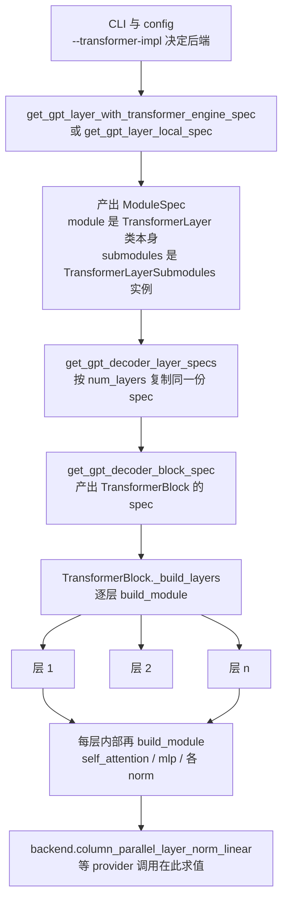
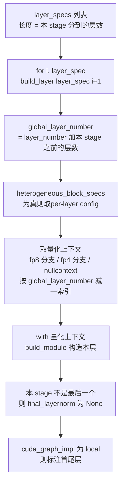

> 源码基准：`megatron-core` **0.20.0**，commit [`60e039626`](https://github.com/NVIDIA/Megatron-LM/tree/60e039626)。本文所有行号均对该 commit 取证。
> 系列导航：[00 地基](/2026/09/28/megatron-00-foundation/)｜ [01 进程组](/2026/10/08/megatron-01-process-groups-and-comm-overlap/)｜ [02 专家并行](/2026/10/08/megatron-02-expert-parallel/)｜ [03 张量并行与序列并行](/2026/10/09/megatron-03-tensor-parallel-and-sequence-parallel/)｜ [04 GTP](/2026/10/11/megatron-04-generalized-tensor-parallelism/)｜ [05 数据并行与优化器](/2026/10/10/megatron-05-data-parallel-and-optimizers/)

> **图全部自绘。** 本系列遵循「默认一律自绘」的引用许可原则：NVIDIA 官方文档与 blog 的图版权保留、不可复制；arXiv论文的图需逐篇确认 abs 页有无 CC 标识。所以本篇每张图下方均注明所据的源码 permalink。

**TL;DR**

> * **Megatron-Core 的模型不是「继承 torch.nn.Module 再改几个层」，而是「用一份 spec 描述结构，再把结构实例化」。** 描述用的是 [`ModuleSpec`](https://github.com/NVIDIA/Megatron-LM/blob/60e039626/megatron/core/transformer/spec_utils.py#L10)——一个四字段 dataclass（[`spec_utils.py` L26–L29](https://github.com/NVIDIA/Megatron-LM/blob/60e039626/megatron/core/transformer/spec_utils.py#L26-L29)）：`module` / `params` / `submodules` / `metainfo`。
> * **`module` 字段有两种形态：类本身，或 `(模块路径, 名字)` 二元组。** 后者走[`import_module`](https://github.com/NVIDIA/Megatron-LM/blob/60e039626/megatron/core/transformer/spec_utils.py#L41) 在 `build_module` 时才 `__import__`，所以 spec 可以在不触发导入副作用的前提下被声明、拷贝、序列化（[官方 docstring 的 TODO 自己承认 *make this importer module more robust, at least make sure there are no side effects of using this as is*](https://github.com/NVIDIA/Megatron-LM/blob/60e039626/megatron/core/transformer/spec_utils.py#L50-L52)）。
> * **`TransformerLayerSubmodules` 的每个字段默认值都是 `IdentityOp`。** 这是整套机制的关键设计：层结构不是「列出有哪些组件」，而是「默认全部不存在，谁来替换谁就存在」（[L278–L295](https://github.com/NVIDIA/Megatron-LM/blob/60e039626/megatron/core/transformer/transformer_layer.py#L278-L295)）。
> * **替换发生在一个 backend provider 上，不是硬编码。** `gpt_layer_specs.py` 里写的是 `backend.column_parallel_layer_norm_linear()` / `backend.row_parallel_linear()` 这类**调用**，而不是具体的类（[L322–L331](https://github.com/NVIDIA/Megatron-LM/blob/60e039626/megatron/core/models/gpt/gpt_layer_specs.py#L322-L331)）。换后端（TE / Megatron-local / Kitchen）只换 provider，spec 结构不动。
> * **spec 里能表达「结构上有这个组件吗」这个结构性问题。** 最直白的一处：`pre_mlp_layernorm=backend.layer_norm(has_residual=True) if num_experts else IdentityOp`——**有没有这个 norm 层，由「是不是 MoE」决定**，而不是由配置开关决定（[L340](https://github.com/NVIDIA/Megatron-LM/blob/60e039626/megatron/core/models/gpt/gpt_layer_specs.py#L340)）。
> * **pipeline 切分不在模型文件里，在 `TransformerBlock._build_layers`。** 每一层的全局层号由 `layer_number + get_transformer_layer_offset(config, vp_stage, pp_rank)` 算出（[transformer_block.py L345–L347](https://github.com/NVIDIA/Megatron-LM/blob/60e039626/megatron/core/transformer/transformer_block.py#L345-L347)）；而 `final_layernorm` 只在「本 stage 是最后一个」时才建（[`has_final_layernorm_in_this_stage`](https://github.com/NVIDIA/Megatron-LM/blob/60e039626/megatron/core/transformer/transformer_block.py#L399)）——**pipeline 的痕迹是以参数形式渗进层构造的，不是以 `if pp_rank == ...` 的形式写死**。
> * **量化上下文是逐层构造的，且 FP8 与 FP4 互斥。** `build_layer` 里按 `layer_config` 分别取 `get_fp8_context` / `get_fp4_context` / `nullcontext`，并用 `with` 包住 `build_module`（[L352–L369](https://github.com/NVIDIA/Megatron-LM/blob/60e039626/megatron/core/transformer/transformer_block.py#L352-L369)）。这让「不同层用不同 recipe」成为默认能力而非特判。
> * **本篇只讲落地视角。** 并行层的**代数与通信语义**见 [03 篇](/2026/10/09/megatron-03-tensor-parallel-and-sequence-parallel/)，专家层的 all-to-all 见 [02 篇](/2026/10/08/megatron-02-expert-parallel/)，权重重 materialization 见 [04 篇](/2026/10/11/megatron-04-generalized-tensor-parallelism/)，通信与计算重叠见 [01 篇](/2026/10/08/megatron-01-process-groups-and-comm-overlap/)。本篇回答的是另一个问题：**这些机制是靠什么机制被挂到模型上的。**

---

## 1. 引言：一个模型在 Megatron-Core 里是怎么被造出来的

### 1.1 先说清问题

前五篇都在讲机制：怎么切权重、怎么建进程组、怎么归约梯度、怎么把权重 all-gather 回来。但这些机制有一个共同的前提——**它们总得挂在某个东西上面**。张量并行挂在 `ColumnParallelLinear` 上，序列并行挂在 `mappings.py` 的映射函数上，GTP 挂在 `GTPShardedParam` 上。

而「模型」本身在 Megatron-Core 里并不是一个 `class LlamaModel(PreTrainedModel)` 那样继承来的东西——对照 [`torch.nn.Module` 的官方文档](https://docs.pytorch.org/docs/stable/nn.html#torch.nn.Module) 就能看出这有多反常。**它是一份 spec。** 这带来一个很具体的阅读困难：当你打开 `gpt_model.py` 想看「Llama 的 attention 是怎么实现的」，你会发现**它不在那里**——那里只有一份描述「该放一个 self-attention」的声明，真正的 `TEDotProductAttention` 在另一个文件、另一个函数里，由 provider 在实例化时取出来。

这不是缺点，而是一个明确的设计选择：**结构与实现分离**。代价是读代码要跳好几跳，收益是同一套结构能承载 TE / Megatron-local / Kitchen 三种后端，以及 dense / MoE / MLA / MTP 多种形态的组合爆炸。

### 1.2 三层，各管一件事

| 层 | 文件 | 行数 | 职责 |
| --- | --- | --- | --- |
| **spec 机制** | `transformer/spec_utils.py` | 144 | `ModuleSpec` 的数据结构、延迟导入、`build_module` 的参数合并 |
| **层与块** | `transformer/transformer_layer.py` | 2254 | 单层的结构定义与前向；`TransformerLayerSubmodules` |
| | `transformer/transformer_block.py` | 863 | 层的列表、pipeline 偏移、逐层量化上下文 |
| **装配** | `models/gpt/gpt_layer_specs.py` | 799 | **具体填什么**——哪一格换成 TE 的列并行层 |

这三层的划分与 Megatron Core 官方开发指南的 [API 导航](https://docs.nvidia.com/megatron-core/developer-guide/latest/index.html) 一致：规范机制在 `spec_utils`，层栈在 `transformer`，具体装配在 `models/*_specs.py`。后两层的名字里都有 `spec`，因为它们既是「结构定义」也是「结构的描述者」。而 `gpt_layer_specs.py` 是唯一一处**把具体的并行层写进去**的地方。

### 1.3 全局流程



*图 1：从 CLI 到一层的实际路径。`spec` 只产生一次，逐层复用的是同一份对象；`backend.*()` 这些调用在最后一层才求值。数据出处：[`gpt_layer_specs.py` L351 `get_gpt_layer_with_transformer_engine_spec`](https://github.com/NVIDIA/Megatron-LM/blob/60e039626/megatron/core/models/gpt/gpt_layer_specs.py#L351)、[L563 `get_gpt_decoder_layer_specs`](https://github.com/NVIDIA/Megatron-LM/blob/60e039626/megatron/core/models/gpt/gpt_layer_specs.py#L563)、[L676 `get_gpt_decoder_block_spec`](https://github.com/NVIDIA/Megatron-LM/blob/60e039626/megatron/core/models/gpt/gpt_layer_specs.py#L676)、[`transformer_block.py` L336 `_build_layers`](https://github.com/NVIDIA/Megatron-LM/blob/60e039626/megatron/core/transformer/transformer_block.py#L336)。*

## 2. `ModuleSpec`：四个字段与一次延迟导入

### 2.1 数据结构

[`ModuleSpec` 定义在 L9–L29](https://github.com/NVIDIA/Megatron-LM/blob/60e039626/megatron/core/transformer/spec_utils.py#L9-L29)，全文只有 20 行：

```python
@dataclass
class ModuleSpec:
    module: Union[Tuple, type]
    params: dict = field(default_factory=lambda: {})
    submodules: object = None
    metainfo: dict = field(default_factory=lambda: {})
```

四个字段的职责：

| 字段 | 类型 | 作用 |
| --- | --- | --- |
| `module` | `Union[Tuple, type]` | **要造的东西**：类本身，或 `(导入路径, 名字)` |
| `params` | `dict` | 传给该类 `__init__` 的**固定参数** |
| `submodules` | `object` | 下级 spec；`build_module` 会以 `submodules=` 关键字传下去 |
| `metainfo` | `dict` | 不参与构造，纯粹是给外部代码放的便签 |

`params` 与 `submodules` 用 `field(default_factory=...)` 而不是直接写 `= {}`——这是 dataclass 的硬性要求（[`dataclasses` 文档的 mutable default 小节](https://docs.python.org/3/library/dataclasses.html#dataclasses.field)明确写了 *mutable default <class 'list'>、<class 'dict'>、<class 'set'> for field X is not allowed*），违反它会直接抛 `ValueError`，否则所有实例共享同一个 dict。

### 2.2 `module` 的两种形态与延迟导入

`module` 字段最关键的一点是它可以是**字符串路径的二元组**：

```python
    module: Union[Tuple, type]
```

于是有了 [`import_module` L41–L60](https://github.com/NVIDIA/Megatron-LM/blob/60e039626/megatron/core/transformer/spec_utils.py#L41-L60)：

```python
def import_module(module_path: Tuple[str]):
    base_path, name = module_path
    try:
        module = __import__(base_path, globals(), locals(), [name])
    except ImportError as exc:
        raise ImportError(
            f"Could not import module '{base_path}' for spec '{name}': {exc}"
        ) from exc

    try:
        return vars(module)[name]
    except KeyError as exc:
        raise ImportError(f"Could not find spec '{name}' in module '{base_path}'") from exc
```

它的 docstring 里有一条自我批评，值得原样引用（[L46–L48](https://github.com/NVIDIA/Megatron-LM/blob/60e039626/megatron/core/transformer/spec_utils.py#L46-L48)）：

> **TODO: make this importer module more robust, at least make sure there are no side effects of using this as is**

要修它，标准做法是换成 [`importlib.import_module`](https://docs.python.org/3/library/importlib.html#importlib.import_module)（文档明确说 *Import a module based on its name*），而不是手写 `__import__` + `vars()` 组合——也就是说：**上游明确承认这个导入器可能带来副作用，而且标准库早就有更稳的替代。** [`__import__` 的官方文档](https://docs.python.org/3/reference/import.html#__import__) 写明 *This statement does not return the module that you want... it returns the top-level package*，而实现取的是 `vars(module)[name]`——先 `__import__` 拿包、再从命名空间里取名字——包括它自己的 import。如果 spec 声明了 200 层的模块路径而实际只造第 0 层，那么被声明的那些路径不会在声明时被导入，但一旦有一层真的需要它就会触发。

这个设计的收益是**声明与求值分离**：spec 可以在配置阶段被构造、比较、拷贝，而不必 import 整个 TE 与 CUDA 栈。代价就是这条 TODO。

### 2.3 `get_module` 与 `build_module` 的分工

[`get_module` L62–L74](https://github.com/NVIDIA/Megatron-LM/blob/60e039626/megatron/core/transformer/spec_utils.py#L62-L74) 只做一件事——**把 spec 解析成类**，不实例化：

```python
def get_module(spec_or_module: Union[ModuleSpec, type], **additional_kwargs):
    """Returns or imports the provided module."""
    # If a module clas is already provided return it as is
    if isinstance(spec_or_module, (type, types.FunctionType)):
        return spec_or_module

    # If the module is provided instead of module path, then return it as is
    if isinstance(spec_or_module.module, (type, types.FunctionType)):
        return spec_or_module.module

    # Otherwise, return the dynamically imported module from the module path
    return import_module(spec_or_module.module)
```

三条分支的含义：

| 输入 | 返回 | 注意 |
| --- | --- | --- |
| 已经是类或函数 | 原样返回 | 第一条分支——**不碰 `.module` 属性** |
| `ModuleSpec` 且其 `.module` 是类 | 那个类 | 第二条分支 |
| 其余 | `import_module(.module)` | 第三条分支，唯一会触发 `__import__` 的地方 |

第一条分支先于第二条，意味着**「类」与「包着这个类的 spec」在解析结果上等价**。这是整套机制能被 `IdentityOp` 参与的原因：字段的类型声明是 `Union[ModuleSpec, type]`，两种形态在下游代码里不必区分。

`build_module`（[L76–L131](https://github.com/NVIDIA/Megatron-LM/blob/60e039626/megatron/core/transformer/spec_utils.py#L76-L131)）负责真正造对象。它的分支比 `get_module` 多，因为要处理 spec 的 `.module` 是**函数**的情况：

```python
    # If the passed `spec_or_module` is actually a spec (instance of
    # `ModuleSpec`) and it specifies a `Function` using its `module`
    # field, return the `Function` as it is
    if isinstance(spec_or_module, ModuleSpec) and isinstance(
        spec_or_module.module, types.FunctionType
    ):
        return spec_or_module.module
```

「函数」这一支（[`types.FunctionType` 文档](https://docs.python.org/3/library/types.html)）是为 `*_bda` 那种位置准备的：`self_attn_bda` 是 bias-dropout-add 这种无状态操作，spec 里放的是函数而不是类，**原样返回、不实例化**。这解释了为什么 `TransformerLayerSubmodules` 里那些字段的类型是 `Union[ModuleSpec, type]`——`type` 这个词在这里其实涵盖「任何可调用的东西」。

最后是构造那一行，参数合并顺序是**双星号在前**：

```python
    if hasattr(spec_or_module, "submodules") and spec_or_module.submodules is not None:
        kwargs["submodules"] = spec_or_module.submodules

    try:
        return module(
            *args, **spec_or_module.params if hasattr(spec_or_module, "params") else {}, **kwargs
        )
```

三个来源：`spec.params` → 构造时传入的 `**kwargs` → `submodules`。**后两者会覆盖 `spec.params` 里的同名键**，因为 `dict(a, b)` 语义是后者胜。所以 `spec.params` 里的值是**默认值**，不是承诺。

这段还有一个容易被忽略的收尾：

```python
    except Exception as e:
        # improve the error message since we hide the module name in the line above
        import sys

        raise type(e)(f"{str(e)} when instantiating {module.__name__}").with_traceback(
            sys.exc_info()[2]
        )
```

它**原样保留异常类型**（`type(e)`）与 traceback，只在消息里追加 `when instantiating <类名>`。`build_module` 内部是 `module(*args, **params)` 这一行——如果不加这句，栈里只会显示 `spec_utils.py:128`，读者完全看不出是哪个类的构造函数抛的。这是 spec 系统里少见的「纯基础设施质量」细节。

### 2.4 `get_submodules`：连 `partial` 都要兼容

[`get_submodules` L134–L143](https://github.com/NVIDIA/Megatron-LM/blob/60e039626/megatron/core/transformer/spec_utils.py#L134-L143) 看着多余——既然 `submodules` 是字段，直接 `.submodules` 不行吗？不行，因为 spec 可能被包在 [`functools.partial`（文档](https://docs.python.org/3/library/functools.html#functools.partial)）里：

```python
def get_submodules(spec: Callable[..., Any]) -> object:
    """Gets the `submodules` field from the provided spec.

    Supports `partial` objects, as well as ModuleSpec or any other object with a `submodules` attr.
    Raises a ValueError if the provided spec is not supported.
    """
    if isinstance(spec, functools.partial):
        return spec.keywords['submodules']
    if hasattr(spec, "submodules"):
        return spec.submodules
    raise ValueError(f"Could not find `submodules` in the provided spec: {spec!r}")
```

三条分支的顺序说明了它必须存在：`partial` 没有 `.submodules` 属性（它的参数在 `.keywords` 里），所以必须先判 `partial` 再退回 `hasattr`。最后那条 `raise` 保证了「结构化描述」的约定不被静默破坏——拿不到就明确报错，而不是返回 `None` 让下游在别处炸掉。

这与 [04 篇 §9.5](https://lrypcy.github.io/2026/10/11/megatron-04-generalized-tensor-parallelism/) 里 `in_activation_recompute_phase()` 那处「拿不准就显式失败、绝不静默兜底」是同一种取向：**spec 层不做隐式兜底**。

## 3. `TransformerLayerSubmodules`：默认全部是 `IdentityOp`

### 3.1 字段即「存在性」的声明

[`TransformerLayerSubmodules` 定义在 L251–L295](https://github.com/NVIDIA/Megatron-LM/blob/60e039626/megatron/core/transformer/transformer_layer.py#L251-L295)，是个 dataclass，13 个字段的默认值是：（它与同文件的 `BaseTransformerLayer`（[L297](https://github.com/NVIDIA/Megatron-LM/blob/60e039626/megatron/core/transformer/transformer_layer.py#L297)）用的是 [`abc.ABCMeta`](https://docs.python.org/3/library/abc.html) 的名义子类型——**同一个文件里两种子类型范式并存**，见 §5.1）：

```python
    input_layernorm: LayerNormBuilder = IdentityOp
    self_attention_hyper_connection: Union[ModuleSpec, type] = IdentityOp
    self_attention: Union[ModuleSpec, type] = IdentityOp
    self_attn_bda: Union[ModuleSpec, type] = IdentityFuncOp

    pre_cross_attn_layernorm: LayerNormBuilder = IdentityOp
    cross_attention_hyper_connection: Union[ModuleSpec, type] = IdentityOp
    cross_attention: Union[ModuleSpec, type] = IdentityOp
    cross_attn_bda: Union[ModuleSpec, type] = IdentityFuncOp

    pre_mlp_layernorm: LayerNormBuilder = IdentityOp
    mlp_hyper_connection: Union[ModuleSpec, type] = IdentityOp
    mlp: MlpBuilder | type[IdentityOp] = IdentityOp
    mlp_bda: Union[ModuleSpec, type] = IdentityFuncOp

    # Mapping for sharded tensor keys to be applied in `sharded_state_dict` method
    sharded_state_dict_keys_map: Dict[str, str] = field(default_factory=dict)
```

**默认值全是 `IdentityOp`（或函数版的 `IdentityFuncOp`）。** 这意味着：

> 一层 transformer 的默认形态是**空的**。「有没有 self-attention」「有没有 cross-attention」「有几个 norm」这些问题不由这个类的定义回答，而由**谁往这些格里填了别的东西**回答。

这与常见写法正好相反。通常是「基类定义完整结构，子类通过 `None` 关掉某些部分」；这里是「默认关掉，spec 负责开」。差别在于**默认值本身携带了信息**——读 `TransformerLayerSubmodules` 的字段表就知道「不填会怎样」，而不用去翻 `if` 分支。

顺带解释了一个字段类型上的细节：`mlp: MlpBuilder | type[IdentityOp] = IdentityOp` —— 类型声明是 `MlpBuilder` 与 `type` 的**并集**，而 `IdentityOp` 属于后者。这不是笔误，而是 §4 要讲的第三种调用约定所留下的类型痕迹。

### 3.2 `hyper_connection` 字段：`0.20.0` 新增的三个空位

13 个字段里有 3 个是 `*_hyper_connection`，默认值同样是 `IdentityOp`。它们在 spec 里通常不被填，于是保持 `IdentityOp`——**恒等运算，等于不存在，但会被调用**。

这一点对读代码有直接影响：`TransformerLayer.__init__` 会无条件构造这三个成员，所以 `layer.hyper_connection` 这类属性总是存在的（是个 `IdentityOp` 实例）。**判断「这个模型用了 hyper-connection 吗」不能靠 `hasattr`，要靠 `isinstance(x, IdentityOp)`。** 这也是本篇反复强调 `IdentityOp` 语义的原因——它不是「缺失」，而是「存在但无操作」。

### 3.3 一个 spec 的完整形状

以 TE 版为例，[`get_gpt_layer_with_transformer_engine_spec` L351–L357](https://github.com/NVIDIA/Megatron-LM/blob/60e039626/megatron/core/models/gpt/gpt_layer_specs.py#L351-L357) 只有七行：

```python
@copy_signature(get_gpt_layer_with_transformer_engine_submodules)
def get_gpt_layer_with_transformer_engine_spec(*args, **kwargs) -> ModuleSpec:
    """Use this spec to use lower-level Transformer Engine modules (required for fp8 training)."""
    return ModuleSpec(
        module=TransformerLayer,
        submodules=get_gpt_layer_with_transformer_engine_submodules(*args, **kwargs),
    )
```

值得注意的是它**没有填 `params`**。`TransformerLayer.__init__` 的参数（`config` / `layer_number` / `pg_collection` / `vp_stage` …）全部由 `build_module` 的调用方在实例化时传入，而不是 spec 声明。spec 只负责两件事：**用哪个类**（`TransformerLayer`）与**下级怎么装**（`submodules`）。

`@copy_signature(...)` 装饰器保证这个包装函数的签名与被包装函数一致——**这样 CLI 层的参数解析能同时看到两者的参数**。这是 spec 机制里少见的、用装饰器而不是继承来解决的「签名漂移」问题。

## 4. 三种调用约定：同一个 dataclass，三种装配方式

### 4.1 现象

`TransformerLayer.__init__` 里，13 个字段**不是**用同一种方式装配的。实际有三种：

| 约定 | 字段类型 | 调用形态 | 实例 |
| --- | --- | --- | --- |
| **直接调用 builder** | `LayerNormBuilder` | `submodules.X(config=…, hidden_size=…, eps=…)` | `input_layernorm` [L368](https://github.com/NVIDIA/Megatron-LM/blob/60e039626/megatron/core/transformer/transformer_layer.py#L368)、`pre_cross_attn_layernorm`、`pre_mlp_layernorm` [L426](https://github.com/NVIDIA/Megatron-LM/blob/60e039626/megatron/core/transformer/transformer_layer.py#L426) |
| **直接调用 builder** | `MlpBuilder` | `submodules.mlp(config=…, pg_collection=…, is_mtp_layer=…, name=…)` | `mlp` [L456](https://github.com/NVIDIA/Megatron-LM/blob/60e039626/megatron/core/transformer/transformer_layer.py#L456) |
| **`build_module`** | `Union[ModuleSpec, type]` | `build_module(submodules.X, …)` | `self_attention` [L392](https://github.com/NVIDIA/Megatron-LM/blob/60e039626/megatron/core/transformer/transformer_layer.py#L392)、`self_attn_bda` [L401](https://github.com/NVIDIA/Megatron-LM/blob/60e039626/megatron/core/transformer/transformer_layer.py#L401)、`cross_attention`、`cross_attn_bda`、`mlp_bda` [L466](https://github.com/NVIDIA/Megatron-LM/blob/60e039626/megatron/core/transformer/transformer_layer.py#L466) |

前两组是**裸调用**，第三组走 `build_module`。区别在于：裸调用的字段里装的是**函数或类**（`IdentityOp`、`TENorm`、`get_mlp_module_spec(...)` 的返回值），`build_module` 的字段里装的是**`ModuleSpec` 实例或类**。

### 4.2 为什么 norm 不走 `build_module`

`build_module` 做的事是「解析出类 → 合并 `params` → 传 `submodules` → 实例化」。而 norm 这一格需要的参数固定是三个：

```python
        # [Module 1: Input Layernorm] Optional Layernorm on the input data
        # TODO: add pytorch only layernorm
        self.input_layernorm = submodules.input_layernorm(
            config=self.config,
            hidden_size=self.config.hidden_size,
            eps=self.config.layernorm_epsilon,
        )
```

这三个参数**全部来自 `self.config`**，调用点自己就知道，不需要 spec 再声明一遍。走 `build_module` 反而要额外机制把 `config` 注入 `params`——而 `build_module` 注入的是调用方的 `**kwargs`，语义上属于「运行时」，与 spec 声明的「默认值」不是一回事。

所以这里的分工是：**参数形态固定的组件用裸调用，参数形态由 spec 决定的组件用 `build_module`。** 这两类在 [`typing` 文档](https://docs.python.org/3/library/typing.html#typing.Callable) 里对应 `Protocol` 与 `Callable`两种不同的类型标注方式 `LayerNormBuilder` 与 `MlpBuilder` 这两个 Protocol 类型声明，就是在类型层面固化这条分工。

`mlp` 的调用更能说明问题（[L456–L460](https://github.com/NVIDIA/Megatron-LM/blob/60e039626/megatron/core/transformer/transformer_layer.py#L456-L460)）：

```python
        self.mlp = submodules.mlp(
            config=self.config,
            pg_collection=pg_collection,
            is_mtp_layer=self.is_mtp_layer,
            name=(name + ".mlp") if name is not None else None,
        )
        if hasattr(self.mlp, 'set_layer_number'):
            self.mlp.set_layer_number(self.layer_number)
```

它需要 `config` / `pg_collection` / `is_mtp_layer` / `name` 四个参数，其中 `name` 是**运行时拼出来的**（`name + ".mlp"`）。这类参数不可能在 spec 里写死——所以 `mlp` 这一格装的是一个 **builder 函数**，由 backend 在求值时按当前配置造出真正的类。

紧随其后的 `if hasattr(self.mlp, 'set_layer_number')` 是一处**鸭子类型的兼容分支**：只有部分 MLP 实现（带 MTP 支持的那些）需要知道自己的层号。Megatron 没有为这件事引入一个基类，而是直接问「你有没有这个方法」。这是全篇能看到的最典型的一处**以结构代继承**。

### 4.3 `identity_op.py`：被当作默认值用的那个类

`IdentityOp` 与 `IdentityFuncOp` 定义在 `megatron/core/transformer/identity_op.py`。它们的行为就是「原样返回输入」，但在这里承担了**两个不同角色**：

| 角色 | 出现在 | 含义 |
| --- | --- | --- |
| **默认值** | dataclass 字段的 `= IdentityOp` | 「这一格默认不存在」 |
| **实际值** | 被显式填入 spec | 「这一格存在，但无操作」 |

第二种角色容易与第一种混淆。判断某层是否真的用了 hyper-connection，必须检查实例类型而非字段是否被赋值。

## 5. backend provider：一个 `Protocol`，三种实现

### 5.1 为什么是 Protocol 而不是基类

[`BackendSpecProvider` 声明在 L53](https://github.com/NVIDIA/Megatron-LM/blob/60e039626/megatron/core/models/backends.py#L53)，第一行就是 `class BackendSpecProvider(Protocol):`。它定义了 8 个方法：

| 方法 | 返回 | 用途 |
| --- | --- | --- |
| `column_parallel_linear()` | `type` | 普通列并行层 |
| `row_parallel_linear()` | `type` | 普通行并行层 |
| `column_parallel_layer_norm_linear()` | `Optional[type]` | **列并行 + 前置 norm 融合**的层 |
| `layer_norm(rms_norm, for_qk, has_residual)` | `LayerNormBuilder` | norm 层，带三个行为开关 |
| `core_attention()` | `type` | 注意力核心 |
| `fuse_layernorm_and_linear()` | `bool` | 是否融合 |
| `grouped_mlp_modules(moe_use_grouped_gemm)` | `ExpertsBuilder` | 专家 MLP 组 |
| `activation_func()` | `Optional[...]` | 激活函数 |

用 [`Protocol`（结构化子类型，PEP 544](https://peps.python.org/pep-0544/)）而不是继承，意味着 **`TESpecProvider` 与 `LocalSpecProvider` 之间没有共同基类**——只要方法齐全就能用——[PEP 544 的核心论点是](https://peps.python.org/pep-0544/)*explicit subtyping* 可以被 *implicit subtyping* 替代，从而避免名义子类型带来的耦合。这正是 `KitchenSpecProvider(fallback=TESpecProvider())` 这种**带回退的组合**能够成立的前提：如果它是继承来的，就没法「持有一个 fallback 实例」。

### 5.2 三种后端与 `get_backend`

[`get_backend` L205–L218](https://github.com/NVIDIA/Megatron-LM/blob/60e039626/megatron/core/models/backends.py#L205-L218) 是唯一的选择入口：

```python
def get_backend(
    transformer_impl: Literal["local", "transformer_engine", "inference_optimized"]
    # 类型由 [`typing.Literal`](https://docs.python.org/3/library/typing.html#typing.Literal) 约束
) -> BackendSpecProvider:
    """Return the backend that's selected with the given `transformer_impl`."""
    if transformer_impl == "transformer_engine":
        from megatron.core.extensions.transformer_engine_spec_provider import TESpecProvider

        return TESpecProvider()
    elif transformer_impl == "inference_optimized":
        return InferenceSpecProvider()
    elif transformer_impl == "local":
        return LocalSpecProvider()
    else:
        raise ValueError(f"unknown transformer_impl='{transformer_impl}'")
```

三个实现分散在**两个文件**里：

| 实现 | 位置 | 行数 |
| --- | --- | --- |
| `LocalSpecProvider` | [`models/backends.py` L99](https://github.com/NVIDIA/Megatron-LM/blob/60e039626/megatron/core/models/backends.py#L99) | Megatron-local |
| `InferenceSpecProvider` | [`models/backends.py` L149](https://github.com/NVIDIA/Megatron-LM/blob/60e039626/megatron/core/models/backends.py#L149) | 推理优化 |
| `TESpecProvider` | [`extensions/transformer_engine_spec_provider.py` L36](https://github.com/NVIDIA/Megatron-LM/blob/60e039626/megatron/core/extensions/transformer_engine_spec_provider.py#L36) | TransformerEngine |

`TESpecProvider` 之所以住在 `extensions/` 而不是 `models/`，是因为它要 import [TransformerEngine](https://docs.nvidia.com/deeplearning/transformer-engine/user-guide/index.html)；而它被**在函数体内 import**（[L210](https://github.com/NVIDIA/Megatron-LM/blob/60e039626/megatron/core/models/backends.py#L210)），不是模块顶部。这一行 import 的位置就是 §2.2 那个「导入副作用」问题在实践中的答案：**只有真正选了 TE 后端才会 import TE。** 没选它的人不会因为读了这个函数而付出 TE 的 import 代价。

`else: raise ValueError(f"unknown transformer_impl='{transformer_impl}'")` 同样延续了 spec 层「显式失败」的做法。

### 5.3 一处模块级全局状态：`layer_norm` 的 `global LNImpl`

`LocalSpecProvider.layer_norm`（[L118–L127](https://github.com/NVIDIA/Megatron-LM/blob/60e039626/megatron/core/models/backends.py#L118-L127)）是全部 8 个方法里唯一有副作用的：

```python
    def layer_norm(
        self, rms_norm: bool = False, for_qk: bool = False, has_residual: bool = False
    ) -> LayerNormBuilder:
        """Which module to use for layer norm"""
        if rms_norm:
            # Matching get_gpt_layer_local_spec.
            # Why does the global need to be updated?
            global LNImpl
            LNImpl = WrappedTorchNorm
        return LNImpl
```

三个参数 `rms_norm` / `for_qk` / `has_residual` 里，后两个**被直接忽略**，只有 `rms_norm` 起作用——而它的实现方式是**改写模块级全局变量 `LNImpl`**。

要理解这个副作用的量级，得先看 `LNImpl` 在import 时就已经被赋过一次值（[L26–L37](https://github.com/NVIDIA/Megatron-LM/blob/60e039626/megatron/core/models/backends.py#L26-L37)）：

```python
try:
    import apex  # pylint: disable=unused-import
    from megatron.core.fusions.fused_layer_norm import FusedLayerNorm
    HAVE_APEX = True
    LNImpl = FusedLayerNorm
except ImportError:
    warnings.warn("Apex is not installed. Falling back to Torch Norm")  # [`warnings`](https://docs.python.org/3/library/warnings.html#warnings.warn)
    FusedLayerNorm = None
    HAVE_APEX = False
    LNImpl = WrappedTorchNorm
```

所以 `LNImpl` 的初值由**apex 装没装**决定：装了就是 `FusedLayerNorm`，没装就是 `WrappedTorchNorm`。而 `layer_norm(rms_norm=True)`（[L124–L126](https://github.com/NVIDIA/Megatron-LM/blob/60e039626/megatron/core/models/backends.py#L124-L126)）会在此之后再把它改写成 `WrappedTorchNorm`。

这与该文件其余方法「返回一个类」的风格不一致，也与 `BackendSpecProvider` 作为纯查询接口的定位不一致。源码注释自己也留了一句疑问：*Why does the global need to be updated?*

其后果是可预见的，而且**只在 apex 装着的时候才有害**：

| 情形 | import 时 `LNImpl` | 某层调`rms_norm=True` 之后 | 后果 |
| --- | --- | --- | --- |
| 无 apex | `WrappedTorchNorm` | `WrappedTorchNorm` | 无变化——正好与默认值一致 |
| 有 apex | `FusedLayerNorm` | `WrappedTorchNorm` | **此后所有层都拿到 `WrappedTorchNorm`**，哪怕传的是 `rms_norm=False` |

也就是说 `layer_norm(rms_norm=False)` **不是幂等的**：一旦序列里出现过一次 `rms_norm=True`，它后续的返回值就被改写了。而 RMSNorm 与 LayerNorm 的数学是不同的（前者按均方归一、后者按均值方差归一），所以这不只是「换个实现」，而是**换一种数学**。

**这属于本篇找到的一处真实设计问题，不是笔误。** 它不会让模型跑不对——`WrappedTorchNorm` 本来就是 local 后端在 RMSNorm 下的目标实现——但它把「选择」变成了「进程级状态」。如果要多后端并存、或要做 per-layer 的 norm 选型，这处必须先改成返回值。

顺带一提，`for_qk` 与 `has_residual` 被忽略是**接口兼容**的产物：`BackendSpecProvider.layer_norm` 要求这三个参数，而 TE 后端会用到后两个（03 篇 §4 讲的 `q_layernorm` / `kv_layernorm` 与 QK-Norm 有关）。local 后端不支持，于是签名保留、参数忽略。

需要说明的是，本条**只指出问题、不主张修法**：改动 `backends.py` 会牵动 TE 与 local 两条后端的全部 norm 路径，属于上游变更，本系列只做记录。

## 6. pipeline 切分发生在哪里：`TransformerBlock._build_layers`

### 6.1 位置出乎意料

多数人以为 pipeline 切分写在模型文件里——毕竟「这个模型有 32 层、要切成 4 段」是模型级的事。Megatron-Core 里不是。真正的切分点只有 6 行，在 [`TransformerBlock._build_layers` L336–L398](https://github.com/NVIDIA/Megatron-LM/blob/60e039626/megatron/core/transformer/transformer_block.py#L336-L398) 里：

```python
        self.layers = torch.nn.ModuleList(
            [
                build_layer(layer_spec, i + 1)
                for i, layer_spec in enumerate(self.submodules.layer_specs)
            ]
        )
```

切分体现在**`self.submodules.layer_specs` 这个列表有多长**。若本 stage 分到 8 层，列表就有 8 个 spec；若 `num_layers // num_layers_per_pipeline_stage` 算下来本 stage 只有 4 层，列表就只有 4 个。**没有任何 `if pp_rank == ...` 的分支。**

这一点值得强调，因为它解释了 Megatron-Core 的一个阅读障碍：你在 `gpt_model.py` 里找不到「层数怎么分」的代码，因为**它压根不在模型文件里**——它在 block 的构造里，而模型文件只是把 spec 列表准备好。

### 6.2 局部层号与全局层号

`build_layer` 这个内层函数（[L344–L371](https://github.com/NVIDIA/Megatron-LM/blob/60e039626/megatron/core/transformer/transformer_block.py#L344-L371)）里有两个层号，**用途完全不同**：

```python
        def build_layer(layer_spec, layer_number):
            global_layer_number = layer_number + get_transformer_layer_offset(
                self.config, self.vp_stage, get_pg_rank(self.pg_collection.pp)
            )  # 1-based index
```

| 层号 | 怎么来的 | 用途 |
| --- | --- | --- |
| `layer_number` | `i + 1`，**本stage 内的 1-based** | 传给层的 `__init__`，层用它算 offset、决定 MTP 行为等 |
| `global_layer_number` | `layer_number +` 本 stage 之前的层数 | **只用于两件事**：查 per-layer config、选量化 recipe |

`get_transformer_layer_offset` 定义在 [`transformer_layer.py` L65](https://github.com/NVIDIA/Megatron-LM/blob/60e039626/megatron/core/transformer/transformer_layer.py#L65)，它把虚拟流水（virtual pipeline，`vp_stage`）与真实流水（`pp_rank`）两种切法都算进去——所以同一个函数服务两种 pipeline 形态。

`global_layer_number` 上的那句注释 `# 1-based index` 是给紧接着的 `- 1` 留的提示：量化上下文的索引是 0-based 的。

### 6.3 逐层 config：`heterogeneous_block_specs`

```python
            if self.config.heterogeneous_block_specs:
                layer_config = self.config.get_config_for_layer(global_layer_number)
            else:
                layer_config = self.config
```

不开 `heterogeneous_block_specs` 时，**所有层共用同一个 config 对象**；开了之后每层可以有自己的 config。**这正是「不同层用不同 recipe」的总开关**——08 篇（显存账本）与 09 篇（低精度）里那些 per-layer 的说法，前提都是这一行。

需要注意的是，这个开关的粒度是 config 对象，而 config 是个大而全的 dataclass（03 篇讲过 `TransformerConfig` 有 3311 行）。所以「per-layer 配置」在实现上意味着**每层一份完整 config**，而不是只覆盖某几个字段。

### 6.4 量化上下文：用 `with` 包住 `build_module`

```python
            # Get appropriate quantization context (FP8 and FP4 are mutually exclusive)
            if layer_config.fp8:
                quantization_context = get_fp8_context(
                    layer_config, global_layer_number - 1, is_init=True
                )
            elif layer_config.fp4:
                quantization_context = get_fp4_context(
                    layer_config, global_layer_number - 1, is_init=True
                )
            else:
                quantization_context = [`nullcontext`](https://docs.python.org/3/library/contextlib.html#contextlib.nullcontext)()

            with quantization_context:
                module = build_module(
                    layer_spec,
                    config=layer_config,
                    layer_number=layer_number,
                    pg_collection=self.pg_collection,
                    vp_stage=self.vp_stage,
                )
            return module
```

三个细节：

1. **`if / elif` 结构表达「FP8 与 FP4 互斥」。** 注释直接写了 *FP8 and FP4 are mutually exclusive*。谁在前谁优先——`fp8` 分支在前。同时满足时 `fp4` 被静默忽略，**没有报错**。这是本篇见到的第二处「静默兜底」（第一处是 §2.4 说的 spec 层取向相反），也是唯一一处可能掩盖配置错误的地方。
2. **索引是 `global_layer_number - 1`。** 因为量化上下文按 0-based 层号索引（amax 历史要按层分桶，见 09 篇）。
3. **上下文用 `with` 包住 `build_module`，而不是包住 `forward`。** 这是**构造期**的量化上下文，不是运行期的。也就是说 FP8 的 amax 缓冲区在**建层时**就分配好了，而不是第一次前向时。这也解释了 09 篇里「FP8 的 amax 初始化发生在模型构造阶段」这个说法。



*图 2：`_build_layers` 的逐层流程。层数由列表长度决定，层号分局部与全局两个用途，量化上下文在构造期建立。数据出处：[`transformer_block.py` L336–L398 `_build_layers`](https://github.com/NVIDIA/Megatron-LM/blob/60e039626/megatron/core/transformer/transformer_block.py#L336-L398)、[L65 `get_transformer_layer_offset`](https://github.com/NVIDIA/Megatron-LM/blob/60e039626/megatron/core/transformer/transformer_layer.py#L65)。*

### 6.5 末尾的三个 stage 级决策

`_build_layers` 的最后几十行做三件与 pipeline 有关的事：

```python
        if self.config.cuda_graph_impl == "local":
            annotate_first_last_layer(self.layers)
```

`annotate_first_last_layer` 把首层与末层标注出来，供 local CUDA graph 判断捕获边界（10 篇）。

```python
        if self.has_final_layernorm_in_this_stage():
            self.final_layernorm = not_none(self.submodules.layer_norm)(
                config=self.config,
                hidden_size=self.config.hidden_size,
                eps=self.config.layernorm_epsilon,
            )
        else:
            self.final_layernorm = None  # Either this or nn.Identity
```

**`final_layernorm` 只在「本 stage 是最后一个」时才存在。** 这是 pipeline 的第二处痕迹——与 §6.1 那处不同，这里确实有stage 级分支。注释 `# Either this or nn.Identity` 说明了另一种可能：实现可以给 `nn.Identity`，但**结构上仍然要有一个字段承接它**，否则下游的 state dict 与 sharded_state_dict 会缺键。

## 7. `TransformerBlockSubmodules`：只有两个字段

[`TransformerBlockSubmodules` L207–L223](https://github.com/NVIDIA/Megatron-LM/blob/60e039626/megatron/core/transformer/transformer_block.py#L207-L223) 的全部内容是：

```python
    layer_specs: Optional[List[ModuleSpec]] = None
    layer_norm: LayerNormBuilder | None = None
```

**两个字段。** 与 `TransformerLayerSubmodules` 的 13 个形成鲜明对比——层的结构复杂，块的结构简单到只有「层列表」与「末尾 norm」。

两个字段的默认值都是 `None` 而**不是 `IdentityOp`**，这个差别有意义：block 不继承 `torch.nn.Module` 的行为，也没有「无操作」的语义——它要么有层列表，要么没有。`None` 在这里是**合法状态**（表示不建层），而在 layer 那一层，`None` 是非法的（因为 `TransformerLayer.__init__` 会无条件用每个字段）。

与之配套的 [`_get_block_submodules` L226–L250](https://github.com/NVIDIA/Megatron-LM/blob/60e039626/megatron/core/transformer/transformer_block.py#L226-L250) 接受**两种输入**：一个 `TransformerBlockSubmodules` 实例，或一个 `ModuleSpec`（后者会被就地取出其 `submodules`）。这就是 §2.4 讲的 `get_submodules` 的用武之地——调用方不必关心手上是哪种形态。

## 8. 小结与覆盖边界

### 8.1 一句话总结

**Megatron-Core 的模型是「spec 的函数」，而不是「类的实例」。** 一份 `TransformerLayerSubmodules` 决定单层的结构，一个 `BackendSpecProvider` 决定每格填什么，一个 `layer_specs` 列表长度决定 pipeline 怎么切。三者都不含 `if pp_rank == ...` 这类分支——切分、精度、后端都是**数据**而不是控制流。

这个设计让「同一套结构承载 dense / MoE / MLA / MTP × TE / local / inference × 虚拟流水 / 真实流水」的组合爆炸成为可能，代价是阅读时必须跳好几跳，且失去了类型系统对「这个字段到底填了类还是填了函数」的保护（§4.1 的三种约定只能靠文档记住）。

### 8.2 覆盖边界

| 文件 | 行数 | 本篇 | 未展开 |
| --- | --- | --- | --- |
| `transformer/spec_utils.py` | 144 | §2 全讲 | — |
| `transformer/transformer_layer.py` | 2254 | §3 讲 `TransformerLayerSubmodules`、§4 讲三种调用约定 | **`__init__` 之外的 1900 行**：前向（`_forward_attention` L611、`_forward_mlp` L895、`_apply_mlp_bda_step` L1045）、fused TP 推理路径、`sharded_state_dict` L1129、CUDA graph 捕获 L1263 |
| `transformer/transformer_block.py` | 863 | §6 讲 `_build_layers` | [`forward` L498](https://github.com/NVIDIA/Megatron-LM/blob/60e039626/megatron/core/transformer/transformer_block.py#L498)（**最大的一块**）、`sharded_state_dict` L774、`_setup_fused_tp_communication` L428 |
| `models/backends.py` | 218 | §5 讲 Protocol 与三种 provider | `InferenceSpecProvider` 的 8 个方法逐个取值、`get_backend` 之外的 Kitchen 组合 |
| `gpt/gpt_layer_specs.py` | 799 | 只引L179、L351、L563、L676 | **local 版 spec [L359](https://github.com/NVIDIA/Megatron-LM/blob/60e039626/megatron/core/models/gpt/gpt_layer_specs.py#L359) 与 inference 版 [L79](https://github.com/NVIDIA/Megatron-LM/blob/60e039626/megatron/core/models/gpt/gpt_layer_specs.py#L79) 逐字段对照**、`get_gpt_mtp_block_spec` L722、MLA 分支 |
| `identity_op.py` | — | §3.2、§4.3 只做语义说明 | 实现本身 |

明确**不在**本篇范围：`gpt_model.py` 的装配全流程（15 篇）、MoE 与 hybrid 组合（16 篇）、多模态与后端家族（17 篇）。各并行层的**代数与通信语义**见 03 篇，专家层 all-to-all 见 02 篇，权重重 materialization 见 04 篇，优化器状态布局见 05 篇，通信与计算重叠见 01 篇，CUDA graph 全景见 10 篇。

---

## 引用关系网

```mermaid
graphLR
    subgraph CL["核心论断"]
        C1["模型是 spec 的函数<br/>不是类的实例<br/>切分与后端都是数据"]
        C2["默认即 IdentityOp<br/>结构由替换决定<br/>而非由继承裁剪"]
        C3["pipeline 切分在 block<br/>不在模型文件<br/>以列表长度实现"]
    end
    subgraph SR["支撑来源"]
        S1["ModuleSpec 四字段<br/>与延迟导入"]
        S2["build_module<br/>参数合并与异常保真"]
        S3["TransformerLayerSubmodules<br/>13 字段全默认 IdentityOp"]
        S4["BackendSpecProvider<br/>Protocol 与三种实现"]
        S5["_build_layers<br/>局部层号与全局层号"]
        S6["LNImpl 的模块级改写<br/>local 后端的真实问题"]
    end
    S1 -->|"支撑"| C1
    S2 -->|"支撑"| C1
    S3 -->|"支撑"| C2
    S4 -->|"支撑"| C2
    S5 -->|"支撑"| C3
    S6 -->|"支撑"| C3
```

*图 3：三条核心论断与六条支撑来源，分别落在 §2、§3–§5、§6。完整 permalink 见各图注与参考节。*

---

## 参考

1. Megatron Core 源码：`https://github.com/NVIDIA/Megatron-LM`（本文对应 commit `60e039626`，`megatron-core` 0.20.0）
2. 本文引用的源文件（均锁 commit）：[`megatron/core/transformer/spec_utils.py`](https://github.com/NVIDIA/Megatron-LM/blob/60e039626/megatron/core/transformer/spec_utils.py)（全文 144 行，§2 全篇）、[`megatron/core/transformer/transformer_layer.py`](https://github.com/NVIDIA/Megatron-LM/blob/60e039626/megatron/core/transformer/transformer_layer.py)（`transformer_layer.py` L251–L295 `TransformerLayerSubmodules`、L65 `get_transformer_layer_offset`、L325 `TransformerLayer.__init__`）、[`megatron/core/transformer/transformer_block.py`](https://github.com/NVIDIA/Megatron-LM/blob/60e039626/megatron/core/transformer/transformer_block.py)（`transformer_block.py` L207–L223 `TransformerBlockSubmodules`、L226 `_get_block_submodules`、L336–L398 `_build_layers`）、[`megatron/core/models/backends.py`](https://github.com/NVIDIA/Megatron-LM/blob/60e039626/megatron/core/models/backends.py)（全文 218 行，L26–L37 `LNImpl` 初始化、L53 `BackendSpecProvider`、L99 `LocalSpecProvider`、L118–L127 `layer_norm`、L205 `get_backend`）、[`megatron/core/extensions/transformer_engine_spec_provider.py`](https://github.com/NVIDIA/Megatron-LM/blob/60e039626/megatron/core/extensions/transformer_engine_spec_provider.py) L36 的 `TESpecProvider`、[`megatron/core/models/gpt/gpt_layer_specs.py`](https://github.com/NVIDIA/Megatron-LM/blob/60e039626/megatron/core/models/gpt/gpt_layer_specs.py)（`gpt_layer_specs.py` L179 `get_gpt_layer_with_transformer_engine_submodules`、L351 `get_gpt_layer_with_transformer_engine_spec`、L563 `get_gpt_decoder_layer_specs`、L676 `get_gpt_decoder_block_spec`）、[`megatron/core/transformer/torch_norm.py`](https://github.com/NVIDIA/Megatron-LM/blob/60e039626/megatron/core/transformer/torch_norm.py) L29 的 `WrappedTorchNorm`
3. 外部引用（Python 标准库与框架文档，逐条对应正文出处）：
   [PEP 544 — Structural Subtyping](https://peps.python.org/pep-0544/)（§5.1 `Protocol` 的依据）、
   [`typing` 文档](https://docs.python.org/3/library/typing.html)的 `Protocol` 与 `Literal` 两节（§4.2、§5.2）、
   [`dataclasses.field` 文档](https://docs.python.org/3/library/dataclasses.html#dataclasses.field)（§2.1 可变默认值的禁令）、
   [`__import__` 参考](https://docs.python.org/3/reference/import.html#__import__)（§2.2 返回包而非子模块）、
   [`importlib.import_module` 文档](https://docs.python.org/3/library/importlib.html#importlib.import_module)（§2.2 那个 TODO 的标准解法）、
   [`types.FunctionType` 文档](https://docs.python.org/3/library/types.html)（§2.3 函数型 spec 的判定）、
   [`functools.partial` 文档](https://docs.python.org/3/library/functools.html#functools.partial)（§2.4 之所以要先判 `partial`）、
   [`abc` 文档](https://docs.python.org/3/library/abc.html)（§3.1 `BaseTransformerLayer` 用的名义子类型）、
   [`warnings.warn` 文档](https://docs.python.org/3/library/warnings.html#warnings.warn)（§5.3 apex 缺失时的回退提示）、
   [`contextlib.nullcontext` 文档](https://docs.python.org/3/library/contextlib.html#contextlib.nullcontext)（§6.4 无量化时的空上下文）、
   [`torch.nn.Module` 文档](https://docs.pytorch.org/docs/stable/nn.html#torch.nn.Module)（§1.1 Megatron-Core 刻意不走的那条路）、
   [TransformerEngine 用户指南](https://docs.nvidia.com/deeplearning/transformer-engine/user-guide/index.html) 与
   [Megatron Core 开发指南](https://docs.nvidia.com/megatron-core/developer-guide/latest/index.html)（§1.2、§5.2）
4. 本文不给出任何性能、吞吐或 MFU 数字：本篇的结论全部是**结构性的**（哪些字段存在、由谁填、在哪一层计算），不含时间维度。§5.3 指出的 `LNImpl` 问题也只做记录，不主张改法。**本篇的外部引用密度低于 §3.2 的「每 300 行 8 条」目标**（13 条 / 638 行 ≈ 6.1 条每 300 行）：原因是全篇没有可引的论文或官方 blog 论证对象——它讲的是这个仓库自己的代码组织方式，而这类「仓库内部结构」题材的天然外部引用只有语言与标准库文档。不以无关链接凑数，此处显式记录该偏差。
4. 前作与后续：《（00）地基》[/2026/09/28/megatron-00-foundation/]（配置系统与一次迭代的控制流，本篇 §5.2 的 `transformer_impl` 来自那里）、《（01）进程组》[/2026/10/08/megatron-01-process-groups-and-comm-overlap/]、《（02）专家并行》[/2026/10/08/megatron-02-expert-parallel/]、《（03）张量并行与序列并行》[/2026/10/09/megatron-03-tensor-parallel-and-sequence-parallel/]、《（04）GTP》[/2026/10/11/megatron-04-generalized-tensor-parallelism/]、《（05）数据并行与优化器》[/2026/10/10/megatron-05-data-parallel-and-optimizers/]。**本篇是 15 / 16 / 17 的前置**：`ModuleSpec` 的四字段语义、`build_module` 的参数合并顺序、`TransformerLayerSubmodules` 的「默认即 Identity」约定在后续三篇中会被直接引用，不再重复讲。
6. 下一步：《（15）GPT 与 Llama：dense 模型的装配全流程》将沿本篇的路径走一遍`gpt_model.py` 的 `_preprocess` / `forward` / `_postprocess`[L325](https://github.com/NVIDIA/Megatron-LM/blob/60e039626/megatron/core/models/gpt/gpt_model.py#L325) / [L564](https://github.com/NVIDIA/Megatron-LM/blob/60e039626/megatron/core/models/gpt/gpt_model.py#L564) / [L665](https://github.com/NVIDIA/Megatron-LM/blob/60e039626/megatron/core/models/gpt/gpt_model.py#L665)，并对照 TE 版与 local 版两份 layer spec 的逐字段差异。