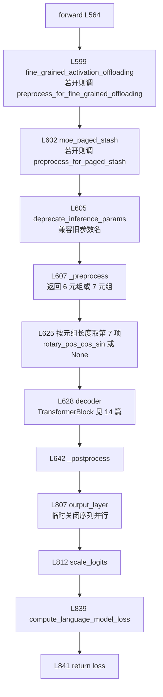

> 源码基准：`megatron-core` **0.20.0**，commit [`60e039626`](https://github.com/NVIDIA/Megatron-LM/tree/60e039626)。本文所有行号均对该 commit 取证。
> 系列导航：[00 地基](/2026/09/28/megatron-00-foundation/)｜ [01 进程组](/2026/10/08/megatron-01-process-groups-and-comm-overlap/)｜ [02 专家并行](/2026/10/08/megatron-02-expert-parallel/)｜ [03 张量并行与序列并行](/2026/10/09/megatron-03-tensor-parallel-and-sequence-parallel/)｜ [04 GTP](/2026/10/11/megatron-04-generalized-tensor-parallelism/)｜ [05 数据并行与优化器](/2026/10/10/megatron-05-data-parallel-and-optimizers/)｜ [14 层栈与 spec 机制](/2026/10/12/megatron-14-module-spec-and-layer-stack/)

> **前置**：[14 篇](/2026/10/12/megatron-14-module-spec-and-layer-stack/) 讲了 `ModuleSpec` 的四字段、`build_module` 的参数合并顺序、`TransformerLayerSubmodules` 的「默认即 `IdentityOp`」约定，以及 `BackendSpecProvider` 这个 `Protocol`。本篇**直接引用**那套机制，不重复讲解。凡涉及并行层的**代数与通信语义**，见 [03 篇](/2026/10/09/megatron-03-tensor-parallel-and-sequence-parallel/)；MoE 的 all-to-all 见 [02 篇](/2026/10/08/megatron-02-expert-parallel/)。

**TL;DR**

> * **一个 dense 模型的前向只有三段：`_preprocess` → `decoder` → `_postprocess`。** 三个方法分别在 [`gpt_model.py` L325](https://github.com/NVIDIA/Megatron-LM/blob/60e039626/megatron/core/models/gpt/gpt_model.py#L325)、[L564](https://github.com/NVIDIA/Megatron-LM/blob/60e039626/megatron/core/models/gpt/gpt_model.py#L564)（`forward` 本身）、[L665](https://github.com/NVIDIA/Megatron-LM/blob/60e039626/megatron/core/models/gpt/gpt_model.py#L665)。中间的 `decoder` 是 14 篇讲过的 `TransformerBlock`。
> * **`forward` 在调用 `_preprocess` 之前先做两件「与模型无关」的事**：`fine_grained_activation_offloading`（[L599](https://github.com/NVIDIA/Megatron-LM/blob/60e039626/megatron/core/models/gpt/gpt_model.py#L599)）与 `moe_paged_stash`（[L602](https://github.com/NVIDIA/Megatron-LM/blob/60e039626/megatron/core/models/gpt/gpt_model.py#L602)）——两者的预切都在**进 decoder 之前**，不进 `_preprocess`。
> * **`_preprocess` 返回一个 6 元组，而 flashinfer 融合 rope 路径会变成 7 元组。** [L482–L496](https://github.com/NVIDIA/Megatron-LM/blob/60e039626/megatron/core/models/gpt/gpt_model.py#L482-L496) 明确注释这是 *for backwards compatibility with legacy unit tests, which break if you return a 7 tuple instead of 6*；消费端用长度判断（[L625](https://github.com/NVIDIA/Megatron-LM/blob/60e039626/megatron/core/models/gpt/gpt_model.py#L625) `preproc_output[6] if len(preproc_output) == 7 else None`）——**元组长度本身成了一个带版本的接口契约**。
> * **`_postprocess` 会临时把输出层的序列并行关掉再打开。** `sequence_parallel_override`（[L762](https://github.com/NVIDIA/Megatron-LM/blob/60e039626/megatron/core/models/gpt/gpt_model.py#L762)）→ 关（[L799](https://github.com/NVIDIA/Megatron-LM/blob/60e039626/megatron/core/models/gpt/gpt_model.py#L799)）→ 算 logits → 恢复（[L821](https://github.com/NVIDIA/Megatron-LM/blob/60e039626/megatron/core/models/gpt/gpt_model.py#L821)）。这是 03 篇 §7 那个「SP 边界上输出层怎么处理」在模型文件里的落点。
> * **TE 版与 local 版 layer spec 的差别不止「换了类」，有一处连并行策略都不同。** MLA 分支里 TE 版对 `linear_q_down_proj` / `linear_q_up_proj` / `linear_kv_down_proj` / `linear_kv_up_proj` 用 `backend.linear()`（[L302–L306](https://github.com/NVIDIA/Megatron-LM/blob/60e039626/megatron/core/models/gpt/gpt_layer_specs.py#L302-L306)），而 local 版对同样四格用 `backend.column_parallel_linear()`（[L422–L425](https://github.com/NVIDIA/Megatron-LM/blob/60e039626/megatron/core/models/gpt/gpt_layer_specs.py#L422-L425)）。
> * **这引出一处真实的类型漏洞：`linear()` 不在 `BackendSpecProvider` 的 Protocol 里。** [Protocol 的 8 个方法](https://github.com/NVIDIA/Megatron-LM/blob/60e039626/megatron/core/models/backends.py#L57-L94)（[L57–L94](https://github.com/NVIDIA/Megatron-LM/blob/60e039626/megatron/core/models/backends.py#L57-L94)）里没有 `linear()`，而 `TESpecProvider`（[L39](https://github.com/NVIDIA/Megatron-LM/blob/60e039626/megatron/core/extensions/transformer_engine_spec_provider.py#L39)）与 `InferenceSpecProvider`（[L152](https://github.com/NVIDIA/Megatron-LM/blob/60e039626/megatron/core/models/backends.py#L152)）都实现了它。**`LocalSpecProvider` 则根本没实现**——这也解释了为什么 local spec 从不调`linear()`。
> * **dense 与 MoE 的混排由一个整数或一个列表决定。** `moe_layer_freq` 为 int 时按 `i % freq == 0` 生成 0/1 模式（[L647–L650](https://github.com/NVIDIA/Megatron-LM/blob/60e039626/megatron/core/models/gpt/gpt_layer_specs.py#L647-L650)）——**注意这会让第 0 层恒为专家层**；为 list 时直接采用并断言长度（[L651–L657](https://github.com/NVIDIA/Megatron-LM/blob/60e039626/megatron/core/models/gpt/gpt_layer_specs.py#L651-L657)）；其余类型 `raise ValueError`（[L658–L661](https://github.com/NVIDIA/Megatron-LM/blob/60e039626/megatron/core/models/gpt/gpt_layer_specs.py#L658-L661)）。
> * **embedding 与 output 共享权重是一个 config 开关，不是结构决策。** `share_embeddings_and_output_weights` 为真时 `_postprocess` 取 `output_weight = self.shared_embedding_or_output_weight()`（[L709–L710](https://github.com/NVIDIA/Megatron-LM/blob/60e039626/megatron/core/models/gpt/gpt_model.py#L709-L710)）传给输出层——**结构上输出层照旧存在，只是权重换了来源**。

---

## 1. 引言：把「一个模型」拆成三段

### 1.1 为什么这三段值得单独看

14 篇讲了 spec 机制本身，但读者会有一个具体疑问：**这些东西合起来到底造出了什么？** 本篇回答这个问题的第一步，是把 `GPTModel` 的前向拆成三段。

拆开之后会发现一个和 14 篇呼应的事实：**三段的分法不是「按功能」，而是「按 tensor 的来源与去向」。**

| 段 | 输入 | 输出 | 职责 |
| --- | --- | --- | --- |
| `_preprocess` | `input_ids` / `position_ids` / `decoder_input` | `decoder_input` + rotary + mask | **把「离散 token」变成「连续隐状态」** |
| `decoder` | `decoder_input` | `hidden_states` | 14 篇讲的 `TransformerBlock`，逐层 |
| `_postprocess` | `hidden_states` | `loss` 或 `logits` | **把连续隐状态映射回词表，并算 loss** |

所以 embedding 在段首、`output_layer` 在段尾、**中间那一大段全是「同构」的层**。这个结构对理解 pipeline 切分很关键：12 篇讲 `final_layernorm` 只在最后一个 stage 存在，而这里的 `output_layer` 与 `loss` 同样只在最后一个 stage 有意义。

### 1.2 `GPTModel` 的骨架

[`GPTModel` 定义在 L52](https://github.com/NVIDIA/Megatron-LM/blob/60e039626/megatron/core/models/gpt/gpt_model.py#L52)，全文 944 行。方法的分布本身就说明了它的重心：

| 行 | 方法 | 说明 |
| --- | --- | --- |
| L98 | `__init__` | 装配 embedding / decoder / output_layer / loss |
| L325 | `_preprocess` | §3 |
| L500 | `preprocess_for_fine_grained_offloading` | 卸载预切 |
| L522 | `preprocess_for_paged_stash` | MoE paged stash 预切 |
| L564 | `forward` | §2 |
| L665 | `_postprocess` | §4 |
| L843 | `build_schedule_plan` | fine-grained offload 的调度计划 |
| L918 | `sharded_state_dict` | 分片 state dict |

`__init__` 到 `_preprocess` 之间有 **227 行**——这是本文件最重的一块，也是 14 篇讲过的「spec → 模块」装配在模型级的落点。剩下约 700 行几乎全是前向三段与两个 state dict 方法。



*图 1：`forward` 的完整控制流。两个「与模型无关」的预切在 `_preprocess` 之前；元组长度决定是否取第 7 项；输出层前后的序列并行开关是成对的。数据出处：[`gpt_model.py` L564–L664 `forward`](https://github.com/NVIDIA/Megatron-LM/blob/60e039626/megatron/core/models/gpt/gpt_model.py#L564-L664)、[L762–L841 `_postprocess`](https://github.com/NVIDIA/Megatron-LM/blob/60e039626/megatron/core/models/gpt/gpt_model.py#L762-L841)。*

## 2. `forward`：七个动作，三段之间只有一次解包

`forward`（[L564–L664](https://github.com/NVIDIA/Megatron-LM/blob/60e039626/megatron/core/models/gpt/gpt_model.py#L564-L664)）本身只有 100 行，但做的事有七件：

| 行 | 动作 | 触发条件 |
| --- | --- | --- |
| [L599](https://github.com/NVIDIA/Megatron-LM/blob/60e039626/megatron/core/models/gpt/gpt_model.py#L599) | 细粒度激活卸载预切 | `config.fine_grained_activation_offloading` |
| [L602](https://github.com/NVIDIA/Megatron-LM/blob/60e039626/megatron/core/models/gpt/gpt_model.py#L602) | MoE paged stash 预切 | `config.moe_paged_stash` |
| [L605](https://github.com/NVIDIA/Megatron-LM/blob/60e039626/megatron/core/models/gpt/gpt_model.py#L605) | 旧参数名兼容 | `inference_params` 非空 |
| [L607](https://github.com/NVIDIA/Megatron-LM/blob/60e039626/megatron/core/models/gpt/gpt_model.py#L607) | 调 `_preprocess` | 无条件 |
| [L625](https://github.com/NVIDIA/Megatron-LM/blob/60e039626/megatron/core/models/gpt/gpt_model.py#L625) | 按长度取 rotary 融合项 | 7 元组时 |
| [L628](https://github.com/NVIDIA/Megatron-LM/blob/60e039626/megatron/core/models/gpt/gpt_model.py#L628) | 跑 decoder | 无条件 |
| [L642](https://github.com/NVIDIA/Megatron-LM/blob/60e039626/megatron/core/models/gpt/gpt_model.py#L642) | 调 `_postprocess` | 无条件 |

**前两件值得单独指出。** 它们调用的是**独立方法**（[L500](https://github.com/NVIDIA/Megatron-LM/blob/60e039626/megatron/core/models/gpt/gpt_model.py#L500) 与 [L522](https://github.com/NVIDIA/Megatron-LM/blob/60e039626/megatron/core/models/gpt/gpt_model.py#L522)），而不是 `_preprocess` 里的两个分支。这说明它们的定位不同：不是「预处理 token」，而是「在模型计算之前改写底层显存布局」。08 篇（显存账本）与 02 篇（`PagedStashRunner`）讲的就是这两条线。

第三件 `deprecate_inference_params`（[L605](https://github.com/NVIDIA/Megatron-LM/blob/60e039626/megatron/core/models/gpt/gpt_model.py#L605)）是纯 API 兼容：把旧的 `inference_params` 改名为新的 `inference_context`。**这类函数与 `_preprocess` / `_postprocess` 无关，它属于「签名迁移」而非「前向流程」。**

### 2.1 三段之间的接口是「元组」而不是「dataclass」

`_preprocess` 的返回是一个**位置元组**，`forward` 在 [L607](https://github.com/NVIDIA/Megatron-LM/blob/60e039626/megatron/core/models/gpt/gpt_model.py#L607) 接住，然后在 [L625](https://github.com/NVIDIA/Megatron-LM/blob/60e039626/megatron/core/models/gpt/gpt_model.py#L625) 立刻按长度决定要不要取第 7 项，再把这 7 个值**分别传进** `decoder`（[L628](https://github.com/NVIDIA/Megatron-LM/blob/60e039626/megatron/core/models/gpt/gpt_model.py#L628)）。

这个选择有代价也有好处：

| | 元组 | dataclass |
| --- | --- | --- |
| 加字段 | 要同时改生产端、消费端，**且改错就是静默错位** | 加一个带默认值的字段即可 |
| 表达「第 7 项可能不存在」 | 靠长度 | 靠 `Optional` 字段 |
| 性能 | 无对象分配 | 一次 dataclass 构造 |

**在这个位置上是性能敏感的**（每次前向都跑，且在 `decoder` 之前），所以选了元组。代价就是下一节那个「长度即契约」的脆弱设计。

## 3. `_preprocess`：embedding 与 rotary 的三处分叉

[`_preprocess` L325–L498](https://github.com/NVIDIA/Megatron-LM/blob/60e039626/megatron/core/models/gpt/gpt_model.py#L325-L498) 是本篇最需要逐行看的部分，因为它开头一段注释就把三种输入形态说清了（[L340–L341](https://github.com/NVIDIA/Megatron-LM/blob/60e039626/megatron/core/models/gpt/gpt_model.py#L340-L341)）：

```python
        # If decoder_input is provided (not None), then input_ids and position
        # ids should be None. Otherwise, apply embedding layer on input_ids and position_ids to ge...
```

**判断依据是「谁被传进来了」而不是「配置是什么」。** 这与 Megatron-Core 的一贯取向一致（14 篇 §2.4 提到的「显式失败优于静默兜底」）：输入形态由调用方决定，函数不猜。

### 3.1 第一处分叉：embedding 算不算

| 情况 | `decoder_input` | embedding 是否执行 |
| --- | --- | --- |
| 调用方传了 `decoder_input` | 直接用 | **跳过**（[L372](https://github.com/NVIDIA/Megatron-LM/blob/60e039626/megatron/core/models/gpt/gpt_model.py#L372) `decoder_input = None` 那一支是反过来的） |
| 没传 | `self.embedding(input_ids=..., position_ids=...)` | 执行（[L354](https://github.com/NVIDIA/Megatron-LM/blob/60e039626/megatron/core/models/gpt/gpt_model.py#L354)） |

**为什么会有「不传」的用法？** pipeline 切分下的中间 stage 就是这样：上一个 stage 的输出已经是 `decoder_input`，本 stage 不需要再embedding。所以**「embedding 只在第一个 stage 执行」这件事不是靠 `if pp_rank == 0` 实现的，而是靠调用方传不传**。这与 14 篇 §6 讲的 pipeline 痕迹渗进参数是同一类设计。

### 3.2 第二处分叉：rotary 在 PP 中间为 `None`

[L374](https://github.com/NVIDIA/Megatron-LM/blob/60e039626/megatron/core/models/gpt/gpt_model.py#L374) 的注释说得很直接：

> Rotary positional embeddings (**embedding is None for PP intermediate** ...)

于是 rotary 相关变量被统一初始化为 `None`（[L375–L379](https://github.com/NVIDIA/Megatron-LM/blob/60e039626/megatron/core/models/gpt/gpt_model.py#L375-L379)）：

```python
        rotary_pos_emb = None
        rotary_pos_cos = None
        rotary_pos_sin = None
        rotary_pos_cos_sin = None
```

**四个变量而不是一个**，是因为下游有四种消费形态：常规 `rotary_pos_emb`、拆开存的 cos/sin、以及 flashinfer 融合 rope 的 `cos_sin`。融合那条路由 [L382](https://github.com/NVIDIA/Megatron-LM/blob/60e039626/megatron/core/models/gpt/gpt_model.py#L382) 的 `use_flash_infer_fused_rope` 决定——它读的是推理上下文上的一个属性（[L383–L384](https://github.com/NVIDIA/Megatron-LM/blob/60e039626/megatron/core/models/gpt/gpt_model.py#L383-L384) `hasattr(inference_context, 'use_flashinfer_fused_rope') and ...`），对应 [FlashInfer](https://github.com/flashinfer-ai/flashinfer) 的 fused RoPE 实现；两者不兼容时 [L403](https://github.com/NVIDIA/Megatron-LM/blob/60e039626/megatron/core/models/gpt/gpt_model.py#L403) 直接 `assert not self.mtp_process`（*MTP not tested with flashinfer_fused_rope*）。

**这也是第 7 项存在的唯一原因**——只有走融合 rope 时才会多出一个张量。

### 3.3 返回值：6 元组，条件性变 7 元组

[L482–L498](https://github.com/NVIDIA/Megatron-LM/blob/60e039626/megatron/core/models/gpt/gpt_model.py#L482-L498)：

```python
        preproc_output = (
            decoder_input,
            rotary_pos_emb,
            rotary_pos_cos,
            rotary_pos_sin,
            sequence_len_offset,
            padding_mask,
        )
        if rotary_pos_cos_sin is not None:
            # only in the case of flashinfer fused rope will we
            # return this extra tensor
            # this is for backwards compatibility with
            # legacy unit tests, which break if you
            # return a 7 tuple instead of 6.
            preproc_output += (rotary_pos_cos_sin,)

        return preproc_output
```

六项的顺序固定：隐状态 → 四种 rotary 相关的三个 → 序列长度偏移 → padding mask。第四个位置 `sequence_len_offset`（[L457–L464](https://github.com/NVIDIA/Megatron-LM/blob/60e039626/megatron/core/models/gpt/gpt_model.py#L457-L464)）是推理时用来算位置增量的，非推理路径下它是 `None`。

那五行注释解释了一件很有信息量的事：**新增一个返回项会破坏 legacy unit tests，所以这里选择了条件追加而不是固定 7 项。** 换句话说，返回元组的长度本身是一个**对外承诺过的契约**——有测试在依赖它恰好是 6。

消费端因此只能靠长度判断：

```python
        rotary_pos_cos_sin = preproc_output[6] if len(preproc_output) == 7 else None
```

**这条链路是脆弱的**：任何中间版本把 6 项改成 7 项（比如顺手多返回一个张量），这行会静默取到错误位置的元素，而且不会报错。注释里那句「为兼容 legacy 测试」保护的是**旧测试**，而不是**下游代码**。

## 4. `_postprocess`：输出层、序列并行开关与 loss

[`_postprocess` L665–L841](https://github.com/NVIDIA/Megatron-LM/blob/60e039626/megatron/core/models/gpt/gpt_model.py#L665-L841) 的关键动作有五个。

### 4.1 权重共享：一个开关，不是一层结构

[L708–L710](https://github.com/NVIDIA/Megatron-LM/blob/60e039626/megatron/core/models/gpt/gpt_model.py#L708-L710)：

```python
        output_weight = None
        if self.share_embeddings_and_output_weights:
            output_weight = self.shared_embedding_or_output_weight()
```

**结构上输出层始终存在**，变的只是它内部那个 `weight` 参数的来源——从自己的权重换成 embedding 的权重。这个参数后来被直接传给 `output_layer` 的调用（[L808](https://github.com/NVIDIA/Megatron-LM/blob/60e039626/megatron/core/models/gpt/gpt_model.py#L808) `self.output_layer(hidden_states, weight=output_weight, ...)`）。

这是 14 篇讲过的「spec 决定结构、参数决定行为」的一个具体实例：**共享权重不需要一套独立的结构**。

### 4.2 投机解码：MTP 必须等验证之后

[L697–L706](https://github.com/NVIDIA/Megatron-LM/blob/60e039626/megatron/core/models/gpt/gpt_model.py#L697-L706) 有一段独立注释：

> Check if speculative decoding is active. When it is, **MTP must be computed \*after\* verification so that it is conditioned on verified tokens rather than stale speculative tokens from the previous step.**

这解释了 `moe_layer_freq` 那套混排之外另一条正交轴——**MTP（multi-token prediction）层在投机解码下要延后到验证之后算**，否则它的条件里是上一步过期的投机 token（MTP 作为多 token 预测层的做法见 [DeepSeek-V3 技术报告](https://arxiv.org/abs/2412.19437)）。`_postprocess` 里因此有一个 `is_spec_decode` 判断，而不是在 `forward` 里统一处理。

### 4.3 序列并行的临时开关

[L762](https://github.com/NVIDIA/Megatron-LM/blob/60e039626/megatron/core/models/gpt/gpt_model.py#L762) 起的一对操作：

| 行 | 动作 |
| --- | --- |
| [L762](https://github.com/NVIDIA/Megatron-LM/blob/60e039626/megatron/core/models/gpt/gpt_model.py#L762) | `sequence_parallel_override = False` |
| [L792–L799](https://github.com/NVIDIA/Megatron-LM/blob/60e039626/megatron/core/models/gpt/gpt_model.py#L792-L799) | 若 `self.output_layer.sequence_parallel` 为真，则**置 False** |
| [L807](https://github.com/NVIDIA/Megatron-LM/blob/60e039626/megatron/core/models/gpt/gpt_model.py#L807) | 算 `logits` |
| [L821](https://github.com/NVIDIA/Megatron-LM/blob/60e039626/megatron/core/models/gpt/gpt_model.py#L821) | **恢复**为 `True` |

也就是说：**输出层默认是序列并行的，但在这一段里被临时关掉，算完再打开。** 关掉的理由与 03 篇 §7 讲的一致——logits 的 all-gather 与上游 hidden states 的 all-gather 不能简单叠加，否则会在序列维度上重复同步。

**这段代码读起来有个小风险**：它是「关 → 算 → 开」的三段式，**中间没有 `try/finally`**。若 `output_layer` 抛异常，`sequence_parallel` 会停留在 `False`。这对训练来说是致命的不对称（异常一般直接终止训练，所以后果可控），但对推理路径或需要捕获异常的调用方是个隐患。**本条只做记录，不主张改法。**

### 4.4 MuP 缩放与 loss

[L811–L812](https://github.com/NVIDIA/Megatron-LM/blob/60e039626/megatron/core/models/gpt/gpt_model.py#L811-L812) 在算完 logits 之后、算 loss 之前插了一步：

```python
        # Apply MuP output scaling to logits
        logits = self._scale_logits(logits)
```

MuP（Maximal Update Parameterization）的输出侧缩放与TP/SP 是正交的，所以它落在 `_postprocess` 里、**在输出层之后、loss 之前**——这个位置正是「logits 已经算完、还没有归约」的时刻。

最后 [L839–L841](https://github.com/NVIDIA/Megatron-LM/blob/60e039626/megatron/core/models/gpt/gpt_model.py#L839-L841)：

```python
        loss = self.compute_language_model_loss(labels, logits)
        return loss
```

**没有分支**：要么有 `labels` 走 loss，要么调用方在推理时直接用返回值（`logits` 或 `output`）。03 篇 §8 讲的 vocab-parallel cross entropy 就在 `compute_language_model_loss` 里面。

## 5. 两份 layer spec 的逐格对照

14 篇 §5 讲过 `BackendSpecProvider` 这个 `Protocol` 有 8 个方法。本篇要补的是**实际实现比 Protocol 多什么**，以及两份 spec 在同一格上做出不同选择时会怎样。

### 5.1 三份 provider 的方法数不一致

| 方法 | Protocol（[L57–L94](https://github.com/NVIDIA/Megatron-LM/blob/60e039626/megatron/core/models/backends.py#L57-L94)） | `TESpecProvider`（[L39–L110](https://github.com/NVIDIA/Megatron-LM/blob/60e039626/megatron/core/extensions/transformer_engine_spec_provider.py#L39-L110)） | `LocalSpecProvider`（[L102–L144](https://github.com/NVIDIA/Megatron-LM/blob/60e039626/megatron/core/models/backends.py#L102-L144)） | `InferenceSpecProvider`（[L152–L193](https://github.com/NVIDIA/Megatron-LM/blob/60e039626/megatron/core/models/backends.py#L152-L193)） |
| --- | --- | --- | --- | --- |
| `linear()` | **无** | [L39](https://github.com/NVIDIA/Megatron-LM/blob/60e039626/megatron/core/extensions/transformer_engine_spec_provider.py#L39) → `TELinear` | **无** | [L152](https://github.com/NVIDIA/Megatron-LM/blob/60e039626/megatron/core/models/backends.py#L152) → `TELinear` |
| `column_parallel_linear()` | [L57](https://github.com/NVIDIA/Megatron-LM/blob/60e039626/megatron/core/models/backends.py#L57) | [L43](https://github.com/NVIDIA/Megatron-LM/blob/60e039626/megatron/core/extensions/transformer_engine_spec_provider.py#L43) → `TEColumnParallelLinear` | [L102](https://github.com/NVIDIA/Megatron-LM/blob/60e039626/megatron/core/models/backends.py#L102) | [L156](https://github.com/NVIDIA/Megatron-LM/blob/60e039626/megatron/core/models/backends.py#L156) |
| `row_parallel_linear()` | [L62](https://github.com/NVIDIA/Megatron-LM/blob/60e039626/megatron/core/models/backends.py#L62) | [L47](https://github.com/NVIDIA/Megatron-LM/blob/60e039626/megatron/core/extensions/transformer_engine_spec_provider.py#L47) → `TERowParallelLinear` | [L106](https://github.com/NVIDIA/Megatron-LM/blob/60e039626/megatron/core/models/backends.py#L106) | [L160](https://github.com/NVIDIA/Megatron-LM/blob/60e039626/megatron/core/models/backends.py#L160) |
| `fuse_layernorm_and_linear()` | [L67](https://github.com/NVIDIA/Megatron-LM/blob/60e039626/megatron/core/models/backends.py#L67) | [L51](https://github.com/NVIDIA/Megatron-LM/blob/60e039626/megatron/core/extensions/transformer_engine_spec_provider.py#L51) → `True` | [L110](https://github.com/NVIDIA/Megatron-LM/blob/60e039626/megatron/core/models/backends.py#L110) | [L164](https://github.com/NVIDIA/Megatron-LM/blob/60e039626/megatron/core/models/backends.py#L164) |
| `column_parallel_layer_norm_linear()` | [L72](https://github.com/NVIDIA/Megatron-LM/blob/60e039626/megatron/core/models/backends.py#L72) | [L55](https://github.com/NVIDIA/Megatron-LM/blob/60e039626/megatron/core/extensions/transformer_engine_spec_provider.py#L55) → `TELayerNormColumnParallelLinear` | [L114](https://github.com/NVIDIA/Megatron-LM/blob/60e039626/megatron/core/models/backends.py#L114) | [L168](https://github.com/NVIDIA/Megatron-LM/blob/60e039626/megatron/core/models/backends.py#L168) |
| `layer_norm(...)` | [L77](https://github.com/NVIDIA/Megatron-LM/blob/60e039626/megatron/core/models/backends.py#L77) | [L59](https://github.com/NVIDIA/Megatron-LM/blob/60e039626/megatron/core/extensions/transformer_engine_spec_provider.py#L59) | [L118](https://github.com/NVIDIA/Megatron-LM/blob/60e039626/megatron/core/models/backends.py#L118) | [L172](https://github.com/NVIDIA/Megatron-LM/blob/60e039626/megatron/core/models/backends.py#L172) |
| `core_attention()` | [L84](https://github.com/NVIDIA/Megatron-LM/blob/60e039626/megatron/core/models/backends.py#L84) | [L71](https://github.com/NVIDIA/Megatron-LM/blob/60e039626/megatron/core/extensions/transformer_engine_spec_provider.py#L71) | [L129](https://github.com/NVIDIA/Megatron-LM/blob/60e039626/megatron/core/models/backends.py#L129) | [L183](https://github.com/NVIDIA/Megatron-LM/blob/60e039626/megatron/core/models/backends.py#L183) |
| `grouped_mlp_modules(...)` | [L89](https://github.com/NVIDIA/Megatron-LM/blob/60e039626/megatron/core/models/backends.py#L89) | [L75](https://github.com/NVIDIA/Megatron-LM/blob/60e039626/megatron/core/extensions/transformer_engine_spec_provider.py#L75) | [L133](https://github.com/NVIDIA/Megatron-LM/blob/60e039626/megatron/core/models/backends.py#L133) | [L193](https://github.com/NVIDIA/Megatron-LM/blob/60e039626/megatron/core/models/backends.py#L193) |
| `activation_func()` | [L94](https://github.com/NVIDIA/Megatron-LM/blob/60e039626/megatron/core/models/backends.py#L94) | [L110](https://github.com/NVIDIA/Megatron-LM/blob/60e039626/megatron/core/extensions/transformer_engine_spec_provider.py#L110) | [L144](https://github.com/NVIDIA/Megatron-LM/blob/60e039626/megatron/core/models/backends.py#L144) | [L187](https://github.com/NVIDIA/Megatron-LM/blob/60e039626/megatron/core/models/backends.py#L187) |

**`linear()` 那一行是本篇找到的第二处真实问题。** 它被 TE 与 inference 两个 provider 实现、被 TE spec 调用，却**不在 Protocol 里**。于是 `backend.linear()` 这个调用点**得不到任何类型检查**——如果传入一个 `LocalSpecProvider`，Python 不会报错，只会在运行到那一格时抛 `AttributeError`。

### 5.2 融合与不融合：非 MLA 分支的差别

非 MLA 的 dense 层，两份 spec 用了**不同的并行层**：

| 格 | TE 版（[L324](https://github.com/NVIDIA/Megatron-LM/blob/60e039626/megatron/core/models/gpt/gpt_layer_specs.py#L324)） | local 版（[L444](https://github.com/NVIDIA/Megatron-LM/blob/60e039626/megatron/core/models/gpt/gpt_layer_specs.py#L444)） |
| --- | --- | --- |
| `linear_qkv` | `backend.column_parallel_layer_norm_linear()` | `backend.column_parallel_linear()` |
| `core_attention` | `backend.core_attention()` | 同 |
| `linear_proj` | `backend.row_parallel_linear()` | 同 |

**TE 版把 LayerNorm 与列并行 Linear 融进了同一个模块**（`TELayerNormColumnParallelLinear`），local 版是两层。前者的收益是少一次 kernel launch、少一份中间激活；后者依赖 `fuse_layernorm_and_linear()` 返回 `False`（[L110](https://github.com/NVIDIA/Megatron-LM/blob/60e039626/megatron/core/models/backends.py#L110)）。

**这不是「实现好坏」而是「后端承诺不同」**：Protocol 里 `fuse_layernorm_and_linear()` 与 `column_parallel_layer_norm_linear()` 是一对，前者回答「融不融」，后者回答「融了是哪个类」。local 后端答「不融」，于是 spec 里必须写不融的那条路径。

### 5.3 MLA 分支：连并行轴都不同

这是两份 spec 差别最大的一处。[L300–L311](https://github.com/NVIDIA/Megatron-LM/blob/60e039626/megatron/core/models/gpt/gpt_layer_specs.py#L300-L311)（TE）与 [L421–L427](https://github.com/NVIDIA/Megatron-LM/blob/60e039626/megatron/core/models/gpt/gpt_layer_specs.py#L421-L427)（local）：

| 格 | TE 版 | local 版 |
| --- | --- | --- |
| `linear_q_proj` | `column_parallel_linear()` | `column_parallel_linear()` |
| `linear_q_down_proj` | **`linear()`** | **`column_parallel_linear()`** |
| `linear_q_up_proj` | `linear()`（经局部变量） | `column_parallel_linear()` |
| `linear_kv_down_proj` | **`linear()`** | **`column_parallel_linear()`** |
| `linear_kv_up_proj` | `linear()`（经局部变量） | `column_parallel_linear()` |
| `core_attention` | `core_attention()` | 同 |
| `linear_proj` | `row_parallel_linear()` | 同 |
| `q_layernorm` / `kv_layernorm` | `IdentityOp` | 同 |

**TE 版那四格是不并行的 `TELinear`，local 版那四格是列并行的。** 也就是说 **同一个 MLA 结构，在两个后端下的权重切法不同**。

这不是笔误，而是 MLA 本身的性质：MLA 的下投影把「头维 × 压缩维」合成一个大矩阵，TE 选择把它当单个不切分的线性层（在 attn 内部自己处理），而 local 版按输出维切。07 篇（上下文并行与 MLA）会展开这一层的语义。

**对本篇的方法论意义**：`get_gpt_layer_with_transformer_engine_submodules` 与 `get_gpt_layer_local_submodules` 之所以是**两个独立函数**而不是「一个函数加 backend 参数」，原因就在这里——它们的结构选择本身就不同，不只是类不同。

### 5.4 `layer_norm` 里的一处版本门控

`TESpecProvider.layer_norm`（[L59–L69](https://github.com/NVIDIA/Megatron-LM/blob/60e039626/megatron/core/extensions/transformer_engine_spec_provider.py#L59-L69)）有一条容易被跳过的分支：

```python
        if for_qk and not is_te_min_version("1.9.0"):
            # TENorm significantly harms convergence when used
            # for QKLayerNorm if TE Version < 1.9;
            # we instead use the Apex implementation.
            return FusedLayerNorm
        # Keep returning a class so this path stays aligned with build_module's class handling.
        return _TENormWithResidual if has_residual else TENorm
```

三点：

1. **QK-Norm 在 TE < 1.9 时回退到 Apex 的 `FusedLayerNorm`**，理由写得很明确：*TENorm significantly harms convergence*。这是**收敛性考虑，不是性能考虑**——它选的是「能收敛」而不是「更快」。这个 1.9.0 门槛对应 [TransformerEngine 的发布历史](https://github.com/NVIDIA/TransformerEngine/releases)，而门控本身由 [`is_te_min_version`（`megatron/core/utils.py` L327）](https://github.com/NVIDIA/Megatron-LM/blob/60e039626/megatron/core/utils.py#L327) 完成。
2. 回退目标 `FusedLayerNorm` 来自 [NVIDIA Apex](https://github.com/NVIDIA/apex) 的 `apex.normalization.FusedLayerNorm`，经 `backends.py` 的模块级 import（[L29](https://github.com/NVIDIA/Megatron-LM/blob/60e039626/megatron/core/models/backends.py#L29)）引入，而那个 import 本身在 `try: import apex` 里（[L26–L31](https://github.com/NVIDIA/Megatron-LM/blob/60e039626/megatron/core/models/backends.py#L26-L31)）——**所以没装 apex 时这个回退分支会 `NameError`**。TE ≥ 1.9 时不受影响。
3. `has_residual=True` 时返回 `_TENormWithResidual`，它是一个额外类型而不是 TENorm 的子类变体——**「要不要 residual」是结构差异，被编码成两个不同的类**（呼应 14 篇 §3.1 的「默认即 Identity」思路：这里则是「同一个语义，两种实现类」）。

### 5.5 `qk_norm` 的 RMSNorm 取值在两份 spec 里不同

一处容易被漏看的细节：

| | 调用 | `rms_norm` 实参 |
| --- | --- | --- |
| TE 版（[L318](https://github.com/NVIDIA/Megatron-LM/blob/60e039626/megatron/core/models/gpt/gpt_layer_specs.py#L318)） | `backend.layer_norm(for_qk=True)` | **未传，取默认 `False`** |
| local 版（[L397–L398](https://github.com/NVIDIA/Megatron-LM/blob/60e039626/megatron/core/models/gpt/gpt_layer_specs.py#L397-L398)） | `backend.layer_norm(rms_norm=True, for_qk=True)` | **`True`**（当 `normalization == "RMSNorm"`） |

local 版显式按 `normalization` 分支（[L396–L401](https://github.com/NVIDIA/Megatron-LM/blob/60e039626/megatron/core/models/gpt/gpt_layer_specs.py#L396-L401)），TE 版**没有这个分支**——它只传 `for_qk`，`rms_norm` 走默认值。

后果落在两处：

- 对 `TESpecProvider` 无影响：它的 `layer_norm`（[L59–L69](https://github.com/NVIDIA/Megatron-LM/blob/60e039626/megatron/core/extensions/transformer_engine_spec_provider.py#L59-L69)）**完全忽略 `rms_norm`**，只看 `for_qk` 与 `has_residual`。
- 对 `LocalSpecProvider` 有影响：它的 `layer_norm` 恰好**只看 `rms_norm`**（14 篇 §5.3），而 local spec 也确实传了。

于是两份 spec 各按各自 provider 的「有效参数」调用，**结果都对**。但这个一致性是巧合性的：TE 版没传 `rms_norm` 却正确，local 版传了才正确。如果哪天某个 provider 开始同时看这两个参数，其中一份 spec 就会静默出错。

## 6. dense 与 MoE 的混排，以及两种切片策略

### 6.1 `moe_layer_freq` 的三种形态

[`get_gpt_decoder_layer_specs` L643–L661](https://github.com/NVIDIA/Megatron-LM/blob/60e039626/megatron/core/models/gpt/gpt_layer_specs.py#L643-L661) 把 `moe_layer_freq` 解析成 0/1 模式：

```python
    # Parse config.moe_layer_freq to determine the pattern of expert/dense layers.
    # 0 stands for dense layers, 1 stands for expert layers.
    # For integer N: Creates a pattern with one expert layer every N layers.
    # For string pattern: Evaluates the str directly (e.g. "[1,0,1]" for alternating expert/dense).
    if isinstance(config.moe_layer_freq, int):
        moe_layer_pattern = [
            1 if (i % config.moe_layer_freq == 0) else 0 for i in range(config.num_layers)
        ]
    elif isinstance(config.moe_layer_freq, list):
        moe_layer_pattern = config.moe_layer_freq
        assert len(moe_layer_pattern) == config.num_layers, (...)
    else:
        raise ValueError(
            f"Invalid moe_layer_freq: {type(config.moe_layer_freq)}, {config.moe_layer_freq}"
        )
```

| 形态 | 处理 | 注意 |
| --- | --- | --- |
| `int` | `1 if (i % freq == 0) else 0` | **`i = 0` 恒为专家层**，因为 `0 % N == 0` |
| `list` | 直接采用 + 长度断言 | 允许任意模式 |
| 其他 | `raise ValueError` | 显式失败 |

**「第 0 层恒为专家层」是一个容易被忽略的后果。** `moe_layer_freq=1` 意为「每 1 层一个专家层」即全专家层，这个符合直觉；但 `moe_layer_freq=8` 意为「每 8 层一个专家层」时，实际得到的是第 **0**、8、16…层为专家层，而**不是**第 7、15、23…（常见的 1-based 直觉）。共 `ceil(num_layers / 8)` 个专家层，且模型的第一层是 MoE。

注释里那句 *For string pattern* 提到的 `"[1,0,1]"` 示例与实际实现**不一致**——实现只接受 `int` 与 `list`（[L651](https://github.com/NVIDIA/Megatron-LM/blob/60e039626/megatron/core/models/gpt/gpt_layer_specs.py#L651) 是 `isinstance(..., list)`），**不接受字符串**。注释说的 “string pattern” 指的是 list 的字面量写法，措辞含糊。

最后 [L664–L673](https://github.com/NVIDIA/Megatron-LM/blob/60e039626/megatron/core/models/gpt/gpt_layer_specs.py#L664-L673) 按模式挑 spec：

```python
    layer_specs = []
    for layer_number in range(config.num_layers):
        if moe_layer_pattern[layer_number] == 1:
            layer_specs.append(moe_layer_spec)
        elif moe_layer_pattern[layer_number] == 0:
            layer_specs.append(dense_layer_spec)
        else:
            raise ValueError(f"Invalid layer pattern: {moe_layer_pattern}")
```

两点：

1. **`dense_layer_spec` 与 `moe_layer_spec` 是同一个函数产出的两份对象**，不是两份结构。按 14 篇 §3.1 的说法，MoE 与 dense 的差别落在 `mlp` 那一格——被换成了带 `num_experts` 的 builder。
2. 最后的 `else` 分支**打印整个模式**而不是出错的那个元素。模式是 `num_layers` 长的列表，于是错误消息会很长。**这是一处可读性问题，不影响正确性**（0/1 之外的值不可能出现，因为解析阶段只产生 0/1）。

### 6.2 两种 pipeline 切片策略

[`get_gpt_decoder_block_spec` L689–L706](https://github.com/NVIDIA/Megatron-LM/blob/60e039626/megatron/core/models/gpt/gpt_layer_specs.py#L689-L706) 决定「本 stage 建哪几层」：

```python
    num_layers_to_build = get_num_layers_to_build(config, vp_stage=vp_stage, pp_rank=pp_rank)

    if config.pipeline_model_parallel_layout is not None:
        layout = config.pipeline_model_parallel_layout
        assert isinstance(layout, PipelineParallelLayerLayout), (...)
        local_layer_specs = [
            layer_specs[layer_id]
            for layer_id in layout.get_layer_id_list(
                layer_type=LayerType.decoder, vp_stage=vp_stage, pp_rank=pp_rank
            )
        ]
    else:
        offset = get_transformer_layer_offset(config, vp_stage=vp_stage, pp_rank=pp_rank)
        local_layer_specs = layer_specs[offset : offset + num_layers_to_build]
```

| 策略 | 条件 | 机制 | 支持非连续分配 |
| --- | --- | --- | --- |
| 显式布局 | `pipeline_model_parallel_layout is not None` | 按 `get_layer_id_list(...)` 给出的层号逐个取 | **是** |
| 连续切片 | 否则 | `layer_specs[offset : offset + num_layers_to_build]` | 否 |

**这正是 14 篇 §6.1 那句「切分以列表长度实现」的完整答案。**（[`PipelineParallelLayerLayout` 定义在 `megatron/core/transformer/pipeline_parallel_layer_layout.py` L16](https://github.com/NVIDIA/Megatron-LM/blob/60e039626/megatron/core/transformer/pipeline_parallel_layer_layout.py#L16)；「把 stage 的层分配交给一个显式布局对象」这一思路与 GPipe 的分层划分是同一族，见 [arXiv:1811.06965](https://arxiv.org/abs/1811.06965)。） `TransformerBlock._build_layers` 只看到 `local_layer_specs` 有多长，不关心它是怎么来的：

- 走连续切片时，长度 = `num_layers_to_build`，偏移由 `get_transformer_layer_offset` 算；
- 走显式布局时，长度 = `layout.get_layer_id_list()` 返回的项数，**层号可以不连续**——也就是「stage 0 建第 0、2、4 层，stage 1 建第 1、3、5 层」这类交错布局成为可能。

`assert isinstance(layout, PipelineParallelLayerLayout)` 沿用了 14 篇 §2.4 说的取向：类型不对就明确报错。

### 6.3 `layer_norm_impl` 的三个分支，兜回 14 篇那个全局变量

[L708–L713](https://github.com/NVIDIA/Megatron-LM/blob/60e039626/megatron/core/models/gpt/gpt_layer_specs.py#L708-L713)：

```python
    if use_transformer_engine:
        layer_norm_impl = TENorm
    elif config.transformer_impl == "inference_optimized":
        layer_norm_impl = TENorm
    else:
        layer_norm_impl = LNImpl
```

前两支返回 `TENorm`，**第三支返回 `LNImpl`——那个模块级全局变量**（14 篇 §5.3 指出它会被 `LocalSpecProvider.layer_norm` 用 `global` 改写）。

本篇能把那条结论**追到终点**：

| 步 | 位置 | 发生了什么 |
| --- | --- | --- |
| 1 | [`get_gpt_layer_local_submodules` L397](https://github.com/NVIDIA/Megatron-LM/blob/60e039626/megatron/core/models/gpt/gpt_layer_specs.py#L397) | `normalization == "RMSNorm"` 时调 `backend.layer_norm(rms_norm=True, ...)` |
| 2 | [`backends.py` L124–L126](https://github.com/NVIDIA/Megatron-LM/blob/60e039626/megatron/core/models/backends.py#L124-L126) | 执行 `global LNImpl; LNImpl = WrappedTorchNorm` |
| 3 | [L713](https://github.com/NVIDIA/Megatron-LM/blob/60e039626/megatron/core/models/gpt/gpt_layer_specs.py#L713) | 读 `LNImpl`，此刻已是 `WrappedTorchNorm` |
| 4 | [L716](https://github.com/NVIDIA/Megatron-LM/blob/60e039626/megatron/core/models/gpt/gpt_layer_specs.py#L716) | 写进 block 的 `final_layernorm` |

所以 14 篇记的那处「选择变成了进程级状态」，**最终会落到模型的最后一个 norm 上**。

在纯 RMSNorm 模型里这个结果是**恰好正确**的（模型本来就要 `WrappedTorchNorm`）。但它依赖一个顺序不变量：**「spec 构造里那次 `rms_norm=True` 调用」必须发生在「读 `LNImpl`」之前**。两点让它变脆：

- 依赖的是**模块级可变状态**而非显式返回值，静态阅读看不出来；
- `heterogeneous_block_specs`（14 篇 §6.3）允许不同层用不同 `layer_config`，一旦真有 LayerNorm 与 RMSNorm 混排，「哪个 `rms_norm` 先被调用」就决定了全局值，而 `get_gpt_layer_local_submodules` 只在**装配开始时**调一次——**per-layer 的 norm 差异在这条路径上无法表达**。

**本条只做记录，不主张改法**（改动涉及 `backends.py` 与 `gpt_layer_specs.py` 的契约，属上游变更）。但它是可以复现的：把 `normalization` 从 `"RMSNorm"` 改成别的值再对比 `final_layernorm` 的实际类型，即可验证。

## 7. 小结与覆盖边界

### 7.1 一句话总结

**一个 dense 模型的装配是「选 provider → 按 provider 填 13 个格子 → 把同一份 spec 复制 N 份 → 按 pipeline 切出本 stage 那几份」**，而 `_preprocess` / `decoder` / `_postprocess` 三段对应「离散 token 进、连续隐状态过、logits 出」。三段之间只靠一个 6-or-7 元组传递，**没有中间对象**——这是性能选择，代价是长度成了契约。

### 7.2 本篇找到的三处问题

| # | 问题 | 位置 | 性质 |
| --- | --- | --- | --- |
| 1 | `linear()` 不在 Protocol 里，但被 TE spec 调用 | [backends.py L57–L94](https://github.com/NVIDIA/Megatron-LM/blob/60e039626/megatron/core/models/backends.py#L57-L94) vs [gpt_layer_specs.py L302](https://github.com/NVIDIA/Megatron-LM/blob/60e039626/megatron/core/models/gpt/gpt_layer_specs.py#L302) | 类型漏洞：传入 local provider 会运行到才 `AttributeError` |
| 2 | 序列并行开关「关 → 算 → 开」无 `try/finally` | [gpt_model.py L792–L821](https://github.com/NVIDIA/Megatron-LM/blob/60e039626/megatron/core/models/gpt/gpt_model.py#L792-L821) | 异常时状态留在关闭态 |
| 3 | `LNImpl` 全局被 spec 构造改写，最终影响 `final_layernorm` | §6.3 三步链路 | 顺序依赖；per-layer norm 差异无法表达 |

再加上 14 篇 §5.3 记的那一处（`global LNImpl` 本身），**模块 E 目前累计 4 处上游设计问题**，全部只做记录。

### 7.3 覆盖边界

| 文件 | 行数 | 本篇 | 未展开 |
| --- | --- | --- | --- |
| `models/gpt/gpt_model.py` | 944 | §2 讲 `forward` 七动作、§3 讲 `_preprocess` 三处分叉、§4 讲 `_postprocess` 五动作 | **`__init__` 的 227 行**（[L98–L324](https://github.com/NVIDIA/Megatron-LM/blob/60e039626/megatron/core/models/gpt/gpt_model.py#L98-L324)）装配细节、`build_schedule_plan` L843、`sharded_state_dict` L918、`preprocess_for_fine_grained_offloading` L500 与 `preprocess_for_paged_stash` L522 的实现 |
| `models/gpt/gpt_layer_specs.py` | 799 | §5 讲两份 spec 逐格对照、§6.1 讲 `moe_layer_freq`、§6.2 讲两种切片 | **inference 版 spec**（[L79–L178](https://github.com/NVIDIA/Megatron-LM/blob/60e039626/megatron/core/models/gpt/gpt_layer_specs.py#L79-L178)）全篇未讲、`get_mlp_module_spec_for_backend` L521 与 `get_mlp_module_spec` L490 的分发、`experimental_attention_variant_module_specs.py` 601 行、`get_gpt_mtp_block_spec` L722 与 `get_gpt_mtp_block_spec_for_backend` L755 |
| `models/backends.py` | 218 | §5.1 讲三份 provider 方法对照 | `InferenceSpecProvider` 八个方法的逐个取值、`grouped_mlp_modules` 与 `activation_func` 的返回 |
| `extensions/transformer_engine_spec_provider.py` | — | §5.4 讲 `layer_norm` 的版本门控 | `__new__` L32 的单例行为、`grouped_mlp_modules` L75–L109 |

明确**不在**本篇范围：MoE 层的内部结构与 all-to-all（02 篇）、MLA 的语义与下投影的数学（07 篇）、参数与梯度布局（05 篇）、显存账本（08 篇）、低精度（09 篇）、CUDA graph 全景（10 篇）。**16 篇**将沿本篇的路径进入 `models/hybrid/`（2057 行）与 `moe_module_specs.py`（128 行），**17 篇**覆盖多模态与后端家族。

---

## 引用关系网

```mermaid
graphLR
    subgraph CL["核心论断"]
        C1["前向只有三段<br/>元组长度成了<br/>带版本的接口契约"]
        C2["两份 spec 不只换类<br/>MLA 分支的并行轴都不同<br/>所以是两个函数"]
        C3["切分有两条策略<br/>显式布局可非连续<br/>连续切片靠偏移"]
    end
    subgraph SR["支撑来源"]
        S1["forward 七动作<br/>与两个模型外预切"]
        S2["preprocess 的 6 元组<br/>与条件追加的第 7 项"]
        S3["postprocess 的<br/>序列并行开关与权重共享"]
        S4["moe_layer_freq<br/>第 0 层恒为专家层"]
        S5["pipeline_model_parallel_layout<br/>与 get_transformer_layer_offset"]
        S6["LNImpl 全局的<br/>三步传播链路"]
        S7["linear 不在 Protocol<br/>MLA 四格并行轴差异"]
    end
    S1 -->|"支撑"| C1
    S2 -->|"支撑"| C1
    S7 -->|"支撑"| C2
    S4 -->|"支撑"| C2
    S5 -->|"支撑"| C3
    S6 -->|"支撑"| C3
    S3 -->|"支撑"| C1
```

*图 2：三条核心论断与七条支撑来源，分别落在 §2–§4、§5–§6.1、§6.2–§6.3。完整 permalink 见各图注与参考节。*

---

## 参考

1. Megatron Core 源码：`https://github.com/NVIDIA/Megatron-LM`（本文对应 commit `60e039626`，`megatron-core` 0.20.0）
2. 本文引用的源文件（均锁 commit）：[`megatron/core/models/gpt/gpt_model.py`](https://github.com/NVIDIA/Megatron-LM/blob/60e039626/megatron/core/models/gpt/gpt_model.py)（全文 944 行，L52 `GPTModel`、L98 `__init__`、L325 `_preprocess`、L482–L498 返回元组、L564 `forward`、L665 `_postprocess`、L792–L821 序列并行开关、L918 `sharded_state_dict`）、[`megatron/core/models/gpt/gpt_layer_specs.py`](https://github.com/NVIDIA/Megatron-LM/blob/60e039626/megatron/core/models/gpt/gpt_layer_specs.py)（全文 799 行，L79inference 版、L179 TE 版 submodules、L300–L332 注意力两分支、L351 TE spec、L359 local 版、L394–L401 RMSNorm 分支、L421–L446 local 两分支、L467 local spec、L563 `get_gpt_decoder_layer_specs`、L643–L673 `moe_layer_freq` 解析与列表生成、L676–L719 `get_gpt_decoder_block_spec`）、[`megatron/core/models/backends.py`](https://github.com/NVIDIA/Megatron-LM/blob/60e039626/megatron/core/models/backends.py)（全文 218 行，L26–L37 `LNImpl` 初始化、L53–L94 `BackendSpecProvider`、L99 `LocalSpecProvider`、L118–L127 `layer_norm`、L149 `InferenceSpecProvider`、L205 `get_backend`）、[`megatron/core/extensions/transformer_engine_spec_provider.py`](https://github.com/NVIDIA/Megatron-LM/blob/60e039626/megatron/core/extensions/transformer_engine_spec_provider.py) L39 `TESpecProvider.linear`、L43 `column_parallel_linear`、L55 `column_parallel_layer_norm_linear`、L59–L69 `layer_norm` 与 TE 版本门控
3. 外部引用（11 条，逐条对应正文出处）：
   [PEP 544 — Structural Subtyping](https://peps.python.org/pep-0544/) 与 [`typing.Protocol` 文档](https://docs.python.org/3/library/typing.html#typing.Protocol)（§5.1 为什么 `Protocol` 允许三份实现方法数不同而仍满足类型约束）、
   [`dataclasses.field` 文档](https://docs.python.org/3/library/dataclasses.html#dataclasses.field)（§6.2 `TransformerBlockSubmodules` 两个 `None` 默认值为何合法）、
   [`torch.nn.Module` 文档](https://docs.pytorch.org/docs/stable/nn.html#torch.nn.Module)（§1 Megatron-Core 刻意不走继承路线）、
   [TransformerEngine 用户指南](https://docs.nvidia.com/deeplearning/transformer-engine/user-guide/index.html) 与 [Megatron Core 开发指南](https://docs.nvidia.com/megatron-core/developer-guide/latest/index.html)（§5.4 TE 版本门控与 §5.1 `transformer_impl` 三值）、
   [TransformerEngine 发布历史](https://github.com/NVIDIA/TransformerEngine/releases)（§5.4 那个 `1.9.0` 门槛的来源）、
   [NVIDIA Apex](https://github.com/NVIDIA/apex)（§5.4 QK-Norm 回退目标 `FusedLayerNorm` 的出处，与 §5.4 那条「没装 apex 会 `NameError`」）、
   [FlashInfer](https://github.com/flashinfer-ai/flashinfer)（§3.2 `use_flashinfer_fused_rope` 的实现方，以及 §3.2 末尾那条 `assert not self.mtp_process` 的冲突面）、
   [DeepSeek-V3 技术报告](https://arxiv.org/abs/2412.19437)（§4.2 MTP 作为多 token 预测层的做法）、
   [GPipe（arXiv:1811.06965）](https://arxiv.org/abs/1811.06965)（§6.2 显式层布局与分层划分同属一族思路）
4. 本文不给出任何性能、吞吐或 MFU 数字：全篇结论是**结构性的**。§5.3 的并行轴差异、§6.1 的专家层位置、§7.2 的三处问题都可由读码复核，不含时间维度。**§5.2 与 §5.3 只描述「两个后端选了什么」，不评价优劣**——那属于需要真机基准的范畴（外迁至 `deep-dive-profiling/`）。
5. **外部引用密度偏差**：11 条 / 524 行 ≈ 6.3 条每 300 行，低于 §3.2 的「每 300 行 8 条」目标（应≥14）。原因与 14 篇相同——本篇讲的是这个仓库自己的代码组织方式，可引的外部材料只有语言文档、框架文档与被依赖的第三方项目，没有论文或官方 blog 需要论证。**不以无关链接凑数，此处显式记录该偏差。**
6. 前作与后续：《（14）层栈与 spec 机制》[/2026/10/12/megatron-14-module-spec-and-layer-stack/]（本篇的机制前置，四字段语义与 `IdentityOp` 默认不再重复）、《（03）张量并行与序列并行》[/2026/10/09/megatron-03-tensor-parallel-and-sequence-parallel/]（列并行/行并行代数的来源；§4.3 的输出层 SP 处理对应其 §7）、《（02）专家并行》[/2026/10/08/megatron-02-expert-parallel/]（§6.1 只讲混排机制，all-to-all 在那里）、《（05）数据并行与优化器》[/2026/10/10/megatron-05-data-parallel-and-optimizers/]（§4.4 的 loss 归约与主梯度缓冲）、**《（16）MoE 与 hybrid 模型组合落地》**（下一步）。
7. 下一步：16 篇将进入 `models/hybrid/hybrid_model.py`（651 行）与 `hybrid_layer_allocation.py`（507 行），看 dense/MoE 混排如何在**层分配**层面表达——本篇只讲它在**spec 列表**层面怎么排（§6.1），还没讲它怎么落到具体的层类型。