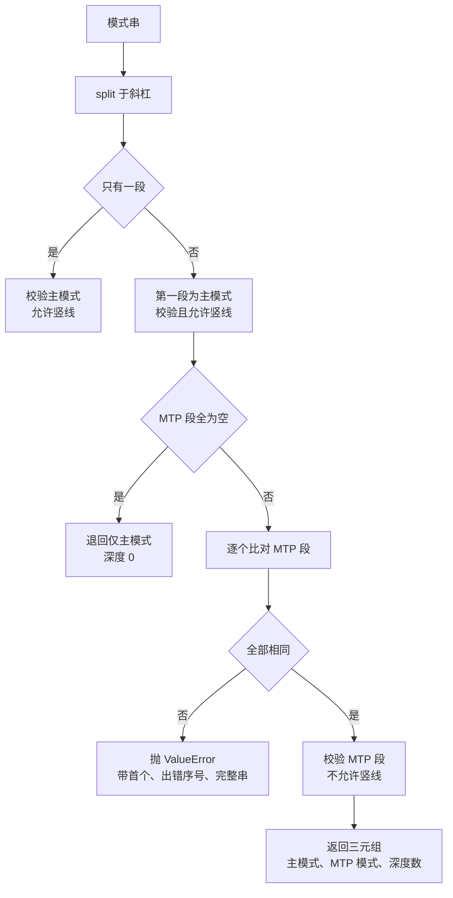
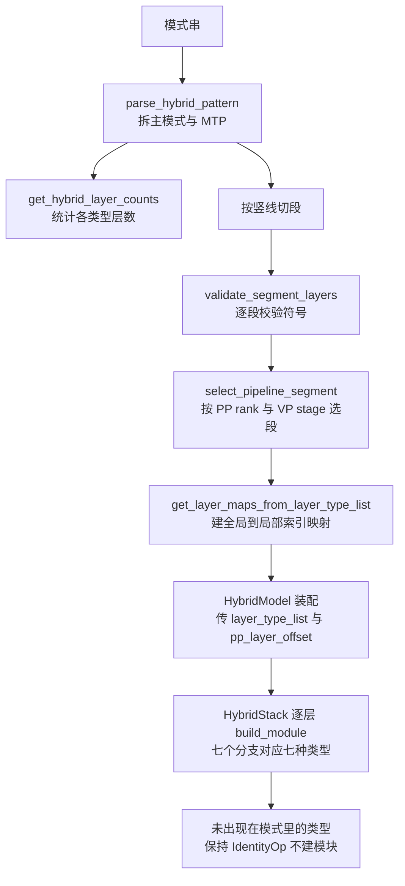

> 源码基准：`megatron-core` **0.20.0**，commit [`60e039626`](https://github.com/NVIDIA/Megatron-LM/tree/60e039626)。本文所有行号均对该 commit 取证。
> 系列导航：[00 地基](/2026/09/28/megatron-00-foundation/)｜ [02 专家并行](/2026/10/08/megatron-02-expert-parallel/)｜ [03 张量并行与序列并行](/2026/10/09/megatron-03-tensor-parallel-and-sequence-parallel/)｜ [05 数据并行与优化器](/2026/10/10/megatron-05-data-parallel-and-optimizers/)｜ [14 层栈与 spec 机制](/2026/10/12/megatron-14-module-spec-and-layer-stack/)｜ [15 GPT 与 Llama 的装配](/2026/10/13/megatron-15-gpt-and-llama-model-assembly/)

> **前置**：14 篇讲了 `ModuleSpec` / `build_module` / `BackendSpecProvider` / 「默认即 `IdentityOp`」，15 篇讲了 dense 模型的装配全流程与两份layer spec 的逐格对照。本篇**直接引用**那套机制。MoE 的路由、all-to-all、dispatcher 五钩子见 [02 篇](/2026/10/08/megatron-02-expert-parallel/)，本篇只讲**层类型怎么排、层分配怎么算**。

**TL;DR**

> * **hybrid 模型需要一套自己的层类型语言，因为「哪些层、用什么顺序」变成了配置而不是代码。** [`Symbols` 定义在 L14–L26](https://github.com/NVIDIA/Megatron-LM/blob/60e039626/megatron/core/models/hybrid/hybrid_layer_allocation.py#L14-L26)：`M`=Mamba、`G`=GDN、`*`=attention、`D`=DeepSeek attention、`+`=MLA、`-`=MLP、`E`=MoE，另加两个**分隔符** `PIPE`（pipeline 边界）与 `MTP_SEPARATOR`（MTP 分隔）。
> * **`Symbols` 不是 `Enum` 而是一个普通类，`name_sorted_valid_layer_symbols()` 用反射按「属性名」排序。** 它遍历 `vars(cls)`、筛掉下划线开头且值不在 `VALID_LAYERS` 里的项、按名字排序后返回值（[L28–L38](https://github.com/NVIDIA/Megatron-LM/blob/60e039626/megatron/core/models/hybrid/hybrid_layer_allocation.py#L28-L38)）。**分隔符 `PIPE` 与 `MTP_SEPARATOR` 因为不在 `VALID_LAYERS` 里而自动被排除**——这个排除是计数逻辑能跳过 `PIPE` 的原因，不是显式判断。
> * **MTP 的所有深度必须共用同一份层类型列表，只有个数不同。** [`parse_hybrid_pattern` L258–L266](https://github.com/NVIDIA/Megatron-LM/blob/60e039626/megatron/core/models/hybrid/hybrid_layer_allocation.py#L258-L266)逐个比对 `mtp_parts[1:]`，不一致就 `raise ValueError`。而且 MTP 段**不允许 `PIPE`**（[L268](https://github.com/NVIDIA/Megatron-LM/blob/60e039626/megatron/core/models/hybrid/hybrid_layer_allocation.py#L268) `allow_pipe=False`）——**MTP 层不参与 pipeline 边界划分**。
> * **`PIPE` 显式边界与运行时切片是两条并存策略，后者标注为向后兼容。** [`select_pipeline_segment` L331–L347](https://github.com/NVIDIA/Megatron-LM/blob/60e039626/megatron/core/models/hybrid/hybrid_layer_allocation.py#L331-L347) 的 docstring 写明：有 `PIPE` 就按它切分；**没有 `PIPE` 但 `pp_size > 1` 时回退到运行时切片**，用 `first_stage_layers` / `last_stage_layers` 支持不等长切分。
> * **`HybridStackSubmodules` 有 7 个层槽位，默认值全是 `IdentityOp`——但这里的含义与 14 篇不同。** 14 篇里 `IdentityOp` 表示「层内这一格不存在」；这里表示「**这一类层在本模式里不出现**」（[hybrid_block.py L40–L52](https://github.com/NVIDIA/Megatron-LM/blob/60e039626/megatron/core/models/hybrid/hybrid_block.py#L40-L52)）。**同一个默认值，两种语义。**
> * **pipeline 切分在模型层完成，栈只接收算好的 `layer_type_list`。** `HybridStack.__init__` 的 docstring 明确：*pre-computed list of layer type symbols for this pipeline segment. When provided (by HybridModel), pipeline stage selection has already been done via the pipe separators*（[L64–L66](https://github.com/NVIDIA/Megatron-LM/blob/60e039626/megatron/core/models/hybrid/hybrid_block.py#L64-L66)）。这比 15 篇的 `TransformerBlock` 又上移一层。
> * **MoE spec 的 router 是「默认训练版、推理显式覆盖」。** [`get_moe_module_spec_for_backend` L89–L90](https://github.com/NVIDIA/Megatron-LM/blob/60e039626/megatron/core/models/gpt/moe_module_specs.py#L89-L90)：`router = InferenceTopKRouter if isinstance(backend, InferenceSpecProvider) else None`，为 `None` 时**根本不往 `MoESubmodules` 传 `router`**，于是走默认的 `TopKRouter`。**判据是 provider 的类型，不是配置开关。**
> * **本篇不给出任何性能数字。** hybrid 的实际收益（显存、吞吐）属B 级真机实测范围（外迁至 `deep-dive-profiling/`）。全篇结论都是「给定模式串，算出什么层列表」——可手算复核。

---

## 1. 引言：为什么 hybrid 需要一门语言

15 篇讲 dense 模型时，层类型是**隐含的**——每一层都是 `TransformerLayer`（对照 [https://docs.pytorch.org/docs/stable/nn.html#torch.nn.Module] 文档里那套「继承 `nn.Module` + 直接写 `nn.Linear`」的常规写法，两者不是同一种范式），里面必有 self-attention 与 MLP，差别只在 MLP 是 dense 还是 MoE。所以 15 篇只需要一个 0/1 的 `moe_layer_freq` 就能表达混排（[15 篇 §6.1](https://lrypcy.github.io/2026/10/13/megatron-15-gpt-and-llama-model-assembly/)）。

hybrid 模型打破了这个前提。一层可能是：Mamba、GDN（gated delta net）、标准 attention、DeepSeek 变体 attention、MLA、dense MLP、MoE——**七种**。而且它们的**顺序**也有讲究：Mamba 层与 attention 层在超参上常按固定比值交替（这是 hybrid 的定义特征），MoE 层通常插在 attention 之后。现实中的 hybrid 模型确实按固定比值来配——[Jamba（arXiv:2403.19887）](https://arxiv.org/abs/2403.19887) 是 Mamba 层与 Transformer 层按比例混排的实例；而 Megatron Core 官方在[并行策略指南](https://docs.nvidia.com/megatron-core/developer-guide/latest/user-guide/parallelism-guide.html)里把 Mamba 单独列为一种需要适配的并行场景，其取舍与序列并行/上下文并发的关系在那里说明。

一旦「顺序」变成用户输入，代码就必须有办法**把它解析成结构**。这就是 `hybrid_layer_allocation.py` 507 行存在的理由：**它是一份模式语言的词法与语法分析器。**这套分层在官方 [API Guide 总览](https://docs.nvidia.com/megatron-core/developer-guide/latest/api-guide/index.html) 的导航里与 `spec_utils`、`transformer_layer` 同列在 `tensor_parallel` 包下，「机制层 / 层栈 / 模型装配」的三分与 §1.2 的表格一致。

本篇按「词法 → 语法 → 计数 → 切分 → 装配」的顺序讲。

### 1.1 四个文件的分工

| 文件 | 行数 | 职责 |
| --- | --- | --- |
| `hybrid_layer_allocation.py` | 507 | **纯逻辑**：符号定义、模式解析、层数统计、pipeline 段选择、索引映射。**不 import torch 模块** |
| `hybrid_layer_specs.py` | 422 | 把符号翻译成 `ModuleSpec` |
| `hybrid_block.py` | 476 | `HybridStack`：按 `layer_type_list` 逐层建模块 |
| `hybrid_model.py` | 651 | `HybridModel`：编排，调用上面三者 |

`hybrid_layer_allocation.py` **不依赖 torch 模块**这一点值得先说：它只处理字符串与 `Dict[str, int]`。这种「纯逻辑层与模型定义层分开」的组织方式，与官方 [Developer Guide 首页](https://docs.nvidia.com/megatron-core/developer-guide/latest/index.html) 的 API 导航一致：机制类工具不与具体模型耦合。所以它**可以被单独测试与手算验证**，不需要 GPU、不需要分布式初始化。这一点与本系列「A 级解析脚本可复算」的要求天然吻合（见 `RESEARCH_PLAN.md` §1.1）。

## 2. 词法：七个层符号与两个分隔符

[`Symbols` 类定义在 L14–L26](https://github.com/NVIDIA/Megatron-LM/blob/60e039626/megatron/core/models/hybrid/hybrid_layer_allocation.py#L14-L26)，全文 13 行：

```python
class Symbols:
    """Symbols for different layer types and pattern separators."""

    MAMBA = "M"
    GDN = 'G'
    ATTENTION = "*"
    DS_ATTENTION = "D"
    MLA = "+"
    MLP = "-"
    MOE = 'E'
    PIPE = '|'
    MTP_SEPARATOR = "/"
    VALID_LAYERS = {MAMBA, GDN, ATTENTION, DS_ATTENTION, MLA, MLP, MOE}
```

七个层类型：

| 符号 | 常量 | 含义 |
| --- | --- | --- |
| `M` | `MAMBA` | Mamba 层 |
| `G` | `GDN` | gated delta net 层 |
| `*` | `ATTENTION` | 标准注意力层 |
| `D` | `DS_ATTENTION` | DeepSeek 变体注意力层 |
| `+` | `MLA` | Multi-head Latent Attention 层 |
| `-` | `MLP` | dense MLP 层 |
| `E` | `MOE` | MoE 层 |

两个分隔符：

| 符号 | 常量 | 作用 |
| --- | --- | --- |
| `\|` | `PIPE` | **pipeline 段边界** |
| `/` | `MTP_SEPARATOR` | 主 pattern 与 MTP pattern 的分界 |

**`VALID_LAYERS` 只收七个层类型，不含两个分隔符。** 这个集合的用途不止是校验——它是后面所有「按类型建字典」的键集合。

### 2.1 为什么用普通类而不是 `Enum`

`name_sorted_valid_layer_symbols()`（[L28–L38](https://github.com/NVIDIA/Megatron-LM/blob/60e039626/megatron/core/models/hybrid/hybrid_layer_allocation.py#L28-L38)）是这个设计的理由：

```python
    @classmethod
    def name_sorted_valid_layer_symbols(cls) -> list[str]:
        """Return the valid layer symbols sorted lexicographically by their public attribute
        name.
        """
        valid_layer_attrs = []
        for name, value in vars(cls).items():
            if not name.startswith('_') and value in cls.VALID_LAYERS:
                valid_layer_attrs.append((name, value))
        valid_layer_attrs.sort()
        return [value for (_, value) in valid_layer_attrs]
```

它**遍历 `vars(cls)`（即类的 `__dict__`）**，用两个条件筛选：属性名不以 `_` 开头、值在 `VALID_LAYERS` 里。然后**按属性名排序**再返回值。

用 `Enum` 也能做到，但那样 `Symbols.VALID_LAYERS` 与 `Symbols.MAMBA` 的关系会变成「枚举成员的集合」；而现在这样写，`VALID_LAYERS` 是一个**与成员定义并列的普通集合**，`PIPE` 与 `MTP_SEPARATOR` 天然不在里面——**于是 `name_sorted_valid_layer_symbols()` 自动把它们排除，不需要任何 `if name in (...)` 的排除列表。**

排序结果的顺序是 `ATTENTION`、`DS_ATTENTION`、`GDN`、`MAMBA`、`MLP`、`MLA`、`MOE`（按属性名），对应符号 `*`、`D`、`G`、`M`、`-`、`+`、`E`。**这个顺序只影响字典的键序，不影响任何语义**（[L183](https://github.com/NVIDIA/Megatron-LM/blob/60e039626/megatron/core/models/hybrid/hybrid_layer_allocation.py#L183) 用它来初始化计数表）。

## 3. 语法：`parse_hybrid_pattern` 与 MTP 的一致性约束

### 3.1 模式串的格式

[`ParsedHybridPattern` 的 docstring L42–L67](https://github.com/NVIDIA/Megatron-LM/blob/60e039626/megatron/core/models/hybrid/hybrid_layer_allocation.py#L42-L67)）给出四个例子：

| 模式串 | `main_pattern` | `mtp_pattern` | `mtp_num_depths` |
| --- | --- | --- | --- |
| `"M*M*"` | `M*M*` | `None` | 0 |
| `"M*M*/MM/MM"` | `M*M*` | `MM` | 2 |
| `"MMMM/*M/*M/*M"` | `MMMM` | `*M` | 3 |
| `"M-M-\|M-M*-/MM/MM"` | `M-M-\|M-M*-`（2 个 PP 段） | `MM` | 2 |

格式是 `<main>/<mtp>/<mtp>/...`：**每个 `/` 之后的一段代表一个 MTP 预测深度**。

第四个例子值得单独看：`"M-M-|M-M*-"` 里 `main_pattern` **含一个 `|`**，于是主 pattern 自己带pipeline 段边界；而 `"MM"`（MTP 段）不含 `|`。

### 3.2 三段解析逻辑

[`parse_hybrid_pattern` L200–L274](https://github.com/NVIDIA/Megatron-LM/blob/60e039626/megatron/core/models/hybrid/hybrid_layer_allocation.py#L200-L274) 的三段结构：

**第一段：无分隔符**（[L238–L242](https://github.com/NVIDIA/Megatron-LM/blob/60e039626/megatron/core/models/hybrid/hybrid_layer_allocation.py#L238-L242)）

```python
    parts = pattern.split(Symbols.MTP_SEPARATOR)

    if len(parts) == 1:
        # No MTP separator found - pattern is main decoder only
        main_pattern = parts[0]
        _validate_pattern(main_pattern, "main", allow_pipe=True)
        return ParsedHybridPattern(main_pattern=main_pattern, mtp_pattern=None, mtp_num_depths=0)
```

**`allow_pipe=True`**——主 pattern 允许 `|`。

**第二段：全空的 MTP**（[L252–L256](https://github.com/NVIDIA/Megatron-LM/blob/60e039626/megatron/core/models/hybrid/hybrid_layer_allocation.py#L252-L256)）以 `"/"` 结尾或分隔符后全为空串时，退回「只有主 pattern、深度 0」。

**第三段：校验 MTP 一致性**（[L258–L274](https://github.com/NVIDIA/Megatron-LM/blob/60e039626/megatron/core/models/hybrid/hybrid_layer_allocation.py#L258-L274)）

```python
    mtp_pattern = mtp_parts[0]
    for i, part in enumerate(mtp_parts[1:], start=2):
        if part != mtp_pattern:
            raise ValueError(
                f"All MTP patterns must be identical. "
                f"Pattern 1 is '{mtp_pattern}', but pattern {i} is '{part}'. "
                f"Full pattern: '{pattern}'"
            )

    _validate_pattern(mtp_pattern, "MTP", allow_pipe=False)
```

两条约束合在一起：

| 约束 | 实现 | 后果 |
| --- | --- | --- |
| 所有 MTP 深度共用同一层类型列表 | 逐个比对，不等就抛 | MTP 深度只增加**层数**，不改变**层类型构成** |
| MTP 段不含 `|` | `allow_pipe=False` | **MTP 层不参与 pipeline 段划分** |

第二条是一个值得解释的设计。MTP（multi-token prediction）在推理时是「一次预测多个 token」的辅助头，它跟着主 decoder 的最后一个 stage 走；**给它划 pipeline 边界没有意义**，因为它不被切分到不同 stage 上。抛错而不是静默接受，是为了让用户知道「这个 `|` 写在这里没有意义」。

错误消息把**首个模式、出错的第几个、以及完整模式串**都带上（`Pattern 1 is '…', but pattern 3 is '…'. Full pattern: '…'`）——三种粒度的定位信息齐备，这类「用户输入错误」的报错值得这样写。



*图 1：`parse_hybrid_pattern` 的控制流。MTP 一致性是唯一会因「内容不同」而失败的检查，而 `allow_pipe` 的差别让主模式与 MTP 模式的校验规则不同。数据出处：[`hybrid_layer_allocation.py` L200–L274 `parse_hybrid_pattern`](https://github.com/NVIDIA/Megatron-LM/blob/60e039626/megatron/core/models/hybrid/hybrid_layer_allocation.py#L200-L274)、[L277–L299 `_validate_pattern`](https://github.com/NVIDIA/Megatron-LM/blob/60e039626/megatron/core/models/hybrid/hybrid_layer_allocation.py#L277-L299)。*

## 4. 从比例到模式串：`pattern_from_ratios` 的两段分配

### 4.1 一个已废弃但仍有价值的入口

[`pattern_from_ratios` L74–L125](https://github.com/NVIDIA/Megatron-LM/blob/60e039626/megatron/core/models/hybrid/hybrid_layer_allocation.py#L74-L125) 的 docstring 写明它是给已废弃的 `hybrid_attention_ratio` / `hybrid_mlp_ratio` 参数做向后兼容的：

> Generates an evenly-spaced hybrid layer pattern from target attention and MLP ratios. **This exists for backward compatibility** with code that uses the deprecated hybrid_attention_ratio and hybrid_mlp_ratio parameters.

它的价值不在于「推荐用」，而在于**它是这份模式语言唯一一段可手算验证的生成逻辑**——四个断言 + 两段分配，纯算术。

### 4.2 四条断言界定了输入空间

```python
    assert num_layers > 0
    assert 0.0 <= attention_ratio <= 1.0
    assert 0.0 <= mlp_ratio <= 1.0
    assert attention_ratio + mlp_ratio <= 1.0
```

第四条最关键：**两个比例之和不得超过 1**，因为剩下的部分归 Mamba。这四条用 `assert` 而非 `raise ValueError`，意味着 **Python `-O` 会把它们全部关掉**。这与 14 篇 §5.2 记的 `get_backend` 用 `raise ValueError` 是两种不同风格——本文件在 [`validate_segment_layers` L318](https://github.com/NVIDIA/Megatron-LM/blob/60e039626/megatron/core/models/hybrid/hybrid_layer_allocation.py#L318) 用的是 `raise`，而这里用 `assert`。**同一个文件里两种风格并存。**

### 4.3 第一段：attention 均匀分布，且「首尾都是 Mamba」

```python
    # Allocate attention layers (evenly spaced, starting and ending with mamba)
    attention_count = round(num_layers * attention_ratio)
    mamba_count = num_layers - attention_count
    sections = attention_count + 1
    section_len = mamba_count / sections

    layer_types = [Symbols.MAMBA] * num_layers
    x = section_len
    for i in range(num_layers):
        if x < 0.5:
            layer_types[i] = Symbols.ATTENTION
            x += section_len
        else:
            x -= 1
```

`sections = attention_count + 1` 是「首尾各一段 Mamba」的编码：**N 个 attention 把 Mamba 分成 N+1 段**，这样模式必然以 Mamba 开头、以 Mamba 结尾。

累加器 `x` 的写法值得留意：初值 `section_len`，命中 attention 就 `x += section_len`（跳过一段 Mamba），否则 `x -= 1`（消耗一个位置）。`x < 0.5` 是「四舍五入」的手写版本。

**手算一例**：`num_layers=9, attention_ratio=2/9` → `attention_count=2`、`mamba_count=7`、`sections=3`、`section_len≈2.333`。走一遍：

| i | x 起始 | 判断 | 结果 | x 之后 |
| --- | --- | --- | --- | --- |
| 0 | 2.333 | ≥0.5 | `M` | 1.333 |
| 1 | 1.333 | ≥0.5 | `M` | 0.333 |
| 2 | 0.333 | <0.5 | `*` | 2.667 |
| 3 | 2.667 | ≥0.5 | `M` | 1.667 |
| 4 | 1.667 | ≥0.5 | `M` | 0.667 |
| 5 | 0.667 | ≥0.5 | `M` | −0.333 |
| 6 | −0.333 | <0.5 | `*` | 2.000 |
| 7 | 2.000 | ≥0.5 | `M` | 1.000 |
| 8 | 1.000 | ≥0.5 | `M` | 0.000 |

结果是 `MM*MMM*MM`——与 docstring 给的示例同构（它写的是 `"MMM*MMM*MM"`）。

### 4.4 第二段：MLP 只替换 Mamba 槽位

```python
    # Allocate MLP layers (evenly distributed, not replacing attention)
    mlp_count = round(num_layers * mlp_ratio)
    if mlp_count > 0:
        mamba_count -= mlp_count
        ratio = mamba_count / mlp_count
        x = ratio
        for i in range(num_layers):
            if layer_types[i] == Symbols.MAMBA:
                if x < 0.5:
                    layer_types[i] = Symbols.MLP
                    x += ratio
                else:
                    x -= 1
```

注释里 *not replacing attention* 是关键：**第二段只在第一段留下的 `M` 上动手**，`*` 不会被覆盖。所以 hybrid 的定义性质（attention 与 Mamba 交替）在这一步被保持住了。

两段用的累加器逻辑相同，差别只有 `ratio` 的分母（`mlp_count` 而非 `sections`）与「只改 Mamba 槽位」这个守卫。

## 5. 计数与索引映射

### 5.1 `get_hybrid_layer_counts`：键集固定、值可为零

[`get_hybrid_layer_counts` L161–L197](https://github.com/NVIDIA/Megatron-LM/blob/60e039626/megatron/core/models/hybrid/hybrid_layer_allocation.py#L161-L197) 返回每种层类型的数量。它的两个设计点：

```python
    parsed = parse_hybrid_pattern(pattern)
    counts = {symbol: 0 for symbol in Symbols.name_sorted_valid_layer_symbols()}
    ...
            if char in counts:
                counts[char] += 1
```

**字典的键集固定为全部七种符号**（不是只出现过的），所以返回值里必然带零项。docstring 的例子印证了这点：

```
>>> get_hybrid_layer_counts("M*M*")
{'*': 2, 'G': 0, 'D': 0, 'M': 2, '-': 0, 'E': 0}
```

而 `if char in counts` 这一句**同时承担了「跳过 `PIPE`」的职责**——因为 `|` 不在键集里，所以 `|` 自然被忽略，**不需要任何 `if char != Symbols.PIPE` 的特判**。这是 §2.1 那个「`VALID_LAYERS` 不含分隔符」设计的直接收益。

第二个设计点是 MTP 的计数方式（[L192–L195](https://github.com/NVIDIA/Megatron-LM/blob/60e039626/megatron/core/models/hybrid/hybrid_layer_allocation.py#L192-L195)）：

```python
    if parsed.mtp_pattern and parsed.mtp_num_depths > 0:
        for char in parsed.mtp_pattern:
            if char in counts:
                counts[char] += parsed.mtp_num_depths
```

**一次加 `mtp_num_depths`，而不是循环 `mtp_num_depths` 次。** 与 §3.2 的「所有 MTP 深度共用同一层类型列表」约束呼应：既然构成相同，就只需乘上深度数。

### 5.2 `get_layer_maps_from_layer_type_list`：全局层号 → 局部层号

[`get_layer_maps_from_layer_type_list` L496–L507](https://github.com/NVIDIA/Megatron-LM/blob/60e039626/megatron/core/models/hybrid/hybrid_layer_allocation.py#L496-L507) 只有 12 行：

```python
    layer_types = [symbol for symbol in Symbols.name_sorted_valid_layer_symbols()]
    layer_maps = {layer_type: {} for layer_type in layer_types}
    for global_layer_idx, layer_type in enumerate(layer_type_list):
        layer_map = layer_maps[layer_type]
        local_layer_idx = len(layer_map)
        layer_map[global_layer_idx] = local_layer_idx
    return layer_maps
```

**为什么需要这个映射？** 因为「本 stage 的第 3 层」在两个坐标系下不是一回事：它在全局层号下可能是第 7 层，而它在「本 stage 内的同类层序号」下是第 2 层。凡是**按层类型做的逻辑**——比如「第几个 attention 层需要特殊处理」「window attention 的窗口偏移」——都必须用后者。

实现上很朴素：`local_layer_idx = len(layer_map)`，即「这个类型此前出现过几次」。字典的插入顺序天然按全局层号递增。

**注意它的键集又是那七个符号**（来自 `name_sorted_valid_layer_symbols()`），所以每种类型都有一个字典，哪怕该类型在本段里层数为空。

## 6. pipeline 段的选择：两条策略并存

### 6.1 `validate_segment_layers` 与一个作用域不匹配的报错

[`validate_segment_layers` L301–L328](https://github.com/NVIDIA/Megatron-LM/blob/60e039626/megatron/core/models/hybrid/hybrid_layer_allocation.py#L301-L328) 做两件事：把段转成列表、逐字符校验；然后有一条**额外的互斥检查**：

```python
    layer_type_list = list(segment)
    for layer_char in layer_type_list:
        if layer_char not in Symbols.VALID_LAYERS:
            raise ValueError(
                f"In hybrid layer pattern segment, '{layer_char}' is not "
                f"one of {Symbols.VALID_LAYERS}"
            )

    # Disallow Attention + MLA/DSA hybridity.
    if Symbols.ATTENTION in segment and (Symbols.DS_ATTENTION in segment or Symbols.MLA in segment):
        raise ValueError("Not supported to have both Attention and MLA/DSA in one model")
```

**这里有一处作用域与消息不匹配，本篇把它记下来。** 检查的条件是「**同一段内**同时出现 `*` 与 `D`/`+`」，而错误消息说的是 *Not supported to have both Attention and MLA/DSA **in one model***（同一个模型里不允许）。

由于这个函数是**逐段调用**的（docstring L304），下面这个模式**能通过校验**：

```
This is used after the main pattern has been split by '|' into segments
```


```
"*-|+-"      # 第 0 段含 * 与 -，第 1 段含 + 与 -
```

即模型里同时出现了 `*` 与 `+`，但落在不同 pipeline 段——**消息描述的「one model」级互斥并未被真正强制**。

这条检查的**意图**很清楚（标准 attention 与 MLA 是两套不同的注意力实现，不该混用），但它的**执行范围**只到段级。要真正做到消息承诺的语义，应当在解析主 pattern 时对全模式检查一次，而不是逐段检查。

**本条只做记录，不主张改法。**

### 6.2 `select_pipeline_segment` 的两条策略

[`select_pipeline_segment` L331–L495](https://github.com/NVIDIA/Megatron-LM/blob/60e039626/megatron/core/models/hybrid/hybrid_layer_allocation.py#L331-L495)（165 行，全文件最长的函数）返回 `Tuple[List[str], int]`——段内的层类型列表，加上该段的全局偏移。

它的 docstring（[L342–L347](https://github.com/NVIDIA/Megatron-LM/blob/60e039626/megatron/core/models/hybrid/hybrid_layer_allocation.py#L342-L347)）把两条策略说得很清楚：

> When the main pattern contains `'|'` pipe separators, splits by `'|'` into pipeline segments and selects the segment for the current PP rank / VP stage.
>
> When the pattern has no pipes but `pp_size > 1`, **falls back to runtime layer slicing (for backwards compatibility)**, supporting both even and uneven PP splits via `first_stage_layers` / `last_stage_layers`.

| 策略 | 触发条件 | 机制 | 支持不等长 |
| --- | --- | --- | --- |
| 显式段 | `main_pattern` 含 `PIPE` | 按 `\|` 切成若干段，用 `pp_group` 的 rank 与 `vp_stage` 选段 | 由模式串本身决定 |
| 运行时切片 | 无 `PIPE` 但 `pp_size > 1` | 按 `first_stage_layers` / `last_stage_layers` 在运行时切片 | 是 |

参数里还有 `tp_group` 与 `dp_cp_group`（类型都是 [`torch.distributed.ProcessGroup`](https://docs.pytorch.org/docs/stable/distributed.html#torch.distributed.ProcessGroup)，即 01 篇讲的那些进程组对象），docstring 说是 *used for per-stage logging*（[L358–L359](https://github.com/NVIDIA/Megatron-LM/blob/60e039626/megatron/core/models/hybrid/hybrid_layer_allocation.py#L358-L359)）——**这两个组只为打日志，不参与切分决策**。

「向后兼容」这个措辞值得记：它意味着**无 `|` 的写法是旧路径，而 `|` 是新路径**。这与 15 篇 §6.2 的两种切片策略（显式布局 vs 连续切片）是**同一个设计转向**——两处都在把「切分决策」从运行时计算挪到配置里显式声明。15 篇是列表索引，这里是分隔符。

## 7. `HybridStack`：同一个 `IdentityOp`，另一种语义

### 7.1 七个槽位

[`HybridStackSubmodules` L40–L52](https://github.com/NVIDIA/Megatron-LM/blob/60e039626/megatron/core/models/hybrid/hybrid_block.py#L40-L52) 只有 12 行，是个标准 [`dataclasses` dataclass](https://docs.python.org/3/library/dataclasses.html)（与 14 篇 `TransformerLayerSubmodules` 同一写法）：

```python
class HybridStackSubmodules:
    """
    A class for the module specs for the HybridStack.
    """

    mamba_layer: Union[ModuleSpec, type] = IdentityOp
    gdn_layer: Union[ModuleSpec, type] = IdentityOp
    attention_layer: Union[ModuleSpec, type] = IdentityOp
    dsa_layer: Union[ModuleSpec, type] = IdentityOp
    mla_layer: Union[ModuleSpec, type] = IdentityOp
    mlp_layer: Union[ModuleSpec, type] = IdentityOp
    moe_layer: Union[ModuleSpec, type] = IdentityOp
    mtp_block_spec: Optional[ModuleSpec] = None
```

**七个槽位对应 §2 的七个层符号，默认值全是 `IdentityOp`。**被填进去的不是 torch 层而是 [TransformerEngine 提供的模块](https://docs.nvidia.com/deeplearning/transformer-engine/index.html)——`Linear` / `LayerNormLinear` / `LayerNormMLP` / `GroupedLinear` 这一族；其 PyTorch API 清单（含 `GroupedLinear` 与 `LayerNormMLP`）见 [TE 2.18 的 `api/pytorch` 页](https://docs.nvidia.com/deeplearning/transformer-engine/releases/release-2.18/user-guide/api/pytorch.html)，此处固定 release 号是因为 TE 的模块名在版本间会变。 第八个字段 `mtp_block_spec` 的默认是 `None`（而不是 `IdentityOp`），因为 MTP 不在这套逐层机制里——它是**段级的附加块**，对应 §3 那个 `/` 分隔的独立部分。

### 7.2 `IdentityOp` 在两处表达了不同的东西

这是本篇最值得记的一点。对照 14 篇：

| | 14 篇 `TransformerLayerSubmodules` | 16 篇 `HybridStackSubmodules` |
| --- | --- | --- |
| 默认 `IdentityOp` 的含义 | 「层内**这一格**不存在」 | 「**这一类层**在本模式里不出现」 |
| 判断粒度 | 一层的 13 个组成部分 | 一个栈的 7 种层类型 |
| 谁替换它 | `get_gpt_layer_*_submodules` | `hybrid_layer_specs.py` 按模式填 |

两处的默认值都是「不做事的恒等」，但**语义层级不同**：14 篇说的是「组件」，16 篇说的是「类型」。

**这个差异有实际后果。** 在 `HybridStack` 里，如果模式串只有 `*` 与 `-`，那么 `submodules.mamba_layer` 就是 `IdentityOp`。而 §6.1 那条互斥检查保证了 `*` 与 `-` 可以共存于一段——所以**「没有 Mamba 层」不是错误状态，而是正常状态**，表现为那一格是 `IdentityOp`。

如果有人按 14 篇的直觉去读 16 篇，会以为「`IdentityOp` 说明配置漏了」，而实际上它只说明「这个模式里没有这类层」。

### 7.3 切分在模型层完成，栈只接收结果

`HybridStack.__init__`（[L80–L94](https://github.com/NVIDIA/Megatron-LM/blob/60e039626/megatron/core/models/hybrid/hybrid_block.py#L80-L94)）的参数里有两个关键项：

```python
        layer_type_list: Optional[list[str]] = None,
        pp_layer_offset: int = 0,
```

而它的 docstring（[L64–L66](https://github.com/NVIDIA/Megatron-LM/blob/60e039626/megatron/core/models/hybrid/hybrid_block.py#L64-L66)）说得很明确：

> **pre-computed** list of layer type symbols for this pipeline segment. When provided (by HybridModel), **pipeline stage selection has already been done** via `'|'` separators in the pattern.

对应地，[L114–L118](https://github.com/NVIDIA/Megatron-LM/blob/60e039626/megatron/core/models/hybrid/hybrid_block.py#L114-L118) 有两条断言：

```python
        assert layer_type_list is not None, (
            "layer_type_list must be provided. It should be pre-computed from ..."
        )
        self.layer_type_list = layer_type_list
```

**`layer_type_list` 没有默认值**——尽管类型标注是 `Optional[list[str]] = None`。标注说「可空」，断言说「必须给」。**类型标注与运行时契约不一致**：静态检查通过的类型，在运行时会断言失败。

（这与 16 篇自己记的 14 篇 `build_schedule_plan` 那类「可选参数」问题同类，属另一种风格瑕疵。）

**「切分上移一层」这件事的完整链条**：

| 层 | 负责什么 | 文件 |
| --- | --- | --- |
| **模型层** | 解析模式串 → 选段 → 产出 `layer_type_list` 与 `pp_layer_offset` | `hybrid_model.py` L56 `HybridModel` |
| **栈层** | 按 `layer_type_list` 逐层 `build_module` | `hybrid_block.py` L55 `HybridStack` |

栈内部的派发是一个按 `layer_type` 分支的链条（[L125](https://github.com/NVIDIA/Megatron-LM/blob/60e039626/megatron/core/models/hybrid/hybrid_block.py#L125) 起）：

```python
        for i, layer_type in enumerate(self.layer_type_list):
            ...
                    layer = build_module(submodules.mamba_layer, ...)      # L136
                    layer = build_module(submodules.attention_layer, ...)  # L145
                    layer = build_module(submodules.dsa_layer, ...)        # L156
                    layer = build_module(submodules.mla_layer, ...)        # L167
                    layer = build_module(submodules.mlp_layer, ...)        # L177
                    layer = build_module(submodules.moe_layer, ...)        # L186
```

**七条分支的形状完全一致**（都是 `build_module(submodules.<type>_layer, ...)`），差别只在传入的参数与后续对该层类型的专门处理。这正是 14 篇 §3.1 那套机制在多类型场景下的样子：**类型分发从「13 格的静态表」变成「7 类的动态分支」**，而 `IdentityOp` 保证了未被使用的类型不产生任何模块。



*图 2：从模式串到一栈层。切分与索引映射全部在模型层完成，栈只按符号分派；`IdentityOp` 保证「不使用的类型」不产生模块。数据出处：[`hybrid_layer_allocation.py` L161–L197](https://github.com/NVIDIA/Megatron-LM/blob/60e039626/megatron/core/models/hybrid/hybrid_layer_allocation.py#L161-L197)、[L301–L328](https://github.com/NVIDIA/Megatron-LM/blob/60e039626/megatron/core/models/hybrid/hybrid_layer_allocation.py#L301-L328)、[L331–L495](https://github.com/NVIDIA/Megatron-LM/blob/60e039626/megatron/core/models/hybrid/hybrid_layer_allocation.py#L331-L495)、[L496–L507](https://github.com/NVIDIA/Megatron-LM/blob/60e039626/megatron/core/models/hybrid/hybrid_layer_allocation.py#L496-L507)、[`hybrid_block.py` L114–L194](https://github.com/NVIDIA/Megatron-LM/blob/60e039626/megatron/core/models/hybrid/hybrid_block.py#L114-L194)。*

## 8. MoE 的 spec：router 的「默认训练版」

`models/gpt/moe_module_specs.py` 全文 128 行，是本系列读过最短的 spec 文件。它的两个入口都返回 `MlpBuilder`（即 14 篇 §4.2 说的 builder 函数）。

### 8.1 `get_moe_module_spec` 与 `_for_backend` 的分工

[`get_moe_module_spec` L40–L62](https://github.com/NVIDIA/Megatron-LM/blob/60e039626/megatron/core/models/gpt/moe_module_specs.py#L40-L62) 只做一件事——**按 `use_te` 选 provider，然后转发**：

```python
    if use_te is not None and use_te:
        backend: BackendSpecProvider = TESpecProvider()
    else:
        backend = LocalSpecProvider()
    return get_moe_module_spec_for_backend(
        backend=backend, num_experts=num_experts, moe_grouped_gemm=moe_grouped_gemm
    )
```

注意 `use_te is not None and use_te` 这个写法——**显式处理了 `use_te=None`**（而非「假值」）的情况。传 `None` 与传 `False` 结果相同（都走 local），但写法上的区别说明作者考虑过 `None`。

真正的实现全在 [`get_moe_module_spec_for_backend` L65–L98](https://github.com/NVIDIA/Megatron-LM/blob/60e039626/megatron/core/models/gpt/moe_module_specs.py#L65-L98)：

```python
    assert num_experts is not None

    linear_fc1 = backend.column_parallel_linear()
    linear_fc2 = backend.row_parallel_linear()
    activation_func = backend.activation_func()

    mlp = MLPSubmodules(
        linear_fc1=linear_fc1, linear_fc2=linear_fc2, activation_func=activation_func
    )

    experts = backend.grouped_mlp_modules(moe_grouped_gemm is not None and moe_grouped_gemm)
    # shared experts spec
    shared_experts = partial(_build_shared_experts, submodules=mlp)

    router = InferenceTopKRouter if isinstance(backend, InferenceSpecProvider) else None
    submodule_kwargs = {"router": router} if router is not None else {}
    ...
    return partial(
        MoELayer,
        submodules=MoESubmodules(
            experts=experts, shared_experts=shared_experts, **submodule_kwargs
        ),
    )
```

三点值得记：

**一、`assert num_experts is not None` 在最前面。** 与 14 篇 §2.4 强调的取向一致：**MoE 层必须知道专家数**，没有默认值。所以 MoE spec 不可省略该参数。

**二、共享专家复用 MLP 的 submodules**（两处 [`functools.partial`](https://docs.python.org/3/library/functools.html#functools.partial) 是「先绑参数、后由 `build_module` 补 `config`」的标准写法，14 篇 §2 讲过 `ModuleSpec.__call__` 走的同一条路径）（[L78–L84](https://github.com/NVIDIA/Megatron-LM/blob/60e039626/megatron/core/models/gpt/moe_module_specs.py#L78-L84)）：`mlp = MLPSubmodules(...)` 被同时用于路由专家（经 `backend.grouped_mlp_modules`）与共享专家（经 `partial(_build_shared_experts, submodules=mlp)`）。**两个不同角色的专家网络，共享同一份线性层声明。**

`_build_shared_experts`（[L30–L37](https://github.com/NVIDIA/Megatron-LM/blob/60e039626/megatron/core/models/gpt/moe_module_specs.py#L30-L37)）再按配置二选一：

```python
    shared_expert_cls = (
        FusedSharedExpertMLP
        if getattr(config, "use_grouped_gemm_for_shared_expert", False)
        else SharedExpertMLP
    )
```

**三、router 的默认值是「训练版」。** 这是本节的核心。`router` 的取值逻辑是：

| provider | `router` | 传给 `MoESubmodules` 了吗 |
| --- | --- | --- |
| `InferenceSpecProvider` | `InferenceTopKRouter` | **是**（显式 `router=...`） |
| `TESpecProvider` | `None` | **否**（`submodule_kwargs` 为空） |
| `LocalSpecProvider` | `None` | **否** |

后两种情况下 `MoESubmodules` **根本收不到 `router` 键**，于是用它在 dataclass 里定义的默认值。注释（[L86–L88](https://github.com/NVIDIA/Megatron-LM/blob/60e039626/megatron/core/models/gpt/moe_module_specs.py#L86-L88)）说明了为什么：

> The inference-optimized backend needs `InferenceTopKRouter` (compact `[tokens, topk]` index routing); other backends keep the `MoESubmodules` default (training `TopKRouter`, dense `[tokens, num_experts]` map). **Mirrors `get_inference_optimized_moe_spec()`**.

**这与 14 篇 §3.1 的「默认即 `IdentityOp`」是同一种设计手法，但方向相反。**

| | 14 篇 layer | 16 篇 MoE |
| --- | --- | --- |
| 默认值代表 | **不存在**（`IdentityOp`） | **常规**（训练版 router） |
| 偏离默认的方式 | 填入真模块 | 显式传 key 覆盖 |

差别的原因也清楚：层结构里「不存在的组件」是常态（多数层没有 cross-attention），而 router 是**每层必须有的**，把默认值定成训练版可以让 TE/local 两条路径少写一次。

**判据是 provider 的类型**（`isinstance(backend, InferenceSpecProvider)`），**不是配置开关**。这意味着：若新增一种「推理优化但不是 `InferenceSpecProvider`」的 provider，它不会自动拿到 `InferenceTopKRouter`，而且不会有任何提示。

### 8.2 `get_inference_optimized_moe_spec`：重复了一部分

[`get_inference_optimized_moe_spec` L101–L128](https://github.com/NVIDIA/Megatron-LM/blob/60e039626/megatron/core/models/gpt/moe_module_specs.py#L101-L128) 是独立的第二个入口，同样返回 `partial(MoELayer, submodules=MoESubmodules(...))`。

它与 `get_moe_module_spec_for_backend` 有**明显的重复**：

| 步骤 | `_for_backend`（inference provider） | `get_inference_optimized_moe_spec` |
| --- | --- | --- |
| `activation_func` | `backend.activation_func()` | 同 |
| `experts` | `backend.grouped_mlp_modules(True)` | 同（硬编码 `True`） |
| `shared_experts` | `partial(_build_shared_experts, submodules=...)` | 同 |
| `router` | `InferenceTopKRouter` | 同 |
| 差异 | 还按 `moe_grouped_gemm` 传值 | **硬编码 `grouped_mlp_modules(True)`** |

两者的差别只有一处：**`get_inference_optimized_moe_spec` 把 grouped GEMM 硬编码为开**（[L113](https://github.com/NVIDIA/Megatron-LM/blob/60e039626/megatron/core/models/gpt/moe_module_specs.py#L113) `backend.grouped_mlp_modules(True)`），而 `_for_backend` 接受 `moe_grouped_gemm` 参数。

**也就是说：拿 `_for_backend` 配 `InferenceSpecProvider` 与直接调 `get_inference_optimized_moe_spec`，在 grouped GEMM 这一项上行为可能不同**——前者尊重传入值，后者强制开启。这是本篇记下的**第三处问题**（前两处见 §6.1 与 §7.3）。

而 L86–L88 的注释说 `get_moe_module_spec_for_backend` 的 router 逻辑 *Mirrors `get_inference_optimized_moe_spec()`*——**注释声称二者镜像，但 grouped GEMM 那项恰好不镜像。**

## 9. 小结与覆盖边界

### 9.1 一句话总结

**hybrid 模型把「层类型与顺序」从代码提升为配置：七个字符是词法、`/` 与 `|` 是语法、`pattern_from_ratios` 是兼容入口的生成器、`select_pipeline_segment` 是两种切分策略的分发点，`HybridStack` 只负责按符号分派。** 与 15 篇的 dense 模型相比，多出来的这一层复杂度全部来自「层类型不再唯一」。

### 9.2 本篇找到的三处问题

| # | 问题 | 位置 | 性质 |
| --- | --- | --- | --- |
| 1 | `*` 与 `+`/`D` 的互斥只**逐段**检查，错误消息却承诺「in one model」 | [L324–L326](https://github.com/NVIDIA/Megatron-LM/blob/60e039626/megatron/core/models/hybrid/hybrid_layer_allocation.py#L324-L326) | 检查作用域弱于消息承诺，跨段的非法组合能通过 |
| 2 | `layer_type_list: Optional[...] = None` 的类型标注与「必须给」的断言冲突 | [hybrid_block.py L85](https://github.com/NVIDIA/Megatron-LM/blob/60e039626/megatron/core/models/hybrid/hybrid_block.py#L85) vs [L114](https://github.com/NVIDIA/Megatron-LM/blob/60e039626/megatron/core/models/hybrid/hybrid_block.py#L114) | 静态类型说可空、运行时说必填 |
| 3 | 两个 MoE spec 入口在 grouped GEMM 上不一致，而注释声称二者镜像 | [L113](https://github.com/NVIDIA/Megatron-LM/blob/60e039626/megatron/core/models/gpt/moe_module_specs.py#L113) vs [L82](https://github.com/NVIDIA/Megatron-LM/blob/60e039626/megatron/core/models/gpt/moe_module_specs.py#L82) | 注释与实现不符 |

加上 §4.2 提到的风格不一致（同一文件里 `assert` 与 `raise ValueError` 并存），**模块 E 累计 7 处上游问题**（14 篇 1 处、15 篇 3 处、16 篇 3 处），全部只做记录、不主张改法。

### 9.3 覆盖边界

| 文件 | 行数 | 本篇 | 未展开 |
| --- | --- | --- | --- |
| `models/hybrid/hybrid_layer_allocation.py` | 507 | §2 讲符号、§3 讲解析、§4 讲比例生成、§5 讲计数与索引映射、§6.1 讲段校验 | **`select_pipeline_segment` 的后半 150 行**（[L360–L495](https://github.com/NVIDIA/Megatron-LM/blob/60e039626/megatron/core/models/hybrid/hybrid_layer_allocation.py#L360-L495)，含不等长切分的具体算式与两组的日志用途）、`_validate_pattern` L277–L299 的逐符号校验细节、`get_hybrid_total_layer_count` L128 与 `get_hybrid_total_pipeline_segment_count` L145 |
| `models/hybrid/hybrid_block.py` | 476 | §7 讲七个槽位与派发链条 | `HybridStack` 的前向（约 200 行，含 Mamba/attention 各自的残差处理）、`mtp_block_spec` 如何挂载、`sharded_state_dict` |
| `models/gpt/moe_module_specs.py` | 128 | §8 全讲 | 无（文件很短）；但 `MoESubmodules` 与 `MoELayer` 的定义在 `transformer/moe/` 下，属 02 篇 |
| `models/hybrid/hybrid_layer_specs.py` | 422 | 只引 [L94](https://github.com/NVIDIA/Megatron-LM/blob/60e039626/megatron/core/models/hybrid/hybrid_layer_specs.py#L94) `_get_gated_delta_product_mamba_layer_spec` | **全文未讲**：七个符号各自如何翻译成 `ModuleSpec`，是本篇最直接的续篇 |
| `models/hybrid/hybrid_model.py` | 651 | 只引 L44 `_hybrid_logging_pg_kwargs` 与 L56 `HybridModel` 的角色 | 全文未讲：embedding 与输出层在 hybrid 下的处理、MTP 块的挂载、`sharded_state_dict` |
| `models/mamba/` | 37 | — | `mamba_model.py` 26 行、`mamba_layer_specs.py` 5 行（薄封装，真实实现引外部 Mamba 包） |

明确**不在**本篇范围：Mamba 与 GDN 的内部数学、MLA 的语义、MoE 的路由与 all-to-all（02 篇）、参数与梯度布局（05 篇）、显存账本（08 篇）、低精度（09 篇）、CUDA graph（10 篇）。

---

## 引用关系网

```mermaid
graphLR
    subgraph CL["核心论断"]
        C1["顺序成为配置<br/>于是需要一门语言<br/>七个符号加两个分隔符"]
        C2["切分从运行时计算<br/>挪到配置里显式声明<br/>竖线是显式路径、切片是兼容路径"]
        C3["同一个 IdentityOp<br/>在层与在栈<br/>表达了两种语义"]
    end
    subgraph SR["支撑来源"]
        S1["Symbols 用反射排序<br/>分隔符因不在 VALID_LAYERS<br/>而自动被排除"]
        S2["MTP 共用层类型<br/>且不允许竖线"]
        S3["pattern_from_ratios<br/>两段累加器分配"]
        S4["select_pipeline_segment<br/>两条策略并存"]
        S5["Attention 与 MLA 的互斥<br/>只逐段检查"]
        S6["router 默认训练版<br/>判据是 provider 类型"]
        S7["两个 MoE spec 入口<br/>grouped GEMM 上不一致"]
    end
    S1 -->|"支撑"| C1
    S2 -->|"支撑"| C1
    S3 -->|"支撑"| C1
    S4 -->|"支撑"| C2
    S5 -->|"支撑"| C2
    S7 -->|"支撑"| C2
    S6 -->|"支撑"| C3
```

*图 3：三条核心论断与七条支撑来源，分别落在 §2–§5、§6 与 §8.2、§7。完整 permalink 见各图注与参考节。*

---

## 参考

1. Megatron Core 源码：`https://github.com/NVIDIA/Megatron-LM`（本文对应 commit `60e039626`，`megatron-core` 0.20.0）
2. 本文引用的源文件（均锁 commit）：[`megatron/core/models/hybrid/hybrid_layer_allocation.py`](https://github.com/NVIDIA/Megatron-LM/blob/60e039626/megatron/core/models/hybrid/hybrid_layer_allocation.py)（全文 507 行，L14–L38 `Symbols`、L42–L71 `ParsedHybridPattern`、L74–L125 `pattern_from_ratios`、L161–L197 `get_hybrid_layer_counts`、L200–L274 `parse_hybrid_pattern`、L277–L299 `_validate_pattern`、L301–L328 `validate_segment_layers`、L331–L495 `select_pipeline_segment`、L496–L507 `get_layer_maps_from_layer_type_list`）、[`megatron/core/models/hybrid/hybrid_block.py`](https://github.com/NVIDIA/Megatron-LM/blob/60e039626/megatron/core/models/hybrid/hybrid_block.py)（全文 476 行，L40–L52 `HybridStackSubmodules`、L55 `HybridStack`、L80–L118 `__init__` 与断言、L125–L194 派发链条）、[`megatron/core/models/gpt/moe_module_specs.py`](https://github.com/NVIDIA/Megatron-LM/blob/60e039626/megatron/core/models/gpt/moe_module_specs.py)（全文 128 行，L30–L37 `_build_shared_experts`、L40–L62 `get_moe_module_spec`、L65–L98 `get_moe_module_spec_for_backend`、L101–L128 `get_inference_optimized_moe_spec`）、[`megatron/core/models/hybrid/hybrid_layer_specs.py`](https://github.com/NVIDIA/Megatron-LM/blob/60e039626/megatron/core/models/hybrid/hybrid_layer_specs.py) L94 `_get_gated_delta_product_mamba_layer_spec`、[`megatron/core/models/hybrid/hybrid_model.py`](https://github.com/NVIDIA/Megatron-LM/blob/60e039626/megatron/core/models/hybrid/hybrid_model.py) L44 `_hybrid_logging_pg_kwargs` 与 L56 `HybridModel`、[`megatron/core/transformer/pipeline_parallel_layer_layout.py`](https://github.com/NVIDIA/Megatron-LM/blob/60e039626/megatron/core/transformer/pipeline_parallel_layer_layout.py) L16 `PipelineParallelLayerLayout`（15 篇 §6.2 的同类机制）
3. 外部引用：[Mamba 论文（arXiv:2312.00752）](https://arxiv.org/abs/2312.00752) 与 [gated delta net 论文（arXiv:2404.06440，GDN 的出处）](https://arxiv.org/abs/2404.06440)（§2 七个符号里 `M` 与 `G` 两类的原始文献；本篇只说明它们在代码里各占一个符号，不复述其数学）、[DeepSeek-V2（arXiv:2405.04434）](https://arxiv.org/abs/2405.04434)（§2 符号 `D` 即 device-limited 与 MLA 路线的来源）、[DeepSeek-V3 技术报告（arXiv:2412.19437）](https://arxiv.org/abs/2412.19437)（§3.2 MTP 作为多 token 预测层的做法，亦见 15 篇 §4.2）、[Switch Transformers（arXiv:2101.03961）](https://arxiv.org/abs/2101.03961) 与 [Mixtral（arXiv:2401.04088）](https://arxiv.org/abs/2401.04088)（§7–§8 路由专家与共享专家的原始文献；02 篇已引，此处仅作符号溯源）、[`typing.Optional` 文档](https://docs.python.org/3/library/typing.html#typing.Optional) 与 [`typing.Protocol` 文档](https://docs.python.org/3/library/typing.html#typing.Protocol)（§7.3 的类型标注与 Protocol 语义）、[pytest 文档关于 `assert` 被优化掉的说明](https://docs.pytest.org/en/stable/how-to/assert.html)（§4.2 为什么 `assert` 不是校验的正确工具——它给了 `pytest.raises` 与「不要用裸 assert 做运行时校验」的官方建议）
4. 本文不给出任何性能、吞吐或 MFU 数字：全篇结论是「给定模式串，算出什么层列表」——`pattern_from_ratios` 与 `get_hybrid_layer_counts` 都是**纯算术**，可手算复核（§4.3 给出了完整的一步一手算例）。hybrid 的实际收益属B 级真机实测范围，外迁至 `deep-dive-profiling/`。**§7.2 的 `IdentityOp` 语义对照只做解释，不主张改法**——改默认值会波及所有后端。
5. 前作与后续：《（14）层栈与 spec 机制》[/2026/10/12/megatron-14-module-spec-and-layer-stack/]（`IdentityOp` 默认值、`build_module`、`BackendSpecProvider` 的原始出处；§7.2 对照其§3.1）、《（15）GPT 与 Llama 的装配》[/2026/10/13/megatron-15-gpt-and-llama-model-assembly/]（§6.2 两种切片策略的同源设计；§6.1 的 `moe_layer_freq` 与本篇 §3 的模式语言是同一问题的两种解法）、《（02）专家并行》[/2026/10/08/megatron-02-expert-parallel/]（§8 提到的 `MoELayer`、router 与 dispatcher 的语义在那里）。
6. 下一步：**本篇留下的最大缺口是 `hybrid_layer_specs.py`（422 行）——七个符号各自如何被翻译成 `ModuleSpec`。** §2 到 §5 讲的是「模式串变成层类型列表」，§7 讲的是「层类型列表变成模块」，但中间那一步（符号 → 具体 `ModuleSpec`）尚未展开。其中 `_get_gated_delta_product_mamba_layer_spec`（[L94](https://github.com/NVIDIA/Megatron-LM/blob/60e039626/megatron/core/models/hybrid/hybrid_layer_specs.py#L94)）的 `in_proj` / `out_proj` 两个参数值得先看：它是**七个符号里唯一带自定义参数的一类**。