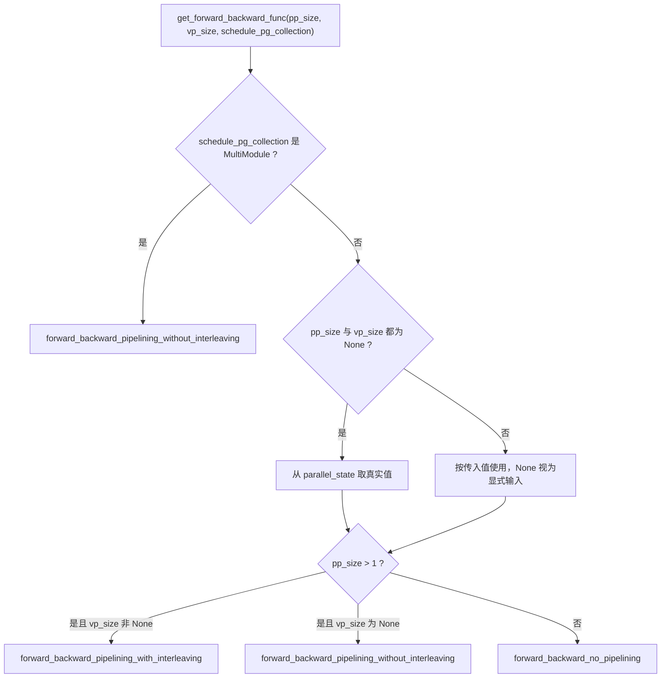
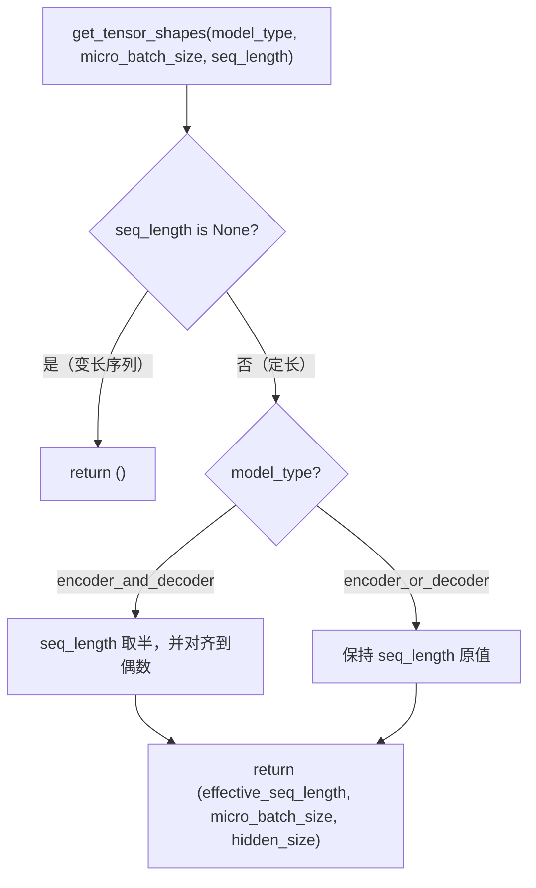
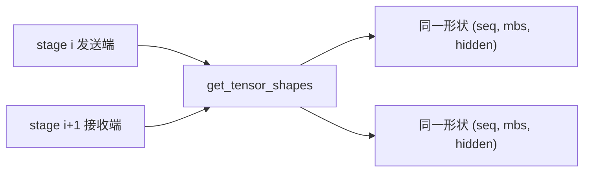
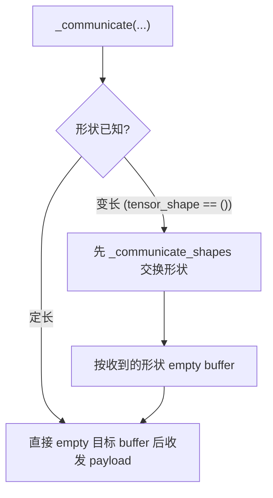
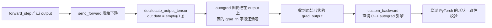
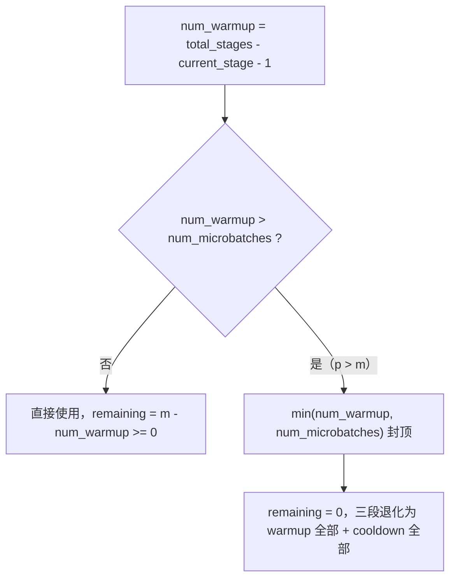
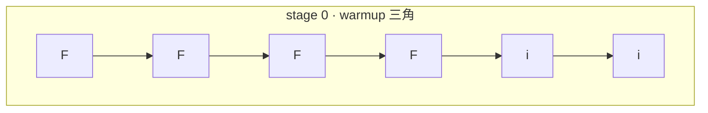
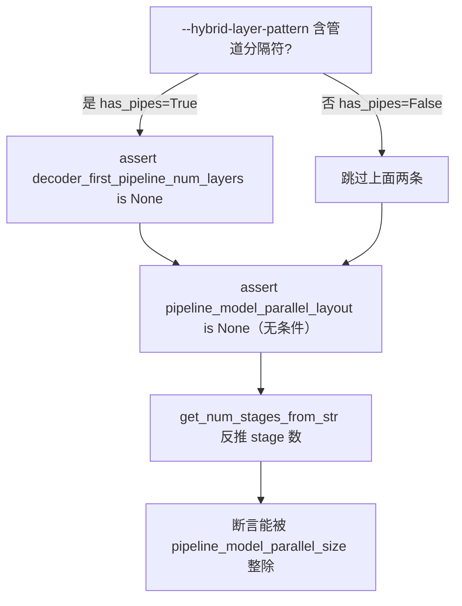
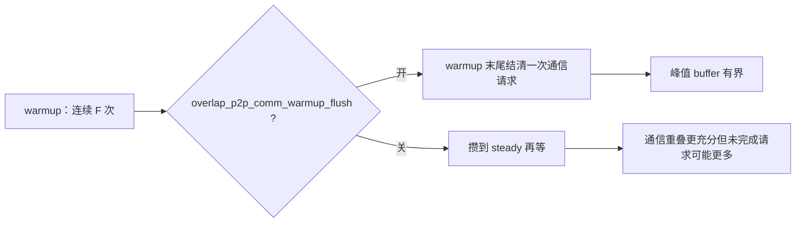
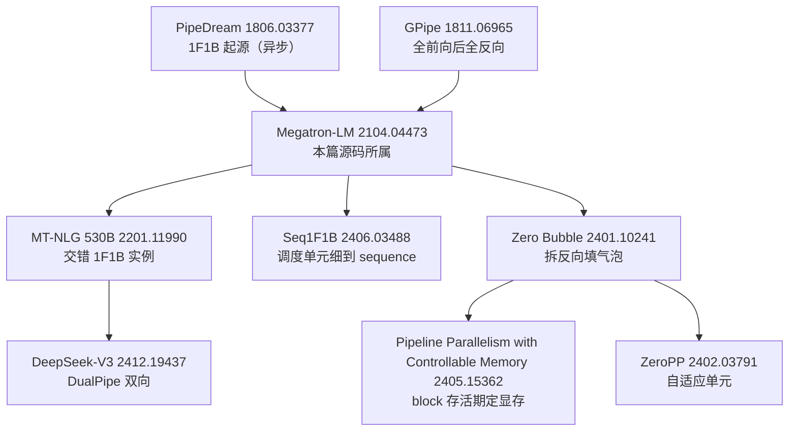

> **Megatron-LM 深度剖析系列 · 第 06 篇**
>
> 前置：[00 地基](/2026/09/28/megatron-00-foundation/)（代码地图 / 配置系统 / 控制流）｜ [01 进程组](/2026/10/08/megatron-01-process-groups-and-comm-overlap/)（组怎么建、怎么选、stream 流派）｜ [02 专家并行](/2026/10/08/megatron-02-expert-parallel/)｜ [03 张量并行与序列并行](/2026/10/09/megatron-03-tensor-parallel-and-sequence-parallel/)｜ [04 GTP](/2026/10/11/megatron-04-generalized-tensor-parallelism/)｜ [05 数据并行与优化器](/2026/10/10/megatron-05-data-parallel-and-optimizers/)｜ [08 显存账本](/2026/10/12/megatron-08-memory-ledger/)｜ [14 模块规格与层栈](/2026/10/12/megatron-14-module-spec-and-layer-stack/)｜ [15 GPT/LLaMA 装配](/2026/10/13/megatron-15-gpt-and-llama-model-assembly/)｜ [16 Hybrid 与 MoE 装配](/2026/10/14/megatron-16-hybrid-and-moe-model-assembly/)｜ [09 低精度 FP8/FP4](/2026/10/15/megatron-09-low-precision-fp8-fp4/)
>
> 原理层：[分布式训练（04）流水并行](/2026/08/31/dist-train-04-pipeline-parallel/)（1F1B 方块图与气泡推导）｜ [分布式训练（05）调度器](/2026/09/01/dist-train-05-schedulers/)
>
> 本系列做**源码层**：并行原理已在《分布式训练》系列讲透，这里一律引用不重推。源码基准 **`megatron-core` 0.20.0**，commit `60e039626`。
>
> **本篇的边界**：讲流水并行**调度器本身**——三个入口的分工、1F1B 三阶段的真实循环边界、interleaving 的气泡闭式解、非均匀切层的解析、p2p 与计算的重叠、hybrid CP 与多模块的接口。气泡率的**原理推导**在 [分布式训练（04）](/2026/08/31/dist-train-04-pipeline-parallel/)，本篇只给 Megatron 源码里的**具体公式与循环边界**，并用 A 级解析脚本与 C 级时序模拟把气泡在甘特图上画出来。
>
> **图全部自绘。** 本系列遵循「默认一律自绘」的引用许可原则：NVIDIA 官方文档与 blog 的图版权保留、不可复制；arXiv 论文的图需逐篇确认 abs 页有无 CC 标识。所以本篇每张图下方均注明所据的源码 permalink 或官方页面链接。

**TL;DR**

> * **`schedules.py` 的三个入口不是「同一套逻辑的三种配置」，而是三段完全不同构的代码。** 无流水线的 [`forward_backward_no_pipelining`](https://github.com/NVIDIA/Megatron-LM/blob/60e039626/megatron/core/pipeline_parallel/schedules.py#L723-L780) 里**没有 warmup / steady / cooldown 三阶段、没有气泡、没有 p2p**；它只是一个 `no_sync` 上下文里跑 N−1 个 microbatch 的朴素循环。**位置本身就是论点**：不进 PP 就没有调度器。
> * **PP 边界上只跑两种张量，不是四种。** 前向边界传激活、反向边界传输入梯度（input gradient）。**Wgrad 不跨 PP 边界**——权重梯度由本 stage 的 optimizer 在本地消费。常见误解是「forward / backward / Wgrad / Dgrad 四种形状」，源码里没有这个四元组（§1）。
> * **形状由 `get_tensor_shapes` 单点决定。** 变长序列直接返回**空元组** `()`，即「形状事先不可知、只传 payload 不传 header」；定长时返回 `(effective_seq_length, micro_batch_size, hidden_size)`，且**前向与反向共用同一个形状**（§1）。
> * **sender == receiver 不是靠约定，是靠两端调同一个纯函数。** `get_tensor_shapes` 只依赖 config 与 `micro_batch_size`/`seq_length` 这类**两端一致**的量，所以不需要任何握手就能算出同样的形状（§1）。
> * **气泡率有闭式解，且源码里的 warmup 公式就是它的分子。** 非交错 $$B_1 = \frac{p-1}{m+p-1}$$、交错 $$B_v = \frac{p-1}{m v+p-1}$$。**两式分子相同、分母只差一个 $$v$$**——交错不减少气泡的「槽数」（恒为 $$p-1$$），只把每个槽位拉长（§3）。
> * **A 级解析已对账三组**：闭式解与源码 warmup 公式自洽、单调性与渐近 $$bubble \times m \to p-1$$、交错改善倍数等于 $$(mv+p-1)/(m+p-1)$$（§3）。
> * **C 级离散事件模拟独立测出同一个气泡率。** 20 组 `(p, m)` 配置下模拟 makespan 恒等于 $$2m + 2(p-1)$$，且从 makespan 反推的气泡率与 A 级闭式**完全相等**——气泡不是抄公式，是从时序里量出来的（§3）。
> * **`get_schedule_table` 被逐行复刻并与官方 docstring 的两张表逐位对账通过**（§3）。
> * **非均匀切层的收益有一个硬判据：`embedding` 参数量是否超过单层参数量。** 实测当 `embedding / 单层 = 0.50` 时均匀切已是最优（改善 0.0%），`= 1.95` 时非均匀才更好（1.298× → 1.143×）（§4）。
> * **`--pipeline-model-parallel-layout` 与 `--decoder-first-pipeline-num-layers` 的互斥断言是条件触发的**——只在 `--hybrid-layer-pattern` 含管道分隔符时才 assert，不是无条件互斥（§4）。
> * **`m < p` 之所以合法，靠的是 `min(num_warmup_microbatches, num_microbatches)` 这个封顶。** 去掉它，`p=6, m=4` 会因 stage 0 的 warmup（5）超过 microbatch 总数（4）而直接死锁（§2）。
> * **`--overlap-p2p-communication` 与 `--batch-p2p-comm` 在源码里显式互斥**，撞了抛 `ValueError` 而非静默降级（§5）。
> * **规模感**：`schedules.py` 2509 行，其中三个入口合计约 1000 行；`bridge_communicator.py` 1136 行；`hybrid_cp_schedule.py` 669 行；`pipeline_parallel_layer_layout.py` 仅 321 行。

---

## 1. 三个入口，与「不进 PP 就没有调度器」

### 1.1 位置即论点

流水并行的调度器不在 `training.py` 里，而在
[`megatron/core/pipeline_parallel/schedules.py`](https://github.com/NVIDIA/Megatron-LM/blob/60e039626/megatron/core/pipeline_parallel/schedules.py)。
这个文件 2509 行，开头摆着**三个并列的入口**：

| 入口 | 起始行 | 何时被选中 |
| --- | --- | --- |
| [`forward_backward_no_pipelining`](https://github.com/NVIDIA/Megatron-LM/blob/60e039626/megatron/core/pipeline_parallel/schedules.py#L723-L860) | [`L723`](https://github.com/NVIDIA/Megatron-LM/blob/60e039626/megatron/core/pipeline_parallel/schedules.py#L723) | `pp_size <= 1` |
| [`forward_backward_pipelining_with_interleaving`](https://github.com/NVIDIA/Megatron-LM/blob/60e039626/megatron/core/pipeline_parallel/schedules.py#L1019-L2145) | [`L1019`](https://github.com/NVIDIA/Megatron-LM/blob/60e039626/megatron/core/pipeline_parallel/schedules.py#L1019) | `pp_size > 1` 且 `vp_size is not None` |
| [`forward_backward_pipelining_without_interleaving`](https://github.com/NVIDIA/Megatron-LM/blob/60e039626/megatron/core/pipeline_parallel/schedules.py#L2147-L2509) | [`L2147`](https://github.com/NVIDIA/Megatron-LM/blob/60e039626/megatron/core/pipeline_parallel/schedules.py#L2147) | `pp_size > 1` 且 `vp_size is None`，**以及多模块场景** |

分派发生在
[`get_forward_backward_func`](https://github.com/NVIDIA/Megatron-LM/blob/60e039626/megatron/core/pipeline_parallel/schedules.py#L53-L168)
——它定义在文件**开头**，而不是三个入口之后。这一点值得注意：
调度器代码的组织顺序是「选择器在前、被选择者在后」，读源码时从
`L53` 顺下来会先遇到契约（docstring 占了 100 行），再依次遇到实现。

真实分派逻辑见
[`L154–L168`](https://github.com/NVIDIA/Megatron-LM/blob/60e039626/megatron/core/pipeline_parallel/schedules.py#L154-L168)：

```python
if isinstance(schedule_pg_collection, MultiModuleProcessGroupCollection):
    return forward_backward_pipelining_without_interleaving

if pp_size is None and vp_size is None:
    pp_size = parallel_state.get_pipeline_model_parallel_world_size()
    vp_size = parallel_state.get_virtual_pipeline_model_parallel_world_size()

if pp_size > 1:
    if vp_size is not None:
        forward_backward_func = forward_backward_pipelining_with_interleaving
    else:
        forward_backward_func = forward_backward_pipelining_without_interleaving
else:
    forward_backward_func = forward_backward_no_pipelining
return forward_backward_func
```

这段代码有**两个容易被漏读的点**：

**第一，判别顺序是先多模块、后 PP 度。** 第一条分支在任何 PP 度检查之前，
一旦 `schedule_pg_collection` 是 `MultiModuleProcessGroupCollection` 就**直接返回非交错实现**。
也就是说**多模块场景不走交错路径**——§6.2 讲的 bridge 场景里，
即使配了 virtual stage，实际用的仍是 `without_interleaving`。
这条早退把「PP 度为 1」的情形也一并吞掉了：多模块即便不切流水线，
拿到的也是非交错实现而非 `no_pipelining`。

**第二，`pp_size` / `vp_size` 允许显式传入。** 只有在**两者都为 `None`** 时
才回落到 `parallel_state` 查询；docstring 明确写了
*Otherwise, provided values are used as-is and None is treated as an explicit input*。
这让上层可以在不改动全局 `parallel_state` 的前提下覆盖 PP 度，
是 [00 篇](/2026/09/28/megatron-00-foundation/) 那套配置系统与调度器之间的接缝。
`parallel_state` 的 getter 语义见
[`core.parallel_state`](https://docs.nvidia.com/megatron-core/developer-guide/latest/apidocs/core/core.parallel_state.html)。



> 图 1：三条入口的真实分派路径，注意多模块分支在 PP 度检查之前。出处：
> [`schedules.py` `L154–L168`](https://github.com/NVIDIA/Megatron-LM/blob/60e039626/megatron/core/pipeline_parallel/schedules.py#L154-L168)。

三条分支把整个文件切成**三段互不共享控制流的代码**。

这一点值得先说清楚：**很多资料把「1F1B」讲成一个统一的调度范式，暗示所有流水线训练都在跑同一套 warmup/steady/cooldown 循环。源码不是这样。** `PP=1` 时跑的那段代码里，根本不存在这三个阶段——不存在气泡，不存在 p2p 通信，甚至不存在「阶段」这个概念。

### 1.2 无 PP 路径长什么样

先看最短的那段。
[`forward_backward_no_pipelining` 的完整函数体](https://github.com/NVIDIA/Megatron-LM/blob/60e039626/megatron/core/pipeline_parallel/schedules.py#L723-L860)
里，核心是这个形状：

```python
for i in range(num_microbatches - 1):
    ...
    with forward_backward_no_sync_func():
        output_tensor = forward_step(...)
    ...
# 最后一个 microbatch 在 no_sync 上下文之外
input_tensor, output_tensor = forward_step(...)
```

对应
[`L748–L829`](https://github.com/NVIDIA/Megatron-LM/blob/60e039626/megatron/core/pipeline_parallel/schedules.py#L748-L829)。

这个函数的签名里，**五个参数被逐个标注为 `# unused`**：

```python
def forward_backward_no_pipelining(
    *,
    forward_step_func,
    data_iterator: Union[Iterator, List[Iterator]],
    model: Union[torch.nn.Module, List[torch.nn.Module]],
    num_microbatches: int,
    seq_length: int,  # unused
    micro_batch_size: int,  # unused
    decoder_seq_length: Optional[int] = None,  # unused
    forward_only: bool = False,
    collect_non_loss_data: bool = False,
    first_val_step: Optional[bool] = None,
    adjust_tensor_shapes_fn: Optional[Callable] = None,  # unused
    p2p_communicator: Optional[P2PCommunicator] = None,  # unused
    pg_collection: Optional[ProcessGroupCollection] = None,
    force_all_reduce: Optional[bool] = False,
):
```

对应
[`L723–L739`](https://github.com/NVIDIA/Megatron-LM/blob/60e039626/megatron/core/pipeline_parallel/schedules.py#L723-L739)。

这五个 `# unused` 恰好是**三条有 PP 路径各自要用的东西**：

| 参数 | 在有 PP 路径里的用途 | 为什么此处用不到 |
| --- | --- | --- |
| `seq_length` | 算边界张量形状 | 没有边界，没有形状 |
| `micro_batch_size` | 同上 | 同上 |
| `decoder_seq_length` | encoder-decoder 双栈时算 decoder 形状 | 同上 |
| `adjust_tensor_shapes_fn` | 改写收发形状 | 没有形状可改 |
| `p2p_communicator` | 收发边界张量 | 没有 p2p |

**这张表就是「不进 PP 就没有调度器」这句话的代码级证据**：
接口必须与有 PP 路径逐参数对齐，否则调用方要为 `PP=1` 单独写一条分支；
但对齐过来之后，这五个参数在函数体内一次都没被读过。
注意签名是**纯关键字**的（`*` 之后全是关键字参数），
所以调用方不能靠位置传参，这也让「哪些参数是补齐用的」在签名里一目了然。

`force_all_reduce` 是唯一一个有 PP 路径之外语义的名字：它让本轮梯度归约
用 all-reduce 而非 reduce-scatter，docstring 说是为了让 wgrad 存档方便
（*can just inspect DP replica 0 to get full set of wgrads*），
属 [05 篇](/2026/10/10/megatron-05-data-parallel-and-optimizers/) 范畴。

`no_sync` 的作用是关掉 DDP 的梯度 all-reduce：前 N−1 个 microbatch 的 backward
产生的梯度先累积在 buffer 里，等最后一个 microbatch 算完才同步一次。
这条路径里**没有 p2p 通信、没有通信与计算的重叠、没有气泡**。
梯度同步的机制属 DP 范畴，在 [05 篇](/2026/10/10/megatron-05-data-parallel-and-optimizers/) 讲，这里不重复。

### 1.3 PP 边界上到底传什么

进入有 PP 的路径后，第一个必须纠正的常见误解是：**PP 边界上有四种张量
（forward / backward / Wgrad / Dgrad）**。源码里没有这个四元组。

PP 边界上只传两种张量：

| 方向 | 传什么 | 消费方在哪 |
| --- | --- | --- |
| 前向（stage $$i \to i+1$$） | 隐藏状态激活 | 下一个 stage 的第 0 层 |
| 反向（stage $$i+1 \to i$$） | **输入梯度**（input gradient） | 上一个 stage 的 backward |

**权重梯度（Wgrad）不跨 PP 边界。** 它的消费者是本 stage 的 optimizer，
全程在本 rank 内部完成。这是 [ZeRO](https://arxiv.org/abs/1910.02054)
那类工作要跨 rank 归约的量，而 PP 不需要——PP 切的是**层**，不是**参数**。

这个区分对理解 §5 的通信量至关重要：PP 的每步通信只有
「一个激活形状」和「一个输入梯度形状」，两者在定长场景下**完全相同**。

### 1.4 形状从哪里来：`get_tensor_shapes`

决定边界张量形状的函数是
[`get_tensor_shapes`](https://github.com/NVIDIA/Megatron-LM/blob/60e039626/megatron/core/pipeline_parallel/schedules.py#L2115-L2145)：

```python
def get_tensor_shapes(*, model_type, micro_batch_size, seq_length):
    # 变长序列：形状事先不可知，直接返回空元组
    if seq_length is None:
        return ()
    ...
    if model_type == ModelType.encoder_and_decoder:
        seq_length = (seq_length // 2) * 2  # 对齐到偶数
    return (effective_seq_length, micro_batch_size, hidden_size)
```

图 2 是这个函数的三条出口。



> 图 2：`get_tensor_shapes` 的三条出口。出处：
> [`schedules.py` `get_tensor_shapes`](https://github.com/NVIDIA/Megatron-LM/blob/60e039626/megatron/core/pipeline_parallel/schedules.py#L2115-L2145)，
> commit `60e039626`。

返回空元组 `()` 的含义是「**只传 payload，不传 header**」：
变长序列下接收方无法预先算出该收多大，只能等 payload 到了再定形状。
这条分支的存在直接解释了 §5 里「变长序列需要额外一次形状协商」的来源。

值得单独指出的是：**返回的是一个单元素形状，不是四个形状的列表。**
前向与反向共用它。也就是说定长场景下，PP 边界上流动的激活与输入梯度
形状相同——这解释了为什么通信代码里不需要为两者写分支。

### 1.5 `sender == receiver` 是怎么保证的

PP 通信的正确性前提是：发送方与接收方必须对「这个张量多大」达成一致。
Megatron 没有做任何握手或元数据协商，而是靠**两端调用同一个纯函数**：



> 图 3：`get_tensor_shapes` 被收发两端各调一次，形状自然相等。出处：
> [`schedules.py`](https://github.com/NVIDIA/Megatron-LM/blob/60e039626/megatron/core/pipeline_parallel/schedules.py#L2115-L2145)
> 与
> [`p2p_communication.py` `_communicate`](https://github.com/NVIDIA/Megatron-LM/blob/60e039626/megatron/core/pipeline_parallel/p2p_communication.py#L280-L430)。

这个设计成立的前提是 `get_tensor_shapes` 的**全部输入都两端一致**：
`model_type` 来自同一个 `ModelParallelConfig`，
`micro_batch_size` 与 `seq_length` 在各 stage 上是同一份配置。
换言之，**它是一个不读取任何 rank 本地状态的纯函数**。

代价也随之明确：**一旦某个 stage 的实际张量形状与配置不符，
两端会各自算出一个「一致但错误」的形状，通信静默错位。**
这类 bug 不会在形状计算处报错，只会在更下游表现为难以定位的数值错误。

`torch.distributed` 底层的点对点原语语义见
[官方文档的 `isend`](https://docs.pytorch.org/docs/stable/distributed.html#torch.distributed.isend)
与 [`irecv`](https://docs.pytorch.org/docs/stable/distributed.html#torch.distributed.irecv)；
`ProcessGroup` 的抽象层次见
[`torch.distributed.ProcessGroup`](https://docs.pytorch.org/docs/stable/distributed.html#torch.distributed.ProcessGroup)。
这两组原语的**阻塞/非阻塞语义**在 [01 篇](/2026/10/08/megatron-01-process-groups-and-comm-overlap/) 讲过，本篇不重复。

### 1.6 变长序列：`_communicate_shapes` 的额外一趟

定长场景形状已知，接收方可以直接 `empty` 出目标 buffer。变长场景不行，
形状得在数据里传。源码为此留了一条专门路径：
[`_communicate_shapes`](https://github.com/NVIDIA/Megatron-LM/blob/60e039626/megatron/core/pipeline_parallel/p2p_communication.py#L191-L230)。



> 图 4：变长序列比定长多一趟形状协商。出处：
> [`p2p_communication.py` `_communicate_shapes`](https://github.com/NVIDIA/Megatron-LM/blob/60e039626/megatron/core/pipeline_parallel/p2p_communication.py#L191-L230)。

这是 §1.4 那句「只传 payload，不传 header」的直接后果：
**空元组不是优化，是把 header 从静态编译期挪到了运行时。**
代价是多一次小消息，收益是同一份代码同时支持定长与变长。
变长序列在长上下文训练里的意义见
[Seq1F1B](https://arxiv.org/abs/2406.03488)——它正是把调度单元从
batch 级细分到 sequence 级来压气泡的代表工作。

### 1.7 边界张量的假释放：`deallocate_output_tensor`

§1.4 说边界上传的是激活。但**激活发出去之后，这个张量在本 rank 上还有用吗**？
答案是「它的 `.data` 没用了，`.grad_fn` 还要留着」——后者是反向图的入口，
前者是那块实打实的显存。

[`deallocate_output_tensor`](https://github.com/NVIDIA/Megatron-LM/blob/60e039626/megatron/core/pipeline_parallel/schedules.py#L171-L201)
把这个区分写进了函数名——**它是「假释放」（pseudo-deallocate）**：

```python
def deallocate_output_tensor(out, deallocate_pipeline_outputs=False):
    '''Pseudo-deallocate (i.e., set to scalar) the output tensor's '.data' field.

    This method should be called right after the output tensor has been
    sent to the next pipeline stage. At this point, the output tensor is
    only useful for its '.grad_fn' field, and not its '.data'.
    ...
    '''
    if (out is None) or (not deallocate_pipeline_outputs):
        return
    if isinstance(out, dict):        # 多模块流水线
        for value in out.values():
            deallocate_output_tensor(value, deallocate_pipeline_outputs)
        return
    if isinstance(out, list):
        for item in out:
            deallocate_output_tensor(item, deallocate_pipeline_outputs)
        return
    assert isinstance(out, torch.Tensor), "expected Tensor, found %s." % type(out).__name__
    assert out._base is None, "counter-productive to free a view of another tensor."
    out.data = torch.empty((1,), device=out.device, dtype=out.dtype)
```

对应
[`L171–L201`](https://github.com/NVIDIA/Megatron-LM/blob/60e039626/megatron/core/pipeline_parallel/schedules.py#L171-L201)。
注意最后一行**不是 `del`，而是把 `.data` 换成一个 1 元素的空张量**——
张量对象本身必须活着（`.grad_fn` 挂在它上面），所以不能删引用，只能把底层存储换掉。

三个细节值得单独记：

**第一，`dict` 分支为多模块预留。** docstring 明写 *for multi-module pipelines*。
这与 §6.2 的 bridge 场景呼应：多模块流水线的边界输出不是一个张量而是字典，
所以释放逻辑必须递归。`list` 分支则服务于交错的多个 chunk。

**第二，`assert out._base is None` 是一条真实的正确性护栏。**
`_base` 非空意味着这个张量是**另一个张量的 view**。此时把 `.data` 换成空张量
并不是释放内存，而是**让 view 的来源张量提前失效**——注释里 *counter-productive*
（适得其反）说的就是这个。这类断言在优化代码里常被忽略，但它拦下的是
一类只在特定配置下才暴露的显存/数值双重 bug。

**第三，整个函数被 `deallocate_pipeline_outputs` 开关门控**
（[`model_parallel_config.py` `L405`](https://github.com/NVIDIA/Megatron-LM/blob/60e039626/megatron/core/model_parallel_config.py#L405)
处默认 `False`），所以**默认关闭**。

### 1.8 为了假释放而绕开 PyTorch 的 backward

假释放会引出一个直接矛盾：把 `.data` 换成 1 元素张量后，
本 stage 的反向收到的是**原始形状**的梯度，而 `output` 现在是 1 元素的。
`torch.autograd.backward` 会检查两者形状一致——**于是必然报错**。

Megatron 的解法是紧挨着的下一个函数
[`custom_backward`](https://github.com/NVIDIA/Megatron-LM/blob/60e039626/megatron/core/pipeline_parallel/schedules.py#L204-L211)：

```python
def custom_backward(output, grad_output):
    '''Directly call C++ autograd engine.

    To make the 'deallocate_output_tensor' (above) optimization work, the C++
    autograd engine must be called directly, bypassing Pytorch's
    torch.autograd.backward. Pytorch's 'backward' checks that the output and
    grad have the same shape, while C++'s 'backward' does not.
    '''
    assert output.numel() == 1, "output should be pseudo-'freed' in schedule, to optimize memory"
```

这段 docstring 把因果关系写得很明确：**不是「顺手」直接调 C++ 引擎，
而是为了让 §1.7 的优化成立必须这么做**。PyTorch 层的 `backward`
（见 [autograd 官方文档](https://docs.pytorch.org/docs/stable/autograd.html)）
做形状校验，C++ 引擎不做。

`assert output.numel() == 1` 是这条链上的自检——它要求「凡是走
`custom_backward` 的 output，必须已经被假释放过」。若有人开了
`custom_backward` 却忘了调用 `deallocate_output_tensor`，
这条断言会在运行时立刻失败，而不是静默地多占显存。



> 图 5：假释放与直调 C++ autograd 引擎的因果链。出处：
> [`deallocate_output_tensor` L171](https://github.com/NVIDIA/Megatron-LM/blob/60e039626/megatron/core/pipeline_parallel/schedules.py#L171)
> 与 [`custom_backward` L204](https://github.com/NVIDIA/Megatron-LM/blob/60e039626/megatron/core/pipeline_parallel/schedules.py#L204)。

这条链与 §2.3 那处 `del output_tensor` 是**同一问题的两种解法**：
§2.3 那处理由 stream 归属不匹配触发、注释指向 PyTorch issue `#4124`；
§1.7 这条由形状校验触发、必须绕开 PyTorch 的 `backward`。
两者都指向同一件事——**PP 调度器要在 autograd 图之外精确控制张量的生死**。

---

## 2. 1F1B 的真实代码结构

### 2.1 三阶段的循环边界

非交错路径
[`forward_backward_pipelining_without_interleaving`](https://github.com/NVIDIA/Megatron-LM/blob/60e039626/megatron/core/pipeline_parallel/schedules.py#L2147-L2509)
的主体是三段形状一致的循环。三段都从**同一个操作序列**出发，
区别只在每段取走多少个 microbatch。

warmup 步数由两行决定：

```python
num_warmup_microbatches = total_stages - current_stage - 1
num_warmup_microbatches = min(num_warmup_microbatches, num_microbatches)
```

对应
[`L2277–L2278`](https://github.com/NVIDIA/Megatron-LM/blob/60e039626/megatron/core/pipeline_parallel/schedules.py#L2277-L2278)。
第一行是气泡闭式解的分子来源：stage 0 有 $$p-1$$ 个 microbatch 在流水线里悬着，
末 stage 有 $$0$$ 个。第二行是**合法性封顶**，下一节单独讲。

三段的结构可以写成：

```text
warmup   : for i in range(num_warmup):            forward_only(i)
steady   : for i in range(remaining):             forward(i + num_warmup); backward(i)
cooldown : for i in range(num_warmup):            backward(i + remaining)
```

> 图 6：非交错 1F1B 三阶段的循环边界。出处：
> [`schedules.py` `L2333`](https://github.com/NVIDIA/Megatron-LM/blob/60e039626/megatron/core/pipeline_parallel/schedules.py#L2333)（warmup）、
> [`L2378`](https://github.com/NVIDIA/Megatron-LM/blob/60e039626/megatron/core/pipeline_parallel/schedules.py#L2378)（steady）、
> [`L2450`](https://github.com/NVIDIA/Megatron-LM/blob/60e039626/megatron/core/pipeline_parallel/schedules.py#L2450)（cooldown）。

其中 `remaining = num_microbatches - num_warmup`。三段合起来每个 stage 恰好做
$$m$$ 次前向与 $$m$$ 次反向——**warmup 只做前向、cooldown 只做反向，
中间的 steady 段是唯一同时做两者的段**，这就是「1F1B」这个名字的来源。
三段循环的边界分别见
[`L2333`](https://github.com/NVIDIA/Megatron-LM/blob/60e039626/megatron/core/pipeline_parallel/schedules.py#L2333)（warmup）、
[`L2378`](https://github.com/NVIDIA/Megatron-LM/blob/60e039626/megatron/core/pipeline_parallel/schedules.py#L2378)（steady）、
[`L2450`](https://github.com/NVIDIA/Megatron-LM/blob/60e039626/megatron/core/pipeline_parallel/schedules.py#L2450)（cooldown）。

气泡的形状由这三段直接决定：warmup 段每个 stage 都在等上游，cooldown 段
每个 stage 都在等下游回传梯度，**两段各自构成一个空闲三角**，中间的 steady 段
才是满载的方块区。§3 的甘特图会把这两个三角画出来。

### 2.2 `min` 封顶：`m < p` 合法性的一条硬约束

第二行那个 `min` 容易被当成防御性代码忽略，但它是 **`m < p` 场景能跑起来的唯一原因**。

若只保留第一行，当 $$p=6, m=4$$ 时 stage 0 的 warmup 是 $$6-0-1=5$$，
而 microbatch 总数只有 $$4$$。warmup 循环会试图对 $$i=4$$ 这个**不存在的 microbatch**
发起前向，随后 `remaining = 4 - 5 = -1` 让 steady 与 cooldown 两段都空转，
调度无法推进。

这一点在 C 级模拟里是**可观测的死锁**，不是纸面推演：去掉封顶后模拟器在
`p=6, m=4` 与 `p=8, m=4` 两组配置上直接抛「调度死锁」，而已执行的算子数
停在 `45/50` 与 `58/76`——正是那几个多出来的 warmup 槽位。补上封顶后
20 组配置全部通过。

图 7 画出封顶前后的差异。



> 图 7：`min` 封顶把 `m < p` 从死锁变成合法退化。出处：
> [`schedules.py` `L2277–L2278`](https://github.com/NVIDIA/Megatron-LM/blob/60e039626/megatron/core/pipeline_parallel/schedules.py#L2277-L2278)，
> 死锁现象由 `ipynbs` 的 `gantt.py` C 级模拟实测。

封顶后的退化形态值得留意：此时 `remaining = 0`，warmup 段吃掉全部 $$m$$ 个
microbatch，steady 段空转，cooldown 段做完全部反向。**调度退化成 GPipe 的
「全前向后全反向」形状**——气泡并没有消失，只是排布方式变了。
GPipe 那种「先堆满再排空」的调度见
[arXiv:1811.06965](https://arxiv.org/abs/1811.06965)，
它在气泡率上与 1F1B 同阶，差别在峰值激活显存，见
[arXiv:2205.05198](https://arxiv.org/abs/2205.05198) 对激活重计算的讨论。

### 2.3 steady 段每一步的收发顺序

steady 段的单步不是「算完再发」，而是一串固定顺序的动作。伪代码见
[`L2378–L2450`](https://github.com/NVIDIA/Megatron-LM/blob/60e039626/megatron/core/pipeline_parallel/schedules.py#L2378-L2450)：

```python
# steady 段的一次迭代
input_tensor = recv_forward()              # 1. 收上游激活
output_tensor = forward_step(input_tensor) # 2. 本 stage 前向
send_forward(output_tensor)                # 3. 发下游激活
input_tensor_grad = send_backward_recv_forward(output_tensor)  # 4. 发本 stage 的输入梯度，同时收下游传回的激活梯度
input_tensor_grad = backward_step(input_tensor, input_tensor_grad)  # 5. 本 stage 反向
```

第 4 步是**收发合一**的：发自己的梯度、收对端的梯度一次完成。
这条合并路径的实现在
[`p2p_communication.py`](https://github.com/NVIDIA/Megatron-LM/blob/60e039626/megatron/core/pipeline_parallel/p2p_communication.py#L280-L430)
里，由 `config.batch_p2p_comm` 决定走合一还是分开两趟
（见 [`L379`](https://github.com/NVIDIA/Megatron-LM/blob/60e039626/megatron/core/pipeline_parallel/p2p_communication.py#L379)）。

第 5 步的 backward 之前还有一处与 stream 相关的细节值得记录：源码在
[`L832–L838`](https://github.com/NVIDIA/Megatron-LM/blob/60e039626/megatron/core/pipeline_parallel/schedules.py#L832-L838)
显式 `del` 掉 `output_tensor`，注释指向 PyTorch issue `#4124`
（*AccumulateGrad node's stream does not match*）。**跨 stream 使用 autograd
图时，累积梯度节点的 stream 必须与计算节点一致**，否则反向会在校验处抛错。
这段的处理方式是提前释放引用，让 autograd 在本 stream 内完成累积。
`autograd` 的 stream 语义见
[PyTorch 官方文档](https://docs.pytorch.org/docs/stable/autograd.html)。

### 2.4 每 stage 的 microbatch 计数不是常数

总 microbatch 数在
[`L949`](https://github.com/NVIDIA/Megatron-LM/blob/60e039626/megatron/core/pipeline_parallel/schedules.py#L949)
按 `num_microbatches * num_model_chunks` 计算，但**每个 stage 实际分到的
num_microbatches 由 [`get_pp_rank_microbatches`](https://github.com/NVIDIA/Megatron-LM/blob/60e039626/megatron/core/pipeline_parallel/schedules.py#L929-L965)
计算**，交错场景下它随 rank 变化：

```python
# 交错：每个 rank 拿到不同的 microbatch 数
num_microbatches_ = get_pp_rank_microbatches(
    num_microbatches, pipeline_parallel_size,
    pipeline_parallel_rank, num_model_chunks,
)
```

这是**交错与非交错在计数上的根本差别**：非交错的 `num_microbatches`
各 rank 相同，交错的各 rank 不同，因为每个 model chunk 各自持有一份
in-flight microbatch。§3 的气泡闭式解里的 $$m v$$ 正是这么来的。

### 2.5 契约写在 docstring 里，不在签名里

`get_forward_backward_func` 的 docstring 从
[`L58`](https://github.com/NVIDIA/Megatron-LM/blob/60e039626/megatron/core/pipeline_parallel/schedules.py#L58)
一路写到
[`L153`](https://github.com/NVIDIA/Megatron-LM/blob/60e039626/megatron/core/pipeline_parallel/schedules.py#L153)，
近百行，**比函数体（14 行）长六倍**。这不是注释冗余——它是三段互不共享
控制流的代码之间**唯一的公共约定**。几条最关键的：

**交错靠「传列表」实现，而不是靠传参数。** docstring 对 `model` 与
`data_iterator` 各写了一句
*Expected to be a list of modules / iterators in the case of interleaved pipeline parallelism*。
也就是说 `model` 与 `data_iterator` 的类型是
`Union[Module, List[Module]]`——**非交错传单个，交错传 $$v$$ 个**，
调度器内部对列表做迭代。§1.2 那张表里「五个 `# unused` 参数」之所以要补齐，
正是因为这份契约要求三个入口的签名严格一致，包括这两个 Union 类型。

**`adjust_tensor_shapes_fn` 只对非交错有效。** docstring 写得很直接：
*Only applicable in forward_backward_pipelining_without_interleaving for now*，
并追加了一句解释——*it is not used in the other forward-backward functions
which have different shape handling*（见
[`L134–L138`](https://github.com/NVIDIA/Megatron-LM/blob/60e039626/megatron/core/pipeline_parallel/schedules.py#L134-L138)）。

这句话给 §1.5 的结论划了边界：**「两端算同一个形状」的纯函数契约并非全局成立**。
定长场景下 §1.5 成立；但一旦调用方要改形状（比如 encoder-decoder 双栈、
或变长序列的特殊布局），就需要这个回调，而**只有非交错路径实现了它**。
交错路径的形状处理是另一套机制，`get_tensor_shapes` 在那里不承担全部责任。

**`first_val_step` 是为 FP8 权重更新准备的。** docstring：
*Used by Transformer Engine modules to only update their fp8 weights only on
the first validation step*。低精度训练与 TE 的 amax 归约见
[09 篇](/2026/10/15/megatron-09-low-precision-fp8-fp4/)，
TE 侧的 FP8 标定见
[FP8 primer](https://docs.nvidia.com/deeplearning/transformer-engine/user-guide/examples/advanced/fp8_primer.html)。

**`checkpoint_activations_microbatch` 是激活检查点的逐 microbatch 开关。**
docstring 说明它是 `forward_step_func` 的**第三个**参数，`None` 表示沿用配置默认值，
配合 `num_microbatches_with_partial_activation_checkpoints` 使用——
即**部分 microbatch 做重计算、部分不做**。激活重计算本身的取舍见
[arXiv:2205.05198](https://arxiv.org/abs/2205.05198)，
显存账目见 [08 篇](/2026/10/12/megatron-08-memory-ledger/)。

把这几条并起来看，PP 调度器的设计取向很清楚：**它是一个薄壳**，
重活（autograd、参数同步、低精度标定）都交给上层回调，
自己只负责「什么时候调、调给哪个 chunk」。这也解释了 §1.8 为什么必须
自造 `custom_backward` 而不能指望上层——形状与流的控制权在调度器手里。

### 2.6 三条路径共享的两个默认值

有一处细节把 §1 的「三段互不共享控制流」讲得更精确：
**两个实现细节是三条路径共享的**，它们藏在 §2.1 那三段循环里，不看 import 行很容易漏掉。

**第一个是 `no_sync_func` 的默认值。** 三条路径里都有同一行
`no_sync_func = contextlib.nullcontext`——分别见
[`L770`](https://github.com/NVIDIA/Megatron-LM/blob/60e039626/megatron/core/pipeline_parallel/schedules.py#L770)（无 PP）、
[`L1111`](https://github.com/NVIDIA/Megatron-LM/blob/60e039626/megatron/core/pipeline_parallel/schedules.py#L1111)（交错）、
[`L2250`](https://github.com/NVIDIA/Megatron-LM/blob/60e039626/megatron/core/pipeline_parallel/schedules.py#L2250)（非交错）。

也就是说**调度器本身不实现「关掉梯度同步」**，它只提供一个占位：
真要关同步时，由 DP 层把真正的 `no_sync` 上下文管理器传进来；
没传就用 `nullcontext`——**一个什么都不做的上下文**。
`contextlib.nullcontext` 的语义见
[Python 官方文档](https://docs.python.org/3/library/contextlib.html)。
§1.2 那段 `with forward_backward_no_sync_func():` 的名字里那个 `no_sync_func`
正是这个参数，实际逻辑在 [05 篇](/2026/10/10/megatron-05-data-parallel-and-optimizers/) 的 DDP 侧。

**第二个是 `partial` 的用法。** 调度器把与配置有关的判断**在循环外绑定一次**：

```python
# 判断「是否第一个验证步」——forward_only 与 first_val_step 都来自配置，
# 与 microbatch 无关，因此在循环外绑定
check_first_val_step_partial = partial(check_first_val_step, first_val_step, forward_only)
```

见
[`L793`](https://github.com/NVIDIA/Megatron-LM/blob/60e039626/megatron/core/pipeline_parallel/schedules.py#L793)
与
[`L1499`](https://github.com/NVIDIA/Megatron-LM/blob/60e039626/megatron/core/pipeline_parallel/schedules.py#L1499)。
同样的手法用在 §5.5 那批位置谓词上——
[`L1534`](https://github.com/NVIDIA/Megatron-LM/blob/60e039626/megatron/core/pipeline_parallel/schedules.py#L1534)
与
[`L1537`](https://github.com/NVIDIA/Megatron-LM/blob/60e039626/megatron/core/pipeline_parallel/schedules.py#L1537)
把 `_is_vp_first_stage` / `_is_vp_last_stage` 预先绑定好再进循环。
`functools.partial` 的语义见
[Python 官方文档](https://docs.python.org/3/library/functools.html)。

这两处体现同一条纪律：**凡是只依赖配置、不依赖 microbatch 的判断，
一律提到循环外。** 1F1B 的 steady 段每步都要判「我是首 stage 吗」，
若在循环里现算，等于每个 microbatch 都付一次无谓的分支与属性查找；
提前 `partial` 之后，循环里只剩一次调用。**这类改写不改变任何调度语义，
却直接影响 Python 侧的每步开销**——而 PP 的 steady 段是整个训练里执行次数最多的代码。

至于类型标注，`schedules.py` 开头从
[`typing`](https://docs.python.org/3/library/typing.html)
导入 `Callable, Dict, Iterator, List, Optional, Union`（`L5`），
并在 `L50` 定义了形状别名
`Shape = Union[List[int], torch.Size]`。
**这个别名是 §1.4 那条设计的类型化表达**：边界形状既可能是普通 list，
也可能是 `torch.Size`，两者在 `get_tensor_shapes` 的返回值里都会出现。

最后是配置对象本身。调度器读的
[`ModelParallelConfig`](https://github.com/NVIDIA/Megatron-LM/blob/60e039626/megatron/core/model_parallel_config.py#L45-L46)
是一个 `@dataclass`，§3.1 提到的 `microbatch_group_size_per_vp_stage` 默认值解析
就写在它的 `__post_init__` 里（[docstring `L439–L440`](https://github.com/NVIDIA/Megatron-LM/blob/60e039626/megatron/core/model_parallel_config.py#L439-L440)
明写 *Default (in __post_init__() method below) to pipeline_parallel_size*）。
`dataclass` 的字段与默认值语义见
[Python 官方文档](https://docs.python.org/3/library/dataclasses.html)；
这套配置系统的整体设计见 [00 篇](/2026/09/28/megatron-00-foundation/)。
**调度器不自己解析命令行**，它只读这个 dataclass——
这是 §5.4 那张表的最后一列能成立的前提：所有与 PP 有关的旋钮
都经由同一个配置对象进来，调度器因此无需知道 flag 的名字。

---

## 3. interleaving 与气泡的闭式解

### 3.1 交错的约定

交错路径
[`forward_backward_pipelining_with_interleaving`](https://github.com/NVIDIA/Megatron-LM/blob/60e039626/megatron/core/pipeline_parallel/schedules.py#L1019-L2145)
把每个 rank 的模型切成 $$v$$ 个 **model chunk**，每个 chunk 各自跑一遍
warmup/steady/cooldown。约定写在
[`L1041–L1048`](https://github.com/NVIDIA/Megatron-LM/blob/60e039626/megatron/core/pipeline_parallel/schedules.py#L1041-L1048)
的注释里：**chunk 按 rank 轮流分配**，stage $$i$$ 持有第
$$i, i+p, i+2p, \dots$$ 个 chunk。

交错下的 warmup 步数比非交错多一截：

```python
num_warmup = (pipeline_parallel_size - pipeline_parallel_rank - 1) \
           + (num_model_chunks - 1) * microbatch_group_size_per_vp_stage
```

对应
[`L964–L965`](https://github.com/NVIDIA/Megatron-LM/blob/60e039626/megatron/core/pipeline_parallel/schedules.py#L964-L965)。
多出来的 $$(v-1) \times group\_size$$ 项是**每个额外 chunk 都要重新垫一遍流水线**的代价——
这也是交错更费激活显存的原因，它换来的正是 §3.2 的气泡下降。
`microbatch_group_size_per_vp_stage` 的默认值为 `None`，在
[`model_parallel_config.py` `L567–L568`](https://github.com/NVIDIA/Megatron-LM/blob/60e039626/megatron/core/model_parallel_config.py#L567-L568)
被解析为 PP 度，即默认「一组铺满整条流水线」。

交错 1F1B 出自
[arXiv:2201.11990](https://arxiv.org/abs/2201.11990)（MT-NLG 530B），
论文里称 1F1B-I；把它与 Megatron-LM 的其他组件拼成 3D 并行的做法同源于此。

### 3.2 气泡的两条闭式解

气泡率的推导在 [分布式训练（04）](/2026/08/31/dist-train-04-pipeline-parallel/)，
这里只给 Megatron 源码对应的两条公式与它们的实测：

$$\text{非交错}\quad B_1 = \frac{p-1}{m+p-1}
\qquad\qquad
\text{交错}\quad B_v = \frac{p-1}{m\,v+p-1}$$

**两条式的分子相同、分母只差一个 $$v$$。** 这是本节最值得记住的一点：
交错**不减少气泡的槽数**——总槽数恒为 $$p-1$$，与 $$v$$ 无关。
交错做的是把每个槽位拉长，让同样数量的槽位摊在更多的工作量上，
于是相对比例下降。理解成「槽数不变、每槽更长」，比理解成「槽数减少」更贴合源码，
也更容易预测它的边界：$$v$$ 越大，warmup 里的 $$(v-1)\cdot group\_size$$ 项越重，
显存代价越难回避。

A 级脚本 `bubble.py` 扫出的非交发表（`p` 为 PP 度，`m` 为每 stage 的 microbatch 数）：

```text
[表 1] 非交错 1F1B 气泡率 B1 = (p-1)/(m+p-1)
   p\m         1         2         4         8        16        32        64
     2    50.00%    33.33%    20.00%    11.11%     5.88%     3.03%     1.54%
     4    75.00%    60.00%    42.86%    27.27%    15.79%     8.57%     4.48%
     8    87.50%    77.78%    63.64%    46.67%    30.43%    17.95%     9.86%
    16    93.75%    88.24%    78.95%    65.22%    48.39%    31.91%    18.99%
    32    96.88%    93.94%    88.57%    79.49%    65.96%    49.21%    32.63%
```

> 出处：`ipynbs` `experiments/megatron/pipeline_parallel/bubble.py` 真实输出，
> 见 [`results/bubble_stdout.txt`](https://github.com/lrypcy/ipynbs/blob/main/experiments/megatron/pipeline_parallel/results/bubble_stdout.txt)。

固定 $$p=4, m=8$$ 时交错的效果：

```text
[表 3] 固定 p=4, m=8，交错把气泡压到多少
   v   总microbatch         气泡率         相对非交错
   1             8      27.27%         1.00x
   2            16      15.79%         1.73x
   4            32       8.57%         3.18x
   8            64       4.48%         6.09x
  16           128       2.29%        11.91x
```

> 出处：同上，[`results/bubble_stdout.txt`](https://github.com/lrypcy/ipynbs/blob/main/experiments/megatron/pipeline_parallel/results/bubble_stdout.txt) 的表 3。

第 $$v$$ 行的改善倍数恰为 $$\frac{mv+p-1}{m+p-1}$$：$$v=4$$ 时
$$32+3)/(8+3) = 35/11 = 3.18$$，与实测 `3.18x` 一致。这是 A 级对账的 A3 项。

同脚本还把 §3.1 的两条 warmup 公式与闭式解的分子并排列出（表 4），
可以看到**交错那一列整体上移了 2 步**，正是 `($$v-1) \times group\_size` 的体现：

```text
[表 4] 源码 warmup 公式与闭式解的对应（p=4, m=8, group=2）
  rank      非交错 warmup      交错 warmup(v=2)
     0               3                   5
     1               2                   4
     2               1                   3
     3               0                   2
```

> 出处：同上，表 4。

A 级三组对账全部通过：A1 闭式解分子与源码 warmup 公式自洽；A2 单调下降且渐近
$$bubble \times m \to p-1$$（相对偏差 < 5%）；A3 改善倍数等于上述比值。
**A2 的判据是渐近式而非「趋近 0」**——有限 $$m$$ 下气泡率本就不该为 0，
$$p=16, m=1024$$ 时的 1.44% 是正确行为。

### 3.3 C 级模拟：把气泡画出来

闭式解是纸面结论。`gantt.py` 用离散事件模拟**从时序里独立测出**气泡率，
再与 A 级闭式对账。模拟只施加两条约束：每个 stage 一次只做一个操作且按
1F1B 顺序出队；$$F(s,j)$$ 依赖 $$F(s-1,j)$$、$$B(s,j)$$ 依赖 $$B(s+1,j)$$。

```text
[甘特图] p=4 m=4 makespan=14 （每格 1 单位时间，F=前向 B=反向 i=空闲）
  stage 0: |F|F|F|F|i|i|i|B|i|B|i|B|i|B|
  stage 1: |i|F|F|F|i|i|B|F|B|i|B|i|B|i|
  stage 2: |i|i|F|F|i|B|F|B|F|B|i|i|i|i|
  stage 3: |i|i|i|F|B|F|B|F|B|F|B|i|i|i|
```

> 出处：`ipynbs` `experiments/megatron/pipeline_parallel/gantt.py` 真实输出，
> 见 [`results/gantt_stdout.txt`](https://github.com/lrypcy/ipynbs/blob/main/experiments/megatron/pipeline_parallel/results/gantt_stdout.txt)。

图 8 是它的图形化版本，**左上与右下的两个空闲三角就是气泡**。



> 图 8：`p=4, m=4` 的 1F1B 时序，左上三角为 warmup 气泡、右下三角为 cooldown 气泡。
> 出处：甘特图数据来自 `gantt.py` 的 `simulate(4, 4)`，
> 与 [`results/gantt_stdout.txt`](https://github.com/lrypcy/ipynbs/blob/main/experiments/megatron/pipeline_parallel/results/gantt_stdout.txt) 逐字对应。

对账结果：

| 对账 | 判据 | 结果 |
| --- | --- | --- |
| C2 | 模拟 makespan $$= 2m + 2(p-1)$$ | 20 组配置全过 |
| C3 | 从 makespan 反推的气泡率 $$= (p-1)/(m+p-1)$$ | 20 组配置全过 |

以 $$p=4, m=4$$ 为例：makespan 实测 `14`，与 $$2\times4+2\times3 = 14$$ 一致；
反推气泡率 $$(14-8)/14 = 42.86\%$$，与表 1 中 `p=4, m=4` 那一格的 `42.86%`
**逐位相等**。气泡总量 $$2(p-1)=6$$ 格也正好等于 `14 - 8`。

**C3 是本篇实验部分最有价值的一组**：气泡率不是从公式抄来的，
而是从模拟出的时序里量出来再与公式相等。这补上了「论文只画方块图」的缺口
——方块图画不出 $$m<p$$ 时的退化，也画不出封顶的那一行。

### 3.4 `get_schedule_table`：交错顺序的两分支构造

交错路径需要一张表回答「第 $$k$$ 步做哪个 chunk 的哪个 microbatch」。
[`get_schedule_table`](https://github.com/NVIDIA/Megatron-LM/blob/60e039626/megatron/core/pipeline_parallel/schedules.py#L989-L1016)
只用一个 if 分支：若当前 microbatch 组**后面还剩至少一个完整组**，
就按 $$chunk \times group$$ 规整输出；否则**把剩下的全部 microbatch
按 chunk 铺开**。两分支的差别只在最后一组。

官方 docstring 给了两张可直接对账的表。C 级脚本逐行复刻该函数，
并与两张表**逐位比对**（C1，全部通过）：

| 表 | 出处 | 实算 == 文档 |
| --- | --- | --- |
| `group=2, M=4, VP=2` | [`model_parallel_config.py` `L441–L444`](https://github.com/NVIDIA/Megatron-LM/blob/60e039626/megatron/core/model_parallel_config.py#L441-L444) | 是 |
| `group=3, M=5, VP=2` | [`schedules.py` `L1227–L1229`](https://github.com/NVIDIA/Megatron-LM/blob/60e039626/megatron/core/pipeline_parallel/schedules.py#L1227-L1229) | 是 |

第二张表的内容是 `microbatch_id = 0 1 2 0 1 2 3 4 3 4`、
`model_chunk_id = 0 0 0 1 1 1 0 0 1 1`。**最后一组 `3 4` 的两个 microbatch
被摊到两个 chunk 上**，正是「剩余不足一个整组时改用铺开」这条分支的效果。

调度顺序表在官方 API 文档里也有对应说明，见
[`core.pipeline_parallel.schedules`](https://docs.nvidia.com/megatron-core/developer-guide/latest/apidocs/core/core.pipeline_parallel.schedules.html)
与 [`core.pipeline_parallel`](https://docs.nvidia.com/megatron-core/developer-guide/latest/apidocs/core/core.pipeline_parallel.html)。

### 3.5 交错之外的气泡削减路线

源码只实现了非交错与交错两条。把气泡继续往下压是学术界的另一条线，
Megatron 是这些工作的常见基线。列几条以便对照：

- **Zero Bubble**（[arXiv:2401.10241](https://arxiv.org/abs/2401.10241)）：把反向拆成
  输入梯度与权重梯度两段来填气泡，代价是峰值显存上升；论文给出一个自动搜索
  最优调度的算法，并提出 ZB-V 变体，在与 1F1B 同等的激活显存下做到近零气泡。
- **Pipeline Parallelism with Controllable Memory**
  （[arXiv:2405.15362](https://arxiv.org/abs/2405.15362)）：把调度分解成
  可重复的 building block，论证**block 的存活期决定峰值激活显存**，
  据此构造一族内存更省的 block。
- **ZeroPP**（[arXiv:2402.03791](https://arxiv.org/abs/2402.03791)）：把
  F / 输入梯度 / 权重梯度交错塞进一个调度单元，用自适应单元大小换气泡与显存的平衡。
- **BitPipe**（[arXiv:2410.19367](https://arxiv.org/abs/2410.19367)）与
  DeepSeek-V3 的 DualPipe（[arXiv:2412.19437](https://arxiv.org/abs/2412.19437)）：
  走**双向流水线**路线，把两个方向叠在一组设备上。

双向路线里最早的系统化工作是 **Chimera**
（[arXiv:2107.06925](https://arxiv.org/abs/2107.06925)）：它把模型切成两段，
让「向下」与「向上」两条反向传播的流水线共用同一组设备，从而互相填补气泡。
Chimera 论文给出的气泡率是 $$(D-2)/(2N+D-2)$$，比 GPipe / DAPPLE 的
$$(D-1)/(N+D-1)$$ 在大 $$N$$ 时更优；代价是**每个设备要存两份模型参数**
（表中 weights memory 记作 $$2M_\theta$$）。§3.2 那条「槽数恒为 $$p-1$$」
的直觉在这里被打破了——双向之所以能减气泡，靠的是**槽位被两个方向共用**。

**Hanayo**（[arXiv:2308.15762](https://arxiv.org/abs/2308.15762)）针对
Chimera 的参数翻倍给出替代：wave-like（波浪式）调度，**不复制模型**
却达到与 Chimera 相当的效率，代价是在 microbatch 数很多时扩展性变差。

另一条与 §4 直接相接的路线是**平衡激活显存**而非压气泡。
BPipe 把靠前 stage 多存的激活**转移到靠后的 stage**，使每个设备的激活份数
不超过 $$\lceil (p+2)/2 \rceil$$。值得注意的是
[arXiv:2401.02088](https://arxiv.org/abs/2401.02088)
对 BPipe 的复现结论：在 GPT-3 上收益成立，但**换成 LLaMA 后收益转负**，
且用了 flash attention 后 GPT-3 上的收益也几乎消失。
这正好印证 §4.2 的判据——**显存失衡的缓解手段高度依赖具体的模型与配置**，
不能只按「某个 flag 有效」来推断。

把这些工作与 §3.2 的闭式解并起来看，可以给出一个统一的读法：
**所有后续工作都在动 $$p-1$$ 之外的量**——
交错改 $$m v$$（§3.2）、Zero Bubble 把一个反向拆成两段、
Chimera 让两个方向共用槽位、BPipe 改的是激活的**存放位置**而非时间轴。
1F1B 的 $$(p-1)$$ 之所以成为公认的基线，正因为它是**在「单方向、
同步、不复制参数」这三条约束下不可再降的下界**。

这些工作的共同前提都是「同步训练语义」——异步路线（PipeDream，
[arXiv:1806.03377](https://arxiv.org/abs/1806.03377)）虽在理论上无气泡，
但放弃了精确的优化语义。Megatron-LM 作为基线的定位见
[arXiv:2104.04473](https://arxiv.org/abs/2104.04473)，
其 3D 并行与本文的 PP 组件的组合关系在
[arXiv:2201.11990](https://arxiv.org/abs/2201.11990) 里给出完整实例。

### 3.6 同一张调度表的两种视角

§3.4 那张 `get_schedule_table` 的表，其实是**同一件事的两种表述**，
分别写在两个文件里，而两种都值得读。

**视角一：每个 rank 各自看到什么。** 在
[`model_parallel_config.py` `L437–L449`](https://github.com/NVIDIA/Megatron-LM/blob/60e039626/megatron/core/model_parallel_config.py#L437-L449)
的 `microbatch_group_size_per_vp_stage` docstring 里：

```text
This value specifies the number of micro-batches that are executed
at a time for a given virtual stage (both forward and backward).
Default (in __post_init__() method below) to pipeline_parallel_size
which specifies a depth-first schedule.
Example: for PP=2 VP=2, when microbatch_group_size_per_vp_stage=2,
num_microbatches = 4, we have
rank 0 | 0 1 0 1 2 3 2 3
rank 1 |   0 1 0 1 2 3 2 3
When microbatch_group_size_per_vp_stage=3, num_microbatches = 5,
we have
rank 0 | 0 1 2 0 1 2 3 4 3 4
rank 1 |   0 1 2 0 1 2 3 4 3 4
```

> 图 9：`microbatch_group_size_per_vp_stage` docstring 的视角一（每个 rank 各自看到什么）。出处：
> [`model_parallel_config.py` `L437–L449`](https://github.com/NVIDIA/Megatron-LM/blob/60e039626/megatron/core/model_parallel_config.py#L437-L449)，
> 逐字抄录，未改写。
**视角二：虚拟序号如何映射到 (microbatch, chunk)。** 在
[`schedules.py` `L1223–L1240`](https://github.com/NVIDIA/Megatron-LM/blob/60e039626/megatron/core/pipeline_parallel/schedules.py#L1223-L1240)：

```python
# Create a tunable schedule lookup table.
# The schedule lookup table uses the virtual_microbatch_id to find the corresponding
# microbatch_id and model_chunk_id. For example, the tunable schedule table for
# PP2 N3M5 with VP2 is constructed as below:
# virtual_microbatch_id | 0 1 2 3 4 5 6 7 8 9
# microbatch_id         | 0 1 2 0 1 2 3 4 3 4
# model_chunk_id        | 0 0 0 1 1 1 0 0 1 1
schedule_table = get_schedule_table(
    num_microbatches, len(model), config.microbatch_group_size_per_vp_stage
)

# Decouple individual lookup table for microbatch_id and model_chunk_id.
```

两处 docstring 的示例是同一组数字（`group=3, M=5, VP=2`），
只是视角一按 rank 展开、视角二按虚拟序号展开。C 级脚本的 C1 对账
**同时对齐了这两个视角**——它把 `get_schedule_table` 的输出拆成
`microbatch_id` 与 `model_chunk_id` 两列，再与两处 docstring 逐位比对。

`virtual_microbatch_id` 这一层间接是理解交错的关键。
**调度器内部只认一个从 0 数到 $$2m-1$$ 的虚拟序号**，
第 $$k$$ 步查一次表就得到该步该算哪个 chunk 的哪个 microbatch。
这层间接把「推进 microbatch」与「切换 chunk」解耦：
若没有它，交错循环就得同时维护两个指针并在切换时小心同步，
而查表让切换逻辑集中在一处。

docstring 里那句 *which specifies a **depth-first schedule***
点出了 group size 的默认值语义。`group_size` 默认取 PP 度（§3.1 的
`L567–L568`），意味着**一个 chunk 先把整条流水线铺满，再切下一个 chunk**——
即深度优先。反过来把 group size 调小，则更早切换 chunk，
气泡随之下降（§3.2），这就是 `microbatch_group_size_per_vp_stage`
这个旋钮的完整取值语义。

### 3.7 交错下的参数同步：前两个先同步，其余按需

交错让每个 rank 持有 $$v$$ 份 chunk 的参数，而参数本身可能按
ZeRO-3 那样被切分（[arXiv:1910.02054](https://arxiv.org/abs/1910.02054)、
[arXiv:2104.07857](https://arxiv.org/abs/2104.07857)），
每个 chunk 用到之前都要先物化回来。源码把这个动作交给
`config.param_sync_func`——一个**每个 chunk 一个**的回调列表。

规范化在
[`L1117–L1118`](https://github.com/NVIDIA/Megatron-LM/blob/60e039626/megatron/core/pipeline_parallel/schedules.py#L1117-L1118)：
传入单个可调用对象时按 chunk 数复制成列表。

真正值得注意的是**同步时机分两级**：

```python
# Synchronize params for first two model chunks
if config.param_sync_func is not None:
    config.param_sync_func[0](model[0].parameters())
    config.param_sync_func[1](model[1].parameters())
```

见
[`L1219–L1221`](https://github.com/NVIDIA/Megatron-LM/blob/60e039626/megatron/core/pipeline_parallel/schedules.py#L1219-L1221)。
**只有前两个 chunk 被提前同步**，其余 chunk 的同步被推迟到
warmup 循环内部、按 `param_sync_chunk_id` 惰性触发
（[`L1341–L1351`](https://github.com/NVIDIA/Megatron-LM/blob/60e039626/megatron/core/pipeline_parallel/schedules.py#L1341-L1351)）。

原因是纯时序的：交错的调度表里，**最先被用到的一定是 chunk 0 与 chunk 1**
（见 §3.6 的 `model_chunk_id | 0 0 0 1 1 1 0 0 1 1`，
前三步都是 chunk 0、紧接着三步是 chunk 1）。这两个 chunk 的参数若不同步，
流水线第一步就会用到未物化的权重。**第三个及以后的 chunk 在时间上还有余量**，
把它们推迟到真正要用之前的那一轮 warmup 再同步，
既保证正确性，又把物化开销与计算重叠起来。

这与 §5 的 overlap 是同一个思路的两次应用：**能推迟的准备工作就推迟到
它真正阻塞计算的那一刻之前**。区别在于 §5 处理的是通信、这里处理的是参数物化，
而两者都由调度器掌握时机。

最后一条细节：纯前向（`forward_only`）时，源码会把
`grad_sync_func` 与 `param_sync_func` **临时置空**，跑完再恢复
（[`L1120–L1125`](https://github.com/NVIDIA/Megatron-LM/blob/60e039626/megatron/core/pipeline_parallel/schedules.py#L1120-L1125)
与
[`L2101–L2103`](https://github.com/NVIDIA/Megatron-LM/blob/60e039626/megatron/core/pipeline_parallel/schedules.py#L2101-L2103)）。
验证阶段不需要物化参数，这是评估吞吐时的一处省时设计。

---

## 4. 非均匀切层

### 4.1 两个维度的不均衡

均匀切层假设「每个 stage 负担相同」。这个假设在两个维度上不成立：

- **纵向**（同一 stage 内）：第 0 个 stage 额外持有**词嵌入**，最后那个 stage
  额外持有 **final norm 与输出头**。
- **横向**（stage 之间）：层数按 `L / p` 均分，余数补给靠前的 stage，
  所以靠前的 stage 天然多拿一层。

于是**任何 $$p$$ 都会让最重的 stage 高于平均值**。A 级脚本 `memory_balance.py`
只算参数量（不出 GPU 显存数字，那属 B 级真机实测），在
$$L=96, h=8192, ffn=28672, V=51200$$、$$p=8$$ 下的实测：

```text
方案                                          层数分布                     max/min  max/mean  min/mean
均匀切（默认）                                     12,12,12,12,12,12,12,12    1.042x    1.036x     0.995x
--decoder-first-pipeline-num-layers=6       6,13,13,13,13,13,13,12    2.000x    1.078x     0.539x

最优 --decoder-first-pipeline-num-layers: 12  层数 [12, 12, 12, 12, 12, 12, 12, 12]  max/mean 1.036x  （均匀切 1.036x，改善 0.0%）
```

> 出处：`ipynbs` `experiments/megatron/pipeline_parallel/memory_balance.py` 真实输出，
> 见 [`results/memory_balance_stdout.txt`](https://github.com/lrypcy/ipynbs/blob/main/experiments/megatron/pipeline_parallel/results/memory_balance_stdout.txt)。

`max/mean` 是这里唯一重要的指标——**瓶颈是最重的那个 stage**。
`min/mean` 只反映最轻 stage 有多闲，对能不能跑起来没有约束力。

### 4.2 什么时候非均匀切才有用

上表那行「改善 0.0%」不是脚本出错，而是**均匀切在该配置下已经最优**。
原因可以直接算：第 0 个 stage 的额外负担是 $$V \times h = 0.42B$$ 参数，
而单层是 `0.84B`——**嵌入比一层还小**，把它摊到某个 stage 上只会让那个 stage
的层数被迫减少以作补偿，反而制造新的最大值。

把 `V` 扫大就能看到判据的边界（$$L=96, p=16$$，即每 stage 6 层）：

```text
[何时非均匀切才有用：判据是 embedding 与单层参数之比]
  固定 L=96, p=16 (每 stage 6 层), 扫 vocab 直到 embedding > 单层参数

   vocab        单层        嵌入      嵌入/单层       均匀切       全局最优        结论
   51200     0.84B     0.42B       0.50    1.078x     1.078x       均匀已最优
  200000     0.84B     1.64B       1.95    1.298x     1.143x       非均匀更优
  400000     0.84B     3.28B       3.90    1.585x     1.121x       非均匀更优
  600000     0.84B     4.92B       5.84    1.861x     1.100x       非均匀更优
  800000     0.84B     6.55B       7.79    2.126x     1.201x       非均匀更优
 1000000     0.84B     8.19B       9.74    2.382x     1.474x       非均匀更优
```

> 出处：同上，`results/memory_balance_stdout.txt` 的 vocab 扫描节。

**判据是 $$embedding / 单层$$ 是否明显大于 1。** `= 0.50` 时均匀切已最优，
越过 1 之后非均匀才有意义，且改善随比值先升后降（`5.84` 处最优 `1.100×`，
到 `9.74` 时反而回升到 `1.474×`——嵌入过大时，即便给它单独一个 stage
也压不住，此时瓶颈已转移到别处）。

这张表同时给出一条容易被忽略的结论：**`--decoder-first-pipeline-num-layers`
不是「越大越安全」的旋钮。** 它是**单 stage 层数**的硬指定，设错会让某个 stage
掉到远低于平均（表中 `min/mean = 0.539x`）。A 级脚本因此把「非均匀切不劣于均匀切」
设为对账项 A5——任意 `decoder_first` 取值都可能比均匀切更差，
**只有族内最优才应保证不劣**，而这个不变量成立。

### 4.3 布局串与两处 assert

细粒度的非均匀切分由
[`pipeline_parallel_layer_layout.py`](https://github.com/NVIDIA/Megatron-LM/blob/60e039626/megatron/core/transformer/pipeline_parallel_layer_layout.py)
的 `PipelineParallelLayerLayout` 表达，全文件仅 321 行。
入口是两个 `staticmethod`：

- [`from_str`](https://github.com/NVIDIA/Megatron-LM/blob/60e039626/megatron/core/transformer/pipeline_parallel_layer_layout.py#L264-L274)：
  带 `@lru_cache()`，解析并在 rank 0 上 `logger.info` 打印一份对齐后的表格。
- [`get_num_stages_from_str`](https://github.com/NVIDIA/Megatron-LM/blob/60e039626/megatron/core/transformer/pipeline_parallel_layer_layout.py#L276-L280)：
  只做一件事——`parse_str_to_list` 后取 `len()`，即**从布局串反推 PP × VPP 总 stage 数**。

`parse_str_to_list` 用两条正则展开乘法记号，
docstring 给的示例是 `"Ettt|(tt|)*29,m|L"` 解析为
`[["E","t","t","t"]] + [["t","t"]]*29 + [["m"],["L"]]`
（见
[`L283–L300`](https://github.com/NVIDIA/Megatron-LM/blob/60e039626/megatron/core/transformer/pipeline_parallel_layer_layout.py#L283-L300)）。
`E` 是 embedding、`t` 是 transformer 层、`m` 是 `mamba`/`moe` 类层、`L` 是 loss，
字母表见官方的
[pipeline layout 用户指南](https://docs.nvidia.com/megatron-core/developer-guide/latest/user-guide/features/pipeline_parallel_layout.html)
与
[`core.transformer.pipeline_parallel_layer_layout`](https://docs.nvidia.com/megatron-core/developer-guide/latest/apidocs/core/core.transformer.pipeline_parallel_layer_layout.html)。

这里要**纠正一个常见的误解**：`--pipeline-model-parallel-layout` 与
`--decoder-first-pipeline-num-layers` 之间**并不存在一条「两者互斥」的 assert**。
`arguments.py` 里实际有两条不同层次的检查：

**第一条是三个 virtual-PP flag 之间的互斥**，
见
[`L920–L931`](https://github.com/NVIDIA/Megatron-LM/blob/60e039626/megatron/training/arguments.py#L920-L931)：

```python
assert (
    int(args.num_layers_per_virtual_pipeline_stage is not None)
    + int(args.num_virtual_stages_per_pipeline_rank is not None)
    + int(args.pipeline_model_parallel_layout is not None)
) <= 1, (
    'No more than one of the following arguments can be set at the same time: '
    '--num-layers-per-virtual-pipeline-stage, --num-virtual-stages-per-pipeline-rank,'
    '--pipeline-model-parallel-layout. '
    ...
)
```

这三者都是**描述「每个 stage 几层」的不同方式**，语义重叠，所以至多给一个。
紧跟其后的是整除性检查：
[`L933–L940`](https://github.com/NVIDIA/Megatron-LM/blob/60e039626/megatron/training/arguments.py#L933-L940)
用 `get_num_stages_from_str` 取出总 stage 数，断言它能被
`pipeline_model_parallel_size` 整除。

**第二条是与 `--hybrid-layer-pattern` 的互斥，且分两种触发条件**，
见
[`L802–L828`](https://github.com/NVIDIA/Megatron-LM/blob/60e039626/megatron/training/arguments.py#L802-L828)：

```python
has_pipes = Symbols.PIPE in args.hybrid_layer_pattern.split(sep)[0]
if has_pipes:
    assert args.decoder_first_pipeline_num_layers is None, (...)   # 条件触发
    assert args.decoder_last_pipeline_num_layers is None, (...)     # 条件触发
assert args.num_layers_per_virtual_pipeline_stage is None, (...)    # 无条件
assert args.num_virtual_stages_per_pipeline_rank is None, (...)     # 无条件
assert args.pipeline_model_parallel_layout is None, (...)           # 无条件
```

差别在**缩进层级**：`decoder_first` / `decoder_last` 两条断言缩进 12 格，
**嵌在 `if has_pipes:` 里**——只有当 `--hybrid-layer-pattern` 里真的写了管道分隔符
时才触发；后三条缩进 8 格，**无条件触发**。



> 图 10：`arguments.py` 里两处层次不同的互斥检查。出处：
> [`L802–L828`](https://github.com/NVIDIA/Megatron-LM/blob/60e039626/megatron/training/arguments.py#L802-L828)
> 与 [`L920–L940`](https://github.com/NVIDIA/Megatron-LM/blob/60e039626/megatron/training/arguments.py#L920-L940)。

这个缩进差异有实际后果：**不带管道分隔符时，`decoder_first` 与
`layout` 可以共存**，因为此时前者只用于「控制不均匀 PP 切分」、
后者用于描述 virtual stage 布局，语义不冲突；而一旦管道分隔符出现，
布局已由 pattern 完全确定，再叠一个手工指定首 stage 层数就是矛盾。
源码注释把这条意图写得很直白——pattern 里的分隔符**已经显式定义了 pipeline 布局**。

---

## 5. p2p 与 overlap

### 5.1 两个互斥的重叠开关

§2.3 提到 steady 步里发梯度与收梯度是合一次完成的。这个「合一」由
`config.batch_p2p_comm` 控制，而它与更常见的
`--overlap-p2p-communication`（对应 `config.overlap_p2p_comm`）**显式互斥**。
检查在
[`schedules.py` `L1086–L1087`](https://github.com/NVIDIA/Megatron-LM/blob/60e039626/megatron/core/pipeline_parallel/schedules.py#L1086-L1087)：

```python
if config.overlap_p2p_comm and config.batch_p2p_comm:
    raise ValueError("Can not use both overlap_p2p_comm and batch_p2p_comm")
```

源码选择抛 `ValueError` 而非静默降级或二选一，**这是本节最值得记住的一条**：
两个 flag 语义确实冲突（一个要独立 stream 重叠通信、一个要把收发打包进同一批），
静默取其一会让性能表现与预期不符且无从排查。

`_communicate` 里还有第三条分支
[`use_ring_exchange_p2p`](https://github.com/NVIDIA/Megatron-LM/blob/60e039626/megatron/core/pipeline_parallel/p2p_communication.py#L389)，
与 `batch_p2p_comm` 并列参与分派（[`L379`](https://github.com/NVIDIA/Megatron-LM/blob/60e039626/megatron/core/pipeline_parallel/p2p_communication.py#L379)）。
底层走 NCCL 的点对点语义见
[NCCL user guide 概览](https://docs.nvidia.com/deeplearning/nccl/user-guide/docs/overview.html)；
进程分组与通信域的语义见
[NCCL groups](https://docs.nvidia.com/deeplearning/nccl/user-guide/docs/usage/groups.html)
与
[NCCL collectives](https://docs.nvidia.com/deeplearning/nccl/user-guide/docs/usage/collectives.html)。
stream 层面的重叠组织在 [01 篇](/2026/10/08/megatron-01-process-groups-and-comm-overlap/) §10 讲过，这里不重复。

### 5.2 warmup 期间的 flush

`overlap_p2p_comm` 还带一个更细的子开关
`overlap_p2p_comm_warmup_flush`，在 `schedules.py` 里出现十余处
（首次见
[`L1576`](https://github.com/NVIDIA/Megatron-LM/blob/60e039626/megatron/core/pipeline_parallel/schedules.py#L1576)）。
它管的是 **warmup 阶段累积的通信请求什么时候真正完成**。

warmup 段每个 stage 连续发多次前向，如果每次都立刻等通信完成，
就无法重叠；反过来若一路 `async_op=True` 攒到 steady 段再等，
峰值会攒出一批未完成的 buffer。`warmup_flush` 是在这两者之间取一个折中点：
**在 warmup 末尾 flush 一次**，把累积的通信结清，避免无界增长。



> 图 11：`warmup_flush` 的取舍。出处：
> [`schedules.py` `L1576`](https://github.com/NVIDIA/Megatron-LM/blob/60e039626/megatron/core/pipeline_parallel/schedules.py#L1576)
> 起的 warmup flush 分支。

**这类开关的效果依赖具体配置，没有普适的「更好」一侧**，
因此本篇不给出实测倍数——那需要 B 级真机测量，属于本机无 GPU 时的禁区。
需要具体数字时应自行在目标配置上测量。

### 5.3 通信与哪个 microbatch 重叠

回到 §2.3 的 steady 步，逐步标注**哪一步的通信与哪一步的计算重叠**：

| 步 | 动作 | 与之重叠的计算 |
| --- | --- | --- |
| 1 | `recv_forward` | 上一个 microbatch 的本地反向 |
| 2 | `forward_step` | 步 1 已发起的梯度发送（若 `async_op`） |
| 3 | `send_forward` | 本步的 `forward_step`（P2P 与计算分处不同 stream） |
| 4 | 发梯度 + 收梯度 | — |
| 5 | `backward_step` | 步 3 发出的激活传输 |

**重叠的粒度是「同一个 stage 内相邻两个 microbatch」**，不是跨 stage。
这解释了为什么 §2.2 那条封顶重要：当 $$m<p$$ 时 steady 段为空，
可用来重叠的计算也随之消失，重叠机制无从发挥——
气泡与重叠收益在同一个小 $$m$$ 下是**同向下降**的。

`p2p_communication.py` 的入口是
[`_communicate`](https://github.com/NVIDIA/Megatron-LM/blob/60e039626/megatron/core/pipeline_parallel/p2p_communication.py#L280-L430)
（官方 API 页见
[`core.pipeline_parallel.p2p_communication`](https://docs.nvidia.com/megatron-core/developer-guide/latest/apidocs/core/core.pipeline_parallel.p2p_communication.html)），
批量化路径另有一条
[`_batched_p2p_ops`](https://github.com/NVIDIA/Megatron-LM/blob/60e039626/megatron/core/pipeline_parallel/p2p_communication.py#L22-L190)。
`tensor_shape is None` 的两处检查
（[`L354`](https://github.com/NVIDIA/Megatron-LM/blob/60e039626/megatron/core/pipeline_parallel/p2p_communication.py#L354)、
[`L364`](https://github.com/NVIDIA/Megatron-LM/blob/60e039626/megatron/core/pipeline_parallel/p2p_communication.py#L364)）
是 `send_forward_recv_backward` 这类合一接口的入口守卫——
**合一接口不传形状**，因为形状由 `get_tensor_shapes` 全局一致（§1.5）。

### 5.4 为什么 Megatron 不直接用 `torch.distributed.pipelining`

PyTorch 官方提供了流水线的通用实现
[`torch.distributed.pipelining`](https://docs.pytorch.org/docs/stable/distributed.pipelining.html)
（该页可达）。既然它已经解决了「多 microbatch 铺过若干 stage」这件事，
Megatron 为什么还要自己写三段循环？

差别不在气泡率，而在**调度器必须为哪些 Megatron 特有的东西开洞**。
把前面几节串起来看，这份清单相当长：

| 需求 | Megatron 里的实现 | 依赖的特有前提 |
| --- | --- | --- |
| 边界张量假释放 | [`deallocate_output_tensor` L171](https://github.com/NVIDIA/Megatron-LM/blob/60e039626/megatron/core/pipeline_parallel/schedules.py#L171) | autograd 图挂在 output 上，`.data` 可换（§1.7） |
| 绕开 PyTorch 的形状校验 | [`custom_backward` L204](https://github.com/NVIDIA/Megatron-LM/blob/60e039626/megatron/core/pipeline_parallel/schedules.py#L204) | 直调 C++ autograd 引擎（§1.8） |
| chunk 级参数物化 | [`param_sync_func` L1117](https://github.com/NVIDIA/Megatron-LM/blob/60e039626/megatron/core/pipeline_parallel/schedules.py#L1117)、[L1219](https://github.com/NVIDIA/Megatron-LM/blob/60e039626/megatron/core/pipeline_parallel/schedules.py#L1219)、[L1341](https://github.com/NVIDIA/Megatron-LM/blob/60e039626/megatron/core/pipeline_parallel/schedules.py#L1341) | ZeRO-3 式按 chunk 切分（§3.7） |
| 形状改写回调 | `adjust_tensor_shapes_fn`（[docstring L134](https://github.com/NVIDIA/Megatron-LM/blob/60e039626/megatron/core/pipeline_parallel/schedules.py#L134)） | encoder-decoder 双栈、变长布局（§2.5） |
| 非均匀切层 | [`pipeline_parallel_layer_layout.py`](https://github.com/NVIDIA/Megatron-LM/blob/60e039626/megatron/core/transformer/pipeline_parallel_layer_layout.py) | 逐层装配的模块规格（§4，[14 篇](/2026/10/12/megatron-14-module-spec-and-layer-stack/)） |
| 多模块边界 | [`bridge_communicator.py`](https://github.com/NVIDIA/Megatron-LM/blob/60e039626/megatron/core/pipeline_parallel/bridge_communicator.py#L41) | 跨 grid 的进程组（§6.2） |
| MoE 合并 | [`combined_1f1b.py`](https://github.com/NVIDIA/Megatron-LM/blob/60e039626/megatron/core/pipeline_parallel/combined_1f1b.py) | expert 并行的 dispatcher（§6.3） |

这七项里有六项依赖 Megatron 自己的前提：**按 chunk 切分的参数**、
**挂在 autograd 图上的边界输出**、**逐层装配的模块规格**、
**跨 grid 的进程组**。一个通用调度抽象不知道这些，也就无从为它们提供钩子。

**所以这不是「重复造轮子」，而是抽象层次不同。**
PyTorch 的 pipelining 面向「给定若干 stage 与 microbatch，帮我铺时间轴」；
Megatron 的调度器面向「给定一个按 ZeRO-3 切过参数、按层装配过的模型，
在它的 autograd 图、进程组与形状契约约束下铺时间轴」。
前者是库，后者是框架的一部分。

反过来看也有实用价值：**读懂 Megatron 调度器之后，
`torch.distributed.pipelining` 的取舍就好判断了**——
若不涉及参数切分、不需要假释放、模型是纯单栈定长的，
用通用实现更省事；一旦要 §3.7 那样的 chunk 级参数同步或 §1.8 的假释放，
就必须自己写。

### 5.5 `utils.py`：位置谓词、双 stream 与 view 消除

调度器真正依赖的一批基础件不在 `schedules.py` 里，而在同目录的
[`pipeline_parallel/utils.py`](https://github.com/NVIDIA/Megatron-LM/blob/60e039626/megatron/core/pipeline_parallel/utils.py)
（官方 API 页见
[`core.pipeline_parallel.utils`](https://docs.nvidia.com/megatron-core/developer-guide/latest/apidocs/core/core.pipeline_parallel.utils.html)）。
按职责可分四类。

**第一类是位置谓词。** 调度器在每个分支都要回答「我是首 stage 吗」「我是末
stage 吗」，这类判断被收进
[`is_pp_first_stage`](https://github.com/NVIDIA/Megatron-LM/blob/60e039626/megatron/core/pipeline_parallel/utils.py#L60)
、
[`is_pp_last_stage`](https://github.com/NVIDIA/Megatron-LM/blob/60e039626/megatron/core/pipeline_parallel/utils.py#L65)
、
[`is_vp_first_stage`](https://github.com/NVIDIA/Megatron-LM/blob/60e039626/megatron/core/pipeline_parallel/utils.py#L70)
、
[`is_vp_last_stage`](https://github.com/NVIDIA/Megatron-LM/blob/60e039626/megatron/core/pipeline_parallel/utils.py#L81)
四个函数。注意 PP 版的参数是 `pp_group`（要拿 rank 0），
VP 版直接收 `vp_stage: int` 与 `vp_size`——**因为 virtual stage 的「首末」
是本 rank 内部的局部概念，没有对应的进程组**。
邻居 rank 由
[`get_pp_next_rank`](https://github.com/NVIDIA/Megatron-LM/blob/60e039626/megatron/core/pipeline_parallel/utils.py#L104)
与
[`get_pp_prev_rank`](https://github.com/NVIDIA/Megatron-LM/blob/60e039626/megatron/core/pipeline_parallel/utils.py#L114)
给出，二者都以「无邻居」为边界情形返回自身。

**第二类是 compute / comm 双 stream。**
[`set_streams`](https://github.com/NVIDIA/Megatron-LM/blob/60e039626/megatron/core/pipeline_parallel/utils.py#L381-L393)
惰性创建并缓存一条全局通信流：

```python
def set_streams(comm_stream=None, high_priority=False):
    global _COMM_STREAM
    if _COMM_STREAM is None:
        if comm_stream is None:
            if high_priority:
                _, high = torch.cuda.Stream.priority_range()
                comm_stream = torch.cuda.Stream(device="cuda", priority=high)
            else:
                comm_stream = torch.cuda.Stream(device="cuda")
        _COMM_STREAM = comm_stream
```

计算流则直接取当前流（[`get_comp_stream` L396](https://github.com/NVIDIA/Megatron-LM/blob/60e039626/megatron/core/pipeline_parallel/utils.py#L396)）。
`high_priority` 分支值得注意：它按 CUDA 的**优先级区间**要一个最高优先级流，
把 p2p 排在计算前面。这是 §5.3 那张「重叠粒度」表能成立的底层条件——
通信与计算要真正并行，两条流必须有区分度。
`torch.cuda.Stream` 与 stream 优先级见
[PyTorch CUDA 文档](https://docs.pytorch.org/docs/stable/cuda.html)
与
[CUDA 语义说明](https://docs.pytorch.org/docs/stable/notes/cuda.html)。
**注意这里用的是模块级 `global` 变量**，因此通信流是**进程级单例**——
`set_streams` 重复调用只在第一次生效（`if _COMM_STREAM is None` 守卫）。

**第三类是 view 的消除。** §1.7 那条
`assert out._base is None, "counter-productive to free a view"` 有配套工具
[`make_viewless`](https://github.com/NVIDIA/Megatron-LM/blob/60e039626/megatron/core/pipeline_parallel/utils.py#L124-L127)：

```python
def make_viewless(e):
    """Make_viewless util func"""
    e = make_viewless_tensor(inp=e, requires_grad=e.requires_grad, keep_graph=True)
    return e
```

**`keep_graph=True` 是这里的要点。** 假释放要换掉 `.data`，
但 autograd 图必须留着；`make_viewless` 的作用正是
**把一个 view 转成真正的张量，同时保持计算图完整**。
所以顺序应该是「先 `make_viewless` 去掉 view 身份，再 `deallocate_output_tensor`
换掉 `.data`」——前者保证那条 `_base is None` 断言能过，
后者保证显存真的被释放。两节合起来看，这条护栏不是麻烦，而是**两者的接口契约**。

**第四类是调度节点的抽象。**
[`ScheduleNode`](https://github.com/NVIDIA/Megatron-LM/blob/60e039626/megatron/core/pipeline_parallel/utils.py#L181)
与
[`AbstractSchedulePlan`](https://github.com/NVIDIA/Megatron-LM/blob/60e039626/megatron/core/pipeline_parallel/utils.py#L355)（继承 `ABC`）
提供「可调度单元」的抽象，
[`NoopScheduleNode`](https://github.com/NVIDIA/Megatron-LM/blob/60e039626/megatron/core/pipeline_parallel/utils.py#L163)
是空实现占位——**用于某个 chunk 在本 rank 上不持有任何层的情形**，
正好对应 §4 里那个「0 层 stage」的极端切分。
而
[`StageDispatchBwdGrad`](https://github.com/NVIDIA/Megatron-LM/blob/60e039626/megatron/core/pipeline_parallel/utils.py#L28)
是个 `torch.autograd.Function`，与 §1.8 的 `custom_backward` 属同一类需求：
**在 autograd 的自动 backward 之外手工接管反向**。

这份清单说明了一件容易被忽略的事：**`schedules.py` 2509 行里真正做调度的
不多，大量代码在做「张量与 stream 的纪律」**。
而 §5.2 那句「本篇不给实测倍数」之所以诚实，也正因如此——
这些开关的实际收益取决于这批基础件如何与具体拓扑相互作用，
必须真机测量才能给出可信数字。

---

## 6. hybrid CP 与多模块

本节只讲接口形状，深挖留给后续篇目。

### 6.1 `hybrid_cp_schedule.py`

669 行的文件里只有两个顶层符号：

| 符号 | 起始行 | 角色 |
| --- | --- | --- |
| `BalancedCPScheduler` | [`L14`](https://github.com/NVIDIA/Megatron-LM/blob/60e039626/megatron/core/pipeline_parallel/hybrid_cp_schedule.py#L14) | 类，负责在 CP 维度上分配各 stage 的工作 |
| `hybrid_context_parallel_forward_backward` | [`L477`](https://github.com/NVIDIA/Megatron-LM/blob/60e039626/megatron/core/pipeline_parallel/hybrid_cp_schedule.py#L477) | 函数，hybrid CP 与 PP 联合调度的入口 |

它与 PP 的关系是**正交**：PP 切层、CP 切序列，两者在同一个
`forward_backward` 契约下协同。官方文档见
[`core.pipeline_parallel.hybrid_cp_schedule`](https://docs.nvidia.com/megatron-core/developer-guide/latest/apidocs/core/core.pipeline_parallel.hybrid_cp_schedule.html)。

`hybrid-layer-pattern` 这个 flag 正是走这条路径——§4.3 那两处 assert 提到它，
正是因为**它同时定义了 pipeline 布局与 CP 划分**，与 §4 的两套非均匀切分手段
都可能冲突。

### 6.2 `bridge_communicator.py` 处理的多模块

1136 行的 `bridge_communicator.py` 处理的是**多模块模型**（如 VLM：
一个视觉塔 + 一个语言塔）在 PP 下的边界通信。核心是
[`BridgeCommunicator`](https://github.com/NVIDIA/Megatron-LM/blob/60e039626/megatron/core/pipeline_parallel/bridge_communicator.py#L41)
类，配套两个轻量数据结构
[`CommRole`](https://github.com/NVIDIA/Megatron-LM/blob/60e039626/megatron/core/pipeline_parallel/bridge_communicator.py#L16)
与
[`RankCommInfo`](https://github.com/NVIDIA/Megatron-LM/blob/60e039626/megatron/core/pipeline_parallel/bridge_communicator.py#L33)。

它比 `p2p_communication.py` 多出的能力，从方法名就能读出来：

| 方法 | 作用 |
| --- | --- |
| `get_boundary_pp_stage_ranks` | 求 PP 边界两侧的 rank 集合 |
| `build_comm_map` | 建立跨模块的通信映射 |
| `send_forward_recv_backward` | 前向发与反向收合一 |
| `send_backward_recv_forward` | 反向发与前向收合一 |
| `_communicate_shapes` | 与 §1.6 同源的形状协商 |

对应的行号分别是
[`L253`](https://github.com/NVIDIA/Megatron-LM/blob/60e039626/megatron/core/pipeline_parallel/bridge_communicator.py#L253)、
[`L295`](https://github.com/NVIDIA/Megatron-LM/blob/60e039626/megatron/core/pipeline_parallel/bridge_communicator.py#L295)、
[`L655`](https://github.com/NVIDIA/Megatron-LM/blob/60e039626/megatron/core/pipeline_parallel/bridge_communicator.py#L655)、
[`L794`](https://github.com/NVIDIA/Megatron-LM/blob/60e039626/megatron/core/pipeline_parallel/bridge_communicator.py#L794)、
[`L960`](https://github.com/NVIDIA/Megatron-LM/blob/60e039626/megatron/core/pipeline_parallel/bridge_communicator.py#L960)。

**与单模块路径的关键差异：通信不再是「与上下游邻居」而是「与另一个模块的边界」**。
§1.5 那套「两端调同一个纯函数算形状」的前提在这里仍然成立，
因为 `get_boundary_pp_stage_ranks` 同样是纯配置函数。
但进程组的构建不再平凡——它需要 `_get_or_create_broadcast_pg`
与 `_get_or_create_bridge_pg`
（[`L198`](https://github.com/NVIDIA/Megatron-LM/blob/60e039626/megatron/core/pipeline_parallel/bridge_communicator.py#L198)、
[`L207`](https://github.com/NVIDIA/Megatron-LM/blob/60e039626/megatron/core/pipeline_parallel/bridge_communicator.py#L207)）
按 grid 动态建组，这也是 `BridgeCommunicator` 显式带
`destroy_broadcast_pgs` / `destroy_bridge_pgs` 清理方法的原因。
进程组的建立与销毁时机在 [01 篇](/2026/10/08/megatron-01-process-groups-and-comm-overlap/) 讲过。
官方文档见
[`core.pipeline_parallel.bridge_communicator`](https://docs.nvidia.com/megatron-core/developer-guide/latest/apidocs/core/core.pipeline_parallel.bridge_communicator.html)。

### 6.3 `combined_1f1b.py`

512 行的 `combined_1f1b.py` 是**交错 + MoE 的合并路径**：当模型含 MoE 且开启
overlap 时，expert 的权重更新与流水线的 p2p 需要一并编排。
官方文档见
[`core.pipeline_parallel.combined_1f1b`](https://docs.nvidia.com/megatron-core/developer-guide/latest/apidocs/core/core.pipeline_parallel.combined_1f1b.html)。
MoE 的 dispatcher 机制属 [02 篇](/2026/10/08/megatron-02-expert-parallel/) 范畴，
本篇只记录它与 PP 调度器的接口位置。

---

## 7. 图与引用关系网

### 7.1 本篇的实验

本机无 GPU，全部实验为 A 级（解析）与 C 级（CPU 微型复现），
脚本与固化输出在 `ipynbs`
[`experiments/megatron/pipeline_parallel/`](https://github.com/lrypcy/ipynbs/tree/main/experiments/megatron/pipeline_parallel)，
三个脚本均无第三方依赖、输出确定性（重跑逐位一致）。

| 脚本 | 级别 | 断言 |
| --- | --- | --- |
| `bubble.py` | A | A1 闭式解与源码 warmup 公式自洽；A2 单调且渐近 $$bubble \times m \to p-1$$；A3 改善倍数 == $$(mv+p-1)/(m+p-1)$$ |
| `gantt.py` | C | C1 `get_schedule_table` 与官方两张表逐位一致；C2 makespan $$= 2m+2(p-1)$$；C3 模拟气泡率 == A 级闭式 |
| `memory_balance.py` | A | A4 层数守恒、均匀切层数差 $$\le 1$$；A5 族内最优不劣于均匀切 |

七项断言全部通过。**本篇不含任何 GPU 显存数字或真机吞吐数字**——
那属 B 级实测，本机不具备条件。

### 7.2 引用关系网



> 图 12：1F1B 及其后续工作的引用关系网。图**仅画引用关系**，故按契约豁免 per-edge permalink；
> 每条论文的 arXiv ID 均已逐个打开 abs 页核对标题一致。

### 7.3 与本系列其他篇的衔接

- **显存侧**：§4 的参数量不均衡如何在真实训练里变成显存账目，见
  [08 篇](/2026/10/12/megatron-08-memory-ledger/)。
- **并行度组合**：PP 与 TP / DP / EP 如何一起配，见
  [00 篇](/2026/09/28/megatron-00-foundation/) 与官方的
  [parallelism guide](https://docs.nvidia.com/megatron-core/developer-guide/latest/user-guide/parallelism-guide.html)。
- **MoE**：§6.3 提到的合并路径依赖 expert 并行，见
  [02 篇](/2026/10/08/megatron-02-expert-parallel/)。
- **模型装配**：非均匀切层作用在什么样的层序列上，见
  [14 篇](/2026/10/12/megatron-14-module-spec-and-layer-stack/) 与
  [15 篇](/2026/10/13/megatron-15-gpt-and-llama-model-assembly/)。

### 7.4 待验证

- §5 各个重叠开关（`overlap_p2p_comm`、`batch_p2p_comm`、
  `overlap_p2p_comm_warmup_flush`、`use_ring_exchange_p2p`）的**实际性能差异**
  未测——本机无 GPU，需 B 级真机测量。
- `Zhu et al` 的 ZeRO 与 ZeRO-Infinity（[arXiv:1910.02054](https://arxiv.org/abs/1910.02054)、
  [arXiv:2104.07857](https://arxiv.org/abs/2104.07857)）属优化器状态切分，
  与 PP 的层切分正交，其显存对比需另篇展开。
- §4 的非均匀切层收益只按**参数量**度量。真实显存还受**激活**影响
  （§3 已证 warmup 步数随交错与首 stage 位置变化），故参数量最优
  不必然是显存最优——这一项待验证。