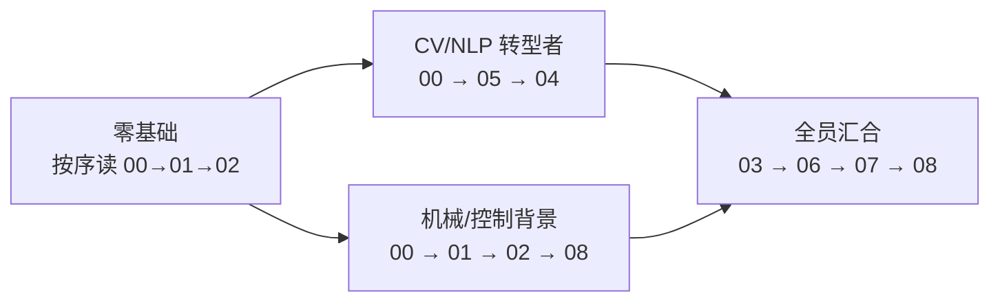

# 《具身智能》系列阅读指南（Deep Dive 交付说明）

> 研究执行日期：2026-08-25 · 引用验证方式：arXiv API 批量核实 + 官方站点可达性探测

## 文章在哪里？

正式文章已按博客规范写入 `_posts/`，发布后 URL 形如 `/2026/08/25/embodied-ai-00-overview/`：

| # | 文章 | 一句话定位 |
|---|------|-----------|
| 00 | [什么是具身智能](../_posts/2026-08-25-embodied-ai-00-overview.md) | 定义、70 年简史、莫拉维克悖论、领域全景图 |
| 01 | [数学与控制地基](../_posts/2026-08-25-embodied-ai-01-control-foundations.md) | 运动学→动力学→PID/LQR/MPC/WBC 完整推导链 |
| 02 | [学习范式 RL·IL·Sim-to-Real](../_posts/2026-08-26-embodied-ai-02-rl-il-sim2real.md) | PPO+并行仿真、域随机化数学、BC 协变量偏移 |
| 03 | [感知](../_posts/2026-08-27-embodied-ai-03-perception.md) | PointNet 对称函数、3DGS、FoundationPose、触觉、SLAM 最小包 |
| 04 | [操作](../_posts/2026-08-28-embodied-ai-04-manipulation.md) | 抓取几何理论 + Diffusion Policy/ACT 深潜 + 数据采集硬件谱系 |
| 05 | [VLA 基础模型](../_posts/2026-08-29-embodied-ai-05-vla-foundation-models.md) | RT-1→RT-2→OpenVLA→π0 流匹配推导→GR00T/Helix 双系统→世界模型 |
| 06 | [导航与任务规划](../_posts/2026-08-30-embodied-ai-06-navigation-planning.md) | A*/RRT* 数学、SayCan 价值接地、VoxPoser、TAMP 融合架构 |
| 07 | [数据·仿真·评测](../_posts/2026-08-31-embodied-ai-07-data-sim-benchmark.md) | 六大仿真器选型、八大真机数据集、benchmark 饱和问题、real2sim 流水线 |
| 08 | [产业版图与学习路线图](../_posts/2026-09-01-embodied-ai-08-industry-roadmap.md) | 执行器硬件解剖、公司棋局、岗位矩阵、90 天上手动线 |

## 推荐阅读路径

- **求全**：严格顺序 00–08，每篇末尾 Lab 动手做；
- **赶热点**：00 → 05 → 04 → 07，直通 VLA 主赛道；
- **工程落地**：00 → 02 → 07 → 08，先跑通 LeRobot 工作流再补理论。

## 引用可信度分级

| 标记 | 含义 | 数量级 |
|------|------|--------|
| arXiv 直链 | ID 与标题经 API 逐条核实（60+ 篇） | ✅ 全部验证 |
| 官方站点 | curl 探测可达（figure.ai/unitree/mujoco docs 等） | ✅ 已验证 |
| GitHub/HF 仓库 | 当前网络不可直连，链接为规范地址 | ⚠️ 未本地验证 |
| 公司动态/价格 | 时效性信息，建议以官方渠道复核 | ⚠️ 待核实 |

## 本目录文件

- `RESEARCH_PLAN.md`：研究计划（关键问题清单、每篇覆盖点、写作规范）
- `PROGRESS.md`：进度追踪 + 已验证引用库
- `README.md`：本文件
