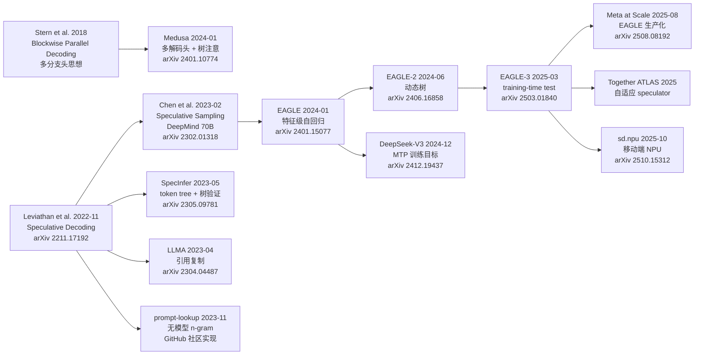

# 01 综述与演化史：投机解码如何突破自回归瓶颈

> 系列文档：投机解码（Speculative Decoding）业内现状
> 上一篇：无（本系列第一篇） | 下一篇：[02 核心技术原理与分类](02-core-methods.md)

---

## 1. 为什么自回归解码是慢的

现代大语言模型（LLM）采用**自回归解码**（autoregressive decoding）：每一步只生成一个 token，且第 $t+1$ 步依赖第 $t$ 步的输出。生成 $K$ 个 token 需要 $K$ 次串行的前向计算——

$$\text{time}(K\ \text{tokens}) = K \times t_{\text{forward}}$$

这里的瓶颈往往不是计算量（FLOPs），而是**内存带宽**：每一步都需要把整个模型的参数从高带宽内存（HBM）搬到片上缓存参与运算，而每个 token 实际只消费很少的浮点运算 [1](https://arxiv.org/abs/2211.17192)。在 batch size 较小（尤其 bs=1 的个人/实时场景）时，模型呈现明显的"memory-bound"特征——参数搬运占主导，计算单元大量空闲 [1](https://arxiv.org/abs/2211.17192)。

> **类比（直觉先行）**
> 自回归解码就像一家只有一个窗口的银行柜台：每个客户（token）都必须经过同一个柜员（模型前向），无论这个客户多"简单"。投机解码的思路是开一个"快速通道"：让一个经验稍浅但速度更快的柜员（draft model）先快速处理一批客户并写好受理单，再由资深柜员一次性批量复核这些受理单。复核通过就一次放行多个客户——只要核对成本低于逐个办理的成本，整体吞吐就上去了。

投机解码（Speculative Decoding, SD）的核心理念正是：**用低成本的猜测器生成候选 token 序列，再用目标模型一次性并行验证，通过则一次接受多个 token，同时保证输出分布与纯自回归完全一致（无损）** [1](https://arxiv.org/abs/2211.17192)[2](https://arxiv.org/abs/2302.01318)。

---

## 2. 方法谱系：从 2018 到 2026

### 2.1 主流脉络时间线

三股源头（2018 多分支头思想、2022/2023 独立 draft 模型、2023 无模型方案）在 2024 年后汇合，形成两条主线：

1. **自投机（self-speculative）**：Medusa/EAGLE 系——不依赖外部小模型，用目标模型自身的子模块（多解码头 / 特征级预测器）做草稿；
2. **训练目标级投机**：DeepSeek-V3 MTP——把"预测多个未来 token"直接写进训练目标，推理期可复用 MTP 模块做投机解码 [6](https://arxiv.org/abs/2412.19437)。

### 2.2 关键里程碑分述

#### 源头：Blockwise Parallel Decoding（2018）
Stern et al. 提出用多个解码头同时预测多个位置，在机器翻译与图像超分任务上验证了"多 token 并行预测"的可行性。该思想是 2024 年 Medusa 的直接先驱 [3](https://arxiv.org/abs/2401.10774)（论文内明确引用）。

#### 奠基：投机解码与投机采样（2022–2023）
Google Research 的 Leviathan 等人（2022-11，ICML 2023 发表，PMLR 202:19274–19286）正式提出 **speculative decoding**，并给出了核心证明：通过 **speculative sampling**（接受概率 $\min(1, p(x)/q(x))$，拒绝后从残差分布重采样），可以保证输出分布与目标模型单独采样**完全一致**（无损、无偏）[1](https://arxiv.org/abs/2211.17192)。在同一条线上，DeepMind 的 Chen 等人在 70B Chinchilla 上以分布式设置获得 **2–2.5×** 解码加速，并完整给出接受率与预期每步 token 数的理论 [2](https://arxiv.org/abs/2302.01318)。这两个工作共同奠定了"draft → verify"两阶段范式。

#### 系统化：SpecInfer 与树验证（2023-05）
上海交大/CMU 的 Miao 等人提出 SpecInfer，把猜测从"单条序列"升级为**token 树（token tree）**：多个猜测模型（SSM）的候选合并成一棵树，用 **tree attention** 单次前向并行验证整棵树，并提出 **multi-step speculative sampling (MSS)** 保证随机解码无损 [4](https://arxiv.org/abs/2305.09781)。树结构显著提升验证成功率（论文报告随机解码场景下从 52–57% 提升到 96–97% [4](https://arxiv.org/abs/2305.09781)）。该工作以 ASPLOS 2024 正式发表，并开源在 FlexFlow 仓库中。树验证成为此后 Medusa/EAGLE 系的标准基础设施。

#### 零成本路线：无模型与引用复制（2023）
为摆脱"必须准备一个高质量的 draft 模型"的负担，出现了两条无独立模型的路线：

- **LLMA（2023-04）**：利用输出与上下文参考文本的高度重叠（检索增强、多轮对话、缓存会话），直接从参考中复制文本片段批量送入模型并行验证，贪婪解码下输出与基准完全相同，获得 2–3× 加速 [5](https://arxiv.org/abs/2304.04487)。
- **prompt-lookup / n-gram（2023-11）**：直接在已生成前缀中查找并复制后续 token（本质是 n-gram plus 最长公共前缀匹配），零训练零额外模型 [7](https://github.com/apoorvumang/prompt-lookup-decoding)。REST 进一步用检索（datastore）生成草稿 [8](https://arxiv.org/abs/2311.08252)。

#### 自投机兴起：Medusa 与 EAGLE（2024）
- **Medusa（2024-01，ICML 2024）**：去掉外部 draft 模型，在 LLM 顶部添加多个轻量解码头直接预测后续 $K$ 个 token，配合树注意与 **typical acceptance**（放宽拒绝采样，可权衡质量与速度）。Medusa-1（冻结主干）超 2.2×，Medusa-2（联合微调）达 2.3–2.8× [3](https://arxiv.org/abs/2401.10774)。
- **EAGLE（2024-01，ICML 2024）**：把自回归从 token 空间搬到**特征空间（feature space）**——草稿模型输入复用目标模型顶层特征，输出经目标模型 LM head 得到 token 分布。特征级对齐使接受率显著高于独立 draft 模型，且草稿模型极小（单层解码器）[9](https://arxiv.org/abs/2401.15077)。EAGLE-2（2024-06，EMNLP 2024）引入**动态草稿树**机制进一步提速 [10](https://arxiv.org/abs/2406.16858)。

#### 训练目标级：DeepSeek-V3 的 MTP（2024-12）
DeepSeek-V3（671B 总参 / 37B 激活的 MoE）在训练阶段引入 **Multi-Token Prediction (MTP)** 目标：每个位置按顺序预测后续 $D$ 个 token，保持因果链路完整。它有两个作用：一是作为辅助训练目标提升主模型在基准上的表现，二是推理期 MTP 模块可直接复用作投机解码，进一步降低生成延迟 [6](https://arxiv.org/abs/2412.19437)。这是"投机能力内建到训练目标"的代表性工程实践。

#### 当前主流：EAGLE-3（2025-03，NeurIPS 2025）
EAGLE-3 放弃特征预测约束，改为**直接预测 token**，并用 **training-time test** 技术（训练时把上一刻的模型输出反馈回输入，模拟自回归推理路径）消除训练-推理分布失配；输入从"仅顶层特征"换成**低/中/高层特征融合**。训练数据扩大约 8 倍后仍持续受益（此前 EAGLE 系列随数据扩大会收益递减）。论文报告最高 **6.5×** 加速、相对 EAGLE-2 约 **1.4×** 提升；在 SGLang 中 bs=64 时吞吐提升 1.38×（即 38%）[11](https://arxiv.org/abs/2503.01840)。代码开源在 [SafeAILab/EAGLE](https://github.com/SafeAILab/EAGLE)，并官方推荐 [SpecForge](https://github.com/sgl-project/SpecForge) 用于 SGLang 生态下开箱即用地训练 EAGLE-3。

#### 2025–2026：大规模生产与端侧
- **Meta**（2025-08）：*Efficient Speculative Decoding for Llama at Scale*（arXiv 2508.08192）报告了基于 EAGLE 的亿级生产化部署，Llama4 Maverick 在 8×H100、bs=1 下达到约 4ms/token [12](https://arxiv.org/abs/2508.08192)。
- **Together AI**：ATLAS 自适应 speculator + Together Turbo，报告 DeepSeek-V3.1 达 500 TPS、Kimi-K2 460 TPS（约 2.65×）。
- **端侧**：sd.npu 把投机采样调度到移动端 NPU，报告 3.8× 速度 / 4.7× 能效提升 [13](https://arxiv.org/abs/2510.15312)。

---

## 3. 方法分类体系（survey 视角）

[Speculative Decoding and Beyond: An In-Depth Survey of Techniques](https://arxiv.org/abs/2502.19732)（Yunhai Hu, Zining Liu, Zhenyuan Dong, Tianfan Peng, Bradley McDanel, Sai Qian Zhang；NYU/UPenn/SIIT/F&M，2025-02-27）给出一个统一的 **generation-refinement** 两阶段分类学 [14](https://arxiv.org/abs/2502.19732)：

### 3.1 生成阶段（Generation Strategies）——草稿从哪来

| 策略族 | 代表方法 | 成本特点 |
|---|---:|---:|
| 随机/近似采样 | Blockwise、迭代解码类 | 零成本，接受率低 |
| **n-gram / 检索**（零模型） | ANPD、N-Gram、ADED、（REST/LLMA 归检索） | 零训练，适合强复用文本 |
| **独立 draft 模型** | SpecDec、BiLD、DistillSpec、FastDraft | 需额外部署与显存 |
| **依赖型 draft（自投机）** | | |
| 层跳过 | LayerSkip、Kangaroo、Draft&Verify | 共享主干，草稿质量有限 |
| **FFN 头草稿** | **EAGLE(-2/-3)**、Hydra、HASS | 特征级预测，接受率高 |
| **多 token 头** | **Medusa**、Blockwise | 共享主干，简单直接 |

### 3.2 验证阶段（Refinement Mechanisms）——草稿如何被确认

| 验证方式 | 代表方法 | 特点 |
|---|---:|---:|
| **单遍线性验证** | 经典 SD、Draft&Verify | 一条路径，简单 |
| **树验证（tree-based）** | **SpecInfer、Medusa、EAGLE(-2/-3)**、Sequoia | 多候选一次验证，接受长度更长 |
| **迭代验证** | CLLM 类、并行 SD | 多轮精炼，质量更高/成本更高 |

> **3.3 为什么树验证成为主流**
> 单条草稿序列的接受期望约为 $\frac{1-\alpha^{\gamma+1}}{1-\alpha}$（推导见 [02 核心技术原理](02-core-methods.md)）；当 $\alpha$ 不够高时，接受长度上不去。把多个候选组织成树后，等价于把"每层投注"池化——只要目标模型沿任一支路径落子，该支的后续 token 均可被接住。SpecInfer 报告验证成功率从 52–57% 提升到 96–97% [4](https://arxiv.org/abs/2305.09781)，Medusa/EAGLE 全系沿用即为例证。

---

## 4. 里程碑速查表

| 时间 | 方法 | 关键论文/来源 | 归属谱系 | 标志性结果 |
|---|---|---|---|---|
| 2018 | Blockwise Parallel Decoding | Stern et al. (引用见 Medusa [3](https://arxiv.org/abs/2401.10774)) | 多分支头发源 | MT/超分任务验证 |
| 2022-11 | Speculative Decoding | [Leviathan et al., arXiv 2211.17192](https://arxiv.org/abs/2211.17192) | draft+verify 奠基 | 2–3×，无损 |
| 2023-02 | Speculative Sampling | [Chen et al., arXiv 2302.01318](https://arxiv.org/abs/2302.01318) | draft+verify 奠基 | 70B Chinchilla 2–2.5× |
| 2023-04 | LLMA | [Yang et al., arXiv 2304.04487](https://arxiv.org/abs/2304.04487) | 引用复制 | 2–3×（RAG 等） |
| 2023-05 | SpecInfer | [Miao et al., arXiv 2305.09781](https://arxiv.org/abs/2305.09781) | 树验证发源 | 1.5–3.5×；树验证成功率 96–97% |
| 2023-11 | prompt-lookup / n-gram | [GitHub 实现](https://github.com/apoorvumang/prompt-lookup-decoding) | 零模型 | 摘要/代码常见 2.8×（详见 05） |
| 2023-11 | REST | [arXiv 2311.08252](https://arxiv.org/abs/2311.08252) | 检索式草稿 | 通用加速 |
| 2024-01 | Medusa | [Cai et al., arXiv 2401.10774](https://arxiv.org/abs/2401.10774) | 多 token 头 | Medusa-1 ≥2.2×，Medusa-2 2.3–2.8× |
| 2024-01 | EAGLE | [Li et al., arXiv 2401.15077](https://arxiv.org/abs/2401.15077) | 特征级自回归 | 显著优于独立 draft |
| 2024-06 | EAGLE-2 | [Li et al., arXiv 2406.16858](https://arxiv.org/abs/2406.16858) | 动态草稿树 | 相对 EAGLE 提升 |
| 2024-12 | DeepSeek-V3 MTP | [DeepSeek-AI, arXiv 2412.19437](https://arxiv.org/abs/2412.19437) | 训练目标级 | MTP 既是训练目标又可做投机 |
| 2025-03 | EAGLE-3 | [Li et al., arXiv 2503.01840](https://arxiv.org/abs/2503.01840) | 自投机 + 规模化 | 最高 6.5×；SGLang bs=64 吞吐 1.38× |
| 2025-08 | Llama at Scale | [arXiv 2508.08192](https://arxiv.org/abs/2508.08192) | 生产化 EAGLE | Maverick ~4ms/token |
| 2025-10 | sd.npu | [arXiv 2510.15312](https://arxiv.org/abs/2510.15312) | 移动端 | 3.8× 速度 / 4.7× 能效 |

---

## 5. 小结与衔接

- 投机解码从 2022-2023 的"独立小模型 + 单遍验证"起步，2024 年转向**自投机**（Medusa 多分支头、EAGLE 特征级预测），2025 年进一步走向**训练目标级协同**（DeepSeek-V3 MTP）与 **规模化数据训练**（EAGLE-3）。
- **树验证**是贯穿 SpecInfer/Medusa/EAGLE 系的基础设施；**training-time test** 解决了"训练路径 ≠ 推理路径"的核心分布失配问题，是 EAGLE-3 相对前代的关键改进。
- 面向生产，2025 年起出现两大信号：一是 Meta/Together 将 EAGLE 系部署到真实服务并给出数据（[06 业界实践](06-industry-practice.md)）；二是生产收益与实验室数据的系统性差距开始被量化（[05 生产部署实战](05-production-deployment.md)）。

下一篇：[02 核心技术原理与分类](02-core-methods.md)——从数学上严格推导 speculative sampling 的无偏性、接受率上界与加速比模型。

---

### 参考文献

1. Leviathan, Kalman, Matias. *Fast Inference from Transformers via Speculative Decoding*. arXiv:2211.17192; ICML 2023, PMLR 202:19274–19286. https://arxiv.org/abs/2211.17192
2. Chen, Borgeaud, Irving, Lespiau, Sifre, Jumper. *Accelerating Large Language Model Decoding with Speculative Sampling*. arXiv:2302.01318. https://arxiv.org/abs/2302.01318
3. Cai, Li, Geng, Peng, Lee, Chen, Dao. *Medusa: Simple LLM Inference Acceleration Framework with Multiple Decoding Heads*. arXiv:2401.10774; ICML 2024. https://arxiv.org/abs/2401.10774
4. Miao, Oliaro, Zhang, et al. *SpecInfer: Accelerating Generative Large Language Model Serving with Tree-based Speculative Inference and Verification*. arXiv:2305.09781; ASPLOS 2024. https://arxiv.org/abs/2305.09781
5. Yang, Ge, Wang, Jiao, Jiang, Yang, Majumder, Wei. *Inference with Reference: Lossless Acceleration of Large Language Models*. arXiv:2304.04487. https://arxiv.org/abs/2304.04487
6. DeepSeek-AI. *DeepSeek-V3 Technical Report*. arXiv:2412.19437. https://arxiv.org/abs/2412.19437
7. Saxena, Apoorv. *Prompt Lookup Decoding*（社区实现，vLLM 文档亦收录）. https://github.com/apoorvumang/prompt-lookup-decoding
8. He, et al. *REST: Retrieval-Based Speculative Decoding*. arXiv:2311.08252. https://arxiv.org/abs/2311.08252
9. Li, et al. *EAGLE: Lossless Acceleration of LLM Decoding by Feature-based Drafting*. arXiv:2401.15077; ICML 2024. https://arxiv.org/abs/2401.15077
10. Li, et al. *EAGLE-2: Faster Inference of Language Models with Dynamic Draft Trees*. arXiv:2406.16858; EMNLP 2024. https://arxiv.org/abs/2406.16858
11. Li, Wei, Zhang, Zhang. *EAGLE-3: Scaling up Inference Acceleration of Large Language Models via Training-Time Test*. arXiv:2503.01840; NeurIPS 2025. https://arxiv.org/abs/2503.01840
12. Meta / Agarwal et al. *Efficient Speculative Decoding for Llama at Scale*. arXiv:2508.08192 (2025-08-12). https://arxiv.org/abs/2508.08192
13. *sd.npu: Accelerating Speculative Decoding on Mobile NPUs*. arXiv:2510.15312. https://arxiv.org/abs/2510.15312
14. Hu, Liu, Dong, Peng, McDanel, Zhang. *Speculative Decoding and Beyond: An In-Depth Survey of Techniques*. arXiv:2502.19732. https://arxiv.org/abs/2502.19732