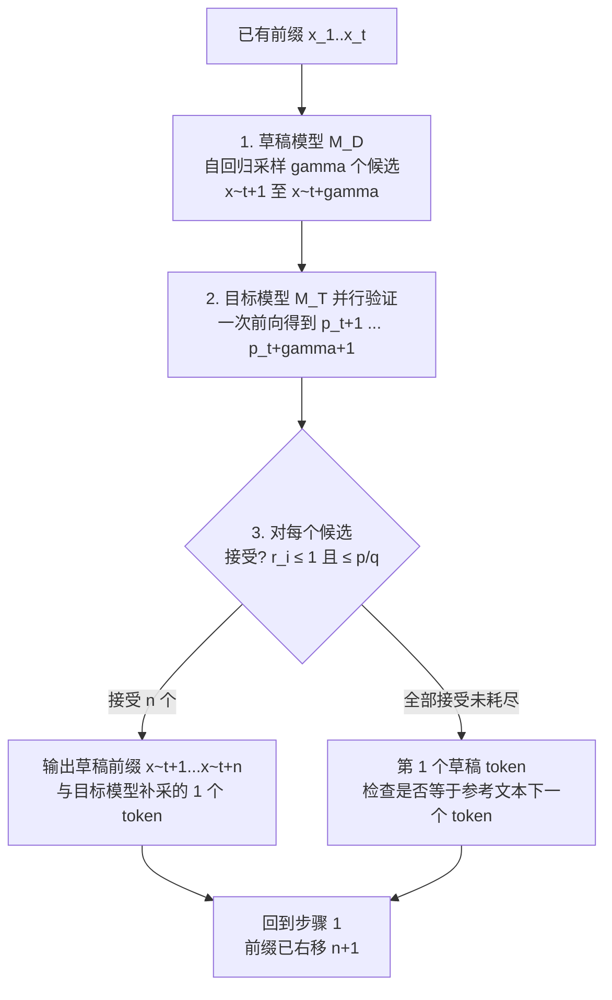
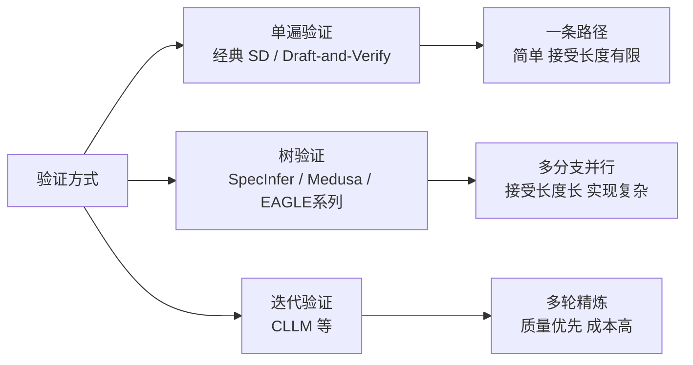

# 02 核心技术原理与分类：从数学上严格理解投机解码

> 系列文档：投机解码（Speculative Decoding）业内现状
> 上一篇：[01 综述与演化史](01-overview-and-evolution.md) | 下一篇：[03 EAGLE 家族深度解析](03-eagle-family-deep-dive.md)

---

## 0. 符号约定（全文统一）

为避免两篇奠基论文的记号冲突（Leviathan 用 $p$=目标/$q$=草稿，Chen 用 $p$=草稿/$q$=目标），本文统一采用：

| 符号 | 含义 |
|---|---|
| $M_T$、$p(x_t \mid x_{<t})$ | **目标模型**（target）、该模型输出的词表分布 |
| $M_D$、$q(x_t \mid x_{<t})$ | **草稿模型**（draft）、该模型输出的词表分布 |
| $\gamma$（或 $K$） | 草稿长度（draft length） |
| $\alpha$ | 单步接受概率（acceptance probability） |
| $\mathbb{E}[X]$ | 每轮验证接受的草稿 token 期望数 |
| $c = t_D / t_T$ | 单次草稿前向与目标前向的耗时比 |
| $V$ | 词表大小 |

> ⚠️ 记号差异提示
> - Leviathan et al. [1](https://arxiv.org/abs/2211.17192): 目标模型记为 $M_p$，草稿模型记为 $M_q$。
> - Chen et al. [2](https://arxiv.org/abs/2302.01318): 目标记为 $q$，草稿记为 $p$。
> 阅读原文时请注意这一相反约定。

---

## 1. 核心框架：draft → verify 两阶段范式

### 1.1 朴素自回归的开销结构

自回归解码每步：

$$\text{cost}(\text{1 token}) = \underbrace{T_{\text{weights}}}_{\text{读全部权重}} + \underbrace{T_{\text{compute}}}_{\text{一次前向}}$$

在 **memory-bound** 区间（bs 小、模型大）$T_{\text{weights}} \gg T_{\text{compute}}$，GPU 大量时间花在搬运权重而非计算 [1](https://arxiv.org/abs/2211.17192)。Chen et al. 的观察：对大规模分布式模型，**并行评分一个短延续序列的延迟与采样单个 token 的延迟相当**——因为延迟被权重搬运主导，延续几 token 的额外计算可以"嵌入"同一轮内存搬运中 [2](https://arxiv.org/abs/2302.01318)。

### 1.2 两阶段流程



每轮目标模型都有**保底一个 token 输出**（即使首个草稿被拒，也会从调整分布重采样一个），因此串行目标前向次数**永远不会多于**朴素自回归 [1](https://arxiv.org/abs/2211.17192)。

---

## 2. 无偏采样：speculative sampling 的严格推导

### 2.1 单 token 情形

给定离散分布 $p$（目标）、$q$（草稿），我们采 $X \sim q$，然后：

1. 以概率 $\min\left(1, \frac{p(X)}{q(X)}\right)$ **接受** $X$；
2. 否则**拒绝**，并从调整分布重采样：$X' \sim \tilde{p}$，其中
$$\tilde{p}(x) = \frac{\max(0,\, p(x) - q(x))}{\sum_{x'}\max(0,\, p(x') - q(x'))}$$

**定理（无偏性）**：最终 $X \sim p$。

**证明**：设事件 $A$ = 接受。对任意 $x \in V$：

$$\begin{aligned}
\Pr[X = x] &= \Pr[\text{采到 }x \text{ 且接受}] + \Pr[\text{拒绝}]\cdot\tilde{p}(x) \\
&= q(x)\min\!\Big(1,\tfrac{p(x)}{q(x)}\Big) + \Pr[A^c]\cdot\tfrac{\max(0,p(x)-q(x))}{Z}
\end{aligned}$$

其中 $Z = \sum_{x'}\max(0,\, p(x')-q(x'))$。先算 $\Pr[A^c]$：

$$\Pr[A^c] = \sum_{x'} q(x')\Big(1 - \min(1,\tfrac{p(x')}{q(x')})\Big) = \sum_{x'} \max(0,\, q(x')-p(x'))$$

由 $\sum_x p = \sum_x q = 1$，正部之和相等：$\sum_x \max(0,q-p) = \sum_x \max(0,p-q) = Z$，故 $\Pr[A^c] = Z$。

又 $q(x)\min(1, \frac{p(x)}{q(x)}) = \min(p(x), q(x))$。因此：

$$\Pr[X=x] = \min(p,q) + Z\cdot\frac{\max(0,p-q)}{Z} = \min(p,q) + \max(0,p-q) = p(x) \quad\blacksquare$$

> 该证明即 Leviathan et al. 附录 A.1 的核心步骤 [1](https://arxiv.org/abs/2211.17192)，等价地也是 Chen et al. Theorem 1 的单步情形 [2](https://arxiv.org/abs/2302.01318)。

### 2.2 多 token 情形（$\gamma$ 个草稿）

草稿模型逐位自回归采 $\tilde{x}_1,\dots,\tilde{x}_\gamma$（分布 $\tilde{q}_i$），目标模型并行一次前向得到 $p_1,\dots,p_{\gamma+1}$（$p_i$ 为给定前缀+已接受/草稿 token 条件下的第 $t+i$ 位分布）。对 $i=1,\dots,\gamma$ 独立取 $r_i \sim U(0,1)$，定义

$$n = \min\Big(\{\, i-1 \mid 1\le i\le\gamma,\ r_i > \min(1, \tfrac{p_i(\tilde{x}_i)}{q_i(\tilde{x}_i)})\,\} \cup \{\gamma\}\Big)$$

即"首个被拒位置的前一位"（全部接受则 $n=\gamma$）。输出规则：

- $n = \gamma$：直接采样 $x_{t+\gamma+1} \sim p_{\gamma+1}$，输出 $\gamma+1$ 个 token；
- $n < \gamma$：采样 $x_{t+n+1} \sim \mathrm{norm}(\max(0,\, p_{n+1} - q_{n+1}))$，输出 $n+1$ 个 token。

**定理（多步正确性）**：上述过程与目标模型直接自回归采样在分布上等价。

**证明思路（归纳）**：前 $n$ 个被接受的草稿 token 在给定前缀条件下各自由单 token 定理保持分布一致性；被拒位置（$n+1$）通过残差分布重采样恢复目标分布；若全部接受，第 $\gamma+1$ 个直接来自 $p_{\gamma+1}$ [1](https://arxiv.org/abs/2211.17192) Lemma 3.4/3.5, [2](https://arxiv.org/abs/2302.01318) Theorem 1。

### 2.3 接受率 $\alpha$ 与期望 token 数

定义**接受概率**：$\alpha = \mathbb{E}_{x\sim q}\Big[\min\!\Big(1, \tfrac{p(x)}{q(x)}\Big)\Big] = \sum_x \min(p(x), q(x))$。它度量两分布的重叠程度（即 $1 - \tfrac{1}{2}\mathrm{TV}(p,q)$）。

**引理（每步接受独立的几何结构）**：若草稿模型各步分布与目标模型足够一致，则前 $k$ 个草稿全部被接受的概率为 $\alpha^k$，且

$$\mathbb{E}[X] = \sum_{k=1}^{\gamma}\alpha^{k} = \frac{\alpha(1-\alpha^{\gamma})}{1-\alpha}, \qquad \text{每轮总 token 期望} = 1 + \mathbb{E}[X] = \frac{1-\alpha^{\gamma+1}}{1-\alpha}.$$

- 推导：$\Pr[X \ge k] = \alpha^{k}$（前 $k$ 个都接受），累加期望即得。（Leviathan Theorem 3.5 的表述为"本轮接受的 token 数 $X$ 满足 $\Pr[X \ge k] = \alpha^k$，$\mathbb{E}[X]=(1-\alpha^{\gamma+1})/(1-\alpha)-1$" [1](https://arxiv.org/abs/2211.17192)）

数值示例（$\gamma=4$）：

| $\alpha$ | 0.30 | 0.50 | 0.70 | 0.80 | 0.90 | 0.95 |
|---:|---:|---:|---:|---:|---:|---:|
| $\mathbb{E}[X]$（草稿接受数） | 0.43 | 0.94 | 1.77 | 2.36 | 3.10 | 3.52 |
| 每轮总 token | 1.43 | 1.94 | 2.77 | 3.36 | 4.10 | 4.52 |

可见 $\alpha$ 从 0.5 提到 0.8，每轮增产约 73%；从 0.8 到 0.9 再增约 22%。**高接受率是第一性目标**——这解释了为什么业界全力追求更好的草稿器（EAGLE 系）而非更大的 $\gamma$。

---

## 3. 加速比模型：什么决定最终收益

### 3.1 耗时模型

设 $t_T$ = 目标模型单次前向耗时（读全部权重），$t_D$ = 草稿模型单次自回归步耗时，$c = t_D/t_T$。草稿生成 $\gamma$ 步耗时 $\gamma t_D$，目标验证一次前向约 $t_T$（批量验证不显著增加延迟 [2](https://arxiv.org/abs/2302.01318)）。单轮总耗时 $\approx \gamma t_D + t_T$，产出 $\frac{1-\alpha^{\gamma+1}}{1-\alpha}$ 个 token。

**理论加速比**：

$$S(\alpha,\gamma,c) = \frac{\frac{1-\alpha^{\gamma+1}}{1-\alpha} \cdot t_T}{\gamma t_D + t_T} = \frac{1-\alpha^{\gamma+1}}{(1-\alpha)(1+\gamma c)}$$

> 这是全文最重要的公式。三个结论：
> 1. $\alpha \to 1$ 时 $S \to \frac{\gamma+1}{1+\gamma c}$：完全一致时近似线速。
> 2. $c \to 0$（草稿极便宜）时 $S \to \frac{1-\alpha^{\gamma+1}}{1-\alpha}$：纯接受率收益。
> 3. 内存受限（memory-bound）时目标模型加位几乎免费，$S$ 由接受率主导；计算受限（compute-bound，大 batch）时 $\gamma c$ 项占主导，加速可能消失（详见 [05 生产部署](05-production-deployment.md)）。

### 3.2 最优草稿长度 $\gamma^*$

对连续化后的 $S$ 取一阶导数，得最优条件：

$$\frac{\partial S}{\partial \gamma} = 0 \iff \alpha^{\gamma+1}\big(c - (1+\gamma c)\ln\alpha\big) = c$$

（数值上可直接枚举 $\gamma$ 求最大值，见下方表格；我们用枚举验证了一阶条件：$\alpha=0.8, c=0.05 \Rightarrow \gamma^*=8$ 时 lhs $=0.0486 \approx c$ ✓）

**数值最优解（本文计算）**：

| $\alpha \backslash c$ | $c=0.01$ | $c=0.05$ | $c=0.10$ | $c=0.20$ | $c=0.50$ |
|---:|---:|---:|---:|---:|---:|
| $\alpha=0.40$ | $g^*$=4, S=1.59 | $g^*$=2, S=1.42 | $g^*$=2, S=1.30 | $g^*$=1, S=1.17 | $g^*$=0, S=1.00 |
| $\alpha=0.60$ | $g^*$=7, S=2.30 | $g^*$=4, S=1.92 | $g^*$=3, S=1.67 | $g^*$=2, S=1.40 | $g^*$=1, S=1.07 |
| $\alpha=0.80$ | $g^*$=14, S=4.23 | $g^*$=8, S=3.09 | $g^*$=6, S=2.47 | $g^*$=4, S=1.87 | $g^*$=2, S=1.22 |
| $\alpha=0.90$ | $g^*$=16, S=7.18 | $g^*$=13, S=4.67 | $g^*$=10, S=3.43 | $g^*$=7, S=2.37 | $g^*$=3, S=1.38 |
| $\alpha=0.95$ | $g^*$≥16, S≥10.0 | $g^*$=16, S=6.47 | $g^*$=15, S=4.48 | $g^*$=10, S=2.87 | $g^*$=5, S=1.51 |

> $g^*$ 在上界 16 处触顶的组合（$\alpha$ 高且 $c$ 极低）标注为 ≥16，实际最优更大。**生产启示**：
> - 草稿模型足够快（$c\le0.1$、比如 EAGLE 单层解码器）且 $\alpha\ge0.8$ 时，$\gamma=6$–16 值得；
> - 草稿相对昂贵（$c\approx0.5$，如独立小模型）时，$\gamma$ 压到 1–5，否则负收益；
> - 接受率低于 $\approx 0.6$ 且 $c$ 偏高时，投机解码可能不如直接解码。

### 3.3 变量映射表（数学 ↔ 代码）

| 数学符号 | 代码变量（SGLang 配置） | Shape / 取值 | 说明 |
|---:|:---|:---:|:---|
| $\gamma$ | `--speculative-draft-length` | int，如 6 | 草稿长度 |
| $\alpha$ | `--speculative-accept-length` / 观测 `accept_length` | float ∈[0,1] | 接受率，日志可观测 |
| $c$ | （框架内部）draft 模型与 target 的延迟比 | float | 决定 $\gamma^*$ |
| $V$ | `--tokenizer` 词汇表 | 例如 Llama-3 128K | 草稿与目标必须一致（见 05） |
| $p,q$ | `--speculative-algorithm` 生成的 logits | (batch, V) | 验证计算所需 |

---

## 4. 验证方法分类：单遍 / 树 / 迭代

### 4.1 单遍验证（Sequence verification）

即 2 节的经典流程：一条草稿序列一次并行验证。复杂度低，但草稿"押错"一处分支整段重新开始。

### 4.2 树验证（Tree-based verification）

**SpecInfer** 首次系统化：把多条草稿候选合并为 **token 树**，用 **tree attention** 单次前向并行验证整棵树，配合 **multi-step speculative sampling (MSS)** 保证随机解码无损 [3](https://arxiv.org/abs/2305.09781)。

**为什么树在随机解码下显著更优**：设单条草稿的根到叶接受链为独立几何叠加，期望接受长度 $\frac{1-\alpha^{\gamma+1}}{1-\alpha}-1$。当把 $B$ 个分支候选并行押注时，任意分支被验中的概率随分支数呈指数补集改善。SpecInfer 的直观证据：随机解码下 token 验证成功率从 52–57% 提升到 96–97% [3](https://arxiv.org/abs/2305.09781)。

**实现要点（tree attention）**：不同分支的 KV cache 冲突通过"分组 kernel + 修正注意力分数"解决——把父→子链的 kernel 分组，用每组末尾 token 的 KV 计算，再修复违反因果关系的注意力对，得到与增量解码完全一致的注意力输出 [3](https://arxiv.org/abs/2305.09781)。

### 4.3 迭代验证（Iterative refinement）

以 CLLM 为代表：草稿并非一次性生成后单遍验证，而是经过多轮"生成-验证-修正"直至收敛，保留质量换更低延迟的不变性保证（部分方法放弃严格无偏，换取速度，见 Medusa typical acceptance [4](https://arxiv.org/abs/2401.10774)）。



---

## 5. 额外重要机理

### 5.1 Typical acceptance（Medusa，质量-速度权衡）

除以接受概率 $\min(1,p/q)$ 的严格拒绝采样外，Medusa 引入 **typical acceptance**：当候选 token 在目标模型分布中"足够典型"（例如考察概率落在典型集阈值内）即接受，不要求精确的 $q$ 分布匹配 [4](https://arxiv.org/abs/2401.10774)。好处：接受率显著提升、解码方差更低；代价：**不再严格保分布**（无偏性换速度），输出分布可能偏离目标模型。使用前必须评估任务对分布保真度的要求。

### 5.2 特征级草稿（EAGLE 的思想预告）

经典方法在 **token 空间**做草稿。EAGLE 提出在 **特征空间**做自回归：草稿模型输入复用目标模型的（顶层/多层）隐藏特征，输出经目标 LM head 得到 token 分布 [5](https://arxiv.org/abs/2401.15077)。直观地，token 分布是特征的确定性函数，特征比 token 携带更丰富的信息，故同样参数下 EAGLE 草稿的接受率显著高于在 token 空间猜测的独立小模型。设计动机、与 Medusa/MTP 的关系及 training-time test 的严格训练推导在 [03 EAGLE 家族深度解析](03-eagle-family-deep-dive.md) 展开。

### 5.3 无模型投机（n-gram / prompt-lookup）的数学视角

零训练路线把草稿分布替换为**确定性查找**：在参考文本/已生成前缀中找最长匹配后缀，复制后续 $k$ 个 token。验证仍是目标模型一次并行前向 [6](https://github.com/apoorvumang/prompt-lookup-decoding)[7](https://arxiv.org/abs/2304.04487)（LLMA）。$c \to 0$（无草稿模型开销）、$\gamma$ 不再受限但 $\alpha$ 高度任务相关——文本高度复用时 $\alpha$ 高（摘要/代码复用 2.8×，见 [05](05-production-deployment.md)），自由创作时 $\alpha$ 骤降，收益消失。

---

## 6. 最小可复现示例（MRE，PyTorch 单 token 无偏性验证）

```python
import torch
import torch.nn.functional as F

def speculative_sample_once(p, q, n_samples=200_000, seed=0):
    """验证单 token speculative sampling 无偏性。
    变量映射: p=目标分布(Leviathan), q=草稿分布; 数学式 P(X=x)=p(x).
    """
    torch.manual_seed(seed)
    V = p.shape[0]
    accepted = torch.empty(n_samples, dtype=torch.long)
    for i in range(n_samples):
        x = torch.multinomial(q, 1).item()          # X ~ q
        u = torch.rand(1).item()                     # r ~ U(0,1)
        if u <= min(1.0, (p[x] / q[x]).item()):      # 接受概率 min(1, p(x)/q(x))
            accepted[i] = x
        else:                                        # 拒绝 -> 残差分布重采样
            residual = torch.clamp(p - q, min=0)     # max(0, p-q)
            accepted[i] = torch.multinomial(residual, 1).item()
    return accepted

V = 8
p = F.softmax(torch.randn(V), dim=0)                 # 任意目标分布
q = F.softmax(torch.randn(V), dim=0)                 # 任意草稿分布 (q 无需贴近 p)
samples = speculative_sample_once(p, q, n_samples=200_000)
empirical = torch.bincount(samples, minlength=V).float() / samples.shape[0]
print("empirical :", empirical.numpy().round(3))
print("target p  :", p.numpy().round(3))
print("max |err| :", (empirical - p).abs().max().item())
# 期望输出: max|err| ~ 1e-2 (采样本底), 任意 p/q 组合均成立
```

**运行要点**：`import torch`；框架版本 PyTorch ≥2.0。该脚本不依赖任何推理框架，直接验证第 2.1 节定理——**无论 $q$ 与 $p$ 相差多大，经验分布都收敛到 $p$**。

---

## 7. 方法分类总表

| 维度 | 分支 | 代表方法 | 无偏? | 草稿成本 | 适用 |
|---|---|---|:---:|---:|---|
| 草稿来源 | n-gram/查找 | prompt-lookup [6](https://github.com/apoorvumang/prompt-lookup-decoding)、LLMA [7](https://arxiv.org/abs/2304.04487) | 贪婪✓ | 0 | 文本复用高 |
| | 独立小模型 | Levianthan SD [1](https://arxiv.org/abs/2211.17192)、Chen SPS [2](https://arxiv.org/abs/2302.01318) | ✓ | 高（额外部署） | 通用 |
| | 多 token 头 | Medusa [4](https://arxiv.org/abs/2401.10774) | 严格/typical 可选 | 低（轻量头） | 本地/bs=1 |
| | 特征级 | EAGLE 系 [5](https://arxiv.org/abs/2401.15077) | ✓ | 低（单层解码器） | 生产主流 |
| | 训练目标级 | DeepSeek-V3 MTP [8](https://arxiv.org/abs/2412.19437) | ✓ | 预训练内置 | 生态级 |
| 验证方式 | 单遍 | 经典 SD [1](https://arxiv.org/abs/2211.17192)[2](https://arxiv.org/abs/2302.01318) | ✓ | — | 简单场景 |
| | 树 | SpecInfer [3](https://arxiv.org/abs/2305.09781)、Medusa、EAGLE | ✓ | — | 高并发/高接受 |
| | 迭代 | CLLM、并行 SD | 视方法 | 高 | 质量敏感 |

---

## 8. 本章结论

1. **投机解码的本质是一笔"算力换延迟"的期权**：草稿免费时收益由接受率 $\alpha$ 决定，草稿有成本时受 $c$ 与 $\gamma^*$ 共同约束（第三节公式）。
2. **无偏性不是玄学**：接受-重采样两步精确恢复了目标分布，第 2 节给出了完备证明与可运行验证。
3. **$\alpha$ 是灵魂指标**：它决定加速比上界；树验证、特征级草稿、training-time test 全部指向同一个目标——把 $\alpha$ 推高。
4. **attention-check 数据的生产含义**：$\alpha$ 与 $c$ 是部署时唯二需要实测的两个数（见 [05](05-production-deployment.md)）。

下一篇：[03 EAGLE 家族深度解析](03-eagle-family-deep-dive.md)——Medusa → EAGLE → EAGLE-2/3、training-time test 的训练推导与 DeepSeek-V3 MTP。

---

### 参考文献

1. Leviathan, Kalman, Matias. *Fast Inference from Transformers via Speculative Decoding*. arXiv:2211.17192; ICML 2023. https://arxiv.org/abs/2211.17192
2. Chen, Borgeaud, Irving, Lespiau, Sifre, Jumper. *Accelerating Large Language Model Decoding with Speculative Sampling*. arXiv:2302.01318. https://arxiv.org/abs/2302.01318
3. Miao, et al. *SpecInfer: Accelerating Generative Large Language Model Serving with Tree-based Speculative Inference and Verification*. arXiv:2305.09781; ASPLOS 2024. https://arxiv.org/abs/2305.09781
4. Cai, et al. *Medusa: Simple LLM Inference Acceleration Framework with Multiple Decoding Heads*. arXiv:2401.10774; ICML 2024. https://arxiv.org/abs/2401.10774
5. Li, et al. *EAGLE: Lossless Acceleration of LLM Decoding by Feature-based Drafting*. arXiv:2401.15077; ICML 2024. https://arxiv.org/abs/2401.15077
6. Saxena, Apoorv. *Prompt Lookup Decoding*（社区实现，vLLM 文档亦收录）. https://github.com/apoorvumang/prompt-lookup-decoding
7. Yang, et al. *Inference with Reference: Lossless Acceleration of Large Language Models* (LLMA). arXiv:2304.04487. https://arxiv.org/abs/2304.04487
8. DeepSeek-AI. *DeepSeek-V3 Technical Report*. arXiv:2412.19437. https://arxiv.org/abs/2412.19437