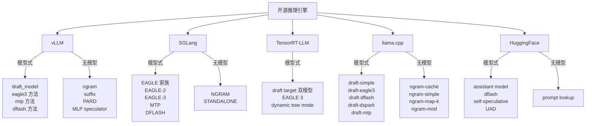

# 04 开源推理引擎支持矩阵

> 系列文档：投机解码（Speculative Decoding）业内现状
> 上一篇：[03 EAGLE 家族详解](03-eagle-family-deep-dive.md) | 下一篇：[05 生产部署实战](05-production-deployment.md)

---

## 1. 为什么需要引擎支持矩阵

前面三篇回答的是"**有什么方法、原理如何**"；本文回答"**方法落在哪个引擎里、怎么打开开关**"。决定一个投机解码方案能否落地，往往不取决于论文多漂亮，而取决于：

1. **推理引擎是否实现**了你选定的算法（EAGLE-3 / MTP / n-gram / 独立 draft model）；
2. **配置入口**是否顺手（命令行 flag、JSON 配置、Python API）；
3. **draft 模型从哪来**（官方预训练权重、外部 HF 仓库、还是引擎自带训练脚本）；
4. **运行时约束**是什么（是否支持 batch、采样模式、词汇表要求）。

本文盘点 2026 年中期的五家主流开源引擎：**vLLM、SGLang、TensorRT-LLM、llama.cpp、HuggingFace Transformers**。所有 CLI 参数以官方文档为准，标注检索时间与版本号。

---

## 2. 全景对比表

| 引擎 | 定位 | 草稿来源 | 核心算法支持 | 配置入口 | 运行时约束 |
|---|---|---|---|---|---|
| **vLLM** | 生产级服务化推理 | draft model / 自投机 / 无模型 | draft_model、mtp、eagle3、dflash、ngram、suffix、PARD、MLP speculator、自定义 proposer | `--speculative-config` JSON | 支持动态投机与自适应验证 |
| **SGLang** | 生产级服务化推理 | draft model / 自投机 / 无模型 | EAGLE-2 / EAGLE-3、MTP、DFLASH、STANDALONE、NGRAM | `--speculative-algorithm` 等 | 官方文档推荐 EAGLE-3；FR-Spec 等 token map 微调 |
| **TensorRT-LLM** | NVIDIA 平台推理 | draft model（EAGLE 系） | draft/target 双模型、EAGLE 3、dynamic tree mode | `DraftTargetDecodingConfig` | 明确注明仅低 batch 有加速 |
| **llama.cpp** | 本地 / 边缘推理 | draft model / 自投机 / 无模型 | draft-simple、draft-eagle3、draft-dflash、draft-dspark、draft-mtp、ngram-* 系列 | `--spec-type` + `--spec-draft-*` | CPU/Metal/CUDA 通用，量化友好 |
| **HuggingFace** | 研究与实验 | assistant model / 自投机 / 无模型 | assisted decoding、prompt lookup、self-speculative、dflash、UAD | `generate()` 命名参数 | 不支持 batch 输入；需同一 tokenizer |

> 位置提示：vLLM 与 SGLang 是"**服务化大模型推理**"的主战场，也是 EAGLE 系落地最充分的两个引擎；TensorRT-LLM 绑定 NVIDIA 生态；llama.cpp 是本地单机/边缘场景的事实标准；HuggingFace 的价值在研究与快速原型。

---

## 3. vLLM

### 3.1 算法支持

vLLM 的投机解码文档 [1](https://docs.vllm.ai/en/latest/features/speculative_decoding.html) 覆盖了业界主要方案类别：

- **独立 draft model**（`draft_model`）：用一个小模型做草稿，最通用；
- **EAGLE-3**（`eagle3`）：读取目标模型 hidden state 的草稿头（见 [03 §4](03-eagle-family-deep-dive.md)）；
- **MTP**（`mtp`）：主模型自带 multi-token prediction 头（DeepSeek-V3 路线，见 [03 §6](03-eagle-family-deep-dive.md)）；
- **DFlash**（`dflash`）：块级扩散草稿（block diffusion）；
- **无模型方案**：n-gram、suffix 匹配；
- **其他**：PARD（并行联想解码）、MLP speculator、自定义 proposer。

vLLM 还支持**动态投机解码（dynamic speculative decoding）**与**自适应验证（adaptive verification）**，在运行期根据草稿质量动态调整投机长度——与前一篇 [06 §4 Together ATLAS](06-industry-practice.md) 的"自适应"思路同源，但位于单请求级。

### 3.2 配置方式

新版本统一收敛到 `--speculative-config`（JSON 字符串），核心键为：

```
method:     投机方法（draft_model / mtp / eagle3 / dflash 等）
model:      draft 模型识别符（HF 仓库名或本地路径）
num_speculative_tokens:  每次验证最多投机 token 数
```

> 版本提示：vLLM 的 flag 与 JSON 键名随版本演进较快，本文键名依据 2026 年最新官方文档；落地前请以 `vllm serve --help` 输出为准。

### 3.3 最小示例

```bash
# 独立 draft model 方案
vllm serve {目标模型} \
  --speculative-config '{"method": "draft_model", "model": "{draft模型HF名或路径}", "num_speculative_tokens": 5}'

# EAGLE-3 方案（以 EAGLE-3 官方权重为例，model 指向对应 HF 仓库）
vllm serve {目标模型} \
  --speculative-config '{"method": "eagle3", "model": "{eagle3草稿头HF名}", "num_speculative_tokens": 5}'
```

---

## 4. SGLang

### 4.1 算法支持

SGLang 投机解码支持 [2](https://docs.sglang.ai/advanced_features/speculative_decoding) 四类：

- **EAGLE 家族**：EAGLE、EAGLE-2、EAGLE-3（官方文档推荐 EAGLE-3）；
- **MTP**：主模型自带多 token 预测头；
- **DFLASH**：块扩散草稿；
- **NGRAM**：无模型 n-gram 方案；
- **STANDALONE**：独立 draft model 方案。

### 4.2 配置方式

SGLang 以命令行 flag 注入，常用项 [2](https://docs.sglang.ai/advanced_features/speculative_decoding)：

```
--speculative-algorithm          投机算法（EAGLE / EAGLE-2 / EAGLE-3 / MTP / DFLASH / NGRAM / STANDALONE）
--speculative-draft-model-path   外部 draft 模型路径（EAGLE 系与 STANDALONE 使用，支持 HF 仓库名）
--speculative-eagle-topk         EAGLE 系候选 top-k
--speculative-token-map          自定义 token map（如 FR-Spec 等对 token 分组的改进）
```

### 4.3 最小示例

```bash
python -m sglang.launch_server --model {目标模型} \
  --speculative-algorithm EAGLE3 \
  --speculative-draft-model-path {EAGLE3 草稿头 HF 仓库名}

# 无模型方案：n-gram
python -m sglang.launch_server --model {目标模型} \
  --speculative-algorithm NGRAM
```

---

## 5. TensorRT-LLM

### 5.1 算法支持

TensorRT-LLM 的投机解码文档 [3](https://nvidia.github.io/TensorRT-LLM/latest/features/speculative-decoding.html) 聚焦 NVIDIA 平台：

- **draft / target 双模型**：任意小模型作草稿 + 大模型验证；
- **EAGLE 3**：官方支持，且为 **Llama 3.1/4 系提供预构建 EAGLE-3 checkpoint**（如 `yuhuili/EAGLE3-LLaMA3.1-Instruct-8B`）；
- **Llama4 Maverick 官方方案**：NVIDIA 发布 Maverick 专用投机解码 checkpoint；
- **dynamic tree mode**：动态树状草稿路径，提升接受率。

### 5.2 配置方式

Python 侧通过 `DraftTargetDecodingConfig` 注入，核心参数 [3](https://nvidia.github.io/TensorRT-LLM/latest/features/speculative-decoding.html)：

```python
DraftTargetDecodingConfig(
    max_draft_len=3,                            # 每次验证最多投机 token 数
    speculative_model="yuhuili/EAGLE3-LLaMA3.1-Instruct-8B",  # draft 模型
)
```

### 5.3 明确的约束

官方文档明示：**投机解码的收益仅在低 batch 场景显著**；batch 增大后验证开销反超（与 [05 §2](05-production-deployment.md) 的"bs≥32 反超"结论一致）。部署前应对目标 batch 档位做基准测试。

---

## 6. llama.cpp

### 6.1 算法支持（2026-04 重构后）

llama.cpp 是本地推理引擎里投机解码算法覆盖最广的实现 [4](https://github.com/ggml-org/llama.cpp/blob/master/docs/speculative.md)。2026-04 的 CLI 重构（PR #22397 / #22539，由 ggerganov 完成）引入了统一开关 `--spec-type`（逗号分隔可混合多种方案），支持的方案：

| `--spec-type` 取值 | 方案类型 | 草稿来源 |
|---|---|---|
| `draft-simple` | 独立小模型 | 外部 gguf 草稿模型 |
| `draft-eagle3` | EAGLE-3 | 读取目标模型 hidden state |
| `draft-dflash` | DFlash | 块级扩散，一次产出整块 token |
| `draft-dspark` | DSpark | DFlash 骨干 + 半自回归 Markov 头 |
| `draft-mtp` | MTP | 主模型自带的 multi-token prediction 头 |
| `ngram-cache` / `ngram-simple` / `ngram-map-k` / `ngram-map-k4v` / `ngram-mod` | 无模型 | 基于缓存或 n-gram 匹配 |

> 迁移提示：旧版参数 `--draft-max` / `--draft-min` 在 2026-04 重构中更名为 `--spec-draft-n-max` / `--spec-draft-n-min`；通用 `--spec-ngram-size-n/m` 拆分为各 ngram 方案的独立参数 [5](https://github.com/ggml-org/llama.cpp/pull/22539)。

### 6.2 关键参数

| 参数 | 说明 | 默认值 |
|---|---|---|
| `--spec-draft-model, -md, --model-draft FNAME` | 草稿模型本地路径 | unused |
| `--spec-draft-hf, -hfd, -hfrd, --hf-repo-draft <user>/<model>[:quant]` | 直接按 HF 仓库拉取草稿模型 | — |
| `--spec-draft-n-max N` | 每次最多草稿 token 数 | 3 |
| `--spec-draft-n-min N` | 最少草稿 token 数 | 0 |
| `--spec-draft-p-split P` | 投机解码拆分概率 | 0.10 |
| `--spec-draft-p-min P` | 贪婪模式下最低投机概率 | 0.00 |

### 6.3 最小示例

```bash
# 独立小模型草稿
llama-server -m {目标模型}.gguf \
  --spec-type draft-simple \
  --spec-draft-model {草稿模型}.gguf \
  --spec-draft-n-max 5

# EAGLE-3：直接从 HF 拉权重 + 目标 gguf
llama-server -m {目标模型}.gguf \
  --spec-type draft-eagle3 \
  --spec-draft-hf {EAGLE3 草稿头 HF 仓库}:{quant}

# 零模型 n-gram
llama-server -m {目标模型}.gguf \
  --spec-type ngram-simple
```

> llama.cpp 支持将"模型式"与"无模型"方案**混合**（`--spec-type draft-eagle3,ngram-simple`），这是其他引擎少有的自由度。

---

## 7. HuggingFace Transformers

### 7.1 定位

Transformers 的 assisted decoding 文档 [6](https://huggingface.co/docs/transformers/en/assisted_decoding) 定位是"**研究友好、API 最简**"：不追求服务化吞吐，而是在 `generate()` 上一行开启。注意约束：**不支持 batch 输入**，仅支持 greedy 与采样；且草稿模型必须与主模型**使用完全相同的 tokenizer**。

### 7.2 三种基础形态

```python
from transformers import AutoModelForCausalLM, AutoTokenizer

tokenizer = AutoTokenizer.from_pretrained("{目标模型}")
model = AutoModelForCausalLM.from_pretrained("{目标模型}")
assistant_model = AutoModelForCausalLM.from_pretrained("{远小于目标的草稿模型}")

inputs = tokenizer("Hugging Face is an open-source company", return_tensors="pt")

# 1) 投机解码：独立 assistant model
outputs = model.generate(**inputs, assistant_model=assistant_model)

# 2) prompt lookup：无模型，从 prompt 中复制重叠 n-gram
outputs = model.generate(**inputs, prompt_lookup_num_tokens=5)

# 3) 静态集成验证：以混合分布验证，接受率更高（牺牲严格无损）
outputs = model.generate(**inputs, assistant_model=assistant_model,
                        assistant_ensemble_weight=0.7, do_sample=True)
```

### 7.3 进阶参数与机制 [6](https://huggingface.co/docs/transformers/en/assisted_decoding) [7](https://huggingface.co/docs/transformers/en/main_classes/text_generation)

| 参数 | 机制 | 说明 |
|---|---|---|
| `num_assistant_tokens` | 每轮草稿长度 | 默认 5；越大越投机 |
| `num_assistant_tokens_schedule` | 动态调整草稿长度 | `"heuristic"`：全部命中 +2、否则 -1；`"heuristic_transient"` 每轮重置；`"constant"` 固定 |
| `assistant_confidence_threshold` | 置信度早停 | 草稿对当前 token 置信度低于阈值即提前结束本轮——即 Dynamic Speculation Lookahead 的无监督版本 |
| `assistant_ensemble_weight` | 静态集成验证 | 以 `w·p_target + (1−w)·q_draft` 混合分布验证；推荐起始 0.7；需要草稿返回 logits，故兼容 prompt lookup |
| `assistant_tokenizer` | UAD | 与 `tokenizer`/`assistant_model` 搭配启用 UAD（Unsupervised Assisted Decoding），**免去词汇表对齐** |
| `assistant_early_exit` | 自投机 | 使用主模型中间层输出做草稿（self-speculative / LayerSkip 路线） |
| `speculation_type` | 草稿算法 | 接受值含 `dflash`（块扩散草稿） |

> 静态集成验证的论文链接见 [8](https://arxiv.org/abs/2604.07622)（DIVERSED，arXiv 核验）。它放弃"输出分布与 target 严格一致"的保证、换取更高接受率——这一"降低无损性换取速度"的取舍在 [08 未来方向](08-future-directions.md) 中会进一步展开。

### 7.4 与 DeepSeek-V3 MTP 的联动

除通用 assisted decoding 外，Transformers 还原生支持 DeepSeek-V3 的 `num_mtp_layers` 与 `generate(..., use_mtp=True)`——主模型自带 MTP 头，无需外部草稿模型，也天然免去词汇表对齐 [9](https://huggingface.co/docs/transformers/main/model_doc/deepseek_v3)。细节见 [06 §2](06-industry-practice.md)。

---

## 8. 支持矩阵全景图



**跨引擎规律：**

1. **EAGLE-3 已事实标准**：五家引擎全部支持（vLLM `eagle3` / SGLang `EAGLE3` / TRT-LLM / llama.cpp `draft-eagle3` / HF 经 EA 权重），draft 权重大多可从官方或社区 HF 仓库获取；
2. **MTP 随主模型分发**：vLLM 与 llama.cpp 已支持 `mtp` 方法，加上 HF 的 `use_mtp=True`——DeepSeek-V3 开创的内建投机路线（[06 §2](06-industry-practice.md)）生态逐渐齐备；
3. **n-gram 无模型方案全线普及**：vLLM / SGLang / llama.cpp / HF prompt-lookup，代价是仅适用强复用文本（摘要、代码延续）；
4. **运行时约束因定位而异**：HF 不支持 batch、TRT-LLM 明示低 batch 才有收益、llama.cpp 针对量化与本地场景——**选引擎先选场景**。

---

## 9. 引擎选型建议

| 你的场景 | 首选引擎 | 首选方案 | 理由 |
|---|---|---|---|
| 大规模服务化、高并发 | vLLM 或 SGLang | EAGLE-3 / MTP | 生产级调度、成熟 batch/动态投机 |
| NVIDIA 集群、封闭式部署 | TensorRT-LLM | EAGLE-3（官方 checkpoint） | 官方 Llama 权重配套、图优化极致 |
| 本地笔记本 / 边缘设备 | llama.cpp | draft-simple 或 ngram | 量化 + CPU/Metal 兼容、配置最全 |
| 研究与快速原型 | HuggingFace | assistant_model / prompt_lookup | 一行开启、无需服务化 |
| 代码/文档续写类强复用负载 | 任意（vLLM/SGLang/llama.cpp） | n-gram / prompt lookup | 零额外模型成本 [02 §5](02-core-methods.md) |

> 注意：**"引擎支持"不等于"你的负载有收益"**。加速比是否兑现取决于 batch、并发、序列长度与草稿质量——这层落差与度量方法见 [05 生产部署实战](05-production-deployment.md) 与 [07 性能评测与选型权衡](07-benchmarks-and-tradeoffs.md)。

---

## 10. 小结

- vLLM 与 SGLang 是服务化主战场，EAGLE-3 与 MTP 覆盖最完整；vLLM 靠统一 JSON 配置，SGLang 靠命令行 flag。
- TensorRT-LLM 绑定 NVIDIA 且官方配套 EAGLE-3 checkpoint，但低 batch 收益边界需实测。
- llama.cpp 以 `--spec-type` 开阔支持的算法谱系最广（含 DFlash/DSpark 等块扩散方案），并可混合模型式与无模型方案。
- HuggingFace 以 `generate()` 一行 API 提供研究最快的入口，代价是不支持 batch；其静态集成验证是"以严格无损换速度"的前沿尝试。
- 引擎支持矩阵只回答"**能不能开**"；"**开了值不值**"要看 [05](05-production-deployment.md) 的收益落差与 [07](07-benchmarks-and-tradeoffs.md) 的权衡框架。

下一篇：[05 生产部署实战](05-production-deployment.md)。

---

### 参考文献

1. vLLM. *Speculative Decoding — vLLM Documentation*. https://docs.vllm.ai/en/latest/features/speculative_decoding.html （检索于 2026-08-30）
2. SGLang. *Speculative Decoding — SGLang Documentation*. https://docs.sglang.ai/advanced_features/speculative_decoding （检索于 2026-08-30）
3. NVIDIA. *Speculative Decoding — TensorRT-LLM Documentation*. https://nvidia.github.io/TensorRT-LLM/latest/features/speculative-decoding.html （检索于 2026-08-30）
4. ggml-org. *llama.cpp docs/speculative.md*（`--spec-type` / `--spec-draft-*` 参数表）. https://github.com/ggml-org/llama.cpp/blob/master/docs/speculative.md （检索于 2026-08-30）
5. ggerganov et al. *docs: update speculative decoding parameters after refactor (PR #22539)*. https://github.com/ggml-org/llama.cpp/pull/22539 （2026-04-30）
6. HuggingFace. *Assisted decoding — Transformers Documentation*. https://huggingface.co/docs/transformers/en/assisted_decoding （检索于 2026-08-30）
7. HuggingFace. *Generation — Transformers Documentation*（`num_assistant_tokens` / `assistant_confidence_threshold` / `assistant_ensemble_weight` 等参数）. https://huggingface.co/docs/transformers/en/main_classes/text_generation （检索于 2026-08-30）
8. *DIVERSED: Relaxed Speculative Decoding via Dynamic Ensemble Verification*. https://arxiv.org/abs/2604.07622 （经 HF `assistant_ensemble_weight` 文档引用并 arXiv 核验）
9. HuggingFace. *DeepSeek-V3 — Transformers Documentation*（`num_mtp_layers` / `use_mtp`）. https://huggingface.co/docs/transformers/main/model_doc/deepseek_v3 （检索于 2026-08-30）