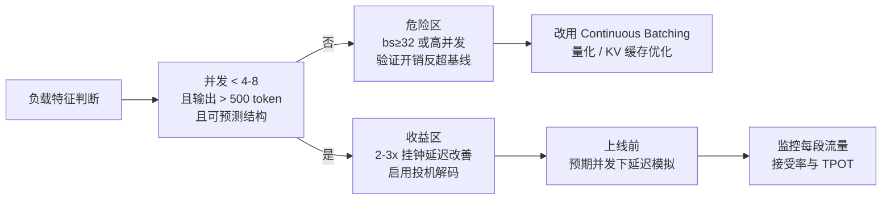

# 05 生产部署实战：免费 Token 与隐藏陷阱

> 系列文档：投机解码（Speculative Decoding）业内现状
> 上一篇：[03 EAGLE 家族深度解析](03-eagle-family-deep-dive.md) | 下一篇：[06 业界实践](06-industry-practice.md)

---

## 1. 一个绕不开的事实：实验室到生产的 40–60% 落差

大多数 LLM 推理瓶颈归结于一个令人不安的事实：**GPU 在等待内存带宽，而非计算资源**。每生成一个 token，都需要从 HBM 加载整个模型的权重，这一传输过程主导了运行时间。投机解码正是利用这一空隙设计的——但它的收益取决于你的基准测试**几乎肯定没有测试过的条件**。

把投机解码部署到生产环境的团队，往往发现其实际表现比实验室数据**低 40–60%**[1](https://tianpan.co/zh/blog/2026-04-17-speculative-decoding-production-hidden-traps)。这不是该技术存在缺陷，而是因为**工作负载特征以重要的方式发生了变化**：更大的批量、更短的输出、更严格的输出约束。理解投机解码何时真正有效、何时会悄然造成伤害，是负责任部署的前提。

> **类比（直觉先行）**
> 投机解码就像在机场开了一条"快速安检通道"：让一个小而快的模型（草稿）先快速办理 K 位旅客（候选 token），再让大模型一次性并行复核。在客流低峰（小 batch）时，复核整批人的成本约等于复核一个人——收益巨大。但在客流高峰（大 batch）时，复核通道本身就成了瓶颈，反而拖慢所有人。

---

## 2. 机制回顾：为什么"验证整段 ≈ 验证一个"

草稿模型生成 K 个候选 token（通常 **5–7** 个），目标模型在**单次前向传播中并行验证全部 K 个**[2](https://tianpan.co/zh/blog/2026-04-12-speculative-decoding-in-practice-the-free-lunch-that-isnt-free)。目标模型依次检查每个候选：若草稿 token $i$ 与目标模型本应选择的一致，则接受并继续验证 $i+1$；在首次不匹配处（位置 $j$），目标模型为位置 $j$ 提供正确 token，草稿循环重新开始。任何被接受的前缀——哪怕是部分前缀——都比用目标模型逐个顺序生成这些 token 成本更低。

单次目标前向的成本 ≈ 生成一个 token 的成本，因为**瓶颈在于从内存加载权重，而非计算本身**。设单步接受概率为 $\alpha$（符号约定见 [02 核心技术原理](02-core-methods.md)），草稿长度 $\gamma$，则每轮验证中预期接受的草稿 token 数（沿用 02 中 $\tau$ 的推导）：

$$\mathbb{E}[X] = \frac{1-\alpha^{\gamma+1}}{1-\alpha}$$

当 α = 0.8、γ = 5 时，每轮平均接受约 **4.5** 个 token [2](https://tianpan.co/zh/blog/2026-04-12-speculative-decoding-in-practice-the-free-lunch-that-isnt-free)——昂贵的"逐 token 前向"次数减少了 4.5 倍。

**输出保证是这一机制的核心价值**：数学上可以证明，最终 token 序列与目标模型单独生成的结果**完全相同**——没有近似，没有质量损失 [1](https://tianpan.co/zh/blog/2026-04-17-speculative-decoding-production-hidden-traps)。但注意：这个保证约束的是"离开推理引擎的字节"，而**不是用户屏幕上先出现又被撤回的字节**（详见第 6 节的协议层陷阱）[3](https://tianpan.co/zh/blog/2026-04-27-speculative-decoding-streaming-protocol-decision)。

---

## 3. 收益为何打折扣：吞吐与挂钟延迟的分歧

### 3.1 你的基准测的是什么

已发布的生产级数字（注意测量条件）：

| 来源 | 任务 | 加速 |
|---|---|---|
| vLLM + prompt-lookup（无辅助模型） | CNN/DailyMail 摘要 | **2.8×** |
| TensorRT-LLM（NVIDIA H200） | 吞吐量 | 最高 **3.6×** |
| AWS Trainium（解码密集负载） | 吞吐量 | 最高 **3×** |
| EAGLE-3 草稿模型 | 相对朴素自回归 | **3.0–6.5×** |

这些数字是真实的——**但它们是在 batch size 1–4、长输出、高接受率的条件下测得的**。这正是投机解码设计发挥的场景 [1](https://tianpan.co/zh/blog/2026-04-17-speculative-decoding-production-hidden-traps)。

**接受率（α）是核心变量**：α = 0.6 时，5 个投机 token 可获约 **2.4×** 加速；α = 0.8 时加速达 **3.7×**；α 低于 **0.5** 时，验证开销超过收益，速度反而慢于基线 [1](https://tianpan.co/zh/blog/2026-04-17-speculative-decoding-production-hidden-traps)。更保守的工程经验是阈值在 **0.55–0.60** 附近，低于此值验证开销吞噬并行收益 [2](https://tianpan.co/zh/blog/2026-04-12-speculative-decoding-in-practice-the-free-lunch-that-isnt-free)。

### 3.2 指标分歧：吞吐量 ≠ 挂钟延迟

大多数投机解码评估衡量的是 **token 吞吐量**（每秒跨批次生成的 token 数）；你的用户体验到的是 **挂钟延迟**（从请求到最后一个 token 的时间）。**这两个指标恰恰在批量增大时出现分歧** [1](https://tianpan.co/zh/blog/2026-04-17-speculative-decoding-production-hidden-traps)：

| 批量区间 | GPU 状态 | 投机解码表现 |
|---|---|---|
| **bs 1–10** | memory-bound（权重搬运主导） | **2–3× 加速，最佳区间** |
| **bs 10–30** | 过渡 | 收益递减，通常 **1.3–1.8×** |
| **bs ≥ 32** | compute-bound（计算主导） | **通常比标准解码更慢** |

机制：批量大小为 1 时，GPU 受内存带宽限制，每次目标模型传播生成更多 token 确实更快；批量 32+ 时，GPU 受计算限制。**验证开销随批量增大**——目标模型必须同时处理整个批次 × K 个投机 token，单个请求的延迟实际上可能增加 [1](https://tianpan.co/zh/blog/2026-04-17-speculative-decoding-production-hidden-traps)[2](https://tianpan.co/zh/blog/2026-04-12-speculative-decoding-in-practice-the-free-lunch-that-isnt-free)。

### 3.3 并发红绿灯

转折点因 GPU 和模型大小而异，但粗略来说：**当并发请求数低于 4–8 时，投机解码有助于降低挂钟延迟；超过这个数字，投机带来的收益即被规模化验证开销抵消** [1](https://tianpan.co/zh/blog/2026-04-17-speculative-decoding-production-hidden-traps)。

这解释了一种常见的失败模式：团队在开发阶段以 batch size 1 评估投机解码，看到 **2.5×** 加速，随即上线——然后在生产环境中观察到 **5% 的回归**，因为 p50 并发数为 16。该技术完全按照描述运行，但**工作负载变了** [1](https://tianpan.co/zh/blog/2026-04-17-speculative-decoding-production-hidden-traps)。

---

## 4. 硬性前置条件与草稿选型

### 4.1 词汇表一致性：不可妥协的硬约束

**草稿模型必须与目标模型共享完全相同的分词器和词汇表。** 这是硬性约束。词汇表不匹配会导致**接受率崩溃至接近零**，使投机解码比基线更慢，且不会有任何明显的警告信号——只有性能指标下降 [1](https://tianpan.co/zh/blog/2026-04-17-speculative-decoding-production-hidden-traps)。

> **工程含义**
> 同族模型（如 Llama 3.2-1B 为 Llama 3.1-70B 起草）共享 tokenization 与训练分布，接受率显著高于任意同规模小模型 [2](https://tianpan.co/zh/blog/2026-04-12-speculative-decoding-in-practice-the-free-lunch-that-isnt-free)。任何目标模型的分词器变更，都要求**重训草稿模型** [1](https://tianpan.co/zh/blog/2026-04-17-speculative-decoding-production-hidden-traps)。

### 4.2 草稿选型的反直觉结论

- **延迟 > 精确度**：最近的大规模基准揭示，草稿模型的语言建模准确度（困惑度）与其对投机解码吞吐量的贡献**几乎没有相关性**。草稿模型的**延迟**才是端到端加速的更强决定因素——一个稍不精确但快 3 倍的模式会胜出，因为验证步骤本来就会捕获错误 [2](https://tianpan.co/zh/blog/2026-04-12-speculative-decoding-in-practice-the-free-lunch-that-isnt-free)。
- **面积建议**：草稿规模应为目标的 **1/10 到 1/50**。1.5B 草稿配 13B 目标是常见起点；7B 草稿配 70B 目标。最优规模取决于**任务分布**，而非原始参数量 [1](https://tianpan.co/zh/blog/2026-04-17-speculative-decoding-production-hidden-traps)[2](https://tianpan.co/zh/blog/2026-04-12-speculative-decoding-in-practice-the-free-lunch-that-isnt-free)。
- **领域特异性 > 规模**：现成草稿模型在特定领域任务或超长上下文上表现不佳。在生产查询分布上微调草稿可将接受率提高 **20–40%**；对话/指令/代码平衡的数据混合比单纯扩大数据集对草稿质量影响更大 [2](https://tianpan.co/zh/blog/2026-04-12-speculative-decoding-in-practice-the-free-lunch-that-isnt-free)。
- **EAGLE 系 > 独立小模型**：专门训练为基于目标隐藏状态预测的草稿模型（EAGLE、EAGLE-2、EAGLE-3）在相同词汇表条件下**始终优于**独立训练的小模型。EAGLE-3 在所有生成位置保持 **70–80%** 的接受率，而朴素草稿模型因误差积累，在更长位置处接受率下降 [1](https://tianpan.co/zh/blog/2026-04-17-speculative-decoding-production-hidden-traps)。

---

## 5. 三类生产陷阱与缓解

### 5.1 结构化输出损坏

投机解码与推理解析器及结构化输出约束（**JSON schema、正则文法**）结合时，**批量验证过程中 token 可能被悄然丢弃**，约束执行无法正确完成。这在 vLLM 中有文档记录，影响所有将投机解码与约束生成结合的 workflow。

> **缓解**：对约束生成路径**完全禁用投机解码** [1](https://tianpan.co/zh/blog/2026-04-17-speculative-decoding-production-hidden-traps)。

### 5.2 参差张量错位（ragged tensor misalignment）

在批量推理中，批次内不同序列接受的投机 token 数量不同，产生 GPU 并行处理能力较差的**错位张量形状**（ragged tensor problem）。朴素实现可能以不可忽视的概率**悄然产生错误输出**；较新的实现（2025 年）解决了对齐问题，但代价是降低加速效果的性能成本 [1](https://tianpan.co/zh/blog/2026-04-17-speculative-decoding-production-hidden-traps)[4](https://oh-bug.com/zh/posts/batch-speculative-decoding-production-llm-inference/)。

症状清单（这些错误未必在 bs=1 暴露，bs>1 后迅速放大）[4](https://oh-bug.com/zh/posts/batch-speculative-decoding-production-llm-inference/)：

- position IDs 错位
- attention mask 覆盖错误
- KV-cache 中 token 与位置不匹配
- 被拒绝 token 未正确 rollback
- 输出出现重复 token、乱码或分布偏移

一个接近生产环境的 batch 投机流程应当包含完整的**状态同步链**：Scheduler 收集活跃请求 → 草稿机制逐序列提出候选 → 目标模型并行验证（各序列接受不同前缀）→ 被拒 token 回滚 → **position IDs 重算 → attention masks 重建 → KV-cache shift/trim/realign** → 构造下一个有效 batch。第 6–8 步是正确性核心；跳过的系统可能吞吐很高，但该吞吐不再代表有效推理能力 [4](https://oh-bug.com/zh/posts/batch-speculative-decoding-production-llm-inference/)。

### 5.3 MoE 路由崩溃

混合专家模型通过不同专家子网络路由 token。**草稿模型和目标模型可能将同一 token 路由到不同专家**，这完全破坏了接受率的数学原理。MoE 架构上的投机解码**通常比基线表现更差**。如果你的服务栈使用 MoE 模型（Mixtral、DeepSeek-MoE 或类似模型），在确定架构方向前**务必实测接受率** [1](https://tianpan.co/zh/blog/2026-04-17-speculative-decoding-production-hidden-traps)。

> ⚠️ 注意：DeepSeek-V3 是个特例——它的 MTP 模块是与主干联合训练的、基于特征的自投机方案，不依赖外部草稿模型的路由一致性（见 [03](03-eagle-family-deep-dive.md) 与 [06](06-industry-practice.md)）。

---

## 6. 被忽略的隐性成本

### 6.1 内存与运维

- **草稿模型状态**在 H100 上增加 **10–20 GB** GPU 内存用量 [1](https://tianpan.co/zh/blog/2026-04-17-speculative-decoding-production-hidden-traps)。
- 需要对**两个模型**进行版本管理、测试和同步更新——目标模型的任何分词器变更都需要重新训练草稿模型。
- **KV 缓存管理更复杂**：草稿与目标模型都维护独立的 KV 状态，必须在请求间保持同步。
- 运维不是"一次设置就忘掉"：需要选择草稿、监控每个流量段的接受率，并在新请求分布导致接受率下降时调试性能退化 [1](https://tianpan.co/zh/blog/2026-04-17-speculative-decoding-production-hidden-traps)。

### 6.2 评估盲区：不能只看 tokens/s

batch 投机解码至少需要同时看 **7 类指标**，而非单个吞吐量 [4](https://oh-bug.com/zh/posts/batch-speculative-decoding-production-llm-inference/)：

| 类别 | 指标 | 作用 |
|---|---|---|
| 接受质量 | 每轮平均接受 draft token 数（acceptance length） | 接受越多，目标前向次数越少 |
| 草稿成本 | draft 计算/延迟 | 草稿太慢则整体不一定变快 |
| 用户体验 | **ITL（inter-token latency）**、TTFT | 响应交互感的核心；投机无法改善 TTFT |
| 系统开销 | 对齐开销（bs 增大非线性增长） | 理解 batch 扩大后的收益侵蚀 |
| 缓存健康 | **KV-cache fragmentation**（投机产生大量短候选序列，page 过大造成内部碎片） | 影响实际可用缓存容量 |
| 正确性 | 输出等价性（bs>1 时机分布一致） | 先证明正确，再证明更快 |

监控建议：记录 accepted token count / rollback count、KV-cache block move / trim 次数、page fragmentation ratio、cache hit rate、attention mask rebuild cost 与 position ID recompute cost [4](https://oh-bug.com/zh/posts/batch-speculative-decoding-production-llm-inference/)。

---

## 7. 何时该用、何时不该用：决策清单

**投机解码在一套特定但重要的条件下才是正确工具** [1](https://tianpan.co/zh/blog/2026-04-17-speculative-decoding-production-hidden-traps)：

- [ ] 服务工作负载**延迟敏感**且主要**交互式**（批量 1–4）
- [ ] 输出序列**较长**（>500 token）——生成越长，投机的数学越有利
- [ ] 任务具有**可预测结构**（摘要、代码补全、高 n-gram 重叠的续写任务）
- [ ] 运行在**单 GPU 或小型集群**上，内存带宽而非计算是瓶颈
- [ ] 能承受维护草稿模型的工程成本

**如果以下任意一条成立，投机解码很可能不值得投入** [1](https://tianpan.co/zh/blog/2026-04-17-speculative-decoding-production-hidden-traps)[2](https://tianpan.co/zh/blog/2026-04-12-speculative-decoding-in-practice-the-free-lunch-that-isnt-free)：

- 优先级是**最大化批量工作负载的吞吐量**（已用大 batch 饱和 GPU）
- 目标是**改善首 token 时间**（投机解码解决不了）
- 典型输出**< 20 token**（没有足够生成量摊销草稿开销）
- **高温度创意生成**（分布难预测，接受率暴跌）
- **内存受限**部署（草稿权重 1–8 GB + KV cache + 验证张量挤占显存）
- **最小化运维复杂度**是首要目标

对于吞吐/延迟/运维那几个目标，量化、连续批处理和高效 KV 缓存管理通常能带来更可靠的收益 [1](https://tianpan.co/zh/blog/2026-04-17-speculative-decoding-production-hidden-traps)。

> **部署验收铁律**
> 先证明它是**正确**的投机解码（bs>1 输出等价 + 状态同步），再证明它是**更快**的投机解码（ITL/TTFT/吞吐/缓存碎片/对齐开销综合评估）[4](https://oh-bug.com/zh/posts/batch-speculative-decoding-production-llm-inference/)。伪测试结构：`for batch_size in [1,2,4,8]: baseline vs speculative, assert_equivalent_or_same_distribution`。

---

## 8. 协议层陷阱：被撤回的字节（衔接 08）

"完全一致的输出分布"并不等同于"完全一致的用户体验"。生产 EAGLE 类系统中接受率通常在 **60–80%**，但这是**逐 token**的、处于 4–8 token 的步长窗口内；在给定的投机窗口中**所有** token 都被接受的概率要低得多——而在长回复中**某个**投机窗口出现拒绝的概率几乎是 100% [3](https://tianpan.co/zh/blog/2026-04-27-speculative-decoding-streaming-protocol-decision)。

逐 token 推送时，被拒后缀必须撤回（"回退到位置 N"控制帧），客户端的文本组件会实时重写。量化该影响的新指标是**用户可见 Token 抖动（user-visible token churn）** = 流向客户端的总 token 数 ÷ 响应最终 token 数：纯逐 token 推送 + 70% 接受率下轻松达到 **1.3–1.5**（约 1/3 的网络字节在定稿前被回撤）。对 TTS 等不可回滚的消费端，这直接决定协议选型（accept-then-flush 还是句边界缓冲）[3](https://tianpan.co/zh/blog/2026-04-27-speculative-decoding-streaming-protocol-decision)。完整讨论见 [08 未来方向与开放问题](08-future-directions.md)。

---

## 9. 小结与衔接

- **实验室到生产的巨大落差源于工作负载迁移**：批量增大、输出变短、约束更严——投机解码在 memory-bound 的交互式低并发场景才真正发光。
- **红绿灯粗判**：并发 <4–8 利好；bs 10–30 收益递减；bs ≥32 通常慢于基线。指标要盯挂钟延迟而非纯吞吐。
- **三大陷阱**：结构化输出损坏（禁用约束路径投机）、参差张量错位（实现完整状态同步链）、MoE 路由崩溃（实测接受率）。
- **草稿选型反直觉**：草稿延迟比精度重要；EAGLE 系稳定保持 70–80% 接受率；词汇表一致性是硬约束。
- 面向生产的两大趋势：**自投机**（LayerSkip、Speculative Streaming）消除词汇表兼容问题与独立模型维护负担；**投机解码缩放定律（2025）**允许训练前预测最优草稿大小。EAGLE-3 长序列接受率稳定性表明实验室-生产差距正在缩小 [1](https://tianpan.co/zh/blog/2026-04-17-speculative-decoding-production-hidden-traps)。

下一篇：[06 业界实践](06-industry-practice.md)——DeepSeek / Meta / Together / 端侧的真实生产部署数据。

---

### 参考文献

1. Tian Pan. *投机解码在生产环境中的应用：免费Token 与隐藏陷阱*. https://tianpan.co/zh/blog/2026-04-17-speculative-decoding-production-hidden-traps （检索于 2026-08-30）
2. Tian Pan. *投机解码实战：那顿并非免费的午餐*. https://tianpan.co/zh/blog/2026-04-12-speculative-decoding-in-practice-the-free-lunch-that-isnt-free （检索于 2026-08-30）
3. Tian Pan. *投机采样（Speculative Decoding）是一项流式传输协议决策*. https://tianpan.co/zh/blog/2026-04-27-speculative-decoding-streaming-protocol-decision （检索于 2026-08-30）
4. AGI Explorer. *Batch Speculative Decoding：生产级 LLM 推理加速不能只看吞吐量*. https://oh-bug.com/zh/posts/batch-speculative-decoding-production-llm-inference/ （2026-06-25，检索于 2026-08-30）
5. 本系列 [02 核心技术原理与分类](02-core-methods.md)：接受率/加速比数学推导与符号约定