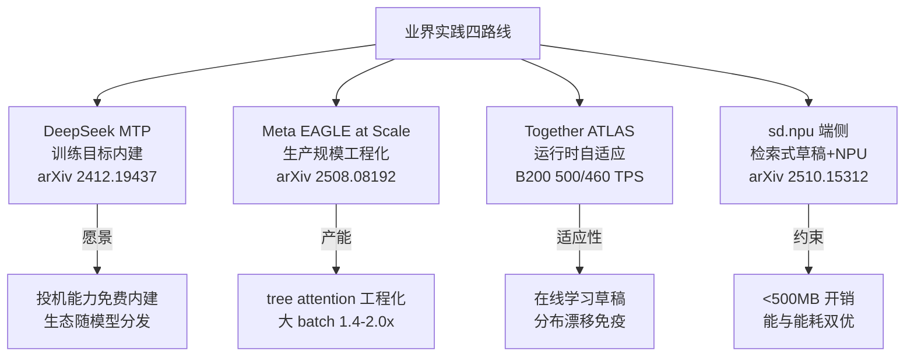

# 06 业界实践：DeepSeek / Meta / Together / 端侧部署

> 系列文档：投机解码（Speculative Decoding）业内现状
> 上一篇：[05 生产部署实战](05-production-deployment.md) | 下一篇：[07 性能评测与选型权衡](07-benchmarks-and-tradeoffs.md)

---

## 1. 为什么看业界实践

[05 生产部署实战](05-production-deployment.md) 说明了投机解码从实验室到生产的收益落差和技术陷阱。本文聚焦**谁在实际部署它、怎么做、拿到了什么数据**——这是判断一个技术"是否真的成熟"的最强信号。

2025 年的关键事实：投机解码不再是研究论文的自留地。**DeepSeek 把投机能力写进训练目标、Meta 把它推进到亿级用户服务的生产规模、Together AI 让它具备运行时自适应、学术团队把它搬上手机 NPU。** 四个方向代表了四种完全不同的工程哲学，也共同回答了同一个问题：投机解码在一线是什么状态。

---

## 2. DeepSeek-V3 MTP：投机能力内建训练目标（2024-12）

### 2.1 思路：让投机成为"免费"的训练副产品

DeepSeek-V3（671B 总参 / 37B 激活的 MoE）在预训练阶段引入 **Multi-Token Prediction (MTP) 目标**：每个位置按深度顺序预测后续 $D$ 个 token，保持完整因果链 [1](https://arxiv.org/abs/2412.19437)。MTP 模块的完整数学结构（第 $k$ 深度表示、投影矩阵 $M_k$、损失 $\mathcal{L}_{\text{MTP}} = \frac{\lambda}{D}\sum_k \mathcal{L}^k_{\text{MTP}}$）已在 [03 文档 §6](03-eagle-family-deep-dive.md) 详细推导，此处不重复。

**双用途设计**是它的核心工程贡献 [1](https://arxiv.org/abs/2412.19437)：

| 阶段 | MTP 模块的用途 |
|---|---|
| **训练期** | 辅助训练目标：密集化训练信号、提升主模型在基准上的表现（约 14B 额外模块参数参与训练） |
| **推理期** | 可丢弃 MTP 模块独立运行，也可**复用作投机解码**，进一步降低生成延迟 |

据报告，DeepSeek-V3 权重约 685B = 主模型 671B + MTP 模块 14B。

### 2.2 从论文到生态落地的信号

一个最直接的"内建投机"落地信号：HuggingFace `transformers` 已原生支持 DeepSeek-V3 的 `num_mtp_layers` 配置与 `generate(..., use_mtp=True)`，意味着**任意用户在标准库中即可开启投机解码**——不需要自己准备 EAGLE 草稿模型，也不需要考虑词汇表对齐问题（MTP 模块与主干天然共享分词器与词表）[2](https://huggingface.co/docs/transformers/main/model_doc/deepseek_v3)。

> **对生态的启示**
> MTP 方案把投机解码的**后勤成本（draft 训练、词汇表对齐、双模型版本管理）从"部署后"前移到"训练前"**。对开源界而言，凡是带 MTP 训练的模型族（DeepSeek-V3/R1 系），其后裔模型推出时天然附带投机能力——这正是 [08 未来方向](08-future-directions.md)中"训练-推理协同"范式的第一个量产案例。

---

## 3. Meta：EAGLE 推到生产规模（2025-08）

### 3.1 论文定位

《Efficient Speculative Decoding for Llama at Scale: Challenges and Solutions》（Bangsheng Tang, Carl Chengyan Fu, Fei Kou, 等 ~39 位作者，Meta，2025-08-11）系统阐述了把 **EAGLE 式投机解码**推到生产规模所必须解决的工程挑战——尤其是 GPU 上的 **tree attention** 与 **multi-round speculative decoding** 的高效实现 [3](https://arxiv.org/abs/2508.08192)。

### 3.2 关键数字

| 指标 | 数值 | 测量条件 |
|---|---|---|
| Llama4 Maverick 解码速度 | **约 4 ms/token** | bs=1，8×NVIDIA H100，比此前已知最优方法快 **10%** |
| 相对 vLLM（bs=1） | 解码速度提升 **10–30%** | Llama 各模型 + EAGLE，8×H100 |
| 大 batch 加速比（生产规模） | **1.4×–2.0×** | EAGLE 投机解码，大 batch |
| MT-Bench TPC（chain-like draft，temp=0，top-p=0.9） | Llama4-Maverick：**2.75@3**；Llama4-Scout：**2.87@3**；Llama3.3-70B：**2.94@3**；Llama3.1-8B：**2.78@3** | 投机长度 3 |

> 表格解读：TPC = tokens per compute（单位计算 token 数）。注意 Meta 用投机长度 3 就追平甚至超过了 EAGLE / EAGLE-3 在投机长度 7 下的表现——**训练侧优化的收益显著**。例如论文指出，改进后的 EAGLE（投机长度 3）就超过了原版 EAGLE 在投机长度 7 的 TPC [3](https://arxiv.org/abs/2508.08192)。

### 3.3 反直觉发现：batch 影响因模型而异

论文挑战了"投机加速比一定随 batch 增大而下降"的流行假设（此前 Su et al. 2023、Miao et al. 2024、Liu et al. 2024 均持此论）。关键洞见 [3](https://arxiv.org/abs/2508.08192)：

- **Llama3.1-8B**：大 batch 下反而获得**更大**的投机加速比；
- **Llama4 Maverick（约 400B 参数）**：加速比**随 batch 增大而下降**；
- **原因**：小 batch 时解码受内存带宽限制（compute amortized，草稿+验证的额外 FLOPs "免费"）；大 batch 时解码转 compute-bound。但**长上下文（large context）时，attention 主导计算，即使大 batch 也保持 memory-bound**（Sadhukhan et al., 2025）——因此 batch 与加速比的关系取决于模型规模与序列长度。

> **与 [05](05-production-deployment.md) 的呼应**
> 05 的"bs 1–10 收益区 / bs≥32 反超"是**粗粒度经验法则**；Meta 的数据说明**针对你的具体模型（规模、激活架构、典型序列长度）实测 batch-加速比曲线**才是唯一可靠的依据——尤其对 100B+ 级参数与长上下文负载。

### 3.4 工程要点

- **草稿模型量化几乎无损**：对 draft 的 FFN 做 BF16/FP8/INT4 量化，TPC 变化极小（Llama4-Maverick INT4 下 TPC 2.78 vs BF16 2.81），而草稿延迟随量化下降（如 Llama3.3-70B INT4：0.83 ms vs BF16 1.00 ms）[3](https://arxiv.org/abs/2508.08192)。
- **与开源库互补**：论文明确表示其优化是 vLLM / SGLang 的**补充**而非替代，可被集成以进一步提升已支持的投机解码方法 [3](https://arxiv.org/abs/2508.08192)。

---

## 4. Together AI：运行时自适应的 ATLAS（2025-10）

### 4.1 问题：静态 speculator 跟不上工作负载

Together AI 指出标准 speculator 的固有缺陷：**为通用工作负载训练，一旦线上请求分布漂移，收益就衰减**。其解法是 **ATLAS（AdapTive-LeArning Speculator System）**——首款"无手工调参、运行时自动变好"的 speculator 系统，它叠加在 Together Turbo 已有的 MoreSpeed 系（Turbo Speculator、Custom Speculators）之上 [4](https://www.together.ai/blog/adaptive-learning-speculator-system-atlas)。

### 4.2 关键数字（NVIDIA B200 上实测）

| 模型 | 完全自适应后 TPS | 对比 |
|---|---|---|
| DeepSeek-V3.1 | **最高 500 TPS** | 相对标准解码 **2.65×**（bs=1，4×B200，TP=4）；相对 FP8 基线 105 TPS 约 **4×（400%）** |
| Kimi-K2-0905 | **最高 460 TPS** | 相对标准解码 2.65×（TP=8） |

- **Kimi 案例**：Kimi 发布时不带现成 speculator，Together 的训练流水线快速训练并部署后，将 Kimi 从开箱约 **150 TPS** 提升到 **270+ TPS**（同硬件同 batch），且保持目标模型质量不变 [4](https://www.together.ai/blog/adaptive-learning-speculator-system-atlas)。
- **自适应机制**：控制器实时观察请求分布——当输入分布窄、输出高度重复历史 token 时，系统快速特化并**拉长 lookahead**，超越静态/一次性 custom speculator 能维持的 TPS。峰值效率场景下 DeepSeek 达 500 TPS（Arena-Hard 流量完全自适应）[4](https://www.together.ai/blog/adaptive-learning-speculator-system-atlas)。
- **叠加效应**：Together Turbo 优化套件按层叠加——FP4/FP8 量化约 +80% → 静态 Turbo Speculator 再 +80–100% → 自适应系统继续叠加，形成最高 400% 的累计提升 [5](https://venturebeat.com/data/together-ais-atlas-adaptive-speculator-delivers-400-inference-speedup-by)。

> **对选型的启示**
> ATLAS 证明：**"动态学习"是 speculator 的下一个竞争维度**。静态草稿（即使是定制训练的）在请求分布漂移面前会衰减；把 speculator 训练变成**持续的在线过程**是服务商级方案与自建方案的分水岭。这也为 [08](08-future-directions.md) 的"自适应/在线 speculator"方向提供了首个量产参考。

---

## 5. 端侧：sd.npu 让投机解码上手机 NPU（2025-10）

### 5.1 场景与核心矛盾

移动端上下文增强生成（CAG/RAG）——语音助手、UI agent、本地文档问答——是隐私敏感场景的刚需，但其**解码阶段占总延迟 67–74%**（OnePlus 13 实测，summary 基准）[6](https://arxiv.org/abs/2510.15312)。移动 NPU 已大幅加速 prefill，但 token-by-token 解码仍受两个硬约束掣肘：**NPU 计算图切换开销**（prefill 图 ↔ 解码图的静态图约束）与**解码期 memory-bound 导致的 NPU 利用率低下**。

### 5.2 sd.npu 的三个协同组件（北京大学 / 北邮）

sd.npu（运行于开源移动推理框架 mllm 之上）用**检索式投机解码（R-SD）**而非模型式草稿 [6](https://arxiv.org/abs/2510.15312)：

| 组件 | 作用 |
|---|---|
| **渐进式计算图调度** | chunked prefill 与解码图加载**流水线重叠**，掩蔽 prefill→decode 图切换开销，保证执行连续 |
| **上下文对齐草稿**（context-aligned drafting） | 基于输出 logits 做**轻量在线校准**，增强草稿与当前任务的分布对齐，提升投机效率 |
| **硬件高效草稿扩展** | 验证感知的草稿扩展：**约 38.5% 的被拒 token 在后续解码步骤中会变为有效**，据此回收被拒草稿中可复用片段并追加到新草稿，增大验证批量、推高 NPU 利用率 |

### 5.3 数据与对比

| 指标 | 数值 |
|---|---|
| 端到端加速 | **1.06–3.81×**（相对 vanilla 框架；相对已集成 SD 的框架 1.09–2.53×） |
| 解码阶段加速 | **5.25–8.15×**（解码延迟单独核算） |
| 能效 | **1.07–4.71×** 能耗下降（相对 NPU vanilla 1.35–4.18×） |
| 内存开销 | **< 500 MB**（测试设备：Redmi K60 Pro / Redmi K70 Pro / OnePlus 13；模型：Qwen2.5-0.5B/1.5B、Llama3.2-3B） |

**有意思的对比**：在移动端，sd.npu 优于 SAM（1.11–2.53×）与 **EAGLE（1.09–1.80×）**，且 EAGLE 在 Qwen2.5-0.5B 上**反而增加能耗**（额外的 drafter 计算放大能量开销，EAGLE 需 0.84–1.22 GB 额外内存）[6](https://arxiv.org/abs/2510.15312)。缩放规律：模型越小（memory-bound 越明显）收益越大（如 p 系列 0.5B/1.5B 显著优于 3B）；上下文相似度高的任务（摘要 1.41–3.80×）优于多样化问答。

> **数据中心 vs 端侧的架构分水岭**
> 云端方案（EAGLE/MTP/独立 draft）依赖"第二个可训练模型"并付出额外显存/内存；端侧受内存与算力上限约束，**检索式/NPU 原生草稿成为更优解**——这与 [07 评测与权衡](07-benchmarks-and-tradeoffs.md) 中"草稿成本必须打进加速比"的框架完全一致，只是约束更硬。

---

## 6. 四路实践的横向对比

| 维度 | DeepSeek MTP | Meta at Scale | Together ATLAS | sd.npu |
|---|---|---|---|---|
| 草稿来源 | 训练目标模块 | EAGLE（训练优化） | 训练 + 在线自适应 | 检索（无训练模型） |
| 立场 | 训练侧内建 | 推理侧工程化 | 服务侧商业化 | 端侧 NPU 原生 |
| 代表数字 | MTP≈14B 模块 | Maverick ~4ms/token；大 batch 1.4–2.0× | 500/460 TPS；2.65× | 3.81× 速度 / 4.71× 能效；<500MB |
| 关键工程点 | 双用途（训练+推理） | tree attention、多轮投机、量化草稿 | 请求分布感知、自适应 lookahead | 图切换流水线、在线校准、被拒 token 回收 |
| 词汇表约束 | 天然无（同源） | 需对齐（EAGLE） | 需对齐（speculator 训练） | 无（检索式） |

---

## 7. 小结与衔接

- **DeepSeek** 用 MTP 把投机成本并入训练目标，让投机能力**随模型分发**（transformers 原生 `use_mtp=True`）——训练-推理协同范式的量产先例。
- **Meta** 证明 EAGLE 系可在真实生产规模运行，且**大 batch 衰退不是铁律**：模型规模、序列长度与作业负载共同决定 batch-加速比曲线；草稿量化近乎无损。
- **Together ATLAS** 把竞争维度推进到**运行时自适应**——分布漂移是静态 speculator 的隐形杀手，在线学习是最新解法。
- **sd.npu** 在端侧证明：内存/算力硬约束下**检索式草稿 + NPU 协同**优于模型式草稿（无额外模型、无词汇表问题、能效更优）。

四路实践共同指向 [08 未来方向](08-future-directions.md) 的三个趋势：**训练-推理协同**（MTP）、**自适应 speculator**（ATLAS）、**端侧/检索式草稿**（sd.npu）。而各类数字的横向拼盘与"何时不要用"的完整权衡，见 [07 性能评测与选型权衡](07-benchmarks-and-tradeoffs.md)。

下一篇：[07 性能评测与选型权衡](07-benchmarks-and-tradeoffs.md)。

---

### 参考文献

1. DeepSeek-AI. *DeepSeek-V3 Technical Report*. arXiv:2412.19437; 2024-12. https://arxiv.org/abs/2412.19437 （MTP 数学与双用途另见本系列 [03](03-eagle-family-deep-dive.md) §6）
2. HuggingFace. *Transformers, DeepSeek-V3 模型文档*（`num_mtp_layers` / `use_mtp`）. https://huggingface.co/docs/transformers/main/model_doc/deepseek_v3 （检索于 2026-08-30）
3. Tang, Fu, Kou, Sizov, Zhang, Park, et al. (Meta). *Efficient Speculative Decoding for Llama at Scale: Challenges and Solutions*. arXiv:2508.08192; 2025-08-11. https://arxiv.org/abs/2508.08192 （正文细节含 HTML 版 https://arxiv.org/html/2508.08192v1 ）
4. Wang, Wu, Shao, et al. (Together AI). *AdapTive-LeArning Speculator System (ATLAS): A New Paradigm in LLM Inference via Runtime-Learning Accelerators*. https://www.together.ai/blog/adaptive-learning-speculator-system-atlas （2025-10-10，检索于 2026-08-30）
5. VentureBeat (S. M. Kerner). *Together AI's ATLAS adaptive speculator delivers 400% inference speedup...*. https://venturebeat.com/data/together-ais-atlas-adaptive-speculator-delivers-400-inference-speedup-by （2025-10-10，检索于 2026-08-30）
6. Chen, Xu, Shen, Xu, Wang, Ma (北京大学/北邮). *Accelerating Mobile Language Model via Speculative Decoding and NPU-Coordinated Execution* (sd.npu). arXiv:2510.15312; 2025-10. https://arxiv.org/abs/2510.15312 （正文 https://arxiv.org/html/2510.15312v3 ）