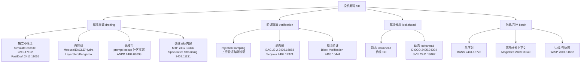

# 07 性能评测与选型权衡

> 系列文档：投机解码（Speculative Decoding）业内现状
> 上一篇：[06 业界实践](06-industry-practice.md) | 下一篇：[08 未来方向与开放问题](08-future-directions.md)

---

## 1. 先看结论：一张导读表

投机解码的论文里满是彩虹数字，但它们多数是 **bs=1、短序列、特定硬件** 下的最佳值。本表把本系列引过的关键加速数字集中放一起，并给出"可信度注释"：

| 方法 | 论文数字 | 测量条件 | 可信度 |
|---|---|---|---|
| 原始 SimulateDecode（bs=1） | 2–3× [1](https://arxiv.org/abs/2211.17192) | 独立草稿模型，T5 小模型 | 高（大规模验证） |
| DeepMind 原始 SD | 2–3× [2](https://arxiv.org/abs/2302.01318) | bs=1，T5/Chinchilla 等小模型 | 高（方法论奠基） |
| Medusa | >2.2×（Medusa-1）/ 2.3–2.8×（joint） [03](03-eagle-family-deep-dive.md) | bs=1，Vicuna-7B/13B/33B | 中（自报） |
| EAGLE-1 | 2.1–3.8×（MT-bench）[03](03-eagle-family-deep-dive.md) | bs=1，LLaMA2-Chat | 中（自报） |
| EAGLE-2 | 3.05–4.26× [03](03-eagle-family-deep-dive.md) | bs=1，LLaMA2/Vicuna | 中（自报） |
| EAGLE-3 | 4–6.5×（ICML 2025） | bs=1 | 中（自报，超参敏感） |
| **Meta at Scale 生产** | **~4 ms/token / 相对 vLLM bs=1 快 10–30% / 大 batch 1.4–2.0×** [06](06-industry-practice.md) | 8×H100，Llama4 | **高（生产实测）** |
| Together ATLAS 生产 | 500/460 TPS，2.65× | B200，动态 | **高（生产实测）** |
| schmoop vm 生产 | 1.4–2.0×，且 bs≥32 反超 [05](05-production-deployment.md) | 生产 batch>1 | **高（生产实测）** |

> **核心教训**：论文的"6×"是**加速比上限的热身数字**；生产实测普遍落在 **1.4–2.5×**。落差不全是论文注水——batch、并发、序列长度、硬件带宽共同决定了真实收益，见 §2。

---

## 2. 方法谱系全景：从"草稿从哪来"到"草稿多长"

[02 核心技术原理](02-core-methods.md) 给出了 draft/verify 框架与接受率上界 $\mathbb{E}[X]=\frac{1-\alpha^{\gamma+1}}{1-\alpha}$、加速比 $S=\frac{1-\alpha^{\gamma+1}}{(1-\alpha)(1+\gamma c)}$。在此基础上，2023–2026 的论文从四个维度持续改进，每篇基本只动一个变量：

各家核心数字与工程要点，逐个展开。

---

## 3. 草稿来源的四条路线对比

### 3.1 独立小模型 draft

- **FastDraft（Intel, 2411.11055）**：为"草稿稀缺"问题提供了低成本生产路径——**24 小时内**在 8×Intel Gaudi 2 上训练出约 50M（Phi-3-mini）/ 150M（Llama-3.1-8B）草稿模型（约 100 亿 token），接受率最高 67%，**memory-bound 理论加速最高 3×**，Intel Core Ultra AI-PC 上实测最高 2× [3](https://arxiv.org/abs/2411.11055)。
- **Deepspeed / DistillSpec（2310.08461）**：Google 提出的**蒸馏对齐**思路——用 on-policy 数据 + 针对性散度函数把 draft 蒸馏得与 target 分布更近，比标准 SD 再快 **10–45%**；"先蒸馏主模型再蒸馏草稿"的两段式管线比不蒸馏的同样大小主模型快 **6–10×**（含主模型性能提升）[4](https://arxiv.org/abs/2310.08461)。

> 见 [03 §7](03-eagle-family-deep-dive.md)：独立模型 route 的代价是双模型显存 + 词汇表对齐 + 部署复杂度，已有一批"自投机"路线来规避。

### 3.2 自投机（self-speculative）

不引入第二个独立模型，用目标模型自己的子结构做草稿：

- **Hydra（2402.05109）**：发现 Medusa 的多个解码头是**相互独立**的（只依赖已验证前缀的隐藏态），而真实语言 token 间强相关。把草稿头改成**序贯依赖**（每头输入包含前一个头采样的 token embedding），提升接受长度 0.46+，Hydra++ 相对自回归解码 **2.70×**、相对 Medusa **1.31×** [5](https://arxiv.org/abs/2402.05109)。
- **LayerSkip（Meta, 2404.16710）**：训练期对深层"层丢弃 + 共享退出损失"，推理期用**前 1/3 层提前退出自回归草稿、剩余层并行验证**。CNN/DM 摘要 2.16×、代码 1.82×、TOPv2 2.0×。内存足迹小于双模型方案（单一 KV cache + 退出查询缓存）[6](https://arxiv.org/abs/2404.16710)。
- **Kangaroo（2404.18911）**：固定浅层子网络作草稿 + 轻量 adapter（1 个 attention + 2 个 norm，仅 Medusa 头参数量 11.3%）桥接表示差距，Spec-Bench 上 1.68×，比 Medusa-1 少 **88.7% 额外参数**且更快 [7](https://arxiv.org/abs/2404.18911)。

### 3.3 无模型 / 检索式

- **ANPD（NAACL 2024 工业轨, 2404.08698）**：自适应 n-gram 模块 + 多级粒度，**无需重训、零额外显存**，LLaMA 系最高 **3.67×** [8](https://aclanthology.org/2024.naacl-industry.2/)。
- **prompt-lookup / REST**：见 [02 §5](02-core-methods.md)。强复用文本（摘要、代码续写）的零成本方案。
- **TriForce（2404.11912）**：长序列场景，用**检索式稀疏 KV cache（仅 3% KV）**作草稿"中间层"，再套一个小模型压草稿延迟——LLaMA2-7B-128K 单 A100 2.31×，offload 双 4090 上把 0.108s/token 做到比 A100 基线只慢一半 [9](https://arxiv.org/abs/2404.11912)。

### 3.4 训练目标内建（MTP / n-gram 化）

- **DeepSeek-V3 MTP**：见 [03 §6](03-eagle-family-deep-dive.md)。投机能力随模型权重免费分发（transformers `use_mtp=True`），**无词汇表/双模型问题**。
- **Speculative Streaming（2402.11131）**：把 fine-tune 目标从 next-token 改成 **n-gram 预测**，多流注意力在单模型内同时"投机+验证"，1.8–3.1×，额外参数比 Medusa 少 **约 10000×**，适合资源受限设备 [10](https://arxiv.org/abs/2402.11131)。

---

## 4. 验证算法：树、批、块

草稿质量决定上界，验证算法决定能兑现多少：

- **Sequoia（NeurIPS 2024, 2402.12374）**：指出 static tree（SpecInfer/Medusa）在大树规模下收益饱和；用**动态规划求最优树结构** + **无放回采样**避免重复提案。LLaMA2-7B/13B、Vicuna-33B 单 A100 上最高 **4.04×/3.73×/2.27×**；70B offload 单 L40 上 0.60 s/token，比 DeepSpeed-Zero-Inference 快 9.5× [11](https://arxiv.org/abs/2402.12374)。
- **Block Verification（2403.10444）**：证明逐 token 验证并非最优，"整块联合验证"在维持相同分布保证下严格不差，且 5–8% 额外墙钟收益 [12](https://arxiv.org/abs/2403.10444)。
- **BASS（2404.15778）**：把 work 尺度从单序列推向 batch——用自定义 CUDA kernel 处理**ragged（参差）tensor**、动态调整每步草稿长度，7.8B 模型单 A100 bs=8 时每 token 5.8ms、吞吐 1.1K token/s（2.15×）[13](https://arxiv.org/abs/2404.15778)。这正是 [05 §4](05-production-deployment.md)"参差张量错位陷阱"的解法雏形。

---

## 5. 草稿长度：静态 vs 动态

- **DISCO（2405.04304）**：用打分器逐 token 决定"继续草稿 or 交目标验证"，相对最优静态 lookahead **平均快约 10%**，且输出分布不变（论文另给出 oracle 上界分析：静态方案在上限情形可持续损失潜在加速）[14](https://arxiv.org/abs/2405.04304)。
- **SVIP（2411.18462）**：基于"draft token 熵与接受率强负相关"，推导接受率下界并用草稿熵在线近似——**训练无关**，直接套在任何自回归草稿上（包括 EAGLE-2），SpecBench 最高 +20%、MT-Bench 长文 +60% [15](https://arxiv.org/abs/2411.18462)。
- **HF Transformers 的 `assistant_confidence_threshold`/`num_assistant_tokens_schedule`**：就是 DISCO/SVIP 思路的**生产化实现**（[04 §7](04-inference-engine-support.md)）；llama.cpp 的 `--spec-draft-n-min/max` 也允许运行时边界。

---

## 6. batch 与长序列：投机解码"失效区"的重新定义

### 6.1 经典认知：大 batch 收益衰减

[05 §2](05-production-deployment.md) 已给出生产事实：bs 1–10 是收益区，bs≥32 验证开销反超。这是"compute-bound 竞争"——大 batch 下线性层算力已饱和，投机解码的并行验证请求计算资源，代价是**验证：解码 = 逐 token 成本比上升**。

### 6.2 MagicDec 的反直觉结论（2408.11049）

- **瓶颈随 batch×seq 变化**：短序列 + 大 batch → compute-bound，SD 净负收益；**中长序列 + 大 batch → memory-bound（KV 主导）**，此时验证与解码共享 KV 加载成本，成本比回落到 ~1，SD 反而**随 batch 增大而更有效**。
- 存在临界序列长度 $S_{\text{inflection}}$：超过它，大 batch 下 SD 才有正收益，且收益随 batch 增。LLaMA-3.1-8B、bs 32–256 下最高 **2.51×** [16](https://arxiv.org/abs/2408.11049)。这与 Meta 的发现（[06 §3.3](06-industry-practice.md)）互为印证：**模型规模、序列长度、batch 三者的乘积决定失效区**，不存在普适的"bs=16 以上就别用"。

### 6.3 长序列专用：TriForce 的 KV 检索草稿

长序列的所有 SD 系统最后一个瓶颈是 **KV cache 加载**。TriForce 用检索稀疏 KV 做"草稿中间层"，本质是**把 KV 淘汰当作草稿**（替代 StreamingLLM/H2O 等有损压缩）[9](https://arxiv.org/abs/2404.11912)。端侧的 sd.npu（[06 §5](06-industry-practice.md)）也是同一思路的移动端版——**草稿退化到"where to look in cache"而非"what to write next to"**。

---

## 7. 何时**不要**用投机解码（选型清单）

综合 [05](05-production-deployment.md) 生产证据与本节论文数据，给出负向清单：

| 情形 | 原因 | 替代方案 |
|---|---|---|
| bs≥32 且**短序列**（KV 不占主导） | compute-bound，验证代价高 → 净负收益 [16](https://arxiv.org/abs/2408.11049) | 提高 batch 填满算力；连续 batching |
| 草稿-目标分布漂移大（α<0.5）[05](05-production-deployment.md) | 加速比为负（[02 §4](02-core-methods.md) 曲线） | 重新蒸馏草稿；改用动态 lookahead |
| 词汇表不一致 / 无法对齐 | 验证机制失效（[05 §3](05-production-deployment.md) 硬约束） | 同 tokenizer 的草稿；MTP/n-gram/检索 |
| MoE 路由崩溃 / 结构化输出强约束 [05](05-production-deployment.md) | 草稿在 expert 边界/约束下接受率崩塌 | 拆解输出；不用 SD |
| 延迟敏感且并发 <4–8 [05](05-production-deployment.md) | 收益被调度/排队吃掉 | 量化 + 图优化优先 |
| 端侧小模型（如 Qwen2.5-0.5B） | EAGLE 在移动端反而增能耗 [06 §5](06-industry-practice.md) | sd.npu 检索式/NPU 原生 |

**决策口诀**：`batch × 序列长度 → 瓶颈类型 → 是否 memory-bound`；`α → 草稿是否值得`；`词表/并发/并发约束 → 能否上生产`。三者皆绿才上，任一红灯就等等。

---

## 8. 把"数字"读准的五个检查点

1. **看测量场景**：bs=1 论文数字 ≠ 生产数字；优先找同硬件同 batch 的实测（Meta/Together/vLLM 文档）。
2. **看加速比定义**：相对 vanilla 解码，还是相对"另一个 SD 方法"？EAGLE 的 3× 是相对 vanilla，Hydra 的 1.31× 是相对 Medusa——不要跨表直接比。
3. **看是否含延迟**：tokens/s 吞吐容易在长 prefill 下虚高；报告 s/token（解码延迟）才公平。
4. **看温度/采样**：greedy 下接受率系统性高于采样；[06 §3.2](06-industry-practice.md) 的 TPC 数据已证明这类差异。
5. **看硬件带宽比**：H100 的 FLOPS:带宽比让验证更便宜（[16](https://arxiv.org/abs/2408.11049)），同一方法换卡数字全变。

---

## 9. 小结

- 草稿路线四选一：**独立小模型**（对齐贵、上限高）、**自投机**（免双模型）、**无模型/检索**（零成本、局限大）、**训练内建 MTP/多流**（运维最少、生态跟着权重走）。
- 验证与 lookahead 是"兑现层"：**动态树（EAGLE-2/Sequoia）+ 整块验证 + 动态 lookahead（DISCO/SVIP）** 是 2026 年的标准组合，每一件都在不改变分布保证下再省 5–30%。
- **大 batch 不是死区**：MagicDec 证明 memory-bound 区 SD 反而随 batch 更有效；"失效区"是 (batch, seq, model, hardware) 四元函数，必须实测。
- 生产收益预期收敛在 **1.4–2.5×**；超过 3× 请先确认测量场景。真正的差距不在算法，在 **调度、并发、批判数据**（[05](05-production-deployment.md)）。

下一篇：[08 未来方向与开放问题](08-future-directions.md)。

---

### 参考文献

1. Leviathan, Kalman, Matias (Google). *Fast Inference from Transformers via Speculative Decoding*. arXiv:2211.17192; 2022-11（ICML 2023）. https://arxiv.org/abs/2211.17192
2. Chen, Borgeaud, Irving, Lespiau, Sifre, Jumper. *Accelerating Large Language Model Decoding with Speculative Sampling*. arXiv:2302.01318; 2023-02. https://arxiv.org/abs/2302.01318
3. Zafrir, Margulis, Shteyman, Guskin, Boudoukh (Intel). *FastDraft: How to Train Your Draft*. arXiv:2411.11055; 2024-11（ACL Findings 2025）. https://arxiv.org/abs/2411.11055
4. Zhou, Lyu, Rawat, Menon, Rostamizadeh, Kumar, et al. (Google). *DistillSpec: Improving Speculative Decoding via Knowledge Distillation*. arXiv:2310.08461; 2023-10. https://arxiv.org/abs/2310.08461
5. Ankner, Parthasarathy, Nrusimha, Rinard, Ragan-Kelley, Brandon. *Hydra: Sequentially-Dependent Draft Heads for Medusa Decoding*. arXiv:2402.05109; 2024-02. https://arxiv.org/abs/2402.05109
6. Elhoushi, Shrivastava, Liskovich, Hosmer, Wasti, Liangzhen Lai, Mahmoud, Acun, Agarwal, Roman, Aly, Beidi Chen, Carole-Jean Wu (Meta). *LayerSkip: Enabling Early Exit Inference and Self-Speculative Decoding*. arXiv:2404.16710; 2024-04（ACL 2024 Long）. https://arxiv.org/abs/2404.16710
7. Liu, et al. *Kangaroo: Lossless Self-Speculative Decoding via Double Early Exiting*. arXiv:2404.18911; 2024-04. https://arxiv.org/abs/2404.18911
8. Ou, Chen, Tian. *Lossless Acceleration of Large Language Model via Adaptive N-gram Parallel Decoding (ANPD)*. arXiv:2404.08698; 2024-04（NAACL 2024 Industry）. https://aclanthology.org/2024.naacl-industry.2/
9. Sun, Z. Chen, Yang, Tian, B. Chen (CMU / Meta). *TriForce: Lossless Acceleration of Long Sequence Generation with Hierarchical Speculative Decoding*. arXiv:2404.11912; 2024-04（COLM 2024）. https://arxiv.org/abs/2404.11912
10. Bhendawade, Belousova, Fu, Mason, Rastegari, Najibi. *Speculative Streaming: Fast LLM Inference without Auxiliary Models*. arXiv:2402.11131; 2024-02. https://arxiv.org/abs/2402.11131
11. Chen, May, Svirschevski, Huang, Ryabinin, Jia, et al. *Sequoia: Scalable, Robust, and Hardware-aware Speculative Decoding*. arXiv:2402.12374; 2024-02（NeurIPS 2024）. https://arxiv.org/abs/2402.12374
12. *Block Verification Accelerates Speculative Decoding*. arXiv:2403.10444; 2024-03. https://arxiv.org/abs/2403.10444
13. *BASS: Batched Attention-optimized Speculative Sampling*. arXiv:2404.15778; 2024-04. https://arxiv.org/abs/2404.15778
14. Mamou, Pereg, Korat, Berchansky, Timor, Wasserblat (IBM Research). *Dynamic Speculation Lookahead Accelerates Speculative Decoding of Large Language Models (DISCO)*. arXiv:2405.04304; 2024-05. https://arxiv.org/abs/2405.04304
15. *Draft Model Knows When to Stop: Self-Verification Speculative Decoding for Long-Form Generation* (SVIP). arXiv:2411.18462; 2024-11. https://arxiv.org/abs/2411.18462
16. Sadhukhan, Chen, Chen, Tiwari, Lai, Shi, et al. *MagicDec: Breaking the Latency-Throughput Tradeoff for Long Context Generation with Speculative Decoding*. arXiv:2408.11049; 2024-08. https://arxiv.org/abs/2408.11049

> 系列内引用的业界生产数字（Meta 2508.08192 / Together ATLAS / sd.npu 2510.15312 / DeepSeek-V3 2412.19437）见 [06 参考文献](06-industry-practice.md)；生产陷阱数字见 [05 参考文献](05-production-deployment.md)。