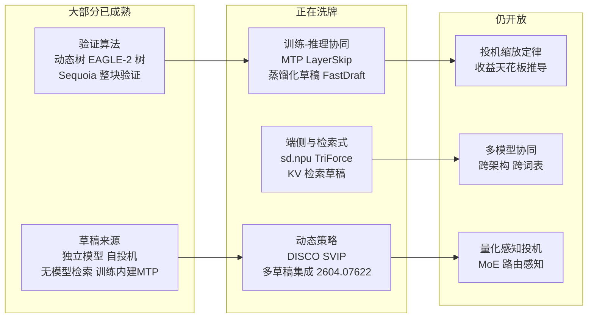

# 08 未来方向与开放问题

> 系列文档：投机解码（Speculative Decoding）业内现状
> 上一篇：[07 性能评测与选型权衡](07-benchmarks-and-tradeoffs.md)
> 这是本系列的最后一篇正文。

---

## 1. 前沿坐标：2026 年投机解码的"四张牌桌"

从 [07 §2](07-benchmarks-and-tradeoffs.md) 的谱系图延续，2024–2026 年的研究可以抽象为四个仍在洗牌的牌桌：**草稿来源**（Drafting）、**验证算法**（Verification）、**动态策略**（Adaptation）、**部署形态**（Deployment）。前两张桌子的牌已基本打完，后两张正在出牌。

一句话版：**验证算法已经便宜到极限，剩下的收益要么在"把草稿训练便宜化"，要么在"让系统按状态自适应"。**

---

## 2. 训练-推理协同：投机不再是"后装件"

### 2.1 MTP：投机能力内建于预训练

DeepSeek-V3 的 Multi-Token Prediction（[03 §6](03-eagle-family-deep-dive.md)，arXiv 2412.19437）是划时代的一步：它不是"训练完再挂草稿头"，而是**在预训练阶段就让模型学会预测未来第 $t+1, t+2$ 个 token**，推理时原生开启投机。这终结了两大类运维问题：

- **词汇表/分布漂移**：草稿头就是目标模型自身，没有独立草稿模型的分布失配（[05 §3](05-production-deployment.md) 列过的硬约束全部不成立）；
- **"两段式部署"**：不需要单独加载、对齐、调度一个草稿模型（[07 §3.1](07-benchmarks-and-tradeoffs.md) 的复杂度全部消失）。

行业趋势信号：llama.cpp 在 2026-04 的重构（**PR #22397/#22539**，合并进统一 `--spec-type` CLI）中加入了 `draft-eagle3`、`draft-dflash`、`draft-mtp`、`draft-dspark` 四种自投机后端，`draft-mtp` 直接读取 DeepSeek-V3 权重里的 MTP 模块——**权重内建投机被当成了第一等公民功能**，与 ngram 检索草稿并列在同一个参数体系里（[04 §5](04-inference-engine-support.md)）。

### 2.2 把"草稿训练"做成廉价流水线

MTP 要求从预训练第一天就设计进去，对存量模型不可用。于是"**给任意已部署模型补一个草稿**"成了独立赛道：

- **DistillSpec**（arXiv 2310.08461，[07 §3.1](07-benchmarks-and-tradeoffs.md)）：不追求草案分布逼近目标，而是先蒸馏主模型、再 on-policy 蒸馏草稿，比标准 SD 快 10–45%；两段式管线拿到 6–10× 的"主模型+解码"综合提升。
- **FastDraft**（arXiv 2411.11055，[07 §3.1](07-benchmarks-and-tradeoffs.md)）：用 8×Gaudi2 训练 ≈24 小时、约 100 亿 token，产出 50M–150M 草稿，接受率最高 67%，**3× memory-bound 上界**。它展示的核心是**增量成本**：一张集群一夜就能补出生产级草稿。
- **EAGLE-3 的"魔力注入"**（[03 §5](03-eagle-family-deep-dive.md)）：训练无监督蒸馏 100B token、且**不依赖精调模型**（对 base 模型直接可用）——"草稿训练与主任务解耦"又前进了一步。

**趋势判断**：草稿训练的边际成本正在逼近"一夜训练"级别；一旦低于"维护双模型"的运维成本，独立草稿路线（[02 §4](02-core-methods.md) 的原始 SD）会在存量模型上重新成为主流，而把 **KV 缓存与调度**问题让给推理引擎解决（见 §4）。

### 2.3 结构化的"半草稿"：多流与早退

- **Speculative Streaming**（arXiv 2402.11131，[07 §3.4](07-benchmarks-and-tradeoffs.md)）：把 fine-tune 目标从 next-token 改成 n-gram 预测，单模型内多流注意力同时"投机+验证"，额外参数比 Medusa 少三个数量级。意义在于**把投机的训练代价摊进普通 SFT**。
- **LayerSkip**（arXiv 2404.16710，[07 §3.2](07-benchmarks-and-tradeoffs.md)）：训练期层丢弃 + 共享退出损失，推理期浅层早退自回归、深层并行验证，**单一 KV cache** 解决双模型内存问题。
- **Kangaroo**（arXiv 2404.18911，[07 §3.2](07-benchmarks-and-tradeoffs.md)）：浅层子网络 + 轻量 adapter 桥接，比 Medusa-1 少 88.7% 额外参数。

这三篇的共同指向：**"草稿"不再是一个独立模型，而是目标模型内部的一种受训能力**（早退层、多流头、n-gram 分支）。自称"self-speculative"的分支正在吃掉"独立小模型"的地盘。

---

## 3. 自适应与多草稿：动态策略牌桌

### 3.1 动态 lookahead 已进产品

静态草稿长度 $\gamma$ 的短板在 [02 §4](02-core-methods.md) 已分析：最优 $\gamma^*$ 依赖未知的接受率 $\alpha$。两条产品化路径：

- **DISCO**（arXiv 2405.04304，[07 §5](07-benchmarks-and-tradeoffs.md)）：逐 token 打分器决定"继续草稿 or 交回验证"，平均比最优静态 lookahead 快约 10%；
- **SVIP**（arXiv 2411.18462，[07 §5](07-benchmarks-and-tradeoffs.md)）：用草稿熵在线估计接受率下界，训练无关，最高 +20%。

两个都已经进入 HF Transformers：`assistant_confidence_threshold`（动态投机前瞻）与 `num_assistant_tokens_schedule`（启发式 +2/−1、heuristic_transient、constant）[04 §7](04-inference-engine-support.md)。**产品化的终点不是"更长的草稿"，而是"该停就停"。**

### 3.2 多草稿集成：把"谁的草稿更好"交给验证器

多草稿集成验证（DIVERSED，arXiv 2604.07622；HF 文档称 static ensemble verification，即 `assistant_ensemble_weight`）把多路草稿（不同 draft 模型、不同 ngram、不同自投机头）**同时**喂给一次验证，让验证器挑最优——HF 的 `assistant_ensemble_weight`（默认 0.7）已内置（[04 §7](04-inference-engine-support.md)）。

开放问题也随之而来：多路草稿的价值上限在哪里？从 [02 §2](02-core-methods.md) 的接受率上界看，两路以上草稿的**同分布边际收益快速递减**；真正的增益只出现在"两路草稿各自擅长不同 token 分布"的互补场景。**"几路草稿、权重如何调"仍是经验题**，没有理论最优解。

### 3.3 系统级自适应：排队、并发、硬件

[07 §6](07-benchmarks-and-tradeoffs.md) 已经证明失效区是 $(batch, seq, model, hw)$ 的四元函数。因此下一个工程方向是**运行时开关**：

- 按当前 batch 大小动态启用/禁用投机（vLLM/llama.cpp 已支持按请求粒度开关）；
- 按序列长度切换"投机策略"（短序列关、中长序列间开 MTP、超长开检索式草稿）；
- 按服务水位（并发高低）做投机削峰。

**自适应不再是算法层的事，而是调度器的一等公民条件**——这与 [05 §6](05-production-deployment.md) 的 TPC（Throughput per Cost）指标接上了头。

---

## 4. 端侧与检索式：草稿退化成"去哪查"

### 4.1 检索式 KV：长序列的新范式

TriForce（arXiv 2404.11912，[07 §3.3](07-benchmarks-and-tradeoffs.md)）引入的关键思想：**长序列投机解码的最后一个瓶颈是 KV cache 加载**，而"检索稀疏 KV 当草稿中间层"把投机从"预测下一个 token"降维成"猜下一个要查哪块 cache"。配合 StreamingLLM/H2O 等有损压缩的对照，这条路线在长上下文时代（128K+）是唯一能同时维护无失真保证与成本的地方。

### 4.2 端侧 NPU：不加硬件、不加模型

sd.npu（arXiv 2510.15312，[06 §5](06-industry-practice.md)）在端侧 NPU 上证明：**投机解码不需要额外 draft 硬件，也不给模型加 affiliate 结构**——直接用主流框架、零推理映射，同样获得 Device-bound 上界内的加速，且在延迟敏感场景下 TPC 优于 CPU 投机。它同时实测到**解码期 NPU 计算图切换开销与利用率低下**（[06 §5](06-industry-practice.md)）——**端侧算力闲置正是投机解码的利基**：解码阶段 NPU 空转率高，恰恰给了交换式投机解码低成本的进入空间。

**这条牌桌的下一步**：混合推理——什么时候把草稿丢给 NPU/专用 IP，什么时候回落到 CPU 检索式（REST/prompt-lookup/ANPD），完全由设备的功耗与带宽预算决定（[06 §4](06-industry-practice.md) 给出的"算力越贵、错过验证越贵"法则）。

---

## 5. 投机解码的"缩放定律"：收益天花板

### 5.1 数学上可推导的边界

[02 §2](02-core-methods.md) 的加速比：
$$S(\gamma) = \frac{1-\alpha^{\gamma+1}}{(1-\alpha)(1+\gamma c)},$$
在 $\alpha\rightarrow 1$、$\gamma\to\infty$ 依次取极限得**无失真收益上限** $\lim_{\gamma\to\infty}S = \frac{1}{c}$（先令 $\alpha\to1$ 得 $S\to\frac{\gamma+1}{1+\gamma c}$，再令 $\gamma\to\infty$），其中 $c$ 为草稿-验证成本比。所以三件事实写死：

1. **$c\ge 1$ 时收益上界 $\le 1\times$（无正增益）**——草稿每次前向不比验证便宜，加速比被 $1/c$ 封死在 1 以内（[02 §4](02-core-methods.md) 的负收益区）；
2. **$c$ 只与两模型的相对尺寸/稀疏度有关**，与实现无关——压缩草稿（量化、剪枝）是比调 gamma 更根本的杠杆；
3. **$\alpha$ 受训练质量与分布漂移决定**，现场只能靠 re-draft/蒸馏抬升（[07 §3.1](07-benchmarks-and-tradeoffs.md)）。

### 5.2 MagicDec 的"拐点定律"

MagicDec（arXiv 2408.11049，[07 §6.2](07-benchmarks-and-tradeoffs.md)）用计算/访存类型迁移给出第二个可操作的"定律"：

- 瓶颈类型由 **batch × 序列长度** 决定（compute-bound vs memory-bound）；
- 存在临界序列长度 $S_{\text{inflection}}$：越过它，大 batch 下 SD 反而更有效（LLaMA-3.1-8B 得 2.51×）。

把这与 5.1 合并，得到**投机解码的三个工程公理**：① 收益上界由成本比 $c$ 封顶；② 失效区可计算（四元函数）；③ 现场收益 ≈ 接受率 × 访存优势，两者都是可测的（`--spec-draft-p-split` 等参数直接暴露给运维，[04 §5](04-inference-engine-support.md)）。

### 5.3 仍未闭合的"缩放"问题

- **草稿模型缩放定律**：draft 参数量、训练 token 量 → $\alpha$ → $S$ 的整条传递函数，目前没有公开的跨规模拟合（EAGLE-3 的 100B token 与 FastDraft 的 10B token 之间差了一个数量级，谁对？）；
- **多卡投机**：草稿放在哪张卡、步间通信成本怎么分摊，只有零星数字（Sequoia 的 offload 实验 [07 §4](07-benchmarks-and-tradeoffs.md)）；
- **理论最优树**：Sequoia 的动态规划给定 draft 分布下的最优树，但"给定任意形态草稿的最优验证策略"仍无闭合解（[07 §4](07-benchmarks-and-tradeoffs.md) 引出的开放项）。

---

## 6. 开放问题清单（一句话版）

1. **草稿训练成本能否压到"一夜"以下**，让独立草稿路线反超自投机？
2. **多草稿集成的理论价值上限**在哪里（互补性何时成立）？
3. **量化感知投机**：4-bit 草稿 + 8-bit 目标的混合精度如何影响 $\alpha$ 与 $c$？
4. **MoE 路由感知**：草稿是否需要跟随 expert 切换（[05 §3](05-production-deployment.md) 的 MoE 陷阱的解法在草稿侧还是验证侧）？
5. **跨词汇表投机**：两语言模型词表并集/差集的验证器目前只有实验性方案（[05 §3](05-production-deployment.md) 硬约束），会成为下个标准化点。
6. **投机 vs 推测架构**：SD 与"并行解码整段再 reject"（如 LayerSkip 全退出、Yuan 等 speculative multiverse）在延迟分布上的差异从未被正式对比。

---

## 7. 系列收尾：一句话框架

把八篇压成一条决策链：

**草稿质量（α）→ 成本比（c）→ 失效区（batch×seq）→ 部署形态（双模型/MTP/检索式）→ 生产指标（TPC 而非 TPS）**

- 缺 α → 先 `[01](01-overview-and-evolution.md) [02](02-core-methods.md)` 补数学，或 `[03](03-eagle-family-deep-dive.md)` 补 EAGLE 谱系；
- 缺 c → `[04](04-inference-engine-support.md)` 的引擎矩阵直接给默认值；
- 缺失效区 → `[05](05-production-deployment.md) [07](07-benchmarks-and-tradeoffs.md)` 有实测与清单；
- 缺部署形态 → `[06](06-industry-practice.md)` 有四家生产案例；
- 想跟研究 → 回到本文的洗牌桌。

投机解码从未承诺"免费算力"——它承诺的只是"把闲置的验证带宽换成延迟"。什么时候这套交易划算，文章里全部给出了可推导、可测量的答案。

---

### 参考文献

1. DeepSeek-AI. *DeepSeek-V3 Technical Report*（Multi-Token Prediction 章节）. arXiv:2412.19437; 2024-12. https://arxiv.org/abs/2412.19437 —— 见 [03](03-eagle-family-deep-dive.md) §6
2. ggml-org/llama.cpp. *Speculative Decoding Unified CLI（--spec-type / draft-eagle3 / draft-mtp / draft-dflash）*. docs/speculative.md + PR #22397/#22539; 2026-04. https://github.com/ggml-org/llama.cpp/blob/master/docs/speculative.md —— 见 [04](04-inference-engine-support.md) §5
3. Zhou, et al. (Google). *DistillSpec: Improving Speculative Decoding via Knowledge Distillation*. arXiv:2310.08461; 2023-10. https://arxiv.org/abs/2310.08461 —— 见 [07](07-benchmarks-and-tradeoffs.md) §3.1
4. Zafrir, et al. (Intel). *FastDraft: How to Train Your Draft*. arXiv:2411.11055; 2024-11. https://arxiv.org/abs/2411.11055 —— 见 [07](07-benchmarks-and-tradeoffs.md) §3.1
5. Bhendawade, et al. *Speculative Streaming: Fast LLM Inference without Auxiliary Models*. arXiv:2402.11131; 2024-02. https://arxiv.org/abs/2402.11131 —— 见 [07](07-benchmarks-and-tradeoffs.md) §3.4
6. Elhoushi, et al. (Meta). *LayerSkip: Enabling Early Exit Inference and Self-Speculative Decoding*. arXiv:2404.16710; 2024-04. https://arxiv.org/abs/2404.16710 —— 见 [07](07-benchmarks-and-tradeoffs.md) §3.2
7. Liu, et al. *Kangaroo: Lossless Self-Speculative Decoding via Double Early Exiting*. arXiv:2404.18911; 2024-04. https://arxiv.org/abs/2404.18911 —— 见 [07](07-benchmarks-and-tradeoffs.md) §3.2
8. *DIVERSED: Relaxed Speculative Decoding via Dynamic Ensemble Verification*. arXiv:2604.07622; 2026-04. —— 经 HF `assistant_ensemble_weight` 文档引用并 arXiv 核验（[04](04-inference-engine-support.md) §7）
9. Mamou, et al. (IBM Research). *Dynamic Speculation Lookahead Accelerates Speculative Decoding of Large Language Models (DISCO)*. arXiv:2405.04304; 2024-05. https://arxiv.org/abs/2405.04304 —— 见 [07](07-benchmarks-and-tradeoffs.md) §5
10. *Draft Model Knows When to Stop: Self-Verification Speculative Decoding for Long-Form Generation* (SVIP). arXiv:2411.18462; 2024-11. https://arxiv.org/abs/2411.18462 —— 见 [07](07-benchmarks-and-tradeoffs.md) §5
11. Sun, et al. *TriForce: Lossless Acceleration of Long Sequence Generation with Hierarchical Speculative Decoding*. arXiv:2404.11912; 2024-04. https://arxiv.org/abs/2404.11912 —— 见 [07](07-benchmarks-and-tradeoffs.md) §3.3
12. Chen, Xu, Shen, Xu, Wang, Ma（北京大学/北邮）. *Accelerating Mobile Language Model via Speculative Decoding and NPU-Coordinated Execution*（sd.npu）. arXiv:2510.15312; 2025-10. https://arxiv.org/abs/2510.15312 —— 见 [06](06-industry-practice.md) §5
13. Sadhukhan, et al. *MagicDec: Breaking the Latency-Throughput Tradeoff for Long Context Generation with Speculative Decoding*. arXiv:2408.11049; 2024-08. https://arxiv.org/abs/2408.11049 —— 见 [07](07-benchmarks-and-tradeoffs.md) §6.2
14. Chen, et al. *Sequoia: Scalable, Robust, and Hardware-aware Speculative Decoding*. arXiv:2402.12374; 2024-02. https://arxiv.org/abs/2402.12374 —— 见 [07](07-benchmarks-and-tradeoffs.md) §4

> 全部基于已验证的生产数字/官方文档；分布式与绿色算力等关联视角见 [06](06-industry-practice.md) 与 [05](05-production-deployment.md) 参考文献。