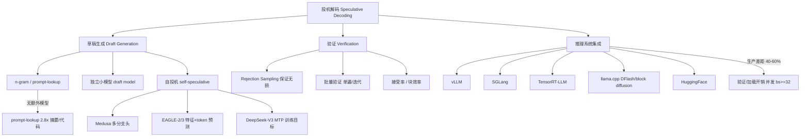

# 投机解码（Speculative Decoding）业内现状 —— 深度调研研究计划

> 触发：用户请求"帮我调研一下投机解码的业内现状"
> 视角：**工程优先 + 业内现状**（兼顾原理推导与论文格局，重点落在推理引擎支持矩阵、生产部署数据、业界实践与陷阱）
> 输出语言：中文（技术术语/论文标题保留英文原文）

---

## 1. 调研目标

1. 系统性掌握投机解码的**技术演化脉络**与**核心机制**（draft → verify 两阶段范式如何保证输出分布无损）。
2. 横向比较当前主流方法的**代表论文与实现**：EAGLE-2/3、Medusa、MTP、n-gram/prompt-lookup、REST、SD-NPU 等。
3. 盘点开源推理引擎（vLLM / SGLang / TensorRT-LLM / llama.cpp / HF）的**支持矩阵**：算法、配置项、draft 模型获取方式。
4. 收集**生产环境真实收益数据**与**踩坑经验**，量化"实验室 vs 生产"差距的原因（batch、并发、验证开销、词汇表一致性）。
5. 覆盖**业界头部实践**：DeepSeek-V3 MTP（训练侧）、Meta 大规模 EAGLE 部署、Together ATLAS/Turbo 自适应方案、端侧 SD-NPU。
6. 产出结论：适用场景边界、性能瓶颈、工程选型建议、未来方向。

## 2. 知识图谱



### 2.1 核心概念与前置知识

| 概念 | 说明 | 关联前置知识 |
|---:|:---|:---|
| draft / verify 两阶段 | 小模型或近似策略快速生成 K 个候选 token，大模型一个前向并行验证 | 自回归生成、KV cache |
| Rejection Sampling | 保证分布无偏（目标模型分布可采样等价） | 采样算法、KL 散度 |
| 接受率（Acceptance Rate） | 每步验证接受的 token 数，决定加速比上界 | 概率论 |
| 块效率（Block Efficiency） | 与接受率、验证并行度共同决定吞吐 | 并行计算 |
| 自投机（Self-speculative） | 用模型自身子模块（多分支头/特征层）生成草稿，无需独立小模型 | MoE、Transformer 架构 |
| 训练期多 token 预测（MTP） | 训练目标即预测后 K 个 token，推理期天然可做投机 | 训练目标设计 |
| 词汇表一致性 | draft 与 target 词汇表必须完全一致，否则验证失效 | 分词器（tokenizer） |

### 2.2 关键技术问题（工程难点）

- **验证并行度与内存**：并行验证多个候选需要更长的 KV cache 与更大激活，batch 增大后收益被稀释。
- **draft 模型/头部选择**：EAGLE 系需要额外训练与显存；n-gram 零成本但仅适合强复用文本。
- **采样式 vs 贪婪**：多数生产场景用采样，投机解码与采样分布的匹配是正确性边界。
- **多请求并发下的收益**：挂钟延迟收益仅在高并发稀疏时显著；吞吐收益受验证开销挤压。
- **与目标模型协同训练**：DeepSeek-V3 的 MTP 在训练侧内建投机能力，是生态位的重要变化。

## 3. 文档结构设计

输出目录：`deep-dive-speculative-decoding/`（本文件同目录）

```
deep-dive-speculative-decoding/
├── README.md                          # 阅读指南、学习路径、文档间关系
├── RESEARCH_PLAN.md                   # 本计划
├── PROGRESS.md                        # 进度清单（每文档一条）
├── 01-overview-and-evolution.md       # 综述与演化史
├── 02-core-methods.md                 # 核心技术原理与分类（含数学推导+Mermaid）
├── 03-eagle-family-deep-dive.md       # EAGLE-2/3 / Medusa / MTP 详解（论文级）
├── 04-inference-engine-support.md     # 开源推理引擎支持矩阵（可配置示例）
├── 05-production-deployment.md        # 生产部署实战：收益如何打折扣 + 陷阱清单
├── 06-industry-practice.md            # 业界实践：DeepSeek / Meta / Together / 端侧
├── 07-benchmarks-and-tradeoffs.md     # 性能评测数据与选型权衡
└── 08-future-directions.md            # 未来方向与开放问题
```

### 各文档覆盖要点

| 文件 | 标题 | 核心覆盖 |
|---|---|---|
| 01 | 综述与演化史 | 从自回归瓶颈 → 2023 原始投机解码（Leviathan/DeepMind）→ 2024-2026 方法谱系；survey（arXiv 2502.19732）分类体系 |
| 02 | 核心技术原理 | draft/verify 数学框架、Rejection Sampling 无偏性证明、接受率-加速比关系、时序图（Mermaid）；变量映射表 |
| 03 | EAGLE 家族 | Medusa 多分支头 → EAGLE-1/2/3 演化；EAGLE-3 的 token prediction + training-time test + multi-layer fusion；DeepSeek-V3 MTP；实验复现配置（SGLang） |
| 04 | 引擎支持矩阵 | vLLM / SGLang / TensorRT-LLM / llama.cpp / HF 之算法支持、配置项、draft 模型获取；表格对比 + 每引擎最小示例 |
| 05 | 生产部署 | 生产 vs 实验室 40-60% 差距成因；bs≥32 验证开销；并发 <4-8 红绿灯；词汇表一致性；EAGLE-3 接受率 70-80%；prompt-lookup 适用场景 |
| 06 | 业界实践 | DeepSeek-V3 MTP、Meta Llama-At-Scale（arXiv 2508.08192）、Together ATLAS/Turbo、sd.npu 端侧（arXiv 2510.15312）、其他公开生产报告 |
| 07 | 评测与权衡 | 各论文/引擎公开基准数据横向对比；何时不用投机解码；MoE 模型表现、大 batch 衰退 |
| 08 | 未来方向 | 训练-推理协同、自适应 speculator、投机解码与并行解码结合、MoE 特化、端侧部署规范 |

## 4. 核心问题清单（Key Questions）

1. 投机解码的核心理念是什么？'draft 快生成 + target 并行验证'为何能保证输出分布无损？
2. 从 2023 原始论文到 2025-2026，方法谱系如何演化？n-gram → draft model → 自投机 → 训练目标级的代际划分依据是什么？
3. 为什么 EAGLE 系成为当前主流（尤其 EAGLE-3）？它与 Medusa、MTP、独立小模型 draft 的本质差异何在？
4. 主要开源推理引擎各自支持哪些投机算法？配置方式、draft 模型生态、性能报告如何？
5. vLLM prompt-lookup 无模型方案达到 2.8x 的适用前提是什么？与 EAGLE 覆盖场景有何不同？
6. 实验室最高 6.5x 与生产 1.4-2.0x 的差距，成因多大程度在 batch/并发/验证开销？哪些能通过工程缓解？
7. 生产部署投机解码的硬性前置条件有哪些（词汇表、采样配置、显存、并发）？已知陷阱清单？
8. DeepSeek-V3 把投机能力内建为训练目标的思路（MTP），是否代表业界新范式？对推理生态的影响？
9. Meta 大规模部署（Llama4 Maverick ~4ms/token）与 Together ATLAS 自适应方案的工程技术要点？
10. 端侧/移动端（sd.npu 3.8x 速度 / 4.7x 能效）与数据中心方案的架构差异与规范？

## 5. 已锁定权威资料（Phase 1 初步探索 + 后台检索中）

**背景检索已确认（Phase 1 探索命中）：**

- Survey: [Speculative Decoding and Beyond](https://arxiv.org/abs/2502.19732)
- DeepSeek-V3: [arXiv 2412.19437](https://arxiv.org/abs/2412.19437)（MTP 训练目标）
- Meta: [Efficient Speculative Decoding for Llama at Scale](https://arxiv.org/abs/2508.08192)（2025-08-12）
- 端侧: [arXiv 2510.15312](https://arxiv.org/abs/2510.15312)（sd.npu 移动端, 2025-10?）
- SGLang 文档: [Speculative Decoding](https://docs.sglang.ai/advanced_features/speculative_decoding)
- llama.cpp: [docs/speculative.md](https://github.com/ggml-org/llama.cpp/blob/master/docs/speculative.md)
- EAGLE 仓库: [SafeAILab/EAGLE](https://github.com/SafeAILab/EAGLE)
- 生产陷阱文: [tianpan.co 投机解码在生产环境中的应用](https://tianpan.co/zh/blog/2026-04-17-speculative-decoding-production-hidden-traps)（生产收益比实验室低 40-60%，bs≥32 验证开销反超，并发<4-8 才利好）
- Together AI: [ATLAS + Together Turbo 博客](https://together.ai/blog)（DeepSeek-V3.1 500 TPS / Kimi-K2 460 TPS 2.65x）

**后台检索进行中（librarian，待回收）：**

- 任务 A：vLLM / TensorRT-LLM / SGLang / llama.cpp / HF 投机解码支持矩阵（算法、配置项、draft 示例、官方文档 URL）
- 任务 B：2024-2026 投机解码论文清单（draft-model-free / self-speculative / MTP / 验证优化 / survey，含 arXiv ID）

回收后并入 04/03/07 文档写作。

## 6. 调研方法论

按 deep-dive skill Phase 2 逐文档执行：

1. **定向检索**：每模块执行 学术/官方 + 工程/实现 + 社区/踩坑（site:zhihu.com / juejin.cn）+ 对抗性验证（vs 替代方案 benchmark）四路检索。
2. **交叉验证**：Zhihu/掘金 工程经验与官方文档冲突时，分析版本/硬件环境差异，标注时间与版本。
3. **数学细节**：02/03 文档含完整推导（Rejection Sampling 无偏性、接受率上界、验证成本建模），提供变量映射表 + 关键 Tensor Shape。
4. **Mermaid 规范**：流程图一律 `<br>` 换行、节点文本避免裸括号冒号、图保持简洁。
5. **引用规范**：关键论断后跟 [1](URL)；公式注明出处论文链接；优先 ArXiv/官方文档永久链接；无法验证的链接标注 unverified。
6. **增量持久化**：每写完一篇立即落盘并更新 PROGRESS.md（⬜ → 🔄 → ✅），不跨文档堆草稿。
7. **Lab 练习**：每主要文档附 1-2 个可运行实验（SGLang/VLLM 最小验证、llama.cpp 命令等），标注框架版本。

## 7. 阶段规划

| 阶段 | 内容 | 状态 |
|---|---|---|
| Phase 1 | 规划与架构设计（本计划 + PROGRESS.md） | 🔄 进行中（等待用户确认） |
| Phase 2 | 逐文档深度研究与写作（01-08 + README） | ⬜ 待确认后启动 |
| Phase 3 | 自审：数学一致性 / MRE 可运行 / Mermaid / 链接 / 深度 / 中文补充 / 逻辑连贯 | ⬜ |
| Phase 4 | 交付：README 指南 + 全部文档落盘 + PROGRESS.md 收尾 + 汇总 | ⬜ |

---

*生成时间：2026-08-30。检索数据将在确认后进入 Phase 2 前更新。*