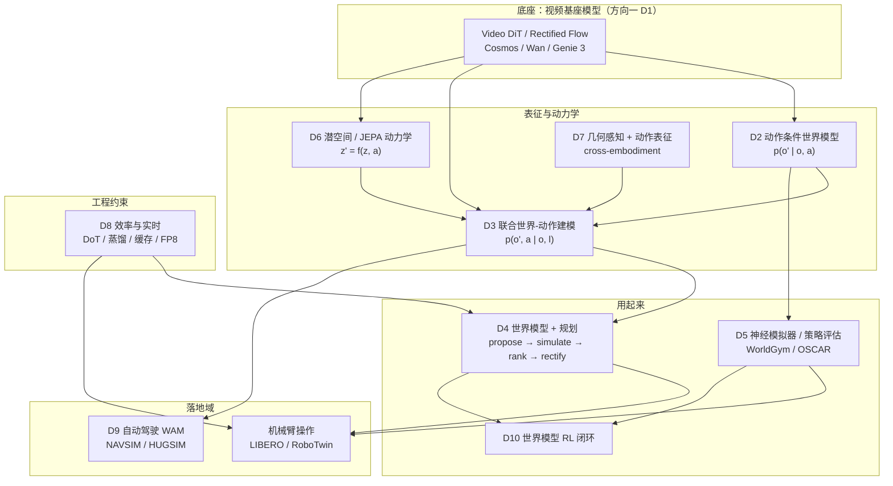

# WAM 发展方向地图（2026-09）

> 这是 WAM 深潜系列的**总纲**：先把"这个领域有哪些方向"整理清楚，再逐方向展开数学原理。
> 所有 arXiv 编号与数字均已在 2026-09-19 逐条核实（见 §5 论文总表）；未核实项明确标注「待验证」。

---

## 1. 一句话定义

**World Action Model（WAM）** 把"预测未来"和"生成动作"放进同一个模型：未来预测必须是**策略的一部分**，而不是辅助 backbone，也不是外部模拟器。

三个式子的区别决定了你是不是 WAM：

| 范式 | 学的东西 | 是否 WAM |
|:---|:---|:---|
| VLA | $p(a_t \mid o_{\le t}, l)$ | ✗ 反应式，不显式表示未来 |
| World Model | $p(o_{t+1:t+H} \mid o_{\le t}, a_{t:t+H})$ | ✗ 是模拟器，不是策略 |
| **WAM** | $p(o_{t+1:t+H},\, a_{t:t+H} \mid o_{\le t}, l)$ | ✓ 未来与动作联合建模并被策略使用 |

判定边界（NUS survey 的三形态定义，见 [arXiv:2606.20781](https://arxiv.org/abs/2606.20781)）：预测的末来只要**服务于**下述三者之一就算 WAM —— ① 生成动作；② 给候选动作打分；③ 训练动作通路。

---

## 2. 全景图

---

## 3. 十个方向

### D1 · 视频基座模型作为世界先验
- **核心问题**：预训练视频生成模型里的"物理先验"能否迁移成机器人可控制的动力学？
- **为什么成立**：Video DiT 已经学到物体持久性、运动连续性、接触与遮挡、相机运动——这些正是 dynamics 的骨架。
- **代表工作**：[Cosmos-Predict2.5](https://github.com/nvidia-cosmos/cosmos-predict2.5)、[Genie 3](https://deepmind.google/models/genie/)、[DreamZero (2602.15922)](https://arxiv.org/abs/2602.15922)
- **收敛度**：🟢 高（"用视频模型当 backbone"已是共识）
- **未解决**：视频先验里有多少是**可控**的？先验的"外观部分"和"动力学部分"如何分离？

### D2 · 动作条件世界模型（forward dynamics）
- **核心问题**：$p(o_{t+1:t+H} \mid o_t, a_{t:t+H})$ 是否对动作**敏感**（action alignment）？
- **关键**：两个不同动作若产出几乎相同的未来，这个模型对控制就是废的——哪怕 FVD 极好。
- **代表工作**：[OSCAR (2606.04463)](https://arxiv.org/abs/2606.04463)（2D 骨架条件，跨本体）、Cosmos-Predict2.5-2B/robot/action-cond
- **收敛度**：🟢 高（可用性）／🔴 未解决（动作敏感度仍无标准度量）
- **未解决**：**动作对齐度量**。像素指标（PSNR/SSIM/FVD）与"对控制有没有用"脱钩。

### D3 · 联合世界-动作建模（Cascade → Joint）
- **核心问题**：未来和动作要不要在同一个生成过程里互相约束？
- **路线**：Cascade（先未来后动作，单向）→ Joint（共享去噪，双向）→ Event-centric（按事件切分而非固定 chunk）
- **代表工作**：[MotuBrain (2604.27792)](https://arxiv.org/abs/2604.27792)（UniDiffuser + 三流 MoT）、[UNIVERSE (2607.05133)](https://arxiv.org/abs/2607.05133)（单 DiT + 模态解耦可见性掩码）、[WALL-WM (2606.01955)](https://arxiv.org/abs/2606.01955)（事件级）
- **收敛度**：🟢 中高（Joint 已主流化）
- **未解决**：**world-action factorization**——共享参数里哪部分归世界、哪部分归动作？耦合位置（哪几层互注意）没有理论。

### D4 · 世界模型 + 规划
- **核心问题**：推理时多花的算力，能不能换成更好的动作？
- **机制**：propose（采样候选）→ simulate（世界模型推演）→ rank（打分）→ rectify（用最好的未来重新生成动作）
- **代表工作**：[τ₀-WM (2606.01027)](https://arxiv.org/abs/2606.01027)（VAM + ACVS + re-denoising consistency）、[Cosmos Policy (2601.16163)](https://arxiv.org/abs/2601.16163)（latent frame injection，未来帧里塞 value）
- **收敛度**：🟡 中高（采样+排序已收敛，rectify 是新东西）
- **未解决**：长视野误差累积（谱半径 > 1 时 32 步后误差爆炸，见 D5 Lab）；test-time compute 的**边际收益曲线**没人画过。

### D5 · 神经模拟器与策略评估
- **核心问题**：在世界模型里评估策略，排名和真机一致吗？
- **这是 WAM 最被低估的方向**——它绕开了"物理正确性"，只要求**排序相关性**。
- **代表工作**：[WorldGym (2506.00613)](https://arxiv.org/abs/2506.00613)（首个系统验证 ranking 保持）、[OSCAR](https://arxiv.org/abs/2606.04463)（Spearman 0.750 / Pearson 0.852）
- **收敛度**：🟡 有成果未成熟
- **未解决**：绝对成功率估计仍然偏差大（校准误差 + VLM 裁判保守）；缺少标准 metric。

### D6 · 潜空间 / JEPA 世界动作模型
- **核心问题**：能不能**不生成像素**就做规划？
- **动机**：100 个候选 × 32 帧 × 50 步去噪 = 不可能实时。JEPA 在表征空间做预测，代价低一个量级。
- **代表工作**：[WA-JEPA (2608.20974)](https://arxiv.org/abs/2608.20974)（future-masked 预训练 + 潜空间条件流匹配 + 联合未来-动作预测）、[SG-WAM (2608.01397)](https://arxiv.org/abs/2608.01397)（EMA 自监督目标 + dynamics token）
- **收敛度**：🟡 新兴但方向明确
- **未解决**：潜空间预测**会不会塌缩**（JEPA 的经典退化问题）；潜空间里怎么定义"物理正确"。

### D7 · 几何感知与动作表征
- **核心问题**：动作到底该用什么表示，才能让**不同本体**共享同一个动力学模型？
- **表征全家桶**：raw joint / 末端 SE(3) / trajectory / action token / action image / **2D 骨架** / affordance / latent action
- **代表工作**：[OSCAR](https://arxiv.org/abs/2606.04463)（骨架渲染，机械臂与人手统一）、[MotuBrain](https://arxiv.org/abs/2604.27792)（50–100 条轨迹适配新人形）
- **收敛度**：🔴 动作表征**远未收敛**，这是全领域最关键的分歧点
- **未解决**：是否存在一个"通用物理动作接口"？骨架是候选，但对接触/力/形变表达不足。

### D8 · 效率与实时
- **核心问题**：WAM 的推理账单怎么砍？
- **手段**：动作头深度解耦、步数蒸馏、DiT 缓存、FP8、action-only 推理、选择性想象
- **代表工作**：[Faster-WAM (2608.02365)](https://arxiv.org/abs/2608.02365)（单层动作头 × 30 层视频骨干，66.5 ms vs 211.7 ms，3.2×）、[MotuBrain](https://arxiv.org/abs/2604.27792)（50× 加速，11 Hz）
- **收敛度**：🟡 工程快速发展
- **未解决**：延迟分解没有统一口径（含不含 VAE 解码？单视角还是多视角？）

### D9 · 自动驾驶 WAM
- **核心问题**：驾驶是"轨迹动作 + 多模态未来"的天然 WAM 场景，与操作域有何不同？
- **差异**：驾驶动作是**轨迹**（低维、连续、可直接监督），操作动作是 joint/EE（高维、本体相关）；驾驶未来**本质多模态**（行人可能过/停/退）
- **代表工作**：[DriveWAM (2605.28544)](https://arxiv.org/abs/2605.28544)、[UNIVERSE (2607.05133)](https://arxiv.org/abs/2607.05133)、[SimWAM (2608.07468)](https://arxiv.org/abs/2608.07468)、[MM-Future (2609.20377)](https://arxiv.org/abs/2609.20377)（多模态未来）
- **收敛度**：🟢 中高
- **未解决**：多模态未来的**模式覆盖 vs 双向耦合**不可兼得（cascade 有覆盖无耦合，joint 有耦合无覆盖）——MM-Future 是首个同时要两者的尝试。

### D10 · 训练配方与世界模型 RL
- **核心问题**：数据怎么混、loss 怎么加权、什么时候上 RL？
- **关键技巧**：**模态专属监督掩码**（异构数据各有缺失模态）、**隔离注意力掩码**（让动作预测不依赖未来帧）、噪声调度改造
- **代表工作**：[τ₀-WM](https://arxiv.org/abs/2606.01027)（27,300 h 四类数据 + 掩码）、[SimWAM](https://arxiv.org/abs/2608.07468)（训练时用视频、推理时丢掉视频分支 + RL 优化组合奖励）
- **收敛度**：🔴 尚未形成标准 recipe
- **未解决**：世界模型误差下的 RL 收敛性保证；on-policy 闭环（WM → 想象 rollout → RL → 真机 rollout → WM）没人跑通过完整一圈。

---

## 4. 收敛度总表

| 方向 | 收敛度 | 当前主流做法 | 核心卡点 |
|:---|:---:|:---|:---|
| D1 视频基座先验 | 🟢 高 | Video DiT / Rectified Flow | 先验的可控性分离 |
| D2 动作条件预测 | 🟢 高（可用） | 潜/视频空间预测 + 条件注入 | **动作对齐度量缺失** |
| D3 联合建模 | 🟢 中高 | 统一 DiT / MoT / 掩码调制 | world-action factorization |
| D4 世界模型规划 | 🟡 中高 | 采样 + 排序 + rectify | 长视野误差累积 |
| D5 神经模拟器 | 🟡 | 世界模型内 Monte Carlo rollout | 绝对成功率校准 |
| D6 潜空间 / JEPA | 🟡 新兴 | future-masked + 潜空间流匹配 | 表征塌缩 |
| D7 几何 / 动作表征 | 🔴 | 骨架 / SE(3) / latent action 混战 | 无通用接口 |
| D8 效率 | 🟡 | 解耦头 + 蒸馏 + 缓存 + FP8 | 延迟口径不统一 |
| D9 自动驾驶 WAM | 🟢 中高 | 单 DiT 掩码调制 + 多模态未来 | 模式覆盖 vs 耦合 |
| D10 训练 / WM-RL | 🔴 | 异构掩码 + 联合流匹配 | 无标准 recipe、闭环未跑通 |

**总体判断**：架构层面的主干已经清楚（**视频基座 + 动作条件动力学 + 联合动作建模 + 潜空间规划**），但**表征层（D7）和训练层（D10）没有收敛**。这与 Transformer 式的"架构收敛"不同——WAM 收敛的是**骨架**，不是**接口**。

---

## 5. 已核实论文总表

| 方向 | 工作 | arXiv / 链接 | 关键事实（已核实） |
|:---|:---|:---|:---|
| 综述 | WAM Survey（机器人向） | [2609.16074](https://arxiv.org/abs/2609.16074) | 2026-09-13；taxonomy = 表征/转移/动作接口/架构/训练/数据/scaling；挑战 = 动作对齐、world-action 因子分解、多视角一致性、长程记忆、神经仿真、高效推理 |
| 综述 | WAM: A Survey（NUS） | [2606.20781](https://arxiv.org/abs/2606.20781) | 2026-06-18；109 篇；两视图：生成什么（rendered / latent / video-free）× 解剖（substrate / backbone / coupling / deployment）；主页 [world-action-models.github.io](http://world-action-models.github.io/) |
| D1 | DreamZero | [2602.15922](https://arxiv.org/abs/2602.15922) | 14B Wan2.1-I2V 骨干，video+action 联合 flow matching，KV cache 写回，38× 加速到 7 Hz |
| D1 | Cosmos-Predict2.5 | [GitHub](https://github.com/nvidia-cosmos/cosmos-predict2.5) | 提供 robot action-cond 变体 |
| D2 | OSCAR | [2606.04463](https://arxiv.org/abs/2606.04463) | 2D 骨架条件；Cosmos-Predict2.5-2B 微调；PSNR 24.24 / SSIM 0.846 / LPIPS 0.094 / FVD 7.08；与真机排序 Spearman 0.750、Pearson 0.852 |
| D3 | MotuBrain | [2604.27792](https://arxiv.org/abs/2604.27792) | UniDiffuser + 三流 MoT，五种推理模式；RoboTwin 2.0 95.8 / 96.1；50–100 轨迹适配新人形；>50× 加速，11 Hz |
| D3 | UNIVERSE | [2607.05133](https://arxiv.org/abs/2607.05133) | 单掩码调制 DiT + 模态解耦可见性掩码；NAVSIM 91.0 PDMS；仅轨迹推理 4.3× 加速 |
| D3 | WALL-WM | [2606.01955](https://arxiv.org/abs/2606.01955) | 事件级切分；Camera RoPE + 视锥几何掩码；Staircase 并行推理 |
| D4 | τ₀-WM | [2606.01027](https://arxiv.org/abs/2606.01027) | VAM + ACVS 双接口；27,300 h；re-denoising consistency 打分 + simulator rectify |
| D4 | Cosmos Policy | [2601.16163](https://arxiv.org/abs/2601.16163) | latent frame injection（11 帧潜序列，含 action chunk 与 future value）；LIBERO 98.5% / RoboCasa 67.1% |
| D5 | WorldGym | [2506.00613](https://arxiv.org/abs/2506.00613) | 自回归动作条件视频模型当环境；VLM 给奖励；跨版本/尺寸/checkpoint 保持策略排序 |
| D6 | WA-JEPA | [2608.20974](https://arxiv.org/abs/2608.20974) | future-masked 预训练 + 潜空间条件流匹配 + 联合未来-动作去噪；NAVSIM-v2 91.7 EPDMS；HUGSIM HD-Score 0.4462 |
| D6 | SG-WAM | [2608.01397](https://arxiv.org/abs/2608.01397) | dynamics token + EMA 自引导预测器 + 几何监督；0.9B；LIBERO 98.5% / LIBERO-Plus 73% |
| D8 | Faster-WAM | [2608.02365](https://arxiv.org/abs/2608.02365) | DoT：单层动作头 × 30 层视频骨干；KV-Fusion + RoPE 对齐；66.5 ms vs 211.7 ms（3.2×） |
| D9 | DriveWAM | [2605.28544](https://arxiv.org/abs/2605.28544) | Wan2.2-5B → 自回归 video-action policy；VLM chunk 级引导；选择性 KV 记忆；4k→100k clips scaling |
| D9 | SimWAM | [2608.07468](https://arxiv.org/abs/2608.07468) | 视频生成只作训练信号；隔离注意力掩码；NAVSIM 91.5 PDMS；RL 优化组合奖励 |
| D9 | MM-Future | [2609.20377](https://arxiv.org/abs/2609.20377) | 多模态配对 scene-action 假设 + MM-Tokens + future-conditioned scorer；NAVSIM 94.0 PDMS / 91.5 EPDMS |
| D3 | JOPAT | [2605.23856](https://arxiv.org/abs/2605.23856) | 点追踪 + 可见性通道增强联合去噪，区分"没动"与"被遮挡" |
| D3 | VERA | [2605.27817](https://arxiv.org/abs/2605.27817) | 无动作视频规划器 + Jacobian 逆动力学模型（J-IDM） |

---

## 6. 阅读路线（按层次，不按时间）

1. **地图**：[2609.16074](https://arxiv.org/abs/2609.16074) + [2606.20781](https://arxiv.org/abs/2606.20781)（两篇综述互补：前者机器人向 taxonomy 细，后者 109 篇清单 + 解剖学轴）
2. **视频 → 策略**：Cosmos Policy（理解"不改架构就把动作塞进视频扩散"的极限）
3. **联合建模**：MotuBrain ↔ UNIVERSE（多流 MoT vs 单 DiT 掩码，正面对照）
4. **规划**：τ₀-WM（propose-rank-rectify 是目前最完整的 test-time 规划实现）
5. **潜空间**：WA-JEPA + SG-WAM（为什么未来可能从像素预测转向 action-relevant 潜预测）
6. **效率**：Faster-WAM（架构解耦）+ MotuBrain §inference（系统工程）
7. **驾驶**：DriveWAM → SimWAM → MM-Future（动作是轨迹，未来是多模态的）
8. **训练**：τ₀-WM 数据混合 + SimWAM 隔离掩码 + RL

---

## 7. 系列文档索引

| 编号 | 文档 | 覆盖方向 |
|:---|:---|:---|
| `00` | 本文件：发展方向地图 | 全部 |
| `01` | [数学基础](./01-math-foundations.md) | 公共底座：POMDP、MBRL、流匹配、动作对齐的形式化 |
| `02` | [视频基座作为世界先验](./02-video-foundation-prior.md) | D1 |
| `03` | [动作条件世界模型](./03-action-conditioned-wm.md) | D2 |
| `04` | [联合世界-动作建模](./04-joint-world-action.md) | D3 |
| `05` | [世界模型与规划](./05-world-model-planning.md) | D4 |
| `06` | [神经模拟器与策略评估](./06-neural-simulator.md) | D5 |
| `07` | [潜空间与 JEPA 路线](./07-latent-jepa-wam.md) | D6 |
| `08` | [几何感知与动作表征](./08-geometry-action-repr.md) | D7 |
| `09` | [效率与实时推理](./09-efficient-inference.md) | D8 |
| `10` | [自动驾驶 WAM](./10-driving-wam.md) | D9 |
| `11` | [训练配方与世界模型 RL](./11-training-recipe-wm-rl.md) | D10 |
