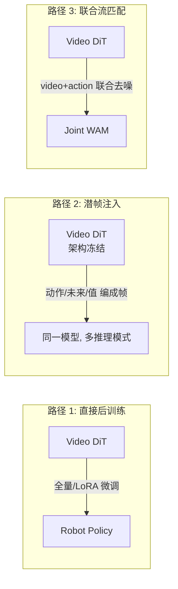

# 02 · 视频基座模型作为世界先验（D1）

> **核心问题**：预训练视频生成模型里那点"物理直觉"，能不能直接当机器人的动力学先验？
> 答案：能，但**只能拿到 marginal（无动作）动力学那部分**——可控部分必须靠动作标注补。本篇用 Lab D1 量化这个边界。

---

## 1. 视频预训练到底学到了什么

一个在大规模视频上做 $\mathcal{L}_{\text{CFM}}$（式 4.2）训练的模型，学到的条件速度场等价于后验均值

$$v_\theta(x, t) = \mathbb{E}\big[x_1 - x_0 \mid x_t = x\big]$$

也就是说，它学到的是 **$p(o_{t+1:t+H} \mid o_{\le t})$ 的边缘分布**——**没有动作**。它包含：

| 先验成分 | 具体内容 | 对机器人有用吗 |
|:---|:---|:---|
| 物体持久性 | 物体不会凭空消失 | ✓ 基础 |
| 运动连续性 | 位置/姿态平滑变化 | ✓✓ 关键 |
| 遮挡与出现 | 被遮挡物体重新出现时外观一致 | ✓ |
| 相机运动学 | 视角变化与场景的耦合 | ✓（多视角尤其重要） |
| 接触与形变 | 手碰到杯子，杯子会动 | ✓✓✓ 最想要，也最难 |
| 场景外观 | 纹理、光照、材质 | ✗ 与控制无关，是噪声 |
| **静止偏差** | 大部分像素不变 | ✗ 会**掩盖**动力学 |

最后一行是本篇的重点，见 §4。

---

## 2. Tokenizer：时空压缩的数学

视频 latent 扩散的第一步是把 $T \times H \times W \times 3$ 的视频压成 latent。设压缩率为 $(c_t, c_h, c_w)$，latent 通道数 $C$，则

$$N_{\text{token}} = \frac{T}{c_t \cdot p_t} \cdot \frac{H}{c_h \cdot p_h} \cdot \frac{W}{c_w \cdot p_w}$$

其中 $p$ 是 patchify 的下采样。对典型配置（$256\times256\times 17$ 帧，$c=(4,8,8)$，$p=(1,2,2)$，$C=16$）：

$$N_{\text{token}} = \frac{17}{4} \cdot \frac{256}{16} \cdot \frac{256}{16} \approx 5 \times 16 \times 16 = 1280 \text{ token/样本}$$

### 2.1 信息瓶颈视角

VAE 是一个**有损信道**：$O \to Z \to \hat{O}$，其容量上界由率失真理论给出

$$R \ge I(O; Z), \quad \text{s.t. } \mathbb{E}[d(O, \hat{O})] \le D$$

对控制而言，我们真正需要保留的是**控制相关互信息**

$$I\big(Z;\, \text{object pose, contact, affordance}\big)$$

而 VAE 的训练目标（重建像素）优化的是 $I(Z; O)$ 的全部，包括纹理和光照。**这意味着标准视频 VAE 对控制是次优的 tokenizer**。

这也是为什么会有方向 D6（JEPA：直接学控制相关表征）和 D7（几何监督：显式把位姿/接触塞进表征）。

### 2.2 因果 vs 非因果 tokenizer

- **非因果**（标准 Wan/Cosmos VAE）：双向时间注意力，压缩率高，但**不能流式编码**，部署时每帧都要重编码。
- **因果**（Dreamer V4 的 tokenizer）：因果注意力 + 时间压缩，可以逐帧流式编码，代价是压缩率略低。

[Dreamer V4 (2509.24527)](https://arxiv.org/abs/2509.24527) 明确用 masked autoencoding + causal attention 做时间压缩，理由是"避免高频网络输出导致的误差累积"。

---

## 3. 骨干：DiT + Rectified Flow

标准的 video DiT 块：

$$\begin{aligned}
h &\leftarrow h + \mathrm{Attn}\big(\mathrm{RoPE}_{3D}(h)\big) \\
h &\leftarrow h + \mathrm{CrossAttn}(h, c_{\text{text}}) \\
h &\leftarrow h + \mathrm{FFN}\big(\gamma(t)\odot h + \beta(t)\big)
\end{aligned}$$

**3D RoPE** 把位置 $(t, y, x)$ 分到不同通道组做旋转：

$$\mathrm{RoPE}(h)_{i} = R(\theta_i \cdot t) \oplus R(\theta_i \cdot y) \oplus R(\theta_i \cdot x) \; \cdot h_i$$

这个设计有个对 WAM 很重要的后果：**动作 token 通常用 1D RoPE（只有时间维）**，而视频 token 用 3D RoPE。当动作 query 去注意视频 key 时，两者的旋转基不匹配——这就是 [Faster-WAM](https://arxiv.org/abs/2608.02365) 发现的 **RoPE basis mismatch**，是它要做显式 RoPE 对齐的原因。数学细节见方向 D8。

**注意力代价**：

$$\text{FLOPs}_{\text{attn}} \propto N_{\text{token}}^2 \cdot d_{\text{model}}$$

平方项是关键：$N_{\text{token}}$ 翻倍，代价翻 4 倍。这直接决定了 WAM 的推理账单（方向 D8 会展开）。

---

## 4. 无动作视频的上限：marginal 动力学天花板

### 4.1 理论

把未来分解为

$$o' = \underbrace{g(o)}_{\text{marginal 演化}} + \underbrace{h(o, a)}_{\text{可控部分}} + \underbrace{\xi}_{\text{外生扰动}}$$

在没有动作标注的视频上训练，模型最多学到 $g(o)$：

$$\min_f \mathbb{E}\|\hat{o}' - o'\|^2 = \mathbb{E}\|\xi\|^2 + \mathbb{E}\big[\mathrm{Var}(h(o,a) \mid o)\big]$$

第一项不可约（外生扰动），**第二项只有引入动作才能消掉**。这就是"视频预训练 + 机器人后训练"这个范式的数学根据，也解释了它的边界。

### 4.2 Lab D1：量化

构造 toy 动力学（$d=32$，谱半径 0.98，外生扰动 $\sigma=0.30$，动作增益 $B$ 尺度 0.25），预测未来 $H=8$ 帧。

**无动作数据：**

```
  因果下界(已知F, 不知扰动) = 70.05
  复制最后一帧 baseline     = 106.87
  学到的无动作预测器        = 70.23
```

学到的预测器**已经贴住了因果下界**（70.23 vs 70.05，差 0.3%）。含义：**再加无动作视频数据，误差不会下降**——剩下的 70.05 全是不可观测扰动 + 未被建模的动作效应。

**同一份有动作的数据：**

```
  复制最后一帧(有动作数据)  = 287.90
  不用动作的模型            = 251.82
  用动作的模型              = 70.42
  因果下界                  = 70.05
  -> 动作带来的收益 181.40, 占'不用动作'误差的 72.0%
  -> 用动作的模型距离因果下界只差 0.37 (0.5%)
```

三条结论：

1. **动作解释了 72% 的预测误差**——这部分是无动作视频**永远学不到**的。所以"视频预训练已经够了"是错的。
2. 一旦有动作，模型立刻回到因果下界（差 0.5%）——说明**可控部分在数学上是干净的、可学的**，瓶颈在数据不在算法。
3. 有动作时"复制最后一帧"baseline 崩到 287.90——因为动作让世界真的变了，静止先验失效。**这正是纯视频模型在机器人场景失效的机制。**

> 反过来说：这也解释了为什么互联网视频仍然有用——它把 70.05 之外的**结构**（物体持久性、运动连续性、接触形变的视觉表现）先学好了，后训练只需要补动作这块。

---

## 5. 三条迁移路径



### 5.1 路径 1：直接后训练
最简单，把视频模型的输出头换成动作头微调。风险是**灾难性遗忘**——后训练数据量远小于预训练，很容易把视频先验洗掉。缓解：LoRA / 稀疏适配（MotuBrain 用的就是 sparse adaptation）。

### 5.2 路径 2：潜帧注入（不改架构）
[Cosmos Policy (2601.16163)](https://arxiv.org/abs/2601.16163)：把动作 chunk、未来状态、value 全部编码成"潜帧"，塞进原有的视频 latent 序列。**损失函数一行不改**，直接继承预训练权重。

数学含义已在 01 §5.1 讲过。它的理论上限是：动作被强行塞进视频的时空归纳偏置（相邻帧空间连续），而动作与图像帧**不应该**共享这个先验。

### 5.3 路径 3：联合流匹配
[MotuBrain (2604.27792)](https://arxiv.org/abs/2604.27792) 的 UniDiffuser + 三流 MoT、[DreamZero (2602.15922)](https://arxiv.org/abs/2602.15922) 的 video+action 联合 flow matching。视频和动作各有独立参数流，通过共享注意力耦合。代价是参数量与推理成本，收益是**不再受视频归纳偏置污染**。

---

## 6. 代表基座模型

| 基座 | 定位 | 对 WAM 的意义 |
|:---|:---|:---|
| **Cosmos-Predict2.5** ([GitHub](https://github.com/nvidia-cosmos/cosmos-predict2.5)) | rectified-flow video DiT，2B/14B | 直接提供 `robot/action-cond` 变体，"action → future" 已工业化 |
| **Wan 2.2-TI2V-5B** | 开源视频 DiT | 事实上的 WAM 公共骨干：τ₀-WM、DriveWAM、UNIVERSE、WALL-WM 都基于它 |
| **Genie 3** ([DeepMind](https://deepmind.google/models/genie/)) | 可交互世界模型，720p/24FPS | 证明了实时交互可行，但动作空间与交互时长仍有限 |
| **Wan2.1-I2V-14B** | 图生视频 | DreamZero 的骨干 |

**值得注意**：Wan 系列已经成为 WAM 研究的**事实标准骨干**。这对社区是好事（可比性强），但也意味着结论的骨干特异性风险——换到 Cosmos 或非 DiT 骨干，很多架构结论（尤其是耦合位置、RoPE 对齐）需要重验。

---

## 7. 三个尚未解决的局限

1. **静止偏差**：视频里绝大多数像素不变，模型会学到"什么都不做"的最优解。Lab D1 里"复制 baseline = 106.87 vs 学到 70.23"说明学到的模型确实超越了复制，但一旦动作让世界真变（287.90），静止先验立刻失效。**需要显式的动作敏感度正则。**

2. **chunk 级生成 vs 单步反事实**：视频模型一次生成整个 chunk，无法回答"第 3 步换个动作会怎样"。[WALL-WM (2606.01955)](https://arxiv.org/abs/2606.01955) 的"事件级切分"是对症的尝试。

3. **外观泄漏**：视频 latent 里大量的纹理/光照信息，在规划时被反复去噪计算，但对控制无用。这是 D6（JEPA）和 D8（效率）共同的靶子。

---

## 8. 选型建议

| 场景 | 建议 |
|:---|:---|
| 有机器人数据、想快速起量 | 路径 2（潜帧注入）——改动最小，Cosmos Policy 已验证 LIBERO 98.5% |
| 有跨本体/多视角数据 | 路径 3（联合流匹配）——MotuBrain 的三流 MoT 才能吃下异构数据 |
| 只有无动作视频 | **不要指望它直接变策略**——Lab D1 显示动作部分占 72% 误差，必须补动作数据 |
| 推理预算紧张 | 预训练时用视频，推理时丢掉视频分支（SimWAM 思路，见 D9） |

---

**上一篇**：[01 · 数学基础](./01-math-foundations.md) ｜ **下一篇**：[03 · 动作条件世界模型](./03-action-conditioned-wm.md)
