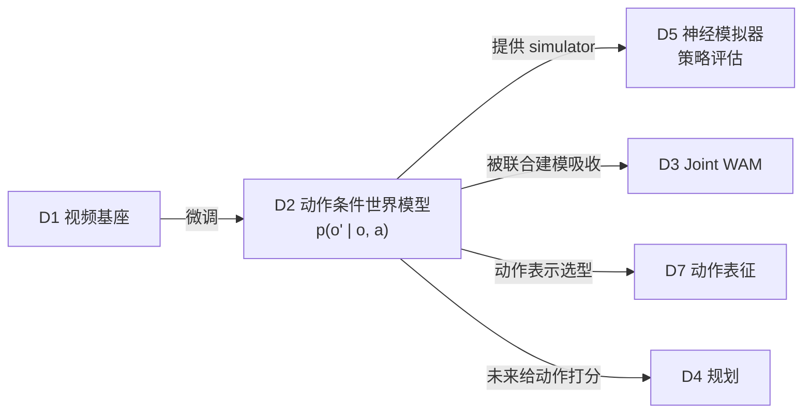

# 03 · 动作条件世界模型（D2）

> **核心问题**：$p(o_{t+1:t+H} \mid o_{\le t}, a_{t:t+H-1})$ 究竟学得对不对？
> 判据不是"视频像不像"，而是"**换一个动作，未来会不会真的不一样**"。
> 本篇给出反事实可辨识性的形式化，并用 Lab D2 说明**动作表示必须是空间对齐的**。

---

## 1. 定义与地位

动作条件世界模型（action-conditioned world model）学习

$$f_\theta: (o_{\le t},\, a_{t:t+H-1},\, l) \mapsto \hat{o}_{t+1:t+H}$$

它是 WAM 的**前向动力学分支**（式 2.1 的第二个因子），也是 WAM 区别于普通视频生成的**唯一标志**。

在架构上它可以独立存在（OSCAR、Cosmos-Predict2.5 action-cond），也可以作为 joint WAM 的一个推理模式（τ₀-WM 的 ACVS、MotuBrain 的 world modeling 模式）。

---

## 2. 条件注入的四种数学形式

设观测 latent 为 $z \in \mathbb{R}^{N \times d}$，动作为 $a$，注入函数 $\phi$。

### 2.1 拼接 token

$$z' = \big[\,z;\ \phi(a)\,\big] \in \mathbb{R}^{(N + N_a) \times d}$$

动作成为序列里的额外 token，注意力自然处理交互。**表达能力最强**，代价是序列变长、注意力代价 $\propto (N+N_a)^2$。τ₀-WM、SimWAM、UNIVERSE 都用这类。

### 2.2 自适应层归一化（AdaLN）

$$z' = \gamma(a, t) \odot \frac{z - \mu(z)}{\sigma(z)} + \beta(a, t)$$

**参数效率最高**，但注意：$\gamma, \beta \in \mathbb{R}^d$ 是**全局**向量，对每个空间位置施加同样的调制。

形式化地说，AdaLN 能表达的函数类是

$$\mathcal{F}_{\text{AdaLN}} = \big\{\, z \mapsto \Gamma z + \mathrm{b} \;\big|\; \Gamma = \mathrm{diag}(\gamma),\ \mathrm{b} \in \mathbb{R}^{N\times d} \text{ 与位置无关}\,\big\}$$

它**无法表达"只在图像左上角做个动作"**这类空间定位的调制。这是 AdaLN 用于动作条件的根本限制。

### 2.3 交叉注意力

$$z' = z + \mathrm{Attn}\big(Q = W_q z,\ K = W_k \phi(a),\ V = W_v \phi(a)\big)$$

可以学到软的空间路由（哪个图像区域对应哪个动作分量），但路由是**学出来的而非已知的**，需要大量数据才能对齐。DriveWAM 的 VLM 语义引导走这条（引导的是语义意图，不需要像素级定位，所以合适）。

### 2.4 空间对齐渲染（pixel-aligned conditioning）

把动作渲染成**与观测同 shape 的图**，然后相加或拼接：

$$z' = z + \mathrm{Patchify}\big(\mathrm{VAE}(\mathcal{R}(a))\big)$$

其中 $\mathcal{R}$ 是渲染函数（骨架、pointmap、占据栅格）。

这是 [OSCAR (2606.04463)](https://arxiv.org/abs/2606.04463) 的做法。它的关键在于：**动作与观测在同一坐标系里对齐**，空间对应关系是**硬编码的**，不需要学。

---

## 3. 反事实可辨识性：动作对齐的理论

### 3.1 定义

**定义（$\delta$-反事实可辨识）**：称 $f_\theta$ 是 $\delta$-反事实可辨识的，若对任意 $o$ 与任意 $a_1 \ne a_2$：

$$\frac{d\big(f(o, a_1),\, f(o, a_2)\big)}{d(a_1, a_2)} \ge \delta > 0$$

这就是 01 §6.1 的动作敏感度 $\mathcal{S}(f)$ 的逐点版本。$\mathcal{S}(f) = 0$ 意味着模型对动作完全不敏感。

### 3.2 信息瓶颈：为什么 latent action 会失败

很多方法（IRASim、Ctrl-World、AdaWorld、DreamDojo）把机器人状态压缩成一个学习出的低维嵌入：

$$a \xrightarrow{\ \mathrm{encoder}\ } u \in \mathbb{R}^{k},\quad k \ll \dim(o)$$

此时未来预测可用的动作信息被信道容量卡住：

$$I\big(A ; \hat{O}' \mid O\big) \le I(A ; U) \le H(U) \le k \log(\text{range})$$

同时，模型必须从 $u$ **重建出空间位置**——这是一个额外的解耦任务，需要数据去学。而真实机器人数据集的规模（$10^3$–$10^5$ 条）远小于视频预训练（$10^7$+），样本效率就成了致命问题。

### 3.3 空间对齐为什么更好

若条件 $\mathcal{R}(a)$ 与观测在同一格点上，则模型只需要学一个**逐元素/局部的**映射：

$$\hat{o}'[p] = \Psi\big(o[\mathcal{N}(p)],\ \mathcal{R}(a)[\mathcal{N}(p)]\big)$$

其中 $\mathcal{N}(p)$ 是 $p$ 的局部邻域。这把全局的"动作→空间位置"解耦问题，降维成局部的"给定位置的外力→位移"问题。

**归纳偏置的收益 = 数据效率**，而不是表达能力的上限（MLP 理论上都能学）。

### 3.4 Lab D2：实测数据效率差异

任务：$4\times4$ 高度场 $o \in \mathbb{R}^{16}$，动作 = 在某格点 $(i,j)$ 施加位移 $\delta$，真实效果与当地质量**双线性**：

$$o'[p] = o[p] + \delta \cdot o[i,j] \cdot \kappa_{i,j}(p)$$

其中 $\kappa$ 是归一化高斯核。两个模型容量完全相同（2 层 MLP，hidden 64，Adam，400 epoch），**唯一差别是动作的表示**：

- **紧凑向量**：$a = (i/G,\ j/G,\ \delta,\ \delta^2) \in \mathbb{R}^4$
- **空间渲染**：$r = \delta \cdot \kappa_{i,j} \in \mathbb{R}^{16}$（与观测同 shape）

```
== Lab D2: 动作条件的两种表示 —— 紧凑 latent vs 空间对齐渲染 ==
  任务: 4x4 高度场, 推动作, 效果与当地质量成双线性关系
      训练样本 |          紧凑动作向量(a∈R^4) |          空间渲染场(r∈R^16)
  ------------------------------------------------------------
       200 |                0.00463 |                0.00143   (渲染/紧凑 = 3.24x)
       500 |                0.00332 |                0.00137   (渲染/紧凑 = 2.42x)
      2000 |                0.00209 |                0.00116   (渲染/紧凑 = 1.79x)
      8000 |                0.00168 |                0.00099   (渲染/紧凑 = 1.69x)
```

读法：

- 空间渲染在所有数据规模下都更准；
- **数据越少优势越大**：200 样本时 3.24×，8000 样本时降到 1.69×。这正是归纳偏置收益的典型形态——数据趋于无穷时两者差距收敛，但实际机器人数据永远在"少"的一侧。
- 注意差距**没有消失**（1.69×），说明这里不只是优化难度问题，而是表示本身的信息结构差异。

**结论**：在机器人数据规模下，动作条件应优先选择**与观测空间对齐**的表示（骨架、pointmap、占据栅格），而不是紧凑 latent。这是 OSCAR 选择骨架渲染的理论依据。

---

## 4. OSCAR 详解：骨架条件化

### 4.1 渲染管线

给定 URDF 模型 $\mathcal{M}$ 与关节配置 $q_t$，骨架渲染 $\mathcal{R}$ 分三步：

1. **正向运动学**：得到每个连杆的 SE(3) 位姿
 $${}^{0}T_i(q_t) = \prod_{k \le i} \exp(\hat{\xi}_k q_{t,k}) \cdot {}^{0}T_i(0)$$
 （POE 公式，$\xi_k$ 为螺旋轴）

2. **投影**：连杆原点经内外参投到像素
 $$p_i = K \cdot {}^{c}T_{0} \cdot {}^{0}T_i(q_t) \cdot \mathbf{0}$$

3. **光栅化**：连杆之间画线段，关节处画实心圆，黑色背景

结果是一张**无纹理的骨架图** $S_t \in \mathbb{R}^{H \times W \times 3}$。

### 4.2 为什么这个设计能跨本体

关键性质：**渲染只依赖运动学链**。换本体 = 换 URDF；换成人手 = 换成 MANO 模型。输出格式完全一致。

形式化地，设本体集合 $\mathcal{E}$，骨架渲染是一个**本体无关的同态**：

$$\mathcal{R}: (\mathcal{M}_e, q_t) \mapsto S_t, \quad \forall e \in \mathcal{E},\ S_t \in \mathbb{R}^{H\times W\times 3}$$

而 latent action 无法做到这点，因为不同本体的 $u$ 在不同子空间里。

### 4.3 两个设计细节

- **第一帧 RGB 锚定外观**：骨架图没有纹理，模型无法把运动绑定到具体机器人外观，因此用第一帧 RGB 做外观锚定。这是一个很巧的处理——把"外观"和"运动"两个因子**显式分离**，正是 01 §2.1 里 world-action factorization 的一个实例。
- **注入方式**：骨架序列过**与视频相同的 VAE**，得到同 shape 的 latent，patchify 后与噪声视频 latent **相加**，再去噪。CFG 训练时以概率 0.2 丢弃骨架流。

$$\tilde{z} = z_{\text{noise}} + \mathrm{Patch}\big(\mathrm{VAE}(S_{1:T})\big)$$

用同一个 VAE 是关键：保证两个 latent 在同一度量空间里，相加才有意义。

### 4.4 实测

OSCAR 在 Cosmos-Predict2.5-2B 上单张 GH200 微调：

| 指标 | 值 | 层次 |
|:---|:---|:---|
| PSNR | 24.24 | L1 视觉保真 |
| SSIM | 0.846 | L1 |
| LPIPS | 0.094 | L1 |
| FVD | 7.08 | L1 |
| **Spearman（vs 真机排序）** | **0.750** | **L4 决策相关** |
| **Pearson** | **0.852** | **L4** |

击败了参数量大得多的基线（包括 14B 的 pointmap 模型）。按 01 §9 的四层框架，**L4 那两个数才是它真正的贡献**（详见方向 D5）。

---

## 5. 动作条件化方案对照

| 方案 | 表示 | 空间对齐 | 跨本体 | 表达接触/力 | 代表 |
|:---|:---|:---:|:---:|:---:|:---|
| latent action | 学习嵌入 $\mathbb{R}^k$ | ✗ | ✓ | ✗ | IRASim、Ctrl-World、AdaWorld |
| gripper state | 末端位姿 SE(3) | 部分 | ✓ | ✗ | EnerVerse-AC、Genie Envisioner |
| **骨架渲染** | 2D 运动学树 | **✓** | **✓✓** | 部分 | **OSCAR**、VAP |
| pointmap | 3D 点轨迹图 | ✓ | ✗（绑外观） | ✓ | Kinema4D |
| occupancy | 占据栅格 | ✓ | ✗ | ✗ | ORV |
| point tracking | 2D 点轨迹 + 可见性 | ✓ | ✓ | ✓ | **JOPAT (2605.23856)** |

[JOPAT](https://arxiv.org/abs/2605.23856) 值得单独提：它在联合去噪状态里加入 2D 点追踪和**可见性通道**，让动作采样读到的是"对应关系级"的运动变量，从而能区分"物体没动"和"物体被遮挡了"。这是对纯外观 latent 的一个精确修补——外观 latent 在这两种情况下是一样的，但物理含义完全不同。

---

## 6. 评测：该报什么

按 01 §9 的四层框架，动作条件世界模型**必须**报 L3 与 L4：

**L3 动作对齐**
- 动作敏感度 $\mathcal{S}(f)$（式 6.1）
- 反事实准确率：给定 $(o, a_1)$ 的真实未来 $o'_1$ 与 $(o, a_2)$ 的真实未来 $o'_2$，模型是否把 $\hat{o}'_1$ 判得更接近 $o'_1$

**L4 决策相关**
- 在世界模型内跑 Monte Carlo rollout，用 VLM 或任务进度模型打分，与真机成功率算 **Spearman / Pearson**
- [WorldGym (2506.00613)](https://arxiv.org/abs/2506.00613) 与 [OSCAR](https://arxiv.org/abs/2606.04463) 都在用这个

**目前缺标准**：没有任何 benchmark 把 L3 作为主指标。这是本方向**最明显的空白**，也是最容易出成果的地方。

---

## 7. 与相邻方向的接口



---

## 8. 要点

1. 动作条件注入有四种数学形式，**AdaLN 只能做全局调制，无法空间定位**（§2.2）。
2. **反事实可辨识性**是判据：$\mathcal{S}(f) > \delta$（§3.1）。
3. **空间对齐的表示在有限数据下显著更好**，且数据越少优势越大（Lab D2：200 样本时 3.24×）。latent action 的信息瓶颈 + 需要额外学空间解耦，是它失败的原因（§3.2）。
4. OSCAR 的骨架渲染是一个**本体无关同态**，跨本体能力来自"渲染只依赖运动学链"（§4.2）。
5. 评测必须报 L3/L4，目前无标准 benchmark——这是空白也是机会（§6）。

---

**上一篇**：[02 · 视频基座作为世界先验](./02-video-foundation-prior.md) ｜ **下一篇**：[04 · 联合世界-动作建模](./04-joint-world-action.md)
