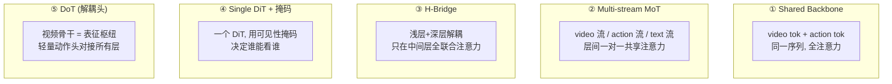

# 04 · 联合世界-动作建模（D3）

> **核心问题**：未来预测和动作生成，要不要放进同一个生成过程？
> 2026 年的答案已经很清楚：**要**。本篇给出这个转变的数学理由（不是经验理由），并梳理 joint 的五种架构实现。

---

## 1. Cascade 的两种形式与它们的数学缺陷

回顾 01 §2.1 的两个因子分解：

$$\text{(action-first)}\quad p(o', a \mid o, l) = p(a \mid o, l)\, p(o' \mid o, a, l)$$
$$\text{(scene-first)}\quad p(o', a \mid o, l) = p(o' \mid o, l)\, p(a \mid o, o', l)$$

两者都在“条件”上做了截断：第一步的输出**不受第二步影响**。这带来两类失效。

### 1.1 action-first 的失效：单峰头无法表达多峰策略

$p(a \mid o, l)$ 在真实任务里是**多峰的**（绕过障碍物可以往左也可以往右）。若用 MSE/flow matching 头去拟合，学到的速度场是后验均值（01 §4.1），倾向于把概率质量放到模式之间的低密度区。

**这不是 flow matching 的缺陷，是 cascade 的缺陷**：joint 模型同样用 flow matching，但它可以在**条件于未来**的情况下做采样，把多峰性保留下来。

### 1.2 scene-first 的失效：边缘未来被“平均掉”

这是更严重、也更容易被忽视的一个。$p(o' \mid o, l)$ 是**边缘分布**——动作被积分掉了：

$$p(o' \mid o, l) = \int p(o' \mid o, a, l)\, p(a \mid o, l)\, da$$

若动作分布是多峰的，边缘 $p(o')$ 也是多峰的。而 MSE 训练出的确定性预测器输出的是

$$\hat{o}' = \arg\min \; \mathbb{E}\|\hat{o}' - o'\|^2 = \mathbb{E}[o' \mid o, l]$$

**期望值落在两个峰之间的低密度区**——一个物理上不可实现的未来。再从这个“平均未来”做逆动力学，得到的动作大概率也不可行。

### 1.3 Lab D3：量化这个失效

构造一个有两个可行解的任务：动作分布为两个簇 $m_1 = (-3,-1)$、$m_2 = (3,1)$，未来由线性映射 $o' = M a$ 给出。

```
== Lab D3: Cascade(scene-first) 在多峰任务上的失效 ==
  动作模式   a1=[-3. -1.], a2=[3. 1.]
  对应未来   o1=[-3.9 -1.2], o2=[3.9 1.2]   间距 D=8.16

  MSE 最优的边缘未来预测 = 中点 [0. 0.]
    中点处混合密度 = 0.0000
    真实模式处密度 = 0.0796
    密度比(中点/模式) = 0.000   <- 中点落在低密度区

  逆动力学从中点反解出的动作 = [0. 0.]
    到最近真实动作模式的距离 = 3.16
    两模式间距的一半         = 3.16

  Cascade 输出动作 a_mid 的可行性(阈值 r=1.0): 0.0
  Joint 采样动作的可行性(5000 样本): 0.996
```

**Cascade 的成功率是 0，joint 是 99.6%。** 而且注意：MSE 最优预测器做到了它在数学上能做的最好——它给出的正是期望值。**这不是训练不够，是目标函数选错了。**

模式间距的敏感性扫描：

```
  模式间距 D 对'中点是否可行'的影响 (sigma=1.0):
    D=2: 密度比=0.9181   中点反解动作到模式距离=1.00 (半间距 1.0)
    D=3: 密度比=0.3908   中点反解动作到模式距离=1.50 (半间距 1.5)
    D=4: 密度比=0.1100   中点反解动作到模式距离=2.00 (半间距 2.0)
    D=5: 密度比=0.0215   中点反解动作到模式距离=2.50 (半间距 2.5)
    D=6: 密度比=0.0029   中点反解动作到模式距离=3.00 (半间距 3.0)
    D=8: 密度比=0.0000   中点反解动作到模式距离=4.00 (半间距 4.0)
```

**阈值大约在 $D \approx 4\sigma$（密度比 0.11）**：模式间距小于约 4 个标准差时，平均未来还在高密度区，cascade 能凑合用；超过之后，cascade 的输出迅速掉到低密度区，成功率崩塌。

**这对任务选型有直接指导**：多解性强的任务（绕障、放置位姿、交互式驾驶）不能用 cascade；单解性强的任务（抓取固定物体）cascade 尚可。

---

## 2. Joint 的五种架构实现



### 2.1 Shared Backbone（单序列全注意力）

把视频 token 与动作 token 拼成一个序列，走同一个 DiT：

$$y = [\, z^{\text{vid}}_1, \dots, z^{\text{vid}}_N,\ z^{\text{act}}_1, \dots, z^{\text{act}}_{N_a} \,], \quad y' = \mathrm{DiT}(y)$$

- 优点：耦合最强，实现最简。
- 缺点：动作推理必须跑完整个视频骨干（$\propto N^2$ 注意力），延迟高；且动作 token 被强行放进视频的 3D RoPE 坐标系。

### 2.2 Multi-stream MoT（混合 Transformer）

[MotuBrain (2604.27792)](https://arxiv.org/abs/2604.27792) 的三流设计：视频流 $h^v$、动作流 $h^a$、文本流 $h^t$，各流有**独立的** QKV 与 FFN，但共享注意力池：

$$\mathrm{Attn}_i = \mathrm{softmax}\!\left(\frac{[q^v_i; q^a_i; q^t_i][k^v_i; k^a_i; k^t_i]^\top}{\sqrt{d}}\right)[v^v_i; v^a_i; v^t_i]$$

第 $i$ 层的输出流各自回写：

$$h^{v}_{i+1} = \mathrm{FFN}^v_i(\mathrm{Attn}^v_i), \quad h^{a}_{i+1} = \mathrm{FFN}^a_i(\mathrm{Attn}^a_i)$$

**关键**：MoT 让动作流可以有自己的深度、宽度、甚至推理调度（比如动作流少跑几层）。

代价：为了共享注意力，动作流通常要与视频流**层间一一对应**，这就把动作深度绑死在视频深度上——这正是 Faster-WAM 要打破的（见 D8）。

### 2.3 UniDiffuser：一个模型，五种推理模式

MotuBrain 用的 UniDiffuser 形式，核心思想是**用噪声水平区分模态**。给每个模态分配一个独立的噪声尺度 $t^m$，训练时随机采样哪些模态是“干净的”（$t=0$，条件）、哪些是“要生成的”（$t>0$）：

$$\mathcal{L} = \mathbb{E}_{m, t^m, \epsilon}\big\| \epsilon - \epsilon_\theta(y_{t^v}, y_{t^a}, y_{t^t}, t^v, t^a, t^t) \big\|^2$$

推理时通过**指定哪些模态加噪**来切换模式：

| 模式 | 加噪（要生成）的模态 | 条件的模态 |
|:---|:---|:---|
| Policy (VLA) | action | obs video, text |
| World modeling | future video | obs, action, text |
| Video generation | future video | obs, text |
| **Inverse dynamics** | action | obs, future video, text |
| **Joint prediction** | video + action | obs, text |

**这是 joint WAM 最优雅的实现**：五种能力是同一个模型的五种“查询方式”，不是五个头。数学上它学的是**完整联合分布** $p(y^v, y^a, y^t)$，推理时通过指定条件子集来取不同的条件分布。

### 2.4 Single DiT + 可见性掩码

[UNIVERSE (2607.05133)](https://arxiv.org/abs/2607.05133) 走另一条路：**只有一个 DiT**，视频 token 与轨迹 token 共享全部生成参数，靠掩码决定谁能看谁：

$$\mathrm{Attn} = \mathrm{softmax}\!\left(\frac{QK^\top}{\sqrt d} + \log M\right)V$$

Modality-Decoupling Visibility Mask 的规则：

- 历史上下文（观测、历史动作）→ 两个模态**都能看**
- 未来视频 token ↔ 未来轨迹 token → **互相不可见**

这解决了两个问题：
1. **防泄漏**：未来视频不能把答案直接告诉轨迹分支（否则推理时没有未来视频就崩了）。
2. **可部署**：推理时直接去掉未来视频的去噪，只跑轨迹 → **4.3× 加速**，精度相当。

### 2.5 隔离掩码：训练时用未来，推理时不用

[SimWAM (2608.07468)](https://arxiv.org/abs/2608.07468) 更进一步：用隔离注意力掩码让**动作预测根本不依赖未来帧**：

$$M[a \to \text{future video}] = 0$$

于是视频分支在训练时只作为**辅助监督**塑造表征，推理时可以整个丢掉，留下一个自包含的规划器。这是 01 §2.2 判定边界第 ③ 条（“未来训练动作通路”）的典型实现。

---

## 3. 耦合位置：消融证据

**该在哪几层让两个模态交互？** 这是 joint WAM 最实际的架构问题。[Faster-WAM (2608.02365)](https://arxiv.org/abs/2608.02365) 在 LIBERO-Plus 上给了目前最干净的递进消融：

| 配置 | LIBERO-Plus 成功率 | 增量 |
|:---|---:|---:|
| 单层动作头，只用视频最后一层 | 49.5% | — |
| + KV-Fusion（聚合**所有**视频层的 KV） | 66.8% | +17.3 |
| + 视频-动作 RoPE 对齐 | 71.3% | +4.5 |
| + 移除动作头的文本交叉注意力 | 75.0% | +3.7 |

三条可读出的结论：

1. **中间层的信息很重要**：只用最后一层（49.5%）远不如聚合所有层（66.8%）。注意 Faster-WAM 发现“最弱的融合信号集中在中间视频层，但相当一部分分布于全骨干”——**没有哪几层是可以安全砍掉的**。这与 MotuBrain 的 H-Bridge（只在中间层联合注意力）形成有趣张力：两者的结论并不一致，可能是任务/骨干差异，值得复现。

2. **RoPE 基失配是个真问题**（+4.5%）：视频 key 用 3D RoPE$(t,y,x)$，动作 query 用 1D RoPE$(t)$。两者的旋转基频率分组不同，交叉项 $\langle R_{\text{3D}}k,\; R_{\text{1D}}q\rangle$ 不再只依赖相对位移，**位置信息被破坏**。修正方式是把视频 key 重投影到动作的坐标系（详见 D8）。

3. **语言条件应该走视频骨干，不应该给动作头单独做**（+3.7%）：轻量化动作头容量不够，单独建模文本注意力反而损害指令对齐。这是一个很实用的设计规则。

---

## 4. Chunk 级 vs 事件级

Joint WAM 的部署单元是 **chunk**：一次生成 $H$ 帧未来 + $H$ 步动作。这带来一个数学限制：

**无法做单步反事实**。要回答“第 3 步换个动作会怎样”，必须重新生成整个 chunk。

[WALL-WM (2606.01955)](https://arxiv.org/abs/2606.01955) 的对策是把切分单位从“固定 chunk”改成**事件（event joint）**：

$$\text{trajectory} = [e_1, e_2, \dots, e_K], \quad e_k = \text{一个语义完整的子动作}$$

配套技术：
- **Camera RoPE + 视锥几何掩码**：免标定的多相机支持（不同相机布局下，只有落在视锥内的 token 参与注意力）
- **Staircase 并行推理**：潜链式的阶梯并行解码，支持变长事件

这是把 WAM 的“时间抽象”从固定步长提升到语义级——与经典的 options / 宏动作理论是一脉相承的。

---

## 5. 对照表

| 架构 | 耦合强度 | 推理成本 | 能否丢弃视频分支 | 代表 |
|:---|:---:|:---:|:---:|:---|
| Cascade (scene-first) | 单向 | 高（先生成视频） | ✗ | VERA、早期 DriveWAM 类 |
| Cascade (action-first) | 单向 | 中（只在评估时用视频） | ✓ | τ₀-WM |
| Shared backbone | 最强 | 最高 | ✗ | 早期 joint 方法 |
| MoT / UniDiffuser | 强 | 高 | 部分 | **MotuBrain** |
| H-Bridge | 中（仅中间层） | 中 | 部分 | MotuBrain 变体、DiT4DiT |
| Single DiT + 掩码 | 强（可配置） | 低（可只跑动作） | **✓** | **UNIVERSE**、SimWAM |
| DoT（解耦头） | 中 | **最低** | ✓ | **Faster-WAM** |

---

## 6. 收敛度判断

**已收敛**：
- “要联合，不要 cascade”——Lab D3 给出了数学理由（多峰任务上 cascade 成功率为 0）。
- 用掩码而非多模型来切换推理模式（UNIVERSE、SimWAM）。
- 耦合位置不能只放最后一层（Faster-WAM 消融 +17.3%）。

**未收敛**：
- **world-action factorization**——共享参数里哪部分归世界、哪部分归动作？目前纯靠架构试。
- **耦合层数/位置的规律**：H-Bridge（只中间层）vs KV-Fusion（全层聚合）结论不一致。
- **chunk 长度与事件切分**：固定 chunk 还是事件级，尚无定论。
- **动作 token 的位置编码**：3D/1D RoPE 混用是个坑，没有统一解法。

---

## 7. 要点

1. Cascade 的失效是**目标函数层面的**，不是训练不足：MSE 最优预测器给出期望值，落在多峰分布的低密度区（§1.2，Lab D3 成功率 0 vs 99.6%）。
2. 阈值约 $D \approx 4\sigma$：模式间距超过 4 个标准差，cascade 就崩（§1.3）。
3. UniDiffuser 用**噪声水平**区分模态，一个模型五种推理模式——这是 joint 最优雅的实现（§2.3）。
4. 可见性掩码是 2026 年的关键工程技巧：既能防未来泄漏，又能让推理时只跑动作分支（UNIVERSE 4.3×）（§2.4）。
5. **耦合位置要跨层聚合**，且**语言条件应走视频骨干而非动作头**（§3）。

---

**上一篇**：[03 · 动作条件世界模型](./03-action-conditioned-wm.md) ｜ **下一篇**：[05 · 世界模型与规划](./05-world-model-planning.md)
