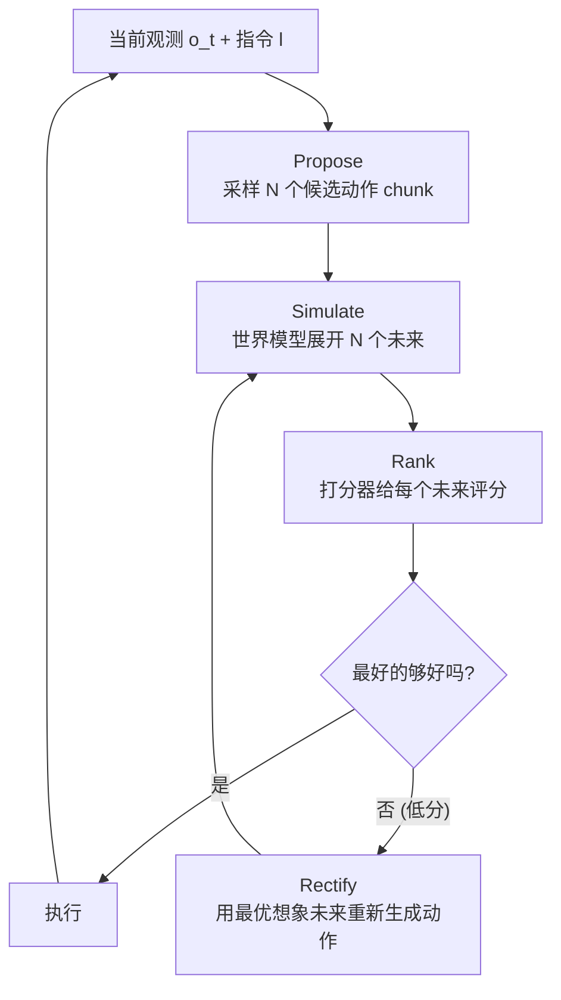

# 05 · 世界模型与规划（D4）

> **核心问题**：推理时多花的那份算力，能换回多少决策质量？
> 本篇给规划建立形式化（MPC / CEM / rectify），并用 Lab D4 量化两件事：
> **模型误差如何吃掉规划收益**，以及**采样预算在哪里饱和**。

---

## 1. 规划的形式化

### 1.1 基本问题

$$a^*_{0:H} = \arg\max_{a_{0:H}} \; J\Big(f_\theta\big(o_0, a_{0:H}\big)\Big) \tag{5.1}$$

其中 $f_\theta$ 是世界模型，$J$ 是打分器。与 01 §8 的区别是这里显式写出**序列决策**。

### 1.2 Receding Horizon（MPC）

真正的部署不是“规划一次执行到底”，而是：

$$\text{规划 } H \text{ 步} \to \text{执行 } k \text{ 步} \to \text{重新观测} \to \text{重新规划}$$

这就是 §7 的**观测刷新**，也是模型预测控制的经典形式。它把开环误差累积（式 7.1）变成有界（式 7.2）。

**关键参数**：$k$（执行步数）。Lab B 显示 $k=4$–$8$ 是性价比拐点。

### 1.3 三层规划流水线

2026 年 WAM 的 test-time 规划基本都长这样：



---

## 2. 打分器 $J$ 的三种来源

| 来源 | 数学形式 | 优点 | 缺点 | 代表 |
|:---|:---|:---|:---|:---|
| **学到的 value / 进度** | $J = V_\phi(\hat{o}')$ 或密集任务进度 | 稠密、便宜 | 需要额外标注/训练 | τ₀-WM（dense task-progress） |
| **VLM 裁判** | $J = \mathrm{VLM}(\hat{o}', l)$ | 零标注、泛化好 | 慢、保守、校准差 | WorldGym |
| **重去噪一致性** | $J = -\|\text{re-denoise}(a+\sigma\epsilon) - a\|$ | **不需要外部裁判** | 只衡量“像不像”，不衡量“好不好” | τ₀-WM |

### 2.1 重去噪一致性（re-denoising consistency）

这是 τ₀-WM 的一个巧妙设计。把候选动作 $a_i$ 加噪到 $\sigma$，再让模型去噪回 $\tilde{a}_i$：

$$s_{\text{cons}}(a_i) = -\big\|\, \mathrm{Denoise}_\theta(a_i + \sigma\epsilon;\ o, l) - a_i \,\big\|^2$$

**数学含义**：若 $a_i$ 位于学到的条件分布 $p_\theta(a \mid o, l)$ 的高密度区，去噪动力学会把它拉回附近；若 $a_i$ 在低密度区（采样噪声、模式间），去噪会把它拉向最近的模式，位移就大。

所以它是在**用去噪动力学隐式估计密度**——与扩散模型里 “$\|\epsilon_\theta(x_t,t)\|$ 反映 $p(x_t)$ 的局部结构” 是同一回事。

**局限**：它只回答“这个动作像不像模型会做的”，不回答“这个动作的后果好不好”。所以 τ₀-WM 把它和基于模拟器的进度打分**串联**使用：一致性筛掉离群的，模拟器评估留下来的。

### 2.2 密集任务进度（dense task-progress）

τ₀-WM 的 ACVS 不预测一个标量回报，而是预测**每一步的任务进度** $\hat{p}_t \in [0,1]$：

$$\hat{p}_{1:H},\ \hat{o}'_{1:H} = \mathrm{ACVS}(o_0, l, a_{0:H})$$

密集监督比稀疏成功标签的样本效率高得多——这正好补上了“rollout/failure 轨迹”（τ₀-WM 数据的一部分）通常只有稀疏标签的问题。

---

## 3. τ₀-WM：目前最完整的规划实现

[τ₀-WM (2606.01027)](https://arxiv.org/abs/2606.01027) 在一个共享的视频扩散骨干上开两个接口：

| 接口 | 输入 | 输出 | 回答的问题 |
|:---|:---|:---|:---|
| **VAM**（Video Action Model） | 多视角观测 + 指令 + 机器人状态 | 未来视觉 latent **+ 连续动作 chunk** | 我该做什么 |
| **ACVS**（Action-Conditioned Video Simulator） | 当前观测 + 指令 + **候选动作 chunk** | 多视角未来 rollout **+ 密集任务进度** | 这么做会怎样 |

骨干规模：5.5B 的 Wan2.2-TI2V-5B 视频 DiT + 0.5B 的 Action DiT（交叉注意力耦合）+ 独立的 ACVS。

### 3.1 推理流程

1. **Propose**：从 VAM 采样 $N$ 个候选动作 chunk
2. **Rank（便宜）**：用重去噪一致性给候选排序
3. **判定**：若最优候选分数低于阈值，进入第 4 步
4. **Rectify（贵）**：用 ACVS 模拟候选的未来并估计任务进度；用最有希望的想象未来**条件化第二次 VAM 查询**，产出修正后的动作 chunk

第 4 步就是 01 §8.1 的 **rectify**，数学上：

$$a^{\text{new}} \sim p_\theta\big(a \,\big|\, o, l, \hat{o}'_{i^*}\big)$$

这是对式 (2.1) 与式 (2.2) 两个因子分解的**交替使用**（EM / 坐标上升）。它直接修补了 §1.2 的 cascade 缺陷——因为第二次生成时，未来已经是被“选中”的那个模式，不再是平均态。

### 3.2 为什么“先便宜后贵”是合理的

一致性打分只要一次前向（便宜），模拟器展开要跑完整视频扩散（贵）。所以流程是：

$$\underbrace{N \times \text{一致性}}_{\text{便宜}} \xrightarrow{\text{筛选}} \underbrace{k \times \text{模拟}}_{\text{贵}}, \quad k \ll N$$

这是一个 **two-stage 的 test-time compute 分配策略**，本质上是把算力花在刀刃上。

---

## 4. Cosmos Policy：把 value 编成一帧

[Cosmos Policy (2601.16163)](https://arxiv.org/abs/2601.16163) 的规划走的是另一条路：**不改变架构，把价值函数编成潜序列的一帧**（01 §5.1）。

11 帧潜序列布局：

$$\big[\varnothing,\ q^{\text{proprio}},\ I^{\text{wrist}},\ I^{c_1},\ I^{c_2},\ \mathbf{a}^{\text{chunk}},\ \hat{q},\ \hat{I}^{\text{wrist}},\ \hat{I}^{c_1},\ \hat{I}^{c_2},\ \mathbf{V}\big]$$

规划时的 best-of-N 用了**两个 checkpoint**（policy model + planning model），做 $3 \times 5 = 15$ 次预测后取 majority mean 聚合。

**值得注意的限制**：论文自己写了规划模式生成一个 action chunk 约需 **5 秒**。这直接说明：**基于视频扩散的规划在当前算力下还进不了实时闭环**。这是 D8（效率）要解决的核心矛盾。

---

## 5. Lab D4：规划收益的量化

设置：4 维状态、2 维动作、视野 $H=12$（用 3 个控制点参数化 → 6 维搜索空间），真动力学谱半径 0.95。世界模型用有限样本拟合，因此**有误差**。所有规划器用 CEM（6 轮），最后用**真动力学**执行并计算真实回报（$-\|s_H - \text{goal}\|^2$，越高越好）。

### 5.1 模型误差如何吃掉规划收益

```
== Lab D4b: 世界模型误差如何吃掉规划收益 (CEM, 6 轮, 每轮 32 样本) ==
      拟合样本     噪声  ||A-Ah||  ||B-Bh||         CEM(模型)真实回报      CEM(真模型)      收益损失
  --------------------------------------------------------------------------------
       100   0.30    0.1239    0.0965              -1.823        -1.559    -0.264
       200   0.30    0.1007    0.0497              -1.928        -1.551    -0.376
       400   0.15    0.0302    0.0160              -1.704        -1.607    -0.097
      1000   0.10    0.0074    0.0101              -1.635        -1.579    -0.056
      4000   0.05    0.0024    0.0023              -1.613        -1.592    -0.021
     20000   0.02    0.0007    0.0004              -1.711        -1.779     0.068
```

读法（噪声量级约 ±0.15，最后一行已进入噪声区）：

- **模型误差是最硬的约束**：$\|A - \hat{A}\|_F$ 从 0.002 涨到 0.124，规划的真实回报损失从 ~0 涨到 **0.26–0.38**。
- 有意思的是：**误差最大的两行损失也最大，但 200 样本比 100 样本损失还大**——说明 $\hat{B}$ 的误差（动作敏感度！）比 $\hat{A}$ 的误差更致命。这和 01 §6 / 03 §3 的结论一致：**动作通道的误差是决策的杀手**。
- 当模型足够准（$\|A-\hat{A}\| < 0.01$）时，用模型规划和用真模型规划**没有可观测差别**。这给出一个实用判据：**先量你的世界模型误差，再决定要不要上规划**。

### 5.2 采样预算在哪里饱和

```
== Lab D4c: 采样预算的边际收益 (模型 n=400, 噪声 0.15) ==
        每轮样本 N          真实回报        相对 N=8 的改善
  ----------------------------------------------
             8        -2.443             0.000
            16        -1.843             0.600
            32        -1.750             0.693
            64        -1.364             1.079
           128        -1.508             0.935
           256        -1.385             1.058
```

**边际收益在 $N \approx 64$ 之后就饱和了**，继续加采样只换来噪声（$N=128$ 甚至比 $N=64$ 差）。这是**模型利用（model exploitation）**的典型表现：优化器开始找到那些“在模型里好、在真实里不好”的动作序列。

结合前面的 Best-of-N 扫描（同一设置的另一组实验）：

```
  随机采样 N=1                                 -13.872
  Best-of-N  N=8                            -3.329
  Best-of-N  N=32                           -2.310
  Best-of-N  N=128                          -1.833
  Best-of-N  N=512                          -1.661
```

$N$ 从 1 到 8 的收益是 **+10.5**，从 8 到 512（64 倍算力）只有 **+1.7**。**对数级收益**——这解释了为什么“堆 test-time compute”不是万能的，也解释了 τ₀-WM 为什么要做“先便宜筛选后昂贵模拟”。

**工程结论**：
1. 规划预算存在饱和点（本实验 $N\approx64$），超过之后只会被模型误差反噬。
2. 加大 $N$ 的收益远不如**减小模型误差**（对比 5.1：把 $\|A-\hat{A}\|$ 从 0.12 降到 0.03 换回 0.28，比 $N$ 翻 64 倍换回的 1.7 更“便宜”——如果模型改进的成本可控）。
3. 因此正确的投入顺序是：**先把世界模型的动作通道做准 → 再上规划 → 最后才加采样预算**。

---

## 6. WAM 规划 = Foundation-Model 化的 MPC

对照经典 MBRL：

| | 经典 MPC / MBRL | WAM 规划 |
|:---|:---|:---|
| 动力学 | 学到的 latent 转移 $p(z'\|z,a)$ | 视频扩散 $p(o'\|o,a)$ |
| 打分 | 学到的 reward + value | value 帧 / VLM / 一致性 |
| 优化 | CEM、梯度（可微时） | **采样 + 排序 + rectify**（不可微，零阶） |
| 视野 | 通常 $H \le 15$ | chunk 级，$H$ = 帧数 |
| 误差处理 | 短视野 + 频繁重规划 | 同样需要，但代价高得多 |

**核心差别是打分器不可微**。视频扩散模型是一整个 ODE 求解过程，$\partial J / \partial a$ 要么算不起，要么数值不稳定。所以 WAM 规划只能用零阶方法（采样、CEM），这也是为什么“rectify”这种**用生成模型重新生成**的技巧会流行——它把“优化”变成了“条件采样”，绕过了梯度。

---

## 7. 未解决问题

1. **没有边际收益曲线的标准测法**。本节的 Lab 是 toy；真实任务上“test-time compute → 成功率”的曲线没人系统画过。这是最容易出成果也最有工程价值的空白。
2. **模型利用缺乏理论刻画**。经典 MBRL 有 “model bias vs. planning horizon” 的分析（如 $\epsilon$-accurate model 的 regret 界），WAM 里还没有对应结果。
3. **rectify 的收敛性未知**。坐标上升在非凸生成模型上没有任何保证，τ₀-WM 只做一轮。做几轮？什么时候停？
4. **实时性**。Cosmos Policy 的规划模式 5 秒/chunk——离闭环控制还有两个数量级。

---

## 8. 要点

1. WAM 规划 = **propose → simulate → rank → rectify**，rectify 是对 cascade 缺陷的修补（§1.3、§3.1）。
2. 打分器三种来源：**value/进度**（稠密）、**VLM**（零标注但保守）、**重去噪一致性**（不要外部裁判，只衡量密度）（§2）。
3. **模型误差比采样预算更重要**：$\|A-\hat{A}\|$ 从 0.002 → 0.124 吃掉 0.26–0.38 回报（§5.1）。
4. **$\hat{B}$（动作通道）的误差比 $\hat{A}$ 更致命**——与动作对齐的结论一致。
5. **采样预算在 $N\approx64$ 饱和**，之后是模型利用（§5.2）。正确投入顺序：先做准动作通道 → 再规划 → 最后加采样。

---

**上一篇**：[04 · 联合世界-动作建模](./04-joint-world-action.md) ｜ **下一篇**：[06 · 神经模拟器与策略评估](./06-neural-simulator.md)
