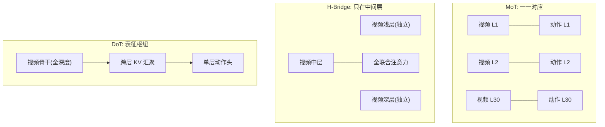

# 09 · 效率与实时推理（D8）

> **核心问题**：WAM 的推理账单怎么砍到能进实时闭环？
> 本篇先给延迟的形式化分解，再逐个展开六类优化手段的数学（特别是 RoPE 基失配与 KV-Fusion），
> 最后用 Lab D8 算一笔完整的账，并诚实地对比"理想算术"与"现实报告"的差距。

---

## 1. 延迟预算的形式化

一个 chunk 的端到端延迟：

$$T_{\text{chunk}} = \underbrace{T_{\text{enc}}}_{\text{VAE 编码}} + \underbrace{K \cdot T_{\text{DiT}}}_{\text{K 个去噪步}} + \underbrace{T_{\text{action}}}_{\text{动作头}} + \underbrace{T_{\text{dec}}}_{\text{VAE 解码(可选)}} + T_{\text{overhead}}$$

单次 DiT 前向的 FLOPs（$N$ 个 token，宽度 $d$，$L$ 层）：

$$\text{FLOPs} = L \cdot \Big[\underbrace{24\,N d^2}_{\text{线性层}} + \underbrace{4\,N^2 d}_{\text{注意力}}\Big] \tag{9.1}$$

**注意力是平方项**——这是所有优化的第一靶子。当 $N = 4096, d = 2048$ 时注意力已占单层 25%；$N = 16384$ 时超过一半（见 Lab D8）。

**实时判据**：chunk 覆盖 $H$ 步、控制频率 $f$，要求

$$T_{\text{chunk}} \le \frac{H}{f}$$

例：$H = 32$ 步、$f = 10$ Hz → 预算 **100 ms/chunk**。

---

## 2. 六类优化手段

| 手段 | 数学/机制 | 典型收益 | 代价 |
|:---|:---|:---|:---|
| **步数蒸馏** | rectified flow 的直线路径使 $\ddot{x}\equiv 0$ | **12.5×**（50→4 步） | 蒸馏训练、少量质量损失 |
| **架构解耦** | 动作头深度与视频骨干解耦（DoT） | **2×** | 需要 KV-Fusion + RoPE 对齐 |
| **action-only 推理** | 视频骨干只跑 1 次（条件帧） | **3.7×** | 需要训练时掩码隔离 |
| **FP8 量化** | 低精度矩阵乘 | ~2× | 需要校准；动力学模型对精度敏感 |
| **DiT 缓存** | 相邻去噪步复用特征 | ~1.5× | 缓存策略是启发式 |
| **编译 / CUDA graph** | 消掉 kernel launch 与调度开销 | ~1.2× | 需要固定 shape |

---

## 3. 动作头深度解耦：DoT

[Faster-WAM (2608.02365)](https://arxiv.org/abs/2608.02365) 提出的问题是：**动作模块为什么必须和 30 层视频骨干一样深？**

### 3.1 三种架构对照



- **MoT**：动作层与视频层一一对应，为共享注意力必须如此 → 动作深度被绑死
- **H-Bridge**：只在中间层联合注意力，浅层/深层解耦 → 省一部分，但耦合位置固定
- **DoT**：视频骨干当**表征枢纽**，动作头通过对接接口访问**所有层**的表征 → 动作头深度完全自由

### 3.2 KV-Fusion 的数学

设视频骨干 $L$ 层，每层条件帧的 key/value 为

$$K^{(l)} \in \mathbb{R}^{B \times T \times H \times D}, \quad V^{(l)} \in \mathbb{R}^{B \times T \times H \times D}$$

**（a）通道混合**：视频与动作头在不同学习到的特征空间，需要先对齐通道语义。用独立线性投影沿 mode-4（特征维）做变换：

$$\tilde{K}^{(l)} = K^{(l)} \times_4 W_K^{(l)}, \quad \tilde{V}^{(l)} = V^{(l)} \times_4 W_V^{(l)}$$

其中 $\times_n$ 是 mode-$n$ 积：对 $\mathcal{X} \in \mathbb{R}^{I_1 \times \cdots \times I_N}$ 与 $M \in \mathbb{R}^{J \times I_n}$，

$$\big(\mathcal{X} \times_n M\big)_{i_1 \cdots i_{n-1}\, j\, i_{n+1} \cdots i_N} = \sum_{i_n} \mathcal{X}_{i_1 \cdots i_N} M_{j, i_n}$$

**（b）层混合**：对每个注意力头 $h$，用可学习的跨层聚合矩阵 $A^{(h)} \in \mathbb{R}^{L' \times L}$ 聚合所有视频层：

$$\bar{K}^{(h)} = A^{(h)} \,\big[\,\tilde{K}^{(1,h)}; \dots; \tilde{K}^{(L,h)}\,\big], \quad \bar{V}^{(h)} = A^{(h)}\,\big[\,\tilde{V}^{(1,h)}; \dots; \tilde{V}^{(L,h)}\,\big]$$

**系数对每个头共享**（保持 key/value 一致性），但是**每个动作层独立**的。

**（c）混合上下文注意力**：动作头把自己的 KV 与融合的视频 KV 沿 token 维拼接：

$$\mathrm{Attn}\big(Q^a,\ [K^a; \bar{K}],\ [V^a; \bar{V}]\big)$$

### 3.3 视频-动作 RoPE 对齐

这是 DoT 能work的**必要条件**，也是很多人会踩的坑。

RoPE 把特征维两两配对，第 $j$ 对用旋转角 $\theta_j \cdot p$：

$$R(p) = \mathrm{blockdiag}\big(R(\theta_1 p), \dots, R(\theta_{d/2} p)\big)$$

**核心性质**：$R(a)^\top R(b) = R(b - a)$，因此

$$\langle R(p_k) k,\ R(p_q) q\rangle = k^\top R(p_q - p_k)\, q$$

**只依赖相对位移**——这正是 RoPE 的意义。

**问题**：视频 token 用 **3D RoPE**（时间/高度/宽度分到不同通道段），动作 token 用 **1D RoPE**（所有通道段都用时间位置）。于是

$$R_{\text{3D}}(p_k)^\top R_{\text{1D}}(p_q) \ne R(p_q - p_k)$$

因为两者的频率分组不匹配：某些通道段上 key 编码的是 $y$ 坐标，query 编码的是 $t$。结果是**位置信息被破坏**，注意力分数混入绝对位置与错误的相对关系。

**修正**：把视频 key 重投影到动作 query 的坐标系（在通道混合之后重新施加与时间一致的旋转基），使交叉项恢复"只依赖相对时间位移"。

Faster-WAM 的实测：这一项单独带来 **+4.5%**（LIBERO-Plus 66.8% → 71.3%）。

### 3.4 实测

| 模型 | 延迟 | 加速 | LIBERO | RoboTwin 2.0 | LIBERO-Plus |
|:---|---:|---:|---:|---:|---:|
| Fast-WAM（MoT） | 211.7 ms | 1× | — | — | 51.5% |
| **Faster-WAM（DoT）** | **66.5 ms** | **3.2×** | **98.5%** | 89.17% | **75.0%** |
| π0 / π0.5（VLA 对照） | 68.2 / 71.4 ms | — | 94.1% | — | — |

关键：**单层动作头不只是更快，还更准**（LIBERO-Plus +23.5%）。这说明深动作头在 MoT 里是**过参数化的冗余**，不是必要容量。

---

## 4. action-only 推理

三种"推理时不生成未来视频"的实现：

| 方法 | 机制 | 代表 |
|:---|:---|:---|
| **V2A 非对称依赖** | 动作依赖视频，视频不依赖动作；推理时只跑动作分支 | [MotuBrain](https://arxiv.org/abs/2604.27792) |
| **模态解耦可见性掩码** | 训练时未来视频与轨迹互不可见；推理时去掉未来视频去噪 | [UNIVERSE](https://arxiv.org/abs/2607.05133)（4.3×） |
| **隔离注意力掩码** | 动作预测根本不依赖未来帧；训练后整个视频分支可丢弃 | [SimWAM](https://arxiv.org/abs/2608.07468) |

三者的共同数学内核：让条件分布满足

$$p(a \mid o, l) \ \text{不经过}\ \hat{o}'$$

即 01 §2.2 判定边界第 ③ 条——**未来只在训练时塑造表征，不在推理时参与计算**。

这带来一个重要的架构判断：**未来不一定需要在推理时真的"生成视频"，但 policy 必须拥有 world-model knowledge**。

---

## 5. Lab D8：算一笔完整的账

参数取 $d = 2048$、$L = 30$、视频 token $N_v = 4096$、动作 token $N_a = 32$、单卡有效算力 400 TFLOPS。基线是 **MoT 架构、50 步联合去噪、动作流与视频流层数一一对应**。

```
== Lab D8: WAM 推理账单的分解 (参数化模型, 数量级估计) ==
  宽度 d=2048, 视频骨干 30 层, 视频 token 4096, 动作 token 32
  单层 FLOPs = 2*(12*N*d^2 + 2*N^2*d) ; 有效算力 400 TFLOPS

  基线 (MoT, 50 步联合去噪)      :     1.67 PFLOPs ->   4163.5 ms/chunk
  ① 步数蒸馏 50→4                       :     0.13 PFLOPs ->    333.1 ms/chunk   累计加速   12.5x
  ② 动作头从 30 层压到 1 层                 :     0.07 PFLOPs ->    172.1 ms/chunk   累计加速   24.2x
  ③ action-only 推理(视频骨干跑 1 次)       :     0.02 PFLOPs ->     46.8 ms/chunk   累计加速   89.0x
  ④ FP8 量化                          :     0.01 PFLOPs ->     23.4 ms/chunk   累计加速  178.0x
  ⑤ DiT 缓存                          :     0.01 PFLOPs ->     15.6 ms/chunk   累计加速  267.0x
  ⑥ 编译优化                            :     0.01 PFLOPs ->     13.0 ms/chunk   累计加速  320.4x

  理想累计加速: 320x    对应频率: 77.0 Hz
```

**注意力占比随 token 数增长**：

```
      视频 token N        单层 FLOPs       注意力占比
            1024         111.7 G        7.7%
            2048         240.5 G       14.3%
            4096         549.8 G       25.0%
            8192        1374.4 G       40.0%
           16384        3848.3 G       57.1%
```

**动作头深度的代价**（占 50 步基线的比例）：

```
         动作头层数        动作通路 FLOPs        占总基线
             1             2.2 T        0.1%
             2             4.4 T        0.3%
             5            11.1 T        0.7%
            10            22.2 T        1.3%
            30            66.6 T        4.0%
```

### 5.1 三条结论

**① 步数蒸馏是最大的单项（12.5×）。** 这直接来自 Lab C 的结论：rectified flow 的直线路径让 Euler 误差与步数无关。没有这个前提，后面所有优化都救不回来。

**② 单项收益相乘会高估。** 理想累计 **320×**（77 Hz），但 [MotuBrain](https://arxiv.org/abs/2604.27792) 实际报告 **>50× / 11 Hz**。差 6 倍，原因：

- 内存带宽墙（不是算力墙）：FP8 的 2× 只在算力受限时成立
- 优化之间**互相侵蚀**：步数少了，DiT 缓存能跳的步也少了
- 无法完全消除的视频前向：观测帧仍要过骨干，多视角 VAE 编码/解码不是零成本
- 控制回路的其他开销：传感器、通信、执行器

**这个 6 倍差距本身就是有用的信息**：它告诉你"论文里的加速倍数"和"你实测能拿到的"之间大概隔着一个数量级的一半。

**③ 动作头深度的 FLOPs 只占 4%，但压到 1 层带来 2× 加速。** 看似矛盾，解释是：在 4 步基线里，动作头的 30 层与视频骨干的 30 层**等量**，所以砍掉它接近减半。而上表里的 4% 是相对 50 步基线的。**教训：看加速要看当前配置的占比，不是原始基线的占比。**

---

## 6. 现实参照表

| 系统 | 延迟 / 频率 | 模式 |
|:---|:---|:---|
| [Faster-WAM](https://arxiv.org/abs/2608.02365) | 66.5 ms/chunk（≈15 Hz） | 直接动作，无想象 |
| [MotuBrain](https://arxiv.org/abs/2604.27792) | 11 Hz | 分块闭环实时执行 |
| π0 / π0.5（VLA） | 68.2 / 71.4 ms | 对照基线 |
| [DriveWAM](https://arxiv.org/abs/2605.28544) | ~0.9 s / 4 s chunk | 驾驶，实时绰绰有余 |
| [Cosmos Policy](https://arxiv.org/abs/2601.16163) | ~5 s / chunk（≈0.2 Hz） | **规划模式** |

最后一行是关键：**规划模式和执行模式差两个数量级**。这意味着当前基于视频扩散的 test-time 规划**还进不了实时闭环**。可行的折中是"异步"：规划在后台慢慢跑，执行用快速策略，规划结果定期回灌。

---

## 7. 部署建议

| 场景 | 建议组合 |
|:---|:---|
| 实时闭环控制（>5 Hz） | 步数蒸馏 + DoT 解耦 + action-only + FP8。**不要**在回路里放视频规划 |
| 准实时（1–5 Hz） | 上面 + 分块闭环执行（chunk 边界重叠，减少不连续） |
| 离线/异步规划 | 视频扩散规划放后台，结果异步回灌快速策略 |
| 边缘部署 | 步数蒸馏 + FP8/INT8 是必需的；考虑小骨干（0.9B 的 SG-WAM 证明可行） |

---

## 8. 未解决问题

1. **延迟口径不统一**。含不含 VAE 解码？单视角还是多视角？含不含执行器延迟？社区没有标准，论文数字不可比。
2. **量化对动力学的影响没有系统研究**。世界模型是"误差会被长视野放大"的系统（01 §7），FP8 引入的数值误差会不会在 32 步后放大？没有人量过。这是一个和"量化 × 长视野误差累积"交叉的空白。
3. **加速与质量的帕累托前沿没有画出来**。每项优化的质量损失是多少？缺少系统评测。
4. **DiT 缓存是纯启发式**。什么时候能安全跳过一步？没有理论。

---

## 9. 要点

1. 延迟预算的核心约束是**注意力平方项**：$N=16384$ 时注意力占单层 57%（§1，Lab D8）。
2. **步数蒸馏是最大单项（12.5×）**，前提是 rectified flow 的直线路径（§5.1①）。
3. **DoT 解耦让单层动作头胜过 30 层**——不只是快，还更准（LIBERO-Plus +23.5%）（§3.4）。
4. **RoPE 基失配是真问题**：3D key × 1D query 破坏相对位置性质，修正值 +4.5%（§3.3）。
5. **理想算术 320× vs 现实 50×**，差 6 倍来自带宽墙、优化互相侵蚀、无法消除的固定开销（§5.1②）。
6. 规划模式（0.2 Hz）与执行模式（15 Hz）差两个数量级 → 必须异步（§6）。

---

**上一篇**：[08 · 几何感知与动作表征](./08-geometry-action-repr.md) ｜ **下一篇**：[10 · 自动驾驶 WAM](./10-driving-wam.md)
