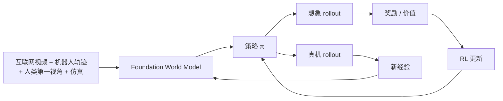

# 11 · 训练配方与世界模型 RL（D10）

> **核心问题**：数据怎么混、loss 怎么加权、什么时候上 RL？
> 这是全领域**最不收敛**的方向（00 §4 判为 🔴）。本篇把散落在各篇论文里的配方抽出来，
> 给出它们各自的数学理由，并用 Lab D10 量化"世界模型误差 × 折扣"对 RL 的破坏力。

---

## 1. 异构数据与模态专属监督掩码

### 1.1 四类数据，四类监督

| 数据类型 | 有动作? | 有未来? | 有进度标签? | 能给什么监督 |
|:---|:---:|:---:|:---:|:---|
| 机器人遥操作 | ✓✓ | ✓ | ✓ | 全部 |
| UMI 手持示教 | 弱 | ✓ | 部分 | 视觉动力学 + 弱动作 |
| 人类第一视角 | ✗ | ✓ | ✗ | **只有视觉动力学** |
| rollout / failure | ✓ | ✓ | ✓✓ | 进度、低质量样本 |

### 1.2 掩码的形式化

每条样本 $i$ 有一个模态可用指示 $m^{(i)} \in \{0,1\}^M$。总损失：

$$\mathcal{L}(\theta) = \sum_i \sum_{j=1}^{M} m_j^{(i)} \, \lambda_j \, \mathcal{L}_j\big(x^{(i)}; \theta\big) \tag{11.1}$$

**为什么不能补齐缺失模态？** 因为插值会产生**虚假监督**。用人类视频的"预测动作"损失去训练，等于在教模型一个不存在的动作空间。

这正是 [τ₀-WM (2606.01027)](https://arxiv.org/abs/2606.01027) 用 **modality-specific supervision masks** 的原因：让每个样本只贡献它**真正支持**的那些损失项。

τ₀-WM 的 27,300 小时数据构成：

- 真实机器人遥操作 **17.8k h（65%）**——AGIBOT-G01、ARX、Franka 双臂
- UMI 无约束手持示教 **6.5k h（24%）**——低成本扩场景与行为多样性
- 人类第一视角 **3.0k h（11%）**——只学视觉动力学
- rollout / failure 轨迹——给任务进度与低质量样本监督

### 1.3 关键设计判断

**人类视频那 11% 是纯赚的**：它不需要动作标注，规模可以很大，学的是"物体怎么动、接触长什么样"——这正是 02 §4 说的 marginal 动力学。而可控部分（72% 的预测误差）靠有动作的数据补。

---

## 2. 训练细节：那些论文里不解释但很重要的设置

### 2.1 噪声调度的改造

[Cosmos Policy (2601.16163)](https://arxiv.org/abs/2601.16163) 把训练噪声分布改为：

$$t \sim 0.7 \cdot \text{LogNormal}(\mu, \sigma) + 0.3 \cdot \mathcal{U}[1, 85]$$

**为什么**：纯 log-normal 会把采样集中在中段，两端（接近干净 / 接近纯噪声）样本不足。加入均匀分量保证**全时间步覆盖**。对 chunk 级生成尤其重要——早期步决定了整体结构。

### 2.2 推理时 $\sigma_{\min}$ 从 0.002 提到 4

这是一个**反直觉但很关键**的设置。$\sigma_{\min}$ 是采样终止时的噪声水平；提到 4 意味着**根本不去噪到底**。

合理推测（论文未明确解释，标注为推断）：best-of-N 规划需要**候选多样性**。完全去噪会把所有候选拉向模式中心，多样性崩塌，best-of-N 退化成 best-of-1。保留一点噪声 = 保留多峰采样的能力。

**这与 04 §1.3 的 Lab D3 是同一个道理**：多峰性一旦被平均掉，规划就失效。$\sigma_{\min}$ 是控制"平均 vs 保峰"的一个旋钮。

### 2.3 损失配比

Cosmos Policy 的训练数据混合是 **50% 策略 / 25% 世界模型 / 25% 值函数**。

注意这个配比的含义：**策略只占一半**。世界模型和值函数各占四分之一——这已经不是在训练一个 policy，而是在训练一个 **model-based RL 系统**。

### 2.4 避免"乐观生成"的技巧

[Dreamer V4 (2509.24527)](https://arxiv.org/abs/2509.24527) 的做法值得借鉴：数据混合 50% uniform（随机片段）+ 50% relevant（任务相关片段），并且

- **BC loss 只在 relevant 数据上**
- **dynamics loss 只在 uniform 数据上**

原因：如果只用任务相关数据训练动力学，模型会学到"任务总是会成功"的乐观偏差（relevant 数据里失败样本被过滤掉了）。uniform 数据保留了失败与退化轨迹。

### 2.5 Shortcut forcing

Dreamer V4 的动力学目标在**数据空间**去噪（不是潜空间），理由是"避免高频网络输出导致的误差累积"。训练时把步数 $d$ 作为条件，推理时 $K = 4$ 次前向生成一帧 → 单 GPU 实时。

$$\mathcal{L} = \mathbb{E}\big\|v_\theta(x_t, t, d, c) - (x_1 - x_0)\big\|^2$$

把 $d$ 作为条件是实现"少步生成"的经典技巧（一致性模型同源）。

---

## 3. 隔离掩码：训练时用未来，推理时不生成

[SimWAM (2608.07468)](https://arxiv.org/abs/2608.07468) 的隔离注意力掩码：

$$M[a \to \text{future video}] = 0$$

数学后果：

$$p_\theta(a \mid o, l) \ \text{的计算图中不包含}\ \hat{o}'$$

所以训练完可以**整个丢弃视频分支**，留下自包含的规划器。

**这是一个非常重要的架构判断**：视频生成在这个配方里是**正则项**，不是**推理组件**。它塑造表征，而不参与决策。

---

## 4. 为什么必须从模仿走向 RL

### 4.1 模仿学习的分布偏移

行为克隆的经典问题：策略在训练分布内表现好，一旦偏离就进入未见状态，误差**复合增长**。形式上，若策略的单步偏差是 $\epsilon$，则 $T$ 步后的状态分布偏移是 $O(T\epsilon)$（不是 $O(\sqrt{T}\epsilon)$）。

DAgger 系列方法需要交互式专家标注——机器人场景不可行。

### 4.2 世界模型提供了替代方案

有了世界模型，可以**在想象中**做 on-policy rollout，不需要真机交互：

$$\text{想象 rollout} \to \text{累积 }\hat{r} \to \lambda\text{-return} \to \text{更新 actor/critic}$$

回报递归（01 式 3.2）：

$$V^\lambda_t = \hat{r}_t + \gamma\left[(1-\lambda)v_{t+1} + \lambda V^\lambda_{t+1}\right]$$

### 4.3 SimWAM 的组合式奖励

SimWAM 用 RL 优化的**不是轨迹模仿误差**，而是组合式驾驶奖励（安全、合规、舒适、进度等多个分量）。这是 RL 相对 BC 的核心优势：**能优化不可微、非模仿的目标**。

---

## 5. 世界模型 RL 的误差界

### 5.1 定理（经典 MBRL 结果）

设真实 MDP 为 $(P, R)$，模型为 $(\hat{P}, \hat{R})$，满足

$$\max_{s,a} \|\hat{P}(\cdot|s,a) - P(\cdot|s,a)\|_{\text{TV}} \le \epsilon_p, \quad \max_{s,a}|\hat{R}(s,a) - R(s,a)| \le \epsilon_r$$

则对任意策略 $\pi$，模型内的价值函数与真实价值函数的偏差满足

$$\|V^\pi_{\text{model}} - V^\pi_{\text{true}}\|_\infty \le \frac{\epsilon_r}{1-\gamma} + \frac{\gamma\,\epsilon_p\,R_{\max}}{(1-\gamma)^2} \tag{11.2}$$

**$(1-\gamma)^{-2}$ 是致命的**：有效视野 $H_{\text{eff}} = (1-\gamma)^{-1}$，误差按**视野的平方**放大。

### 5.2 Lab D10：实测这个界有多紧

设置：20 状态链，动作是"右移/左移"（成功率 $q=0.8$），目标在末端（$R=1$），策略 90% 选右移。模型误差设为 $\hat{q} = q - \delta$，此时每个 $(s,a)$ 的 TV 距离恰好是 $\delta$。

```
== Lab D10: 结构化 MDP 上, 模型误差 -> 价值偏差 ==
  链长 20: 动作=右移/左移, 成功率 q; 目标在末端(R=1); 策略 90% 右移
  模型误差: q_hat = q - delta  -> 每个(s,a)的 TV 距离 = delta

    gamma   delta     max V        价值偏差        理论上界      界/实际      相对偏差
  ----------------------------------------------------------------------
     0.90    0.01     8.538      0.0387      0.9000      23.2x      0.5%
     0.90    0.05     8.538      0.1980      4.5000      22.7x      2.3%
     0.90    0.10     8.538      0.4077      9.0000      22.1x      4.8%
     0.90    0.20     8.538      0.8739     18.0000      20.6x     10.2%

     0.95    0.01    16.826      0.0820      3.8000      46.3x      0.5%
     0.95    0.05    16.826      0.4209     19.0000      45.1x      2.5%
     0.95    0.10    16.826      0.8695     38.0000      43.7x      5.2%
     0.95    0.20    16.826      1.8660     76.0000      40.7x     11.1%

     0.99    0.01    83.043      0.3042     99.0000     325.4x      0.4%
     0.99    0.05    83.043      1.5887    495.0000     311.6x      1.9%
     0.99    0.10    83.043      3.3635    990.0000     294.3x      4.1%
     0.99    0.20    83.043      7.6146   1980.0000     260.0x      9.2%

  放大因子随 gamma:
    gamma=0.900  有效视野 1/(1-g)=  10.0  1/(1-g)^2=   100.0
    gamma=0.950  有效视野 1/(1-g)=  20.0  1/(1-g)^2=   400.0
    gamma=0.990  有效视野 1/(1-g)= 100.0  1/(1-g)^2= 10000.0
    gamma=0.995  有效视野 1/(1-g)= 200.0  1/(1-g)^2= 40000.0
```

### 5.3 三条结论

**① 界是对的，但松 20–325 倍。** 实测偏差远小于上界，且松弛度随 $\gamma$ 增大（23× → 325×）。所以**别用这个界来判断"我的世界模型够不够好"**——它会让你放弃本来可行的模型。

**② 实际的放大是 $(1-\gamma)^{-1}$，不是 $(1-\gamma)^{-2}$。**

看 $\delta = 0.20$ 那一列的绝对偏差：0.874（$\gamma$=0.90）→ 1.866（0.95）→ 7.61（0.99）。比值约 2.1 和 4.1，对应 $(1-\gamma)^{-1}$ 的比值 2.0 和 5.0。**相对偏差几乎恒定在 9%–11%**，不随 $\gamma$ 增长。

原因：界里的 $R_{\max}$ 是常数，但实际价值 $V_{\max} \sim R_{\max}/(1-\gamma)$ 也在同步增长，两者相除后只剩一个 $(1-\gamma)^{-1}$。

> 这是一个**有用的好消息**：长视野 RL 的误差放大比经典界说的温和一阶。但仍然是 $(1-\gamma)^{-1}$ 放大——$\gamma=0.99$ 时 100 倍。

**③ $\delta = 0.20$ 的模型误差就能造成 ~10% 的价值偏差。** 对照 Lab D4b：同样的量级（$\|A-\hat{A}\| \approx 0.12$）造成 0.26–0.38 的规划收益损失。两个实验互相印证：**世界模型误差在 $\sim 10\%$ 量级时就开始显著损害下游**。

### 5.4 实用建议

| 问题 | 建议 |
|:---|:---|
| 该不该上 world-model RL？ | 先量模型误差。$\epsilon_p > 0.1$ 时，先修模型 |
| $\gamma$ 怎么选？ | 越小越抗模型误差；但任务需要长视野 → 用**短视野想象 + 真机闭环刷新**（01 §7.2） |
| 想象步数 $H$？ | 短。Lab B 显示刷新周期 $k=4$–$8$ 是拐点 |
| 用不用 model ensemble？ | 经典 MBRL 的有效技巧（用分歧度检测不可靠区域），WAM 里还没人做 |

---

## 6. 闭环愿景



**World Model → 想象 Rollout → RL → 真机 Rollout → World Model**

这个闭环目前**没有人完整跑通过一圈**。所有已发表的工作都只覆盖了其中某一段：

- 有 WM → 想象 rollout：Dreamer 系列（但不在视频基座上）
- 有 想象 rollout → RL：Dreamer V4 的想象训练
- 有 RL → 真机：SimWAM 的 RL 阶段（但没有闭环回灌 WM）
- **缺的是"真机 rollout → 更新 WM"这一段**

---

## 7. 一份可执行的起始配方

综合各篇论文已验证的设置（未整体验证，作为起点）：

| 环节 | 设置 | 来源 |
|:---|:---|:---|
| 骨干 | Wan2.2-5B / Cosmos-Predict2.5-2B | 事实标准 |
| 数据混合 | 65% 遥操作 / 24% UMI / 11% 人类视频 + failure 轨迹 | τ₀-WM |
| 监督 | **模态专属掩码**，缺失模态不补 | τ₀-WM |
| 损失配比 | 50% 策略 / 25% 世界模型 / 25% 值函数 | Cosmos Policy |
| 噪声调度 | 0.7 log-normal + 0.3 U[1,85] | Cosmos Policy |
| 步数 | 训练 50、蒸馏到 4 | rectified flow + 蒸馏 |
| 动作条件 | 空间对齐（骨架 / 点追踪）优先于 latent | Lab D2 |
| 动作头 | 单层 + KV-Fusion + RoPE 对齐 | Faster-WAM |
| 推理 $\sigma_{\min}$ | **不要设太小**（保多样性） | Cosmos Policy（推断） |
| 部署 | 每 4–8 步用真观测刷新 | Lab B |
| 规划预算 | $N \approx 64$ 候选，$M \approx 100$ 评估 rollout | Lab D4c / Lab D5 |

---

## 8. 未解决问题

1. **没有标准 recipe。** 上表是我从各篇拼出来的，没有人在同一套设置下做过完整消融。
2. **闭环没跑通。** 特别是"真机 rollout → 更新 WM"这一段。
3. **模型 ensemble / 不确定性估计在 WAM 里缺席。** 经典 MBRL 的核心技巧，WAM 全都没用。
4. **RL 与视频扩散的结合方式未定。** 扩散模型不可微地参与 rollout，梯度怎么回传？SimWAM 只用了 reward 层面的 RL，没有端到端。
5. **长视野 RL 的 $(1-\gamma)^{-1}$ 放大没有对策**（§5.3②）。

---

## 9. 要点

1. 异构数据必须配**模态专属监督掩码**——补齐缺失模态等于制造虚假监督（§1.2）。
2. Cosmos Policy 的 50/25/25 配比说明它训的是**model-based RL 系统**，不是 policy（§2.3）。
3. $\sigma_{\min}$ 不要设太小——完全去噪会杀死 best-of-N 需要的多样性（§2.2，标注为推断）。
4. **隔离掩码让视频分支在推理时可丢弃**——视频是正则项不是推理组件（§3）。
5. 经典界 $\|V_{\text{model}} - V_{\text{true}}\| \le \gamma\epsilon_p R_{\max}/(1-\gamma)^2$ **松 20–325 倍**，实际放大是 $(1-\gamma)^{-1}$（§5.3，Lab D10）。
6. $\epsilon_p \sim 0.1$ 就开始显著损害下游——先修模型再上 RL（§5.4）。
7. **闭环目前没跑通过一圈**，缺的是"真机 rollout → 更新 WM"（§6）。

---

**上一篇**：[10 · 自动驾驶 WAM](./10-driving-wam.md) ｜ **返回**：[00 · 发展方向地图](./00-wam-directions-map.md)
