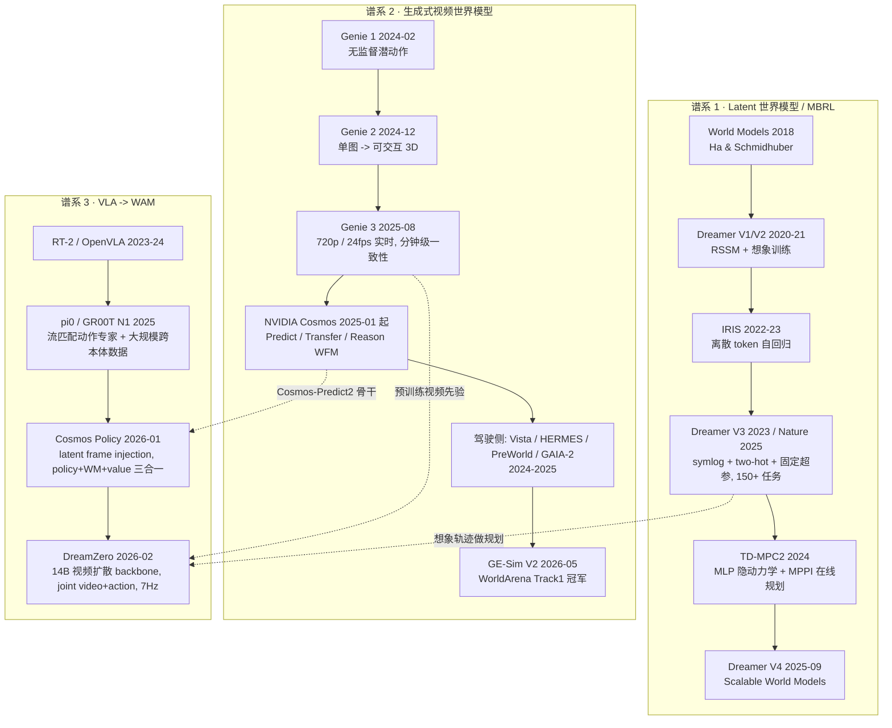
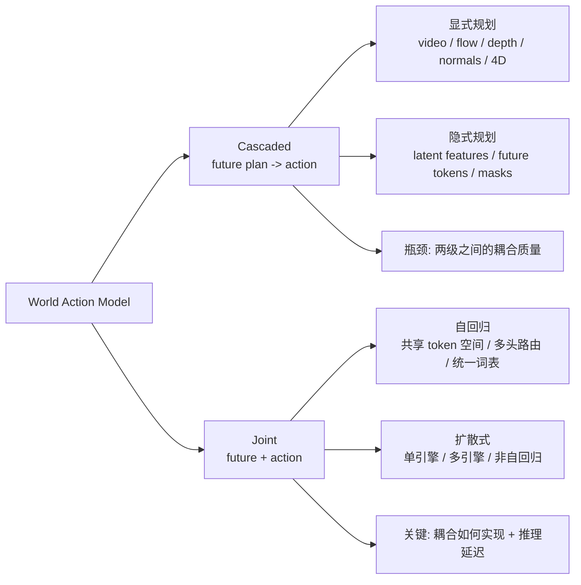

# 研究计划：世界模型（World Model）与世界动作模型（World Action Model）

> 版本：v2（2026-09-19 重写）｜ 覆盖文献：2018 ~ 2026-09
> 定位：**先做一份能直接指导写作的"现状地图 + 研究计划"**，产出一篇文章，不拆七篇。

---

## 0. 这次要解决什么

2026 年"世界模型"已经不是一个单点技术，而是分裂成三条几乎不交流的谱系：

1. **Latent 世界模型 / MBRL**（Dreamer 系列、IRIS、TD-MPC2）——学隐空间动力学，在想象里做 actor-critic 或 MPC；
2. **生成式视频世界模型**（Genie 3、Cosmos、Vista、HERMES、GE-Sim）——预测像素/视频，用于数据生成、闭环评测、仿真；
3. **VLA → WAM**（π0 / GR00T / OpenVLA → Cosmos Policy / DreamZero）——从"看图出动作"走向"先想象未来、再出动作"。

前两条各说各话，第三条是 2026 年真正把它们缝起来的地方。**本计划的目标就是把这个缝合点讲清楚**：什么叫 World Action Model，它和 VLA、和世界模型的边界在哪，凭什么值得做，以及怎么评。

### 与本站已有内容的关系

- 承接 [`embodied-ai-*`](https://github.com/lrypcy/lrypcy.github.io) 系列（控制基础、感知、操作、导航规划）；
- 与刚写的 [RL 信用分配](/2026/09/19/rl-credit-assignment-settlement/) 有直接接口：**想象轨迹里的信用分配**（Dreamer 的 λ-return、模型误差累积、long-horizon 的 compounding error）正是世界模型规划失效的核心原因之一，会在正文 §5 交叉引用；
- 不覆盖：纯视频生成技术本身（Sora / Wan2.1 的扩散细节）、NeRF/3DGS 等重建路线。

---

## 1. 术语与形式化（全篇统一口径）

三条谱系可以用三个概率表达式一次分清（定义来自 [WAM Survey, Fudan / OpenMOSS](https://openmoss.ai/Awesome-WAM/)）：

| 范式 | 目标 | 性质 |
|:---|:---|:---|
| **VLA** | $p(a \mid o, l)$ | 观测+语言直接映射动作。**反应式**，不显式表示未来 |
| **World Model (WM)** | $p(o' \mid o, a)$ | 预测世界如何演化。**预测式**，本身不是策略 |
| **World Action Model (WAM)** | $p(o', a \mid o, l)$ | **未来状态合成与可执行动作在一个策略框架内联合学习** |

判定边界（很重要，否则 WAM 这个词会被滥用）：**未来状态预测必须是策略的一部分**，而不是一个辅助 backbone 或外部模拟器。

更完整的形式化（含本体感觉与规划）：

$$
p(\text{future video},\ \text{future action} \mid o_{\le t},\ l,\ s_t^{\text{proprio}})
= \underbrace{p(\hat{o}_{t+1:t+H} \mid \cdot)}_{\text{visual planning / 世界预测}}
\cdot \underbrace{p(a_{t:t+K} \mid \hat{o}_{t+1:t+H},\cdot)}_{\text{inverse dynamics}}
$$

| 数学符号 | 含义 | 代码里对应 |
|:---|:---|:---|
| $o_{\le t}$ | 历史视觉观测 | `past_frames / video context` |
| $l$ | 语言指令 | `text_emb` |
| $s_t^{\text{proprio}}$ | 本体状态（关节角 / 末端位姿） | `proprio` |
| $\hat{o}_{t+1:t+H}$ | 想象出的未来帧 | `future_video_latent` |
| $a_{t:t+K}$ | 动作 chunk | `action_chunk` |
| $V(s')$ | 值函数（期望回报） | `value_frame`（Cosmos Policy 把它也编成潜帧） |

> **关键设计分歧**：上面这个分解可以是一个模型端到端 joint denoise（DreamZero），也可以是两个模型级联（Cascaded WAM）；也可以是"一个模型、三种潜帧"（Cosmos Policy）。这是本专题要讲清的第一条主线。

---

## 2. 三条谱系与时间线



### 2.1 谱系 1：Latent 世界模型（本专题的"理论地基"）

| 模型 | 核心 | 一句话 |
|:---|:---|:---|
| **Dreamer V3**（[arXiv:2301.04104](https://arxiv.org/abs/2301.04104)，[Nature 2025](https://www.nature.com/articles/s41586-025-08744-2)） | RSSM（确定性 $h_t$ + 随机 $z_t$，32 个 32 类离散变量） | 三个稳定性设计让它**用一套固定超参**跨 8 个领域 150+ 任务：① symlog 预测压缩量级；② two-hot 离散回归代替 MSE；③ 回报归一化 + KL balance。首个无人类数据、无课程学习从像素挖到 Minecraft 钻石 |
| **IRIS** | VQ-VAE token 化 + 自回归 Transformer | 把世界模型当语言模型写；代价是 **tokenizer 有损**，空间细节是天花板 |
| **TD-MPC2** | 极简 MLP 隐动力学 + MPPI 在线规划 | 样本效率高、结构轻；代价是**安全约束/长期约束天生难处理**（微电网实测里违反度比 DreamerV3 高约一个数量级） |
| **Dreamer V4**（[arXiv:2509.24527](https://arxiv.org/abs/2509.24527), 2025-09） | "Training Agents Inside of Scalable World Models" | 走向**完全离线 / 可扩展**，是本谱系 2025 下半年的主要更新点，待精读 |

> **一个反直觉的实证**（值得写进正文）：世界模型**不是即插即用**。消融显示 PPO+DreamerV3、SAC+DreamerV3 都不稳定——模型误差会通过 off-policy 价值估计被放大，且模型与策略同时更新导致目标漂移。完整 DreamerV3 靠"隐空间想象 + 价值尺度归一 + 专门的 actor-critic 学习机制"系统处理了这个耦合。**这和 `信用分配` 那篇里"critic 与策略的耦合"是同一个问题的两个版本。**

### 2.2 谱系 2：生成式视频世界模型（本专题的"供给端"）

| 模型 / 平台 | 时间 | 关键事实 |
|:---|:---|:---|
| **Genie 3**（DeepMind） | 2025-08 | 720p @ 24fps 实时导航，一致性可达数分钟，新增"可提示世界事件"；2026-01-29 以 **Project Genie** 向 AI Ultra 订阅用户开放（单次 60 秒上限） |
| **Waymo World Model** | 2025- | Genie 3 衍生的驾驶版，输出 LiDAR 快 4×，支持驾驶动作/场景布局/语言三种控制，用于 robotaxi 边缘场景仿真 |
| **NVIDIA Cosmos** | 2025-01 起 | Predict / Transfer / Reason 系列 WFM；官方称**下载超 200 万次**，Skild AI、Figure、Lightwheel、Uber 在用它生成物理感知合成数据 |
| **GAIA-2**（Wayve） | 2025-12 | 多相机驾驶生成世界模型，已开源 |
| **Vista / Vista-3**（OpenDriveLab, NeurIPS 2024） | 2024 | 通用可泛化驾驶世界模型，长时序预测，开源 → 事实 baseline |
| **HERMES**（ICCV 2025） | 2025 | 3D 场景理解 + 生成统一 |
| **AutoVLA**（NeurIPS 2025） | 2025 | 把 VLA 引入自动驾驶，自适应推理预算 |
| **VideoWorld**（字节 Seed, CVPR 2025 → VideoWorld 2 CVPR 2026） | 2025-2026 | 潜变量动力学模型做无标注视频学习 → 二代做跨域知识迁移 |
| **GE-Sim V2**（智元, [arXiv:2605.27491](https://arxiv.org/abs/2605.27491)） | 2026-05 | **WorldArena Track1 冠军，68.26 分**，且声明"未针对赛题调优、只做基础微调"；能力矩阵覆盖长时序生成/多视角/本体状态/近实时推理/奖励判别；40–50 秒长推演的画面质量仍优于基线前 10 秒；用奖励模型做 rollout 自动筛选并**数据回流**给策略 |

资本侧信号（可选一笔带过）：World Labs 2025-11 发布 **Marble**（可导出、可编辑的持久化 3D 环境），随后获 AMD/Autodesk/NVIDIA 等 10 亿美元融资；Yann LeCun 离开 Meta 创立 **AMI Labs**（巴黎，专注世界模型）并在未出货前融到 10 亿美元以上（pre-money 35 亿）。这些说明**赛道已经过了科学项目阶段**，但也说明 hype 成分不小——正文要保持批判口径。

### 2.3 谱系 3：VLA → WAM（本专题的核心）

**VLA 的短板**（DreamZero 的表述，很到位）：VLA 从 VLM 继承了语义先验——知道"做什么"，但缺"如何执行新颖物理运动"的时空先验。能执行"把可乐罐移到 Taylor Swift 那里"（如果学过 move 技能），但在"解鞋带""熨衣服"这类训练中没见过的运动上会失败；且 VLA 在静态图文上预训练，对物理动态的理解受限。

**Cosmos Policy（[arXiv:2601.16163](https://arxiv.org/abs/2601.16163), 2026-01）**——给 WAM 最简洁的一版陈述：

> 别为动作单独造轮子，**把动作也塞进视频模型的扩散过程**。

- 方法：**latent frame injection**。把本体状态、动作 chunk、未来状态、值函数全部编码成视频潜序列里的"帧"，序列结构为 $(s, a, s', V(s'))$，多相机视角也直接拼帧。
- 结果：LIBERO 平均成功率 **98.5**（Diffusion Policy 72.4 / UniVLA 95.2）；RoboCasa **67.1**（DP-VLA 57.3 / Video Policy 66.0），且**每任务只用 50 条演示**。
- 部署双模：直接策略（只出动作）已是 SOTA；加上 **best-of-N 模型规划**在真实困难任务上再 **+12.5%**，代价是复杂度与推理变慢。
- 与 DreamZero 同出 NVIDIA、同赌"视频骨干 = 世界模型"，是 WAM 范式的两块基石。

**DreamZero（[arXiv:2602.15922](https://arxiv.org/abs/2602.15922), 2026-02）**——把 WAM 直接当 zero-shot 策略：

- 14B 自回归视频扩散模型（骨干 **Wan2.1-I2V-14B-480P**），对 video latent 与 action **联合 flow matching 去噪**；推理时执行完一个 action chunk 后把真实观测**写回 KV cache**，避免自回归视频生成的误差累积。
- 真机：AgiBot G1 见到任务的**新环境**零样本平均任务进度 **62.2%**（最强预训练 VLA baseline 27.4%）；未见任务 **39.5%**（VLA baselines 16.3% 量级）。
- 跨本体：只用 **10–20 分钟**其他机器人或人类的**纯视频**演示，未见任务相对提升 **>42%**；用 **30 分钟 play data** 完成新本体少样本适配且保留零样本泛化。
- 实时性：CFG 并行、DiT caching、torch.compile/CUDA Graphs、NVFP4 量化、DreamZero-Flash 等累计 **38× 加速 → 14B 模型 7Hz 闭环**。
- 开源程度高：checkpoint（DROID / AgiBot）、推理 server、训练入口、新本体适配指南均已公开（PolaRiS、Genie 3.0 支持仍 Coming Soon）。

> ⚠️ 上述数字来自论文摘要与二手解读，**本计划未复现**，写作时统一标注"待验证"（清单见 §8）。

---

## 3. 架构分类：Cascaded vs Joint

WAM Survey 的分类法，是本专题组织方法学的骨架：



- **Cascaded**：先合成未来状态，再由独立动作模型解码。模块化清晰、可复用现成视频模型，**瓶颈在两级耦合**——想象得漂亮不等于动作可执行。
- **Joint**：未来与动作在一个共享模型里联合监督。**问题是耦合怎么做**（token 共享 / flow matching / 并行生成），以及延迟。

判据建议（正文里给读者）：**你要不要"可检查的中间表示"**——是否需要把想象出来的未来给人看、给奖励模型筛、给数据回流用。要 → Cascaded 或 Joint 但保留显式未来输出（Cosmos Policy / DreamZero 都保留了）；只追求最快闭环 → 直接策略模式。

---

## 4. 评测地图（本专题最实用的一节）

WAM 不能被"画面像不像"单独评判，也不能只看任务成功率。**必须双轴评估。**

### 4.1 轴一：世界建模能力

| 层次 | 指标 / 基准 |
|:---|:---|
| **视觉保真** | PSNR / SSIM（低层）；LPIPS、DreamSim、DINO（感知与语义一致性）；FVD（分布级真实感与时序质量） |
| **物理常识** | VideoPhy、PhyGenBench、VBench-2.0、**WorldModelBench**、**Physics-IQ**、**WorldScore**、**EWMBench** |
| **动作可信性** | **WorldSimBench**、**IDM Turing Test**——生成的未来是否保留了足够可反推动作的信息 |

**WorldArena**（CVPR 2026 世界模型赛道）是目前最权威的具身榜单：16 项细分指标 + 3 大真实应用任务，从**视觉质量、运动质量、内容一致性、物理遵循度、3D 准确性、可控性**六个方面考察。智元 GE-Sim V2 以 68.26 分获 Track1 冠军（BMW-FAST、SparkWorld 分列二三）。

> 写正文时值得强调一条 **GE-Sim V2 的方法论贡献**：它不只报"成功率一致"，而是做了 **case-by-case rollout 对比 + 混淆矩阵**，量化"世界模型作为策略评测器"的可靠性——**这是"世界模型能不能当裁判"这个关键命题目前最有说服力的证据**。

### 4.2 轴二：动作策略能力

| 形态 / 场景 | 基准 |
|:---|:---|
| 通用操作（多任务、长程、语言条件） | Meta-World、RLBench、ManiSkill、LIBERO、RoboCasa、GemBench、CALVIN |
| 双臂 / 人形（更高 DoF 协调） | RoboTwin、BiGym、HumanoidBench、HumanoidGen |
| 移动操作（导航 + 操作） | ManipulaTHOR、HomeRobot、BEHAVIOR-1K |
| 接触 / 形变（非刚体） | SoftGym、PlasticineLab、DaXBench、TacSL、ManiFeel |
| **真机部署** | **RoboArena**、**RoboChallenge**、**Maniparena** |

> **立场**：任何 WAM 论文如果只报仿真成功率、不报真机或至少不报"世界模型保真 × 策略成功"的相关性，就该被降级看待。

---

## 5. 开放问题（调研后重排，12 条）

前 7 条来自 [WAM Survey](https://openmoss.ai/Awesome-WAM/) 的 open challenges，后 5 条是本计划自己加的（偏工程与交叉）：

1. **架构耦合**：Cascaded vs Joint 在**同等规模、同等数据、同等协议**下的系统比较仍然缺失——大家都在各自的骨干与数据集上刷点。
2. **多模态物理状态**：RGB-only 预测天生缺触觉、力、声学、形变信息，而这些恰恰是接触密集型操作里最重要的。
3. **数据混合设计**：机器人遥操作、UMI 式人类演示、仿真、网络/第一人称视频——**各自的边际作用不清楚**，"配比"目前是玄学。
4. **长时程规划**：分布漂移、动作误差累积、时间抽象薄弱。
5. **推理延迟与效率**：扩散与自回归都太慢，不做激进压缩进不了闭环（DreamZero 的 38× 就是这个矛盾的最好注脚）。
6. **评测与安全部署**：缺少"想象的未来"与"执行的动作"之间的**因果一致性联合指标**，也缺少鲁棒的安全检查。
7. **（Survey 第 7 条）** 从"能生成"到"能可靠控制"的鸿沟本身。
8. **模型误差 × 信用分配的相互作用**（本站交叉点）：想象轨迹里的 λ-return 在模型误差下会系统性偏，长想象步数反而更差（微电网实证里 15 步最优、20 步不再改善）。**"想象多远最合适"目前只能靠扫。**
9. **世界模型作为"裁判"的可靠性边界**：GE-Sim V2 给出了正例，但**在什么任务/什么分布偏移下会失效**没有系统结论。
10. **跨本体迁移的机制**：为什么"纯视频"就能迁移？DreamZero 给了现象与量级，机制解释不足（是时空先验？还是任务级语义？）。
11. **视频骨干的选择与规模律**：Wan2.1-I2V-14B vs Cosmos-Predict2-2B vs 自研——**骨干质量与最终策略性能的关系**没有控制变量的研究。
12. **成本**：Sora 级别视频生成的日算力成本以千万美元计，**学术界能玩得起的 WAM 上限在哪**。（Sora 应用 2026-03 关停，本身就是一条值得写进正文的产业信号。）

---

## 6. 核心问题清单（文章必须回答）

| # | 问题 | 落到哪节 |
|---:|:---|:---|
| Q1 | VLA、WM、WAM 的边界到底是什么？判定"算不算 WAM"的可操作标准是什么？ | §1 定义 |
| Q2 | Cascaded 与 Joint 的代价差异在哪？什么时候该选哪个？ | §3 架构 |
| Q3 | 为什么"预训练视频扩散骨干"能提供物理动态先验？这先验是真实的还是叙事？ | §2.3 |
| Q4 | latent frame injection 为什么能把 policy / world model / value 塞进一个扩散模型？ | §3 + 代码 |
| Q5 | DreamZero 的"动作绑定到想象的未来"在数学上如何写？与 inverse dynamics 的关系？ | §3 |
| Q6 | 7Hz 实时闭环是怎么来的？38× 加速分别由哪些手段贡献？ | §工程 |
| Q7 | 跨本体迁移为什么能用"纯视频"发生？边界在哪？ | §6 |
| Q8 | 世界模型作为策略评测器的可靠性如何量化？ | §4.1 |
| Q9 | latent MBRL（Dreamer/TD-MPC2）与视频世界模型是替代还是互补？ | §2.1 vs §2.2 |
| Q10 | 想象步数（horizon）如何影响性能？有没有可迁移的调参规律？ | §5-Q8 |
| Q11 | 世界模型在驾驶与机器人两条线上，技术要求的差异是什么？ | §2.2 |
| Q12 | 一个团队今天要动手做 WAM，最小可行路线是什么？ | §实践 |

---

## 7. 产出结构（收紧：单篇）

> 已按你的偏好调整：不再拆 01–07，写成一篇文章进 `_posts/`，本目录只留索引。

```
_posts/2026-09-19-world-model-world-action-model-deep-dive.md   ← 单篇正文
deep-dive-world-model-world-action-model/
├── README.md          ← 索引页（指向文章 + 论文速查表）
├── RESEARCH_PLAN.md   ← 本文件
└── PROGRESS.md        ← 进度
```

正文建议结构（约 900–1100 行）：

| 章节 | 内容 | 必答问题 |
|:---|:---|:---|
| §0 TL;DR | 5 条结论（VLA/WM/WAM 三式、Cascaded vs Joint、双轴评测、延迟与成本、开放问题） | — |
| §1 定义与形式化 | $p(a\mid o,l)$ / $p(o'\mid o,a)$ / $p(o',a\mid o,l)$；判定边界；变量映射表 | Q1 |
| §2 三条谱系 | latent MBRL（Dreamer V3/V4、IRIS、TD-MPC2）、生成式（Genie 3 / Cosmos / 驾驶线 / GE-Sim）、VLA→WAM（π0/GR00T → Cosmos Policy / DreamZero）+ 时间线 mermaid | Q9, Q11 |
| §3 架构：Cascaded vs Joint | latent frame injection 详解（含 $(s,a,s',V(s'))$ 潜序列图解）、joint flow matching（含 KV cache 写回）、对比表 | Q2, Q4, Q5 |
| §4 评测双轴 | 世界建模三层次指标 + WorldArena + 策略基准家族 + "世界模型当裁判"的可靠性 | Q8 |
| §5 工程：延迟、数据与成本 | 38× 加速拆解、数据混合四类、成本现实 | Q6, Q10, Q12 |
| §6 开放问题与选型 | 12 条开放问题 + "我该不该上 WAM"决策表 | Q7, Q12 |
| §7 附录 | 论文索引表 + 未验证声明 + Lab 清单 | — |

### Lab（动手验证，至少落地 3 个）

| Lab | 做什么 | 需要 GPU |
|:---|:---:|:---:|
| L1 **RSSM 最小实现** | 20 行 PyTorch 实现 $h_t=f(h_{t-1},z_{t-1},a_{t-1})$ + prior/posterior，观察 symlog 与 two-hot 对训练稳定性的影响 | 否（CPU 小环境） |
| L2 **想象步数扫描** | 在 CartPole/自定义环境上扫想象 horizon（0/5/10/15/20），复现"15 步最优、20 步不再改善"的权衡曲线 | 否 |
| L3 **latent frame injection 复刻** | 用一个小视频扩散/自回归模型，把动作与状态编成潜帧，验证"一个模型出 policy + future + value" | 是 |
| L4 **世界模型当裁判** | 在 LIBERO 类任务上，用生成未来做 best-of-N 规划，测"预测值与真实成功率"的相关性（复刻 Cosmos Policy 的 +12.5%） | 是 |
| L5 **跨本体视频迁移** | 用公开机器人视频（如 DROID）做 10–20 分钟级微调，验证是否复现 +42% 量级 | 是（大） |

---

## 8. 未验证 / 待核对清单

写作时以下每条都要显式标注，或先核实再写：

| 声明 | 来源 | 状态 |
|:---|:---|:---|
| DreamZero：AgiBot seen 62.2% vs 27.4%；unseen 39.5%；cross-embodiment +42%；38× → 7Hz | [arXiv:2602.15922](https://arxiv.org/abs/2602.15922) + 二手解读 | 待验证 |
| Cosmos Policy：LIBERO 98.5 / RoboCasa 67.1 / 50 demo per task / planning +12.5% | [arXiv:2601.16163](https://arxiv.org/abs/2601.16163) + [NVIDIA 官方页](https://research.nvidia.com/labs/dir/cosmos-policy/) | 二手来源的数字需以论文表为准 |
| GE-Sim V2：WorldArena 68.26 分夺冠、40–50s 长推演优于基线前 10s | [arXiv:2605.27491](https://arxiv.org/abs/2605.27491) + 媒体报道 | 待验证（媒体口径） |
| Genie 3：720p@24fps、分钟级一致性、11B 参数 | 百科/媒体 | 以 DeepMind 官方为准 |
| Cosmos 下载 200 万次、被 Skild/Figure/Uber 使用 | NVIDIA Newsroom 转述 | 二手 |
| World Labs / AMI Labs 融资额 | 媒体 | 二手，可选不写 |
| Dreamer V4 的具体方法与结论 | [arXiv:2509.24527](https://arxiv.org/abs/2509.24527) | **未精读，写作前必读** |
| 微电网实证（DreamerV3 vs TD-MPC2 安全违反量级、15 步最优） | IEEE TSG 论文解读 | 领域外推，仅作类比 |

---

## 9. 写作口径约定

1. **中文写作**，术语与论文名保留英文，首次出现给中文；
2. **公式 → 代码 → shape** 三者必须对齐，每个关键代码块前面配变量映射表；
3. **Mermaid** 只用 `<br>` 换行，节点文本带特殊符号时加引号；
4. 每条重要论断末尾带链接（arXiv / 项目页 / 官方 cookbook 优先）；
5. 示例代码**必须实跑**并回填输出；数值代码用 `/Users/congyuan/Software/miniconda3/bin/python3`（managed python 无 numpy）；
6. 长文档写完后**扫一遍乱码词**（伪 Unicode + 低频英文词）；
7. 无法核验的数字一律标"待验证"，并在 §附录 集中列出。

---

## 10. 关键论文索引（写作时的弹药库）

### WAM / VLA 主线
- [WAM Survey: World Action Models — The Next Frontier in Embodied AI](https://openmoss.ai/Awesome-WAM/)（Fudan / 上海创智 / NUS）— **首个 WAM 系统综述**，定义、Cascaded vs Joint、数据、评测、开放问题
- [Cosmos Policy](https://arxiv.org/abs/2601.16163)（NVIDIA + Stanford, 2026-01）｜[项目页](https://research.nvidia.com/labs/dir/cosmos-policy/)｜[Cosmos Cookbook recipe](https://nvidia-cosmos.github.io/cosmos-cookbook/recipes/post_training/predict2/cosmos_policy/post_training.html)
- [DreamZero: World Action Models are Zero-shot Policies](https://arxiv.org/abs/2602.15922)（NVIDIA, 2026-02）｜[项目页](https://dreamzero0.github.io/)｜[代码](https://github.com/dreamzero0/dreamzero)｜[笔记 1](https://davidlxu.github.io/posts/2026/03/dreamzero-paper-notes/)｜[笔记 2](https://erdemtbao.github.io/blog/posts/paper-notes-world-action-model)

### Latent 世界模型 / MBRL
- [Dreamer V3](https://arxiv.org/abs/2301.04104)（Nature 2025: [s41586-025-08744-2](https://www.nature.com/articles/s41586-025-08744-2)）｜[官方实现](https://github.com/danijar/dreamerv3)
- [Dreamer V4](https://arxiv.org/abs/2509.24527)（2025-09）
- TD-MPC2、IRIS（[对比解读](https://www.roboticscenter.ai/de/blog/world-models-comparison-dreamer-iris-tdmpc)）

### 生成式 / 视频世界模型
- Genie / Genie 2 / **Genie 3**（DeepMind, 2024-02 → 2025-08）｜Waymo World Model｜Project Genie（2026-01）
- **NVIDIA Cosmos**（WFM 系列：Predict / Transfer / Reason）
- 驾驶线：Vista（OpenDriveLab, NeurIPS 2024）、HERMES（ICCV 2025）、PreWorld（ICLR 2025）、AutoVLA（NeurIPS 2025）、GAIA-2（Wayve）
- VideoWorld / VideoWorld 2（ByteDance Seed, CVPR 2025 / 2026）、DreamWorld（NeurIPS 2025）
- **GE-Sim V2**（智元, [arXiv:2605.27491](https://arxiv.org/abs/2605.27491)）｜WorldArena Track1

### 评测
- WorldArena（CVPR 2026 世界模型赛道，16 指标 + 3 任务）
- 世界建模：WorldModelBench、EWMBench、WorldScore、Physics-IQ、VBench-2.0、VideoPhy、PhyGenBench、WorldSimBench、IDM Turing Test
- 策略：LIBERO、RoboCasa、ManiSkill、RLBench、CALVIN、GemBench；RoboTwin / BiGym / HumanoidBench；ManipulaTHOR / BEHAVIOR-1K；SoftGym / DaXBench / TacSL；RoboArena / RoboChallenge / Maniparena

### 交叉引用（本站）
- [RL 信用分配与奖励系数](/2026/09/19/rl-credit-assignment-settlement/) —— 想象轨迹中的信用分配、模型误差与 λ-return
